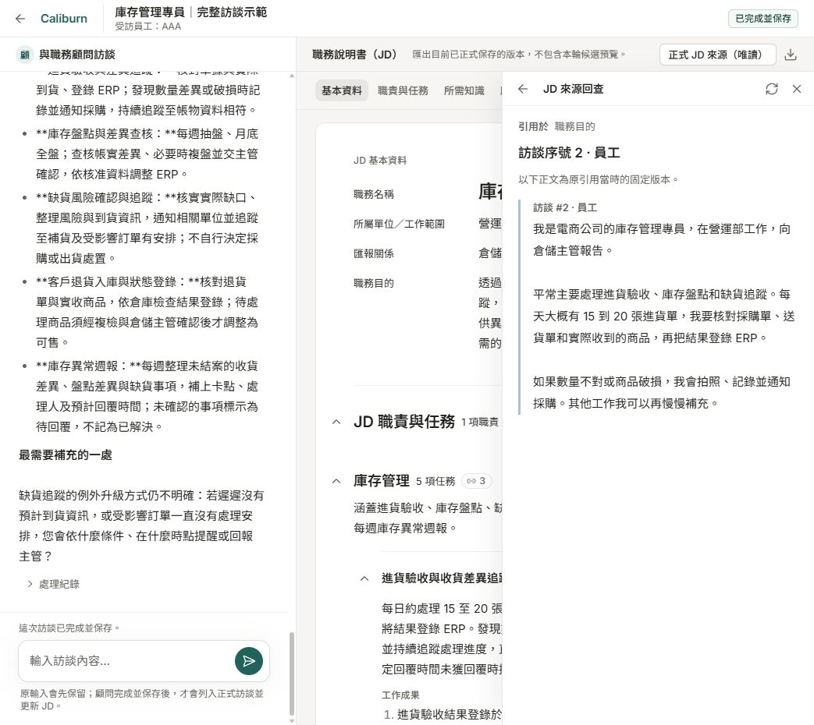

# Caliburn

**透過訪談理解工作，逐步寫成有依據的職務說明書。**

Caliburn 是本機 Web AI 職務分析工具。員工說明實際工作，AI 顧問依回答追問、釐清責任範圍，逐步整理成職務說明書（JD）。訪談與 JD 在同一個工作區，人可以補充、更正及編輯，員工不必先學會 JD 的專業寫法。

## 可以做什麼

- **訪談與釐清工作：**從員工實際做的事情出發，追問工作方式、成果、協作及責任範圍。
- **邊訪談、邊看 JD：**同頁查看訪談與文件；顧問處理時可預覽改動，完成後可人工補充、更正及編修。
- **延續長訪談：**背景整理已談過的工作情境與理解，供顧問按需讀取，接著分析。
- **回查內容依據：**JD 可引用訪談原話與整理結果；來源更新或人工改稿後，可查看差異及待核對項目。
- **接續未完成的工作：**支援訪談暫停、繼續、取消，以及已保存處理紀錄的回看。
- **管理多份職務檔案：**單一操作者可建立、選取及改名，各檔案的訪談與 JD 資料彼此隔離。
- **交付 PDF：**匯出目前正式 JD，之後仍可繼續訪談與修稿。

啟用公版參考後，顧問還可依實際工作查找職能標準，作為查漏線索。公版只提供參考，員工實際負責的工作仍以訪談確認為準。

## 使用流程

實際介面示例：左側進行訪談，右側查看 JD，並可展開來源回查。畫面內容為庫存管理示例。

1. **建立職務檔案。**為這份工作建立獨立的訪談與 JD。
2. **說明實際工作。**描述日常工作、案件或具體情境，依顧問追問補充細節。
3. **核對與編修。**查看整理出的 JD，回查依據；顧問處理完成後可人工修正。
4. **匯出目前成果。**下載正式 JD 的 PDF，需要時繼續訪談與改稿。

這個流程可以反覆進行，不限定訪談輪數，也不要求每輪都改稿。處理中的預覽不會直接取代正式稿，PDF 只匯出目前正式 JD。

## 開始使用

Caliburn 在本機啟動後，透過瀏覽器操作。AI 訪談需要 OpenAI API key；沒有 key 時，仍可人工編輯 JD，並在 PDF 資源設定完成後匯出。

安裝、設定與啟動步驟見[操作手冊](docs/runbook.md#快速開始)。

## 延伸閱讀

- [產品介紹](docs/product-introduction.md)：使用情境、需求與產品價值。
- [專題報告](docs/reports/project-report/report.md)：方法、實驗與成果。
- [系統架構報告](docs/reports/system-architecture/README.md)：程式分工、資料保存與分析接續。
- [文件導覽](docs/README.md)：開發、維護、研究與驗證資料。

## 授權

本專案自有程式與文件採 [MIT 授權](LICENSE)。第三方元件、字型、模型及外部資料依各自授權使用；後端第三方來源見[授權聲明](apps/api/THIRD_PARTY_NOTICES.md)。
