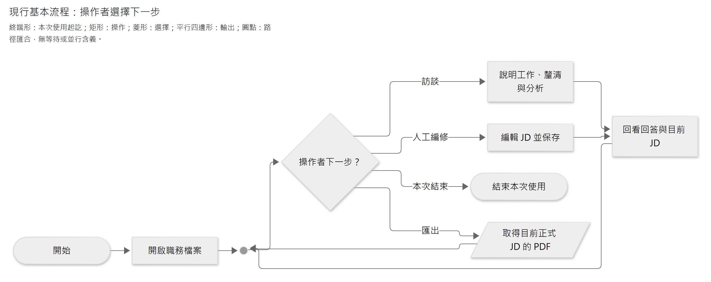

# Caliburn 架構導覽

Caliburn 透過持續訪談，把員工分散的工作資訊整理成有依據的職務說明書（JD）。本機 Web 工作區提供訪談與編輯，後端協調 AI 分析、業務規則及資料保存；背景 Memory 支援長訪談，來源關係讓人回查分析與 JD 的依據。

本頁先說明產品旅程，再分成五個架構主題。需求與使用情境見[產品介紹](../product-introduction.md)。現行狀態與目標調整沿[目前決策](../current-decisions.md)核對。

圖面在本文中閱讀；修改時由各圖旁的「圖源」連結進入獨立 Mermaid 檔。[圖源索引](../diagrams/README.md)集中提供查找與重繪方式。

## 第一次閱讀

先讀完本頁，再依序看[系統責任](system-boundaries.md)、[資料如何保存](persistence.md)及[互動與部署](delivery-and-operations.md)。這條路線先回答產品如何工作，再說明它怎麼運作；需要修改程式時，才進入[實作目錄](../implementation/README.md)。查單一功能可直接用下方索引，不必先讀歷史 ADR 或全部設計稿。

一份**職務檔案**是一組彼此隔離的訪談、JD、工作記憶及工作計畫。文中的 **A** 是與員工對話、分析並編修 JD 的顧問角色；**B1** 在背景整理具體工作情境，**B2** 再整理工作理解，兩者的成果共同形成 Memory。它們是 AI 分工名稱，不表示三個獨立服務。

| 讀到的名稱 | 先這樣理解；完整責任另見對應章節 |
|---|---|
| JD（Job Description） | 最後交付的職務說明書；由人與 A 共同編修 |
| Memory（工作記憶） | 根據正式訪談整理的員工工作情境與理解；不是聊天全文，也不是執行 checkpoint |
| Plan（工作計畫） | A 保存的焦點、工作方向及剩餘訪談／分析／JD 編修安排 |
| Changes（變更檢視） | 讓 A 查詢 JD 及其引用來源的變化；看見變更不代表認定改動正確 |
| Turn（一輪顧問工作） | 一次員工輸入所開啟的 A 工作，直到完成、取消或最終失敗；暫停後續作仍是同一輪 |
| Step（一次模型與工具步驟） | 一次模型回應及其要求的工具處理；一輪可能有多個 Step，Step 完成不等於 JD 正式提交 |
| 候選／正式資料 | 候選可暫存、預覽及恢復；通過共同完成邊界後，才成為後續工作可採用的正式結果 |

這些名稱的權限與彼此關係由[系統責任](system-boundaries.md)維護；保存、正式資格及恢復條件由[資料與交易](persistence.md)維護。

## 一眼看懂：操作者的主要流程

**現行基本流程圖：操作者選擇下一步。** 終端形為起訖，矩形為操作，菱形為選擇，平行四邊形為輸出；箭頭表示操作順序，依[基本流程圖規範](../implementation/documentation-standard.md#3-圖面種類與符號)。背景整理不列為訪談的前置步驟，此圖也不指定 Agent 的工作順序。

<!-- diagram: product-activities -->

[圖源](../diagrams/architecture/README/product-activities.mmd) · [SVG](../diagrams/architecture/README/product-activities.svg)

員工說明工作，顧問追問責任、條件與結果，資料足夠時逐步編修 JD。員工也能直接改稿，或繼續訪談補充、更正；流程不限定輪數，也不要求每輪都改稿。顧問可先引用有效原話，不必等背景 Memory 整理完成。PDF 匯出目前正式 JD，不包含候選修改。

## 從整體進到各主題

| 架構主題 | 這裡回答的問題 |
|---|---|
| [系統責任與資料流](system-boundaries.md) | 模組與 A／B1／B2 如何分工；Memory、Plan、Changes 與 JD 各負責什麼 |
| [資料保存與交易](persistence.md) | 正式資料、候選、不可變修訂與執行位置如何保存；提交及恢復如何核對 |
| [互動、部署與安全](delivery-and-operations.md) | 畫面、串流、PDF、本機服務及外部模型如何協作 |
| [設計取捨](design-decisions.md) | 為何選用這些機制，替代方案與代價是什麼；架構圖如何閱讀 |
| [驗證與限制](verification.md) | 用哪些反例檢驗行為，已有什麼證據，哪些效果仍未驗 |

### 依問題找圖與表

圖表放在負責解釋該問題的文件，不在入口再複製一份。第一次閱讀先選「整體」欄；只有需要處理細節時，才進入執行、資料表或測試文件。

| 想先弄懂的問題 | 整體圖表 | 深入時再讀 |
|---|---|---|
| 誰使用產品，哪些部分在本機、哪些在外部？ | [系統情境與容器](system-boundaries.md#2-app-拆開後有哪些責任)、[部署圖](delivery-and-operations.md#2-最小部署視角) | [靜態程式依賴](../implementation/code-organization.md#2-依賴方向與可檢查限制) |
| 一次員工回答如何成為 JD 的一部分？ | [單輪流程](../specs/2026-09-29-core-value-loop-lifecycle.md#正常閉環一則輸入如何變成可交付-jd-的一部分) | [模型與工具 Step](../implementation/agent-execution.md#46-有界多-step-接續) |
| 暫停、取消或中斷後怎麼辦？ | [執行狀態圖](../specs/2026-09-27-shared-agent-execution-and-state-design.md#控制與故障的狀態視圖)、[提交後恢復時序](persistence.md#4-重試取消與執行恢復) | [外送重試流程](../implementation/model-requests.md#5-單一外送重試責任) |
| 背景整理如何與下一輪訪談並行？ | [A／B1／B2 角色表](system-boundaries.md#3-ai-分析角色共用執行機制分別處理工作)、[並行時序](../specs/2026-09-29-core-value-loop-lifecycle.md#背景發布與下一輪訪談並行的代表時序) | [Memory 保存關係](../implementation/memory-storage.md#2-保存表示固定修訂而非資料庫舊列) |
| Plan 的本輪安排何時能供後輪接續？ | [Plan 採用流程](persistence.md#plan-從本輪候選到後輪可採用) | [Plan 工具及保存契約](../specs/jd-work-plan.md) |
| 內容、版本及引用如何連在一起？ | [資料責任與固定修訂](persistence.md#1-業務資料與執行資料) | [訪談 ER](../implementation/interview-storage.md#1-原文正式資格與執行身分分開不複製原話)、[JD ER](../implementation/jd-storage.md#2-固定修訂與目前正式頭)、[Memory ER](../implementation/memory-storage.md#21-固定物件修訂) |
| 如何知道畫面、模型與保存結果是否一致？ | [使用者操作表](delivery-and-operations.md#1-使用者看到的主要流程)、[診斷資料來源](delivery-and-operations.md#5-執行觀測與問題排查) | [SSE 時序](../implementation/interface-and-delivery.md#2-串流不是保存權威)、[驗證責任表](../implementation/verification-plan.md#1-分層測試不以-mock-冒充產品) |

產品細節由[設計與工具契約](../specs/README.md)維護。深層設計稿可能同時保留早期討論及現行補充；先依頁首狀態與本入口指向的章節閱讀，不把早期「候選」文字當成另一套現行能力。

## 架構與實作的維護分工

本目錄保留系統責任、資料權威、跨層生命週期與設計取捨。`implementation/` 記錄程式如何落實這些規則；`specs/` 維護詳細行為及工具契約。修改同一規則時只改其責任文件，其他層保留必要摘要與連結。

| 要改的內容 | 維護位置 | 另一層如何承接 |
|---|---|---|
| 模組責任、來源資格、候選與正式資料的界線 | 本目錄及連到的詳細契約 | 實作文件引用規則，說明負責模組與驗證方式 |
| SQL、schema、固定修訂的保存表示、程式組裝、恢復演算法 | [實作接線](../implementation/README.md) | 架構只交代保證與限制，不複寫表格、欄位或步驟 |
| 命名、撰寫、測試與文件繪圖規範 | [工程規範](../implementation/README.md) | 架構依規範呈現設計，不再訂第二套寫法 |
| 驗證結果、已知限制與原件 | [驗證範圍](verification.md)及其證據 | 實作驗證文件只維護測試責任及方法，不另抄通過清單 |
| 安裝、設定、命令及排錯操作 | [runbook](../runbook.md)與 App README | 架構說明運作邊界，實作說明接線，各自連到操作來源 |

## 閱讀時先分清三件事

- **分析與成果。** A 引導訪談並編修 JD；B1／B2 把正式訪談整理成工作情境與工作理解。Plan 保存 A 的工作安排，Changes 提供按需變更資訊，兩者各自獨立。責任與現行能力見[長任務元件分工](system-boundaries.md#21-長任務的元件分工)。
- **候選與正式資料。** 候選可保存、預覽與恢復，完成後才正式採用。A 每輪固定一版 Memory，背景發布不改變執行中的基準，JD 歷史依據也不自動換版。
- **執行紀錄與來源。** 模型輸出及工具結果支援接續推論；正式訪談才授予相應來源資格。取消輸入、中間訊息及推理摘要即使可回看，也不因此成為正式來源。看過差異也不等於已確認 JD 依據。

### 業務規則與交易機制

業務模組決定哪些結果必須一起成立，App 以短交易協調操作，PostgreSQL 保證原子提交與持久保存。LangGraph 保存執行位置；恢復仍須核對原業務結果。正式提交與恢復的詳細界線集中在[資料與交易](persistence.md)。

## 目前範圍與已知限制

現行產品使用 React／MUI、FastAPI、PostgreSQL、LangGraph 與 OpenAI Responses API，採本機模組化單體。Memory 為單向 B1 → B2 → 發布。App 可明示啟用獨立 RAG 的公版查讀；RAG 不成為預設啟動依賴。

現行輪前與輪中均採原生 compaction；輪前改用 App 文字摘要是[已確認但尚未實作的目標](../specs/2026-10-04-context-summary-and-compaction-design.md)，摘要 Prompt 待討論。Plan 工程與各一場比較已完成，尚未證明穩定品質增益；真人省時、學習負擔及部分長旅程分支仍未驗，詳見[驗證與限制](verification.md)。

專用全稿審核、原話語意搜尋與跨機還原尚未提供；其餘範圍及非目標由[系統責任](system-boundaries.md#1-核心閉環與範圍)維護。
