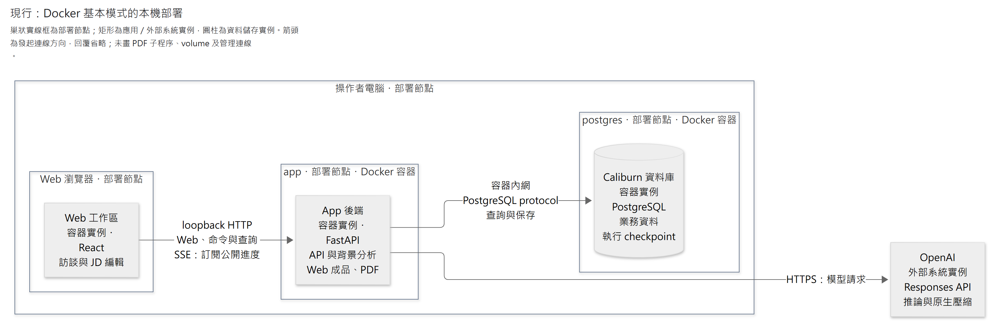
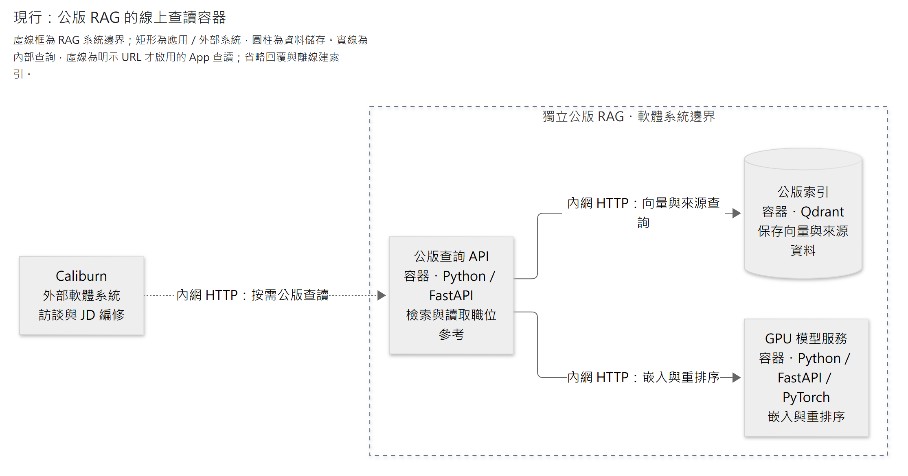

# 互動、部署、安全與日常運作

Caliburn 以本機 Web 提供訪談、JD 編輯與 PDF 匯出，後端管理模型執行、資料保存及中斷恢復。本章說明畫面如何反映正式結果、本機程序如何運作，以及工作資料與外部模型之間的信任邊界。

本頁說明現行程式的互動與運作邊界；已部署示範的版本另依操作紀錄核對。設定與指令由 App README 及操作手冊維護，效果與未覆蓋分支見[驗證範圍](verification.md)。

閱讀路徑：[使用者操作](#1-使用者看到的主要流程) → [部署](#2-最小部署視角) → [啟停與恢復](#3-啟動關閉與恢復) → [權限](#4-信任與權限邊界) → [查執行紀錄](#5-執行觀測與問題排查)。

## 1. 使用者看到的主要流程

| 場景 | 畫面與操作 | 結果邊界 |
|---|---|---|
| 建立職務檔案 | 可辨識的檔名與員工資料；已標示 App 出處的開場問題，正式訪談序號 1 | 不用先懂 JD；不把開場當員工提供的事實 |
| 正常訪談 | 原輸入保存狀態、公開進度與可讀推理摘要、即時候選 JD 預覽；顧問引導下一步 | 不把候選叫正式保存；中間訊息不當最終答覆 |
| A 暫停 | 顯示正在安全停下／已暫停，允許接續或取消 | 暫停不是完成；同檔案人工 JD 編輯與第二輸入仍禁止 |
| A 主動取消 | 取消處理完成後顯示已取消，撤去候選，原輸入可取回重送 | 不自動重送，不把取消輸入加入正式訪談／Memory |
| A 可恢復中斷 | 顯示中斷、核對原結果，從可靠位置接續同一 Turn | 不刷新原 Memory 基準、不重送已保存模型結果 |
| A 最終失敗 | 核對未完成並確認放棄後撤去候選；保留可見原輸入、安全原因及下一步，可重新送出為新 Turn | 不復活已放棄執行；不把其實已完成的結果誤報失敗 |
| A 成功 | 正式答覆與 JD 新稿保持一致，均可再次取得；展開答覆可看已保存的公開中間訊息與可讀推理摘要 | 不顯示不可讀的推理內容，公開中間訊息不混入正式訪談序列 |
| 人工改 JD | A 未活躍時可管理欄位；改動供後續 A 看差異 | 人寫的內容不是已核對工作事實，不自動改 Memory |
| 撤回已完成輪的 JD 改動 | 只撤 JD 效果，訪談及 Memory 保留 | 不同於取消未完成 Turn，不直接重置整份舊稿覆蓋後續修改 |
| 背景整理 | 簡短顯示整理中／整理尚未完成；訪談可繼續 | 不提供使用者取消、暫停、重跑或編輯 Memory 的入口 |
| 查來源與匯出 | 回看當時依據；隨時匯出目前正式 JD | 不稱已全稿審核，不把候選、姓名或整份 Memory 放進 PDF |

畫面依後端正式狀態呈現，操作互斥由後端檢查，不能只靠停用按鈕。串流斷線不代表使用者取消；重連時先查詢既有 Turn 與原結果，不自動建立新 Turn。沒有送達或已讀證據時，不能判定使用者已看過訊息。

### 畫面、API 與串流的狀態一致性

查詢提供可核對的業務與執行狀態，串流只加快顯示。接受請求、模型停止輸出、使用者看見文字，均不代表正式提交已完成。重連沿原 Turn 查回結果，不重新建立工作。

- **原命令與新提交分開。** 網路重送取回同一操作結果；取消後由使用者再次送出，才建立新 Turn。
- **未確認時保留限制。** 暫停與取消須先完成資格核對；完成若已先成立，就顯示原完成結果。未查明前不解鎖人工修改或另一 A，晚到控制也不能改寫完成狀態。
- **顯示跟隨所屬工作。** 過時事件不能覆蓋新工作；丟包後查回已保存內容，不保證補回未保存的片段。人工寫入與 PDF 都依後端的正式修訂處理。

現行用 SSE 傳遞公開進度與可讀推理摘要，每頁共用一條連線。已保存的內容可在完成後回看，查詢失敗與沒有內容須分開顯示；回看不重跑模型。摘要不等於原始內部推理，不進正式訪談或引用來源，B1／B2 的分析也不因此公開。傳輸格式、暫態與已保存內容的合併方式由[介面接線 §2](../implementation/interface-and-delivery.md#2-串流不是保存權威)維護。

**完成後撤回：** 現行只在整份正式 JD 仍是原輪採用的修訂時允許撤回；後續人工或 AI 已建立新修訂，即使只改其他欄位或文字已改回，也會拒絕，不作局部反向合併。它只撤回該輪 JD 效果，不撤回訪談、Memory 或壓縮，也不是 AI 工具。保存與重送機制由[JD 保存 §3.6](../implementation/jd-storage.md#36-完成後的-jd-條件撤回)維護。

## 2. 最小部署視角

**現行 C4 部署圖：操作者電腦上的 Docker 基本模式。** 圖依 [Compose 配置](../../compose.jd-app.yaml)，將應用與資料庫實例放入實際執行環境，視角依 [C4 deployment](https://c4model.com/diagrams/deployment)。圖例：巢狀實線外框為部署節點，矩形為標明種類的應用／外部系統實例，圓柱為資料儲存實例；實線箭頭是發起連線與請求的方向，標籤列用途及協定，回傳省略。C4 容器指應用或資料儲存，與外框標示的 Docker 容器不同。

<!-- diagram: local-deployment -->

[圖源](../diagrams/architecture/delivery-and-operations/local-deployment.mmd) · [SVG](../diagrams/architecture/delivery-and-operations/local-deployment.svg)

App 以 FastAPI 單程序同源提供建置後的 Web，內部協調 A 與背景 B Graph；PostgreSQL 是獨立資料庫程序。PDF 由 App 內受控的 Chromium 子程序產生，再經既有 HTTP 連線下載，沒有獨立 PDF 服務。原生啟動使用相同程式與責任，只是不包在圖中的 App Docker 容器內。圖省略 PDF 子程序、資料 volume、健康檢查及管理連線，完整部署設定仍以 Compose 與 [App README](../../apps/api/README.md)為準。

上圖為未啟用公版參考的最小部署。依 [公版明示接線](rag-pipeline.md)，App 可在明示配置 URL 後透過 HTTP 使用獨立 RAG；基本模式不啟動 RAG，App 程序也不管理容器。設定只影響尚未綁定的新請求，執行中的工作仍沿原工具與格式恢復。啟用方式見 [API README](../../apps/api/README.md#公版參考工具的可選啟用)，程序操作見 [runbook](../operations/rag.md#獨立-rag-開發)。

可原生啟動，也可用 `compose.jd-app.yaml`：一個 App 容器加一個 PostgreSQL 容器及資料 volume。兩者使用同一份程式、契約與持久資料機制，不是兩套產品。Docker 包含 PDF 瀏覽器與中文字型，主機入口只綁 loopback；既有資料不自動搬入。建置、安全與停止邊界見[交付接線 §4.2](../implementation/interface-and-delivery.md#42-docker-交付)，啟動與 DataGrip 設定見 [runbook](../operations/README.md#docker-操作)。

需要公版參考時，在基本配置上加上 `compose.jd-app.rag.yaml`，於同一 project 啟動查詢 API、Qdrant 與 GPU 模型服務。各服務保持獨立；App 只在需要時透過 HTTP 查詢，不直接載入檢索套件或模型權重。

**現行 C4 容器圖：獨立公版 RAG 的查讀範圍。** 外框界定 RAG 軟體系統，Caliburn 是相對於它的外部系統；框內各容器是可執行應用或資料儲存，列出技術與責任。圖例：矩形為應用／軟體系統，圓柱為資料儲存，虛線外框為系統邊界；實線箭頭為請求方向，虛線箭頭為明示 URL 才啟用的查讀，回傳省略。視角依 [C4 container](https://c4model.com/diagrams/container)，只畫線上查詢，省略離線建索引；部署位置沿上述 Compose 配置。

[圖源](../diagrams/architecture/delivery-and-operations/rag-containers.mmd) · [SVG](../diagrams/architecture/delivery-and-operations/rag-containers.svg)

兩種模式共用原 App 與資料庫，不建立副本。OpenAI key 只注入 App，RAG 不發布主機埠。索引由操作者一次性建立，啟動服務不會解析來源、建索引或清資料。App 的基本功能不必等待 RAG；公版查詢故障會回報錯誤，不當成沒有候選。切回基本模式須先讓已使用公版工具的工作完成，再於安全點改配置，避免執行中的工作失去依賴。操作與驗證範圍見[公版 Docker 模式](../operations/rag.md#含公版參考的-docker-模式)。

多頁籤操作及同一檔案的重複提交，由後端檢查執行資格。同一操作者可管理多份檔案，各檔案的資料保持隔離；全域資源上限只限制執行量，不將不同職務檔案合併成同一模型對話。未來若需多個後端程序，須再驗證資料庫中的執行資格與重入機制，不能以程序內的鎖定保證跨程序安全。

## 3. 啟動、關閉與恢復

1. 啟動先核對設定與依賴、資料庫連線及 schema 相容性；不自動清 volume、重建 DB 或轉換舊資料。
2. 服務可用後核對未完成 A／Memory、原業務結果及已有 checkpoint；不能看到 `running` 就盲目重送模型。
3. A 提供已保存狀態與續作選項；Memory 由系統按有界策略恢復，不要求員工管理背景工作。
4. 正常關閉先停止新准入，嘗試保存已取得結果並停止在可恢復邊界；強制關閉仍依最後可靠位置恢復，不承諾完成所有在途請求。
5. 啟動時發現正式結果已提交，就回補執行／畫面，不再生成另一份結果。

**現行恢復限制：** 資料庫伺服器重啟後須重啟 App；單一 leader 的現行實作不會自動重連。Memory 最終失敗後，正式訪談再前進三輪才允許一次新批次，此政策仍待產品決策確認，且尚無真長旅程自然觸發的證據。相關限制見 [正式產品與選型](design-decisions.md)及[驗證範圍](verification.md)。

外部 API 或資料庫不可用時，未保存的結果不能視為完成。故障分類、重試時機與執行上限由[共用執行與恢復](../implementation/agent-execution.md)處理；產品不以預估金額攔截正常執行。

## 4. 信任與權限邊界

- 檔案範圍、Memory 讀取基準、工具權限及操作身分由 App 綁定，服務每次驗證。UUID 難猜、標題唯一或模型願意遵守 prompt 都不是權限控制。
- 模型工具只暴露角色所需能力：B1 不讀理解，B2 不寫情境，A 不寫 Memory；候選不能透過普通 A 讀取入口外露。
- 訪談、Memory、JD、diff、工具回傳中的文字一律作資料，不能改系統指令或准入權限。起始 App 參考資料用 user role；原生 function output 保持其協定型別，不改造成 system 訊息。
- 本機也需明確限制 listen address／允許來源；依 HTTP 使用方式保護跨站請求與串流。不因只有一名操作者就開放網路匿名修改，也不為此建企業登入平台。
- API key 僅供後端使用，不進 prompt、模型工具、Web bundle、URL、提交或一般 log；取用與保存使用平台適合的秘密保存方式，不自造加密演算法。
- 訪談與 JD 可能含個人／企業資訊。只有模型處理所需資料按核准設定送供應商，外送目的與範圍有紀錄；`store=false` 不代表供應商的所有資料保留與稽核都為零。

安全設計參考：[OWASP prompt injection prevention](https://cheatsheetseries.owasp.org/cheatsheets/LLM_Prompt_Injection_Prevention_Cheat_Sheet.html)、[secrets management](https://cheatsheetseries.owasp.org/cheatsheets/Secrets_Management_Cheat_Sheet.html)。這些支持最小權限、資料／指令區分與秘密管理；本產品角色矩陣是 Caliburn 取捨。拒絕路徑的實測範圍見[反例矩陣](verification.md)。

## 5. 執行觀測與問題排查

真人操作後，應能按職務檔案及訪談輪次定位當時的 Context、Memory／Plan 綁定、工具參數與結果，以及正式成品。讀取歷史時沿原請求及固定資料位置，不以今天的 Memory head 解釋過去的選問。

一般 Log 提供事件、階段與關聯識別，不寫訪談正文、工具全文、密鑰或不可讀推理。需要查敏感正文時，由操作者明示擷取原始 checkpoint，產生可重建的本機診斷副本，再與業務結果交叉查看。副本不持續雙寫，不參與執行恢復或業務完成判定。

| 查閱資料 | 來源與產生責任 | 用途與限制 |
|---|---|---|
| 原始 checkpoint | 框架保存模型請求、工具往返及固定綁定 | 執行恢復使用原件；操作者須明示擷取敏感明細 |
| 本機診斷副本 | 診斷工具由原始 checkpoint 擷取，可依原件重建 | 提供模型與工具明細；不作恢復來源或完成判定 |
| 業務資料 | 對應業務模組保存職務檔案、正式結果與修訂 | 提供同一工作的正式效果，與執行紀錄交叉核對 |
| 唯讀查閱投影 | 以原 execution 關聯診斷副本與業務結果 | 操作者在本機透過 CLI／DataGrip 查閱；含敏感正文 |
| 一般 Log | 執行流程記錄安全事件、階段及關聯識別 | 透過 Log 輸出排查；不帶正文，與敏感診斷分開 |

| 要了解的問題 | 責任文件 |
|---|---|
| 程式如何記錄事件、工具及可比較證據 | [觀測與 Log 規範](../standards/coding-standard.md#71-讓執行證據可查可比較可驗證) |
| 診斷讀取、遮蔽及副本由誰負責 | [程式組織](../standards/code-organization.md#1-目錄依業務責任組織機制集中在少數邊界) |
| 如何依原工作查 Context、工具及綁定 | [本機診斷操作](../operations/README.md#在-datagrip-查某個職務檔案的-ai-執行紀錄) |
| 如何驗證工程反例 | [驗證責任與測試入口](../implementation/verification-plan.md) |

現行尚未導入獨立 metrics／trace 平台。後續可依診斷、測試與維護收益比較現成方案，仍須保留正式資料權威、失敗處理及敏感內容的存取／外送界線；選型不等於已接入。

## 6. 產品範圍與成效評估

核心使用旅程為：**建檔／開場 → 訪談 → 有據改稿 → 保存與中斷接續 → Memory 發布 → 下一輪使用 → PDF** 。這是代表性路徑，Memory 不必每輪發布，PDF 也可在需要時匯出目前正式稿。

取消競爭、來源換版、人工修改及長訪談涉及不同層級的證據，詳見[驗證範圍](verification.md)；專用全稿審核、原話搜尋、跨機備份、事件平台及遠端公開部署不在現行範圍。

產品價值驗證看「員工能否只靠訪談得到涵蓋主要工作的精簡、高訊號 JD」及成本／時間，不以模型步數多、Memory 資料多或功能數量多代表成功。商業價格、客群規模及獲客成效仍待獨立驗證。

延伸閱讀：[系統邊界](system-boundaries.md)、[後端說明](../../apps/api/README.md)、[Web 說明](../../apps/web/README.md)及[操作手冊](../operations/README.md)。
