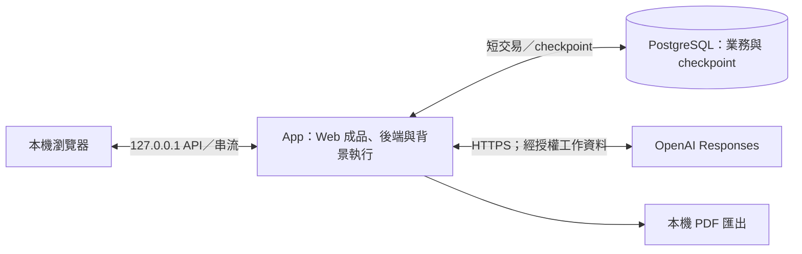
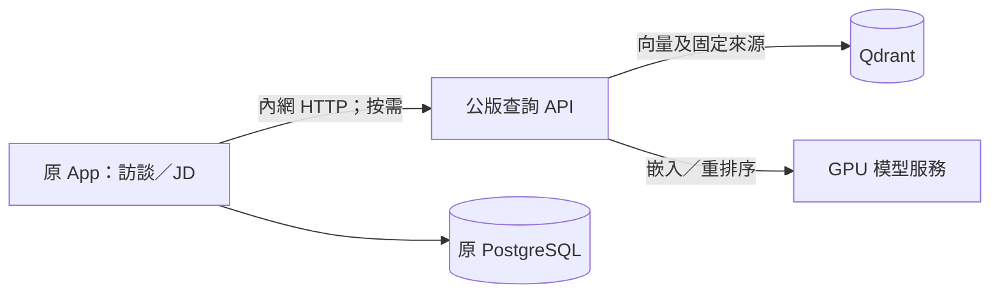

# 互動、部署、安全與日常運作

Caliburn 以本機 Web 提供訪談、JD 編輯與 PDF 匯出，後端管理模型執行、資料保存及中斷恢復。本章說明畫面如何反映正式結果、本機程序如何運作，以及工作資料與外部模型之間的信任邊界。

核心機制以截至 2026-10-03 的產品為基礎，後續公版可選接線另列於部署說明。具體設定與操作指令由 App README 及操作手冊維護；分析品質、真人使用效果與未覆蓋分支的證據見[驗證範圍](verification.md)及[實驗發現的問題](../reports/experiment-findings.md)，不能由功能存在推定效果達標。

## 1. 使用者看到的主要流程

| 場景 | 畫面與操作 | 結果邊界 |
|---|---|---|
| 建立職務檔案 | 可辨識的檔名與員工資料；已標示 App 出處的開場問題，正式訪談序號 1 | 不用先懂 JD；不把開場當員工提供的事實 |
| 正常訪談 | 原輸入保存狀態、公開進度與可讀推理摘要、即時候選 JD 預覽；顧問引導下一步 | 不把候選叫正式保存；中間訊息不當最終答覆 |
| A 暫停 | 顯示正在安全停下／已暫停，允許接續或取消 | 暫停不是完成；同檔案人工 JD 編輯與第二輸入仍禁止 |
| A 主動取消 | 取消處理完成後顯示已取消，撤去候選，原輸入可取回重送 | 不自動重送，不把取消輸入加入正式訪談／Memory |
| A 可恢復中斷 | 顯示中斷、核對原結果，從可靠位置接續同一 Turn | 不刷新原 Memory 基準、不重送已保存模型結果 |
| A 最終失敗 | 核對未完成並確認放棄後撤去候選；保留可見原輸入、安全原因及下一步，可重新送出為新 Turn | 不復活已放棄執行；不把其實已完成的結果誤報失敗 |
| A 成功 | 正式答覆與 JD 新稿保持一致，均可再次取得；展開答覆可看已保存的公開中間訊息與可讀推理摘要 | 不顯示不可讀的推理內容，公開中間訊息不混入正式訪談序列 |
| 人工改 JD | A 未活躍時可管理欄位；改動供後續 A 看差異 | 人寫的內容不是已核對工作事實，不自動改 Memory |
| 撤回已完成輪的 JD 改動 | 只撤 JD 效果，訪談及 Memory 保留 | 不同於取消未完成 Turn，不直接重置整份舊稿覆蓋後續修改 |
| 背景整理 | 簡短顯示整理中／整理尚未完成；訪談可繼續 | 不提供使用者取消、暫停、重跑或編輯 Memory 的入口 |
| 查來源與匯出 | 回看當時依據；隨時匯出目前正式 JD | 不稱已全稿審核，不把候選、姓名或整份 Memory 放進 PDF |

畫面依後端正式狀態呈現，操作互斥由後端檢查，不能只靠停用按鈕。串流斷線不代表使用者取消；重連時先查詢既有 Turn 與原結果，不自動建立新 Turn。沒有送達或已讀證據時，不能判定使用者已看過訊息。

### 畫面、API 與串流的狀態一致性

查詢回傳目前可核對的業務與執行狀態，串流用於加快顯示，不另行判定正式結果。API 接受請求、模型停止輸出或使用者看見文字，都不代表正式提交已完成。模型工具與 Web 各有不同的呈現介面，不因 UI 需要詳細狀態，就將大量狀態放進模型工具的回傳內容。

| 互動 | 接受後的可觀察結果 | 重連／重送／競爭 |
|---|---|---|
| 送出原文 | 以本次提交身分確認「已保存、待處理／處理中」；尚無正式訪談序號 | 網路重送沿原提交取結果。取消後點重試才是新的提交，不能共用已取消的工作身分 |
| 暫停／續作 | 接受意圖後可顯示停妥前的過渡狀態；續作承接原工作 | 重複同一控制要求不建立新工作；晚到暫停不能把已完成結果改成暫停 |
| 取消 | 先顯示處理中，後端核對資格及遲到效果後才顯示已取消 | 完成若先成立則顯示正式完成；未查明不解鎖人工修改或新 A |
| 接收進度與候選 | 增量附帶所屬工作／位置，顯示公開中間文字與目前合法候選 | 丟包可直接重新查目前狀態與已保存訊息，不要求逐封包補播。遲到的舊工作事件不得覆蓋新工作畫面 |
| 正式完成 | 以原完成結果取得完整答覆與正式 JD；可展開已保存公開訊息 | UI 斷線後讀同一結果，不再生成另一則 final；未保存片段不假裝已恢復 |
| 人工 JD 寫入／PDF | 寫入遵循 JD 業務；PDF 固定當下正式修訂 | 鎖定檢查在後端，版本不符不盲蓋；匯出期間候選／新版發布不改變同一份輸出 |

現行介面採伺服器事件串流（SSE），搭配查詢與命令 API；跨語言格式由同一契約來源生成。每個頁面共用一條進度連線，不為每個 Step 或工具另開串流。[MDN SSE 說明](https://developer.mozilla.org/en-US/docs/Web/API/Server-sent_events/Using_server-sent_events)介紹單向事件與重連機制；但重連不保證所有業務事件都已保留，因此仍須查詢正式狀態。

中間文字僅顯示 API 公開訊息，不展示不可讀的推理內容，也不要求模型揭露內部推理。若提供工具活動資訊，僅顯示可安全公開的名稱與進度摘要，不展示金鑰或完整敏感參數。HTTP 路徑、事件型別及重連細節見[介面設計](../implementation/interface-and-delivery.md)。

**完成後撤回的條件：** App 依原輪操作的前後差異產生反向修改，只有受影響內容與關係仍符合安全撤回條件時，才一次採用全部修改。若人或 AI 後來已修改同一部分，則回報衝突，不覆蓋後續內容；不提供自動合併或任意還原歷史版本。撤回功能不作為 AI 工具，也不撤回正式訪談、獨立的 Memory 或上下文壓縮。

**可讀推理摘要：** 現行 API 與 Web 已接入顧問 A 的 reasoning summary。推理摘要與公開進度分開呈現，共用一條活動串流；畫面區分尚未保存的即時片段與已保存內容，完成後可從歷史回答的「處理紀錄」按需回看。查詢失敗與沒有摘要是不同狀態，回看不需重跑模型，未保存片段不承諾恢復。

摘要不是原始內部推理，也不進正式訪談或引用來源。原生 reasoning item 仍完整用於模型接續，不抽出摘要重複塞入 Context；B1／B2 不因此公開分析。契約、保存與已驗／未驗範圍見[介面接線 §2.1](../implementation/interface-and-delivery.md#21-推理摘要串流與歷史回看)。

## 2. 最小部署視角

現行部署採 FastAPI 單程序，同源提供建置後的 Web，內部處理 A 與背景 B Graph。PostgreSQL 為獨立資料庫程序。依賴鎖定受支援的穩定版本；OpenAI SDK／LangGraph／checkpointer 的相容版本與原生 API 測試結果界定這組依賴的已知適用範圍。

上圖為未啟用公版參考的最小部署。依 [ADR0080](../adr/0080-opt-in-public-reference-agent-tools.md)，App 可在明示配置 URL 後透過 HTTP 使用獨立 RAG；基本模式不啟動 RAG，App 程序也不管理容器。設定只影響尚未綁定的新請求，執行中的工作仍沿原工具與格式恢復。啟用方式見 [API README](../../apps/api/README.md#公版參考工具的可選啟用)，程序操作見 [runbook](../runbook.md#rag獨立服務非-jd-app-預設依賴)。

可原生啟動，也可用 `compose.jd-app.yaml`：一個 App 容器加一個 PostgreSQL 容器及資料 volume。兩者使用同一份程式、契約與持久資料機制，不是兩套產品。Docker 包含 PDF 瀏覽器與中文字型，主機入口只綁 loopback；既有資料不自動搬入。建置、安全與停止邊界見[交付接線 §4.2](../implementation/interface-and-delivery.md#42-docker-交付)，啟動與 DataGrip 設定見 [runbook](../runbook.md#docker-操作)。

需要公版參考時，在基本配置上加上 `compose.jd-app.rag.yaml`，於同一 project 啟動查詢 API、Qdrant 與 GPU 模型服務。各服務保持獨立；App 只在需要時透過 HTTP 查詢，不直接載入檢索套件或模型權重。

兩種模式共用原 App 與資料庫，不建立副本。OpenAI key 只注入 App，RAG 不發布主機埠。索引由操作者一次性建立，啟動服務不會解析來源、建索引或清資料。App 的基本功能不必等待 RAG；公版查詢故障會回報錯誤，不當成沒有候選。切回基本模式須先讓已使用公版工具的工作完成，再於安全點改配置，避免執行中的工作失去依賴。操作與驗證範圍見[公版 Docker 模式](../runbook.md#含公版參考的-docker-模式)。

多頁籤操作及同一檔案的重複提交，由後端檢查執行資格。同一操作者可管理多份檔案，各檔案的資料保持隔離；全域資源上限只限制執行量，不將不同職務檔案合併成同一模型對話。未來若需多個後端程序，須再驗證資料庫中的執行資格與重入機制，不能以程序內的鎖定保證跨程序安全。

## 3. 啟動、關閉與恢復

1. 啟動先核對設定與依賴、資料庫連線及 schema 相容性；不自動清 volume、重建 DB 或轉換舊資料。
2. 服務可用後核對未完成 A／Memory、原業務結果及已有 checkpoint；不能看到 `running` 就盲目重送模型。
3. A 提供已保存狀態與續作選項；Memory 由系統按有界策略恢復，不要求員工管理背景工作。
4. 正常關閉先停止新准入，嘗試保存已取得結果並停止在可恢復邊界；強制關閉仍依最後可靠位置恢復，不承諾完成所有在途請求。
5. 啟動時發現正式結果已提交，就回補執行／畫面，不再生成另一份結果。

**現行恢復限制：** 資料庫伺服器重啟後須重啟 App；單一 leader 的現行實作不會自動重連。Memory 最終失敗後，正式訪談再前進三輪才允許一次新批次，此政策仍待產品決策確認，且尚無真長旅程自然觸發的證據。相關限制見 [ADR0079](../adr/0079-target-rebuild-production-cutover.md)及[驗證範圍](verification.md)。

外部 API 或資料庫不可用時，未保存的結果不能視為完成。故障分類、重試時機與執行上限由[共用執行機制](../specs/2026-09-27-shared-agent-execution-and-state-design.md)處理；產品不以預估金額攔截正常執行。

## 4. 信任與權限邊界

- 檔案範圍、Memory 讀取基準、工具權限及操作身分由 App 綁定，服務每次驗證。UUID 難猜、標題唯一或模型願意遵守 prompt 都不是權限控制。
- 模型工具只暴露角色所需能力：B1 不讀理解，B2 不寫情境，A 不寫 Memory；候選不能透過普通 A 讀取入口外露。
- 訪談、Memory、JD、diff、工具回傳中的文字一律作資料，不能改系統指令或准入權限。起始 App 參考資料用 user role；原生 function output 保持其協定型別，不改造成 system 訊息。
- 本機也需明確限制 listen address／允許來源；依 HTTP 使用方式保護跨站請求與串流。不因只有一名操作者就開放網路匿名修改，也不為此建企業登入平台。
- API key 僅供後端使用，不進 prompt、模型工具、Web bundle、URL、提交或一般 log；取用與保存使用平台適合的秘密保存方式，不自造加密演算法。
- 訪談與 JD 可能含個人／企業資訊。只有模型處理所需資料按核准設定送供應商，外送目的與範圍有紀錄；`store=false` 不代表供應商的所有資料保留與稽核都為零。

安全設計參考：[OWASP prompt injection prevention](https://cheatsheetseries.owasp.org/cheatsheets/LLM_Prompt_Injection_Prevention_Cheat_Sheet.html)、[secrets management](https://cheatsheetseries.owasp.org/cheatsheets/Secrets_Management_Cheat_Sheet.html)。這些支持最小權限、資料／指令區分與秘密管理；本產品角色矩陣是 Caliburn 取捨。拒絕路徑的實測範圍見[反例矩陣](verification.md)及其證據。

## 5. 執行觀測與問題排查

結構化紀錄須能關聯職務檔案、Turn／批次、Step、模型請求、原業務操作與結果；敏感正文及不可讀的推理內容不寫入一般紀錄。量測模型耗時與用量、工具呼叫次數、壓縮次數、恢復次數、候選大小及最終成果，作為改善長訪談的依據。

UI 進度從既有 State 與業務結果讀取。診斷資料保留技術原因供問題排查，畫面則顯示可安全公開的資訊與下一步操作。現行系統使用這些紀錄與查詢，不另設獨立的監控平台。

本機排查可按職務檔案／執行身分，將既有原生 checkpoint 解碼到可重建的診斷副本，再用資料庫 VIEW 串起模型輸入、輸出、工具及正式結果。這是操作者明示啟動的敏感資料查閱，不是一般日誌，不持續雙寫，也不成為產品恢復或業務權威；原始保存仍由既有機制負責。擷取時間、未知結果與遮蔽界線見 [runbook](../runbook.md#在-datagrip-查某個職務檔案的-ai-執行紀錄)。

## 6. 產品範圍與成效評估

核心使用旅程為：**建檔／開場 → 訪談 → 有據改稿 → 保存與中斷接續 → Memory 發布 → 下一輪使用 → PDF** 。這是代表性路徑，Memory 不必每輪發布，PDF 也可在需要時匯出目前正式稿。

取消競爭、來源換版、人工修改及長訪談涉及不同層級的證據，詳見[驗證範圍](verification.md)；專用全稿審核、原話搜尋、跨機備份、事件平台及遠端公開部署不在現行範圍。

產品價值驗證看「員工能否只靠訪談得到涵蓋主要工作的精簡、高訊號 JD」及成本／時間，不以模型步數多、Memory 資料多或功能數量多代表成功。商業價格、客群規模及獲客成效仍待獨立驗證。

延伸閱讀：[系統邊界](system-boundaries.md)、[後端說明](../../apps/api/README.md)、[Web 說明](../../apps/web/README.md)及[操作手冊](../runbook.md)。
