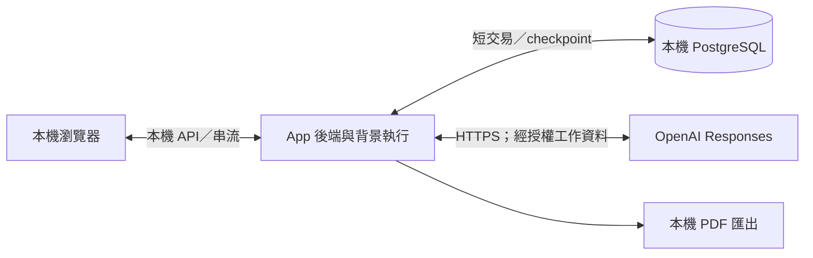

# 互動、部署、安全與日常運作

- 狀態：**目標設計／未實作、未驗收**；2026-09-29。已確認使用者效果引用產品文件；部署與保護接線是工程建議。
- **實作與驗證進度（2026-10-02）：**已依本設計施工，T01–T18 已依各任務的驗收層級完成，逐項效果的實測判定與限制見 [T17 V01–V28 對照](../plans/2026-09-29-target-rebuild/evidence/t17-v01-v28-closure.md)、實驗發現的問題見[實驗發現的問題彙整](../reports/experiment-findings.md)；production 切換（T18）已於 2026-10-02 由 Owner 放行並完成（[ADR0079](../adr/0079-target-rebuild-production-cutover.md)）。上方「未實作、未驗收」是 2026-09-29 撰寫當時的狀態，保留作沿革，不是現況。
- 維護者：App 交付維護者；上層：[系統責任](system-boundaries.md)。本頁不是現行啟停指令；現行操作仍見[runbook](../runbook.md)。

## 1. 使用者看到的主要流程

| 場景 | 必須看到／能做 | 不應暗示什麼 |
|---|---|---|
| 建立職務檔案 | 可辨識的檔名與員工資料；已標示 App 出處的開場問題，正式訪談序號 1 | 不用先懂 JD；不把開場當員工提供的事實 |
| 正常訪談 | 原輸入保存狀態、公開進度、即時候選 JD 預覽；顧問引導下一步 | 不把候選叫正式保存；中間訊息不當最終答覆 |
| A 暫停 | 顯示正在安全停下／已暫停，允許接續或取消 | 暫停不是完成；同檔案人工 JD 編輯與第二輸入仍禁止 |
| A 主動取消 | 收斂後顯示已取消，候選撤去，原輸入可取回重送 | 不自動重送，不把取消輸入加入正式訪談／Memory |
| A 可恢復中斷 | 顯示中斷、核對原結果，從可靠位置接續同一 Turn | 不刷新原 Memory 基準、不重送已保存模型結果 |
| A 最終失敗 | 核對未完成並確認放棄後撤去候選；保留可見原輸入、安全原因及下一步，可重新送出為新 Turn | 不復活已放棄執行；不把其實已完成的結果誤報失敗 |
| A 成功 | 正式答覆與 JD 新稿一致可重取；展開答覆可看已保存公開中間訊息 | 不顯示 opaque reasoning，不混入正式訪談序列 |
| 人工改 JD | A 未活躍時可管理欄位；改動供後續 A 看差異 | 人寫的內容不是已核對工作事實，不自動改 Memory |
| 撤回已完成輪的 JD 改動 | 只撤 JD 效果，訪談及 Memory 保留 | 不同於取消未完成 Turn，不直接重置整份舊稿覆蓋後續修改 |
| 背景整理 | 簡短顯示整理中／整理尚未完成；訪談可繼續 | 不提供使用者取消、暫停、重跑或編輯 Memory 的入口 |
| 查來源與匯出 | 回看當時依據；隨時匯出目前正式 JD | 不稱已全稿審核，不把候選、姓名或整份 Memory 放進首版 PDF |

畫面是後端正式狀態的投影，不靠 disabled button 保證互斥。串流連線中斷不等於使用者取消；重連先查既有 Turn／原結果，不默默開新 Turn。沒有送達／已讀證據時不宣稱使用者已看過。

### 畫面、API 與串流的最小交接契約

**工程設計／未實作：**查詢回傳目前可核對的業務／執行狀態，串流只加速顯示，不是另一份權威。API 接受、模型停止輸出、使用者看到字串，都不等於正式提交。模型 tool 的精簡回傳與 Web 呈現是不同介面，不為 UI 把大量狀態塞回 LLM。

| 互動 | 接受後的可觀察結果 | 重連／重送／競爭 |
|---|---|---|
| 送出原文 | 以本次提交身分確認「已保存、待處理／處理中」；尚無正式訪談序號 | 網路重送沿原提交取結果。取消後點重試才是新的提交，不能共用已取消的工作身分 |
| 暫停／續作 | 接受意圖後可顯示停妥前的過渡狀態；續作承接原工作 | 重複同一控制要求不建立新工作；晚到暫停不能把已完成結果改成暫停 |
| 取消 | 先顯示處理中，後端核對資格及遲到效果後才顯示已取消 | 完成若先成立則顯示正式完成；未查明不解鎖人工修改或新 A |
| 接收進度與候選 | 增量附帶所屬工作／位置，顯示公開中間文字與目前合法候選 | 丟包可直接重新查目前狀態與已保存訊息，不要求逐封包補播。遲到的舊工作事件不得覆蓋新工作畫面 |
| 正式完成 | 以原完成結果取得完整答覆與正式 JD；可展開已保存公開訊息 | UI 斷線後讀同一結果，不再生成另一則 final；未保存片段不假裝已恢復 |
| 人工 JD 寫入／PDF | 寫入遵循 JD 業務；PDF 固定當下正式修訂 | 鎖定檢查在後端，版本不符不盲蓋；匯出期間候選／新版發布不改變同一份輸出 |

傳輸首選伺服器事件串流（SSE）加普通查詢／命令 API，先不引入雙向訊息平台；HTTP 路徑、事件型別與斷線退避由實作契約從本表生成。[MDN SSE 說明](https://developer.mozilla.org/en-US/docs/Web/API/Server-sent_events/Using_server-sent_events)提供單向事件與重連機制；重連本身不保證業務事件全保留，因此仍查正式狀態。每個頁面重用一條進度連線，不為每 Step／工具另開串流。中間文字只顯示 API 公開訊息，不展示不可讀 reasoning 或要求模型揭露內部推理。工具活動若提供，僅顯示安全的名稱／進度摘要，不展示金鑰或完整敏感參數。

**完成後撤回的最小工程建議：**App 依原輪操作的前後差異形成條件式反向修改；僅當受影響內容／關係仍符合可安全撤回條件才一次採用。若後續人或 AI 已改同一部分，回報衝突、不覆蓋；不加自動 merge 或任意歷史時間旅行。這不是 Agent 工具，也不撤回正式訪談、獨立 Memory 或 compaction。若要允許覆蓋後續修改，才另請 Owner 裁決。

## 2. 最小部署視角

首版建議一個後端部署單位，內部可非阻塞地處理 A 與背景 B Graph；不是每 Agent 一個進程。PostgreSQL 是獨立資料庫程序，容器或本機安裝由實作者依支援環境選擇；不複製舊架構部署。正式依賴鎖定受支援的穩定版本，記錄 OpenAI SDK／LangGraph／checkpointer 的相容版本與原生 API 測試結果。

多頁籤、同檔案重複提交由後端准入保護；同一操作者多檔案可管理，不混合資料。全域資源數量只是有界執行配置，不因此把不同職務檔案合成同一模型 thread。若未來需多後端程序，再驗證資料庫執行資格與重入，不能把 process-local lock 當跨程序保證。

## 3. 啟動、關閉與恢復

1. 啟動先核對設定與依賴、資料庫連線及 schema 相容性；不自動清 volume、重建 DB 或轉換舊資料。
2. 服務可用後核對未完成 A／Memory、原業務結果及已有 checkpoint；不能看到 `running` 就盲目重送模型。
3. A 提供已保存狀態與續作選項；Memory 由系統按有界策略恢復，不要求員工管理背景工作。
4. 正常關閉先停止新准入，嘗試保存已取得結果並停止在可恢復邊界；強制關閉仍依最後可靠位置恢復，不承諾完成所有在途請求。
5. 啟動時發現正式結果已提交，就回補執行／畫面，不再生成另一份結果。

外部 API 及 DB 不可用時，不以未保存結果宣稱完成。故障分類、重試時機與成本界線詳見[共用執行](../specs/2026-09-27-shared-agent-execution-and-state-design.md)；本頁不另維護 retry engine。

## 4. 信任與權限邊界

- 檔案範圍、Memory 讀取基準、工具權限及操作身分由 App 綁定，服務每次驗證。UUID 難猜、標題唯一或模型願意遵守 prompt 都不是權限控制。
- 模型工具只暴露角色所需能力：B1 不讀理解，B2 不寫情境，A 不寫 Memory；候選不能透過普通 A 讀取入口外露。
- 訪談、Memory、JD、diff、工具回傳中的文字一律作資料，不能改系統指令或准入權限。起始 App 參考資料用 user role；原生 function output 保持其協定型別，不改造成 system 訊息。
- 本機也需明確限制 listen address／允許來源；依 HTTP 使用方式保護跨站請求與串流。首版不因只有一名操作者就開放網路匿名修改，也不為此建企業登入平台。
- API key 僅供後端使用，不進 prompt、模型工具、Web bundle、URL、提交或一般 log；取用與保存使用平台適合的秘密保存方式，不自造加密演算法。
- 訪談與 JD 可能含個人／企業資訊。只有任務必要資料按核准設定送供應商，記錄外送目的／範圍；不把 `store=false` 寫成所有供應商保留與稽核都為零。

安全研究參考：[OWASP prompt injection prevention](https://cheatsheetseries.owasp.org/cheatsheets/LLM_Prompt_Injection_Prevention_Cheat_Sheet.html)、[secrets management](https://cheatsheetseries.owasp.org/cheatsheets/Secrets_Management_Cheat_Sheet.html)。這些支持最小權限、資料／指令區分與秘密管理；本產品角色矩陣是 Caliburn 取捨。施工前核對當前官方契約並測拒絕路徑。

## 5. 必要觀測，不先造監控平台

結構化紀錄只需能串起職務檔案、Turn／batch、Step、模型請求、原業務操作及結果；敏感正文與 opaque reasoning 不進一般 log。量測模型耗時／用量、工具次數、壓縮次數、恢復次數、候選大小與最終成果，為改善長訪談提供證據。

UI 進度從既有 State／業務結果讀取；診斷保留技術原因供開發者，對員工僅說安全、可操作的內容。只有負載或支援需求證明不足，才增獨立追蹤後端／進度表。

## 6. 取捨與交付順序

先交付一條可驗的端到端閉環：**建檔／開場 → 訪談 → 有據改稿 → 保存與中斷接續 → Memory 發布 → 下一輪使用 → PDF**。按風險補取消競爭、來源換版、人工修改及長訪談，不先實作全稿審核、搜尋、跨機備份、事件平台或多種部署。

產品價值驗證看「員工能否只靠訪談得到涵蓋主要工作的精簡、高訊號 JD」及成本／時間，不以模型步數多、Memory 資料多或功能數量多代表成功。研究稿中的市場死亡率／百分比只是影片說法，未作本案事實依據；商業價格、客群規模及獲客另行驗證，不阻擋本機產品核心設計。
