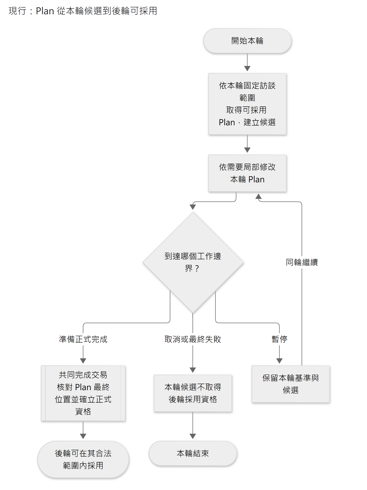
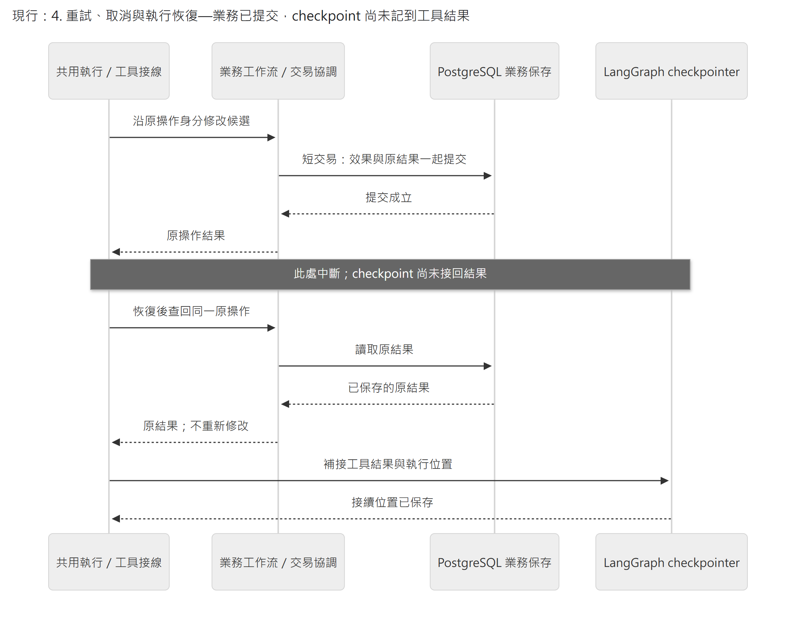

# 資料責任、版本保存與交易邊界

Caliburn 使用 PostgreSQL 保存訪談、JD 和 Memory，使用 LangGraph checkpoint 保存 AI 的執行位置與模型接續資料。業務資料回答「什麼已保存、什麼已正式成立」，checkpoint 回答「分析進行到哪裡」。恢復工作時，系統同時核對執行位置與原操作結果。

本章依序說明資料由誰管理、版本如何固定、哪些結果一起提交，以及重試、取消與清理的條件。工具欄位與程式接線在對應契約及實作文件維護。

閱讀路徑：[資料責任](#1-業務資料與執行資料) → [固定修訂](#2-不可變修訂與發布快照) → [交易](#3-交易邊界) → [恢復](#4-重試取消與執行恢復) → [排程](#5-背景整理的持久排程)／[清理](#6-保留失效與清理)。表與鍵的詳細關係見 [JD 保存](../implementation/jd-storage.md)、[Memory 保存](../implementation/memory-storage.md)及[訪談保存](../implementation/interview-storage.md)。

## 1. 業務資料與執行資料

正式資料由對應業務模組管理；畫面、模型工具與 PDF 讀取這些資料，不各自保存一份可獨立修改的正式文件。模型歷史可能含有相同文字，但用途是接續推論，不是改寫訪談原文或重新判定 JD 版本。

| 資料 | 唯一判定責任與必要保證 | 保存分工；其他表示如何使用 |
|---|---|---|
| 職務檔案、原始輸入、正式訪談 | 訪談業務；原文可靠保存，取消不授正式來源資格，正式序號與角色固定 | PostgreSQL 業務保存。模型接續可帶同一文字，但不得變成另一份可修改原文 |
| JD 正式稿、候選、依據、改動結果 | JD 業務；候選可預覽／恢復，完成才正式採用，歷史依據可回查 | PostgreSQL 業務保存。UI、工具與 PDF 由其投影，不另存可編輯全文副本 |
| Memory 候選、物件修訂、發布快照 | Memory 業務；同批共用工作稿，正式快照不可變 | PostgreSQL 業務保存。B1／B2 checkpoint 保存候選位置／操作參照，不另維護第二份全文候選 |
| JD 工作計畫 Plan | Plan 業務；本輪安排可修改，只有 Turn 完成且正式訪談成立，才可供後輪採用 | 正文與原操作結果由業務保存，工具及 UI 讀同份資料。接續全文、空值與保存格式沿 [Plan 保存與採用](persistence.md#plan-從本輪候選到後輪可採用) |
| 原生模型接續、執行位置、控制狀態 | 執行責任；完整 items／配對、原基準與可恢復邊界 | LangGraph 持久 checkpointer。歷史查詢用框架介面；按需產生的診斷副本不作恢復或業務權威 |
| 公開中間訊息、可讀推理摘要、已完成答覆 | 公開交流與完成判定責任；已保存的公開內容可回看，正式答覆可靠保存 | 正式答覆在 A 完成交易成為訪談原文；中間訊息與可讀摘要由 checkpoint 中已保存的完整原生回應投影，不另建摘要表、不授訪談序號。只公開允許的正文與順序，原始內部推理及加密接續資料不公開 |
| 原業務操作結果 | 執行原操作的資料模組；能確認操作是否已成立及當時結果 | 與操作效果在同一次短交易保存；工具回傳依此產生模型可見的結果，不另存一份可能與原結果矛盾的紀錄 |
| 導覽、diff、待核對、UI 進度 | 各領域由固定依據推導 | 優先即時投影；有量測瓶頸才加快取，鍵包含來源位置，失效／重建規則同時寫明 |

候選也由業務模組保存，因此修改可以原子完成，畫面可即時預覽，中斷時也能回到確定的位置。導覽與差異則從這些資料產生，不另維護一套能自行決定正式結果的內容。

查詢沿指定的固定位置及合法資料範圍投影，不另存一份可自行判定「最新」的權威。批次查詢、跨模組 SELECT 組合與讀取效率由[依賴規則](../implementation/code-organization.md#2-依賴方向與可檢查限制)及各保存接線文件維護。

## 2. 不可變修訂與發布快照

三個概念不可混為一個版號：

1. **物件身分** ：同一工作情境／理解持續修訂仍是同一物件。標題只是模型當前範圍的定位文字，資料庫操作用內部身分。
2. **物件修訂** ：標題、描述、正文或固定下層引用改變，即形成新修訂。歷史修訂不可覆寫；改回舊文字仍是後來的新修訂。
3. **Memory 發布快照** ：選定訪談範圍、情境／理解各物件的固定修訂及完整固定關係。所有路徑到同一物件都得到同一修訂；各物件不必共用相同數字版號。

候選是可修改的工作區，正式快照則固定採用的修訂與引用。候選修改不得回寫歷史發布快照或 JD 當時的依據。名稱、權限、刪除與關係合法性在每次操作檢查，具體規則沿[Memory 工具與寫入](../implementation/memory-tools.md)，不在發布時另增一套模型審核。

發布時，App 將合法的工作區保存為固定版本。即使工作理解的正文未變，只要其下層固定引用改變，也須建立新修訂。版本由 App 管理，不要求 B2 自行填寫；目前交接階段的分析是否完成，仍由 B2 判斷。詳見[Memory 單向調度](../implementation/agent-supervision.md)。

保存採**只為改變的物件建立修訂、未變修訂跨快照重用**。快照保存選用與關係，不複製全部正文。資料表與固定引用的實現見[Memory 保存 §2](../implementation/memory-storage.md#2-保存表示固定修訂而非資料庫舊列)，替代方案的取捨見[設計取捨 §3](design-decisions.md#3-保存明確業務候選與不可變正式修訂不以事件重播作唯一真相)。

所有發布過且可能被 A／JD 使用的快照及可達資料保留。候選中間位置依恢復／diff 需求保留，不承諾永久保存每次未發布改動。

## 3. 交易邊界

| 操作邊界 | 一次一致成立的內容 | 不納入同一長交易的內容 |
|---|---|---|
| 接受員工輸入 | 原文、原提交身分及本次准入結果 | 模型呼叫；此時尚未授正式訪談序號 |
| 候選修改 | 該次內容／關係修改、候選新位置與原操作結果 | 下一次模型推論；失敗不能留下半份 patch |
| A 正式完成 | 完整答覆、有效訪談序號、JD 候選及來源正式採用、Plan 最終位置核對及後輪採用資格、完成結果、既存 Memory 整理要求的處理資格 | 已先行保存原文不重複新增；模型與 PDF 不在交易內；Plan 資格沿 §1 連到的契約 |
| Memory 交接 | 已完成階段、相應候選快照／位置及下一階段資格 | B2 推論；B1 交接後不再修改本批情境，B1／B2 不同時寫入，見[系統責任](system-boundaries.md) |
| Memory 發布 | 不可變快照、來源涵蓋上界、發布結果及候選完成狀態 | A 正在執行的固定讀取基準不被替換 |
| 刪除整份職務檔案 | 檔案、所屬業務資料與原生 checkpoint 一起刪除 | 不等待模型；有執行中、暫停或仍在收尾的工作時拒絕 |
| 取消或終止未完成 A | 取消資格成立、候選不再可提交、接續回退位置 | 保留已採用輪前 compaction，不承接回退點之後的輪中壓縮；不回滾獨立 Memory 發布或先前正式操作 |

每項操作使用短交易，不以一個交易涵蓋完整 Turn 或 Memory 批次，也不在交易內等待模型回應。資料庫負責原子性、約束、並行安全與持久性，不判斷員工工作內容、模型分析是否完成或提示內容。PostgreSQL 的[交易](https://www.postgresql.org/docs/current/tutorial-transactions.html)、[約束](https://www.postgresql.org/docs/current/ddl-constraints.html)與[隔離](https://www.postgresql.org/docs/current/transaction-iso.html)提供保存機制，業務規則仍由業務模組定義。

### Plan 從本輪候選到後輪可採用

**現行 Plan 採用流程，限已啟用 Plan 的 A Turn。** 依基本流程圖記法：終端形表示本圖起訖，矩形為處理，菱形為分支，兩側雙線矩形為上表展開的共同完成子流程。完成分支只畫提交成功路徑；提交失敗與結果不明沿[恢復規則](#4-重試取消與執行恢復)。這是採用資格的流程，沒有新增 Plan 狀態欄位或另一份正式指標。

[圖源](../diagrams/architecture/persistence/plan-adoption.mmd) · [SVG](../diagrams/architecture/persistence/plan-adoption.svg)

新 Turn 捕捉初始 Context 時，在同一短交易固定 Memory、訪談上界與 Plan 基底。候選 current 可修改，並不立即取得跨輪採用資格；後輪只選同檔案、completed execution、匹配正式員工交換，且員工序號不超過固定 frontier F 的最新候選。本輪基底不因後來完成的工作而改變。

`null` 表示尚未建立，空字串表示刻意清空，兩者不能混用。未修改也沿共同完成交易核對最終 Plan 位置；取消或失敗候選可保留查核資料，但不供後輪採用。原操作結果未知時查回原命令與效果，不重套 patch、重算 diff 或讀任意 latest。

初始捕捉由 [context_binding](../../apps/api/src/caliburn/agents/job_consultant/context_binding.py) 負責，正式採用由[完成交易](../../apps/api/src/caliburn/workflows/consultant_completion.py)核對。原 captured request 未有 Plan 能力時，恢復不追補今日工具或正文。

## 4. 重試、取消與執行恢復

恢復須沿用原工作身分、資料基準及操作結果。下列規則說明已完成、未完成與結果不明的操作如何接續，以及取消如何使遲到結果失去提交資格。

**現行恢復時序：業務已提交，checkpoint 尚未記到工具結果。** 實線為呼叫，虛線為回傳；參與者是程式責任及保存介面。圖只展開「原操作已成立」分支，未成立或查詢不明仍按下方規則處理。業務短交易與 checkpoint 保存是兩個交界。

[圖源](../diagrams/architecture/persistence/committed-operation-recovery.mmd) · [SVG](../diagrams/architecture/persistence/committed-operation-recovery.svg)

較早回退基底、正式來源及公開回看不得因活躍 Context 被濃縮而提前清理。

- **原操作身分** 由 App 配置並在重入時沿用；同身分不同有效負載拒絕。模型 `call_id` 只負責工具配對，不自行承擔跨重試業務去重語意。
- **結果不明先查原操作** ；查詢失敗不等於沒提交。已成功可再次進入工具接回原結果，不再次產生效果，也不拿目前 JD 冒充當時結果。
- **checkpointer 與業務提交不假設同一 transaction** ：業務結果已成立、checkpoint 落後時核對並補接；checkpoint 記有意圖而業務未完成時，按原操作身分處理。不得以 checkpoint 的字串 `success` 取代正式查詢。
- **取消與完成競爭** 使用同一正式資格裁決：完成先成立就提供已完成結果；取消先成立則遲到的工具／模型結果不能提交。只中斷網路或取消 coroutine 不足以保護資料。
- **同檔案准入** ：同一職務檔案仍有執行中或暫停的 A Turn 時，後端拒絕另一 A Turn 及人工 JD 寫入。Memory 另有單批寫入資格，可與 A 讀取固定快照並行。
- **多步恢復** 先承接完整且可靠保存的模型／工具結果；必要時回到已保存 Step 或階段位置。回復候選位置必須同時使之後舊操作失去提交資格，避免遲到回應重套。

這些保證由[共用交易接法](../implementation/data-and-contracts.md#2-sql交易責任)及[執行接線](../implementation/agent-execution.md)落實。正式訪談序號只在完成時取得；編號及准入的資料庫機制由[訪談保存](../implementation/interview-storage.md)維護。

## 5. 背景整理的持久排程

A 判斷需要整理時，先透過 `request_memory_consolidation` 保存整理要求；當時輸入還沒有正式訪談資格。該 Turn 正式完成後，調度器由既存要求、已完成執行及該輪正式員工訊息，取得可處理的訪談上界。沒有提出要求的 Turn，不會只因完成就自動新增整理工作。

同檔案的有效新要求可合併最大上界，但不能擴大已開始批次。系統啟動或正常喚醒時掃描尚未完成的要求，取得單批執行資格，完成／失敗再依正式結果推進。取消或最終失敗的 Turn 不授予整理來源資格。

這處理了 [transactional outbox](https://docs.aws.amazon.com/prescriptive-guidance/latest/cloud-design-patterns/transactional-outbox.html)關注的「資料已提交、記憶體通知卻遺失」問題。Caliburn 的做法是重新查詢已保存的要求與完成資格，沒有另設 outbox／frontier 通知表，也不依賴外部訊息佇列。資料保存的先後及調度接線見[背景整理接線](../implementation/agent-supervision.md#5-memory-背景工作)。

## 6. 保留、失效與清理

正式訪談與發布快照不隨上下文壓縮而清除，JD 舊依據所需的修訂也不得被清理。資料是否保留，取決於它是否仍支援已承諾的用途，不能僅因已有新版就刪除；所有資料也不共用同一個過期時間。

| 保存對象 | 何時才可清理／失效 | 先確認什麼 |
|---|---|---|
| 正式訪談、正式 JD 依據及已發布 Memory 可達物件 | 目前不自動清理；已承諾可回查的快照保持完整 | 移除目前物件不移除歷史快照；改保留政策另行裁決 |
| A 輪前基底、Memory 的 B1 起點與 B1→B2 交接安全點 | 該工作不再可能回退到它，且無其他接續／diff 依賴後 | **輪中 compact 已採用仍不能清掉較早回退基底**；否則取消會只剩含已取消輸入的壓縮視窗 |
| 被 compact 取代的執行視窗 | 完整壓縮回傳視窗可靠採用，且舊視窗不再承擔回退、公開回看或原操作核對後 | 新視窗與已保存後綴可取得；不把不可解讀的加密壓縮內容當公開訊息或業務資料的保存替身 |
| 未發布候選與中間修訂 | 工作已完成／明確放棄，且無活躍或待核對操作及交接 diff／恢復參照後 | 舊執行已失去採用資格；清理不刪正式重用的修訂 |
| 原操作結果 | 原工作不能再重入、沒有未確認完成或補接結果的需求後 | 若仍可重送相同操作，就不能先刪去重所依賴的結果 |
| 公開中間訊息、可讀推理摘要與完整正式答覆 | 依產品歷史回看承諾保留；不隨模型 compaction 自動刪除 | 先確認公開歷史已可靠保存或可由保留的 items 完整形成；不能只剩無法還原公開正文的推理／加密壓縮內容 |

這些條件限制何時可以清理，不要求所有資料都另存副本。公開中間訊息與可讀摘要須支援按原工作回看，內容以原工作及原輸出項目識別，重新進入時不重複新增；它們不能成為另一份可編輯原文。

現行回看依賴保留的原生回應，不能先清除唯一來源；串流中未保存的片段不承諾恢復。變更保存位置時，須能核對資料已完整交接。目前不自動清理候選與舊 checkpoint，後續須先量測容量，再依上述條件評估；這不代表無限保存沒有成本。

上述保留規則適用於仍存在的職務檔案。使用者可在清單確認刪除整份檔案；其訪談原文、JD、Memory、來源關係及執行紀錄一起移除，不提供復原。有執行中、暫停或仍在收尾的顧問工作，或進行中、仍在收尾的 Memory 整理時，不能刪除。這項操作不允許單獨改寫或清除正式原文，也不影響其他檔案；確認與交易細節見[職務檔案刪除](../implementation/interview-storage.md#11-整份職務檔案刪除)。

目前不承諾備份／跨機還原，不代表資料可只存在 UI。Schema migration 維護現行資料結構，**不遷移舊架構資料** 。

交易、中斷、重試與競爭情境的測試方法及結果見[驗證與限制](verification.md)。

## 7. 公版參考工具的保存與可選接線

依[公版接線](../design/rag-pipeline.md)，公版來源由獨立 RAG 管理；App 只保存選用公版與員工明確否認的工作範圍，兩者不寫入 Memory／JD。取消或失敗的候選不得供下一輪採用，B1／B2 也只能讀其固定上界內有效的排除範圍。

資料資格見[公版選用與明確否認](../design/rag-pipeline.md#公版選用與明確否認的保存資格)，格式由正式 Schema 維護；角色設定、原請求恢復及讀寫接線見[執行接線](../implementation/agent-execution.md)。模型成功回傳是業務結果的精簡投影，不另成資料權威。
