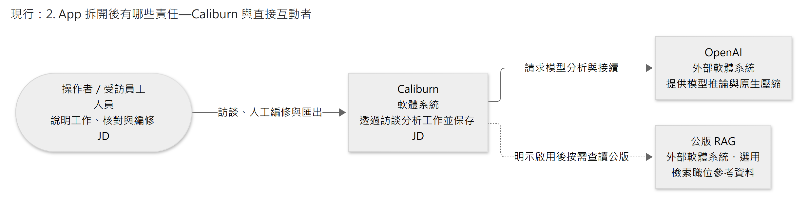
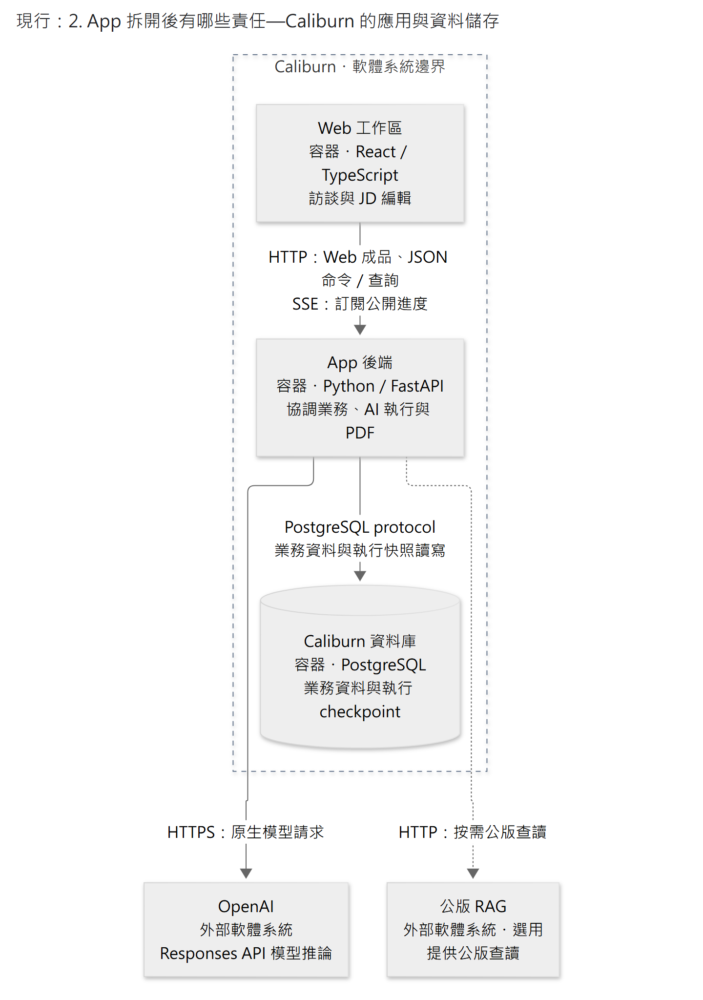

# 系統責任、領域邊界與資料流

Caliburn 把使用者互動、AI 分析、業務資料與執行恢復分開處理。這些功能在同一個後端內協作：AI 提出讀取或修改要求，業務模組判斷是否允許，資料庫保存結果；畫面則呈現正式資料與尚在處理中的候選內容。

本章先界定產品範圍，再說明模組、分析角色與資料流。它回答「誰負責判斷、誰保存結果、彼此交換什麼」；具體工具與生命週期沿各節連結深入。整體閱讀入口見[架構導覽](README.md)，設計理由見[設計取捨](design-decisions.md)。

依問題跳讀：[模組分工](#2-app-拆開後有哪些責任)、[Memory／Plan／Changes](#21-長任務的元件分工)、[A／B1／B2](#3-ai-分析角色共用執行機制分別處理工作)、[交換資料](#4-跨邊界只傳必要的資訊)。

## 1. 核心閉環與範圍

**員工說明工作 → 顧問釐清與分析 → 按需讀取依據 → 逐步編修 JD → 員工回看、補充或更正 → 繼續訪談。** 背景整理支援長訪談，但不列為每輪必須先完成的步驟；PDF 匯出目前正式 JD，不另作為正式資料來源。

現行產品範圍包括：多份隔離職務檔案、自然長訪談、A 的 Step 恢復／暫停／取消、候選 JD 即時預覽與完成提交、B1／B2 整理及固定 Memory 快照、可追溯來源、人工改稿可見性、JD 依據待核對、目前稿 PDF。

明示配置後，顧問另可用公版職位參考查漏，保存選用公版與員工明確否認的工作範圍；B1／B2 只讀否認範圍。依 [ADR0080](../adr/0080-opt-in-public-reference-agent-tools.md)，RAG 是 App 外部的可選服務，公版不是員工事實，也不自動判定 JD 完成。

現行範圍不含專用全稿審核 AI、原話語意搜尋與跨機還原；C 即時修補、固定雙向互審、通用規則引擎、微服務拆分與舊資料遷移不作為現行方案。全稿完整品質仍是長期產品目標，目前不能宣稱已通過全稿審核。

## 2. App 拆開後有哪些責任

現行架構採模組化單體，由一個 App 後端協調使用者操作與背景流程。以下先看整個產品與外部的關係，再展開後端分工；各角色與元件可以在同一程序中非同步協作。

**現行 C4 系統情境圖：Caliburn 與直接互動者。** 範圍是整個 Caliburn，不展開內部程序。圖例：圓角為人員，矩形為軟體系統；實線箭頭表示使用或請求方向，虛線箭頭表示明示啟用後才有的關係，回傳省略。視角依 [C4 system context](https://c4model.com/diagrams/system-context)，形狀與線型是本圖依 [C4 notation](https://c4model.com/diagrams/notation)明示的慣例。

[圖源](../diagrams/architecture/system-boundaries/system-context.mmd) · [SVG](../diagrams/architecture/system-boundaries/system-context.svg)

**現行 C4 容器圖：Caliburn 的應用與資料儲存。** 虛線外框界定 Caliburn 軟體系統；框內是三個 C4 容器（應用或資料儲存），不是三個 Docker 容器。圖例：矩形為應用容器或標明的外部軟體系統，圓柱為資料儲存容器；實線箭頭表示發起請求，虛線箭頭表示選用請求，均標用途與協定，回傳省略。視角依 [C4 container](https://c4model.com/diagrams/container)；後端內部分工見下表，實例位置見[部署圖](delivery-and-operations.md#2-最小部署視角)。

[圖源](../diagrams/architecture/system-boundaries/application-containers.mmd) · [SVG](../diagrams/architecture/system-boundaries/application-containers.svg)

| 責任 | 維護的內容與界線 | 詳細說明 |
|---|---|---|
| Web 工作區 | 輸入、顯示及局部草稿；正式結果與操作權限由後端判定 | [互動與運作](delivery-and-operations.md) |
| App 用例協調 | 協調准入、控制、跨領域完成及原結果查詢；不取代各業務規則 | [核心生命週期](../specs/2026-09-29-core-value-loop-lifecycle.md) |
| 職務檔案與訪談 | 資料隔離、原文、正式來源資格及順序；保存取消輸入不授來源資格 | [來源契約](../specs/2026-09-27-memory-read-and-source-navigation-contract.md) |
| JD 業務 | 正式稿、候選、依據、差異、核對與撤回；人工及 AI 共用規則 | [JD 契約](../specs/2026-09-29-jd-model-tool-contract-review.md) |
| Memory 業務 | 本批候選、物件與關係、固定快照及處理進度；不代替模型分析內容 | [Memory 設計](../specs/2026-09-24-caliburn-layered-architecture-map.md) |
| Plan 業務 | 同職務檔案的工作安排、候選保存及合法跨輪採用 | [長任務分工](#21-長任務的元件分工) |
| 公版參考業務 | App 保存選用及否認範圍，獨立 RAG 提供公版查讀；B1／B2 只讀有效排除範圍 | [可選工具契約](../specs/2026-10-04-public-reference-completion-design.md) |
| AI 執行 | 原生模型接續、Step、控制與恢復；checkpoint 不代表 JD／Memory 已正式成立 | [共用執行](../specs/2026-09-27-shared-agent-execution-and-state-design.md) |
| 執行快照保存 | LangGraph checkpointer 將執行位置存入 PostgreSQL，供原工作恢復；不判定業務完成 | [Agent 執行](../implementation/agent-execution.md#1-執行圖與業務資格分開) |
| 角色工具與模型接線 | 將模型意圖轉為授權用例，將真結果轉成模型輸出；範圍及操作身分由 App 注入 | [工具規範](../specs/2026-09-27-agent-tool-contract-design-research.md) |
| 持久化接線 | 交易、約束、隔離及原結果回查；不判斷工作語意、不跨模型呼叫持有交易 | [資料與交易](persistence.md) |
| PDF 投影 | 固定正式 JD 後產生唯讀輸出，候選與 PDF 都不能反向成為正式 JD | [交付](delivery-and-operations.md) |

模型接線向 OpenAI 發起請求並接收原生輸出。公版內容由 RAG 管理，選用與否認 state 由 App 保存。機密資訊與資料外送的界線另見[部署視圖](delivery-and-operations.md)。

人工與 AI 編輯都經過 JD 業務模組，刪除、引用與提交使用同一套規則；HTTP 與模型工具只負責各自的輸入與呈現方式。

### 2.1 長任務的元件分工

**本節維護工作記憶（Memory）、工作計畫（Plan）與變更檢視（Changes）的名稱、責任及彼此關係。** Changes 是變更檢視元件的文件名稱；程式及工具中的 `diff` 仍指差異資料，`patch` 指局部修改方式。

三者是顧問可以使用的獨立能力。**規劃者是同一個 A，Plan 保存 A 的工作安排。** A 依 JD 交付目標、分析／JD／顧問指南、目前理解與實際成品，判斷要問什麼、讀什麼、改什麼，以及何時轉題或收尾；Memory 提供理解，Changes 提供變更資訊，JD 承接成果。這些能力不表示新增 Agent、服務或資料表。

| 元件／成果 | 責任與交換資料 | 維護及使用者 | 現行與目標 |
|---|---|---|---|
| 工作記憶 Memory | 依原話分析出的員工工作情境與理解，保留本人範圍、依據及不確定性；隨新資訊、更正或分析發現反覆修訂。 | B1／B2 整理與修訂，App 發布；A 讀本輪固定快照及合法原話。 | **現行。** 固定的是單次執行的讀取基準，分析內容可在後續整理中修正。分層與發布沿 [Memory 設計](../specs/2026-09-24-caliburn-layered-architecture-map.md)。 |
| 工作計畫 Plan | 規劃訪談、拆分及調整子任務：目前聚焦什麼、哪些方向還沒深入、哪些尚未問完，以及何時回訪或收尾。 | A 讀目前計畫全文，提出安排與局部修改；App 負責候選保存、合法採用、全文接續與同份唯讀呈現。 | **現行。** 沿 ADR0081 保存與接續，依 ADR0082 以短大綱安排剩餘訪談、分析與 JD 編修。工程及品質證據見下文。 |
| 變更檢視 Changes | 讓 Agent 看見 JD、引用及引用來源的改動與受影響範圍，據此繼續分析；改動本身不代表正確或已確認。 | App 提供變更資訊及比較；A 判斷影響，必要時核對依據、追問或修稿。 | **現行，已實作並有測試紀錄。** 人工 JD 比較與 JD 既有引用所指 Memory 來源的舊→新比較已接入 A 的按需工具；不涵蓋全部 Memory 變更。比較範圍、提示方式及驗證沿 [JD §4.3](../specs/2026-09-29-jd-model-tool-contract-review.md#43-兩類差異的按需入口)。 |
| 職務說明書 JD | 依實際工作與可核對依據形成的交付成果；有正式稿及當輪候選。 | A 讀目前內容與保存結果，提出有依據的修改；人與 A 共用 JD 業務規則，App 保存。 | **現行。** 是否完整可交付仍須核內容與依據，不能由 Plan 空白、完成短句或保存成功推定。 |

A 有疑問時向員工釐清，Memory 依後續訪談自行整理修正。整理錯誤屬 Memory 分析品質問題，沿既有 B1／B2 流程處理，不另設 A 提交疑點的入口。

A 透過 Changes 的按需比較及來源待核對資訊辨認變更，再依目前內容及依據繼續分析。讀取不會自動確認改動或解除來源待核對；只有工作安排受影響時，A 才調整 Plan。Changes 與 Plan 各自提供能力，由 A 判斷如何使用。

A 也可直接依員工本輪新原話推進工作，不必等待 Memory 整理或 Changes 結果。員工釐清盤點分工後，A 可把「釐清分工」改成「依已知分工修正 JD 任務與目的」；只有任務修好、目的仍不一致時，保留剩餘修正。後續 Memory 發布延續這份理解，不等於成品工作已完成，也不要求重問同一事實。

Plan 以高品質、完整且有依據的 JD 為最終成果，正文是一份可局部修改的 Markdown；受訪者看見安排是附帶效果。先掌握輪廓、再選方向深入，隨訪談調整子任務、返回未完工作的用法，由 [Plan 內容與用法](../specs/jd-work-plan.md#1-內容與格式)維護。依 [ADR0082](../adr/0082-consultant-jd-work-plan.md)擴充用途的工程已實作，並依使用者限定範圍完成各一場比較；有限比較未見可辨整體增益，不能證明穩定品質改善。證據及後續待辦見[驗證範圍](verification.md#41-jd-工作計畫後續待辦)，有效狀態沿[目前決策](../current-decisions.md)。

## 3. AI 分析角色：共用執行機制、分別處理工作

每項工作都帶有 App 綁定的職務檔案、執行身分與資料範圍；模型不能透過工具參數改換檔案、版本或權限。下表維護三個角色的分析職責及讀寫界線，流程完成與分析品質分開判讀。

| 角色 | 分析目的 | 可讀／可寫 | 完成代表什麼 |
|---|---|---|---|
| A 職務顧問 | 理解員工工作、引導訪談、有據編修 JD | 本 Turn 固定正式 Memory、有效歷史、本次輸入及 Plan；按需讀 Changes，寫本 Turn JD／Plan 候選 | 答覆與候選採用、正式訪談資格及完成結果一致成立；Plan 用途沿 §2.1 的現行權責 |
| B1 工作情境分析 | 處理本批指定新原話，整理具體工作實況 | 可回查固定上界以前的全部有效訪談及目前情境；只寫情境，不能讀理解 | 當前情境工作完成、可交接 B2；不是已發布 |
| B2 工作理解分析 | 從最新情境形成／修訂工作認識 | 當前情境／理解、上游變更、合法原話；只寫理解 | 分析含新增情境及受影響範圍完成；再由 App 發布整版 |

Memory 採單向 B1 → B2 → 發布，不回交 B1。B1 交接後不再修改本批情境；B2 使用這份固定情境分析工作理解，完成後由 App 發布。流程與分析品質的測試結果見[驗證與限制](verification.md)。

例如員工說：「每月底我登錄盤點差異，再交主管核准。」這是**訪談原話**；B1 的**工作情境**保留月底盤點、本人登錄、主管核准等具體經過；B2 的**工作理解**整理這項工作的責任與作用，例如員工負責彙整差異、送交確認，核准權仍在主管。A 據此編修 JD，Plan 可以保留「差異後續由誰處理尚未釐清」。這是合成說明例，不代表系統每輪必定執行全部步驟，或可補入原話未提供的責任。

一輪 Turn 內可以有多次模型與工具 Step；**正式訪談序號**則是已成立訊息的排列位置，包含 App 開場、員工輸入與顧問完整答覆，不是輪數或 Step 編號。未完成的員工輸入雖可先保存，尚未取得正式序號；來源資格見[訪談保存](../implementation/interview-storage.md#1-原文正式資格與執行身分分開不複製原話)。

完成標記須綁定 App 的批次與交接身分，版號不由模型填寫；呼叫過 read 也不代表分析已完成。原生推理與工具結果支援分析接續，App State 保存執行事實，不要求每個 Step 額外撰寫分析筆記。

三個角色採用相同的[工作分析方法](../guides/2026-09-09-complete-work-analysis-guide.md)，但產出不同。A 依[訪談校準](../guides/2026-09-09-customized-jd-depth-and-interview-calibration.md)與[JD 寫作方法](../guides/2026-09-09-jd-field-and-writing-guide.md)形成職務說明書；B1／B2 保存工作情境與理解，不預先寫成 JD 欄位。一次分析可以包含多次模型與工具往返。

### 工作如何跨模組執行

正式完成由 App 協調業務結果，Graph END 不替代提交。各操作的前置條件、交接資料與恢復效果沿原責任文件查閱：

- [核心閉環與生命週期](../specs/2026-09-29-core-value-loop-lifecycle.md)說明輸入准入、A 完成及 Memory 整理要求；[顧問 Context](../specs/2026-09-26-consultant-context-and-state-design.md)說明輪前準備、資料綁定與同輪接續。
- [B1／B2 生命週期](../specs/2026-09-25-b1-b2-information-gap-lifecycle.md)說明候選、固定交接與發布；資訊不足或矛盾須如實保留，不靠回交或猜補處理。
- [工具設計](../specs/2026-09-27-agent-tool-contract-design-research.md)、[共用執行](../specs/2026-09-27-shared-agent-execution-and-state-design.md)及[資料保存](persistence.md)分別維護授權派送、控制接續與原操作核對。

## 4. 跨邊界只傳必要的資訊

| 起點 → 終點 | 傳的是什麼 | 必須守住的界線 |
|---|---|---|
| 用例 → A | 本次原文、固定讀取基準、可用工具 | 動態工作資料以 user role；本次原文獨立，不混成系統指令 |
| A 完成 → Memory 調度 | A 已提出、因本輪完成而取得處理資格的整理要求，以及訪談序號上界 | 不攜帶 A 私人推理；A final 在上界之後，不納入該批 |
| B1 → B2 | 同一候選的交接位置、情境變更概覽 | B1 不交私人 context；B2 按需讀正文／Markdown diff |
| Memory → A／JD | 已發布快照的導覽／正文／來源 | A 同 Turn 固定；JD 引用保留採用當時快照，不自動換版 |
| A → 公版 RAG → A | 已確認主要工作 query、固定公版定位、目錄或任務正文 | 只在啟用時查讀；不自動加入否認範圍，也不以相似度認定員工責任 |
| 公版參考 state → A／B1／B2 | A 讀本輪選用及排除範圍；B1／B2 只讀其固定上界內有效的排除範圍 | 選用與否認不寫入 Memory；後輪更正不回流舊批次，取消／失敗候選不跨輪生效 |

Plan、Changes 與 JD 的往來沿 [§2.1](#21-長任務的元件分工)；Web 重送／重連沿[互動狀態](delivery-and-operations.md#畫面api-與串流的狀態一致性)，業務提交沿[交易邊界](persistence.md#3-交易邊界)。Python 與 Web 的傳輸格式依[契約策略](../contract-strategy.md)從單一來源生成。

## 5. 模組之間的資料依賴

正式訪談是 A 的歷史上下文、B 的整理材料，也是 JD 可引用的原話來源，因此三者使用相同的來源資格與順序。Memory 發布後，A 在下一輪開始時取得新快照；正在執行的一輪仍使用原本固定的版本。JD 正式稿則同時供人工編輯、來源比較、撤回與 PDF 使用，候選預覽不另成為一份正式文件。

這些資料依賴使各畫面與工具看到一致結果，也讓取消或中斷時能分辨哪些資料已正式成立。相關測試方法與結果見[驗證與限制](verification.md)。
