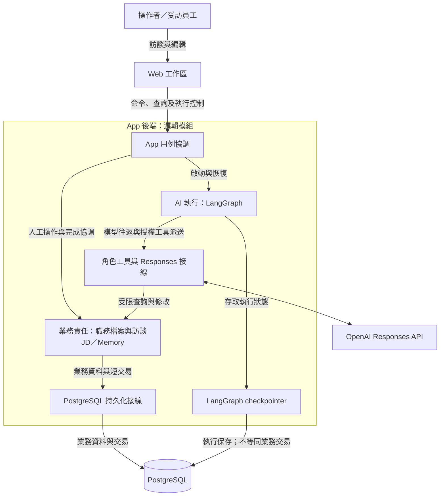

# 系統責任、領域邊界與資料流

- 狀態：**現行產品架構及設計要求**；核對日期：2026-10-02。正式後端為 [`apps/api`](../../apps/api/README.md)，介面為 [`apps/web`](../../apps/web/README.md)；切換依據為 Accepted [ADR0079](../adr/0079-target-rebuild-production-cutover.md)。設計要求不等於逐項已驗證，與實作仍有差異處另行標示。
- 驗證範圍：T01–T18 已標記完成，但不代表所有驗收情境通過。逐項實測與限制見 [T17 V01–V28 對照](../plans/2026-09-29-target-rebuild/evidence/t17-v01-v28-closure.md)及[實驗發現的問題](../reports/experiment-findings.md)；分析品質、真人使用效果與未覆蓋分支仍須分別評估。
- 維護者：應用程式架構維護者。
- 範圍：全產品的職責劃分與跨模組介面；提示、工具 schema、資料表及個別 AI 角色的流程由各專題文件說明。
- 上層：[目標架構導覽](../target-architecture-map.md)。產品語意：[產品概念](../product-concept.md)。工程取捨：[設計決策](design-decisions.md)。

## 1. 核心閉環與範圍

**員工說明工作 → 顧問釐清與分析 → 按需讀取依據 → 逐步編修 JD → 員工回看、補充或更正 → 繼續訪談。**背景整理支援長訪談，但不列為每輪必須先完成的步驟；PDF 匯出目前正式 JD，不另作為正式資料來源。

首版必須支持：多份隔離職務檔案、自然長訪談、A 的 Step 恢復／暫停／取消、候選 JD 即時預覽與完成提交、B1／B2 整理及固定 Memory 快照、可追溯來源、人工改稿可見性、JD 依據待核對、目前稿 PDF。

首版範圍不含 C 即時修補、專用全稿審核 AI、固定雙向互審、原話語意搜尋、通用規則引擎、微服務拆分、跨機還原與舊資料遷移；這些項目不列為首版尚欠的功能。全稿完整品質仍是長期產品目標，目前不能宣稱已通過全稿審核。

## 2. App 拆開後有哪些責任

下圖呈現**現行產品的邏輯分工**（2026-10-02）；方框不代表獨立服務、程序或資料表。現行架構採模組化單體，由一個 App 後端協調使用者操作與背景流程；非同步工作不要求每個 AI 角色各自使用一個程序。箭頭表示呼叫或資料交換方向，圓柱表示儲存；圖中通常省略回傳箭頭，因此單向箭頭不代表資料只能寫入、不能讀取。

| 模組職責 | 負責的判斷與資料 | 介面功能 | 限制與詳細說明 |
|---|---|---|---|
| Web 工作區 | 呈現、輸入草稿、暫時串流顯示；不擁有正式結果 | 建立檔案、訪談、人工 JD 編輯、控制 A、查看來源／改動、匯出 | 不靠停用按鈕保證權限；[互動與運作](delivery-and-operations.md) |
| App 用例協調 | 一次使用者命令與跨領域完成流程 | 准入、啟動、暫停／取消、完成、派送、原結果查詢 | 不重做 JD／Memory validator；[跨層生命週期](../specs/2026-09-29-core-value-loop-lifecycle.md) |
| 職務檔案與訪談 | 檔案隔離、輸入保存、正式訪談資格與不可變來源 | 保存輸入、完成後授予序號、範圍回讀、讀原結果 | 取消輸入留存不等於有效來源；[來源契約](../specs/2026-09-27-memory-read-and-source-navigation-contract.md) |
| JD 業務 | 關聯式正文、候選、人工／AI 變動、正式版本、編輯依據與待核對 | 共用讀寫／提交／撤回規則，來源比較及明確確認 | 不把人寫的 JD 當訪談事實；[JD 工具與領域介面](../specs/2026-09-29-jd-model-tool-contract-review.md) |
| Memory 業務 | 本批候選、物件與關係、固定發布快照、來源處理進度 | 受限 CRUD、導覽／正文／差異、交接快照、共同發布 | 不替模型判斷工作語意；[Memory 子圖](../specs/2026-09-24-caliburn-layered-architecture-map.md) |
| AI 執行 | Graph 執行位置、各角色私有的原生接續資料、Step／控制與恢復 | 執行 A 或 B1／B2；保存已取得結果；按正式結果接續 | 不把 checkpoint 當正式 JD／Memory；[共用執行](../specs/2026-09-27-shared-agent-execution-and-state-design.md) |
| 角色工具／模型接線 | 將模型意圖轉成授權用例、將真結果轉成原生 output | 模型不填檔案、版本、權限、operation identity；App 注入 | 不是另一套業務儲存／通用管理工具；[工具規範](../specs/2026-09-27-agent-tool-contract-design-research.md) |
| 持久化接線 | 交易、約束、隔離、條件提交、持久結果查回 | 保存由業務定義的一致操作；提供原操作結果 | 不判斷語意正確、不跨 LLM 開長交易；[資料與交易](persistence.md) |
| PDF 投影 | 對已完成 JD 的唯讀輸出 | 固定一次正式 JD 修訂後產 PDF，第一版不含姓名／訪談／Memory | 不把候選或 PDF 反向當正式 JD；[匯出與部署](delivery-and-operations.md) |

圖中模型接線與 OpenAI 的雙向箭頭表示 Responses 請求與原生輸出；機密資訊與資料外送的界線另見部署視圖。各項職責可由同一程式內的模組或函式實現，不必逐項新增介面層、repository 或套件。規則在多方使用時才共用，例如人工與 AI 編輯都經過 JD 業務模組，使用同一套刪除與引用邏輯。

## 3. AI 分析角色：共用執行機制、分別處理工作

### 跨層介面交接契約

下表定義跨層介面的輸入、結果與限制，核對日期為 2026-10-02；各列不代表需要新增 LLM 工具、HTTP endpoint 或獨立服務。App 已知的身分與範圍由可信的執行綁定提供，模型與 UI 不可透過參數擴張權限。內部名稱及型別見[實作文件](../implementation/README.md)，實作須保留表中各項輸入、結果及拒絕效果。

| 介面／接收模組 | 必要輸入 | 回傳結果及中斷或拒絕時的效果 |
|---|---|---|
| 新 A 工作准入／App | 職務檔案、原提交身分、員工原文、有效操作資格 | 原接受結果或新工作身分；保存原文及准入資格。相同提交重送不新建訪談；已有活躍／暫停 A 拒絕另一寫入。接受輸入不等於已完成 context 準備。 |
| A 分析準備／App 與來源資料模組 | 有效工作資格、已採用輪前基底（必要壓縮已完成） | 一致綁定 Memory 與其涵蓋上界、有效歷史上界及 JD 起點，再追加一次 App 資料與本次輸入。同輪恢復用原綁定；最新導覽應於輪前壓縮之後取得，不提前固定。 |
| 工具派送／對應領域模組 | 角色授權、工作身分、模型已保存的意圖、原操作辨識 | 本次實際讀取結果、候選修改結果或確定的拒絕。結果不明時保留待核對狀態，不誤報為工具失敗；重新進入沿用原身分，不重複產生效果。 |
| A 正式完成／App 協調業務交易 | 完整答覆、本輪當前候選／依據、輸入及完成意圖、背景整理意圖（若有） | 一致的正式答覆、JD、訪談資格、完成結果及待處理上界；若資格已撤銷則不採用。Graph END 不替代此結果。 |
| B1 交 B2／Memory 上層流程 | 本批綁定、已完成的情境候選位置及 B1 階段結果 | 可恢復的交接、情境差異、既有依賴與當前導覽；不包含 B1 私有推理，也不把 B2 理解內容反傳 B1。 |
| B2 回交 B1／Memory 上層流程（現行啟用，待對齊） | 現行程式仍接受可定位的情境問題與釐清內容 | 可進入同批情境續作及新交接，理解候選不重置，舊交接的 B2 完成資格不能套用到新交接；此路徑與已採用的單向設計不符，仍待修正。 |
| Memory 發布／Memory 業務 | 本批、最後情境交接與對應 B2 完成結果、當前完整候選、正式基準與來源上界 | 固定發布快照、正式 head、處理進度、原結果一起成立；資格衝突不發布，結果不明查原操作。 |
| JD 來源比較／JD 業務 | 既存引用身分、A 固定 Memory、目前合法 JD 位置 | 原引用→目前可見來源的差異或明確不可用結果；不按同名偷換來源，不把 read 當成確認。 |
| 執行恢復／App 與原業務模組 | 原工作綁定、可靠 checkpoint、原操作辨識、控制資格 | 從原結果或可靠位置接續，或明確保留受阻／已放棄狀態。不能以最新資料冒充舊結果或刷新同 Turn 基準。 |

各介面的傳輸格式與詳細流程由相應文件定義：模型輸入輸出見工具文件，執行控制見共用執行，交易見持久化，畫面顯示見交付運作。此表說明跨層交接，不另設一套驗證或進度判定機制。圖中的「業務責任」為便於閱讀而合併呈現，各項職責仍獨立，不要求新增通用業務服務。PDF 的唯讀路徑另見部署圖。

| 角色 | 分析目的 | 可讀／可寫 | 完成代表什麼 |
|---|---|---|---|
| A 職務顧問 | 理解員工工作、引導訪談、有據編修 JD | 本 Turn 固定正式 Memory、有效歷史及本次輸入；寫本 Turn JD 候選 | 答覆與候選採用、正式訪談資格及完成結果一致成立 |
| B1 工作情境分析 | 處理本批指定新原話，整理具體工作實況 | 可回查固定上界以前的全部有效訪談及目前情境；只寫情境，不能讀理解 | 當前情境工作完成、可交接 B2；不是已發布 |
| B2 工作理解分析 | 從最新情境形成／修訂工作認識 | 當前情境／理解、上游變更、合法原話；只寫理解 | 分析含新增情境及受影響範圍完成；再由 App 發布整版 |

**採用設計已確定為單向 B1 → B2 → 發布，回交不屬於待選方案。**現行執行路徑尚未對齊：[`bootstrap.py`](../../apps/api/src/caliburn/bootstrap.py) 建立 `MemoryBatchWorkflow` 並將其 `run` 接入 supervisor，未覆寫預設的 `max_feedback_rounds=2`；[`memory_batch.py`](../../apps/api/src/caliburn/workflows/memory_batch.py) 的 `SituationRework` 分支呼叫 `handoff`，由 [`candidate_lifecycle.py`](../../apps/api/src/caliburn/features/work_memory/candidate_lifecycle.py) 將 `WORK_UNDERSTANDING` 切回 `WORK_SITUATION`。B2 [instructions](../../apps/api/src/caliburn/agents/work_understanding_analyst/instructions.py) 也仍包含 `needs_situation` 回交要求。這是目前接入執行的設計差異，不是僅存於未使用程式的歷史片段；既有回交測試不能證明單向設計已落實。

完成標記須綁定 App 的批次與交接身分，版號不由模型填寫；呼叫過 read 也不代表分析已完成。原生推理與工具結果支援分析接續，App State 保存執行事實，不要求每個 Step 額外撰寫分析筆記。

工作分析方法只有一份：[完整工作分析指南](../guides/2026-09-09-complete-work-analysis-guide.md)、[訪談校準](../guides/2026-09-09-customized-jd-depth-and-interview-calibration.md)、[JD 寫作](../guides/2026-09-09-jd-field-and-writing-guide.md)。A 依寫作方法選 JD 表達；B1／B2 不預寫 JD 欄位，也不把圖中的箭頭誤當固定模型呼叫次數。

## 4. 跨邊界只傳必要的資訊

| 起點 → 終點 | 傳的是什麼 | 必須守住的界線 |
|---|---|---|
| Web → 用例 | 使用者意圖及原命令身分 | 網路重送與使用者新重試分開；不讓前端決定已提交 |
| 用例 → A | 本次原文、固定讀取基準、可用工具 | 動態工作資料以 user role；本次原文獨立，不混成系統指令 |
| A → JD | 指定項目與修改／引用意圖 | 只能改本 Turn 候選；不得直接宣告正式保存 |
| A 完成 → Memory 調度 | 已成立整理要求與訪談序號上界 | 不攜帶 A 私人推理；A final 在上界之後，不納入該批 |
| B1 → B2 | 同一候選的交接位置、情境變更概覽 | B1 不交私人 context；B2 按需讀正文／Markdown diff |
| Memory → A／JD | 已發布快照的導覽／正文／來源 | A 同 Turn 固定；JD 引用保留採用當時快照，不自動換版 |
| 業務 → 儲存 | 一致操作與前置條件 | 儲存實現原子性；業務判斷不散落在工具、Graph、UI 三處 |

圖表說明介面效果，不指定 HTTP endpoint、類別或資料表名稱。Python 與 Web 之間的傳輸格式依[契約策略](../contract-strategy.md)由單一來源生成；Python 內部介面以型別定義，不另建通用契約平台。

## 5. 變更時沿哪些關係檢查

訪談資格變更會影響 A 的上下文、歷史讀取、B 的批次取材、JD 原話引用及 UI，須一併檢查。Memory 快照變更須核對 A 固定讀取的版本、來源差異、歷史回查及發布恢復。JD CRUD 變更須核對人工與 AI 編輯、候選預覽、差異比較、撤回、來源及 PDF。工具 schema 變更時，也須同步核對實際負責資料的模組。

用來檢驗設計的反例與各層驗收要求見[驗收矩陣](verification.md)。本頁的邏輯分工不代表各模組須部署為獨立服務，也不代表所有設計契約均已通過實測。
