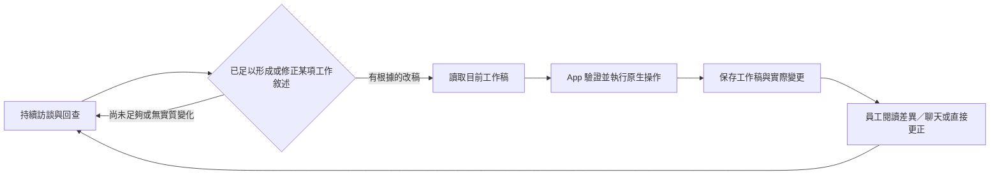

# JD 編輯器方向：既有顧問搭配 Plate 持續工作稿

JD-R002/C03；2026-09-09；**Owner 已同意 Plate 文件底座，並選擇「持續工作稿，保留差異與更正」（審閱 §7 路線 B，G3／WORKING）。**完整設計與實際整合尚未驗收。目標是把既有 Memory、工作分析與 JD 寫作成果接上可由人與 LLM 使用的 App。有效狀態依 [register](../current-decisions.md)，產品效力依[審閱工作稿 §7.7](2026-09-09-jd-editing-and-review-working-design.md#77-owner-裁決持續工作稿保留差異與更正)，不再重問框架、B 流程、成品深度或訪談主流程。

**最新收斂：**目前方向是 Plate 原生 clean working draft、每次實際變更（actual_changes）及可回查的 revision。停止持久 pending 的產品分組／accept／reject 設計；B05／B06 的個別接受／取消部分由審閱 §7.7 明確 supersede，保留同份最新版、獨立內容不誤動、相依內容完整修正、差異／歷史、來源與 JD 深度。這不是人工編輯自動批准文件。[待審實證比較](evidence/2026-09-09-jd-native-pending-review-comparison.md)及 codec 結果保留為沿革；[F01](evidence/2026-09-09-jd-native-content-profile-probe.md)、[P01](evidence/2026-09-09-jd-native-save-probe.md)與 diff／history／UI 仍各有未驗範圍及反例，不能宣稱安裝即完整。

## 1. 已選方向與理由

**採 Plate OSS 核心作 JD 文件、人編輯及原生操作的設計底座；乾淨工作稿版本、原生 `computeDiff` 與必要操作資訊承接實際變更查閱。LLM／Memory 沿既有研究成果，新增 JD App 工具接點。**AI 在理解足夠時更新工作稿，員工透過差異、聊天更正及直接編輯續作；修正形成新版，不提供按早期未確認建議確定性取消的流程。持久 SuggestionPlugin 的群組結算不再是本路線工作；Plate AI SDK、付費歷史及多人同步不列採用前提。

理由是本案需要結構化工作內容、完整敘述與人編輯，而 Plate 的免費核心及差異 primitive 已有直接 source 與初步執行證據。官方版本歷史範例也使用兩份乾淨快照、computeDiff 及獨立唯讀 editor；這不是自造 diff 演算法。**官方範例只把版本留在 React state，保存、恢復與業務操作仍需要 App 接線。**[官方範例](https://github.com/udecode/plate/blob/cee7a4ec0328718d8cf147094466b597215f5406/apps/www/src/registry/examples/version-history-demo.tsx)、[範例範圍](https://github.com/udecode/plate/blob/cee7a4ec0328718d8cf147094466b597215f5406/content/docs/examples/version-history.mdx)

這個已選方向附有已證限制：`computeDiff` 單獨不足以保證所有屬性／空文字格式變動都高亮。原生當批 operations 及乾淨快照已有固定檔案／瀏覽器及[P01 DB 保存](evidence/2026-09-09-jd-native-save-probe.md)的有限正證；所有業務欄位在員工視圖可讀、正式編輯與實際 Agent 接續仍未驗。必須把有限欄位呈現與接線列入設計，不可寫成安裝即全功能完成。[13 項原生驗證與 3 項觀測](evidence/2026-09-09-jd-native-editor-probe.md)、[完整 r2 的 29 項限定檢查及瀏覽器結果](evidence/2026-09-09-jd-native-editor-ui-probe.md)；兩個原生反例沒有改判。

| 選型沿革 | 適合本案的能力 | 已有比較理由與界線 |
|---|---|---|
| **Plate 核心＋原生 diff（已選）** | 結構文件、手編、ID／metadata、headless transforms；較完整的文字／element 屬性比較 | 必要整合是 JD 節點／呈現、模型工具 wrapper、保存及結果；兩個 diff 反例與 UI 仍須處理／驗證 |
| ProseMirror／Tiptap OSS 核心 | 成熟 schema；Step apply／invert／map／JSON；Tiptap 免費 UniqueID | 先前第二候選。Step 資訊與 Plate operations 按同級原生能力比較；changeset 預設不完整涵蓋 marks／attrs，完整比較呈現的接線尚未驗。持久 tracked changes 不是目前路線必需，不以其第三方缺口作主要扣分 |
| Lexical | 原生 EditorState、NodeState、編輯及序列化 | 先前第三候選；NodeState 可承載可保存的身分，不能因 NodeKey 不持久就淘汰。真正差距是尚無已證完整比較呈現路徑 |

先前排序代表先驗哪套，不代表已證 Plate 全面勝過其他核心；目前已由 Owner 選定 Plate，不繼續比較其他框架。Plate 的原生樹狀 snapshot diff 及免費呈現範例是選擇理由，Python／JavaScript 接線及資料庫交易則是共通 App 工作。若必要能力仍要求自造通用 diff，須列出具體缺口及代價回議，不能把選定底座當成自建引擎授權。

固定實證版是 `platejs@53.3.11`、`@platejs/diff@53.0.0`，不是把 monorepo v53.3.12 套給每個 package。核心 MIT；diff 的 Apache-2.0 衍生授權與修改雙授權另列，免費 registry example 不等於 Plate Plus。[Plate 證據與授權](evidence/2026-09-09-jd-oss-plate.md)、[替代證據](evidence/2026-09-09-jd-oss-alternatives.md)

### 本次可確認的框架選擇

**Owner 已明確同意 Plate 免費開源核心，並另行採用持續工作稿 B 流程。**最新效果包含人工編輯、每次實際修改可查、保存重開、來源與既有 JD 成品深度；個別待審接受／取消已由新的產品裁決取代，不能再列為本路線未完成的必要功能。下表只保留框架選擇的理由與沿革。

| 選項 | 現有理由與實際代價 |
|---|---|
| **Plate，已選** | 已有完整 r2 表達、原生操作、比較呈現與固定保存的直接證據。剩餘文件／變更查閱／保存接線必須明列並驗收，不能承諾零接線或全由套件包辦 |
| ProseMirror／Tiptap 免費核心 | 結構 schema／Step 是先前有效備選；免費修訂套件的格式／屬性反例留在研究證據，不當成目前工作稿路線的淘汰理由。停止擴大比較 |
| Lexical | 文件編輯底座成立，尚無已證完整差異呈現接法；既有比較保留，停止擴大驗證 |

[待審的最後定點補查](evidence/2026-09-09-jd-native-pending-review-comparison.md#6-定點補查已收束公開修復與整合代價)、R01／R01-F 及[SuperJSON 四項有限實證](evidence/2026-09-09-jd-native-pending-codec-probe.md)保留為路線沿革。codec 的固定正證沒有修好原 raw JSON 反例，R01-F 也沒有證明通用分組結算；這些結果不再是 B 流程的 pending 施工單位，也不能改寫成所有格式／保存都已驗收。

目前 G3 效力為 **Plate 文件底座＋持續工作稿 B 流程 WORKING**。接下來研究者負責補齊文件、實際變更、版本保存、工具與人工操作的介面及驗收範圍，不再設計 pending 成員／accept／reject，也不重問 B。若仍須改已選使用效果或自造通用引擎，依既定缺口原則先提具體代價再議。整體 S3／S4／S5 不因此勾完，production authority 仍走 successor ADR。Deep Agents 的相關提問不作更換既有 Agent／Memory 的授權；分工見接線稿。

## 2. 已有基線直接沿用

### 2.1 訪談、理解與改稿節奏

Owner 最新釐清納入為 WORKING：**先訪談並理解某項任務，資訊足以形成有根據的敘述時才寫；後續有實質補充／更正才改。**

1. 新線索、重述或例證可以先留在理解／來源，不必每輪動 JD。
2. 會影響主責／協助、對象、條件或完成要求的缺口，先回讀已有資料，必要時追問。
3. 顧問能寫清這項工作的核心與必要邊界即可先寫，不等全部任務或整份訪談結束；未知仍明示。
4. 有效責任、例外、頻率或權限實質改變時，修正目前稿中受影響內容，保留其他工作。
5. 不設固定輪數、必填完整度分數或「每次 Memory 更新就改 JD」的機械觸發。
6. 全份收尾再做工作→JD 與 JD→來源核對；局部已寫不等於全份已完整。

依據：[分析 §3–4、§6](2026-09-09-complete-work-analysis-guide.md)、[深度與訪談校準 §3、§6](2026-09-09-customized-jd-depth-and-interview-calibration.md)、[欄位 §2–3](2026-09-09-jd-field-and-writing-guide.md)。這些將進入既有顧問指引／Skill 的 JD 接點；本輪沒有改 prompt、B／C 時機或新增判斷 Agent。此補充決定 JD 改稿節奏，不另改既有 Memory 生成時機。

### 2.2 Memory 接點

| 已有責任 | JD 編輯必須沿用的效果 |
|---|---|
| canonical 原始問答與可修訂理解分開 | 不以摘要或 JD 取代原始訪談；原文不另複製成新來源庫 |
| 漸進回查 | 小導覽→current 正文→詳記→必要原始問答；足夠即可停，不要求每回合全走，不以搜尋未命中判不存在 |
| current 與歷史分開 | 過期詳記只證當時說法；明確更正更新目前理解，未解矛盾保留並追問；JD 讀取也不能混進刪除歷史 |
| Runtime 提供身分與引用 | 模型只用已取得的引用／目標；文件 scope、時間、版本、receipt 由 App 管，不讓模型發明 |
| MEM-Q005 | canonical 原始對話先成功保存，失敗則不建立該輪 JD 改稿；同 run 已通過自身驗證的工作稿候選，不因 Semantic Memory 技術性持久化失敗自動報廢。真正要讀新 head 的後續步驟及全量收尾依既有條件；此規則不授權 AI 改核准文件，既有文獻中的「待審候選」不再推成目前的個別 pending 流程 |
| 文件隔離 | 每份 JD 與其訪談／Memory 歸屬一致，切換不串內容；不新增帳號或多租戶 |

依據：[Memory 設計 §1、§3、§6](2026-09-06-analysis-only-agent-memory-design.md)、[Runtime §4–6](2026-09-06-analysis-only-agent-runtime-design.md)、[MEM-Q005](2026-09-04-memory-persistence-and-jd-effect-reconciliation.md)。最新已測範圍依 register 的 CT49–51，較早稿內測試數字只是沿革；一個接案職位的訪談驗收不等於新 JD 編輯整合通過。

Production ADR 0060 與隔離 analysis-only 成果的實際物理 owner 不同；此候選沿用已研究的 Memory 接點，**不把編輯器選型當成搬移 Memory authority 的授權**。正式整合需 successor ADR 承接；新 JD 文件也不能由 Memory 兼任保存或由 Web 重算 domain invariant。

### 2.3 JD 內容與格式

少量可辨識內容種類搭配完整敘述：職務識別／目的、可選職責分組、完整任務、就近產出／完成要求、知識／技能總覽及必要用途／條件。段落、清單、子清單、強調和必要的對照表均按閱讀需求使用。

- 沒有 Duty 的 Task、尚未歸屬的成果／要求及有重要未知的內容仍可保存；不造假父項或新 Gap 系統。
- 一項任務可以多個要求、不獨立列產出；不強制每 Task 一套 OPKS，也不複製共用 K/S。
- 局部條件不因移到上層而自動套給全部工作；案例不各變永久任務，固定負責產品也不一律抽掉名稱。
- 改名、改序或移動保留工作身分；複製／拆合需有清楚結果，不能靠畫面序號識別。
- r2 的完整說明、差異及條件是深度基線；四組八項、表格與標籤不是固定 schema／UI。

依據：[已同意內容關係](2026-09-09-jd-document-relationships-working-research.md)、[欄位與寫作指南](2026-09-09-jd-field-and-writing-guide.md)、[完整 r2](2026-09-09-frontend-engineer-jd-sample.md)、[樣稿審查 §10](2026-09-09-jd-sample-basis-and-review.md)。編輯器負責可表達、可編輯及保真；是否符合工作真相仍是顧問／員工及最後專業核對的責任。

## 3. 已選的持續工作稿流程

以下流程依 Owner 已選 B 方向收斂；具體接線仍待正式設計。「目前稿」專指可持續修改的 working draft，保存不等於員工已確認，也不等於專業品質通過。**AI 直接更新此工作稿，是要由 successor ADR 明定的新接線，不是宣稱現行 ADR 0060 已允許 AI 直接改核准文件。**既有核准文件 authority 的替代效力須在正式化時明列；不把這個遷移責任重新解讀成逐項 pending 或自動接受。

已選效果與尚未擴張的功能如下：

| 情境 | 目前方向的效果與代價 |
|---|---|
| 員工指出早期誤解 | 依明確更正更新 current understanding，讀取現在上下文，改寫確實受影響的工作稿；保留獨立後續內容。說法仍矛盾時回查／追問，不採「最後說的必定正確」 |
| 較早改稿後另有獨立內容 | 聊天更正或手編現在的工作稿，形成新的保存版本；舊改動及修正前後可查。保留獨立後續內容，必要相依內容一併修正；不提供按早期未確認建議結算或確定性取消的流程 |
| 撤回當前操作 | 原生 undo／redo；尚未承諾跨重開保留編輯 history |
| 回到完整舊版 | 本次不把整版 restore 增為必備功能；若另採用，須明示回到哪版及整份影響，不能偽裝成只取消其中一項修改 |

實際改動由 App 提供確切基底／結果版本、前後內容及比較，顧問說明原因只是輔助。預設呈現最近一次有意義改稿的具體方式仍待設計；完整稿、較早未讀改稿及刪除內容都須可查，不能只留下最近一次摘要。具體比較基準與已看過狀態由 App 管理。未看過、局部手改、繼續聊天都不自動等於確認全部內容。

此為 Owner 明確選擇後的效果變更：B05／B06 的個別接受／取消部分及 B04 的人工續改 pending 分支，依[審閱 §7.7](2026-09-09-jd-editing-and-review-working-design.md#77-owner-裁決持續工作稿保留差異與更正)不再適用；同份最新版、獨立內容保留、相依修正及完整變更可查繼續有效。這不是把工作稿更正宣稱為等效取消，也不新增任意已接受歷史一鍵回退。原生待審[比較結果](evidence/2026-09-09-jd-native-pending-review-comparison.md)原樣保留。真人後續核對仍在本機單人範圍內，不新增角色或審批權限。

## 4. LLM 使用 App 的基本能力與原生映射

兩家的公開共同基礎是模型提操作、App 執行、回傳真實結果與修正通道；**不是共同規定某種 node ID／patch 格式**。OpenAI patch 與 Anthropic exact replacement／行位置並存；本案從結構 editor 能力決定適合的接法。[官方工具／結果證據 §2.1–2.2](evidence/2026-09-09-jd-app-tool-and-review-contracts.md)

| 模型需要的能力 | Plate 接點與候選 App 分工 |
|---|---|
| 讀目前文件與目標 | 原生 value／node queries；App 提供目前內容、可選工作項目及其身分。版本／scope 由 runtime 綁定；模型不算 Slate path、中文字元 offset 或 UUID |
| 建立初稿／新增工作 | 原生 insertNodes／insertFragment；App 依支持的 JD 內容模型驗證並提供身分。全空稿與已有稿的操作邊界分清 |
| 修改指定內容／名稱／條件 | 原生 replaceNodes／setNodes；以 App 提供的目標為範圍，保留未改的身分及必要 metadata。局部文字定位若缺正式能力，不默默造通用模糊匹配器 |
| 新增／移動／取消分組／刪除 | 原生 insert／move／unwrap／remove transforms；App 區分去掉分組與刪除整棵內容，依命令呈現實際影響，不自動擴大語意 |
| 回查變更結果 | 乾淨前後 value、computeDiff、必要當批 operations；模型與 UI 讀到已保存的實際影響，不能拿模型摘要當結果 |
| 發生錯誤後重讀／修正 | App 返回定位不存在、基準過時、格式不支持、保存失敗或結果未知；沿既有 agent tool-error 機制，不新增泛用修補 Agent |

上表是功能契約候選，**不是已定工具 JSON 或所有 transforms 都已測過**。insertText、setNodes、moveNodes、splitNodes、undo／redo、初始化與重開已有固定證據；[F01](evidence/2026-09-09-jd-native-content-profile-probe.md)另補已解析 fragment 與 unwrap 的特定 headless 情境，不能再一概列未測。任務語意拆分、DOM 貼上及任意結構刪除仍未證，原生段落 split 不直接等於任務拆分。

原生編輯引擎是 JavaScript，而既有已研究顧問是 Python。**推薦先沿既有 LangChain tool 接點呼叫固定本機 headless engine**，讓原生驗證在保存前執行；不在 Python 重寫編輯演算法，也不另建主 Agent。現行 MCP 接點已改為 `langchain.mcp.MCPAdapter`，仍屬 beta，不能沿用舊 MultiServerMCPClient 範例並稱穩定現行做法；本案也不必為了讓模型用 App 就新增 MCP。實際 process／transport 仍依有限呼叫、取消及保存驗證定案，不能把進程記憶體當永久文件。完整版本／接點依[追加官方與本地證據 §2.10](evidence/2026-09-09-jd-app-tool-and-review-contracts.md#210-既有-python-顧問與-javascript-原生編輯器接線)。

## 5. 文件、保存與失敗的責任

目前保存方向使用**編輯器原生乾淨結構工作稿**，沒有待結算的個別建議。每次實質修改保存確切 baseline、result revision 與已發布的 actual_changes；比較輸出另算，不把含刪除歷史／重複 ID 的 diff value 保存成 current。原生 Element 可承載工作身分／用途及非權威來源引用，Text leaf 可承載文字與格式；這是能力映射，不是已定 schema。完整 r2／建構中內容已有 F01 的限定證據，正式引用契約仍需定稿；來源內容及更正 lineage 留在既有 owner。clean value 不代表員工批准，既有 pending codec 也不自動成為本路線的正式保存格式。

App 保存目前版本、必要歷史／變更事實與操作結果；資料庫從這些實際需求推導，不建立第二份 Memory／理解／逐字來源。文件、版本與回執沿[接線稿 §5–6](2026-09-09-jd-editor-app-integration-design.md)的唯一 owner／同 baseline／同鍵結果契約；失敗候選內的部分操作只作診斷，不冒充已發布 actual_changes。已研究 PostgreSQL 的 transaction／版本前置條件可作保存基礎，不能據此聲稱 browser editor 與 DB 天然原子。

| 失敗 | 定案必須保證的效果 |
|---|---|
| 基準讀後被人改 | 檢查有效版本；失配不靜默覆蓋，回讀最新再規劃 |
| 格式／目標錯誤 | 可行動錯誤回給模型；不取第一個相似文字硬套 |
| 多操作部分成功 | 隔離候選中先完成原生操作／驗證，再提交完整保存單位；失敗則不發布該候選。部分操作是診斷，不能把單一 transform 的 false 當全部無副作用或誤報已發布變更 |
| 保存失敗 | 已確認未提交／回滾才報 save_failed；保留已知文件效果及可恢復內容，回執是否保存另行表達；不說已保存，UI busy 可結束 |
| 保存結果遺失 | 文件提交效果不明時先對帳同一 operation；tool call ID 不自帶去重，不盲目重送新增，也不把終局回執同鍵改判 |
| 關頁／重啟 | 從已保存內容與執行狀態恢復，不假設 editor history 或 MCP session 還在 |

這些責任沿[官方證據](evidence/2026-09-09-jd-app-tool-and-review-contracts.md)及既有 Memory／runtime 的成功界線；正式 snapshot 單位、revision／receipt transaction 與工具 I/O 在 headless 接線候選驗證後落成契約。不能用「DB 未定」重開已清楚的內容方向，也不能省略必要交易就稱只剩安裝套件。

## 6. 可收斂與尚不能宣稱的事項

已可收斂：既有 Memory 與 JD 內容基線、按工作理解的改稿節奏，以及讀目前稿／原生操作／結果回饋／真實變更可見／保存恢復等基本能力。**Plate 文件底座及持續工作稿 B 流程已由 Owner 同意**，不再比較框架或詢問 B，也不繼續個別 pending 分組／accept／reject 設計。

已完成的候選接線、P01 與 F01 各保留限定效力；R01／R01-F／PM／codec 作為審閱路線沿革，不重排為新的研究單位，也不清掉反例。剩餘設計責任分為三組，執行次序只依 register：

1. **工作稿、實際變更與保存契約。**固定 clean value／format profile、同文件 baseline、immutable revision、actual_changes 與唯一回執 owner 的介面；明列歷次差異讀取、格式演進及失敗／未知結果恢復。沿既有原生操作與比較接點，不自造通用 diff 或把模型摘要當變更事實。
2. **正式內容呈現與實際接線。**完整 r2 的唯讀呈現、F01 容器及 P01 保存各有有限正證；仍需所有必要欄位可讀、DOM／IME、dirty buffer、Agent 操作身分與來源查核的整合證據。既有固定 stale／partial／回覆遺失測試不重跑作為新進度。
3. **內容修正與完整交接。**同份最新版、相依內容完整修正、獨立後續內容不誤動及來源保真，仍需在既有顧問 Skill／工具接點驗收；AI 執行期間的人工操作、工作稿／確認與匯出效力及施工切片須定稿。這些細節不重新引入 pending 確認流程；涉及改變已選效果才交 Owner 裁決。

上述完成後，才可把已選底座與 B 流程落成正式文件／工具／保存設計、successor ADR 及後續施工計畫。原生 probe 是限定能力證據，不能代替完整設計、來源保真、使用者操作或真模型驗收；本次產品選擇不是 S3／S4／S5 全部完成或 production 施工授權。

## 7. 獨立審查與本輪處置

先前三路分別複核 Plate 證據、其他 OSS 公平比較及既有 Memory／JD 基線，修正比較口徑、MEM-Q005 候選效力、工作稿與核准文件區別，以及來源引用不能成為第二個 lineage owner。待審取消範圍與原提問過度延伸的修正保留。**本輪另依 Owner 明確選 B 更新目前方向及 §3／§5／§6；產品效力變更以審閱 §7.7 與 register 為準。**版本／授權、原生反例及各 probe 的限定結論未被推翻，本文件更新不代表完整設計通過。
