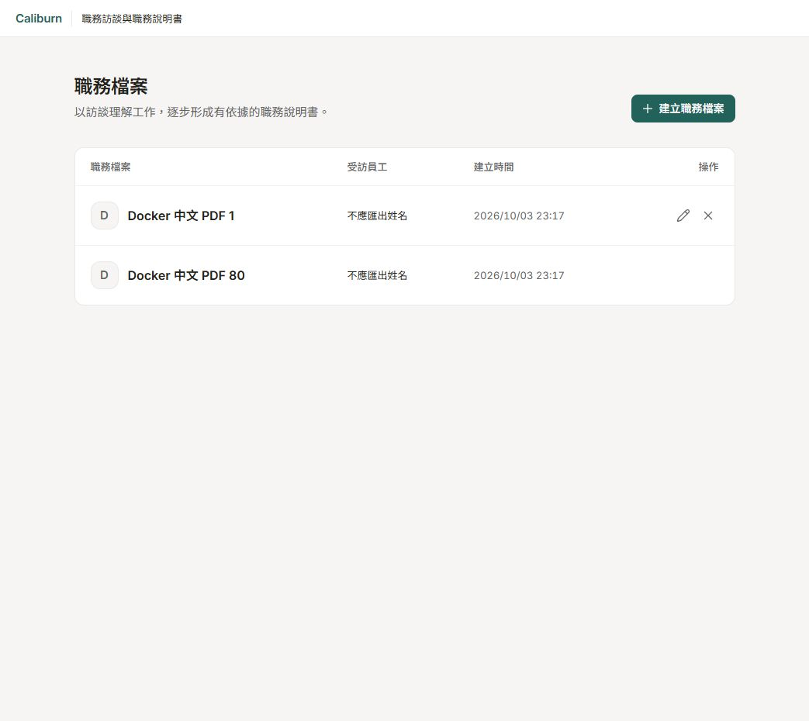

# 整份職務檔案刪除驗證

清單新增刪除整份職務檔案的入口，並沿用工作畫面的字型、色彩與細線。刪除須確認，包含該檔案的訪談原文、JD、Memory、引用及執行紀錄；不可復原，有未結束工作時拒絕。本頁記錄工程驗證，不新增模型分析品質結論。

## 問題與處理

原清單只有建立、選取與改名，HTTP 也沒有刪除入口。新增 API 前，四項案例得到 405，未符合成功 204／忙碌 409 的要求。共用前端傳輸原先將所有成功結果當成 JSON 解析；新增兩項案例重現空正文 204 解析失敗，以及未保留 `job_file_busy` 公開錯誤碼。

實作沿既有職務檔案 workflow：短交易先鎖定檔案，拒絕未結束工作，再由外鍵 cascade 刪除業務資料。原生 checkpoint 使用官方 Saver 清理並借用同一交易連線，不另做保存或清理引擎。不可變記錄的原保護保留，只有刪除整份檔案時才允許移除。前端收到成功後才更新清單；回應遺失可對同一檔案重試，未確認時不先隱藏資料。

PostgreSQL 的 [cascade](https://www.postgresql.org/docs/current/ddl-constraints.html#DDL-CONSTRAINTS-FK)／[trigger 條件](https://www.postgresql.org/docs/current/sql-createtrigger.html)及鎖定 `langgraph-checkpoint-postgres 3.1.2` 原碼是機制依據。`AsyncPostgresSaver.adelete_thread` 清除三類原生記錄；故障注入另驗證它未自行提交呼叫方的交易。產品契約見[保存規則](../../implementation/interview-storage.md#11-整份職務檔案刪除)與[介面](../../implementation/interface-and-delivery.md#11-讀寫邊界)。

## PostgreSQL 測試

使用本機 Docker PostgreSQL 的獨立測試 database `caliburn_docker_test`，每次由既有 fixture 建立隨機 schema，不操作示範檔案或其他實驗 database，不呼叫模型。

新增七項測試包含：

- 刪除有正式訪談、JD 與已發布兩層 Memory 的檔案；其所有業務資料與三類原生 checkpoint 消失，另一同名檔案保持原狀。
- A 執行中、A 暫停、Memory 執行中三種情況分別拒絕，原資料不變。
- 單獨刪除訪談原文或已完成的執行紀錄仍被資料庫拒絕；直接 SQL 刪除忙碌檔案也被擋住。
- 原生 checkpoint 已清除後注入錯誤，驗證業務資料與 checkpoint 一起回滾。
- 輸入准入與刪除同時競爭；只允許「輸入成功／刪除拒絕」或「刪除成功／輸入找不到檔案」，不留下孤立工作。

七項新增測試通過。與 migration、建立、改名、Memory 修訂／位置、執行預算、JD 來源及 profile 的相關回歸一起執行，共 **135 項通過**，exit 0。之後補強直接 SQL 保護及三類 checkpoint 的實際清除／回滾，再跑七項刪除測試，全部通過。分層依賴測試另有 **28 項通過**。共用 HTTP 傳輸六項測試通過，包含兩項新增反例。

本輪 PostgreSQL 命令（不印出憑證）：

```powershell
apps/api/.venv/Scripts/python.exe -X utf8 docs/experiments/engineering/2026-10-05-occupation-reference-tools/run_tests.py apps/api/tests/integration/test_database_migrations.py apps/api/tests/integration/test_job_files.py apps/api/tests/integration/test_job_file_rename.py apps/api/tests/integration/test_job_file_deletion.py apps/api/tests/integration/test_memory_revisions.py apps/api/tests/integration/test_memory_position_storage.py apps/api/tests/integration/test_execution_budgets.py apps/api/tests/integration/test_jd_source_persistence.py apps/api/tests/integration/test_jd_profile.py -q --tb=short
```

## 介面與示範站

清單新增六項行為測試，包含取消／初始焦點、204 前保留資料、同檔案 cache 清除、409 拒絕、未知結果原目標重試、503 不顯示內部訊息與既有改名。新增功能完成後，前端完整回歸為 **44 檔／278 項通過**。實機另發現舊的「新架構開發中」標籤；在 App 測試重現後移除，再跑 App、刪除與 HTTP 三檔的 **28 項測試，全部通過**。TypeScript、production build、ESLint、Prettier、後端 Ruff／mypy 與生成契約檢查通過；mypy 核對 320 個 source files。建置仍有既有 bundle 大小提醒，未列為阻塞。

## Docker 實機檢查

示範站為 `http://127.0.0.1:8105/`，Compose project 維持 `caliburn-jd-docker-test`。最後映像為 `sha256:39499a1ae3df5c67cab3e8117cf17e3c1acd5f3d30e00a686d86c6936b28df16`，App 容器建立於 2026-10-05 23:00:33（臺灣時間），狀態 healthy；資料庫 head 為 `0025_job_file_deletion`。

部署前確認沒有 active／paused 工作；沿用原 PostgreSQL 容器與 volume，只重建及替換 App。先以 API 建立「刪除功能驗證（合成資料）」作測試：瀏覽器開啟確認視窗，初始焦點在取消，取消後檔案仍存在且沒有導航。再以 API 刪除該測試檔，回 204、正文長度為零；重送回 204，回讀為 404。原有兩份檔案 ID 與測試前一致。

390 × 844 的窄螢幕中，清單保留名稱、受訪者、改名及刪除入口；文件 clientWidth 與 scrollWidth 均為 390。確認視窗文字與按鈕可見、取消正常，檢查後重設 viewport。頁首清理後再載入最後映像，確認開發標籤消失及原有兩份檔案仍可選取。實機只測確認／取消；確認後的前端提交與 cache 清理由行為測試驗證，實際刪除結果由 API／PostgreSQL 驗證，不混寫成一次完整瀏覽器端到端刪除。

安裝後與工作目錄的兩份關鍵程式 SHA256 一致：

| 程式 | SHA256 |
|---|---|
| `workflows/job_files.py` | `8904b6ae1cf339fe568ba6780586f1145b2f14413efaeb384dd89be8270275e0` |
| `migrations/versions/0025_job_file_deletion.py` | `5b1f60f9a7439af4886deafc1118ef3bc04e196e4f824cb34890ddbc13be9bcd` |

建置使用本輪未提交的工作目錄；以上映像與雜湊辨認實際部署版本，不以 Git HEAD 冒充建置內容。本輪沒有提交真模型訪談；刪除的只有新建合成測試檔，不刪原有檔案、資料庫或實驗 volume，也沒有 commit、push 或 merge。



## 取消與保存競爭的接續驗證（2026-10-06）

提交前審查找到一個初版測試未覆蓋的窗口：取消交易已提交，但原執行仍在收尾；若只按資料庫的 terminal 狀態准許刪除，延遲的原生保存可能在刪除之後重建 checkpoint。以事件控制的顧問取消、顧問完成與 Memory 完成反例，三種情況都重現初版未拒絕刪除。修正沿現有監督程序的派送鎖與任務清單，不新建工作登錄或恢復系統。

接著核對鎖定版 `langgraph 1.2.12` 的 `AsyncPregelLoop.__aexit__` 與 `AsyncBackgroundExecutor.__aexit__`，發現已取消的 exit Task 不代表提交給 executor 的 Saver 已停止。等候框架交回的已知 Task 可以保留部分收尾工作，卻不能單獨證明所有保存已結束。真 PostgreSQL 的兩項反例再次重現：刪除先成功後，官方 `aput` 或 `aput_writes` 仍能寫回已刪檔案。

最終修正放在 checkpoint Adapter。它借用官方 Saver 的原連線、序列化與公開寫入方法；所屬檔案的 `FOR KEY SHARE` 與真正的原生保存放在同一連線、同一交易。寫入開始在先，刪除須等保存完成再清理；刪除完成在先，後到的寫入找不到根記錄，直接拒絕。保存任務受取消時，先等這次實際寫入及交易結束，再傳回原取消；重複取消不提早放行。沒有改動 LangGraph 私有原碼、原生表格式、模型工具或產品取消語義。

依據為 [PostgreSQL 列鎖互斥](https://www.postgresql.org/docs/current/explicit-locking.html#LOCKING-ROWS)、[psycopg 交易](https://www.psycopg.org/psycopg3/docs/basic/transactions.html#transaction-contexts)及 [asyncio 的 shield／取消](https://docs.python.org/3/library/asyncio-task.html#shielding-from-cancellation)。平台原碼用來確認實際邊界，不把框架的 Task 退出當成業務資料安全保證。

接續測試分為三層：

- 行為反例：兩項「刪後遲到寫入」先失敗，再通過；刪後三類原生表皆為零。
- 競爭回歸：執行鎖定版框架的實際 exit／executor 方法，驗證已取消 exit carrier 下的遺留保存；另驗直接取消 Saver 與重複取消，三種情況都先完成保存交易，再完成刪除。這三項是在修正後補上的回歸，不計為先 Red 的案例。
- 原有恢復：保留原模型結果的取消案例，增加監督邊界變體；不重新請求模型，也不以取消換取採用資格。已知 Task 的 join 另有四項先失敗再通過的單元反例。

刪除、顧問控制與兩個監督程序的真 PostgreSQL 回歸 **32 項通過**；取消／原結果及依賴邊界等定點單元測試 **83 項通過**。測試只使用本機 `caliburn_docker_test` 的隨機 schema，沒有模型外送或示範資料變更。

最終擴大至 migration、檔案管理、Memory、JD 來源、公版工具、原請求重入及最終失敗處理，共 **227 項 PostgreSQL 測試通過**，exit 0。`pnpm check` 亦為 exit 0：啟動器 5 項、後端單元／契約 1,407 項、前端 45 檔／285 項均通過；Ruff、mypy（322 個 source files）、TypeScript、ESLint、生成契約與 production build 通過。建置保留既有 bundle 大小提醒，未新增瀏覽器 e2e 或真模型驗證。

上述最終程式與測試保存於提交 `6750be5d8`（`feat(app): add safe job-file deletion and refine interview controls`），不是上節的 Docker 建置。

```powershell
apps/api/.venv/Scripts/python.exe -X utf8 docs/experiments/engineering/2026-10-05-occupation-reference-tools/run_tests.py apps/api/tests/integration/test_job_file_deletion.py apps/api/tests/integration/test_consultant_controls.py apps/api/tests/integration/test_consultant_supervisor.py apps/api/tests/integration/test_memory_supervisor.py -q --tb=short
```

一輪較早啟動的廣套曾得到 209 通過／1 失敗：測試替身只寫 Memory 完成狀態、沒有真正發布快照，監督程序依未發布意圖啟動下一批，因此刪除仍被正確拒絕。修正替身改走既有 handoff／publish，不改產品去配合測試；上述 32 項採修正後替身。

本節的新防護尚未重建到上節 Docker 映像；上節映像與雜湊仍代表當時實機，不代表目前新增的保存防護。此次驗證不新增真模型分析品質或重新部署的結論。
