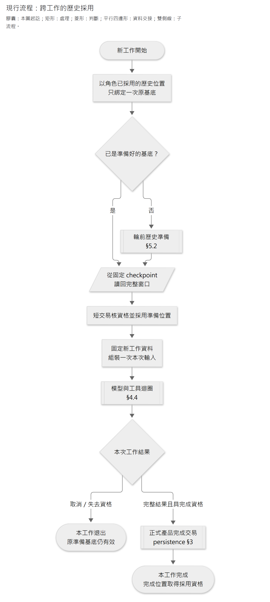
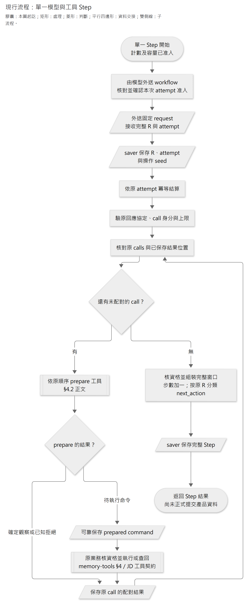
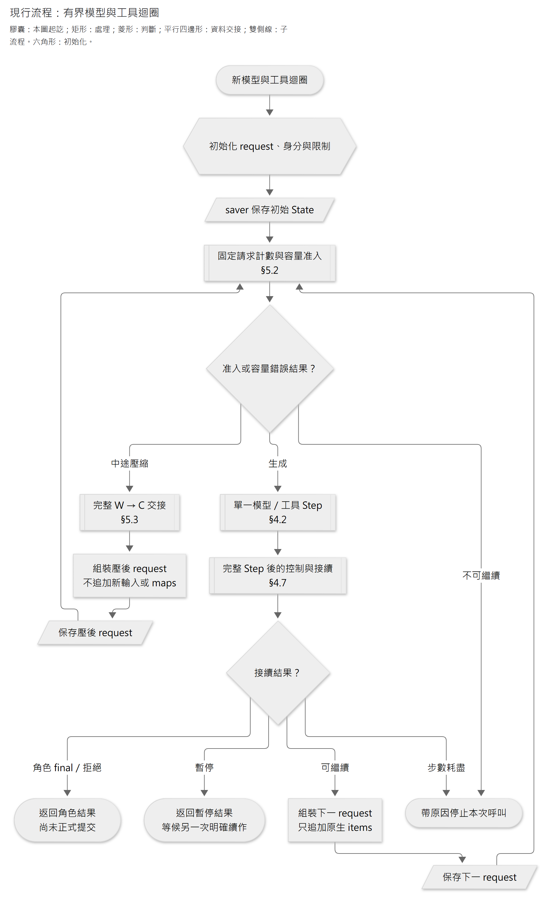
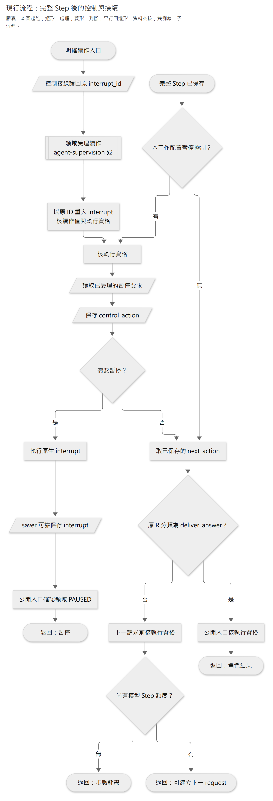
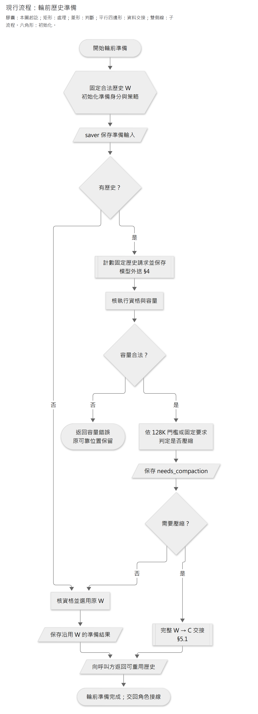
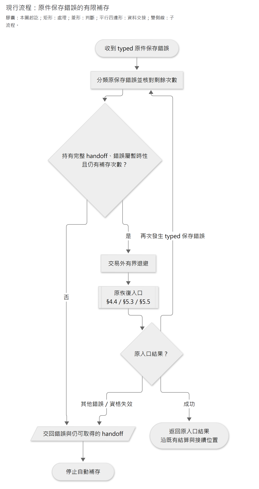

# Agent 原生接續與可恢復接線

- 狀態：**現行共用執行接線** 。A／B1／B2 共用原生接續、Step 控制與恢復。驗證見[架構驗證](../architecture/verification.md)；機制接通不等於所有恢復分支或模型品質已驗。
- 驗證分假模型供應端＋真實 checkpoint 保存／PostgreSQL、有界真模型及產品旅程。新驗證依當次有效授權進行，不把模型自述或推理摘要當驗收證據。
- 已確認但未實作的調整：[驗證範圍與限制](../architecture/verification.md)。本文仍記載現行原生接線；目標須調整輪前結果型別／採用及 B 輪中候選導覽投影，不能只換 Prompt 就宣稱完成。摘要 Prompt 待討論，未改下面的現行節點、工具 wire 或驗證結論。

本頁維護原生窗口、模型與工具 Step、壓縮採用及原件補存。[模型外送、容量與費用](model-requests.md)及[程序監督、控制與背景調度](agent-supervision.md)分頁維護，原章節保留連結入口。

**Graph** 是 LangGraph 的執行流程；**State** 是流程承接的進度與恢復資料；**saver／checkpointer** 是保存 checkpoint（執行快照）的框架介面。業務模組判定資料能否正式採用，Graph 保存可接續的位置；恢復時兩者共同核對。

後文的 **R** 指一次完整模型回應，**W** 指完整有效接續視窗（可含先前壓縮結果），**C** 指原生壓縮返回的完整 `compacted.output`；W → C 表示壓縮前後的視窗交接。不把 C 當成單一文字摘要。

本頁各圖表達**控制順序**。膠囊形是該圖的進入／退出；矩形是處理；菱形是分支；平行四邊形標出 provider、saver 或呼叫方的資料交接；兩側雙線矩形是另處已定義的子流程，框內附章節位置。初始化使用六角形。圖中的保存動作不是資料庫實體，因此不畫成圓柱；子流程分圖也不表示程式另建 Graph／thread。分類依[圖面規範](documentation-standard.md#32-在-mermaid-中落實並核對)。

| 維護問題 | 閱讀位置 |
|---|---|
| 哪些資料進 State？角色怎麼共用 Graph？ | [Graph 責任](#1-執行圖與業務資格分開)、[State 型別](#2-state-的最小型別分組) |
| 新工作、同工作恢復與取消後接續如何區分？ | [私有歷史與回退](#3-thread私有歷史與回退接線)、[合法歷史選用](#31-跨工作的合法歷史選用) |
| 模型與多工具結果如何保存、配對、暫停？ | [原生回應](#41-原生回應邊界)、[單一 Step](#42-單一模型工具-step)、[多 Step](#46-有界多-step-接續)、[暫停](#47-完整-step-暫停與原生續作) |
| 何時準備／採用壓縮窗口？原件存不進去怎麼處理？ | [完整 C](#53-完整-c-保存採用與中途接續)、[輪前準備](#55-輪前歷史準備元件)、[有限補存](#56-原件補存的有限自動恢復)、[首請求容量](#59-首請求超量的近期訪談縮減) |

## 1. 執行圖與業務資格分開

`agent_execution` 提供 A／B1／B2 共用的 StateGraph node 組合；角色 runner 經 bootstrap 接上相同 SDK、官方 saver 及持久預算。各角色提供 instructions、允許工具、起始資料 projector 及結束結果轉譯，共用模型與工具的執行迴圈。

Memory Parent 編排 B1、B2 與領域交接服務，不寫第二套 validator。本節節點表描述責任切點，不要求程式恰好採同名 node；實際接線與驗證分見 [本機 A 監督](agent-supervision.md#1-本機-a-supervisor)、[Memory 背景調度](agent-supervision.md#5-memory-背景工作) 。

責任切點如下，節點名稱是工程名稱，不是對模型公開的新工具：

| 節點 | 保存／動作 | 禁止 |
|---|---|---|
| `prepare_context` | 核新工作綁定、已採用基底；追加一次 App 資料及必要輸入；保存原位置 | 同工作恢復刷新 maps、重複員工原話 |
| `count_input` | 用固定 request 計數；外送沿共同額度；保存結果後才作容量准入 | 計數失敗當零、重查已保存計數、把計數當模型 Step |
| `request_model` | 容量／外送資格通過後呼叫 SDK；保存完整 R、原 calls 與 App 操作身分 | 同一未持久 node 內直接做寫入工具 |
| `account_response` | R 已保存後，以原 attempt 冪等結算；失敗恢復不重呼模型 | 把記帳失敗變成原 R 遺失、把取消當未付費 |
| `prepare_tool` | 有業務效果的 call 先解析目前目標，形成固定命令與有界回傳，可靠保存後才執行；純讀取可直接走讀取路徑 | 工具重入重新解析舊 title、把預期成功文字當已提交 |
| `execute_tool` | 每次處理一個已存 call；原業務核對／執行，保存配對結果；按原 output 次序前進 | 多個相依寫入平行；用最新資料冒充舊讀取結果 |
| `finish_step` | 確認所有 calls 有確定結果；保存可用 Step 位置 | unresolved call 當完成、將此點當正式提交 |
| `apply_control` | 查持久取消／暫停資格，合法時原生 interrupt；否則 route 完成或下一步 | interrupt 前放不可重複副作用；UI 已按暫停就宣稱已停妥 |
| `compact_context` | 合法輪前／160K 交界，取得完整 C 並可靠採用 | 只存摘要、重加起始資料、讓輪中 C 越過取消基底 |
| `deliver_result` | 交給 consultant_turn／memory_batch 協調服務；查原完成結果可重入 | Graph END 自行宣告 JD 或 Memory 已發布 |

Graph 入口使用 `durability="sync"`。**native super-step 不等於上述完整 Step** ；每個 node 結果可靠保存才容許下一個有副作用 node。未保存的 node 可能重入，靠業務 operation 保護效果。[LangGraph persistence](https://docs.langchain.com/oss/python/langgraph/persistence)

## 2. State 的最小型別分組

Graph State 保存執行與恢復所需的資料：不可變工作綁定的參照、原生有效窗口／採用位置、原回應與待處理 calls、候選固定位置及操作結果定位、控制／路由所需資料、已計入的執行計量。

**State 不會全部送入 LLM。** 模型 input 由 App 依契約組裝；目前分析焦點、猜想等也不強制成為模型每 Step 必填欄位。

原生窗口 channel 使用明確的「追加 items」與「可靠採用完整 compacted output」操作；不能套會按 message ID 合併覆寫的通用 MessagesState／`add_messages`。serializer 保存 JSON-compatible 原生資料；output→input 轉換只按官方契約，不刪 reasoning／phase／call metadata。`status` 等 output-only 欄位按實際 SDK input 規則轉型，**保存原輸出** 與**合法重送表示** 分開驗，不能機械送所有 response envelope。[OpenAI 原生接續範例](https://developers.openai.com/api/docs/guides/deployment-checklist#use-reasoningencrypted_content)

Runtime context、Graph State 與模型 input 使用不同型別，分清執行依賴、保存進度與本次請求內容。SDK client、DB session、工具實作與密鑰經由依賴注入取得，不進 State；候選正文由領域保存，State 不存另一份可寫副本。

[Memory 寫入接縫](memory-tools.md#4-寫入準備採用與原結果接續)提供 immutable prepared command，可能含已計算的新正文及成功回傳。這是待執行原操作，不是另建可編輯候選。Runtime 在業務 execute 前可靠保存它；恢復以同一命令核對原結果，不重新 prepare 或解析已改指別人的 title。純讀工具的結果也保存後沿原 call 接續，不以現在資料冒充當時觀察。

## 3. thread／私有歷史與回退接線

每個 A 執行工作有獨立 Graph thread；Memory Parent 及各角色有可辨認的執行身分。新工作從該角色**已採用的合法歷史位置** 取得原生窗口，不從任意最新 checkpoint 猜。跨 Turn 延續的是原生 items，不要求 API `previous_response_id`，也不要求所有 Turn 共用一條可被晚到 callback 污染的 thread。

B1／B2 各自保留私有歷史；同一階段中斷後沿原 thread 接續，下批再承接各自已採用的歷史。角色 Graph 由 Parent 依 B1 → B2 順序呼叫；Parent 只接領域位置與完成結果，不交換完整私有 State，也不接受 B2 回交。不能手改 checkpointer 表或靠重建 namespace 假裝已恢復。

當前有效工作／已採用基底的參照由執行資格持有，checkpoint 存實際窗口。這不是第二套 session 日誌；只記「哪份既有窗口仍可採用」，不複製模型全文。取消、不可恢復回退或重新領取使舊 writer 失去提交資格；晚到 checkpoint 仍可能物理保存，但不可被下一輪當有效基底。

- 新工作：先完成輪前 compaction 安全採用，再固定 maps／來源等本輪綁定、加入員工輸入。
- 同工作故障：用最新可靠位置正常 resume，不指定舊 checkpoint 做 time-travel replay；有 interrupt 才用 `Command(resume=...)`。
- 有意回退到較早安全點：先使較晚工作資格失效，核對領域位置與 context 相容，再建立可執行分支；不能直接對舊 checkpoint invoke 並假設副作用會自動撤銷。
- A 取消：後續新輸入從合法輪前基底與正式資料開始；重試 a 在模型眼中仍是新輸入。
- Memory 回退：①是 B1 開始前的固定基準與候選起點，②是 B1 完成、B2 開始前的交接快照（[Memory 單向調度](agent-supervision.md)）。候選與各角色窗口一起回該位置；同批保留對應已採用輪前 compact，不重做它。中途較晚 compact 不跨越回退點。

跨工作接續與回退的驗證對應 E02／E08–E11，見[驗證對照](verification-plan.md)。調整 thread 組織仍須維持相同資格與回退保證，不增加第二套恢復引擎。

顧問工作計畫的產品用途及內容沿 [Plan 保存與採用](../architecture/persistence.md#plan-從本輪候選到後輪可採用)；本頁維護它與原生歷史的三個接縫：

- 共同 `FOCUS_INSTRUCTIONS` 提供訪談推進方法，Plan 專屬指引及 read／edit 工具維護同份 Markdown 的焦點、工作方向與剩餘訪談／分析／JD 整理工作。原捕捉工具能力決定 v1／v2，新輪固定原基底；舊 captured request 保留原指令與能力。
- 輪中 native C 沿共用流程保存與核帳後，A 的私有 `plan_projection` Graph 固定精確 C 位置與一個原計畫 item，父 request 採用完整 C＋該 item。
- completed 重入只核對原完成窗口、正式答覆及同 Turn final plan，回傳原結果；不再執行 active-only preview 或 native 外送。

### 3.1 跨工作的合法歷史選用

`features/executions/history.py` 管理**是否可採用** ；`workflows/context_history.py` 的 `RoleContextHistory` 將資格接到既有準備／模型 Graph；完整原生窗口仍只由官方 saver 保存。每份職務檔案、每個角色各有一個已採用位置，每次 execution 綁定一次原基底，不能因重開而改選目前最新 checkpoint。

| 保存責任 | 實際資料 | 不負責 |
|---|---|---|
| `context_history_heads` | 職務檔案＋角色目前可採用的 thread／checkpoint／窗口種類 | 原生正文、模型回應、Graph 路由 |
| `context_history_bindings` | execution＋角色的原基底、已準備位置及正式完成位置 | 第二套回執、候選正文、進度日誌 |
| 官方 checkpointer | 上述固定位置的完整窗口及原 Graph State | 判定 JD／Memory 是否正式完成 |

兩個 reference-only 關係由 migration `0016_context_histories` 與 executions 執行資格模組維護。所有採用均在短交易中核原 writer、scope／角色與已採用位置；saver／模型 I/O 不放進該交易。未找到明確 checkpoint 時失敗，不回退到任意最新值。

[圖源](../diagrams/implementation/agent-execution/history-adoption.mmd) · [SVG](../diagrams/implementation/agent-execution/history-adoption.svg)

圖為現行跨工作歷史採用流程，省略暫停與故障恢復；結尾不自動啟動下一份工作。取消分支表示採用資格的結果，不另寫一次準備基底。子流程依序見[輪前準備](#55-輪前歷史準備元件)、[角色迴圈](#46-有界多-step-接續)及[正式完成交易](../architecture/persistence.md#3-交易邊界)。

角色資料組裝、正式產品完成與歷史採用由 A／Memory workflow 協調；Graph 返回 final 不取代正式完成交易。

- `prepare_history` 只接收不含新輸入／maps 的 request template，歷史從綁定位置回讀；A 使用已確認的 128K 門檻。準備 Graph 保存成功、但採用交易尚未成立時，重入同一準備 thread 承接原結果。若已採用準備基底後取消，後續新工作直接重用同一基底，即使 C 仍很大也不因此重壓一次。
- `read_prepared_history` 只讀已採用的**輪前準備** 結果，不把輪中 compact 當取消後基底。`read_completed_response_history` 核保存的 final 路由及官方 StateSnapshot 沒有待執行 node／task；暫停中的 final、只有 R 或 pending writes，都不能直接成為完成歷史。完整 reasoning、message、工具往返保留原順序，回傳獨立複本。
- 讀取固定 checkpoint 是純查詢，不是 `invoke` 歷史位置做 replay。同工作續作仍走原 Graph 的最新可靠執行位置；取消後的新工作則只取領域已採用的位置，兩者不能混淆。
- `complete_context_histories` 由產品協調方在**同一正式完成交易** 中呼叫：A 採用一個角色；Memory 同時採用 B1／B2，不容許只完成一邊。它核各自的原準備基底並由執行資格模組完成 execution；JD、正式訪談及 Memory 發布不在此重寫。產品協調方仍須先驗真實 Graph 完成及相應業務資格。
- COMMIT 確認遺失時重交原完成位置，只核對原結果，不倒轉後來已前進的歷史。取消、暫停要求及被替換 writer 不得採用晚到內容；取消不刪 saver 原件，但那些原件不再具備跨工作採用資格。

依據：[LangGraph 官方 checkpoint／歷史查詢](https://docs.langchain.com/oss/python/langgraph/checkpointers)區分完整 checkpoint 與 pending writes；[PostgreSQL 行鎖](https://www.postgresql.org/docs/current/explicit-locking.html#LOCKING-ROWS)提供短交易序列化。跨工作採用、角色隔離及取消保留準備基底是 Caliburn 的產品取捨，不是框架自動保證。

## 4. Requests 與工具

`openai_responses.py` 明確設 `store=False`、`reasoning.context="all_turns"`，不帶 response chaining／server-side compact／silent truncation。instructions 與 tools 在 request 層明確提供，並保留原生 items；SDK 的默認 retry 關閉，由 Runtime 在有界預算內分類處理。

起始順序依角色權威：歷史／完整 C → user-role App 資料 → A 的本輪 user 原文 → 後續原生模型／工具項目。A JD map 按需，不放回起始 context。B1 無理解導覽／工具，B2 無情境寫入工具。App 資料 user-role **不等於防注入已完成** ；service 仍驗權限與來源範圍。

一次 response 可能零／一／多 calls，也可能有公開中間文字。以原生項目與尚未完成的 calls 路由，不能憑 `output_text` 非空或 response.completed 當 Turn 結束。每一 call 都保留 call_id 與結果，已拒絕可回確定錯誤，未知效果先對帳。[OpenAI function calling](https://developers.openai.com/api/docs/guides/function-calling#handling-function-calls)

模型不填 version／job_file_id／budget／operation；工具 handler 收 Runtime binding，轉譯成領域命令。傳給模型的 schema 只包含被授權角色的動作；不新增 generic execute、SQL 或任意文件操作。

### 4.1 原生回應邊界

`adapters/response_serialization.py` 承接 SDK `Response`／`CompactedResponse`，不自製 provider 格式：

- 保存原件使用 `model_dump(mode="json", by_alias=True, exclude_unset=True)`；保留全部已收到欄位、usage、opaque content、原 status 與額外 provider metadata。`by_alias` 保持原 `async`，不把 Python 的 `async_` 寫成 wire 欄位。恢復以同一 SDK schema 驗原件，不能只存 `output_text`。
- 一般模型 output 的出站投影保留完整項目，只依官方部署範例排除各項頂層 `status`，不修改原件；`phase`、call metadata、內容順序及未知附加欄位不裁掉。Reasoning 頁的 Python 範例未排除此欄，故本案選部署範例作最小投影並保留 provider gate；離線 SDK 會發送不等於遠端已接受。
- Standalone compact 保存整份返回，採用時取其**全部 output** ，含保留項目，不只選摘要、不再添加舊輸入。SDK 3.20.0 的 output union 過窄，不能拿它重驗可能保留的 user/input_text；保存使用 SDK `to_dict(mode="json", warnings=False)` 保留實際欄位，避免已知型別警告印出原話，採用時僅核 output 容器並複製完整窗口。不自訂替代 provider schema。安全採用見 [完整 C 保存、採用與中途接續](#53-完整-c-保存採用與中途接續)；SDK 模擬傳輸與遠端接受須分層驗證。[官方完整 window 契約](https://developers.openai.com/api/docs/guides/compaction#standalone-compact-endpoint)
- 工具結果用原 call_id，保留 direct caller；已保存結果序列只能是原 calls 的有序前綴，不能跳過、重複或交換配對。原操作冪等與 Graph 保存仍是另外兩個責任。

`agent_execution/response_steps.py` 只從完整原件推導路由，**不執行工具或宣告正式完成** 。完整 response 內有 calls 時先走工具，即使同時有 final 文字也不結束；只有 commentary／reasoning 或空白 final 時繼續；無 calls 且有非空白 final 文字／拒絕時才交給產品完成責任。公開文字只取 assistant message，reasoning 不進公開訊息列表。

未完成 response／item、error、不一致的 incomplete details 不准派送工具。重複或空 call 身分、未配置的 builtin、program／async／namespace 協定或沒有可辨認 phase，明確停下，不默默忽略或猜 final。這是本產品**目前只支援 direct local functions 與明確 phase** 的防護，不是 API 本身禁止那些能力；真模型預檢若顯示合約差距，要查證調整而非無限重試。原回應須先保留，之後才做此檢查。

依據： [stateless 接續](https://developers.openai.com/api/docs/guides/reasoning#preserve-reasoning-without-stored-responses)、[部署範例](https://developers.openai.com/api/docs/guides/deployment-checklist#use-reasoningencrypted_content)、[phase](https://developers.openai.com/api/docs/guides/deployment-checklist#set-up-the-assistant-phase-parameter)、[多工具配對](https://developers.openai.com/api/docs/guides/function-calling#handling-function-calls)，以及鎖定 OpenAI 3.20.0 的 input/output 型別。

驗證：原生回應與 saver。純原生 items 不需 pickle 或自訂 msgpack 型別還原；prepared command 的型別 allowlist 見下一節。`sync` 不代表框架與業務共用一次交易，也不保證尚未保存的回應永遠可取回。

### 4.2 單一模型／工具 Step

`agent_execution/tool_steps.py` 使用 `request_model → account_response → prepare_tool → execute_tool → prepare_tool → finish_step` 的責任順序；生成前另經計數及容量准入。純讀／已知拒絕由 prepare 保存觀察，不進 execute。所有 call 處理完才形成新完整窗口；[有界多 Step 接續](#46-有界多-step-接續) 的共用 loop 承接下一步，A／B1／B2 不各寫一套迴圈。

[圖源](../diagrams/implementation/agent-execution/model-tool-step.mmd) · [SVG](../diagrams/implementation/agent-execution/model-tool-step.svg)

這張圖展開 [§4.6](#46-有界多-step-接續) 的「單一模型／工具 Step」子流程，只畫成功及確定拒絕路徑；資格、協定或保存失敗沿原錯誤責任退出。平行四邊形標示遠端回應、命令及結果跨 provider／saver 的交接；處理矩形標示核對、結算與組裝。`prepare` 的讀取／命令分流依本節下文；寫入接縫見 [Memory 工具](memory-tools.md#4-寫入準備採用與原結果接續)，JD 工具依[保存與工具契約](jd-storage.md)。**同一原 R 有 calls 時，`next_action` 仍為繼續，即使同時有 final；完成 calls 不會將它改判為 final。**

- 正常入口 `run_response_step` 統一指定 `durability="sync"`，依本次允許 call 數設定有界 graph recursion limit；超過 call 上限在派送前拒絕。框架 super-step 數與模型 Step 數不是同一上限。只在隔離故障測例使用私有 builder，不讓角色自行選保存模式。
- 單 Step 入口使用獨立 thread；多 Step 入口讓**整次 loop 共用同一 thread** ，不要求每次迭代新建 thread。新輸入不得覆蓋已有 thread，只有 `None` 能恢復它，沒有保存位置也不能假裝恢復。入口讀取檢查不是競爭鎖，單 writer／工作資格仍由執行資格模組保證。使用官方 `GraphOutput.value` typed 返回，不自造圖結果格式。
- 原回應先保存，下一節點才檢查協定／工具。未知 phase 等被拒絕時，R 仍可回讀；不是先丟掉 R 再宣稱可恢復。操作 seed 和 R 同存，每個 call 從 seed＋原 call_id 得到穩定 App 操作身分，不由模型指定業務 ID。
- 寫入 prepare 的命令先保存，execute 才交給相應的 JD／Memory 領域模組。工具結果僅按原 calls 的有序前綴增加，下一筆 prepare 能看見上一筆已成立的候選；不平行派送。恢復不重新解析已保存命令的標題／正文，也不重算成功回傳。
- `ResponseStepRuntime` 注入模型、結算、工具與資格 I/O，不持久化 SDK client／DB session。共用 State 不理解 Memory 命令內容；工具接線必須核對還原型別及原工作資格，業務效果仍由 JD／Memory 領域模組的交易／冪等機制處理。
- `adapters/graph_checkpointer.py` 只配置官方 `JsonPlusSerializer`：關閉 pickle 與 legacy JSON 自訂 constructor；自訂 msgpack 型別由實際 caller 明確 allowlist，不建立 domain registry。Memory prepared create／revise／delete 的巢狀 dataclass、Enum、UUID、frozenset 已驗。框架 4.2.0 對未允許型別會降為 dict／原始值，且 tuple 會變 list，不能拿值相等當型別正確；本 Step 原生集合用 list，Memory prepared 無 tuple 欄位。不補第二套 codec。

驗證：Step 保存與有序工具。假 provider＋真 PG 可驗原件保存及效果不重複，不證明真模型品質。

驗證：A Runner 程序恢復。原件已保存後接續與原件遺失後再推論是不同能力；本機 `sync` 不是 provider、業務與 checkpoint 的共同交易。

checkpoint 與 pending writes 同時失敗時，`astream` 不保證能交出 node update；原回應由 [原回應補存與資格接線](#44-原回應補存與資格接線) 的 typed recovery 補存，不依賴呼叫方手寫 Graph update。

執行／預算准入、控制、角色歷史及 compact 分別依 [thread／私有歷史與回退接線](#3-thread私有歷史與回退接線)、[完整 Step 暫停與原生續作](#47-完整-step-暫停與原生續作)、[容量、重試與恢復不是同一政策](#5-容量重試與恢復不是同一政策)、[本機 A 監督](agent-supervision.md#1-本機-a-supervisor)、[Memory 背景調度](agent-supervision.md#5-memory-背景工作) 接入。依據：[durable execution](https://docs.langchain.com/oss/python/langgraph/durable-execution)、[saver／sync／pending writes](https://docs.langchain.com/oss/python/langgraph/checkpointers)。

### 4.3 直連請求與失敗分類

詳細機制已集中至[直連請求](model-requests.md#1-直連請求與失敗分類)；此處保留既有連結入口。

### 4.4 原回應補存與資格接線

`run_response_step` 在模型 node 返回前保留完整原 R、固定原 request 及同一 operation seed；僅在尚未進入下游節點的保存失敗時，以 `ResponseStepSaveError.recovery` 交還程序內的 `HeldModelResponse`。一般結算／工具／協定／資格錯誤仍保持原分類，不一律轉為可重試保存錯誤。這不是另一份持久 ResponseStore，不寫入業務表、模型 context 或一般 log。

- 仍握有 recovery 時，以同一 thread、`request=None`、`recovery=...` 回到公開入口。先查官方 saver／原 request 身分；任何採用與執行仍須通過工作資格；不呼叫模型、不由呼叫方自行改 Graph State。無採用資格的晚到 R 只允許原計量，詳 [外送與結算](model-requests.md#2-固定請求一次外送與保存後結算)。
- 原 R／seed 已在 checkpoint 或 pending writes 時核對相符，沿目前位置恢復，**不覆寫之後的 prepared command、工具結果或完成視窗** 。此時立即釋放該次呼叫的暫存保存責任，避免直接恢復 execute node 的工具／資格錯誤被誤分類。
- 原 R 尚未保存時，必須仍在原 `request_model` 邊界、原 input 相同且無後續效果資料；再查資格，以官方 `aupdate_state(as_node="request_model")` 補存原 update，然後正常 `None` 接續。不同 thread、不同 input、不同已存 R／seed 或不相容位置拒絕，不猜測、不回退。
- 查詢／補存再次失敗，仍交還同一原件；沒有自行循環、重新推論或增加付費請求。是否與何時重試由工作 supervisor 的單一有界政策承接；程序整個消失且兩種保存皆失敗時，不保證記憶體原件可恢復。`store=false` 不能靠 response ID 補取遺失內容。
- `ResponseStepRuntime.ensure_active` 是必要注入，入口、模型／工具 I/O 前、完成 Step 及交回結果前均檢查。產品接線用執行資格模組保存的原 scope／writer，短交易結束後才做模型 I/O；不把 DB session 或 writer 狀態塞入模型 input。單一 writer 調度仍由外層負責，這不是新的租約實作。
- Guard 與 saver／provider 不共用原子交易：取消後晚到 R 仍可能物理保存，但不能派送工具或交付有效結果。業務工具還須在自己的提交交易內核資格；A／Memory workflow 決定有效 Turn／批次基底，不能把任意 latest checkpoint 當成可採用歷史。

驗證：原回應補存與資格。機制依 [LangGraph 狀態更新與接續](https://docs.langchain.com/oss/python/langgraph/use-time-travel)；只在核對原位置後補存既有 R，不以舊 checkpoint replay 重算外部工作。自動補存見 [原件補存的有限自動恢復](#56-原件補存的有限自動恢復)，不能恢復已遺失且未持久保存的原件。

### 4.5 固定請求、一次外送與保存後結算

詳細機制已集中至[外送與結算](model-requests.md#2-固定請求一次外送與保存後結算)；此處保留既有連結入口。

### 4.6 有界多 Step 接續

`run_response_loop` 與單步入口共用原 StateGraph、原生 State 及恢復接線，只增加完成 Step 後的條件路由與 `prepare_next_request`。不是在外層手動另存 cursor，也不為每次模型迭代建 child graph／thread。官方支援 conditional edges 與持久迴圈；採這個較小組合是本案取捨，**不宣稱所有大廠用同一個 loop** 。[LangGraph Graph API](https://docs.langchain.com/oss/python/langgraph/graph-api#conditional-edges)、[OpenAI 工具接續](https://developers.openai.com/api/docs/guides/function-calling)

[圖源](../diagrams/implementation/agent-execution/response-loop.mmd) · [SVG](../diagrams/implementation/agent-execution/response-loop.svg)

這是現行共用 loop 的總覽。雙側線框分別展開於[計數與准入](#52-固定請求計數與容量准入)、[完整 Step](#42-單一模型工具-step)、[W → C 交接](#53-完整-c-保存採用與中途接續)及[Step 後控制](#47-完整-step-暫停與原生續作)，不是新增程式子圖。容量拒絕是准入節點拋出的錯誤，不是新增的已保存路由值。中途壓縮仍以完整 Step 後達 160K 為門檻；同一未增長 C 仍超門檻時停止。A 首請求可縮減時另走[近期訪談縮減](#59-首請求超量的近期訪談縮減)，本圖省略此支線及資格／保存故障。明確續作沿原 interrupt 位置進入控制流程，不從圖頂重新初始化或重送模型；角色 final 仍須另經正式完成交易。

- 每次模型 Step 可有多工具，全部依序完成後才接下一請求；工具旁有 final 文字仍先處理 calls，只有 commentary 的完整回應則繼續。下一請求只替換 input 為已完成窗口，不重新取 maps／指令／模型設定，不改歷史、不重加起始輸入。
- 同一 loop 的模型步數上限、每回應工具上限在初始 checkpoint 固定。`completed_steps` 由完成 Step 前進，恢復不歸零；不能用較大上限或單步入口繞過原 loop 限制。最後准許的一步若有合法 final，仍可交回；需要再呼叫才觸發 `ModelStepLimitError`，保留最後完整窗口，不偽造收尾答覆。
- 這是**單次角色 loop 的局部上限** ；整個工作／Memory batch 的計量、時限與重試共用額度仍由 [持久工作額度](model-requests.md#3-工作額度保存) 的執行模組負責。LangGraph `recursion_limit` 只是本次 graph invoke 的 super-step 防護，依有限工具／模型步數配置，不代替產品計量。
- 下一 request 的新 logical ID／完整 payload 先經 sync 保存，才可外送；只有完成前一 Step 才產生新 request。清除當前 response 欄位，避免把前一步 R 認成下一步的 R。第二步以後同樣可承接 Held 原件；後來步驟不能拿舊 handoff 倒轉目前位置。
- 初始 input checkpoint 可能尚未展開成 State（`values` 空、`next=__start__`）；由原生 Graph 恢復原輸入，於 request node 外送前核對原限制。不因尚未展開便拒絕正常恢復，也不讓恢復參數改寫初始限制。
- 已完成 loop 再 resume 不新增模型／工具／items。恢復不指定舊 checkpoint ID；工具失敗只承接當前 prepared command。全部共用單步原 R 保存、結算與業務冪等責任，沒有新增保存系統。

驗證：多 Step 接續。圖中的返回只是角色結果；A Turn／Memory batch 的正式完成仍由 [本機 A 監督](agent-supervision.md#1-本機-a-supervisor)、[Memory 背景調度](agent-supervision.md#5-memory-背景工作) 與各領域模組協調。

### 4.7 完整 Step 暫停與原生續作

**分開控制意圖與已停妥的證據。** `executions` 執行資格模組保存 `pause_requested`，不是新控制表或第二套 Graph 進度。`request_pause` 用職務檔案／execution／kind 範圍受理，不要求 UI 持有 worker 身分；受理後仍為 ACTIVE，當前模型與有序工具可以完成。只有原生 interrupt 已可靠保存，Graph 才經 `ConsultantExecutionControls.mark_paused()` 呼叫領域 `pause_execution` 記 PAUSED。Graph 不直接寫 SQL，領域也不解析 checkpoint。

[圖源](../diagrams/implementation/agent-execution/step-control.mmd) · [SVG](../diagrams/implementation/agent-execution/step-control.svg)

本圖展開 [§4.6](#46-有界多-step-接續) 的 Step 後控制，涵蓋 Graph 與公開入口的交接，框不是一對一的 Graph node。暫停端點結束當次呼叫；另一個入口只接受[明確續作](agent-supervision.md#2-a-pausecancelresume-控制)，兩者之間沒有自動流程線。`deliver_answer` 由原 R 分類後保存：原 R 不含 calls，且有非空 final／拒絕；包含 calls 的 R 即使附 final，也只能進入下一請求判斷。圖中省略資格失效、無效續作與保存故障的錯誤出口，詳下列規則。

| 責任 | 已接線 | 不代表 |
|---|---|---|
| executions | 短交易受理暫停、writer fencing、停妥／續作、正式完成互斥 | UI 一按就已停止、可以用 checkpoint 猜正式效果 |
| 共用 Response loop | 完整 Step 後 `check_control`，純 `pause_at_boundary` 原生 interrupt | 在工具結果不明時偽造 Step、在 interrupt 前重做模型／工具 |
| workflow 薄接線 | 注入讀要求、有效 writer 檢查、停妥確認 | 另建控制儲存或由節點自行決定正式效果 |

- `run_response_loop` 可注入 `ResponseLoopControls`；A 使用，B 不配置。設定是否存在隨初始 State 固定，恢復不能卸除控制來越過原暫停。`ConsultantExecutionControls` 拒絕 Memory kind；Memory 沒有使用者 pause／resume。
- `check_control` 在 `finish_step` 之後且在 final 返回、下一次 count／compact／model 之前；控制讀取失敗保留節點供重入，不當成「沒有要求」。本輪多 call 全部配對後才可停，已保存 final 同樣先停在待交付位置，不另發模型。
- `pause_at_boundary` 不執行业務副作用，重入必達同一個 `interrupt`；不能在恢復時根據最新要求跳過它。LangGraph 恢復會重跑節點開頭，故資格檢查可重入，但模型／工具不放在這裡。
- 正常暫停回傳內部型別 `PausedResponseLoop`，含當前 `interrupt_id` 及原 State；不是執行失敗或給模型的新工具結果。UI 不直接取得整份 State／reasoning；UI 僅讀公開狀態投影。
- 普通 `request=None` 重開已暫停圖，只核原停妥並回傳原暫停；不發 count／compact／model、不自動 final。明確續作需原 `interrupt_id`，轉為 `Command(resume={interrupt_id: True})`；不帶新 input／Held R、不換 maps／Memory 基準，錯誤或過時 ID 拒絕。顧問控制工作流須先依執行資格受理續作；Graph 不自行清除領域意圖。
- 普通恢復若仍在完整 Step 後、尚未建立下一 request（`prepare_next_request` 或待交付 final 的 END），不能把先前已保存的 `continue` 當成現在仍有執行許可。使用當前 checkpoint 的 `aupdate_state(..., as_node="finish_step")` 僅重新安排 `check_control`，不重跑 `finish_step`、不改原生 items／完成步數、不讀歷史 checkpoint。新受理暫停能停在原完整 Step；無暫停才沿原路繼續。這不代表下一 request 已進入計數／外送後也可任意退回此點。
- 上述更新不能覆蓋尚待整合的 Step 結果：`get_state()` 可把 pending writes 投影成完成值，不等於整個 Step checkpoint 已寫成。若公開 `StateSnapshot.tasks` 仍含 `finish_step`，直接走原生 `None` 恢復，由框架保存該結果並接續 `check_control`，不先呼叫 `aupdate_state`。如此保留已成立的完成步數／原生 items；不讀 saver 私有表，也不另存 Step 副本。
- 傳回原 R／count 的 handoff 若已核對為保存成功，不再屬於「待補存」；仍須套用上述完整 Step 控制重核。不能僅因呼叫參數還帶著 `recovery`，就跳過新受理的 pause；真正尚待補存或待整合的結果仍先沿自己的恢復邊界處理。
- interrupt 保存失敗不確認 PAUSED；保存成功但領域確認遺失，重開可重入確認同一 interrupt。取消／替換 writer 後，舊 callback 不得把 execution 改回 PAUSED 或採用既存 final。
- 受理暫停與正式完成在同一 execution 行鎖競爭，只有一個勝出。service 拒絕 pending pause 的完成；migration `0014` 同時補 DB CHECK 與終局 trigger，不能在同一 UPDATE 清除意圖並偷提交。取消／最終失敗仍可終止並清除意圖；人工編輯仍受 ACTIVE／PAUSED 封鎖。這些都由執行資格模組處理，不增加全域 validator。

**控制調度邊界：** 已離開完整 Step 控制點、準備／計數或外送期間又收到要求、領域續作已提交但 `Command` 尚未完成，以及 final 交出後與正式提交競爭，均由 [A 控制協調](agent-supervision.md#2-a-pausecancelresume-控制) 的控制 workflow 依持久意圖及原 interrupt／完成結果收斂。普通重開不是新的續作授權；pending pause 的完成拒絕也不是 Turn 最終失敗。`resume_execution` 是內部受控操作，HTTP 不直接讓 UI 提供 writer 或 interrupt ID。

依據：[LangGraph interrupts](https://docs.langchain.com/oss/python/langgraph/interrupts) 的 durable pause、原 thread／interrupt ID 與節點重跑契約，以及[狀態更新的 node successor 語意](https://docs.langchain.com/oss/python/langgraph/use-time-travel#from-a-specific-node)；沿既有 PostgreSQL 行鎖／原子提交。框架提供機制，產品的完整 Step 與 final 優先順序是本案已確認語意。

## 5. 容量、重試與恢復不是同一政策

外送前的計數、准入與 provider 重試由[模型外送](model-requests.md)負責；本節處理 Graph 的窗口準備、採用及原件補存。已保存完整 R 時，恢復不新增模型呼叫；工具已提交、checkpoint 尚缺結果時，先查原操作，再接回同一 call。

A／B1／B2 輪前門檻為 128K，中途門檻為 160K。達中途門檻先處理 pause／cancel／final，只有將發下一請求才 compact。完整 C 採用確認前保留舊基底；採用後附既有已保存後綴，不重貼 employee input／maps，也不反覆壓縮同一個尚未增長且仍超量的窗口。

### 5.1 工作額度保存

詳細機制已集中至[持久工作額度](model-requests.md#3-工作額度保存)；此處保留既有連結入口。

### 5.2 固定請求計數與容量准入

詳細機制已集中至[計數與容量准入](model-requests.md#4-固定請求計數與容量准入)；此處保留既有連結入口。

### 5.3 完整 C 保存、採用與中途接續

`agent_execution/context_compaction.py` 使用既有 saver 的小型私有 Graph：`request_compaction → account_compaction → adopt_compaction`。獨立責任是**一次已選定邊界的 W→C 安全交接** ，不負責選擇 A／B 的輪前時機、產品取消或重試政策；不是另一個儲存服務。每次 compact 邊界有穩定 thread 身分，同一 request／count／capacity policy 可重入，不得以新資料覆寫該位置。

- 原 W／固定參數先保存；完整 C／原 attempt 先經 sync 保存，再冪等結算、核資格及保存採用結果。返回全部 `compacted.output`，不剔除保留 user message，不重貼 maps／原話。空 C 不得替換非空歷史。SDK 的窄 output union 不適合重驗保留的輸入項目；恢復沿 SDK 本身的遞迴 `CompactedResponse.construct`，原件仍完整保留，沒有 App 自造摘要。
- C／pending writes 都未能保存但原件仍在程序內，`CompactionSaveError.recovery` 帶回完整原件；核對原 thread、request 與保存位置後補存。既有保存優先，不能回退已採用／後續位置。程序內原件不是遠端備份；真正遺失時由 [最外層失敗收尾](agent-supervision.md#3-最外層失敗收尾) 核對並安全收尾，不宣稱能憑 response ID 取回。
- 取消後仍可結算已保存 C，但不得採用或發新外送。父 loop 若停在 `compact_window`，其恢復入口亦須重入原受資格保護的子流程，才能核對子圖已有 C；不能只檢查父圖已清空的 R。接縫必須綁同一工作資格與 capacity policy，不接受另一套自動重送流程。
- 中途透過 `ResponseStepRuntime.compact_window` 組合該流程；子圖 C 已採用、父圖尚未保存時，父節點重入可直接取原 C。父圖以確定的新 request ID 保存整份 C，清除舊 count，再計數實際下一請求；instructions／tools／模型及其他固定設定不換。
- `check_capacity` 是獨立可恢復 node；條件路由只讀其已保存結果，不在路由內拋出容量拒絕。已實測條件路由錯誤可能留下已完成前置 node，重入不再執行原 gate；因此拒絕必須保留在可重入節點。
- 新 request 記錄來自哪個已採用 C。尚未增長且仍達160K時明確停止，不再 compact；空模型 output 即使換 request ID，仍保留該判定，不能把換 ID 當成資料增長。完成後續 Step、窗口確有新增項目時才可再次觸發。final、步數耗盡或資格失效不新增 compact。pause 由 [完整 Step 暫停與原生續作](#47-完整-step-暫停與原生續作)、[A 控制協調](agent-supervision.md#2-a-pausecancelresume-控制) 承接。

外送沿 `ModelRequestExecutor` 與原 executions 預算：`COMPACTION` 預留短交易確認後才 HTTP，完整 C 先交 Graph，再結算。`compaction_payload()` 是指紋與 wire 的共用組裝來源，明確使用 `service_tier="default"`；SDK 預設 auto 可能跟隨遠端 Project 設定。compact 需顯式行政預留與成本計算器；沒有 usage／計算結果時保留未知預留，不歸零。無新增資料表，固定費率估算見 [費率與 usage 估算](model-requests.md#6-固定費率與-usage-成本估算)；standalone compact 沒有 create 的輸出上限，不承諾遠端硬性帳單上限。

**目前限制：** 只對已計數且仍符合完整 create 容量的 W 作保守 compact 准入，不承諾能搶救任意超長輸入；壓後重新核完整 create。輪前準備、pause、取消基底與最終收尾分由 [跨工作的合法歷史選用](#31-跨工作的合法歷史選用)、[完整 Step 暫停與原生續作](#47-完整-step-暫停與原生續作)、[輪前歷史準備元件](#55-輪前歷史準備元件)、[本機 A 監督](agent-supervision.md#1-本機-a-supervisor) 負責；B1／B2 壓縮後完成發布仍有未驗範圍，見[驗證對照](verification-plan.md)。

依據： [OpenAI standalone compact](https://developers.openai.com/api/docs/guides/compaction#standalone-compact-endpoint)、核本機 OpenAI 3.20.0 compact 參數及 SDK construct 實作；借鑑 [LangGraph 私有 State 的明確輸入輸出轉換](https://docs.langchain.com/oss/python/langgraph/use-subgraphs)及[持久執行](https://docs.langchain.com/oss/python/langgraph/persistence)。子圖以明確 thread 固定一次壓縮身分，是本案機制取捨；不是新增一份產品歷史。

### 5.4 單一外送重試責任

詳細機制已集中至[外送重試](model-requests.md#5-單一外送重試責任)；此處保留既有連結入口。

### 5.5 輪前歷史準備元件

`prepare_context_history()` 與 [完整 C 保存、採用與中途接續](#53-完整-c-保存採用與中途接續) 共用原 C 保存／結算／採用流程，只接受已選定的合法歷史，不讀最新 Memory、不追加新 App 資料或員工輸入、不產生模型答覆。A／B1／B2 輪前門檻為 128,000 tokens；完整 Step 中途門檻由 `request_capacity.MID_WORK_COMPACTION_THRESHOLD_TOKENS` 定為 160,000。B2 不回交 B1；同階段恢復不重做輪前準備，也不改寫已保存請求或壓縮結果。驗證見壓縮門檻。

[圖源](../diagrams/implementation/agent-execution/history-preparation.mmd) · [SVG](../diagrams/implementation/agent-execution/history-preparation.svg)

圖為現行輪前歷史準備；計數沿[固定請求計數](#52-固定請求計數與容量准入)，壓縮沿[完整 W → C 交接](#53-完整-c-保存採用與中途接續)。評估是處理動作，菱形只表示按結果分流；圖中拆開評估與保存是為了辨認恢復交界，不新增 Graph node。沿用 W 也要核資格並保存準備結果；同準備重入讀回已保存結果，不重送。返回後由角色接線固定新工作資料、追加一次輸入，再計數完整請求；本圖不完成訪談或發布 Memory，省略各資格與保存故障出口。

- 準備的歷史 request、門檻、Agent 要求及容量限制先保存；恢復必須使用同一身分及原參數，不能換歷史或再次壓縮。連「未達門檻，沿用 W」也有持久結果。A 的新 Turn／B 的新批首次準備與同階段恢復使用明確身分，不能每次呼叫便產生新 thread。
- 首次無歷史不呼叫 count／compact，即使有壓縮要求亦不壓空窗口。有歷史時，計數含該角色固定 instructions／tools 及歷史 items；壓縮只送原歷史 items。這是保守的輪前計量接法，不以字元數或上一 response usage 代替；加入新資料後，仍須由共用 loop 計數完整實際請求。
- `count_history → assess_history` 使用原 saver 的 sync 交界；先保存原 count，再判門檻／容量。計數與 compact 使用不同且穩定的 logical request 身分，共用原工作預算。計數失敗不當零；超模型容量不盲目嘗試壓縮。不新增永久 count cache、資料表或另一份候選／模型全文。
- `PreparationCountSaveError.recovery` 只保留程序內仍完整的原 count。核對 thread／原 request 後，優先承接原 checkpoint 或 pending writes；未保存才補存，不能倒退後面的 C／採用結果。完整 C 的保存故障沿原 `CompactionSaveError`，沒有第二份恢復協定。真正遺失的結果仍需上位核對／重試政策。
- 返回的是原歷史或**全部** `compacted.output` 的複本；呼叫方追加新輸入不改掉保存的輪前基底。不在這一步重加 maps、改 opaque items 或將準備完成當作整個 Turn 完成。

**產品接線邊界：** 元件不自行選擇可跨取消採用的 checkpoint；[跨工作的合法歷史選用](#31-跨工作的合法歷史選用) 的 executions 執行歷史模組管理合法基底。角色 runner 固定 maps／來源、只追加一次本工作資料，Memory workflow 協調候選與各角色歷史安全點；恢復不能繞過原 writer guard。

依據：[OpenAI standalone compaction 的完整窗口接續](https://developers.openai.com/api/docs/guides/compaction#user-journey-for-standalone-compaction)及 [LangGraph checkpoint／pending writes](https://docs.langchain.com/oss/python/langgraph/checkpointers)。框架負責保存執行結果，128K／角色準備時點與取消效果是 Caliburn 已確認政策，不稱為供應商共同規定。

#### 5.5.1 A 要求下一輪壓縮

顧問工具 `request_context_compaction` 的輸入是空物件 `{}`，成功回傳 `{"status":"requested"}`。它只要求**本輪成功完成後，下一個 Turn 開始前** 壓縮，不代表本次已壓縮、不等於 Memory 整理，也不需要模型填 scope、摘要或門檻。工具說明與 strict schema 分別由 `transport/model_tools/context_compaction.py` 及 `contracts/tools/request-context-compaction-arguments.schema.json` 持有；型別沿既有產生器生成。

- 模型請求先沿原工具執行邊界保存，再由 `RoleContextHistory` 交 executions 執行歷史模組，在既有 `context_history_bindings` 設定 `compact_requested`（migration `0020_context_compaction_intent`，原資料預設 false）。同輪重複要求或工具重入只設同一布林值，不新增操作帳本、全文副本或壓縮工作平台。
- 下一輪只採用**本次選定且已完成的歷史基底** 所附要求，與既有 128K 門檻做 OR。取消／最終失敗沒有完成歷史資格，其要求不傳給新輸入；暫停仍保留同輪要求，成功完成後才有跨輪效果。
- 本輪中途保險壓縮不抹除這個已保存的意圖，也不因此在本輪立即執行額外壓縮。仍由下一輪準備元件處理完整合法歷史；新 App 資料與員工輸入在完整 C 採用後才追加。
- 若已採用的基底是 prepared history，代表上一個準備交界已成立，重用該基底，不向前追溯舊要求再壓一次。這也涵蓋準備完成後取消、改用新輸入；不要求永久清除歷史要求欄位來表示消耗。

這是既定「Agent 按需要求＋輪前門檻」的角色接線，不改 128K／160K／B 的門檻，也不新增 B1／B2 的工具。完整窗口契約依 [OpenAI standalone compaction](https://developers.openai.com/api/docs/guides/compaction#standalone-compact-endpoint)；成功／取消資格是 Caliburn 的產品取捨，不是供應商保證。既有安裝須先依 runbook 執行 Alembic upgrade；App 不偷偷遷移正在使用的資料庫。

### 5.6 原件補存的有限自動恢復

四個既有入口 `run_response_step`、`run_response_loop`、`prepare_context_history`、`run_context_compaction` 共用 `result_save_retries.py` 的有限調度。它只承接 **typed save error 仍持有的完整 R／C／count** ，回到原 thread 的既有核對／補存入口；不是對所有 Graph 失敗重新 invoke，也不重跑原付費請求。

[圖源](../diagrams/implementation/agent-execution/result-save-recovery.mmd) · [SVG](../diagrams/implementation/agent-execution/result-save-recovery.svg)

圖從 typed 原件保存錯誤開始，呈現現行有限補存調度；原恢復入口分別見 [R 補存](#44-原回應補存與資格接線)、[C 補存](#53-完整-c-保存採用與中途接續)及[count 補存](#55-輪前歷史準備元件)。子流程先核對 writer、原請求、原位置與已有 checkpoint／pending writes；已存則接續，未存且相容才補原件。恢復入口查詢再次遭遇可分類的暫時性保存錯誤，也走同一有界策略；不只處理最後一次寫入失敗。箭頭是本機控制順序，不代表模型重送；程序已遺失原件或業務效果不明時，交回原責任處理。

- **借現成機制、不疊乘：** 使用直接相依 Tenacity 9.1.4（Apache-2.0）；`AsyncRetrying` 僅負責有限次數與 cancellable jitter。沒有 Graph node retry、第二套 saver、表或 durable scheduler。外送仍只由 [外送重試](model-requests.md#5-單一外送重試責任) 管；工具結果不明仍交相應的 JD／Memory 領域模組核對。
- **准入很窄：** 外層必須是原件保存錯誤；直接原因才交 `adapters/checkpoint_failures.py` 判斷 Psycopg SQLSTATE。已知連線、服務暫停、連線耗盡與交易暫時衝突可有限重試；明確認證／schema／約束／序列化／查詢取消等錯誤不自動碰撞。不沿任意例外鏈猜原因，也不解析可能含 DSN 的訊息。無 SQLSTATE 的 `OperationalError` 無法完全區分連線與認證設定故障，採**有限允許** ，不是保證故障暫時性。
- **預設限制：** 每次入口呼叫最多 3 次嘗試（含首次），0.25 秒起的 full jitter、等待上限 1 秒；`max_attempts=1` 可停用自動補存。這是程序內保存重試配置，與模型外送次數上限分開；不增加、重置或釋放持久外送額度。I/O timeout 由連線管理模組設定，這個數量上限不冒充整輪硬 deadline。
- **原件優先：** 每次先查原 checkpoint／pending writes；已存就接續，未存才以同一原件、request／operation seed 補存。回應重入不重送新 input；已消耗的 pause resume 不再重送。C 完整窗口保留，沒有重新生成摘要或刷新 maps。
- **失敗界線不變：** 保存後的結算／工具錯誤不納入這個 retry。取消與 writer 更替由原恢復入口阻止採用及後續效果；程序取消會傳遞，不當成業務取消完成。用盡仍拋原 typed error 與 handoff，不轉成成功、不丟掉仍可取得的原件。上位流程不能藉反覆呼叫本入口無限重設保存嘗試。
- **等待中取消仍交回原件：** Tenacity backoff 收到 task cancellation 時，拋 `ResultSaveCancelledError`（仍是 `asyncio.CancelledError`），其 `save_error` 保留原 typed save error 與 `.recovery`；不吞取消、不 `uncancel`、不重送 provider。直接呼叫方須在傳遞取消前承接需要的原件；不能假設 TaskGroup 或再次 await 已取消 task 仍會替它保留這個 handoff。等待結束就清除等待層的暫存參照，後續節點被取消不能帶回已失效的舊補存資料。這只是程序內交接，未授權恢復被取消的業務工作。
- **能力界線：** 補存無法救回已隨程序遺失且未持久保存的 R／C／count；未明外送、業務 COMMIT 核對與最終收尾分別由執行資格、相應領域模組及 [最外層失敗收尾](agent-supervision.md#3-最外層失敗收尾) 的失敗收尾流程處理。程序內原件不是跨程序備份。

依據：[LangGraph node retry](https://docs.langchain.com/oss/python/langgraph/use-graph-api#add-retry-policies)針對節點執行，不替本案持有原結果與 saver 交接；[Azure Retry pattern](https://learn.microsoft.com/en-us/azure/architecture/patterns/retry)要求故障分類、有限嘗試與單一責任；[Tenacity](https://tenacity.readthedocs.io/en/latest/)提供既有異步退避；[Psycopg SQLSTATE](https://www.psycopg.org/psycopg3/docs/api/errors.html)提供機器可判斷原因。具體分類、初值及原件接線是 Caliburn 取捨，不宣稱業界一致採此數字。

取消交接沿 [Python task cancellation](https://docs.python.org/3/library/asyncio-task.html#task-cancellation) 的傳遞語意及 [Tenacity 公開 sleep hook](https://tenacity.readthedocs.io/en/latest/api.html#tenacity.AsyncRetrying)，不是攔截整個 Graph 的 `BaseException` 或另建結果儲存。

### 5.7 固定費率與 usage 成本估算

詳細機制已集中至[費率與 usage 估算](model-requests.md#6-固定費率與-usage-成本估算)；此處保留既有連結入口。

### 5.8 產品與付費驗證的金額界線

詳細機制已集中至[產品與評測金額界線](model-requests.md#7-產品與付費驗證的金額界線)；此處保留既有連結入口。

### 5.9 首請求超量的近期訪談縮減

正常完整預載近期訪談；只有完整資料使首個請求無法容納時才進入下述例外。

- **共用迴圈只多一條有界路由。** `check_capacity` 對超過硬上限（`allowed_input_tokens = min(max_input, context_window − max_output)`，由 `request_capacity.py` 單一計算）的精確 count 丟出 `RequestOverCapacityError`（仍是 `RequestCapacityError`）。僅當**尚無完成 Step** 、runtime 提供 `fit_first_request`，且已縮減少於 `MAX_FIRST_REQUEST_FITS`（3）次時，改走 `fit_first_request → count_input → check_capacity`；其餘情況與先前相同：B1／B2 不提供回呼、中途 Step 的原生歷史與工具結果不由 loop 縮短、160K compact 路徑不變。每次縮減換新 request ID 並重新精確 count，已縮減次數存於 State（`first_request_fits`）；耗盡仍超量就以容量受阻結束，不生成。
- **縮減由顧問近期訪談投影的純函式處理。** `agents/job_consultant/recent_preload.py` 只讀已保存 request 與 count，不查 DB、時間或模型；同輸入得同輸出，crash 後節點重跑不需 Held 交接，也不改任何業務資料。回傳完整替換 input items，loop 不知道訪談結構。
- **保留什麼。** 最新的完整訊息後綴，加上員工回答所回應的前一則顧問／App 訊息（不論多大）；至少保留最新一則；不切任何一句原文；App 資料訊息以外的歷史與本輪員工原話原樣保留。若保留結果會等於全部，改丟最舊訊息，確保真的縮減。`interview_read_boundary` 追加 `preloaded` 與 `not_preloaded`（後者只列 Memory 尚未涵蓋的序號範圍）；A 指引說明這代表尚未讀到、以 `read_interview` 在同一固定讀取上界內按需讀取，不當作已讀或已整理。完整預載時兩欄不出現，既有輸出不變。
- **大小怎麼估。** 精確 count 是唯一權威。縮減只用「整份請求字元數／該次 count」估每字元 token，目標為硬上限的 80%，之後每次再減半（80%、40%、20%）；估錯由下一次精確 count 抓到，不用估算放行。

容量例外由 App 明示未預載範圍，請求固定 `truncation="disabled"`，不交由伺服器靜默截斷。按需回讀參考 [just-in-time context](https://www.anthropic.com/engineering/effective-context-engineering-for-ai-agents)；這是設計依據，不是模型必然正確回讀的保證。

**限制與未驗：** 單一員工輸入、工具結果或固定部分（指引、工具、原生歷史、導覽）本身超量不屬此例外，仍回報容量受阻。尚未由真模型證明 A 看到 `not_preloaded` 會實際回讀；此縮減分支也未完成真實 count／容量旅程驗證。驗證範圍見[架構驗證](../architecture/verification.md)。

## 6. 本機 A Supervisor

詳細機制已集中至[本機 A 監督](agent-supervision.md#1-本機-a-supervisor)；此處保留既有連結入口。

### 6.1 A pause／cancel／resume 控制

詳細機制已集中至[A 控制協調](agent-supervision.md#2-a-pausecancelresume-控制)；此處保留既有連結入口。

### 6.2 最外層失敗收尾

詳細機制已集中至[最外層失敗收尾](agent-supervision.md#3-最外層失敗收尾)；此處保留既有連結入口。

### 6.3 公版工具的可選角色接線

詳細機制已集中至[公版工具角色接線](agent-supervision.md#4-公版工具的可選角色接線)；此處保留既有連結入口。

## 7. Memory 背景工作

詳細機制已集中至[Memory 背景調度](agent-supervision.md#5-memory-背景工作)；此處保留既有連結入口。
