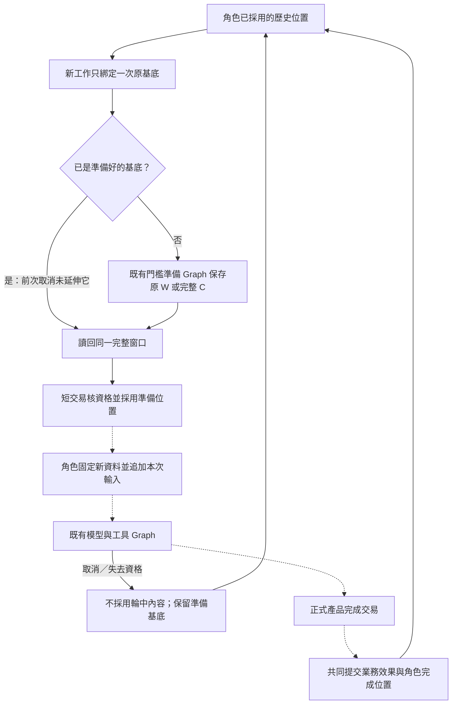
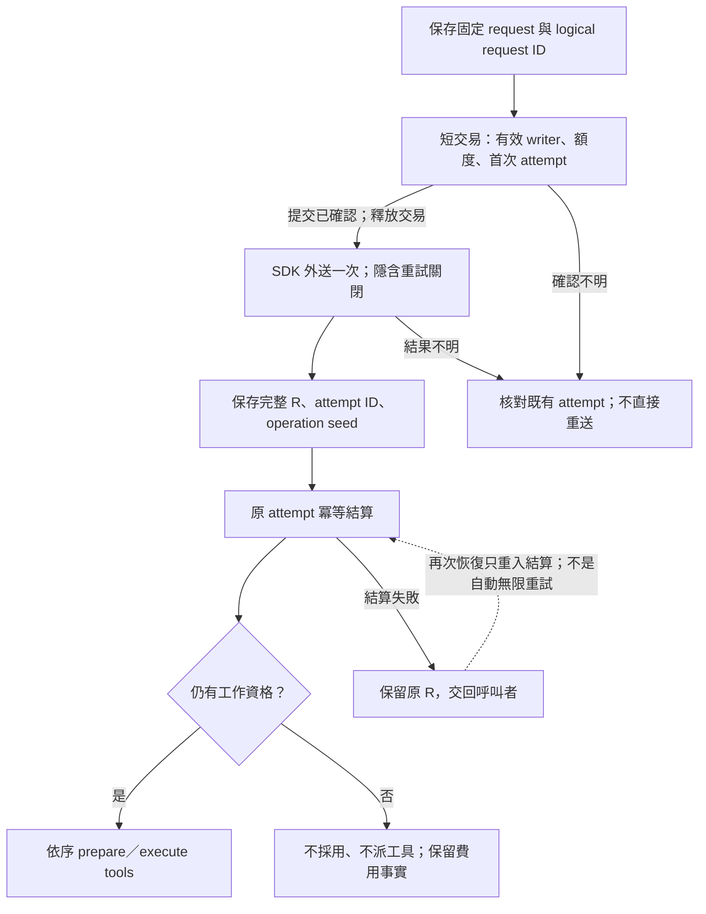
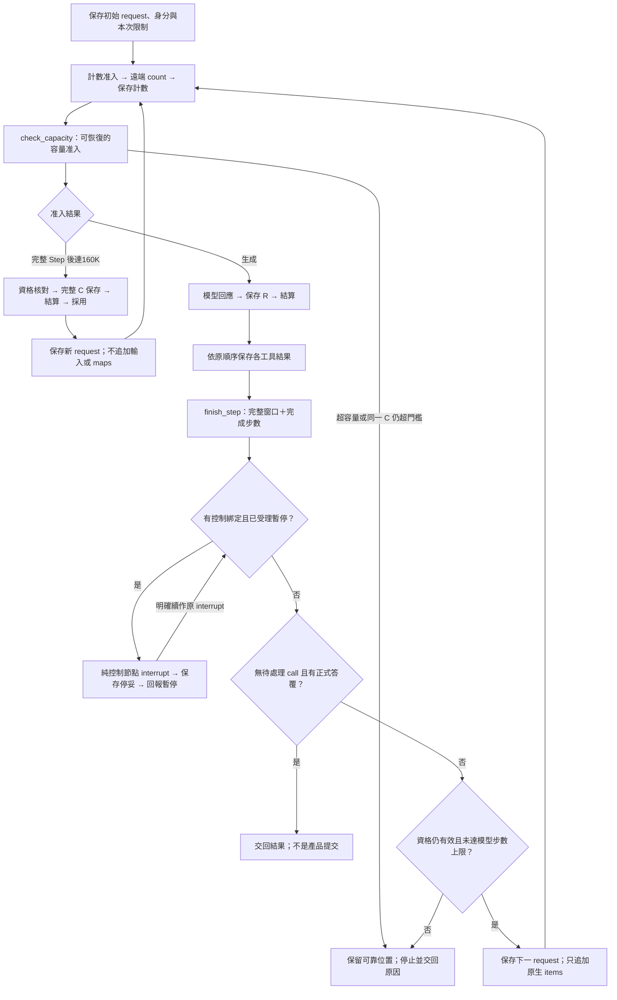
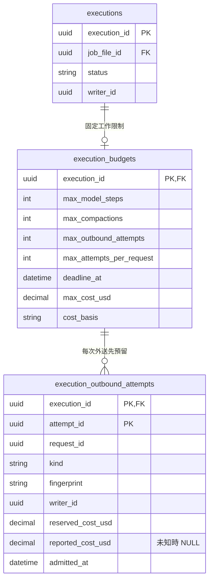
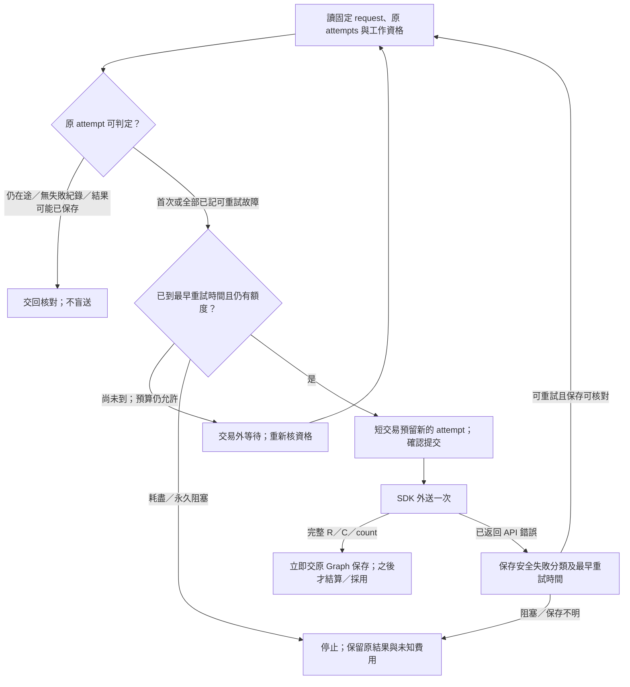
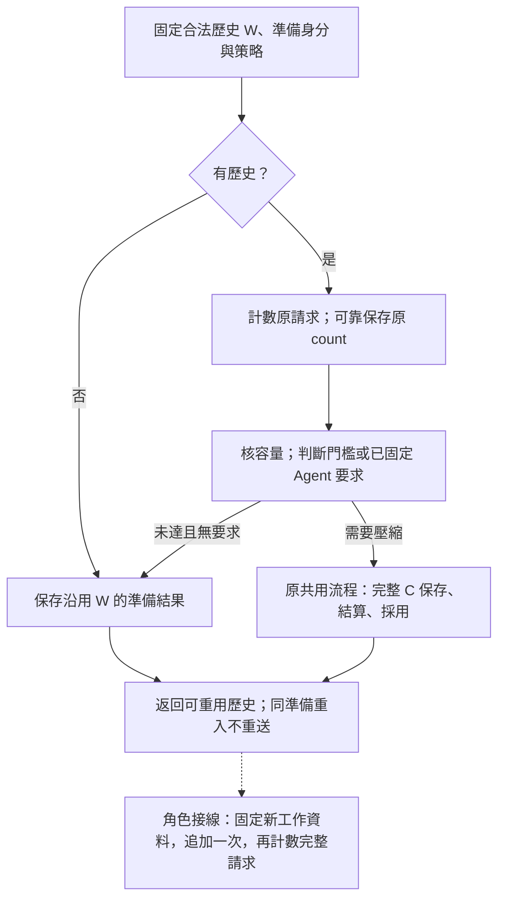
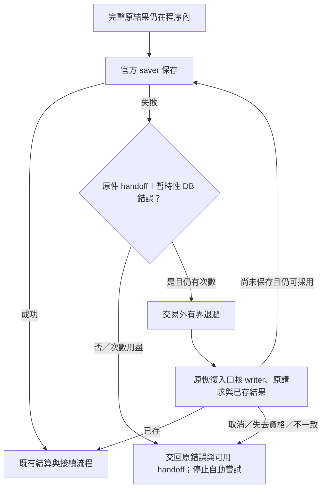

# Agent 原生接續與可恢復接線

- 狀態：**現行共用執行接線**。A／B1／B2 共用原生接續、Step 控制與恢復；產品生命週期依[共用執行契約](../specs/2026-09-27-shared-agent-execution-and-state-design.md)。驗證見[架構驗證](../architecture/verification.md)與[產品實驗](../experiments/product-validation/README.md)；機制接通不等於所有恢復分支或模型品質已驗。
- 驗證分假 provider＋真 saver／PG、有界真模型及產品旅程。新驗證依當次有效授權進行，不把模型自述或推理摘要當驗收證據。
- 已確認但未實作的調整：[輪前 App 摘要、輪中原生壓縮](../specs/2026-10-04-context-summary-and-compaction-design.md)。本文仍記載現行原生接線；目標須調整輪前結果型別／採用及 B 輪中候選導覽投影，不能只換 Prompt 就宣稱完成。摘要 Prompt 待討論，未改下面的現行節點、工具 wire 或驗證結論。

本頁說明執行機制如何接上角色與業務模組：先看 Graph 與 State 的責任，再看私有歷史、回退位置及實際接線。哪些資料可正式採用由業務模組判定；Graph 負責保存可接續的位置，兩者在恢復時共同核對。

## 1. 執行圖與業務資格分開

`agent_execution` 提供 A／B1／B2 共用的 StateGraph node 組合；角色 runner 經 bootstrap 接上相同 SDK、官方 saver 及持久預算。各角色提供 instructions、允許工具、起始資料 projector 及結束結果轉譯，共用模型與工具的執行迴圈。

Memory Parent 編排 B1、B2 與領域交接服務，不寫第二套 validator。本節節點表描述責任切點，不要求程式恰好採同名 node；實際接線與驗證分見 §6–7 及相關 evidence。

責任切點如下，節點名稱是工程名稱，不是對模型公開的新工具：

| 節點 | 保存／動作 | 禁止 |
|---|---|---|
| `prepare_context` | 核新工作綁定、已採用基底；追加一次 App 資料及必要輸入；保存原位置 | 同工作恢復刷新 maps、重複員工原話 |
| `count_input` | 用固定 request 計數；外送沿共同額度；保存結果後才作容量准入 | 計數失敗當零、重查已保存計數、把計數當模型 Step |
| `request_model` | 容量／外送資格通過後呼叫 SDK；保存完整 R、原 calls 與 App 操作身分 | 同一未持久 node 內直接做寫入工具 |
| `account_response` | R 已保存後，以原 attempt 冪等結算；失敗恢復不重呼模型 | 把記帳失敗變成原 R 遺失、把取消當未付費 |
| `prepare_tool` | 有業務效果的 call 先解析目前目標，形成固定命令與有界回傳，可靠保存後才執行；純讀取可直接走讀取路徑 | 工具重入重新解析舊 title、把預期成功文字當已提交 |
| `execute_tool` | 每次處理一個已存 call；原業務核對／執行，保存配對結果；按原 output 次序前進 | 多個相依寫入平行；用最新資料冒充舊讀取結果 |
| `finish_step` | 確認所有 calls 有確定結果；保存可用 Step 位置 | unresolved call 當完成、將此點當正式提交 |
| `apply_control` | 查持久取消／暫停資格，合法時原生 interrupt；否則 route 完成或下一步 | interrupt 前放不可重複副作用；UI 已按暫停就宣稱已停妥 |
| `compact_context` | 合法輪前／160K 交界，取得完整 C 並可靠採用 | 只存摘要、重加起始資料、讓輪中 C 越過取消基底 |
| `deliver_result` | 交給 consultant_turn／memory_batch 協調服務；查原完成結果可重入 | Graph END 自行宣告 JD 或 Memory 已發布 |

Graph 入口使用 `durability="sync"`。**native super-step 不等於上述完整 Step**；每個 node 結果可靠保存才容許下一個有副作用 node。未保存的 node 可能重入，靠業務 operation 保護效果。[LangGraph persistence](https://docs.langchain.com/oss/python/langgraph/persistence)

## 2. State 的最小型別分組

Graph State 保存執行與恢復所需的資料：不可變工作綁定的參照、原生有效窗口／採用位置、原回應與待處理 calls、候選固定位置及操作結果定位、控制／路由所需資料、已計入的執行計量。

**State 不會全部送入 LLM。**模型 input 由 App 依契約組裝；目前分析焦點、猜想等也不強制成為模型每 Step 必填欄位。

原生窗口 channel 使用明確的「追加 items」與「可靠採用完整 compacted output」操作；不能套會按 message ID 合併覆寫的通用 MessagesState／`add_messages`。serializer 保存 JSON-compatible 原生資料；output→input 轉換只按官方契約，不刪 reasoning／phase／call metadata。`status` 等 output-only 欄位按實際 SDK input 規則轉型，**保存原輸出**與**合法重送表示**分開驗，不能機械送所有 response envelope。[OpenAI 原生接續範例](https://developers.openai.com/api/docs/guides/deployment-checklist#use-reasoningencrypted_content)

Runtime context、Graph State 與模型 input 使用不同型別，分清執行依賴、保存進度與本次請求內容。SDK client、DB session、工具實作與密鑰經由依賴注入取得，不進 State；候選正文由領域保存，State 不存另一份可寫副本。

[Memory 寫入接縫](memory-tools.md#4-寫入準備採用與原結果接續)提供 immutable prepared command，可能含已計算的新正文及成功回傳。這是待執行原操作，不是另建可編輯候選。Runtime 在業務 execute 前可靠保存它；恢復以同一命令核對原結果，不重新 prepare 或解析已改指別人的 title。純讀工具的結果也保存後沿原 call 接續，不以現在資料冒充當時觀察。

## 3. thread／私有歷史與回退接線

每個 A 執行工作有獨立 Graph thread；Memory Parent 及各角色有可辨認的執行身分。新工作從該角色**已採用的合法歷史位置**取得原生窗口，不從任意最新 checkpoint 猜。跨 Turn 延續的是原生 items，不要求 API `previous_response_id`，也不要求所有 Turn 共用一條可被晚到 callback 污染的 thread。

B1／B2 各自保留私有歷史；同一階段中斷後沿原 thread 接續，下批再承接各自已採用的歷史。角色 Graph 由 Parent 依 B1 → B2 順序呼叫；Parent 只接領域位置與完成結果，不交換完整私有 State，也不接受 B2 回交。不能手改 checkpointer 表或靠重建 namespace 假裝已恢復。

當前有效工作／已採用基底的參照由執行資格持有，checkpoint 存實際窗口。這不是第二套 session 日誌；只記「哪份既有窗口仍可採用」，不複製模型全文。取消、不可恢復回退或重新領取使舊 writer 失去提交資格；晚到 checkpoint 仍可能物理保存，但不可被下一輪當有效基底。

- 新工作：先完成輪前 compaction 安全採用，再固定 maps／來源等本輪綁定、加入員工輸入。
- 同工作故障：用最新可靠位置正常 resume，不指定舊 checkpoint 做 time-travel replay；有 interrupt 才用 `Command(resume=...)`。
- 有意回退到較早安全點：先使較晚工作資格失效，核對領域位置與 context 相容，再建立可執行分支；不能直接對舊 checkpoint invoke 並假設副作用會自動撤銷。
- A 取消：後續新輸入從合法輪前基底與正式資料開始；重試 a 在模型眼中仍是新輸入。
- Memory 回①／②：候選與各角色窗口一起回該位置；同批保留對應已採用輪前 compact，不重做它。中途較晚 compact 不跨越回退點。

跨工作接續與回退的驗證對應 E02／E08–E11，見[驗證對照](verification-plan.md)。調整 thread 組織仍須維持相同資格與回退保證，不增加第二套恢復引擎。

### 3.1 跨工作的合法歷史選用

`features/executions/history.py` 管理**是否可採用**；`workflows/context_history.py` 的 `RoleContextHistory` 將資格接到既有準備／模型 Graph；完整原生窗口仍只由官方 saver 保存。每份職務檔案、每個角色各有一個已採用位置，每次 execution 綁定一次原基底，不能因重開而改選目前最新 checkpoint。

| 保存責任 | 實際資料 | 不負責 |
|---|---|---|
| `context_history_heads` | 職務檔案＋角色目前可採用的 thread／checkpoint／窗口種類 | 原生正文、模型回應、Graph 路由 |
| `context_history_bindings` | execution＋角色的原基底、已準備位置及正式完成位置 | 第二套回執、候選正文、進度日誌 |
| 官方 checkpointer | 上述固定位置的完整窗口及原 Graph State | 判定 JD／Memory 是否正式完成 |

兩個 reference-only 關係由 migration `0016_context_histories` 與 executions 執行資格模組維護。所有採用均在短交易中核原 writer、scope／角色與已採用位置；saver／模型 I/O 不放進該交易。未找到明確 checkpoint 時失敗，不回退到任意最新值。



角色資料組裝、正式產品完成與歷史採用由 A／Memory workflow 協調；Graph 返回 final 不取代正式完成交易。

- `prepare_history` 只接收不含新輸入／maps 的 request template，歷史從綁定位置回讀；A 使用已確認的 128K 門檻。準備 Graph 保存成功、但採用交易尚未成立時，重入同一準備 thread 承接原結果。若已採用準備基底後取消，後續新工作直接重用同一基底，即使 C 仍很大也不因此重壓一次。
- `read_prepared_history` 只讀已採用的**輪前準備**結果，不把輪中 compact 當取消後基底。`read_completed_response_history` 核保存的 final 路由及官方 StateSnapshot 沒有待執行 node／task；暫停中的 final、只有 R 或 pending writes，都不能直接成為完成歷史。完整 reasoning、message、工具往返保留原順序，回傳獨立複本。
- 讀取固定 checkpoint 是純查詢，不是 `invoke` 歷史位置做 replay。同工作續作仍走原 Graph 的最新可靠執行位置；取消後的新工作則只取領域已採用的位置，兩者不能混淆。
- `complete_context_histories` 由產品協調方在**同一正式完成交易**中呼叫：A 採用一個角色；Memory 同時採用 B1／B2，不容許只完成一邊。它核各自的原準備基底並由執行資格模組完成 execution；JD、正式訪談及 Memory 發布不在此重寫。產品協調方仍須先驗真實 Graph 完成及相應業務資格。
- COMMIT 確認遺失時重交原完成位置，只核對原結果，不倒轉後來已前進的歷史。取消、暫停要求及被替換 writer 不得採用晚到內容；取消不刪 saver 原件，但那些原件不再具備跨工作採用資格。

依據：[LangGraph 官方 checkpoint／歷史查詢](https://docs.langchain.com/oss/python/langgraph/checkpointers)區分完整 checkpoint 與 pending writes；[PostgreSQL 行鎖](https://www.postgresql.org/docs/current/explicit-locking.html#LOCKING-ROWS)提供短交易序列化。跨工作採用、角色隔離及取消保留準備基底是 Caliburn 的產品取捨，不是框架自動保證。證據與未驗範圍見 [T06 §15](../history.md#source-d76bfd79f21fb146c537)。

## 4. Requests 與工具

`openai_responses.py` 明確設 `store=False`、`reasoning.context="all_turns"`，不帶 response chaining／server-side compact／silent truncation。instructions 與 tools 在 request 層明確提供，並保留原生 items；SDK 的默認 retry 關閉，由 Runtime 在有界預算內分類處理。

起始順序依角色權威：歷史／完整 C → user-role App 資料 → A 的本輪 user 原文 → 後續原生模型／工具項目。A JD map 按需，不放回起始 context。B1 無理解導覽／工具，B2 無情境寫入工具。App 資料 user-role **不等於防注入已完成**；service 仍驗權限與來源範圍。

一次 response 可能零／一／多 calls，也可能有公開中間文字。以原生項目與尚未完成的 calls 路由，不能憑 `output_text` 非空或 response.completed 當 Turn 結束。每一 call 都保留 call_id 與結果，已拒絕可回確定錯誤，未知效果先對帳。[OpenAI function calling](https://developers.openai.com/api/docs/guides/function-calling#handling-function-calls)

模型不填 version／job_file_id／budget／operation；工具 handler 收 Runtime binding，轉譯成領域命令。傳給模型的 schema 只包含被授權角色的動作；不新增 generic execute、SQL 或任意文件操作。

### 4.1 原生回應邊界

`adapters/response_serialization.py` 承接 SDK `Response`／`CompactedResponse`，不自製 provider 格式：

- 保存原件使用 `model_dump(mode="json", by_alias=True, exclude_unset=True)`；保留全部已收到欄位、usage、opaque content、原 status 與額外 provider metadata。`by_alias` 保持原 `async`，不把 Python 的 `async_` 寫成 wire 欄位。恢復以同一 SDK schema 驗原件，不能只存 `output_text`。
- 一般模型 output 的出站投影保留完整項目，只依官方部署範例排除各項頂層 `status`，不修改原件；`phase`、call metadata、內容順序及未知附加欄位不裁掉。Reasoning 頁的 Python 範例未排除此欄，故本案選部署範例作最小投影並保留 provider gate；離線 SDK 會發送不等於遠端已接受。
- Standalone compact 保存整份返回，採用時取其**全部 output**，含保留項目，不只選摘要、不再添加舊輸入。SDK 3.20.0 的 output union 過窄，不能拿它重驗可能保留的 user/input_text；保存使用 SDK `to_dict(mode="json", warnings=False)` 保留實際欄位，避免已知型別警告印出原話，採用時僅核 output 容器並複製完整窗口。不自訂替代 provider schema。安全採用見 §5.3；SDK 模擬傳輸與遠端接受須分層驗證。[官方完整 window 契約](https://developers.openai.com/api/docs/guides/compaction#standalone-compact-endpoint)
- 工具結果用原 call_id，保留 direct caller；已保存結果序列只能是原 calls 的有序前綴，不能跳過、重複或交換配對。原操作冪等與 Graph 保存仍是另外兩個責任。

`agent_execution/response_steps.py` 只從完整原件推導路由，**不執行工具或宣告正式完成**。完整 response 內有 calls 時先走工具，即使同時有 final 文字也不結束；只有 commentary／reasoning 或空白 final 時繼續；無 calls 且有非空白 final 文字／拒絕時才交給產品完成責任。公開文字只取 assistant message，reasoning 不進公開訊息列表。

未完成 response／item、error、不一致的 incomplete details 不准派送工具。重複或空 call 身分、未配置的 builtin、program／async／namespace 協定或沒有可辨認 phase，明確停下，不默默忽略或猜 final。這是本產品**目前只支援 direct local functions 與明確 phase**的防護，不是 API 本身禁止那些能力；真模型預檢若顯示合約差距，要查證調整而非無限重試。原回應須先保留，之後才做此檢查。

依據： [stateless 接續](https://developers.openai.com/api/docs/guides/reasoning#preserve-reasoning-without-stored-responses)、[部署範例](https://developers.openai.com/api/docs/guides/deployment-checklist#use-reasoningencrypted_content)、[phase](https://developers.openai.com/api/docs/guides/deployment-checklist#set-up-the-assistant-phase-parameter)、[多工具配對](https://developers.openai.com/api/docs/guides/function-calling#handling-function-calls)，以及鎖定 OpenAI 3.20.0 的 input/output 型別。

驗證：[原生回應與 saver](../history.md#source-d76bfd79f21fb146c537)。純原生 items 不需 pickle 或自訂 msgpack 型別還原；prepared command 的型別 allowlist 見下一節。`sync` 不代表框架與業務共用一次交易，也不保證尚未保存的回應永遠可取回。

### 4.2 單一模型／工具 Step

`agent_execution/tool_steps.py` 使用 `request_model → account_response → prepare_tool → execute_tool → prepare_tool → finish_step` 的責任順序；生成前另經計數及容量准入。純讀／已知拒絕由 prepare 保存觀察，不進 execute。所有 call 處理完才形成新完整窗口；§4.6 的共用 loop 承接下一步，A／B1／B2 不各寫一套迴圈。

- 正常入口 `run_response_step` 統一指定 `durability="sync"`，依本次允許 call 數設定有界 graph recursion limit；超過 call 上限在派送前拒絕。框架 super-step 數與模型 Step 數不是同一上限。只在隔離故障測例使用私有 builder，不讓角色自行選保存模式。
- 單 Step 入口使用獨立 thread；多 Step 入口讓**整次 loop 共用同一 thread**，不要求每次迭代新建 thread。新輸入不得覆蓋已有 thread，只有 `None` 能恢復它，沒有保存位置也不能假裝恢復。入口讀取檢查不是競爭鎖，單 writer／工作資格仍由執行資格模組保證。使用官方 `GraphOutput.value` typed 返回，不自造圖結果格式。
- 原回應先保存，下一節點才檢查協定／工具。未知 phase 等被拒絕時，R 仍可回讀；不是先丟掉 R 再宣稱可恢復。操作 seed 和 R 同存，每個 call 從 seed＋原 call_id 得到穩定 App 操作身分，不由模型指定業務 ID。
- 寫入 prepare 的命令先保存，execute 才交給相應的 JD／Memory 領域模組。工具結果僅按原 calls 的有序前綴增加，下一筆 prepare 能看見上一筆已成立的候選；不平行派送。恢復不重新解析已保存命令的標題／正文，也不重算成功回傳。
- `ResponseStepRuntime` 注入模型、結算、工具與資格 I/O，不持久化 SDK client／DB session。共用 State 不理解 Memory 命令內容；工具接線必須核對還原型別及原工作資格，業務效果仍由 JD／Memory 領域模組的交易／冪等機制處理。
- `adapters/graph_checkpointer.py` 只配置官方 `JsonPlusSerializer`：關閉 pickle 與 legacy JSON 自訂 constructor；自訂 msgpack 型別由實際 caller 明確 allowlist，不建立 domain registry。Memory prepared create／revise／delete 的巢狀 dataclass、Enum、UUID、frozenset 已驗。框架 4.2.0 對未允許型別會降為 dict／原始值，且 tuple 會變 list，不能拿值相等當型別正確；本 Step 原生集合用 list，Memory prepared 無 tuple 欄位。不補第二套 codec。

驗證：[Step 保存與有序工具](../history.md#source-d76bfd79f21fb146c537)。假 provider＋真 PG 可驗原件保存及效果不重複，不證明真模型品質。

驗證：[A Runner 程序恢復](../history.md#source-d4bb8d17c5639690aeb3)。原件已保存後接續與原件遺失後再推論是不同能力；本機 `sync` 不是 provider、業務與 checkpoint 的共同交易。

checkpoint 與 pending writes 同時失敗時，`astream` 不保證能交出 node update；原回應由 §4.4 的 typed recovery 補存，不依賴呼叫方手寫 Graph update。

執行／預算准入、控制、角色歷史及 compact 分別依 §3、§4.7、§5–7 接入。依據：[durable execution](https://docs.langchain.com/oss/python/langgraph/durable-execution)、[saver／sync／pending writes](https://docs.langchain.com/oss/python/langgraph/checkpointers)。

### 4.3 直連請求與失敗分類

`adapters/openai_responses.py` 只承接官方 SDK，不負責預算、保存、採用或重試。`ResponseRequest` 擁有組裝完成資料的獨立複本；計數與 create 從同一 context 產生 payload，外部後續改 maps／items 不會改掉已計數的請求。它不是持久 request store。工具允許一次返回多 calls，App 仍按 §4.2 順序執行。

- Client factory 固定官方 base URL、有限 timeout、`max_retries=0`；不採環境中的 proxy base。SDK 預設 HTTP client 會跟隨 redirect，本案明確關閉，注入的 client 若開啟跟隨則拒絕；避免官方起始網址的 307／308 把原文轉送別處。
- Create 明確使用 `store=False`、`all_turns`、`truncation="disabled"`、輸出上限及同步非 background 回應；不帶 `previous_response_id`／server-side compaction。保留 `include=["reasoning.encrypted_content"]` 作明確相容設定；當前官方說明 `store=false` 已預設附帶，不把它說成唯一取得方法。
- Count 和 compact 也只外送一次，不降級成猜測計數／本地摘要；compact 返回完整 SDK C，沒有在 adapter 自行採用。鎖定 SDK 的 standalone compact **沒有 `max_output_tokens`**，不能用 create 的輸出上限當其費用上界。
- `adapters/openai_failures.py` 區分遠端結果不明、暫時服務問題、權限／額度阻塞、容量、請求與回應協定問題；不複製可能含原話／秘密的 error body 到 State 或 UI。分類不等於已准許重試，更不代表該次免費。

adapter 支援固定 request 指定的串流與非串流傳輸；A 新請求使用串流，公開投影見[介面 §2](interface-and-delivery.md#2-串流不是保存權威)。持久額度、原結果採用及 Retry-After 由後續各節負責。驗證見[直連傳輸](../history.md#source-d76bfd79f21fb146c537)與[串流](../history.md#source-caf2f3430699b78cd2b7)；SDK MockTransport 不等於遠端接受。依據：[stateless reasoning](https://developers.openai.com/api/docs/guides/reasoning#preserve-reasoning-without-stored-responses)、[錯誤分類](https://developers.openai.com/api/docs/guides/error-codes)、[token counting](https://developers.openai.com/api/docs/guides/token-counting)。

### 4.4 原回應補存與資格接線

`run_response_step` 在模型 node 返回前保留完整原 R、固定原 request 及同一 operation seed；僅在尚未進入下游節點的保存失敗時，以 `ResponseStepSaveError.recovery` 交還程序內的 `HeldModelResponse`。一般結算／工具／協定／資格錯誤仍保持原分類，不一律轉為可重試保存錯誤。這不是另一份持久 ResponseStore，不寫入業務表、模型 context 或一般 log。

- 仍握有 recovery 時，以同一 thread、`request=None`、`recovery=...` 回到公開入口。先查官方 saver／原 request 身分；任何採用與執行仍須通過工作資格；不呼叫模型、不由呼叫方自行改 Graph State。無採用資格的晚到 R 只允許原計量，詳 §4.5。
- 原 R／seed 已在 checkpoint 或 pending writes 時核對相符，沿目前位置恢復，**不覆寫之後的 prepared command、工具結果或完成視窗**。此時立即釋放該次呼叫的暫存保存責任，避免直接恢復 execute node 的工具／資格錯誤被誤分類。
- 原 R 尚未保存時，必須仍在原 `request_model` 邊界、原 input 相同且無後續效果資料；再查資格，以官方 `aupdate_state(as_node="request_model")` 補存原 update，然後正常 `None` 接續。不同 thread、不同 input、不同已存 R／seed 或不相容位置拒絕，不猜測、不回退。
- 查詢／補存再次失敗，仍交還同一原件；沒有自行循環、重新推論或增加付費請求。是否與何時重試由工作 supervisor 的單一有界政策承接；程序整個消失且兩種保存皆失敗時，不保證記憶體原件可恢復。`store=false` 不能靠 response ID 補取遺失內容。
- `ResponseStepRuntime.ensure_active` 是必要注入，入口、模型／工具 I/O 前、完成 Step 及交回結果前均檢查。產品接線用執行資格模組保存的原 scope／writer，短交易結束後才做模型 I/O；不把 DB session 或 writer 狀態塞入模型 input。單一 writer 調度仍由外層負責，這不是新的租約實作。
- Guard 與 saver／provider 不共用原子交易：取消後晚到 R 仍可能物理保存，但不能派送工具或交付有效結果。業務工具還須在自己的提交交易內核資格；A／Memory workflow 決定有效 Turn／批次基底，不能把任意 latest checkpoint 當成可採用歷史。

驗證：[原回應補存與資格](../history.md#source-d76bfd79f21fb146c537)。機制依 [LangGraph 狀態更新與接續](https://docs.langchain.com/oss/python/langgraph/use-time-travel)；只在核對原位置後補存既有 R，不以舊 checkpoint replay 重算外部工作。自動補存見 §5.6，不能恢復已遺失且未持久保存的原件。

### 4.5 固定請求、一次外送與保存後結算

`workflows/model_requests.py` 協調 executions 額度、短交易與 SDK；共用 Graph 不 import features，不增加 ResponseStore 或第二套回執。此元件由角色 runner 組裝，生成前經 §5.2 計數／容量准入；多 Step、compact 與 provider 重試分見 §4.6、§5.3–5.4。下圖聚焦生成成功路徑，不略過計數或故障分類。



- 每個新 Step 的初始 checkpoint 固定 App 產生的 `request_id` 與 **實際 create payload**，包括 model、instructions、tools、input、reasoning、輸出上限與串流設定。沒有另存初始 input 副本；`input_items` 僅在完成 Step 時形成後續窗口。`ResponseRequest.from_snapshot` 還原同一請求，拒絕不符固定直連政策的快照，不能用目前角色設定代替當時設定。這是恢復資料，不宣告永久保存所有請求。
- `ModelRequestExecutor.request_model` 在既有 execution 鎖內查原 request 的 attempts，核固定費用依據並預留；交易確認完成後才發一次 HTTP。同一 request 有尚未核明的 attempt 時停止讓外層核對，不換 UUID 假裝首次呼叫；只有 §5.4 已確認的可重試故障才可新准入。已保存 R 由 Graph 直接接續，不再進此入口。完整 payload 以 canonical JSON 的 SHA-256 綁定，不拿 payload hash 當 logical request 身分。
- SDK 返回後，立即交出 `ReceivedModelResponse(response, attempt_id)`；其間沒有可能失敗的記費 SQL 或費用推算。Graph 保存原 R／attempt 後，才進 `account_response`。結算解析或提交失敗時，原 R 已在既有 saver，下一次只重入同一結算，不重呼模型。這借鑑官方耐久節點交界，不將整輪鎖成一個 DB transaction。
- `ModelRequestAccounting` 使用與原 budget 相同的 `cost_basis`、預留及觀察成本計算；`workflows/model_runtime.py` 從固定模型配置組裝。費率見 §5.7，產品與付費評測的未知 usage 處理見 §5.8；成本估算不等於帳單驗證。
- 結算與採用分開：一般晚到 R、已保存 R 的取消後重入，以及已驗證 Held 補存期間取消，都可核對原 attempt 記費；仍不能派工具、採用新 context 或交付正式結果。Held 在進結算節點時釋放「尚未保存」責任，不把結算故障誤報為模型保存故障。取消恰好發生在 `aupdate_state` 補存期間時，使用剛補存的原件結算，不看過時的補存前查詢值。

驗證：[固定請求與保存後計量](../history.md#source-d76bfd79f21fb146c537)。依據：[LangGraph sync／pending writes](https://docs.langchain.com/oss/python/langgraph/checkpointers)、[OpenAI 原件接續](https://developers.openai.com/api/docs/guides/reasoning#preserve-reasoning-without-stored-responses)；此安全交界不承諾 provider 與 PostgreSQL 共同原子提交。

### 4.6 有界多 Step 接續

`run_response_loop` 與單步入口共用原 StateGraph、原生 State 及恢復接線，只增加完成 Step 後的條件路由與 `prepare_next_request`。不是在外層手動另存 cursor，也不為每次模型迭代建 child graph／thread。官方支援 conditional edges 與持久迴圈；採這個較小組合是本案取捨，**不宣稱所有大廠用同一個 loop**。[LangGraph Graph API](https://docs.langchain.com/oss/python/langgraph/graph-api#conditional-edges)、[OpenAI 工具接續](https://developers.openai.com/api/docs/guides/function-calling)



- 每次模型 Step 可有多工具，全部依序完成後才接下一請求；工具旁有 final 文字仍先處理 calls，只有 commentary 的完整回應則繼續。下一請求只替換 input 為已完成窗口，不重新取 maps／指令／模型設定，不改歷史、不重加起始輸入。
- 同一 loop 的模型步數上限、每回應工具上限在初始 checkpoint 固定。`completed_steps` 由完成 Step 前進，恢復不歸零；不能用較大上限或單步入口繞過原 loop 限制。最後准許的一步若有合法 final，仍可交回；需要再呼叫才觸發 `ModelStepLimitError`，保留最後完整窗口，不偽造收尾答覆。
- 這是**單次角色 loop 的局部上限**；整個工作／Memory batch 的計量、時限與重試共用額度仍由 §5.1 的執行模組負責。LangGraph `recursion_limit` 只是本次 graph invoke 的 super-step 防護，依有限工具／模型步數配置，不代替產品計量。
- 下一 request 的新 logical ID／完整 payload 先經 sync 保存，才可外送；只有完成前一 Step 才產生新 request。清除當前 response 欄位，避免把前一步 R 認成下一步的 R。第二步以後同樣可承接 Held 原件；後來步驟不能拿舊 handoff 倒轉目前位置。
- 初始 input checkpoint 可能尚未展開成 State（`values` 空、`next=__start__`）；由原生 Graph 恢復原輸入，於 request node 外送前核對原限制。不因尚未展開便拒絕正常恢復，也不讓恢復參數改寫初始限制。
- 已完成 loop 再 resume 不新增模型／工具／items。恢復不指定舊 checkpoint ID；工具失敗只承接當前 prepared command。全部共用單步原 R 保存、結算與業務冪等責任，沒有新增保存系統。

驗證：[多 Step 接續](../history.md#source-d76bfd79f21fb146c537)。圖中的返回只是角色結果；A Turn／Memory batch 的正式完成仍由 §6–7 與各領域模組協調。

### 4.7 完整 Step 暫停與原生續作

**分開控制意圖與已停妥的證據。**`executions` 執行資格模組保存 `pause_requested`，不是新控制表或第二套 Graph 進度。`request_pause` 用職務檔案／execution／kind 範圍受理，不要求 UI 持有 worker 身分；受理後仍為 ACTIVE，當前模型與有序工具可以完成。只有原生 interrupt 已可靠保存，Graph 才經 `ConsultantExecutionControls.mark_paused()` 呼叫領域 `pause_execution` 記 PAUSED。Graph 不直接寫 SQL，領域也不解析 checkpoint。

| 責任 | 已接線 | 不代表 |
|---|---|---|
| executions | 短交易受理暫停、writer fencing、停妥／續作、正式完成互斥 | UI 一按就已停止、可以用 checkpoint 猜正式效果 |
| 共用 Response loop | 完整 Step 後 `check_control`，純 `pause_at_boundary` 原生 interrupt | 在工具結果不明時偽造 Step、在 interrupt 前重做模型／工具 |
| workflow 薄接線 | 注入讀要求、有效 writer 檢查、停妥確認 | 另建控制儲存或由節點自行決定正式效果 |

- `run_response_loop` 可注入 `ResponseLoopControls`；A 使用，B 不配置。設定是否存在隨初始 State 固定，恢復不能卸除控制來越過原暫停。`ConsultantExecutionControls` 拒絕 Memory kind；Memory 沒有使用者 pause／resume。
- `check_control` 在 `finish_step` 之後且在 final 返回、下一次 count／compact／model 之前；控制讀取失敗保留節點供重入，不當成「沒有要求」。本輪多 call 全部配對後才可停，已保存 final 同樣先停在待交付位置，不另發模型。
- `pause_at_boundary` 不執行业務副作用，重入必達同一個 `interrupt`；不能在恢復時根據最新要求跳過它。LangGraph 恢復會重跑節點開頭，故資格檢查可重入，但模型／工具不放在這裡。
- 正常暫停回傳內部型別 `PausedResponseLoop`，含當前 `interrupt_id` 及原 State；不是執行失敗或給模型的新工具結果。UI 不直接取得整份 State／reasoning；UI 僅讀公開狀態投影。
- 普通 `request=None` 重開已暫停圖，只核原停妥並回傳原暫停；不發 count／compact／model、不自動 final。明確續作需原 `interrupt_id`，轉為 `Command(resume={interrupt_id: True})`；不帶新 input／Held R、不換 maps／Memory 基準，錯誤或過時 ID 拒絕。顧問控制工作流須先依執行資格受理續作；Graph 不自行清除領域意圖。
- 普通恢復若仍在完整 Step 後、尚未建立下一 request（`prepare_next_request` 或待交付 final 的 END），不能把先前已保存的 `continue` 當成現在仍有執行許可。使用當前 checkpoint 的 `aupdate_state(..., as_node="finish_step")` 僅重新安排 `check_control`，不重跑 `finish_step`、不改原生 items／完成步數、不讀歷史 checkpoint。新受理暫停能停在原完整 Step；無暫停才沿原路繼續。這不代表下一 request 已進入計數／外送後也可任意退回此點。
- 上述更新不能覆蓋尚待整合的 Step 結果：`get_state()` 可把 pending writes 投影成完成值，不等於整個 Step checkpoint 已寫成。若公開 `StateSnapshot.tasks` 仍含 `finish_step`，直接走原生 `None` 恢復，由框架保存該結果並接續 `check_control`，不先呼叫 `aupdate_state`。如此保留已成立的完成步數／原生 items；不讀 saver 私有表，也不另存 Step 副本。
- 傳回原 R／count 的 handoff 若已核對為保存成功，不再屬於「待補存」；仍須套用上述完整 Step 控制重核。不能僅因呼叫參數還帶著 `recovery`，就跳過新受理的 pause；真正尚待補存或待整合的結果仍先沿自己的恢復邊界處理。
- interrupt 保存失敗不確認 PAUSED；保存成功但領域確認遺失，重開可重入確認同一 interrupt。取消／替換 writer 後，舊 callback 不得把 execution 改回 PAUSED 或採用既存 final。
- 受理暫停與正式完成在同一 execution 行鎖競爭，只有一個勝出。service 拒絕 pending pause 的完成；migration `0014` 同時補 DB CHECK 與終局 trigger，不能在同一 UPDATE 清除意圖並偷提交。取消／最終失敗仍可終止並清除意圖；人工編輯仍受 ACTIVE／PAUSED 封鎖。這些都由執行資格模組處理，不增加全域 validator。

**控制調度邊界：**已離開完整 Step 控制點、準備／計數或外送期間又收到要求、領域續作已提交但 `Command` 尚未完成，以及 final 交出後與正式提交競爭，均由 §6.1 的控制 workflow 依持久意圖及原 interrupt／完成結果收斂。普通重開不是新的續作授權；pending pause 的完成拒絕也不是 Turn 最終失敗。`resume_execution` 是內部受控操作，HTTP 不直接讓 UI 提供 writer 或 interrupt ID。

依據：[LangGraph interrupts](https://docs.langchain.com/oss/python/langgraph/interrupts) 的 durable pause、原 thread／interrupt ID 與節點重跑契約，以及[狀態更新的 node successor 語意](https://docs.langchain.com/oss/python/langgraph/use-time-travel#from-a-specific-node)；沿既有 PostgreSQL 行鎖／原子提交。框架提供機制，產品的完整 Step 與 final 優先順序是本案已確認語意。實測及未驗邊界見 [T06 §11](../history.md#source-d76bfd79f21fb146c537)。

## 5. 容量、重試與恢復不是同一政策

每次推論外送前核實際完整 request，含 instructions、tools、原生 items、App 資料及輸出／推理預留。使用 direct SDK 的 `responses.input_tokens.count`：用同一份組裝 payload 中計數 API 接受的欄位計數，核對所選模型、reasoning／compaction items 的實際接受性。這是遠端計數，不是本機 tokenizer；仍受資料外送授權、timeout 與重試規則約束，不假設免費或永遠可用。[OpenAI token counting](https://developers.openai.com/api/docs/guides/token-counting)

計數不產生新的模型回應，不計入模型迭代數，但計入 API 外送次數／延遲紀錄。未改變的同一 payload 可在本次執行沿用已核計數，不新增永久計數 cache。輸出上限含 reasoning 與可見輸出，預留不得重複計算；本地 tokenizer 對 opaque items 不保證精確，不能用字元數／上一 usage 冒充精確值。模型容量與預留由固定配置和實際請求計數核對；計數失敗不盲送，保留恢復位置並依有界政策處理。

A／B1／B2 輪前 128K、中途 160K 的真正輸入與採用次序只依上位 §6.3。達中途門檻先處理 pause／cancel／final；只有將發下一請求才 compact。完整 C 採用確認前舊基底可取回；採用後附既有已保存後綴，不重貼 employee input／maps；仍超量不反覆壓同一未增長視窗。

暫時網路／服務故障依 Retry-After、有界 backoff＋jitter；額度、權限、程式錯誤及確定容量問題不原樣重撞。模型原結果不可得時的再推論是新 attempt，不冒充原結果、不視為免費。各層不得各重試五次形成疊乘。[Azure Retry pattern](https://learn.microsoft.com/en-us/azure/architecture/patterns/retry)

完整 R 已存則恢復零額外模型呼叫。候選工具提交、checkpoint 尚缺結果則查回原操作；多次進入程式可接受，業務效果只一次。執行計量、次數與原工作相連，重啟或 B1 → B2 交接不歸零。

### 5.1 工作額度保存

> 正常產品工作 `max_cost_usd=NULL`；只有明確啟用的付費評測核對金額上限。額度與預留機制依 §5.8 區分用途。

`features/executions/budgets.py` 沿既有 execution 身分與 writer fencing 維護額度，migration `0013_execution_budgets` 建立下圖兩表。create／count／compact 共用此准入與記帳元件。不含 R／C、prompt、Graph cursor、候選正文或秘密；沒有第二套 ResponseStore。



執行配置啟動時固定，由公開查詢恢復，不以啟動當下的新 deadline 覆蓋。`cost_basis` 是本工作經研究的計價依據定位，不允許未配置；公開費率見 §5.7；成本估算不保證等於帳戶實際帳單。B1／B2 使用同一 Memory batch scope，不各領一份可重置的預算。

- 新模型 Step、compact、count 使用 App 產生的 logical request 身分與 exact payload SHA-256；傳輸重試保留同 request、另給 attempt。新模型修參數則是新 request。模型步數與壓縮數按不同 request 計，所有實際准入 attempt 均計入總次數與成本。
- 新 attempt 在既有 execution 短行鎖下重查有效 writer、固定 deadline、各次數與成本，再預留；deadline 用取得鎖後的 DB 時間，不能用等待鎖前的時間判斷。交易內沒有網路等待。
- **只有新准入且提交確認後才可外送一次。**同 attempt 重入回原紀錄、`created=False`，不是可重送的票。COMMIT 確認不明先查回，不能因看到原紀錄便再發送；確需重新推論時要新 attempt，仍占同一工作限額。外送 workflow 依此判斷是否可傳送。
- 啟用金額上限時，聚合 `reported_cost_usd ?? reserved_cost_usd` 作金額准入占用；timeout、崩潰或沒有 usage 均保留原預留，不歸零。已知 usage 依固定計價規則得出成本後只記一次；相同重入可承接、不同值拒絕。已知成本高於預留也如實記入，啟用金額上限時使後續准入受限，不以拒絕記帳隱藏超支。它不是 provider 帳單保證。
- 取消／writer 更換只停止新的准入與採用，不刪已發生的記帳。晚到結果仍可結算原 attempt，但記帳函式不恢復執行、不採用 R／C、不准派工具。沒有新外送時，讀原結果不受已耗盡額度阻擋。
- SQL 禁止改寫／刪除固定 budget，禁止清除／改寫 attempt 身分與已知成本；不存另一份可失同步的計數器。FK 及 scope 查詢維持檔案隔離，成本採固定精度 Decimal，不用 float。

驗證：[持久工作額度](../history.md#source-d76bfd79f21fb146c537)。設計依[PostgreSQL 行鎖](https://www.postgresql.org/docs/current/explicit-locking.html#LOCKING-ROWS)及[單一重試責任](https://learn.microsoft.com/en-us/azure/architecture/patterns/retry)；原准入結果不等於重送許可。compact 預留不是硬性帳單上限。

### 5.2 固定請求計數與容量准入

每個新 request 先走 `count_input → request_model`，沿現有 StateGraph 的 sync 保存，不增永久計數 cache、資料表或另一份模型窗口。`ResponseStepRuntime` 必填計數 callback 與模型容量；測試替身明確提供合成容量，不在 production 類別內設繞過開關。

- 初始 checkpoint 保存 `ModelCapacityLimits`（模型、最大輸入、context window、最大輸出），恢復不能換較寬設定。已知模型不符／輸出超限於 count 外送前拒絕；實際容量仍須與當前官方模型契約校準，不把 fixture 數值當真實容量。
- 計數取得同一固定 `ResponseRequest.count_payload()`，含 instructions、tools、reasoning 設定與完整原生 input。計數 logical ID 由本次 request 身分派生，`TOKEN_COUNT` 原 attempt 由 executions 執行資格模組管理；換新 Step 才清除舊計數，不能把前一 request 的數字套到已增長窗口。
- count 返回的 `input_tokens` 與原 attempt 保存在 checkpoint，之後才檢查非負整數、input 上限及 `input + max_output_tokens ≤ context window`；reasoning 已在 output 預留中，不另加一次。計數失敗／不合法即停止，不降成零、不裁歷史、不自動換模型。
- 模型／後續節點失敗時承接已保存的 count；計數本身若已有 attempt 但原結果不可得，`PriorInputCountAttemptError` 交回核對，不盲目重送。`InputCountSaveError.recovery` 承接補存：checkpoint／pending writes 保存失敗且完整 count 仍在程序內，保留原 request、count 與 attempt；原邊界補存後才走容量檢查，既有保存優先、不倒轉後續 R／工具／完成位置。取消或 writer 失效不准採用。這是 process-local handoff，不是持久 cache；程序也遺失原件時，仍依 §6.2 由 A／Memory 完成工作流核對並安全收尾，不宣稱能遠端找回。
- 遠端 count 也須先在原工作額度預留，短交易提交確認後才 HTTP；不增加模型 Step 數。不配置正數 `token_count_reservation_usd` 就拒絕 count。計數回應沒有計費 usage，故目前保留未知預留、不假定免費；該行政預留不是 provider 的硬帳單上限。沒有第二份計數器／收據。
- 完成至少一個 Step 後的下一請求達 160K，進 §5.3 的明確 compact 接縫；尚未配置接縫則回報 `CompactionRequiredError`，保留原窗口、不發生成。首請求不受此中途門檻誤擋；合法 final／步數已耗盡不額外發 count。輪前 128K、pause 與取消相容基底分由 §3.1、§4.7、§5.5–6.1 承接。

依據：[OpenAI token counting](https://developers.openai.com/api/docs/guides/token-counting) 與[工作額度控制範例](https://developers.openai.com/cookbook/articles/per_run_spending_controller_responses_api)。本案採 exact payload、未知費用不歸零及 reasoning 不重算，持久准入仍由 executions 模組透過 PostgreSQL 短交易處理。provider／容量驗證見[計數驗證](../history.md#source-d76bfd79f21fb146c537)及[容量驗證](../history.md#source-6d2d7ab4abfedbf8416e)，實際帳單未由此核實。

count 接續只需原 `input_tokens` 與 App attempt 綁定，不將計數變成模型 output item 或虛構 usage。沿 `count_input → check_capacity` sync 邊界補存，不另建節點、資料表或計數服務；驗證見[原計數補存](../history.md#source-d76bfd79f21fb146c537)。

### 5.3 完整 C 保存、採用與中途接續

`agent_execution/context_compaction.py` 使用既有 saver 的小型私有 Graph：`request_compaction → account_compaction → adopt_compaction`。獨立責任是**一次已選定邊界的 W→C 安全交接**，不負責選擇 A／B 的輪前時機、產品取消或重試政策；不是另一個儲存服務。每次 compact 邊界有穩定 thread 身分，同一 request／count／capacity policy 可重入，不得以新資料覆寫該位置。

- 原 W／固定參數先保存；完整 C／原 attempt 先經 sync 保存，再冪等結算、核資格及保存採用結果。返回全部 `compacted.output`，不剔除保留 user message，不重貼 maps／原話。空 C 不得替換非空歷史。SDK 的窄 output union 不適合重驗保留的輸入項目；恢復沿 SDK 本身的遞迴 `CompactedResponse.construct`，原件仍完整保留，沒有 App 自造摘要。
- C／pending writes 都未能保存但原件仍在程序內，`CompactionSaveError.recovery` 帶回完整原件；核對原 thread、request 與保存位置後補存。既有保存優先，不能回退已採用／後續位置。程序內原件不是遠端備份；真正遺失時由 §6.2 核對並安全收尾，不宣稱能憑 response ID 取回。
- 取消後仍可結算已保存 C，但不得採用或發新外送。父 loop 若停在 `compact_window`，其恢復入口亦須重入原受資格保護的子流程，才能核對子圖已有 C；不能只檢查父圖已清空的 R。接縫必須綁同一工作資格與 capacity policy，不接受另一套自動重送流程。
- 中途透過 `ResponseStepRuntime.compact_window` 組合該流程；子圖 C 已採用、父圖尚未保存時，父節點重入可直接取原 C。父圖以確定的新 request ID 保存整份 C，清除舊 count，再計數實際下一請求；instructions／tools／模型及其他固定設定不換。
- `check_capacity` 是獨立可恢復 node；條件路由只讀其已保存結果，不在路由內拋出容量拒絕。已實測條件路由錯誤可能留下已完成前置 node，重入不再執行原 gate；因此拒絕必須保留在可重入節點。
- 新 request 記錄來自哪個已採用 C。尚未增長且仍達160K時明確停止，不再 compact；空模型 output 即使換 request ID，仍保留該判定，不能把換 ID 當成資料增長。完成後續 Step、窗口確有新增項目時才可再次觸發。final、步數耗盡或資格失效不新增 compact。pause 由 §4.7、§6.1 承接。

外送沿 `ModelRequestExecutor` 與原 executions 預算：`COMPACTION` 預留短交易確認後才 HTTP，完整 C 先交 Graph，再結算。`compaction_payload()` 是指紋與 wire 的共用組裝來源，明確使用 `service_tier="default"`；SDK 預設 auto 可能跟隨遠端 Project 設定。compact 需顯式行政預留與成本計算器；沒有 usage／計算結果時保留未知預留，不歸零。無新增資料表，固定費率估算見 §5.7；standalone compact 沒有 create 的輸出上限，不承諾遠端硬性帳單上限。

**目前限制：**只對已計數且仍符合完整 create 容量的 W 作保守 compact 准入，不承諾能搶救任意超長輸入；壓後重新核完整 create。輪前準備、pause、取消基底與最終收尾分由 §3.1、§4.7、§5.5、§6 負責；B1／B2 壓縮後完成發布仍有未驗範圍，見[驗證對照](verification-plan.md)。

依據： [OpenAI standalone compact](https://developers.openai.com/api/docs/guides/compaction#standalone-compact-endpoint)、核本機 OpenAI 3.20.0 compact 參數及 SDK construct 實作；借鑑 [LangGraph 私有 State 的明確輸入輸出轉換](https://docs.langchain.com/oss/python/langgraph/use-subgraphs)及[持久執行](https://docs.langchain.com/oss/python/langgraph/persistence)。子圖以明確 thread 固定一次壓縮身分，是本案機制取捨；不是新增一份產品歷史。實測範圍見 [T06 §10](../history.md#source-d76bfd79f21fb146c537)。

### 5.4 單一外送重試責任

`ModelRequestExecutor` 統一承接 create／count／compact 的 provider 失敗。SDK 仍 `max_retries=0`，Graph 不另掛無差別 retry。`agent_execution/response_retries.py` 只計算分類後的退避，executions 保存原 attempt 的失敗事實，workflow 協調短交易與外送；不新增排程平台、ResponseStore 或工具副作用重送迴圈。



- **原結果優先不變：**Graph 已保存的 R／C／count 直接接續；仍握有原件則走既有補存。此迴圈只 catch SDK 外送的 `APIError`，不包整個 Graph、不把保存／結算／工具錯誤當成 provider retry。成功收到完整結果後、交給 Graph 之前仍沒有 DB 操作。
- **允許重試的證據：**原本地 HTTP 呼叫已返回錯誤，分類為短暫服務或遠端結果未知，且安全故障記錄已提交。逾時仍可能已收費、曾遠端生成，但本機沒有完整 R；新推論是新 attempt，不冒充原結果。程序崩潰、准入 COMMIT 確認不明，或原失敗尚未可靠保存時仍維持 `Prior*AttemptError`，不靠不存在的遠端備份／時間到自動放行。
- **串流錯誤分類：**HTTP 200 後的錯誤事件沿同一分類器處理。`rate_limit_exceeded`／`slow_down` 歸 `rate_limited`；`server_error`、`server_is_overloaded`、`service_unavailable` 歸暫時服務問題。沒有明確可重試代碼則停止，不猜測。沒有 header 的串流錯誤使用對應的 capped backoff。驗證見[串流錯誤](../history.md#source-d76bfd79f21fb146c537)與[限流等待](../history.md#source-d76bfd79f21fb146c537)。
- migration `0015_outbound_failures` 只在既有 attempt 增加 `failure_code`、`retry_not_before`。不保存 error body、prompt、token、模型輸出或另造 Graph cursor。故障原件不可覆寫／清除，重入相同結果冪等；晚到故障可記錄，但不恢復被取消的工作。報告成本仍獨立，不因失败釋放未知預留。
- **錯誤出口也須安全：**停止重試時拋 `ModelRequestFailedError`，只攜帶安全分類、可取得的 HTTP status 與白名單 provider code，不把 SDK 原始 error 傳給 Graph 持久保存。保存失敗／取消仍保留本地錯誤型別、停止外送，抑制供應商例外鏈進入標準 traceback；取消不能被吞掉或當成 provider retry。這不宣稱任意第三方 tracing 的 frame locals 安全；不得啟用未經遮罩的原文／憑證紀錄。
- **最小診斷：**create／count／compact 的共用外送邊界，在每次實際捕捉 `APIError` 時用既有 Python logger 記一則警告：操作種類、安全分類、HTTP status、白名單 code，以及 App 的 execution／request／attempt ID。串流錯誤沒有 HTTP status 就記 `None`；未知 code 也記 `None`，不輸出 exception、body、headers、輸入或 opaque reasoning。這則紀錄在故障保存之前，只證明捕捉到例外，**不是**已保存、已回滾或已重試的回執；恢復仍查既有業務紀錄。不新增資料表／副本／重試責任，也不追補已遺失的舊原因。驗證見 [T06 §23](../history.md#source-d76bfd79f21fb146c537)。
- **尊重服務端等待：**支援 `retry-after-ms`、秒數及 HTTP-date；有效長等待不截短到本機 backoff 上限。無有效 header 才作 capped exponential backoff，普通暫時故障預設 2 秒起、30 秒封頂，再乘 0.75–1 的 jitter；非限流 attempts 每請求預設最多 8 次。實際工作限制從原 budget 讀取；不可表示的超大等待明確停止，不退回短等待。
- **限流採等待政策：**HTTP 429 或串流的 `rate_limit_exceeded`／`slow_down` 分為 `rate_limited`，保存最早重試時間。有 `Retry-After` 就照做，沒有則預設 10 秒起、60 秒封頂，再乘 0.75–1 的 jitter。限流 attempt 不占每請求的非限流次數上限，仍占工作外送總數並受 deadline 限制；預設總數 512、工作時限 1,800 秒，以[ModelSettings](../../apps/api/src/caliburn/settings.py)為準。等待中持續核對 writer、取消與時限，完整 Step 的暫停規則不變。
- 最早重試時間用 DB clock 計算並保存；重開不重新抽 jitter／縮短舊等待。等待在交易外，每至多一秒重核 writer、取消與 deadline。等待前沿 executions 原准入規則核成本與總次數，已耗盡就立即停止；共用 `check_outbound_capacity()` 只檢查、不產生外送許可，等待結束仍須新 attempt 確認提交。Retry-After 已超過工作期限直接停止，額度不足不擴費。同 request 指紋不可換；新 attempt 不增加模型邏輯 Step／compact 次數，但外送次數及成本逐次計。
- 行鎖下確認**所有** prior attempts 都已有可重試故障，再准入新 attempt。任一先前結果尚未核明就停止，因此兩個 retry runner 不能因同一故障各發一次。新 attempt 的提交確認遺失不授權再次傳送；失敗紀錄的提交確認遺失則重讀原紀錄後判斷。

依據：[OpenAI 錯誤與 Retry-After 指引](https://developers.openai.com/api/docs/guides/error-codes#python-library-error-types)、核本機 SDK 3.20.0 header／jitter 原碼；借鑑 [Azure Retry pattern](https://learn.microsoft.com/en-us/azure/architecture/patterns/retry)的單一責任、分類及整體交易考量。未直接啟用 SDK／LangGraph／通用 decorator，是因它們的隱含 attempts 不承接本案持久費用准入；純等待計算不需要新依賴。這是本案接線，不聲稱業界共同採同一資料表。

**恢復限制：**沒有可靠失敗紀錄的 attempt 不具備重送資格。程序原件遺失時，由 §6.2 的 A／Memory 完成工作流核對正式結果並安全收尾，不自動再推論；手上仍有原件才走 §5.6 的有限補存。驗證見[外送重試](../history.md#source-d76bfd79f21fb146c537)。

### 5.5 輪前歷史準備元件

`prepare_context_history()` 與 §5.3 共用原 C 保存／結算／採用流程，只接受已選定的合法歷史，不讀最新 Memory、不追加新 App 資料或員工輸入、不產生模型答覆。A／B1／B2 輪前門檻為 128,000 tokens；完整 Step 中途門檻由 `request_capacity.MID_WORK_COMPACTION_THRESHOLD_TOKENS` 定為 160,000。B2 不回交 B1；同階段恢復不重做輪前準備，也不改寫已保存請求或壓縮結果。驗證見[壓縮門檻](../history.md#source-6d2d7ab4abfedbf8416e)。



- 準備的歷史 request、門檻、Agent 要求及容量限制先保存；恢復必須使用同一身分及原參數，不能換歷史或再次壓縮。連「未達門檻，沿用 W」也有持久結果。A 的新 Turn／B 的新批首次準備與同階段恢復使用明確身分，不能每次呼叫便產生新 thread。
- 首次無歷史不呼叫 count／compact，即使有壓縮要求亦不壓空窗口。有歷史時，計數含該角色固定 instructions／tools 及歷史 items；壓縮只送原歷史 items。這是保守的輪前計量接法，不以字元數或上一 response usage 代替；加入新資料後，仍須由共用 loop 計數完整實際請求。
- `count_history → assess_history` 使用原 saver 的 sync 交界；先保存原 count，再判門檻／容量。計數與 compact 使用不同且穩定的 logical request 身分，共用原工作預算。計數失败不當零；超模型容量不盲目嘗試壓縮。不新增永久 count cache、資料表或另一份候選／模型全文。
- `PreparationCountSaveError.recovery` 只保留程序內仍完整的原 count。核對 thread／原 request 後，優先承接原 checkpoint 或 pending writes；未保存才補存，不能倒退後面的 C／採用結果。完整 C 的保存故障沿原 `CompactionSaveError`，沒有第二份恢復協定。真正遺失的結果仍需上位核對／重試政策。
- 返回的是原歷史或**全部** `compacted.output` 的複本；呼叫方追加新輸入不改掉保存的輪前基底。不在這一步重加 maps、改 opaque items 或將準備完成當作整個 Turn 完成。

**產品接線邊界：**元件不自行選擇可跨取消採用的 checkpoint；§3.1 的 executions 執行歷史模組管理合法基底。角色 runner 固定 maps／來源、只追加一次本工作資料，Memory workflow 協調候選與各角色歷史安全點；恢復不能繞過原 writer guard。

依據：[OpenAI standalone compaction 的完整窗口接續](https://developers.openai.com/api/docs/guides/compaction#user-journey-for-standalone-compaction)及 [LangGraph checkpoint／pending writes](https://docs.langchain.com/oss/python/langgraph/checkpointers)。框架負責保存執行結果，128K／角色準備時點與取消效果是 Caliburn 已確認政策，不稱為供應商共同規定。驗證層級及限制見 [T06 §14](../history.md#source-d76bfd79f21fb146c537)。

#### 5.5.1 A 要求下一輪壓縮

顧問工具 `request_context_compaction` 的輸入是空物件 `{}`，成功回傳 `{"status":"requested"}`。它只要求**本輪成功完成後，下一個 Turn 開始前**壓縮，不代表本次已壓縮、不等於 Memory 整理，也不需要模型填 scope、摘要或門檻。工具說明與 strict schema 分別由 `transport/model_tools/context_compaction.py` 及 `contracts/tools/request-context-compaction-arguments.schema.json` 持有；型別沿既有產生器生成。

- 模型請求先沿原工具執行邊界保存，再由 `RoleContextHistory` 交 executions 執行歷史模組，在既有 `context_history_bindings` 設定 `compact_requested`（migration `0020_context_compaction_intent`，原資料預設 false）。同輪重複要求或工具重入只設同一布林值，不新增操作帳本、全文副本或壓縮工作平台。
- 下一輪只採用**本次選定且已完成的歷史基底**所附要求，與既有 128K 門檻做 OR。取消／最終失敗沒有完成歷史資格，其要求不傳給新輸入；暫停仍保留同輪要求，成功完成後才有跨輪效果。
- 本輪中途保險壓縮不抹除這個已保存的意圖，也不因此在本輪立即執行額外壓縮。仍由下一輪準備元件處理完整合法歷史；新 App 資料與員工輸入在完整 C 採用後才追加。
- 若已採用的基底是 prepared history，代表上一個準備交界已成立，重用該基底，不向前追溯舊要求再壓一次。這也涵蓋準備完成後取消、改用新輸入；不要求永久清除歷史要求欄位來表示消耗。

這是既定「Agent 按需要求＋輪前門檻」的角色接線，不改 128K／160K／B 的門檻，也不新增 B1／B2 的工具。完整窗口契約依 [OpenAI standalone compaction](https://developers.openai.com/api/docs/guides/compaction#standalone-compact-endpoint)；成功／取消資格是 Caliburn 的產品取捨，不是供應商保證。實測與限制見 [T08 §9](../history.md#source-f5df4f496aad7b909036)。既有安裝須先依 runbook 執行 Alembic upgrade；App 不偷偷遷移正在使用的資料庫。

### 5.6 原件補存的有限自動恢復

四個既有入口 `run_response_step`、`run_response_loop`、`prepare_context_history`、`run_context_compaction` 共用 `result_save_retries.py` 的有限調度。它只承接 **typed save error 仍持有的完整 R／C／count**，回到原 thread 的既有核對／補存入口；不是對所有 Graph 失敗重新 invoke，也不重跑原付費請求。



- **借現成機制、不疊乘：**使用直接相依 Tenacity 9.1.4（Apache-2.0）；`AsyncRetrying` 僅負責有限次數與 cancellable jitter。沒有 Graph node retry、第二套 saver、表或 durable scheduler。外送仍只由 §5.4 管；工具結果不明仍交相應的 JD／Memory 領域模組核對。
- **准入很窄：**外層必須是原件保存錯誤；直接原因才交 `adapters/checkpoint_failures.py` 判斷 Psycopg SQLSTATE。已知連線、服務暫停、連線耗盡與交易暫時衝突可有限重試；明確認證／schema／約束／序列化／查詢取消等錯誤不自動碰撞。不沿任意例外鏈猜原因，也不解析可能含 DSN 的訊息。無 SQLSTATE 的 `OperationalError` 無法完全區分連線與認證設定故障，採**有限允許**，不是保證故障暫時性。
- **預設限制：**每次入口呼叫最多 3 次嘗試（含首次），0.25 秒起的 full jitter、等待上限 1 秒；`max_attempts=1` 可停用自動補存。這是程序內保存重試配置，與模型外送次數上限分開；不增加、重置或釋放持久外送額度。I/O timeout 由連線管理模組設定，這個數量上限不冒充整輪硬 deadline。
- **原件優先：**每次先查原 checkpoint／pending writes；已存就接續，未存才以同一原件、request／operation seed 補存。回應重入不重送新 input；已消耗的 pause resume 不再重送。C 完整窗口保留，沒有重新生成摘要或刷新 maps。
- **失敗界線不變：**保存後的結算／工具錯誤不納入這個 retry。取消與 writer 更替由原恢復入口阻止採用及後續效果；程序取消會傳遞，不當成業務取消完成。用盡仍拋原 typed error 與 handoff，不轉成成功、不丟掉仍可取得的原件。上位流程不能藉反覆呼叫本入口無限重設保存嘗試。
- **等待中取消仍交回原件：**Tenacity backoff 收到 task cancellation 時，拋 `ResultSaveCancelledError`（仍是 `asyncio.CancelledError`），其 `save_error` 保留原 typed save error 與 `.recovery`；不吞取消、不 `uncancel`、不重送 provider。直接呼叫方須在傳遞取消前承接需要的原件；不能假設 TaskGroup 或再次 await 已取消 task 仍會替它保留這個 handoff。等待結束就清除等待層的暫存參照，後續節點被取消不能帶回已失效的舊補存資料。這只是程序內交接，未授權恢復被取消的業務工作。
- **能力界線：**補存無法救回已隨程序遺失且未持久保存的 R／C／count；未明外送、業務 COMMIT 核對與最終收尾分別由執行資格、相應領域模組及 §6.2 的失敗收尾流程處理。程序內原件不是跨程序備份。

依據：[LangGraph node retry](https://docs.langchain.com/oss/python/langgraph/use-graph-api#add-retry-policies)針對節點執行，不替本案持有原結果與 saver 交接；[Azure Retry pattern](https://learn.microsoft.com/en-us/azure/architecture/patterns/retry)要求故障分類、有限嘗試與單一責任；[Tenacity](https://tenacity.readthedocs.io/en/latest/)提供既有異步退避；[Psycopg SQLSTATE](https://www.psycopg.org/psycopg3/docs/api/errors.html)提供機器可判斷原因。具體分類、初值及原件接線是 Caliburn 取捨，不宣稱業界一致採此數字。證據見 [T06 §16](../history.md#source-d76bfd79f21fb146c537)。

取消交接沿 [Python task cancellation](https://docs.python.org/3/library/asyncio-task.html#task-cancellation) 的傳遞語意及 [Tenacity 公開 sleep hook](https://tenacity.readthedocs.io/en/latest/api.html#tenacity.AsyncRetrying)，不是攔截整個 Graph 的 `BaseException` 或另建結果儲存。

### 5.7 固定費率與 usage 成本估算

> 成本診斷與付費評測攔截依 §5.8 區分；正常產品不要求先估出金額才可接續有效結果。

`adapters/openai_pricing.py` 只處理 **Standard／default、文字 Responses＋本機 function tools** 的 token 算術；`ModelRequestAccounting.from_text_pricing()` 接回既有外送／結算工作流。沒有新帳單服務、價格網路查詢、資料表或 provider 抽象。提供 `GPT_6_LUNA_STANDARD_2026_09_30` 不可變配置；組裝方須明確選用，不在 import 時啟動模型、不自行換模型。

- **同一費率依據：**`cost_basis` 含來源修訂、估算法版本與完整 rates／模型／長 context 門檻指紋。execution 原有 budget 固定它；重開時若提供不同配置，執行額度模組拒絕結算／新准入，不能用今天價格改算舊工作。更新價格須保留在途工作所需原配置；`fix_execution_policy` 核對原 `cost_basis`，不同配置拒絕接續。
- **請求與回應雙邊核對：**新 factory 綁定模型，create／compact／count 在預留及 HTTP 前均拒絕另一模型。直連 adapter 既有 create／compact 明確送 `service_tier="default"`；一般 R 必須帶回相同模型及 default，未明或不同則不結算為零；產品與評測是否停止沿 §5.8。自訂 callback 仍供合成測試使用，不是正式組裝可略過配置的依據。
- **分開輸入桶：**一般輸入＝`input_tokens − cached_tokens − cache_write_tokens`；三桶各用其單價，輸出使用 `output_tokens`，不再加其中的 reasoning tokens。長 context 費率依總 input **大於 272,000** 選用，整次請求適用該組費率，不是只有超出部分加價；與[上位 §6.3](../specs/2026-09-27-shared-agent-execution-and-state-design.md#63-輪前主動壓縮與中途保險)執行政策「達 160K 壓縮」不是同一判準。零 usage 可為零；缺欄、負數、非整數、桶相加超 input、total 不相符皆為未知。
- **Decimal：**加總後一次向上取至原 budget 的九位小數，避免本地估算向下少記。這是本案記帳精度，不聲稱供應商使用相同捨入方式。SDK 可能在反序列化時轉型；檢查的是實際保留的原生物件，不宣稱能找回轉型前 wire 值。
- **預留與估算不同：**`reserve_response_cost()` 對提供的 input 上界，使用三種 input 單價最高者，加完整輸出上界；快取寫入可能比普通 input 貴。它不替 caller 取得實際 token count，也不能用 create 的 `max_output_tokens` 假裝 compact 有同樣上界。create／compact／count 仍記錄行政預留；只有明確啟用金額上限的評測才以金額拒絕外送。
- **Compact 是有依據的估算：**官方 compact 參數承諾 default 使用所選模型標準費率，usage 描述本次壓縮計量；但目前 SDK C 型別沒有 model／tier 欄位。因此用已固定、外送前核對的請求模型與 default 配置計算，不冒充回傳已確認實際 tier。若 provider 擴充欄位明確帶回其他 model／tier，就停止估算；缺 usage 仍保留原預留。完整 C 先保存、後結算／採用，不為價格資訊再 compact。
- **Count 尚無明確計費依據：**其回傳的 input count 是待生成請求的長度，不是該計數呼叫的 billable usage。維持原正數行政預留與未知成本，不拿模型單價相乘、不假設免費。

`reported_cost_usd` 是依 usage 及固定規則計算的成本估算，**不是 provider 確認帳單或硬性帳單上限**。區域、合約、其他模態／內建工具及其他服務 tier 不在此配置支援範圍；算術與 provider wire 驗證不能核實帳戶最終帳單。

依據：[官方 pricing](https://developers.openai.com/api/docs/pricing)、[cache read／write 算式](https://developers.openai.com/api/docs/guides/prompt-caching#monitor-cache-performance)、[Compact default tier 與回傳契約](https://developers.openai.com/api/reference/python/resources/responses/methods/compact)、[input token count](https://developers.openai.com/api/docs/guides/token-counting)。官方定義費率／usage，本案選擇固定配置、九位向上捨入及未知預留。實測見 [T06 §17](../history.md#source-d76bfd79f21fb146c537)。

### 5.8 產品與付費驗證的金額界線

依[共用政策 §6.5](../specs/2026-09-27-shared-agent-execution-and-state-design.md#65-容量與費用分開產品不設金額攔截)，正常 `ModelSettings` 的 `max_cost_usd=None`；環境載入與 `scripts/run_backend.py` 不讀取 `CALIBURN_TURN_MAX_COST_USD`。A、B1、B2 沿同一設定及 executions 執行額度模組，不各自繞過錯誤。付費驗證可由程式明確給有限正數預算；不暴露成產品／模型可改的參數。

- `ExecutionBudget.max_cost_usd` 可為 `None`，DB 為 `NULL`。只有非空時檢查累計金額；模型步數、總 attempts、每請求 attempts、compact 次數、deadline、writer／取消及固定 request 的檢查無條件保留。既有用量與預估紀錄只供診斷，不以巨大假上限替代空值。
- migration `0019_optional_cost_limit` 只放寬既有欄位的 nullability，不新增表、不改寫既有 budget／attempt、不刪資料。明確測試預算仍須正數；固定配置保護 trigger 不移除。啟動前仍須明確 upgrade，App 不自動遷移。已受理舊工作的原限制維持；新產品工作採新政策。
- Graph 將已保存、與當前 request 配對的 `input_tokens` 傳給 executor；若需預留估算，使用該 count 與同一 payload 的 `max_output_tokens`，不以模型最大輸入當成本次輸入。壓縮後重新計數，恢復沿保存值；沒有額外一次 count HTTP、永久 cache 或新 context 欄位。
- R／C 仍先保存後處理 usage。產品缺計費明細時保持 `reported_cost_usd=NULL`，不阻止有效原件接續、不補零、不重發模型；明確啟用費用上限的評測則保留既有保守停止。結果對應、資料庫／原件保存、模型容量與 context 格式檢查不放寬。
- 原 R 還原時，僅計費 `usage` 以 SDK `ResponseUsage.model_construct()` 保留其實際收到／缺省的欄位；其餘 envelope／output 仍走 `Response.model_validate()`，工具與 phase 仍由原執行檢查。這與 SDK 3.20.0 接收部分明細的行為一致，不為缺欄補零、不修改保存原件、不將整個回應改成無驗證還原。C 已沿既有原生還原與完整 output window 檢查，不另加一套序列化。
- 記錄的金額不是 OpenAI 帳單；供應商金鑰／實際帳戶額度失敗仍依原錯誤分類停止無效重試。沒有產品金額 gate 不等於 API 免費或工程測試可無限外送。

官方機制：使用 [Alembic `alter_column(nullable=True)`](https://alembic.sqlalchemy.org/en/latest/ops.html#alembic.operations.Operations.alter_column)與 [SQLAlchemy nullable mapping](https://docs.sqlalchemy.org/en/20/orm/declarative_tables.html#mapped-column-derives-the-datatype-and-nullability-from-the-mapped-annotation)，不手改舊 migration／另造配置引擎；完整 request 計數沿 [OpenAI token counting](https://developers.openai.com/api/docs/guides/token-counting)。這是產品決策，不宣稱供應商要求取消費用 gate。驗證與限制見 [T06 §19](../history.md#source-d76bfd79f21fb146c537)。

### 5.9 首請求超量的近期訪談縮減

產品規則見[顧問 context 規格「超量組裝」](../specs/2026-09-26-consultant-context-and-state-design.md#開始一輪)：正常仍完整預載近期訪談，只有完整資料使首個請求無法容納才例外。本節只記共用迴圈與 A 的接線，不重述規則。

- **共用迴圈只多一條有界路由。**`check_capacity` 對超過硬上限（`allowed_input_tokens = min(max_input, context_window − max_output)`，由 `request_capacity.py` 單一計算）的精確 count 丟出 `RequestOverCapacityError`（仍是 `RequestCapacityError`）。僅當**尚無完成 Step**、runtime 提供 `fit_first_request`，且已縮減少於 `MAX_FIRST_REQUEST_FITS`（3）次時，改走 `fit_first_request → count_input → check_capacity`；其餘情況與先前相同：B1／B2 不提供回呼、中途 Step 的原生歷史與工具結果不由 loop 縮短、160K compact 路徑不變。每次縮減換新 request ID 並重新精確 count，已縮減次數存於 State（`first_request_fits`）；耗盡仍超量就以容量受阻結束，不生成。
- **縮減由顧問近期訪談投影的純函式處理。**`agents/job_consultant/recent_preload.py` 只讀已保存 request 與 count，不查 DB、時間或模型；同輸入得同輸出，crash 後節點重跑不需 Held 交接，也不改任何業務資料。回傳完整替換 input items，loop 不知道訪談結構。
- **保留什麼。**最新的完整訊息後綴，加上員工回答所回應的前一則顧問／App 訊息（不論多大）；至少保留最新一則；不切任何一句原文；App 資料訊息以外的歷史與本輪員工原話原樣保留。若保留結果會等於全部，改丟最舊訊息，確保真的縮減。`interview_read_boundary` 追加 `preloaded` 與 `not_preloaded`（後者只列 Memory 尚未涵蓋的序號範圍）；A 指引說明這代表尚未讀到、以 `read_interview` 在同一固定讀取上界內按需讀取，不當作已讀或已整理。完整預載時兩欄不出現，既有輸出不變。
- **大小怎麼估。**精確 count 是唯一權威。縮減只用「整份請求字元數／該次 count」估每字元 token，目標為硬上限的 80%，之後每次再減半（80%、40%、20%）；估錯由下一次精確 count 抓到，不用估算放行。

容量例外由 App 明示未預載範圍，請求固定 `truncation="disabled"`，不交由伺服器靜默截斷。按需回讀參考 [just-in-time context](https://www.anthropic.com/engineering/effective-context-engineering-for-ai-agents)；這是設計依據，不是模型必然正確回讀的保證。

**限制與未驗：**單一員工輸入、工具結果或固定部分（指引、工具、原生歷史、導覽）本身超量不屬此例外，仍回報容量受阻。尚未由真模型證明 A 看到 `not_preloaded` 會實際回讀；此縮減分支也未完成真實 count／容量旅程驗證。驗證見[近期訪談預載](../history.md#source-f5df4f496aad7b909036)。

## 6. 本機 A Supervisor

`workflows/consultant_supervisor.py` 借入 `runner.run` 與 session factory，擁有
`adapters/process_lock.py` 及所有 asyncio task：`start()` 先取鎖再掃描、`notify(scope=None)`
只喚醒持久查詢、`close()` 先取消並等待本機 runner 退出，最後關閉鎖。HTTP／lifespan
組裝由 bootstrap 負責，不把 HTTP BackgroundTasks 當隊列；未配置模型不啟動。

- executions 公開 `list_active_consultants()` 只列 active A，不恢復 paused／終態／Memory。
  專用非 pooled PG session advisory lock＋同一主機帳戶/temp 目錄的 OS file lock 是 writer
  替換的准入依據；所有 A runner 必須走此入口。OS lock 補足「PG session 已斷，但舊 task
  還在清理」的實測反例；不能只靠 writer CAS 宣称 checkpoint 分支沒有並行寫入。
- 強參照保存 monitor／runner／shutdown tasks，預設至多四個不同 Turn 並行，同 scope 一次。
  啟動立即關閉也須收尾；取消等待中的 caller 不讓鎖提前釋放。清理尚未退出則不放鎖。
- DB 監督 I/O 一次失敗即停止准入並收尾，不自動重連接管；scan 有 10 秒界線、鎖 I/O 5 秒。
  runner 例外／含原件的取消 handoff 留在 `failures`；`stopped_reason(scope)` 僅給安全原因碼。
  重複通知不重跑未知外送，不重置 budget，不判定產品 Turn 已取消／失敗／完成。
- 範圍是單機同帳戶部署，不宣稱多主機網路分割接管。明確 interrupt resume 見下節；失敗
  終局及 UI 呈現由上位協調。lock file 不含資料，
  不刪除以避免刪除重建後出現兩份 inode；OS handle 關閉／程序退出釋放實際鎖。

驗證：[本機 supervisor 與程序恢復](../history.md#source-d4bb8d17c5639690aeb3)。Windows 使用 SelectorEventLoop；部署範圍限單機同帳戶，不承諾多主機接管或所有 crash 組合均通過。

依據：[Python Task 強參照與取消](https://docs.python.org/3.14/library/asyncio-task.html)、
[PG session advisory lock](https://www.postgresql.org/docs/18/explicit-locking.html#ADVISORY-LOCKS)、
[Windows 非阻塞 file locking](https://docs.python.org/3.14/library/msvcrt.html#msvcrt.locking)。
官方提供鎖／task 語意；雙鎖生命週期及有界停止策略是本機部署取捨。

### 6.1 A pause／cancel／resume 控制

`ConsultantControlWorkflow(sessions, checkpointer, supervisor)` 提供 `pause(scope)`、
`cancel(scope)`、`resume(scope)`，回傳執行資格模組的 `ExecutionInfo`。App 綁定 scope；
UI 不傳 writer、checkpoint 或 interrupt ID，Memory kind 不得進入。

- pause 只記持久意圖，未 claim writer 也合法；Graph 沿既有完整 Step interrupt 才確認 PAUSED。
  cancel 先由 `ConsultantCompletionWorkflow.stop` 同交易 fence／discard，確認後才中止本機 task；
  若正式完成已先成立，回原 COMPLETED，不回滾 JD／訪談／歷史。
- resume 和 supervisor claim／launch 序列化，先等舊 paused invocation 退出，再沿公開
  `read_response_pause` 以原 builder／validator 查當前原生 interrupt。無原 interrupt 不放行。
  正式受理由執行資格模組設為 ACTIVE 並清除 pause intent；不新增控制表、State 或模型參數。
- bootstrap 將 `runner.run` 經 `run_consultant_with_controls` 及 §6.2 的唯一失敗收尾注入 supervisor。
  wrapper 從原 execution＋原 Graph 重讀已授權的 interrupt，因此 resume COMMIT 後、喚醒前
  中斷仍可接續。只由受控 resume 清除 `_attempted`，普通 notify 不授權重送或復活取消工作。
- final 離開 Graph 後才收到 pause，若完成交易被 A 完成工作流拒絕，wrapper 僅在原 writer 仍有效、
  pending pause、完整 final Graph 已確認時，重入一次既有純控制交界；不重送模型。不攔截
  response-save recovery handoff、不加外送 retry，不重建 pinned context／budget。
- wrapper 可接受 App 仍持有的 typed `recovery`，先交原 runner 核對原 thread／request／
  checkpoint（含 pending writes），不將它轉成新模型請求或 interrupt resume。採用後若有
  pause 要求仍停在完整 Step；之後按原 interrupt 續作，不重傳已消耗的 handoff。取消／
  失效 writer 仍由執行資格模組拒絕。這是內部原件交接，不是新的 HTTP 重試操作，
  也不代表 supervisor 已能自動判定跨程序遺失或啟用再推論。

驗證：[A 控制與完成](../history.md#source-f5df4f496aad7b909036)、[程序恢復](../history.md#source-d4bb8d17c5639690aeb3)。合成 transport、真 PG 與真模型各自列明層級，不能互相替代。

### 6.2 最外層失敗收尾

依 [核心恢復範圍](../specs/2026-09-27-shared-agent-execution-and-state-design.md#64-恢復範圍能續作不能續作則安全退出)，`bootstrap.py` 在 A 的控制 wrapper 與 Memory batch 外共用 `workflows/execution_failures.py::run_with_failure_boundary`。它不是第二個恢復引擎；不增表、重試、模型參數或 UI 控制。

```text
既有角色執行／checkpoint 接續／有界恢復
  ├─ 正常返回 → 保留既有完成或暫停結果
  ├─ task cancellation → 向上傳遞，保留重開進度
  └─ 未處理 Exception → A／Memory 完成工作流核對並收尾
       ├─ 已正式完成 → 保留原完成
       ├─ 尚未完成 → 放棄本次候選，提交 failed
       └─ 收尾未確認 → 向 supervisor 回報，不偽造終態
```

- A 沿 `ConsultantCompletionWorkflow.stop(FAILED)`；Memory 經 `MemoryBatchWorkflow.settle_failure` 保留既有 provider／分析結果／容量等原因分類，再沿 `MemoryConsolidationWorkflow.fail` 收尾；未分類錯誤只用安全代碼 `execution_interrupted`。候選丟棄與終態仍是原有短交易，正式完成競爭由原 job lock／writer fence 決定，不以 Python 例外推翻成功。
- 原生已存資料照常接續；仍握有的原回應先走既有有界補存。最終離開原恢復流程後，本邊界可結束該次工作，不再為同一未明外送增加新的恢復平台或盲目重送。既有低層 typed recovery API 保留，但不宣稱所有原件都要永久救回。
- `except Exception` 不攔 `asyncio.CancelledError`；正常關閉、控制取消及失鎖清理仍走原生命週期。原件補存的 cancellation subclass 同樣傳遞。
- 日誌僅記 execution identity、kind、exception type，不記原錯誤訊息、provider body、原文或 reasoning。收尾自身失敗向上傳遞，不能顯示假 failed；DB 全面故障時仍需恢復服務，不承諾離線提交。
- 通用 supervisor 只擁有 task／領導資格，不新增 JD／Memory 判斷；bootstrap 明確注入各自既有的業務收尾。實測範圍及限制見 [T12 §6](../history.md#source-d4bb8d17c5639690aeb3)。
- A／Memory 產品執行只在最外層收尾一次；原件接續與故障注入直接呼叫 `run`。收尾自身拋錯直接回 supervisor，不再次分類或第二次提交，也不把原 Memory failure reason 改成通用原因。

### 6.3 公版工具的可選角色接線

公版工具的可選接線依 [ADR0080](../adr/0080-opt-in-public-reference-agent-tools.md)：bootstrap 只在明示配置時供 A 注入 RAG client，B1／B2 只增加排除範圍唯讀工具。角色先從自己的原 preparation checkpoint 還原模板，工具權限沿已捕捉 request；同工作重入不換提示或增加工具。A 的公版寫入 command 沿既有 prepare／execute／result 節點，重播不倒帶候選；B 的排除讀取沿原 Memory binding／F。實作與反例見[接線紀錄](../experiments/engineering/README.md#角色接線)。

`ConsultantRunner._tools` 在建立公版候選前，核對原 captured request 的工具組與寫入結果格式。公版工具缺漏、名稱重複或格式混用時拒絕；合法請求由 `occupation_reference_write_result_format` 決定 handler 的回傳模式。

這個判斷使用原工具定義，不讀當前全域設定。已保存的 native output 直接接續，只有尚未完成的命令才沿原模式 execute。固定描述後綴及兩種結果格式只在[公版工具契約](../specs/2026-10-04-public-reference-completion-design.md#工具契約接續改善2026-10-05)完整定義，[回歸與獨立審查](../experiments/engineering/2026-10-05-occupation-reference-tools/hardening-verification.md)保存實際證據。

## 7. Memory 背景工作

`request_memory_consolidation` 先沿共用工具機制保存原 intent，再交 `MemoryConsolidationWorkflow` 持久記錄本次要求。**此時尚無正式訪談資格**。A 正式完成交易保存有效訪談後，調度器從這個既存要求、已完成 execution 與該輪正式員工輸入推得 F；不另設完成交易雙寫的 frontier／通知表。取消／失敗的 A 不具資格。同檔案只一批，後來要求合併待處理上界但不擴大在途 F；重啟可從持久事實重新發現要求，不靠記憶體通知或 broker。

B1 完成 → 保存②及變更概覽 → B2 分析 → 共同發布。B2 不回交 B1；它按需讀目前情境及合法原話，維護工作理解，資料不足則保留未知或矛盾。兩者都只回傳 `{"status":"complete"}` 表示自己的分析完成，發布仍由 Parent 協調原有短交易。沒有固定互審或額外審核角色。

階段結果只接受 `complete`。未完成批次若保留舊 `needs_situation` 結果，沿失敗流程保留已發布快照，不推進整理上界、不改寫原模型輸出，也不重跑 B1。合法的同階段恢復、Step 壓縮與跨批歷史接續仍可用；驗證見[單向流程](../history.md#source-6fab8cfd2383817f94f3)。

最終失敗保留原已發布快照，系統記已知原因與可恢復條件，不自動無限重跑；A 在下一個合法資料交界得簡短必要狀態並繼續訪談／原話回讀。使用者沒有 B 暫停／取消／重試工具。解除阻塞由系統按原資格／未發布有效範圍處理，不跳過未整理資料，也不重新給被取消 A 輸入資格。解除條件只有訪談進度：失敗時 `fail` 把當時的正式訪談前緣存入該失敗紀錄，之後正式序號再前進 6（三輪完成的訪談）才由 `read_block` 視為已解除，一次新批次從已發布涵蓋承接；新要求、重啟或時間不解除，不新增計時器、重設額度或手動入口（`RETRY_AFTER_NEW_MESSAGES`）。這個解除政策仍待確認，且尚未在真長旅程自然觸發；產品語意見[產品概念](../product-concept.md)。
