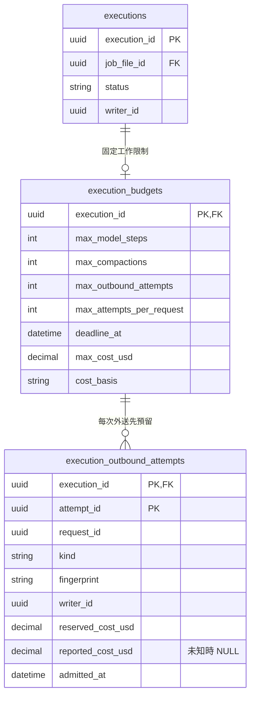

# Agent 原生接續與可恢復接線

- 狀態：**T06 施工中；原生回應與逐筆工具 Step 已有恢復元件證據，完整 Runtime 仍未交付**。實測與限制見 [T06 evidence](../plans/2026-09-29-target-rebuild/evidence/t06-agent-execution.md)。產品生命週期以[共用執行設計](../specs/2026-09-27-shared-agent-execution-and-state-design.md)為準，這裡不另造安全點。
- T06–T12 先以假 provider＋真 saver／PG 驗證；T06 可依[本 Goal 授權及分批上限](../plans/2026-09-29-target-rebuild/README.md#3-狀態與施工順序)提前做少量協定預檢，T16 才做完整有界模型驗收。LLM 推理內容不可解讀作驗收。

## 1. 執行圖與業務資格分開

目標由 `agent_execution` 提供 A／B1／B2 共用的 StateGraph node 組合；目前已有下述單一模型／工具 Step，不能把本節完整節點表當已接好的 runner。角色只提供 instructions、允許工具、起始資料 projector 及結束結果轉譯；不各寫 loop。Memory Parent 編排 B1、B2 與領域交接服務，不寫第二套 validator。

建議節點切法如下，節點名稱是工程名稱，不是對模型公開的新工具：

| 節點 | 保存／動作 | 禁止 |
|---|---|---|
| `prepare_context` | 核新工作綁定、已採用基底；追加一次 App 資料及必要輸入；保存原位置 | 同工作恢復刷新 maps、重複員工原話 |
| `request_model` | 容量／外送資格通過後呼叫 SDK；保存完整 R、原 calls 與 App 操作身分 | 同一未持久 node 內直接做寫入工具 |
| `prepare_tool` | 有業務效果的 call 先解析目前目標，形成固定命令與有界回傳，可靠保存後才執行；純讀取可直接走讀取路徑 | 工具重入重新解析舊 title、把預期成功文字當已提交 |
| `execute_tool` | 每次處理一個已存 call；原業務核對／執行，保存配對結果；按原 output 次序前進 | 多個相依寫入平行；用最新資料冒充舊讀取結果 |
| `finish_step` | 確認所有 calls 有確定結果；保存可用 Step 位置 | unresolved call 當完成、將此點當正式提交 |
| `apply_control` | 查持久取消／暫停資格，合法時原生 interrupt；否則 route 完成或下一步 | interrupt 前放不可重複副作用；UI 已按暫停就宣稱已停妥 |
| `compact_context` | 合法輪前／272K 交界，取得完整 C 並可靠採用 | 只存摘要、重加起始資料、讓輪中 C 越過取消基底 |
| `deliver_result` | 交給 consultant_turn／memory_batch 協調服務；查原完成結果可重入 | Graph END 自行宣告 JD 或 Memory 已發布 |

`durability="sync"` 是起始接法。**native super-step 不等於上述完整 Step**；每個 node 結果可靠保存才容許下一個有副作用 node。未保存的 node 可能重入，靠業務 operation 保護效果。[LangGraph persistence](https://docs.langchain.com/oss/python/langgraph/persistence)

## 2. State 的最小型別分組

Graph State 保存：不可變工作綁定的參照、原生有效窗口／採用位置、原回應與待處理 calls、候選固定位置及操作結果定位、控制／路由所需資料、已計入的執行計量。**不是全部送 LLM**；也不把現在分析的焦點、猜想等強制變成模型每 Step 必填欄位。

原生窗口 channel 使用明確的「追加 items」與「可靠採用完整 compacted output」操作；不能套會按 message ID 合併覆寫的通用 MessagesState／`add_messages`。serializer 保存 JSON-compatible 原生資料；output→input 轉換只按官方契約，不刪 reasoning／phase／call metadata。`status` 等 output-only 欄位按實際 SDK input 規則轉型，**保存原輸出**與**合法重送表示**分開驗，不能機械送所有 response envelope。[OpenAI 原生接續範例](https://developers.openai.com/api/docs/guides/deployment-checklist#use-reasoningencrypted_content)

SDK client、DB session、工具實作與密鑰由依賴注入，不進 State。候選正文由領域保存，State 不存另一份可寫副本。Runtime context、Graph State、模型 input 明確分型別。

T05 的 [Memory 寫入接縫](memory-tools.md#4-寫入準備採用與原結果接續)提供 immutable prepared command，可能含已計算的新正文及成功回傳。這是待執行原操作，不是另建可編輯候選。T06 須在業務 execute 前可靠保存它；恢復用同一命令核對原結果，不重新 prepare、更不重新解析已改指別人的 title。純讀工具的結果也須保存後沿原 call 接續，不能以重新讀到的現在資料冒充當時觀察。這是框架接線要求，尚未由 T05 的函式測試證明 checkpoint／程序恢復。

## 3. thread／私有歷史與回退接線

工程首選：每個 A 執行工作有獨立 Graph thread；Memory Parent 及各角色有可辨認的執行身分。新工作從該角色**已採用的合法歷史位置**取得原生窗口，不從任意最新 checkpoint 猜。跨 Turn 延續的是原生 items，不要求 API `previous_response_id`，也不要求所有 Turn 共用一條可被晚到 callback 污染的 thread。

B1／B2 的本批私有歷史必須在按需回交時接續。T06 採用有明確 thread 身分的角色 Graph、由 Parent 呼叫並轉譯 input/output；不依賴每次 subgraph invocation 自動生成的新 namespace 恰好能保留上次分析。Parent 只接領域位置、完成／gap 結果，不接對方完整私有 State。對框架 namespace 的實際用法以鎖定版子圖測試確認，不能手改 checkpointer 表。

當前有效工作／已採用基底的參照由執行資格持有，checkpoint 存實際窗口。這不是第二套 session 日誌；只記「哪份既有窗口仍可採用」，不複製模型全文。取消、不可恢復回退或重新領取使舊 writer 失去提交資格；晚到 checkpoint 仍可能物理保存，但不可被下一輪當有效基底。

- 新工作：先完成輪前 compaction 安全採用，再固定 maps／來源等本輪綁定、加入員工輸入。
- 同工作故障：用最新可靠位置正常 resume，不指定舊 checkpoint 做 time-travel replay；有 interrupt 才用 `Command(resume=...)`。
- 有意回退到較早安全點：先使較晚工作資格失效，核對領域位置與 context 相容，再建立可執行分支；不能直接對舊 checkpoint invoke 並假設副作用會自動撤銷。
- A 取消：後續新輸入從合法輪前基底與正式資料開始；重試 a 在模型眼中仍是新輸入。
- Memory 回①／②：候選與各角色窗口一起回該位置；同批保留對應已採用輪前 compact，不重做它。中途較晚 compact 不跨越回退點。

此接法須過 E02／E08–E11；若框架私有子圖方式能更簡單滿足同等反例，可在該任務調整 thread 組織並更新本頁，不增加第二套恢復引擎。

## 4. Requests 與工具

`openai_responses.py` 明確設 `store=False`、`reasoning.context="all_turns"`，不帶 response chaining／server-side compact／silent truncation。instructions 與 tools 在 request 層明確提供，並保留原生 items；SDK 的默認 retry 關閉，由 Runtime 在有界預算內分類處理。

起始順序依角色權威：歷史／完整 C → user-role App 資料 → A 的本輪 user 原文 → 後續原生模型／工具項目。A JD map 按需，不放回起始 context。B1 無理解導覽／工具，B2 無情境寫入工具。App 資料 user-role **不等於防注入已完成**；service 仍驗權限與來源範圍。

一次 response 可能零／一／多 calls，也可能有公開中間文字。以原生項目與尚未完成的 calls 路由，不能憑 `output_text` 非空或 response.completed 當 Turn 結束。每一 call 都保留 call_id 與結果，已拒絕可回確定錯誤，未知效果先對帳。[OpenAI function calling](https://developers.openai.com/api/docs/guides/function-calling#handling-function-calls)

模型不填 version／job_file_id／budget／operation；工具 handler 收 Runtime binding，轉譯成領域命令。傳給模型的 schema 只包含被授權角色的動作；不新增 generic execute、SQL 或任意文件操作。

### 4.1 已落地的原生回應邊界（T06 第一切片）

`adapters/response_serialization.py` 承接 SDK `Response`／`CompactedResponse`，不自製 provider 格式：

- 保存原件使用 `model_dump(mode="json", by_alias=True, exclude_unset=True)`；保留全部已收到欄位、usage、opaque content、原 status 與額外 provider metadata。`by_alias` 保持原 `async`，不把 Python 的 `async_` 寫成 wire 欄位。恢復以同一 SDK schema 驗原件，不能只存 `output_text`。
- 一般模型 output 的出站投影保留完整項目，只依官方部署範例排除各項頂層 `status`，不修改原件；`phase`、call metadata、內容順序及未知附加欄位不裁掉。Reasoning 頁的 Python 範例未排除此欄，故本案選部署範例作最小投影並保留 provider gate；離線 SDK 會發送不等於遠端已接受。
- Standalone compact 保存整份返回，採用時取其**全部 output**，含保留項目，不只選摘要、不再添加舊輸入。SDK 3.20.0 的 output union 過窄，不能拿它重驗可能保留的 user/input_text；保存使用 SDK `to_dict(mode="json", warnings=False)` 保留實際欄位，避免已知型別警告印出原話，採用時僅核 output 容器並複製完整窗口。不自訂替代 provider schema。已用 SDK MockTransport 比對原 JSON，但安全採用與遠端相容仍須後續 gate。[官方完整 window 契約](https://developers.openai.com/api/docs/guides/compaction#standalone-compact-endpoint)
- 工具結果用原 call_id，保留 direct caller；已保存結果序列只能是原 calls 的有序前綴，不能跳過、重複或交換配對。原操作冪等與 Graph 保存仍是另外兩個責任。

`agent_execution/response_steps.py` 只從完整原件推導路由，**不執行工具或宣告正式完成**。完整 response 內有 calls 時先走工具，即使同時有 final 文字也不結束；只有 commentary／reasoning 或空白 final 時繼續；無 calls 且有非空白 final 文字／拒絕時才交給產品完成責任。公開文字只取 assistant message，reasoning 不進公開訊息列表。

未完成 response／item、error、不一致的 incomplete details 不准派送工具。重複或空 call 身分、未配置的 builtin、program／async／namespace 協定或沒有可辨認 phase，明確停下，不默默忽略或猜 final。這是本產品**目前只支援 direct local functions 與明確 phase**的防護，不是 API 本身禁止那些能力；真模型預檢若顯示合約差距，要查證調整而非無限重試。原回應須先保留，之後才做此檢查。

依據：2026-09-30 重新讀取 [stateless 接續](https://developers.openai.com/api/docs/guides/reasoning#preserve-reasoning-without-stored-responses)、[部署範例](https://developers.openai.com/api/docs/guides/deployment-checklist#use-reasoningencrypted_content)、[phase](https://developers.openai.com/api/docs/guides/deployment-checklist#set-up-the-assistant-phase-parameter)、[多工具配對](https://developers.openai.com/api/docs/guides/function-calling#handling-function-calls)，以及鎖定 OpenAI 3.20.0 的 input/output 型別；不靠舊專案的 3.13.0 宣稱本次相容。

已用官方 saver／真 PG 新程序驗原件往返、正常 `ainvoke(None)` 接續且模型不重跑。純原生 items 的測試關閉 pickle 及自訂 msgpack 型別還原；prepared command 接法及部分故障證據見下一節。`sync` 不代表框架與業務共用一次交易，也不能保證尚未保存的回應永遠可取回。

### 4.2 已落地的單一模型／工具 Step（T06 第二切片）

`agent_execution/tool_steps.py` 的 StateGraph 路徑是 `request_model → prepare_tool → execute_tool → prepare_tool → finish_step`；純讀／已知拒絕由 prepare 保存觀察，不進 execute。所有 call 處理完才形成新完整視窗並返回下一步建議；不是每次工具返回都重新呼叫模型。它是將納入共同 loop 的一個可組合 Step，不是 A／B1／B2 各自的 runner。

- 正常入口 `run_response_step` 統一指定 `durability="sync"`，依本次允許 call 數設定有界 graph recursion limit；超過 call 上限在派送前拒絕。框架 super-step 數與模型 Step 數不是同一上限。只在隔離故障測例使用私有 builder，不讓角色自行選保存模式。
- 此元件每個邏輯 Step 使用獨立 thread；新輸入不得覆蓋已有 thread，只有 `None` 能恢復它，沒有保存位置也不能假裝恢復。外層角色 loop 接走完成窗口再建立下一 Step，並非重新定義產品 Turn。入口讀取檢查不是競爭鎖，單 writer／工作資格仍由執行 owner 保證。使用官方 `GraphOutput.value` typed 返回，不自造圖結果格式。
- 原回應先保存，下一節點才檢查協定／工具。未知 phase 等被拒絕時，R 仍可回讀；不是先丟掉 R 再宣稱可恢復。操作 seed 和 R 同存，每個 call 從 seed＋原 call_id 得到穩定 App 操作身分，不由模型指定業務 ID。
- 寫入 prepare 的命令先保存，execute 才交回原業務 owner。工具結果僅按原 calls 的有序前綴增加，下一筆 prepare 能看見上一筆已成立的候選；不平行派送。恢復不重新解析已保存命令的標題／正文，也不重算成功回傳。
- `ResponseStepRuntime` 僅注入模型與工具 I/O，不持久化 SDK client／DB session。共用 State 不理解 Memory 命令內容；工具接線必須核對還原型別及原工作資格，業務效果仍由原 owner 的交易／冪等處理。
- `adapters/graph_checkpointer.py` 只配置官方 `JsonPlusSerializer`：關閉 pickle 與 legacy JSON 自訂 constructor；自訂 msgpack 型別由實際 caller 明確 allowlist，不建立 domain registry。Memory prepared create／revise／delete 的巢狀 dataclass、Enum、UUID、frozenset 已驗。框架 4.2.0 對未允許型別會降為 dict／原始值，且 tuple 會變 list，不能拿值相等當型別正確；本 Step 原生集合用 list，Memory prepared 無 tuple 欄位。不補第二套 codec。

已驗：完整 R 保存後跨程序零重呼；兩工具有序；第一筆候選已提交但確認遺失，重入得到原效果後才進第二筆；model checkpoint 寫入前／寫入後拋錯均不先派工具，若 pending writes 已保存則由原框架承接；完成 Step 再 resume 不重加 items。以假 provider＋真 PG 驗證，無真實模型品質宣稱。

第二切片曾以真 PG 注入 checkpoint 與 pending writes 同時失敗：`astream` 不保證還來得及交出 node update，不能依賴它保住原回應。當時只以測例人工補存證明官方能力；**第五切片已接為 §4.4 的公開恢復路徑**，不再要求呼叫方手寫 Graph update。外層有界 supervisor 與完整產品採用仍待接線。

尚未完成：外層執行／預算准入、取消與暫停控制流程、角色 thread／候選安全點整合、compact 安全採用及官方 API。不能因上述 Step 可恢復就宣告 T06 或產品生命週期已完成。依據：[官方 durable execution](https://docs.langchain.com/oss/python/langgraph/durable-execution)、[saver／sync／pending writes](https://docs.langchain.com/oss/python/langgraph/checkpointers)，及鎖定框架原碼與本切片反例。

### 4.3 已落地的直連請求與失敗分類（T06 第三切片）

`adapters/openai_responses.py` 只承接官方 SDK，不負責預算、保存、採用或重試。`ResponseRequest` 擁有組裝完成資料的獨立複本；計數與 create 從同一 context 產生 payload，外部後續改 maps／items 不會改掉已計數的請求。它不是持久 request store。工具允許一次返回多 calls，App 仍按 §4.2 順序執行。

- Client factory 固定官方 base URL、有限 timeout、`max_retries=0`；不採環境中的 proxy base。SDK 預設 HTTP client 會跟隨 redirect，本案明確關閉，注入的 client 若開啟跟隨則拒絕；避免官方起始網址的 307／308 把原文轉送別處。
- Create 明確使用 `store=False`、`all_turns`、`truncation="disabled"`、輸出上限及同步非 background 回應；不帶 `previous_response_id`／server-side compaction。保留 `include=["reasoning.encrypted_content"]` 作明確相容設定；當前官方說明 `store=false` 已預設附帶，不把它說成唯一取得方法。
- Count 和 compact 也只外送一次，不降級成猜測計數／本地摘要；compact 返回完整 SDK C，沒有在 adapter 自行採用。鎖定 SDK 的 standalone compact **沒有 `max_output_tokens`**，不能用 create 的輸出上限當其費用上界。
- `adapters/openai_failures.py` 區分遠端結果不明、暫時服務問題、權限／額度阻塞、容量、請求與回應協定問題；不複製可能含原話／秘密的 error body 到 State 或 UI。分類不等於已准許重試，更不代表該次免費。

此切片目前是**非串流傳輸接線**；公開中間訊息／UI 串流、Retry-After 排程、持久額度與原結果採用仍待後續。離線官方 SDK MockTransport 已驗一次外送、同 payload 及 redirect 拒絕；不是遠端接受或產品恢復驗收。依據：[stateless reasoning](https://developers.openai.com/api/docs/guides/reasoning#preserve-reasoning-without-stored-responses)、[錯誤分類](https://developers.openai.com/api/docs/guides/error-codes)、[token counting](https://developers.openai.com/api/docs/guides/token-counting)，並核鎖定 SDK 3.20.0 的 client／retry／compact 原碼。

### 4.4 已落地的原回應補存與資格接線（T06 第五切片）

`run_response_step` 在模型 node 返回前保留完整原 R、原 input 及同一 operation seed；僅在尚未進入下游節點的保存失敗時，以 `ResponseStepSaveError.recovery` 交還程序內的 `HeldModelResponse`。一般工具／協定／資格錯誤仍保持原分類，不一律轉為可重試保存錯誤。這不是另一份持久 ResponseStore，不寫入業務表、模型 context 或一般 log。

- 仍握有 recovery 時，以同一 thread、`input_items=None`、`recovery=...` 回到公開入口。入口先核有效工作資格，再查官方 saver；不呼叫模型、不由呼叫方自行改 Graph State。
- 原 R／seed 已在 checkpoint 或 pending writes 時核對相符，沿目前位置恢復，**不覆寫之後的 prepared command、工具結果或完成視窗**。此時立即釋放該次呼叫的暫存保存責任，避免直接恢復 execute node 的工具／資格錯誤被誤分類。
- 原 R 尚未保存時，必須仍在原 `request_model` 邊界、原 input 相同且無後續效果資料；再查資格，以官方 `aupdate_state(as_node="request_model")` 補存原 update，然後正常 `None` 接續。不同 thread、不同 input、不同已存 R／seed 或不相容位置拒絕，不猜測、不回退。
- 查詢／補存再次失敗，仍交還同一原件；沒有自行循環、重新推論或增加付費請求。是否與何時重試由工作 supervisor 的單一有界政策承接；程序整個消失且兩種保存皆失敗時，不保證記憶體原件可恢復。`store=false` 不能靠 response ID 補取遺失內容。
- `ResponseStepRuntime.ensure_active` 是必要注入，入口、模型／工具 I/O 前、完成 Step 及交回結果前均檢查。產品接線用 execution owner 的原 scope／writer，短交易結束後才做模型 I/O；不把 DB session 或 writer 狀態塞入模型 input。單一 writer 調度仍由外層負責，這不是新的租約實作。
- Guard 與 saver／provider 不共用原子交易：取消後晚到 R 仍可能物理保存，但不能派送工具或交付有效結果。業務工具還須在自己的提交交易內核資格；T08／T11 才決定有效 Turn／批次基底，不能把任意 latest checkpoint 當成可採用歷史。

已驗公開恢復入口、重複 handoff、原 R 確認遺失、雙保存失敗、後續工具錯誤不誤分類；真 PG 取消／writer 替換拒絕舊 worker，新有效 writer 可承接同一原 R。完整模型外送准入／費用結算、自動恢復調度、產品暫停／取消及 compaction 仍未因此完成。機制依 [LangGraph 狀態更新與接續](https://docs.langchain.com/oss/python/langgraph/use-time-travel)；本案只在核對原位置後補存既有 R，不以舊 checkpoint replay 重算外部工作。

## 5. 容量、重試與恢復不是同一政策

每次推論外送前核實際完整 request，含 instructions、tools、原生 items、App 資料及輸出／推理預留。首選 direct SDK 的 `responses.input_tokens.count`：用同一份組裝 payload 中計數 API 接受的欄位計數，核對所選模型、reasoning／compaction items 的實際接受性。這是遠端計數，不是本機 tokenizer；仍受資料外送授權、timeout 與重試規則約束，不假設免費或永遠可用。[OpenAI token counting](https://developers.openai.com/api/docs/guides/token-counting)

計數不產生新的模型回應，不計入模型迭代數，但計入 API 外送次數／延遲紀錄。未改變的同一 payload 可在本次執行沿用已核計數，不新增永久計數 cache。輸出上限含 reasoning 與可見輸出，預留不得重複計算；本地 tokenizer 對 opaque items 不保證精確，不能用字元數／上一 usage 冒充精確值。T06 預檢與 T16 校準確認模型容量、計數及預留；計數失敗不盲送，保留恢復位置並依有界政策處理。

輪前 A 128K、各 Agent 中途 272K 的真正輸入與採用次序只依上位 §6.3。達中途門檻先處理 pause／cancel／final；只有將發下一請求才 compact。完整 C 採用確認前舊基底可取回；採用後附既有已保存後綴，不重貼 employee input／maps；仍超量不反覆壓同一未增長視窗。

暫時網路／服務故障依 Retry-After、有界 backoff＋jitter；額度、權限、程式錯誤及確定容量問題不原樣重撞。模型原結果不可得時的再推論是新 attempt，不冒充原結果、不視為免費。各層不得各重試五次形成疊乘。[Azure Retry pattern](https://learn.microsoft.com/en-us/azure/architecture/patterns/retry)

完整 R 已存則恢復零額外模型呼叫。候選工具提交、checkpoint 尚缺結果則查回原操作；多次進入程式可接受，業務效果只一次。費用資格、次數與原工作相連，重啟／B 回交不歸零。

### 5.1 已落地的工作額度保存（T06 第四切片）

`features/executions/budgets.py` 沿既有 execution 身分與 writer fencing 維護額度，migration `0013_execution_budgets` 建立下圖兩表。**這是可組合的准入／記帳元件，尚未接成所有 HTTP 呼叫的共同 runner。**不含 R／C、prompt、Graph cursor、候選正文或秘密；沒有第二套 ResponseStore。

執行配置啟動時固定，由公開查詢恢復，不以啟動當下的新 deadline 覆蓋。`cost_basis` 是本工作經研究的計價依據定位，不允許未配置；目前測試使用合成數值，真實模型價格／預留計算仍須預檢。B1／B2 應使用同一 Memory batch scope，不各領一份可重置的預算。

- 新模型 Step、compact、count 使用 App 產生的 logical request 身分與 exact payload SHA-256；傳輸重試保留同 request、另給 attempt。新模型修參數則是新 request。模型步數與壓縮數按不同 request 計，所有實際准入 attempt 均計入總次數與成本。
- 新 attempt 在既有 execution 短行鎖下重查有效 writer、固定 deadline、各次數與成本，再預留；deadline 用取得鎖後的 DB 時間，不能用等待鎖前的時間判斷。交易內沒有網路等待。
- **只有新准入且提交確認後才可外送一次。**同 attempt 重入回原紀錄、`created=False`，不是可重送的票。COMMIT 確認不明先查回，不能因看到原紀錄便再發送；確需重新推論時要新 attempt，仍占同一工作限額。HTTP 監督流程尚須接上此判斷。
- 聚合 `reported_cost_usd ?? reserved_cost_usd` 作准入占用；timeout、崩潰或沒有 usage 均保留原預留，不歸零。已知 usage 依固定計價規則得出成本後只記一次；相同重入可承接、不同值拒絕。已知成本高於預留也如實記入，使後續准入受限，不以拒絕記帳隱藏超支。它不是 provider 帳單保證。
- 取消／writer 更換只停止新的准入與採用，不刪已發生的記帳。晚到結果仍可結算原 attempt，但記帳函式不恢復執行、不採用 R／C、不准派工具。沒有新外送時，讀原结果不受已耗盡額度阻擋。
- SQL 禁止改寫／刪除固定 budget，禁止清除／改寫 attempt 身分與已知成本；不存另一份可失同步的計數器。FK 及 scope 查詢維持檔案隔離，成本採固定精度 Decimal，不用 float。

已驗兩連線競爭最後額度、未知預留、每 request 重試上限、count／compact 分計、取消後記帳、writer 更換及新程序不歸零、DDL／ORM 一致。完整 HTTP 准入→原結果保存→結算／採用、Retry-After、compact 真實費用預留尚待後續；不能把此元件通過當 E15 全通過。設計借鑑 [PostgreSQL 行鎖](https://www.postgresql.org/docs/current/explicit-locking.html#LOCKING-ROWS)及 [Azure 單一重試責任](https://learn.microsoft.com/en-us/azure/architecture/patterns/retry)，兩張表及原結果不等於重送許可是本案取捨。

## 6. Memory 背景工作

A 完成交易持久化要求的 F（通知該 Turn 最後員工輸入的正式序號），調度器由待處理事實領取；同檔案只一批，後來要求合併待處理上界但不擴大在途 F。沒有 broker、沒有只存記憶體通知。

B1 完成 → 保存②及變更概覽 → B2 分析；有具體 gap 才回 B1，回交內容不洩露理解正文。B1 從自己已改好的候選續改；B2 續自己的合法歷史，拿新交接差異與當前工作稿，完成資格綁本階段。沒有固定互審／第二個審核 Agent。

最終失敗保留原已發布快照，系統記已知原因與可恢復條件，不自動無限重跑；A 在下一個合法資料交界得簡短必要狀態並繼續訪談／原話回讀。使用者沒有 B 暫停／取消／重試工具。解除阻塞由系統按原資格／未發布有效範圍處理，不跳過未整理資料，也不重新給被取消 A 輸入資格。
