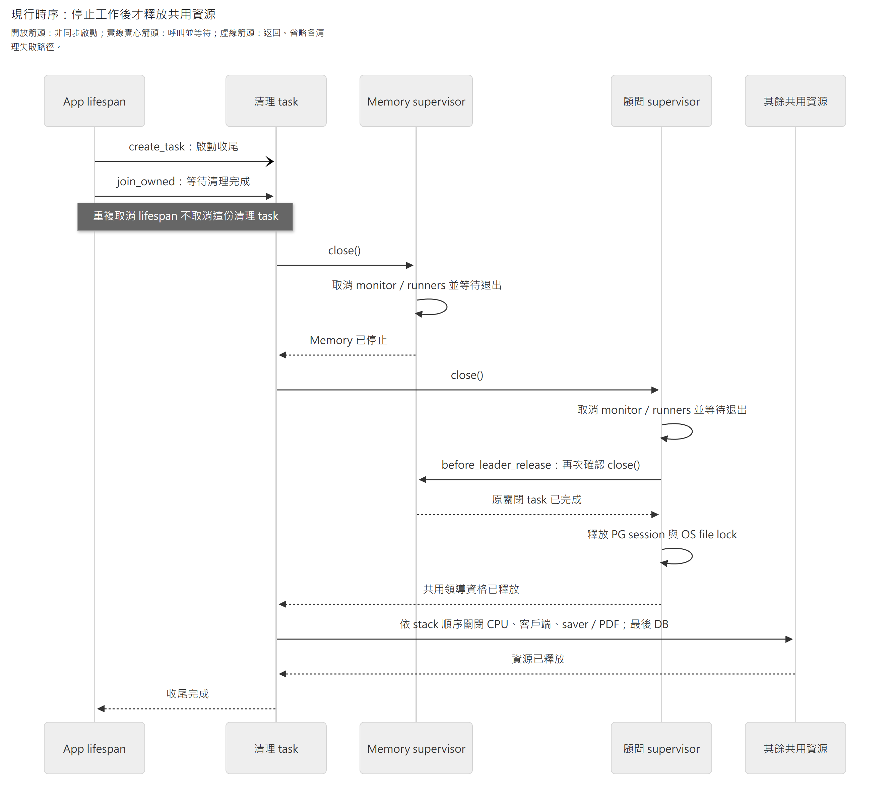

# Agent 程序監督、控制與背景調度

本頁維護現行單機 runner 的領導資格、啟停、A 控制、最外層失敗收尾及 Memory 持久調度。Supervisor 擁有程序內 task 與鎖；領域 workflow 裁決正式結果；[Graph 執行](agent-execution.md)承接原生進度；[模型外送](model-requests.md)負責准入與 provider 重試。

| 要查的接線 | 閱讀位置 |
|---|---|
| 啟停與 writer 接管 | [本機 Supervisor](#1-本機-a-supervisor) |
| A 的暫停、取消與續作 | [控制協調](#2-a-pausecancelresume-控制) |
| 最終失敗與正式結果競爭 | [最外層失敗收尾](#3-最外層失敗收尾) |
| 公版工具的角色能力恢復 | [公版工具接線](#4-公版工具的可選角色接線) |
| 已成立的整理要求 | [Memory 背景調度](#5-memory-背景工作) |

產品完成、取消及保留政策沿[共用執行與恢復](agent-execution.md)及[資料交易](../architecture/persistence.md)。本頁不另定終態；實際恢復範圍與未驗情境沿各節證據。

## 1. 本機 A Supervisor

### 1.1 共用領導資格與准入

`workflows/consultant_supervisor.py` 借入 `runner.run` 與 session factory，擁有
`adapters/process_lock.py` 及所有 asyncio task：`start()` 先取鎖再掃描、`notify(scope=None)`
只喚醒持久查詢、`close()` 先取消並等待本機 runner 退出，最後關閉鎖。HTTP／lifespan
組裝由 bootstrap 負責，不把 HTTP BackgroundTasks 當隊列；未配置模型不啟動。

啟動器明確設定 Uvicorn 的 HTTP 排空上限為 10 秒，避免仍連線的 SSE 永久阻止 lifespan；外層程序正常關閉寬限仍為 90 秒。

HTTP 排空期限不包含任意長的保存／CPU 工作，不承諾所有負載都能在剩餘時間內完成。

正常關閉與借用資源的釋放順序見[§1.2](#12-正常關閉的順序)。

- executions 公開 `list_active_consultants()` 只列 active A，不恢復 paused／終態／Memory。
  專用非 pooled PG session advisory lock＋同一主機帳戶/temp 目錄的 OS file lock 是 writer
  替換的准入依據；所有 A runner 必須走此入口。OS lock 補足「PG session 已斷，但舊 task
  還在清理」的實測反例；不能只靠 writer CAS 宣稱 checkpoint 分支沒有並行寫入。
- 強參照保存 monitor／runner／shutdown tasks，預設至多四個不同 Turn 並行，同 scope 一次。
  啟動立即關閉也須收尾；取消等待中的 caller 不讓鎖提前釋放。清理尚未退出則不放鎖。
- DB 監督 I/O 一次失敗即停止准入並收尾，不自動重連接管；scan 有 10 秒界線、鎖 I/O 5 秒。
  `runner_failures.py` 將 runner 例外投影成安全種類、取消 disposition 及明示的 typed recovery；
  `failures` 不持有 Exception／traceback，`stopped_reason(scope)` 僅給安全原因碼。
  重複通知不重跑未知外送，不重置 budget，不判定產品 Turn 已取消／失敗／完成。
- 範圍是單機同帳戶部署，不宣稱多主機網路分割接管。明確 interrupt resume 見下節；失敗
  終局及 UI 呈現由上位協調。lock file 不含資料，
  不刪除以避免刪除重建後出現兩份 inode；OS handle 關閉／程序退出釋放實際鎖。

### 1.2 正常關閉的順序

bootstrap 以一個 owned cleanup task 持有完整資源 stack；lifespan 即使反覆收到取消，也等它清理完成。借用資源的 runner 必須先退出，才可關閉 SDK、saver 或 DB。

[圖源](../diagrams/implementation/agent-supervision/shutdown.mmd) · [SVG](../diagrams/implementation/agent-supervision/shutdown.svg)

本圖從 lifespan 開始收尾，只展開各項清理正常返回的路徑；箭頭說明見圖例。runner 自己的取消保存與 native cleanup 省略在 supervisor 的等待中，取消 task 不等於取消業務工作。

若領導資格中途失效，顧問 supervisor 也會在放鎖前呼叫相同的 Memory 關閉入口。外層 90 秒到期的強制終止及其他清理失敗不在本圖範圍。

接線見[bootstrap](../../apps/api/src/caliburn/bootstrap.py)、[owned task 等待](../../apps/api/src/caliburn/adapters/owned_tasks.py)及[native cleanup](../../apps/api/src/caliburn/agent_execution/native_cleanup.py)；對應測試見[lifespan 重複取消](../../apps/api/tests/unit/test_lifespan_cancellation.py)與[領導資格釋放](../../apps/api/tests/integration/test_consultant_leader_release.py)。

### 1.3 程序內原件的保存與釋放

runner 退出時透過 executions owner 重讀正式結果；確認 COMPLETED／CANCELLED／FAILED 才釋放該次已無接續資格的原件，仍保留 `_attempted` 防止通知重跑。

若讀取失敗，保留 typed 原件與停止原因，不推測已提交或取得再送資格。

普通例外只留種類；R／C／兩種 count 的保存 handoff 只留各自明示的資料，不留連帶的區域變數與 exception chain。Memory 使用相同規則。

原件的釋放時點如下：

- 取消控制：正式取消且本機 task 退出後釋放。
- 整檔刪除：確認提交後，在 dispatch gate 內清掉該檔的本機原件與身分記錄；其他檔案不受影響。
- 結果未知：不因時間經過而淘汰原件。

程序內保留與持久 checkpoint／captured request 是不同責任；停止原因本身不授予重送資格。
依據 Python 3.14 的 [traceback 引用語意](https://docs.python.org/3.14/library/traceback.html)；
採 explicit typed 資料而非清空所有 exception，是為保留本案必要的原件核對能力。

驗證：本機 supervisor 與程序恢復。Windows 使用 SelectorEventLoop；部署範圍限單機同帳戶，不承諾多主機接管或所有 crash 組合均通過。

依據：[Python Task 強參照與取消](https://docs.python.org/3.14/library/asyncio-task.html)、
[PG session advisory lock](https://www.postgresql.org/docs/18/explicit-locking.html#ADVISORY-LOCKS)、
[Windows 非阻塞 file locking](https://docs.python.org/3.14/library/msvcrt.html#msvcrt.locking)。
官方提供鎖／task 語意；雙鎖生命週期及有界停止策略是本機部署取捨。

## 2. A pause／cancel／resume 控制

`ConsultantControlWorkflow(sessions, checkpointer, supervisor)` 提供 `pause(scope)`、
`cancel(scope)`、`resume(scope)`，回傳執行資格模組的 `ExecutionInfo`。App 綁定 scope；
UI 不傳 writer、checkpoint 或 interrupt ID，Memory kind 不得進入。

- pause 只記持久意圖，未 claim writer 也合法；Graph 沿既有完整 Step interrupt 才確認 PAUSED。
  cancel 先由 `ConsultantCompletionWorkflow.stop` 同交易 fence／discard，確認後才中止本機 task；
  若正式完成已先成立，回原 COMPLETED，不回滾 JD／訪談／歷史。
- resume 和 supervisor claim／launch 序列化，先等舊 paused invocation 退出，再沿公開
  `read_response_pause` 以原 builder／validator 查當前原生 interrupt。無原 interrupt 不放行。
  正式受理由執行資格模組設為 ACTIVE 並清除 pause intent；不新增控制表、State 或模型參數。
- bootstrap 將 `runner.run` 經 `run_consultant_with_controls` 及 [最外層失敗收尾](#3-最外層失敗收尾) 的唯一失敗收尾注入 supervisor。
  wrapper 從原 execution＋原 Graph 重讀已授權的 interrupt，因此 resume COMMIT 後、喚醒前
  中斷仍可接續。只由受控 resume 清除 `_attempted`，普通 notify 不授權重送或復活取消工作。
- final 離開 Graph 後才收到 pause，若完成交易被 A 完成工作流拒絕，wrapper 僅在原 writer 仍有效、
  pending pause、完整 final Graph 已確認時，重入一次既有純控制交界；不重送模型。不攔截
  response-save recovery handoff、不加外送 retry，不重建 pinned context／budget。
- wrapper 可接受 App 仍持有的 typed `recovery`，先交原 runner 核對原 thread／request／
  checkpoint（含 pending writes），不將它轉成新模型請求或 interrupt resume。採用後若有
  pause 要求仍停在完整 Step；之後按原 interrupt 續作，不重傳已消耗的 handoff。取消／
  失效 writer 仍由執行資格模組拒絕。這是內部原件交接，不是新的 HTTP 重試操作，
  也不代表 supervisor 已能自動判定跨程序遺失或啟用再推論。

驗證：A 控制與完成、程序恢復。合成 transport、真 PG 與真模型各自列明層級，不能互相替代。

## 3. 最外層失敗收尾

依 [共用執行與恢復](agent-execution.md)，`bootstrap.py` 在 A 的控制 wrapper 與 Memory batch 外共用 `workflows/execution_failures.py::run_with_failure_boundary`。它不是第二個恢復引擎；不增表、重試、模型參數或 UI 控制。

| 原執行的出口 | 邊界如何處理 |
|---|---|
| 正常返回 | 保留原完成或暫停結果 |
| task cancellation | 等原生清理後向上傳遞，保留可供重開的進度 |
| 未處理 `Exception`，正式完成已成立 | 完成工作流核對後保留原完成 |
| 未處理 `Exception`，尚未正式完成 | 完成工作流放棄本次候選，提交 `FAILED` |
| 收尾提交未確認 | 向 supervisor 回報錯誤，不偽造終態 |

- A 沿 `ConsultantCompletionWorkflow.stop(FAILED)`；Memory 經 `MemoryBatchWorkflow.settle_failure` 保留既有 provider／分析結果／容量等原因分類，再沿 `MemoryConsolidationWorkflow.fail` 收尾；未分類錯誤只用安全代碼 `execution_interrupted`。候選丟棄與終態仍是原有短交易，正式完成競爭由原 job lock／writer fence 決定，不以 Python 例外推翻成功。
- 原生已存資料照常接續；仍握有的原回應先走既有有界補存。最終離開原恢復流程後，本邊界可結束該次工作，不再為同一未明外送增加新的恢復平台或盲目重送。既有低層 typed recovery API 保留，但不宣稱所有原件都要永久救回。
- `except Exception` 不攔 `asyncio.CancelledError`；正常關閉、控制取消及失鎖清理仍走原生命週期。原件補存的 cancellation subclass 同樣傳遞。
- 日誌僅記 execution identity、kind、exception type，不記原錯誤訊息、provider body、原文或 reasoning。收尾自身失敗向上傳遞，不能顯示假 failed；DB 全面故障時仍需恢復服務，不承諾離線提交。
- 通用 supervisor 只擁有 task／領導資格，不新增 JD／Memory 判斷；bootstrap 明確注入各自既有的業務收尾。對應測試見[最外層收尾](../../apps/api/tests/integration/test_execution_failure_boundary.py)與[native cleanup 交接](../../apps/api/tests/unit/test_execution_failures.py)。
- A／Memory 產品執行只在最外層收尾一次；原件接續與故障注入直接呼叫 `run`。收尾自身拋錯直接回 supervisor，不再次分類或第二次提交，也不把原 Memory failure reason 改成通用原因。

## 4. 公版工具的可選角色接線

公版工具的可選接線依 [公版明示接線](../architecture/rag-pipeline.md)：bootstrap 只在明示配置時供 A 注入 RAG client，B1／B2 只增加排除範圍唯讀工具。角色先從自己的原 preparation checkpoint 還原模板，工具權限沿已捕捉 request；同工作重入不換提示或增加工具。A 的公版寫入 command 沿既有 prepare／execute／result 節點，重播不倒帶候選；B 的排除讀取沿原 Memory binding／F。

`ConsultantRunner._tools` 在建立公版候選前，核對原 captured request 的完整工具組。公版工具缺漏或名稱重複時拒絕；兩個寫入工具統一回 status 契約，description 不再作執行協定。

能力判斷使用原工具定義，不讀當前全域設定。已保存的 native output 直接接續，尚未完成的命令沿原 prepared facts execute；改 description 不重新 capture 或改變命令身分。公版寫入的資格與保存見[公版選用與否認資格](../architecture/rag-pipeline.md#公版選用與明確否認的保存資格)。

## 5. Memory 背景工作

### 5.1 探索與鎖內領取

`memory_consolidation_queries.read_memory_qualification` 組裝活動工作、阻擋、合法來源及證據異常；`discover` 與鎖內 `claim` 使用同一資格規則。探索回傳具名候選及其 active scope，supervisor 只管理本機 task、容量、領導資格及未知外送保護，不穿過 workflow 取得 session factory。單檔與集合失敗讀取共用 `read_blocks`；顧問 Context 經 `read_failure_reason` 取得必要狀態，保存格式與解除政策仍由 Memory owner 定義。

工作探索以 owner 公開的身分／正式交換／發布 coverage 投影組合集合 SQL；活動工作與已阻擋檔案沿既有短路，不逐筆查歷史 execution／訪談正文。外連接保留損毀證據供分類，workflow 回傳可調度檔案及具身分的異常；同檔案有任何受檢證據異常，其他合法意圖不能掩蓋它。

claim 在取得檔案鎖後重新判斷，discovery 不是准入許可。

單檔失敗查詢有失敗紀錄時才讀一次當前正式 frontier，沒有紀錄則不查；集合探索先以 query-local MATERIALIZED CTE 取得各失敗檔案的 frontier，再核歷史證據，不先聚合所有訪談。

SQL 往返次數不隨每筆歷史增加，但資料庫掃描與必要的歷史 metadata 驗證仍有成本，不能據此宣稱任意歷史量都固定耗時。

### 5.2 單檔證據異常與全域監督故障

Memory owner 精確分類意圖／失敗紀錄的保存格式異常，workflow 檢查顧問 Turn 與正式來源關聯。

這些異常保留檔案、execution、command 識別及固定原因碼，阻止該檔案 Memory 准入，不取消其他檔案 runner，也不使整個 App 啟動失敗。

claim 中的專用 `MemoryEvidenceError` 先讓原交易回滾，supervisor 才隔離該檔案；不能廣捕所有候選、資料庫或程式錯誤後繼續。

探索在短 READ ONLY／REPEATABLE READ snapshot 中分別核對完整性與待辦；異常 SQL 不以 coverage 過濾，已覆蓋的損毀仍須回報。待辦只回各檔案最新合格來源；failure 依 command ID 排序，選仍阻擋的第一筆原因，保留原六則訊息解除規則與 active 固定窗口。typed intent／failure 不再讀歷史 JSON。

100／10,000 獨立 exchange、固定待辦 0／1 的回傳列固定為 0／1，但掃描與排序成本仍成長，不能宣稱 O(待辦) 查詢。claim 仍在原 root lock 內重核，不提升寫入交易隔離。

領導鎖、SQL／連線／交易、掃描期限及未分類程式錯誤仍依原生命週期停止全域監督。唯讀探索會重新核對資料；證據有效後沿原 claim 路徑恢復，監督不修改損毀原件、不建立新持久隔離表，也不因此清除 `_attempted`／runner failure 中的未知外送保護。

相同異常只在新出現時記安全事件；容量已滿尚未重驗 claim 時，不把先前 claim 異常當成已修復。診斷方式見[操作手冊](../operations/README.md#在-datagrip-查某個職務檔案的-ai-執行紀錄)。

### 5.3 整理要求、角色交接與發布

整理要求的受理與正式資格分開：

1. `request_memory_consolidation` 先沿共用工具機制保存原 intent，再交 `MemoryConsolidationWorkflow` 持久記錄本次要求；此時尚無正式訪談資格。
2. A 正式完成交易保存有效訪談後，調度器從既存要求、已完成 execution 與該輪正式員工輸入推得 F；不另設完成交易雙寫的 frontier／通知表。取消／失敗的 A 不具資格。

同檔案只一批，後來要求合併待處理上界但不擴大在途 F。重啟可從持久事實重新發現要求，不靠記憶體通知或 broker。

B1 完成 → 保存②及變更概覽 → B2 分析 → 共同發布。B2 不回交 B1；它按需讀目前情境及合法原話，維護工作理解，資料不足則保留未知或矛盾。兩者都只回傳 `{"status":"complete"}` 表示自己的分析完成，發布仍由 Parent 協調原有短交易。沒有固定互審或額外審核角色。

階段結果只接受 `complete`。未完成批次若保留舊 `needs_situation` 結果，沿失敗流程保留已發布快照，不推進整理上界、不改寫原模型輸出，也不重跑 B1。合法的同階段恢復、Step 壓縮與跨批歷史接續仍可用；驗證見單向流程。

### 5.4 失敗後的解除條件

最終失敗保留原已發布快照，系統記錄已知原因與可恢復條件，不自動無限重跑。A 在下一個合法資料交界取得簡短的必要狀態，並繼續訪談／原話回讀。使用者沒有 B 暫停／取消／重試工具。系統按原資格／未發布有效範圍解除阻塞，不跳過未整理資料，也不讓被取消的 A 輸入重新取得資格。

解除條件只有訪談進度：失敗時 `fail` 把當時的正式訪談前緣存入該失敗紀錄，之後正式序號再前進 6（三輪完成的訪談），共用失敗查詢才視為已解除。

一次新批次從已發布涵蓋承接；新要求、重啟或時間不解除，不新增計時器、重設額度或手動入口（`RETRY_AFTER_NEW_MESSAGES`）。這個解除政策仍待確認，且尚未在真長旅程自然觸發；產品語意見[產品概念](../product/concepts.md)。
