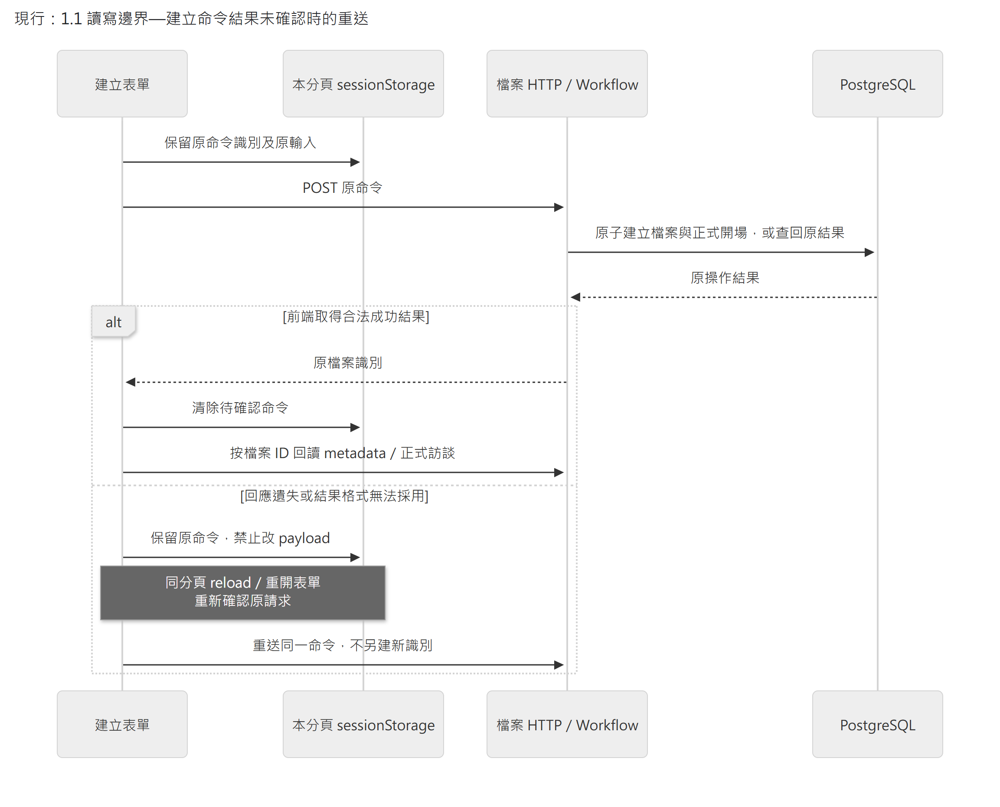
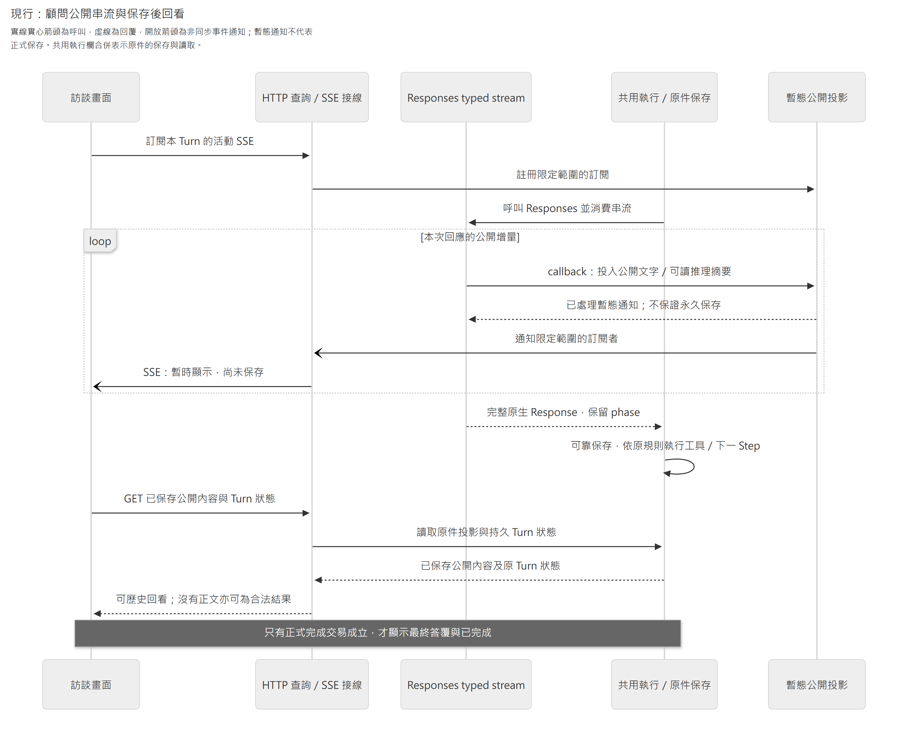
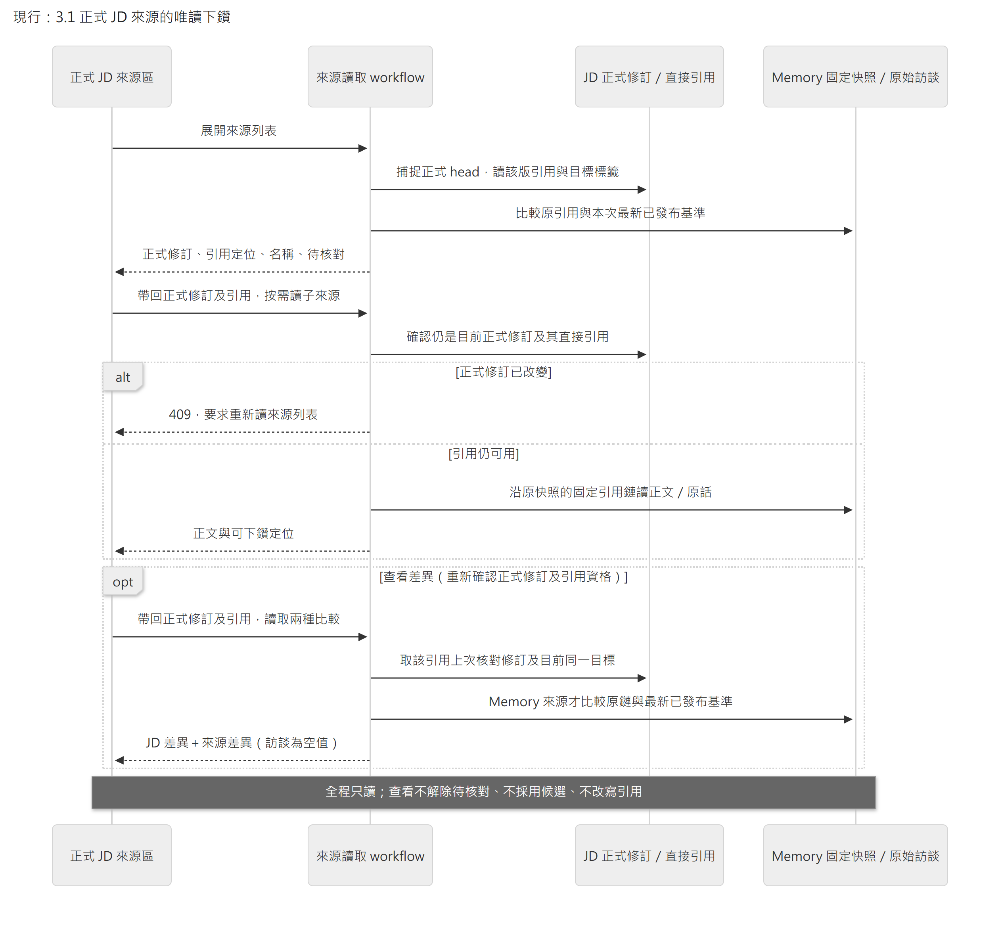

# 介面、公開訊息與本機交付

- 狀態：**現行介面、公開訊息與交付契約** 。正式產品切換依 [正式產品與選型](../architecture/design-decisions.md)，各次 UI、串流、來源、PDF 及恢復上位：[運作與交付](../architecture/delivery-and-operations.md)、[正式採用與交易](../architecture/persistence.md)。不增加雲端登入、多人權限或 Memory 操作台。

本頁維護 HTTP 命令、公開串流、來源回查、PDF 與本機交付的接線。JD 人工編輯與工作畫面的元件、草稿、收合及鍵盤操作，由 [Web 工作畫面](web-workspace.md)維護；正式保存與權限由業務模組判定。

## 1. API 與 UI 的責任

HTTP 命令使用 POST／PATCH 等有副作用方法；讀取與公開事件使用 GET。業務拒絕、暫時失敗、結果未確認分型別，不以 HTTP 200＋`success:false` 混淆一切。具體路由與 JSON 由各功能 canonical schema 與生成型別定義，不把模型 tool schema 當 UI API。

Web 採 React Router 管頁面定位，TanStack Query 管正式／候選資料 cache，局部編輯欄位用 component state。query key 包含職務檔案及資料用途；清楚區分 formal JD／candidate preview／source read。不要把跨檔案 current state 放一個無 scope 全域 store。

正式入口由 `app/query-client.ts` 建立同一份 QueryClient 政策。本機 HTTP 的 query／mutation 採 `networkMode: always`，依實際連線結果處理；瀏覽器 offline 訊號不把操作暫停、留到連網時才突然送出。關閉隱含 retry 及 reconnect refetch，由既有明示重讀／確認流程處理。依據：[TanStack Network Mode](https://tanstack.com/query/latest/docs/framework/react/guides/network-mode)。

路由入口先驗 UUID，非法檔案識別不掛載資料查詢。後端確認整份檔案刪除後，App 組合各 feature 的清理入口，取消／移除該檔案 query、清除 rename、訪談 hint 與 JD profile／work 待確認命令，卸載已刪檔案的工作畫面。清單頁以必要的 `onDeleted` callback 交由 App 統一清理、通知、警告及一次清單刷新，頁面只收束對話框及恢復焦點，不另作局部清理或刷新。`BroadcastChannel` 只通知事件種類及檔案 ID；其他開啟分頁清理自己的 sessionStorage。同檔案進行中的清理共用完成 Promise，成功後去重；儲存或清單刷新失敗則允許後續通知／確認重試本地清理，不再次 DELETE 或轉播。警告按檔案保留，恢復一份檔案不清除另一份的錯誤。漏接通知的頁面由 metadata GET 的 `job_file_not_found` 補救，其他 404 不作刪除證據。儲存、通知或清單刷新失敗仍明示後端已刪除及未完成的本機步驟；不能改判刪除失敗或宣稱已清除未開啟分頁。依據：[HTML BroadcastChannel](https://html.spec.whatwg.org/multipage/web-messaging.html#broadcasting-to-other-browsing-contexts)。

UI 依後端狀態呈現可用操作。A 執行中或暫停時，人工 JD 修改由後端拒絕，前端禁用按鈕只是讓限制更清楚。第二筆輸入返回既定在途狀態，不排入無界隊列；不同檔案可並行使用，不需要每個檔案一個程序。

元件按 feature 組織：interview 負責訊息與 A 控制；jd-editor 負責關聯式欄位及候選預覽；source-viewer 負責依據、待核對與詳細差異。不讓共用 UI component import database／provider 或決定來源版本。頁面組裝、版面與視覺 token 在 `app/`，見[工作畫面組裝](web-workspace.md#5-工作畫面組裝)。

### 1.1 讀寫邊界

[App](../../apps/web/src/app/App.tsx)只組裝路由；[檔案 feature](../../apps/web/src/features/job-files/JobFilesPage.tsx)管建立／清單，[訪談 feature](../../apps/web/src/features/interview/InterviewHistory.tsx)只呈現正式歷史。檔案 ID 進 URL 與 query key，同名標籤不混成同一份資料；切換不保留另一檔案的 placeholder。HTTP 回傳先由 Ajv 驗證同一份 `apps/api/contracts/http` schema，再進 Query cache；TS 型別仍由該 schema 生成，不新增手寫 wire 規格。員工與 App 訊息的原文以轉義文字顯示，保留換行，不當 HTML 執行；顧問訊息只在畫面上以安全 Markdown 格式化（`ChatMarkdown`：原始 HTML 仍以文字顯示、連結不導覽、圖片不載入；保存的文字與來源回查的原文不變）。

**現行時序圖：建立命令結果未確認時的重送。** 參與者依序為畫面、本分頁暫存、HTTP／工作流與資料庫；實線為呼叫，虛線為回傳，`alt` 區分成功確認與結果不明。暫存只保留原命令，正式結果由後端判定。

[圖源](../diagrams/implementation/interface-and-delivery/create-command-recovery.mmd) · [SVG](../diagrams/implementation/interface-and-delivery/create-command-recovery.svg)

`sessionStorage` 僅為**本分頁尚未確認的 transport command** ，不負責判定正式檔案／交易結果。保存 command ID、檔案名稱、員工姓名；先保留才送出，儲存不可用則明示未送出。不明結果不自動重送、不解除原 payload；明確拒絕後才可改字重新提交。確認成功清除；即使清除失敗，殘留命令也只查回原結果，不把原建立時 metadata 覆蓋到最新 cache。關閉分頁／清除瀏覽器資料不保證保留此暫存；此時先查清單，不能宣稱跨裝置或永久恢復。取消建立表單不是撤銷可能已成立的後端建立。

建立與改名的 ACK 清理只作用於仍與原命令識別及 payload 相符的本分頁紀錄；晚到成功或明確拒絕不能刪除較新的命令。離開／卸載後仍可整理相符的原紀錄，但不更新舊畫面、回呼或導頁。目前畫面收到已知成功／拒絕、原紀錄卻已不存在或變更時，明示該結果及返回清單核對的出口，停止再次確認，不改判為未知或自動另送。確定刪檔的全量清理另由 App 組裝。這是同一 sessionStorage 作用域的同步核對，不新增跨分頁鎖；訪談的共用 hint 仍依自己的 Web Locks 協定。

建立、改名及 JD 人工命令共用 `shared/commands` 的 store／mutation 流程；feature 提供原命令 schema、比對、端點與正式拒絕判斷。建立以 `409 creation_command_conflict` 或 `410 creation_result_deleted` 退休原命令；410 表示原檔案已刪除，不導向舊檔案、不建立新命令，清理相符暫存並重讀清單。拒絕種類由 feature 回 typed reason，共用 mutation 不解析業務文字。改名只以 `409 rename_command_conflict`／`stale_job_file_name` 退休遭拒的原命令；這些碼均由原命令核對後產生。一般 status、前置驗證、未知錯誤碼與 HTML 回覆仍屬結果未確認。跨 feature 正式刷新在 App 組裝，先取消舊 GET，再失效並重讀。伺服器已接受但重新讀取失敗時，顯示已成功及讀取失敗，不重送原 POST 或換新命令；詳細接線見 [Web 工作畫面](web-workspace.md#1-基本資料編輯的讀取基底與恢復)。

共用 HTTP 邊界維持 15 秒期限與 caller AbortSignal，將網路、期限、取消、非 JSON、契約錯誤與 HTTP 失敗分成受控種類；只保留長度最多64、ASCII snake_case 形狀的不可信分類碼、status 及合法 UUID 格式的 `X-Request-ID`；公開業務碼是否可判定原結果由 feature 決定，HTTP 不手寫跨 feature 業務枚舉。人工命令與訪談 POST 帶本機診斷用的檔案／命令／execution 身分，不將這些額外欄位傳入 fetch。`shared/diagnostics` 是本機 console 的安全出口，只輸出事件種類、故障分類、status 與通過 UUID 檢查的關聯識別；不輸出 URL、body、原始 Error／stack、表單或模型正文。正常取消不記為故障，sink 失敗不改變業務結果。SSE 只記受控的中斷／資料拒收分類及訂閱身分，由原生 EventSource 處理 CONNECTING，CLOSED 則由同一 hook 依 Query 確認狀態並有限恢復，不另建遙測服務。依據：[OWASP Logging](https://cheatsheetseries.owasp.org/cheatsheets/Logging_Cheat_Sheet.html)、[TanStack Query cancellation](https://tanstack.com/query/latest/docs/framework/react/guides/query-cancellation)。

此方案沿[共用執行與恢復](agent-execution.md)的「先列具體保證」：避免未確認時換新命令造成重複檔案，建立流程未新增 DB 回執或 browser database。它不決定後續訪談輸入的控制／重送策略。訪談提交與公開串流見 §2；Memory 不提供使用者控制。

**列表改名已接上：** 選擇 stable file ID，只編輯顯示名稱；使用當時讀到的名稱修訂作新鮮度條件。送出前將原命令保留在該檔案的本分頁 sessionStorage；結果不明時重開／reload 沿用原命令與原基準，不能自動換最新基準重送。明確拒絕後要求重讀，使用者再決定。成功或原結果重送成功都 invalidate 清單與該檔 metadata，由 GET 更新畫面；不將原結果覆蓋成目前名稱。保存與交易由[職務檔案領域模組](interview-storage.md#10-列表改名名稱新鮮度與原操作結果)負責；暫存只為有限 transport 恢復，不另存可編輯的正式資料。窄螢幕保留名稱／受訪者／操作，隱藏次要建立時間，避免字字換行。

**刪除整份檔案：** 清單每列提供獨立刪除入口，不觸發進入檔案。確認對話框列出檔案名稱，說明訪談、JD、Memory 與執行紀錄一起刪除且無法復原，初始焦點在「取消」。刪除等待期間停用重複提交；收到 204 後才刷新清單並移除該檔案的 Query cache，不先樂觀隱藏。有未結束工作時說明不能刪除；結果不明可用同一檔案 ID 再確認。API 與交易見[刪除規則](interview-storage.md#11-整份職務檔案刪除)。

清單沿用工作畫面的字型、色彩與細線樣式，檔案名稱是主要入口、受訪者是次要資訊，改名及刪除另列為具可讀名稱的圖示按鈕。窄螢幕與鍵盤操作仍保留這些入口；視覺樣式集中在既有 theme／清單 CSS，不另建一套 UI 系統。

框架依據：[React Router 路由](https://reactrouter.com/start/declarative/installation)、[Query key 必須包含查詢變數](https://tanstack.com/query/latest/docs/framework/react/guides/query-keys)、[Ajv 型別守衛](https://ajv.js.org/guide/typescript.html)。本案關閉隱含 query／mutation retry，由 UI 明確重讀／確認；不把 cache 當正式資料。MUI 9 已移除 system props 與 `disableEscapeKeyDown`，使用 `sx` 及受控 `onClose`；焦點在 transition `onEntered` 後定位，保留框架焦點陷阱及關閉恢復，不移除 StrictMode。[MUI migration](https://mui.com/material-ui/migration/upgrade-to-v9/)

驗證：檔案 UI。目前 Ajv 在 runtime 編譯 schema；standalone codegen、嚴格 CSP 相容性及整體 bundle 效能未由此證明。安全限制不能因驗證器需求而默默放寬。

### 1.2 基本資料編輯的讀取基底與恢復

本節已移至 [Web 工作畫面 §1](web-workspace.md#1-基本資料編輯的讀取基底與恢復)，由該頁維護此項接線。

### 1.3 職責與任務的人工編輯

本節已移至 [Web 工作畫面 §2](web-workspace.md#2-職責與任務的人工編輯)，由該頁維護此項接線。

### 1.4 共用知識／技能及任務關係的人工編輯

本節已移至 [Web 工作畫面 §3](web-workspace.md#3-共用知識技能及任務關係的人工編輯)，由該頁維護此項接線。

### 1.5 協作對象與共通條件的人工編輯

本節已移至 [Web 工作畫面 §4](web-workspace.md#4-協作對象與共通條件的人工編輯)，由該頁維護此項接線。

### 1.6 工作畫面組裝

本節已移至 [Web 工作畫面 §5](web-workspace.md#5-工作畫面組裝)，由該頁維護此項接線。

### 1.7 逐欄就地編輯

本節已移至 [Web 工作畫面 §6](web-workspace.md#6-逐欄就地編輯)，由該頁維護此項接線。

## 2. 串流不是保存權威

**目前 Turn 發現入口：** `GET /api/job-files/{job_file_id}/consultant-turns/current` 從該檔案的既有 execution 准入資料找出唯一 active／paused 顧問，回 `{"turn": <既有 ConsultantTurn>}`；無進行中顧問回 `{"turn": null}`，不存在檔案回 404。pending pause 仍是 active＋`pause_requested`。沿用既有公開狀態、候選與 commentary 白名單，不返回 terminal 歷史或 Memory 工作；GET 不啟動模型、不取得 writer、不 resume，回應 no-store。這只是讀取時的觀察，控制操作仍重新核資格。

前端缺少本機識別時用此入口發現工作，再沿同一 execution 的既有查詢／控制接續；找到後停止 discovery，保留原 execution 至終態，不因 `/current` 後來變空而丟掉結果。查詢中允許輸入局部草稿，但未確認閒置前不送出；查詢失敗明示錯誤與唯讀重查，不吞成 null。回應須通過同一 schema 及檔案身分核對。

已保存的未知原命令優先沿 by-command 核對，不能以 current 空結果證明它從未被接受；不為找回畫面重送原輸入或另造 command ID。頁面徽章、候選與 JD 唯讀狀態維持同一 query cache，沒有另一份 state 或第二個輪詢。

**完成後接著輸入：** 原 Turn 經狀態查詢確認為 `completed` 後，直接顯示空白輸入框，不要求再點「開始下一次訪談」。顯示表單不啟動模型、不重送原話；使用者按送出時才建立新 command。原完成識別保留到送出時再替換，若已被另一頁換成不同的待確認識別，不得覆蓋。送出事件將原文交給待確認請求並清空下一則草稿；結果不明時保留原 command 與文字供核對，明確未受理則還原為可編輯草稿。即使由另一頁查明同一請求已完成，也不得再把原請求當成下一則輸入。狀態重查不清空使用者正在寫的下一則草稿。取消或失敗仍由使用者選「取回原文編輯／開始下一次訪談」後重查 current；暫停、活動中及未知狀態不開放另送。完成提示用低強調文字，錯誤與待確認仍明示。此規則不改後端准入及保存契約。

訪談 hint 的保留、execution ID 回填與清除統一經過以檔案 ID 命名的 Web Lock。鎖內重新讀取儲存並核對 command；晚到 ACK／查詢不能覆寫另一命令或重建已清除 hint。等待鎖最多五秒，送出防重入在等待前設定；同一 mutation pending 從保留 hint 起停用輸入及送出，保護事件捕捉的原文。鎖內只操作儲存，釋放後再核取消、掛載及刪除狀態才送 HTTP。鎖或儲存失敗保留文字並明示未送出，解除忙碌後可繼續編輯；HTTP 結果未知及已知受理的 ACK 保存失敗仍依各自的恢復語意處理。不支援 Web Locks 時保留查詢，阻止新訪談送出。確認刪除會先同步取消本分頁排隊中的保留操作，再清理儲存，避免 React 卸載前的舊提交重建 hint。這是瀏覽器的短期協調，正式受理與冪等仍由後端判定。依據：[W3C Web Locks](https://www.w3.org/TR/web-locks/)。

**送出鍵：** 輸入框內 Enter 送出、Shift＋Enter 換行（Vercel AI Elements PromptInput；[MDN keydown](https://developer.mozilla.org/en-US/docs/Web/API/Element/keydown_event)）。Enter 等同按下送出鈕：鈕不可用時不動作，空白草稿與按鈕一樣提示填寫，不另開送出路徑，保存、重送與確認規則同上。輸入法組字中的 Enter（`isComposing`，或 Safari 先結束組字後只剩 keyCode 229）不送出；判斷集中在 `send-key.ts`，其 `keyCode` 是 `no-deprecated` 的唯一例外。

`useInterviewInput` 集中訪談送出、原請求重試、提示及局部草稿的清除／還原；它沿 keyed Composer 的生命週期，沒有共享草稿 store。Composer 保留 current／by-command／Turn 查詢、准入判斷與呈現。訪談只保存識別、使用跨分頁鎖的協議與人工編修不同，因此留在 interview feature，不以模式旗標套入人工命令 hook。

完整公開 commentary 從原生 checkpoint／pending writes 投影；status polling 呈現候選與控制，歷史回答透過原 execution 定位按需回看。即時文字沿 direct Responses typed stream → 有界程序內投影 → 同源 SSE → UI；沒有訊息時明示空，不編造進度。驗證：provider 串流、傳輸、UI。

`useConsultantActivityStream` 擁有 source、計時器與自己發起的恢復 GET。CLOSED 先查原 Turn；只有 active 才重建串流，paused／終態／404 停止並刷新保存摘要，未知錯誤不得當成完成。初次確認後最多三次恢復動作，間隔 1／2／4 秒；短暫 OPEN 不重設額度，連續 OPEN 十秒或新 scope 才重設。卸載、換檔及刪除會中止自己的 GET 並釋放資源，不取消其他 caller 已開始的 Query。達上限保留斷線提示，既有狀態查詢繼續提供正式结果，不送新的 POST。EventSource error 不提供 status，不能直接分辨 503／204，須沿受控 GET 確認。

使用 HTTP commands＋同源 SSE 公開事件，無需 WebSocket 雙向協議。瀏覽器收到 event 只更新呈現，正式狀態仍可 GET 重取。SSE 的 event ID／重連不是完整產品恢復的唯一依據，斷線後先查當前 Turn 狀態、已保存公開內容與 JD 正式／候選位置，不因事件遺失就重新送員工原話。事件傳送使用標準 SSE framing／框架支援，不自製流式 JSON 切割協議。[WHATWG SSE](https://html.spec.whatwg.org/multipage/server-sent-events.html)

- 生成中可顯示短公開中間訊息；完整正式答覆保存完成後成為主要回覆，之前完整公開訊息可展開回看。
- 原生 opaque reasoning、內部分析、密鑰、完整工具參數不公開。可顯示安全的工具名稱與進度，但不以新增 trace dashboard 作第一版 gate。
- 逐 token delta 不要求永久保存。已保存完整中間 message 保留原順序／出處，不授正式訪談序號、不供引用。
- API response 完成不代表 Turn 完成。UI 只在正式完成結果成立時顯示已完成／已保存；重連取得同一答覆。

完成後的資料刷新由同一 execution 的 `CompletedTurnRefresh` 負責：先取消尚在飛行的正式訪談／JD profile／work 查詢，再等待重新讀取。舊首次 GET 不能被當成完成後的新結果；刷新失敗明示並提供重試，不重送訪談或啟動模型。元件卸載及 StrictMode 重進不沿用已失效的完成回呼。Plan 自有讀取依下一節的正式／候選邊界刷新。
- 暫停請求先顯示正在停妥，直到安全點確認；取消與失敗文案分開，不能失敗後默默重送新輸入。

SSE 可丟的暫態進度與必須保留的公開歷史分開，**不為每個事件另造永久事件表** 。中間完整訊息若從 checkpoint 投影後需獨立保留，僅保存必要公開文字與原 item identity；compaction 不刪歷史回看承諾。

**歷史讀取不依賴模型配置：** 只要原 DB／checkpointer 可讀，App 重啟後即使沒有模型金鑰，也應沿原 execution 投影已保存的公開訊息。composition root 在 DB lifespan 接通既有 saver；模型 client、supervisor 與新執行仍由模型配置控制。不是重跑模型或新增歷史副本；無模型的新輸入仍拒絕。修正與有界驗證見 T17 續驗。

公開進度只取明示 `assistant`／`commentary` 的訊息；依 response／message 身分送累積文字，phase 取自 item 而非猜測 delta。另可公開 provider 明示的可讀推理摘要，接線見 §2.1；不公開 raw reasoning。最終答覆仍等正式 Turn 完成保存後呈現，不以串流終止、訊息 completed 或 Response completed 宣告完成。新 A 請求啟用串流；恢復既有 request 保留原 transport 設定。未啟用的 B 角色不因共用能力自動變成公開串流。

程序內 hub 不持久化、不回放，沒有訂閱者時不保留；慢讀者丟棄過時暫態更新，不能阻塞模型／工具。SSE scope 由顧問狀態查詢工作流驗證，瀏覽器關閉只移除訂閱。重新連線以既有 GET 補取已保存公開訊息；未保存片段可能消失，不能重送原輸入或重跑模型來填補。HTTP 型別與 UI guard 由 canonical schema 生成。

**現行事件時序：顧問公開串流與保存後回看。** 實線封閉箭頭為呼叫，虛線為回傳，開放箭頭為事件通知；通知不代表結果已保存。圖中的共用執行／原件保存合併顯示讀取能力，HTTP 查詢仍經正式查詢流程，不直接操控 runner。

[圖源](../diagrams/implementation/interface-and-delivery/public-stream-history.mmd) · [SVG](../diagrams/implementation/interface-and-delivery/public-stream-history.svg)

### 2.1 推理摘要：串流與歷史回看

顧問 A 的新模型請求設定 `reasoning.summary=auto`，與 `context=all_turns`、`include=[reasoning.encrypted_content]` 並存。摘要是供人閱讀的解釋，不是完整內部推理；`encrypted_content` 才是不可讀的接續資料，兩者不能互相替代。B1／B2 不因此啟用或公開摘要。輪前歷史準備的 count／compact 契約不變；摘要選項只加入新的 Turn 生成模板，已保存的 Turn request 仍原樣恢復。

`GET /api/job-files/{job_file_id}/consultant-turns/{execution_id}/activity-stream` 在**同一條 SSE** 送 `commentary` 與 `reasoning_summary`。這是正式 App 唯一公開活動入口；2026-10-09 移除沒有正式消費者的舊 `/commentary-stream`、獨立 hub 與雙重 publish，不保留相容路由。摘要事件只有 `response_id`、`item_id`、`output_index`、`summary_index`、`text`，其 schema 位於 [`reasoning-summary.schema.json`](../../apps/api/contracts/http/reasoning-summary.schema.json)。`text` 為該段累積文字，依 response／item／summary index 替換，不 append 每個事件；commentary 仍用原契約。此交付面清理不改持久 request／checkpoint 或歷史讀取格式。

`GET /api/job-files/{job_file_id}/consultant-turns/{execution_id}/reasoning-summaries` 按序回傳已保存完整 Response 中的摘要。沒有摘要回 `[]`，缺少保存機制則回 unavailable，不編造摘要。它與 commentary 共用既有 checkpoint 原件讀取、去重與排序；不另建摘要表。歷史 GET 不需模型金鑰、不重跑模型；包括被取消 Turn 的已保存過程，也只能供回看，不能取得正式訪談序號或 JD／Memory 引用資格。未完成 Response 的串流片段不承諾永久恢復。

公開投影只接受 `summary_text`，忽略原始 reasoning、加密內容與工具資料；item 及 part 完成事件覆蓋同段累積值，避免重複。摘要不抽成另一則 user／assistant 訊息；原生 reasoning item（包括 summary、metadata 與 opaque state）沿既有保存、接續與 compaction 流程保留。模型可能不回摘要，不能因此捏造過程或宣告執行失敗。

活動串流沿既有有界程序內 hub；慢讀者不阻塞模型，斷線不取消 Turn。重連及終態後用 GET 取得已保存內容；是否完成仍以原 Turn 狀態為準，不由摘要／串流判定。前端使用既有查詢快取保存伺服器投影，暫態片段只存於目前訂閱的元件；不存入 localStorage、不加入模型 context。重連先取消可能仍在途的舊摘要查詢，再重新讀取，避免沿用重連前的空快照。取得已保存段落後，以保存內容取代同身分暫態；卸載、切檔、暫停或終態關閉訂閱，不讓遲到事件混入下一輪。

UI 沿既有暖白紙面與可收合處理紀錄呈現「推理摘要」與「處理過程」，和正式答覆分開。畫面不重複顯示「非正式訪談、不可引用」等工程性警語；正式來源資格仍由 App 保證，不靠 UI 文案限制。保留「尚未保存」、空內容與讀取失敗等狀態提示。處理中及暫停時預設展開；取消或失敗後留在原處並收合，完成後則改由歷史正式回答提供收合入口。摘要正文沿 `ChatMarkdown` 安全呈現，長字串可換行。空陣列顯示沒有已保存摘要；讀取失敗提供單獨重讀，不以空白冒充成功。HTTP 404 只有在公開錯誤碼為 `job_file_not_found` 時，才顯示職務檔案不存在；其他資源或路由找不到時使用一般讀取錯誤，不誤稱整份檔案遺失。上述文案調整不改變摘要的性質、來源資格或原生 items 的接續與壓縮規則。

歷史正式回答只提供一個「處理紀錄」入口。展開並確認原 Turn 已完成後，依序呈現可獨立收合的「推理摘要」「處理過程」，以及獨立排列的 JD 查看／撤回按鈕，不另顯示「JD 操作」標題；兩個內容區預設收合，操作按鈕不混在過程文字中。未提供 JD 操作時不顯示空區塊。只有展開外層才查原 Turn 與已保存摘要，內層收合不卸載內容、不重跑模型；歷史不輪詢。沿用原生 `details`／`summary` 和既有 disclosure 樣式，無自訂鍵盤事件或新套件。接線、反例及已驗／未驗層級見 T09 推理摘要。

## 3. 顯示與來源

介面以「工作計畫」顯示同份唯讀 Markdown，內容為目前焦點、工作方向與剩餘安排，依 [Plan 保存與採用](../architecture/persistence.md#plan-從本輪候選到後輪可採用)顯示。正式 GET 與 active／paused 的同 scope `plan_preview` 區分 `null`、刻意 `""` 與讀取不可用；終局當次 render 停候選，沿同 queryKey 取消舊 GET 並實際刷新。失敗保留上一採用版或明示未確認；標題及子項直接呈現，不解析任務狀態，也不由空值或畫面推定 JD 完成。

JD 顯示正式稿；A 活躍時可即時預覽該 Turn 候選，明示未完成。取消退回正式稿。PDF 永遠取已完成正式版本，與候選預覽分開；不因使用者看到 preview 就對外匯出它。

局部來源依 App 提供定位讀，不讓前端由標題或文字相似判版本（項目對應只用 `target` 身分，見[工作畫面](web-workspace.md#5-工作畫面組裝)）；待核對不等於確定錯誤，也不以人工保存／看過 diff 自動解除。詳細 diff Markdown 由受信 renderer 轉義，禁 raw HTML／任意 URL 執行；工具供模型的 Markdown與 UI 呈現共用領域差異資料，不各算不同基準。

資料載入失敗不能用 `[]` 假裝內容全空；小量欄位修改不重送完整 JD。每次改動後使對應正式／候選 query 失效，再取後端結果，不讓 optimistic preview 宣告提交成功。鍵盤操作、焦點恢復、清楚的暫停／取消文字與錯誤下一步列 UI 測例。

### 3.1 正式 JD 來源的唯讀下鑽

來源區按需讀正式 JD 的直接依據，不從候選預覽推導正式來源。後端列表提供引用定位與所屬欄位／項目；前端只帶回定位，不按名稱解析物件。工作理解 → 工作情境 → 訪談的按需讀取沿**原引用的固定快照** ；只有「來源差異」與讀取時選定的最新已發布 Memory 比較。這與 A 的「本 Turn 固定 Memory＋舊新 diff、無任意舊全文入口」不同，不把人用 API 暴露成 A tool。

來源列表按結構化 `target` 分組，同一 JD 項目只顯示一個標題，各筆來源分列其下；缺少 `target` 時各筆獨立，不以同名合併。每筆待核對來源依後端的 `jd_changed`／`source_changed` 顯示「JD 已修改」「來源已更新」或「JD 與來源皆有變更」，並提供一個「查看差異」入口。JD 項目旁的彙總徽章仍表示其中有引用待核對，不把某一筆狀態套到同組其他來源。

點擊後按需取得同一筆引用的兩種比較，分別列在「JD 內容變更」與「來源變更」兩個有標題的區塊（直接展開）：

- **JD 內容變更** ：從該筆引用上次核對的正式 JD 修訂，比到目前選定正式稿的同一目標；不是上一輪起點，也不展開無關項目。改過又改回可顯示無淨內容差異，但不解除待核對。
- **來源變更** ：原引用的固定來源鏈比到讀取時最新已發布 Memory；與 JD 的核對基準分開。不可變的訪談原話沒有這個區塊，但仍可查看引用它的 JD 項目變更。

**面板結構：** 抽屜標頭放標題與快速動作——返回（只在看一筆來源時）、重新讀取、關閉，三者皆為圖示鈕（Fluent drawer：標題、返回與重新整理等快速動作、關閉）；本體一次只顯示一層：**列表** 或**一筆來源** ，避免詳情落在長列表可見範圍外。列表每列是 action list 項目（Primer ActionList：前置圖示、標籤、尾端箭頭，整列可點）；待核對的原因與次要動作「查看差異」放在標籤下方。一筆來源先寫「引用於」哪個 JD 項目、來源標題與待核對原因；有待核對時出現「來源正文／差異」兩個分頁（同一物件的兩種檢視），列上的「查看差異」直接開差異頁、不先讀正文；訪談原話以引文呈現。從列表進入時焦點落在標題，返回時回到原來那一列。差異文字中的 `diff` 區塊逐行上色並保留 +／− 記號，不靠顏色。

程式責任：`SourceViewer` 組抽屜與選取（選取綁定在該次列表讀取，由 `source-selection` 管理，重讀即清除），`SourceReferenceList` 負責分組及列呈現，`SourceDetails` 負責固定正文下鑽，`SourceChanges` 負責兩類比較的按需展示；`source-labels` 與 `SourceKindIcon` 讓列與詳情共用同一組字與圖示。使用既有 Query cache 與視覺 token，不另建 server state 副本或差異 store。兩類比較沿同一 citation GET 取得；分頁與下鑽只改呈現，不新增查詢或確認操作。

**現行時序圖：正式 JD 的來源回查。** 實線為呼叫，虛線為回傳；`alt` 表示修訂資格分支，`opt` 表示按需比較。圖中合併顯示 Memory 與原始訪談的查讀，所有操作均為唯讀。

[圖源](../diagrams/implementation/interface-and-delivery/jd-source-lookup.mmd) · [SVG](../diagrams/implementation/interface-and-delivery/jd-source-lookup.svg)

Query key 帶職務檔案、正式 JD 修訂、引用及子來源用途；切檔／重新取列表後，舊的展開與差異狀態不能混入新的選取。GET 錯誤需明示，不顯示空結果假裝成功；409 提供回列表重讀，不自动改基準。Memory 更新可以使同一 JD 的來源變成待核對，因此不能將來源列表視為僅由 JD 修訂決定的永久 cache。

來源正文／差異回應外層的 `revision_id` 表示所選的正式 **JD 修訂** ，`citation_id` 表示該修訂上的直接引用；正文仍沿此引用的固定來源鏈讀取，不是切換到最新 Memory。列表、正文與差異必須維持同一查詢身分；示範替身也須遵守，不得回傳寫死的另一個修訂而要求前端略過檢查。

正文和差異使用 `react-markdown` 的安全 React 呈現，不啟用 raw HTML；來源內容中的連結／圖片不作外部導覽或遠端載入，真正下鑽只經 App 提供的來源按鈕。長 diff 區可水平捲動，不撐破頁面。資料結構由後端 canonical schema 同時生成 Python／TS，UI 驗證後才採用；不手刻另一套契約。

依據：[TanStack Query keys](https://tanstack.com/query/latest/docs/framework/react/guides/query-keys)、[react-markdown security](https://github.com/remarkjs/react-markdown#security)、[FastAPI response model](https://fastapi.tiangolo.com/tutorial/response-model/)。框架提供查詢／呈現機制；原引用資格、固定鏈與正式／候選隔離由 Caliburn 的[來源責任](jd-storage.md#37-人的正式來源回查)維護。驗證見來源回查。

### 3.2 完成後查看這輪 JD 變更

歷史正式回答展開「處理紀錄」後，按「查看這輪 JD 變更」才讀取；此按鈕與撤回操作獨立排列，不另顯示「JD 操作」標題。比較端點由後端從該 completed Turn 已保留的輪前／採用修訂取得，**不是目前正式稿** ；之後人工修改或撤回不改寫此歷史比較。資料責任見 [JD 保存 §3.8](jd-storage.md#38-完成-turn-的-jd-變更檢視)。

- `GET /api/job-files/{job_file_id}/consultant-turns/{execution_id}/jd-changes` 回 `execution_id` 與 `markdown`；schema 為 `contracts/http/turn-jd-changes.schema.json`。不接受自選版本或額外參數。未完成、取消、失敗或沒有已採用端點回 409；另一檔案／找不到執行回 404，缺 DB 回 503。不把未完成候選當正式變更。
- 正文用既有完整 JD 成品投影計算標準 unified diff，來源依據另外顯示新增／移除／調整筆數。這是**淨效果檢視** ，不是逐工具操作時間軸；改過又改回可能沒有淨文字差異，不能說從未操作。來源摘要不展開引用鏈；來源身分／版本／核對位置變化不能被純文字 diff 吞掉。
- UI query key 含職務檔案與 execution；完整結果由同一 canonical schema 驗證並核對 execution。查詢失敗明示、提供重新讀取，不假裝無差異；不輪詢、不把 server data 複製到另一份 state。
- 沿共用 `SafeMarkdown` 禁 active HTML／URL／遠端圖片；後端 fenced diff 保住正文中的反引號。GET 無寫入副作用，回 no-store；查看不解除待核對，也不決定是否允許撤回。撤回仍由 JD 撤回工作流檢查當前資格。

本檢視不呼叫模型或另外保存 diff；不提供候選即時差異或任意逐筆歷史來源瀏覽。

## 4. PDF 與程序

PDF renderer 收固定正式 JD 的成品投影，模板分離可讀內容與 print CSS；顯示姓名依既定首版政策不輸出。使用受控字型、escape 所有文字，不允許外部網路載入；Chromium 用受控生命週期、有限並行，渲染完關閉 page。字型缺失、超時或匯出失敗有明確錯誤，不把空 PDF 當成功。

Python Playwright 的 Chromium revision 跟套件鎖定，瀏覽器測試用 Playwright Test 各依各自鎖定環境，不宣稱跨語言一定共用同一下載 binary。這些是現成機制的依賴成本，不另造 PDF 版面引擎。代表性長／短中文 JD 必須實際渲染檢查分頁、欄位、缺字與候選隔離。

本機交付首版為單一 API process、靜態 Web build、PostgreSQL；開發時 Vite proxy API，交付時 API 提供靜態檔及同源 API。Uvicorn 首版一 worker，async 背景任務由 App lifespan 管理並於啟動重掃持久待辦；不使用 FastAPI BackgroundTasks 承諾耐久性。任何 in-memory semaphore 都不替代 DB 的同檔案資格。

### 4.1 同源靜態建置入口

`CALIBURN_WEB_BUILD_DIRECTORY` 指向已建置 Web 的絕對目錄；未設時為純 API／Vite 開發模式，不從 repo 或工作目錄猜路徑。只可指定可信的公開建置產物，不能指向 repo、原始碼、`.env`、資料庫或上傳資料目錄。正式產品入口依 [正式產品與選型](../architecture/design-decisions.md)。

直接使用鎖定 FastAPI 的 [`frontend()`](https://fastapi.tiangolo.com/tutorial/frontend/)：根路徑提供實際建置檔案、不做全域 SPA fallback；只在現有 UI 的 `/job-files` 前綴啟用 HTML 導覽 fallback。一般 API 優先，未知 `/api/*` 與根 `/assets/*` 不回首頁冒充成功；未匹配的非 HTML 讀取及寫入也不靠 fallback 成功。未來增加 UI 路由前綴時，在組裝根同步這個明確範圍，不複製另一套檔案路由器。建置目錄或 `index.html` 缺失時，框架在建立 App 時拒絕。

既有 Host／Origin middleware 繼續包住 API 與前端，主機入口維持 loopback 與單程序；沒有新增 CORS、nginx、前端 server 或背景程序。JS／CSS、條件式讀取及路徑界線由框架處理，不自寫靜態檔案 helper。啟動方式見 [backend README](../../apps/api/README.md#使用建置後的同源畫面)。

**Windows 執行邊界：** psycopg async／官方 saver 使用 Selector loop，啟動以顯式 `loop_factory`／Uvicorn `--loop asyncio:SelectorEventLoop` 配置，不使用棄用的全域 policy。[PDF renderer](../../apps/api/src/caliburn/adapters/pdf_renderer.py)使用單一受控執行緒，在其中建立 Proactor loop，並於同一執行緒建立、使用與關閉 Playwright／Chromium；不跨 loop 共用 instance。渲染至多一件、無隱含佇列，呼叫取消或逾時不提前釋放仍在清理的 renderer；關閉 App 時等待其收尾。[Playwright 官方相容性](https://playwright.dev/python/docs/library#incompatible-with-selectoreventloop-of-asyncio-on-windows)說明 driver subprocess 的 Proactor 需求。驗證見PDF；部分字型的 PDF 複製／搜尋文字層限制仍保留。

### 4.2 Docker 交付

`compose.jd-app.yaml` 將同一份正式 App 包成一個容器，另以 PostgreSQL 18 容器保存資料。多階段建置分開處理 Web 與 Python，執行階段只保留 Web 成品、非 editable Python 安裝、套件 migration、啟動器，以及與 Playwright 套件匹配的 Chromium 和授權中文字型；不帶金鑰、Git 歷史、開發快取或 RAG 元件。HTTP 與模型工具契約沿用原來源，不另做容器版。

容器內需明確 `--host 0.0.0.0`，主機連接埠只綁 `127.0.0.1`；原生啟動仍預設 `127.0.0.1`，兩者均停用 proxy headers。維持單一 Uvicorn worker、既有 lifespan 與恢復機制，不以 Docker restart 當成業務恢復。App 採非 root、唯讀檔案系統、暫存 `/tmp`、`init` 與有界停止期限；不給 privileged、主機 IPC 或額外 capability。

PostgreSQL 的 named volume 掛於 18 版要求的 `/var/lib/postgresql`。業務與 checkpoint 保存在同一資料庫；App 容器沒有第二份持久資料。初始化和升級由明確的一次性 Alembic 命令處理，不藏在日常啟動器裡。OpenAI key 在執行時注入後端環境，不作 build argument 或映像檔案。此配置不搬移既有資料，也不提供遠端公開部署。

Windows 的明確初始化入口為 [`setup-docker.ps1`](../../scripts/setup-docker.ps1)。它檢查 Docker／Compose、準備首次設定，再依序建置 App、等待 PostgreSQL、執行 Alembic、啟動 App；任一步失敗即停止後續操作。設定解讀與 project／volume 身分由 Compose 解析，腳本不另建配置格式。既有 `.env` 保留原樣；App 仍在運行，或已有資料 volume 卻遺失設定時，先停止初始化並指出處理方式。更新須先停妥及備份，再明確重跑此入口；普通 `up` 不執行 migration。首次操作見[首次使用](../operations/getting-started.md)。

公版參考使用可選延伸檔 `compose.jd-app.rag.yaml`。它透過 Compose `extends` 重用獨立 RAG 的 Qdrant／GPU 配置，取消主機埠，加入非 root、唯讀的查詢 API 容器。GPU 的固定映像 tag 也在延伸檔中清除；App／API／GPU 映像由 Compose 按 project 命名，避免隔離建置覆蓋其他 project 使用的映像。

API 依 `apps/ocs-indexer/uv.lock` 安裝自身與兩個本地契約套件，採非 editable 安裝，不帶 torch、來源目錄或 OpenAI key。App 透過 `http://ocs-indexer:8000` 查詢，不使用主機 localhost。原 App、PostgreSQL、project name 及 PG volume 都不變。

API、indexer、PDF 轉換器及兩個 Python 契約套件使用同一個 uv build backend。各專案根的 `build-system` 與 uv build constraints 固定 backend 版本和發布 artifact hashes；path dependency 的 build 設定不能替代 consumer 根的限制。封裝驗收以隔離 PEP 517 建置、wheel 資源逐檔比對、安裝後契約與 migration 載入為準。embedder 另有自己的 `pyproject.toml`／`uv.lock`、Python 版本及 CUDA wheel index，Docker 固定基底／uv digest，以 `--no-build` 拒絕未鎖建置環境的 runtime source build；具體操作由 [embedder README](../../apps/embedder/README.md)維護。

查詢 API 等待 Qdrant 與模型通過健康檢查；App 的啟動相依仍只有 PostgreSQL。`--wait` 與 `/healthz` 不檢查公版索引是否就緒，首次使用仍須選版、建索引並實際搜尋。索引與模型身分由既有查詢流程核對，不另加啟動驗證器。RAG 服務持續運行，工具按需使用；不掛 Docker socket，也不在第一次查詢時才啟動容器。配置不自動選版或遷移資料。操作見 [公版 Docker 模式](../operations/rag.md#含公版參考的-docker-模式)。

依據：[uv Docker](https://docs.astral.sh/uv/guides/integration/docker/)、[Playwright Docker](https://playwright.dev/python/docs/docker)、[Compose 啟動相依](https://docs.docker.com/compose/how-tos/startup-order/)、[服務配置重用](https://docs.docker.com/compose/how-tos/multiple-compose-files/extends/)、[Compose 覆寫規則](https://docs.docker.com/reference/compose-file/merge/)、[PostgreSQL 官方映像](https://hub.docker.com/_/postgres)。版本沿用專案 lockfile，App 與查詢 API 映像基底及字型來源固定 digest／checksum；GPU 配置沿既有 RAG Dockerfile。操作由 [runbook](../operations/README.md#docker-操作)維護；建置成功不代表目標環境的 PDF、資料保存及模型流程已驗收。

## 5. 安全與操作邊界

預設 bind loopback，精確 Host／Origin allowlist；有副作用路由驗證同源／必要防 CSRF 機制，不開 wildcard CORS。密鑰只留後端配置，啟動輸出遮罩，Web bundle、錯誤、log 不含密鑰／原話。檔案識別不等於授權，可見性仍由後端 scope 驗證。

正式 HTTP middleware 對 HTML 附加 `Content-Security-Policy: frame-ancestors 'none'`，與既有 CSP 共同生效；Vite 透過 `server.headers` 使用同一 framing 政策。阻止 App 被別的頁面嵌入，不新增 frame-busting JavaScript 或鬆綁 Host／Origin。

開發 proxy 必須保留瀏覽器原 Origin／Fetch Metadata，不用改寫成受信任值來通過檢查。隔離前端使用不同埠時，由該後端啟動配置明確增加一個精確 loopback Origin；不接受 wildcard、任意 local port 或從請求推導新增信任。

正式產品使用明確配置的 DB namespace、模型憑證及啟動環境；不得從退役產品設定推定可沿用的資料或 provider。啟停、初始化與遷移依 [backend README](../../apps/api/README.md)、[frontend README](../../apps/web/README.md)及 [runbook](../operations/README.md)。沒有舊資料遷移不等於授權刪除 DB、volume 或秘密；資料處置須有明確範圍及授權。

本頁只維護交付機制與安全邊界，操作命令由 App README／runbook 維護，不複製另一份啟動清單。
