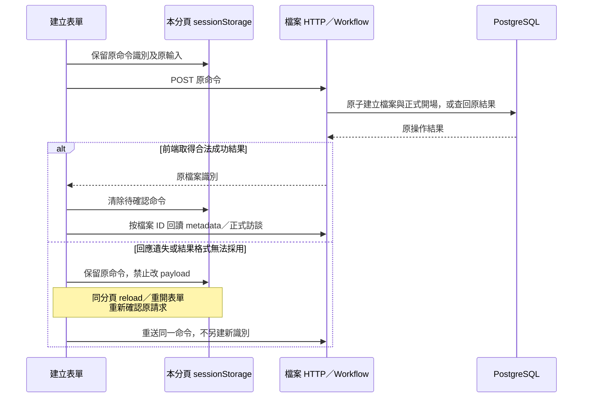
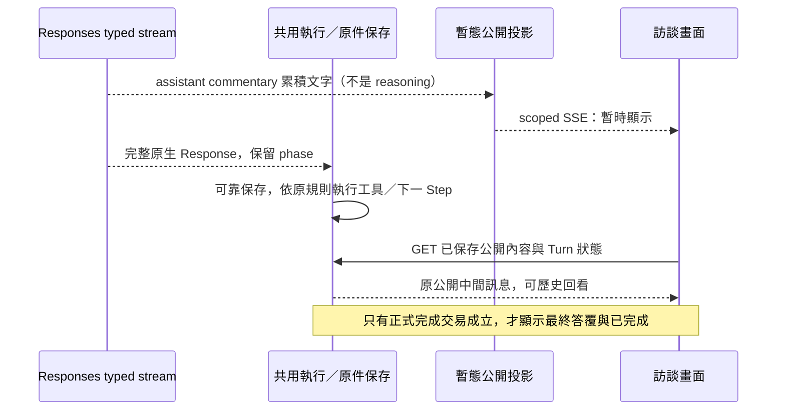
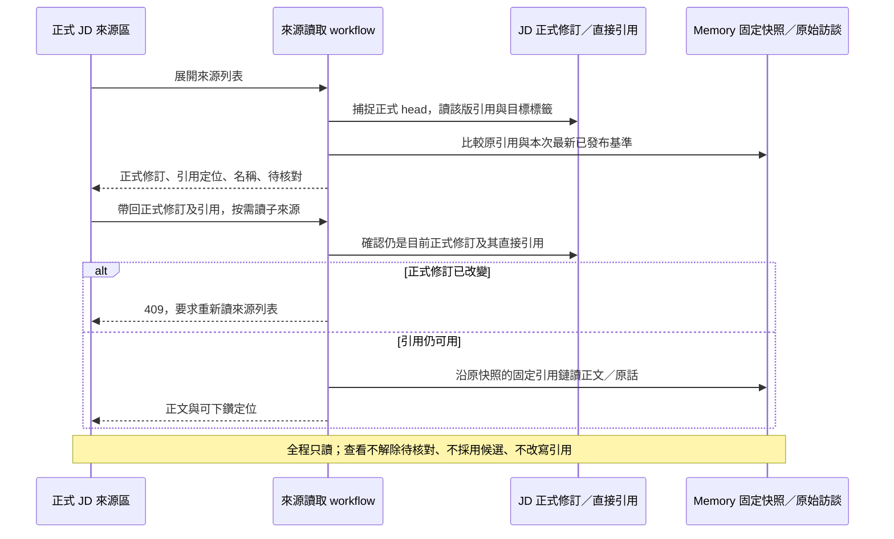

# 介面、公開訊息與本機交付

- 狀態：**新目標部分已實作，未正式切換**。檔案、JD 人工編輯、A 訪談／候選預覽／暫停取消／公開歷史、正式 PDF／條件撤回已接線；串流與其餘驗收依[任務表](../plans/2026-09-29-target-rebuild/tasks.md)，不可從下文目標規格推定已完成。上位：[運作與交付](../architecture/delivery-and-operations.md)、[核心閉環](../specs/2026-09-29-core-value-loop-lifecycle.md)。不增加雲端登入、多人權限或 Memory 操作台。

## 1. API 與 UI 的責任

HTTP 命令使用 POST／PATCH 等有副作用方法；讀取與公開事件使用 GET。業務拒絕、暫時失敗、結果未確認分型別，不以 HTTP 200＋`success:false` 混淆一切。具體路由與 JSON 由 T01／各功能切片 schema 產生，不把模型 tool schema 當 UI API。

Web 採 React Router 管頁面定位，TanStack Query 管正式／候選資料 cache，局部編輯欄位用 component state。query key 包含職務檔案及資料用途；清楚區分 formal JD／candidate preview／source read。不要把跨檔案 current state 放一個無 scope 全域 store。

UI 是後端狀態投影：執行中或暫停時人工修改 JD 被後端拒絕；前端禁用按鈕只改善體驗。一次第二筆輸入不排無界隊列，返回既定在途狀態；不同檔案可並行使用，不需要每個檔案一個程序。

元件按 feature 組織：interview 負責訊息與 A 控制；jd-editor 負責關聯式欄位及候選預覽；source-viewer 負責依據、待核對與詳細差異。不讓共用 UI component import database／provider 或決定來源版本。頁面組裝、版面與視覺 token 在 `app/`，見 §1.6。

### 1.1 T02 已落地的讀寫邊界

[App](../../apps/web/src/app/App.tsx)只組裝路由；[檔案 feature](../../apps/web/src/features/job-files/JobFilesPage.tsx)管建立／清單，[訪談 feature](../../apps/web/src/features/interview/InterviewHistory.tsx)只呈現正式歷史。檔案 ID 進 URL 與 query key，同名標籤不混成同一份資料；切換不保留另一檔案的 placeholder。HTTP 回傳先由 Ajv 驗證同一份 `apps/api/contracts/http` schema，再進 Query cache；TS 型別仍由該 schema 生成，不新增手寫 wire 規格。原文以轉義文字顯示，保留換行，不當 HTML 執行。

**建立命令的未確認重送（已實作；不是 A Turn 恢復圖）：**

`sessionStorage` 僅為**本分頁尚未確認的 transport command**，不是正式檔案／交易的第二個 owner。保存 command ID、檔案名稱、員工姓名；先保留才送出，儲存不可用則明示未送出。不明結果不自動重送、不解除原 payload；明確拒絕後才可改字重新提交。確認成功清除；即使清除失敗，殘留命令也只查回原結果，不把原建立時 metadata 覆蓋到最新 cache。關閉分頁／清除瀏覽器資料不保證保留此暫存；此時先查清單，不能宣稱跨裝置或永久恢復。取消建立表單不是撤銷可能已成立的後端建立。

此方案沿[共同保存審查](../specs/2026-09-27-shared-agent-execution-and-state-design.md)的「先列具體保證」：避免未確認時換新命令造成重複檔案，建立流程未新增 DB 回執或 browser database。它不決定後續訪談輸入的控制／重送策略。T02 目前沒有 AI 傳送、JD、SSE 或 Memory 控制。

**列表改名已接上：**選擇 stable file ID，只編輯顯示名稱；使用當時讀到的名稱修訂作新鮮度條件。送出前將原命令保留在該檔案的本分頁 sessionStorage；結果不明時重開／reload 沿用原命令與原基準，不能自動換最新基準重送。明確拒絕後要求重讀，使用者再決定。成功或原結果重送成功都 invalidate 清單與該檔 metadata，由 GET 更新畫面；不將原結果覆蓋成目前名稱。保存與交易由[檔案 owner](interview-storage.md#10-列表改名名稱新鮮度與原操作結果)負責；暫存只為有限 transport 恢復，不增加第二個可編輯 owner。窄螢幕保留名稱／受訪者／操作，隱藏次要建立時間，避免字字換行。

框架依據：[React Router 路由](https://reactrouter.com/start/declarative/installation)、[Query key 必須包含查詢變數](https://tanstack.com/query/latest/docs/framework/react/guides/query-keys)、[Ajv 型別守衛](https://ajv.js.org/guide/typescript.html)。本案關閉隱含 query／mutation retry，由 UI 明確重讀／確認；不把 cache 當正式資料。MUI 9 已移除 system props 與 `disableEscapeKeyDown`，使用 `sx` 及受控 `onClose`；焦點在 transition `onEntered` 後定位，保留框架焦點陷阱及關閉恢復，不移除 StrictMode。[MUI migration](https://mui.com/material-ui/migration/upgrade-to-v9/)

實測與限制見 [T02 evidence §8](../plans/2026-09-29-target-rebuild/evidence/t02-job-files-and-interviews.md#8-第四切片建立選取與正式開場-ui2026-09-29)。目前 Ajv 在 runtime 編譯 schema；嚴格 CSP／standalone codegen 與整體 bundle 效能須在 T15 評估，不為此放寬未來 CSP。這不是宣告前端安全／效能 gate 已完成。

### 1.2 T03 基本資料編輯的讀取基底與恢復

[JD feature](../../apps/web/src/features/jd-editor/JdProfileEditor.tsx)讀取正式 profile；四欄文意沿 [JD 指南](../specs/2026-09-09-jd-field-and-writing-guide.md)，不含檔案名稱／員工姓名。後端交易與固定修訂由 [JD 保存](jd-storage.md)負責；此處只描述畫面接線，不另維護 wire schema。

- 開啟表單時捕捉讀到的修訂及正文；草稿是局部 component state。背景 GET 即使取得新版，也不替換已開啟表單的基底或尚未送出的文字。切檔用檔案 ID 作 component key，查詢也帶檔案與 formal 用途。
- 僅傳有變動欄位；完全刪空明確 clear，未改不送；只有空白或非法字元拒絕。命令先保留於本分頁、該檔案的 sessionStorage，再 POST。儲存暫存失敗不發請求，連線等待期間禁止重複提交。
- 不明結果保留原命令／原基底／原 changes，欄位暫不可改；重開或 reload 後可重新確認同一命令。這不是第二份正式 JD，也不保證關閉分頁或清除瀏覽器資料後仍能取回未確認命令。
- 明確拒絕不自動改基底重送；保留畫面草稿供辨認，要求讀目前 JD 再決定。原命令成功確認後關表單，invalidate 並 GET 目前正式稿；舊操作回傳不直接寫入最新 cache。
- 讀取失敗不當空白 JD；取消未送出表單只是放棄局部草稿，關閉結果未確認表單也不是撤銷後端效果。未知欄位顯示「尚未提供」，不表示已確認沒有。人工寫入本身不等於員工事實或依據核對完成。

採用 [React 的 state／key 生命週期](https://react.dev/learn/preserving-and-resetting-state)及 [TanStack Query 的 mutation invalidation](https://tanstack.com/query/latest/docs/framework/react/guides/invalidations-from-mutations)。以上原命令／基底保護是本案契約，不是 React／cache 自動提供交易原子性。沿用既有 Dialog／HTTP 驗證，不新增全域表單 store、通用命令引擎或雙寫保存服務。實測見 [T03 evidence §4](../plans/2026-09-29-target-rebuild/evidence/t03-relational-jd.md#4-第二切片基本資料人工編輯-ui2026-09-29)；職責／任務 UI 接 §1.3，知識／技能接 §1.4，其餘集合、候選及來源 UI 仍待後續切片。

### 1.3 T03 職責與任務的人工編輯

[JdWorkEditor](../../apps/web/src/features/jd-editor/JdWorkEditor.tsx)組裝職責、任務及未歸屬區；表單分為 [AreaFields](../../apps/web/src/features/jd-editor/AreaFields.tsx)及 [TaskFields](../../apps/web/src/features/jd-editor/TaskFields.tsx)，[useWorkCommand](../../apps/web/src/features/jd-editor/useWorkCommand.ts)只管理本檔案、本分頁的一筆待確認集合命令。使用既有 MUI、Query、HTTP guard，不新增 form store、拖曳框架或通用命令引擎。

- 畫面使用[同版組合讀取](jd-storage.md#23-組合畫面使用同一修訂)，開表單固定當時內容／基底。profile 與集合修改後互相 invalidate，因為兩者共用 JD 修訂；正在重讀時不讓新表單取已失效 cache。已開啟草稿仍不被背景更新覆蓋。
- 職責／任務名稱和內容可局部清空，但至少保留一項有意義內容。成果／要求是獨立可增刪的明細；未改明細不重送，改字保留身分。移至另一職責可同次附帶必要文字調整；未歸屬明確顯示，不用空白選項冒充。
- 排序採明確上移／下移；任務及兩組明細各自排序。刪職責先說明任務會保留並轉未歸屬，刪任務另外確認，不把兩種刪除混成同一結果。
- 所有集合命令先保留原意，再 POST；未知結果不能換命令。待確認入口獨立於原目標是否仍出現在新稿，因此原任務後來已刪除也可取回原結果。成功只觸發 GET 目前稿，不把舊結果塞回 cache。
- 收到合法成功結果但本分頁清理失敗，明說「修改已保存、暫存未清除」，保留原命令供後續確認，不誤報後端保存未知。清除分頁資料的限制仍沿 §1.2。
- 儲存按鈕放 Dialog 固定底部，長表單內容可捲動。轉場完成才設定初始焦點；若使用者已在表單欄位／按鈕操作，不搶焦點。此窄 helper 同時用於 profile，不取消框架的 focus trap。

沿用 §1.2 的 React／TanStack 官方契約及 MUI 原生表單與 [Dialog](https://mui.com/material-ui/react-dialog/)；保存、新鮮度與原結果辨識由既有業務責任實現，非 UI cache 的保證。相應實測與限制見 [T03 §7](../plans/2026-09-29-target-rebuild/evidence/t03-relational-jd.md#7-第五切片職責任務人工-ui-與同版讀取2026-09-29)。

### 1.4 T03 共用知識／技能及任務關係的人工編輯

[CapabilitiesSection](../../apps/web/src/features/jd-editor/CapabilitiesSection.tsx)呈現兩類共用定義、概覽排序及反向用途；[CapabilityFields](../../apps/web/src/features/jd-editor/CapabilityFields.tsx)只管理開啟時的局部草稿；[TaskCapabilities](../../apps/web/src/features/jd-editor/TaskCapabilities.tsx)在每項任務管理連結、解除及關係排序。沿同一 `JdWorkEditor`、`WorkEditDialog` 及 `useWorkCommand`，不增加第二套命令暫存、對照表或保存服務。

- 所有定義與關係來自同版 `/jd/work`。畫面可在任務顯示共用說明並連回定義；反向用途連回所屬任務。這是呈現，不把正文或反向列表另存一份。
- 新增／編輯定義只填名稱、說明；至少一者有意義。只改變動欄位；空字串轉明確 null，沒改不送。知識／技能類別在建立時確定，不提供會改變所有用途含意的跨類切換。
- 任務選單顯示名稱及說明以辨識範圍，使用 stable ID 操作而非標題；同名項仍是獨立物件。清楚標示「選取後即保存關聯」，不冒充尚未提交的表單草稿。解除只移除該任務關係；概覽與每任務的各類排序分開。
- 使用中的共用定義顯示相關任務及刪除限制；先解除所有用途才能刪定義，後端仍為最終約束。刪任務保留共用定義，刪職責不丟失任務關係。
- 定義與關係命令共用 §1.3 的原基底、待確認／重開及 cache 失效邊界；原命令結果再度取得也不覆寫目前新稿。profile／集合互相刷新，沒有獨立 `/capabilities` latest 拼接或樂觀宣告保存。

研究核對 [MUI Select](https://mui.com/material-ui/react-select/) 的標籤／受控選取及 §1.2 的 React／Query 契約；目前用既有元件即可，不為局部選取新增搜尋或表單框架。MUI 不是資料准入、原子性或重送的 owner。桌面／390px、共享修改及實際丟失回應的證據見 [T03 §9](../plans/2026-09-29-target-rebuild/evidence/t03-relational-jd.md#9-第七切片共用知識技能與任務關係人工-ui2026-09-29)。

### 1.5 T03 協作對象與共通條件的人工編輯

[CollaboratorsSection](../../apps/web/src/features/jd-editor/CollaboratorsSection.tsx)及[ConditionsSection](../../apps/web/src/features/jd-editor/ConditionsSection.tsx)是同一編輯器的集合呈現；各自的 Fields 元件管理固定開啟基底的局部草稿。仍沿 §1.3 的單一待確認命令、Dialog、schema guards 及重讀，不新增保存機制或另一套操作引擎。

- 協作對象填已知名稱與合作範圍，至少一項有內容；未知名稱可空，不因合作推定主管。只改有變動欄位；清空已知名稱但保留範圍是明確 null，不是刪除物件。
- 共通條件以五種既定分類及正文呈現，新增時須明確選分類，不代猜預設。分類內上移／下移；更正分類保留原身分、追加於新類末尾。共通條件不自動變成任務要求，未知不等於沒有或不需要。
- 刪除需確認，只移除目前選用，歷史仍保留。新集合從同版 `/jd/work` 取得；未知結果重開後沿原請求確認，確認成功再 GET 目前稿，不將舊結果寫回 cache。
- 回傳 schema 及 TypeScript 由同一份來源生成；顯示分組／文案是 UI 投影，不另存第二份 server state。既有草稿不因背景查詢改基底。

2026-09-29 再核 [React state 原則](https://react.dev/learn/choosing-the-state-structure)、[TanStack invalidation](https://tanstack.com/query/latest/docs/framework/react/guides/invalidations-from-mutations)、[MUI Select](https://mui.com/material-ui/react-select/)；目前元件足以承接，無需新表單／分類框架。這些來源支持 state／呈現機制，交易、固定歷史與原命令保證仍由 Caliburn owner 承接。驗證與限制見 [T03 第九切片](../plans/2026-09-29-target-rebuild/evidence/t03-relational-jd.md#11-第九切片協作與條件人工-ui2026-09-29)。

### 1.6 工作畫面組裝（T09 UI 改版）

證據、設計依據與已驗／未驗範圍見 [T09 UI 改版證據](../plans/2026-09-29-target-rebuild/evidence/t09-ui-redesign.md)；本節只記責任與不變式，不重抄視覺數值（單一來源為 [`theme.ts`](../../apps/web/src/app/theme.ts) 與 [`styles.css`](../../apps/web/src/app/styles.css)）。

- **版面**：職務檔案頁為左訪談、右 JD 並排（`WorkspaceLayout`），各自捲動、整頁不捲動；窄螢幕（<900px）以分頁切換。切換只用 CSS，**兩區保持掛載**，輪詢、SSE 與未送出草稿不因切換而丟失。訪談輸入與 Turn 控制固定在訪談欄底部；訊息記錄只在使用者接近底部時跟到最新，回看舊訊息不被打斷。
- **Turn 狀態的讀取**：頁面需要「目前處理狀態」（檔案列徽章、JD 唯讀）。[localStorage 提示](../../apps/web/src/features/interview/interview-turn-api.ts)以 `useSyncExternalStore` 訂閱（同分頁事件＋跨分頁 `storage`）；沒有提示則由 `/current` 發現工作，見 §2。頁面用 `useCurrentTurn` 的停用 query 觀察者讀同一份 cache，不另發 GET／輪詢、不把 server state 用 Effect 複製進 component state。啟動、恢復與輪詢只由 `InterviewComposer` 負責；回傳同時區分已核狀態與未知，沒有 Turn 資料不等於已確認閒置。
- **JD 唯讀鎖**：Turn 為 active 或 paused，或處理狀態尚未確認時，JD 顯示原因並停用人工編輯入口；已開啟的表單也保留草稿但禁止新修改，仍可核對既有待確認命令。正式內容仍可閱讀。已核終態或已確認沒有進行中工作才解除。這只改善體驗，寫入仍由後端拒絕（§1），不把一次 GET 當長期寫入資格。
- **候選與正式稿**：候選預覽在 JD 欄，用獨立「候選」樣式（「AI 層」）並註明尚未正式保存，可一鍵切到正式稿；兩個檢視都保持掛載，切換不重新載入正式稿。PDF 入口在 JD 欄，仍只匯出正式版本。取消後候選消失、回到正式稿。
- **來源**：來源回查是 JD 欄右側滑出面板（詳情在列表上方）；JD 各項目旁的「來源 n 筆／待核對」徽章只用 `Reference.target` 身分連結（見 [JD 保存 §3.7](jd-storage.md#37-人的正式來源回查t09-增量)），沒有 `target` 就不顯示徽章，絕不按標籤猜。徽章點擊只把面板篩到該項目的引用；查看不解除待核對。
- **長 JD 導覽與降噪**：章節導覽列（sticky、標示目前章節）、職責可收合（收合只是呈現，任務保持掛載）。編輯動作為圖示按鈕（無障礙名稱不變），在滑鼠環境於 hover／聚焦時才浮現，觸控環境常駐，不靠 hover 才可操作。
- **不變**：所有命令識別／原命令恢復、版本衝突、待確認命令、跨職務檔案 query key 隔離、公開訊息非正式來源等規則不因版面改變；重排時以既有測試的「角色＋名稱」為護欄，標題、按鈕名稱與 region 名稱視同契約。

**多分頁的最小支援（2026-09-30 Owner 委由工程取捨）：**保留一般多分頁開啟，不新增全 App 單分頁鎖、即時協作、草稿同步或跨頁 Query cache 廣播。各頁向原 API 讀取；同瀏覽器既有 hint 變動透過外部儲存訂閱承接，處理區與頁面觀察同一識別。畫面可能短暫落後，最終仍由後端同檔 A 排他、人工寫入資格及 JD 修訂條件拒絕過期寫入，不能靜默以新版基底重送。這不是即時同步或跨瀏覽器單一視窗承諾；相關取捨、官方依據與驗證見[發現入口證據](../plans/2026-09-29-target-rebuild/evidence/t09-current-turn-discovery.md#ui-承接與多分頁取捨2026-09-30)。

## 2. 串流不是保存權威

**目前 Turn 發現入口（T09，後端與 UI 已接線）：**`GET /api/job-files/{job_file_id}/consultant-turns/current` 從該檔案的既有 execution 准入資料找出唯一 active／paused 顧問，回 `{"turn": <既有 ConsultantTurn>}`；無進行中顧問回 `{"turn": null}`，不存在檔案回 404。pending pause 仍是 active＋`pause_requested`。沿用既有公開狀態、候選與 commentary 白名單，不返回 terminal 歷史或 Memory 工作；GET 不啟動模型、不取得 writer、不 resume，回應 no-store。這只是讀取時的觀察，控制操作仍重新核資格。

前端缺少本機識別時用此入口發現工作，再沿同一 execution 的既有查詢／控制接續；找到後停止 discovery，保留原 execution 至終態，不因 `/current` 後來變空而丟掉結果。查詢中允許輸入局部草稿，但未確認閒置前不送出；查詢失敗明示錯誤與唯讀重查，不吞成 null。回應須通過同一 schema 及檔案身分核對。

已保存的未知原命令優先沿 by-command 核對，不能以 current 空結果證明它從未被接受；不為找回畫面重送原輸入或另造 command ID。終態後按「開始下一次訪談／取回原文編輯」才清理原提示、重查 current，再准入新輸入。無提示也可走同一終態操作，不把伺服器原輸入另存到瀏覽器。頁面徽章、候選與 JD 唯讀狀態維持同一 query cache，沒有另一份 state 或第二個輪詢。契約與分層驗證見[本切片](../plans/2026-09-29-target-rebuild/evidence/t09-current-turn-discovery.md)。

**2026-09-30 已落地範圍：**公開完整 commentary 從原生 checkpoint／pending writes 投影，status polling 呈現候選／控制；歷史回答透過原 execution 定位按需回看。沒有訊息時明示空，不由 App 編造進度。新增 direct Responses typed stream → 有界程序內投影 → 同源 SSE → UI 的即時公開文字接線；真產品驗收與限制分見 [provider 證據](../plans/2026-09-29-target-rebuild/evidence/t09-response-streaming.md)、[傳輸證據](../plans/2026-09-29-target-rebuild/evidence/t09-commentary-transport.md)、[UI 證據](../plans/2026-09-29-target-rebuild/evidence/t09-commentary-ui.md)，不因此宣告 T09 全部完成。

首選 HTTP commands＋同源 SSE 公開事件，無需 WebSocket 雙向協議。瀏覽器收到 event 只更新呈現，正式狀態仍可 GET 重取。SSE 的 event ID／重連不是完整產品恢復的唯一依據，斷線後先查當前 Turn 狀態、已保存公開內容與 JD 正式／候選位置，不因事件遺失就重新送員工原話。事件傳送使用標準 SSE framing／框架支援，不自製流式 JSON 切割協議。[WHATWG SSE](https://html.spec.whatwg.org/multipage/server-sent-events.html)

- 生成中可顯示短公開中間訊息；完整正式答覆保存完成後成為主要回覆，之前完整公開訊息可展開回看。
- 原生 opaque reasoning、內部分析、密鑰、完整工具參數不公開。可顯示安全的工具名稱與進度，但不以新增 trace dashboard 作第一版 gate。
- 逐 token delta 不要求永久保存。已保存完整中間 message 保留原順序／出處，不授正式訪談序號、不供引用。
- API response 完成不代表 Turn 完成。UI 只在正式完成結果成立時顯示已完成／已保存；重連取得同一答覆。
- 暫停請求先顯示正在停妥，直到安全點確認；取消與失敗文案分開，不能失敗後默默重送新輸入。

SSE 可丟的暫態進度與必須保留的公開歷史分開，**不為每個事件另造永久事件表**。中間完整訊息若從 checkpoint 投影後需獨立保留，僅保存必要公開文字與原 item identity；compaction 不刪歷史回看承諾。

**歷史讀取不依賴模型配置：**只要原 DB／checkpointer 可讀，App 重啟後即使沒有模型金鑰，也應沿原 execution 投影已保存的公開訊息。composition root 在 DB lifespan 接通既有 saver；模型 client、supervisor 與新執行仍由模型配置控制。不是重跑模型或新增歷史副本；無模型的新輸入仍拒絕。修正與有界驗證見 [T17 續驗](../plans/2026-09-29-target-rebuild/evidence/t17-course-administrator-journey.md#2026-10-01既有真模型產物的-ui-與-pdf-續驗)。

目前只即時投影明示 `assistant`／`commentary` 的訊息；依 response／message 身分送累積文字，phase 取自 item 而非猜測 delta。最終答覆仍等正式 Turn 完成保存後呈現，不以串流終止、訊息 completed 或 Response completed 宣告完成。新 A 請求啟用串流；恢復既有 request 保留原 transport 設定。未啟用的 B 角色不因共用能力自動變成公開串流。

程序內 hub 不持久化、不回放，沒有訂閱者時不保留；慢讀者丟棄過時暫態更新，不能阻塞模型／工具。SSE scope 由原 status owner 驗證，瀏覽器關閉只移除訂閱。重新連線以既有 GET 補取已保存公開訊息；未保存片段可能消失，不能重送原輸入或重跑模型來填補。HTTP 型別與 UI guard 由 canonical schema 生成。

## 3. 顯示與來源

JD 顯示正式稿；A 活躍時可即時預覽該 Turn 候選，明示未完成。取消退回正式稿。PDF 永遠取已完成正式版本，與候選預覽分開；不因使用者看到 preview 就對外匯出它。

局部來源依 App 提供定位讀，不讓前端由標題或文字相似判版本（項目對應同理只用 `target` 身分，見 §1.6）；待核對不等於確定錯誤，也不以人工保存／看過 diff 自動解除。詳細 diff Markdown 由受信 renderer 轉義，禁 raw HTML／任意 URL 執行；工具供模型的 Markdown與 UI 呈現共用領域差異資料，不各算不同基準。

資料載入失敗不能用 `[]` 假裝內容全空；小量欄位修改不重送完整 JD。每次改動後使對應正式／候選 query 失效，再取後端結果，不讓 optimistic preview 宣告提交成功。鍵盤操作、焦點恢復、清楚的暫停／取消文字與錯誤下一步列 UI 測例。

### 3.1 正式 JD 來源的唯讀下鑽（T09）

來源區按需讀正式 JD 的直接依據，不從候選預覽推導正式來源。後端列表提供引用定位與所屬欄位／項目；前端只帶回定位，不按名稱解析物件。工作理解 → 工作情境 → 訪談的按需讀取沿**原引用的固定快照**；只有「來源差異」與讀取時選定的最新已發布 Memory 比較。這與 A 的「本 Turn 固定 Memory＋舊新 diff、無任意舊全文入口」不同，不把人用 API 暴露成 A tool。

Query key 帶職務檔案、正式 JD 修訂、引用及子來源用途；切檔／重新取列表後，舊的展開與差異狀態不能混入新的選取。GET 錯誤需明示，不顯示空結果假裝成功；409 提供回列表重讀，不自动改基準。Memory 更新可以使同一 JD 的來源變成待核對，因此不能將來源列表視為僅由 JD 修訂決定的永久 cache。

正文和差異使用 `react-markdown` 的安全 React 呈現，不啟用 raw HTML；來源內容中的連結／圖片不作外部導覽或遠端載入，真正下鑽只經 App 提供的來源按鈕。長 diff 區可水平捲動，不撐破頁面。資料結構由後端 canonical schema 同時生成 Python／TS，UI 驗證後才採用；不手刻另一套契約。

依據：[TanStack Query keys](https://tanstack.com/query/latest/docs/framework/react/guides/query-keys)、[react-markdown security](https://github.com/remarkjs/react-markdown#security)、[FastAPI response model](https://fastapi.tiangolo.com/tutorial/response-model/)。框架提供查詢／呈現機制；原引用資格、固定鏈與正式／候選隔離由 Caliburn 的[來源責任](jd-storage.md#37-人的正式來源回查t09-增量)維護。接線與驗證狀態以 [T09 來源證據](../plans/2026-09-29-target-rebuild/evidence/t09-source-viewer.md)為準，不據此宣告 T09 全部完成。

### 3.2 完成後查看這輪 JD 變更（T09）

歷史正式回答的「公開處理訊息／JD 操作」中，按「查看這輪 JD 變更」才讀取。比較端點由後端從該 completed Turn 已保留的輪前／採用修訂取得，**不是目前正式稿**；之後人工修改或撤回不改寫此歷史比較。資料責任見 [JD 保存 §3.8](jd-storage.md#38-完成-turn-的-jd-變更檢視t09)。

- `GET /api/job-files/{job_file_id}/consultant-turns/{execution_id}/jd-changes` 回 `execution_id` 與 `markdown`；schema 為 `contracts/http/turn-jd-changes.schema.json`。不接受自選版本或額外參數。未完成、取消、失敗或沒有已採用端點回 409；另一檔案／找不到執行回 404，缺 DB 回 503。不把未完成候選當正式變更。
- 正文用既有完整 JD 成品投影計算標準 unified diff，來源依據另外顯示新增／移除／調整筆數。這是**淨效果檢視**，不是逐工具操作時間軸；改過又改回可能沒有淨文字差異，不能說從未操作。來源摘要不展開引用鏈；來源身分／版本／核對位置變化不能被純文字 diff 吞掉。
- UI query key 含職務檔案與 execution；完整結果由同一 canonical schema 驗證並核對 execution。查詢失敗明示、提供重新讀取，不假裝無差異；不輪詢、不把 server data 複製到另一份 state。
- 沿共用 `SafeMarkdown` 禁 active HTML／URL／遠端圖片；後端 fenced diff 保住正文中的反引號。GET 無寫入副作用，回 no-store；查看不解除待核對，也不決定是否允許撤回。撤回仍走既有 owner 的當前資格檢查。

本切片不新增資料表、模型呼叫、diff 函式庫或比對平台，不實作候選即時差異、逐筆歷史來源瀏覽。接線、官方依據與已驗／未驗見 [T09 本輪變更證據](../plans/2026-09-29-target-rebuild/evidence/t09-turn-jd-changes.md)。

## 4. PDF 與程序

PDF renderer 收固定正式 JD 的成品投影，模板分離可讀內容與 print CSS；顯示姓名依既定首版政策不輸出。使用受控字型、escape 所有文字，不允許外部網路載入；Chromium 用受控生命週期、有限並行，渲染完關閉 page。字型缺失、超時或匯出失敗有明確錯誤，不把空 PDF 當成功。

Python Playwright 的 Chromium revision 跟套件鎖定，瀏覽器測試用 Playwright Test 各依各自鎖定環境，不宣稱跨語言一定共用同一下載 binary。這些是現成機制的依賴成本，不另造 PDF 版面引擎。代表性長／短中文 JD 必須實際渲染檢查分頁、欄位、缺字與候選隔離。

本機交付首版為單一 API process、靜態 Web build、PostgreSQL；開發時 Vite proxy API，交付時 API 提供靜態檔及同源 API。Uvicorn 首版一 worker，async 背景任務由 App lifespan 管理並於啟動重掃持久待辦；不使用 FastAPI BackgroundTasks 承諾耐久性。任何 in-memory semaphore 都不替代 DB 的同檔案資格。

### 4.1 同源靜態建置入口

2026-10-01 已接通目標 App 的可選靜態入口，**不是 T18 正式切換或乾淨安裝已驗收**。`CALIBURN_WEB_BUILD_DIRECTORY` 指向已建置 Web 的絕對目錄；未設時維持純 API／Vite 開發模式，不從 repo 或工作目錄猜路徑。只可指定可信的公開建置產物，不能指向 repo、原始碼、`.env`、資料庫或上傳資料目錄。

直接使用鎖定 FastAPI 的 [`frontend()`](https://fastapi.tiangolo.com/tutorial/frontend/)：根路徑提供實際建置檔案、不做全域 SPA fallback；只在現有 UI 的 `/job-files` 前綴啟用 HTML 導覽 fallback。一般 API 優先，未知 `/api/*` 與根 `/assets/*` 不回首頁冒充成功；未匹配的非 HTML 讀取及寫入也不靠 fallback 成功。未來增加 UI 路由前綴時，在組裝根同步這個明確範圍，不複製另一套檔案路由器。建置目錄或 `index.html` 缺失時，框架在建立 App 時拒絕。

既有 Host／Origin middleware 繼續包住 API 與前端，維持 loopback 與單程序；沒有新增 CORS、nginx、前端 server 或背景程序。JS／CSS、條件式讀取及路徑界線由框架處理，不自寫靜態檔案 helper。啟動方式見 [backend README](../../apps/api/README.md#使用建置後的同源畫面)，證據與未驗範圍見 [交付預備](../plans/2026-09-29-target-rebuild/evidence/t18-same-origin-web.md)。

**T01 的 Windows 機制發現（2026-09-29）：**已實測 psycopg async／官方 saver 需要 Selector loop；Python 3.14 以顯式 `loop_factory`／Uvicorn `--loop asyncio:SelectorEventLoop` 接線，不使用棄用的全域 policy。但 [Playwright 官方](https://playwright.dev/python/docs/library#incompatible-with-selectoreventloop-of-asyncio-on-windows)明確指出 Windows driver subprocess 需要 Proactor。T13 不可把 Playwright 直接塞入同一 Selector loop；須驗受控 renderer 執行邊界（例如獨立執行緒中建立、使用及關閉自身 Playwright），或所選交付環境的完整接線，不能共享非 thread-safe instance、改成同步阻塞全部訪談或僅切 loop 讓另一方壞掉。這是已找到的相容接縫，不要求另造服務／PDF 平台，也不宣稱 PDF 已實作。

## 5. 安全與新舊切換

預設 bind loopback，精確 Host／Origin allowlist；有副作用路由驗證同源／必要防 CSRF 機制，不開 wildcard CORS。密鑰只留後端配置，啟動輸出遮罩，Web bundle、錯誤、log 不含密鑰／原話。檔案識別不等於授權，可見性仍由後端 scope 驗證。

開發 proxy 必須保留瀏覽器原 Origin／Fetch Metadata，不用改寫成受信任值來通過檢查。隔離前端使用不同埠時，由該後端啟動配置明確增加一個精確 loopback Origin；不接受 wildcard、任意 local port 或從請求推導新增信任。配置、ASGI 與真 Vite 回歸見 [T15 HTTP 證據](../plans/2026-09-29-target-rebuild/evidence/t15-local-http-security.md#隔離前端的來源保留修正2026-09-30)。

先用新 DB namespace 與獨立 dev 入口驗收，不沿用舊 venv 或舊 DB／provider 配置。[本 Goal 授權](../plans/2026-09-29-target-rebuild/README.md#3-狀態與施工順序)允許安全載入 `apps/api/.env` 中本次所需 OpenAI 憑證，這是明示例外，不是整份舊設定可沿用。最後 T18 才更換根啟動入口與 production authority，移除確定已不再使用的舊程式／依賴；保留研究／歷史。無資料遷移不等於自動刪舊 DB／volume／secrets，刪除前查精確 target 與授權。

這裡不改寫現行 runbook 命令；新命令由 T01 建立並測過後，寫入新 App README，切換時再更新全域 runbook／CONTRIBUTING。未實際存在的命令不得標「已可執行」。
