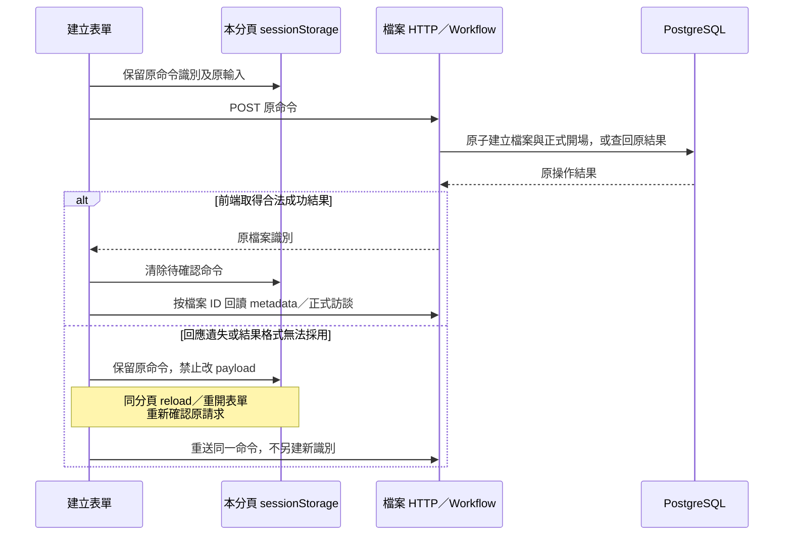

# 介面、公開訊息與本機交付

- 狀態：**工程設計；T02 檔案建立／選取／開場回讀已實作，其餘依任務 gate**。上位：[運作與交付](../architecture/delivery-and-operations.md)、[核心閉環](../specs/2026-09-29-core-value-loop-lifecycle.md)。不增加雲端登入、多人權限或 Memory 操作台。

## 1. API 與 UI 的責任

HTTP 命令使用 POST／PATCH 等有副作用方法；讀取與公開事件使用 GET。業務拒絕、暫時失敗、結果未確認分型別，不以 HTTP 200＋`success:false` 混淆一切。具體路由與 JSON 由 T01／各功能切片 schema 產生，不把模型 tool schema 當 UI API。

Web 採 React Router 管頁面定位，TanStack Query 管正式／候選資料 cache，局部編輯欄位用 component state。query key 包含職務檔案及資料用途；清楚區分 formal JD／candidate preview／source read。不要把跨檔案 current state 放一個無 scope 全域 store。

UI 是後端狀態投影：執行中或暫停時人工修改 JD 被後端拒絕；前端禁用按鈕只改善體驗。一次第二筆輸入不排無界隊列，返回既定在途狀態；不同檔案可並行使用，不需要每個檔案一個程序。

元件按 feature 組織：interview 負責訊息與 A 控制；jd-editor 負責關聯式欄位及候選預覽；source-viewer 負責依據、待核對與詳細差異。不讓共用 UI component import database／provider 或決定來源版本。

### 1.1 T02 已落地的讀寫邊界

[App](../../apps/web/src/app/App.tsx)只組裝路由；[檔案 feature](../../apps/web/src/features/job-files/JobFilesPage.tsx)管建立／清單，[訪談 feature](../../apps/web/src/features/interview/InterviewHistory.tsx)只呈現正式歷史。檔案 ID 進 URL 與 query key，同名標籤不混成同一份資料；切換不保留另一檔案的 placeholder。HTTP 回傳先由 Ajv 驗證同一份 `apps/api/contracts/http` schema，再進 Query cache；TS 型別仍由該 schema 生成，不新增手寫 wire 規格。原文以轉義文字顯示，保留換行，不當 HTML 執行。

**建立命令的未確認重送（已實作；不是 A Turn 恢復圖）：**

`sessionStorage` 僅為**本分頁尚未確認的 transport command**，不是正式檔案／交易的第二個 owner。保存 command ID、檔案名稱、員工姓名；先保留才送出，儲存不可用則明示未送出。不明結果不自動重送、不解除原 payload；明確拒絕後才可改字重新提交。確認成功清除；即使清除失敗，殘留命令也只查回原結果，不把原建立時 metadata 覆蓋到最新 cache。關閉分頁／清除瀏覽器資料不保證保留此暫存；此時先查清單，不能宣稱跨裝置或永久恢復。取消建立表單不是撤銷可能已成立的後端建立。

此方案沿[共同保存審查](../specs/2026-09-27-shared-agent-execution-and-state-design.md)的「先列具體保證」：避免未確認時換新命令造成重複檔案，未新增 DB 回執或 browser database。它不決定後續訪談輸入的控制／重送策略。T02 目前沒有 AI 傳送、JD、SSE 或 Memory 控制；列表改名仍待同一任務補齊。

框架依據：[React Router 路由](https://reactrouter.com/start/declarative/installation)、[Query key 必須包含查詢變數](https://tanstack.com/query/latest/docs/framework/react/guides/query-keys)、[Ajv 型別守衛](https://ajv.js.org/guide/typescript.html)。本案關閉隱含 query／mutation retry，由 UI 明確重讀／確認；不把 cache 當正式資料。MUI 9 已移除 system props 與 `disableEscapeKeyDown`，使用 `sx` 及受控 `onClose`；焦點在 transition `onEntered` 後定位，保留框架焦點陷阱及關閉恢復，不移除 StrictMode。[MUI migration](https://mui.com/material-ui/migration/upgrade-to-v9/)

實測與限制見 [T02 evidence §8](../plans/2026-09-29-target-rebuild/evidence/t02-job-files-and-interviews.md#8-第四切片建立選取與正式開場-ui2026-09-29)。目前 Ajv 在 runtime 編譯 schema；嚴格 CSP／standalone codegen 與整體 bundle 效能須在 T15 評估，不為此放寬未來 CSP。這不是宣告前端安全／效能 gate 已完成。

## 2. 串流不是保存權威

首選 HTTP commands＋同源 SSE 公開事件，無需 WebSocket 雙向協議。瀏覽器收到 event 只更新呈現，正式狀態仍可 GET 重取。SSE 的 event ID／重連不是完整產品恢復的唯一依據，斷線後先查當前 Turn 狀態、已保存公開內容與 JD 正式／候選位置，不因事件遺失就重新送員工原話。事件傳送使用標準 SSE framing／框架支援，不自製流式 JSON 切割協議。[WHATWG SSE](https://html.spec.whatwg.org/multipage/server-sent-events.html)

- 生成中可顯示短公開中間訊息；完整正式答覆保存完成後成為主要回覆，之前完整公開訊息可展開回看。
- 原生 opaque reasoning、內部分析、密鑰、完整工具參數不公開。可顯示安全的工具名稱與進度，但不以新增 trace dashboard 作第一版 gate。
- 逐 token delta 不要求永久保存。已保存完整中間 message 保留原順序／出處，不授正式訪談序號、不供引用。
- API response 完成不代表 Turn 完成。UI 只在正式完成結果成立時顯示已完成／已保存；重連取得同一答覆。
- 暫停請求先顯示正在停妥，直到安全點確認；取消與失敗文案分開，不能失敗後默默重送新輸入。

SSE 可丟的暫態進度與必須保留的公開歷史分開，**不為每個事件另造永久事件表**。中間完整訊息若從 checkpoint 投影後需獨立保留，僅保存必要公開文字與原 item identity；compaction 不刪歷史回看承諾。

## 3. 顯示與來源

JD 顯示正式稿；A 活躍時可即時預覽該 Turn 候選，明示未完成。取消退回正式稿。PDF 永遠取已完成正式版本，與候選預覽分開；不因使用者看到 preview 就對外匯出它。

局部來源依 App 提供定位讀，不讓前端由標題或文字相似判版本；待核對不等於確定錯誤，也不以人工保存／看過 diff 自動解除。詳細 diff Markdown 由受信 renderer 轉義，禁 raw HTML／任意 URL 執行；工具供模型的 Markdown與 UI 呈現共用領域差異資料，不各算不同基準。

資料載入失敗不能用 `[]` 假裝內容全空；小量欄位修改不重送完整 JD。每次改動後使對應正式／候選 query 失效，再取後端結果，不讓 optimistic preview 宣告提交成功。鍵盤操作、焦點恢復、清楚的暫停／取消文字與錯誤下一步列 UI 測例。

## 4. PDF 與程序

PDF renderer 收固定正式 JD 的成品投影，模板分離可讀內容與 print CSS；顯示姓名依既定首版政策不輸出。使用受控字型、escape 所有文字，不允許外部網路載入；Chromium 用受控生命週期、有限並行，渲染完關閉 page。字型缺失、超時或匯出失敗有明確錯誤，不把空 PDF 當成功。

Python Playwright 的 Chromium revision 跟套件鎖定，瀏覽器測試用 Playwright Test 各依各自鎖定環境，不宣稱跨語言一定共用同一下載 binary。這些是現成機制的依賴成本，不另造 PDF 版面引擎。代表性長／短中文 JD 必須實際渲染檢查分頁、欄位、缺字與候選隔離。

本機交付首版為單一 API process、靜態 Web build、PostgreSQL；開發時 Vite proxy API，交付時 API 提供靜態檔及同源 API。Uvicorn 首版一 worker，async 背景任務由 App lifespan 管理並於啟動重掃持久待辦；不使用 FastAPI BackgroundTasks 承諾耐久性。任何 in-memory semaphore 都不替代 DB 的同檔案資格。

**T01 的 Windows 機制發現（2026-09-29）：**已實測 psycopg async／官方 saver 需要 Selector loop；Python 3.14 以顯式 `loop_factory`／Uvicorn `--loop asyncio:SelectorEventLoop` 接線，不使用棄用的全域 policy。但 [Playwright 官方](https://playwright.dev/python/docs/library#incompatible-with-selectoreventloop-of-asyncio-on-windows)明確指出 Windows driver subprocess 需要 Proactor。T13 不可把 Playwright 直接塞入同一 Selector loop；須驗受控 renderer 執行邊界（例如獨立執行緒中建立、使用及關閉自身 Playwright），或所選交付環境的完整接線，不能共享非 thread-safe instance、改成同步阻塞全部訪談或僅切 loop 讓另一方壞掉。這是已找到的相容接縫，不要求另造服務／PDF 平台，也不宣稱 PDF 已實作。

## 5. 安全與新舊切換

預設 bind loopback，精確 Host／Origin allowlist；有副作用路由驗證同源／必要防 CSRF 機制，不開 wildcard CORS。密鑰只留後端配置，啟動輸出遮罩，Web bundle、錯誤、log 不含密鑰／原話。檔案識別不等於授權，可見性仍由後端 scope 驗證。

先用新 DB namespace 與獨立 dev 入口驗收，不沿用舊 venv 或舊 DB／provider 配置。[本 Goal 授權](../plans/2026-09-29-target-rebuild/README.md#3-狀態與施工順序)允許安全載入 `apps/api/.env` 中本次所需 OpenAI 憑證，這是明示例外，不是整份舊設定可沿用。最後 T18 才更換根啟動入口與 production authority，移除確定已不再使用的舊程式／依賴；保留研究／歷史。無資料遷移不等於自動刪舊 DB／volume／secrets，刪除前查精確 target 與授權。

這裡不改寫現行 runbook 命令；新命令由 T01 建立並測過後，寫入新 App README，切換時再更新全域 runbook／CONTRIBUTING。未實際存在的命令不得標「已可執行」。
