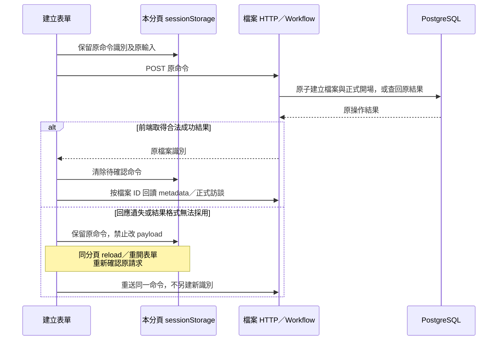
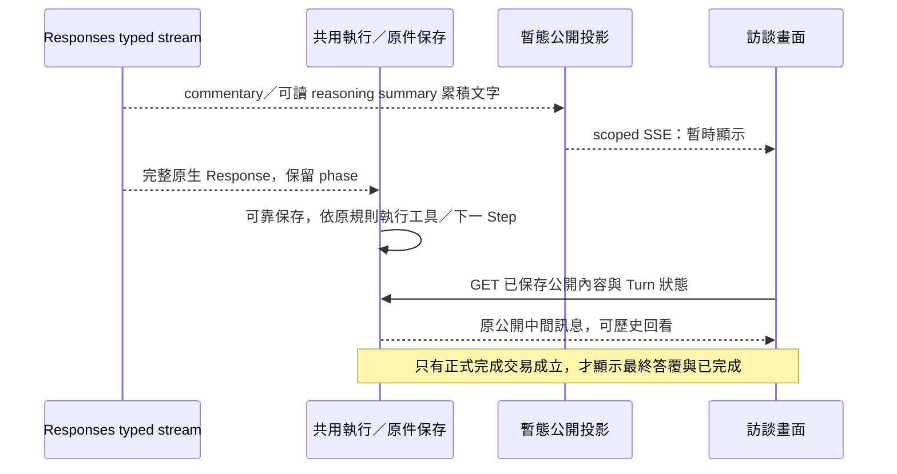
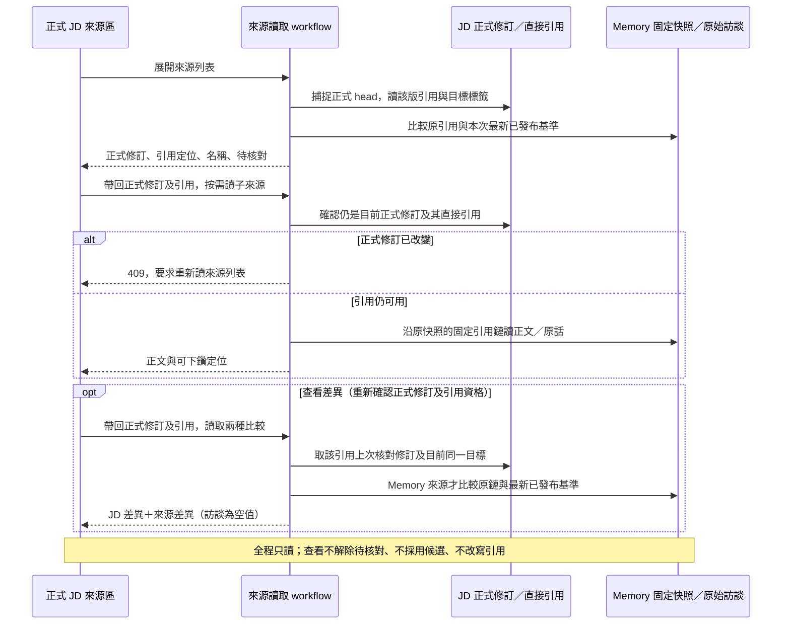

# 介面、公開訊息與本機交付

- 狀態：**現行介面、公開訊息與交付契約**。正式產品切換依 [ADR0079](../adr/0079-target-rebuild-production-cutover.md)，各次 UI、串流、來源、PDF 及恢復驗證見[證據索引](../history.md#source-8e6fa902e6e1928b1f59)。上位：[運作與交付](../architecture/delivery-and-operations.md)、[核心閉環](../specs/2026-09-29-core-value-loop-lifecycle.md)。不增加雲端登入、多人權限或 Memory 操作台。

本頁說明後端結果如何成為可操作的畫面與交付內容：API 提供狀態與命令，串流加快進度顯示，Web 呈現正式稿與候選，PDF 匯出固定正式修訂。正式保存與權限仍由業務模組判定；本頁維護傳輸、呈現及本機交付的接線。

## 1. API 與 UI 的責任

HTTP 命令使用 POST／PATCH 等有副作用方法；讀取與公開事件使用 GET。業務拒絕、暫時失敗、結果未確認分型別，不以 HTTP 200＋`success:false` 混淆一切。具體路由與 JSON 由各功能 canonical schema 與生成型別定義，不把模型 tool schema 當 UI API。

Web 採 React Router 管頁面定位，TanStack Query 管正式／候選資料 cache，局部編輯欄位用 component state。query key 包含職務檔案及資料用途；清楚區分 formal JD／candidate preview／source read。不要把跨檔案 current state 放一個無 scope 全域 store。

UI 依後端狀態呈現可用操作。A 執行中或暫停時，人工 JD 修改由後端拒絕，前端禁用按鈕只是讓限制更清楚。第二筆輸入返回既定在途狀態，不排入無界隊列；不同檔案可並行使用，不需要每個檔案一個程序。

元件按 feature 組織：interview 負責訊息與 A 控制；jd-editor 負責關聯式欄位及候選預覽；source-viewer 負責依據、待核對與詳細差異。不讓共用 UI component import database／provider 或決定來源版本。頁面組裝、版面與視覺 token 在 `app/`，見 §1.6。

### 1.1 讀寫邊界

[App](../../apps/web/src/app/App.tsx)只組裝路由；[檔案 feature](../../apps/web/src/features/job-files/JobFilesPage.tsx)管建立／清單，[訪談 feature](../../apps/web/src/features/interview/InterviewHistory.tsx)只呈現正式歷史。檔案 ID 進 URL 與 query key，同名標籤不混成同一份資料；切換不保留另一檔案的 placeholder。HTTP 回傳先由 Ajv 驗證同一份 `apps/api/contracts/http` schema，再進 Query cache；TS 型別仍由該 schema 生成，不新增手寫 wire 規格。員工與 App 訊息的原文以轉義文字顯示，保留換行，不當 HTML 執行；顧問訊息只在畫面上以安全 Markdown 格式化（`ChatMarkdown`：原始 HTML 仍以文字顯示、連結不導覽、圖片不載入；保存的文字與來源回查的原文不變，決定與依據見[視覺改版證據](../history.md#source-a75c36d876a672e0f607)）。

**建立命令的未確認重送：**

`sessionStorage` 僅為**本分頁尚未確認的 transport command**，不負責判定正式檔案／交易結果。保存 command ID、檔案名稱、員工姓名；先保留才送出，儲存不可用則明示未送出。不明結果不自動重送、不解除原 payload；明確拒絕後才可改字重新提交。確認成功清除；即使清除失敗，殘留命令也只查回原結果，不把原建立時 metadata 覆蓋到最新 cache。關閉分頁／清除瀏覽器資料不保證保留此暫存；此時先查清單，不能宣稱跨裝置或永久恢復。取消建立表單不是撤銷可能已成立的後端建立。

此方案沿[共同保存審查](../specs/2026-09-27-shared-agent-execution-and-state-design.md)的「先列具體保證」：避免未確認時換新命令造成重複檔案，建立流程未新增 DB 回執或 browser database。它不決定後續訪談輸入的控制／重送策略。訪談提交與公開串流見 §2；Memory 不提供使用者控制。

**列表改名已接上：**選擇 stable file ID，只編輯顯示名稱；使用當時讀到的名稱修訂作新鮮度條件。送出前將原命令保留在該檔案的本分頁 sessionStorage；結果不明時重開／reload 沿用原命令與原基準，不能自動換最新基準重送。明確拒絕後要求重讀，使用者再決定。成功或原結果重送成功都 invalidate 清單與該檔 metadata，由 GET 更新畫面；不將原結果覆蓋成目前名稱。保存與交易由[職務檔案領域模組](interview-storage.md#10-列表改名名稱新鮮度與原操作結果)負責；暫存只為有限 transport 恢復，不另存可編輯的正式資料。窄螢幕保留名稱／受訪者／操作，隱藏次要建立時間，避免字字換行。

框架依據：[React Router 路由](https://reactrouter.com/start/declarative/installation)、[Query key 必須包含查詢變數](https://tanstack.com/query/latest/docs/framework/react/guides/query-keys)、[Ajv 型別守衛](https://ajv.js.org/guide/typescript.html)。本案關閉隱含 query／mutation retry，由 UI 明確重讀／確認；不把 cache 當正式資料。MUI 9 已移除 system props 與 `disableEscapeKeyDown`，使用 `sx` 及受控 `onClose`；焦點在 transition `onEntered` 後定位，保留框架焦點陷阱及關閉恢復，不移除 StrictMode。[MUI migration](https://mui.com/material-ui/migration/upgrade-to-v9/)

驗證：[檔案 UI](../history.md#source-2a993efd60b1a85e23d6)。目前 Ajv 在 runtime 編譯 schema；standalone codegen、嚴格 CSP 相容性及整體 bundle 效能未由此證明。安全限制不能因驗證器需求而默默放寬。

### 1.2 基本資料編輯的讀取基底與恢復

[JD feature](../../apps/web/src/features/jd-editor/JdProfileEditor.tsx)讀取正式 profile；四欄文意沿 [JD 指南](../guides/2026-09-09-jd-field-and-writing-guide.md)，不含檔案名稱／員工姓名。後端交易與固定修訂由 [JD 保存](jd-storage.md)負責；此處只描述畫面接線，不另維護 wire schema。

四欄與其他文字一樣點一下就地逐欄修改（§1.7），每個欄位各自捕捉讀取基底並套用以下保存保護：

- 點欄位開啟就地編輯器時捕捉讀到的修訂及正文；草稿是局部 component state。背景 GET 即使取得新版，也不替換已開啟編輯器的基底或尚未送出的文字。切檔用檔案 ID 作 component key，查詢也帶檔案與 formal 用途。
- 每次儲存只送這一欄的變動；刪空明確 clear（四欄都可以未知），未改不送、直接關閉；只有空白或非法字元拒絕。命令先保留於本分頁、該檔案的 sessionStorage，再 POST。儲存暫存失敗不發請求，連線等待期間禁止重複提交。
- 不明結果保留原命令／原基底／原 changes，編輯器與其他編輯控制項暫停；重開或 reload 後可重新確認同一命令。這不是第二份正式 JD，也不保證關閉分頁或清除瀏覽器資料後仍能取回未確認命令。
- 明確拒絕不自動改基底重送；保留畫面草稿供辨認，要求讀目前 JD 再決定。原命令成功確認後關編輯器，invalidate 並 GET 目前正式稿；舊操作回傳不直接寫入最新 cache。
- 讀取失敗不當空白 JD；取消未送出的編輯只是放棄局部草稿，關閉結果未確認的編輯器也不是撤銷後端效果。未知欄位顯示「尚未提供」，不表示已確認沒有。人工寫入本身不等於員工事實或依據核對完成。
- **同一條待確認命令管線**：基本資料與集合是兩種命令（profile 命令、`WorkCommand`），重播、blocked、儲存失敗與還原的規則完全相同，所以只有一份：[usePendingCommand](../../apps/web/src/features/jd-editor/usePendingCommand.ts)以一個 port（儲存鍵、型別檢查、POST、重讀、兩句提示）描述各自差異，[useProfileCommand](../../apps/web/src/features/jd-editor/useProfileCommand.ts)與 [useWorkCommand](../../apps/web/src/features/jd-editor/useWorkCommand.ts)各是一個薄 adapter。此共用 hook 只管理 transport command；兩者各自一筆待確認命令、各自的儲存鍵，互不覆蓋。

採用 [React 的 state／key 生命週期](https://react.dev/learn/preserving-and-resetting-state)及 [TanStack Query 的 mutation invalidation](https://tanstack.com/query/latest/docs/framework/react/guides/invalidations-from-mutations)。以上原命令／基底保護是本案契約，不是 React／cache 自動提供交易原子性。沿用既有 HTTP 驗證，不新增全域表單 store 或雙寫保存服務。實測見 [T03 evidence §4](../history.md#source-75f1da860cdd0bef826e)；職責／任務見 §1.3、知識／技能見 §1.4、協作／條件見 §1.5、候選與來源見 §1.6 及 §3。

### 1.3 職責與任務的人工編輯

[JdWorkEditor](../../apps/web/src/features/jd-editor/JdWorkEditor.tsx)組裝職責、任務及未歸屬區；[WorkDialog](../../apps/web/src/features/jd-editor/WorkDialog.tsx)只負責**新增**任務、知識／技能、協作對象與條件（[TaskFields](../../apps/web/src/features/jd-editor/TaskFields.tsx)等）與**刪除確認**；**新增職責**是職責清單末端的就地列（[AddArea](../../apps/web/src/features/jd-editor/AddArea.tsx)，§1.7），沒有對話框。既有項目**沒有「整項編輯」表單**：文字就地逐欄修改（§1.7）、搬移用「移到…」選單、成果與要求用清單標籤旁的「+」與每項的 ×。[useWorkCommand](../../apps/web/src/features/jd-editor/useWorkCommand.ts)只管理本檔案、本分頁的一筆待確認集合命令（規則與基本資料共用同一條管線，見 §1.2）。使用既有 MUI、Query、HTTP guard，不新增 form store 或拖曳框架。

- 畫面使用[同版組合讀取](jd-storage.md#23-組合畫面使用同一修訂)，開表單或就地編輯器時固定當時內容／基底。profile 與集合修改後互相 invalidate，因為兩者共用 JD 修訂；正在重讀時不讓新表單取已失效 cache。已開啟草稿仍不被背景更新覆蓋。
- 職責／任務名稱和內容可局部清空，但至少保留一項有意義內容。成果／要求是獨立的明細，各自一筆命令：新增（清單標籤旁的「+」，在清單末端開空的就地編輯器）、改字（就地，保留身分）、移除（每項的 ×，先確認）。搬到別的職責是任務工具列 ⇄「移到其他職責」選單的單筆 `move_task`：選單列出所有職責與「未歸屬任務」（Primer ActionMenu 單選的做法，Things 的 Move、Jira 的 Move 同類），目前所在處打勾，選了就送、放在目的職責末尾，不附帶文字調整；選目前所在處只關選單。未歸屬明確列為「未歸屬任務」，不用空白選項冒充（`area_id` 是 null）。
- 排序採明確上移／下移；任務及兩組明細各自排序。刪職責先說明任務會保留並轉未歸屬，刪任務另外確認，不把兩種刪除混成同一結果；移除單項成果／要求同樣先確認（沒有 Undo）。
- 所有集合命令先保留原意，再 POST；未知結果不能換命令。待確認入口獨立於原目標是否仍出現在新稿，因此原任務後來已刪除也可取回原結果。成功只觸發 GET 目前稿，不把舊結果塞回 cache。
- 收到合法成功結果但本分頁清理失敗，明說「修改已保存、暫存未清除」，保留原命令供後續確認，不誤報後端保存未知。清除分頁資料的限制仍沿 §1.2。
- 儲存按鈕放 Dialog 固定底部，長表單內容可捲動。轉場完成才設定初始焦點；若使用者已在表單欄位／按鈕操作，不搶焦點。此窄 helper 不取消框架的 focus trap。

沿用 §1.2 的 React／TanStack 官方契約及 MUI 原生表單與 [Dialog](https://mui.com/material-ui/react-dialog/)；保存、新鮮度與原結果辨識由既有業務責任實現，非 UI cache 的保證。相應實測與限制見 [T03 §7](../history.md#source-75f1da860cdd0bef826e)。

### 1.4 共用知識／技能及任務關係的人工編輯

[CapabilitiesSection](../../apps/web/src/features/jd-editor/CapabilitiesSection.tsx)呈現兩類共用定義、概覽排序及反向用途；[CapabilityFields](../../apps/web/src/features/jd-editor/CapabilityFields.tsx)只管新增表單的局部草稿；[TaskCapabilities](../../apps/web/src/features/jd-editor/TaskCapabilities.tsx)在每項任務管理連結、解除及關係排序。沿同一 `JdWorkEditor`、`WorkDialog` 及 `useWorkCommand`，不增加第二套命令暫存、對照表或保存服務。

- 所有定義與關係來自同版 `/jd/work`。畫面可在任務顯示共用說明並連回定義；反向用途連回所屬任務。這是呈現，不把正文或反向列表另存一份。
- 新增定義只填名稱、說明，至少一者有意義；修改在原處逐欄進行（§1.7），只送變動欄位，空字串轉明確 null，沒改不送。知識／技能類別在建立時確定，不提供會改變所有用途含意的跨類切換。區塊說明列寫明「修改定義，所有使用它的任務都會顯示新版」。
- 任務選單顯示名稱及說明以辨識範圍，使用 stable ID 操作而非標題；同名項仍是獨立物件。清楚標示「選取後即保存關聯」，不冒充尚未提交的表單草稿。解除只移除該任務關係；概覽與每任務的各類排序分開。
- 使用中的共用定義顯示相關任務及刪除限制；先解除所有用途才能刪定義，後端仍為最終約束。刪任務保留共用定義，刪職責不丟失任務關係。
- 定義與關係命令共用 §1.3 的原基底、待確認／重開及 cache 失效邊界；原命令結果再度取得也不覆寫目前新稿。profile／集合互相刷新，沒有獨立 `/capabilities` latest 拼接或樂觀宣告保存。

研究核對 [MUI Select](https://mui.com/material-ui/react-select/) 的標籤／受控選取及 §1.2 的 React／Query 契約；目前用既有元件即可，不為局部選取新增搜尋或表單框架。資料准入、原子性與重送由後端領域模組負責，不由 MUI 判定。桌面／390px、共享修改及實際丟失回應的證據見 [T03 §9](../history.md#source-75f1da860cdd0bef826e)。

### 1.5 協作對象與共通條件的人工編輯

[CollaboratorsSection](../../apps/web/src/features/jd-editor/CollaboratorsSection.tsx)及[ConditionsSection](../../apps/web/src/features/jd-editor/ConditionsSection.tsx)是同一編輯器的集合呈現；新增表單由各自的 Fields 元件管理固定開啟基底的局部草稿，既有文字就地修改（§1.7）。仍沿 §1.3 的單一待確認命令、Dialog、schema guards 及重讀，不新增保存機制或另一套操作引擎。

- 協作對象填已知名稱與合作範圍，至少一項有內容；未知名稱可空，不因合作推定主管。只改有變動欄位；清空已知名稱但保留範圍是明確 null，不是刪除物件。
- 共通條件以五種既定分類及正文呈現，新增時須明確選分類，不代猜預設。分類內上移／下移；更正分類是條件工具列 ⇄「移到其他分類」選單的一個動作（單筆 `revise_condition` 的 `kind`），列出五種分類並勾出目前的，保留原身分、追加於新類末尾。共通條件不自動變成任務要求，未知不等於沒有或不需要。
- 刪除需確認，只移除目前選用，歷史仍保留。新集合從同版 `/jd/work` 取得；未知結果重開後沿原請求確認，確認成功再 GET 目前稿，不將舊結果寫回 cache。
- 回傳 schema 及 TypeScript 由同一份來源生成；顯示分組／文案是 UI 投影，不另存第二份 server state。既有草稿不因背景查詢改基底。

採用 [React state 原則](https://react.dev/learn/choosing-the-state-structure)、[TanStack invalidation](https://tanstack.com/query/latest/docs/framework/react/guides/invalidations-from-mutations)、[MUI Select](https://mui.com/material-ui/react-select/)；目前元件足以承接，無需新表單／分類框架。這些來源支持 state／呈現機制，交易、固定歷史與原命令保證仍由 JD 領域模組及編輯工作流承接。驗證與限制見 [T03 第九切片](../history.md#source-75f1da860cdd0bef826e)。

### 1.6 工作畫面組裝

證據、設計依據與已驗／未驗範圍見 [T09 UI 改版證據](../history.md#source-072687957bc7ca22325b)；本節只記責任與不變式，不重抄視覺數值（單一來源為 [`theme.ts`](../../apps/web/src/app/theme.ts) 與 [`styles.css`](../../apps/web/src/app/styles.css)）。

- **版面**：職務檔案頁為左訪談、右 JD 並排（`WorkspaceLayout`），各自捲動、整頁不捲動；窄螢幕（<900px）以分頁切換。切換只用 CSS，**兩區保持掛載**，輪詢、SSE 與未送出草稿不因切換而丟失。訪談輸入與 Turn 控制固定在訪談欄底部；訊息記錄只在使用者接近底部時跟到最新，回看舊訊息不被打斷；離開底部時，輸入區上方浮出一顆「回到最新」圓鈕（AI Elements 的 scroll-to-bottom 做法），點了回到最新並恢復跟隨。[useStickToBottom](../../apps/web/src/shared/ui/use-stick-to-bottom.ts)只回報「是否離開」與「回去」兩件事，頁面把按鈕經 `aboveDock` 插槽交給輸入區，輸入區不認得捲動、按鈕不認得聊天。
- **Turn 狀態的讀取**：頁面需要「目前處理狀態」（檔案列徽章、JD 唯讀）。[localStorage 提示](../../apps/web/src/features/interview/interview-turn-api.ts)以 `useSyncExternalStore` 訂閱（同分頁事件＋跨分頁 `storage`）；沒有提示則由 `/current` 發現工作，見 §2。頁面用 `useCurrentTurn` 的停用 query 觀察者讀同一份 cache，不另發 GET／輪詢、不把 server state 用 Effect 複製進 component state。啟動、恢復與輪詢只由 `InterviewComposer` 負責；回傳同時區分已核狀態與未知，沒有 Turn 資料不等於已確認閒置。
- **JD 唯讀鎖**：Turn 為 active 或 paused，或處理狀態尚未確認時，JD 顯示原因並停用人工編輯入口；已開啟的表單也保留草稿但禁止新修改，仍可核對既有待確認命令。正式內容仍可閱讀。已核終態或已確認沒有進行中工作才解除。這只改善體驗，寫入仍由後端拒絕（§1），不把一次 GET 當長期寫入資格。
- **候選與正式稿**：候選預覽在 JD 欄，用獨立「候選」樣式（「AI 層」）並註明尚未正式保存，可一鍵切到正式稿；兩個檢視都保持掛載，切換不重新載入正式稿。PDF 入口在 JD 欄，仍只匯出正式版本。取消後候選消失、回到正式稿。
- **來源**：來源回查是 JD 欄右側滑出面板（列表與單筆來源切換）；JD 各項目旁的「來源 n 筆／待核對」徽章只用 `Reference.target` 身分連結（見 [JD 保存 §3.7](jd-storage.md#37-人的正式來源回查)），沒有 `target` 就不顯示徽章，絕不按標籤猜。徽章點擊只把面板篩到該項目的引用；查看不解除待核對。
- **長 JD 導覽與降噪**：章節導覽列（sticky、標示目前章節）、職責與任務都可收合（同一個箭頭、同一個行為：收合只是呈現，內容保持掛載；職責收合後顯示任務數，任務收合後只留標題與來源標籤，兩者收合時都不顯示編輯動作）。所需知識、所需技能、主要協作對象、工作條件與責任邊界四個區塊同樣可收合（[FoldableSection](../../apps/web/src/features/jd-editor/FoldableSection.tsx)：標題旁的箭頭加項數；**預設展開**，因為這些內容是正式 JD 的一部分，GOV.UK 手風琴「預設收合」的建議不適用於必讀內容；展開／收合狀態只在本次畫面，不寫入任何儲存）。**整個「JD 職責與任務」也可收合**，收起時所有職責、它們的任務、「新增職責」列與「未歸屬任務」一起收到標題與「N 項職責・M 項任務」，上述四個區塊不受影響；「未歸屬任務」另外可單獨收合，行為與職責相同（[UnassignedSection](../../apps/web/src/features/jd-editor/UnassignedSection.tsx)）。載入中、讀取失敗與待確認命令的橫幅在收合區之外，收起時仍看得到。收合箭頭與狀態是同一份：[FoldToggle](../../apps/web/src/features/jd-editor/FoldToggle.tsx)（箭頭與無障礙屬性）加 [useFold](../../apps/web/src/features/jd-editor/use-fold.ts)（狀態與「章節導覽要求展開」），職責、任務、輔助區塊、未歸屬任務與整段職責與任務共用。章節導覽點到已收合的區塊時先展開它再捲過去；兩邊只靠該區塊元素上的 DOM 事件（`jd-reveal-section`）溝通，導覽不 import 區塊、區塊不 import 導覽。編輯動作為圖示按鈕（無障礙名稱不變），在滑鼠環境於 hover／聚焦時才浮現，觸控環境常駐，不靠 hover 才可操作；只顯示指著（或聚焦）的最內層項目的工具列，指著任務時不連帶亮出它所屬職責的工具列。刪除一律是 ×（與任務下「解除關聯」同一個記號，靜止中性色、hover 轉紅），仍須經確認對話框，確認鈕才是紅色。搬移選單開著時，它所屬的工具列保持顯示。清單標籤旁的「+」同樣只在指著該清單時浮現（空清單與觸控常駐），不增加行高。沒有 hover 的指標（`hover: none`／`pointer: coarse`）會在「JD 職責與任務」標題下多看到一行「點任何文字即可直接修改」，用來提示文字可編輯（Atlassian：就地編輯需要看得見的提示）；滑鼠不顯示。
- **視覺系統與聊天室**：設計方向與選型依據見[研究紀錄](../research/engineering/2026-10-02-web-ui-benchmark-and-direction.md)，實測結果見[視覺改版證據](../history.md#source-a75c36d876a672e0f607)。職務檔案頁由檔案頂欄（`FileBar`）兼任頁首；清單頁用全域頁首（`AppHeader`）。訪談欄採 Cloudscape 的窄版聊天模式，員工與顧問同側排列，以頭像及名稱辨識。訪談採與右側 JD 一致的白底閱讀欄：員工原話旁加細線，不用大面積色塊；顧問正文直接排在頁面上，頭像淡化；App 開場同側排列並降低強調。頭像字樣由 [SpeakerAvatar](../../apps/web/src/features/interview/SpeakerAvatar.tsx)統一。標頭不顯示正式訪談序號；來源回查仍保留後端提供的序號與說話者標籤。
- **這一輪與歷史回覆**：[TurnLog](../../apps/web/src/features/interview/TurnLog.tsx)呈現尚未正式的員工原輸入（虛線框、「尚非正式訪談」）與顧問處理內容（推理摘要、過程及輸入中的圓點）。暫停、取消、失敗仍歸在顧問名下；`InterviewComposer` 負責提交與恢復，不接管串流排版。確認完成後，底部不再保留摘要或過程入口，統一從正式顧問回覆的「處理紀錄」按需展開。歷史尚未載入或讀取失敗時，由歷史區顯示載入狀態或提供重讀，不另造底部備用紀錄；Composer 不觀察歷史快取來決定是否顯示完成紀錄。
- **閱讀與樣式邊界**：「匯出目前已正式保存的版本，不包含本輪候選預覽。」常駐可見。MUI 樣式放入 CSS Layer，一般 CSS 不以加大優先權覆蓋 MUI。中文行寬以 `em` 限制，字型自架（Inter＋Noto Sans TC），不對外連線。聊天室繼續沿用既有色彩、字級、焦點與高對比規則，不建立另一套主題。
- **不變**：所有命令識別／原命令恢復、版本衝突、待確認命令、跨職務檔案 query key 隔離、公開訊息非正式來源等規則不因版面改變；重排時以既有測試的「角色＋名稱」為護欄，標題、按鈕名稱與 region 名稱視同契約。

**多分頁的最小支援：**保留一般多分頁開啟，不新增全 App 單分頁鎖、即時協作、草稿同步或跨頁 Query cache 廣播。各頁向原 API 讀取；同瀏覽器既有 hint 變動透過外部儲存訂閱承接，處理區與頁面觀察同一識別。畫面可能短暫落後，最終仍由後端同檔 A 排他、人工寫入資格及 JD 修訂條件拒絕過期寫入，不能靜默以新版基底重送。這不是即時同步或跨瀏覽器單一視窗承諾；相關取捨、官方依據與驗證見[發現入口證據](../history.md#source-c8ea469844e955e1447b)。

### 1.7 逐欄就地編輯

既有文字點一下就地改一欄；新增任務、知識／技能、協作對象及條件用表單，新增職責使用就地列；搬移用選單，成果／要求用「+」與 ×。每次儲存或操作都是單筆命令：集合使用 §1.3 的 `WorkCommand`，基本資料使用 §1.2 的 profile 命令。設計依據見[視覺基準研究](../research/engineering/2026-10-02-web-ui-benchmark-and-direction.md)。

- **哪些文字**：JD 基本資料四欄（職務名稱、所屬單位／工作範圍、匯報關係、職務目的；送 profile 命令，四欄都可清空）、職責名稱／範圍、任務名稱／工作內容、成果與要求的每一項、知識與技能的名稱／說明、協作對象名稱／範圍、共通條件內容。**新增職責**：職責清單末端的「新增職責」就地變成名稱欄位，只送名稱，範圍之後在原處補，沒有對話框（先例與核對程度見[研究 §14](../research/engineering/2026-10-02-web-ui-benchmark-and-direction.md#14-基本資料新增職責區塊收合與聊天室2026-10-03)）。不含：新增任務、知識／技能、協作對象與條件（仍是表單，欄位多、需要選分類或所屬職責）；條件分類與任務所屬職責（「移到…」選單）；成果／要求的新增與移除（「+」與 ×）。
- **互動**（Atlassian inline edit、Primer saving、Cloudscape inline edit）：點文字，或用鍵盤找到「修改〇〇」按鈕（視覺隱藏，聚焦時整段文字出現外框；它是鍵盤與螢幕報讀的路徑，點文字只是捷徑）。文字就地變成輸入框，儲存（✓，品牌色實心）與取消（✕）兩顆圖示鈕在欄位末端，先儲存後取消（Atlassian inline edit、PatternFly、Cloudscape 都用圖示鈕；提示文字標出對應的鍵，觸控裝置放大到 40px）；單行 Enter 儲存、多行 Ctrl／⌘＋Enter 儲存（Enter 換行）、Esc 取消。單行的 Enter 用 `<form>` 的原生送出而不是自己聽按鍵，所以注音選字的 Enter 不會誤送（e2e 以 CDP 的輸入法組字驗證，限 Chromium）。拖曳選取文字（複製）不會開啟編輯。關閉後焦點回到該按鈕。
- **結構性操作**：搬任務與更正條件分類共用 [MoveMenu](../../apps/web/src/features/jd-editor/MoveMenu.tsx)（一個圖示鈕開一個單選選單，現在位置打勾，選了就送單筆命令；先例見 §1.3）；成果／要求的新增與移除在 [TaskDetails](../../apps/web/src/features/jd-editor/TaskDetails.tsx)（標籤旁「+」開空的就地編輯器，同一個 `InlineEditor`，空白儲存只關閉；每項的 × 先確認再送 `remove_detail`）。任務所屬職責的選項由 [area-choice](../../apps/web/src/features/jd-editor/area-choice.ts)給新增表單與搬移選單共用。
- **一次只有一個編輯**（Primer：一頁可分開編輯的內容一次只開一個）。編輯開啟期間其他編輯控制項（項目工具列、新增）暫停，因為編輯器固定了開啟時的修訂，期間任何其他寫入都會讓它的儲存衝突。基本資料與集合是兩條命令卻寫同一個修訂，所以這個排他跨兩邊：[EditSlots](../../apps/web/src/features/jd-editor/EditSlots.tsx)提供一個共享的「誰佔著 JD」集合，每個編輯器（[JdProfileEditor](../../apps/web/src/features/jd-editor/JdProfileEditor.tsx)、`JdWorkEditor`）經 [useEditSlot](../../apps/web/src/features/jd-editor/edit-slots-context.ts)回報自己是否佔用（編輯器開著，或命令在途、未確認、被拒絕），並得知別人是否佔用；兩邊互不認得對方。沒有 `EditSlots` 時（單獨渲染）編輯器獨立運作。「新增」類控制項用 `aria-disabled` 而非 `disabled`，儲存後頁面短暫忙碌時焦點仍能落在它上面。
- **保存與恢復沿 §1.2／§1.3，不另造機制**：編輯器開啟時固定修訂與原文字，儲存送出「固定修訂＋單筆變更」；背景更新不替換草稿或基底。只有空白（含必填文字清空）拒絕並說明、清空選填欄位送 `null`、沒有改動就關閉不送。命令先保留原命令再送出；在途時欄位與按鈕停用；結果不明時草稿留在原處，並在欄位旁提供「重新確認修改結果」（同一原命令，不能換新命令）；明確拒絕保留草稿並要求讀目前稿；Turn 佔用時草稿保留但不能儲存。離開編輯器時，頁面橫幅接手重新確認；欄位若在新稿中消失，原結果仍可取回（編輯器自己回報掛載與卸載，頁面不會卡在已不存在的編輯器上）。
- **程式責任**：[inline-fields](../../apps/web/src/features/jd-editor/inline-fields.ts)描述哪些文字可編輯及每欄的單筆變更；[InlineText](../../apps/web/src/features/jd-editor/InlineText.tsx)只管閱讀檢視、點擊與鍵盤入口、焦點返回；[InlineEditor](../../apps/web/src/features/jd-editor/InlineEditor.tsx)只管草稿、鍵盤與儲存／取消；[WorkStatus](../../apps/web/src/features/jd-editor/WorkStatus.tsx)顯示命令狀態（頁面橫幅與編輯器共用）；[use-focus-return](../../apps/web/src/features/jd-editor/use-focus-return.ts)讓編輯器關閉後焦點回到開啟它的控制項（閱讀入口與「+」共用）；[JdWorkEditor](../../apps/web/src/features/jd-editor/JdWorkEditor.tsx)（集合）與 [JdProfileEditor](../../apps/web/src/features/jd-editor/JdProfileEditor.tsx)（基本資料）各自擁有「哪個欄位開著」與自己的命令 hook，經[inline-edit-context](../../apps/web/src/features/jd-editor/inline-edit-context.ts)的窄介面（`save(revisionId, intent)`、`status`、`canOpen`／`canEdit`）提供給編輯器；`intent` 是 `WorkIntent` 或 `ProfileIntent`（以 `collection` 區分），由 `inline-fields` 描述、各 hook 轉成命令，編輯元件只傳遞、不解讀。[AddArea](../../apps/web/src/features/jd-editor/AddArea.tsx)是「新增職責」的就地列，用同一個 `InlineEditor`。編輯元件不 import 命令 hook，也不認得任務或職責的資料形狀；沒有 provider 時（例如候選預覽）同一元件只是純文字。
- **已知取捨**：每個可編輯文字多一個 Tab 停點（與工具列圖示並存）；觸控沒有 hover 提示，點文字仍可開啟，靠標題下那行說明；一次改三欄是三筆命令，各自推進修訂；基本資料與職責清單同一時間只能開一個編輯（兩條命令共用修訂，見上）；新增職責只填名稱，範圍要再點一次；搬到別的職責不能同次改文字（要改文字須搬完再改）；移除成果／要求要先確認，因為沒有 Undo；搬移後項目從原處消失，沒有「已移到…」的提示；輸入法的覆蓋只有 Chromium 的 CDP 模擬，沒有用真實注音輸入法逐瀏覽器驗證。

驗證：[逐欄就地編輯](../history.md#source-a75c36d876a672e0f607)、[基本資料與畫面](../history.md#source-a75c36d876a672e0f607)。

## 2. 串流不是保存權威

**目前 Turn 發現入口：**`GET /api/job-files/{job_file_id}/consultant-turns/current` 從該檔案的既有 execution 准入資料找出唯一 active／paused 顧問，回 `{"turn": <既有 ConsultantTurn>}`；無進行中顧問回 `{"turn": null}`，不存在檔案回 404。pending pause 仍是 active＋`pause_requested`。沿用既有公開狀態、候選與 commentary 白名單，不返回 terminal 歷史或 Memory 工作；GET 不啟動模型、不取得 writer、不 resume，回應 no-store。這只是讀取時的觀察，控制操作仍重新核資格。

前端缺少本機識別時用此入口發現工作，再沿同一 execution 的既有查詢／控制接續；找到後停止 discovery，保留原 execution 至終態，不因 `/current` 後來變空而丟掉結果。查詢中允許輸入局部草稿，但未確認閒置前不送出；查詢失敗明示錯誤與唯讀重查，不吞成 null。回應須通過同一 schema 及檔案身分核對。

已保存的未知原命令優先沿 by-command 核對，不能以 current 空結果證明它從未被接受；不為找回畫面重送原輸入或另造 command ID。頁面徽章、候選與 JD 唯讀狀態維持同一 query cache，沒有另一份 state 或第二個輪詢。契約與分層驗證見[發現入口證據](../history.md#source-c8ea469844e955e1447b)。

**完成後接著輸入：**原 Turn 經狀態查詢確認為 `completed` 後，直接顯示空白輸入框，不要求再點「開始下一次訪談」。顯示表單不啟動模型、不重送原話；使用者按送出時才建立新 command。原完成識別保留到送出時再替換，若已被另一頁換成不同的待確認識別，不得覆蓋。送出事件將原文交給待確認請求並清空下一則草稿；結果不明時保留原 command 與文字供核對，明確未受理則還原為可編輯草稿。即使由另一頁查明同一請求已完成，也不得再把原請求當成下一則輸入。狀態重查不清空使用者正在寫的下一則草稿。取消或失敗仍由使用者選「取回原文編輯／開始下一次訪談」後重查 current；暫停、活動中及未知狀態不開放另送。完成提示用低強調文字，錯誤與待確認仍明示。此規則不改後端准入及保存契約，驗證見[視覺改版證據 §15](../history.md#source-a75c36d876a672e0f607)。

完整公開 commentary 從原生 checkpoint／pending writes 投影；status polling 呈現候選與控制，歷史回答透過原 execution 定位按需回看。即時文字沿 direct Responses typed stream → 有界程序內投影 → 同源 SSE → UI；沒有訊息時明示空，不編造進度。驗證：[provider 串流](../history.md#source-caf2f3430699b78cd2b7)、[傳輸](../history.md#source-8c70f5667c1a6cb7f93f)、[UI](../history.md#source-bfa2c9aaeee3741277e2)。

使用 HTTP commands＋同源 SSE 公開事件，無需 WebSocket 雙向協議。瀏覽器收到 event 只更新呈現，正式狀態仍可 GET 重取。SSE 的 event ID／重連不是完整產品恢復的唯一依據，斷線後先查當前 Turn 狀態、已保存公開內容與 JD 正式／候選位置，不因事件遺失就重新送員工原話。事件傳送使用標準 SSE framing／框架支援，不自製流式 JSON 切割協議。[WHATWG SSE](https://html.spec.whatwg.org/multipage/server-sent-events.html)

- 生成中可顯示短公開中間訊息；完整正式答覆保存完成後成為主要回覆，之前完整公開訊息可展開回看。
- 原生 opaque reasoning、內部分析、密鑰、完整工具參數不公開。可顯示安全的工具名稱與進度，但不以新增 trace dashboard 作第一版 gate。
- 逐 token delta 不要求永久保存。已保存完整中間 message 保留原順序／出處，不授正式訪談序號、不供引用。
- API response 完成不代表 Turn 完成。UI 只在正式完成結果成立時顯示已完成／已保存；重連取得同一答覆。
- 暫停請求先顯示正在停妥，直到安全點確認；取消與失敗文案分開，不能失敗後默默重送新輸入。

SSE 可丟的暫態進度與必須保留的公開歷史分開，**不為每個事件另造永久事件表**。中間完整訊息若從 checkpoint 投影後需獨立保留，僅保存必要公開文字與原 item identity；compaction 不刪歷史回看承諾。

**歷史讀取不依賴模型配置：**只要原 DB／checkpointer 可讀，App 重啟後即使沒有模型金鑰，也應沿原 execution 投影已保存的公開訊息。composition root 在 DB lifespan 接通既有 saver；模型 client、supervisor 與新執行仍由模型配置控制。不是重跑模型或新增歷史副本；無模型的新輸入仍拒絕。修正與有界驗證見 [T17 續驗](../history.md#source-98d840caa9eed7fb2840)。

公開進度只取明示 `assistant`／`commentary` 的訊息；依 response／message 身分送累積文字，phase 取自 item 而非猜測 delta。另可公開 provider 明示的可讀推理摘要，接線見 §2.1；不公開 raw reasoning。最終答覆仍等正式 Turn 完成保存後呈現，不以串流終止、訊息 completed 或 Response completed 宣告完成。新 A 請求啟用串流；恢復既有 request 保留原 transport 設定。未啟用的 B 角色不因共用能力自動變成公開串流。

程序內 hub 不持久化、不回放，沒有訂閱者時不保留；慢讀者丟棄過時暫態更新，不能阻塞模型／工具。SSE scope 由顧問狀態查詢工作流驗證，瀏覽器關閉只移除訂閱。重新連線以既有 GET 補取已保存公開訊息；未保存片段可能消失，不能重送原輸入或重跑模型來填補。HTTP 型別與 UI guard 由 canonical schema 生成。

### 2.1 推理摘要：串流與歷史回看

顧問 A 的新模型請求設定 `reasoning.summary=auto`，與 `context=all_turns`、`include=[reasoning.encrypted_content]` 並存。摘要是供人閱讀的解釋，不是完整內部推理；`encrypted_content` 才是不可讀的接續資料，兩者不能互相替代。B1／B2 不因此啟用或公開摘要。輪前歷史準備的 count／compact 契約不變；摘要選項只加入新的 Turn 生成模板，已保存的 Turn request 仍原樣恢復。

`GET /api/job-files/{job_file_id}/consultant-turns/{execution_id}/activity-stream` 在**同一條 SSE**送 `commentary` 與 `reasoning_summary`。前端只訂閱此入口；舊 `/commentary-stream` 保留相容，不同時訂閱兩條。摘要事件只有 `response_id`、`item_id`、`output_index`、`summary_index`、`text`，其 schema 位於 [`reasoning-summary.schema.json`](../../apps/api/contracts/http/reasoning-summary.schema.json)。`text` 為該段累積文字，依 response／item／summary index 替換，不 append 每個事件；commentary 仍用原契約。

`GET /api/job-files/{job_file_id}/consultant-turns/{execution_id}/reasoning-summaries` 按序回傳已保存完整 Response 中的摘要。沒有摘要回 `[]`，缺少保存機制則回 unavailable，不編造摘要。它與 commentary 共用既有 checkpoint 原件讀取、去重與排序；不另建摘要表。歷史 GET 不需模型金鑰、不重跑模型；包括被取消 Turn 的已保存過程，也只能供回看，不能取得正式訪談序號或 JD／Memory 引用資格。未完成 Response 的串流片段不承諾永久恢復。

公開投影只接受 `summary_text`，忽略原始 reasoning、加密內容與工具資料；item 及 part 完成事件覆蓋同段累積值，避免重複。摘要不抽成另一則 user／assistant 訊息；原生 reasoning item（包括 summary、metadata 與 opaque state）沿既有保存、接續與 compaction 流程保留。模型可能不回摘要，不能因此捏造過程或宣告執行失敗。

活動串流沿既有有界程序內 hub；慢讀者不阻塞模型，斷線不取消 Turn。重連及終態後用 GET 取得已保存內容；是否完成仍以原 Turn 狀態為準，不由摘要／串流判定。前端使用既有查詢快取保存伺服器投影，暫態片段只存於目前訂閱的元件；不存入 localStorage、不加入模型 context。重連先取消可能仍在途的舊摘要查詢，再重新讀取，避免沿用重連前的空快照。取得已保存段落後，以保存內容取代同身分暫態；卸載、切檔、暫停或終態關閉訂閱，不讓遲到事件混入下一輪。

UI 沿既有暖白紙面與可收合處理紀錄呈現「推理摘要」與「處理過程」，和正式答覆分開。畫面不重複顯示「非正式訪談、不可引用」等工程性警語；正式來源資格仍由 App 保證，不靠 UI 文案限制。保留「尚未保存」、空內容與讀取失敗等狀態提示。處理中及暫停時預設展開；取消或失敗後留在原處並收合，完成後則改由歷史正式回答提供收合入口。摘要正文沿 `ChatMarkdown` 安全呈現，長字串可換行。空陣列顯示沒有已保存摘要；讀取失敗提供單獨重讀，不以空白冒充成功。HTTP 404 只有在公開錯誤碼為 `job_file_not_found` 時，才顯示職務檔案不存在；其他資源或路由找不到時使用一般讀取錯誤，不誤稱整份檔案遺失。上述文案調整不改變摘要的性質、來源資格或原生 items 的接續與壓縮規則。

歷史正式回答只提供一個「處理紀錄」入口。展開並確認原 Turn 已完成後，依序呈現可獨立收合的「推理摘要」「處理過程」，以及獨立排列的 JD 查看／撤回按鈕，不另顯示「JD 操作」標題；兩個內容區預設收合，操作按鈕不混在過程文字中。未提供 JD 操作時不顯示空區塊。只有展開外層才查原 Turn 與已保存摘要，內層收合不卸載內容、不重跑模型；歷史不輪詢。沿用原生 `details`／`summary` 和既有 disclosure 樣式，無自訂鍵盤事件或新套件。接線、反例及已驗／未驗層級見 [T09 推理摘要](../history.md#source-9b7ba33984fa2002fb60)。

## 3. 顯示與來源

JD 顯示正式稿；A 活躍時可即時預覽該 Turn 候選，明示未完成。取消退回正式稿。PDF 永遠取已完成正式版本，與候選預覽分開；不因使用者看到 preview 就對外匯出它。

局部來源依 App 提供定位讀，不讓前端由標題或文字相似判版本（項目對應同理只用 `target` 身分，見 §1.6）；待核對不等於確定錯誤，也不以人工保存／看過 diff 自動解除。詳細 diff Markdown 由受信 renderer 轉義，禁 raw HTML／任意 URL 執行；工具供模型的 Markdown與 UI 呈現共用領域差異資料，不各算不同基準。

資料載入失敗不能用 `[]` 假裝內容全空；小量欄位修改不重送完整 JD。每次改動後使對應正式／候選 query 失效，再取後端結果，不讓 optimistic preview 宣告提交成功。鍵盤操作、焦點恢復、清楚的暫停／取消文字與錯誤下一步列 UI 測例。

### 3.1 正式 JD 來源的唯讀下鑽

來源區按需讀正式 JD 的直接依據，不從候選預覽推導正式來源。後端列表提供引用定位與所屬欄位／項目；前端只帶回定位，不按名稱解析物件。工作理解 → 工作情境 → 訪談的按需讀取沿**原引用的固定快照**；只有「來源差異」與讀取時選定的最新已發布 Memory 比較。這與 A 的「本 Turn 固定 Memory＋舊新 diff、無任意舊全文入口」不同，不把人用 API 暴露成 A tool。

來源列表按結構化 `target` 分組，同一 JD 項目只顯示一個標題，各筆來源分列其下；缺少 `target` 時各筆獨立，不以同名合併。每筆待核對來源依後端的 `jd_changed`／`source_changed` 顯示「JD 已修改」「來源已更新」或「JD 與來源皆有變更」，並提供一個「查看差異」入口。JD 項目旁的彙總徽章仍表示其中有引用待核對，不把某一筆狀態套到同組其他來源。

點擊後按需取得同一筆引用的兩種比較，分別列在「JD 內容變更」與「來源變更」兩個有標題的區塊（直接展開）：

- **JD 內容變更**：從該筆引用上次核對的正式 JD 修訂，比到目前選定正式稿的同一目標；不是上一輪起點，也不展開無關項目。改過又改回可顯示無淨內容差異，但不解除待核對。
- **來源變更**：原引用的固定來源鏈比到讀取時最新已發布 Memory；與 JD 的核對基準分開。不可變的訪談原話沒有這個區塊，但仍可查看引用它的 JD 項目變更。

**面板結構：**抽屜標頭放標題與快速動作——返回（只在看一筆來源時）、重新讀取、關閉，三者皆為圖示鈕（Fluent drawer：標題、返回與重新整理等快速動作、關閉）；本體一次只顯示一層：**列表**或**一筆來源**，避免詳情落在長列表可見範圍外。列表每列是 action list 項目（Primer ActionList：前置圖示、標籤、尾端箭頭，整列可點）；待核對的原因與次要動作「查看差異」放在標籤下方。一筆來源先寫「引用於」哪個 JD 項目、來源標題與待核對原因；有待核對時出現「來源正文／差異」兩個分頁（同一物件的兩種檢視），列上的「查看差異」直接開差異頁、不先讀正文；訪談原話以引文呈現。從列表進入時焦點落在標題，返回時回到原來那一列。差異文字中的 `diff` 區塊逐行上色並保留 +／− 記號，不靠顏色（見[視覺證據 §12](../history.md#source-a75c36d876a672e0f607)）。

程式責任：`SourceViewer` 組抽屜與選取（選取綁定在該次列表讀取，由 `source-selection` 管理，重讀即清除），`SourceReferenceList` 負責分組及列呈現，`SourceDetails` 負責固定正文下鑽，`SourceChanges` 負責兩類比較的按需展示；`source-labels` 與 `SourceKindIcon` 讓列與詳情共用同一組字與圖示。使用既有 Query cache 與視覺 token，不另建 server state 副本或差異 store。兩類比較沿同一 citation GET 取得；分頁與下鑽只改呈現，不新增查詢或確認操作。

Query key 帶職務檔案、正式 JD 修訂、引用及子來源用途；切檔／重新取列表後，舊的展開與差異狀態不能混入新的選取。GET 錯誤需明示，不顯示空結果假裝成功；409 提供回列表重讀，不自动改基準。Memory 更新可以使同一 JD 的來源變成待核對，因此不能將來源列表視為僅由 JD 修訂決定的永久 cache。

來源正文／差異回應外層的 `revision_id` 表示所選的正式 **JD 修訂**，`citation_id` 表示該修訂上的直接引用；正文仍沿此引用的固定來源鏈讀取，不是切換到最新 Memory。列表、正文與差異必須維持同一查詢身分；示範替身也須遵守，不得回傳寫死的另一個修訂而要求前端略過檢查。

正文和差異使用 `react-markdown` 的安全 React 呈現，不啟用 raw HTML；來源內容中的連結／圖片不作外部導覽或遠端載入，真正下鑽只經 App 提供的來源按鈕。長 diff 區可水平捲動，不撐破頁面。資料結構由後端 canonical schema 同時生成 Python／TS，UI 驗證後才採用；不手刻另一套契約。

依據：[TanStack Query keys](https://tanstack.com/query/latest/docs/framework/react/guides/query-keys)、[react-markdown security](https://github.com/remarkjs/react-markdown#security)、[FastAPI response model](https://fastapi.tiangolo.com/tutorial/response-model/)。框架提供查詢／呈現機制；原引用資格、固定鏈與正式／候選隔離由 Caliburn 的[來源責任](jd-storage.md#37-人的正式來源回查)維護。驗證見[來源回查](../history.md#source-e93341e9711337954840)。

### 3.2 完成後查看這輪 JD 變更

歷史正式回答展開「處理紀錄」後，按「查看這輪 JD 變更」才讀取；此按鈕與撤回操作獨立排列，不另顯示「JD 操作」標題。比較端點由後端從該 completed Turn 已保留的輪前／採用修訂取得，**不是目前正式稿**；之後人工修改或撤回不改寫此歷史比較。資料責任見 [JD 保存 §3.8](jd-storage.md#38-完成-turn-的-jd-變更檢視)。

- `GET /api/job-files/{job_file_id}/consultant-turns/{execution_id}/jd-changes` 回 `execution_id` 與 `markdown`；schema 為 `contracts/http/turn-jd-changes.schema.json`。不接受自選版本或額外參數。未完成、取消、失敗或沒有已採用端點回 409；另一檔案／找不到執行回 404，缺 DB 回 503。不把未完成候選當正式變更。
- 正文用既有完整 JD 成品投影計算標準 unified diff，來源依據另外顯示新增／移除／調整筆數。這是**淨效果檢視**，不是逐工具操作時間軸；改過又改回可能沒有淨文字差異，不能說從未操作。來源摘要不展開引用鏈；來源身分／版本／核對位置變化不能被純文字 diff 吞掉。
- UI query key 含職務檔案與 execution；完整結果由同一 canonical schema 驗證並核對 execution。查詢失敗明示、提供重新讀取，不假裝無差異；不輪詢、不把 server data 複製到另一份 state。
- 沿共用 `SafeMarkdown` 禁 active HTML／URL／遠端圖片；後端 fenced diff 保住正文中的反引號。GET 無寫入副作用，回 no-store；查看不解除待核對，也不決定是否允許撤回。撤回仍由 JD 撤回工作流檢查當前資格。

本檢視不呼叫模型或另外保存 diff；不提供候選即時差異或任意逐筆歷史來源瀏覽。接線、官方依據與已驗／未驗見 [T09 本輪變更證據](../history.md#source-24e6ee7fac44adc1a9f9)。

## 4. PDF 與程序

PDF renderer 收固定正式 JD 的成品投影，模板分離可讀內容與 print CSS；顯示姓名依既定首版政策不輸出。使用受控字型、escape 所有文字，不允許外部網路載入；Chromium 用受控生命週期、有限並行，渲染完關閉 page。字型缺失、超時或匯出失敗有明確錯誤，不把空 PDF 當成功。

Python Playwright 的 Chromium revision 跟套件鎖定，瀏覽器測試用 Playwright Test 各依各自鎖定環境，不宣稱跨語言一定共用同一下載 binary。這些是現成機制的依賴成本，不另造 PDF 版面引擎。代表性長／短中文 JD 必須實際渲染檢查分頁、欄位、缺字與候選隔離。

本機交付首版為單一 API process、靜態 Web build、PostgreSQL；開發時 Vite proxy API，交付時 API 提供靜態檔及同源 API。Uvicorn 首版一 worker，async 背景任務由 App lifespan 管理並於啟動重掃持久待辦；不使用 FastAPI BackgroundTasks 承諾耐久性。任何 in-memory semaphore 都不替代 DB 的同檔案資格。

### 4.1 同源靜態建置入口

`CALIBURN_WEB_BUILD_DIRECTORY` 指向已建置 Web 的絕對目錄；未設時為純 API／Vite 開發模式，不從 repo 或工作目錄猜路徑。只可指定可信的公開建置產物，不能指向 repo、原始碼、`.env`、資料庫或上傳資料目錄。正式產品入口依 [ADR0079](../adr/0079-target-rebuild-production-cutover.md)。

直接使用鎖定 FastAPI 的 [`frontend()`](https://fastapi.tiangolo.com/tutorial/frontend/)：根路徑提供實際建置檔案、不做全域 SPA fallback；只在現有 UI 的 `/job-files` 前綴啟用 HTML 導覽 fallback。一般 API 優先，未知 `/api/*` 與根 `/assets/*` 不回首頁冒充成功；未匹配的非 HTML 讀取及寫入也不靠 fallback 成功。未來增加 UI 路由前綴時，在組裝根同步這個明確範圍，不複製另一套檔案路由器。建置目錄或 `index.html` 缺失時，框架在建立 App 時拒絕。

既有 Host／Origin middleware 繼續包住 API 與前端，主機入口維持 loopback 與單程序；沒有新增 CORS、nginx、前端 server 或背景程序。JS／CSS、條件式讀取及路徑界線由框架處理，不自寫靜態檔案 helper。啟動方式見 [backend README](../../apps/api/README.md#使用建置後的同源畫面)，證據與未驗範圍見 [同源交付驗證](../history.md#source-25de60a3e4266687fd86)。

**Windows 執行邊界：**psycopg async／官方 saver 使用 Selector loop，啟動以顯式 `loop_factory`／Uvicorn `--loop asyncio:SelectorEventLoop` 配置，不使用棄用的全域 policy。[PDF renderer](../../apps/api/src/caliburn/adapters/pdf_renderer.py)使用單一受控執行緒，在其中建立 Proactor loop，並於同一執行緒建立、使用與關閉 Playwright／Chromium；不跨 loop 共用 instance。渲染至多一件、無隱含佇列，呼叫取消或逾時不提前釋放仍在清理的 renderer；關閉 App 時等待其收尾。[Playwright 官方相容性](https://playwright.dev/python/docs/library#incompatible-with-selectoreventloop-of-asyncio-on-windows)說明 driver subprocess 的 Proactor 需求。驗證見[PDF](../history.md#source-409f20a1c297740aed7d)；部分字型的 PDF 複製／搜尋文字層限制仍保留。

### 4.2 Docker 交付

`compose.jd-app.yaml` 將同一份正式 App 包成一個容器，另以 PostgreSQL 18 容器保存資料。多階段建置分開處理 Web 與 Python，執行階段只保留 Web 成品、非 editable Python 安裝、套件 migration、啟動器，以及與 Playwright 套件匹配的 Chromium 和授權中文字型；不帶金鑰、Git 歷史、開發快取或 RAG 元件。HTTP 與模型工具契約沿用原來源，不另做容器版。

容器內需明確 `--host 0.0.0.0`，主機連接埠只綁 `127.0.0.1`；原生啟動仍預設 `127.0.0.1`，兩者均停用 proxy headers。維持單一 Uvicorn worker、既有 lifespan 與恢復機制，不以 Docker restart 當成業務恢復。App 採非 root、唯讀檔案系統、暫存 `/tmp`、`init` 與有界停止期限；不給 privileged、主機 IPC 或額外 capability。

PostgreSQL 的 named volume 掛於 18 版要求的 `/var/lib/postgresql`。業務與 checkpoint 保存在同一資料庫；App 容器沒有第二份持久資料。初始化和升級由明確的一次性 Alembic 命令處理，不藏在啟動器裡。OpenAI key 在執行時注入後端環境，不作 build argument 或映像檔案。此配置不搬移既有資料，也不提供遠端公開部署。

依據：[uv Docker](https://docs.astral.sh/uv/guides/integration/docker/)、[Playwright Docker](https://playwright.dev/python/docs/docker)、[Compose 啟動相依](https://docs.docker.com/compose/how-tos/startup-order/)、[PostgreSQL 官方映像](https://hub.docker.com/_/postgres)。版本沿用專案 lockfile，映像基底及字型來源固定 digest／checksum。操作由 [runbook](../runbook.md#docker-操作)維護，實測與限制見 [Docker 交付驗證](../experiments/product-validation/2026-10-03-docker-delivery.md)。

## 5. 安全與操作邊界

預設 bind loopback，精確 Host／Origin allowlist；有副作用路由驗證同源／必要防 CSRF 機制，不開 wildcard CORS。密鑰只留後端配置，啟動輸出遮罩，Web bundle、錯誤、log 不含密鑰／原話。檔案識別不等於授權，可見性仍由後端 scope 驗證。

開發 proxy 必須保留瀏覽器原 Origin／Fetch Metadata，不用改寫成受信任值來通過檢查。隔離前端使用不同埠時，由該後端啟動配置明確增加一個精確 loopback Origin；不接受 wildcard、任意 local port 或從請求推導新增信任。配置、ASGI 與真 Vite 回歸見 [T15 HTTP 證據](../history.md#source-0e25c675694e9744582f)。

正式產品使用明確配置的 DB namespace、模型憑證及啟動環境；不得從退役產品設定推定可沿用的資料或 provider。啟停、初始化與遷移依 [backend README](../../apps/api/README.md)、[frontend README](../../apps/web/README.md)及 [runbook](../runbook.md)。沒有舊資料遷移不等於授權刪除 DB、volume 或秘密；資料處置須有明確範圍及授權。

本頁只維護交付機制與安全邊界，操作命令由 App README／runbook 維護，不複製另一份啟動清單。
