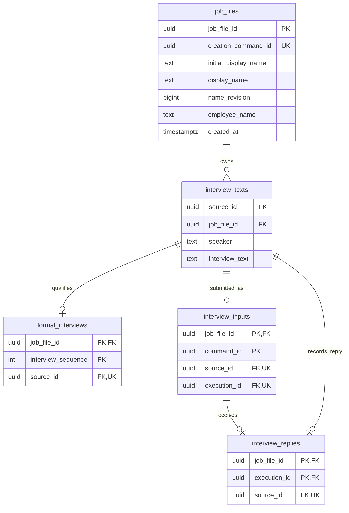
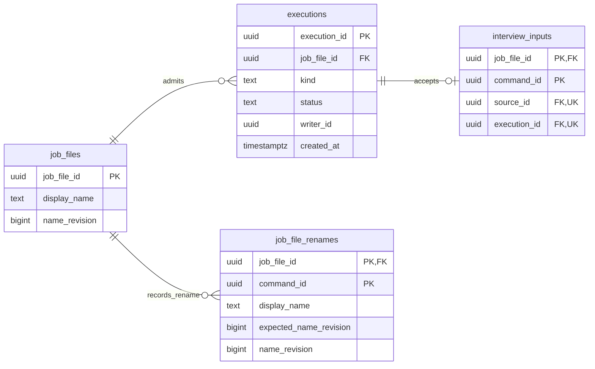

# 職務檔案與訪談保存接線

- 狀態：**現行職務檔案、訪談與准入保存接線**。本頁說明原文、正式資格、原操作與短交易；A 的完整執行、控制及恢復見[Agent 執行](agent-execution.md)。驗證見[檔案與訪談](../history.md#source-2a993efd60b1a85e23d6)。
- 語意仍由[資料保存](../architecture/persistence.md)及[正式來源契約](../specs/2026-09-27-memory-read-and-source-navigation-contract.md)維護。本頁說明實際 schema／交易如何承接，不另定訪談資格。
- 實作入口：[JobFileWorkflow](../../apps/api/src/caliburn/workflows/job_files.py)、[migration](../../apps/api/src/caliburn/migrations/versions/0001_job_files_and_interviews.py)。

## 1. 原文、正式資格與執行身分分開，不複製原話

以下兩個視圖涵蓋職務檔案、訪談與准入的七張相關業務表；JD、Memory 與 Graph checkpoint 另有各自的保存責任。同名表是同一份資料，不是副本；拆圖避免多條跨層線遮住節點。

**原文與正式資格：**

**檔案准入與改名結果：**下圖補前圖 `interview_inputs.execution_id` 的同檔案複合外鍵；完整原文關係見前圖。

| 儲存 | 擁有的內容與身分 | 關係／約束 |
|---|---|---|
| `job_files` | UUID 職務檔案、目前顯示名稱、受訪者及建立命令的原始結果資料 | 同名可存在；建立命令唯一。名稱不是隔離鍵 |
| `job_file_renames` | 原改名命令的期望名稱修訂、新名稱與結果修訂 | 檔案＋命令複合主鍵、FK、結果不可變；不複製員工姓名／訪談／JD |
| `interview_texts` | 不可變來源、所屬檔案、真實發話者、完整訪談原文 | 沒有正式序號；UPDATE／DELETE 拒絕 |
| `formal_interviews` | 檔案內的正式順序及指向原文的來源身分 | 同檔案複合外鍵；來源最多取得一次正式資格；正整數、不可改寫 |
| `interview_inputs` | 原提交命令、原文來源與 A 執行的固定關係 | 同檔案複合 FK；命令限檔案內唯一；不可改寫。只有員工提交有此關係，App 開場沒有 |
| `interview_replies` | 已正式採用的完整答覆來源與原提交的固定關係 | 每次提交最多一份；同檔案複合 FK、不可改寫；原文仍只在 `interview_texts` 保存 |
| `executions` | 工作種類、持久准入狀態與可被取代的 writer 身分 | 同檔案各一個活躍／暫停 A、各一個活躍 Memory；不保存模型窗口、圖節點或候選正文 |

一份檔案可有多筆原文；原文可以尚無正式資格。正式歷史從 `formal_interviews` JOIN `interview_texts` 投影，不直接掃全部原文。複合 FK `(job_file_id, source_id)` 防止把甲檔案的原文編入乙檔案；`source_id` 與正式序號是不同身分。這是既定「原文保存不等於正式可用」的儲存分離，**不是新增一份可自行編輯的對話副本**。

App 開場在建立時取得序號 1。已接受員工輸入進原文與提交關係，暫不授予正式資格。A 完成 workflow 在共同完成交易中呼叫 §8 的序號分配介面；沒有任意新增正式訊息的對外 API。單獨停止執行資格不能代替整個 Turn 的候選／context 回退。

## 2. 建立與重送

HTTP 驗證生成 DTO → `JobFileWorkflow.create` 開短交易 → `job_files.service` 依建立命令插入 → 新建時由 `interviews.service` 保存 App 開場及正式序號 1 → 一起 COMMIT → 返回結果。

- 同一建立命令併發重送：PostgreSQL unique＋`INSERT … ON CONFLICT DO NOTHING` 排除重複建立，再查該命令的原結果。不是先查再假設沒有競爭。
- 同一命令、不同輸入：拒絕；不能悄悄把這次輸入套在原檔案。
- 同一命令原結果：用建立時名稱、受訪者、身分與時間重建 typed result；目前名稱已改也不冒充原結果。初始建立資料受不可變保護；**不為這個小命令另建通用收據平台**。
- 開場寫入後發生錯誤：整個短交易回滾；檔案、原文與正式資格不留下半套。重送原命令可重新建立。
- DB 斷線／COMMIT 確認遺失：相同命令可在連線恢復後核對原結果，不自行無限重試。跨程序恢復與未知提交的驗證範圍見[恢復驗證](../history.md#source-d4bb8d17c5639690aeb3)。

開場文字在建立時保存，來源標為 `app`；未呼叫模型，不把模板文字稱為顧問已完成一次推論。後續改模板不會改歷史原文。內容依[工作分析指南 §3](../guides/2026-09-09-complete-work-analysis-guide.md#3-如何訪談不變成冗長表單)從實際工作全貌開始，不要求員工先懂 JD，也不代填工作事實。

## 3. 程式分責

| 位置 | 責任 |
|---|---|
| `features/*/models.py` | 純值型別、輸入不變量及領域錯誤；不依賴 ORM／HTTP |
| `job_files/service.py` | 建立／改名、原命令輸入一致性與名稱新鮮度；不 commit |
| `interviews/service.py` | 保存 App 開場、接受員工原文及核對原提交；完成時保存完整答覆／正式序號。全部不 commit，不因接受輸入授予正式資格 |
| 各 feature `persistence.py` | 自己的表及參數化 SQL；不讀另一 feature 的私有 persistence |
| 各 feature `queries.py` | 對外 typed 查詢投影；無寫入副作用 |
| `workflows/job_files.py` | 跨領域短交易及每次獨立 session |
| `workflows/interview_inputs.py` | 同次保存原輸入、原接受結果及 A 准入；不直接啟動模型 |
| `workflows/interview_completion.py` | 核對 A／writer、鎖定檔案後參與正式化；由 A 完成 workflow 開交易並一併採用 JD／背景意圖，不自行完成整輪 |
| `features/executions/service.py` | 同範圍准入、writer CAS／fencing、暫停與終態資格；不是 Graph 游標或程序存活偵測 |
| `transport/http/job_files.py`、`interview_inputs.py` | 生成 DTO、HTTP 狀態及結果投影；不寫 SQL |
| `bootstrap.py`／`adapters/database.py` | lifespan 組裝／關閉 engine、啟動檢查 migration head；不保存業務內容 |

沒有 BaseRepository、通用 UnitOfWork 註冊器或每層一個抽象 interface。Service 以少量 module 函式實現；共用 session factory 的 workflow 才用小型實例。這是[程式撰寫規範](coding-standard.md)的實際應用，不以「每層一個 class」表示解耦。

## 4. 配置與遷移

僅使用 `CALIBURN_DATABASE_URL`／`CALIBURN_DATABASE_SCHEMA`；不讀舊 `DATABASE_URL` 或自動載入 `.env`。schema 驗證為單一小寫識別符，不拼接任意使用者字串。URL 不出現在 settings repr。

初始化使用 Alembic 的標準 migration；啟動只核對 head，不自動建表或升級。未設定新 DB 可啟動 health，但資料 API 明確 503；指定空或錯版 schema 則啟動失敗，避免帶著半套結構繼續。命令見 [backend README](../../apps/api/README.md#目標資料庫初始化)。

遷移與連線都固定同一 search path；migration 額外核對 `current_schema()`。版本表使用該 default schema，避免同時配置顯式 `version_table_schema` 後，autogenerate 將同一張表再次視為一般表。正式環境的帳號／權限與備份須按[操作手冊](../runbook.md)配置，不能由隔離測試推定任意部署皆安全。

Schema SSOT 在 [HTTP contracts](../../apps/api/contracts/http/)；Python／TypeScript 皆由生成器產出。同檔共用型別用 `$defs`，不手抄生成欄位。具體回傳查 OpenAPI，不在本文件再抄一份 JSON。名稱目前 1–200 字、不全空白且無 PostgreSQL text 不接受的 NUL，作本機建立入口的有界驗證；同名不拒絕。

歷史回看以 `read_public_interview_history` 投影正式資格、原文與既有 `interview_replies` 關係；歷史 HTTP 回應僅為正式顧問答覆附上 nullable `execution_id`，App／員工訊息為 null。UI 按需用檔案與 execution 定位既有 consultant-turns status 的公開 commentary，不另存中間訊息或暴露 checkpoint／私有 context。共用來源查詢與 `InterviewMessage` 不增加此定位，也不授予 commentary 正式序號或引用資格。實作與限制見 [T09 歷史定位證據](../history.md#source-758915af0b16b0e1a0ee)。

## 5. 官方機制與本案取捨

- SQLAlchemy 2.1 的 [transaction context](https://docs.sqlalchemy.org/en/21/orm/session_transaction.html)及 [AsyncSession 並行界線](https://docs.sqlalchemy.org/en/21/orm/extensions/asyncio.html#using-asyncsession-with-concurrent-tasks)：每次用例獨立 session；不跨 coroutine 共用。
- PostgreSQL [ON CONFLICT](https://www.postgresql.org/docs/current/sql-insert.html#SQL-ON-CONFLICT)提供原子衝突處理；原始 payload／結果如何保存仍是本案用例責任，不由框架猜。
- Alembic [命名慣例](https://alembic.sqlalchemy.org/en/latest/naming.html)中的 `op.f()` 表示已完成命名，避免 CHECK 名稱被再次加前綴；[cookbook](https://alembic.sqlalchemy.org/en/latest/cookbook.html)承接顯式 connection。
- 不可變原文與資格分表、建立原結果保存在職務檔案領域模組，是依本產品保證的選擇，不聲稱是所有大型專案唯一標準。

## 6. 輸入接受、重送與新提交

[InterviewInputWorkflow](../../apps/api/src/caliburn/workflows/interview_inputs.py)以一個短交易依序：鎖定職務檔案列 → 查原命令 → 若尚未成立則取得 A 准入 → 保存原文及提交關係 → COMMIT。命令身分由 HTTP client 提供；execution／source UUID 由 App 配置，不讓模型填寫。

- 原命令已存在：核對完整原文字串，返回相同 source／execution。即使原 Turn 已取消，這仍是「當時曾接受」的原結果，不表示再次執行；UI 之後查當前執行狀態，不能由 200 推論 A 活躍。
- 使用者決定重新提交相同文字：使用**新命令**，得到新執行／來源；舊輸入不進正式歷史。與瀏覽器斷線重送原命令不同。
- 同命令不同文字回 409；同檔案另一個活躍／暫停 A 回 409，未接受內容不承諾已保存。輸入驗證不做 trim 或補標籤，完整保留實際文字；空白／NUL 拒絕。
- 原文寫入後交易失敗：原文、提交關係與准入一起回滾。不能只留下活躍 A 卻沒有其輸入，也不能留下可被背景取用的半套來源。
- 正式訪談 API 始終只讀正式資格 JOIN 原文。可保存、可供原工作接續、可給其他 Agent 引用，是三種不同能力。

HTTP 202 **只證明輸入與准入已保存**；bootstrap 喚醒本機 supervisor，由其核持久資格啟動／恢復 A。控制與完成沿[執行接線](agent-execution.md)，202 不代表 AI 已產生或正式保存答覆。

## 7. 准入與 writer fencing 的實際界線

[Execution service](../../apps/api/src/caliburn/features/executions/service.py)使用 PostgreSQL partial unique index 限制 `(job_file_id, kind)` 中 status 為 active／paused 的列。A 與 Memory 的種類不同，可以同檔並行；不同檔案互不鎖整個 App。額外以 CHECK 拒絕 Memory 的 paused／cancelled，使用者不管理 Memory。

執行准入與 writer 領取分開：輸入可先可靠保存，尚無 writer。Runner 提供 App 產生且可重用的 `writer_id`，以列鎖核對原 writer 身分後領取；相同領取可重入，競爭者不能覆蓋已成立身分。受控恢復可明確比較並取代舊 writer，之後遲到的舊 writer 不得寫入。這是資料庫檢查用的 **fencing**，不是授權憑證、租約、自動逾時或已確認程序停止的證據。

需具副作用的 workflow 必須在**同一交易**內 `lock_active_writer` 後才改候選／完成；不能檢查後先 COMMIT，再以記憶體裡的結果寫入。取消／完成也鎖同一執行列，因此終態只能有一個勝者。terminal 結果不可反向改為 active；原結果查回不授予新的寫入資格。這僅保證資格裁決，不等於完整 JD、正式訪談與背景意圖已共同提交。

固定短鎖順序為 **職務檔案 → 執行 → 相關領域記錄**。A 接受與人工 JD 修改共享職務檔案列的短鎖；人工 workflow 鎖檔案後呼叫 `require_manual_edit_allowed`。單純候選工具／控制只需執行列時不得反向再取檔案鎖。檔案鎖／交易不跨模型呼叫、等待使用者或 backoff。

`pause_execution` 表示 runner 已到安全點；UI「要求暫停」先保存控制意圖，兩者分開。`finish_execution` 只改准入資格，由 A／Memory workflow 與所需業務效果一起提交。被取消／失敗來源的原文仍保留，不取得正式序號或模型可見歷史資格。

控制意圖、supervisor、Graph 接續、候選回退及持久計量由[Agent 執行](agent-execution.md)協作。`writer_id` 僅提供 fencing，不能單獨證明程序已停止；請求逾時也不授權取代仍在執行的 writer。

官方依據：[PostgreSQL 列鎖](https://www.postgresql.org/docs/current/explicit-locking.html#LOCKING-ROWS)與[部分唯一索引](https://www.postgresql.org/docs/current/indexes-partial.html)提供短交易競爭與限定集合的唯一性；狀態、作用域及恢復授權是本案契約，並非 PostgreSQL 替 App 判斷。未新增 scheduler、broker、lease 平台或第二份 Graph State。

## 8. 正式答覆與序號：參與完成交易，不自成完成 API

`record_formal_interview(session, writer, reply_text=...)` 是 [A 完成交易的訪談參與介面](../../apps/api/src/caliburn/workflows/interview_completion.py)，不擁有 session／COMMIT，不呼叫模型，也不自行把 execution 標成 completed。調用者必須已辨認完整正式答覆，不把進度文字、工具請求或串流片段交入；A 完成 workflow 在同一交易採用 JD、來源並確立背景要求資格，再裁決完成，不能把本介面另包成獨立正式化 endpoint。

1. 核種類為 A，鎖職務檔案，查這次 execution 原已成立的正式交流。已完成重送承接原 pair；相同 execution 配不同答覆拒絕，不讀目前最後兩則冒充。
2. 未完成原結果則鎖當前 writer，確認仍 active；paused、cancelled、failed、過期 writer、錯誤檔案及 Memory 不可授予正式訪談資格。
3. 由提交關係取得原員工來源，完整文字不再複製。以該檔案現有正式最大序號加一，分配員工及完整答覆兩個序號；分配受同一檔案列鎖保護，不使用 `nextval` 或奇偶推斷說話者。
4. 同交易保存答覆原文、兩則正式資格與答覆—原提交關係；後續任何完成效果失敗，這些寫入一起回滾。下一次合法提交不消耗被回滾的序號。

新增的關係只保存來源 ID，不另存答覆正文或建立通用 receipt。原交流返回員工／顧問的固定來源與序號；背景 F 由其中 `employee_input.interview_sequence` 取得，**不是**顧問答覆或當下全檔最大序號。

依據：[PostgreSQL sequence](https://www.postgresql.org/docs/current/functions-sequence.html)明示 `nextval` 不隨交易 abort 回收，不能提供無跳號序列；本案利用已需的檔案列鎖與短交易分配。這是正式序號的產品要求，不推廣成所有內部 ID 都要連號。

驗證：[訪談交易](../history.md#source-2a993efd60b1a85e23d6)、[A 共同完成](../history.md#source-f5df4f496aad7b909036)、[程序恢復](../history.md#source-d4bb8d17c5639690aeb3)。測試層級各自成立，不由底層交易通過推定模型品質。

## 9. 有界來源查詢與近期歷史投影

[訪談 queries](../../apps/api/src/caliburn/features/interviews/queries.py)提供內部 typed 介面；不把 scope 放進模型可填參數，也不新增搜尋／第二套原話儲存：

| 介面 | 已實作效果 |
|---|---|
| `read_execution_input` | App 私有地依檔案及 execution 讀原提交；不授正式資格，不註冊成 Agent 共用歷史工具 |
| `read_history_frontier` | 取得有效正式歷史上界；A 的起點由上層固定，不能每個 Step 重取當作新範圍；B 的 F 不由此推算 |
| `read_interview_messages` | 非空正整數集合；去重、正式序號升序，只回選中訊息，不補未選內容 |
| `read_interview_range` | 閉區間內全部正式原文；任一缺失、非法或超出 App 固定上界就整筆拒絕，無部分成功 |
| `read_recent_interviews` | `(K,H/F]` 完整原文，必要時補最近合法前問；`context_sequences` 明示只為語境補入的序號，不改涵蓋 |

所有回傳保留固定 source ID、訪談序號、真實 speaker 及完整原文。`InterviewReadScope` 由 App 綁定，內含職務檔案與固定上界；這是值物件，不是權限憑證或新的資料保存模組。即使後面又有正式訪談，原 scope 不會擴張。直接指定訊息／範圍不補前問；近期投影才按來源契約補一則，沒有歷史時不捏造。查詢不按字數截斷或把 role 轉成新發話。

A／B 的角色 workflow 從固定 Memory 取得 K，持久綁定 H／F；同工作恢復沿原範圍。模型可見投影與錯誤由[工具邊界](memory-tools.md)負責，完整請求容量由[共用執行](agent-execution.md)核對。來源查詢不自行刷新角色基準。

## 10. 列表改名：名稱新鮮度與原操作結果

改名只改職務檔案的顯示標籤，同名仍可存在；stable ID、員工姓名、訪談與 JD 不受影響。HTTP 用 `POST /api/job-files/{job_file_id}/rename`，參數由[唯一 schema](../../apps/api/contracts/http/rename-job-file-request.schema.json)定義；這不是 Memory 的 title 解析，也不把 UI 修訂參數搬進模型工具。

`JobFileWorkflow.rename` 開短交易 → 取得檔案列鎖 → 先查原命令 → 有結果則校驗 payload 並回原結果 → 新命令才核 `expected_name_revision` → 修改 label、保存原結果 → 同次提交。列鎖釋放後才返回 HTTP；不持鎖等待人或模型，不改 A／Memory 執行資格。

- `name_revision` 只代表此 label 的新鮮度，從 1 開始。DB trigger 在 label 真正改變時加一；改回同字仍前進，不讓舊分頁繞過檢查。同值命令可確認，但不增加修訂。
- 過期基準回 409，不默默覆蓋；同命令不同 payload 亦拒絕。原命令先查，所以即使後來已有新名稱，重送仍回原結果而**不再次改名**。UI 成功後須 GET 最新 metadata，不把舊結果寫成目前名稱。
- 建立重送仍用不可變 `initial_display_name`、初始修訂 1 及原建立資料，不受 rename 結果影響。新欄位由 [0004 migration](../../apps/api/src/caliburn/migrations/versions/0004_job_file_renames.py)加入，不重寫舊 migration。
- 只存最小的原命令及結果欄位；現行表頭無法證明某個舊命令是否已提交，因此此資料不能只放 UI。這是職務檔案領域模組保存的結果，不是新通用收據服務、Graph checkpoint 或全文版本平台。首版不清除可重送命令結果。

研究借鑑 [Google AIP-154](https://google.aip.dev/154)的資源新鮮度檢查與 [PostgreSQL row lock](https://www.postgresql.org/docs/current/explicit-locking.html#LOCKING-ROWS)；本案採明確 label counter 而非完整資源 ETag，原操作重送保證沿本案既有交易契約。測例涵蓋舊命令重送、同基準競爭、同名隔離、改回同字、原結果不可改、後段失敗一起回滾；不由此宣稱全產品程序故障或交付安全已完成。
