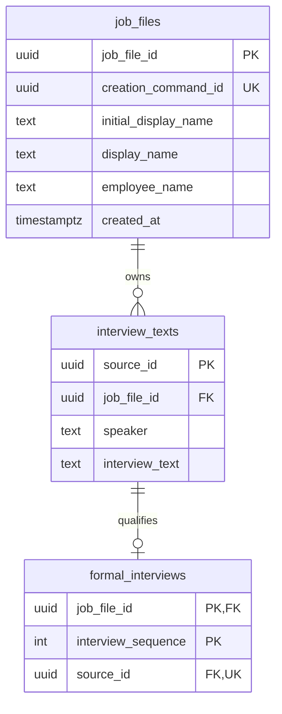

# 職務檔案與訪談保存接線

- 狀態：**T02 局部已實作／真 PostgreSQL 已驗**，2026-09-29。完成範圍以[任務及證據](../plans/2026-09-29-target-rebuild/evidence/t02-job-files-and-interviews.md)為準；尚無 A 完成、取消／准入或列表 UI。
- 語意仍由[資料保存](../architecture/persistence.md)及[正式來源契約](../specs/2026-09-27-memory-read-and-source-navigation-contract.md)維護。本頁說明實際 schema／交易如何承接，不另定訪談資格。
- 實作入口：[JobFileWorkflow](../../apps/api/src/caliburn/workflows/job_files.py)、[migration](../../apps/api/migrations/versions/0001_job_files_and_interviews.py)。

## 1. 三類記錄，不複製原話

圖只含目前已建立的業務表，不含尚未實作的執行資格、JD、Memory。

| 儲存 | 擁有的內容與身分 | 關係／約束 |
|---|---|---|
| `job_files` | UUID 職務檔案、目前顯示名稱、受訪者及建立命令的原始結果資料 | 同名可存在；建立命令唯一。名稱不是隔離鍵 |
| `interview_texts` | 不可變來源、所屬檔案、真實發話者、完整訪談原文 | 沒有正式序號；UPDATE／DELETE 拒絕 |
| `formal_interviews` | 檔案內的正式順序及指向原文的來源身分 | 同檔案複合外鍵；來源最多取得一次正式資格；正整數、不可改寫 |

一份檔案可有多筆原文；原文可以尚無正式資格。正式歷史從 `formal_interviews` JOIN `interview_texts` 投影，不直接掃全部原文。複合 FK `(job_file_id, source_id)` 防止把甲檔案的原文編入乙檔案；`source_id` 與正式序號是不同身分。這是既定「原文保存不等於正式可用」的儲存分離，**不是新增一份可自行編輯的對話副本**。

目前只有 App 開場會在建立時取得序號 1。原文表能承接後續待處理輸入，但接受員工輸入、成功完成時分配正式序號、執行失效與候選引用接線仍由 T02 後續／T08 完成；沒有對外開任意新增正式訊息的 API。

## 2. 建立與重送

HTTP 驗證生成 DTO → `JobFileWorkflow.create` 開短交易 → `job_files.service` 依建立命令插入 → 新建時由 `interviews.service` 保存 App 開場及正式序號 1 → 一起 COMMIT → 返回結果。

- 同一建立命令併發重送：PostgreSQL unique＋`INSERT … ON CONFLICT DO NOTHING` 排除重複建立，再查該命令的原結果。不是先查再假設沒有競爭。
- 同一命令、不同輸入：拒絕；不能悄悄把這次輸入套在原檔案。
- 同一命令原結果：用建立時名稱、受訪者、身分與時間重建 typed result；目前名稱已改也不冒充原結果。初始建立資料受不可變保護；**不為這個小命令另建通用收據平台**。
- 開場寫入後發生錯誤：整個短交易回滾；檔案、原文與正式資格不留下半套。重送原命令可重新建立。
- DB 斷線／COMMIT 確認遺失：本切片不自行無限重試。相同命令可在連線恢復後重新核對原結果；完整故障注入仍屬 T12，不能由併發測試推導全產品可恢復。

開場文字在建立時保存，來源標為 `app`；未呼叫模型，不把模板文字稱為顧問已完成一次推論。後續改模板不會改歷史原文。內容依[工作分析指南 §3](../specs/2026-09-09-complete-work-analysis-guide.md#3-如何訪談不變成冗長表單)從實際工作全貌開始，不要求員工先懂 JD，也不代填工作事實。

## 3. 程式分責

| 位置 | 責任 |
|---|---|
| `features/*/models.py` | 純值型別、輸入不變量及領域錯誤；不依賴 ORM／HTTP |
| `job_files/service.py` | 建立與原命令輸入一致性；不 commit |
| `interviews/service.py` | 建立 App 開場用例；不 commit |
| 各 feature `persistence.py` | 自己的表及參數化 SQL；不讀另一 feature 的私有 persistence |
| 各 feature `queries.py` | 對外 typed 查詢投影；無寫入副作用 |
| `workflows/job_files.py` | 跨領域短交易及每次獨立 session |
| `transport/http/job_files.py` | 生成 DTO、HTTP 狀態及結果投影；不寫 SQL |
| `bootstrap.py`／`adapters/database.py` | lifespan 組裝／關閉 engine、啟動檢查 migration head；不保存業務內容 |

沒有 BaseRepository、通用 UnitOfWork 註冊器或每層一個抽象 interface。Service 以少量 module 函式實現；共用 session factory 的 workflow 才用小型實例。這是[程式撰寫規範](coding-standard.md)的實際應用，不以「每層一個 class」表示解耦。

## 4. 配置與遷移

僅使用 `CALIBURN_DATABASE_URL`／`CALIBURN_DATABASE_SCHEMA`；不讀舊 `DATABASE_URL` 或自動載入 `.env`。schema 驗證為單一小寫識別符，不拼接任意使用者字串。URL 不出現在 settings repr。

初始化使用 Alembic 的標準 migration；啟動只核對 head，不自動建表或升級。未設定新 DB 可啟動 health，但資料 API 明確 503；指定空或錯版 schema 則啟動失敗，避免帶著半套結構繼續。命令見 [backend README](../../apps/api/README.md#目標資料庫初始化)。

遷移與連線都固定同一 search path；migration 額外核對 `current_schema()`。版本表使用該 default schema，避免同時配置顯式 `version_table_schema` 後，autogenerate 將同一張表再次視為一般表。DB 正式寫入帳號／權限、備份及部署安全仍須 T15／T18 實測；目前僅隔離的合成測試。

Schema SSOT 在 [HTTP contracts](../../apps/api/contracts/http/)；Python／TypeScript 皆由生成器產出。同檔共用型別用 `$defs`，不手抄生成欄位。具體回傳查 OpenAPI，不在本文件再抄一份 JSON。名稱目前 1–200 字、不全空白且無 PostgreSQL text 不接受的 NUL，作本機建立入口的有界驗證；同名不拒絕。

## 5. 官方機制與本案取捨

- SQLAlchemy 2.1 的 [transaction context](https://docs.sqlalchemy.org/en/21/orm/session_transaction.html)及 [AsyncSession 並行界線](https://docs.sqlalchemy.org/en/21/orm/extensions/asyncio.html#using-asyncsession-with-concurrent-tasks)：每次用例獨立 session；不跨 coroutine 共用。
- PostgreSQL [ON CONFLICT](https://www.postgresql.org/docs/current/sql-insert.html#SQL-ON-CONFLICT)提供原子衝突處理；原始 payload／結果如何保存仍是本案用例責任，不由框架猜。
- Alembic [命名慣例](https://alembic.sqlalchemy.org/en/latest/naming.html)中的 `op.f()` 表示已完成命名，避免 CHECK 名稱被再次加前綴；[cookbook](https://alembic.sqlalchemy.org/en/latest/cookbook.html)承接顯式 connection。
- 不可變原文與資格分表、建立原結果保存在原 owner，是依本產品保證的選擇，不聲稱是所有大型專案唯一標準。
