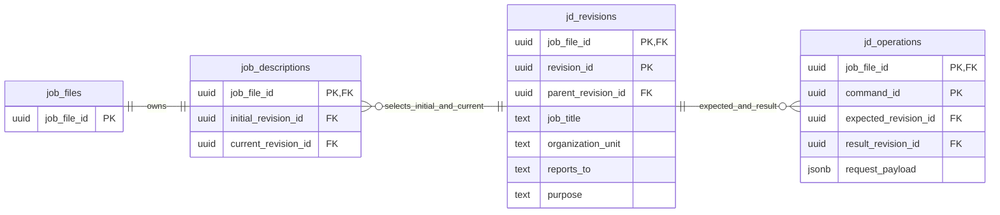
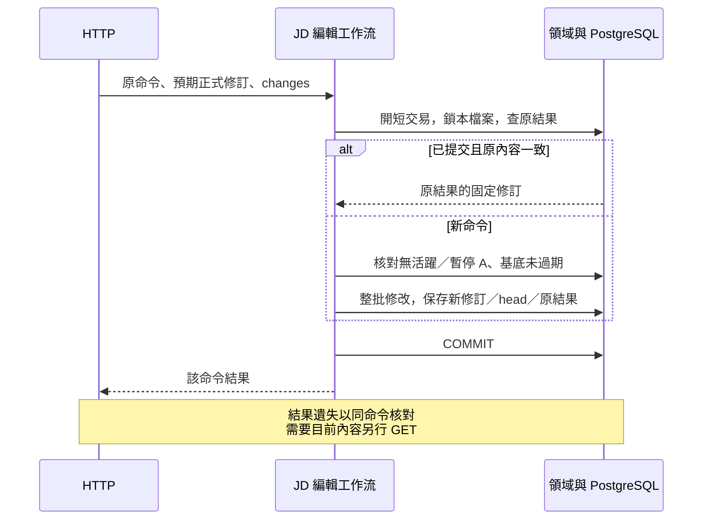

# JD 保存接線

- 狀態：**T03 第一切片已實作／後端已驗；T03 整體未完成**。2026-09-29。本文只維護 JD 的實際保存、交易與讀寫接線，不重訂欄位語意或模型工具。
- 上位契約：[JD 欄位指南](../specs/2026-09-09-jd-field-and-writing-guide.md)、[JD 工具覆蓋](../specs/2026-09-29-jd-model-tool-contract-review.md)、[資料接線 §4](data-and-contracts.md#4-jd關聯式候選來源與正式完成)。實測及下一步見 [T03 證據](../plans/2026-09-29-target-rebuild/evidence/t03-relational-jd.md)。

## 1. 本切片範圍與程式責任

目前只有 profile 四個欄位的正式保存：`job_title`、`organization_unit`、`reports_to`、`purpose`。欄位意義沿指南；檔案名稱／員工姓名留在職務檔案，不複製進 JD。尚未提供 profile UI、職責／任務／K／S 等關聯式集合、Agent 候選、依據與核對；不能把本切片端點直接當作 A 的正式寫入捷徑。

| 責任 | 已實作位置 |
|---|---|
| 純值、明確局部修改與不變量 | [models.py](../../apps/api/src/caliburn/features/job_description/models.py)；不依賴 ORM／HTTP |
| 原結果核對、修訂與欄位用例 | [service.py](../../apps/api/src/caliburn/features/job_description/service.py)；參與呼叫方交易，不 commit |
| 正式頭、固定修訂、原操作 SQL | [persistence.py](../../apps/api/src/caliburn/features/job_description/persistence.py) |
| 固定正式內容查詢 | [queries.py](../../apps/api/src/caliburn/features/job_description/queries.py)；GET 不偷偷建立資料 |
| 檔案隔離、人工准入及一次提交 | [jd_editing.py](../../apps/api/src/caliburn/workflows/jd_editing.py)；沿既有檔案鎖與 executions，不重建鎖定系統 |
| HTTP 驗證／錯誤投影 | [jd_profile.py](../../apps/api/src/caliburn/transport/http/jd_profile.py)；無業務 SQL |
| 新建檔案連同空 JD／開場保存 | [job_files.py](../../apps/api/src/caliburn/workflows/job_files.py)；重送建立不重設 JD |

## 2. 固定修訂與目前正式頭

以下為**已實作資料關係**，非完整未來 schema。`job_files` 是既有 owner；圖的複合識別均含 `job_file_id`。簡化屬性只列識別／關係與 profile，完整 DDL 以 [0005 migration](../../apps/api/migrations/versions/0005_jd_profile_revisions.py)為準。

- `job_descriptions` 選初始與目前正式修訂；初始身分不改。固定修訂的父修訂、head、操作結果均以**同檔案的複合 FK**約束，不能指到另一檔案。
- `jd_revisions` 保存四個獨立文字欄位，不把整份 JD 存 JSON／Markdown。修訂與原操作不允許 UPDATE／DELETE；空 JD 的四欄為 null，表示尚未提供，不是已確認沒有。
- 有內容改變才建立新修訂並移動 head。改回相同舊文字仍建立新的修訂身分；只設為目前相同值則沿用修訂，但原命令仍有可重送結果。
- `jd_operations` 保存原命令的預期基底、型別化修改與結果修訂。JSONB 是原操作意圖，不是第二份可編輯 JD；結果透過固定修訂取回，不複製一份完整結果正文。
- 每次改動目前只複製四個小欄位，不引入內容定址、delta 或事件重播。後續大集合應以固定選用／關聯式項目接入，不可讓舊修訂沿用可變最新子項、也不可把本切片做法擴成每次無條件複製全份 JD。具體方案由後續切片測例決定。

UUID 是身分，不表示時間大小；先後由父修訂與原操作表達。這不是把 ORM 的版本計數器當作永久歷史，亦不是要求 LLM 填修訂號。

## 3. 人工編輯與原結果接續

HTTP shape 的唯一來源為 [request schema](../../apps/api/contracts/http/revise-jd-profile-request.schema.json)與 [view schema](../../apps/api/contracts/http/jd-profile-view.schema.json)，生成 Python／TypeScript；使用路徑見 [backend README](../../apps/api/README.md)。不是本輪新增的模型工具 schema。

HTTP 的 `expected_revision_id` 是使用者畫面讀到的正式基底，`command_id` 辨認同次送出。新的修改不得默默換成最新基底重試；保存確認不明時，保留原命令及原內容重送。`set_field` 只提供指定欄位的完整新值；清空用 `clear_field`。未指定欄位保留；同命令重複指定同一欄位拒絕，不猜先後覆蓋。blank／NUL／錯欄位在修改前拒絕。

工作流先鎖檔案再查原結果。已有結果且 payload 一致就回原修訂，**不因目前已有 A 或更新稿而重新寫入**；命令身分被拿來送不同內容則拒絕。新命令才核人工准入及 head。與 A 輸入准入共用檔案鎖順序，檢查和寫入在同一交易內；活躍／暫停 A 阻止新的人工 JD 修改，背景 Memory 不阻止。

所有變更、新修訂、head 與原操作同次提交；中途例外全退。例：命令 P 產生 R2，後來另一命令產生 R3，重送 P 仍回 R2，GET 則回 R3。沒有在此新增未知 COMMIT 的自動 retry loop，也不能用 GET 的 R3 冒充 P 的結果。程序故障／COMMIT 確認遺失的完整跨層驗收仍屬 T12；目前真 PG 回歸包含提交前例外及提交後原命令重送。

## 4. 初始化、演進與保證界線

新建職務檔案、開場與空 JD 同一短交易；任一失敗不留下半套檔案。0005 為已存在的**新目標 0004** 檔案補一份空 JD，重跑 upgrade 不重建；沒有讀舊 production／搬舊資料。已知檔案卻缺少 JD head 是保存不一致，不在 GET 偷修成空白；缺 schema 的啟動仍 fail fast。

資料庫保障複合 FK、唯一命令、固定修訂不可改與交易原子性；領域／工作流負責允許欄位、人工准入與新基底檢查。這不宣稱 DB 管理員任意 SQL 都符合業務，也不以檢查通過表示文字是員工事實。人工編輯造成的核對狀態與來源固定鏈路在 T07 接入，不在此自動確認。

後續 A 必須寫候選而非本 HTTP 的正式 head；A 完成時再與正式訪談、答覆及背景意圖同次發布（T08）。已建立的純欄位規則可共用，但人工准入和候選資格不可被一個忽略差異的 `save` 合併。當集合、候選與來源落地，更新本頁及相應圖，不另建第二份 JD 儲存權威。

## 5. 研究依據與本案取捨

2026-09-29 核對官方文件：

- [PostgreSQL constraints](https://www.postgresql.org/docs/current/ddl-constraints.html)：複合主鍵／FK 可維護資料關係；本案用它限制同檔案修訂，不以 Python「先查存在」代替約束。
- [PostgreSQL row locking](https://www.postgresql.org/docs/current/explicit-locking.html)：列鎖在交易結束釋放；本案延用已建立的檔案列鎖，把准入與正式修改放同一短提交，不持鎖等待模型或人。
- [SQLAlchemy version counter](https://docs.sqlalchemy.org/en/21/orm/versioning.html)：ORM counter 的 flush 衝突檢查不是自動保留完整歷史。因此採 JD 自己的固定修訂／head／原結果，不增加通用版本平台。

上述是官方機制；**三表切法、四欄局部修訂與重送順序是 Caliburn 的有界實現選擇**，不是聲稱所有大廠都用此 schema。沒有新增套件或框架，真 PG 證據見任務紀錄。
