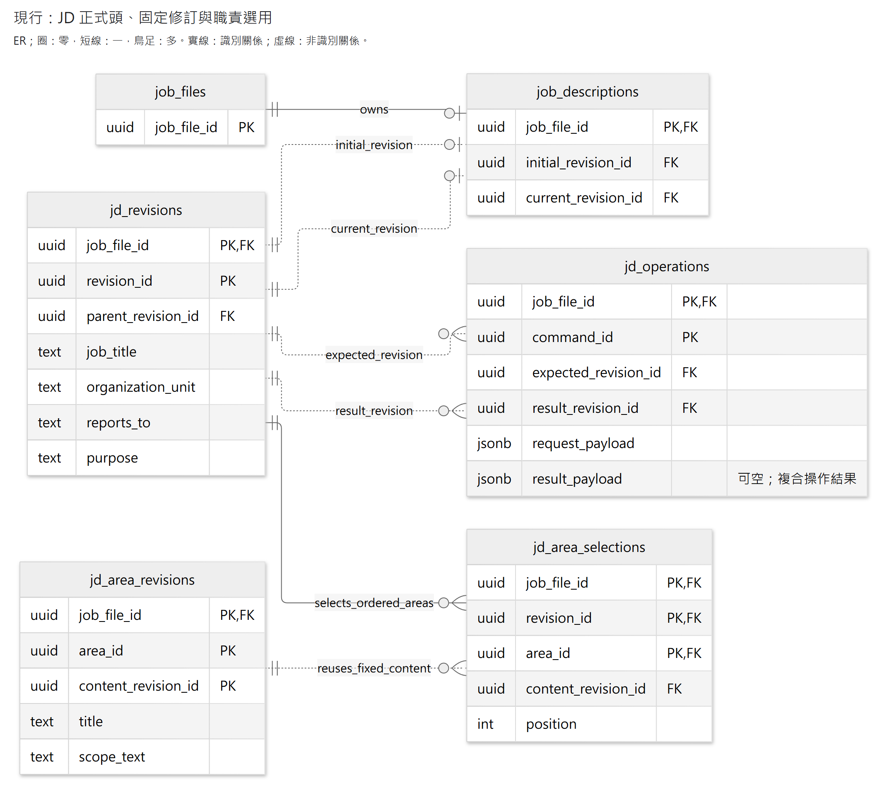
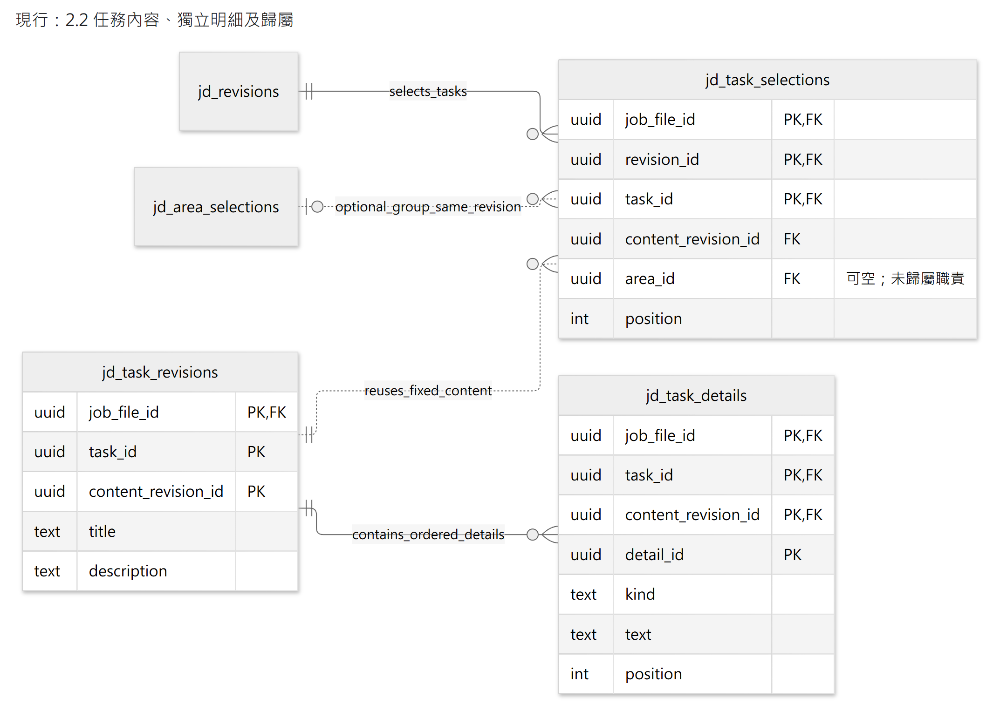
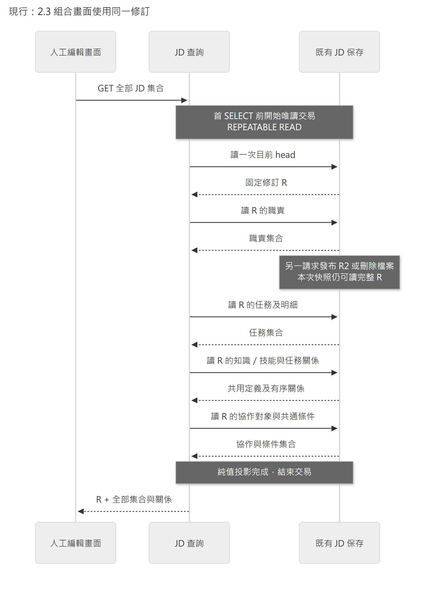
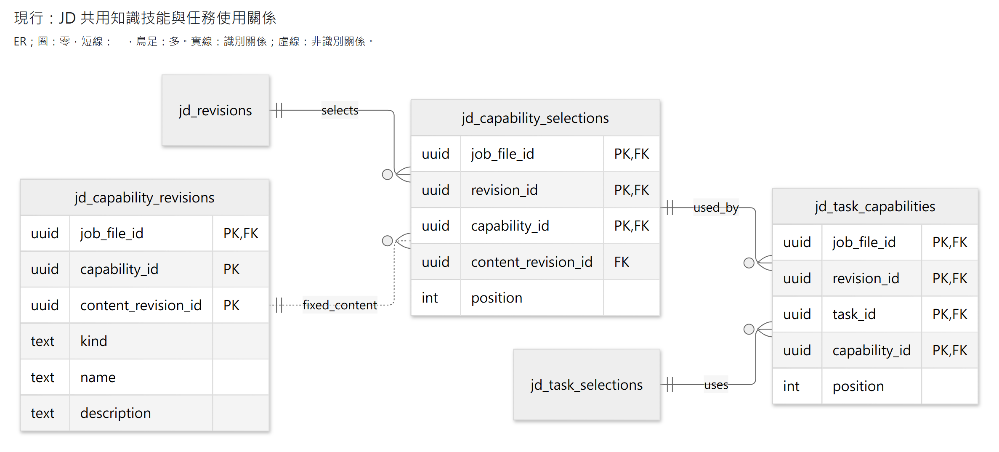
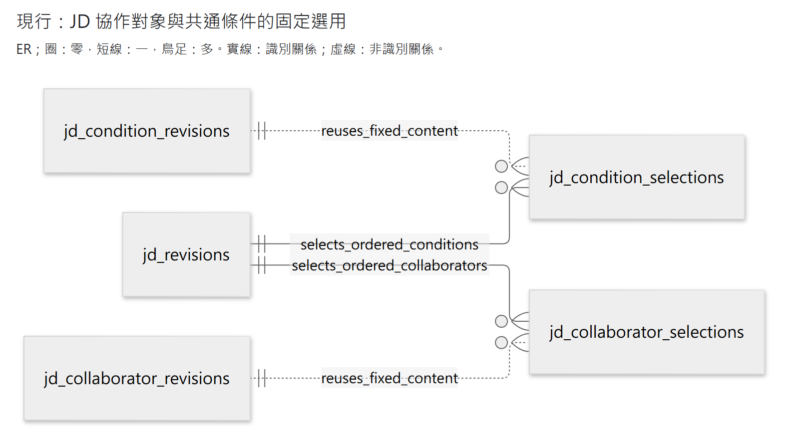
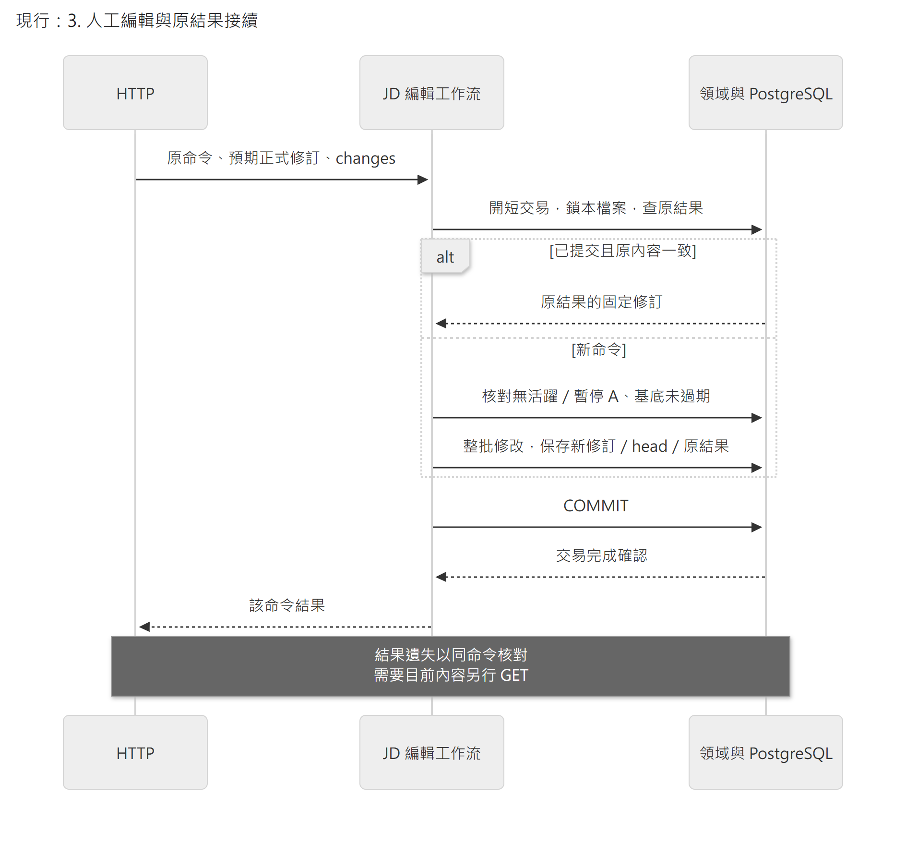
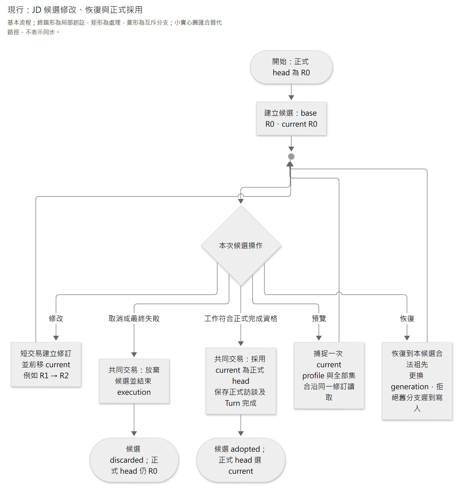
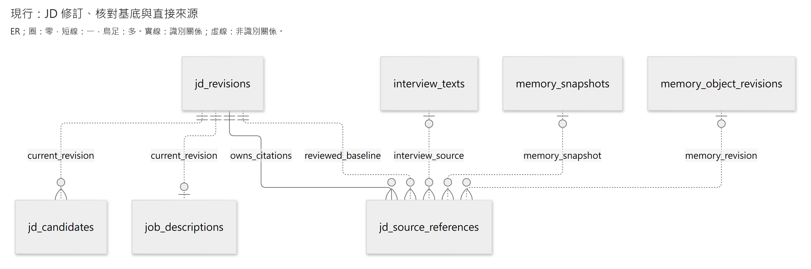

# JD 保存接線

- 狀態：**現行 JD 保存、交易與讀寫接線** 。人工及模型編輯共用 JD 領域模組，候選在 A 完成交易才正式採用；來源回查、差異與條件撤回依下列契約運作。分析品質及未驗情境見[驗證對照](verification-plan.md)，不由機制測試推定品質達標。
- 上位契約：[JD 欄位指南](../standards/work-analysis/2026-09-09-jd-field-and-writing-guide.md)、[JD 工具覆蓋](../specs/2026-09-29-jd-model-tool-contract-review.md)、[資料接線 §4](data-and-contracts.md#4-jd關聯式候選來源與正式完成)。驗證見 [JD 保存](../history.md#source-75f1da860cdd0bef826e)。

| 維護問題 | 閱讀位置 |
|---|---|
| 哪個模組負責某一種 JD 內容？ | [程式責任](#1-保存範圍與程式責任) |
| 固定正文、排序、任務歸屬及能力關係如何保存？ | [固定修訂](#2-固定修訂與目前正式頭)、[職責](#21-職責集合身分固定正文與排序分開)、[任務](#22-任務內容獨立明細及歸屬)、[同版查詢](#23-組合畫面使用同一修訂)、[能力](#24-共用知識技能與任務使用關係)、[協作／條件](#25-協作對象與全職務共通條件) |
| 人工操作與 A 候選如何提交、恢復？ | [人工原結果](#3-人工編輯與原結果接續)、[本輪候選](#31-本輪候選與可恢復位置)、[條件撤回](#36-完成後的-jd-條件撤回) |
| 模型如何定位、讀寫與引用？ | [導覽／定位](#32-模型導覽與既有物件定位)、[來源與寫入](#33-直接來源按需讀取與候選模型寫入)、[項目編輯](#34-建立局部修訂與刪除模型項目) |
| 人工改稿與依據差異如何回查？ | [Changes](#35-來源及人工改稿差異)、[正式來源](#37-人的正式來源回查)、[Turn 變更](#38-完成-turn-的-jd-變更檢視) |

初始化、資料演進與驗證限制見[§4](#4-初始化演進與保證界線)；保存機制的來源與取捨見[§5](#5-研究依據與本案取捨)。

## 1. 保存範圍與程式責任

目前有 profile 四個欄位的正式保存：`job_title`、`organization_unit`、`reports_to`、`purpose`，以及職責／任務集合、獨立成果／要求、共用知識／技能與任務使用關係、協作對象／共通條件的人工讀寫與排序。欄位意義沿指南；檔案名稱／員工姓名留在職務檔案，不複製進 JD。人工 UI 接線見[基本資料](interface-and-delivery.md#12-基本資料編輯的讀取基底與恢復)、[職責／任務](interface-and-delivery.md#13-職責與任務的人工編輯)、[知識／技能](interface-and-delivery.md#14-共用知識技能及任務關係的人工編輯)及[協作／條件](interface-and-delivery.md#15-協作對象與共通條件的人工編輯)。候選見 §3.1，模型定位、依據／核對與來源回查見 §3.2–3.8；人工正式端點不作 A 候選寫入捷徑。

**核心保存與修訂**

| 責任 | 已實作位置 |
|---|---|
| 純值、明確局部修改與不變量 | [models.py](../../apps/api/src/caliburn/features/job_description/models.py)、[work_models.py](../../apps/api/src/caliburn/features/job_description/work_models.py)及各內容的 changes；不直接或間接依賴 ORM／HTTP／query service |
| 原結果核對、修訂與欄位用例 | [service.py](../../apps/api/src/caliburn/features/job_description/service.py)；參與呼叫方交易，不 commit |
| 正式頭、固定修訂、原操作 SQL | [persistence.py](../../apps/api/src/caliburn/features/job_description/persistence.py) |
| 固定正式內容查詢 | [queries.py](../../apps/api/src/caliburn/features/job_description/queries.py)；GET 不偷偷建立資料 |
| 共用修改範圍與原結果 | [revision_editing.py](../../apps/api/src/caliburn/features/job_description/revision_editing.py)；集中檔案／候選 scope 與完整 `kind + expected_revision_id + request_payload` 意圖核對，各資料用例保留 payload 及原結果投影；選擇正式或候選指標，不混合發布責任 |
| 候選位置、回退及採用參與者 | [candidates.py](../../apps/api/src/caliburn/features/job_description/candidates.py)、[candidate_service.py](../../apps/api/src/caliburn/features/job_description/candidate_service.py)、[candidate_persistence.py](../../apps/api/src/caliburn/features/job_description/candidate_persistence.py)；服務不自行 commit |

**JD 內容集合**

| 責任 | 已實作位置 |
|---|---|
| 職責值、用例、固定內容／排序 | [areas.py](../../apps/api/src/caliburn/features/job_description/areas.py)、[area_service.py](../../apps/api/src/caliburn/features/job_description/area_service.py)、[area_persistence.py](../../apps/api/src/caliburn/features/job_description/area_persistence.py)；仍屬同一 JD feature，非另套保存服務 |
| 任務與獨立明細的值、變更計算 | [tasks.py](../../apps/api/src/caliburn/features/job_description/tasks.py)、[task_changes.py](../../apps/api/src/caliburn/features/job_description/task_changes.py)；先計算完整合法結果，無 DB／HTTP 相依 |
| 任務用例、保存與 HTTP | [task_service.py](../../apps/api/src/caliburn/features/job_description/task_service.py)、[task_persistence.py](../../apps/api/src/caliburn/features/job_description/task_persistence.py)、[jd_tasks.py](../../apps/api/src/caliburn/transport/http/jd_tasks.py)；沿同一 JD workflow、head 與 operation，不另造服務／交易平台 |
| 共用知識／技能的值與變更 | [capabilities.py](../../apps/api/src/caliburn/features/job_description/capabilities.py)、[capability_changes.py](../../apps/api/src/caliburn/features/job_description/capability_changes.py)；名稱中的 capability 僅統稱這兩種 JD 能力定義，不代表 Agent 工具能力 |
| 共用定義／任務關係的用例、SQL、HTTP | [capability_service.py](../../apps/api/src/caliburn/features/job_description/capability_service.py)、[capability_persistence.py](../../apps/api/src/caliburn/features/job_description/capability_persistence.py)、[jd_capabilities.py](../../apps/api/src/caliburn/transport/http/jd_capabilities.py)；沿同一 JD 固定修訂及原操作，反向用途由同一關係投影 |
| 協作對象值、用例與 SQL | [collaborators.py](../../apps/api/src/caliburn/features/job_description/collaborators.py)、[collaborator_service.py](../../apps/api/src/caliburn/features/job_description/collaborator_service.py)、[collaborator_persistence.py](../../apps/api/src/caliburn/features/job_description/collaborator_persistence.py)；獨立文字與選用，不混成 task 關係 |
| 共通條件值、變更、用例與 SQL | [conditions.py](../../apps/api/src/caliburn/features/job_description/conditions.py)、[condition_changes.py](../../apps/api/src/caliburn/features/job_description/condition_changes.py)、[condition_service.py](../../apps/api/src/caliburn/features/job_description/condition_service.py)、[condition_persistence.py](../../apps/api/src/caliburn/features/job_description/condition_persistence.py)；分類不表示自動繼承 |

**查詢與跨層接線**

| 責任 | 已實作位置 |
|---|---|
| 同版 JD 集合組合讀取 | [work_queries.py](../../apps/api/src/caliburn/features/job_description/work_queries.py)、[jd_work.py](../../apps/api/src/caliburn/transport/http/jd_work.py)；職責／任務／能力及關係／協作／條件先固定 head 一次，再沿既有查詢投影，不另建資料保存模組 |
| 檔案隔離、人工准入及一次提交 | [jd_editing.py](../../apps/api/src/caliburn/workflows/jd_editing.py)；六個 typed 寫入入口共用單一手動交易協調：鎖檔案、查原結果、再核新寫入准入、修改；各次呼叫獨立 session／交易，沿既有 executions，不重建鎖定系統 |
| HTTP 驗證／錯誤投影 | [jd_profile.py](../../apps/api/src/caliburn/transport/http/jd_profile.py)與各資源路由維護內容及不存在錯誤；無業務 SQL |
| 人工 JD 的共同錯誤與 workflow 注入 | [jd_dependencies.py](../../apps/api/src/caliburn/transport/http/jd_dependencies.py)以 FastAPI function-scope yield dependency 統一原命令衝突、過期修訂及顧問忙碌的回應；undo／delete 保留各自錯誤代碼，不使用全域映射 |
| 新建檔案連同空 JD／開場保存 | [job_files.py](../../apps/api/src/caliburn/workflows/job_files.py)；重送建立不重設 JD |
| A 候選准入／短交易 | [jd_candidates.py](../../apps/api/src/caliburn/workflows/jd_candidates.py)；沿既有 execution writer 與檔案鎖，不提供獨立正式完成 HTTP |

## 2. 固定修訂與目前正式頭

以下呈現固定修訂與職責的資料關係，其他集合在各節補充。`job_files` 是職務檔案表；圖的複合識別均含 `job_file_id`。簡化屬性保留具體鍵與已實作欄位，型別採簡寫，省略預設值、CHECK 及排序用的複合唯一約束；完整 DDL 以 [0005](../../apps/api/src/caliburn/migrations/versions/0005_jd_profile_revisions.py)及 [0006 migration](../../apps/api/src/caliburn/migrations/versions/0006_jd_area_selections.py)為準。

圖為現行固定修訂與職責的局部 ER；基數、識別關係與鍵標記沿[中央圖面規範](../standards/documentation-standard.md#3-圖面種類與符號)。省略各表重複的檔案 FK、修訂 parent 及後續章節的關係。檔案建立工作流會同時建立 JD；圖中 `0..1` 表示 FK／唯一約束本身的範圍。

[圖源](../diagrams/implementation/jd-storage/fixed-revisions-areas.mmd) · [SVG](../diagrams/implementation/jd-storage/fixed-revisions-areas.svg)

- `job_descriptions` 選初始與目前正式修訂；初始身分不改。固定修訂的父修訂、head、操作結果均以**同檔案的複合 FK** 約束，不能指到另一檔案。
- `jd_revisions` 保存四個獨立文字欄位，不把整份 JD 存 JSON／Markdown。修訂與原操作不允許 UPDATE／DELETE；空 JD 的四欄為 null，表示尚未提供，不是已確認沒有。
- 有內容改變才建立新修訂並移動 head。改回相同舊文字仍建立新的修訂身分；只設為目前相同值則沿用修訂，但原命令仍有可重送結果。
- `jd_operations` 保存原命令的預期基底、型別化修改與結果修訂。`request_payload` 是原操作意圖；`0028` 增加的 nullable `result_payload` 僅保存複合操作的效果與新物件身分，舊操作維持 null。完整結果透過固定修訂取回，不複製一份可編輯 JD 或完整結果正文。
- 每次改動只複製四個小欄位及職責／任務／能力選用鍵、關係與排序；內容未變就重用固定內容修訂，不引入內容定址、delta 或事件重播。任務內容修訂包含自身成果／要求，詳見 §2.2；共用知識／技能見 §2.4。其他集合同樣維持此不變量，不可讓舊修訂讀可變最新子項，也不可無條件複製整份 JD。

UUID 是身分，不表示時間大小；先後由父修訂與原操作表達。這不是把 ORM 的版本計數器當作永久歷史，亦不是要求 LLM 填修訂號。

### 2.1 職責集合：身分、固定正文與排序分開

`area_id` 是職責身分，`content_revision_id` 是一次固定標題／範圍正文；每份 JD 修訂以 `jd_area_selections` 選定這些內容及順序。每個 JD 修訂對同一職責只能選一個內容修訂，同一位置只准一項，複合 FK 限同檔案。沒有將 JD 標題當身分，也不沿用 Memory 的同層 title 唯一規則。

- 新建在末尾，`title`／`scope_text` 至少一個非空；未知欄位可 null，不硬造職責內容。這是沿既有 JD 草稿的合法內容界線，不要求兩欄必填。
- 改內容保持 `area_id`、新增固定內容修訂；未指定欄位保留，指定 null 明確清空，但不能清成無內容。改回先前文字仍有新修訂。
- 排序只改選用順序、不複製正文；放到已在的位置不新增 JD 修訂。HTTP 以 `before_area_id` 選相鄰目標，null 放末尾；不能指定別份 JD 的物件或任意 position。
- 刪除只移除新 JD 的選用；先前正式修訂、原操作結果及正文仍可回查。同名重建是新 `area_id`，不偷接舊身分。
- profile 修改必須複製原職責選用；職責修改必須保留 profile。讀取先固定一次 JD head，再依固定選用讀內容，不以多次 latest 查詢拼出混版。

固定內容／選用禁止 UPDATE／DELETE。正式初始／目前 head 及已保存操作結果對應的修訂也禁止事後追加選用；新選用必須在同一短交易、採用 head／保存原結果**之前** 完成。人工與候選修改共用這個保護；候選修訂即使從未成為正式 head，也由其原操作結果封存選用。不代表 DB 管理員任意 SQL 都被業務授權；A 共同完成沿相同保證接入。

刪職責已在同一短交易將存活任務轉為未歸屬，保留內容與明細身分；追加於既有未歸屬任務之後，維持原組內相對順序，不作 cascade delete。舊操作回讀仍得到當時的職責歸屬。模型結構操作與相關內容修訂由 §3.4 的模型 workflow 協調，不把人工刪組端點直接暴露給模型。

### 2.2 任務內容、獨立明細及歸屬

以下為任務與明細的資料關係，與上圖共用同一份 `jd_revisions`、職責選用及原操作；不是第二套版本服務。完整 DDL 見 [0007 migration](../../apps/api/src/caliburn/migrations/versions/0007_jd_task_selections.py)。

<!-- diagram: jd-task-storage -->

[圖源](../diagrams/implementation/jd-storage/jd-task-storage.mmd) · [SVG](../diagrams/implementation/jd-storage/jd-task-storage.svg)

圖為現行任務與明細的局部 ER；基數、識別關係與鍵標記沿[中央圖面規範](../standards/documentation-standard.md#3-圖面種類與符號)。欄位型別與約束同 §2 簡化；任務可不歸屬職責，故職責端是 `0..1`，不是任務端。固定內容的 `content_revision_id` 未納入選用表主鍵，重用關係為虛線；明細則以完整內容鍵作為自身主鍵的一部分。

- `task_id` 是穩定身分，`content_revision_id` 固定標題、敘述及其兩組明細。`title`／`description` 至少一個有內容；成果／要求均可空集合，不要求湊成一對、不以空白占位。`detail_id` 在同任務中保持身分，供逐筆來源與操作精確定位。
- 明細以關聯列保存，不塞 JSON 正文；`kind` 分 `outcome`／`requirement`，各自排序，不能跨組或跨任務移動。修文字或自身明細／明細順序才建立新任務內容修訂，複製的是**該任務的固定小型內容集合** ，不是所有任務／整份 JD。此為有界 aggregate 選擇；沒有提前建立每種明細各自的通用版本平台。
- 任務歸屬與排序在 `jd_task_selections`，不是正文的一部分。只移動任務不新增內容修訂；其明細與來源／能力關係不得因此換身分。移動可帶同一任務所需的文字／明細調整，一次全成或全拒；不是任意跨項目 batch。
- `area_id = null` 表未歸屬。FK 要求非空群組存在於**同檔案、同 JD 修訂** ，不僅存在於歷史正文。`UNIQUE NULLS NOT DISTINCT` 同時保障未歸屬與各職責組內的位置唯一。人工讀取依未歸屬、職責順序、組內順序投影；每組位置獨立。
- 固定任務內容、明細與選用禁止 UPDATE／DELETE。已被選用的任務內容禁止事後追加明細；已採用的 JD 版本禁止追加選用。建立順序為新內容 → 明細 → JD／職責選用 → 任務選用 → head／原結果，同一交易提交。
- profile／職責改動都保留任務選用；任務改動保留 profile／職責。刪任務只從新稿移除選用，歷史內容與明細仍可重建；同名重建是新身分。K／S 關係見 §2.4，來源身分與繼承見 §3.3。

任務讀取先取得一個固定正式修訂，再讀該修訂的任務／明細；兩次 SQL 查詢不分別讀 latest，不會拼接新舊稿。新修改受相同檔案列鎖與基底檢查保護。

### 2.3 組合畫面使用同一修訂

`GET /jd/work` 給人工編輯畫面一組固定 `revision_id`、`areas`、`tasks`、`capabilities`、`task_links`、`collaborators`、`conditions`。不能由前端分別讀取各集合的 latest 再拼接，否則另一請求可能在兩次讀取之間改歸屬、刪職責、改共用定義／關係或更正條件分類。純聚合用例在首 SELECT 前進入短 `REPEATABLE READ`／`READ ONLY`，只捕捉 head 一次，之後都讀該快照中的固定修訂；即使其間整檔刪除，也返回完整舊快照或一開始就不存在，不回成功的半份內容。profile 仍為獨立表單及讀取，不宣稱跨 HTTP 請求同版。

一致唯讀 session 由 [database adapter](../../apps/api/src/caliburn/adapters/database.py)提供，workflow 擁有其範圍；人工各區、模型純讀、來源／差異、候選預覽與匯出依同一聚合責任使用。寫入保持原 root lock／writer fencing，不提高全 App 隔離級別。投影成純值即釋放交易，短 ID 配置、正文計算及 PDF render 在交易外；owner query 不自行 commit 或另開 session。

[圖源](../diagrams/implementation/jd-storage/revision-consistent-read.mmd) · [SVG](../diagrams/implementation/jd-storage/revision-consistent-read.svg)

圖為現行人工查詢的 UML 時序圖；同步呼叫使用實線實心箭頭，回覆使用虛線箭頭，圖例沿[中央圖面規範](../standards/documentation-standard.md#3-圖面種類與符號)。HTTP 與各次資料查詢都等待結果；固定 R 後的查詢不再重讀 head。

HTTP Schema 透過 [JSON Schema `$ref`](https://json-schema.org/understanding-json-schema/structuring)重用既有 Area／WorkTask／Capability／TaskLink／Collaborator／Condition 定義；官方 Python／TS 生成器及 Ajv 實測跨檔引用，不手抄第二份欄位規格。組合 transport 使用既有 projection 的 JSON 相容值（`model_dump(mode="json")`），不傳遞另一生成模組的 Enum 實例；非空集合的真 PG 測例覆蓋此邊界。此為人工 transport，並非模型的完整 JD／map 工具。

### 2.4 共用知識／技能與任務使用關係

`capability_id` 是某筆知識或技能的穩定身分；`kind` 分 `knowledge`／`skill`，同一身分不提供跨類轉換。`name`／`description` 至少一個有內容，不用假標題填補未知，也不把正文塞到每個任務。內容修訂固定這三欄，任務與能力的連結另由同版關係保存。

以下為 **0008 已實作** 的增量關係；複合 FK 均包含檔案及正式 JD 修訂，不是只驗 ID 存在。

<!-- diagram: jd-capability-storage -->

[圖源](../diagrams/implementation/jd-storage/jd-capability-storage.mmd) · [SVG](../diagrams/implementation/jd-storage/jd-capability-storage.svg)

圖為現行共用能力與任務使用關係的局部 ER；基數、識別關係與鍵標記沿[中央圖面規範](../standards/documentation-standard.md#3-圖面種類與符號)，欄位型別與約束同 §2 簡化。關係表主鍵同時包含任務選用鍵與能力選用鍵，因此兩條使用關係都是識別關係；固定內容的重用仍是非識別關係。

- 一筆定義可由多任務使用，也可暫無用途；`task_links` 是同一組關係的投影，可得任務使用的能力及能力的反向用途，不新增反向保存表。重複連結不增加第二條邊；解除不存在的連結為無效果命令，仍保存原操作結果。
- 知識與技能各自呈現概覽順序；任務的知識與技能亦各自排序，**不是沿用概覽順序** 。目前儲存一個概覽 position 及每任務的關係 position，按 kind 篩選後得到各組順序；排序只重排同 kind 的位置，不改另一組相對順序。`before_capability_id` 必須在同組；null 表該組末尾。
- 修正文保留能力身分及所有使用關係；只改排序／關係不產生新正文。改回舊文字仍新增內容修訂；設為目前相同值不增修訂。未改的正文重用，沒有完整 JD 正文複製或內容去重平台。
- **仍被任務使用的能力禁止直接刪除** ；須先解除關係。刪任務則只移除新稿中的任務選用及其使用關係，保留共用定義；刪職責讓任務未歸屬，關係不受影響。歷史 JD 的能力與關係完全不變。
- `insert_revision` 統一保留未受改動的集合及關係；複製 task links 時只選新修訂仍存在的任務。人工 profile／職責／任務改動不會意外清空能力；能力操作也不覆蓋其餘內容。
- 定義、選用與關係列一旦成立均不可 UPDATE／DELETE；已採用的 JD 修訂不可事後追加選用或關係。新內容、關係、head 及原操作同次提交，失敗全退；DB FK 保證連結兩端在同檔案同修訂。

`GET /jd/capabilities` 只讀一次 head，再讀該固定修訂的定義與連結，故兩次 SQL 間有其他提交也不混版。它和 `/jd/work` **不同 HTTP 請求不承諾同版** ；人工 UI 已統一使用 §2.3 的組合讀取，任務及反向用途均由同一份資料投影。模型入口沿 §3.3–3.4 的候選工具。

完整 DDL 見 [0008](../../apps/api/src/caliburn/migrations/versions/0008_jd_capability_relations.py)，資料形狀見 [edit request](../../apps/api/contracts/http/edit-jd-capabilities-request.schema.json)與 [view](../../apps/api/contracts/http/jd-capabilities-view.schema.json)。每次命令處理一筆定義或一條任務關係及其排序，沿原 workflow 的准入、鎖、原結果及 CAS；HTTP UUID 不是模型的 `read_ref`／`title_target`。

### 2.5 協作對象與全職務共通條件

這兩個集合仍在同一 JD feature、同一正式修訂、原操作及 workflow 內。沒有另建 CRUD service／泛型 repository、進度表或全文 JSON 副本。Migration [0009](../../apps/api/src/caliburn/migrations/versions/0009_jd_collaborators_conditions.py) 加入內容及選用；既有檔案的這兩類集合初始為空，不搬舊產品資料。

[圖源](../diagrams/implementation/jd-storage/collaborators-conditions.mmd) · [SVG](../diagrams/implementation/jd-storage/collaborators-conditions.svg)

圖為現行協作／條件的局部 ER，省略欄位與檔案 FK；基數、識別關係與鍵標記沿[中央圖面規範](../standards/documentation-standard.md#3-圖面種類與符號)。不同 JD 修訂各有自己的選用與順序，可以指向同一份未改的固定內容；這些線不表示執行先後。

- 協作對象有穩定 `collaborator_id`；`name`／`scope_text` 至少一欄有意義，未知可 null。允許只記已知合作範圍，未填欄位不猜人名。修訂欄位未指定保留、明確 null 清空但不能清成無內容；順序屬選用，不是正文。
- 共通條件有穩定 `condition_id`，以既定五種 `kind` 與非空 `text` 表達，沒有虛構 title。只涵蓋整個職務，不自動產生任務、成果或要求，也不把資格條件當成技能。
- 條件顯示／排序在各 kind 內。保存採一份有序選用，按 kind 篩選得到各組順序，與 K／S 已採模式相同。`before_condition_id` 只接受同組目前項目；null 放該組最後，不改其他組相對順序。
- `revise_condition` 可改 `text` 或明確更正 `kind`；更正分類保留身分、產生固定內容新修訂、追加到目的分類末尾。原分類、內容與位置仍由舊 JD 修訂重建。更正分類不是透過跨類 reorder 偷做，也不用刪除重建；指定相同分類／文字不產生新修訂。
- 刪除只讓新 JD 不再選用該項，歷史保留；同名重建是新身分。各集合可空，不強制為了欄位完整而補造資料。正文不變的排序不新增正文，改回舊文字仍建立新修訂。
- `insert_revision` 為**所有** 既有人工修改路徑保留兩個集合的小型選用鍵；兩個新路徑同樣保留 profile、職責、任務／明細、共用 K／S 及關係。內容／選用複合 FK 都限制同職務檔案；同 JD 修訂同物件只選一版。
- 所有內容／選用禁止 UPDATE／DELETE，已採用 JD 修訂禁止事後追加選用；沿既有 DB 防護與交易，不另造發布檢查引擎。新內容、選用、head、原操作同次提交，任一步失敗都不留下半稿。

人工 transport：`GET/POST /jd/collaborators` 與 `/jd/conditions`；完整 shape 由 [collaborator request](../../apps/api/contracts/http/edit-jd-collaborators-request.schema.json)、[condition request](../../apps/api/contracts/http/edit-jd-conditions-request.schema.json)及其 view schema 生成。讀取各自固定一次 head；獨立 HTTP 請求不承諾彼此同版。**UI 已接入 §2.3 同版組合讀取** ，不把多次 latest 拼成一個畫面。這些 ID／命令／基底是人工傳輸協定，不是新模型工具參數。

## 3. 人工編輯與原結果接續

HTTP shape 的唯一來源為 [request schema](../../apps/api/contracts/http/revise-jd-profile-request.schema.json)與 [view schema](../../apps/api/contracts/http/jd-profile-view.schema.json)，生成 Python／TypeScript；使用路徑見 [backend README](../../apps/api/README.md)。這是人工 HTTP 契約，與模型工具 schema 分開。

HTTP 的 `expected_revision_id` 是使用者畫面讀到的正式基底，`command_id` 辨認同次送出。新的修改不得默默換成最新基底重試；保存確認不明時，保留原命令及原內容重送。`set_field` 只提供指定欄位的完整新值；清空用 `clear_field`。未指定欄位保留；同命令重複指定同一欄位拒絕，不猜先後覆蓋。blank／NUL／錯欄位在修改前拒絕。

職責 HTTP 的唯一 shape 見 [edit request](../../apps/api/contracts/http/edit-jd-areas-request.schema.json)及 [collection view](../../apps/api/contracts/http/jd-areas-view.schema.json)。每命令有界修改一個職責，可同時修改其標題／範圍；整批全成或全拒。回原結果的集合投影不暴露內部內容修訂，也不是要模型傳 command／revision。與 profile 共用 `jd_operations` 命令空間，不能用同 ID 換成另一類 JD 動作。

任務 HTTP 沿相同命令與基底規則，唯一形狀見 [task request](../../apps/api/contracts/http/edit-jd-tasks-request.schema.json)及 [task view](../../apps/api/contracts/http/jd-tasks-view.schema.json)。建立、局部修訂、移動／排序、刪除及自身明細增刪改均由型別化動作承接；同次重複指定同一欄或既有明細拒絕。兩組明細回傳各自的穩定 ID／文字，不洩露內容修訂；原命令恢復透過其原 JD 修訂重建，不能用目前集合冒充。這是人工 transport，不新增模型入口。

[圖源](../diagrams/implementation/jd-storage/manual-edit.mmd) · [SVG](../diagrams/implementation/jd-storage/manual-edit.svg)

圖為現行人工編輯的 UML 時序圖；同步呼叫使用實線實心箭頭，回覆使用虛線箭頭，圖例沿[中央圖面規範](../standards/documentation-standard.md#3-圖面種類與符號)。省略無內容的同步回覆與拒絕分支；圖中的後續操作均須等待前一呼叫完成，且 HTTP 成功回覆須等待 COMMIT 確認。

工作流先鎖檔案再查原結果。已有結果且 payload 一致就回原修訂，**不因目前已有 A 或更新稿而重新寫入** ；命令身分被拿來送不同內容則拒絕。新命令才核人工准入及 head。與 A 輸入准入共用檔案鎖順序，檢查和寫入在同一交易內；活躍／暫停 A 阻止新的人工 JD 修改，背景 Memory 不阻止。

所有變更、新修訂、head 與原操作同次提交；中途例外全退。例：命令 P 產生 R2，後來另一命令產生 R3，重送 P 仍回 R2，GET 則回 R3。沒有在此新增未知 COMMIT 的自動 retry loop，也不能用 GET 的 R3 冒充 P 的結果。程序故障與 COMMIT 確認遺失的驗證範圍見[恢復驗證](../history.md#source-d4bb8d17c5639690aeb3)。

### 3.1 本輪候選與可恢復位置

[0010 migration](../../apps/api/src/caliburn/migrations/versions/0010_jd_candidates.py) 為每個 A execution 增加一個候選指標；不複製整份正文，不建立第二份收據或長時間 SQL transaction。

候選保存 `base_revision_id`、`current_revision_id`、`generation_id` 及 `open/adopted/discarded` 狀態。base 為開始時正式修訂；current 選用同一套不可變 JD 修訂。建立候選只讓兩指標指向正式基底，重入取得目前候選，不重設工作。execution／修訂 FK 限同檔案，已關閉候選不能以同 execution 重開。

[圖源](../diagrams/implementation/jd-storage/candidate-lifecycle.mmd) · [SVG](../diagrams/implementation/jd-storage/candidate-lifecycle.svg)

圖為現行候選操作成功路徑的基本流程圖；形狀及控制箭頭沿[中央圖面規範](../standards/documentation-standard.md#3-圖面種類與符號)。每次操作另核 writer、狀態與原結果，拒絕分支省略。回到菱形表示依下一個操作選擇分支，不是自動重試或每輪必跑全部操作；預覽、修改與恢復均不移動正式 head。

- **修改** ：檔案列鎖 → 活躍 execution writer → open／generation／正式基底檢查 → 查原操作 → 同一套欄位修改 → 候選 current 與原操作一起提交。每次只持有短交易，不跨模型請求或暫停持鎖。人工正式修改沿既有准入；活躍／暫停 A 仍阻止人工寫入。
- **讀取** ：正式查詢只沿正式 head。候選預覽只接受 active／paused 的 A execution，捕捉一次 current，再讀該固定修訂的 profile 及全部集合；不以多次 latest 拼接。候選 HTTP／UI 沿[介面接線](interface-and-delivery.md)，預覽不採用正式稿。
- **原結果** ：沿既有 `jd_operations` 增加 candidate execution／generation scope，人工兩欄皆空；同命令不能改 payload、kind 或跨正式／候選範圍。候選繼續改到 R3 後，重送原先產生 R1 的命令仍回 R1，不把預覽的 R3 冒充原結果。舊分支已失效時，不重新執行其編輯。
- **回退** ：只接受目前候選分支、且不早於 base 的祖先修訂。回退建立新的 generation；它和 execution writer 不同，前者隔離已放棄的工作分支，後者隔離被接管的程序。原回退命令重送回原結果，不再次移動 current、也不復活先前分支。所有這些定位由 App 管理，不讓 LLM 填版本／generation。
- **安全點不是每個修訂** ：工具可能在同一 Step 中產生多個修訂；哪個位置已形成完整可恢復 Step，由共用執行與 A workflow 的已保存進度決定。本服務僅保障可定位與合法回退，不自行猜 Step、清 context 或處理 compaction。恢復把 JD 位置與對應 context 一起接回，不能只回退 JD。
- **放棄** ：關閉本候選，保留固定修訂與原結果；不是倒轉正式修改。暫停可讀不可編輯，仍可取消；A workflow 以同一短交易把放棄與 execution 終態一起提交。目前工作流的單項 discard 僅內部底層能力，不提供假 Turn 取消端點。
- **採用** ：`adopt_candidate_jd` 是不 commit 的參與者，要求原 writer 與候選位置仍有效，再讓正式 head 選 current、關閉候選並保存原結果。已提交採用可取回原結果，不重新取得寫入資格；不能把 cancelled／failed 當成功。A 完成 workflow 把 JD、正式輸入／完整答覆、current_input 依據、背景要求資格與 execution 完成接入同一交易。

驗證：[候選保存](../history.md#source-75f1da860cdd0bef826e)、[A 完成交易](../history.md#source-f5df4f496aad7b909036)、[程序恢復](../history.md#source-d4bb8d17c5639690aeb3)。候選歷史目前不自動清理；這不代表已有完整永久保留或清理策略。

### 3.2 模型導覽與既有物件定位

map 與完整 `read_jd` 使用 App 配發的短定位。模型導覽的欄位仍依 [A context §3.2](../specs/2026-09-26-consultant-context-and-state-design.md#32-jd-導覽的按需定位)，wire 格式只在 [JD map schema](../../apps/api/contracts/tools/jd-map.schema.json)維護；Python／TypeScript DTO 由既有生成器產生，不另手寫一份。

讀取沿 §3.1 已捕捉的候選位置，將同一修訂的 profile／work 交給 [map projector](../../apps/api/src/caliburn/transport/model_tools/jd_navigation.py)。它無 IO、不改資料、不讓 LLM 另寫摘要；保留全部項目、順序、職責內任務與未歸屬任務，以及成果／要求數量。只有契約明定的 preview 欄位取既有正文前綴，截短加省略號；目前初值為 120 個 Unicode code point，可由呼叫方配置，是工程初值而非已通過模型品質的最佳長度。K／S／協作不多附描述。尚未填妥的名稱保留 `null`，不造名稱、不隱藏合法但未完成的 JD 項目。

模型可見 `read_ref`／`citation_ref` 採 `task_12`、`outcome_15`、`citation_18` 等 **App 發配的短定位** ，不是要模型自行編號。欄位名稱、用途及工具結構不變，`parent_read_ref`／`detail_read_ref`／`capability_read_ref`／`neighbor_read_ref` 也使用同一定位。DB 物件、引用與 prepared command 仍以既有 UUID 為身分；[映射工作流](../../apps/api/src/caliburn/workflows/jd_model_references.py)只還原定位，再交既有 [resolver](../../apps/api/src/caliburn/features/job_description/navigation.py)及業務工作流核對當輪可見修訂、目標類型、引用所屬及權限。短 ID 不是版本、已讀證明或寫入授權；不猜配、不按標題回退。

- **保存與生命週期：** migration `0023_jd_model_references` 增加 JD 專用映射，不保存第二份 JD／引用正文。資料庫產生全域遞增序號，`(job_file_id, canonical_ref)` 唯一；只在可信讀取／建立結果首次向模型提供時發配。相同身分跨讀取、Step、Turn、重啟保持同值，不按目前列表位置重排。刪除、取消或回滾不刪映射、不重用號碼；舊定位仍指舊身分，由可見修訂拒絕已不存活的目標。
- **並行與恢復：** 沿 PostgreSQL Identity、唯一約束與 `ON CONFLICT DO NOTHING` 處理競爭，不另造計數器或鎖管理器。既有映射重讀不寫入；新增映射使用獨立短交易，不跨模型呼叫持鎖。JD 建立已提交但映射保存失敗時，錯誤交既有 Runtime；重入先承接原業務操作結果，再取得同一映射，不建立第二個物件。映射必須提交後才交給模型。
- **定位與隔離：** 模型工具入口只接受本檔案已配置的短定位，拒絕 canonical UUID passthrough；內部 prepared command 仍保存 canonical 身分並沿原 resolver 恢復。跨檔案、錯類型、未知短定位均拒絕。JSON 只轉換明定定位欄位，Markdown diff 只格式化程式產生的定位，不對正文做全域字串替換。來源核對語意、Memory `target_title`、HTTP／UI UUID 不變。

驗證：[短定位](../history.md#source-098e24f247a9411844be)。程式與 migration 已有離線／真 PG 證據；示範服務是否已升級需依[目前決策](../current-decisions.md)核對。短定位不等於 Luna 的來源選擇或核對品質已改善。

這裡共用既有資料與固定修訂讀取，不新增 map 保存、索引資料庫或消息投影流程；map 不預載到每輪 context。真 PG 反例涵蓋候選可見而正式稿未變、刪職責保留未歸屬任務、跨檔案定位拒絕及終態 execution 不再取得候選導覽基底。

### 3.3 直接來源、按需讀取與候選模型寫入

來源由同一 JD feature 的 [sources](../../apps/api/src/caliburn/features/job_description/sources.py)、[source service](../../apps/api/src/caliburn/features/job_description/source_service.py)及 [source persistence](../../apps/api/src/caliburn/features/job_description/source_persistence.py)負責。沒有新建 receipt／引用平台。`0017` 讓每份固定 JD 修訂保存其直接引用及已核對內容基底，與既有 revision／operation 一起提交；禁止封存後改寫或追加。來源內容仍保存在訪談或 Memory 領域模組。

- 直接目標為 profile 欄、項目、任務明細或任務－能力關係；不繼承父項來源。每筆引用保留 `citation_id`、固定來源和當時核對的 JD 內容；人工／AI 改文繼承這個基底，不能自動宣稱已核對。只有明確確認才對齊目前內容與 A 固定 Memory 中的同身分新修訂。
- 原始訪談用不可變 `source_id`；Memory 用已發布快照與確切物件修訂，不以標題存引用。模型只選正式序號、`current_input` 或 `target_title`，由 [source resolver](../../apps/api/src/caliburn/workflows/jd_sources.py)在 A 固定範圍內解析。當次輸入暫無正式序號，仍可作本輪候選依據；成功時原身分取得正式資格，取消不留下正式 JD 引用。
- 新 JD 修訂沿 [source inheritance](../../apps/api/src/caliburn/features/job_description/source_inheritance.py)保留仍存在目標的原引用；刪目標只從新修訂移除其引用，歷史不變。排序／移動不等於文字改寫。共用能力正文變化會使其任務使用關係的內容基底不再相符。
- [read_jd](../../apps/api/src/caliburn/transport/model_tools/jd_reads.py)沿固定候選位置完成十一種 view：map 精簡 JSON、full 成品 Markdown、局部／區域完整 JSON。正式／候選不混版，來源改名列歷史名稱，移除不改指同名新物件；只在必要時回 `needs_recheck`。大結果明確拒絕，不偷偷截斷。
- [profile write](../../apps/api/src/caliburn/workflows/jd_profile_writes.py)與 [task write](../../apps/api/src/caliburn/workflows/jd_task_writes.py)先解析固定意圖及來源，再交 JD 的 [compound service](../../apps/api/src/caliburn/features/job_description/compound_service.py)共同計算內容、關係與直接來源。一次操作至多建立一份最終修訂及一筆 `compound_edit` 原結果；未變內容重用固定修訂，不再為每個來源或明細中間步驟複製整份選用。後段失敗整體回滾；`created`／`updated` 只是候選效果。
- 複合操作的重入先核對同一命令、完整意圖與候選範圍，再回原 `revision_id`、效果與新項目，不把目前候選倒退。現行只讀寫 typed compound 操作；旧子操作集合的相容讀取與推導分支已退役。當前新工作的 prepare／commit／output 中斷仍須承接原結果及原核對基底，不重新套用變更。
- Graph 保存 prepared command 使用 [JSON checkpoint adapter](../../apps/api/src/caliburn/transport/model_tools/jd_write_checkpoint.py)：Pydantic TypeAdapter 序列化／嚴格還原具型別意圖，官方 saver 只保存 JSON 值，不靠允許任意 Python constructor／pickle 恢復工具命令。完整 tool request 與配對仍由共用執行機制管理。

來源與修訂的最小關係如下；完整欄位仍以 migration 為準，不手抄第二份 schema：

[圖源](../diagrams/implementation/jd-storage/direct-sources.mmd) · [SVG](../diagrams/implementation/jd-storage/direct-sources.svg)

圖為現行直接來源的局部 ER，省略欄位、候選基底及其他 FK；基數、識別關係與鍵標記沿[中央圖面規範](../standards/documentation-standard.md#3-圖面種類與符號)。一筆引用依 `source_kind` 擇一使用訪談，或同時使用 Memory 快照與物件修訂；三條可空 FK 不表示可任意混用。候選與正式頭都指向固定 JD 修訂，正式採用的共同交易見 §3.1，不以 ER 線表示提交動作。

移動入口、差異、來源回查及條件撤回見 §3.4–3.8；候選 UI 見[介面接線](interface-and-delivery.md)。A 共同完成由 [consultant completion](../../apps/api/src/caliburn/workflows/consultant_completion.py)協調，不讓工具提交整輪；背景意圖等 A 正式完成才取得整理資格。

### 3.4 建立、局部修訂與刪除模型項目

`create_jd_item` 由 [建立 workflow](../../apps/api/src/caliburn/workflows/jd_item_creation.py) 接回JD 領域模組的職責／能力／協作／條件用例；`revise_jd_item` 由 [修訂 workflow](../../apps/api/src/caliburn/workflows/jd_item_revision.py) 協調同項目文字、直屬明細、能力關係與直接依據；`delete_jd_item` 由 [刪除 workflow](../../apps/api/src/caliburn/workflows/jd_item_deletion.py) 沿既有刪除規則處理。不另存模型版 JD，也不把正式人工端點借給 A。

各入口先將模型選擇解析為含原操作身分、候選位置與固定來源的 prepared value；Graph 保存型別化 JSON 後才執行。profile、任務、一般項目建立／修訂由 [compound edits](../../apps/api/src/caliburn/features/job_description/compound_edits.py)的四類意圖及 `JdCompoundEditResult` 表達；JD owner 重用既有純編輯與來源規則，一次保存最終結果。workflow 負責跨域來源解析、檔案／writer 准入及外層交易，內層不 commit；新項目身分直接由領域結果提供，不由 workflow 比較前後集合猜測。刪除等既有單一操作仍沿其具體用例。

workflow 的結果保留型別：刪除回原結果修訂與解除歸屬的任務數，移動回原結果修訂、效果及是否解除歸屬。prepared value 保存恢復所需 facts，不保存供程式解析的中文回覆。[工具 renderer](../../apps/api/src/caliburn/transport/model_tools/jd_write_rendering.py)唯一負責短 ID 配置與模型文字，文案變動不改變去重／恢復規則；配置短 ID 失敗後可沿已提交原結果重新呈現。

重入用原 operation 的結果，不用目前最新稿替代原結果。成功只回精簡狀態／新定位，模型已有的全文不重複回送。可修正的語意參數錯誤回工具拒絕；DB／提交結果不明及失效 writer 不吞成一般參數錯誤。`0028` 的資料與回復相容驗證見[本輪重構證據](../plans/evidence/full-system-review-2026-10-08.md)。

刪職責保留任務並转未歸屬；刪任務保留共用 K/S。仍被任務使用的 K/S 先拒絕並指引處理關係。修訂與刪除都保留其他項目及正式稿；只有整輪成功保存才採用候選。schema 仍為 `contracts/tools/` 唯一 wire 權威，不在此手抄參數。

`move_jd_item` 沿 [移動 workflow](../../apps/api/src/caliburn/workflows/jd_item_movement.py) 接JD 領域模組的順序／歸屬用例；任務可跨職責與未歸屬，其他項目只在同集合排序。任務換歸屬必要的相關短文修訂與結構同交易完成；不刪除重建身分、不自動確認來源。相對位置由當前候選解析，prepared command 固定後恢復沿原結果。模型選錯集合或不相關文字明確拒絕，無第二套位置／回執儲存。

### 3.5 來源及人工改稿差異

`read_jd_changes` 沿 [差異 workflow](../../apps/api/src/caliburn/workflows/jd_changes.py) 組合JD／Memory／執行歷史模組 的只讀結果。來源比較該筆固定舊依據與本 Turn 的固定 Memory，展開相關引用鏈差異；人工比較上一個成功 Turn 的已採用 JD 與本輪起點，保留改回、no-op 與來源資格變化。不把取消當完成、不以同名接替舊物件、不給模型任意歷史全文入口，讀取不解除待核對。回傳沿既定 Markdown／有界拒絕契約，沒有第二份 diff 儲存。研究與反例見 [T07 差異證據](../history.md#source-db886c63271a8ce0ecdc)。

### 3.6 完成後的 JD 條件撤回

[撤回 workflow](../../apps/api/src/caliburn/workflows/jd_undo.py) 先鎖原職務檔案，核對 completed Turn、原操作及人工准入。只在正式 JD 仍等於該輪採用修訂時，沿原輪前資料建立新的正式修訂；不倒轉訪談、Memory 或 context。後續有人工／AI 修改即拒絕，不推測反向合併。重送承接原撤回結果、不覆蓋後續新稿，UI 再讀目前正式稿。沿既有 JD operation，不另造 undo ledger；[T13 證據](../history.md#source-02ac4f0a1baf460f67ab)列出競爭／確認遺失及遷移反例。

### 3.7 人的正式來源回查

[來源回查 workflow](../../apps/api/src/caliburn/workflows/jd_evidence.py)只接受目前正式 JD 的直接引用，與 A 的候選工具准入分開。列表固定一次正式 head，返回各引用所屬欄位／項目、原來源名稱及待核對狀態。所屬項目同時以人可讀 `target_label` 與選用的結構化 `target`（沿用 [`JdSourceTarget`](../../apps/api/src/caliburn/features/job_description/sources.py) 的 kind／field／item_id／task_id）公開；`target_label` 只供閱讀，同名項目會有相同標籤，**UI 只以 `target` 身分連結各 JD 項目，不按標籤解析** 。`target` 為選用，僅為讓尚在執行的舊程序仍可讀，新程序一律回傳；詳讀帶回該正式修訂和引用定位。若正式 JD 已更換，拒絕並要求重讀列表，不把舊定位改接新稿。候選修訂、未完成輸入、另一職務檔案及引用鏈以外的訊息均不能經此入口讀取。

- 人回查的是「當時依據」：Memory 引用讀原快照所選修訂，再沿其中固定的情境／原話引用下鑽。標題後來改名、同名重建或物件不再出現在最新版，都不改寫原引用。這不是提供任意歷史 Memory 瀏覽器。
- 人的差異比較以本次讀取捕捉的最新已發布 Memory 為新基準；A 仍以該 Turn 已固定的 Memory 為新基準。兩種准入／基準選取各自清楚，之後共用 [source queries](../../apps/api/src/caliburn/workflows/jd_source_queries.py) 與 [Markdown 投影](../../apps/api/src/caliburn/transport/jd_source_markdown.py)，不另存 diff、不複製來源。
- 人可同時查看引用所屬 JD 項目的變更：使用此引用保存的 `reviewed_revision_id`，對照目前選定正式修訂中同一結構目標的內容。核對修訂須含同一引用、目標及來源；缺少或不相符即明示無法取得核對基準，不能假裝零差異或改用上一個 Turn。比較範圍沿既有 `source_target_contents`，不把同名項目、兄弟明細或全稿改動混入。訪談原話沒有版本差異，不影響此項 JD 比較。
- 列表分別投影 `jd_changed`（既有 `needs_review`，包含改回原文但尚未核對）與 `source_changed`（原固定 Memory 來源／相關鏈對最新已發布基準的差異）；`needs_recheck` 為兩者其一成立。前端不自行推算版本或把文字相同當成核對完成。查看差異的回應分為 `jd_markdown` 與 `source_markdown`，訪談後者為空值；完整 wire 格式仍以 canonical schema 為準。
- 查詢先選 Memory 基準，再取得有效訪談上界，避免並行發布時用較早上界驗證較新快照。鏈路依物件與固定修訂辨認，不用標題匹配。比較正文改回原樣但修訂不同時，仍明示修訂變化；沒有淨文字差異不能當成已核對。
- 閱讀、展開差異、重新載入都沒有寫入；不解除 `needs_review`、不變更原引用或其已核對 JD 基底。來源損壞／不再可讀需明示錯誤，不偽裝為空列表或無差異。

HTTP 型別由 `contracts/http/jd-sources-view.schema.json`、`jd-source-content-view.schema.json`、`jd-source-changes-view.schema.json`生成，不手寫第二份 wire 契約。沒有新表、遷移、來源版本參數或確認工具；UI 呈現與實測見[介面 §3.1](interface-and-delivery.md#31-正式-jd-來源的唯讀下鑽)及 [T09 來源回查證據](../history.md#source-e93341e9711337954840)。

### 3.8 完成 Turn 的 JD 變更檢視

[Turn 變更 workflow](../../apps/api/src/caliburn/workflows/turn_jd_changes.py)以職務檔案與 execution 查執行資格模組，僅 completed 可讀；再由 JD `read_adopted_turn_changes` 讀原候選保留的 `base_revision_id` 與採用後 `current_revision_id`。沿既有不可變修訂取得兩端完整 profile／work／sources，不另外存 diff、複製正文或掃目前正式 head。

查詢不修改候選、來源核對或正式資料。後續人工改稿、撤回產生新修訂，均不影響原兩端內容；讀取缺少端點不能回假空差異。來源摘要以既存 citation 身分比較完整引用值，包含來源版本、所屬目標及核對位置／狀態；不因成品正文未改而忽略來源調整。這不是 A 的人工差異或來源差異工具，沒有新增模型任意歷史入口。

HTTP／UI 只投影這兩份原資料；成品 Markdown 與模型全文讀取共用 `transport/jd_full_text.py`。目前提供正文淨差異與來源筆數摘要，呈現、限制與驗證路由見[介面 §3.2](interface-and-delivery.md#32-完成後查看這輪-jd-變更)。

## 4. 初始化、演進與保證界線

新建職務檔案、開場與空 JD 同一短交易；任一失敗不留下半套檔案。Migration `0005` 為升級前已存在的檔案建立空 JD，重跑 upgrade 不重建；不讀取或搬遷退役產品資料。已知檔案卻缺少 JD head 是保存不一致，不在 GET 偷修成空白；缺 schema 的啟動仍 fail fast。

資料庫保障複合 FK、唯一命令、固定修訂不可改與交易原子性；領域／工作流負責允許欄位、人工准入與新基底檢查。這不宣稱 DB 管理員任意 SQL 都符合業務，也不以檢查通過表示文字是員工事實。人工編輯造成的核對狀態與來源固定鏈路由 §3.3 維護，不在保存時自動確認。

A 使用 §3.1 候選，正式人工 HTTP 使用正式 head；A 完成時再與正式訪談、答覆及背景要求資格同次提交。六類編輯共用純欄位規則，人工准入和候選資格仍分開；JD 保存只有一個權威。

## 5. 研究依據與本案取捨

保存機制的選型依據：

- [PostgreSQL constraints](https://www.postgresql.org/docs/current/ddl-constraints.html)：複合主鍵／FK 可維護資料關係；本案用它限制同檔案修訂，不以 Python「先查存在」代替約束。
- 協作／條件沿相同機制：固定 kind 值域與單列正文條件用具名 CHECK，跨列身分／修訂用 FK／UNIQUE；未引入需要獨立生命週期的 PostgreSQL enum type 或 schema 動態引擎。核對 [SQLAlchemy constraints](https://docs.sqlalchemy.org/en/21/core/constraints.html)後採與既有 capability 相同的 text＋明確約束。條件換分類的排序與身分是本案領域選擇，不是 PostgreSQL 代替顧問判斷。
- 同頁的 `NULLS NOT DISTINCT` 用於任務未歸屬排序，避免一般 UNIQUE 把 null 視為可重複而留下衝突位置；跨列／表限制用 FK／UNIQUE，不塞入跨表 CHECK。SQLAlchemy 2.1.1 已安裝 dialect 原碼的 UniqueConstraint `nulls_not_distinct` 支援、實際 migration／metadata 比對及真 PG 反例共同驗證，沒有為此加自訂排序引擎。
- [PostgreSQL row locking](https://www.postgresql.org/docs/current/explicit-locking.html)：列鎖在交易結束釋放；本案延用已建立的檔案列鎖，把准入與正式修改放同一短提交，不持鎖等待模型或人。
- [PostgreSQL SAVEPOINT](https://www.postgresql.org/docs/18/sql-savepoint.html)屬目前交易內的回退位置，不是跨程序、跨多次提交的 Step 安全點。本案沿固定修訂保存候選位置，回退只變更候選指標與 generation，不讓 DB 交易跨越 LLM 執行；這是依既定產品恢復要求做的選擇，不是把 SAVEPOINT 當持久 checkpoint。
- [SQLAlchemy transaction context](https://docs.sqlalchemy.org/en/21/orm/session_transaction.html)由外層 `session.begin()` 界定提交／回退；JD 採用只參與交易。真 PG 驗證它能和既有正式訪談／execution 完成一起全成或全退，沒有另引交易框架。
- [SQLAlchemy version counter](https://docs.sqlalchemy.org/en/21/orm/versioning.html)：ORM counter 的 flush 衝突檢查不是自動保留完整歷史。因此採 JD 自己的固定修訂／head／原結果，不增加通用版本平台。
- [SQLAlchemy INSERT FROM SELECT](https://docs.sqlalchemy.org/en/21/tutorial/data_insert.html#insert-from-select)：profile 改動由既有固定選用複製小型關係鍵，不先把全部正文讀回再寫一份。職責新增／修訂才寫新正文，其餘選用重用固定修訂。
- [SQLAlchemy association object](https://docs.sqlalchemy.org/en/21/orm/basic_relationships.html#association-object)：關係有自身屬性時用明確關聯表示。本案任務與能力的關係帶排序、固定 JD 修訂，因此保留具名關係列；使用既有顯式 SQL，不另外混用可寫 secondary 關係或 ORM cascade 去管理同一組邊。知識／技能正文與反向用途不重複保存。
- [datamodel-code-generator enum 命名](https://datamodel-code-generator.koxudaxi.dev/cli-reference/field-customization/#capitalize-enum-members)：生成 Python enum 成員用大寫常數，避免 `title` 與 `str.title` 方法衝突；JSON 的 `title` 等 wire 值不變。修生成器而非手改 DTO，原 schema／DTO round trip 及生成比對一起回歸。
- [Pydantic serialization](https://docs.pydantic.dev/latest/concepts/serialization/)：預設 Python dump 可保留 Python 型別，`mode="json"` 轉為 JSON 相容值。跨生成契約組合時使用後者，避免相同 wire enum 值卻不同 Python class 的驗證失敗；不關閉 validator 或改生成檔。
- [Azure CQRS](https://learn.microsoft.com/en-us/azure/architecture/patterns/cqrs)：查詢可返回 DTO／投影，基本形式可以共用同一資料庫，並不要求另一套儲存或 event sourcing。本案只借讀取投影與修改分責，JD map 直接用既有固定修訂；不是引入獨立 CQRS 平台，也不是主張所有查詢均需此模式。

上述是官方機制；**固定修訂、職責內容／選用分離與重送順序是 Caliburn 的有界實現選擇** ，不是聲稱所有大廠都用此 schema。沒有新增套件或框架，真 PG 證據見任務紀錄。
