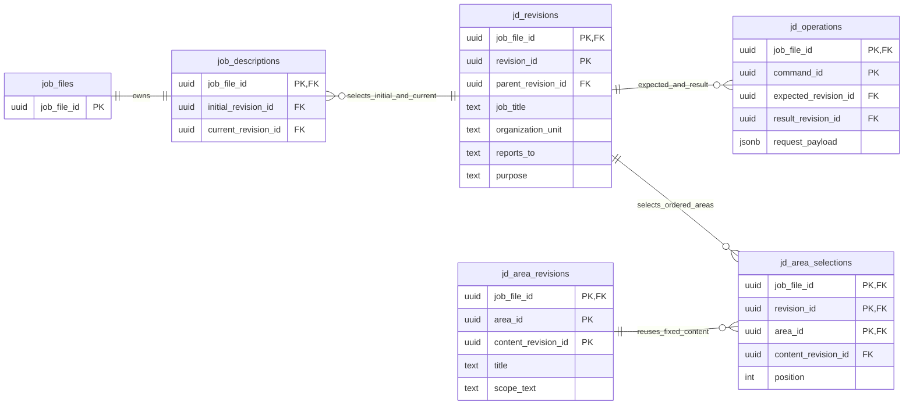
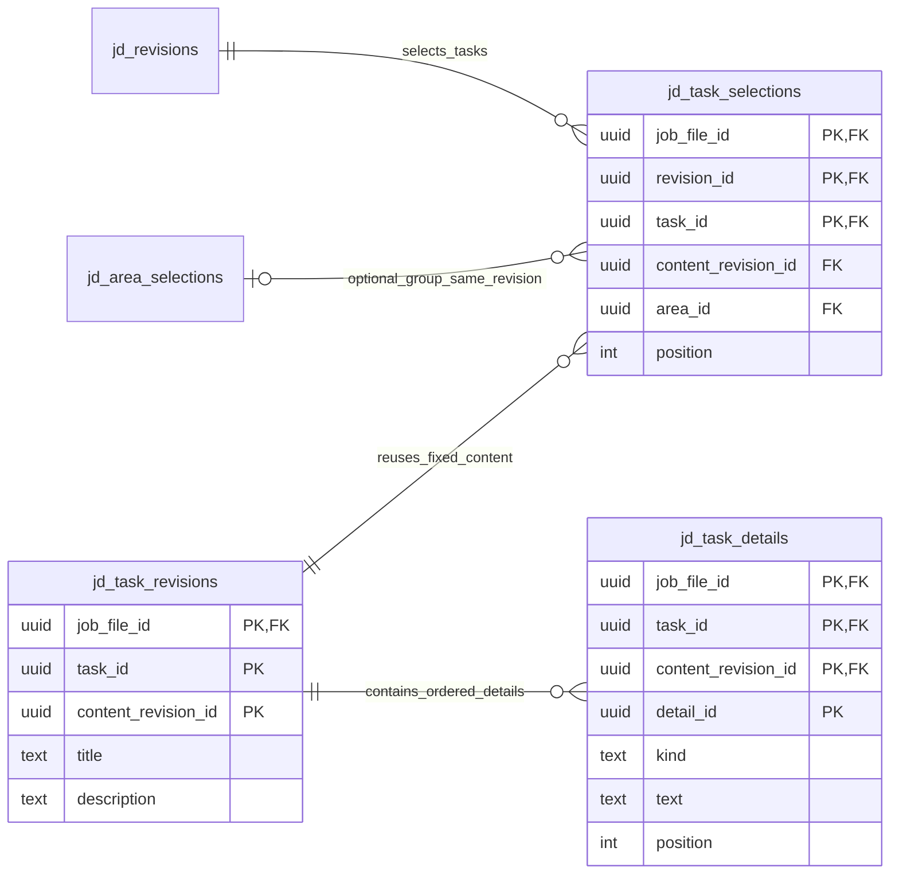
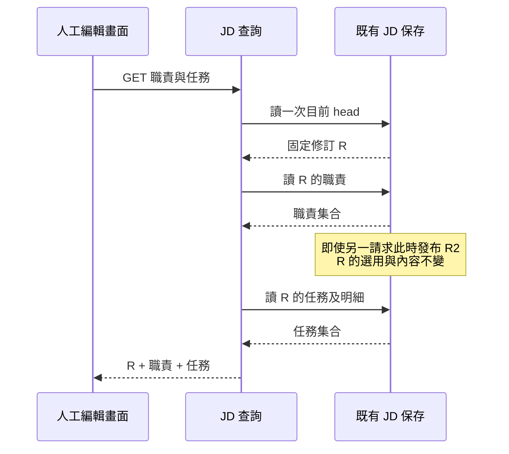
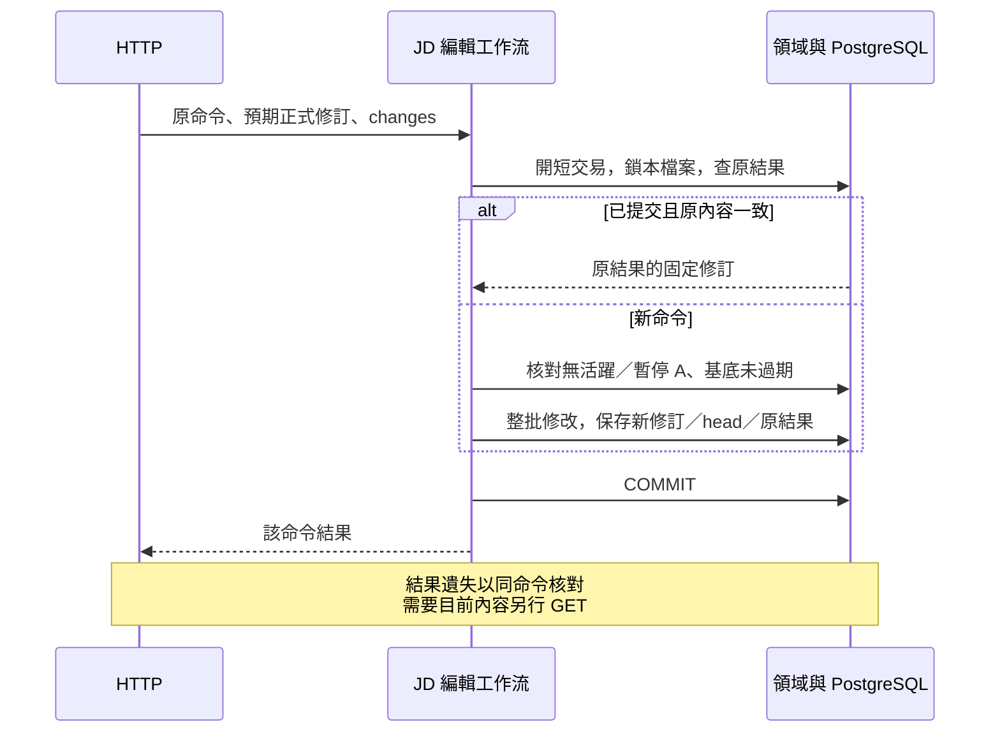

# JD 保存接線

- 狀態：**T03 profile、職責／任務後端及人工 UI 已實作；驗證依 T03 證據，整體未完成**。2026-09-29。本文只維護 JD 的實際保存、交易與讀寫接線，不重訂欄位語意或模型工具。
- 上位契約：[JD 欄位指南](../specs/2026-09-09-jd-field-and-writing-guide.md)、[JD 工具覆蓋](../specs/2026-09-29-jd-model-tool-contract-review.md)、[資料接線 §4](data-and-contracts.md#4-jd關聯式候選來源與正式完成)。實測及下一步見 [T03 證據](../plans/2026-09-29-target-rebuild/evidence/t03-relational-jd.md)。

## 1. 本切片範圍與程式責任

目前有 profile 四個欄位的正式保存：`job_title`、`organization_unit`、`reports_to`、`purpose`，以及職責／任務集合、獨立成果／要求的人工讀寫與排序。欄位意義沿指南；檔案名稱／員工姓名留在職務檔案，不複製進 JD。人工 UI 接線見[基本資料](interface-and-delivery.md#12-t03-基本資料編輯的讀取基底與恢復)及[職責／任務](interface-and-delivery.md#13-t03-職責與任務的人工編輯)。K／S、Agent 候選、依據與核對尚未交付；不能把這些人工正式端點當作 A 寫入捷徑。

| 責任 | 已實作位置 |
|---|---|
| 純值、明確局部修改與不變量 | [models.py](../../apps/api/src/caliburn/features/job_description/models.py)；不依賴 ORM／HTTP |
| 原結果核對、修訂與欄位用例 | [service.py](../../apps/api/src/caliburn/features/job_description/service.py)；參與呼叫方交易，不 commit |
| 正式頭、固定修訂、原操作 SQL | [persistence.py](../../apps/api/src/caliburn/features/job_description/persistence.py) |
| 固定正式內容查詢 | [queries.py](../../apps/api/src/caliburn/features/job_description/queries.py)；GET 不偷偷建立資料 |
| 同版職責／任務組合讀取 | [work_queries.py](../../apps/api/src/caliburn/features/job_description/work_queries.py)、[jd_work.py](../../apps/api/src/caliburn/transport/http/jd_work.py)；先固定 head 一次，再沿既有查詢投影，無新儲存 owner |
| 檔案隔離、人工准入及一次提交 | [jd_editing.py](../../apps/api/src/caliburn/workflows/jd_editing.py)；沿既有檔案鎖與 executions，不重建鎖定系統 |
| HTTP 驗證／錯誤投影 | [jd_profile.py](../../apps/api/src/caliburn/transport/http/jd_profile.py)；無業務 SQL |
| 職責值、用例、固定內容／排序 | [areas.py](../../apps/api/src/caliburn/features/job_description/areas.py)、[area_service.py](../../apps/api/src/caliburn/features/job_description/area_service.py)、[area_persistence.py](../../apps/api/src/caliburn/features/job_description/area_persistence.py)；仍屬同一 JD feature，非另套保存服務 |
| 職責 HTTP 與共用 workflow 注入 | [jd_areas.py](../../apps/api/src/caliburn/transport/http/jd_areas.py)、[jd_dependencies.py](../../apps/api/src/caliburn/transport/http/jd_dependencies.py)；與 profile 共用准入／交易責任 |
| 任務與獨立明細的值、變更計算 | [tasks.py](../../apps/api/src/caliburn/features/job_description/tasks.py)、[task_changes.py](../../apps/api/src/caliburn/features/job_description/task_changes.py)；先計算完整合法結果，無 DB／HTTP 相依 |
| 任務用例、保存與 HTTP | [task_service.py](../../apps/api/src/caliburn/features/job_description/task_service.py)、[task_persistence.py](../../apps/api/src/caliburn/features/job_description/task_persistence.py)、[jd_tasks.py](../../apps/api/src/caliburn/transport/http/jd_tasks.py)；沿同一 JD workflow、head 與 operation，不另造服務／交易平台 |
| 新建檔案連同空 JD／開場保存 | [job_files.py](../../apps/api/src/caliburn/workflows/job_files.py)；重送建立不重設 JD |

## 2. 固定修訂與目前正式頭

以下為**已實作資料關係**，非完整未來 schema。`job_files` 是既有 owner；圖的複合識別均含 `job_file_id`。簡化屬性只列識別／關係及已實作欄位，完整 DDL 以 [0005](../../apps/api/migrations/versions/0005_jd_profile_revisions.py)及 [0006 migration](../../apps/api/migrations/versions/0006_jd_area_selections.py)為準。

- `job_descriptions` 選初始與目前正式修訂；初始身分不改。固定修訂的父修訂、head、操作結果均以**同檔案的複合 FK**約束，不能指到另一檔案。
- `jd_revisions` 保存四個獨立文字欄位，不把整份 JD 存 JSON／Markdown。修訂與原操作不允許 UPDATE／DELETE；空 JD 的四欄為 null，表示尚未提供，不是已確認沒有。
- 有內容改變才建立新修訂並移動 head。改回相同舊文字仍建立新的修訂身分；只設為目前相同值則沿用修訂，但原命令仍有可重送結果。
- `jd_operations` 保存原命令的預期基底、型別化修改與結果修訂。JSONB 是原操作意圖，不是第二份可編輯 JD；結果透過固定修訂取回，不複製一份完整結果正文。
- 每次改動只複製四個小欄位及職責／任務選用鍵、歸屬與排序；職責、任務內容未變就重用固定內容修訂，不引入內容定址、delta 或事件重播。任務內容修訂包含自身成果／要求，詳見 §2.2。後續其他集合沿此不變量接入，不可讓舊修訂讀可變最新子項，也不可無條件複製整份 JD。

UUID 是身分，不表示時間大小；先後由父修訂與原操作表達。這不是把 ORM 的版本計數器當作永久歷史，亦不是要求 LLM 填修訂號。

### 2.1 職責集合：身分、固定正文與排序分開

`area_id` 是職責身分，`content_revision_id` 是一次固定標題／範圍正文；每份 JD 修訂以 `jd_area_selections` 選定這些內容及順序。每個 JD 修訂對同一職責只能選一個內容修訂，同一位置只准一項，複合 FK 限同檔案。沒有將 JD 標題當身分，也不沿用 Memory 的同層 title 唯一規則。

- 新建在末尾，`title`／`scope_text` 至少一個非空；未知欄位可 null，不硬造職責內容。這是沿既有 JD 草稿的合法內容界線，不要求兩欄必填。
- 改內容保持 `area_id`、新增固定內容修訂；未指定欄位保留，指定 null 明確清空，但不能清成無內容。改回先前文字仍有新修訂。
- 排序只改選用順序、不複製正文；放到已在的位置不新增 JD 修訂。HTTP 以 `before_area_id` 選相鄰目標，null 放末尾；不能指定別份 JD 的物件或任意 position。
- 刪除只移除新 JD 的選用；先前正式修訂、原操作結果及正文仍可回查。同名重建是新 `area_id`，不偷接舊身分。
- profile 修改必須複製原職責選用；職責修改必須保留 profile。讀取先固定一次 JD head，再依固定選用讀內容，不以多次 latest 查詢拼出混版。

固定內容／選用禁止 UPDATE／DELETE。正式初始／目前 head 及已保存操作結果對應的修訂也禁止事後追加選用；新選用必須在同一短交易、採用 head／保存原結果**之前**完成。這是目前人工修改路徑的歷史保護，不代表 DB 管理員任意 SQL 都被業務授權；T08 接 A 正式採用時須延伸相同保障，不能漏掉新的採用途徑。

刪職責已在同一短交易將存活任務轉為未歸屬，保留內容與明細身分；追加於既有未歸屬任務之後，維持原組內相對順序，不作 cascade delete。舊操作回讀仍得到當時的職責歸屬。結構操作伴隨跨項目必要內容修訂的完整模型契約仍由 T07 接；不能把目前單純人工刪組端點宣稱為完整模型工具。

### 2.2 任務內容、獨立明細及歸屬

以下為第四切片已實作關係，與上圖共用同一份 `jd_revisions`、職責選用及原操作；不是第二套版本服務。完整 DDL 見 [0007 migration](../../apps/api/migrations/versions/0007_jd_task_selections.py)。

- `task_id` 是穩定身分，`content_revision_id` 固定標題、敘述及其兩組明細。`title`／`description` 至少一個有內容；成果／要求均可空集合，不要求湊成一對、不以空白占位。`detail_id` 在同任務中保持身分，為後續逐筆來源與操作留下精確目標。
- 明細以關聯列保存，不塞 JSON 正文；`kind` 分 `outcome`／`requirement`，各自排序，不能跨組或跨任務移動。修文字或自身明細／明細順序才建立新任務內容修訂，複製的是**該任務的固定小型內容集合**，不是所有任務／整份 JD。此為有界 aggregate 選擇；沒有提前建立每種明細各自的通用版本平台。
- 任務歸屬與排序在 `jd_task_selections`，不是正文的一部分。只移動任務不新增內容修訂；其明細與未來來源／能力關係不得因此換身分。移動可帶同一任務所需的文字／明細調整，一次全成或全拒；不是任意跨項目 batch。
- `area_id = null` 表未歸屬。FK 要求非空群組存在於**同檔案、同 JD 修訂**，不僅存在於歷史正文。`UNIQUE NULLS NOT DISTINCT` 同時保障未歸屬與各職責組內的位置唯一。人工讀取依未歸屬、職責順序、組內順序投影；每組位置獨立。
- 固定任務內容、明細與選用禁止 UPDATE／DELETE。已被選用的任務內容禁止事後追加明細；已採用的 JD 版本禁止追加選用。建立順序為新內容 → 明細 → JD／職責選用 → 任務選用 → head／原結果，同一交易提交。
- profile／職責改動都保留任務選用；任務改動保留 profile／職責。刪任務只從新稿移除選用，歷史內容與明細仍可重建；同名重建是新身分。現在尚未實作 K／S 與來源，不能宣稱相關連結效果已通過。

任務讀取先取得一個固定正式修訂，再讀該修訂的任務／明細；兩次 SQL 查詢不分別讀 latest，不會拼接新舊稿。新修改受相同檔案列鎖與基底檢查保護。

### 2.3 組合畫面使用同一修訂

`GET /jd/work` 給人工編輯畫面一組固定 `revision_id`、`areas`、`tasks`。不能由前端分別讀取 `/areas`、`/tasks` 的 latest 再拼接，否則另一請求可能在兩次讀取之間改歸屬或刪職責。組合讀取只捕捉 head 一次，之後都讀不可變修訂；不需要為此另存投影表、鎖住人工編輯或提高整個 App 的 isolation level。

HTTP Schema 透過 [JSON Schema `$ref`](https://json-schema.org/understanding-json-schema/structuring)重用既有 Area／WorkTask 定義；官方 Python／TS 生成器及 Ajv 實測跨檔引用，不手抄第二份欄位規格。此為人工 transport，並非模型的完整 JD／map 工具。

## 3. 人工編輯與原結果接續

HTTP shape 的唯一來源為 [request schema](../../apps/api/contracts/http/revise-jd-profile-request.schema.json)與 [view schema](../../apps/api/contracts/http/jd-profile-view.schema.json)，生成 Python／TypeScript；使用路徑見 [backend README](../../apps/api/README.md)。不是本輪新增的模型工具 schema。

HTTP 的 `expected_revision_id` 是使用者畫面讀到的正式基底，`command_id` 辨認同次送出。新的修改不得默默換成最新基底重試；保存確認不明時，保留原命令及原內容重送。`set_field` 只提供指定欄位的完整新值；清空用 `clear_field`。未指定欄位保留；同命令重複指定同一欄位拒絕，不猜先後覆蓋。blank／NUL／錯欄位在修改前拒絕。

職責 HTTP 的唯一 shape 見 [edit request](../../apps/api/contracts/http/edit-jd-areas-request.schema.json)及 [collection view](../../apps/api/contracts/http/jd-areas-view.schema.json)。每命令有界修改一個職責，可同時修改其標題／範圍；整批全成或全拒。回原結果的集合投影不暴露內部內容修訂，也不是要模型傳 command／revision。與 profile 共用 `jd_operations` 命令空間，不能用同 ID 換成另一類 JD 動作。

任務 HTTP 沿相同命令與基底規則，唯一形狀見 [task request](../../apps/api/contracts/http/edit-jd-tasks-request.schema.json)及 [task view](../../apps/api/contracts/http/jd-tasks-view.schema.json)。建立、局部修訂、移動／排序、刪除及自身明細增刪改均由型別化動作承接；同次重複指定同一欄或既有明細拒絕。兩組明細回傳各自的穩定 ID／文字，不洩露內容修訂；原命令恢復透過其原 JD 修訂重建，不能用目前集合冒充。這是人工 transport，不新增模型入口。

工作流先鎖檔案再查原結果。已有結果且 payload 一致就回原修訂，**不因目前已有 A 或更新稿而重新寫入**；命令身分被拿來送不同內容則拒絕。新命令才核人工准入及 head。與 A 輸入准入共用檔案鎖順序，檢查和寫入在同一交易內；活躍／暫停 A 阻止新的人工 JD 修改，背景 Memory 不阻止。

所有變更、新修訂、head 與原操作同次提交；中途例外全退。例：命令 P 產生 R2，後來另一命令產生 R3，重送 P 仍回 R2，GET 則回 R3。沒有在此新增未知 COMMIT 的自動 retry loop，也不能用 GET 的 R3 冒充 P 的結果。程序故障／COMMIT 確認遺失的完整跨層驗收仍屬 T12；目前真 PG 回歸包含提交前例外及提交後原命令重送。

## 4. 初始化、演進與保證界線

新建職務檔案、開場與空 JD 同一短交易；任一失敗不留下半套檔案。0005 為已存在的**新目標 0004** 檔案補一份空 JD，重跑 upgrade 不重建；沒有讀舊 production／搬舊資料。已知檔案卻缺少 JD head 是保存不一致，不在 GET 偷修成空白；缺 schema 的啟動仍 fail fast。

資料庫保障複合 FK、唯一命令、固定修訂不可改與交易原子性；領域／工作流負責允許欄位、人工准入與新基底檢查。這不宣稱 DB 管理員任意 SQL 都符合業務，也不以檢查通過表示文字是員工事實。人工編輯造成的核對狀態與來源固定鏈路在 T07 接入，不在此自動確認。

後續 A 必須寫候選而非本 HTTP 的正式 head；A 完成時再與正式訪談、答覆及背景意圖同次發布（T08）。已建立的純欄位規則可共用，但人工准入和候選資格不可被一個忽略差異的 `save` 合併。當集合、候選與來源落地，更新本頁及相應圖，不另建第二份 JD 儲存權威。

## 5. 研究依據與本案取捨

2026-09-29 核對官方文件：

- [PostgreSQL constraints](https://www.postgresql.org/docs/current/ddl-constraints.html)：複合主鍵／FK 可維護資料關係；本案用它限制同檔案修訂，不以 Python「先查存在」代替約束。
- 同頁的 `NULLS NOT DISTINCT` 用於任務未歸屬排序，避免一般 UNIQUE 把 null 視為可重複而留下衝突位置；跨列／表限制用 FK／UNIQUE，不塞入跨表 CHECK。SQLAlchemy 2.1.1 已安裝 dialect 原碼的 UniqueConstraint `nulls_not_distinct` 支援、實際 migration／metadata 比對及真 PG 反例共同驗證，沒有為此加自訂排序引擎。
- [PostgreSQL row locking](https://www.postgresql.org/docs/current/explicit-locking.html)：列鎖在交易結束釋放；本案延用已建立的檔案列鎖，把准入與正式修改放同一短提交，不持鎖等待模型或人。
- [SQLAlchemy version counter](https://docs.sqlalchemy.org/en/21/orm/versioning.html)：ORM counter 的 flush 衝突檢查不是自動保留完整歷史。因此採 JD 自己的固定修訂／head／原結果，不增加通用版本平台。
- [SQLAlchemy INSERT FROM SELECT](https://docs.sqlalchemy.org/en/21/tutorial/data_insert.html#insert-from-select)：profile 改動由既有固定選用複製小型關係鍵，不先把全部正文讀回再寫一份。職責新增／修訂才寫新正文，其餘選用重用固定修訂。
- [datamodel-code-generator enum 命名](https://datamodel-code-generator.koxudaxi.dev/cli-reference/field-customization/#capitalize-enum-members)：生成 Python enum 成員用大寫常數，避免 `title` 與 `str.title` 方法衝突；JSON 的 `title` 等 wire 值不變。修生成器而非手改 DTO，原 schema／DTO round trip 及生成比對一起回歸。

上述是官方機制；**固定修訂、職責內容／選用分離與重送順序是 Caliburn 的有界實現選擇**，不是聲稱所有大廠都用此 schema。沒有新增套件或框架，真 PG 證據見任務紀錄。
