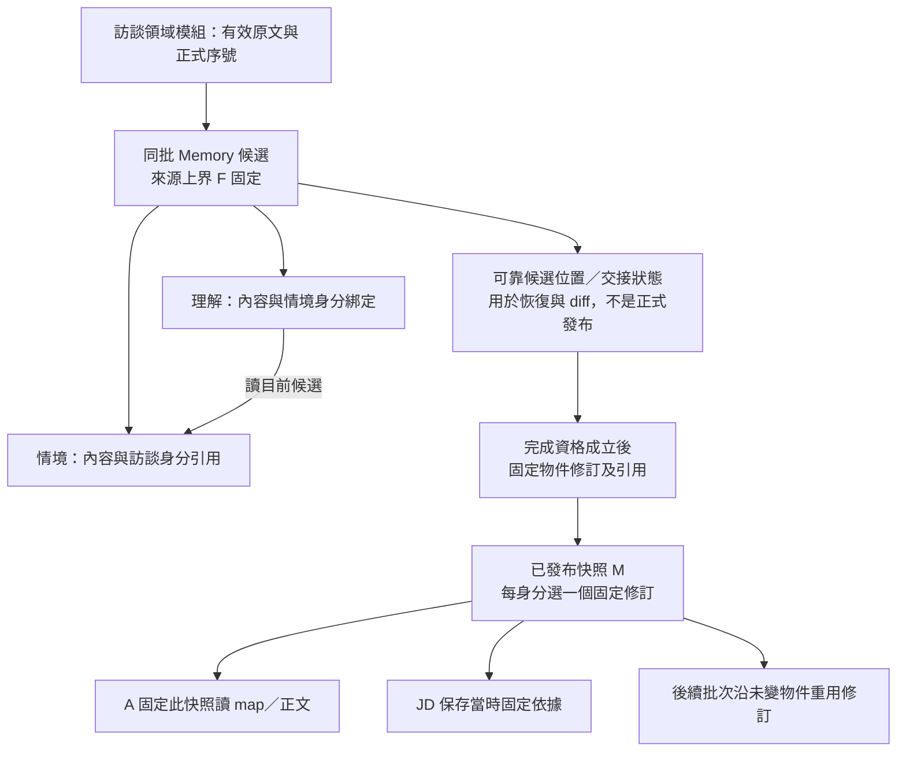
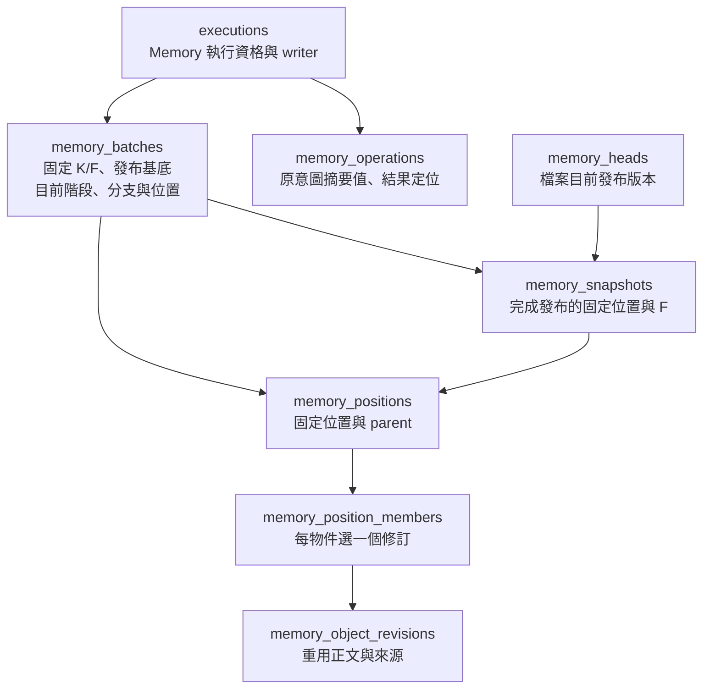

# Memory 保存接線

- 狀態：**現行 Memory 保存責任** 。候選、固定修訂、角色交接與背景發布依下列機制運作。最終失敗後，正式訪談再前進三輪才允許一次新批次；此解除政策仍待確認，且未在真長旅程自然觸發，見[執行接線 §7](agent-execution.md#7-memory-背景工作)。驗證見[保存](../history.md#source-8181e62e2e98ac941ed9)與[背景工作](../history.md#source-14d692c99a98b4e9954e)。
- 上位責任：[資料保存 §2–4](../architecture/persistence.md#2-不可變修訂與發布快照)、[B1／B2 生命週期](../specs/2026-09-25-b1-b2-information-gap-lifecycle.md)、[內容與引用修改](../specs/2026-09-27-memory-object-update-tool-contract.md)、[title 解析](../specs/2026-09-27-memory-read-and-source-navigation-contract.md#4-定位與權限界線)。接線總則見 [data-and-contracts §3](data-and-contracts.md#3-memory可變工作稿與固定快照不是兩個相反模型)。

## 1. 實作責任與純規則

`features/work_memory` 是候選、物件修訂、固定快照及原操作的唯一負責寫入的領域模組。Agent 工具只翻譯模型意圖、投影結果；背景 workflow 管交接與執行資格，不另存可寫 Memory；checkpointer 留位置與接續，不持有第二份可修改正文。

候選操作共用下列純規則：

- 三個內容欄位均為必要且非空白的字串；保留原文，不 trim、大小寫折疊或 Unicode 正規化。Markdown `body` 由[正文編輯器](memory-body-editing.md)計算；領域只接收已計算、仍須合法的結果，不提供模型整文覆寫捷徑。
- 引用按穩定內部身分作集合增刪；保留未指定成員。重複新增已有關係是無效果；移除不存在的關係、同次又加又移除或新增不允許來源均拒絕。移除最後一筆合法，與無效來源不同。
- 標題在 App 的單層 map 內精確映射為 ID，CRUD 與引用進入資料介面後用 ID；歷史與已綁定原操作不重新解析 title。純規則只檢查傳入 map，不自行查其他層。

純值／變更放 `models.py`／`changes.py`，不依賴 ORM、HTTP、LLM 或生成 DTO。這些函式**不證明** 來源已正式成立、在本批 F 以內或角色有權；service 由訪談領域模組 和批次綁定取得合法集合。

### 1.1 正式來源範圍接線

`work_memory/sources.py` 透過 `interviews/queries.py`，重用現有正式訊息保存，不直接讀別的領域表，也不複製原話：

- `bind_memory_source_window` 只供新批次準備：接收原整理要求的員工來源身分，精確解出正式序號 F；K 由呼叫方選定的已發布快照提供。F 與非零 K 均須為同檔案的有效員工發話；首次 K=0。查詢最大序號只用於驗證來源資格，**不是拿最大序號當 F** 。有效要求 F≤K 返回「已涵蓋」，不另造空批。
- `MemorySourceWindow` 明列固定檔案、來源身分及 `(K,F]`；不是模型可填欄位，也不另負責資料保存。批次保存／恢復沿原值，不在每次讀取、交接或恢復重呼 bind 取得新範圍。
- `read_required_interviews` 共用既有近期歷史組裝，保留完整 `(K,F]`、真實角色及前置語境規則；不含 F 之後即使已正式保存的答覆。`read_reference_sources` 可回讀 `≤F` 的更早有效來源，空引用合法，不把必處理新區間當成唯一可引用範圍。
- 訪談領域模組 的 `read_interview_sources` 在 SQL 同時限定檔案、來源 ID 與上界；有一個來源不存在、未正式化、跨檔案或超界就整組拒絕，不返回部分結果。這是新增的內部 ID 查詢，**不是新增模型工具** 。

來源範圍綁定與後續候選／發布共用 §2.2、§5 的批次資格；來源查詢本身不負責背景調度或 Graph 恢復。

## 2. 保存表示：固定修訂，而非資料庫舊列

採既定 PostgreSQL＋SQLAlchemy／Alembic，以明確新增不可變修訂、保存選用來表達歷史。**不以 MVCC 舊列、ORM 版本計數器或每次完整正文複製充當 Memory 發布快照。** 下圖呈現保存、發布及消費路徑；schema 見 §2.1–2.2。

保存拆清楚三種必要含意，不要求一種含意一張表或一個服務：

| 含意 | 必須保存／辨認的資訊 | 不能偷換成 |
|---|---|---|
| 候選目前位置 | 本批目前成員、內容修訂、身分綁定與有效執行分支；先前位置可依恢復／diff 需求取回 | 最新正式 Memory；或每次由 LLM 重建全文 |
| 物件固定修訂 | 當時內容與固定下層來源；未變可重用，變更再改回仍有新修訂身分 | 只存內容 hash、只存標題，或以相同字串合併修訂歷史 |
| 發布快照 | 選定各層固定修訂、正式訪談範圍與完整引用關係，並保留原發布結果 | DB transaction snapshot、checkpointer 顯示 END 或某一層完成 |

正文和小型引用／選用分開保存：只有正文實際修改時新增所需內容；引用換版但正文未變時重用正文，仍產生能表達新固定關係的物件修訂。不引入跨物件內容定址或 Git delta；相同正文的跨歷史去重不在目前實作範圍。**身分／修訂與正文儲存共用是兩件事。**

候選關係維持 stable object identity；B1 改情境不要求 B2 remove/add 相同關係。發布固定化時才把保留關係解析為本版選用的情境修訂；若其變了，即使理解正文未變，也不能沿用指向舊情境的固定理解修訂。B2 對當前交接完成分析是發布資格，App 不以零文字 diff 代替它。

### 2.1 固定物件修訂

Migration `0011_memory_object_revisions` 與 `revision_persistence.py` 維護下列關係；所有身分／FK 均包含職務檔案範圍。這些是**固定儲存表示，不是 B1／B2 操作中的候選關係表** 。

- `revisions.py` 定義不依賴 ORM 的固定修訂值；`revision_service.py` 接收完整內部編輯結果及明確的原修訂，不是新增整文覆寫 tool。工具／候選服務仍須先綁定當前位置、目標 ID、角色與原操作。
- 同正文的標題、描述或引用調整重用 `body_id`；內容與固定來源完全未變則沿用原修訂。正文改動後又改回，仍是新的修訂與正文列，不以相同文字冒充舊版本。未做跨歷史或跨物件內容去重。
- 情境只能引用正式訪談；理解只能引用同檔案情境的固定修訂。同一理解修訂對同一情境身分至多一個來源修訂；零來源合法。Service 沿固定來源驗 `≤F`，SQL 以 FK／層別限制拒絕未正式化、跨檔案、錯層或不存在的來源。
- 保存於呼叫方的同一短交易：建立修訂標頭 → 寫齊來源 → 封存 `is_sealed=true`。DB 在交易完成時確認新修訂已封存；封存後正文、欄位、引用均不可改寫，也不能追加來源。讀取只返回完整封存修訂。**封存只是固定儲存完整性，不是 Memory 發布、B2 分析完成或候選可見性。**
- 不增加自己的 commit、候選 head 或原操作回執。外層失敗時新增物件／正文／修訂／來源一起撤回；這個 primitive 不能單獨承諾工具重入冪等。A／JD 的正式快照入口與 B1／B2 權限由 §2.2 的 service 接入，不直接暴露此歷史讀取函式給模型。

### 2.2 候選位置、批次與正式快照

Migration `0012_memory_candidates_snapshots` 重用 §2.1 的正文／固定修訂；沒有第二份可寫正文，也不將 title 當 SQL 修改目標。

| 責任 | 實作位置 | 保證／界線 |
|---|---|---|
| 內部型別與分層權限 | `candidates.py` | App 綁定檔案、execution、generation、stage、position；不是模型參數。B1 只讀寫情境；B2 讀情境、讀寫理解。 |
| 工作稿及原操作 | `candidate_service.py`、`candidate_operations.py` | create／revise／delete 全成全拒；有效位置前移及原結果同交易。原意圖用穩定序列化的 SHA-256 判相等，結果保存必要身分／位置，不重複存長篇 Markdown。 |
| 交接、回復與發布 | `candidate_lifecycle.py` | 交接只允許 B1 → B2，不允許 B2 回交；恢復只採本批可證明的原位置，換 generation／stage 阻擋遲到寫入。發布固定化理解來源並保存完整快照。 |
| 可見資料投影 | `candidate_queries.py` | 候選捕捉當前位置後解析身分綁定；正式入口要求 snapshot，沿其固定修訂。map 不讀正文。 |
| SQL 與保存約束 | `position_persistence.py`、`batch_persistence.py` | 同檔案 FK、每身分一修訂、位置封存、同層精確 title 唯一及引用來源存在。快照要求精確來源 pair 與訪談上界；固定位置、快照與操作結果不可改寫。 |
| 跨領域短交易 | `workflows/memory_candidates.py` | 鎖檔案、驗既有 writer、呼叫領域操作；發布與 execution 完成共同提交。adapter／領域不自行 commit。 |

每次內容修改只新增必要修訂與輕量選用列。位置沿 parent 保存可恢復路徑；回復必須在本批 base 到目前位置的路徑內，且完整階段座標曾由真實原結果提供，不能只拿一個存在的 position ID 偽造 B2 資格。候選讀取使用目前 stage，會看到該 stage 內後續成功操作；新修改則須符合精確目前位置。這兩種檢查不同，不把模型歷史文字改成 latest。

`memory_positions.is_sealed` 只表示選用集合完成、不可再加列；不表示已分析或已發布。候選理解可以保存舊固定來源 pair，但**目前讀取依 source object ID 解析該位置選用** 。正式快照不能如此模糊解析：發布先建立需要的新理解修訂，然後存下所有路徑一致的精確 pair。這使動態候選綁定與歷史固定引用各有明確責任。

Memory 領域模組 不保存原生模型 request，也不提供全歷史模型入口。原操作摘要只能核對同一意圖，不能重建遺失的工具參數；完整 native request 的可靠保存、工具配對及 Graph 接續由[共用執行](agent-execution.md)承接。

## 3. 交易與讀取邊界

沿現有檔案隔離、Memory execution 資格、短鎖與呼叫方 transaction，不建第二套跨 Agent 鎖／UnitOfWork。候選操作原意圖、採用位置及原結果共同提交；模型、patch 大額純計算或重試等待不持有 SQL transaction。讀固定位置後計算、提交前再核位置／資格，不能把最新稿偷偷代入原命令。

保存與讀取維持下列不變式；資料庫測試不證明模型語意品質：

1. 本批有效來源邊界來自訪談領域模組；pending／取消來源、另一檔案或超出 F 皆不能建立引用。快照的訪談層指向既有不可改原文，不複製正文；F 指最後有效員工訊息，不以最大序號猜。
2. 同層目前 title 唯一；App 精確解析及 DB 封存約束採相同相等語意。使用明確 `COLLATE "C"`，不因部署環境而改變字串比較；SQL 層仍以 ID 定位，不用 title 作 UPDATE／DELETE 目標。
3. 情境刪除與候選入邊解除同交易，理解本身保留；B1 結果不外露理解資料。歷史快照不改寫，不用歷史 FK cascade 清除正式來源。
4. 候選修改後 current read 取得最新已成立狀態；單次物件／map 投影捕捉同一位置。A 只能沿已發布的固定 snapshot 查詢，不能混入候選。
5. ①／②恢復沿可定位候選；新 writer／回退分支使遲到修改失效。同批只依 B1 → B2 前進，B2 恢復沿自己的原進度，不重跑已完成的 B1。
6. ③在同一短提交中保存固定選用／關係、涵蓋與原結果；正式 head 最後採用。已成立結果重入回原快照，不重新發一版；未知提交不當未執行。

不另加發布前語意 reviewer、格式修補 loop 或最少引用數。權限與結構在每次操作維持；DB 快照結構 gate 只防止不一致資料落地，不推斷 B2 是否真正理解。發布入口只接受目前 B2 階段，背景 workflow 在確認該階段完成後呼叫，不能將 read 次數、零 diff 或正常返回一個工具當作完成。

系統 discard 與 execution failed 同交易；失敗後若原操作已提交，只回原結果，不能再開始另一筆放棄。Memory 沒有使用者取消／暫停端點。發布確認遺失時查原 snapshot；COMMIT 前失敗則整筆撤回，原候選仍可恢復。保存與可辨識位置不承諾未保存的串流／推理可回復。

新要求的 F 已被正式 Memory 涵蓋時，`start_memory_candidate` 不建立空候選或快照，但會在既有 `memory_operations` 留下綁定原來源的「已涵蓋」結果，與 execution completed 同交易。重入先回原結果再判定是否需新工作；同 execution 換來源拒絕。操作表因此直接 FK 到 execution，而非要求每筆結果必先有 batch。背景調度可先篩掉已涵蓋要求，仍不能取代此入口的提交恢復保證。

## 4. 官方機制、比較與取捨

保存選型依據：

- [PostgreSQL MVCC](https://www.postgresql.org/docs/18/mvcc-intro.html)保障交易讀取可見性；[VACUUM](https://www.postgresql.org/docs/18/routine-vacuuming.html#VACUUM-FOR-SPACE-RECOVERY)會回收不再需要的舊列。**推論：** 不能把它當已發布 Memory／JD 依據的永久歷史服務。保留那些修訂必須是應用資料契約。
- [SQLAlchemy version counter](https://docs.sqlalchemy.org/en/21/orm/versioning.html)主要在 flush 核對並行修訂，不自動保存本案完整來源圖；其[官方 temporal row 範例](https://docs.sqlalchemy.org/en/21/orm/examples.html#versioning-using-temporal-rows)示範以 INSERT 新列保留原版本。借鑑不可變修訂原則，但不直接引入攔截全 ORM 修改的通用 event hook：本案兩層發布、來源上界與原操作要由明確用例控制。
- [PostgreSQL constraints](https://www.postgresql.org/docs/18/ddl-constraints.html)提供 FK／UNIQUE／CHECK；跨列存在性使用 FK／UNIQUE，不寫查其他表的 CHECK。名稱比較須核[collation 的 deterministic 與 non-deterministic 區別](https://www.postgresql.org/docs/18/collation.html#COLLATION-NONDETERMINISTIC)，本案以精確 Unicode／空白與唯一限制的 PG 反例核對。

這些是成熟公開機制及本案取捨，不宣稱單一廠商範例就是全業界唯一共識。目前無具體需求支持另加 graph DB、版本套件、通用 event sourcing 或永久 diff 資料庫；既有 PostgreSQL 足以承接已定資料形狀，仍須用真 PG 反例證明實作正確。

固定修訂封存使用 [PostgreSQL deferred constraints](https://www.postgresql.org/docs/18/sql-set-constraints.html)允許 constraint trigger 延至提交檢查；普通 CHECK 不提供跨列集合完成保證。[行鎖](https://www.postgresql.org/docs/18/explicit-locking.html#LOCKING-ROWS)在交易結束釋放。因此以短交易內的來源組裝＋封存防止「歷史修訂事後新增來源」與「只有半套標頭即提交」，不把模型分析期間包進 transaction。這是針對不可變多列 aggregate 的本案實現，不是要求所有產品資料都增加封存欄位。

候選／發布重入另核 [AWS Builders' Library：安全重試](https://aws.amazon.com/builders-library/making-retries-safe-with-idempotent-APIs/)：使用 caller 提供的原操作身分、同次保存效果與去重結果，且重入應回語意等價結果；只保證不重寫、卻回「已存在／已結束」會讓呼叫方仍無法確認。Caliburn 因此也保存「來源已涵蓋、無新批次」的原結果；摘要 hash 僅核對相同操作的 payload，不拿內容相同推定兩個新命令是同一意圖。不擴張成通用重試平台。

## 5. 候選、交接與發布接線

完整路徑為：有效來源 → B1 候選情境 → B2 候選理解 → 固定快照讀回。沿用 §2.1 的固定正文，不另建第二份正文體系：

- 候選位置只保存各身分的修訂選用。理解候選的來源集合可從所選理解修訂取得情境 ID，再沿**同一候選位置** 解析目前情境；不直接把儲存的舊來源修訂當成目前候選來源。固定歷史 read 則完整沿原 `(object_id, revision_id)`，兩條讀取路徑命名／型別須區分。
- B1 修改情境只前移其選用，保留理解的身分綁定；刪除情境時，同次為受影響理解產生解除該綁定的新修訂、重用正文，再一起前移位置。原固定列不改。B1 的投影不包含理解資訊，App 的確定性解除不代表 B1 已分析理解。
- 發布使用確定的候選位置，將理解保留的情境身分解析成該版情境修訂；關係換版時新建理解修訂。先前歷史及未變正文重用，不能把不一致的候選選用直接當正式快照。
- 准入／writer fencing 重用 `executions`；候選回退用 generation 使被放棄分支失效。Memory 自己保存原意圖摘要值及結果，參考既有 JD 用例的恢復模式，不借用 JD 的操作表、不造通用收據框架。完成交接、發布與終局狀態由 workflow 在同一短交易協調。
- 必測「候選看新／歷史看舊／發布成同一鏈」、刪除多個理解共用情境的全成全拒，以及改回舊字串、舊 writer／回退分支、發布確認遺失。B2 完成須綁定當時情境階段；不能由固定修訂封存、read 次數或零 diff 推定語意完成。

採此表示的原因是重用既有固定內容與身分，同時滿足候選動態綁定及歷史固定引用，沒有引入第二套可寫正文。一次 read 先捕捉位置再沿固定選用投影，避免 [Read Committed](https://www.postgresql.org/docs/18/transaction-iso.html#XACT-READ-COMMITTED) 下多次 latest 查詢看到不同提交；並行工作使用[各自的 AsyncSession](https://docs.sqlalchemy.org/en/21/orm/extensions/asyncio.html#using-asyncsession-with-concurrent-tasks)。官方機制支持此接法，具體 schema 是本案取捨，不是業界規定的唯一模型。

Memory 領域模組 負責保存及業務不變量；[模型工具](memory-tools.md)負責精簡投影、V4A 編輯及命令轉譯；[角色與背景 workflow](agent-execution.md#7-memory-背景工作)承接 B1／B2 接續及交接完成資格。所有發布快照及可達依據不自動清理；候選／checkpoint 保留沿上位規範，不另訂全產品過期時間。
