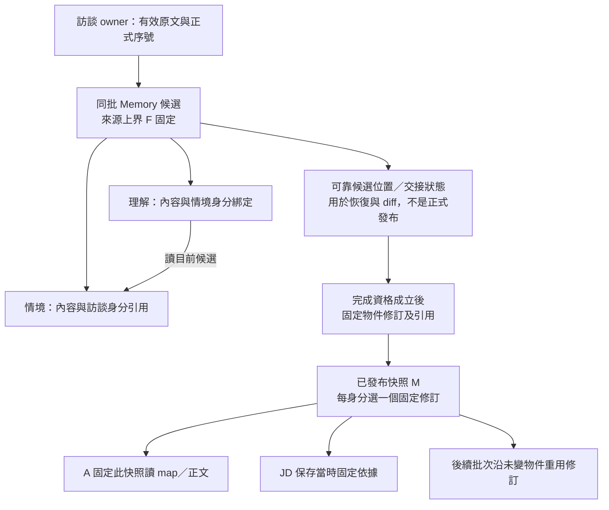
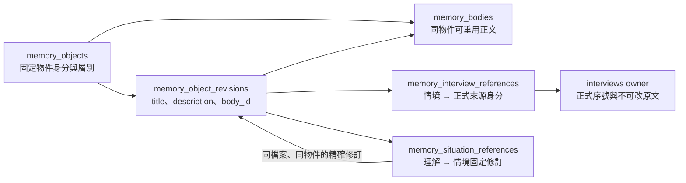

# Memory 保存接線

- 日期：2026-09-30；狀態：**T04 施工中；純規則、正式來源範圍及固定物件修訂已落地，候選／發布快照尚未交付**。精確證據與下一切片見 [T04 紀錄](../plans/2026-09-29-target-rebuild/evidence/t04-work-memory.md)。本頁維護實作映射，不另定產品規則或模型工具。
- 上位責任：[資料保存 §2–4](../architecture/persistence.md#2-不可變修訂與發布快照)、[B1／B2 生命週期](../specs/2026-09-25-b1-b2-information-gap-lifecycle.md)、[內容與引用修改](../specs/2026-09-27-memory-object-update-tool-contract.md)、[title 解析](../specs/2026-09-27-memory-read-and-source-navigation-contract.md#4-未決接縫與停止線)。接線總則見 [data-and-contracts §3](data-and-contracts.md#3-memory可變工作稿與固定快照不是兩個相反模型)。

## 1. 實作責任與第一切片

`features/work_memory` 是候選、物件修訂、固定快照及原操作的唯一業務 owner。Agent 工具只翻譯模型意圖、投影結果；背景 workflow 管交接與執行資格，不另存可寫 Memory；checkpointer 留位置與接續，不持有第二份可修改正文。

第一切片只落地下列純規則，不建立假 Memory API、發布端點或未完成的 schema：

- 三個內容欄位均為必要且非空白的字串；保留原文，不 trim、大小寫折疊或 Unicode 正規化。Markdown `body` 的編輯 adapter 在 T05 接；領域只接收已計算、仍須合法的結果，不提供模型整文覆寫捷徑。
- 引用按穩定內部身分作集合增刪；保留未指定成員。重複新增已有關係是無效果；移除不存在的關係、同次又加又移除或新增不允許來源均拒絕。移除最後一筆合法，與無效來源不同。
- 標題在 App 的單層 map 內精確映射為 ID，CRUD 與引用進入資料介面後用 ID；歷史與已綁定原操作不重新解析 title。純規則只檢查傳入 map，不自行查其他層。

純值／變更放 `models.py`／`changes.py`，不依賴 ORM、HTTP、LLM 或生成 DTO。這些函式**不證明**來源已正式成立、在本批 F 以內或角色有權；後續 service 必須由正式來源 owner 和批次綁定取得合法集合。

### 1.1 正式來源範圍接線

第二切片 `work_memory/sources.py` 透過 `interviews/queries.py`，重用現有正式訊息保存，不直接讀別的領域表，也不複製原話：

- `bind_memory_source_window` 只供新批次準備：接收原整理要求的員工來源身分，精確解出正式序號 F；K 由呼叫方選定的已發布快照提供。F 與非零 K 均須為同檔案的有效員工發話；首次 K=0。查詢最大序號只用於驗證來源資格，**不是拿最大序號當 F**。有效要求 F≤K 返回「已涵蓋」，不另造空批。
- `MemorySourceWindow` 明列固定檔案、來源身分及 `(K,F]`；不是模型可填欄位，也不是新的保存 owner。批次保存／恢復後續必須沿原值，不在每次讀取、回交或恢復重呼 bind 取得新範圍。
- `read_required_interviews` 共用既有近期歷史組裝，保留完整 `(K,F]`、真實角色及前置語境規則；不含 F 之後即使已正式保存的答覆。`read_reference_sources` 可回讀 `≤F` 的更早有效來源，空引用合法，不把必處理新區間當成唯一可引用範圍。
- 訪談 owner 的 `read_interview_sources` 在 SQL 同時限定檔案、來源 ID 與上界；有一個來源不存在、未正式化、跨檔案或超界就整組拒絕，不返回部分結果。這是新增的內部 ID 查詢，**不是新增模型工具**。

真 PG 已驗來源資格、延後啟動不擴張 F、K/F 角色、不以奇偶判定、空區間與早期來源回查；仍未實作背景要求保存、批次持久綁定、Memory 候選 CRUD 或發布。不能因這些查詢通過，就稱取消／恢復整體已完成。

## 2. 保存表示：固定修訂，而非資料庫舊列

採既定 PostgreSQL＋SQLAlchemy／Alembic，以明確新增不可變修訂、保存選用來表達歷史。**不以 MVCC 舊列、ORM 版本計數器或每次完整正文複製充當 Memory 發布快照。**下圖是 T04 整體施工設計；已落地的固定修訂 schema 見 §2.1，不將其餘接線當成已完成。

保存拆清楚三種必要含意，不要求一種含意一張表或一個服務：

| 含意 | 必須保存／辨認的資訊 | 不能偷換成 |
|---|---|---|
| 候選目前位置 | 本批目前成員、內容修訂、身分綁定與有效執行分支；先前位置可依恢復／diff 需求取回 | 最新正式 Memory；或每次由 LLM 重建全文 |
| 物件固定修訂 | 當時內容與固定下層來源；未變可重用，變更再改回仍有新修訂身分 | 只存內容 hash、只存標題，或以相同字串合併修訂歷史 |
| 發布快照 | 選定各層固定修訂、正式訪談範圍與完整引用關係，並保留原發布結果 | DB transaction snapshot、checkpointer 顯示 END 或某一層完成 |

正文和小型引用／選用分開保存：只有正文實際修改時新增所需內容；引用換版但正文未變時重用正文，仍產生能表達新固定關係的物件修訂。不引入跨物件內容定址或 Git delta；相同正文的跨歷史去重不是本片必需。**身分／修訂與正文儲存共用是兩件事。**

候選關係維持 stable object identity；B1 改情境不要求 B2 remove/add 相同關係。發布固定化時才把保留關係解析為本版選用的情境修訂；若其變了，即使理解正文未變，也不能沿用指向舊情境的固定理解修訂。B2 對當前交接完成分析是發布資格，App 不以零文字 diff 代替它。

### 2.1 已落地：固定物件修訂

Migration `0011_memory_object_revisions` 與 `revision_persistence.py` 維護下列關係；所有身分／FK 均包含職務檔案範圍。這些是**固定儲存表示，不是 B1／B2 操作中的候選關係表**。

- `revisions.py` 定義不依賴 ORM 的固定修訂值；`revision_service.py` 接收完整內部編輯結果及明確的原修訂，不是新增整文覆寫 tool。工具／候選服務仍須先綁定當前位置、目標 ID、角色與原操作。
- 同正文的標題、描述或引用調整重用 `body_id`；內容與固定來源完全未變則沿用原修訂。正文改動後又改回，仍是新的修訂與正文列，不以相同文字冒充舊版本。未做跨歷史或跨物件內容去重。
- 情境只能引用正式訪談；理解只能引用同檔案情境的固定修訂。同一理解修訂對同一情境身分至多一個來源修訂；零來源合法。Service 沿固定來源驗 `≤F`，SQL 以 FK／層別限制拒絕未正式化、跨檔案、錯層或不存在的來源。
- 保存於呼叫方的同一短交易：建立修訂標頭 → 寫齊來源 → 封存 `is_sealed=true`。DB 在交易完成時確認新修訂已封存；封存後正文、欄位、引用均不可改寫，也不能追加來源。讀取只返回完整封存修訂。**封存只是固定儲存完整性，不是 Memory 發布、B2 分析完成或候選可見性。**
- 不增加自己的 commit、候選 head 或原操作回執。外層失敗時新增物件／正文／修訂／來源一起撤回；這個 primitive 不能單獨承諾工具重入冪等。A／JD 的正式快照入口與 B1／B2 權限仍由後續 service 接入，不直接暴露此歷史讀取函式給模型。

## 3. 交易與讀取的施工邊界

沿現有檔案隔離、Memory execution 資格、短鎖與呼叫方 transaction，不建第二套跨 Agent 鎖／UnitOfWork。候選操作原意圖、採用位置及原結果共同提交；模型、patch 大額純計算或重試等待不持有 SQL transaction。讀固定位置後計算、提交前再核位置／資格，不能把最新稿偷偷代入原命令。

後續 SQL 切片需直接證明：

1. 本批有效來源邊界來自正式訪談 owner；pending／取消來源、另一檔案或超出 F 皆不能建立引用。快照的訪談層指向既有不可改原文，不複製正文；F 指最後有效員工訊息，不以最大序號猜。
2. 同層目前 title 唯一；App 精確解析及 DB 唯一約束採相同相等語意。考慮非預設／不區分大小寫的 DB collation，不能讓部署環境改變已定字串比較；SQL 層仍以 ID 定位，不用 title 作 UPDATE／DELETE 目標。
3. 情境刪除與候選入邊解除同交易，理解本身保留；B1 結果不外露理解資料。歷史快照不改寫，不用歷史 FK cascade 清除正式來源。
4. 候選修改後 current read 取得最新已成立狀態；單次物件／map 投影捕捉同一位置。A 只能沿已發布的固定 snapshot 查詢，不能混入候選。
5. ①／②恢復沿可定位候選；新 writer／回退分支使遲到修改失效。同批 B1↔B2 依序接手，B2 已成立的理解候選不能因回交遺失。
6. ③在同一短提交中保存固定選用／關係、涵蓋與原結果；正式 head 最後採用。已成立結果重入回原快照，不重新發一版；未知提交不當未執行。

以上是整體測試落點；固定修訂中的正式來源 FK、不可變引用及外層交易已驗，不代表候選／發布流程已驗。不另加發布前語意 reviewer、格式修補 loop 或最少引用數。權限與結構在每次操作維持；發布只做正式資格與一致提交。候選 schema、原操作 shape 與恢復位置由後續 PG 切片接入。

## 4. 官方機制、比較與取捨

2026-09-29 研究：

- [PostgreSQL MVCC](https://www.postgresql.org/docs/18/mvcc-intro.html)保障交易讀取可見性；[VACUUM](https://www.postgresql.org/docs/18/routine-vacuuming.html#VACUUM-FOR-SPACE-RECOVERY)會回收不再需要的舊列。**推論：**不能把它當已發布 Memory／JD 依據的永久歷史服務。保留那些修訂必須是應用資料契約。
- [SQLAlchemy version counter](https://docs.sqlalchemy.org/en/21/orm/versioning.html)主要在 flush 核對並行修訂，不自動保存本案完整來源圖；其[官方 temporal row 範例](https://docs.sqlalchemy.org/en/21/orm/examples.html#versioning-using-temporal-rows)示範以 INSERT 新列保留原版本。借鑑不可變修訂原則，但不直接引入攔截全 ORM 修改的通用 event hook：本案兩層發布、來源上界與原操作要由明確用例控制。
- [PostgreSQL constraints](https://www.postgresql.org/docs/18/ddl-constraints.html)提供 FK／UNIQUE／CHECK；跨列存在性使用 FK／UNIQUE，不寫查其他表的 CHECK。名稱比較須核[collation 的 deterministic 與 non-deterministic 區別](https://www.postgresql.org/docs/18/collation.html#COLLATION-NONDETERMINISTIC)，下一 PG 切片驗精確 Unicode／空白與唯一限制。

這些是成熟公開機制及本案取捨，不宣稱單一廠商範例就是全業界唯一共識。T04 暫無具體需求支持另加 graph DB、版本套件、通用 event sourcing 或永久 diff 資料庫；既有 PostgreSQL 足以承接已定資料形狀，仍須用真 PG 反例證明實作正確。

2026-09-30 固定修訂切片補查：[PostgreSQL deferred constraints](https://www.postgresql.org/docs/18/sql-set-constraints.html)允許 constraint trigger 延至提交檢查；普通 CHECK 不提供跨列集合完成保證。[行鎖](https://www.postgresql.org/docs/18/explicit-locking.html#LOCKING-ROWS)在交易結束釋放。因此以短交易內的來源組裝＋封存防止「歷史修訂事後新增來源」與「只有半套標頭即提交」，不把模型分析期間包進 transaction。這是針對不可變多列 aggregate 的本案實現，不是要求所有產品資料都增加封存欄位。

## 5. 後續接線與驗收歸屬

下一個可執行切片是候選／固定選用的最小真 PG 垂直路徑：有效來源 → B1 建立情境 → B2 建立理解 → 固定快照讀回；再擴增修改／刪除／回退／原結果與重用反例。不先生成全部 Agent／HTTP／UI。

T04 負責保存及業務不變量；T05 負責精簡模型工具、V4A 唯一定位與 diff 投影；T10／T11 才把真實 B1／B2 接續與交接完成資格接入。所有發布快照及可達依據不自動清理；候選／checkpoint 的保留沿上位規範，不在本頁新增一個全產品過期時間。
