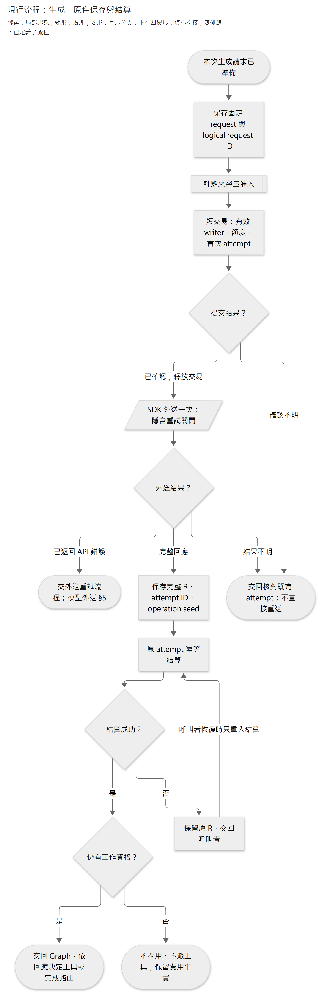
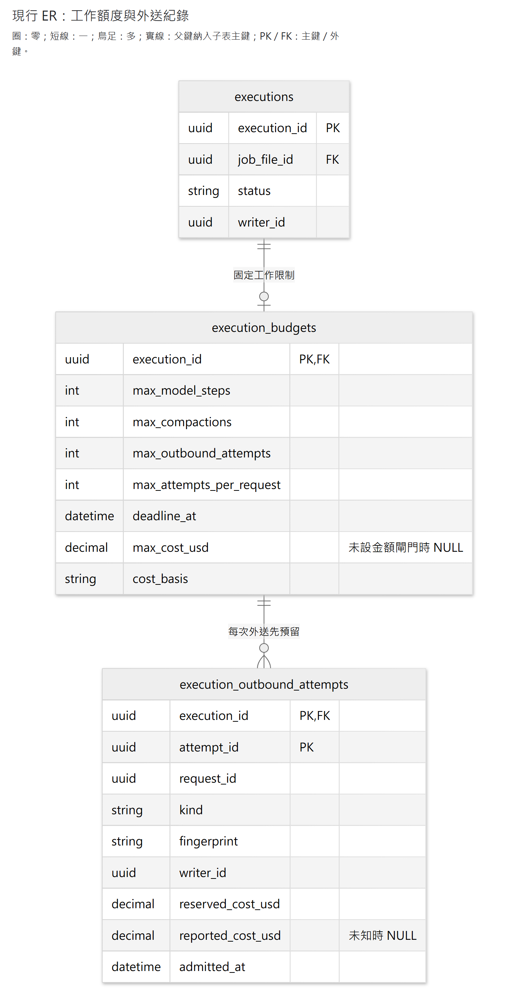
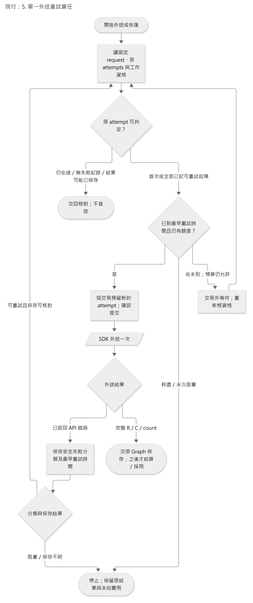

# 模型外送、容量與費用接線

本頁維護現行 create／count／compact 的固定請求、外送准入、provider 重試及費用記錄。外送由 `ModelRequestExecutor` 協調，原件及模型接續由 [Agent 執行](agent-execution.md)保存；[程序監督](agent-supervision.md)管理 runner 生命週期。三者共用原工作資格，不各自重送模型。

按問題閱讀：[請求格式與失敗分類](#1-直連請求與失敗分類) → [外送與原結果交接](#2-固定請求一次外送與保存後結算) → [持久額度](#3-工作額度保存)／[計數與容量](#4-固定請求計數與容量准入) → [等待與重試](#5-單一外送重試責任)。[費率估算](#6-固定費率與-usage-成本估算)和[產品／評測金額界線](#7-產品與付費驗證的金額界線)分開維護，正常產品不設金額攔截。

產品政策依[共用執行與恢復](agent-execution.md)，本頁說明對應的程式、資料及失敗處置。測試層級與限制沿各節證據及[驗證入口](../architecture/verification.md)，離線通過不等於 provider 接受或實際帳單已核實。

## 1. 直連請求與失敗分類

`adapters/openai_responses.py` 只承接官方 SDK，不負責預算、保存、採用或重試。`ResponseRequest` 擁有組裝完成資料的獨立複本；計數與 create 從同一 context 產生 payload，外部後續改 maps／items 不會改掉已計數的請求。它不是持久 request store。工具允許一次返回多 calls，App 仍按 [單一模型／工具 Step](agent-execution.md#42-單一模型工具-step) 順序執行。

- Client factory 固定官方 base URL、有限 timeout、`max_retries=0`；不採環境中的 proxy base。SDK 預設 HTTP client 會跟隨 redirect，本案明確關閉，注入的 client 若開啟跟隨則拒絕；避免官方起始網址的 307／308 把原文轉送別處。
- Create 明確使用 `store=False`、`all_turns`、`truncation="disabled"`、輸出上限及同步非 background 回應；不帶 `previous_response_id`／server-side compaction。保留 `include=["reasoning.encrypted_content"]` 作明確相容設定；當前官方說明 `store=false` 已預設附帶，不把它說成唯一取得方法。
- Count 和 compact 也只外送一次，不降級成猜測計數／本地摘要；compact 返回完整 SDK C，沒有在 adapter 自行採用。鎖定 SDK 的 standalone compact **沒有 `max_output_tokens`** ，不能用 create 的輸出上限當其費用上界。
- `adapters/openai_failures.py` 區分遠端結果不明、暫時服務問題、權限／額度阻塞、容量、請求與回應協定問題；不複製可能含原話／秘密的 error body 到 State 或 UI。分類不等於已准許重試，更不代表該次免費。

adapter 支援固定 request 指定的串流與非串流傳輸；A 新請求使用串流，公開投影見[介面 §2](interface-and-delivery.md#2-串流不是保存權威)。持久額度、原結果採用及 Retry-After 由後續各節負責。驗證見直連傳輸與串流；SDK MockTransport 不等於遠端接受。依據：[stateless reasoning](https://developers.openai.com/api/docs/guides/reasoning#preserve-reasoning-without-stored-responses)、[錯誤分類](https://developers.openai.com/api/docs/guides/error-codes)、[token counting](https://developers.openai.com/api/docs/guides/token-counting)。

**模型外送期限的在途等待政策：** execution 固定 deadline 同時限制新外送准入、重試等待及
在途 create／count／compact 網路等待。先在既有准入交易內讀 DB 時鐘，將固定 deadline 的
剩餘時間換成 event loop monotonic deadline；讀時鐘與提交花費的時間也計入，不拿本機
wall clock 猜 DB 時間。只有提交確認後、交易外的 network await 使用 Python
`asyncio.timeout_at()`。已到期不開始 HTTP；120 秒等 SDK timeout 仍是 connect／read／write／pool
I/O 限制，read 是每個 chunk 的等待限制，不是另一個硬 120 秒總期限。

本次修訂前 deadline 只在准入與重試等待核對，沒有在途硬期限保證。現在到期也不能宣稱
provider 未執行：保留原 attempt 的結果未知狀態，不記成可重試 provider failure、不自動再送。
若 terminal R 已到、在 stream cleanup 時才取消，先從 timeout context 取回完整原件，再沿
原有 typed cancellation 交給 Graph 保存；timeout 不包住 checkpoint、記費、工具或整個 Graph。
這是合作式取消的 network 等待界線，必要的取消清理可能稍後才結束，不承諾 OS 硬中止。

依據鎖定 OpenAI 3.20.0／httpx2 2.13.1 原碼及
[httpx2 timeout](https://pydantic.dev/docs/httpx2/advanced/timeouts/)、
[Python 3.14 timeout](https://docs.python.org/3.14/library/asyncio-task.html#timeouts)。使用標準
asyncio 機制，期限與原 attempt 的責任仍集中於 `ModelRequestExecutor`，不新增 timer registry
或第二個 retry owner。

## 2. 固定請求、一次外送與保存後結算

`workflows/model_requests.py` 協調 executions 額度、短交易與 SDK；共用 Graph 不 import features，不增加 ResponseStore 或第二套回執。此元件由角色 runner 組裝，生成前經 [計數與容量准入](#4-固定請求計數與容量准入) 計數／容量准入；多 Step、compact 與 provider 重試分見 [有界多 Step 接續](agent-execution.md#46-有界多-step-接續)、[完整 C 保存、採用與中途接續](agent-execution.md#53-完整-c-保存採用與中途接續)、[外送重試](#5-單一外送重試責任)。下圖聚焦生成成功路徑，不略過計數或故障分類。

[圖源](../diagrams/implementation/model-requests/request-generation-settlement.mmd) · [SVG](../diagrams/implementation/model-requests/request-generation-settlement.svg)

圖為現行生成、保存與結算的基本流程圖，形狀及箭頭沿[中央圖面規範](../standards/documentation-standard.md#3-圖面種類與符號)。雙側線矩形是另有定義的計數／准入子流程，平行四邊形是對 provider 的外送；已知 provider 故障及原件補存分見 [外送重試](#5-單一外送重試責任)、[原件補存的有限自動恢復](agent-execution.md#56-原件補存的有限自動恢復)。恢復線表示呼叫者再次接續，不表示本元件無限重試；沒有工具 call 的完整回應可直接交回完成路由。

- 每個新 Step 的初始 checkpoint 固定 App 產生的 `request_id` 與 **實際 create payload** ，包括 model、instructions、tools、input、reasoning、輸出上限與串流設定。沒有另存初始 input 副本；`input_items` 僅在完成 Step 時形成後續窗口。`ResponseRequest.from_snapshot` 還原同一請求，拒絕不符固定直連政策的快照，不能用目前角色設定代替當時設定。這是恢復資料，不宣告永久保存所有請求。
- `ModelRequestExecutor.request_model` 在既有 execution 鎖內查原 request 的 attempts，核固定費用依據並預留；交易確認完成後才發一次 HTTP。同一 request 有尚未核明的 attempt 時停止讓外層核對，不換 UUID 假裝首次呼叫；只有 [外送重試](#5-單一外送重試責任) 已確認的可重試故障才可新准入。已保存 R 由 Graph 直接接續，不再進此入口。完整 payload 以 canonical JSON 的 SHA-256 綁定，不拿 payload hash 當 logical request 身分。
- SDK 返回後，立即交出 `ReceivedModelResponse(response, attempt_id)`；其間沒有可能失敗的記費 SQL 或費用推算。Graph 保存原 R／attempt 後，才進 `account_response`。結算解析或提交失敗時，原 R 已在既有 saver，下一次只重入同一結算，不重呼模型。這借鑑官方耐久節點交界，不將整輪鎖成一個 DB transaction。
- `ModelRequestAccounting` 使用與原 budget 相同的 `cost_basis`、預留及觀察成本計算；`workflows/model_runtime.py` 從固定模型配置組裝。費率見 [費率與 usage 估算](#6-固定費率與-usage-成本估算)，產品與付費評測的未知 usage 處理見 [產品與評測金額界線](#7-產品與付費驗證的金額界線)；成本估算不等於帳單驗證。
- 結算與採用分開：一般晚到 R、已保存 R 的取消後重入，以及已驗證 Held 補存期間取消，都可核對原 attempt 記費；仍不能派工具、採用新 context 或交付正式結果。Held 在進結算節點時釋放「尚未保存」責任，不把結算故障誤報為模型保存故障。取消恰好發生在 `aupdate_state` 補存期間時，使用剛補存的原件結算，不看過時的補存前查詢值。

驗證：固定請求與保存後計量。依據：[LangGraph sync／pending writes](https://docs.langchain.com/oss/python/langgraph/checkpointers)、[OpenAI 原件接續](https://developers.openai.com/api/docs/guides/reasoning#preserve-reasoning-without-stored-responses)；此安全交界不承諾 provider 與 PostgreSQL 共同原子提交。

## 3. 工作額度保存

> 正常產品工作 `max_cost_usd=NULL`；只有明確啟用的付費評測核對金額上限。額度與預留機制依 [產品與評測金額界線](#7-產品與付費驗證的金額界線) 區分用途。

`features/executions/budgets.py` 沿既有 execution 身分與 writer fencing 維護額度，migration `0013_execution_budgets` 建立下圖兩表。create／count／compact 共用此准入與記帳元件。不含 R／C、prompt、Graph cursor、候選正文或秘密；沒有第二套 ResponseStore。

[圖源](../diagrams/implementation/model-requests/execution-budgets.mmd) · [SVG](../diagrams/implementation/model-requests/execution-budgets.svg)

圖為現行 execution 額度的局部 ER；基數、識別關係與鍵標記沿[中央圖面規範](../standards/documentation-standard.md#3-圖面種類與符號)。保留具體鍵，省略其他 execution 關係及非關鍵欄位；型別採簡寫，`string`、`datetime`、`decimal` 分別對應 PostgreSQL `text`、`timestamptz`、`numeric(18,9)`，不是完整 DDL。一份 execution 至多綁定一份固定 budget，外送 attempt 的主鍵是 `(execution_id, attempt_id)`；兩條實線的引用鍵都完整納入子表主鍵。完整欄位及約束以 [0013 migration](../../apps/api/src/caliburn/migrations/versions/0013_execution_budgets.py)及[可空金額上限](../../apps/api/src/caliburn/migrations/versions/0019_optional_cost_limit.py)為準。

執行配置啟動時固定，由公開查詢恢復，不以啟動當下的新 deadline 覆蓋。`cost_basis` 是本工作經研究的計價依據定位，不允許未配置；公開費率見 [費率與 usage 估算](#6-固定費率與-usage-成本估算)；成本估算不保證等於帳戶實際帳單。B1／B2 使用同一 Memory batch scope，不各領一份可重置的預算。

- 新模型 Step、compact、count 使用 App 產生的 logical request 身分與 exact payload SHA-256；傳輸重試保留同 request、另給 attempt。新模型修參數則是新 request。模型步數與壓縮數按不同 request 計，所有實際准入 attempt 均計入總次數與成本。
- 新 attempt 在既有 execution 短行鎖下重查有效 writer、固定 deadline、各次數與成本，再預留；deadline 用取得鎖後的 DB 時間，不能用等待鎖前的時間判斷。交易內沒有網路等待。
- **只有新准入且提交確認後才可外送一次。** 同 attempt 重入回原紀錄、`created=False`，不是可重送的票。COMMIT 確認不明先查回，不能因看到原紀錄便再發送；確需重新推論時要新 attempt，仍占同一工作限額。外送 workflow 依此判斷是否可傳送。
- 啟用金額上限時，聚合 `reported_cost_usd ?? reserved_cost_usd` 作金額准入占用；timeout、崩潰或沒有 usage 均保留原預留，不歸零。已知 usage 依固定計價規則得出成本後只記一次；相同重入可承接、不同值拒絕。已知成本高於預留也如實記入，啟用金額上限時使後續准入受限，不以拒絕記帳隱藏超支。它不是 provider 帳單保證。
- 取消／writer 更換只停止新的准入與採用，不刪已發生的記帳。晚到結果仍可結算原 attempt，但記帳函式不恢復執行、不採用 R／C、不准派工具。沒有新外送時，讀原結果不受已耗盡額度阻擋。
- SQL 禁止改寫／刪除固定 budget，禁止清除／改寫 attempt 身分與已知成本；不存另一份可失同步的計數器。FK 及 scope 查詢維持檔案隔離，成本採固定精度 Decimal，不用 float。

驗證：持久工作額度。設計依[PostgreSQL 行鎖](https://www.postgresql.org/docs/current/explicit-locking.html#LOCKING-ROWS)及[單一重試責任](https://learn.microsoft.com/en-us/azure/architecture/patterns/retry)；原准入結果不等於重送許可。compact 預留不是硬性帳單上限。

## 4. 固定請求計數與容量准入

每次推論外送前核對實際完整 request，包含 instructions、tools、原生 items、App 資料及輸出／推理預留。`responses.input_tokens.count` 使用同一組裝 payload 中計數 API 接受的欄位，須核對所選模型、reasoning／compaction items 的實際接受性。這是遠端計數，仍受資料外送授權、timeout 與重試規則約束；不假定免費或永遠可用。

計數不產生模型回應、不計入模型迭代數，但計入 API 外送次數與延遲。未變動的同一 payload 可沿用本次執行已保存的計數；本機 tokenizer 不保證 opaque items 的精確大小，字元數或上一 usage 也不能代替實際請求計數。輸出上限包含 reasoning 與可見輸出，預留不重複計算；計數失敗保留恢復位置，依有界政策處理。

每個新 request 先走 `count_input → request_model`，沿現有 StateGraph 的 sync 保存，不增永久計數 cache、資料表或另一份模型窗口。`ResponseStepRuntime` 必填計數 callback 與模型容量；測試替身明確提供合成容量，不在 production 類別內設繞過開關。

- 初始 checkpoint 保存 `ModelCapacityLimits`（模型、最大輸入、context window、最大輸出），恢復不能換較寬設定。已知模型不符／輸出超限於 count 外送前拒絕；實際容量仍須與當前官方模型契約校準，不把 fixture 數值當真實容量。
- 計數取得同一固定 `ResponseRequest.count_payload()`，含 instructions、tools、reasoning 設定與完整原生 input。計數 logical ID 由本次 request 身分派生，`TOKEN_COUNT` 原 attempt 由 executions 執行資格模組管理；換新 Step 才清除舊計數，不能把前一 request 的數字套到已增長窗口。
- count 返回的 `input_tokens` 與原 attempt 保存在 checkpoint，之後才檢查非負整數、input 上限及 `input + max_output_tokens ≤ context window`；reasoning 已在 output 預留中，不另加一次。計數失敗／不合法即停止，不降成零、不裁歷史、不自動換模型。
- 模型／後續節點失敗時承接已保存的 count；計數本身若已有 attempt 但原結果不可得，`PriorInputCountAttemptError` 交回核對，不盲目重送。`InputCountSaveError.recovery` 承接補存：checkpoint／pending writes 保存失敗且完整 count 仍在程序內，保留原 request、count 與 attempt；原邊界補存後才走容量檢查，既有保存優先、不倒轉後續 R／工具／完成位置。取消或 writer 失效不准採用。這是 process-local handoff，不是持久 cache；程序也遺失原件時，仍依 [最外層失敗收尾](agent-supervision.md#3-最外層失敗收尾) 由 A／Memory 完成工作流核對並安全收尾，不宣稱能遠端找回。
- 遠端 count 也須先在原工作額度預留，短交易提交確認後才 HTTP；不增加模型 Step 數。不配置正數 `token_count_reservation_usd` 就拒絕 count。計數回應沒有計費 usage，故目前保留未知預留、不假定免費；該行政預留不是 provider 的硬帳單上限。沒有第二份計數器／收據。
- 完成至少一個 Step 後的下一請求達 160K，進 [完整 C 保存、採用與中途接續](agent-execution.md#53-完整-c-保存採用與中途接續) 的明確 compact 接縫；尚未配置接縫則回報 `CompactionRequiredError`，保留原窗口、不發生成。首請求不受此中途門檻誤擋；合法 final／步數已耗盡不額外發 count。輪前 128K、pause 與取消相容基底分由 [跨工作的合法歷史選用](agent-execution.md#31-跨工作的合法歷史選用)、[完整 Step 暫停與原生續作](agent-execution.md#47-完整-step-暫停與原生續作)、[輪前歷史準備元件](agent-execution.md#55-輪前歷史準備元件)、[A 控制協調](agent-supervision.md#2-a-pausecancelresume-控制) 承接。

依據：[OpenAI token counting](https://developers.openai.com/api/docs/guides/token-counting) 與[工作額度控制範例](https://developers.openai.com/cookbook/articles/per_run_spending_controller_responses_api)。本案採 exact payload、未知費用不歸零及 reasoning 不重算，持久准入仍由 executions 模組透過 PostgreSQL 短交易處理。provider／容量驗證見計數驗證及容量驗證，實際帳單未由此核實。

count 接續只需原 `input_tokens` 與 App attempt 綁定，不將計數變成模型 output item 或虛構 usage。沿 `count_input → check_capacity` sync 邊界補存，不另建節點、資料表或計數服務；驗證見原計數補存。

## 5. 單一外送重試責任

暫時網路／服務故障可依 Retry-After 及有界 backoff＋jitter 重試；額度、權限、程式錯誤及確定容量問題不原樣重送。只有本節負責 provider 重試，避免各層各自重試造成次數相乘；原結果不可得時的再推論是新的 attempt，不能視為免費。

`ModelRequestExecutor` 統一承接 create／count／compact 的 provider 失敗。SDK 仍 `max_retries=0`，Graph 不另掛無差別 retry。`agent_execution/response_retries.py` 只計算分類後的退避，executions 保存原 attempt 的失敗事實，workflow 協調短交易與外送；不新增排程平台、ResponseStore 或工具副作用重送迴圈。

[圖源](../diagrams/implementation/model-requests/outbound-retry.mmd) · [SVG](../diagrams/implementation/model-requests/outbound-retry.svg)

圖為現行 provider 外送的重試控制基本流程圖；形狀及控制箭頭沿[中央圖面規範](../standards/documentation-standard.md#3-圖面種類與符號)。只有原 attempt 的故障已可靠保存、分類允許且仍有工作資格，才准入下一次外送；保存失敗與結果不明走核對或停止，不由此圖推定重送。

- **原結果優先不變：** Graph 已保存的 R／C／count 直接接續；仍握有原件則走既有補存。此迴圈只 catch SDK 外送的 `APIError`，不包整個 Graph、不把保存／結算／工具錯誤當成 provider retry。成功收到完整結果後、交給 Graph 之前仍沒有 DB 操作。
- **允許重試的證據：** 原本地 HTTP 呼叫已返回錯誤，分類為短暫服務或遠端結果未知，且安全故障記錄已提交。逾時仍可能已收費、曾遠端生成，但本機沒有完整 R；新推論是新 attempt，不冒充原結果。程序崩潰、准入 COMMIT 確認不明，或原失敗尚未可靠保存時仍維持 `Prior*AttemptError`，不靠不存在的遠端備份／時間到自動放行。
- **串流錯誤分類：** HTTP 200 後的錯誤事件沿同一分類器處理。`rate_limit_exceeded`／`slow_down` 歸 `rate_limited`；`server_error`、`server_is_overloaded`、`service_unavailable` 歸暫時服務問題。沒有明確可重試代碼則停止，不猜測。沒有 header 的串流錯誤使用對應的 capped backoff。驗證見串流錯誤與限流等待。
- migration `0015_outbound_failures` 只在既有 attempt 增加 `failure_code`、`retry_not_before`。不保存 error body、prompt、token、模型輸出或另造 Graph cursor。故障原件不可覆寫／清除，重入相同結果冪等；晚到故障可記錄，但不恢復被取消的工作。報告成本仍獨立，不因失敗釋放未知預留。
- **錯誤出口也須安全：** 停止重試時拋 `ModelRequestFailedError`，只攜帶安全分類、可取得的 HTTP status 與白名單 provider code，不把 SDK 原始 error 傳給 Graph 持久保存。保存失敗／取消仍保留本地錯誤型別、停止外送，抑制供應商例外鏈進入標準 traceback；取消不能被吞掉或當成 provider retry。這不宣稱任意第三方 tracing 的 frame locals 安全；不得啟用未經遮罩的原文／憑證紀錄。
- **最小診斷：** create／count／compact 的共用外送邊界，在每次實際捕捉 `APIError` 時用既有 Python logger 記一則警告：操作種類、安全分類、HTTP status、白名單 code，以及 App 的 execution／request／attempt ID。串流錯誤沒有 HTTP status 就記 `None`；未知 code 也記 `None`，不輸出 exception、body、headers、輸入或 opaque reasoning。這則紀錄在故障保存之前，只證明捕捉到例外，**不是** 已保存、已回滾或已重試的回執；恢復仍查既有業務紀錄。不新增資料表／副本／重試責任，也不追補已遺失的舊原因。驗證見 T06 §23。
- **尊重服務端等待：** 支援 `retry-after-ms`、秒數及 HTTP-date；有效長等待不截短到本機 backoff 上限。無有效 header 才作 capped exponential backoff，普通暫時故障預設 2 秒起、30 秒封頂，再乘 0.75–1 的 jitter；非限流 attempts 每請求預設最多 8 次。實際工作限制從原 budget 讀取；不可表示的超大等待明確停止，不退回短等待。
- **限流採等待政策：** HTTP 429 或串流的 `rate_limit_exceeded`／`slow_down` 分為 `rate_limited`，保存最早重試時間。有 `Retry-After` 就照做，沒有則預設 10 秒起、60 秒封頂，再乘 0.75–1 的 jitter。限流 attempt 不占每請求的非限流次數上限，仍占工作外送總數並受 deadline 限制；預設總數 512、工作時限 1,800 秒，以[ModelSettings](../../apps/api/src/caliburn/settings.py)為準。等待中持續核對 writer、取消與時限，完整 Step 的暫停規則不變。
- 最早重試時間用 DB clock 計算並保存；重開不重新抽 jitter／縮短舊等待。等待在交易外，每至多一秒重核 writer、取消與 deadline。等待前沿 executions 原准入規則核成本與總次數，已耗盡就立即停止；共用 `check_outbound_capacity()` 只檢查、不產生外送許可，等待結束仍須新 attempt 確認提交。Retry-After 已超過工作期限直接停止，額度不足不擴費。同 request 指紋不可換；新 attempt 不增加模型邏輯 Step／compact 次數，但外送次數及成本逐次計。
- 行鎖下確認**所有** prior attempts 都已有可重試故障，再准入新 attempt。任一先前結果尚未核明就停止，因此兩個 retry runner 不能因同一故障各發一次。新 attempt 的提交確認遺失不授權再次傳送；失敗紀錄的提交確認遺失則重讀原紀錄後判斷。

依據：[OpenAI 錯誤與 Retry-After 指引](https://developers.openai.com/api/docs/guides/error-codes#python-library-error-types)、核本機 SDK 3.20.0 header／jitter 原碼；借鑑 [Azure Retry pattern](https://learn.microsoft.com/en-us/azure/architecture/patterns/retry)的單一責任、分類及整體交易考量。未直接啟用 SDK／LangGraph／通用 decorator，是因它們的隱含 attempts 不承接本案持久費用准入；純等待計算不需要新依賴。這是本案接線，不聲稱業界共同採同一資料表。

**恢復限制：** 沒有可靠失敗紀錄的 attempt 不具備重送資格。程序原件遺失時，由 [最外層失敗收尾](agent-supervision.md#3-最外層失敗收尾) 的 A／Memory 完成工作流核對正式結果並安全收尾，不自動再推論；手上仍有原件才走 [原件補存的有限自動恢復](agent-execution.md#56-原件補存的有限自動恢復) 的有限補存。驗證見外送重試。

## 6. 固定費率與 usage 成本估算

> 成本診斷與付費評測攔截依 [產品與評測金額界線](#7-產品與付費驗證的金額界線) 區分；正常產品不要求先估出金額才可接續有效結果。

`adapters/openai_pricing.py` 只處理 **Standard／default、文字 Responses＋本機 function tools** 的 token 算術；`ModelRequestAccounting.from_text_pricing()` 接回既有外送／結算工作流。沒有新帳單服務、價格網路查詢、資料表或 provider 抽象。提供 `GPT_6_LUNA_STANDARD_2026_09_30` 不可變配置；組裝方須明確選用，不在 import 時啟動模型、不自行換模型。

- **同一費率依據：** `cost_basis` 含來源修訂、估算法版本與完整 rates／模型／長 context 門檻指紋。execution 原有 budget 固定它；重開時若提供不同配置，執行額度模組拒絕結算／新准入，不能用今天價格改算舊工作。更新價格須保留在途工作所需原配置；`fix_execution_policy` 核對原 `cost_basis`，不同配置拒絕接續。
- **請求與回應雙邊核對：** 新 factory 綁定模型，create／compact／count 在預留及 HTTP 前均拒絕另一模型。直連 adapter 既有 create／compact 明確送 `service_tier="default"`；一般 R 必須帶回相同模型及 default，未明或不同則不結算為零；產品與評測是否停止沿 [產品與評測金額界線](#7-產品與付費驗證的金額界線)。自訂 callback 仍供合成測試使用，不是正式組裝可略過配置的依據。
- **分開輸入桶：** 一般輸入＝`input_tokens − cached_tokens − cache_write_tokens`；三桶各用其單價，輸出使用 `output_tokens`，不再加其中的 reasoning tokens。長 context 費率依總 input **大於 272,000** 選用，整次請求適用該組費率，不是只有超出部分加價；與[共用執行與恢復](agent-execution.md)執行政策「達 160K 壓縮」不是同一判準。零 usage 可為零；缺欄、負數、非整數、桶相加超 input、total 不相符皆為未知。
- **Decimal：** 加總後一次向上取至原 budget 的九位小數，避免本地估算向下少記。這是本案記帳精度，不聲稱供應商使用相同捨入方式。SDK 可能在反序列化時轉型；檢查的是實際保留的原生物件，不宣稱能找回轉型前 wire 值。
- **預留與估算不同：** `reserve_response_cost()` 對提供的 input 上界，使用三種 input 單價最高者，加完整輸出上界；快取寫入可能比普通 input 貴。它不替 caller 取得實際 token count，也不能用 create 的 `max_output_tokens` 假裝 compact 有同樣上界。create／compact／count 仍記錄行政預留；只有明確啟用金額上限的評測才以金額拒絕外送。
- **Compact 是有依據的估算：** 官方 compact 參數承諾 default 使用所選模型標準費率，usage 描述本次壓縮計量；但目前 SDK C 型別沒有 model／tier 欄位。因此用已固定、外送前核對的請求模型與 default 配置計算，不冒充回傳已確認實際 tier。若 provider 擴充欄位明確帶回其他 model／tier，就停止估算；缺 usage 仍保留原預留。完整 C 先保存、後結算／採用，不為價格資訊再 compact。
- **Count 尚無明確計費依據：** 其回傳的 input count 是待生成請求的長度，不是該計數呼叫的 billable usage。維持原正數行政預留與未知成本，不拿模型單價相乘、不假設免費。

`reported_cost_usd` 是依 usage 及固定規則計算的成本估算，**不是 provider 確認帳單或硬性帳單上限** 。區域、合約、其他模態／內建工具及其他服務 tier 不在此配置支援範圍；算術與 provider wire 驗證不能核實帳戶最終帳單。

依據：[官方 pricing](https://developers.openai.com/api/docs/pricing)、[cache read／write 算式](https://developers.openai.com/api/docs/guides/prompt-caching#monitor-cache-performance)、[Compact default tier 與回傳契約](https://developers.openai.com/api/reference/python/resources/responses/methods/compact)、[input token count](https://developers.openai.com/api/docs/guides/token-counting)。官方定義費率／usage，本案選擇固定配置、九位向上捨入及未知預留。實測見 T06 §17。

## 7. 產品與付費驗證的金額界線

依[共用執行與恢復](agent-execution.md)，正常 `ModelSettings` 的 `max_cost_usd=None`；環境載入與 `scripts/run_backend.py` 不讀取 `CALIBURN_TURN_MAX_COST_USD`。A、B1、B2 沿同一設定及 executions 執行額度模組，不各自繞過錯誤。付費驗證可由程式明確給有限正數預算；不暴露成產品／模型可改的參數。

- `ExecutionBudget.max_cost_usd` 可為 `None`，DB 為 `NULL`。只有非空時檢查累計金額；模型步數、總 attempts、每請求 attempts、compact 次數、deadline、writer／取消及固定 request 的檢查無條件保留。既有用量與預估紀錄只供診斷，不以巨大假上限替代空值。
- migration `0019_optional_cost_limit` 只放寬既有欄位的 nullability，不新增表、不改寫既有 budget／attempt、不刪資料。明確測試預算仍須正數；固定配置保護 trigger 不移除。啟動前仍須明確 upgrade，App 不自動遷移。已受理舊工作的原限制維持；新產品工作採新政策。
- Graph 將已保存、與當前 request 配對的 `input_tokens` 傳給 executor；若需預留估算，使用該 count 與同一 payload 的 `max_output_tokens`，不以模型最大輸入當成本次輸入。壓縮後重新計數，恢復沿保存值；沒有額外一次 count HTTP、永久 cache 或新 context 欄位。
- R／C 仍先保存後處理 usage。產品缺計費明細時保持 `reported_cost_usd=NULL`，不阻止有效原件接續、不補零、不重發模型；明確啟用費用上限的評測則保留既有保守停止。結果對應、資料庫／原件保存、模型容量與 context 格式檢查不放寬。
- 原 R 還原時，僅計費 `usage` 以 SDK `ResponseUsage.model_construct()` 保留其實際收到／缺省的欄位；其餘 envelope／output 仍走 `Response.model_validate()`，工具與 phase 仍由原執行檢查。這與 SDK 3.20.0 接收部分明細的行為一致，不為缺欄補零、不修改保存原件、不將整個回應改成無驗證還原。C 已沿既有原生還原與完整 output window 檢查，不另加一套序列化。
- 記錄的金額不是 OpenAI 帳單；供應商金鑰／實際帳戶額度失敗仍依原錯誤分類停止無效重試。沒有產品金額 gate 不等於 API 免費或工程測試可無限外送。

官方機制：使用 [Alembic `alter_column(nullable=True)`](https://alembic.sqlalchemy.org/en/latest/ops.html#alembic.operations.Operations.alter_column)與 [SQLAlchemy nullable mapping](https://docs.sqlalchemy.org/en/20/orm/declarative_tables.html#mapped-column-derives-the-datatype-and-nullability-from-the-mapped-annotation)，不手改舊 migration／另造配置引擎；完整 request 計數沿 [OpenAI token counting](https://developers.openai.com/api/docs/guides/token-counting)。這是產品決策，不宣稱供應商要求取消費用 gate。驗證與限制見 T06 §19。
