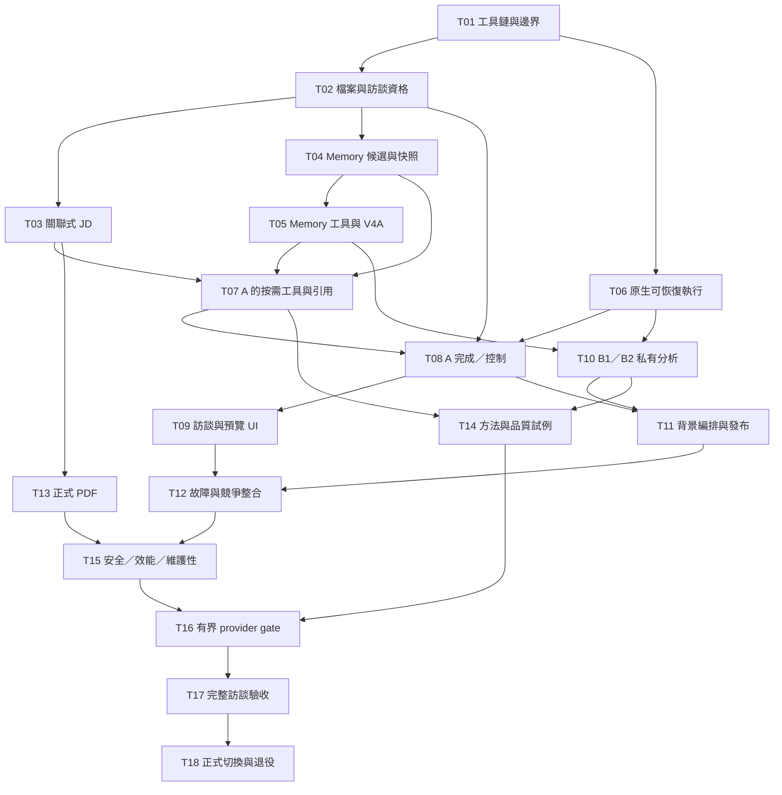

# Caliburn 新目標重建：SDD／TDD 實作計畫

- 日期：2026-09-29；狀態：**Owner 已以 Goal 授權 T01–T18 施工與驗收；實際進度依任務表**。
- 沿革：前次交付僅研究、規劃與文件審查；本次 Goal 另授權新架構實作、必要有界 OpenAI 直連測試、本地提交，以及通過 T18 gate 後的正式入口切換／精確舊碼退役。沒有授權任意刪除 DB、volume、秘密或無關資料，也不 push／merge／對外部署。
- 產品權威：[目標架構](../../target-architecture-map.md)；工程入口：[實作文件](../../implementation/README.md)；工作方法：[開發規範](../../implementation/development-standard.md)。

**本頁也是長任務 Goal 的持久入口。**Goal 可以縮短為成果、必要界線與本頁路由；不縮減 T01–T18、驗收或原已授權範圍。產品細節只在責任文件維護，不能把本頁摘要當成完整契約。2026-09-29 原長 Goal 的要求歸屬見[覆蓋審查](review.md#4-goal-分層整理與覆蓋審查)。

開始／接續時，先核 `AGENTS.md`、工作分支與 dirty，再讀本頁、[任務表](tasks.md)及目前任務連結的 evidence；依[長任務工作規則](../../implementation/development-standard.md#10-長任務goal-與工作上下文)取回相關有效契約。沿用已成立的工作，不重置任務、另造計畫或從 T01 重做。

## 1. 交付什麼，刻意不做什麼

最短可用閉環：建立隔離職務檔案 → 顧問引導訪談／釐清 → 有依據的 JD 候選預覽 → 正式完成保存 → 背景整理與下輪按需讀取 → 人工續改／來源核對 → 匯出目前正式 PDF。具備既定暫停、取消、Step 恢復及正式歷史回查；不能為加速刪掉這些核心承諾。

核心成果是員工只需接受訪談，也能逐步取得涵蓋主要實際工作、專業完整且精簡高訊號的 JD；人工可編輯，但不以人工代寫補足 AI 品質作為驗收捷徑。品質依既有分析／訪談／JD 指南與可檢查案例評估，不以 Agent 數、程式量或少數成功樣稿宣稱普遍滿分。

新產品位於 `apps/api`＋`apps/web`，新 DB，無舊 schema／資料遷移／相容 adapter。舊底稿只讀作演算法與測例參考，能借用的須符合新命名、責任與測試後才移植。

2026-09-29 Owner 補充：`api`／`web` 是目前工程路徑選擇，不是不可改的產品名稱或責任分層。後端應用包含領域、工作流與 Agent，並不只有 HTTP API；前端是使用者介面。工程代理可按責任與命名規範調整路徑並同步引用，不為改名重造架構。T01 暫沿這兩個已規劃位置，package 以 `caliburn-backend`／`@caliburn/frontend` 表達責任。

同輪進一步授權：已選實現不是永久鎖定；工程代理可依當前官方契約、成熟公開實踐及本案驗證，改採能更好達成既定概念的方式，並同步記錄比較、取捨及回歸證據。不能只因版本較新或大廠採用就替換；產品效果、資料權責、可回查及恢復保證仍須成立。若改的是這些概念本身而非實現手段，才帶具體差異回 Owner 討論。

不做 C、專用全稿審核 Agent／固定雙向 reviewer、搜尋平台、微服務、broker、通用 workflow／rule engine、逐 token 永久恢復、跨機備份產品、Memory 使用者控制台、永遠雙寫候選／context。工具清單與 schema 以原契約為準，不為 task 分工新增同義入口。

## 2. 依賴圖與里程碑

圖為**待施工任務依賴**；箭頭表示完成前置 gate 才進入下一任務，不表示 runtime 流程。不同分支可獨立開發，但共用 schema／owner 由同一責任維護，不能各建一份。

| 里程碑 | 可觀察交付 | 不能冒稱 |
|---|---|---|
| M1：T01–T03 | fresh DB、隔離檔案、開場與人工 JD 管理；最早可跑產品切片 | AI 已可訪談 |
| M2：T04–T09 | Memory 可固定讀、A fake-provider 完整閉環與預覽／取消恢復；工具可達所有 JD 操作 | fake provider 通過等於模型品質 |
| M3：T10–T15 | 背景 B1→B2、原子發布、程序故障恢復、PDF 與安全邊界 | 只因有 checkpointer 就耐久正確 |
| M4：T16–T17 | 官方 API 接受與自然長訪談；量測品質、成本、context、工具使用 | 個案通過等於普遍滿分或節省時間已有統計證明 |
| M5：T18 | 新根入口／文件／依賴一致切換，明確退役清單 | 新文檔本身已改 production authority |

表中 T 範圍表示交付集合，不要求把所有低層做完才做 UI。每個任務仍拆成含測試的可審查小改動，不能做一個「重寫全部後端」commit。

## 3. 狀態與施工順序

接續先看[收尾分類與下一步](tasks.md#收尾分類與下一步)；依題目從[證據索引](evidence/README.md)找實測與原始資料。這兩個入口不改動下述既有結論與驗收要求。

**2026-10-02 T18 放行與切換：**Owner 放行後，切換候選快轉合併進 `target-rebuild`，新 App 成為唯一正式產品、舊程式 379 檔退役（可由 `6ad33bcb` 取回），ADR0079 Accepted；T01–T18 全部完成，證據見 [T18 放行紀錄](evidence/t18-same-origin-web.md#放行與切換2026-10-02)。限制不因放行消失，見下一段與[實驗發現的問題彙整](../../reports/experiment-findings.md)。

**2026-10-02 T16／T17 結案入口：**實驗發現的問題（缺口、已修正、環境事故；不含解法）一頁整理見[實驗發現的問題彙整](../../reports/experiment-findings.md)。T16、T17 已依實測與已知不足清單勾選（限制與未觀察項見[T17 V01–V28 對照](evidence/t17-v01-v28-closure.md)、[T14 已知不足](evidence/t14-job-analysis-quality.md#已知不足成因與後續研究方向2026-10-01)、[T16 §12](evidence/t16-compaction-continuity.md#12-b1b2-輪前壓縮的真模型觀察2026-10-02執行前-manifest)）；剩 T18：重基切換候選、重驗、等 Owner 放行。**OpenAI 帳戶額度已用完（2026-10-02 05:16 起 `credit_balance_exhausted`）**，補額度前所有真模型驗證暫停。以下為較早入口。

**2026-10-02 續跑收尾入口：**原採購旅程已在同一檔案完成45輪、3批Memory與4頁PDF，沒有重跑；原第25／30輪均安全終止後才新送，無未結束工作。harness修正為 `40f7c1f9`。實際判準、10筆待核對依據、未自然出現JD→Memory引用及下一步見 [T17 A2實測結果](evidence/t17-course-administrator-journey.md#a2-實測結果2026-10-02原旅程完成-45-輪)。本次付費驗收已停止；T16–T18仍未完成，不以單例完成放行切換。教授報告與切換候選工作樹原樣保留。以下為較早交接沿革。

**2026-10-01 23:35 接手入口：**先處理原長訪談第 25 輪中斷，保留已完成 24 輪與現有資料，不從頭重跑。事故事實、harness 未完成接縫、分支／worktree 分工及續跑前界線見 [T17 最新核對](evidence/t17-course-administrator-journey.md#接手核對與工作樹整理2026-10-01)。本輪僅文件／唯讀整理，尚未重啟或付費續跑；任務狀態以[任務表](tasks.md)為準，T14 已依較後 Owner 決定勾選、T16–T18 未完成。以下保留較早交接沿革，不用舊摘要覆蓋新狀態。

**2026-10-01 最新交接：**核心功能已有實作與代表實測，可沿本機 `target-rebuild` 接續；尚未完成的是 T14／T16／T17／T18，不是只剩品質。接手先讀[最新交接](evidence/2026-09-30-pause-handoff.md#最新交接2026-10-01核心已接通尚未全案驗收)，其中路由 Luna 來源漏選的原 Context 證據、已確認的新壓縮門檻、Memory 解阻（2026-10-01 已依訪談進度接線，政策待核對）及正式交付收尾。本次只整理交接，不更改任務狀態或放行正式切換；下方為之前的接續紀錄。

**2026-10-01 接手續作：核心分析效果優先。**承接他人留下的憑證驗收及六組合成長訪談結果，不重開規劃、不擴大恢復平台。先收斂會讓 JD 空稿的工具拒絕提示，核對實際來源選擇；無改善的提示詞候選不採用。最新反例、有限真模型與真後端結果見 [T17 接手紀錄](evidence/t17-course-administrator-journey.md#2026-10-01-接手只處理影響成稿的兩個反例)，安全收尾見 [T15](evidence/t15-local-http-security.md#2026-10-01-接手收尾憑證不進接續歷史與公開資料)。Owner 要求驗收適度、可延期項不擴做；仍不將已知來源品質缺口或尚未完成的正式切換宣告通過。

**2026-09-30 晚 Owner 以新 Goal 恢復施工**：自[暫停交接](evidence/2026-09-30-pause-handoff.md)建議的順序續作（起點：本機 `target-rebuild`、`e7cccda1`、工作樹乾淨；遠端文件分支 `66bf718d` 的交接與本機逐行一致）；逐項進度見該頁的「恢復後進度」。以下為暫停當時的紀錄。

**2026-09-30 最新指示：純文件推送後安全暫停，交由後續實作者接續。**本次不再展開新施工或付費測試；最新已完成／未完成、驗證命令與接手順序見[暫停交接最新補記](evidence/2026-09-30-pause-handoff.md#最新補記文件推送與再次安全暫停)。先前 Goal 曾恢復並承接 UI 改版交接、安全修正與後端缺口，成果保留，不重置進度。實作分支仍為本機 `target-rebuild`；Owner 另授權只將架構及相關規劃 Markdown 推送到 `docs/target-rebuild-architecture-2026-09-30`，不含本地程式提交、不合併、不部署。Demo 資料保持不變，完整 gate 仍以任務表為準。

[任務表](tasks.md)是完成狀態唯一位置；施工從 T01 開始。Owner 已允許工程代理設定、記錄合理分批 manifest 後進行必要真實 OpenAI 測試，不需逐次請示；預設全合成資料，不套用歷史試驗上限，也不視為無限費用或私人資料外送授權。`apps/api/.env` 只准安全載入本次所需 OpenAI 憑證，不讀取、套用舊產品的 DB／provider 配置；T01 不需要該憑證。API 設定載入的例外取代工程文件先前的概括禁止，其餘舊環境隔離不變。

分批 manifest 明列模型、資料、請求／重試／並行／時間／費用上限及停止條件；工程代理可在合理功能驗證範圍內自主設定及調整，不因一般測試反覆請示。明顯高額或無關大規模評測先估算並提問。同樣失敗先診斷，不無限付費；API 逾時仍可能計費。只用已決定的 OpenAI 直連，不以第三方代理替代；憑證不輸出、不記錄、不提交、不覆寫或刪除，真測授權不含任意外送私人訪談或 repo。

本 Goal 完成範圍包含分析指南 → 角色 Prompt／Skill → Tool／Context → 真模型品質的共同驗收，以及可追溯問題／解法紀錄，規則集中在[開發規範 §7–9](../../implementation/development-standard.md#7-分析方法prompttool-與-context-共同驗收)。工作分支 `target-rebuild` 從 `7e47c133` 建立，保留原有規劃文件差異；新分支不加 `codex/` 前綴。

T01 的有限相容 spike、T05 V4A、T06 native serializer／saver 是先消除技術風險，不是先造平台。T06 可依上述有效授權與分批 manifest 提前跑少量全合成 provider 協定預檢，避免最後才發現 API 不接受；T16 仍負責完整 wire／容量／品質 gate。結果可重用就直接納入新程式；不另開永久 experiments 產品或第二套 implementation。

2026-09-30 Owner 調整優先序：**接下來優先達成 M2 的可跑核心旅程：有效訪談輸入 → A 按需讀取／編輯有依據的 JD 候選 → 答覆與正式結果完成保存 → UI 可見。**T06 剩餘共用恢復接縫、T07 必要工具與來源、T08／T09 依可用前置能力接通小切片；不等待不相關的底層最佳化。任務級依賴仍是完整交付 gate，不以半套來源、假完成或繞過取消／隔離來提早接線。測試分層、可延後項目與追蹤方式依[開發規範 §3.1](../../implementation/development-standard.md#31-依風險配置驗證與交付粒度)，避免每個小改動都重跑全套；原 T01–T18 完成條件不變。

同次 Owner 再指定 **五小時內至少有 Demo**；接獲後於 2026-09-30 07:06（Asia/Taipei）記錄，近期目標 **12:06 前**。優先交付可操作的「建立檔案 → 真實 A 引導訪談 → 按需編輯有依據 JD → 可靠完成保存／重開回看」；以既有共用機制維持取消不誤提交、隔離及來源，不另造 Demo 產品。Memory 背景與 PDF 依核心接通進度納入並明示狀態；更廣故障矩陣／長訪談品質／效能留原 gate。Demo 未包含的部分不勾完成、不假裝可用，期限不縮減整個 Goal 的最終範圍。可並行的程式範圍明確分工，避免為趕時間繞過原資料權威或直接套用舊產品。

## 4. 需求／實作／證據如何同步

每項 task 的「契約」直接指向原權威，「程式」指向 owner 路徑，「驗收」對照[驗證矩陣](../../implementation/verification-plan.md)。先更新相關測例再寫行為；完成記錄實際命令及證據，不由另一份報告代勾全部任務。

若未通過只是工程接線問題，在原 owner 修；若需要改產品效果，記反例並暫停該任務的受影響部分，不把它變成默默新增需求。其餘不受影響任務繼續。數值校準、provider 接受性、實際故障測試是明列 gate，不是要求實作者猜。

最後切換前使用[審查紀錄](review.md)再做一次：需求覆蓋、資料可追溯、正常／異常旅程、code 邊界、依賴與成本。文件完整與實作成功分開判定。

## 5. 整個 Goal 的完成條件

以下須全部成立；各項具體反例與測試層級沿[驗證對照](../../implementation/verification-plan.md)，不再建立第二份測試矩陣。

1. T01–T18 必要任務與依賴完成，沒有以 TODO、stub 或 mock 冒充核心能力。
2. 員工訪談到正式 JD／PDF 的主要旅程實際可用，不要求人工代寫才能完成。
3. 資料隔離、正式訪談資格、Memory 快照／引用、JD 候選與核對、Context／工具及恢復契約整體一致。
4. 靜態、行為、真 PostgreSQL、整合、程序故障、UI、官方 API 與長訪談等相應 gate 有真實證據；API 200、Graph END 或 fake provider 不代替產品效果。
5. JD 品質依既有指南與情境 rubric 評估，涵蓋事實、工作完整性、精簡、引導及更正；不只用單一模型自評。
6. 模組、命名、依賴與契約來源清楚；符合[程式撰寫規範](../../implementation/coding-standard.md)的函式／實例／Service、錯誤與非同步寫法及相應審查，沒有無需求的平台化、重複 owner 或為相容底稿新增接線。
7. 架構／實作文件、流程圖、狀態圖、資料流、README／產品介紹與 runbook 對齊現況；改圖須實際渲染檢查。
8. T18 的正式入口與精確舊碼退役完成，保留歷史決策與無關資料；不將此授權擴張為刪 DB／volume／secrets。
9. 可依交付說明重現乾淨安裝、建置、新 DB 初始化、秘密注入、啟停、重啟持久保存、診斷及核心旅程；Docker 或其他交付形式須實測，不只交設定檔。
10. 完成跨層整體審查，沒有已知阻擋交付的重大缺陷；必要 gate 受阻就明示未完成，不降低標準結案。
11. A／B1／B2 的分析方法、Prompt／Skill、Tool／Context 共同審核，並有代表例、保留例及相應真模型證據；品質達標後才最佳化冗餘成本。
12. 重要研究、問題、失敗、取捨與修正可追溯；品質／成本／延遲如實記錄。真實用戶 ROI 等另列試點待驗，不捏造已節省時間或普遍滿分。

最後回報可完成的產品工作、啟動使用方式、實際驗證、模型品質／成本／效能、技術取捨、文件入口／分支／提交及限制。尚有安全且已授權的必要工作就持續推進；不得以投入時間、文件完成或部分功能可用宣告整個 Goal 完成。
