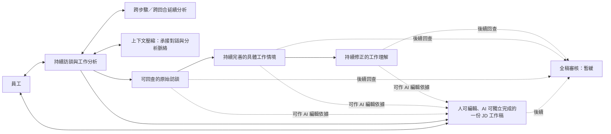

# Caliburn 產品整體概念（討論稿）

- 狀態：**第一層「產品旅程與成功條件」已由 Product Owner 於 2026-09-25 確認（目標／WORKING，未宣稱實作）**；第二層「概念與資訊關係」僅下方已標明的部分獲確認，其餘仍待逐題討論。本頁不授權施工。
- 用途：先說產品必須達成的效果與資訊關係；具體責任及實現後續分層討論。已選框架等技術取捨在相應決策處明示，不因仍是概念稿而降回未決。
- 維護：本頁持續更新整體概念；詳細設計與實測證據另寫，不在這裡堆疊。
- 決策者／最後核對：Product Owner／2026-09-29（JD 導覽按需定位；背景 Memory 最終失敗不直接阻斷 A；近期歷史預載超量時允許既有工具按需回讀）。現行與目標的效力界線見[目前決策](current-decisions.md)；討論順序見[架構討論規範](architecture-discussion-standard.md)。

**工程設計接續（2026-09-29）：**本頁保留產品決策與演進，不以完成工程文件冒充 production 已實作。早期段落的「保存／接線／工具仍待設計」反映當時未指定機制；目前的責任、交易、恢復、工具與圖稿以[全產品目標導覽](target-architecture-map.md)所列責任文件承接。工程文件可完成等價實現的選擇，但不自行改變本頁已確認產品效果；實際通過哪些 gate 只看[驗收紀錄](architecture/verification.md)。

## 產品目標

Caliburn 讓員工與 AI 顧問透過持續訪談，逐步弄清該員工**完整而具體的實際工作**。員工只需參與訪談、回答必要的釐清問題；**即使不親自編輯 JD，AI 也應能以專業的訪談、工作分析與撰寫能力，產出符合其所述工作、完整且高品質的 JD**。人仍可直接編輯同一份工作稿，但不假設員工是職務說明書專家；人工寫入的內容不因已寫入就自動成為專業成果。訪談、工作分析和 JD 編輯可以持續進行，不要求每個聊天回合都立即修改 JD。

## 痛點、產品價值與技術必要性（已確認方向／效果待驗證）

**2026-09-29 Owner 確認問題—解法對照，並補充現場經驗：真人顧問需要與員工一對一訪談，訪談約 3–4 小時，員工在訪談前還需要上課。**這是 Owner 提供的既有工作情境，不是已查證的業界平均，也不是本產品已達成的節省幅度。課程的具體內容與時間尚未量測；不由這段敘述推導所有培訓都可取消。

| 問題／痛點 | Caliburn 要達成的產品效果 | 為此保留的核心設計；不是新增元件 |
|---|---|---|
| 真人顧問須逐人投入長時間訪談；員工事前有學習負擔 | AI 承擔引導、釐清、分析及撰稿，使員工不必先學會 JD 專業方法，也不必全程依賴真人顧問同步陪同 | 專業顧問方法、對話內必要引導、長訪談可分次接續；不增設課程或排程系統 |
| 員工熟悉工作，卻不一定懂如何清楚表達、分析或撰寫 JD | 員工說明實際工作，顧問主動追問並逐步形成 JD，不把專業整理工作推回員工 | 訪談、工作分析與寫作指南；充分理解才編修，不按聊天輪數硬寫 |
| 工作資訊零散，早期細節或後期更正容易被遺忘 | 長訪談仍能找到相關工作與原話，保留差異及必要脈絡 | 分層工作記憶、導覽、原話回查與接續；不是永遠把全部全文放入 context |
| 資訊持續增長，每次全部重讀、重分析耗費時間與模型資源 | 延續已有成果，針對新增及變更資訊分析相關部分 | 固定快照、diff、引用關係與按需讀取；有新情境不能只查舊依賴 |
| AI 可能誤解、過度概括，或把猜測寫成事實 | 有疑點先釐清，保留未知，能追溯編輯依據 | 分析規範、來源鏈與 JD 明確核對；資料庫完整性不能代替語意正確 |
| 人與 AI 持續修改、執行又可能中斷 | 可預覽、正式結果可靠保留，可恢復或安全取消，不重複已成立效果 | 共用執行、安全點、候選與交易；不以此擴張為通用備份或流程平台 |

**優先順序：專業顧問效果 → 大量工作資訊可持續分析 → 可靠交付。**Memory、框架、工具和資料庫是達成這些效果的手段，功能數量、模型步數或訪談越短本身都不是成功指標。方法依[完整工作分析指南](specs/2026-09-09-complete-work-analysis-guide.md)及[JD 寫作指南](specs/2026-09-09-jd-field-and-writing-guide.md)，技術責任依[系統邊界](architecture/system-boundaries.md)，不在本節重寫分析方法或工具契約。

**時間價值要分開驗證：**減少真人顧問投入及員工事前學習負擔，不等於已證明員工與 AI 的訪談總時數必然減少。員工仍須提供工作事實及回答必要的釐清問題；不能為求快而少問重要問題或犧牲 JD 品質。後續記錄真人顧問直接投入時間、員工事前準備／學習時間、員工實際訪談及修正時間，並連同 JD 的事實正確性、主要工作涵蓋與精簡程度比較；尚不設定未經量測的節省百分比或完成時限。具體驗證見[驗收矩陣 V25](architecture/verification.md#2-核心反例矩陣)。

### 技術核心：App 自主管理的上下文工程（目標已確認／未實作）

**2026-09-29 Owner 補充：LLM context 的自主管理，以及高效工具輸入／回傳與 context 優化，是產品技術核心，不交由未知機制代管。**其目的是讓顧問在大量且持續變動的工作資訊中，取得相關依據、接續分析並有效編修，而非只把全部資料送給模型。

- **App 掌握組裝與生命週期：**每次送入模型的資料類別、合法範圍、固定基準、順序、歷史接續、壓縮採用及取消／恢復依產品契約控制。框架負責已選定的執行／保存機制，不可暗中追加歷史、轉換角色、裁切工具結果或啟用另一套摘要政策。
- **按需取得有用資訊：**導覽幫助定位，diff 指出變更，正文與原話提供完整細節；各 Agent 依職責讀取，不以全量重複輸入代替設計，也不把摘要當成所有細節的替身。
- **工具就是 context 設計的一部分：**名稱、說明、參數與結果都影響模型理解及後續分析。App 已知的範圍／版本等不交模型重填；回傳保留實際效果、必要定位、完整性及錯誤處置資訊，省掉無意義重述與包裝。不是一律越短越好，也不因此重開已後延的 tool search。
- **精簡不能破壞接續：**優化新加入資料的選擇與呈現，不任意改寫既有模型歷史或刪除已成立的工具配對；壓縮、回退與歷史保留依各自既定邊界。

「自主」指 App 對**輸入與接續政策的控制權**，不是自行實作所有模型能力，也不宣稱能讀懂 opaque reasoning／compaction 內部內容。沿用已選定的原生能力，由 App 決定何時呼叫、送入什麼及如何安全採用。具體責任見[上下文與接續](specs/2026-09-26-consultant-context-and-state-design.md)、[共用執行](specs/2026-09-27-shared-agent-execution-and-state-design.md)及[工具規範](specs/2026-09-27-agent-tool-contract-design-research.md)；供應商界線與工程選擇見[設計取捨](architecture/design-decisions.md#5-agent-機制已選框架內薄接線)。

效果須以正確取材、定位／引用成功、分析延續、工具錯誤及往返次數、token／耗時與 JD 品質共同驗證；不能只用 token 變少宣稱優化成功。不新增通用 context 引擎或永久保存每次完整 request 的要求。

## 已對齊的產品單位與用語

以下是目標產品的**概念名稱**，不表示現行 UI、API 或資料庫欄位已改名，也不藉命名預定新元件。

| 名稱 | 在本產品中指什麼 |
|---|---|
| **職務檔案** | 一份對應一位受訪員工的工作範圍，包含持續訪談、分析資料及一份共編 JD；同一個 App 可建立與管理多份。不是磁碟上的 PDF，也不等同 JD 本身。 |
| **職務說明書（JD）** | 職務檔案內由 AI 負責專業分析與撰寫、且人也可直接編輯的**關聯式結構化工作稿**；不是整份 Markdown 文件。人可管理職責、任務、成果／要求、共用知識／技能及其關係，另有基本資料、目的、協作與條件等內容；既有資料模型見下方[編輯界線](#jd-的關聯式結構與逐項編輯已確認目標)。最終品質仍須核對，不能因任一方已寫入就視為完成。可隨時將**目前 JD** 匯出為 PDF，即使尚未完成全稿審核；第一版 PDF 不顯示受訪員工姓名，也不額外附整份訪談、案例或工作理解。PDF 不是內部資料權威，匯出也不代表已完稿或通過審核。 |
| **受訪者工作記憶** | 一份職務檔案內，由原始訪談、工作情境及工作理解構成的可回查工作資訊體系；供顧問持續分析、追問及撰寫 JD，不等於 JD 成品或其欄位。 |
| **原始訪談** | 一份職務檔案內可回查的 App 正式開場引導、取得正式訪談資格的員工輸入與顧問完整正式答覆及其脈絡，包含後續補充與更正；不把公開中間訊息、工具訊息、其他系統訊息或對話延續摘要當成正式訪談原話。開場引導保留真實 App 出處，不冒充模型回答或員工工作事實。員工輸入即使因取消而未取得正式資格，仍依保存承諾保留，但不供後續 Agent 當作訪談來源。與後續整理出的內容區分。 |
| **工作情境** | 由訪談支持、可辨認的一段具體工作實況；可是一件事件／委託，也可是可辨認的例行工作流程，包含相關行動、判斷、條件與尚未釐清的細節，能反覆修訂並沿引用回查原話。不是假設場景，也不按單一動作、工具或訪談輪次機械切分。先前討論及現行程式稱「工作案例／case」，目標用語改為「工作情境」，不表示已改動程式契約。 |
| **工作理解** | 由一個或多個工作情境分析並反覆修正的、對這名員工實際工作的理解；涵蓋有依據的工作範圍、共同模式、本人責任、條件、例外及有影響的未知，並可沿引用回查工作情境與原話。不是 JD「主要職責」欄位或預填的 O／P／K／S。 |
| **編輯依據** | 某項 AI JD 編輯所依據的已核對原話、已發布工作情境或工作理解；「來源」用於描述沿引用回查到的內容。 |
| **職務顧問 Agent** | App 中負責訪談、分析員工工作，並判斷何時、如何依已核對資訊編撰與修訂 JD 的主顧問能力；全稿審核的具體分工留待責任層討論。不等於單一 LLM 模型，也不預定為獨立服務。使用者介面可稱「AI 職務顧問」。 |
| **工作情境分析 Agent（B1）** | 從有效訪談分析、建立及持續修訂工作情境；只能讀寫自己的情境層，不能讀寫工作理解層。「分析」包含維護既有成果，不代表每批重建。此為本輪採用的目標名稱，不改現行程式命名。 |
| **工作理解分析 Agent（B2）** | 讀取工作情境，分析、建立及持續修訂工作理解；可讀寫理解，不能修改情境。不擔任 B1 的固定審核員；自身分析確有情境資訊問題時才向 B1 交流。 |

架構討論中，**受訪者工作記憶**的三層依序稱為**原始訪談層 → 工作情境層 → 工作理解層**。不在各層名稱重複「受訪者」；JD 是使用這些資訊撰寫的成果，不是第四層記憶。

## JD 的關聯式結構與逐項編輯（已確認目標）

**PROD-G1-031（2026-09-27，Owner 已確認；同日依既有資料庫設計補正）：JD 採關聯式結構，人應能方便管理各個欄位、項目與關係，不以整份 Markdown 文件作為編輯單位。**這不是只有「任務內 O／P／K／S 四欄」，也不是現在才開始設計 JD 資料庫。AI 與人編修同一份結構化 JD；新增任務可一併建立已知成果／要求及連結適用知識／技能，不要求使用者編修整份長文或資料庫關係。

**既有模型僅作底稿：**[關聯式資料庫契約 §1–3](specs/2026-09-12-jd-relational-schema-and-write-contract.md)、[管理編輯器 §3–4](specs/2026-09-12-jd-relational-editor-design.md)及[現行 schema](../experiments/jd-relational-app/src/jd_relational/storage/schema.py)。下表借用既有名稱說明關係，不強制新目標沿用表、框架、資料或舊生命週期。現行正式採用由 [ADR0077](adr/0077-relational-jd-app-production-authority-and-pnpm-entrypoint.md)確認；新目標模型可見欄位與工具由[JD 契約](specs/2026-09-29-jd-model-tool-contract-review.md)維護，不能由既有表反推新需求。

| 既有 JD 內容／關係 | 應如何理解與管理 |
|---|---|
| 基本資料與職務目的 | JD 保存職務名稱、單位／工作定位、匯報對象及目的；新目標的員工姓名與職務檔案顯示名稱只由職務檔案管理，不作 AI 可編 JD 正文欄位，也不等同職務名稱。 |
| 主要協作對象 | `jd_collaborator` 是多筆對象及合作範圍，不是單一任務的 O／P／K／S。 |
| 主要職責與工作任務 | `jd_duty` 分組，`jd_task` 有自己的名稱、敘述及身分；任務可跨職責移動，也可合法未分組。 |
| 工作成果／產出與工作要求 | `jd_task_detail` 以 `outcome`／`requirement` 區分任務所屬的兩組明細；每組可多筆、各自編輯與排序，兩組不一對一配對，也不互為父子。 |
| 所需知識與所需技能 | `jd_capability` 以 `knowledge`／`skill` 區分同份 JD 可共用的獨立定義；不是每個任務各存一份 K／S 正文。 |
| 任務使用哪些知識／技能 | `jd_task_capability` 保存多對多關係；一項知識／技能可供多個任務使用，反向用途由同一組關係取得。從任務新增或選用 K／S，是建立／連結共用項目，不是四種子欄位之一。 |
| 工作條件與責任邊界 | `jd_condition` 保存工作環境、工時／出差、共通權責、共通協作及資格等分類；任務特有條件仍放在相應任務內容，不自動繼承。 |
| 來源與管理資料 | `jd_source_link` 可連至具體正文項目或任務－能力關係；`jd_head`／`jd_revision`／`jd_operation` 分別承接目前指標、不可變快照及操作結果。它們不是另一份可編 JD。 |

**關係不能只按畫面巢狀位置理解。**依既有業務規則，刪除任務會清除其成果／要求與任務－能力關聯，但保留共用知識／技能；刪除職責則保留任務為未分組。這些既有生命週期是後續設計的可核對基線，不因概念文件簡寫而變成待從零發明的功能。內容意義與寫法仍由[欄位與寫作指南](specs/2026-09-09-jd-field-and-writing-guide.md)說明，O／P／K／S 只是研究對照縮寫，不必作使用者介面名稱。

**JD 按需導覽（2026-09-29；目標已確認／未實作）：**職務顧問需要判斷目前 JD 哪裡已有相關內容時，從 JD 讀取入口取得可定位各職責、任務及其他 JD 區域的導覽，必要時再讀全文或指定位置。導覽不每輪預載、不另成一份由模型維護的 JD 摘要；它必須反映 A 當輪有權看到的目前 JD／候選。已寫入 JD 但未歸屬任何職責的任務也列在導覽，不能被誤當成尚未確認的訪談線索。模型可見欄位及定位規則見[顧問上下文 §3.2](specs/2026-09-26-consultant-context-and-state-design.md#32-jd-導覽的按需定位目標已確認未實作)；這只改 JD 的取得時機，不改工作情境／理解導覽及完整近期歷史訪談的起始提供。

這與 [008 的 Memory Markdown 編輯形式](#工作情境與工作理解的-markdown-編輯形式目標未實作)不同：工作情境與工作理解採 Markdown 文件編輯，JD 不因此改用相同形式。「職務檔案」是資料隔離與管理範圍，「一份 JD」是邏輯上的成品，不表示單一文字檔；PDF 則由目前 JD 匯出。

本輪不改既有 JD schema、工具或畫面，也不把它們全部重列成「未設計」。新目標已改變的 AI 候選提交、人工編輯准入、Memory 固定版本引用及 PDF 匯出等，按各自已確認決策繼續細化接線；短代碼／引用表示仍待討論。需要變更既有 JD 模型時，先指出具體需求或反例，再討論受影響部分，不自行重建一套資料庫。本次只核對文件、schema 與相關測試內容，未執行產品驗收。

## 職務顧問的工作範圍（目標產品決策，尚未宣稱已實作）

職務顧問 Agent 每次都在**一份職務檔案**內工作；每份檔案的訪談、跨步驟／跨回合分析、對話延續、案例、工作理解及 JD 都獨立延續與管理。切換到另一份檔案時，不得把前一份檔案的原話、分析結果、待處理事項或 JD 當成這份檔案的資料；即使兩位受訪員工同名也一樣。這裡的「獨立」是產品資料與顧問工作範圍的隔離，不預定每份檔案要有獨立模型、程序或部署。

**顧問主動帶領訪談，不是等員工提出問題才回答的被動問答 AI。**它自行判斷本輪要如何理解、追問、按需回查依據、在資訊足夠時編修 JD，以及是否通知背景整理；這些行動可以在同一輪組合出現，不是互斥選項，也不要求每輪都改 JD。這裡不預定底層是否並行執行。員工可以詢問 JD 的寫法，顧問應回答，但仍須幫助不具專業寫作知識的員工知道接下來可談什麼。只要完整工作與 JD 尚未充分釐清及完成，顧問回覆通常要留下**自然、具體、可回答的下一個問題或談話引導**，讓員工能繼續說明工作；不能只回報已做的工具操作或把下一步交給員工自己猜。避免為了形式反覆追問已清楚的內容，應依[工作分析指南的訪談方法](specs/2026-09-09-complete-work-analysis-guide.md#3-如何訪談不變成冗長表單)選擇有價值的下一步。當完整 JD 已達到所需品質、沒有必要再訪談的缺口時，不必硬加問題。這是目標產品行為，不預定固定問卷、每輪必填欄位或特定 Prompt 實作。

### 首次開場（目標／未實作）

**2026-09-29 Owner 已確認：**新職務檔案的對話先顯示 App 提供、明確標示出處的開場引導與具體問題；這整則是該職務檔案**正式訪談序列第 1 則**，須保留當時實際呈現的原文，供後續按序號回查與理解第一個回答的前問。它不是顧問模型生成的答覆，也不是員工已確認的工作事實；不為開場另啟動一個顧問模型 Turn。第一個員工輸入仍由 A 處理，A Turn 成功完成後才使該輸入及顧問完整正式答覆取得後續正式序號；未完成或取消的輸入不佔號，**已成立的第 1 則開場不因此回退或重編**。開場來源及讀取契約見[訪談訊息與固定序號](specs/2026-09-27-memory-read-and-source-navigation-contract.md#訪談訊息固定序號與回讀語境目標未實作)；具體保存接線與 UI 元件待設計。

### 訪談原話與正式答覆的保存承諾（目標／未實作）

**PROD-G1-021（2026-09-27，Owner 已確認）：串流片段不要求永久可恢復，但顧問完整的正式答覆必須可靠保存。**本節只定保存承諾，不決定 checkpoint、Conversation 保存或其他實現，不要求雙寫，也不宣稱現行產品已通過恢復驗收。

| 資料 | 已確認的保存要求 |
|---|---|
| 員工已確認保存的原話 | 必須保留；顧問失敗、取消或未回答不抹除原話。不必湊成完整的一問一答才成立保存紀錄；但保存不等於已取得供後續 Agent 使用的正式訪談來源資格。 |
| 顧問完整正式答覆 | 必須可靠保存合併後的完整正文，供後續回看、重新取得與引用；不能只存在串流連線或 UI，不以 UI 是否收到作為保存條件。 |
| 生成中的串流片段 | 第一版不要求永久保存，也不承諾中斷後從最後一個片段或 token 接續；此豁免不適用於完整正式答覆。 |
| 已保存的中斷片段 | 明示未完成，不自動當成完整答覆或員工已確認的事實；本條不要求新增片段保存功能。 |
| 正式業務操作結果 | 由相應業務責任保存與判定；回答中斷不表示已提交的 JD／Memory 操作沒有發生，也不因此撤銷或重做。 |

**完成承諾的邊界：**生成時 UI 可以暫時顯示片段；形成完整正式答覆後須可靠保存，App 才確認這則答覆已完成、可重新取得。模型呼叫完成、完整正文已生成、可靠保存及 UI 收到是不同事；工具呼叫、中間分析與進度提示不因此成為最終訪談答覆。顧問原話本身也不等於員工已確認事實，仍須保留角色及問答脈絡。

**進行中的公開訊息與歷史回看（Owner 已確認；目標／未實作）：**參考 ChatGPT 將執行進度與完成結果分開呈現的方式，但不推定其內部保存規則。若顧問在正式答覆前產生供使用者閱讀的中間文字，UI 可在執行中顯示；本輪成功完成後，主對話以可靠保存的正式答覆為主，使用者可展開該答覆回看本輪已完整產生的公開中間訊息。為實現這項回看承諾，須能取回已完整產生的公開中間文字，不要求永久保存逐字串流片段。**這些訊息只供畫面與歷史回看，不分配正式訪談序號，也不供 Memory／JD 引用；除既定的 App 開場第 1 則外，各 A Turn 成功完成後才讓有效員工輸入及顧問完整正式答覆進入正式訪談序列。**這是來源資格規則，不要求從模型的原生接續歷史刪除中間輸出。中間訊息不是模型的私有 reasoning、加密 reasoning item、工具原始參數／結果或 App 自行猜出的推論；不能把它們冒稱為顧問已完成的正式答覆。這不要求每個模型 Step 都產生文字。工具活動若能以低成本、安全且易懂的方式呈現，可另作選配，不因此要求公開內部工具資料。取消／最終失敗的主畫面仍依下節已定規則，不把半成品升格為完成答覆。具體 UI 控制項與保存接線待設計。

- **已保存但畫面斷線：**重新連線後取得同一份已保存回答，不默默重新生成另一份來冒充原回答。
- **生成到一半中斷：**不承諾找回每個串流片段；若有保存，保留其未完成性。
- **完整正文已生成但保存結果未確認：**不提前承諾已保存或完成；如何核對與恢復留待執行生命週期設計，不能把未知直接當作未保存。

**仍未決：**保存機制、寫入與恢復接線、未確認結果的核對方式；不因本節新增資料表、第二套收據、送達／已讀追蹤或完整逐 token 稽核。原始訪談與模型接續是不同用途，不要求各自持有一份可獨立修改的正文；具體表示後續依用途、生命週期及恢復保證審查。[上下文設計的收尾與異常情境](specs/2026-09-26-consultant-context-and-state-design.md#收尾與下一輪)承接本政策，不另定另一份保存承諾。若後續要提高逐片段恢復或送達保證，須提出具體需求另行裁決，不以實現細節名義擴張本承諾。

### 輸入保存與 Agent 使用資格（目標／未實作）

**PROD-G1-023（2026-09-27，Owner 已確認）：已保存的輸入不等於仍可供 Agent 使用的有效訪談。**背景 Memory 不得取得尚未完成、仍可由使用者取消的顧問 Turn 輸入作分析來源；取消成立後，所有 Agent 均不得再以該次輸入或其衍生分析作為後續工作的資料。這是全系統的來源使用規則，不是只在 Prompt 提醒模型忽略。

- **正在處理：**顧問為完成本輪必須能讀取本輪輸入；背景整理不能因它已保存就提前讀取、整理或引用。此處不把一般斷線或可恢復中斷當成使用者取消。
- **取消成立：**該次輸入退出有效訪談與後續 Agent 接續；近期訪談、歷史按輪回讀、來源回讀、背景取材等 Agent 入口都須遵守，不能透過另一個工具重新帶回。該次執行衍生的 reasoning、工具觀察與分析狀態也不能留作新 Turn 的延續；不要求回溯抹除模型在取消前已看過的內容，但舊執行不得繼續產生可採用的結果。
- **重新輸入／重試：**使用者重新提交 a 或新內容 b，作為新的執行輸入；不能偷偷接續已放棄的 a 執行。其他已完成訪談中的相同事實不因文字相同而一併失效，本規則針對被取消的那次來源及執行。
- **保存不等於提供分析：**021 的已保存原話保留承諾不變；如保留取消紀錄，它不是正常 Agent 可用的訪談來源。人可按需取回取消原文的產品效果見下節；具體保存、期限與畫面接線仍待設計，不要求另一套 archive、資料表或 owner。

**對範圍與接續政策的補充：**下節 K+1 至 N−1 的近期範圍、完整歷史回查及背景固定來源範圍，均須先符合本節使用資格；不能只按輪次範圍把已取消的內容帶回。未壓縮歷史完整接續是有效執行路徑的規則，不要求新 Turn 繼承已取消路徑。輪次／執行身分如何表示、如何阻止取消中的舊工作及遲到結果、如何處理提交競爭仍待設計，不在此預定 schema。

**後續收斂與仍待討論：**下節 024 已確認 JD 本輪先作候選、成功才正式生效，以及完成訪談才可共享；025 已確認 A 每個 Step 可恢復及暫停語意，不再列為選配。顧問取消與最終失敗的使用者呈現已於下節確認；Memory 候選是否可由 UI 預覽，以及 B1／B2 中途恢復粒度仍未定。來源資格與恢復效果已定不等於接線已實作。

**後續驗收反例（未執行）：**a 執行中啟動背景整理，B1／B2 不得讀到 a；取消 a 後提交 b，A／B1／B2 等 Agent 的正常輸入、工具查詢與衍生 context 均不得帶回被取消的 a。已保存紀錄仍遵循 021；取消／最終失敗的畫面依下節區分。此處不是實測通過。

**外部概念參考：**[LangGraph Agent Server 的 double-texting 策略](https://docs.langchain.com/langsmith/double-texting)區分保留中途進度的 interrupt 與撤除原輸入／進度的 rollback（2026-09-27 查閱）；它是 Deployment／Agent Server 能力，不是開源 LangGraph 自動提供的完整產品取消功能。本案不因此引入 Agent Server，也不從該 API 推導 JD／Memory 業務回滾已解決；全系統來源資格與下節的取消／失敗呈現是 Caliburn 的產品規則，具體 UI 接線仍待設計。

### 顧問取消與最終失敗的使用者呈現（2026-09-29 Owner 已確認；目標／未實作）

**共同邊界：**先核對原 Turn 是否已正式完成、取消是否已成立；連線中斷或未收到回覆不能直接判為最終失敗。若完整答覆與正式效果已成立，重新提供原結果，不顯示為取消／失敗。確定放棄未完成 Turn 後，回到上一完成 Turn 的有效接續，捨棄本輪 JD 候選與後續 Agent 使用資格；已確認保存的員工原話依 021 保留，但不能因此顯示成已完成的正式訪談，也不交給後續 Agent。新送出的相同文字仍是新 Turn；已採用的 Turn 前 Compaction 不因此回退。

| 終局原因 | 使用者可見效果與下一步 |
|---|---|
| 使用者主動取消 | 取消尚未確認時顯示「取消中」，不提前解除同檔案顧問／人工編輯准入；確認後收起本輪未完成回答及 JD 候選，只留簡短「已取消，本次內容未納入訪談」。取消原文不作正常有效訪談訊息展示；使用者可按需取回原文到可編輯輸入，**不自動重新送出**。 |
| 有界恢復後仍無法完成的最終失敗 | 明確顯示「本次未完成，內容未納入訪談」，在非有效訪談的失敗呈現中保留本次輸入全文，供修改或複製；說明已知原因與可行下一步。僅在原因允許時提供重新送出，不把額度不足或仍未解決的阻塞包裝成可立即成功的重試，也不自動重送。 |

這是同一個正式資料回退邊界下的**不同產品呈現**，不新增第二套訪談真相、業務狀態機或專用保存副本。原文如何取回、錯誤訊息及具體畫面樣式由互動設計承接；最低驗收需區分取消中／取消成立、可恢復中斷／真正最終失敗，以及「實際已完成但 UI 未收到」，並證明非有效輸入不會混入歷史訪談、來源或背景整理。本節只確認目標效果，未做 UI、後端或恢復驗收。

#### A 以本次輸入編輯 JD（目標／未實作）

**2026-09-28 Owner 確認：A 必須能依本次使用者輸入編輯並建立 JD 依據，不因尚未取得正式訪談序號而受阻；整輪取消／回退時，相關 JD 候選及引用一併放棄，被取消的輸入不得佔用正式訪談序號。**此效果可沿用既定「來源身分與訪談序號分開」的界線，不必提前編正式序號。

- **本輪使用：**A 明確選擇本次輸入作依據，App 以原執行已辨認的輸入身分綁定該原文，供本 Turn 的 JD 候選引用；不讓模型猜 UUID 或未來序號，也不自動把所有 JD 修改都掛到本次輸入。模型如何表達這個來源選擇留給工具契約，不要求改寫或加標籤到使用者原文。
- **成功完成：**依 024，本輪答覆、應生效的 JD 候選及來源引用、有效訪談資格一致成立；依既定規則分配正式訪談序號，已選的依據仍指向同一則原輸入，不改指完成時最新的一則訊息。
- **整輪取消／放棄：**丟棄本輪 JD 候選及其引用，原正式 JD 保持不變；被取消的輸入不進有效訪談序列、不佔號，不能留成正式 JD 可用來源。若底層保留取消紀錄，仍遵守 021／023，不要求抹除該紀錄。同樣文字重新提交是新的輸入身分，不能承接已放棄來源。
- **同輪 Step 恢復不同於整輪取消：**依原恢復位置保留本次輸入身分及該位置已成立的候選／引用；不因暫停或一般斷線就丟棄，也不提前把它交給背景 Memory 或共享訪談工具。

**未執行的驗收要求：**未編正式序號的本次輸入可支持本輪 JD 候選；成功後原依據仍可精確回讀；整輪取消後沒有生效修改或引用、沒有被取消輸入的正式序號；同文新輸入不誤用舊引用。這是對既有使用資格與完成安全點的補充，不新增來源服務、資料表、第二套收據或 rollback 機制；具體保存與工具表示尚未實作。

### 完成安全點與候選提交（目標／未實作）

**PROD-G1-024（2026-09-27，Owner 已確認）：以已完成顧問 Turn 作為穩定安全點；安全點之間，本輪 JD 修改先作候選／暫存，成功收尾才正式生效。**Memory 的工作情境／工作理解在整包正式發布前同樣是候選。「暫存」描述產品生效資格，不表示只存在記憶體；「預覽」也不自動授權 UI 看見 Memory 候選。

**2026-09-29 匯出邊界補充（Owner 已確認；目標／未實作、未驗收）：**顧問處理中可以即時顯示本輪 JD 候選供使用者預覽，但須清楚區分「尚未正式生效」；此時按「匯出 PDF」只匯出**最後已正式完成的 JD**，不把候選放進 PDF。顧問 Turn 成功完成後，後續匯出才使用新正式稿；若本輪取消或最終失敗，候選預覽不再作為目前 JD，匯出結果仍以既有正式稿為準。「可隨時匯出目前 JD」因此包括處理中可操作，並不授權匯出未提交內容，也不表示目前稿已通過全稿審核。這只固定產品可見效果，不新增第二份 JD、PDF 審核狀態或候選的獨立匯出功能；版型、檔名及保存接線另依實作設計。

| 範圍 | 尚未完成時 | 到達下一安全點 |
|---|---|---|
| A 顧問 Turn | A 處理當次輸入、分析及修改自己的 JD 候選；這些不先成為正式 JD 或共享訪談。 | 完整正式答覆可靠保存，本輪應生效的 JD 變更與有效訪談資格一致成立，App 才確認整輪完成。沒有改 JD 的 Turn 也可以完成。 |
| B1／B2 背景工作 | 兩層分責維護同一工作內的候選；不把半套內容交 A 作正式 Memory。 | 既定版本／引用與發布條件成立後，原子發布完整新版 Memory；這是背景工作自己的安全點。 |

**回到完成安全點後，重新提交就是新輸入。**若本輪未完成且決定取消／放棄，須能捨棄本輪候選及有效接續，回到上一個完成顧問 Turn 的接續位置；使用者重送 a 或改送 b 均開始新 Turn，不繼承已放棄輸入、reasoning、工具觀察或分析狀態。新 Turn 依既定規則重新取得最新已發布 Memory；不把已完成歷史或與本輪無關的人工修改／背景發布一併倒轉。未放棄且有可核對的 Step 內部恢復紀錄或完整 Step 點時，依 025／026 接續同一 Turn，不因 Step 編號或尚無完整 Step 就丟棄已保存工作；確無可用的同輪恢復位置才回完成 Turn。此處的接續位置包括下方 027 已保存採用的 Compaction 基底，不因回退新 Turn 而退回壓縮前。

**共同讀取規則：**其他 Agent 及共享訪談工具只讀已完成顧問 Turn 的有效訪談，從入口隔離未完成／已取消輸入，不讓各消費者各自實作取消／暫停／重試判斷。本輪顧問仍直接取得當次輸入以進行分析；為本輪處理該輸入與公開給其他工作使用是不同範圍。「已完成」是本輪成功收尾，不表示所有問題都已釐清或內容絕不需更正。021 仍要求保留已確認保存的輸入紀錄，不因未成為共享訪談就刪除。

**仍需 App 處理的安全界線：**斷線／未收到結果不等於尚未提交。若原完成結果已成立，應承接該安全點與原答覆；未完成且放棄才回退。取消與提交競爭、遲到結果及舊執行繼續寫入，必須在執行／提交邊界解決，不能只隱藏 UI 或把取消紀錄交模型自行忽略。使用者明確重新提交是新 Turn，不代表網路重送同一未確認請求也能建立另一個 Turn。

**保存與實現尚未選定：**這是候選與正式結果的可見性／一致完成要求，不把一整輪 LLM 工作當成長時間開啟的 PostgreSQL 交易，也不要求每個 Step 都正式提交後再做補償。候選保存、完成答覆與 JD／訪談資格的提交接線、編輯准入及背景通知與取消的交界，仍依共同保存審查方法逐項設計。人工中途改稿的產品分歧已由下方 028 收斂，不再另設正常並行改稿／自動合併流程。通知背景不等於等待背景完成；它不能讓本輪未完成輸入提前變成 Memory 取材。

此項將 023 的「JD 暫存或補償」收斂為**本輪候選完成後提交**，不改 B1／B2 分工或既定 Memory 版本業務語意。021／022 的保存與原結果核對承諾保留，但不能再把較早的「工具每步已正式改 JD、最後回答失敗」當作此新目標的正常生效流程。具體顧問流程見[完成安全點與恢復範圍](specs/2026-09-26-consultant-context-and-state-design.md#完成安全點與恢復範圍目標未實作)，背景流程見[B1／B2 共同發布](specs/2026-09-25-b1-b2-information-gap-lifecycle.md)。取消／最終失敗的使用者呈現見上節；其他 UI 細節及 Memory 預覽仍待討論，本節不授權施工。

### 訪談輪次與背景整理觸發（目標／未實作）

**2026-09-28 用語與上界補正：**Agent Turn 是執行回合，不是訪談問答或來源切片；訪談改以單則訊息定位，依固定序號查指定訊息或範圍，詳細語意見[來源回查契約](specs/2026-09-27-memory-read-and-source-navigation-contract.md#訪談訊息固定序號與回讀語境目標未實作)。下方 030 的「第 N 輪」只保留完成分組／啟動時序的意義，不再作引用或工具讀取單位。Owner 最新明確：A 在 X Turn 提出要求，X 成功完成後才啟動，但本批上界是 **X Turn 最後一則使用者輸入的正式訪談序號**，不包含 X 在它之後產生的顧問回覆；上界以前的有效雙方歷史仍可取材。這修正先前「包含通知輪顧問回覆」的解讀，不改成功完成才可共享的資格。Runtime 自動注入上界，模型不用填寫／修改；B1／B2 同批取材、回查與恢復不因新訊息到達而擴張。完整規則見[固定序號上界](specs/2026-09-27-memory-read-and-source-navigation-contract.md#memory-本批的固定訪談序號上界目標未實作)；處理進度保存、起始範圍／前問及工具接線仍待細設，未實作。

**PROD-G1-030（2026-09-27 確認觸發；2026-09-28 補正資料截止點）：A 依內容判斷值得整理並在本輪提出要求；該輪成功完成後要求才成立，無在途批次時啟動截至該輪最後一則使用者輸入的背景整理，不等待下一次員工輸入。**取代共用設計先前比較的「本輪完成前立即整理舊範圍」候選；不因 Step 很長、固定輪數或每輪完成就自動觸發。已經在執行的獨立 Memory 工作不因此取消；在途時的新要求依下方 2026-09-29 順序規則承接。

- **原 030 的完成分組（不再稱一輪訪談資料）：**有效員工輸入及顧問對它形成的完整正式回覆，依成功完成條件取得共享資格；被取消、放棄或替換的輸入不因曾執行而成為正式來源。理解問答的方向則是顧問發話→員工回應，可能跨越上述完成分組。021「員工輸入先保存」、023「未完成／已取消不可共享」不變；排除取材不等於要求刪除底層已保存紀錄。
- **成功完成的意義：**依 024，答覆、本輪應採用的候選及訪談使用資格一致成立，此 Turn 已不再處於可暫停／取消的執行中狀態；不是等畫面已讀或下一輪回答，也不是只收到模型 final。暫停、完成結果未確認或可恢復中斷，不提前讓要求生效；整輪取消／放棄則不採用其要求與來源。
- **本批新增必處理範圍：**沒有其他在途工作時，從最新已發布 Memory 尚未整理的歷史開始，到提出要求的 X Turn 最後一則使用者輸入為止，包含該輸入但不包含其後的顧問回覆。以正式訪談序號固定，不用整個 Turn 作資料切片。已通知、B1 已讀或候選已完成均不算正式整理完畢；本批上界後的訊息仍未被本批處理，不能因 X 成功完成就一併推進其涵蓋狀態。
- **通知與工作分開：**工具回傳不能冒稱本輪背景已開始或已發布；A 不等待 B1／B2 完成。要求須可隨本輪完成結果可靠承接，避免完成後、派送前中斷而遺漏；具體保存與回傳 schema 未定，不預設 queue／outbox 或第二套回執。

**2026-09-29 在途批次與新要求（Owner 已確認目標／未實作）：**同一職務檔案的 Memory 批次依序發布；新的 A 整理要求只有在提出要求的 A Turn 成功完成後才成立。若舊批仍在執行，保留新要求的正式訪談序號上界，不將較晚來源混入舊批，也不為正常新要求取消或重跑舊批。多次新要求可合併至最大的待處理上界；若不超過舊批固定上界，舊批成功發布後無須再為它開一批。舊批成功發布後，新批以**當時最新已發布 Memory**為基準，只處理尚未發布涵蓋、直到待處理上界的有效訪談；其他職務檔案不受此同檔案順序限制。舊批最終失敗時正式涵蓋不前進，後續要求也不得跳過失敗範圍；阻塞解除後，系統從最新已發布進度承接整段尚未發布的有效來源。這不要求每次通知各建一個工作，也不把工具回傳的「正在整理」當作新範圍已處理。

例如 M5 已涵蓋至序號 20，J1 固定整理 21–40；J1 執行中，A 成功完成要求至 46。J1 不變更上界；若它發布至 40，下一批由新版 Memory 整理 41–46。若 J1 最終失敗，正式進度仍為 20，解除阻塞後不可直接從 41 開始。實際上界如何保存、去重、派送與核對原結果仍由後續實作設計依[共同保存審查順序](architecture-discussion-standard.md#資料保存與使用的共同審查順序)處理；不預定 queue、資料表或第二套收據。

**執行完成資格與取材上界分開：**例如輸入 a 被取消並改為 b；b 與其正式顧問答覆成功完成後，才取得有效訪談資格。若 A 在處理 b 的 Turn 提出整理要求，背景在該 Turn 成功後啟動，但上界固定在 b 的正式訪談序號，不含其後的顧問答覆。未完成／被替換輸入的排除由 App 負責，不交給 Memory 猜；重試或改輸入不替棄用輸入新增正式訪談序號。本規則不決定資料庫 ID、執行 ID 或計數器的配置方式。

**仍待設計：**上述順序與合併是產品效果，不是排程接線已定；完成後派送前重開、在途批次提交結果不明、最終失敗解除阻塞後如何重新啟動，仍須用具體反例驗證。最新指定訊息／範圍回讀方向見下節；起始範圍、前置語境與具體接線仍待定，較早「整輪＋額外前問」只保留為歷史候選。

**未執行的驗收要求：**X Turn 提出要求、成功後無新輸入仍可開始；完成前的暫停／取消由 App 准入防線處理，棄用輸入不佔正式序號、不進背景來源。a 被 b 替換時，b 所在 Turn 成功後以 b 的正式序號為上界；包含 b 及範圍內較早雙方原文，不包含 b 之後該 Turn 的顧問回覆與後續 Turn 訊息。完成後派送前重啟不能漏掉要求、放寬上界或重複正式效果。時序由[B1／B2 生命週期](specs/2026-09-25-b1-b2-information-gap-lifecycle.md#時序與權責目標不表示現碼已通過)承接，具體機制仍候選，未實作、未驗收。

### 顧問 Turn 期間的人工 JD 編輯（目標／未實作）

**PROD-G1-028（2026-09-27，Owner 已確認）：同一職務檔案的顧問 Turn 尚在執行或暫停中時，不允許人工修改該 JD。**暫停保留原 Turn，不釋放人工編輯資格；取消要求尚在處理也不等於取消已完成。待 Turn 完成，或取消／放棄已確認、原執行不能再採用結果後，才回到可人工編輯的狀態。網頁關閉或連線中斷本身不證明上述條件成立。

這項限制須由 App 的編輯入口執行，不只停用畫面按鈕；具體准入／恢復機制未定，也不要求整輪持有 SQL 交易或行鎖。它只約束同一份 JD 的人工寫入，不新增禁止閱讀、阻擋其他職務檔案或凍結獨立 Memory 發布的規則。回退仍不得倒轉 Turn 開始前已成立的人工改稿、其他工作的 Memory 發布或已採用的 Compaction 基底。

**取捨與未驗條件：**不再為正常流程設計「A 執行中接受人工改稿，再重評／合併」；仍須驗後端拒絕寫入、暫停／重啟後限制不漏失，以及取消／完成的遲到結果不能在重新開放編輯後生效。本項只是目標確認，未實作、未驗收；Step 內模型／工具恢復與暫停位置的研究候選見[上下文設計 §7.4](specs/2026-09-26-consultant-context-and-state-design.md#74-step-內部恢復與暫停接法候選未採納)。

### 同一職務檔案的顧問輸入准入（目標／未實作）

**2026-09-29 Owner 確認：同一職務檔案同時至多有一個進行中或暫停的 A Turn。**其尚未完成，或取消／放棄尚未確認時，從另一頁面或 API 送來的第二筆顧問輸入須由 App 明確拒絕，不排隊、不打斷原 Turn，也不偷偷建立另一個 Turn；使用者可等原 Turn 完成，或待取消成立後重新送出。拒絕時應讓使用者知道這筆輸入未受理，不能冒充已開始分析或已取得有效訪談資格。此准入不禁止唯讀查看、不凍結獨立背景 Memory 發布，也不以單一職務檔案的限制阻擋其他職務檔案；A 仍沿用自己在 Turn 開始時固定的 Memory 基準。後端須在重啟、兩頁面競爭及遲到結果下維持單一有效 Turn；具體條件提交／保存接線與跨檔案資源調度留待實作研究，不新增佇列、長交易或全域鎖。本項是產品取捨，不是開源 LangGraph 已內建的准入保證，尚未驗收。

### A 的 Step 安全點與暫停恢復（目標／未實作）

**PROD-G1-025（2026-09-27，Owner 已確認）：A 必須具備每個 Step 的可恢復能力，不是可延後的選配。**Step 安全點是本輪內已可靠保存、可繼續執行的位置；024 的完成 Turn 安全點則是正式成果成立的位置。兩者都是安全點，但 Step 保存不讓 JD 候選正式生效，也不讓未完成訪談成為其他 Agent 的來源。

| 情境 | 已確認的產品效果 |
|---|---|
| 使用者要求暫停 | 在下一個 Step 安全點完成可靠保存後停住，不開始下一 Step；已在安全點時可直接停住。只有停妥才表示已暫停，不把收到暫停要求當成已停止。 |
| 暫停後繼續 | 從該點接續同一 Turn，還原該點完整 context（包含原導覽、輸入及截至該點的分析／工具互動）、Memory／近期訪談基準與 JD 候選。不是只取 Compaction 基底重建本輪，不換用最新 map，也不重做已完成 Step。暫停不是取消或新輸入。 |
| 程序在任一 Step 中途關閉或崩潰 | 先核對已保存的原模型回應、工具請求／結果與候選；有可用的內部恢復紀錄就承接同一 Turn、完成原 Step，Step 1 與後續 Step 同規則。不把半步當成完整 Step。本步不可接續才回上一完整 Step；不得丟掉已確認結果或重複操作效果。 |
| 沒有可用的同輪恢復位置 | 核對後，既無可接續的內部恢復紀錄、也無完整 Step 點，才依 026 回到不含 a 的上一完成 Turn 基底；保留已採用的 Compaction。失敗輪退出有效接續；重試原文字或提交 b 均為新輸入／新 Turn。首次訪談回到保有正式開場第 1 則的初始安全點，不抹除前問。結果未知仍先核對，不能當成沒有保存。 |
| 使用者取消整個 Turn | 依 023／024 放棄本輪所有候選及接續；回到上一完成 Turn 的有效基底，保留 027 已成立的壓縮成果。之後重新送出 a 或 b 才是新 Turn，不採 Step 續跑。 |

**PROD-G1-026（2026-09-27，Owner 同日補正）：恢復不區分 Step 編號；完成 Turn 安全點仍不包含下一次輸入。**任何 Step 已可靠保存且能與原輸入、執行身分、context／Memory 基準及候選一致核對的模型回應或工具結果，都可承接同一 Turn；不能只因第一個完整 Step 尚未完成，就強制放棄已有結果。這取代本日較早「尚無完整 Step 就一律回完成 Turn」的限制。只有確認沒有可用的同輪恢復位置，或使用者取消／決定放棄整輪，才回完成 Turn 的有效基底。回到該點後，「重試」是 App 代使用者重新提交原文字、新輸入／新 Turn，重新取得最新 Memory 與導覽，不承接已放棄 trace；021 留存原文字不等於有效 Agent 來源。內部恢復不擴大使用者暫停點、不允許重複效果，也不因此授權自動續跑，也不選定儲存機制；仍是目標／未實作、未驗收。

**安全點須能承受程序重啟，不只是在記憶體中完成一個函式。**接續 context、必要 State、工具配對／操作進度及候選 JD 必須能一起還原到一致位置；不得只倒退模型 context，卻留下安全點之後的候選修改當作已完成成果。保存方式與 Step 到框架節點的映射未定，不要求模型每 Step 填表、永久保留所有 Step 或新增保存系統。已保存原結果的核對與去重仍遵守 022。

若暫停要求後當前 Step 失敗、尚未建立下一完整安全點，先核對內部恢復紀錄；可接續時保留它們，後續依恢復政策完成該步再停，不能因 Step 1 而例外丟棄。本步不可接續才回上一可用安全點，未停妥不宣稱已暫停。保存或 Turn 提交結果不明先核對；實際已完成就承接原結果，不能因斷線而倒退。已暫停的 Turn 不因重開自動續跑；自動恢復／重試政策另議。同輪恢復不換 Memory／map、不重複追加輸入，也不觸發 Turn 內 Compaction；確實回到完成 Turn 點後重新提交才走新輪流程。

本項固定 A 的恢復效果。B1／B2 的 Step 恢復與三個業務安全點已由[背景生命週期](specs/2026-09-25-b1-b2-information-gap-lifecycle.md)確認，不再列為未定。UI／保存／回退機制由[共用執行](specs/2026-09-27-shared-agent-execution-and-state-design.md)及運作文件設計，仍未實作、未驗收；A 的具體反例見[Step 安全點生命週期](specs/2026-09-26-consultant-context-and-state-design.md#step-安全點暫停與意外中斷目標未實作)。

### Turn 前的 Compaction 安全點（目標／未實作）

**PROD-G1-027（2026-09-27，Owner 已確認）：在上一 Turn 完成後、新輪輸入進入模型視窗及 Step 執行前，增加「Compaction 完整結果已可靠保存並確認採用」的安全點。**準備開始新 Turn 時，App 檢查門檻或上一輪 Agent 已提出的壓縮要求；需要才執行，不是每輪固定壓縮。範圍仍依 019：完整既有有效視窗，不含新輪導覽、員工輸入或尚未完成輪的分析；先採用完整返回視窗，再追加新輪導覽與輸入。

此安全點是**同一已完成 Turn 的接續基底更新**，不是新增一個業務完成 Turn，也不是新一輪可放棄的候選工作。已完成的 JD／訪談邊界不變，恢復用 context 則由舊 W 換為已採用 C；不能把兩者畫成回滾時一併倒退的單一直線。新 Turn 取消、確無可用同輪恢復位置的中斷回退或重新輸入，均不撤銷 C，也不新增正式 JD／Memory 發布。

**整輪回退後，對模型而言等同該次輸入尚未發生。**重試 a 與新輸入 b 都依一般新 Turn 流程：保留 C，由 App 重新取得本輪最新導覽並綁定 Memory／近期範圍，最後追加這次輸入；模型不負責辨認重試或選定 map 版本。被放棄的舊輸入、導覽、reasoning、工具觀察與候選不帶回，也不靠提示模型「忽略舊輸入」代替回退；021 留存的紀錄不是有效 context。相對地，正常執行及任一 Step 的同輪恢復（包含 Step 1 已保存回應），保留 C 加截至恢復位置的本輪內容，不重建或刷新 map。重試、改送新輸入及原輪續跑都不因這些操作重做 C；這不禁止後續合法 Turn 交界因新條件再次壓縮。

**安全點成立的採用條件：**完整 C 可可靠取回、此完成 Turn 的恢復路徑已選用 C，以及本次壓縮要求已完成，三者須一致成立；只把 C 存下來但回退仍載入 W，不算完成採用。不能因新輪回退而再次執行同一已完成要求，或拿過期的壓縮前容量判斷再壓一次。下一次準備仍依目前有效基底與尚未完成的要求檢查。這是不因回退重做已完成的付費工作，不是宣稱 API 免費或所有遠端請求恰好一次；也不指定三份保存、三次寫入或新資料表／收據。歷史中的 Agent 原始輸出不改寫，是否已承接該要求由 App 判定。

**API 已返回不等於安全點成立。**保存／採用未確認時沿 022 核對，未可靠切換前保有原基底；確認原結果遺失時，不假設 `store=false` 可向 provider 找回。這不承諾所有中斷都能避免再次付費，也不授權自動重試。保存與採用可由同一既有機制完成，不要求永久雙份保存。具體接線、門檻與保留期限仍未定；本項只更新目標，未實作、未驗收。

027 補充 024–026 的回退位置，不取消每 Step 可恢復與輸入資格；輪中壓縮例外由 019 的 2026-09-29 successor 定義。生命週期與反例見[顧問上下文設計](specs/2026-09-26-consultant-context-and-state-design.md#step-安全點暫停與意外中斷目標未實作)；B1／B2 已另定開始前、B1 完成與共同發布三個業務安全點，見[背景生命週期](specs/2026-09-25-b1-b2-information-gap-lifecycle.md)。

### 模型接續的恢復保證（目標／未實作）

**PROD-G1-022（2026-09-27，Owner 已確認；目標／WORKING，未實作、未驗收）：**採納「原模型結果未確認保存」「業務已提交而接續結果缺失」「Compaction 切換未確認」三項目標恢復保證及共同限制；唯一詳細內容見[上下文設計 §7.2](specs/2026-09-26-consultant-context-and-state-design.md#72-保存與恢復怎麼承接目標保證實現未定)。021 不變；採納需求不等於選定實現或通過驗收。

本次授權僅更新文件狀態，尚不授權實作。儲存位置與副本、Node／task、序列化與保存／切換接線、自動重試與費用上限及保留期限仍未定；B1／B2 的工作／壓縮邊界由後續 007 收斂，具體恢復接線另議。後續機制對照須回答如何滿足已確認保證；[八個中斷情境](specs/2026-09-26-consultant-context-and-state-design.md#第-2-類恢復保證的可證偽情境未執行)仍是未執行的驗收要求，不是恢復已通過的證據。

### 顧問看得到哪些訪談原話（目標產品決策，尚未宣稱已實作）

**PROD-G1-029，依 2026-09-29 successor 收斂的當前規則：A 每個新 Turn 的起始 App 資料訊息，以 `role: "user"` 合併工作情境導覽、工作理解導覽及完整近期歷史訪談；本輪員工原話另作一則 user 訊息。JD 導覽按需讀取，不預載。**近期歷史正常直接提供，超量例外見下方；不以模型先呼叫工具為正常進入 context 的前提。本項取代 012／018 的工具按需載入方式，保留固定基準及編輯前核對依據的要求；目標未實作、未驗收。

**沿革：**029 最早含 JD 導覽，後由[JD 按需導覽](#jd-的關聯式結構與逐項編輯已確認目標)取代；不再把早期預載規則當有效契約。

**2026-09-28 閱讀邊界、順序與名稱補正；2026-09-29 開場補充：**A 的「近期歷史訪談資料」由 App 依本 Turn 固定的已發布 Memory 處理邊界組裝，完整提供尚未整理的有效訪談原文並保留必要前問／顧問發話；不是固定最近幾輪。本次員工輸入以 `role: user` 原文另加，不加訪談標籤或序號。例：歷史顧問訊息 7…顧問訊息 19，再加當次原文；除已先行正式成立的 **App 開場第 1 則**外，A Turn 成功完成後才分配這次有效交流的正式訪談序號。來源 ID 與職務檔案內固定訪談序號分開；context 起始資料／工具結果均須明示為「歷史訪談資料」，至少逐則提供代表發話先後的訪談序號、真實出處／說話者與訪談原文，取消不用的輸入不佔號，不依查詢重新編號或用奇偶猜角色。開場引導如實保留 App 出處並作首輪前問；具體資料欄位及保存機制未定。

**訪談不限定為問答，語境也不限定為相鄰訊息。**員工可以主動提供新資訊、補充、更正或提問。按需工具可查單則、多則（如 1、2、5、7）或範圍（如 2→7）；指定訊息可跳號，範圍查詢保留範圍內有效訊息。讀取結果必須保留原始先後，不能把不相鄰資料重編後假裝連續。這不改 A 起始近期歷史訪談資料的完整提供責任，也不放寬背景來源資格。訪談名稱、正式編號時點及逐則呈現要求已確認，詳細規則見[來源回查契約](specs/2026-09-27-memory-read-and-source-navigation-contract.md#訪談訊息固定序號與回讀語境目標未實作)。

**模型參考資料與承載訊息分開命名：**App 提供各導覽及近期歷史訪談等內容，稱「模型參考資料」；承載它的那則訊息稱「App 資料訊息」。它不等於完整 context，也不包含另行提供的當次輸入或統稱 reasoning、Compaction、後續工具結果。唯一共通定義見[上下文設計 §3.1](specs/2026-09-26-consultant-context-and-state-design.md#31-app-資料訊息與原生項目的權限邊界目標已確認)；不因命名新增元件或重定各 Agent 權限。

**未整理資料範圍與閱讀語境不相等。**所選正式 Memory 決定必須保留哪些新資料，補前問可重疊已整理範圍，不倒退處理進度；即使沒有待整理的歷史，本次回答的前問仍不能被空包規則忽略。起點如何從發布邊界定位、各角色的讀取上界及 ID 表示由[來源回查契約](specs/2026-09-27-memory-read-and-source-navigation-contract.md#訪談訊息固定序號與回讀語境目標未實作)續議，不在此預定 schema；既定「新 Turn 取基準、同 Turn 固定」不變。較早的 K+1…N−1 只說明尚待整理部分，不再完整定義閱讀視窗。

**原 029 的進度示例（不是最新閱讀切片格式）：**第 26 次執行開始，若正式 Memory 整理到原例第 17 組，尚待整理的是第 18–25 組，本次輸入另加。背景即使正在整理至 25 或中途發布，也不切換本 Turn 基準；下次開始才 refresh。按 2026-09-28 補正，實際資料還須保留開頭的顧問發話及連續語境，不能直接拿這組計數當正式訊息序號或省略前問。

本產品預設正式背景整理會妥善處理其固定來源範圍：有意義的工作資訊應由工作情境／工作理解及引用承接；沒有形成引用的原話，依此產品規則視為整理時判定不重要。**近期訪談的邊界不因個別引用有無而改變**，顧問也不負責逐句重新審核已發布範圍。引用鏈用於說明已定位的原話、情境與理解之間的依據關係及按需深入回查，**不是尋找尚未知位置的舊原話**；顧問與整理者仍可按下述方式回讀合法歷史。Compaction 用於上下文接續，不代替完整原話的回查能力或正式工作記憶，也不宣稱壓縮結果無損。

**030 的回查取捨及最新補正：**保留向前補讀語境、不設原始訪談關鍵字／語意搜尋的方向；2026-09-28 將原「按輪」改為訊息定位與指定訊息／範圍查詢，不再限於向前補讀，App 管理職務檔案、合法來源與可讀上界。這不取消按引用精確回讀，也不改 Memory／JD 導覽與正文按需讀取。工具用於釐清「每個月」「另一個」等回答指涉，不能因找不到主語就猜；已整理的工作資訊仍經 Memory 定位。近期起始資料依 029 直接提供，工具不取代它，也不要求資料已足夠時重讀。

**提供資料不等於模型已正確理解或已有足夠寫稿依據。**編輯 JD 前仍須核對完整事實；已在本輪 context 的近期原話可以直接使用，不要求再呼叫工具重讀同一份資料。近期範圍不一定包含所需的全部資訊，Memory／JD 正文及更早原話仍按需查找，資訊不足或衝突仍須釐清。訊息定位與連續閱讀方向已定；工具名稱、起訖／擴讀、上下限及與來源寫入的接線仍待設計，以[來源回查契約](specs/2026-09-27-memory-read-and-source-navigation-contract.md)為準。

App 在新 Turn 開始時只追加一次這份本輪資料；後續 Step 沿有效歷史接續，同輪恢復不刷新或重複追加。資料包含的訪談須符合 [023](#輸入保存與-agent-使用資格目標未實作)：已完成且有效的訪談才可取材，不能帶回已取消輸入。跨 Turn 壓縮後仍依本輪基準組裝近期原話，不以摘要冒充已讀的完整原話；歷史中原有的資料訊息不被就地改寫或刪除。這不保證模型不會漏看；Compaction 也不保證無損。

**2026-09-29 超量例外（Owner 已確認方向；目標／未實作）：**正常情況仍在起始資料完整提供有效的近期歷史訪談；若完整組裝超出容量，不因此自動阻斷可繼續的顧問訪談。A 可用既有歷史訪談讀取工具按需取得有效訊息／範圍。App 必須讓 A 辨認哪些近期原話未預載、仍可從何範圍回讀；工具可用不等於模型已讀過或已掌握全部細節。不得靜默截斷、縮成固定最近幾則、把舊 Memory 說成涵蓋了未發布資料，或將不合格／已取消輸入透過工具帶回。容量門檻、具體提示及超量時的驗收仍待設計；只有 A 自身無法取得工作所需資料或完成模型請求時，才依 A 的失敗邊界處理。上方 029「起始完整提供」以本段的超量例外為準。

### 顧問上下文的延續能力（概念已確認，實現待討論）

下列能力共同支援顧問延續工作；**本表不是四個固定元件、四份資料庫或完整 context 清單**。A 的跨 Turn 組裝順序由下方 019 與本次 029 共同明定；職責指引、按需讀取的 Memory 與 JD 等仍有各自用途，不因本表而取消。

| 概念 | 已確認的用途／界線 | 尚未決定 |
|---|---|---|
| Compaction | 輪前為主；A／B1／B2 另依 019 在完整 Step 交界以 272K 作中途保險，均由 App 主動呼叫原生能力，不啟用 server-side 自動兜底。不取代正式記憶與原話。 | A 輪前 128K、三者中途 272K 已確認；B1／B2 輪前數值待決，計量、安全餘量與接線待驗。 |
| 近期訪談資料 | 依 029 正常起始直接提供完整近期訪談，本次原話另行提供；超量時依上方 2026-09-29 例外，透過既有工具按有效訊息／範圍回讀，不冒充已預載或已閱讀。2026-09-28 的訊息定位及 030 不建原話搜尋的取捨保留。 | 起訖／擴讀、工具介面、容量門檻、資料封裝與保存接線。 |
| State | 支援跨步驟、跨回合延續分析與工作狀態，不必每次從頭分析；Working State 可在同一 Turn 的 Step 間更新，不隨 Memory 讀取基準一起凍結。 | 分類、欄位、更新方式、保存與結束規則；不把參考稿或舊 Working State schema 當作已定案，也不要求每個 Step 必須更新。 |
| Active Turn trace | 保留本輪模型／工具互動供後續 Step 接續，包括原生 reasoning items、工具呼叫及實際結果；未壓縮時本輪原話及配對完整承接；合法 272K 中途壓縮後承接全部原生返回視窗，不冒稱細節無損。不是模型另寫的一份執行日誌。 | 具體保存／重播，以及回合結束、失敗或恢復時的處置；跨 Turn 接續不因 Active Turn 命名而取消。 |

參考稿中的 Prompt、State 欄位與資料結構是理解用途的例子，不是核准的契約；本輪不因此新增元件、固定資料表或改動 Agent／Memory 分工。

**2026-09-26 研究入口：**[原生接續與 State 邊界比較](specs/2026-09-26-reasoning-tool-results-and-state-boundary-research.md)區分模型分析延續、工具觀察、App 狀態與額外工作筆記。它是候選比較，不代表已決定取消或新增 Working State；先確認額外資料由誰使用，再討論欄位與生命週期。

**本題架構入口：**[職務顧問的上下文與分析延續](specs/2026-09-26-consultant-context-and-state-design.md)集中說明名詞、資料責任、正常／異常流程與未決設計；本頁繼續維護已確認的產品政策，研究稿提供依據。設計稿不是 production 已完成或參考方案已獲採用的宣告。

### Memory 與近期訪談的 Turn 讀取基準（目標／未實作）

**PROD-G1-013：Memory 跨 Step 固定，跨 Turn 重新取得最新版；Working State 則可在同一 Turn 內更新。**此處 Turn 指顧問處理本輪訪談的整段工作，Step 指其中一次模型／工具迭代；不把每個 Step 當成新 Turn。

1. **Turn 開始：**由 App 選定當時最新的完整正式 Memory publication，從**同一份發布紀錄**取得已處理的正式訪談序號上界。近期歷史涵蓋其後至本次輸入前的有效訊息，按閱讀語境補上前問；不以模型 Turn 編號或奇偶切片，不另外查 latest 或讓模型填版本。
2. **Turn 執行：**Memory 導覽、按需正文、引用鏈及起始近期訪談資料共用這份讀取基準。背景可照常發布新版，但不改變本輪基準；272K 中途壓縮也不改變這份基準。固定版本不表示每個 Step 重讀全部 Memory，更不表示鎖住背景或維持一筆整輪資料庫交易。
3. **Step 間：**Working State 可反映本輪分析與工具觀察的變化；不以其更新冒充正式 Memory 發布。具體欄位及持久方式仍未決。
4. **下一 Turn：**重新選定當時最新版，Memory 與近期範圍一起換用同一基準。若沒有新版就沿用同版，不要求背景每輪整理或產生新版本。

| 時點／代表性驗收情境 | A 的 Memory 讀取基準 | 起始 App 訊息的完整近期範圍 | 另行提供的本輪輸入 |
|---|---|---|---|
| A 開始：v7 已處理至訪談序號 30，歷史現至 39 | v7 | 31–39，並補必要前問 | 當次原文，尚無正式序號 |
| A 的 Step 4：背景 v8 已處理至序號 36 | 仍 v7；不刷新；壓縮與背景發布無關 | 仍相同範圍 | 仍同一原文 |
| 下一 A 開始：上一 A 成功後歷史至 41 | v8 | 37–41，並補必要前問 | 新輸入原文，尚無正式序號 |

**禁止的錯位：**Memory 仍讀 v7，近期歷史卻因背景 v8 發布而跳過 31–36。固定與推導由 App 管理；snapshot 指同一發布基準，不要求複製整份資料或三個獨立可寫欄位。固定 Memory 不表示舊結論比員工新更正更權威，也不代表摘要後所有原話仍在 context。

**適用範圍與停止線：**本規則只決定 A 的讀取一致性；JD 人工編輯限制依 028，A 候選可在 Step 間變更。Turn 中途刷新、`MEMORY SNAPSHOT REFRESH` 與插入新員工訊息均不採用。同輪恢復不能取得新版；保存接線由[共用執行](specs/2026-09-27-shared-agent-execution-and-state-design.md)承接。原話工具依正式訪談序號，不按模型 Turn；近期提供依 029 最新補正，Compaction 依 019／007。State schema 與 wire 是工程驗證事項，不重新裁決以上產品規則。

**研究界線（2026-09-26）：**[OpenAI Agents API sessions](https://developers.openai.com/api/docs/guides/agents-api/sessions)將 Turn 描述為 session 中的一段工作，也提供進行中 steering；它沒有規定本產品 Memory 的快照政策。整輪固定讀取基準是 **Caliburn 的一致性決策**，不是 OpenAI 強制規範，也不表示本案選用 Agents API 或 steering。以上情境是後續驗收要求，尚未執行測試。

### Reasoning 與 Compaction 的接續政策（目標／未實作）

**PROD-G1-019（2026-09-29 successor，目標已確認／未實作、未驗收）：輪前壓縮仍為主；A、B1、B2 均增加完整 Step 交界的 272K 中途保險，由 App 主動呼叫 standalone compaction。**這取代較早「Turn 內／同批一律不壓縮」的限制，不恢復 server-side 自動壓縮。B1／B2 的常規壓縮在各自 Turn 開始前；此處 Turn 是本批該 Agent 的完整分析工作，回交、工具往返與恢復不是新的開始。A 原有的輪前容量／Agent 意圖觸發、各自私有歷史、固定工作範圍及原生接續契約保留。門檻與採用／回退細則唯一維護於[共用執行 §6.3](specs/2026-09-27-shared-agent-execution-and-state-design.md#63-輪前主動壓縮與-272k-中途保險目標已確認未實作)。

| 使用情境 | 時間與觸發 | 控制責任 |
|---|---|---|
| A Turn 交界：容量觸發 | 每個新 Turn 開始前檢查 128K；達門檻才由容量條件觸發原生壓縮，未達且沒有待處理 Agent 要求則沿用有效歷史。不要求每個交界都壓縮。 | App 負責容量計量、觸發與承接結果；不包含新輪資料／輸入。 |
| Turn 交界：Agent 決定 | Agent 可在尚未達門檻時決定主動壓縮；例如 A 在前輪提出，下輪執行開始前完成壓縮。 | 決定何時提出與實際壓縮時點分開；App 執行原生呼叫，不把意圖誤作已壓縮。具體通知介面未定。 |
| Turn 執行中：272K 保險 | 上一完整 Step 已保存、所有工具結果已配對，且需發下一次模型請求時，App 檢查完整待送 context；達 272K 主動 compact 後接續同一工作。 | 不在模型／工具執行到一半壓縮；不冒充新 Turn，不啟用 server-side 自動路徑。 |

**輪前準備仍為主要策略，中途檢查只補長工作增長的保險。**A 輪前 128K 已確認，指每輪檢查而非每輪壓縮；三者中途 272K 指 272,000 input tokens。計量須涵蓋相應時點的完整內容，另留輸出／推理容量。B1／B2 512K 輪前值及上一輪建議的呼叫／重試次數仍作候選。門檻不是容量、費用或無損品質保證，不承諾任意長工作必定完成。

**A 的完整歷史與新一輪組裝規則：**

1. 沒有壓縮時，前輪結束的完整 context 視窗繼續保留：訪談、當時導覽、模型輸出、reasoning、工具請求與實際結果均按原生契約及順序接續，不每輪自行重新挑選或改寫歷史。
2. 要壓縮時，將**完整現有 context 視窗**交給原生 Compaction，**不包含新一輪 App 資料訊息與員工輸入**。這是目前正在接續的視窗（可能已有前次壓縮結果），不是重新載入資料庫全歷史，也不是先挑出聊天文字才壓縮；視窗內的歷史導覽與工具觀察同樣在範圍內。
3. 以**全部回傳的 context items，依原順序**作新 `input` 開頭，取代被壓縮的舊視窗；不是只取 opaque compaction item，也不再把完整舊視窗重複附上。此處全部回傳值指 `compacted.output`，不是含 usage 等欄位的整個回應外殼。須先依 [027](#turn-前的-compaction-安全點目標未實作)可靠保存並確認採用，形成新輸入之前的安全點，才依此開始後續推論。
4. 再追加一則 App 組裝的 **user 資料訊息：工作情境導覽、工作理解導覽，以及依正式訪談序號與前問組成的近期歷史訪談**，最後另加本輪員工完整原文。兩份導覽與近期範圍依同一正式 Memory 基準取得；JD 導覽按需讀取。新資料不覆寫歷史導覽／工具結果。未壓縮也遵循「既有歷史 → 本輪 App 資料 → 本輪員工輸入」；超量例外依本頁最新規則，不另造摘要 Memory。

這裡定的是 context 歷史與順序；`instructions`／`tools` 等 request 層參數如何對應原生 API，留在接線設計核對，不能把整包 request JSON 當作 `input`，也不能以「只壓對話」偷縮上述範圍。壓縮承接脈絡**及推理延續**，不是保證完整細節無損；需要細節仍按工具契約回查。

**共同能力不等於各 Agent 共用同一份 context。**A／B1／B2 各自保留職責、輸入與執行範圍。上列兩份 Memory 導覽、完整近期訪談與員工輸入順序描述 A；B1／B2 的新批次、同批交流及壓縮界線依 [007 的背景生命週期](specs/2026-09-25-b1-b2-information-gap-lifecycle.md#新批次與-compaction-邊界目標已確認)。App 新加入的導覽／訪談資料採 `user` 訊息，原生接續 items 保持原型別；共同信任邊界由[context 設計](specs/2026-09-26-consultant-context-and-state-design.md#31-app-資料訊息與原生項目的權限邊界目標已確認)維護。

- **Reasoning 跨 Step、也跨 Turn 延續分析；工具結果延續實際觀察。**不是每輪從零開始，也不把 reasoning 的用途縮成僅同一輪。讀 Memory 取得本 Turn 固定版本的工作理解及引用，亦保留既定的工作情境按需回查能力；本輪 App 資料直接提供上一節定義的完整近期原話。Reasoning 不能取代工具結果，也不能用模型認為「已保存」取代 App 的實際保存結果。工具結果不要求永久常駐 context；精確操作事實仍由 App 正式資料管理，不另讓模型長期維護已保存清單。
- **PROD-G1-016：不使用 `previous_response_id`，由 App 自行管理 context。**每次模型請求由 App 提供完整當前輸入視窗與原生接續 items，不依 response ID 讓服務端隱含接上前次歷史。這是 Owner 對 context 控制責任的選擇，不是宣稱官方 chaining 不能加入新 context。App 按 019 保留原生歷史並承接合法壓縮視窗；不自行解密或改寫 opaque reasoning，也不等於重送資料庫全部原始訪談。`store` 依 017；框架依 019，不再待選。
- **PROD-G1-017：使用 `store=false`，持久資料由 App 的資料庫管理。**目標 Responses 模型請求明確關閉 stored response 保存；產品資料與必要的模型接續／恢復資料由 App 管理，不依賴 provider 保存後再查回。這不要求另建資料庫／資料表或永久保存每段中間軌跡，也不改變各業務資料原有的權責。原生 reasoning／Compaction 繼續使用，App 須承接所需的加密 reasoning items、工具配對與合法壓縮視窗，不能只保存可見回答。具體資料形狀、寫入時點、保留期限及恢復接線待後續設計。`store=false` 是回應保存設定，**不是 Zero Data Retention 保證**；供應商濫用監測、快取及其他功能的保留政策另依官方契約核對，不能寫成「OpenAI 完全不保留任何資料」。
- **`all_turns` 需要可取得的相容 reasoning。**不能只設旗標卻丟掉先前 items；App 自行提供的接續內容須讓 API 取得所需的原生 reasoning 與對應互動。本輪工具呼叫與結果保持配對，不改寫成模型自行推測的結果。跨 Turn 接續不把舊 reasoning 升格成事實；新原話、更正及已選定的正式 Memory 仍按各自權責核對。這不表示歷次原始 reasoning 必須無限累加，也不保證壓縮無損。
- **完整歷史接續，合法壓縮不改業務資料。**未壓縮時按原順序承接；輪前與 272K 中途保險均使用完整原生返回視窗，不改寫已保存原話、Memory、JD 或工具實際執行結果，也不宣稱無損。輪中 compact 不是新 Turn：不重灌起始導覽／訪談、不重加員工輸入、不切換讀取基準。
- **PROD-G1-019：框架選定 LangGraph＋OpenAI direct Responses SDK。**LangGraph 用於流程與 State 等原生機制，模型經 OpenAI SDK 直連 Responses；不因此選用 OpenAI Agents SDK 或 LangChain 的模型 adapter。State 需先研究 LangGraph 的狀態更新、保存、恢復及原生 items 承接，再討論具體欄位；不預定另一套自訂引擎或重用舊 Working State schema。
- **PROD-G1-020：可採新版 LangGraph／OpenAI 官方 SDK，目標不使用 LangChain 應用封裝。**Owner 補明可使用最新版本，不受現行 lockfile 的舊版本限制；後續以當時最新穩定版核對相容性並鎖定可重現的版本。目標由 LangGraph 編排，OpenAI 官方 Python SDK 直接呼叫 Responses API，不使用 LangChain `create_agent`、模型 adapter 或 LangChain Message 作模型接續表示，也不改採 OpenAI Agents SDK。LangGraph 必需的底層套件依賴與「採用 LangChain 應用架構」分開看，不能把前者誤稱為已消除；詳見[框架依賴核對](specs/2026-09-26-reasoning-tool-results-and-state-boundary-research.md#103-鎖定版本本機核對與儲存取捨)。這是目標設計補充，不是本輪升級、移除 production 依賴或已通過新版本驗收。
- **尚未裁決：**B1／B2 輪前門檻、共同計量與容量預留、Agent 提出壓縮的介面、request 層參數映射、自行接續所需的保存及失敗恢復方式；State 分類與欄位仍未定。A 輪前 128K、三者中途 272K 與 B1／B2 工作交界已確認，不再列未決。019 已定完整現有視窗及 A 的追加順序；016／017 的不使用 `previous_response_id`、`store=false` 與 018 的不啟用自動壓縮不再列為候選。不新增摘要 Agent 或第二套 Memory，不把現行 App-side 摘要實作冒充已完成的原生接法。
- **容量停止線：**中途只依 272K 保險在完整 Step 交界主動壓縮；不靜默丟棄原話／工具結果，也不把未完成工作改名為新 Turn。單筆輸入／結果過大、compact 本身超限或壓縮後仍過門檻，仍須如實處理，不能反覆壓同一未增長視窗或重做成功操作；server-side 自動路徑仍未授權。

**官方契約與產品取捨分開（2026-09-29 複核）：**[OpenAI reasoning 指南](https://developers.openai.com/api/docs/guides/reasoning#preserve-reasoning-without-stored-responses)與[自行管理會話指南](https://developers.openai.com/api/docs/guides/conversation-state#manually-manage-conversation-state)支持重播原生輸出以接續推理；[Compaction 指南](https://developers.openai.com/api/docs/guides/compaction#standalone-compact-endpoint)的獨立 `/responses/compact` 接收完整視窗並回傳完整新視窗，輸出不可自行裁切，送入時仍須符合容量。這對應本目標的主動壓縮順序，實際 adapter 尚未施工。`context_management` 的推論內自動路徑**不採用**。輪前為主加上 272K 完整 Step 交界保險、A 的新導覽順序，以及未壓縮前不自行裁改歷史，是 Caliburn 明定的政策，不冒稱 OpenAI 強制所有應用採用相同生命週期。

後續驗收須分開證明：未達中途門檻不壓縮、達門檻只在完整 Step 交界主動壓縮，且未啟用 server-side 自動路徑；交界門檻與 Agent 決定兩種觸發均可用；跨 Step／Turn 原生 items、順序及工具配對不被丟失，新導覽不覆寫歷史；輪前完整壓縮回傳取代舊視窗後，再接含兩份 Memory 導覽及完整近期訪談的 App user 訊息與獨立當輪輸入，JD 導覽僅於按需讀取後進入視窗；編輯前能核對已提供原話，仍不足時回查或釐清而不硬寫。另驗輪中壓縮後不重複加入起始資料／輸入、回退不保留已放棄內容。容量超限另驗安全停止／恢復，不再測試已取消的自動兜底。各情境保持本 Turn Memory 基準、可回查的正確原話及正式操作結果；壓縮成功不能代替分析品質驗收。本輪未執行模型或 production 測試。

## 職務檔案的建立與辨識（目標產品決策，尚未宣稱已實作）

- 建立時由使用者直接填寫**受訪員工姓名**與**職務檔案名稱**。姓名表示訪談對象，檔案名稱是清單中的辨識標籤；兩者不等於 JD 職稱，也不從彼此推定。
- 允許不同員工同名；職務檔案由 App 管理的穩定身分區分，不以姓名或可修改的名稱合併資料。建立後可從職務檔案清單重新命名，只修改辨識標籤，不修改訪談、員工姓名或 JD。

架構討論中，以**職務顧問 Agent**稱呼主顧問的整體責任；以**工作情境整理**、**工作理解整理**分別稱呼 B1、B2 的責任。**訪談工作狀態**（既有 Working State）指跨模型步驟與訪談回合延續分析的能力；**上下文壓縮與接續**（Compaction）指壓縮舊互動後仍可接續對話與分析的能力，不限定為可讀文字摘要，兩者都不取代原始訪談或分層工作記憶。既有設計與程式中的「案例整理」及 App-side 摘要仍是現行實作，不因目標概念更新而宣稱已遷移。

不用籠統的「App runtime」指稱所有後端工作：討論 Web 以外的業務與保存責任時稱**App 後端**；討論主顧問的模型／工具往返時稱**顧問執行流程**；討論 B1／B2 的非同步整理時稱**背景整理流程**。這是責任區分，不預定三個獨立服務。既有 `document_id` 等技術名稱可先保留並明確對應「職務檔案」，不為用詞一致而直接改資料或對外契約。使用者畫面後續應避免把職務檔案與其中的 JD 都稱作「文件」。

## 概念關係

圖中的方框是**資訊或能力**，不是預定的程式元件；箭頭是概念上的形成或依據，不表示每次都要走完全部路徑，也不規定同一回合必須完成整理與寫稿。原話、工作情境與工作理解可以成為 JD 編輯依據，**不是由記憶直接決定 JD 寫法**；職務顧問判斷何時、如何撰寫，且不必一律等待工作理解產生。回查也不只有「先找工作理解，再往下查」一條路：可直接找到相關工作情境並沿引用看原話；也可從相關工作理解沿引用查工作情境，再看原話。這張圖不表達正式版本、發布與儲存契約。

## 第一層：產品旅程與成功條件（Owner 已確認的目標）

本層只說**使用者要完成什麼、看得到什麼，以及哪種結果不可接受**。下列順序是代表性旅程，不要求每位員工以固定問卷、固定輪數或每輪改稿的方式前進；也不宣稱現行產品已通過端到端驗收。

1. **建立並辨識職務檔案。**使用者輸入受訪員工姓名與職務檔案名稱；在同一個 App 管理多份相互隔離的職務檔案。
2. **展開能掌握完整工作的自然訪談。**顧問先理解員工實際工作範圍，再依已知、未知與案例差異追問，涵蓋平常、週期性及少見但重要的工作；不是把固定欄位問完就算完成。分析面向與訪談方法以[完整工作分析指南](specs/2026-09-09-complete-work-analysis-guide.md)和[深度／追問校準](specs/2026-09-09-customized-jd-depth-and-interview-calibration.md)為方法來源，本頁不另造一套。
3. **跨長訪談持續理解與回查。**原話可保留並回查，案例與工作理解可隨新資訊完善；顧問後來再遇到早期工作或更正時，能找回相應細節、分辨不同案例，並把尚待確認的線索帶到後續訪談。
4. **AI 有依據地逐步撰寫 JD，人可編輯。**顧問在某主題已足以表述時才撰寫或修訂；使用者也可直接編輯同一份工作稿，但不承擔專業分析與寫作的必要責任。資訊不足時，顧問依缺口追問或保留不確定性，不猜測成既定職務事實。具體判斷與寫法引用[完整工作分析指南](specs/2026-09-09-complete-work-analysis-guide.md)、[JD 欄位與寫作指南](specs/2026-09-09-jd-field-and-writing-guide.md)及[深度／追問校準](specs/2026-09-09-customized-jd-depth-and-interview-calibration.md)；不以本節代替內容規則。
5. **看得懂並能處理 AI 的改動。**使用者能查看 AI 這一輪對 JD 做了什麼，依需要沿原話、案例或工作理解查看編輯依據，並撤回這一輪的 JD 改動；訪談原話與對工作的理解不因撤回 JD 改動而消失。具體引用與撤回契約在後續責任及生命週期層討論。
6. **核對全稿並取得成果（後續目標；近期暫緩全稿審核）。**長期目標仍是由 AI 依已理解的完整工作檢查 JD 的涵蓋、正確性及未確認內容，必要時再追問或修稿；但本階段不開發全稿審核能力。使用者可在任何時點匯出**目前 JD** 為 PDF；匯出不是全稿審核通過或完整可交付的宣告。成品品質判準引用[完整工作分析與高品質 JD 研究](specs/2026-09-09-job-analysis-and-jd-content-research.md)、[JD 欄位與寫作指南](specs/2026-09-09-jd-field-and-writing-guide.md)及[深度／追問校準](specs/2026-09-09-customized-jd-depth-and-interview-calibration.md)。

本層的成功不是「填滿欄位」或「每輪都有 JD 修改」，而是：長訪談後仍能找回員工的重要工作與差異；JD 有足夠依據、沒有把未知寫成確定事實；人能辨識 AI 的改動與依據，且不靠人工代寫也能得到反映完整工作的成果。**不得**把別人的職務檔案資料混入、把 A 案與 B 案誤併，或讓匯出的中途稿被誤認為已完成審核。詳細品質維度由上述研究文件維護，本頁只固定可觀察的產品效果。

### 完整可交付與目前稿的界線（2026-09-29 Owner 已確認；目標／未驗收）

**範圍更新（2026-09-29，Owner 已確認）：全稿審核先不做。**下列「完整可交付」條件保留為後續品質目標，不是本階段必須施工的審核流程或已通過的驗收。近期仍做正常訪談、按主題核對與逐步編修 JD，仍可匯出目前稿；在全稿審核能力未實現並驗收前，App 不應將目前稿呈現為「已通過全稿審核」或「完整成品」。不因此新增審核 Agent、觸發入口、審核狀態或固定評改循環；何時重新納入另議。

顧問宣稱 JD 已完成可交付前，須以已取得且仍有效的員工工作資訊作**全範圍、雙向核對**：重要工作領域（包括低頻但有責任意義的工作）在 JD 有適當表達，未逐案照抄或重複；JD 的責任、成果、要求及所需專業有根據，未把他人工作、單次情況、過去工作或未知寫成目前職責。完成品應以最少而足以辨識工作的高訊號內容呈現，**不是**收錄所有案例、操作細節或原話；不以固定百分比、輪數、字數或欄位填滿作完成門檻。內容分析與寫法分別依[完整工作分析指南 §6](specs/2026-09-09-complete-work-analysis-guide.md#6-如何檢查整份工作已被適當涵蓋)、[JD 欄位與寫作指南 §7](specs/2026-09-09-jd-field-and-writing-guide.md#7-最後讀一遍時要看什麼)及[深度校準 §6](specs/2026-09-09-customized-jd-depth-and-interview-calibration.md#6-怎樣才是整份工作被理解而非只問透一案)；本節不複製固定檢查清單或指定審核 Agent 的實作。

**仍有會改變職責判斷的未知或衝突而尚未釐清時，不能宣稱完整成品。**顧問應追問或明示缺口；使用者仍可隨時匯出目前 JD，但匯出不等於完整可交付的判定。對不影響成品判斷的小細節，不為填滿而延長訪談。AI 應能自行完成專業全稿核對與撰寫；員工有指出誤解或遺漏的機會，人工逐項改稿或核准不是 AI 形成高品質 JD 的必要前提。這是產品效果與表述邊界，**不新增第二份 JD、資料庫狀態、固定品質分數或自動通過規則**；具體 UI 呈現與驗收方式後續設計。

### 第一層覆蓋核對（2026-09-25；研究盤點，不新增產品決策）

依[架構討論規範](architecture-discussion-standard.md)先核對整體旅程，再深入資訊關係。上列六步已涵蓋建立與隔離、自然長訪談、跨回合找回完整工作、有據的 AI／人工改稿、來源／本輪撤回、AI 全稿審核及隨時匯出目前 JD。這些是**目標效果**，不是宣稱現行 App 均已驗收。分析面向與追問方法由[完整工作分析指南](specs/2026-09-09-complete-work-analysis-guide.md)維護；成品粒度、成果與要求、K／S 及雙向全稿核對由[JD 寫作指南](specs/2026-09-09-jd-field-and-writing-guide.md)與[深度校準](specs/2026-09-09-customized-jd-depth-and-interview-calibration.md)維護，本頁不複製另一套清單。

**2026-09-29 覆蓋續接：**上述保存與重開、未完成呈現、背景最終失敗、來源核對、人工准入及撤回，已在[全產品目標導覽](target-architecture-map.md)指向各唯一責任文件；不再全部列為尚未討論。具體機制仍須實作驗證，不因有文件就宣稱可用。隔離不推導多程序；同檔案准入已定，不預設新備份、佇列或額外 Agent。

**後段再議的產品細節：**全稿審核已暫緩，相關觸發、專用 Agent、員工能否主動要求及是否另設一鍵入口均不屬近期施工範圍；這些不是目前工作情境、Memory 或 JD 逐項編修的阻擋項。將來重新納入時，再區分「在對話中要求」與「一鍵入口」，不能以此前候選文字當成已決定的介面。

## 支撐上述旅程的能力（概念，非元件清單）

1. **長訪談不遺忘完整工作。**顧問要能隨訪談累積、回查與修正對員工工作的理解，包括早期提過的不同任務、案例及重要細節。即使到很後期才再談 A 案，AI 仍須找回 A 案的相關細節，正確銜接後續分析，而非只記得一個抽象標題或把其他案例細節混入。這不意味每次模型請求都載入全部歷史。
2. **分析可延續。**一個 Agent 的工作可能跨許多模型步驟與員工回合，未完成的分析與必要狀態要能交給後續步驟繼續，不必每次從頭分析。訪談工作狀態在此是**能力概念**，不預設固定欄位、單一元件或資料形狀。
3. **長對話可延續。**上下文壓縮與接續是提供較長期對話脈絡的**能力概念**：當舊互動不宜一直完整放在當前脈絡時，仍讓 AI 知道談到哪裡、正在做什麼、如何接續。壓縮結果不取代可回查的原話、案例或工作理解；已選定的原生能力與 Turn 邊界限制見[接續政策](#reasoning-與-compaction-的接續政策目標未實作)，不因此預定 App 元件數或保存實作。
4. **資訊可分層回查與修正。**原始訪談是可回查的依據；具體案例、任務與事件及較穩定的工作理解，都能隨新資訊反覆完善。AI 可以直接定位相關案例，再沿其引用看原話；也可以先定位相關工作理解，再沿引用查看案例與原話。整理結果不能抹去重要的案例差異、細節或來源關係；人與 AI 應能追溯理解從何而來。
5. **一份 JD 逐步形成，AI 可獨立完成。**人與 AI 可編輯同一份 JD，但員工不必親自撰稿。AI 應在某個主題的資訊足以支持撰寫或修訂時才動稿，避免資料不足時硬寫、每輪反覆改稿；其後仍須把已談過的完整工作整合成一份專業 JD。哪些資訊算「足夠」，留到工作分析與 JD 寫作規則討論，不在概念稿固定門檻。
6. **AI 編輯有可查的依據。**App 應讓人與 AI 看得出 AI 為何作出某項 JD 編輯，並按需要回查其所依據的原始訪談、案例或工作理解。不是要求每項編輯同時引用全部三層，也不表示把大量原話永久放進模型上下文；引用身分、版本及更新規則後續另定。
7. **全稿審核（後續目標；近期暫緩）。**未來若要宣稱完整成品，AI 須依其對員工完整工作的理解，對照原話、工作情境與工作理解，審核整份 JD：重要工作是否漏寫、情境差異是否被誤併、責任或條件是否寫錯、未確認的內容是否被當成事實。必要時繼續詢問或修訂，不以文字看起來完整取代實際涵蓋。本階段不實作此能力，也不預定觸發介面、專用 Agent 或檔案封存。

## 第二層：概念與資訊關係（已確認的部分；其餘待討論）

此處界定資訊應如何保留與區分；已確認的分析分工、Markdown 編輯形式及三個內容欄位在下方明示，不因此指定資料表或發布實作。原始訪談是可回查的第一手脈絡；工作情境層整理具體工作實況，工作理解依一個或多個工作情境分析較穩定的工作範圍、共同模式及其條件，JD 是面向使用者的成品。越往下游越經分析與撰寫，不能讓下游文字取代上游依據；看見衝突時須核對及釐清，不依層級機械地選一方。精確來源契約沿後續討論細化。

- **受訪者工作記憶獨立於 JD 的版型與寫法。**B1 負責保存並修訂具體工作情境及原話依據；B2 負責由一個或多個相關工作情境形成並修訂工作理解，可保留對責任、判斷、成果、執行條件、所需專業及未知的有據認識，但不按 JD 欄位預填一份隱藏稿，也不要求每項理解湊齊 O／P／K／S。這些資訊支持後續分析，不由 B2 決定 JD 應有哪些職責、任務或如何措辭。JD 的「主要職責」是職務顧問依當時的[工作分析方法](specs/2026-09-09-complete-work-analysis-guide.md)與[寫作指南](specs/2026-09-09-jd-field-and-writing-guide.md)，結合已核對原話、工作情境、理解及現有 JD 所作的成品分組；它與某項工作理解不必一對一。即使之後調整 JD 版型、分析或寫作方法，仍須能回到工作記憶重新分析與撰寫；若新方法需要先前未取得的員工事實，就回查並追問，不能從舊 JD 或記憶中猜造。這是產品資訊與角色界線，**不指定 B2 的固定欄位或新的儲存元件**。
- **原始訪談的完整交換包含顧問問句與員工答覆，但兩者的事實權威不同。**顧問問句可用來理解員工省略的主體與回答脈絡；問句中的假設不能單獨成為員工工作事實。例如顧問問「你每月負責盤點嗎？」，員工答「沒有，我每季做」，不能把「每月」整理成已確認頻率；員工若明確確認問句內容，才可連同完整交換及角色脈絡判斷其所確認的事實。來源回查仍保留問答全文，不因區分權威而刪掉顧問問句。
- **不確定員工真正所指時必須問清楚，不能靠猜測完成分析。**顧問先從完整問答、前後文及可回查的相關原話、案例與理解，辨別員工說的是哪項工作、本人負責什麼、何時與在什麼條件下適用。若仍無法確定其意思，就向員工追問；釐清前保留未知或衝突，不得把推測寫成案例、工作理解或 JD 的確定事實。已明確說清的內容不必為了形式重問；明確更正若仍不清楚影響哪個案例或範圍，則要追問範圍。這是正確理解員工完整工作的效果要求，不是模型自評信心分數或固定問卷。
- **員工在 028 允許編輯的時段修改 JD，會改變同一份工作稿，但不自動改變工作事實。**職務顧問下一輪須能辨認相對於先前可見 JD，哪些項目由人改動，並在需要時按需查看確切前後差異；只讀目前 JD 或被動等待模型自己發現，不足以表達這項改動。人工改動不是原始訪談，也不能單憑 JD 文字反向改寫工作情境或工作理解。純措辭調整不必追問；若改動提出尚未確認的新工作事實，須向員工追問確認。若與任何已知工作事實有衝突，須向員工核對清楚；釐清前保留不確定性，不能自行選一邊、以 JD 反證原話，或靜默覆蓋員工改稿。這裡只確定資訊權威與使用者效果，不預定通知工具、畫面格式、版本欄位或第二套保存。
- **時間與適用範圍是工作事實的一部分。**JD 預設描述員工目前實際承擔的工作；過去做過但現已移交、未來希望做但尚未承擔的事，不直接寫成現行職責。與具體工作相關的過去實況及未來願望，不只留在聊天裡：案例層須寫清楚已知內容及其所涉及的時間與適用狀態，辨明是過去經驗、現行責任還是未來願望，並保留支持它的原話引用，供後續回查和修訂；未來願望不得被寫成已發生的工作案例或目前責任。能歸屬既有案例就回到該案例，尚不能可靠歸屬則按下述待歸屬工作線索保留，不憑空補全。若現在是否仍適用不清楚，須向員工問清楚；不能以較晚一句話機械覆蓋較早一句話，或把不同時期誤判為相同情境。訪談與 JD 撰寫的細部方法沿[完整工作分析指南](specs/2026-09-09-complete-work-analysis-guide.md)與[深度／追問校準](specs/2026-09-09-customized-jd-depth-and-interview-calibration.md)。
- **已能辨認的工作情境，即使只掌握一部分，也維持自己的身分與有意義的名稱。**例如情境 A 目前只知道員工做過故障初判，尚未說清交接條件：整理已知、保留缺口與原話引用，後續補充或更正仍回到情境 A；不把所有部分情境統稱或另建為「資料尚不完整的情境」。
- **尚無法可靠歸屬某個工作情境的工作相關原話，也不能因資訊少而沉沒。**工作情境層須能保留可導覽、可回查的「待歸屬工作線索」及其已知部分、未知部分與原話依據，直到後續可歸入一個或多個情境，或核對後確認它與工作無關。它不是捏造一項已確認的完整情境，也不預定第四層 Memory 或新元件。
- **工作理解層也須延續它自己尚未完成的分析，但不複製情境層缺口。**已能辨認的工作理解若有待確認的適用條件，就保留在該項理解的分析脈絡；若工作情境顯示可能有新的共同工作、目前仍不足以成立，則保留連結相關情境的「待驗證工作理解線索」供後續比較。線索不是已成立的穩定結論，不可當成確定的 JD 事實；只有情境自身未說清的細節，留在工作情境層即可。
- **理解與情境不互相抄成兩份正文。**工作情境從分散的原始訪談整理出具體工作的脈絡、行動、判斷及差異，因此與原話有必要重疊；工作理解則保留由一個或多個工作情境支持的工作認識、適用條件、本人責任及重要例外，並連到支持它的情境。它不能把每個情境的完整經過重新抄一遍，也不能只剩一個無法判斷適用範圍的抽象標題。必要的共同條件與例外可在兩層有少量語意重疊，細節需要時沿引用回查。這是內容效果，不預定檔案大小、固定字數、去重元件或物理儲存格式；理解正文的研究判準見下方及[完整工作分析指南 §9](specs/2026-09-09-complete-work-analysis-guide.md#9-工作理解正文要寫到多清楚2026-09-25-研究補核對)，真實效果仍待不同職位的訪談驗收。

**兩層的讀取問題不同。**找工作情境，是要還原「這一件委託、事件或例行流程實際怎麼做、何時適用、哪裡還不知道」；找工作理解，是要知道「從哪些情境可支持目前對本人工作範圍與做法的認識、這項認識適用到哪裡、有哪些不能混同的差異」，再按需沿引用看具體經過。工作理解可以只由一項情境支持，但此時不能因此宣稱已證明所有同類工作都如此；也不能因為尚未跨情境比較，就把有據的單一情境細節複製成一項抽象通則。這裡描述資訊效果，不規定每次讀取的固定順序或上下文配額。

以[工作分析指南的 A／B 網站示例](specs/2026-09-09-complete-work-analysis-guide.md#5-完整示例接案前端工程師)核對，而非作為固定分類模板：

| 要找的資訊 | 這個例子應保留什麼 | 不能怎麼寫 |
|---|---|---|
| **工作情境 A** | 電商案的訂單送出逾時、本人處理的前端互動、避免重複送出；交付後缺陷修正與沒有固定月檢的適用範圍，連回各次補充原話。 | 因為同樣叫「網站」，就把 B 的預約處理或固定月檢寫成 A 的經過。 |
| **工作情境 B** | 預約案查詢逾時時保留已選日期；與 B 委託相關的每月前端維護也保留其條件與來源，是否另成例行情境仍待核對。 | 因為同樣是「逾時」，就沿用 A 避免重複送單的具體作法。 |
| **工作理解** | 可從 A、B 辨認本人處理接案網站的前端逾時互動，並說明兩種互動風險與適用條件不同，引用 A、B 供回查；固定月檢僅在 B 有依據，不概括為所有委託。 | 只寫「負責前端工作」而看不出範圍，也不把 A、B 的完整經過再貼一遍，或直接預填 JD 職責與 O／P／K／S。 |

後續若員工更正 A 的處理方式，應能定位並修訂 A，而不連帶改掉 B；是否影響引用 A 的工作理解，須依更正後仍能支持什麼重新判斷。這是**跨層效果反例**，不是已決定的版本更新演算法。何時把某種例行維護另立情境，仍待更多職位與實際訪談例子核對。

**工作理解正文的資訊粒度：2026-09-25 職務分析研究結論（目標／WORKING，非現行實作證據）。**理解正文要表達對**這名員工**目前有依據的工作認識：做什麼、本人負責到哪裡，以及會改變判斷的適用條件、例外或未知；只讀正文應能辨認工作範圍與何時須向下回查，但不要求憑它重建每件事的完整經過，更不要求憑它直接寫完 JD。來自單一情境的資訊若尚不足以證成共同通則，仍可保留為**限於該情境的認識**或待釐清線索，不因「不夠穩定」而靜默消失，也不偷升格為此人所有工作的規則。完整行動順序、個別經過與原話留在工作情境及其引用鏈；正文保留會避免錯誤歸納、錯誤責任或漏查重要工作的關鍵差異。只有名稱與線索的導覽不是理解正文。這是內容判準，不是固定欄位、字數、必填清單或新驗證元件；方法、來源比較及跨職位反例見[完整工作分析指南 §9](specs/2026-09-09-complete-work-analysis-guide.md#9-工作理解正文要寫到多清楚2026-09-25-研究補核對)。真實員工工作是否被完整涵蓋，仍須靠後續訪談與全稿驗收，不由本次文件研究宣稱通過。

### 工作情境的單位與切分（名稱已確認；細判準待實例核對）

一項工作情境的單位是**可辨認的一段具體工作實況**，不是一句話、一道動作、一次使用工具或一個訪談回合。它可以是一件有始末的事件／委託，也可以是反覆發生而可辨認的工作流程；同一情境中可有多個步驟、判斷、條件及例外。整理時依[完整工作分析指南](specs/2026-09-09-complete-work-analysis-guide.md)核對其目的或觸發、本人做了什麼與如何判斷、結果、適用範圍及尚未知曉的部分；**缺少細節不等於不能保留已辨認的情境**，但不可把未知補造成事實。

後續原話若是在補充或更正同一情境，就反覆修訂它及其來源關係；若合在一起會混淆不同目的／觸發、本人責任、處理過程或結果，才考慮分成不同情境。不同情境也可能同時支持一項工作理解，且一段原話可支持不只一項情境。譬如掃地、擦黑板與環境檢查若都是同一個日常教室收尾流程，不因動作不同就機械拆成三項；另一次因特殊事件而處理窗戶，則須核對是否另有獨立目的、責任與結果，不能只憑「也在清潔」就合併。這是**切分方向與反例**，不是固定欄位、數量門檻或自動 split／merge 規則；具體邊界仍待更多真實工作例子核對。

**2026-09-25 研究補核對（切分建議；不當成已驗證的自動規則）：**[既有工作分析指南的 A／B 網站例](specs/2026-09-09-complete-work-analysis-guide.md#5-完整示例接案前端工程師)及[工作資訊取捨研究](specs/2026-09-07-work-case-and-understanding-information-selection.md#5-白話例子假設情境不是員工事實)已把兩個可辨認委託的處理與條件分別保留，再由工作理解歸納共同工作。這個例子宜維持 **A、B 各自可回查的工作情境**：A 的訂單逾時／缺陷修正與 B 的查詢逾時／有條件月檢不能互相借用或在更正時一起被改掉；兩案可以支持同一或相關工作理解，JD 不因此各複製一項永久任務。分開的理由是**各自有值得保留的處理與適用差異**，不是「客戶名稱不同就必定另建一筆」。同一情境在後面幾輪被補充或更正，仍修訂原情境；同一流程內的幾個動作，也不因步驟多就拆開。月檢是否另成一項可持續修訂的例行工作情境，要看訪談是否描述了獨立觸發、處理與結果；不能只靠出現在 B 案就預先決定。

方法依據的適用範圍須分清：[英國 HSE 的任務分析](https://www.hse.gov.uk/humanfactors/assets/docs/understanding-the-task.pdf)先以目的組織相關步驟；[美國 OPM](https://www.opm.gov/policy-data-oversight/assessment-and-selection/)區分工作任務與具體關鍵事件；[O*NET 2025 任務更新研究](https://www.onetcenter.org/dl_files/EmergingTasks_RevisedApproach.pdf)區分重複、新細節帶來的修訂，以及真正新增的任務。它們共同支持**不要依一句話／一步驟機械建新單位、要對照舊資訊與新差異**，但 HSE 的程序分析與 O*NET 的職業級任務清單都**不是**本產品個別員工的工作情境資料模型；不得照搬其相似度門檻、職業收錄篩選或「相同任務就刪掉不同委託的原話」。上述 A／B 判斷是依本產品要保留差異、引用及日後獨立更正的需求所作映射，仍須以不同職位的反例複核。

### 三層各自負責與不可代做（目標資訊邊界）

下表把已確認的產品語意按資訊層整理；「層」不是資料表、服務或各一次模型呼叫的承諾。這裡談資料應保留什麼、由誰分析，以及不能越過哪個判斷邊界；具體讀寫契約、發布時序與異常恢復留待後續架構層討論。

**分析方法依據：**[完整工作分析指南 §9](specs/2026-09-09-complete-work-analysis-guide.md#9-工作理解正文要寫到多清楚2026-09-25-研究補核對)說明工作理解為何須有足夠的本人工作範圍、責任、條件與差異，卻不複製全部情境；同一指南的[工作分析面向](specs/2026-09-09-complete-work-analysis-guide.md#2-要完整理解哪些資訊)用來檢查訪談與整理是否遺漏重要工作、低頻但重要的責任及未釐清資訊，**不是**每層必填的欄位表。以下是 Caliburn 已對齊的目標分工，不冒稱外部來源規定三層 Memory 或現行程式已達成。

| 資訊層 | 負責保留／判斷 | 不可代做／不可誤認 |
|---|---|---|
| **原始訪談層** | 不可改寫地保留員工與顧問實際問答的原話、角色及前後順序；後續補充與更正也保留為可回查的原話，供各層核對語境。 | 顧問問句中的假設不是員工已確認的事實；工作情境或理解的改寫不能覆蓋原話；工具訊息、對話摘要與人工 JD 編輯不能冒充原始訪談。 |
| **工作情境層**（工作情境分析 Agent／B1；現行名稱「案例整理」） | 從分散於訪談前後的相關原話，反覆整理、修訂同一段可辨認的工作實況：本人作為、判斷、結果、條件、時間範圍、差異與缺口；補充、更正、拆分或合併時仍須保有各情境所需的原話依據，讓日後能理解完整問答脈絡。暫時無法可靠歸屬某項情境的工作線索也不能靜默消失。 | 不讀寫工作理解層，不審核 B2 的理解正文；不補造未說明的細節，不把過去工作或願望寫成目前責任，不按單一動作機械拆分，也不為了合併而抹掉不同情境的重要差異；不替職務顧問決定 JD 的職責分組或措辭。 |
| **工作理解層**（工作理解分析 Agent／B2） | 依一個或多個相關工作情境，反覆分析**這名員工**有依據的工作範圍、共同模式、本人責任、條件、重要例外及屬於理解層的未知；保留支持它的情境引用，必要時再沿引用查情境所依的原話。正文足以辨認適用邊界及回查方向，不重抄每件情境的經過；單一情境的認識仍明示其限定範圍。 | 不主動審批或直接改寫 B1 的工作情境；自身理解分析確實遇到情境資訊問題時才向 B1 交流，不能自行猜補。不能把單一情境推成無條件通則、吞掉有效差異，或預先寫成 JD「主要職責」及 O／P／K／S 欄位。 |

**三層之外的責任：**職務顧問可按需直接查原話、案例或工作理解，在員工工作資訊足夠時判斷如何寫 JD；須向員工釐清的疑點由顧問承接，不由 B1／B2 代問或猜定。顧問不直接改寫正式案例或工作理解。JD 是下游成品，不是第四層工作記憶；訪談工作狀態與對話延續摘要也不是這三層的替代品。完整工作分析與 JD 寫法分別沿[工作分析指南](specs/2026-09-09-complete-work-analysis-guide.md)及[JD 寫作指南](specs/2026-09-09-jd-field-and-writing-guide.md)，不在本表重寫。

### 分層按需分析與下游重評（目標已確認；未實作）

**原始訪談 → 工作情境 → 工作理解**是讓大量、跨時段的工作資訊逐步變成可回查成果的分析路徑，不是每次整理都從全部原話重新開始。B1 必須處理本批固定的新訪談，利用既有情境及按需回查的相關歷史原話修訂具體工作；B2 以 B1 交付的固定**新版情境候選**、既有理解及上游變更為基礎，按需深入相關情境與原話，分析理解及其關係。導覽、既有依賴與變更差異幫助定位，**都不能單獨代替語意分析**；沒有既有引用的新增情境也可能需要新理解或改動既有理解。首次沒有舊基準時，建立新內容不以不存在的舊版 diff 為前提。

有舊基準時，下游須能辨認其既有成果**依哪個固定上游修訂／候選階段完成分析**，並對照目前可見的新版與相應差異，知道哪些上游變動尚未納入判斷。差異包括新增、移除、正文、標題、來源及關係變化；即使正文改回相同文字，修訂身分與已完成分析仍不能冒充未變。程式可找出既有依賴及確定的版本變動，不能只靠引用鏈發現全新、尚未被引用的資訊，也不能替 Agent 判斷工作意義。Agent 依新版完整內容、必要差異、相關原話與其他按需資料作決定；不是只處理 diff，也不是每次把所有舊版全文重新讀一遍。具體 B1／B2 交接、變更可見性與完成核對只由[背景生命週期](specs/2026-09-25-b1-b2-information-gap-lifecycle.md)維護。

**按需修訂，不等於只發布局部 Memory。**B1／B2 可只重評有影響及新相關的部分；未變物件沿用原修訂。但每次正式發布仍須是一份涵蓋本批來源、兩層物件與固定引用鏈一致的完整 Memory 版本，不讓未重評的舊依賴混入。有效的未知可以如實保留，不把「整體完成」誤寫成員工所有工作都已問清。版本、引用及原子發布由[記憶子圖](specs/2026-09-24-caliburn-layered-architecture-map.md#來源與版本)說明。

**候選操作與已發布快照不是同一種引用（2026-09-28 Owner 最新確認；目標／未實作）。**本批只有一份持續修訂的候選資料。候選中的情境→訪談、理解→情境綁定以穩定物件身分維持；上游內容或標題改動時，關係不因修訂版號變化而斷開，map／read 每次反映目前候選。刪除候選情境時，其被理解引用的候選關係同步失效，但不替 B2 改寫理解的語意、猜替代依據或刪除理解。B2 仍須根據 B1 交付的變更分析受影響及新相關理解；不再對每條保留引用另做 `confirm_reference_alignment`。B1／B2 完成後，才將當前候選的成員、內容與關係一起固定為不可變的新版 Memory；歷史已發布版本不跟隨候選修改。此項不改 JD 對已發布 Memory 的歷史依據及其逐項重評政策。詳細操作、交接及恢復只在[背景生命週期](specs/2026-09-25-b1-b2-information-gap-lifecycle.md#候選操作快照與三個安全點目標已確認未實作)維護。

**JD 延續相同的按需分析方法，但完成邊界不同。**A 以本 Turn 固定的已發布新版 Memory、目前 JD、有效訪談及必要時的來源差異為依據；某個 JD 直接引用保留當時採用的來源修訂，A 在相關主題再出現、編輯該處或全稿審核時，可按需比較當時依據與目前新版、閱讀新版正文與相關原話。**A 不取得完整舊版 Memory 物件鏈的讀取入口**；需要了解舊狀態時，只透過有明確比較基準的差異。這不限制產品為人保留已承諾的歷史來源回查。只比較舊引用也找不到新增但尚未被 JD 引用的工作，仍須依新版導覽、新訪談及全稿完整性判斷可能的漏寫。來源變動不自動改寫 JD 或換掉歷史引用；A 重評後可能改稿、確認仍適用，或因資訊不足向員工追問，**不要求一輪解決所有待核對項**。JD 不是 Memory 的第四層，也不參與 Memory 的整包發布。A 如何取得差異、涵蓋哪些新內容及記錄逐項核對結果，仍待 JD 讀取／工具契約細設；本節不預設新工具、進度表或第二套版本權威。

**兩類給 A 的差異不可混用。**「JD 所引用來源的舊→新差異」用來判斷既有 JD 文字是否仍受到新版工作資訊支持；「人對 JD 工作稿的前→後差異」用來讓 A 知道員工改了哪些文字或關係。後者不是新的訪談事實，也不會因模型看過 diff 就變成有據的工作理解。兩者都以目前有權可見的資料為分析基準，必要時再按需讀取完整內容；差異只是定位與比較材料，不是自動核對結果。**只有 JD 的既存來源依據在重評並決定沿用新版時，需要明確確認對齊；B1／B2 的候選關係不另設逐條確認。**模型可見的差異閱讀內容使用易讀 Markdown；這不把寫入工具的 V4A diff、模型填寫的工具參數或 JD map 一起改為 Markdown。模型可見範例與讀取邊界見[顧問上下文](specs/2026-09-26-consultant-context-and-state-design.md#3-資料真相模型可見性與生命週期)；Markdown 的確切排版、差異取得及工具接線仍待細設。

**2026-09-29 交錯情境補充（Owner 已確認；目標／未實作、未驗收）：**同一 JD 項目既可因所引 Memory 來源換版而待核對，也可在此期間被人工改寫；「待核對」不應被理解為整份 JD 只有一條合併 diff。App 須分別辨認：① 該筆既存引用所採用的固定來源修訂 → A 本 Turn 固定可見的已發布 Memory 中相應來源修訂；② A 上次已看過的正式 JD → 目前正式 JD 中受人工修改的文字或關係。A 以**目前 JD 與目前有權讀取的來源**為判斷對象，有新版時以本 Turn 固定的新版為準，按需讀取兩種差異及相關正文；不能把來源差異當成人工改稿，也不能因人工文字看似符合新版來源、或模型單純看過差異，就自動解除待核對或刷新歷史引用。只有重評後確認目前文字仍受目前有效來源支持，才明確對齊該筆 JD 依據；若不支持，須修訂、移除不適用引用或向員工釐清。原始訪談不可改寫，沒有來源換版差異時仍可能有人工作稿差異。具體前後內容、差異取得及逐項狀態接線交由 JD／來源責任設計；僅有文字基準是否相符的摘要值不足以產生可供 A 閱讀的人工前後差異，不因此新增第二套 diff 保存或全稿核對流程。

以上是**目標效果**，不是宣稱現行 Memory 已能可靠保存、導覽及後續處理上述「待歸屬工作線索」與「待驗證工作理解線索」。其身分、版本、正式可見性和如何從線索轉成已確認內容，留待後續資料真相與生命週期層討論。

### Memory 分析分工與背景工作邊界（目標／未實作）

**PROD-G2-007（2026-09-27，Owner 已確認）：B1 不得讀工作理解；B2 不主動審核 B1，只在自身職責遇到具體情境問題時回交。**B1／B2 只修改自己的層；B2 可讀工作情境，B1 不能藉交流內容、共用工具或接續歷史間接取得理解層。007 限縮較早「雙方可 challenge」的可見範圍，不取消 006 的既有依賴必查、B2 語意影響分析及整版原子發布。

**候選重評與固定歷史分開（目標／未實作）：**B2 的理解候選保留對情境物件身分的綁定；B1 修改同一情境時，候選讀取自然呈現其當前內容，不存在一條必須由模型手動「換版」的候選引用。App 交付 B1 變更及受影響關係供 B2 語意分析；B2 決定理解正文、引用集合或去留，也可能判定無須修改。只有完成對本次交付情境的分析，才可發布新的固定 Memory 快照。已發布歷史鏈則永遠固定，不因新候選而改寫。A 的 JD 直接 Memory 來源另保留當時修訂，仍按 JD 的逐項重評規則處理，不能把候選的自動跟隨語意套到 JD。

**模型只讀自己目前可見的資料，不選歷史物件版本（目標／未實作）：**A 的 Memory map／正文固定於本 Turn 選定的已發布版，JD 讀本輪可見的目前工作稿；B1／B2 的 map／正文每次反映本批各自有權使用的目前候選，並非固定在開始或交接時產生的舊 map。B2 工作時情境通常不變，是因 B1 不並行改情境，不是 read 工具鎖死舊結果。模型不透過物件 read 工具索取舊版正文或填版本號；App 從固定前後狀態提供 B1 變更差異，B2 依新版正文、必要原話及差異分析。舊模型觀察留在接續歷史中，不得冒充當前 read；歷史已發布引用不因讀到新版而改寫。

**背景生命週期由系統管理。**使用者不能暫停、取消、重試背景 Memory 工作，也不能直接修改 Memory。斷線等中斷由系統負責恢復／重試；這不等於永久錯誤可以無限重送。不可恢復情境、次數／時間／費用界線與解除阻塞的接法仍待討論。使用者在 A 訪談中補充或更正工作事實仍被允許，不是直接修改 Memory。是否顯示唯讀進度及候選預覽另議。

**2026-09-29 最終失敗的產品邊界（Owner 已確認方向；目標／未實作）：**背景整理經有界恢復仍未能發布時，正式 Memory 停在最新已發布版，未處理的有效訪談仍可由 A 使用；A 繼續訪談、按需查原話及有據編修 JD，不因 Memory 單獨失敗而被一律停用。App 在下一次正常 A 工作時提供安全的失敗原因及可行下一步，不宣稱舊 Memory 已更新；使用者只需看到「整理尚未完成，訪談可繼續」之類不暴露技術細節的狀態。背景阻塞解除後由系統處理尚未發布的有效訪談，不開放使用者手動重跑 Memory，也不無限自動重試；如何偵測解除、重試界線及 UI 接線仍待細設。近期原話超量時依上方超量例外使用既有訪談讀取能力，不把容量風險說成永遠不存在。

**新批次先檢查門檻，各自延續。**B1 初始資料為工作情境 map 與本批限定範圍的完整有效訪談；B2 初始資料為工作情境 map 與工作理解 map，正文按需讀取。兩者新批次首次分析前先檢查門檻，未達則完整沿用歷史，達門檻才 compact 各自已有的歷史；首次完全沒有歷史則不呼叫。這取代 007 同日較早的每批必壓縮；輪前數值仍為候選，最新中途保險依 019 為 272K。可在整批啟動前準備，或到各 Agent 首次進場前才做，具體排程未選。B2 回交 B1、同批接續或中斷恢復不算新批次，不重做輪前準備；只有完整 Step 交界達 272K 才走中途保險，不能中途改來源範圍。原生完整返回視窗安全採用及工具配對規則不變。

唯一詳細流程、可見性表、context 順序、共用機制與待決錯誤策略見 [B1／B2 生命週期](specs/2026-09-25-b1-b2-information-gap-lifecycle.md)。這不是已完成的框架接線、工具 schema 或資料庫配置，也不授權 production 修改。

### 工作情境與工作理解的 Markdown 編輯形式（目標／未實作）

**PROD-G2-008（2026-09-27，Owner 已確認，含同日副檔名澄清）：工作情境、工作理解的正文使用 Markdown 格式編輯，不要求 `.md` 副檔名或實體檔案。**本次固定內容編輯形式；B1 維護工作情境、B2 維護工作理解的分工及讀寫權限不變，不因此開放使用者直接編修 Memory。

這項決策不等於選定本機檔案系統作為正式保存來源，也不要求檔案與 PostgreSQL 雙寫。文件如何分檔、命名、讀寫，正文與引用／版本資料如何配合，以及候選和正式版本如何保存，仍待詳細設計；既有整版共同發布及固定版本引用的目標不變。不順帶把原始訪談或 JD 改成 Markdown 編輯。

**短代碼與引用方案仍在討論，未採納。**UUID 搭配職務檔案內長期短代碼、是否存入 DB、代碼代表物件或固定版本、何時分配，以及 LLM 如何選擇引用，都是候選；先前示例不構成已確認契約，不能由本次 Markdown 決策推導出其中任一方案。

正文編輯方向已由下方 009 的最新補充選定 Memory 專用工具＋V4A diff；物件／版本／引用的具體接線、完整工具參數及儲存方式仍待設計，不新增通用編輯引擎。本輪僅記錄目標；未授權 production 修改，未宣稱已實作或驗收。

### 工作情境與工作理解的三個內容欄位（目標／未實作）

**PROD-G2-009（2026-09-27，Owner 確認三個內容欄位並委由工程代理規範命名）：採 `title`、`description`、`body`。**適用於工作情境與工作理解；B1／B2 分別維護自己負責層的內容。這補充 008 的編輯形式，不把原始訪談或關聯式 JD 套成同一格式。

**最新補充／Owner 已確認的目標選型：Memory `body` 採「Memory 專用工具＋OpenAI V4A diff」局部編輯，並沿用 `title` 選物件；未實作、未完成工具驗收。**不直接將 Responses 原生 `apply_patch` 的檔案介面當成 Memory 介面；不要求把物件轉成實體 `.md` 檔，也不讓模型重傳整篇長正文。下方較早「格式未定」的沿革由本次選型取代；具體 parser／模糊政策、套件、工具名稱與完整 schema 仍未定，不能將選型同意當作施工授權。

**最新資料要求：同一份職務檔案、同一候選或同一版 Memory 中，各層內有效 `title` 唯一；工作情境與工作理解可以同名。**建立、刪除與修改都須維持此約束；檢查對象是目前有效物件集合，不是全歷史物件版本。不同 Memory 版本或不同職務檔案可以沿用相同標題，未變物件跨版重用也不算重名。這是 App／Memory 資料責任，不只靠 Prompt 要求命名清楚；層級由工具及權限確定，不因此讓 B1 讀取理解層。標題比對正規化、改名及刪除後名稱重用的細節仍待實作時驗證；物件身分與固定歷史引用不由可改名的 title 取代。此為目標要求，未實作、未驗收。

**外層定位參數採 `target_title`（由暫時同意至同日命名續議確認，WORKING）：**它表示修改前要操作的物件標題；物件內容欄位仍叫 `title`，不叫 `title_id`。這只釐清選擇值與新內容，不讓可改名標題取代固定身分；App 先固定目標再處理同次修改，建立新物件則使用內容欄位 `title`。其餘操作參數的命名確認見[共同工具規範 §2](specs/2026-09-27-agent-tool-contract-design-research.md#2-命名與-description-候選規範)，未因此定案全部工具名稱與 schema。

`title`／`description` 更新、建立及刪除的較早候選保留於[工具研究 §10.7](specs/2026-09-09-llm-app-tool-use-and-document-editing-common-practices.md#107-標題唯一性與建立基本資料更新刪除的候選契約2026-09-27)。Owner 同意依[跨 Agent 工具設計規範](specs/2026-09-27-agent-tool-contract-design-research.md)繼續設計；同一工具的 `changes[]` 合併短欄位新值與 body V4A diff，詳細集中於 [Memory 單物件更新候選](specs/2026-09-27-memory-object-update-tool-contract.md)，尚待審核。除已確認或暫時同意的事項外，不因寫入契約稿而採納或施工；來源更新、title 重用與保存接線仍未定案。

兩層定位的責任不同：App 先依 `title` 在當前職務檔案、Agent 有權編輯的 Memory 層及本批候選內解析唯一物件；再把該物件的 `body` 交給 V4A 執行器，依真實上下文定位各修改區塊。`title` 是工具外層的物件選擇資訊，不是 V4A 語法、正文標題、DB 主鍵或版本號。找不到或不唯一時拒絕並提供修正方向；不得用 diff 內容跨物件猜目標。同層唯一、跨層可同名的範圍依上方最新要求；正文的模糊匹配需求不自動授權模糊選取物件。

一次正文編輯以一個物件為範圍，可含多個 hunk：全部通過定位與一致性檢查後才一次保存候選，任一區塊失敗則本次不保存，回傳失敗區塊、原因與補足上下文／重讀後重提的改進方式；不撤銷其他已成功的候選操作。保存結果不明時須依既有原操作核對，不能宣稱未保存或盲目重送。候選修改不等於正式 Memory 發布；B1／B2 整版原子發布及固定版本引用保持原契約。唯一定位只能保證修改位置沒有已辨識歧義，不能代替 Agent 判斷修改內容是否忠於原話。

**下一 gate（未執行）：**將 title resolver 與安全 patch 接起來，核對同名／不存在標題、跨檔案隔離、B1／B2 權限、近似多處拒絕、多 hunk 後段失敗不保存及未改內容保留。現有純文字探針不證明整體通過。`title`／`description`、`changes[]` 與來源增刪已有[更新契約](specs/2026-09-27-memory-object-update-tool-contract.md)，不再視為因 body 選型而尚未討論；完整 strict wire 及模型效果仍待驗。

| 欄位 | 中文名稱 | 意義與邊界 |
|---|---|---|
| `title` | 標題 | 辨認這項情境或理解在談什麼；使用具體、有區別力的名稱，不是 UUID、短代碼或版本身分。 |
| `description` | 導覽描述 | 短述工作對象、範圍及有助判斷相關性的條件或未知；可納入關鍵詞，幫助辨認主題及判斷是否深入閱讀。不是把所有細節再摘要一份，也不是 Agent 的指令。 |
| `body` | 正文 | Markdown 格式的詳細內容。情境正文保留具體工作實況；理解正文保留有據的工作認識及適用邊界。分析深度沿本頁三層責任及工作分析指南，不預定正文內固定章節或業務欄位。 |

**2026-09-27 Owner 補充確認：關鍵詞可直接寫入 `description`。**它仍是同一個導覽描述欄位，供 Agent 辨認相關工作；不新增獨立 `keywords` 欄位，也不因此採納關鍵詞搜尋、索引或標籤系統。關鍵詞須貼合這筆情境／理解的有據內容，不能暗示不存在的職責或把未知寫成已知。寫法可融入自然句，或在描述末尾簡短列詞；不要求固定數量或每筆採相同排版，也不讓純關鍵詞堆疊取代工作範圍與條件。

`description` 修正討論時的 `descriptiom` 拼字；正文不用 `context`，以免與 Agent 本次模型請求的完整上下文混淆。相較泛指內容的 `content`，`body` 明確區別於標題與導覽描述。這是本產品的命名取捨，不宣稱業界強制採用同一組名稱。

三者是同一筆情境／理解的內容，不是三套獨立可修改的資料權威。導覽取自該筆內容的 `title`、`description`，詳細閱讀取得 `body`；**模型可見的 Memory map 項目把標題投影為可按需讀取的 `target_title`**，不因此改名或增設第四個內容欄位。讀取定位與版本仍由 App 管理。呈現時可組合三者，但不要求在 `body` 再手抄一份同樣的標題／描述。具體模型可見投影見[讀取契約](specs/2026-09-27-memory-read-and-source-navigation-contract.md#1-已確認的讀取內容)；導覽的快取及完整序列化方式仍未定。

**2026-09-27 Owner 後續確認的定位方向：模型用 `title` 選擇工作情境／工作理解物件，由 App 解析對應目標。**不再將 title 與短代碼列為本題尚未裁決的二選一；這不等於 title 就是資料庫主鍵或不可變版本身分，也沒有定案改名與歷史引用的底層表示。正文保留 patch 編輯研究方向；若提供的定位資訊有歧義，不可默默選第一處修改。格式、執行器及工具 schema 仍須驗證，不因這項要求改成已選定 `old_text/new_text`。本輪只記錄目標，現行 helper 的反例與後續 gate 見[工具研究 §10](specs/2026-09-09-llm-app-tool-use-and-document-editing-common-practices.md#10-patch-格式與定位執行器分開判斷2026-09-27-續議)，不授權施工。

**Owner 再確認的必要能力（同日補充，目標／未實作、未驗收）：**以原文／上下文定位的局部正文修改，只有一處匹配才可套用；零處匹配不得修改，多處匹配必須拒絕並回報，讓模型補足定位資訊。不能以「優先選第一處」或僅要求模型自行小心作為替代。這是執行器選型的必要通過條件，不是可選優化；錯誤是否另列每一處位置／片段仍屬工具回傳設計，本次不要求新增候選搜尋工具或裁決套件。

**Owner 最新補充（同日，目標／未實作、未驗收）：須能正確局部編輯長文，並支援模糊匹配，同時確保定位唯一、避免歧義。**模糊匹配不是放寬多處拒絕要求，也不能只挑最高分就宣稱唯一；無可信匹配或存在多個合格位置時不修改。此要求取代較早研究中的「不開模糊替換」限制；不把選型綁死為精確替換或某一種 patch 格式。模糊容許範圍、門檻、重疊候選辨識與實作仍待有限驗證，不能將「匹配唯一」冒充已證明修改意圖或業務語意正確。成熟實作的證據與限制見[工具研究 §10.5](specs/2026-09-09-llm-app-tool-use-and-document-editing-common-practices.md#105-模糊匹配與唯一定位並存2026-09-27-最新續議)。

**Owner 同日同意有限驗證並補正正常用法：**採成熟比對套件搭配小型專用編輯邏輯作研究方向，不自建通用 patch engine，也不因此選定正式套件或授權產品施工。主要驗證應以帶前後文的 patch hunk 為準：上下文協助定位，只套用新增／刪除行；模糊定位不能順帶改寫未指定變更的上下文。裸片段是歧義防護案例，不作否定 patch 的依據。完整上下文仍有多個合格位置時，同樣拒絕修改。有限離線結果與未驗邊界見[工具研究 §10.6](specs/2026-09-09-llm-app-tool-use-and-document-editing-common-practices.md#106-帶上下文-hunk-的有限離線驗證2026-09-27)，不視為正式編輯器完成。

**必須具備的內容與未決實現分開：**完整有效內容須具備三項非空白值；資訊不足時如實寫已知與未知，不為填欄位編造事實。程式檢查存在與格式，不能因此證明語意正確；內容準確性仍由責任 Agent 分析核對。局部編輯是否及如何省略未改欄位、工具如何回報缺漏，留給編輯契約，不要求每次修改一行都重傳整份內容。

這只是**三個邏輯內容欄位**，不是「整個 Memory 物件只有三個欄位」。來源引用、物件身分、版本及發布資料仍依各自契約；本次不定案引用語法、短代碼、Markdown 檔頭、工具參數或 PostgreSQL 欄位，也不新增 validator、儲存副本或 Agent。008 保持有效，Markdown 編輯／讀寫與三欄位的具體配合留待下一個 gate。

**2026-09-27 Owner 補充確認：來源引用不放在 Markdown `body`，與正文分開管理（WORKING／目標，未實作）。**正文不承載來源清單、引用代碼或用來建立正式引用的 Markdown 連結；來源關係另依引用契約處理，不能由正文提到某個標題就自動建立引用。這只確認內容與來源的邊界，不定案 `sources` 名稱、來源選取／增刪參數、儲存位置或是否與正文同次更新；後者仍見[更新契約 §10 的候選](specs/2026-09-27-memory-object-update-tool-contract.md#10-來源與正文共同修訂研究候選待確認)。V4A 修改正文，不因此修改來源關係。

**後續驗收要求（未執行）：**缺少或空白描述不能冒充完整有效內容；導覽與正文讀取同一版本；未知不被改成確定結論；兩層相同欄位形式不改變其分析責任。現行程式未因此改名或接線，未授權施工。

### Memory 導覽與逐層來源回查（目標／未實作）

**PROD-G2-010（2026-09-27，Owner 已確認；2026-09-28 補正訪談粒度）：**兩層 map 各提供目前授權讀取範圍內所有物件的標題、導覽描述，模型用標題定位。理解讀取回傳自身三個內容欄位及獨立的被引用情境標題／描述；情境讀取回傳自身三個內容欄位及被引用訪談 ID，按需再查來源，不將整條鏈全文預先塞入每次結果。A 使用本 Turn 固定的已發布 Memory，B1／B2 依職責使用本批候選；版本及權限由 App 管理。訪談以單則訊息定位，依固定序號查指定訊息或範圍，不按 Agent Turn 切片；ID 表示、區間邊界、title 舊觀察綁定及正式工具 wire 仍 OPEN，不把 010 視為全部實現已定。唯一詳細契約見[Memory 讀取與來源回查](specs/2026-09-27-memory-read-and-source-navigation-contract.md)。

**010 補充／Owner 已確認：title 僅為模型側選擇值，App 映射成 ID 後才操作資料；資料庫的目標定位與正式引用一律使用 ID，不使用標題。**「依標題操作」不表示資料庫以 title 查找、更新或刪除目標，也不以 title 保存引用關係；App 須先在有效讀取範圍中完成身分與版本綁定，再交由 ID 定位的資料介面處理。標題仍可作內容保存、修改及既定範圍的唯一性檢查，但不是尋址鍵。改名不改物件身分，固定引用仍指向原 ID 所代表的確切依據；版本變化沿既定規則處理。這不預定 UUID、版本 ID 的具體組合、資料表或新增映射 registry，也不取消舊觀察／候選變更的綁定驗證要求；目標已定、未實作。

## 代表性驗收情境（效果，不是實現方案）

- **很久之後再提 A 案。**員工在早期描述 A 案的情境、本人處理、限制與結果，中間又談許多其他工作；後期只說「回到剛才的 A 案」。AI 應能找回 A 案及其細節，正確續問或修正理解，不要求員工重新講一遍，也不把 B 案細節誤認成 A 案。
- **追問後員工仍不知道。**例如顧問詢問某案例由誰決定升級，員工回答「不記得」。顧問保留該案例已知內容、這項未確認的責任邊界及相關原話引用；可繼續訪談其他工作，日後有新線索再核對，不因一項未知卡住整份 JD。但在釐清前，不得把決定者猜成員工或寫成 JD 的確定職責。
- **員工完全不編輯 JD。**員工只接受訪談並回答必要的釐清問題；AI 仍能在資訊足夠時逐步撰寫，完成前按完整工作反查全稿、修正遺漏或錯誤，最後交出可追溯依據的專業 JD。人工編輯與人工核對仍可使用，但不能成為這個情境通過的必要步驟。

## 此階段不預定

- 不把訪談工作狀態預先定為單一元件或固定欄位；B1／B2 分工、名稱及原生 Compaction 能力已依上方政策確認，但不因此定下部署服務、資料表、框架 state 或保存位置。
- 不預定每輪整理 Memory、每輪改 JD，或以整理是否完成作為所有 JD 編輯的前置條件。
- 不把「員工親自修改 JD」當作完成品質的前提，也不把「模型一次記住全部原話」當作長訪談能力的唯一實現方式。
- 除上述已確認的建立辨識、接續政策及訪談保存承諾外，不在本頁裁決 JD 具體欄位、提示詞、模型工具、版本儲存或失敗恢復的實現接線。
- 不在此層決定 PDF 的檔名或版面細節；隨時匯出目前 JD 的產品效果已確認。

**目前收斂與下一步（2026-09-29）：**產品概念不重複保存每個工程選型；整體責任、資料交易、運作安全及驗收已由[目標架構導覽](target-architecture-map.md)分層路由。後續工程代理據此研究、設計表／節點／SDK wire 並以反例驗證，不需 Owner 逐項選型。影響產品效果的新取捨才重開討論；本次沒有授權施工或宣稱新架構已驗收。
