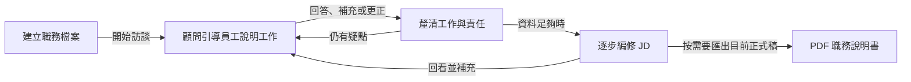

# Caliburn：把員工說得出的工作，整理成有依據的職務說明書

> 員工不必先成為 JD 專家。由 AI 主動訪談、釐清工作，再逐步寫成精簡、完整、符合實際工作的職務說明書。

本文是面向初次認識產品的讀者與專題報告聽眾的**產品介紹**，不是施工規格。以下介紹新架構的設計目標，**不表示這些效果已全部實作或驗收**。現行程式見 [README](../README.md#正式產品)；設計與已確認規則見[目標架構導覽](target-architecture-map.md)。最後核對：2026-09-29。

## 1. 問題不是不會打字，而是不容易把工作說完整

員工熟悉自己的工作，卻不一定知道職務說明書該寫什麼。回答「你負責什麼？」時，可能只想到最近的案件，漏掉例行工作、少見但重要的處理、判斷依據，或自己與同事的分工。

直接請 AI「幫我寫一份 JD」也不夠：文字可以很流暢，卻可能把團隊的工作寫成本人的責任，把一次經驗變成固定職責，或補出員工從未說過的要求。

真人顧問能追問與整理，但需要時間。專案提出者提供的既有情境是：**一對一訪談約需 3–4 小時，員工事前還需要上課**。這是本案的問題起點，不是業界平均統計；Caliburn 也尚未證明能節省多少時間。

我們要減少的是對真人顧問全程陪同及員工事前專業學習的依賴，**不是省掉真正必要的釐清**。

## 2. 產品交付的不是聊天紀錄，而是一份符合本人工作的 JD

Caliburn 是本機 Web 應用程式。一位操作者可以管理多份資料隔離的「職務檔案」；每份對應一位受訪員工，包含訪談、工作記憶及一份可以持續編修的 JD。模型推論使用外部 API；本機保存不等於模型離線執行。

主要使用方式是**員工說明工作，AI 負責專業引導與撰稿**。員工可以補充、更正，也可以直接編輯 JD，但不必靠自己填好所有專業欄位才能得到成果。

「完整」不是越長越好，而是用**最小、高訊號的文字涵蓋大部分實際工作與重要差異**：做什麼、負責到哪裡、形成什麼結果、有哪些必要條件，以及需要什麼知識與技能。缺乏依據時追問或保留未知，不為填滿表格創造 KPI、職責或資格。

這套內容判準來自專案已研究的[完整工作分析方法](specs/2026-09-09-complete-work-analysis-guide.md)與[JD 寫作指南](specs/2026-09-09-jd-field-and-writing-guide.md)，不是由模型臨場猜一套分析標準。

## 3. 使用者會怎麼走過這個流程？

下圖是**目標產品旅程**；箭頭表示互動推進，回線表示持續釐清，不代表每則回答都要改稿。

1. **開始說，不必先學會怎麼寫。**顧問用具體問題引導，員工也可以主動提供新資訊。
2. **先理解，再局部成稿。**某個主題已說清楚就可以寫，不必等所有工作一次講完；也不因聊了一輪就強制改 JD。
3. **看得到過程，也保得住成果。**顧問執行時可預覽本輪改稿；完成後才正式生效。可暫停、接續或取消尚未完成的顧問回合。
4. **持續補充，隨時取用目前稿。**可人工編輯，但顧問執行或暫停時不允許同時改稿。PDF 只匯出目前正式 JD，不把處理中的預覽當正式成果；第一版不附姓名、訪談或 Memory。

例如員工說：「我會處理網站訂單問題。」顧問不能立刻寫成「負責整套訂單系統」。它還需要問：本人處理前端還是後端？如何判斷異常？哪些情況交給同事？是每個網站都定期維護，還是只有特定合約？

**以下是示意，不是對任何員工的事實判定：**若訪談確認本人處理前端重複送單風險，後端規則由同事負責，JD 就應保留這個責任界線；不能為了看起來完整而擴張成全系統責任。

## 4. 長訪談如何不只留下「一段摘要」？

Caliburn 把工作資訊分成三層。這不是三份重複的 JD，而是讓不同深度的資料各自有用途：

| 資料層 | 留下什麼 | 幫助解決什麼問題 |
|---|---|---|
| 原始訪談 | 實際發話、先後順序、補充與更正 | 回查到底說過什麼，不以 AI 摘要代替原話 |
| 工作情境 | 一段可辨認的工作實況、過程、條件與未知 | 把分散在多次對話的細節整理在一起 |
| 工作理解 | 由相關情境支持的工作範圍、共同模式、責任與例外 | 掌握完整工作，又不必每次重讀所有案件 |

各層保留來源關係，讓人與 AI 知道分析的依據。JD 可以直接引用已核對原話，也可以引用已發布的情境或理解；**不必等背景整理完成才能有據改稿**。

工作情境分析 Agent（B1）整理情境；工作理解分析 Agent（B2）分析理解。兩者分工，不固定互相審批。整理中的資料不對顧問開放，完成後才共同發布一份固定快照。

快照保存的是當時的物件與關係：未變的內容可以重用，歷史依據不被新版覆蓋。顧問每回合固定使用一版已發布 Memory，背景發布新版也不會讓它做到一半突然換依據。

## 5. 資料越多，如何避免每次全部重新分析？

技術核心是 **App 自主管理模型 context，加上按需讀取與增量分析**：

- **導覽找位置**：先知道有哪些情境、理解與 JD 項目，再讀相關正文。
- **差異找變化**：上游改了什麼，由 App 根據實際資料形成 diff；模型不必把新舊全文全部重讀一遍。
- **原文補細節**：需要條件、脈絡或來源時，再深入目前可見正文與訪談。不是只看 diff 就算分析完成。
- **原生接續延續工作**：模型輸出與工具結果按原契約接續，App 控制範圍、順序與壓縮採用，不讓框架暗中另管一份歷史。

例如「所有網站每月維護」後來釐清為「只有 B 網站每月維護」，系統必須能讓下游分析注意到這個差異，而不只把新句子存起來。Memory 整理要完成本批相關分析再發布；JD 則可以分段處理。**只有看過差異不代表 JD 已核對**：顧問可能還要詢問員工，確認支持目前文字後才更新該筆依據。

這不是另造通用記憶平台。已選方向是 LangGraph 承接執行與恢復機制，OpenAI direct Responses 承接模型推論，PostgreSQL 承接業務資料與交易。App 自主管理不表示能讀懂供應商的加密 reasoning／compaction；它管理的是送入什麼、何時壓縮，以及如何可靠接續。

## 6. 為什麼還需要候選、恢復點與交易？

因為「畫面顯示過」不等於「正式保存了」，而「模型說完成」也不等於修改已生效。

| 使用者遇到的事 | 設計要保住的效果 |
|---|---|
| 顧問處理到一半斷線 | 已保存的模型／工具結果可接續；不能重複已成立的操作效果 |
| 想取消本輪、換個說法 | 放棄本輪候選與尚未正式成立的訪談資格；取消輸入不滲入後續分析 |
| 背景記憶整理失敗 | 保留已發布版，訪談仍可透過有效原話與讀取工具繼續，不交付半套記憶 |
| 來源更新或人改過 JD | 顧問看得到相關差異；人工文字不自動成為工作事實，舊依據也不自動換版 |

這些保障支持核心訪談與交付，不等於要做通用備份、無限重試或分散式工作流平台。業務決定哪些結果須一起成立，資料庫交易負責可靠提交；資料正確保存仍不等於 AI 已正確理解。

## 7. 怎麼證明產品真的有價值？

評估必須同時看成果與投入，不能只展示一份流暢樣稿或較低 token 數：

| 要驗證的問題 | 應觀察的證據 |
|---|---|
| JD 是否真正符合本人工作？ | 主要工作涵蓋、責任與條件正確、重要差異未遺漏、沒有無據擴張 |
| 長訪談後還能接續嗎？ | 早期情境再次出現、後期更正、來源變更時，仍能定位與調整 |
| 是否降低原本的投入？ | 真人顧問時間、員工準備／學習、訪談與修正時間，以及模型耗時與費用 |
| 中斷後成果可信嗎？ | 暫停、取消、重開、候選提交、固定來源回查與 PDF 的端到端驗證 |

目前不宣稱「零誤解」「自動滿分」或固定節省比例。專用全稿審核 Agent 暫不做；不為展示技術增加搜尋平台、規則引擎或微服務。先證明**員工持續訪談 → AI 有據分析 → 高品質 JD 可交付**這個閉環，才有依據討論擴張與商業模式。

## 用一句話總結

**Caliburn 不是把聊天變長，而是讓員工透過自然訪談，把分散的工作事實逐步變成有來源、可修訂、可交付的專業職務說明書。**

需要深入時：從[產品概念](product-concept.md)了解已確認需求，從[架構圖與閱讀地圖](target-architecture-map.md)逐層看設計，從[驗收矩陣](architecture/verification.md)辨認哪些效果仍待證明。本文是這些責任文件的讀者導覽，不另維護工具參數、門檻數字或資料庫規格。
