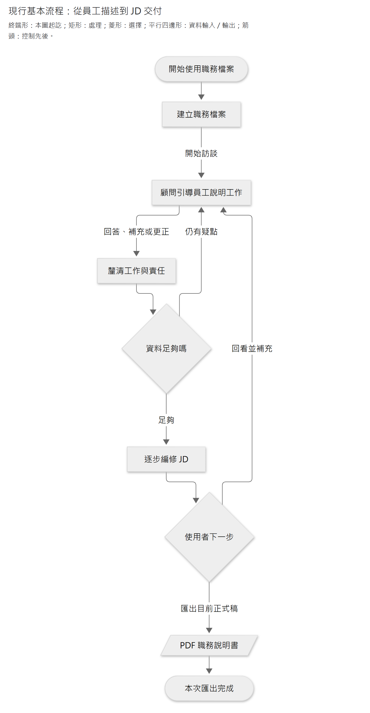

# Caliburn：把員工說得出的工作，整理成有依據的職務說明書

> 員工描述實際工作，AI 顧問負責追問、整理與撰稿，逐步形成有依據的職務說明書。

Caliburn 是透過 AI 訪談協助員工撰寫職務說明書（JD）的本機 Web 應用程式。它把訪談、工作資訊整理、結構化編輯與來源回查結合，讓員工不必先熟悉 JD 的專業寫法，也能逐步說清楚自己的工作。

核心流程已有真模型合成旅程驗證，分析品質與真人使用效果仍待評估。操作方式見[操作手冊](runbook.md#快速開始)，內部設計見[系統架構報告](reports/system-architecture/README.md)。

## 1. 問題不是不會打字，而是不容易把工作說完整

員工熟悉自己的工作，卻不一定知道職務說明書該寫什麼。回答「你負責什麼？」時，可能只想到最近的案件，漏掉例行工作、少見但重要的處理、判斷依據，或自己與同事的分工。

直接請 AI「幫我寫一份 JD」也不夠：文字可以很流暢，卻可能把團隊的工作寫成本人的責任，把一次經驗變成固定職責，或補出員工從未說過的要求。

透過顧問公司訪談得知，既有作業的一對一訪談約需 3–4 小時，員工事前還需要上課，JD 則以 Excel 管理。這是受訪公司的作業經驗，不是業界平均。除了訪談時間，結構化內容在試算表中的維護與回查也是本案要改善的問題。

產品希望減少真人顧問全程陪同及員工事前學習的負擔，同時保留釐清工作所需的追問。

## 2. 產品交付的不是聊天紀錄，而是一份符合本人工作的 JD

Caliburn 是本機 Web 應用程式。一位操作者可以管理多份資料隔離的「職務檔案」；每份對應一位受訪員工，包含訪談、工作記憶及一份可以持續編修的 JD。模型推論使用外部 API；本機保存不等於模型離線執行。

主要使用方式是**員工說明工作，AI 負責專業引導與撰稿**。員工可以補充、更正，也可以直接編輯 JD，但不必靠自己填好所有專業欄位才能得到成果。

JD 應以精簡文字涵蓋大部分實際工作與重要差異：做什麼、負責到哪裡、產生什麼結果、有哪些必要條件，以及需要什麼知識與技能。完整度不以篇幅衡量；缺乏依據時應追問或保留未知，不能為填滿表格而創造 KPI、職責或資格。

內容判準依據專案已研究的[完整工作分析方法](guides/2026-09-09-complete-work-analysis-guide.md)與[JD 寫作指南](guides/2026-09-09-jd-field-and-writing-guide.md)，分析標準不由模型臨時決定。

## 3. 使用者會怎麼走過這個流程？

下圖是**核心使用流程**；箭頭表示互動推進，回線表示持續釐清，不代表每則回答都要改稿。

[圖源](diagrams/product-introduction/core-user-flow.mmd) · [SVG](diagrams/product-introduction/core-user-flow.svg)

1. 顧問以具體問題引導訪談，員工也可以主動補充資訊，不必先學會 JD 的寫法。
2. 某個主題已說清楚時，就能逐步寫入 JD；不必等全部訪談結束，也不強制每輪改稿。
3. 顧問執行時可預覽本輪修改，完成後才正式生效。尚未完成的回合可以暫停、接續或取消。
4. 使用者可人工編輯，但顧問執行或暫停期間不能同時改稿。PDF 匯出目前正式 JD，不包含處理中的預覽；第一版不附姓名、訪談或 Memory。

例如員工說：「我會處理網站訂單問題。」顧問不能立刻寫成「負責整套訂單系統」。它還需要問：本人處理前端還是後端？如何判斷異常？哪些情況交給同事？是每個網站都定期維護，還是只有特定合約？

**以下是示意，不是對任何員工的事實判定：**若訪談確認本人處理前端重複送單風險，後端規則由同事負責，JD 就應保留這個責任界線；不能為了看起來完整而擴張成全系統責任。

## 4. 長訪談如何不只留下「一段摘要」？

Caliburn 將工作資訊分成三層，分別保存原話、具體脈絡與較穩定的工作理解，不在各層重複撰寫 JD：

| 資料層 | 留下什麼 | 幫助解決什麼問題 |
|---|---|---|
| 原始訪談 | 實際發話、先後順序、補充與更正 | 回查到底說過什麼，不以 AI 摘要代替原話 |
| 工作情境 | 一段可辨認的工作實況、過程、條件與未知 | 把分散在多次對話的細節整理在一起 |
| 工作理解 | 由相關情境支持的工作範圍、共同模式、責任與例外 | 掌握完整工作，又不必每次重讀所有案件 |

各層保留來源關係，讓人與 AI 知道分析的依據。JD 可以直接引用已核對原話，也可以引用已發布的情境或理解；**不必等背景整理完成才能有據改稿**。

背景工作由工作情境分析（B1）與工作理解分析（B2）依序處理，再發布為固定快照。B1 交接後不再修改本批情境，B2 不回交 B1；整理中的資料不對顧問開放。運作方式見[工作記憶章節](reports/system-architecture/05-work-memory.md)，實驗範圍與結果見[驗證與限制](reports/system-architecture/07-evaluation.md)。

快照保存的是當時的物件與關係：未變的內容可以重用，歷史依據不被新版覆蓋。顧問每回合固定使用一版已發布 Memory，背景發布新版也不會讓它做到一半突然換依據。

## 5. 資料越多，如何避免每次全部重新分析？

App 自行管理送入模型的上下文（Context），配合按需讀取與增量分析，讓模型接續既有工作：

- **導覽找位置**：先知道有哪些情境、理解與 JD 項目，再讀相關正文。
- **差異找變化**：上游改了什麼，由 App 根據實際資料形成 diff；模型不必把新舊全文全部重讀一遍。
- **原文補細節**：需要條件、脈絡或來源時，再深入目前可見正文與訪談。不是只看 diff 就算分析完成。
- **原生接續延續工作**：依原契約保留模型輸出與工具結果，由 App 控制範圍、順序與壓縮採用，不交由框架另外管理一份歷史。

例如「所有網站每月維護」後來釐清為「只有 B 網站每月維護」，系統必須能讓下游分析注意到這個差異，而不只把新句子存起來。Memory 整理要完成本批相關分析再發布；JD 則可以分段處理。**只有看過差異不代表 JD 已核對**：顧問可能還要詢問員工，確認支持目前文字後才更新該筆依據。

執行與恢復採用 LangGraph，模型推論使用 OpenAI direct Responses，業務資料與交易由 PostgreSQL 保存及處理，不另建通用記憶平台。App 管理輸入內容、壓縮時機與接續方式，但無法解讀供應商的加密 reasoning／compaction。

## 6. 為什麼還需要候選、恢復點與交易？

因為「畫面顯示過」不等於「正式保存了」，而「模型說完成」也不等於修改已生效。

| 使用者遇到的事 | 設計要保住的效果 |
|---|---|
| 顧問處理到一半斷線 | 已保存的模型／工具結果可接續；不能重複已成立的操作效果 |
| 想取消本輪、換個說法 | 放棄本輪候選與尚未正式成立的訪談資格；取消輸入不滲入後續分析 |
| 背景記憶整理失敗 | 保留已發布版，訪談仍可透過有效原話與讀取工具繼續，不公開未完成的記憶 |
| 來源更新或人改過 JD | 顧問看得到相關差異；人工文字不自動成為工作事實，舊依據也不自動換版 |

業務模組決定哪些結果必須一起成立，資料庫交易負責可靠提交。這些機制保護訪談與文件成果，不包含通用備份、無限重試或分散式工作流平台；內容是否符合實際工作，則透過分析品質評估判斷。

## 7. 怎麼證明產品真的有價值？

既有真模型合成旅程已完成 **45 輪訪談、3 批背景 Memory 與 4 頁 PDF**，並包含人工改稿、取消及中斷測試。員工由模型模擬，因此這支持核心流程可運作，不等於已證明真人訪談的品質或省時效果。具體證據與尚未解決的問題見[驗證與限制](reports/system-architecture/07-evaluation.md)。

評估必須同時看成果與投入，不能只展示一份流暢樣稿或較低 token 數：

| 要驗證的問題 | 應觀察的證據 |
|---|---|
| JD 是否真正符合本人工作？ | 主要工作涵蓋、責任與條件正確、重要差異未遺漏、沒有無據擴張 |
| 長訪談後還能接續嗎？ | 早期情境再次出現、後期更正、來源變更時，仍能定位與調整 |
| 是否降低原本的投入？ | 真人顧問時間、員工準備／學習、訪談與修正時間，以及模型耗時與費用 |
| 中斷後成果可信嗎？ | 暫停、取消、重開、候選提交、固定來源回查與 PDF 的端到端驗證 |

目前仍有誤解與品質不足的可能，尚無固定的省時比例。第一版暫不加入專用全稿審核角色、搜尋平台、規則引擎或微服務。評估重點是持續訪談能否產出有依據、高品質的 JD，再根據結果討論擴充與商業模式。

## 用一句話總結

Caliburn 讓員工透過訪談，把分散的工作事實逐步整理成有來源、可修訂、可交付的職務說明書。

進一步閱讀：[產品概念](product-concept.md)說明資料與功能的關係，[架構導覽](target-architecture-map.md)整理各主題，[驗證章節](architecture/verification.md)列出測試方法、結果與限制。
