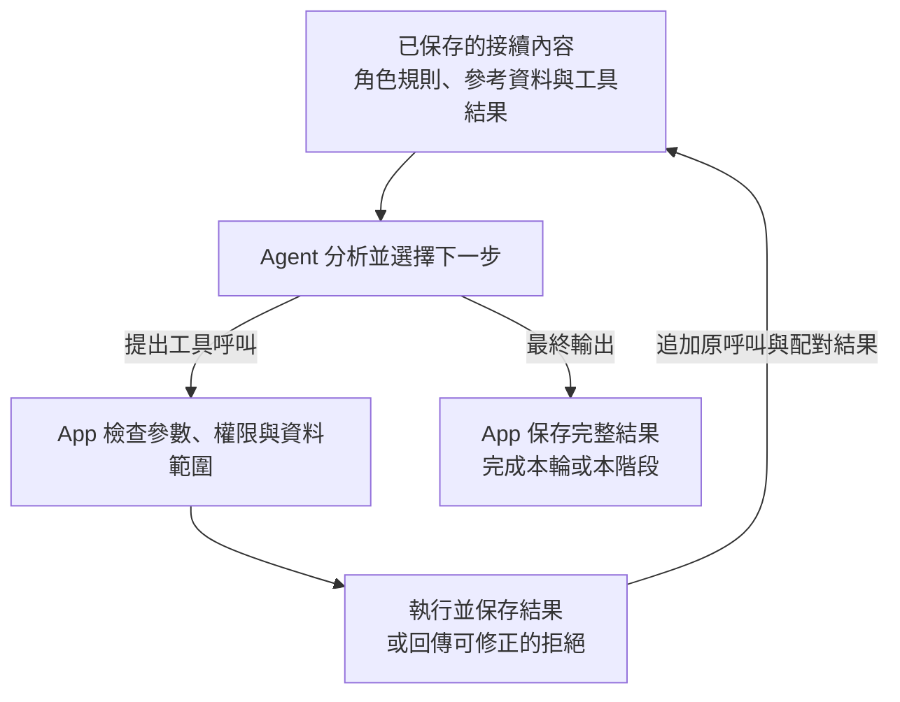

# Caliburn 具分層工作記憶與可追溯依據的 AI 職務訪談系統

## 摘要

職務說明書的價值，在於準確呈現員工實際負責的工作，而非列出職稱常見的職責。本專題透過訪談顧問公司，了解一對一工作訪談、事後整理及以 Excel 維護職務說明書的作業負擔，開發 Caliburn AI 職務訪談系統。系統以完整、精簡且有據的 JD 為目標，由顧問 Agent 引導員工描述工作、釐清責任，並保留文件所依據的訪談脈絡，供真人顧問接續核對與精修，支援顧問作業的數位化。

面對長訪談與持續變動的資訊，Caliburn 設計「訪談原話—工作情境—工作理解」三層資料模型，以導覽及按需讀取保留概覽與細節，再透過版本差異支援增量分析。可變工作稿與固定發布快照分別承接編輯及歷史查閱；模型上下文、工具權限與提交邊界由應用程式管理，串接訪談、記憶整理、JD 共編、保存與 PDF 交付。

在兩種合成人設、各重複三次的指引比較中，採用版本將平均每份訪談引出的指定工作面向由 0 增至 2.17，成果與要求近似重抄任務的比例由 38% 降至 20%。另一場採購人設旅程完成 45 輪訪談、三批記憶整理與四頁 JD PDF，呈現多輪分析、人工修訂與文件交付的整合成果。專案亦建立從模型輸入、工具操作到保存結果的追查方法，將實驗發現轉為具體設計取捨。成果是一套以員工事實為依據、能隨訪談持續修訂的職務分析系統。

工作記憶的比較進一步顯示，資料整理與閱讀策略須共同設計。在固定同一份 Memory 的閱讀策略實驗中，共同完成的三對測試均保留 33／33 項核心事實；加入「資訊足夠即停止深入」的規則後，讀取由 23 次降至 3 次，累計輸入減少 56.2%。另從 52 段訪談的既有成果接續測試，系統在早期原話未放入當次上下文時，能由工作理解找回進貨數量、入帳期限及財務權責，並完成 JD 局部更正。這些結果呈現分層設計的實際用途：將已完成的分析保存為可選讀、可修訂且有來源的工作知識，供後續訪談沿用。

關鍵詞：職務分析、引導訪談、Agent Harness、分層記憶、來源追溯、模型上下文管理。

## 一 緒論

### 1.1 從員工的工作經驗形成職務說明書

一份有用的職務說明書（Job Description，以下簡稱 JD），需要說明員工實際做什麼、為何做，以及責任到哪裡。相同職稱未必代表相同工作：庫存人員可能負責清點與記錄，也可能只協助異常初查，而帳務調整由主管決定。若直接套用通用範本，便容易把協助寫成主責，或將單次事件擴大成固定職責。

本專題的需求源於對顧問公司的訪談。我們了解到，其一次一對一職務訪談約需三至四小時，員工在訪談前還需要上課，以學習如何表達工作內容。專業顧問的負擔不僅是記錄回答，還包括引導回想、追查細節、區分工作層次，以及將零散敘述整理成合適的文件。

受訪顧問期待 AI 先協助探索員工的工作內容，形成具備基本職責輪廓的 JD 底稿，作為後續訪談與精修的起點。這項需求著重於減輕前期探索的負擔：顧問能先了解已整理的工作範圍，再將與員工互動的時間用於釐清關鍵差異、補足資訊缺口及修訂敘述，減少每次從零盤點工作的準備。

訪談亦得知，受訪顧問以 Excel 管理職務說明書。JD 雖以文件呈現，內部卻包含職責、任務、成果、完成要求、知識與技能等相互關聯的內容。例如，一項職責可包含多項任務，同一項技能也可能支援不同任務。當這些內容主要以儲存格編排時，項目間的關係、修改前後的差異，以及敘述所依據的訪談資訊，較難直接在文件中一併掌握。這使需求不只在於產生文字，也在於讓顧問能持續管理、核對與修訂分析成果。

Caliburn 將前期探索與資料整理轉為可持續進行的 AI 引導訪談。員工只需描述熟悉的工作經驗；顧問 Agent 依回答選擇問題，釐清條件、成果與責任，並逐步編輯 JD。員工可以隨時補充或更正，系統則一併保留訪談原文、工作情境與文件依據。真人顧問接手時，可由 JD 敘述回查當時的說法、條件及更正過程，了解內容如何形成，再決定需要深入確認或精修之處。

在文件管理上，系統將職責、任務及所需能力建成可個別編輯、彼此關聯的資料，提供章節導覽、局部修改、來源回查及 PDF 匯出。訪談形成的資訊與文件內容因而能在同一套流程中銜接，將顧問作業的數位化由電子表格的編排，延伸至工作資料、分析依據與文件修訂的管理。

### 1.2 核心困難

從自然對話形成專業文件，涉及五項相互關聯的挑戰。

**工作語意依賴脈絡。**「每個月」「不是我決定」「只有旺季才做」都需要前文才能理解。同一次回答也可能只回應問題的一部分，因此整理時必須辨認回答範圍，保留條件、例外與未知。

**長訪談需要跨階段保留分析依據。**職務訪談經過逐步追問，會累積工作頻率、處理數量、交付時限、適用條件與責任界線；簡短的補充也可能改變一項職責的解讀。這些資訊分散於訪談前、中、後期，重要性並不取決於出現時間，後續更正也須與原先敘述對照理解。隨訪談累積，每次重新提供全文會增加推論負擔，只保留近期對話或概括摘要則可能漏掉仍有效的工作內容。系統因此需要在有限 Context 中延續整體理解，並能定位、回讀各階段的具體細節與原始脈絡。

**新資訊會改變既有成果的依據。**員工的後續補充可能修正工作理解，而 JD 已經據此撰寫。系統須辨認哪些內容受影響，保留原先的分析基準，並支持局部修訂。

**分析與編輯有不同的完成時點。**模型可能先執行多項修改，再形成完整答覆。預覽、暫停、取消及正式保存需要一致的資料規則，才能讓使用者掌握哪些結果已成立。

**內容忠實與職責完整是兩種問題。**JD 可以忠實整理已談內容，卻仍漏掉員工從未提及的低頻重要工作。除了深入已知線索，顧問還需要探索可能遺漏的面向，經員工確認後，逐步建立訪談收束的判斷依據。

### 1.3 目標與研究問題

在可供顧問接續精修的底稿需求之上，本專題進一步以達到專業交付要求的完整 JD 為研究目標。品質要求包括符合員工實際工作、涵蓋主要職責、清楚表達責任與適用條件，並以精簡敘述呈現工作目的、成果及所需能力。系統的分析與編輯設計以此為準，持續朝可交付成品推進，而不以產生初稿作為終點。

文件品質與顧問接手所需的資訊也一併考量：JD 提供整理後的職務全貌，訪談原文與來源關係保留具體脈絡，讓顧問既能閱讀成品，也能理解其形成依據。系統協助職務分析與文件維護，人事決策及績效評分不在研究範圍。

本文圍繞四個問題展開：

1. 如何將工作分析方法轉為主動追問及文件整理行為？
2. 如何組織跨輪資訊，使新分析能接續既有理解，又能回到原話核對？
3. 如何讓人與模型編輯同一份 JD，並保留來源、版本及明確的完成邊界？
4. 如何透過實驗分辨有益的改進與表面的指標增加，據此選擇設計？

訪談完整性與收束是此方向的延伸研究：本階段先建立持續訪談、整理與評估的系統基礎，第六章進一步提出以多份公版 JD 輔助探索未談工作的方法。

### 1.4 主要貢獻

本專題的主要成果如下：

1. **將職務分析建模為可持續修訂的資料關係。**原話、具體情境與穩定工作理解各有明確用途；版本差異指出重新分析的範圍，發布快照則固定當時的內容與依據。這使後續整理能沿用既有成果，而非從整份逐字稿重新開始。
2. **整合可追溯的 JD 編輯與交付流程。**職責、任務及能力以明確關係管理，串接訪談、背景整理、結構化編輯、候選預覽與 PDF 匯出。人或模型修改文件後，仍可查閱其依據並重新核對，支援顧問從資料蒐集到文件維護的數位化作業。
3. **共同設計分析指引、Context 與工具介面。**模型依導覽選擇細節及操作，App 管理資料範圍、權限、歷史與保存結果；工具的輸入、回傳和錯誤均為下一步分析提供明確資訊。
4. **建立以實驗支援取捨的迭代方法。**從早期檢索、記憶表示到現行指引比較，保留反例、原始輸出及判讀依據。短程比較呈現提問與敘述品質的改善，長旅程則檢查核心功能共同運作的結果。

## 二 背景與相關方法

### 2.1 工作分析先於文件生成

美國人事管理局將工作任務、完成工作所需的能力及兩者的關係列為工作分析內容。[1] 這提供一個重要區分：能力應與實際工作有關，而不是看到職稱就填入通用條目。

O*NET 的內容模型進一步區分工作活動、工作情境，以及完成工作所需的知識與技能。[2] Caliburn 將這些面向轉為訪談觀察方向：不只問員工做了什麼，也釐清觸發條件、判斷、交接及責任邊界。英國 HSE 的安全任務分析指引提醒，低頻但重要、涉及判斷或多方溝通的工作值得深入理解。[3] 因此，系統的分析指引兼顧例行、週期、專案及低頻工作，不以最近一次事件代表全部職責。

JD 的內容結構則參考臺灣 iCAP《職能基準發展指引》，區分工作任務、工作產出、行為指標、知識及技能。[4] 英國 NOS 將表現準則落在應完成的行動與條件，並保留超出本人責任時的轉交要求。[5] Caliburn 據此分開描述「做什麼」「產生什麼結果」與「應符合什麼條件」，避免將同一句任務文字重抄成成果與要求。沒有明確獨立產出時，不為填滿欄位而虛構文件或數字。

任務敘述參考 O*NET 的寫作指引，以動作與對象為核心，視需要補入目的、結果及情境；這不是要求每句都塞入全部成分。[6] 知識與技能的區別則參考 ESCO 對技能的界定：技能包括運用知識與方法完成任務或解決問題，不只是列出軟體名稱。[7] 系統因此將共用知識、技能與實際任務連結，讓讀者看出能力的用途。

上述來源經整理形成專案的工作分析與 JD 寫作指南，再轉為 Agent 的角色指引及評估判準。官方職業資料提供分析方法，不直接證明這名員工負責哪些工作；例如指南可提醒顧問詢問核准權限，不能據此認定員工具有核准權。

為使內容準則能具體核對，團隊建立一組含 15 項虛構工作情境的前端工程師 JD 樣稿，從兩個方向審查：由情境檢查重要工作是否在 JD 中得到適當呈現，再由 JD 的每項敘述回查支持依據。前者檢查遺漏，後者檢查責任擴大或無據補寫。這份設計樣稿用來校準內容與粒度；附錄 B.8 呈現代表案例及審查中實際修正的問題，第四、五章另評估模型的產出。

### 2.2 從回答問題到主動引導訪談

訪談系統需要根據回答挑選有價值的下一個問題。專案早期真人試訪揭露重複提問及含糊回答未被釐清的情況，促使我們研究自適應訪談的回應方式。Wuttke 等人的研究提供適時確認理解、連結先前回答及追問不明內容的指引。[8] Zhang 等人的半結構訪談研究則說明追問如何承接前文、由概括描述深入細節。[9]

早期指引據此加入確認理解、具體追問及誤解修復，再以逐輪輸出與欄位記錄檢查效果。校準中亦觀察到，強調回述可能使模型只回應員工而漏記已取得的資料。因此，系統同時檢查對話行為與保存成果，讓「接住回答」落實為後續分析可用的資訊。

訪談控制流程也隨診斷調整。一次早期試訪進行 28 輪仍未形成行為指標，團隊回查 130 筆操作裁決，發現部分分析教材未送入模型，固定欄位排程又使後續分析難以到達。當時據此移除原先逐槽選題路徑，改以工作事件組織議程。這項演變將「該問什麼」與「哪些資料已取得」分開，讓一次回答可以同時補充多個工作面向。

現行指南另參考 Anthropic Interviewer 先設定研究目標與判準、再依回答調整路徑的方法。[10] Caliburn 據此保留應釐清的工作面向，將會改變責任、服務範圍、重要完成要求或專業判斷的資訊缺口，作為優先追問的方向。例如員工說「我們會決定時程」，顧問需要區分本人估算什麼、誰協調，以及誰最後對外確認，才能避免把團隊的承諾權全歸於個人。

這項策略從目前理解的缺口選題，而非依 JD 的空白欄位逐格詢問。已有內容先讀回，不因模型未記住就重問；兩段說法不一致時，先辨認是否屬於不同案件、時期或條件，再中立追問。若員工仍無法確認，便保留未知，改從他能說明的工作繼續，而不反覆逼答或自行補成確定事實。

### 2.3 檢索相關內容不等於判定工作相同

早期系統曾以公開職能標準、向量檢索及候選去重支援工作分析。研究參考 Li 等人對預訓練句向量的分析，其 BERT 實驗指出向量空間分布會影響語意相似度。[11] 我們據此回查自己的文字前處理、標註配對與分數分布，而非直接套用分數門檻。§3.7 的反例進一步顯示，同一任務的改寫與同領域的不同任務可能得到重疊分數。

由此形成的設計區分是：**檢索負責找到值得比較的候選，工作分析負責判斷其意義。**外部職能標準用於參考，員工的工作事實則由訪談建立。現行 JD App 透過分層整理及按需讀取處理職務檔案；檢索增強生成（RAG）保留為獨立研究範圍，並於第六章作為訪談完整性研究的候選方法。

### 2.4 模型接續與工作記憶是不同問題

模型上下文（Context）是一次推論可使用的指令、對話及工具結果；工作記憶（Memory）則是對員工工作的持久整理。前者承接模型執行，後者累積業務理解。

長上下文研究提供了這項區分的背景。Liu 等人在多文件問答與鍵值擷取實驗中，觀察到受測模型會因相關資訊位置不同而改變表現。[12] LongMemEval 則以資訊擷取、跨會話推理、時間推理、知識更新及資訊不足時不臆答等能力評估記憶，並區分索引、檢索與閱讀階段。[13] 專案早期 Context 研究參考這些工作，將完整來源、可修訂工作表示及當次輸入分開設計。

對話事實還包含人物、指涉、時地與否定範圍。She 等人以摘要與事實問答檢查這些資訊的一致性。[14] 此研究支持本專題保留原始對話回查路徑的設計方向：整理可以修訂，來源則持續存在。

Caliburn 將「先概覽，再讀細節」實現為導覽、正文與來源查閱。導覽協助選擇，正文保留完整條件，引用連回原話；原生壓縮管理推論視窗的容量，正式業務資料另行保存。由此可分別檢查三件事：資訊是否留下、當次是否提供，以及模型是否採用。第三章與第五章以實際診斷說明這項分離的用途。

### 2.5 Agent 執行框架與程式控制邊界

本文的 Agent 指能依任務目標與目前資訊，選擇工具行動，並根據執行結果繼續分析的模型執行單元。Caliburn 使用 OpenAI Responses API 的工具呼叫機制：模型提出呼叫，App 執行並回傳配對結果，再讓模型接續。[15] 這個循環可能包含多次讀取與修改，不以收到一段文字判定任務完成，也不依賴讀取或展示模型的私人推理文字。

此外，固定工作流程與 Agent 自主選擇並不衝突。Anthropic 的工程說明區分程式預定的工作流程與模型動態決定的工具使用。[16] 本專題在外層固定背景整理的 B1 → B2 → 發布順序，在各角色內部保留按需讀取、判斷及編輯的彈性。模型決定分析行動，App 決定可讀寫範圍、操作是否成立及何時正式生效。

本文將模型外圍負責接續執行的機制稱為 **Agent 執行框架（Agent Harness）**。它組裝上下文、執行工具並將結果交回模型，管理進度與恢復位置，使模型的多次推論形成可持續的工作流程。Anthropic 的長期 Agent 工程研究也將工具使用、Context 管理及跨次執行銜接放在這個層次討論。[17] 在 Caliburn 中，這些機制由 A、B1、B2 共用，各角色的分析指引與資料權限則分開；§3.4 及 §3.6 說明其 Context、工具及保存設計。

LangGraph 的 checkpoint 保存執行歷程中的狀態，PostgreSQL 的交易則確保一組資料更新共同成立或共同取消。[18][19] Caliburn 採用這些機制承接執行與保存，再於應用層定義正式訪談、取消範圍與歷史引用。技術重點在於將分析判斷、資料關係與執行邊界組成一致流程，而非單純增加 Agent 數量。

## 三 系統設計與關鍵取捨

### 3.1 整體流程與分工

Caliburn 是本機 Web 應用程式。使用者透過瀏覽器訪談及編輯 JD；後端執行工具、管理資料並呼叫外部模型。前端採 React 與 TypeScript，後端採 Python、FastAPI、LangGraph 與 PostgreSQL，模型透過 OpenAI Responses SDK 直連。產品基於成本考量使用 GPT-6 Luna（API 型號為 `gpt-6-luna`，以下簡稱 Luna），分析指引與工具皆圍繞這項選擇調整。


圖一：瀏覽器、後端及資料庫構成本機產品；模型推論透過外部服務完成，所需訪談資料由後端組裝後傳送。

系統依工作目的劃分三個 Agent：

- **顧問 Agent（A）**直接與員工互動，判斷下一個問題、查閱工作依據及編輯 JD。它須兼顧對話的連貫性與文件目前缺少什麼。
- **工作情境分析 Agent（B1）**整理有效訪談中的具體工作，保留過程、條件、例外與原話來源。它不讀寫工作理解，也不編輯 JD。
- **工作理解分析 Agent（B2）**依 B1 完成的情境與變更資訊，分析較穩定的工作範圍。它可以讀取情境及合法訪談，但只能維護工作理解，不修改情境或回交 B1。

這項分工對應即時訪談、具體經驗整理與跨情境歸納三種工作。A 不必在每次回答時重整全部歷史；B1 可保留具體條件，B2 則專注歸納，不將個別事件直接當成一般職責。三者共用模型／工具執行機制，但各有自己的歷史與權限，不互相複製整份 Context。系統維持單一後端，未因角色不同就拆成獨立微服務。

一次使用流程從員工回應引導問題開始。A 結合既有工作理解與近期原話，決定繼續追問或修改相關 JD 項目；使用者可預覽改動，成功完成後才保存為正式成果。累積到值得整理的資訊時，A 提出背景整理要求，本輪完成後依序執行 B1、B2 並發布 Memory。後續訪談在每輪開始時取得當時最新的已發布整理，JD 則可逐項修訂並匯出。

本文將一次員工輸入到顧問完成回答的執行稱為一個 Turn；一次完整模型回應及其要求的工具結果構成一個 Step，一個 Turn 可包含多個 Step。正式訪談訊息另有序號，與模型執行次數分開。這使未完成或取消的輸入不會被誤當成既有工作事實。

### 3.2 從語意記錄走向三層工作記憶

記憶設計經歷對話窗口、可修訂語意記錄，再到工作情境與工作理解分層。早期 LangMem 試驗以 16 輪訪談及六個批次形成五筆最終記錄，顯示資料能持續整理，也暴露不同記錄的內容重疊。後續設計因而區分「某件工作如何發生」與「這代表什麼穩定職責」，分別保存具體過程與跨情境歸納。

以下沿用架構圖的課程行政合成例子，僅用於說明設計，不是實測結果。員工先說每個上課日整理簽到表，後來補充每季統計交主管，並說明漏簽補登與新增的複核程序。這些資料可形成三種不同表示：

表一：同一組訪談資訊在三層工作記憶中的用途。

| 層次 | 保存內容 | 在例子中的作用 |
|---|---|---|
| 訪談 | 有角色、順序與原文的有效訊息；補充、更正另成訊息 | 保留每日整理、每季彙計、補登與主管複核的原始表達 |
| 工作情境 | 具體工作的過程、條件、例外及未知，並連到原始訪談 | 分別整理出席紀錄彙整、季報統計及漏簽補登 |
| 工作理解 | 從情境歸納的較穩定工作範圍與責任，並連到情境 | 由前兩項情境形成「課程執行資料管理」；尚未歸入的補登情境仍可獨立存在 |

JD 可以據此寫成適合交付的任務。引用通常指向工作理解，沿其關係可回查情境及原話；尚未整理的資訊，或不宜透過工作理解引用的個別情境，也可直接作為依據。沒有必要把同一條鏈的各層重複列成多筆來源。


圖二：同一任務可以引用工作理解，並按需另引該鏈未涵蓋的情境或對話。箭頭表示依據關係，不代表每輪一定逐層重新生成，也不代表三種來源互斥。

分層也處理了分析深度與文件精簡之間的取捨。分析指引不以字數決定資訊是否重要，而是檢查省略之後，是否可能改變對工作、責任、適用條件或確定程度的判斷。影響判斷的細節留在相應層次：情境保留具體過程與例外，理解整理可沿用的工作範圍及條件，JD 則呈現適合交付的職責與任務。單次事件的操作順序不必全部升入 JD，但不能連同責任界線一起刪去。

更新分析時，同樣需要判斷更正的適用範圍。以附錄 B.8 的前端工程師樣稿為例，電商案的交付後服務限於缺陷修正，預約案另有每月檢查約定；「好像每案都有月維護」經釐清後，應改為有約定的案件才按月檢查。後續若只補充電商案，並不代表預約案的既有責任失效，也不能將預約案的月檢條件套到所有案件。新舊說法有差異時，分析須分清補充、更正與條件不同，未釐清的矛盾則保留來源及未知，不直接採信最後一句。版本差異協助定位變動，變動的語意範圍仍由分析判斷。

這種分層讓下次分析從已整理的內容繼續，需要核對時再深入。導覽以標題與簡短描述協助判斷相關位置，完整正文及來源由工具按需讀取。精簡的是當次閱讀量與成品中的重複敘述，而非把所有資料都壓成同樣簡短的摘要。

工作理解應以足以支援一項工作判斷的範圍組織，保留該範圍內的條件、數值與責任；它不只是指向下層的目錄。顧問讀到的理解已足夠且沒有衝突時，即可使用，不必為了確認引用存在而逐層重讀。情境承接具體過程與例外，原話則提供原句、歷史說法及特定疑點的查證。這讓「理解 → 情境 → 原話」成為依問題選擇的閱讀路徑，而非每次必走的流程。

### 3.3 候選工作區與發布快照

工作情境及工作理解都可能新增、改名、修改或刪除。整理期間，B1／B2 操作目前的候選工作稿，標題只是模型可用的定位方式，資料庫以穩定身分處理物件。B1 只能維護情境，不能讀寫理解；B2 可以讀取情境並維護理解，不能修改情境。

一次背景整理先固定可用的有效訪談範圍，B1 完成後由 B2 接手。B2 接收情境變更資訊，既有關係指出哪些理解可能受影響；新增而尚未有引用的情境，也必須能從差異中被看見。模型仍須判斷是否新增、合併、刪除或調整理解，而不只是修補已有關係。

B2 完成本批整理後，App 發布整體快照。快照固定各層物件的修訂與關係，未變物件可以重用；不要求所有物件共用同一個版本號。對同一個物件，從同一快照的任何引用路徑讀取，都必須得到相同內容與下層引用。


圖三：新版快照選用修改後的物件，也沿用未變的物件修訂；舊快照仍可查。可變工作稿使背景整理能反覆編輯，固定快照則讓顧問與 JD 的歷史依據不被後來修改覆蓋。

文字與依據關係亦分開管理。例如情境由「每月盤點」修訂為「每季盤點」，某項工作理解經分析後可以保留原正文，但它依據的情境已不同；發布時仍須形成包含新引用的理解修訂，正文內容則可重用。舊快照繼續保留原引用。這使系統能表達「文字未變、分析依據已更新」，而非僅以文字相同判定兩版等價。

顧問 A 在一輪開始時選定最新已發布快照，後續步驟沿用同一版。背景途中發布新版，不會偷偷改變 A 本輪讀取的內容。Memory 尚未整理的有效訪談由近期歷史資料與讀取工具補足；背景整理失敗不代表訪談必須停止。

### 3.4 Context 與工具共同設計

Context 管理的目標，是減少每次推論重複載入的內容，同時保留跨階段分析所需的依據。Caliburn 以分層 Memory 承接已整理的工作資訊，透過導覽提示可深入的位置；尚未整理的內容則由近期歷史訪談及讀取工具補足。「近期」依 Memory 的整理邊界界定，不代表較早的資訊較不重要。當分析涉及數值、條件、例外或前後更正時，Agent 可沿來源讀回原話與相關訊息，不必依賴壓縮後的概括敘述推測細節。這讓訪談早期建立的職責，仍能與中後期補充一起參與後續分析。

長訪談的輸入負擔不全來自對話正文。一次歷史 JD 撰寫診斷發現，17 次摘要後的請求估算量仍超過當時的觸發門檻。團隊固定同一條執行軌跡，分別計量工具定義、近期讀取與摘要，發現一頁 JD 回傳中的定位字串約占 86%；即使把摘要暫時縮成一個字元，所有請求仍超過門檻。這個下界實驗排除了「只把摘要寫短」作為主要解法，將問題定位到資料表示與壓縮政策的配合。

Caliburn 因此把 Context 組裝、工具說明、參數及回傳視為同一條資訊路徑：模型先取得判斷所需的內容，再選擇操作，最後以實際結果接續分析。歷史量測的條件與數值見附錄 B；以下說明現行系統如何分配這些責任。

模型執行採圖四的循環。一次回應可提出多個工具呼叫，由 App 依序處理，再把配對結果交回模型；模型可以據此繼續讀取、修正或形成最終輸出。A 的最終輸出面向員工，B1／B2 則回報本階段分析完成。分析完成與正式保存是不同步驟，實際生效由 App 處理。



圖四：Agent 的分析—行動—觀察循環。模型選擇語意行動，App 執行並記錄實際效果；外層流程另外控制角色順序、取消與有界重試。工具結果是後續判斷的依據，模型說「已修改」本身不代表資料已提交。

#### 3.4.1 分開組裝工作規則與參考資料

應用程式自行組裝模型 Context，分開放置分析規則、接續歷史、業務參考資料與當次員工輸入。分析規則說明角色職責與操作限制；訪談原話及 Memory 正文則是待理解的資料，不能因為出現在工具回傳中就成為高權限指令。角色分離之外，工具執行仍檢查讀寫權限，避免把防止越權完全交給模型判斷。

角色提示由工作分析與 JD 指南整理而成，與程式一起版本管理，修改時檢查代表性案例及實際組裝結果；這採用了 OpenAI 提示工程指引所建議的版本化與評估方式。[20] 提示保留本角色所需的分析準則，工具用途與參數限制則放在相應契約，不在每次請求重貼整份指南。

以顧問 A 為例，一輪開始時，App 先固定可讀取的 Memory 快照，再組裝下列內容：

1. 角色的分析指引及允許使用的工具。
2. 前輪接續歷史，或已安全採用的完整壓縮結果。
3. App 參考資料：固定快照的工作情境與工作理解導覽，以及尚未被該快照整理的近期有效歷史訪談。
4. 當次員工輸入，與歷史參考資料分開提供。

一般情況預先放入尚未整理的完整歷史訪談。若首次請求經計數確定超過硬容量，App 才縮減預載範圍：保留完整訊息及必要前問，明示未載入的序號範圍，供 Agent 按需回讀，不把未載入當成已讀或已整理。

後續 Step 追加模型輸出、工具呼叫與配對結果，不把較早的觀察原地改成新值。需要 JD 時，再按需取得 JD 導覽及相關項目；需要原話或完整情境時，也透過工具深入，不在每次請求重貼全部長文。B1／B2 使用相同的組裝原則，但資料範圍與可用工具依其職責分開。

容量管理在執行準備階段及完整步驟間檢查實際請求，按門檻進行原生壓縮。完整壓縮結果經保存並確認採用後，成為後續推論基底；原始訪談與正式 Memory 快照另行保存，需要細節時仍可回讀。這使推論視窗的容量管理與業務資料的長期保留各自處理。

#### 3.4.2 讓參數表達分析意圖

工具按工作任務設計，而非把每張資料表都直接暴露成操作入口。名稱使用動作與對象，例如 `read_work_situation` 與 `update_work_situation`，使讀取和修改的用途可辨識。工具說明交代使用時機、作用範圍與成功的含意；參數說明則交代值從哪裡取得、代表什麼，以及省略時如何處理。

模型負責需要語意判斷的選擇，例如要修改哪個情境、修改哪些內容，以及選取哪些來源。App 已知的職務檔案、角色權限、固定快照及內部版本不要求模型重填。這符合 OpenAI 對函式設計的建議：清楚定義用途與參數，將程式已知的資訊交由程式處理。[15] 例如 `target_title` 表示導覽中的目前標題，由 App 在允許的範圍內解析為物件身分；它不是讓模型自行產生資料庫 ID。

工具參數使用嚴格結構描述，執行前再由 App 檢查權限及業務條件。結構合法只能說明參數符合契約，不能保證所選來源支持內容；後者仍屬於分析與評估的問題。

Memory 更新使用 `changes` 表達本次修改集合。標題與描述提交完整新值，長篇 Markdown 正文提交局部差異，未列欄位保持不變。同一物件的一次邏輯修訂可以同時調整多個欄位；如果其中一項不合法，整次更新拒絕，不留下部分改動。JD 則以職責、任務、成果、要求及共用能力等結構化項目操作，不強迫兩種不同資料共用同一種編輯表示。

#### 3.4.3 回傳足以支持下一步的觀察

回傳內容依閱讀任務決定。導覽使用精簡 JSON，保留層級、標題、必要預覽及後續定位；JD 全稿閱讀以 Markdown 回傳，Memory 則在結構化結果中保留 Markdown 正文與來源入口。修改效果提供可讀的文字差異。讀取一個物件時，不無條件展開整條引用鏈，讓模型先判斷相關性，再取得需要的細節。

成功結果呈現實際成立的效果，而非再次複製所有輸入。建立操作可回簡短成功狀態；長文修改則須回實際差異，使模型能確認改到哪裡。若採用模糊匹配，實際匹配的原文可能與請求略有不同，更不能只把原請求回送成修改結果。

這項精簡發生在新工具結果形成時，不是事後縮寫已送入模型的歷史。原工具呼叫與回傳仍保持配對，必要定位及來源也不能為了節省 token 而省略。Anthropic 的工具工程建議同樣重視任務相關的結果、清楚說明與可修正的錯誤；本專題依職務分析的資料結構選擇具體格式，並以操作正確性及後續分析是否取得必要資訊作為檢查重點。[21]

#### 3.4.4 將錯誤轉成可處理的回饋

工具錯誤區分模型可修正的意圖與程式執行故障。前者包括參數不合法、標題衝突及長文定位歧義；回傳說明原因、是否已修改，以及合法的下一步。後者如短暫斷線或限流，由 App 依有界恢復策略處理，不要求模型反覆改寫相同參數。保存結果尚未確認時，也不能直接宣稱「沒有修改」並重做操作。

以課程出席紀錄的合成例子說明：B1 要將「彙計後送主管複核」補入工作情境，但提交的局部差異在正文有兩處匹配。App 拒絕整次修改，指出歧義及補充前後文的方向；模型再讀取相關內容，加入能區分位置的文字後重新提交。成功回傳的是實際修改片段，B2 後續才能依情境變化分析工作理解。附錄 A 列出這段過程中模型與 App 各自負責的資訊。

此例展示的是工具契約如何支援修正，不把「模型提出修改」等同「修改已成立」。既有資料庫測例也檢查了這項界線：在同次改名、正文修改與來源移除中注入正文歧義，確認整次操作被拒絕，原內容與引用保留。

#### 3.4.5 讓分析過程可以追查

資料保存、模型看到的內容與實際採用的來源分開記錄後，語意錯誤就有了可追查的路徑。早期診斷曾遇到員工只回答複合問題中的第一部分，整理結果卻把兩部分都記成沒有經驗。回查確認八則完整訊息均已提供，進一步比對抽取候選與整併結果，才定位到最早改變回答範圍的抽取步驟。

此例呈現本專題採取的診斷方法：先確認資料是否送達，再找出資訊在哪一階段被選擇或轉換。這能區分 Context 缺漏與語意解讀，將調整聚焦在可檢查的環節。現行系統的跨輪引用診斷亦沿用此方法，於 §5.2 展開。

#### 3.4.6 以版本差異支援增量分析

持續訪談帶來的更新，往往只涉及長篇工作資料中的部分條件或責任。若每次都將新舊兩版全文交給模型，大量未變內容會重複進入 Context，模型也須重新找出值得關注的變動。Caliburn 將版本差異（diff）作為重新分析的入口：由 App 比較既有分析所用的資料與目前可用的資料，呈現變更，再由 Agent 按需讀取新版全文及來源，判斷下游成果如何調整。

比較基準依分析任務決定。Memory 整理時，App 比較本批開始的情境資料與 B1 完成後交接的情境資料，將變更及既有受影響理解交給 B2。B2 讀取目前候選情境，維護目前理解工作稿；新增且尚未被任何理解引用的情境，也列入變更範圍。如此，既有關係提供重評線索，卻不會使新工作因為還沒有關係而被排除。

JD 核對則以每筆依據當時引用的來源為舊基準，以 A 本輪固定 Memory 中的同一物件為新基準。不同 JD 項目可以保留不同舊基準，不必假定整份 JD 都來自同一版 Memory。App 依物件身分及固定修訂解析比較對象，模型只需選擇要處理的依據，不自行填寫版本，也不靠相同標題猜測兩版是否為同一物件。

差異涵蓋物件新增、移除、改名、正文及引用關係的變動。以工作理解為來源時，即使其正文未變，下層情境或訪談引用的變更仍可能影響 JD，因而也納入相關來源鏈的比較。文字差異以 Markdown 呈現前後變更片段及必要脈絡，不重貼未變全文；新增與移除的引用另行標示，使模型能區分「敘述改變」與「支持敘述的依據改變」。

沿用 §3.2 的課程行政設計示例，若 B1 在季報情境中補入「彙計後送主管複核」及對應訪談來源，B2 可由差異找到新增程序，再讀取該情境與相關理解，判斷是否需要補充交付要求、區分員工彙計與主管複核的責任。原理解若已適當表達這項分工，也可保留正文。待新版 Memory 發布後，引用舊依據的 JD 再由 A 按需核對；B2 完成整理與 A 確認 JD 依據，是不同的分析步驟。

這項方法將更新工作組織為「辨認變更、取得必要脈絡、重評下游」，使未變的分析成果可以沿用。差異用來指出應關注的位置，不代替新版全文，也不限制 Agent 只能處理差異；需要確認條件、例外或原話時，仍可沿導覽與來源深入閱讀。歷史修訂由 App 保留以供比較，模型的全文讀取入口則限於當前可見資料，不另開任意瀏覽舊 Memory 的路徑。

Context 的精簡因此發生在資料交付方式：以變更片段配合按需閱讀，避免為了比較而無條件成對載入長文。它不改寫已送入模型的歷史觀察，也不取代原生壓縮；後者處理推論視窗容量，版本差異則處理業務資料更新後，哪些分析值得重新展開。

### 3.5 JD 共編與依據核對

JD 以可管理的欄位及關係保存，而不是把整份文件當成一個長字串。職責下可有多項任務，任務連到成果、要求及共用能力；未歸屬任務亦有明確位置。這讓人和模型都能修改特定內容，也避免為了改一個欄位重送整份文件。

引用設計不只處理來源連結，也要區分「來源存在」與「足以支持這段文字」。專案在早期成果、要求及能力欄位的研究中，參考 ALCE 對流暢度、內容正確性與引用品質的分別評估；其中引用品質檢查敘述是否受到支持，以及是否包含不相關引用。[22] 這項區分被用於審視來源檢查的邊界：程式可驗證來源是否合法、引文是否存在，語意是否受到支持仍須另行判讀，不能把有效 ID 當成內容正確的證明。

在現行設計中，每筆 JD 依據保留當時採用的來源。若來源或 JD 文字更新，待核對狀態提醒顧問：原先的支持關係可能需要重看。A 以本輪固定的 Memory 為新基準，讀取舊依據與新基準的差異，再按需深入新資料，不必自行選擇任意歷史版本。

單純看過差異不會自動解除待核對。顧問可能調整文字、改變引用、確認原文仍成立，也可能發現資訊不足而繼續詢問員工。這是 JD 的局部核對流程，不要求一輪解決全稿，也不套成 B2 對每一筆 Memory 引用的額外確認程序。

人工改稿同樣不是員工事實的自動認證。App 保留改動與待核對資訊，讓顧問能看見人改了什麼，而不是把修改後的文字倒推為新的訪談原話。

### 3.6 完成邊界與中斷處理

一輪顧問工作可能包含多次模型推論及工具呼叫。候選 JD 可在畫面預覽，但正式完成要以完整答覆及相應資料可靠保存為準。成功完成後，員工輸入與顧問正式回答才成為有效訪談；生成中的進度訊息供 UI 顯示及回看，不分配正式訪談序號，也不供 Memory 或 JD 引用。

使用者取消時，該輪候選改動及未正式化的輸入退出有效資料範圍；重試原句與改送新句，都是從安全基底發起的新工作。本輪輸入加入前已安全採用的輪前壓縮仍保留；本輪執行中產生的壓縮則隨取消退出有效接續基底，避免帶回已取消的資訊。暫停與可恢復的中斷保留已確認的執行進度，不必一律重跑整輪。

保存方式也經過容量比較。早期工程探針以相同長原話分別執行 25 與 50 輪；將完整來源累積於 State 時，指定資料列與 blob 的總量增至約 3.28 倍，來源獨立保存的 Store 方案約為 2 倍。增量 channel 在該測試的容量略小，但當時仍為 beta，且須重建完整歷史。團隊綜合成長、恢復方式及成熟度，選擇將原話與執行工作態分開保存。附錄 B 提供這次歷史探針的完整比較。

現行系統以短交易保存結果，將耗時的模型呼叫放在交易之外。交易確保一次保存的原子性；操作身分與既有結果則辨認中斷後再次進入程式時，是否已有成功效果。

這部分參考 AWS Builders’ Library 的冪等 API 方法：以原操作身分辨認重送，將業務效果與可供重送查回的結果共同保存。[23] Caliburn 在重入時核對同一操作的意圖並回傳原結果；同一身分卻帶不同內容時拒絕，不把兩次文字相同的新要求誤當同一操作。如此可區分「尚未收到回傳」與「尚未寫入」，也不會以目前最新資料冒充當時的執行結果。

具體而言，若先建立「盤點」物件，後將它改名為「月末盤點」，再建立另一個名為「盤點」的物件，重送最初的建立操作仍須取得第一個物件的原結果。系統以操作身分與原始意圖辨認重送，而非重新解析當下標題。這讓模型可以用易讀名稱工作，中斷處理仍維持穩定的資料身分。

### 3.7 從反例修正判準與流程

除了調整資料表示，開發過程也透過反例及比較修正設計。以下歷史研究分別檢查索引完整性、候選判斷與流程複雜度。

#### 先確認資料存在，再判斷搜尋效果

早期職能資料索引在三份測試文件上回報產生 66 個索引點，向量資料庫卻只有 54 點。逐層對帳發現，預期的 48 個職能區塊只留下 36 個；同一任務內的兩個區塊被組成相同識別碼，寫入時互相覆蓋。改以任務內的區塊順序定位後，重建結果恢復為 66 點、48 個區塊。這項診斷將問題定位在資料保存，避免將「內容根本未留下」誤認成排序模型找不到。

後續索引又由職務／工作單元／職能區塊，調整為職務與任務兩種粒度；已知職務的任務清單改走結構化讀取，避免從區塊反推時漏掉沒有區塊的任務。資料完整性及粒度的補充觀察見附錄 B.7.4。

#### 相似度用於候選，不直接決定合併

早期候選去重研究以公開職能標準的任務文字比較向量相似度。尚未清洗註記時，同一任務的不同措辭得到 0.806，不同任務卻得到 0.820；去除註記及換行噪音後，前一對提高至 0.868。這個反例顯示，單一分數門檻無法正確區分這些任務，資料前處理也會影響判斷。

另以 20 對人工標註的灰區文字測試重排序模型（reranker），四對真重複得到高分，但不同任務「製程品質巡檢」與「製程品質控管」也得到 0.988。研究因而將排序與合併分開：分數用於縮小候選，是否合併仍須比較工作的行動、對象與責任。這些分數不是任務相同的機率，也不是準確率。

後續再以軟體三職類、品管三職類及同職不同版本三組資料，依內容類型校準高、低兩個門檻。最終紀錄中，任務的待判讀區間為 $0.80\leq s<0.95$，三組各留下 3、2、1 對；技能採 $0.65\leq s<0.85$ 時，仍有 112、145、67 對。這說明候選量與人工判讀負擔需要按資料類型觀察，不能將任務上的設定直接移用到技能。附錄 B.7 列出資料、流程、門檻及原結果，也區分前期探索與最終校準。

這些實驗為第六章的外部參考研究提供基礎：先評估檢索與篩選能否找出有用線索，再研究顧問如何利用線索補問。前期的相似比對處理「兩段工作文字是否相近」，未接入現行系統的訪談完整性判斷。

#### 增加分析階段須有相應效益

早期任務發現實驗比較三個方案：精簡分析框架的單階段、完整分析框架的單階段，以及完整分析框架的兩階段。完整框架包含判斷規則、工作模型操作能力與狀態變更契約。八個固定案例各跑三種方案，共 24 次觀察；兩階段在個別追問有所改善，但仍有過早建立任務的問題，未達當時「至少改善兩案且無退步」的採用門檻，且每案多一次生成。因此，該階段保留完整框架的單階段方案。

比較中，自動評分亦漏判部分任務過早建立與錯誤拆分，回看原輸出後才被發現。後續判讀因此同時保留分數與實際回答，確認分數改善是否對應到預期行為。這項取捨針對當時的任務發現流程；現行 B1／B2 則依不同資料層分工，不是把同一次判斷重複執行。

### 3.8 設計選擇與取捨

以上機制分別處理不同問題。設計時不只決定使用哪個框架，還必須決定哪些資料可變、何時生效，以及哪些判斷仍由模型或人負責。

表二：核心設計所處理的問題與取捨。

| 問題 | 採用方式與理由 | 設計取捨 |
|---|---|---|
| 長訪談如何延續 | 分層整理、導覽與按需讀取，既能概覽也能回查原話 | 增加背景整理與工具讀取，保留需要時深入細節的能力 |
| 工作稿一直修改，歷史如何固定 | 候選可編輯，發布後以快照固定內容與關係，重用未變修訂 | 增加版本及關係管理，換取歷史內容穩定與後續可查 |
| AI 修改途中能否取消 | 先預覽候選，完整答覆保存時再完成本輪；執行期間限制人工寫入 | 暫時犧牲同時共編；換取明確的取消及正式資料邊界 |
| 新資訊是否重算所有下游 | 以新舊差異找出變更，再讀所需全文；JD 可跨輪逐項核對 | 維護分析基準及待核對狀態，並將全新情境納入判斷範圍 |

這些選擇將長期分析所需的資料、操作與生效條件明確化。下一章依此設計驗證：程式測試檢查規則，模型試驗觀察分析表現，長旅程則檢查各機制共同運作的結果。

## 四 實驗方法

### 4.1 分開驗證三種問題

評估方法參考 OpenAI 的任務特定測例原則，以及 Anthropic 對 Agent 執行軌跡與實際成果的區分。[24][25] 專案將已發現的回答範圍、跨輪來源及責任邊界問題轉成定向案例，另以保存後的 JD 與 Memory 檢查產出，不只看顧問是否宣稱完成。工具路徑可以不同，判讀重點是資料取得、操作效果及內容是否符合工作事實。

驗證分為確定性行為、模型分析與長期整合三個層次，分別對應資料是否正確保存、內容如何形成，以及完整流程能否持續運作。這種分工也使異常能回到相應層次追查。

表三：驗證層次及其回答的問題。

| 驗證層級 | 本文採用的材料 | 可以回答的問題 |
|---|---|---|
| 確定性行為 | 工具契約、真 PostgreSQL、恢復與瀏覽器測試 | 非法操作是否被拒絕、歷史是否固定、取消及提交是否符合規則 |
| 模型分析 | 指引版本的合成人設比較 | 是否問到未主動說出的工作、是否形成合適任務、是否選取足夠來源 |
| 長期整合 | 一場採購人設長訪談，含人工操作及故障情境 | 多輪訪談、Memory、編輯與匯出能否在同一旅程運作 |

各項實驗保留當時的架構及模型設定。第三章的歷史反例用於說明設計形成，不與本章比較混成一組數據。45 輪旅程測試的是單向 Memory 流程修正前的版本；現行流程的專項測試另列於 §5.4。真人訪談與專業評閱列為後續研究。

### 4.2 訪談指引比較的條件

指引比較選兩種合成人設：課程行政與倉庫工作，分別涵蓋行政資料交接與現場物流作業。每版指引對每種人設各執行三次，共六份訪談；一份是從獨立職務檔案開始的完整試訪，觀察上限為 12 個顧問回合。一個回合由員工輸入開始，經模型與工具操作，至顧問完成正式答覆為止。模型皆使用 `gpt-6-luna`，顧問與背景分析的推理強度（`reasoning.effort`）設為 `high`，員工模擬設為 `low`；各批依序執行，基準及候選版本由 Git 提交固定。

每種人設預先寫好背景、開場陳述及工作事實，並區分一般工作、被問到才說的細節、低頻工作及本人不清楚的事項。私人筆記只交給員工模擬，顧問透過公開訪談取得資訊；計分用的關鍵字不提供給兩方模型。員工模擬依最近的問題與累積對話作答，指示其通常以一至四句回答、不一次說完筆記，對筆記沒有的細節表示不清楚。兩種人設另各安排一次固定輪次的更正，以觀察新資訊能否修正舊敘述，同時保留未變的工作。

測試由固定開場啟動，其後重複「顧問答覆 → 模擬員工回應 → 顧問分析與編輯」，最後讀回正式訪談、JD 及其來源。各版使用相同人設與回應規則，但實際問答隨模型生成，不是重播同一份逐字稿。人設構成、更正內容及資訊揭露規則列於附錄 B.6.1。

本次採探索式迭代比較：由原指引出發，加入四組指南要求，再依輸出調整知識技能指示。每批執行前訂定判準及停止條件，根據結果決定下一個候選，最後保留改善提問與精簡度的指引，移除「寫入條件、協作對象及知識技能」整組指示。

表四：指引候選與執行範圍。代號只用於對照保存資料。

| 指引版本 | 資料代號 | 比較重點 | 份數／完成輪次 |
|---|---|---|---:|
| 原指引 | Q1／c0 | 比較基準 | 6／72 |
| 加入指南要求 | Q2／c1 | 加強探問、目的與任務粒度；要求適時寫入條件、協作對象及能力 | 6／72 |
| 收窄能力寫入指示 | Q2b／c1b | 減少將任務重述為能力 | 6／67 |
| 最終採用指引 | Q3／c3 | 保留探問、目的及粒度要求，移除條件、協作對象及能力寫入指示 | 6／72 |

基準及採用批次均完成六份、72 輪，用於表六比較。中間收窄指示的批次因限流及測試程序中斷完成 67 輪，作為調整方向的診斷材料；各份保留實際完成輪數，不將缺少輪次補成成功或零分。指引差異、逐次結果與產物判讀共同支持本次選擇，不以單一總分取代各面向的觀察。

### 4.3 指標與判讀方式

表五：分析品質的測量與內容判讀。

| 指標 | 計算方式 | 判讀方式 |
|---|---|---|
| 指定面向揭露量 | 六類預設觀察標記是否出現在員工實際發話，依各人設對應項目彙計，每個標記每份最多一次 | 觀察責任界線、名冊品質核對、風險／尖峰情境、工具、體力／環境及證照的揭露情形 |
| 職務目的 | 最終 JD 該欄是否非空 | 檢查有無形成整體目的，再閱讀內容判斷品質 |
| 任務粒度 | 任務數及每份最長任務敘述字數 | 配合正文檢查工作拆分與敘述集中程度 |
| 成果／要求近重抄 | 其字元二元組至少 70% 出現在所屬任務標題與敘述的項目比例 | 篩出與任務文字高度重疊的項目 |
| 知識技能近似改寫 | 名稱二元組至少 60% 出現在某任務標題與敘述 | 篩出可能將任務改名為能力的項目，供進一步分析 |
| 引用檢查 | 逐一配對已說出的人設事實與含該事實標記的 JD 項目，檢查所引訪談原文，再複核被標記的案例 | 單位為「事實 × JD 項目」配對，同一 JD 項目可被檢查多次；範圍為已標記事實及訪談來源 |

分析依序分成規則式計算與內容複核。程式先從每份正式輸出取得欄位、字數、關鍵字及引用配對；再逐例閱讀被標記的 JD 敘述、所引原話與前後文，判斷文字重疊是否只是合理沿用用語，以及來源是否確實不足。引用結果分列自動警示次數與複核後的漏引項目數，避免同一項目被多個事實命中時重複計為多個錯誤。

70% 與 60% 是本實驗用來找出待讀項目的文字篩查門檻，不是職務內容正誤的分數。面向揭露量同樣只計員工已說出的指定線索；是否問得恰當、工作是否拆分合理，仍由具體問答與產物對照分析。這使自動計算提供一致的觀察尺度，內容判讀則說明數字背後的工作意義。

本專題保存原始輸出、逐字稿、指標 CSV、計算程式及檔案雜湊，以便從統計回到個別輸出核查。附錄 B.3 列出 24 份訪談的逐次數據與彙計方式，B.4 呈現原話、JD 及引用的對照，B.5 保留來源換版案例的逐次模型用量與工具操作。B.6 進一步定義人設、標記、計算公式及複核規則，讀者可在本文內核對方法與結果的關係。

### 4.4 來源換版的定向驗證

為檢查 §3.4.6 的差異閱讀與 JD 修訂流程，另以庫存盤點建立受控案例：舊 JD 依據為「每季盤點、差異交倉庫主管」，新版來源改為「每半年盤點、差異交財務專員」，補貨仍由倉庫主管核准。合成訪談及兩版 Memory 由測試程序準備；沿既有真模型歷史啟動一個 Luna 顧問回合，不人工修改 JD，也不在本次輸入提示新的頻率或交付對象。

模型使用 `high`、`all_turns` 及 `store=false`，自主選擇工具。檢查項目為：是否實際讀取來源差異、修正頻率與交付對象、保留核准責任、明確更新既存引用，以及保存後能否重新取得相同 JD。此案例檢查顧問使用來源的行為；Memory 內容由受控資料建立，與自然背景分析的長旅程分開觀察。

### 4.5 差異閱讀與全文閱讀的配對比較

為量測差異表示的閱讀成本，另建立六種合成盤點情境：頻率更正、局部分工更正、直接情境依據改變、來源移除、同文新修訂及期限未知。每案執行兩次、各比較兩種方式，共 24 次試驗。全文組取得相關來源鏈的新舊全文；差異組取得現行系統產生的 Markdown 差異。兩組都能透過同一工具，依新版導覽按需讀取完整物件。

比較固定模型 Luna、推理設定 `high`、短任務指引、既有 JD 事實與輸出格式，每次從獨立上下文開始；第二次重複反轉兩組順序。這是來源重評子任務，使用正式系統的差異呈現函式，但不執行正式 JD 寫入，也不等同整套顧問提示的評測。方法依任務特定判準與結果、執行軌跡分開保存的原則設計。[24][25]

執行前固定八項精確檢查：頻率、執行者、核准者、期限、適用範圍、內容動作、引用動作，以及另一項未變工作的原文。答案只用於事後計分，不提供給模型。效率則加總每次模型請求的 input tokens，納入工具回傳及再次送入的歷史，而非只計初始資料；另記讀取次數、快取命中與端到端時間。附錄 B.9 說明完整判準、控制條件、逐次數據及未符案例，保留判斷與量測本身的邊界。

### 4.6 背景記憶壓縮後的整合對照

另以相同兩批庫存訪談，比較現行輪前門檻與強制觸發壓縮的兩份獨立職務檔案。第一批說明每月盤點、主管核准及年度查核支援；第二批更正為每季盤點，保留原有責任，並新增每週退貨核對與品保決定商品可售的工作。兩組都使用現行單向 B1 → B2 → 發布流程、Luna／high、相同指引與真 PostgreSQL；不由測試程式預先製作情境或理解。

控制組沿用 128,000 tokens 門檻；探針組只在研究程序將輪前門檻降至 1，使第二批 B1／B2 各自壓縮一次。沒有歷史的第一批不壓縮。檢查完整壓縮回傳是否原樣接入下一次推論、兩角色的完成歷史是否採納，以及發布後的正文、固定來源鏈與舊快照能否回讀。內容則對照更正、未變工作與權限界線，逐項閱讀，不以模型宣稱完成或單一關鍵字充當內容判準。

各組執行兩批、各一份；初始生成歷史可能不同，因此這是壓縮後繼續運作的整合對照，不用以估計壓縮的品質或成本優勢。正式對照前的研究上限試跑及全部用量保留於附錄 B.10；試跑中止不併入已發布成果。

### 4.7 導覽閱讀與定位表示的配對比較

針對 Context 與工具表示另設兩項配對子任務，固定 Luna／high、輸出格式及可用工具，第二次重複反轉組別順序，每次從獨立視窗開始。[24][25] 閱讀題使用 36 個人工構造的工作主題、144 則訊息與預先整理的情境，選取訪談前、中、後各一題。全文組一次取得全部情境正文及原話；按需組先取得相同導覽，再以工具讀回相同內容。兩組都可自主讀取，核對六項工作事實及必要員工來源，共 12 次試驗。

定位題使用相同 48 個任務，僅改變 App 提供的定位表示：UUID 長定位或短序號。六種需求涵蓋單選、指定順序、相近名稱、既有工具歷史、既存引用，以及一次預設失效定位後的重新選取；各組各重複兩次，共 24 次。模型回傳定位後，由程式映射到實際物件與順序計分，而非只看格式是否合法。

兩項都加總完整分析往返的 input tokens，保留 output、快取、讀取與生成次數。事前精確判準不在觀察結果後放寬。限流中止另存原件，在同一預算內只接續未完成題目；全部已完成輸出，包括失分結果，均納入附錄 B.11。發送間隔隨實測容量調整，因此不以本批時間估計速度優勢。

### 4.8 早期原話離開 Context 後的記憶比較

為排除模型仍從接續歷史取得原話的可能，另重播同一採購人設的 45 段已完成合成訪談，由現行 B1 → B2 → 發布流程自然製作兩批 Memory。資料共 91 則、7,459 字元，不使用原旅程的 JD 或 Memory。第一批涵蓋至員工序號 44，第二批至 90；每則保留說話者、順序及原文。訪談跨越多段工作與後續更正，本次重點是跨段資訊保留，不是模型容量極限。

比較四種核對端：完整歷史、相同批次的單層增量摘要、三層 Memory 導覽配合按需閱讀，以及只有最近三則的負控制。三層組只取得目前發布快照的導覽、近期訊息 89–91 及本次問題；不帶入舊 reasoning、Compaction、工具結果或早期原話。它使用正式 Memory 讀取工具，但本比較不開放原話回查，以辨認資訊是否已由情境／理解保留。完整歷史及摘要組則提供各自的資料表示，不讀三層產物。

各組同用 Luna／high、相同八題及輸出契約，從新視窗各核對兩次，第二次反轉順序。八題包含前段期限與責任、中段例外、跨段更正、後段工作及未知，共 27 項語意判準；來源序號另對照員工原文。題目與方法在生成前固定，答案不送入模型。[13][24][25] 兩次三層取用共用一次自然整理產物；本次比較其資訊保留及取用，不將它們視為兩次獨立整理品質樣本。附錄 B.13 提供隔離條件、判準、逐次結果及來源失分例子。

### 4.9 工作理解重用與接續修訂的比較

分層的價值不只在於保存資訊，也在於後續能否選對內容、停止不必要的閱讀，並維護已完成的成果。本專題以三類實驗分別觀察這些行為，均固定 Luna／high，題目及判準在生成前保存，不將答案提供給模型。

第一類固定同一份 Memory、JD 底稿與工具，只比較顧問原指引及加入充分性停止規則的指引。兩題涵蓋更正與責任界線，各重複兩次，第二次交換先後順序；每次最多六筆模型回應。兩組均可查原話，因此可觀察是否因已讀內容足夠而主動停止，而不是靠移除工具限制閱讀。除了所有執行的交付與用量，也另列雙方均完成的配對，避免未交付的額外消耗左右主要比較。

第二類將 18 則合成訪談分三批，依序建立工作內容、更正條件、補齊未知及新增低頻工作。B1／B2 從空白開始整理，顧問再回答四道 JD 工作題，與直接閱讀同期完整原話的顧問比較。除答案外，也核對每批新增、更新及未變的物件，以觀察分析是否能局部延續。

第三類從一份庫存與物流訪談的第 52 段完成狀態開始，保留 105 則正式訊息、13 項 JD 任務、80 項成果／要求及 207 筆引用。完整原話、單層摘要、分層 Memory 三組，各接續相同八段輸入；分成「中後期修訂」及「早期資訊找回」兩批，每批每組一遍。三組都能按需讀寫 JD、查閱歷史原話；Memory 組另可選讀理解與情境。起始移除舊模型接續狀態，新產生的訊息及工具結果則正常延續。這比較現有能力下的使用方式，並非只替換一段文字的表示實驗。

品質依預先定義的事實、條件、責任及修訂範圍逐項判讀，區分完整、部分符合與錯誤；再核對保存後的 JD 與來源。語意判讀由工程助理完成，關鍵結果另經獨立代理交叉核對，尚未採工作分析專家盲評。用量取供應商回傳的 input／output，累計所有工具往返；input 含快取，output 已含 reasoning，不重複加計。兩批接續實驗沿用既有摘要與 Memory，只計接續階段；18 則增量實驗另量建立及維護成本，兩種材料的成本不混算。105 則原話在整理輸入後仍可全部放入視窗，因此本組驗證換窗後的分析重用，不涉及截斷或壓縮後的容量極限。條件、逐次結果與來源見附錄 B.15。

## 五 結果與分析

### 5.1 指引調整後的面向揭露與敘述精簡

表六比較原指引與最後採用指引。兩批各六份，數值依原證據紀錄，不合併歷史架構或其他模型結果。

表六：同組合成人設的基準與採用版本比較。

| 指標 | 原指引 | 最終採用指引 |
|---|---:|---:|
| 指定面向揭露量，平均每份 | 0 | 2.17 |
| 有填職務目的的份數 | 3／6 | 6／6 |
| 課程行政任務數，平均每份 | 2.67 | 5.00 |
| 課程行政每份最長任務敘述，平均字數 | 188.7 | 122.3 |
| 成果／要求近重抄比例 | 38% | 20% |
| 有知識技能項目的份數 | 1／6 | 1／6 |
| 人設事實與 JD 項目的配對檢查次數 | 190 | 169 |
| 被標記案例經複核後留下的漏引項目數 | 0 | 1 |

成果／要求近重抄比例的計數為 36／95 與 15／75，取整數百分比顯示。引用檢查的 190／169 次採 §4.3 的配對單位，不能直接作為不同 JD 項目的正確率；採用版本的兩筆自動標記經複核後，一筆為誤判，一筆保留為漏引問題。

在這組樣本中，加入較具體的提問線索後，員工實際發話涵蓋更多指定面向；目的整理與任務粒度指引也反映在最終文件。課程行政的工作被分成較多項任務，每份最長敘述平均縮短約 66.3 字，成果／要求的近重抄比例下降約 18 個百分點。這些結果支持將工作分析指南轉成具體的訪談及寫作行為，並配合個別產物判讀其效果。

#### 從多輪補充形成可執行的任務

採用指引的第一份課程行政訪談，呈現了具體的逐步成稿過程。模擬員工先更正頻率：

> 給行政組長的出席人次彙整現在是每季一次，不是每月，以前才是每月。

後續確認出席表是彙整依據、資料用於掌握班級執行情形；顧問再問「每次到課都算一次人次，還是按不重複的學員人數計算？」，取得回答：

> 同一位學員來三堂就算三人次，不是按不重複的學員人數計算。

同一次實驗保存的最終 JD 如下：

> **任務：彙整每季出席人次**
>
> 依據每堂課的出席表，彙整成人進修班每季出席人次。
>
> **成果**
>
> 每季出席人次彙整提供給行政組長，用來掌握班級執行情形。
>
> **要求**
>
> 以老師提供的出席表為依據，每季彙整一次；每次到課計一人次，同一學員多次到課分別計次，不按不重複學員人數計算。

這是合成人設的真模型產物，原文與 JD 均取自同一次執行。它把頻率更正、資料依據、交付用途與計算口徑放入不同欄位，並保留對應訪談來源。報告中的「持續分析」因而有具體產物：新資訊不只延續對話，也改變了文件的工作要求。

#### 以內容判讀選擇指引

候選比較也提供了取捨依據。第一版增加「適時寫入知識技能等項目」後，六份都有知識技能；37 項能力中有 20 項（約 54%）達到近似改寫的文字重疊門檻，需進一步閱讀判斷。只收窄知識技能那句指示後，又只有一份出現知識技能。最終版本移除條件、協作對象及知識技能的整組寫入指示，保留其他有改善的部分，將能力提煉獨立列為後續改進題目。

例如加入能力寫入指示後，第一份倉庫 JD 的任務與技能寫成下表。這是保存輸出的摘錄，不是另造的示範答案。

表七：能力填寫增加，內容卻重述任務的實際案例。

| 欄位 | 實際輸出 |
|---|---|
| 任務標題 | 撰寫超出規定範圍的盤點差異報告 |
| 任務敘述 | 盤點差異超過主管規定的範圍時，撰寫差異報告。 |
| 技能名稱 | 撰寫盤點差異報告 |
| 技能描述 | 盤點差異超過主管規定範圍時撰寫差異報告。 |

這項技能幾乎重述工作，尚未說明完成報告需要的能力。這個例子將後續問題具體化：訪談要取得員工如何判斷差異、採用什麼方法、如何確認報告品質，才能從任務進一步歸納能力。

這個過程說明，欄位填滿率不一定代表品質。提示詞不是越多越好；一項指示可能提高寫入頻率，卻降低資訊密度。採用決定必須同時看改善與退化。

### 5.2 從來源追查區分資料取得與模型採用

引用檢查使品質分析可以深入到個別事實。在一個跨輪案例中，早期訊息描述每個上課日整理簽到紀錄，後續輸入補充統計方式。顧問建立了結合兩次資訊的任務，卻只選取本次輸入為來源。

團隊依「實際讀取 → 工具請求 → 保存結果」逐段比對：建立前，顧問已讀到相關情境、理解及舊 JD 的早期來源；建立後又讀到原話。資料庫忠實保存模型選取的依據。因此，這次診斷將問題定位到跨輪事實的來源選擇，而非原話遺失或保存失敗。

這項結果提供了明確的改進單位：檢查 JD 文字同時使用了哪些事實，再對照是否選取足夠依據。來源追溯在此不僅供使用者查閱，也成為分析品質的診斷工具，使後續優化可以針對引用行為進行比較。

#### 來源換版後的修稿與對齊

定向驗證中，顧問先讀取新版情境、理解與訪談，再查閱既存 JD 引用的 Markdown 差異。差異包含理解的描述與正文、情境改名及內容變更，以及新增的訪談序號。顧問隨後將盤點頻率改為每半年、差異清單改交財務專員，同時保留「本人核對與回報、主管核准補貨」的責任界線。

這一回合完成六次模型回應、十次工具操作。修改不只發生在答覆文字：正式 JD 已保存新敘述，原 Memory 引用更新至新版，舊 JD 的固定來源仍保留；重新開啟應用後亦能讀回相同成果。附錄 B.5 呈現原始輸入、前後文稿、操作及用量。此結果提供了「閱讀新版與差異 → 修稿 → 明確核對 → 保存」的實際案例；差異表示對累計輸入量的影響，則另由 §5.5 的隔離配對實驗量測。

### 5.3 長旅程串接訪談 記憶與 JD 交付

採購人設的長旅程涵蓋自然訪談、人工改稿、取消、中斷及匯出。最終形成 45 個完成輪次、91 則正式訊息、三批 Memory 及四頁 JD PDF。正式訊息包含開場引導，因此數量不是只有 45 組問答。

表八：長旅程的系統產出與執行觀察。

| 觀察 | 結果 | 執行紀錄 |
|---|---|---|
| 訪談與整理 | 45 輪完成，三份 Memory 快照 | 快照涵蓋至序號 82；83–91 保留為近期訪談 |
| JD 來源 | 81 筆來源可回讀，均指原始訪談 | JD 引用 Memory 後換版另以受控短案例檢查 |
| 中斷處理 | 兩次中斷後核對資料，終止原執行，再以原句發起新工作 | 本旅程採重新發起方式續跑，保留原資料及操作紀錄 |
| 壓縮 | A 自然發生五次輪前壓縮 | 壓縮後持續訪談並完成後續 JD 編輯 |
| PDF | 四頁成品逐頁核對未見裁切、重疊或缺字 | 最終稿整合 AI 與人工修改，包含一個人工新增任務 |

長旅程把各項設計放回同一使用過程：前段訪談由 Memory 整理，尚未涵蓋的訊息繼續作為近期原話；AI 與人工修改共同形成最終文件；中斷時以保存紀錄確認狀態，再重新發起工作。這使訪談與交付之間的每個主要環節都有對應產物可查。來源待核對狀態及版本範圍集中列於附錄 B。

### 5.4 以行為契約檢查系統整合

現行單向 Memory 流程有 59 項專項測試通過，使用真 PostgreSQL 與替身模型回應，檢查 B1 → B2 → 發布的順序、提示契約及保存結果。B1 交接後的情境保持穩定，B2 專注工作理解，完成後由 App 發布。

其他工程驗證同樣以可觀察的行為為單位。例如長文定位歧義時，多欄位更新整組拒絕；人工改文後，受影響的 JD 依據標示待核對；正式 PDF 從已保存修訂取料，排除執行中的候選。這些檢查把工具、資料庫與呈現連在一起，使核心規則不只存在於提示文字。

另從現行測試選取與本報告直接相關的 13 個檔案重驗，163 項通過、沒有跳過。其四項跨程序測例在計數保存、模型回應保存、工具提交及最終回應保存後實際退出子程序，再核對接續不增加重複修訂或已保存請求。這批使用真 PostgreSQL 與替身模型，支持資料規則及恢復行為；分析品質仍由模型實驗另行檢查。各範圍與原始測例結果見附錄 B.12。

產品已完成本機正式入口切換。模型品質、完整旅程與確定性行為使用各自適合的證據；本章呈現的成果，因而同時包含能運作的系統，以及可回查其內容與操作的評估方法。

### 5.5 差異閱讀的輸入量與判斷邊界

24 次配對試驗均完成，共產生 45 次模型回應。全文組累計輸入 79,075 tokens，差異組為 35,020，減少 55.71%；兩組各使用 12 次讀取工具。這項量測包含按需閱讀後的往返與歷史重送，顯示差異表示在這組較多內容保持不變的來源中，能降低整段分析的輸入量。來源移除是相反情況：每次差異組為 1,937 tokens，高於全文組的 1,687，因為來源已短，狀態說明反而增加輸入。

判斷結果須與輸入量分開看。八項全部符合事前答案的試驗，全文組為 8／12，差異組為 7／12；逐項符合為 83／96 與 82／96。兩組均完整保留未變任務，且在來源仍存在的試例中，五項事實都與參照相符；但部分試驗將未變旁項的疑問帶入本項引用判斷，選擇保留待核對。來源移除時，兩組都選擇追問及待核對，卻將事實填為「未確認」，不同於原判準預期的保留舊稿。這也揭露量測欄位尚須區分「稿件保留內容」與「目前可確認事實」。具體數據及判讀見附錄 B.9。

本次因此取得了輸入量降低的證據，也定位下一步應改善的核對目標界線；結果尚不支持品質等價的判斷。分析保留原分數，不以事後解釋改成全數通過。後續將先釐清評分與工具的目標語意，再以未參與調整的資料比較，而不是僅縮短回傳內容。這使 Context 優化同時受到閱讀成本與工作判斷兩項要求約束。

### 5.6 壓縮後承接更正 新工作與固定來源

兩組共四批皆成功發布。壓縮探針第二批的 B1／B2 各完成一次輪前壓縮，完整回傳視窗都保留在後續請求中；兩角色的完成歷史亦與採納紀錄相符。四份發布快照重新讀取後，正文、物件修訂及來源關係保持一致；第二批修改沒有改寫第一批快照，重進已完成流程也未增加 API 外送。

內容核對顯示，兩組都把現行盤點改為每季，保留年度查核的資料準備工作，並加入每週退貨核對。主管核准 ERP、品保判定可售及本人不負責查核結論的界線皆保留。壓縮組的理解明確區分舊頻率與現況：「目前改為每季一次……不應將每月仍寫成現行頻率」，並將理解連到更新後盤點及新增退貨的情境修訂。這個案例同時檢查了更正、延續有效內容及接納新資訊，不只是摘要能否返回。

此結果補上現行單向 Memory 流程壓縮後發布的真模型及真資料庫證據。資料量小，方法以調低門檻觸發壓縮；正式容量邊界與跨職務品質另作評估。附錄 B.10 提供四批用量、固定回讀與內容核對表，讓流程完成和分析內容能分別核查。

### 5.7 按需讀取與短定位的輸入效率

六對長資料試驗中，全文累計 input 為 1,038,036 tokens，導覽加按需閱讀為 64,688，減少 93.77%，已包含取回全文後的往返。兩組六次都取得更正後的頻率、期限、適用範圍及必要來源；按需組仍需 18 次生成與 12 次讀取，全文組為 13 次與 10 次，說明輸入減少不是來自免除所有工具步驟，而是讓每次只處理相關資料。

精確輸出判準與內容閱讀須分開。全文組逐項符合為 38／42，按需組為 36／42；按需組六次都在權限欄加上說明，沒有逐字等於答案「沒有核准權」，因此完整精確輸出未通過。內容複核也發現一筆擴寫門檻沒有帶出類別限制。這項結果支持減少不相關輸入的設計方向，並將後續優化定位到事實欄位與說明文字的分工；本批不宣稱品質等價。

定位比較的長、短兩組皆為 12／12 目標及順序正確。UUID 組累計輸入 41,346 tokens，短定位為 21,556，減少 47.86%。兩組沒有自發定位錯誤，因而可確認的是本組操作需求下的表示節省及可用性，不能據此認定短碼已降低普遍錯誤率。短碼的跨檔隔離與持久身分則由 §5.4 的資料庫反例另驗。

這兩項比較使 Context 與工具優化有實際量測：導覽控制讀取範圍，定位只帶回必要識別。它們各自對相同子任務節省輸入；自然背景整理、完整 JD 品質及真人效益，仍依其相應方法驗證，不由 token 數替代。

### 5.8 由工作記憶找回早期條件與責任

早期原話不在當次 Context、且沒有回查原話時，三層組兩次都找回七天改善期限、連續兩次提報、付款文件與責任，以及旺季、提前兩個月下單與十一月談判等資訊。嚴格語意判準各為 26／27，前段各為 10／11；唯一未加分項涉及「接受退換貨／扣款方案」與「接受不合格來料」的對象差別，原話未明示接受對象，附錄保留兩種解讀。完整歷史與單層摘要各為 27／27；只有近期組前段為 0／11，其全部五項得分皆是承認未知，不是找回歷史內容。

內容與來源選擇有不同結果。要求模型直接選員工原話序號時，三層組各有 3／8 題得到完整支持且沒有誤選，單層摘要為 6／8，完整歷史為 8／8。三層組能正確回答最新核准界線，卻引用需求規劃或訂單變更的原話；相關核准內容仍在已讀 Memory 中。這將問題定位到讀取後的序號選擇，而非把所有未符案例當成記憶遺失。此項是額外的原話來源診斷，與 JD 引用 Memory 物件、由程式固定來源鏈的產品操作分開；下一步可比較按需原話核對的效果。

三層組每次起始 input 為 2,562 tokens，完整歷史為 9,142；但八題橫跨多個主題，三層兩次共讀取 18 項，累計 input 為 27,214，高於完整歷史的 18,284 及摘要的 7,752。這說明導覽先給概覽的效益，仍取決於之後閱讀多少正文、多少次往返；本次不把較小的起始視窗說成總成本優勢。兩批 Memory 與摘要的前置整理用量亦分別列出，沒有省略整理成本。

本次重播補上自然三層整理與早期資訊取用的對照，實際驗到「原話離開視窗，內容仍可由工作記憶取得」。結果也指出兩個可檢驗的優化方向：原話序號需有更精確的對照方式，跨多主題的閱讀需要控制重複輸入。它們與正式容量門檻、不同職務及完整 JD 產出，分別以相應實驗評估。

### 5.9 理解足夠時停止閱讀，保留分析所需事實

同一份 Memory 下，加入充分性停止規則後，四次都提交修改提案；原指引完成三次，另一次在讀取多份情境及原話後達到回應上限。表九先比較共同完成的三對，將交付差異與閱讀效率分開。

表九：相同 Memory 與題目下，共同完成三對的閱讀結果。

| 指標 | 原指引 | 充分性停止指引 |
|---|---:|---:|
| 指定核心事實完整符合 | 33／33 | 33／33 |
| 讀取工具呼叫 | 23 | 3 |
| 累計 input tokens | 199,594 | 87,353 |

累計輸入減少 56.2%，對應到實際行為的改變：新指引每題讀一份理解，即使用其中已充分的事實作為依據；原指引仍多次展開情境或原話。這項結果支持將「什麼情況應深入、什麼情況可以停止」寫入分析與工具指引。33 項判準衡量指定核心事實，完整欄位間的一致性另於附錄保留審查結果。

三批增量整理則呈現分析成果如何被維護。兩項情境先形成四項工作理解；第二批更正只更新兩項相關理解，另外兩項保持不變；第三批補入核准人並新增低頻工作，其餘既有物件也未被重寫。四道顧問題各從四至五項理解中選讀一項，沒有展開情境或原話，並直接引用已讀理解；指定 JD 項目為 15／16 完整，完整原話組為 16／16。

這組資料也使維護規則更明確：一項理解不必要地重述另一案件的期限，會產生更新時須同步處理的副本。後續固定材料的局部對照，將規則收斂為不複製無關案件數值；必要比較則須保留兩側事實及來源。網站案例中，候選移除跨案舊期限，同時保留本案的新期限及既有分工。這項改進針對資訊的組織與適用範圍，不需要增加資料層或新的分析角色。

### 5.10 早期資訊可找回，既有 JD 可局部延續

在早期資訊找回實驗中，Memory 組的起始 Context 沒有早期原話或舊模型加密歷史。顧問選讀工作理解後，答出每日約 15–20 張進貨單、已確認項目於到貨當天下班前登錄 ERP、逾截止或有疑義單據的月份歸屬由財務判定，以及不自行回填日期等四項事實，四項均完整符合。本題沒有查閱原話或 JD；請求紀錄可確認，這些細節是在理解正文讀回後才進入該組 Context。

其後，門檻、異常處理權責與退貨作業的問答可沿用已讀理解。當問題改問帳齡表「最早怎麼說、後來如何更正」，顧問才展開相關情境，再沿來源查回五則原話，區分原訂當月最後一工作日與現行次月第一工作日，沒有將 JD 改回舊規則。現行工作知識與歷史查證因而可使用不同的讀取深度。

局部修訂也保留了既有成果。員工將下一筆收貨異常起的提醒／回報改為三／五工作日後，三組均只修改對應明細；原有結案條件、採購決策及其他任務不變，新期限引用本次更正，既有支持來源仍保留。最後五項 JD 複核三組均完整符合。

表十並列兩批的品質與累計輸入，使使用效果與成本可共同判讀。第一批偏重修訂及相關欄位核對，第二批偏重早期細節與歷史找回；前七段的判準與第八段的最終複核分開計算。

表十：兩批接續訪談的配對結果；各批每組均完成八段。

| 實驗與指標 | 完整原話 | 單層摘要 | 分層 Memory |
|---|---:|---:|---:|
| 中後期修訂：前七段完整符合 | 29／30 | 29／30 | 29／30 |
| 中後期修訂：最後七項複核 | 5／7 | 7／7 | 7／7 |
| 中後期修訂：累計 input tokens | 721,162 | 578,341 | 569,957 |
| 早期找回：前七段完整符合 | 28／28 | 26／28 | 27／28 |
| 早期找回：最後五項複核 | 5／5 | 5／5 | 5／5 |
| 早期找回：累計 input tokens | 328,898 | 270,510 | 352,984 |

Memory 在中後期修訂批次的累計輸入比完整原話少 21.0%，早期找回批次則多 7.32%；兩批起始請求皆少約 46%。讀取路徑說明了這項差異：導覽能縮小起始輸入，但重讀導覽、逐層追查及後續工具往返也有成本。分層的穩定用途在於可重用與可追溯的分析，效率則取決於問題範圍和讀取策略。後續局部工具說明對照已觀察到，缺少導覽時只取必要一層，可少讀一份當題未使用的情境導覽；逐題資料列於 B.15.5。

## 六 討論與後續研究

### 6.1 以資料關係支援增量分析

工作分析方法強調任務、條件與能力的關聯，[1][2][4] 長期記憶研究則關注跨輪整合與知識更新。[13] Caliburn 將兩者接到同一條資料流：訪談提供事實，工作情境保留具體過程，工作理解歸納穩定責任，JD 再形成適合交付的敘述。

這項設計使分析能逐步前進：未變的整理可以沿用；上游有變動時，以差異辨認新資訊，再按需讀取全文並修訂下游。固定快照保留舊基準，可變工作稿承接新分析。引用因此不只是附在文件旁的連結，也是連接各階段成果的資料關係。

原始訪談、摘要與分層 Memory 各有用途。原話保存事實與歷史，資料量較小時直接閱讀也很有效；摘要以較少文字提供概覽。Caliburn 保留兩者的用途，再把可持續維護的工作理解獨立出來：每個單元有明確範圍、完整條件與來源，可供顧問選讀並在更正時局部更新。若摘要也具有這些分項、來源及修訂能力，其實已接近本專題的結構化記憶；設計重點是資料如何被組織及使用，而不只是名稱或層數。

§5.8 確認早期原話不在視窗時仍可取回工作資訊，§5.9–5.10 進一步呈現選讀、停止、沿來源追查與局部修訂。這些結果支持保留分層，並將優化重心放在內容自足性與閱讀決策。兩批接續實驗的用量方向不同，也說明不能只以某次輸入較少選型；應一起衡量事實保留、修訂範圍、來源與完整往返。接續研究將擴至未參與調整的新職務、獨立整理及真正超容量的有效材料，依 LongMemEval 的跨段整合、更正與未知面向，[13] 比較含前置整理的整體效益。

§5.5 已以六種盤點情境比較「新舊全文」及「差異配合新版按需讀取」，取得累計輸入量與修訂判斷的配對數據。後續將擴大職務及篇幅，區分目標引用與未變旁項，並加入 B2 面對新增、尚未被引用情境的影響分析。這些擴充仍以整段分析的用量、條件保留與引用判斷比較，不把目前的小型子任務直接外推為長訪談或整份 Memory 的效果。

### 6.2 從合成評估走向職務現場

本階段以兩種短程合成人設、每種三次重複及一場長旅程，進行探索式迭代比較。這種安排可固定已知事實、觀察追問與修訂，並重算每份產物；後續將以未參與調整的新職務及真人訪談，檢查跨職務適用性與實際使用負擔。

評估也將從自動篩查延伸到獨立工作分析專家的盲評。文字重疊、人設事實揭露量與來源檢查協助定位候選問題，專業評閱則判讀任務粒度、責任邊界、能力描述及來源是否充分。知識技能提煉與跨輪引用，將以第五章的具體案例作為後續比較題目。

完整性另分成兩個指標：「已談內容是否正確整理」與「重要工作是否被問出」。前者比對訪談及 JD；後者以員工和工作分析人員另行核對的主要職責清單為參照。真人試用同時記錄訪談時間、補問負擔及人工修訂量，才能將內容品質與最初的顧問作業需求連起來。

### 6.3 以多份公版 JD 輔助訪談完整性與收束

訪談若只沿員工已提及的內容追問，缺少線索的主要工作便可能被忽略。本專題因此建立公版職位檢索方法，從 805 份職能資料中尋找主要工作參考，並完成搜尋、任務導覽與按需讀取的 API 及工具元件。對跨領域職務，系統允許多份公版互補；例如全端工作可同時參考前端與後端，實際責任再由訪談確認。

研究聚焦三個問題：哪種工作文字適合查詢、整份與任務資料如何互補，以及如何在保留主要工作參考的同時降低候選量。透過分階段比較，本專題形成了兩路廣蒐與全文重排序的採用配置，並定位輸入整理、候選截斷與否認文字對搜尋的影響。比較方法及逐項數據見附錄 B.14。

#### 6.3.1 檢索、重排序與適用性判斷

目前採用以下檢索流程：

1. API 接收工作文字作為查詢；本批實驗使用保留脈絡的員工原話。公版預處理移除職稱、代碼與表頭，保留項目名稱及工作正文。
2. 本機 BGE-M3 產生 1,024 維向量，分別搜尋整份工作正文（D）與任務群組（T）；兩路都是稠密向量，各取 20 份不同公版。任務命中先歸回所屬公版，不是直接取 20 個片段。
3. 將兩路候選完整聯集、依公版去重，再以本機 BGE reranker 對查詢與公版工作正文重排序；長文分窗計算，取最高視窗分數，最後最多回傳五份。
4. 回傳公版概述與完整已解析任務目錄，提供固定定位以按需讀取細節，支援後續顧問選擇多份主要參考、比對未確認面向的流程。

整份路徑保留職務脈絡，任務路徑提供較細的工作匹配；兩者共用稠密向量模型。Cosine 用於廣蒐，reranker 用於候選相關性排序，員工責任則由訪談確認。

全端案例提供了一個關鍵的流程修正：相關網站系統公版已被任務路徑找到，卻在兩路融合後的提前截斷中被排除。改為保留完整候選聯集後，同一份公版經重排序位居第一。這項追查使優化從調高搜尋數量，轉向修正候選資料在各階段的去留。

在八個固定合成案例中，原話 D20／T20 廣蒐保留 12／12 個已知主要參考配對及 8／8 個已知工作面向，共需重排序 247 個查詢與公版配對。加深至每路 40 或 80 份，配對量增至 480、926，沒有新增本批已知目標。B1 情境整合與 B2 逐理解查詢均須到每路 40 份才保留同批全部目標，分別需 485、748 個配對。因此，本階段選擇原話 D20／T20，兼顧本批目標保留與較低的候選處理量。

重排序前五保留 9／12 個已知主要參考配對，按原評分涵蓋 8／8 面向，排除兩個有疑義的評分後為 7／8。分開記錄廣蒐與精搜，使改善方向可定位到排序階段。進一步的候選縮減比較，將配對量由 247 降至 169、減少 31.6%，形成下一輪排序與效率優化的候選方案。

#### 6.3.2 保留候選，按需展開

工具元件提供搜尋、目錄／任務讀取、主要公版選擇及排除工作更新。保存內容聚焦於所選公版定位及員工明確否認的具體工作，讓後續訪談可以承接已作的選擇與責任確認。公版可重選，排除範圍可依員工更正解除；Memory 或搜尋排名變動時，這些紀錄仍能保留。

此設計也來自具體搜尋反例：三個固定案例加入「顧問詢問＋員工說沒有」後，相關公版的向量與重排序分數皆上升，其中兩例進入前五。本專題據此將否認範圍與向量查詢分開，並提供 Memory 唯讀入口。讀取沿背景整理的固定訪談上界，避免後續輪次的更正改變舊批次依據。

元件已完成契約、跨輪保存、職務隔離及固定批次讀取測試。這些機制讓公版參考與員工事實分別管理，也為後續比較顧問的查漏與追問策略提供一致的工具介面。

#### 6.3.3 研究範圍與接續方向

本階段完成獨立檢索與工具元件，評估範圍為八個合成案例及部分已知相關標註。下一階段將以新職務與人工判讀比較候選縮減方案，再接入顧問及 Memory 模型，觀察主要工作揭露、重複追問、責任更正與 JD 涵蓋情形，並量測完整流程的用量與耗時。公版由此作為可追溯的補問依據，收尾則綜合員工確認與文件內容判斷。

### 6.4 實際使用與資料治理

真人試用將配合資料告知、外部模型傳送、存取權限及保存政策進行，公開報告與研究材料優先採去識別或合成資料。正式介面應清楚區分預覽與已保存內容，使使用者知道哪些工作資訊已成為文件依據。

後續工作以分析品質、真實訪談及交付可靠性為主。既有系統已提供可修訂資料、來源回查與執行紀錄，新的方法可以沿同一組事實及產物比較，累積可檢查的研究結果。

### 6.5 後續實驗規劃

後續實驗將沿上述方向，比較資訊組織、分析指引與訪談策略如何影響 JD 產出。表十一整理各項研究要回答的問題、比較方式與評估重點。

表十一：後續擬進行的比較實驗。

| 研究問題 | 比較方式 | 評估重點 |
|---|---|---|
| 分層與按需讀取如何擴展至更長訪談？ | 承接 §5.8–5.10，增加新職務與獨立整理；以自然累積的有效訪談及工具內容，固定超容量換窗點比較原話、摘要與 Memory | 必要事實與條件的保留、更正後的一致性、引用充分性，以及含前置整理的用量與延遲 |
| 差異閱讀能否擴展到不同職務與更複雜的變更？ | 承接 §5.5，釐清核對目標與評分欄位後，擴大篇幅、職務及新增未引用情境；沿用全文與差異配對比較 | 必要修訂與引用的正確性、未變內容的保留，以及整段分析的輸入 token、工具讀取次數與延遲 |
| 如何改善能力提煉與跨輪引用？ | 以既有案例比較現行方法與調整後的分析指引、工具說明；分別檢查各項調整的效果 | 能力是否超越任務重述、引用是否涵蓋所用事實，以及是否增加無關內容或操作 |
| 公版 JD 如何協助發現尚未談及的重要工作？ | 先以新案例比較 D20／T20 控制與較省候選及門檻配置，再比較顧問直接閱讀與先判斷適用性；另比較全文、摘要及目錄按需讀取 | 廣蒐及重排序各自的漏失、主要工作涵蓋、補問後揭露的實際職責、無關與重複追問，以及用量與延遲 |
| 系統能否減少實際訪談與整理的負擔？ | 在資料告知與保存安排完成後，進行小規模真人訪談及工作分析專家盲評 | 主要職責涵蓋、責任界線、敘述品質、訪談時間與人工修訂量 |

參數及指引在開發資料上調整後，將以未參與調整的職務資料檢查效果。每項比較同時保留量化指標與代表產物，讓改進是否符合工作分析目的，可以回到訪談與 JD 內容判斷。

## 七 結論

Caliburn 將職務分析從一次性的文字生成，轉為可持續訪談、整理與修訂的系統流程。三層工作記憶組織員工經驗，發布快照固定依據，Context 與工具讓模型按需取得資訊，JD 編輯及保存規則則將分析落實為可交付的文件。

在合成人設比較中，採用版相較於原指引，平均指定工作面向揭露量由 0 增至 2.17，成果與要求近重抄比例由 38% 降至 20%；具體成品展示了跨輪更正、用途及統計規則如何形成任務內容。45 輪採購旅程則串接背景記憶、人工修改與 PDF 匯出，完成核心流程的整合觀察。

工作記憶的實驗呈現了分析成果的重用：早期原話離開視窗後，理解仍能提供精確數量、期限與責任；需要歷史說法時，再沿情境來源查回。相同 Memory 的閱讀策略對照中，共同完成三對保留 33／33 項核心事實，累計輸入減少 56.2%。增量整理及有內容 JD 的接續測試，則觀察到選讀相關理解、保留未變物件及局部修訂來源的行為。

工程面另完成短定位、兩角色壓縮後發布與固定回查的比較，並以 163 項反例核對保存、取消及恢復規則。分析內容、資料保存與執行效率各有相應證據，使系統的改進能從實際輸出追溯到方法與機制。

本專題的技術成果，也包含形成架構的方法：以檢索反例區分候選與判斷，以容量量測選擇保存方式，以執行軌跡定位資訊處理環節，再以內容與成本決定保留哪些分析步驟。這些取捨共同建立了可追溯、可延續、可評估的職務分析基礎，供後續深化訪談完整性與專業文件品質。

## 參考文獻

[1] U.S. Office of Personnel Management. “[Job Analysis](https://www.opm.gov/policy-data-oversight/assessment-and-selection/job-analysis/).” *Assessment & Selection*.

[2] National Center for O*NET Development. “[The O*NET Content Model](https://www.onetcenter.org/content.html).” O*NET Resource Center.

[3] Health and Safety Executive. “[Understanding the Task](https://www.hse.gov.uk/humanfactors/assets/docs/understanding-the-task.pdf).” pp. 1–3.

[4] 勞動部勞動力發展署。《[職能基準發展指引](https://icap.wda.gov.tw/ap/get_file.php?c=%E8%81%B7%E8%83%BD%E5%9F%BA%E6%BA%96%E7%99%BC%E5%B1%95%E6%8C%87%E5%BC%95.pdf&e=20221026143138.pdf&t=download)》，頁 37、73，2022。

[5] UK Standards & Frameworks Panel. “[Quality Criteria for Development of National Occupational Standards](https://ukstandards.org.uk/media/kqppvuwl/sds-nos-quality-criteria-update-13-05-2024.pdf).” §5.7、§5.10, revised May 2024.

[6] National Center for O*NET Development. “[Appendix B: Task Writing Guidelines](https://www.onetcenter.org/dl_files/GreenTask_AppB.pdf).” pp. 7–10.

[7] European Commission. “[Skill](https://esco.ec.europa.eu/en/about-esco/escopedia/escopedia/skill).” *EScopedia*.

[8] A. Wuttke, M. Aßenmacher, C. Klamm, M. M. Lang, Q. Würschinger, and F. Kreuter. “[AI Conversational Interviewing: Transforming Surveys with LLMs as Adaptive Interviewers](https://aclanthology.org/2025.latechclfl-1.17/).” In *Proceedings of LaTeCH-CLfL 2025*, pp. 179–204, 2025. DOI: 10.18653/v1/2025.latechclfl-1.17.

[9] H. Zhang, Y. Liu, X. Guan, J. Cai, and J. M. Carroll. “[Harnessing the Power of AI in Qualitative Research: Role Assignment, Engagement, and User Perceptions of AI-Generated Follow-Up Questions in Semi-Structured Interviews](https://arxiv.org/abs/2509.12709v1).” arXiv:2509.12709, 2025. DOI: 10.48550/arXiv.2509.12709.

[10] Anthropic. “[Introducing Anthropic Interviewer](https://www.anthropic.com/research/anthropic-interviewer).”

[11] B. Li, H. Zhou, J. He, M. Wang, Y. Yang, and L. Li. “[On the Sentence Embeddings from Pre-trained Language Models](https://aclanthology.org/2020.emnlp-main.733/).” In *Proceedings of EMNLP 2020*, pp. 9119–9130, 2020. DOI: 10.18653/v1/2020.emnlp-main.733.

[12] N. F. Liu et al. “[Lost in the Middle: How Language Models Use Long Contexts](https://aclanthology.org/2024.tacl-1.9/).” *Transactions of the Association for Computational Linguistics*, vol. 12, pp. 157–173, 2024. DOI: 10.1162/tacl_a_00638.

[13] D. Wu, H. Wang, W. Yu, Y. Zhang, K.-W. Chang, and D. Yu. “[LongMemEval: Benchmarking Chat Assistants on Long-Term Interactive Memory](https://proceedings.iclr.cc/paper_files/paper/2025/hash/d813d324dbf0598bbdc9c8e79740ed01-Abstract-Conference.html).” In *International Conference on Learning Representations (ICLR)*, 2025.

[14] S. She, S. Huang, X. Wang, Y. Zhou, and J. Chen. “[Exploring the Factual Consistency in Dialogue Comprehension of Large Language Models](https://aclanthology.org/2024.naacl-long.338/).” In *Proceedings of NAACL 2024: Human Language Technologies*, vol. 1, pp. 6087–6100, 2024. DOI: 10.18653/v1/2024.naacl-long.338.

[15] OpenAI. “[Function Calling](https://developers.openai.com/api/docs/guides/function-calling).” *OpenAI API Documentation*.

[16] Anthropic. “[Building Effective Agents](https://www.anthropic.com/engineering/building-effective-agents).” 2024-12-19。

[17] J. Young. “[Effective Harnesses for Long-Running Agents](https://www.anthropic.com/engineering/effective-harnesses-for-long-running-agents).” *Anthropic Engineering*, 2025-11-26。

[18] LangChain. “[Persistence](https://docs.langchain.com/oss/python/langgraph/persistence).” *LangGraph Documentation*.

[19] PostgreSQL Global Development Group. “[3.4. Transactions](https://www.postgresql.org/docs/18/tutorial-transactions.html).” *PostgreSQL 18 Documentation*.

[20] OpenAI. “[Prompt Engineering](https://developers.openai.com/api/docs/guides/prompt-engineering).” *OpenAI API Documentation*.

[21] Anthropic. “[Writing Tools for Agents—with Agents](https://www.anthropic.com/engineering/writing-tools-for-agents).” 2025-09-11。

[22] T. Gao, H. Yen, J. Yu, and D. Chen. “[Enabling Large Language Models to Generate Text with Citations](https://aclanthology.org/2023.emnlp-main.398/).” In *Proceedings of EMNLP 2023*, pp. 6465–6488, 2023. DOI: 10.18653/v1/2023.emnlp-main.398.

[23] Amazon Web Services. “[Making Retries Safe with Idempotent APIs](https://aws.amazon.com/builders-library/making-retries-safe-with-idempotent-APIs/).” *Amazon Builders’ Library*.

[24] OpenAI. “[Evaluation Best Practices](https://developers.openai.com/api/docs/guides/evaluation-best-practices).” *OpenAI API Documentation*.

[25] Anthropic. “[Demystifying Evals for AI Agents](https://www.anthropic.com/engineering/demystifying-evals-for-ai-agents).”

[26] Beijing Academy of Artificial Intelligence. “[BGE-M3](https://huggingface.co/BAAI/bge-m3).” *Model Card*.

## 附錄 A 工具互動示例

本例延續第三章的課程行政情境，以合成文字說明資訊如何在 Agent 與 App 之間流動，不作為模型實驗結果。假設員工已提供「每季出席彙計後須送主管複核」的新資訊，B1 準備修訂既有工作情境。

首先，情境導覽提供可讀取的標題與範圍，例如：

```json
{
  "items": [
    {
      "target_title": "課程出席紀錄彙整",
      "description": "整理每日簽到及每季出席統計，保留補登與複核條件。"
    }
  ]
}
```

B1 選擇讀取 `read_work_situation`，只需填入：

```json
{"target_title": "課程出席紀錄彙整"}
```

App 回傳該情境的標題、描述、完整正文及原始訪談來源序號。職務檔案、角色權限及候選位置已由 App 固定，不出現在模型參數中。B1 如需查核員工如何表達複核程序，再選取已提供的訪談序號回讀原話。

表 A-1：定位歧義時的修正過程。

| 階段 | Agent 的行動 | App 提供的觀察或保證 |
|---|---|---|
| 提出修改 | 用 `target_title` 選情境，在 `changes` 內提交 `body` 的局部 `diff` | 解析目前物件，檢查全部修改及匹配位置 |
| 發現歧義 | 修改片段同時符合正文兩處，尚不能確定目標段落 | 回傳 `ambiguous_patch_context`、候選位置與補足前後文的建議；整次修改不成立 |
| 修正定位 | 回讀正文，加入季報段落特有的前後文，再提交修改 | 唯一定位成立後才保存；未指定的內容保持不變 |
| 接續分析 | 根據成功回傳確認實際改了什麼 | 回傳實際差異，而非把原請求原封重貼成成功證明 |
| 背景交接 | B1 完成後，B2 讀取情境變更並分析工作理解 | B2 可深入最新版情境，但不能修改它；理解完成後由 App 發布快照 |

這個例子中的簡化不是刪除必要資訊，而是把資訊放在適合的位置：導覽用於選擇，正文用於理解，修改請求表達意圖，結果則表達實際效果。錯誤回饋提供下一步所需的資訊，讓模型可以修正，而不是猜測是否已成功。

## 附錄 B 實驗與證據範圍

本文的材料來自不同開發階段。以下按研究目的整理，避免把歷史診斷、模型比較及程式測試當成同一組實驗。各組均保留當時的輸入、輸出或測試紀錄；主要發現已在對應章節展開。

表 B-1：本文採用的實驗材料及其用途。

| 材料 | 資料與方法 | 本文用途 |
|---|---|---|
| 早期檢索與去重研究 | 公開職能標準文字；三組職類資料的相似度門檻校準，另有 20 對人工標註灰區文字的重排序試驗 | §3.7 說明候選量、工作關係與判讀負擔；方法與結果見 B.7，銜接 §6.3 的後續完整性研究 |
| 索引完整性診斷 | 三份測試文件的來源／索引逐層對帳與修正後重建；另追查 908 份來源的全量差額 | §3.7、B.7.4 說明識別碼及資料粒度如何影響可查閱內容，與檢索準確率分開 |
| 任務發現流程比較 | 八個固定案例、三種分析框架，共 24 次觀察；配合原輸出複核 | §3.7 說明額外分析階段的品質與呼叫成本取捨 |
| LangMem 記憶試驗 | 16 輪訪談、六批整理、五筆最終記錄 | §3.2 說明可修訂記錄的效果及分層整理的動機 |
| 訪談控制流程診斷 | 28 輪歷史試訪、130 筆操作裁決及程式前後版本 | §2.2 說明逐槽排程、教材接線與事件式選題的責任調整 |
| 保存方式比較 | 相同長原話，各 25／50 輪；比較累積 State、獨立 Store 與增量 channel | §3.6 說明容量、恢復與套件成熟度的選型，數值見表 B-2 |
| Context 分項診斷 | 17 個歷史摘要發布點；離線分項估算及單字元摘要下界 | §3.4 說明工具表示與容量政策須共同設計 |
| 部分回答診斷 | 回查八則原訊息、實際模型輸入、抽取及整併結果；另比較提示及推理設定 | §3.4.5 區分資料漏送與回答範圍的語意誤解 |
| 指引迭代比較 | 課程行政與倉庫兩種人設，每種三次；四組候選的設定、輪數及測量方式見 §4.2–4.3 | §5.1 分析主動探問、任務粒度及能力描述的改善與退化 |
| 跨輪來源追查 | 對照 JD 建立前後的工具讀取、來源選擇與保存結果 | §5.2 將漏引定位在來源選擇，而非資料保存 |
| 來源換版定向驗證 | 受控訪談及 Memory，沿真模型歷史完成一個 Luna 回合；核對十次工具操作及正式成果 | §5.2 檢查差異閱讀、修稿與引用對齊；逐次數據見 B.5 |
| 來源表示配對試驗 | 同一盤點領域六案、兩次重複、全文／差異兩組，共 24 次 Luna 子任務 | §5.5 量測整段輸入及修訂判斷；B.9 保留答案、逐次數據與語意複核，不與指引試訪混算 |
| 採購長旅程 | 45 個完成輪次，包含三批 Memory、人工修改、中斷及 PDF 匯出 | §5.3 檢查多項機制的共同運作，並分類待核對來源 |
| 現行單向 Memory 測試 | 59 項專項測試，使用真 PostgreSQL 與替身模型回應 | §5.4 檢查 B1 → B2 → 發布及保存契約，不與長旅程的模型觀察混算 |
| 早期原話移出視窗的記憶比較 | 45 段合成訪談重播、兩批自然整理；完整歷史、單層摘要、三層 Memory 與近期負控制各兩次 | §5.8、B.13 分開核對事實保留、原話序號及含工具往返的用量；三層取用不開放原話回查 |
| 閱讀策略與增量整理 | 同 Memory 的四對閱讀比較；另以三批、18 則訪談自然整理並配對四道顧問題 | §5.9、B.15.1–B.15.2 分別檢查充分性停止與物件局部更新 |
| 中後期修訂及早期找回 | 從 52 段完成狀態接續；兩批各三組、每組八段，沿用已有內容的 JD | §5.10、B.15.3–B.15.4 對照精確事實、歷史追查、正式修訂與完整往返用量 |

指引比較的保存材料包含逐字稿、最終 JD、逐份測量值、指標計算程式、候選指引差異及 Git 基準；長旅程另保留執行狀態、快照、來源分類與匯出檢查。模型公開訊息、工具行動及資料結果用於追查，不以私人推理內容作為報告證據。

### B.1 保存方式比較的重現條件

表 B-2：歷史工程探針所計量的資料列與 blob 大小。每輪加入一則唯一中文長原話，不呼叫 LLM。

| 保存方式 | 25 輪（bytes） | 50 輪（bytes） | 50／25 輪 |
|---|---:|---:|---:|
| 完整原話累積於 State | 1,199,355 | 3,935,508 | 3.281 |
| Store 保存原話，State 留狀態 | 366,154 | 732,349 | 2.000 |
| beta DeltaChannel 保存增量 | 321,440 | 643,560 | 2.002 |

計量包含 checkpoints、checkpoint blobs 與 writes，Store 方案另加其資料列。環境為 Python 3.13.12、LangGraph 1.2.11、checkpoint 4.1.1、checkpoint-postgres 3.1.0 及 PostgreSQL 16。這組比較衡量指定保存內容的成長，不是磁碟總占用或模型輸入量；當時亦測試了來源保存與 checkpoint 之間的兩種崩潰窗口。

### B.2 Context 診斷與整合觀察的範圍

歷史 Context 診斷以相同工具、近期內容及原話離線重建請求。末次估算中，20 個工具定義約 11,541 tokens，JD 讀取結果約 23,555 tokens，摘要含訊息開銷約 308 tokens；各分項為粗估，非供應商精確拆帳。31,329 字元的單頁回傳中，定位字串約占 86%。將摘要替換為一字元的反證仍有 17／17 次高於當時 16K 觸發點；16K 為歷史政策，不是現行模型容量。此測量用於排除不適合的改進方向，未作為現行成本改善率。

45 輪旅程的 81 筆依據中，有十筆保留待核對：一筆源於人工修改職務目的，八筆原話仍可支持，一筆為已知漏引。旅程發生於單向 Memory 流程修正前；現行單向流程另以 §5.4 的資料庫與契約測試檢查，B1／B2 壓縮後的真模型發布則由後續 B.10 獨立補測。PDF 的四頁視覺檢查已完成，部分字元的複製／搜尋對映另列交付修正。這些範圍分別對應內容判讀、流程及電子文件使用，不與主文的指引比較混算。

### B.3 指引比較的逐次數據

每個代號代表一份獨立訪談；「課程」為課程行政人設，「倉庫」為倉庫工作人設，尾碼為各組第 1–3 次執行。四組指引的定義見表四。所有數值取自保存的輸出及指標計算結果；Q2b 未滿 12 輪的資料按實際完成輪數列出，不補值、不併入 Q1 與 Q3 的主要比較。

表 B-3：24 份訪談的完成輪數、面向揭露與 JD 結構。揭露量依表五的六類標記計算；最長敘述為該份 JD 各任務 `description` 的最大字串長度，含標點。

| 訪談 | 完成輪數 | 揭露量 | 職務目的 | 任務數 | 最長敘述字數 |
|---|---:|---:|---|---:|---:|
| Q1-課程-1 | 12 | 0 | 有 | 2 | 255 |
| Q1-課程-2 | 12 | 0 | 有 | 3 | 177 |
| Q1-課程-3 | 12 | 0 | 有 | 3 | 134 |
| Q1-倉庫-1 | 12 | 0 | 無 | 7 | 76 |
| Q1-倉庫-2 | 12 | 0 | 無 | 7 | 41 |
| Q1-倉庫-3 | 12 | 0 | 無 | 7 | 84 |
| Q2-課程-1 | 12 | 3 | 有 | 4 | 113 |
| Q2-課程-2 | 12 | 2 | 有 | 5 | 81 |
| Q2-課程-3 | 12 | 2 | 有 | 6 | 127 |
| Q2-倉庫-1 | 12 | 2 | 有 | 10 | 53 |
| Q2-倉庫-2 | 12 | 0 | 有 | 8 | 47 |
| Q2-倉庫-3 | 12 | 0 | 有 | 6 | 84 |
| Q2b-課程-1 | 12 | 2 | 有 | 5 | 109 |
| Q2b-課程-2 | 11 | 2 | 有 | 5 | 133 |
| Q2b-課程-3 | 12 | 1 | 有 | 6 | 127 |
| Q2b-倉庫-1 | 11 | 4 | 有 | 7 | 82 |
| Q2b-倉庫-2 | 10 | 2 | 有 | 7 | 47 |
| Q2b-倉庫-3 | 11 | 3 | 有 | 8 | 42 |
| Q3-課程-1 | 12 | 2 | 有 | 5 | 129 |
| Q3-課程-2 | 12 | 3 | 有 | 5 | 137 |
| Q3-課程-3 | 12 | 2 | 有 | 5 | 101 |
| Q3-倉庫-1 | 12 | 2 | 有 | 7 | 50 |
| Q3-倉庫-2 | 12 | 2 | 有 | 8 | 67 |
| Q3-倉庫-3 | 12 | 2 | 有 | 7 | 70 |

表 B-4：逐份文字重疊及引用檢查。近重抄以「符合門檻項數／有效成果與要求項數」列示，有效項目的定義見 B.6.2；能力指知識及技能，近改寫是其中符合表五門檻的項數。引用警示為自動標記，不是內容複核後認定的錯誤數。

| 訪談 | 近重抄／總項數 | 能力項數 | 能力近改寫 | 引用配對檢查 | 自動警示 |
|---|---:|---:|---:|---:|---:|
| Q1-課程-1 | 4/14 | 0 | 0 | 27 | 0 |
| Q1-課程-2 | 7/15 | 0 | 0 | 27 | 0 |
| Q1-課程-3 | 5/14 | 2 | 0 | 36 | 0 |
| Q1-倉庫-1 | 8/18 | 0 | 0 | 39 | 0 |
| Q1-倉庫-2 | 3/15 | 0 | 0 | 23 | 0 |
| Q1-倉庫-3 | 9/19 | 0 | 0 | 38 | 0 |
| Q2-課程-1 | 6/18 | 1 | 0 | 38 | 0 |
| Q2-課程-2 | 0/11 | 4 | 2 | 28 | 0 |
| Q2-課程-3 | 3/14 | 3 | 0 | 31 | 0 |
| Q2-倉庫-1 | 6/15 | 9 | 4 | 32 | 2 |
| Q2-倉庫-2 | 2/12 | 12 | 7 | 23 | 0 |
| Q2-倉庫-3 | 2/12 | 8 | 7 | 29 | 0 |
| Q2b-課程-1 | 6/14 | 0 | 0 | 38 | 0 |
| Q2b-課程-2 | 1/11 | 2 | 1 | 24 | 0 |
| Q2b-課程-3 | 10/13 | 0 | 0 | 35 | 1 |
| Q2b-倉庫-1 | 0/8 | 0 | 0 | 29 | 0 |
| Q2b-倉庫-2 | 0/7 | 0 | 0 | 22 | 3 |
| Q2b-倉庫-3 | 5/18 | 0 | 0 | 35 | 0 |
| Q3-課程-1 | 1/9 | 0 | 0 | 28 | 0 |
| Q3-課程-2 | 5/18 | 0 | 0 | 34 | 1 |
| Q3-課程-3 | 3/13 | 0 | 0 | 27 | 0 |
| Q3-倉庫-1 | 4/17 | 1 | 0 | 32 | 0 |
| Q3-倉庫-2 | 0/10 | 0 | 0 | 23 | 1 |
| Q3-倉庫-3 | 2/8 | 0 | 0 | 25 | 0 |

能力項數為零時，近改寫項數也為零，但比例不適用，不能解讀成能力品質較佳。各批比例先加總分子與分母，不平均各份百分比。表六的主要計算如下：

- Q3 的面向揭露平均為 `(2 + 3 + 2 + 2 + 2 + 2) / 6 = 2.17`；Q1 六份均為零。
- 課程行政任務平均由 `(2 + 3 + 3) / 3 = 2.67` 變為 `(5 + 5 + 5) / 3 = 5.00`。
- 每份最長敘述平均由 `(255 + 177 + 134) / 3 = 188.7` 字變為 `(129 + 137 + 101) / 3 = 122.3` 字；差約 66.3 字，以未四捨五入值計算。
- Q1 近重抄為 `36 / 95 = 37.89%`，Q3 為 `15 / 75 = 20.00%`；正文取整數百分比。Q2 的能力近改寫為 `20 / 37 = 54.05%`。
- Q1、Q3 引用配對檢查分別合計 190、169 次。Q3 的兩筆警示分別來自課程行政第 2 份與倉庫第 2 份；複核後前者為漏引，後者為標記誤判。

逐次結果也呈現同一指引下的差異。例如 Q3 課程行政三份的任務數都是五項，但最長敘述介於 101–137 字，近重抄分別為 1/9、5/18 及 3/13。平均值說明調整方向，個別產物則用來判斷敘述與引用是否合適。

### B.4 從原話到成果的對照

表 B-5：三類內容判讀及其證據位置。訪談序號指該份職務檔案內的正式訊息；案例代號對應表 B-3、B-4。

| 案例 | 可直接核查的資料 | 判讀 |
|---|---|---|
| Q3-課程-1：更正與細化 | §5.1 列出頻率更正、計數口徑的員工原話，以及「彙整每季出席人次」的任務、成果與要求全文。該任務引用序號 8、10，成果引用 8、10、12，要求引用 10、24 | 多輪補充進入不同 JD 欄位；讀者可對照更正如何改變成品 |
| Q2-倉庫-1：能力近似改寫 | 表七並列原任務「撰寫超出規定範圍的盤點差異報告」、技能「撰寫盤點差異報告」及各自描述 | 能力填寫增加，但這一筆仍近似工作內容；支持將能力提煉另作改善，而非只追求填滿 |
| Q3-課程-2：跨輪漏引 | 成果寫出「每季出席人次彙整提供行政組長。」，但只引用序號 10 的出席表與統計方法。序號 12 的員工已說「每季把出席人次彙整給行政組長。」，卻未列入該成果依據 | 交付對象並非憑空新增，但支持它的原話未被選取；複核保留一筆漏引 |

這些案例分別檢查新資訊如何進入成品、欄位填寫是否增加有效資訊，以及內容與來源是否相符。第一、二例的原文已在 §5.1 完整展示；第三例說明表六為何保留一筆漏引，而不將工具成功保存等同於語意核對完成。

### B.5 來源換版的原始片段與執行數據

本案例使用 §4.4 的受控資料與真模型執行，並保留原 JD、更新後 JD、來源修訂及工具軌跡。本次輸入未說出新頻率或交付對象：

> 請幫我核對目前庫存盤點這項工作及其依據，有需要就調整職務說明書，其他工作先不要推測補寫。

可按需讀取的第 8 則員工訊息為：

> 再更正目前做法：現在是每半年核對庫存帳與實物一次，差異清單改交給財務專員，不再交倉庫主管。本人仍只負責核對和回報，補貨還是由倉庫主管核准，這個界線沒有改。

表 B-6：同一次執行保存的 JD 前後內容。兩列均為原始敘述，任務身分及標題「庫存盤點」不變。

| 時點 | 任務敘述 |
|---|---|
| 核對前 | 每季核對庫存帳與實物，將差異清單交給倉庫主管；本人負責核對與回報，補貨由倉庫主管核准。 |
| 核對後 | 每半年核對庫存帳與實物，將差異清單交給財務專員；本人負責核對與回報，補貨由倉庫主管核准。 |

表 B-7：保存的十次工具操作。此為觀察到的路徑，不要求所有顧問回合遵循相同順序。

| 次序 | 操作 | 讀取或修改內容 |
|---|---|---|
| 1 | `read_jd` | 取得 JD 導覽，定位庫存盤點任務 |
| 2–3 | `read_work_situation_map`、`read_work_understanding_map` | 取得新版情境及理解的導覽 |
| 4 | `read_interview` | 讀取序號 6–8，取得員工的新做法 |
| 5 | `read_jd` | 讀任務全文與既存來源引用 |
| 6–7 | `read_work_situation`、`read_work_understanding` | 讀取本輪固定新版的情境與理解全文 |
| 8 | `read_jd_changes` | 以既存引用定位，取得來源及其直接情境的 Markdown 差異 |
| 9 | `revise_jd_item` | 改敘述、移除舊訪談序號 4 的直接引用、加入序號 8，並明確確認原 Memory 引用對齊 |
| 10 | `read_jd` | 重新讀取任務，確認修改及來源結果 |

來源差異中，理解正文的實際變更如下。此處節錄一個正文區塊，省略行號及「檔尾無換行」標記；原回傳另外包含描述、情境改名與內容變更，以及新增訪談序號 8。

```diff
-每季核對庫存帳與實物，將差異清單交倉庫主管；本人不負責核准補貨。
+每半年核對庫存帳與實物，將差異清單交財務專員。本人只核對及回報，補貨由倉庫主管核准。
```

表 B-8：六次模型回應的實際 `usage` 與請求項目數。輸入量包含接續歷史；輸出量已包含推理 token，不再將其加計一次。

| 請求次序 | 輸入項目數 | 輸入 tokens | 輸出 tokens |
|---|---:|---:|---:|
| 1 | 33 | 12,189 | 340 |
| 2 | 43 | 13,071 | 148 |
| 3 | 50 | 13,645 | 397 |
| 4 | 54 | 14,603 | 409 |
| 5 | 57 | 15,027 | 54 |
| 6 | 60 | 15,274 | 379 |
| 合計 | — | 83,809 | 1,727 |

六次回應均完成，觀察區間為 33.64 秒，包含應用與工具執行，不是純模型推論延遲。六份請求的本輪參考資料雜湊相同，歷史後續追加新項目；本輪沒有重試或壓縮。工具第 8 次的原始 diff 回傳為 1,066 個字元，這是表示大小，不是 token 數或相對節省率。

完成後，原 Memory 引用的身分保留，固定來源由舊快照轉至新快照；最新稿保留該理解及訪談序號 8 兩筆依據，均已解除待核對。舊稿仍保存原來源，重新開啟應用後取得的 JD 與完成時相同。這些結果將最後答覆、工具行動與正式資料連在一起，提供來源換版功能的可追溯證據。

### B.6 訪談試驗與分析指標的操作定義

#### B.6.1 人設、資訊揭露與比較條件

兩種人設均為合成資料，每種包含 14 項事實：八項一般工作、四項被問到才說的細節、一項低頻工作及一項未知。低頻標記用來區分工作頻率，本身不增加「必須被問到才說」的限制。表 B-9 摘要其內容及測試安排。

表 B-9：合成人設的資訊構成與固定更正。

| 設定 | 課程行政 | 倉庫工作 |
|---|---|---|
| 職務背景 | 成人教育中心課程行政專員，向行政組長報告；不授課、不決定開課或收費 | 物流中心倉庫管理員，向倉儲主管報告；不決定採購、價格或評核同事 |
| 主要工作 | 報名與付款資料核對、名冊交接、課程異動通知、逐堂出席紀錄與人次彙整 | 收貨驗收、上架、揀貨補貨、每日複點、月底盤點及退貨作業 |
| 被問到才說 | 工時、名冊品質核對、尖峰風險、使用工具 | 搬運與冷藏環境、堆高機證照、掃描核對、促銷尖峰 |
| 低頻工作 | 主任決定颱風停課後通知各班，追蹤未聯絡者 | 每年十二月配合財務做年度盤點 |
| 明確未知 | 退款最後核准者及核准條件 | 盤點差異的具體容許範圍 |
| 固定更正 | 第 4 回合將出席人次彙整由每月更正為每季；逐堂出席整理與課前兩個工作天交資料不變 | 第 5 回合澄清供應商退貨由採購決定，本人僅備貨及登記出貨；客戶退貨檢查與盤點不變 |

每份試訪先提交人設的固定開場，包含職務、主要工作及一件近期問題。之後員工模擬取得私人筆記與已公開對話，依顧問問題產生回答；固定更正在指定回合由測試程序附入員工輸入。員工沒有補充且顧問正在收束時，可送出最後確認後結束；執行失敗則停止該份，保存已完成部分。表 B-3 的輪數以正式完成回合計，與一次模型請求或單則訪談訊息分開。

指引比較使用相同的人設與主要執行條件，改動集中在顧問指引。四組增補分別為：自然探問被退回、風險、工具及現場條件；依可獨立交接的工作區分任務並避免重抄；適時寫入條件、協作對象及知識技能；已知主要工作後先歸納職務目的。Q2 加入四組要求，Q2b 收窄其中的知識技能文字，Q3 移除條件、協作對象及知識技能的整組寫入要求，保留其餘三組。沒有因某份結果較佳就只選該份：四版共 24 份的逐次數據均列於 B.3。

#### B.6.2 面向、字數與文字重疊的計算

**指定面向揭露量。** 對某項面向，若該份訪談的員工發話包含任一指定標記，即記一次；重複出現不累加。採字面子字串匹配，不做斷詞或同義詞擴展。表 B-10 列出全部六類及各人設的適用標記；每種人設各有四類，因此每份得值為 0–4。沒有列入此指標的其他事實，仍保留於人設及內容檢查中。

表 B-10：指定面向與字面標記。「—」表示該人設未在此類設定計數標記，不作為未揭露項扣分。

| 面向 | 課程行政的任一匹配標記 | 倉庫工作的任一匹配標記 |
|---|---|---|
| 責任界線 | 不評核、出席率、招生成效 | 不決定採購、價格 |
| 名冊品質核對 | 退回、再對、班別、再核對 | — |
| 風險／尖峰 | 截止、晚到、來不及 | 檔期、來不及、暴增 |
| 工具 | 報名系統、簡訊平台 | — |
| 體力／環境 | — | 十五公斤、冷藏、搬運 |
| 證照 | — | 堆高機 |

此指標按指定面向計數，不限於人設中「被問到才說」的分類；例如責任界線屬一般事實。它反映訪談中已出現的線索，並不要求所有標記都由顧問追問觸發，也不表示六類已涵蓋職務的全部內容。每版平均以六份的計數總和除以六，計算例見 B.3。

**欄位與任務粒度。** 職務目的按最終欄位是否為非空字串計數；有填寫後再讀內容。任務數為保存於 JD 的任務物件數，不由段落或句號推算。最長敘述是各任務 `description` 的原始字元數最大值，含標點與空白、不含標題；正文的平均最長敘述則先求每份最大值，再求指定人設三份的平均。此處字元數與模型 token 數是不同單位。

**文字重疊。** 令 $G(x)$ 為文字 $x$ 移除所有空白字元後，不重複的相鄰雙字組集合。保留標點、數字與英文字母大小寫，不做詞義轉換。待檢查文字 $x$ 相對於任務文字 $y$ 的涵蓋比例定義為：

$$
O(x,y)=\frac{|G(x)\cap G(y)|}{|G(x)|},\qquad |G(x)|>0. \tag{B-1}
$$

分母是待檢查文字的雙字組數，不是兩組的聯集，因此此值具有方向性。任務文字 $y$ 由任務標題與敘述直接相接而成。

- 成果／要求：各自與所屬任務比較，$O(x,y)\geq 0.70$ 即記為近重抄。移除空白後不足兩字的項目沒有雙字組，不列入此比例的分子或分母。
- 知識／技能：取能力名稱為 $x$，與同份 JD 的每個任務比較；其中最大重疊比例達 0.60，即記為一項近似改寫。此項只比較名稱，不把能力描述納入。名稱沒有雙字組或 JD 沒有任務時，不標記。

以表七的實際輸出為例，「撰寫盤點差異報告」的雙字組為「撰寫、寫盤、盤點、點差、差異、異報、報告」。除「寫盤」外，其餘六組出現在任務標題與敘述相接的文字中，故比例為 $6/7\approx 85.7\%$，會被能力篩查標記。接著閱讀兩段描述，才能判斷它是否提供了任務之外的能力資訊。

70% 與 60% 沿用原試驗的篩查設定，用於一致地定位待讀文字；本報告不將它們解釋成經校準的語意評分。批次近重抄比例以所有份數的標記項數加總，除以有效成果／要求項數加總。能力沒有任何項目時，近似改寫項數為零，但比例不適用；這與「能力內容經判定良好」不同。

#### B.6.3 引用篩查與逐例內容複核

可作字面檢查的人設事實另有對應標記，例如出席人次使用「人次」，名冊交接使用「兩個工作天」；未知事項沒有計分標記。引用篩查先確認某事實已在員工發話出現，再找出含同一事實任一標記的 JD 項目，形成一組「事實 × JD 項目」。檢查範圍包括職責、任務、成果、要求、協作對象、工作條件及文字型基本欄位；這項自動檢查未納入知識技能物件。

對每組配對，若該項目所引的訪談原文均找不到該事實的任何標記，便產生一筆警示。未在員工發話出現的事實，不進入配對數；一個 JD 項目包含多項事實時，則可能產生多次檢查。程序只讀取訪談來源文字，不展開 Memory 的完整引用鏈。以 $P$ 表示所有符合條件的配對，則檢查次數是 $|P|$，自動警示次數是其中沒有匹配來源的配對數；兩者均不是 JD 引用筆數。

內容複核以開發階段保存的逐例審閱為依據。核查時先讀完整 JD 項目，再讀其實際引用及必要的前問後答，最後對照其他已公開訪談，區分表 B-11 的情況。原文中的說話者、頻率、責任及更正順序都須保留；顧問提問可協助理解回答指涉，但不能把顧問的推測直接視為員工確認的事實。

表 B-11：引用內容的判讀規則。結果按實際 JD 項目彙整，不把同一項目的多筆警示重複計錯。

| 讀回內容後的情況 | 判讀與記錄 |
|---|---|
| 所引原話及問答脈絡已支持敘述，只是用語不同或標題作合理概括 | 記為標記誤判，不保留為漏引 |
| 工作事實確實在訪談中出現，但該項目未選取足以支持它的來源 | 保留為漏引，記下 JD 文字、目前引用及缺少的支持訊息 |
| 所引來源與敘述相反，或把未確認細節寫成確定 | 另列內容／依據問題，不能只補引用便視為正確 |

例如 Q3 倉庫第 2 份的職責標題是「倉庫收發、儲位與庫存作業」，範圍文字為「涵蓋貨品收貨驗收、上架、揀貨補貨及庫存盤點。」所引開場已提到這些工作，但沒有「儲位」字樣；原複核判為合理的職責概括，不保留為漏引。相對地，B.4 的課程行政案例將行政組長寫成成果交付對象，所選來源卻未提供該對象，故保留一項漏引。

表 B-4 保留各份的自動警示計數；表六呈現被標記案例複核後的漏引項目數。這套流程用於比較指引與診斷具體輸出，不以未被標記推定所有敘述都已完成語意審查。它與後續真人訪談、專業評閱的研究分開，使本次結果可以從計數回到原話及成品逐項檢查。

### B.7 職能資料的相似度校準與重排序試驗

#### B.7.1 問題、資料及比較單位

早期外部參考功能允許同時選取多份職能基準，因而遇到「用語相近，是否代表同一工作」的問題。本試驗以公開職能基準（Occupational Competency Standards，OCS）中的文字為資料，觀察候選分布及待判讀數量。這是外部參考模組的前期研究，並非現行顧問已接入公版 JD 補問的驗證。

校準採三組資料：

- **軟體三職類**：工具機軟體人機介面、半導體軟體設計及軟體測試，來源識別為 SET3115-001v5、ISD2152-001v4、ISD2519-002v2。
- **品管三職類**：MQM2141-001v4、MQM2141-008v1、MQM2141-005v2。
- **同職雙版本**：品管 MQM2141-001 的 v2 與 v4，用來觀察同一職業不同版本的文字改寫。

比較分別在任務、知識、技能與態度池內進行，不將不同類型混算。一次觀察的單位是一對來自不同基準的文字項目，而非一位員工、一份 JD 或一次查詢。各池先移除註記及 PDF 斷行產生的空白，再依 Unicode NFKC 正規化的相同文字收斂候選，保留原來源。以 BGE-M3 取得稠密向量後，只計算來源集合沒有交集的項目配對，避免把同一基準內刻意分列的內容當作跨來源候選。

設兩項向量為 $u$、$v$，相似分數為 $s(u,v)=(u\cdot v)/(\lVert u\rVert\lVert v\rVert)$。設定低門檻 $\theta_{low}$ 與高門檻 $\theta_{high}$：低於前者不列入相似提示，兩者之間為待判讀灰區，達到後者則進入高分候選。高分只供非破壞性的分組呈現，不刪除原項目，也不把分數當成工作等價的機率。表內「高分／灰區」均指文字配對數，不是分組後的群數或正確判斷數。

#### B.7.2 按資料類型校準門檻

表 B-12：最終校準採用的分帶設定。灰區包含下界，不包含上界；數值對應當時的資料與 BGE-M3。

| 內容類型 | 低門檻 | 高門檻 | 待判讀灰區 |
|---|---:|---:|---|
| 任務 | 0.80 | 0.95 | $0.80\leq s<0.95$ |
| 知識 | 0.65 | 0.85 | $0.65\leq s<0.85$ |
| 技能 | 0.65 | 0.85 | $0.65\leq s<0.85$ |
| 態度 | 0.70 | 0.90 | $0.70\leq s<0.90$ |

表 B-13：最終校準的「高分候選對數／灰區對數」。知識與技能列為校準觀察，不代表已完成語意等價的驗證。

| 資料組合 | 任務 | 知識 | 技能 | 態度 |
|---|---:|---:|---:|---:|
| 軟體三職類 | 0／3 | 0／5 | 1／112 | 1／3 |
| 品管三職類 | 1／2 | 0／6 | 2／145 | 1／1 |
| 同職雙版本 | 0／1 | 0／1 | 3／67 | 0／0 |

前期探索曾以 0.70 為任務灰區下界，軟體三職類、品管三職類及同職雙版本分別留下 24、39、3 對，促使後續將下界調高並重新校準。探索至最終校準間亦修正了配對身分重複所造成的計數問題，因此表 B-13 呈現最終管線的結果，不將前後差量全歸因於門檻變更。

最終任務池各有 1–3 對待判讀，但技能池仍有 67–145 對。技能高分候選中，「技術文件蒐集與閱讀分析能力」與「技術文件閱讀與撰寫技能」得到 0.881，蒐集分析與撰寫是否等價仍須判讀。這使後續設計分開處理候選量與候選正確性：收窄分帶可以減少閱讀量，是否漏掉或錯併工作，仍需對照內容標註。

#### B.7.3 重排序的幫助與判斷邊界

另一項試驗選取 20 對人工標註的灰區文字，使用 BGE reranker v2-m3 作配對評分。當時保存的結果包含四對真重複均得到至少 0.996，以及表 B-14 的代表配對。稠密向量餘弦分數與重排序模型分數屬於不同量尺，表格用於對照同一配對在兩階段的表現，不以分數相減計算改善率。

表 B-14：重排序試驗的代表配對。破折號表示該次保存的摘要未列出相應稠密分數；不從另一輪校準補入。

| 配對文字 | 稠密分數 | 重排序分數 | 當次標註與觀察 |
|---|---:|---:|---|
| 檢驗分析能力／統計分析能力 | 0.834 | 0.276 | 判為不同能力，重排序降低其分數 |
| 風險分析／統計分析 | 0.808 | 0.156 | 判為不同內容，重排序降低其分數 |
| 協助推廣品質觀念／協助供應商完成品質管理 | 0.792 | 0.193 | 判為不同任務，重排序降低其分數 |
| 製程品質巡檢／製程品質控管 | — | 0.988 | 判為不同任務，重排序仍給高分 |

此處呈現保存的代表配對及四對真重複的彙整，不由摘要推算 20 對的整體準確率。試驗支持將重排序作為候選篩選的一環，工作意義仍須另行判斷。後續公版 JD 研究將沿用這項分工，以適用性及員工確認檢查補問線索，再評估是否增加重要職責的涵蓋；不直接以相似分數設定訪談的完成條件。

#### B.7.4 資料完整性與索引粒度

§3.7 的三份測試文件預期產生 3 個職務、15 個工作單元及 48 個職能區塊，共 66 個索引點；寫入後實際為 54 點，其中區塊為 36 個。原因是區塊識別碼取自指標代碼的共同前綴，同一任務內多個區塊因此碰撞。改用任務內的區塊順序作為識別碼的一部分後，重建恢復預期數量。這裡量測的是來源項目與保存項目的對帳，不是搜尋命中率。

擴大至 908 份來源時，另一次重建記錄產生 12,869 個 chunks，資料庫卻留下 12,810 點，差額為 4 個職務、12 個工作單元及 43 個區塊。追查發現四組來源代碼重複，包括兩份共用 `Unknown` 的資料。這次已定位到來源身分問題，當時未記錄完成修復；它與前述已修正的區塊碰撞是不同事件。這項全量對帳說明，請求未報錯仍不足以確認所有內容都可被查閱。

資料粒度的調整則來自讀取需求：若從職能區塊重建任務清單，沒有區塊的任務可能不會出現。因此後續改以職務與任務建立索引，區塊中的活動及知識技能在建索引時聚合；已知職務採精確條件讀回任務，未知或改寫的描述才使用語意搜尋。此例說明先決定「要找哪種資料、找到後要讀什麼」，再選擇索引與查詢方式，也是 §6.3 規劃候選導覽及按需展開的前期經驗。

### B.8 設計樣稿的雙向核對

本節使用團隊建立的虛構職位情境，說明 §2.1 的內容準則如何落到一份 JD。樣稿設定為網站服務公司的受雇前端工程師，共有 15 項情境，涵蓋需求釐清、估算、實作、介面整合、品質確認、交付及有條件的維護，也明示他人的職責和不應納入的資訊。它是經審閱的設計樣稿，不計入第四、五章的模型試訪樣本。

核對分為兩個方向。由情境讀向 JD，逐項確認工作範圍、重要條件與例外是否有適當位置；同一任務可涵蓋多個情境，不要求每個案例各列一項任務。再由 JD 讀回情境，檢查任務、產出、要求、知識、技能及責任界線的依據，辨認是否把協作擴大成主責、把單次表現寫成固定要求。未獨立列為任務的資訊，也須說明它已併入何處，或為何不屬於目前職責。表 B-15 選列三組核對內容。

表 B-15：虛構前端工程師樣稿的情境與 JD 核對示例。

| 情境已提供的資訊 | 由情境檢查 JD 的涵蓋 | 由 JD 回查依據的邊界 |
|---|---|---|
| 電商案提供交付後缺陷修正，無固定月檢；預約案含月檢服務。原先概稱每案月維護的說法已更正 | 分開呈現事件觸發的問題處理，以及有約定才執行的定期檢查 | 月檢不能擴大到所有案件；未重提的有效責任不能因此被移除 |
| 本人準備前端交付版本、說明及限制，配合發布；後端負責服務端部署，客戶確認驗收 | 交付任務涵蓋版本辨識、交接內容及協作要求 | 配合發布不等於決定驗收；服務端部署也不等於負責整體發布 |
| 員工想學 AI 模型訓練，但尚未承擔；曾在一個案件較快交付 | 不把興趣或單案表現新增為現職任務與固定成果要求 | 不推導模型訓練職責，也不由一次較快交付設定通用的工期縮減比例 |

樣稿審查曾發現第二列的責任擴大：原情境只指定後端負責服務端部署，敘述卻延伸為負責整體發布。修正版將本人任務寫為「準備前端交付內容，配合發布、驗收與維護交接」，並在完成要求中區分後端的部署責任與客戶的驗收權。另一項修正則補回訂單逾時時「避免重複送出、確認訂單狀態、不直接判定失敗」的處理要求，與查詢逾時保留輸入並提供重試的情境分開。

這兩項修正分別揭露了過度擴大與過度概括的風險。雙向核對因此不只檢查有沒有填滿欄位，也檢查精簡後是否仍保留必要差異。樣稿最後整理為四組職責、八項任務、五項知識及五項技能；這是依該組情境形成的結果，不是其他職位必須遵守的數量。這份樣稿使「符合員工實際工作」落到可逐項檢查的對應關係，為分析指引與內容評估提供具體參照。

### B.9 來源差異配對實驗的資料與逐次結果

#### B.9.1 案例及事前判準

本實驗使用六個人工構造的中文盤點案例，同屬一個工作領域。來源長文保留入出庫時間、批號、單位、權限、交付與例外等未變內容。兩組模型均取得目前 JD 的五項事實、另一項未變工作及新版導覽；全文組另得相關新舊全文，差異組另得正式差異呈現函式產生的 Markdown。新版讀取工具可依標題回傳完整正文與來源標題，兩組權限相同。

五項基準事實依序為「每月、本人、倉庫主管、結束當日、一般存貨定期盤點」。分工案例的原頻率另設為「每日」。未變工作固定為「每月底本人複點高價品，再由倉庫主管確認差異。」所有案例均要求保留此句，不將一般存貨的更正套用到高價品工作。

表 B-16：六種案例的新舊差異與凍結答案。未列的五項事實沿用基準。

| 案例 | 新版相較於舊版的變化 | 預期內容動作 | 預期引用動作 |
|---|---|---|---|
| 頻率更正 | 每月改為每季 | 修訂頻率 | 可確認對齊 |
| 局部分工更正 | 一般存貨的複點者由本人改為現場同事；每日頻率不變 | 修訂執行者 | 可確認對齊 |
| 直接情境依據改變 | 理解正文不變，所引情境的核准者由倉庫主管改為營運主管 | 修訂核准者 | 可確認對齊 |
| 來源移除 | 新版無該來源，沒有替代物件 | 保留舊稿五項事實並追問 | 保留待核對 |
| 同文新修訂 | 正文相同，物件修訂身分不同 | 保留內容 | 閱讀分析後可確認對齊 |
| 期限未知 | 撤回當日交付要求，新期限未確認 | 期限改為未確認 | 保留待核對 |

來源移除的答案設計將五項事實當作「待問的舊稿」，指引卻也允許未知填「未確認」。兩者的語意差異是結果分析的一部分，沒有在看到模型輸出後變更答案。期限未知案例另明示該期限仍需確認；因此這一列測的是能否保留已表達的未知，不是從隱晦原文自行偵測衝突。

#### B.9.2 執行條件及量測

模型為 `gpt-6-luna`，推理設定 `high`，使用無伺服端保存的 Responses 請求；工具與原生輸出沿上下文接續。每次試驗最多四次生成，每次上限 2,048 output tokens，全批上限 96 次生成及 400,000 准入 input tokens，不自動重試、不壓縮。工具只讀取合成來源及提交重評結果，不執行產品寫入。

每案兩次重複，第一次全文在前、第二次差異在前，共 24 次；各次使用獨立上下文。第一次網路嘗試在計數階段停止，沒有准入模型生成；正式資料批完整完成 24 次，沒有以重跑替換不符答案的輸出。實際共 45 次生成與 45 次計數請求，24 次本地讀取。

每次輸出包括五項事實、內容動作、引用動作及未變任務。八項逐一精確比對，八項全符才計為完整通過；另保留一句判斷理由，供定性檢查。指引要求沿來源用字，故本分數適用於這項結構化子任務，不是自由撰寫 JD 的通用評分。沒有人工專家盲評或外加模型評分者。

設一次試驗包含 $m$ 次生成，其累計輸入為 $I=\sum_{j=1}^{m}I_j$，其中 $I_j$ 取自該次 API 回傳的 input tokens，包含歷史及工具結果。完整通過率的分母為各組 12 次；逐項符合的分母為各組 $12\times8=96$。快取命中保留在輸入數內，並另列 48,607／8,450 tokens（全文／差異），因此輸入降幅不等於帳單節省比例。

#### B.9.3 逐次數據與反例

表 B-17：所有試驗的累計輸入及事前精確評分。「次序」為第一次或第二次重複，不是模型 step。

| 案例 | 次序 | 全文輸入 tokens | 差異輸入 tokens | 全文通過項／8 | 差異通過項／8 | 全文／差異讀取次數 |
|---|---:|---:|---:|---:|---:|---:|
| 頻率更正 | 1 | 7,100 | 2,981 | 8 | 8 | 1／1 |
| 頻率更正 | 2 | 6,809 | 3,001 | 7 | 7 | 1／1 |
| 局部分工更正 | 1 | 7,051 | 3,071 | 8 | 8 | 1／1 |
| 局部分工更正 | 2 | 7,447 | 3,047 | 8 | 7 | 1／1 |
| 直接情境依據改變 | 1 | 12,652 | 3,423 | 8 | 8 | 2／2 |
| 直接情境依據改變 | 2 | 7,575 | 3,494 | 8 | 8 | 2／2 |
| 來源移除 | 1 | 1,687 | 1,937 | 3 | 3 | 0／0 |
| 來源移除 | 2 | 1,687 | 1,937 | 3 | 3 | 0／0 |
| 同文新修訂 | 1 | 6,640 | 2,746 | 8 | 8 | 1／1 |
| 同文新修訂 | 2 | 6,946 | 2,750 | 6 | 6 | 1／1 |
| 期限未知 | 1 | 6,751 | 3,326 | 8 | 8 | 1／1 |
| 期限未知 | 2 | 6,730 | 3,307 | 8 | 8 | 1／1 |

全文組累計 input／output tokens 為 79,075／12,559，差異組為 35,020／10,014；output 已含模型推理用量。完整符合為 8／12 與 7／12，逐項符合為 83／96 與 82／96。生成呼叫數為 23 與 22；每次端到端時間中位數分別為 8.477 與 8.062 秒，包含計數、生成、工具及本機處理，只作本批描述。

未符合結果可分為兩類。第一類是來源移除的四次試驗：兩組均選擇追問及保留待核對，未將來源消失當作職責消失，但五項事實均填「未確認」。依凍結答案，每次仍只得三項符合；其原因涉及 B.9.1 所述的稿件值與確認值未分清，不能直接解讀成五項事實被捏造。

第二類是核對範圍混淆：頻率案例第二次的兩組、分工案例第二次的差異組，以及同文新修訂第二次的兩組，都以高價品任務仍待核對為由，保留一般存貨的引用待核對。它們對五項一般存貨事實的回答均正確，亦未改寫高價品任務；問題落在「目前正在核對哪項依據」，而不只是有無讀到更正。兩組完整通過數的差異來自分工案例第二次的引用動作。

定性複核也檢查了自動通過的輸出：期限未知第一次的差異組雖八項全符，理由卻將待核對對象說成高價品專案。這說明正確欄位仍可能伴隨不一致的解釋，精確評分不能涵蓋全部語意。該案素材亦直接提示核對尚未完成，故只能觀察模型是否承接已明示的未知，不能用來判定其獨立推導政策或抵抗來源指令的能力。

資料量方面，來源移除的兩次配對均由差異組使用較多輸入；其他配對較少。全文組在已收到新版後仍自主讀取它，本次因此量測兩種來源表示搭配相同工具的實際行為，並未另設禁止重讀的全文最省成本版本。比較也包含 Markdown 差異與 JSON 全文的格式差別，不能單獨歸因於某一種文字編碼。

這組結果支持繼續使用差異降低重複全文的方向，也指出需要改善的量測定義與目標定位；事前「品質不下降且輸入減少」的整體判準尚未達成。下一批將先釐清核對目標與輸出欄位，再以不同工作情境及更長來源重測，並另評估 B2 面對新增未引用情境的分析。原始請求、工具結果、公開輸出、用量與凍結答案均已保存，沒有以定性複核回寫本表分數。

### B.10 Memory 壓縮與發布的整合對照

#### B.10.1 資料與控制條件

兩份獨立合成職務檔案各有四則正式訊息。序號 1 是對盤點及年度查核的提問；2 說明本人每月核對庫存、記錄差異交倉庫主管，主管核准才能調整 ERP，本人沒有核准權；每年一次準備盤點表與單據協助查核，不負責結論。序號 3 問及更正與其他工作；4 更正盤點為每季、原核准責任及年度工作不變，新增每週客戶退貨核對、差異交品保及依其結論登錄，商品是否可售由品保決定。

第一批來源上界為員工訊息 2，第二批為 4；資料經正式資料層保存，沒有自然訪談中的顧問生成步驟。兩組使用相同 Luna／high、原始 B1／B2 指引及真正的模型工具執行、候選修改與快照發布。控制門檻為 128,000，探針門檻為 1；各角色只有第二批開始前會因既有歷史觸發壓縮，中途規則不變。兩組第一批的情境拆分與正文自然不同，因此不視為同一生成歷史的成對消融。

正式研究上限為全批 64 次生成、2,000,000 input tokens、每次生成 4,096 output tokens 及 30 分鐘；每次外送由程式計數，provider 失敗即停止。compact 不使用生成的 output 上限。前置試跑用 8 次生成的共用 batch 上限，B1 建立情境後，B2 尚在讀取時中止。這次未發布試跑保留為程序校準，不計入表 B-18 的完成結果；正式對照只調整研究上限，未改資料、指引或產品行為。

#### B.10.2 用量與固定回讀

表 B-18：四批正式對照。輸入及輸出包含該批生成與 compact 的呈報用量。

| 組別 | 批次 | 生成／compact 次數 | input tokens | output tokens | 發布與固定回讀 |
|---|---:|---:|---:|---:|---|
| 原門檻 | 1 | 8／0 | 27,605 | 1,345 | 成功 |
| 原門檻 | 2 | 11／0 | 65,892 | 4,872 | 成功 |
| 壓縮探針 | 1 | 11／0 | 42,570 | 2,769 | 成功 |
| 壓縮探針 | 2 | 10／2 | 62,323 | 5,035 | 成功 |

正式對照共 40 次生成、2 次 compact、44 次 input count，合計 86 次 HTTP 外送；198,390 input／14,021 output，其中 cached input 為 165,556。前置試跑另有 8 次生成、27,371 input／1,044 output，兩者各自保留，不排除已花費但未發布的工作。用量取自 API 回應，不當作官方帳單或真人使用費用。

四份快照的公開查詢結果與發布時正文、身分及修訂逐項比較，全部相同；理解引用的情境修訂都在該份快照中，所有訪談來源均不超過當批固定上界。第二批後再次讀取第一批快照，原每月頻率及來源仍在。每批重新進入已完成流程都回傳相同快照，HTTP 外送計數沒有增加。探針第二批的兩角色準備歷史都含壓縮項目，兩次完整 compact output 亦逐項比對為下一次推論輸入的原有前綴，而非只保存其中一個壓縮項目。

#### B.10.3 內容核對與實際產物

表 B-19：以固定訪談事實對照工作情境、理解及引用。兩組各一份，不計為專家品質分數。

| 核對內容 | 原門檻 | 壓縮探針 |
|---|---|---|
| 第一批保存每月盤點 | 有 | 有 |
| 第二批現行盤點為每季 | 有 | 有 |
| 倉庫主管核准 ERP、本人口述無核准權 | 保留 | 保留 |
| 每年準備查核資料、不負責結論 | 保留 | 保留 |
| 新增每週退貨核對、差異記錄與登錄 | 有 | 有 |
| 可售由品保決定，不擴大本人權限 | 保留 | 保留 |
| 理解引用更新後盤點及新退貨情境 | 有 | 有 |

壓縮組第二批的理解原文包括：「本人目前每季盤點庫存……員工已更正早先所述的每月頻率，說目前改為每季一次」，以及「商品能否再次銷售由品保決定，本人依品保結論登錄，不作可售判定」。年度查核情境則沿用第一批修訂；理解引用此未變情境、更新後的盤點情境及新增退貨情境。控制組也呈現相同工作事實，將年度查核與盤點保存在同一情境中，沒有要求兩組必須採相同拆分或措辭。

原件包括事前方法、執行與指引雜湊、公開 HTTP 軌跡、快照結果及獨立結構化回讀，見 [Memory 對照資料包](../../experiments/product-validation/data/memory-compaction-publish-2026-10-04/README.md)。核查程式只讀已發布快照與正式來源，不再次發送模型。這項對照驗到壓縮後的分析、發布及固定回查；正式容量門檻、不同職務及長期品質則以另行試驗評估。

### B.11 導覽閱讀與短定位的凍結判準及數據

#### B.11.1 長資料的構成及逐次結果

資料含 36 個採購行政工作主題，每個依序提供顧問問題、員工描述、顧問釐清及員工更正，共 144 則訊息。人工模板分別帶入不同數量、門檻、日期及交付條件；它不是自然訪談逐字稿。每題六項目標是目前頻率、執行者、核准者、期限、適用範圍與權限，以及共同支持這六項事實的必要員工序號。各主題的更正只改頻率與期限，未重新寫出原責任，故來源應同時選初始陳述及更正。

前、中、後三題的來源依序為 2／4、70／72、142／144。更正後頻率為每月 1／2／4 次；前段期限為下月第 2 個工作日，中段與後段為第 10 個工作日。所有題目執行者為本人且無核准權；前段核准者是採購主管、範圍為國內一般採購，中後段為部門主管與國外一般採購。上述答案只供計分，不放進模型指令；模型可讀的情境本身已正確整理這些資訊，因此本批只比較資料取得，不比較情境生成。

表 B-20：六對閱讀試驗。全符項數為六項精確字串加必要來源，共七項。

| 資料位置 | 次序 | 全文 input | 按需 input | 全文／按需全符項數 | 全文／按需讀取次數 |
|---|---:|---:|---:|---:|---:|
| 前段 | 1 | 159,812 | 10,758 | 7／6 | 2／2 |
| 前段 | 2 | 78,812 | 10,758 | 7／6 | 0／2 |
| 中段 | 1 | 240,102 | 10,839 | 4／6 | 2／2 |
| 中段 | 2 | 239,664 | 10,829 | 7／6 | 2／2 |
| 後段 | 1 | 159,840 | 10,752 | 7／6 | 2／2 |
| 後段 | 2 | 159,806 | 10,752 | 6／6 | 2／2 |

全文共 13 次生成、10 次讀取，input／output 為 1,038,036／2,299；按需為 18 次生成、12 次讀取，64,688／3,790。累計 input 降幅為 $(1,038,036-64,688)/1,038,036=93.77\%$。全文組已預載原話及情境，仍可自主重讀；不能把這個數值當成只提供原話、禁止重讀或未含 Memory 的另一種基準。模型往返越多，也會再次送入先前 items，已一併計算。

表 B-21：各項精確符合數。完整通過為全文 4／6、按需 0／6；不由以下定性解釋修改原分數。

| 欄位 | 全文／6 | 按需／6 |
|---|---:|---:|
| 目前頻率 | 6 | 6 |
| 執行者 | 5 | 6 |
| 核准者 | 5 | 6 |
| 期限 | 6 | 6 |
| 適用範圍 | 6 | 6 |
| 權限精確字串 | 4 | 0 |
| 必要來源序號 | 6 | 6 |

按需組權限欄通常寫為「本人沒有核准權；實際更動採購條件須由……決定」，不等於凍結答案「沒有核准權」。全文中段首次則用「由我處理」與「部門主管核准」，未等於「本人」與「部門主管」。這些不符先揭露了欄位標準值與沿原文措辭的差別，不能一概解讀為否認原有責任。

額外敘述亦須檢查其限制：按需前段第二次寫「金額超過 1100 元只列出差異」，原始來源則限定為第一類紀錄，其他類有自己的門檻。雖然所需無核准權事實仍在，這筆擴寫沒有帶出類別。因此下一次評估將把固定事實值與可讀解釋分開，另檢查必要限制；本批不計新的語意通過率，也不宣稱品質等價。

#### B.11.2 定位的受控範圍

48 個任務的標題、排序及工具指示相同，只將讀取及引用定位換成長 UUID 或短代號。程式檢查被選取的實際物件序號與要求順序；三目標題必須依序為 36、2、29，引用題須為 45、9。歷史與拒絕題使用相同的原生工具紀錄及回饋，拒絕由素材預設，不當成模型原生錯誤。

表 B-22：六種定位需求，各組各兩次。兩次 input 相同，但快取狀態分開記錄。

| 需求 | 每次長定位 input | 每次短定位 input | 長／短各組正確次數 |
|---|---:|---:|---:|
| 單一任務 | 3,410 | 1,764 | 各 2／2 |
| 多任務指定順序 | 3,426 | 1,780 | 各 2／2 |
| 相近名稱 | 3,419 | 1,773 | 各 2／2 |
| 沿用先前工具選取 | 3,490 | 1,825 | 各 2／2 |
| 既存引用 | 3,429 | 1,783 | 各 2／2 |
| 失效回饋後重新選取 | 3,499 | 1,853 | 各 2／2 |

兩組皆 12／12 正確、各 12 次生成，長定位 input／output 為 41,346／1,027，短定位為 21,556／453，input 減少 47.86%。本題的工具只選取物件，不執行正式修改；持久配置及跨檔隔離另列 B.12。沒有自發錯誤的樣本不能估計錯誤率降低幅度，也不能替代自然訪談中的 JD 分析。

#### B.11.3 中斷與全批用量

36 個完成結果分三段保存：最初前段兩筆、中段兩筆、其餘 32 筆。兩次限流中止均保留；第二次取得 429 及 `rate_limit_exceeded`，headers 顯示 200K tokens/min。依實測限額放慢發送後完成剩餘題目，沒有更換題目、模型或評分。中止前已有一份後段全文回應但尚無最終答案，該用量單獨納入整批研究，不與 36 筆成績混算。

36 個 outcome 共 55 次生成；含兩次被拒准入及一次中止前成功回應，為 58 次生成嘗試、58 次 count。成功回應呈報合計為 1,244,438 input、7,686 output，含 948,123 cached input 與 296,147 cache-write input。研究用量與成績的分母因此不同：前者不排除已花費但未完成的工作，後者只按預定題目的 outcome 計算；provider 拒絕另外列明。

原件保存凍結題目、工具及指引、各次公開請求與回應、來源序號、usage、續跑關係、原分數與分析程式，見[導覽與定位對照資料包](../../experiments/product-validation/data/design-comparisons-2026-10-04/README.md)。加密內容只留長度與雜湊，不公開原始內部推理；這些公開資料可核查結果，不宣稱可直接重播相同加密視窗。流量等待在各段不同，時間僅作執行描述，不推導速度優勢。

### B.12 保存與恢復的核心反例

本節補列現行版本重驗的 163 項反例，不是新的模型品質樣本。測試使用隔離 PostgreSQL、正式資料規則與固定替身回應；全部通過，沒有失敗或跳過。四項程序測例實際退出子程序，分別位於 count 保存、模型回應保存、工具提交及 final 保存的邊界，再由新程序接續同一工作，核對完整正式回覆及 JD 修訂不重複。

表 B-23：測例範圍及數量。

| 範圍 | 項數 |
|---|---:|
| 原模型回應恢復 | 10 |
| 壓縮保存及恢復 | 12 |
| 顧問工具及核對界線 | 19 |
| 完整原生保存視窗 | 5 |
| strict 工具契約 | 33 |
| 四種跨程序重入 | 4 |
| JD 來源動作與整組回滾 | 5 |
| 執行准入競爭 | 12 |
| 角色歷史、採納及取消／完成競爭 | 40 |
| 固定 Context 及未預載原話 | 6 |
| 取消工作不污染新輸入 | 2 |
| Memory 長文、權限及原子更新 | 10 |
| 短定位持久性與隔離 | 5 |
| 合計 | 163 |

這些測例檢查可觀察的正確性：讀過 diff 不自動核對、錯誤後整次修改不成立、恢復維持原固定基準、刪除後定位不轉指，以及晚到結果不能復活取消工作。它們支持系統的保存與操作規則；模型能否選足依據、產生精準內容及減少訪談時間，仍由相應的分析或真人研究回答。[原始 JUnit 與重驗命令](../../experiments/product-validation/data/mechanism-checks-2026-10-04/README.md)保存每個測例身分、結果與時間，沒有用人工彙整數字取代逐項原件。

### B.13 早期原話離開 Context 後的記憶比較

#### B.13.1 重播資料與隔離方式

資料來自 §5.3 的 45 段已完成合成訪談，只取員工及顧問文字，不沿用原 JD 或 Memory。研究另加一則明示重建的開場，編為序號 1；其後按原順序排列，共 91 則、7,459 字元。現行 B1 → B2 → 發布流程使用真 PostgreSQL、Luna／high 與原有指引、工具，第一批整理至員工序號 44，第二批至 90。第一份產物有八項情境、一項理解，第二份有十三項情境、一項理解；第二批後回讀第一批，內容與來源仍固定。

核對端從新視窗開始。完整歷史組看到 91 則；單層組看到相同兩批自然生成、增量更新的 Markdown 摘要及 89–91；三層組看到當版導覽及 89–91，按需讀情境／理解；負控制只有 89–91。三層請求與實際工具紀錄均核實沒有早期原文、舊工具回傳、原生接續歷史或 Compaction，也沒有呼叫原話回查。因此取用成功不能歸因於模型視窗仍保留早期原話。負控制故意缺少同等歷史資訊，用於區分取得內容與無資料時的回答，不是相同資訊量的性能基準。

本批沒有觸發壓縮；7,459 字元跨越多段訪談，但未接近 128K 容量門檻。它回答的是分批整理後能否取得早期工作細節，壓縮接線另見 B.10。

#### B.13.2 固定問題與判讀規則

八題在生成前固定，對照如下。來源序號只是核查線索，不限定唯一集合；後續員工再次陳述相同事實，也可作為有效依據。

表 B-24：問題範圍、必要事實及原話線索。

| 題目 | 必要事實或未知 | 項數 | 員工序號線索 |
|---|---|---:|---|
| 前段：來料不合格 | 七天內改善報告、連續兩次提報、主管決定是否接受退換貨／扣款方案 | 3 | 10 |
| 前段：付款 | 發票／採購單／驗收單一致才送財務、財務安排付款日、本人不能承諾時間 | 3 | 12 |
| 前段：旺季與年度談判 | 農曆年前及第四季、提前兩個月下單、十一月談判、準備去年用量與行情、主管主談 | 5 | 26、28 |
| 中段：緊急採購 | 可先口頭下單、當天補請購及原因、主管事後簽核、ERP 補開是否必要仍未知 | 4 | 44、50、56 |
| 跨段：核准界線更正 | 主管界線改至一百萬元、正好一百萬元由副總核准、未達五萬元本人下單、正好五萬元仍待釐清 | 4 | 52、54 |
| 後段：進口報關 | 本人交採購單／發票、報關行處理、其他協助未知 | 3 | 80、86 |
| 後段：新進助理 | 偶爾協助、教請購與 ERP、不負責考核、具體示範未知 | 4 | 80、88 |
| 未知：未交貨清單 | 取得系統或單位未確認，不由使用 ERP 推定 | 1 | 22 |

「事實符合」逐項看數值、責任、條件與未知，不要求逐字相等；「前段符合」計前三題 11 項。「來源完整支持且無誤選」要求選定的員工原話合計支持該題所有判準，且沒有無關序號或顧問轉述。內容正確但引用不充分，兩項分別記錄。五項未知回答即使與原資料一致，在負控制中也只代表適當保留未知，不代表曾取得該歷史。

語意判讀逐項保存，另經唯讀 AI 複核；不是工作分析專家的盲評。凍結答案及原輸出不改寫。來料題另有接受對象歧義：原話「是否接受由主管決定」沒有明示對象，題目解作接受處置方案，三層正文及答案解作接受不合格來料。主要分數不加此項；若採共同的接受權限解讀，三層各為 27／27、前段 11／11。這個替代解讀不影響其他引用失分。

#### B.13.3 逐次內容與來源結果

每組兩次核對，第二次反轉順序。單層與三層各共用一份自然整理產物，重複次數不當作獨立整理樣本數。

表 B-25：八次核對的主要語意判準與來源支持。

| 組別 | 次數 | 事實符合 | 前段符合 | 來源完整支持且無誤選 |
|---|---:|---:|---:|---:|
| 完整歷史 | 1 | 27／27 | 11／11 | 8／8 |
| 完整歷史 | 2 | 27／27 | 11／11 | 8／8 |
| 單層摘要 | 1 | 27／27 | 11／11 | 6／8 |
| 單層摘要 | 2 | 27／27 | 11／11 | 6／8 |
| 三層 Memory | 1 | 26／27 | 10／11 | 3／8 |
| 三層 Memory | 2 | 26／27 | 10／11 | 3／8 |
| 只有近期 | 1 | 5／27 | 0／11 | 0／8 |
| 只有近期 | 2 | 5／27 | 0／11 | 0／8 |

三層的兩次都讀到七項情境及一項理解，第二次另重讀兩層導覽。前段十項取得、近期組零項取得，支持這份自然 Memory 能保留並提供已離開視窗的早期工作細節。其更正與未知內容亦有保留；原話來源的精確選擇則是不同問題。

例如最新核准界線在三層答案中正確，第一次卻選序號 74、76，原文是需求規劃及訂單變更；第二次也未選到支持界線的 52、54。清單來源題兩次都選 58，實為銅材遲交事件，依據應為 22。單層摘要兩次則在足夠員工來源外，多選顧問序號 55 或 21，故不列「無誤選」。三層其他題也有選入無關序號，不能因已選到部分有效依據就算全部支持。

這項診斷要求模型直接選員工原話序號，且不開放逐則回查，不同於正式 JD 選擇 Memory 物件、由程式保存其固定來源鏈。結果用於區分內容保留與原話定位，不能直接當作產品 Memory 引用鏈失效的比例。

#### B.13.4 全往返用量與前置整理

表 B-26：核對端用量；累計 input 包含工具結果及歷史再次送入。

| 組別 | 次數 | 起始 input | 累計 input | 生成次數 | 讀取次數 |
|---|---:|---:|---:|---:|---:|
| 完整歷史 | 1 | 9,142 | 9,142 | 1 | 0 |
| 完整歷史 | 2 | 9,142 | 9,142 | 1 | 0 |
| 單層摘要 | 1 | 3,876 | 3,876 | 1 | 0 |
| 單層摘要 | 2 | 3,876 | 3,876 | 1 | 0 |
| 三層 Memory | 1 | 2,562 | 11,204 | 2 | 8 |
| 三層 Memory | 2 | 2,562 | 16,010 | 3 | 10 |
| 只有近期 | 1 | 1,020 | 1,020 | 1 | 0 |
| 只有近期 | 2 | 1,020 | 1,020 | 1 | 0 |

前置整理也需要推論，另計如下；沒有把它藏在核對端的用量節省中。

表 B-27：兩批前置整理用量。

| 表示方式 | 生成次數 | input | output | 估算 USD |
|---|---:|---:|---:|---:|
| 三層 Memory | 28 | 682,581 | 40,883 | 0.037528 |
| 單層摘要 | 2 | 10,833 | 8,922 | 0.005815 |

包含全部整理及核對，本批共 41 次生成、input 748,704、output 63,672，按實際 usage 與公開 cache read／write 費率估算 US$0.05433，不是帳單。約 1,254 秒包含限流等待，不用以推定產品回應速度。整理期間六次不同 patch 工具呼叫被拒絕，模型依回饋修正後完成兩批發布；失敗嘗試的用量仍計入，沒有部分修改被保存。

本批三層起始視窗較小，廣泛問八個主題後的累計輸入卻較大。對照支持資訊可從工作記憶取得，但沒有支持三層在這份資料上比摘要更準、總用量更低。導覽式按需讀取對更大、不相關內容較多的資料之效益，另由 B.11 的固定子任務比較回答，兩批不混算。

原件包含凍結方法、題目、兩批 Memory、單層摘要、八份獨立初始 Context、完整工具往返與語意判讀，保存於[長訪談 Memory 比較資料](../../experiments/product-validation/data/long-interview-memory-2026-10-04/README.md)。離線程式先核查方法及程式雜湊、來源資格和隔離條件，再重算用量與明列分數；不再呼叫模型或修改原始答案。

### B.14 主要職位參考的廣蒐與精搜

#### B.14.1 研究問題、資料與判準

本批比較的目標是：輸入員工的實際工作，找回能代表其主要職責的公版，供顧問查漏。多份公版可以互補，不要求存在單一完全相符的職稱，也不要求公版任務與客製 JD 一對一。這與 B.7 的任務近重複辨識是不同實驗，不能沿用其門檻或合併計算準確率。

公版端固定 805 份結構化資料。D 為整份已去重的概述、工作單元、任務及 O／P 正文；T 為任務群組，另保留公版概述點，共 8,068 點，其中 803 點為概述。職稱、OPKS／任務代碼與表頭不進入這兩種向量正文，項目名稱及正文保留；K／S 可按需讀取，不把所有 JSON 欄位直接串接向量化。兩路使用同一個本機 BGE-M3、1,024 維稠密向量，以 cosine 搜尋。[資料單位與 API 契約](../../specs/2026-10-05-occupation-reference-api-design.md)另記來源雜湊與長文重排序方式。

後期主要比較固定八個合成案例（F01–F05、H01–H03），包含初期工作描述及 A 顧問訪談資料。原話查詢保留員工回答，必要時保留相鄰顧問問題；判讀員工責任時只承認員工確認的內容。B1 是情境層整理，B2 是理解層整理；「整合」將同案物件合併成一次查詢，「逐物件」則分別查詢再合併候選。這些是合成工作情境，不是八位真實員工。

主要代表性依[凍結評分規範](../../specs/2026-10-04-representative-occupation-scoring-protocol.md)分為：0 無主要工作對應、1 僅局部或次要、2 部分代表、3 強代表。評分依固定員工文字與公版正文判讀，盲評不提供搜尋方法、名次或相似度；保留逐項理由，不把分數加總成員工適配率。它仍是模型評分，尚未經獨立工作分析專家建立完整標準答案。前期另一輪的 0 分曾表示未標註，與此處定義不同，不混算。

初搜回歸目標為已觀察到的 12 個「案例 × 公版」強代表配對，涉及 11 份不同公版；工作面向為七案中已有來源支持的八個主要面向。H01 課程行政的面向尚無強代表來源，未納入八個面向分母。這是已知目標保留率，不是對 805 份逐一完整判讀後得到的 Recall。F05 多媒體、H03 資材兩個強代表評分有疑義，另列排除這兩項後的敏感度，不將未知視為通過。

#### B.14.2 輸入方式與廣蒐深度

表 B-28：同八案的兩路廣蒐比較。N 為每路保留的不同公版數；配對數為跨查詢累計的 query–document 重排序工作量，同一員工的多個查詢可重複遇到同一公版，不能視為不同公版總數或實測秒數。

| 輸入 | 查詢數 | 每路 N | 已知主要參考 | 已知工作面向 | 候選配對數 |
|---|---:|---:|---:|---:|---:|
| 原話整合 | 8 | 20 | 12／12 | 8／8 | 247 |
| 原話整合 | 8 | 40 | 12／12 | 8／8 | 480 |
| 原話整合 | 8 | 80 | 12／12 | 8／8 | 926 |
| B1 情境整合 | 8 | 20 | 11／12 | 7／8 | 249 |
| B1 情境整合 | 8 | 40 | 12／12 | 8／8 | 485 |
| B1 逐情境 | 35 | 40 | 12／12 | 8／8 | 2,174 |
| B2 逐理解 | 12 | 20 | 11／12 | 7／8 | 381 |
| B2 逐理解 | 12 | 40 | 12／12 | 8／8 | 748 |

原話每路 20 份已保留本批全部已知目標，加深沒有新增已知收益。B1 逐情境在 N40 的配對量為整合查詢的 4.48 倍；B1 整合 N40 因而保留為 Memory 輸入的後續候選。本輪 B1 只重用固定向量作初搜比較，未重新執行其最終 rerank，不能據此聲稱 B1 的最終前五較佳。[初搜深度資料](../../experiments/2026-10-05-initial-retrieval-depth/run-01/summary.json)、[B1 雙路資料](../../experiments/2026-10-05-b1-dual-route-retrieval/run-01/summary.json)保存逐案排名及目標。

候選合併時也不能過早截斷。全端原話案例的一份網站系統公版，在 D 的第 40、T 的第 15；先以 RRF 融合再截前 20 時，其融合第 25 被排除。保留 D20／T20 完整聯集的 34 份後，reranker 將它排到第 1。原話與 B2 共 16 組的完整聯集需 628 個配對，相較舊方式 400 個增加 57%；這是快取重播的工作量，並非量得延遲增加 57%，其他案例也不保證改善。[聯集重播原件](../../experiments/2026-10-05-rerank-union-candidate-replay/run-01/comparison.json)

#### B.14.3 重排序與縮減候選的取捨

廣蒐後以本機 `bge-reranker-v2-m3` 對查詢與公版工作正文共同計分。這是交叉編碼模型輸出的 logit，不是另一種向量維度，也不是經校準的符合機率。長文依 token 視窗計分、重疊 64 token，取最高視窗分數；正文尾端仍可參與比較。

原話 N20 最終前五保留 9／12 個已知強代表、原評分的 8／8 面向；B2 逐理解 N20 則為 5／12、4／8。排除兩個疑義評分後，原話剩 8／10 個明確目標、7／8 面向，B2 為 3／8 面向。候選已召回卻排不進前五，與原本未召回分開診斷；例如冷氣案例的目標在 B2 任務路已進候選，卻被 rerank 排第 17。[階段去留資料](../../experiments/2026-10-05-initial-retrieval-depth/run-01/stage-diagnosis.json)

表 B-29：同八案、既有 logit 的探索配置；最後最多五份。四個評分欄依次列出，0／1 代表對「主要職位」用途較弱，不表示完全沒有局部用途。

| 配置 | 重排序配對數 | 最終份數 | 0 分 | 1 分 | 2 分 | 3 分 | 原評分面向保留 |
|---|---:|---:|---:|---:|---:|---:|---:|
| D20／T20 → 前五（實作控制） | 247 | 40 | 4 | 14 | 13 | 9 | 8／8 |
| D5／T20 → 前五（探索） | 169 | 40 | 3 | 11 | 17 | 9 | 8／8 |
| D5／T20 → logit ≥ −4、最多五份（探索） | 169 | 37 | 1 | 10 | 17 | 9 | 8／8 |
| T20 → logit ≥ −4、最多五份（面向優先探索） | 160 | 37 | 1 | 10 | 18 | 8 | 8／8 |

相較控制，D5／T20 加分數下限的配對量減少 31.6%，0／1 分由 18 份降至 11 份，但仍有弱主要參考。F01 的強代表 logit 為 −3.4102，無主要工作對應的另一份為 −3.5859；兩者都通過 −4，顯示單一門檻仍無法分開適用性。這些分數不能直接展示成員工職位符合度。

本輪共組合 7,038 個已有完整 rerank 快取的配置，全部來自同八案，不是 7,038 批獨立員工。限定每案最多五份、且最後沒有未評來源後，留下 3,325 組；排除兩個疑義評分時，這些配置沒有一組保留全部八個面向。在主要面向優先分析中，不含 0／1 分的配置最多只保留五個面向。另一個以 cosine ≥ 0.70、每路保底三份，再以 logit ≥ −4 篩選的方案，配對量可降至 89、回傳 31 份，但原初搜只保留 10／12 個目標，不能說同樣完整。門檻方案可繼續比較，尚未以未參與調整的新案例校準。[動態篩選原件](../../experiments/2026-10-05-adaptive-reference-selection/run-01/composed-summary.json)、[主要面向優先分析](../../experiments/2026-10-05-adaptive-reference-selection/main-work-addendum-01/summary.json)

#### B.14.4 否認文字與工程重現

另外固定三個否認反例，每案八種查詢變體，共 24 個結果、21 個唯一文字，執行本機模型推論。表 B-30 對照原始工作描述與加入顧問問題、員工簡短否認後，該項被否認工作的公版變化。

| 反例中的被否認工作 | 原始 cosine | 加入簡短否認後 cosine | D 排名變化 | 否認版最終排名 |
|---|---:|---:|---:|---:|
| SEO | 0.5867 | 0.7193 | 179 → 1 | 1 |
| 帳務案例中的採購 | 0.5766 | 0.6269 | 174 → 17 | 3 |
| 倉庫案例中的採購 | 0.6272 | 0.6626 | 80 → 18 | 6 |

三例的向量與 rerank 分數皆上升，其中兩例進前五。結果支持將否認範圍另存、查詢以確認工作為主；它不表示所有否定句都會失效，也尚未驗證模型自動產生正向查詢的忠實性。[否認查詢原件](../../experiments/2026-10-05-negated-work-retrieval/run-01/summary.json)

工程驗證分開記錄：真 Qdrant 的來源與資料單位核對、八案既有向量／logit 重播均重現前五；另以 F01 完成一次新 query embedding、34 個候選重排序及 64 次任務讀取，前五一致，單次約 3.544 秒。此數字含來源讀取，只是一例，不能稱作平均延遲、p95 或已證明的加速。[API 驗證原件](../../experiments/engineering/2026-10-05-occupation-reference-api/live-search-result.json)

App 側的搜尋、讀取、選用與排除工作工具另驗契約及 PostgreSQL 保存；Memory 只讀固定批次上界內的排除範圍。工具已可依明示設定接入顧問，不自動判定 JD 完成。工具測試與檢索品質、顧問追問品質、整份 JD／PDF 品質分別記錄，不能互相替代。[工具責任與驗證入口](../../specs/2026-10-04-public-reference-completion-design.md)、[可選接線驗證](../../experiments/engineering/README.md#角色接線)

#### B.14.5 前期比較與採用結論

表 B-31 保留研究目標的演進，避免只選對目前方法有利的數據。不同批次的樣本、標註及目標不同，不合併成單一準確率。

| 階段與原件 | 主要觀察 | 對目前選擇的意義 |
|---|---|---|
| [早期稠密／稀疏比較](../../experiments/2026-10-04-occupation-retrieval/memory-02/memory-method-summary.json) | 兩個員工情境、五個相關 Memory 快照；同 B2／TOP 內容下 dense nDCG@10 為 0.6913，RRF 為 0.2653，sparse 為 0.0199 | 本批未支持稠密加稀疏更佳；五個快照不是五位員工 |
| [新合成資料檢查](../../experiments/2026-10-04-occupation-retrieval-generalization/run-02/retrieval/summary.json) | 14 案中八正例、六負例；正例 B2／原話 Hit@5 均 8／8，Hit@1 為 4／8、5／8 | 未證 B2 全面優於原話 |
| [查詢邊界比較](../../experiments/2026-10-04-retrieval-input-boundaries/summary.json) | 22 案、86 支持主題；原話段／合併／逐句 rerank 保留 86／86、78／86、86／86；平均正文約 14,935／5,572／28,246 字元 | 分段能保局部主題，但輸出負擔不同；這不是後期主要職位前五的目標 |
| [公版切塊](../../experiments/2026-10-04-public-chunk-retrieval/run-01/graded-results.json) | 同八案比較 D805、T8068、U3661 點；任務路補回冷氣，卻使全端前端參考由 D 第四降至 T85／U62 | 整份與片段有互補，不能只因切塊就假定改善 |
| [原話／B1／B2](../../experiments/2026-10-04-memory-layer-retrieval/run-01/graded-results.json) | 同八案、六種方法；B2 可改善前端名次，未補出強後端代表；六案只有一個 B2 物件 | 表示方式改變名次，不保證補足主要面向；單物件案不支持分割優勢 |
| [輸入與公版單位交叉](../../experiments/2026-10-05-memory-public-unit-retrieval/run-01/graded-results.json) | 同八案、12 方法、480 個輸出位置，涉及 158 個唯一案例與公版配對 | 找到全端在任務路及完整聯集的差異，形成後續初搜與 rerank 分開診斷的依據 |

綜合比較後，本階段採用保留脈絡的主要工作查詢，對整份正文與任務群組各廣蒐 20 份不同公版，完整聯集去重後全文重排序，最多提供五份職位參考。這套方法已完成實作與重現，並以階段去留分析定位排序改善空間。B1 整合、更小候選池及相似度區間成為後續比較方案；接續研究將以新案例、人工判讀及完整耗時評估檢索，再比較公版對顧問補問與收尾的幫助。

### B.15 分層 Memory 的重用、修訂與閱讀成本

本節補充 §4.9、§5.9–5.10 的方法及原件。閱讀策略、增量整理、接續訪談與局部提示是不同實驗，各自固定比較條件，不合併成一個成功率。全數使用 Luna／high；所列品質為預先保存判準的語意核對，不以 API 成功或工具次數代替內容評分。

#### B.15.1 相同 Memory 的充分性停止比較

兩組使用相同近期訊息、Memory 導覽、可讀正文、JD 底稿及工具；原話 1–105 仍可按需查閱。差別只有顧問指引：候選要求在理解已支持必要事實、精確條件與責任且沒有衝突時停止深入。更正題有 12 項核心判準，責任題有 9 項，各重複兩次。每次從獨立視窗開始，最多六筆模型回應。

表 B-32：四對的完整執行結果。input 為當次所有生成請求累計；讀取不含提案提交。

| 題目／重複 | 原指引狀態 | 原指引 input | 原指引讀取 | 停止指引狀態 | 停止指引 input | 停止指引讀取 |
|---|---|---:|---:|---|---:|---:|
| 更正／1 | 完成 | 76,626 | 8 | 完成 | 29,106 | 1 |
| 責任／1 | 完成 | 68,607 | 8 | 完成 | 29,162 | 1 |
| 更正／2 | 完成 | 54,361 | 7 | 完成 | 29,085 | 1 |
| 責任／2 | 達回應上限，未交付 | 122,794 | 14 | 完成 | 41,409 | 2 |
| 全部合計 | 3／4 完成 | 322,388 | 37 | 4／4 完成 | 128,762 | 5 |

共同完成的前三對，兩組核心事實均為 33／33；input 由 199,594 降至 87,353，降幅按 `(199594 − 87353) ÷ 199594` 計為 56.23%。候選第四次另符合 9 項，故四次共 42／42；原指引未交付的九項保持未交付，不補成錯答或從完整結果刪去。

四次合計 output 為原指引 11,632、候選 12,407 tokens，其中 reasoning 分別為 7,601、9,009。輸入的下降來自閱讀及接續次數，不表示所有用量都下降。候選四份提案的 13 個修改欄位均引用已讀理解；原指引三份提案的 11 個修改欄位均選原話。欄位數不同，另作內容審查，不當成固定分母的引用率比較。

核心判準以外，兩組仍有冷藏例外及同任務欄位未全部一致的情況，因此本表的品質範圍為指定事實。這項發現將後續工作定位到相關欄位的修訂範圍，不需要恢復每題一律向下查原話的策略。

原件：[逐次用量](../../experiments/product-validation/data/memory-reading-policy-2026-10-04/live-01/metrics.json)、[實際提案](../../experiments/product-validation/data/memory-reading-policy-2026-10-04/live-01/result.json)、[逐項語意判讀](../../experiments/product-validation/data/memory-reading-policy-2026-10-04/semantic-review.md)。

#### B.15.2 三批增量整理與工作單元選讀

18 則合成訪談分三批交給 B1／B2，從空白維護情境與理解，共六次整理；同一閱讀指引下，分層與完整原話各回答四題、每題一次。四題分別為甲案交付後缺陷處理、乙案例行維護、低頻促銷素材，以及核准人確認後的維護。

分層各題只讀一項理解、未讀情境或原話，完整符合數依序為 4／4、4／5、2／2、5／5；完整原話為 4／4、5／5、2／2、5／5。分層的一項部分符合是省略已知同事接手分工，該資訊已在讀回正文。三批 B1 內容與來源保留 33／33；B2 正文保留 31／33，兩項錯誤均涉及跨案件期限的重述副本，來源另有三項部分支持。

物件變化也逐批保存：第二批只改兩項情境與兩項理解，另兩項理解不變；第三批修訂乙維護、新增低頻情境與理解，其他四個既有物件不變。這些紀錄顯示分析可沿先前成果更新，不必每批重建全部物件。

表 B-33：建立、維護與顧問取用的用量分開計算。

| 階段 | 模型回應 | input tokens | output tokens |
|---|---:|---:|---:|
| 分層建立及三批維護 | 21 | 107,403 | 8,561 |
| 分層顧問四題 | 8 | 20,922 | 2,741 |
| 完整原話顧問四題 | 4 | 6,591 | 2,978 |

分層四題只取 725 字元理解正文，完整原話預載文字合計 2,470 字元；但工具定義及額外往返使分層閱讀 input 為原話的 3.17 倍。這組短材料用於確認內容組織與增量行為，前置整理成本完整列出。

針對跨案期限副本，後續另做五對局部指引比較：兩對 B2 維護、三對顧問作答，各一次。網站案例中，候選移除乙理解所重述的甲案舊 24 小時期限，甲案的現行 48 小時與其他責任仍保留；倉庫案例兩組皆正確，候選另移除不必要的跨倉比較。三對顧問作答皆保住所需內容，各讀一項理解，沒有重現前批的接手分工漏項。這使改進可落在具體的副本維護規則，而非由一次漏項推翻整個分層。

原件：[三批物件與用量](../../experiments/product-validation/data/memory-layered-value-2026-10-05/live-01/analysis.json)、[內容與來源核對](../../experiments/product-validation/data/memory-layered-value-2026-10-05/semantic-review.md)、[局部修訂對照](../../experiments/product-validation/data/memory-local-preservation-2026-10-05/semantic-review.md)。

#### B.15.3 兩批接續訪談的材料與判準

共同起點為 52 段合成庫存與物流訪談，含 105 則正式訊息、13 項 JD 任務、33 項成果、47 項要求與 207 筆引用；Memory 為 12 項情境、一項理解。完整原話組起始提供 105 則，摘要組提供截至序號 104 的既有摘要及近期 101–105，Memory 組提供兩層導覽及相同近期訊息。三組均保留按需查歷史及讀寫 JD 的能力，只有 Memory 組可使用情境／理解工具及物件引用。

每批每組依相同八段接續，組別順序逐題輪換，沒有帶入未來問題或判準。輸出上限為 16,384 tokens；起始容量界線 128K、輪中 160K。兩批皆未觸發截斷或原生 compaction，新產生的工具結果與模型輸出照常接續。既有 JD 保留部分答案，沒有為了增加 Memory 優勢而刪去內容。

中後期修訂前七段共 30 項判準，包含期限、生效時點、比例門檻、代理分工、表格用途、歧義追問及未知。三組均 29 項完整、1 項錯誤；錯誤是設備任務仍重述已更改的商品驗收比例。第八段七項複核中，摘要及 Memory 修正這份副本，均為 7／7；原話組為 5／7，兩項不符指向同一處殘留，不視為兩個獨立失敗。

表 B-34：早期找回批次的逐段品質。列出「完整／部分／錯誤」；最終複核另列，不重複加入前七段分母。

| 問題範圍 | 判準數 | 原話 | 摘要 | Memory |
|---|---:|---:|---:|---:|
| 早期單量、入帳期限及財務權責 | 4 | 4／0／0 | 3／1／0 | 4／0／0 |
| 5% 門檻、分母及安全例外 | 3 | 3／0／0 | 3／0／0 | 3／0／0 |
| 異常提醒、結案與決策責任 | 5 | 5／0／0 | 4／0／1 | 5／0／0 |
| 帳齡表的新舊日期與適用基準 | 4 | 4／0／0 | 4／0／0 | 4／0／0 |
| 更正期限、保留條件及來源 | 5 | 5／0／0 | 5／0／0 | 5／0／0 |
| 包裝換算、未知年限與確認窗口 | 3 | 3／0／0 | 3／0／0 | 2／1／0 |
| 跳題後的退貨時點與適用範圍 | 4 | 4／0／0 | 4／0／0 | 4／0／0 |
| 前七段合計 | 28 | 28／0／0 | 26／1／1 | 27／1／0 |
| 最後 JD 複核 | 5 | 5／0／0 | 5／0／0 | 5／0／0 |

摘要的一項錯誤是將「異常退換貨或補貨由採購決定」說成尚未確認；原話及 JD 仍有這項分工，但摘要未涵蓋，模型亦未查閱。Memory 的部分符合則是回答一箱 12 件及適用品號，未說明該換算已由資料窗口確認。兩者分別指向閱讀判斷與回答取捨，不統稱為記憶遺失。

早期找回的第一段，來源為員工第 2、5 次發話（正式序號 4、10）。Memory 首次請求沒有完整答案，讀回理解後才出現精確條件；本題未讀 JD 或原話，因此可定位資訊的取得路徑。歷史日期題則需要原話序號 42 的舊值：Memory 沿「庫存報表」情境讀回序號 2、42、44、48、98，摘要直接讀 42、98，完整原話組已預載相關訊息。三組皆正確，分層提供的是可追蹤的查閱方向，不要求所有問題停在理解層。

期限更正後，三組保存成果均只修改指定明細，引用總數仍為 207，原 39 筆待核對狀態未被無關解除；新期限以當次正式原話 114 為依據，既有結案及決策來源保留。最後複核未改正文或引用，也沒有將核對指令 120 改當事實來源。

原件：[中後期判讀](../../experiments/product-validation/data/context-reset-comparison-2026-10-05/analysis/quality-review.md)、[早期逐項判準與成績](../../experiments/product-validation/data/early-interview-recall-2026-10-05/analysis/grades.json)、[早期資訊讀取及保存結果](../../experiments/product-validation/data/early-interview-recall-2026-10-05/results.md)。

#### B.15.4 接續分析的完整用量

表 B-35：兩批各八段的請求用量；「累計」加總全部生成請求，不是單次視窗大小。

| 批次／方法 | 首次 input | 最高單次 input | 累計 input | 累計 output | 生成請求 |
|---|---:|---:|---:|---:|---:|
| 中後期／原話 | 19,838 | 60,379 | 721,162 | 24,490 | 20 |
| 中後期／摘要 | 16,076 | 44,121 | 578,341 | 12,881 | 20 |
| 中後期／Memory | 10,712 | 44,971 | 569,957 | 11,772 | 21 |
| 早期找回／原話 | 19,868 | 34,577 | 328,898 | 4,597 | 13 |
| 早期找回／摘要 | 16,106 | 28,490 | 270,510 | 4,409 | 13 |
| 早期找回／Memory | 10,742 | 31,634 | 352,984 | 5,067 | 17 |

中後期批次的 Memory 累計 input 比原話少 21.0%、比摘要少 1.4%；早期找回批次則比原話多 7.32%、比摘要多 30.49%。後者初次閱讀包含一次已預載導覽的重讀，歷史題也多一層情境查閱。表格只呈現接續階段，不把既有 Memory 與摘要的建置成本算為零。B.15.2 另以 18 則材料量測建立及維護，與本表不同案例，不能直接相加為端到端成本。

新上下文中的原生接續，兩批分別核對 58 次與 40 次相鄰生成請求，保留前次模型輸出及工具結果；這是接續核對，與 B.10 的壓縮後發布測試分開。以上材料未達容量界線，超容量比較列於 §6.5 的後續實驗。

原件：[中後期逐題用量](../../experiments/product-validation/data/context-reset-comparison-2026-10-05/analysis/metrics.json)、[早期找回逐題用量](../../experiments/product-validation/data/early-interview-recall-2026-10-05/analysis/metrics.json)、兩批[接續核對一](../../experiments/product-validation/data/context-reset-comparison-2026-10-05/analysis/provenance.json)及[接續核對二](../../experiments/product-validation/data/early-interview-recall-2026-10-05/analysis/provenance.json)。

#### B.15.5 由讀取紀錄收斂工具與回答指引

針對重讀導覽與確認責任省略，另以五對唯讀問答分開測試兩種局部候選：前三對只改兩個導覽工具說明，後兩對只改回答細節指引。各對共用資料及起始視窗，只有五項 Memory 唯讀工具，不讀寫 JD；沒有更改 B2 產物。每題新舊各一次，保留原話回查能力。

表 B-36：局部指引比較的逐題結果。品質列為「完整項目／適用項目」；兩種候選未合併執行。

| 問題 | 原／候選完整項目 | 原 input | 候選 input | 原／候選讀取 |
|---|---|---:|---:|---|
| 已有導覽，問早期收貨事實 | 4／4；4／4 | 16,773 | 17,019 | 1／1 |
| 缺少導覽，同一道收貨題 | 4／4；4／4 | 21,517 | 19,821 | 3／2 |
| 更正前的歷史交付日 | 3／3；3／3 | 40,859 | 41,278 | 3／3 |
| 換算責任及未知年限 | 2／3；3／3 | 11,051 | 11,128 | 0／0 |
| 只問每日單量 | 1／1；1／1 | 11,017 | 11,094 | 0／0 |

缺導覽時，候選少取一份情境 map，該題 input 減少 7.88%；已有導覽時兩組都未重讀，歷史題兩組都保留向下查證。細節題兩組已讀相同理解，候選補回「由資料維護窗口確認」的關係，但另帶出當題不必需的存放資訊；窄題則兩組皆只回答約 15–20 張。兩種候選各自提供下一步調整的依據，不將五對合計冒充同一合併提示的驗證。

原件：[凍結條件及逐題答案入口](../../experiments/product-validation/data/early-interview-recall-2026-10-05/reading-probe-01/README.md)、[成績](../../experiments/product-validation/data/early-interview-recall-2026-10-05/reading-probe-01/grades.json)、[請求與工具回傳核對](../../experiments/product-validation/data/early-interview-recall-2026-10-05/reading-probe-01/audit.json)。
