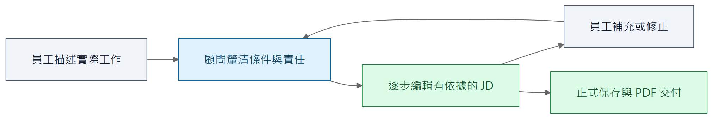

# 一、問題與設計目標

[報告目錄](README.md) · 下一章：[系統全貌](02-system-overview.md)

## 使用者知道工作，卻不一定知道如何分析工作

員工通常能說出「今天做了什麼」，卻不一定能整理責任邊界、例外條件、工作成果及所需能力。直接請他填 JD，可能得到過於籠統的職責、操作流水帳，或混在一起的現行工作與未來願望。

透過顧問公司訪談得知，既有作業的一對一訪談約需三至四小時，員工事前還需要上課，職務說明書則以 Excel 管理。這是受訪公司的作業經驗，並非產業平均值。Caliburn 以 AI 引導訪談、結構化編輯與來源回查，減少前期探索及文件管理的負擔；實際省時效果仍待真人使用評估。

## 最短價值循環

圖一是產品活動，不是必須依序執行的固定 Graph。顧問可以在同一輪同時補問、修稿與說明；資訊不足時繼續訪談，不強迫每輪都修改 JD。背景記憶協助長期整理，但不是每次編輯 JD 的必經前置步驟。

合成案例中的員工先說：「我每個上課日都會把簽到表整理到資料夾。」顧問不能自行補成「負責所有教務資料管理」，而應追問用途、處理方式與責任界線。員工補充：「每季會按課程代碼和日期整理出席統計，交給主管。」系統才有足夠依據逐步形成「整理出席紀錄與統計」等任務，並保留其來源。

JD 成品應涵蓋主要實際工作，保留能區分職責的條件，並將重複敘述整理成精簡文字，而非直接搬入訪談逐字稿。品質須依工作分析與 JD 撰寫指南判斷；模型宣告完成或欄位已有文字，都不足以證明品質達標。

## 問題如何對應到架構

| 使用上的困難 | 架構採取的方式 | 仍不能自動保證的事 |
| --- | --- | --- |
| 員工不知道下一步該說什麼 | A 顧問主動訪談，依分析缺口提出具體問題 | 每個問題都恰當、完全沒有誤解 |
| 訪談很長，早期細節容易被忽略 | 保留正式原話、分層整理 Memory、導覽與按需回讀 | 模型看得到就一定會正確使用 |
| JD 不清楚基於哪些工作事實 | JD 項目保存來源，支持固定歷史回查與差異閱讀 | 引用齊全就代表文字專業或推論正確 |
| 執行途中可能取消或斷線 | 候選與正式稿隔離，保存模型與工具接續位置 | 任意未保存的 token 都能找回 |
| 人工編輯可能引入新說法 | 人工改動與來源差異可供 A 核對 | 人工輸入自動變成員工已確認的事實 |

上述設計以 JD 是否符合實際工作為評估重點，效益仍須透過實際訪談與成果評估驗證。

## 範圍有意保持有限

首版是本機 Web 應用程式，由單一操作者管理資料隔離的多份職務檔案。範圍不包含多人即時共編、自行訓練模型、獨立 RAG 平台或專用全稿審核角色。人工可編輯 JD，但 A 執行期間會限制人工寫入，避免人與 AI 同時修改同一份內容。

### 延伸閱讀

[產品介紹](../../product-introduction.md)與[產品概念](../../product-concept.md)說明需求背景；[完整工作分析指南](../../guides/2026-09-09-complete-work-analysis-guide.md)與[JD 欄位與撰寫指南](../../guides/2026-09-09-jd-field-and-writing-guide.md)說明分析及成品品質的判斷依據。
