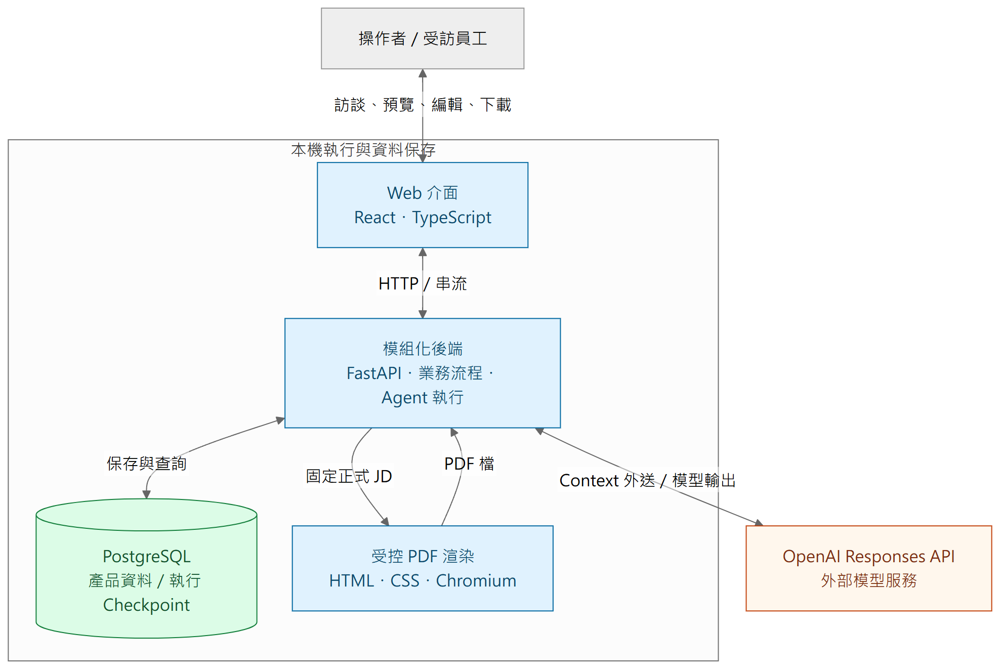

# 二、系統全貌與邊界

[報告目錄](README.md) · 上一章：[設計目標](01-purpose.md) · 下一章：[程式分工](03-components.md)

## 本機資料管理，外部模型推論

圖二的箭頭表示資料或請求往來；框線表示執行位置，不表示所有資料永遠不離開本機。Web、後端、PostgreSQL 與 PDF 渲染在本機運作；後端把所組裝的 Context 送到 OpenAI，取得模型輸出。**本機部署不等於離線 AI，也不等於訪談內容從未外送。**

UI 負責訪談、預覽、人工編輯、來源檢視及下載。後端才決定資料範圍、工具權限、正式提交與恢復位置。瀏覽器不持有供應商金鑰，也不是業務資料保存是否成功的判定者。

目前選型為 React／TypeScript 前端，Python／FastAPI 後端，PostgreSQL 保存產品資料，LangGraph 管理可持久接續的執行。模型以 OpenAI direct Responses SDK 呼叫，產品選擇 Luna／high；這是成本與品質的產品取捨，不是宣稱它對所有任務最佳。PDF 使用受控的 HTML／CSS 與 Chromium 渲染。

## 多 Agent，不等於多個微服務

A、B1、B2 是不同職責、工具集與 Context 的分析角色，共用執行機制。後端採**模組化單體**：以程式模組劃分責任，尚不為每個角色建立獨立服務、網路 API 或佇列平台。

這個選擇符合目前本機應用的規模：部署單純，跨領域提交較容易協調；代價是必須在程式依賴與模組介面上維持界線，不能因為在同一程序就互相改寫內部資料。未來若有具體負載或隔離需求，再評估是否拆分，並非提前認定永遠不需要。

## 三種「資料留存」不是同一件事

| 保存範圍 | 用途 | Caliburn 的界線 |
| --- | --- | --- |
| 業務資料 | 正式訪談、JD、已發布 Memory、固定來源與操作結果 | 由對應業務模組及 PostgreSQL 管理 |
| 執行 Checkpoint | 已保存的模型／工具進度、Context 接續位置 | 用來恢復工作，不直接冒充正式產品資料 |
| 供應商 Response 狀態 | 遠端接續與保存 API 回應的能力 | 本產品用 `store=false`，不使用 `previous_response_id` 作為歷史來源 |

Context 由 App 組裝與接續，但其中的 reasoning／compaction 資料可能是供應商產生的 opaque 內容。**App 管理傳送哪些項目，不等於 App 能解讀或任意重寫其內部推理。**另外，`store=false` 不是完整的供應商隱私或留存承諾；這裡只描述產品沒有把遠端 Response 保存當作恢復依據。

## 部署與權限要分開看

產品以 loopback 本機存取為前提，並檢查請求來源；職務檔案的隔離、A 活躍時的人工寫入限制與 B1／B2 工具權限，仍必須由後端落實。單靠 UI 隱藏按鈕或 Prompt 說「不要越權」不足以建立隔離。

本報告不把這套本機權限模型宣稱為多租戶 SaaS 安全設計。正式根入口及舊架構退役在報告基準仍屬交付 gate，不能因新程式已在 `apps/` 就宣稱正式切換完成。

### 追到實作

- 責任與選型：[系統邊界](../../architecture/system-boundaries.md)、[技術決策](../../implementation/technology-decisions.md)。
- 後端組裝：[bootstrap.py](../../../apps/api/src/caliburn/bootstrap.py)。
- 供應商介面：[openai_responses.py](../../../apps/api/src/caliburn/adapters/openai_responses.py)。
- 本機安全證據：[T15](../../plans/2026-09-29-target-rebuild/evidence/t15-local-http-security.md)。
