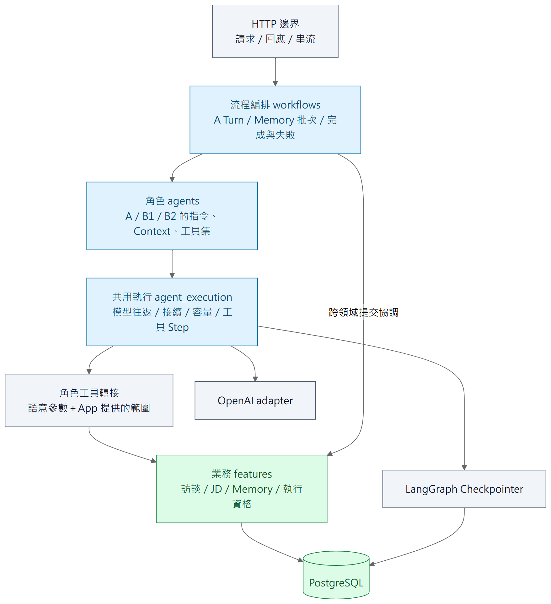

# 三、程式內部的責任分工

[報告目錄](README.md) · 上一章：[系統全貌](02-system-overview.md) · 下一章：[訪談執行](04-agent-execution.md)

## 把「分析什麼」和「怎麼安全執行」分開

圖三是合作關係的簡化圖，不是每條 Python import。流程層串接不同角色與業務模組；Agent 定義分析方法及可用工具；共用執行層處理模型往返、保存與接續；工具轉接後端業務能力，並不讓模型直接執行 SQL。

例如 A 想新增「整理出席紀錄」任務：模型決定任務內容與來源；工具接收型別化參數；App 提供所在職務檔案、執行資格與候選位置；JD 業務模組執行修改。模型不需要猜資料庫 ID、快照版本或交易結果。

## 模組依「變動原因」拆分

| 程式區域 | 負責的事情 | 不應承擔的事情 |
| --- | --- | --- |
| `transport/http` | 請求驗證、公開格式、回應與串流 | 複製 JD／Memory 業務規則 |
| `workflows` | A Turn、Memory 批次、跨模組完成與失敗流程 | 重複保存或判定其他模組負責的業務結果 |
| `agents` | 各角色的 Prompt、工具集與 Context 綁定 | 自己實作資料庫交易或通用恢復系統 |
| `agent_execution` | 原生模型項目、工具配對、有序執行、Checkpoint 與容量檢查 | 分析員工工作或決定 JD 的事實 |
| `features` | 職務檔案、訪談、JD、Memory、執行身分的業務能力 | 呼叫外部模型來判定交易是否成功 |
| `adapters` | OpenAI、資料庫、Checkpointer、PDF 等外部機制接線 | 決定各角色應負責哪些產品行為 |

這不是要求每個檔案都增加介面、工廠及 Service 類別。純計算維持純函式；有協作與生命週期的部分才封裝。高內聚的目的，是同一規則只需在負責它的地方修改；低耦合的目的，是更換模型接法不必順便改寫 JD 的保存規則。

## 三個分析角色的非對稱分工

**A：職務顧問。**直接訪談員工，讀取工作記憶與原話，按需編輯 JD，必要時要求背景整理。它不負責直接維護 Memory 兩層工作稿。

**B1：工作情境分析。**從限定範圍的有效訪談整理具體工作情境，保留條件、過程、例外及未知；能讀寫情境，不能讀寫工作理解。

**B2：工作理解分析。**依目前情境分析跨情境的工作理解，能讀情境、讀寫理解，並可按需回查合法範圍原話；不能修改情境。採用的設計為 B1 → B2 → 發布，不由 B2 要求 B1 返工；資訊不足或矛盾須如實保留，不猜測補齊。現行程式仍有回交分支，這項設計與實作差異見[第五章](05-work-memory.md#背景整理如何開始與交接)。

三者共用一套模型與工具接續程式，但不共用一份混在一起的 Context，也不因此取得相同工具權限。角色分工是業務與程式邊界，不是讓三個任意聊天機器人互相對話。

## 前端也不另造資料真相

前端按職務檔案、訪談、JD 編輯、來源檢視拆成 feature。伺服器資料由共用查詢機制讀取；目前 Turn 的狀態用於鎖定人工編輯、呈現候選及控制暫停／取消，不在多個元件各自複製一份互相猜測的狀態。

例如「畫面收到一段回覆」與「後端已完成這輪」必須區分。UI 可以先顯示串流與候選，但正式完成要以後端結果為準。跨邊界 DTO 由正式契約生成，避免前後端手抄兩份不同格式。

### 追到實作

[程式組織](../../implementation/code-organization.md)與[撰寫規範](../../implementation/coding-standard.md)是維護規則；[契約策略](../../contract-strategy.md)管理跨邊界格式。代表入口為 [A Context 綁定](../../../apps/api/src/caliburn/agents/job_consultant/context_binding.py)、[共用工具 Step](../../../apps/api/src/caliburn/agent_execution/tool_steps.py)、[Memory 批次編排](../../../apps/api/src/caliburn/workflows/memory_batch.py)。
