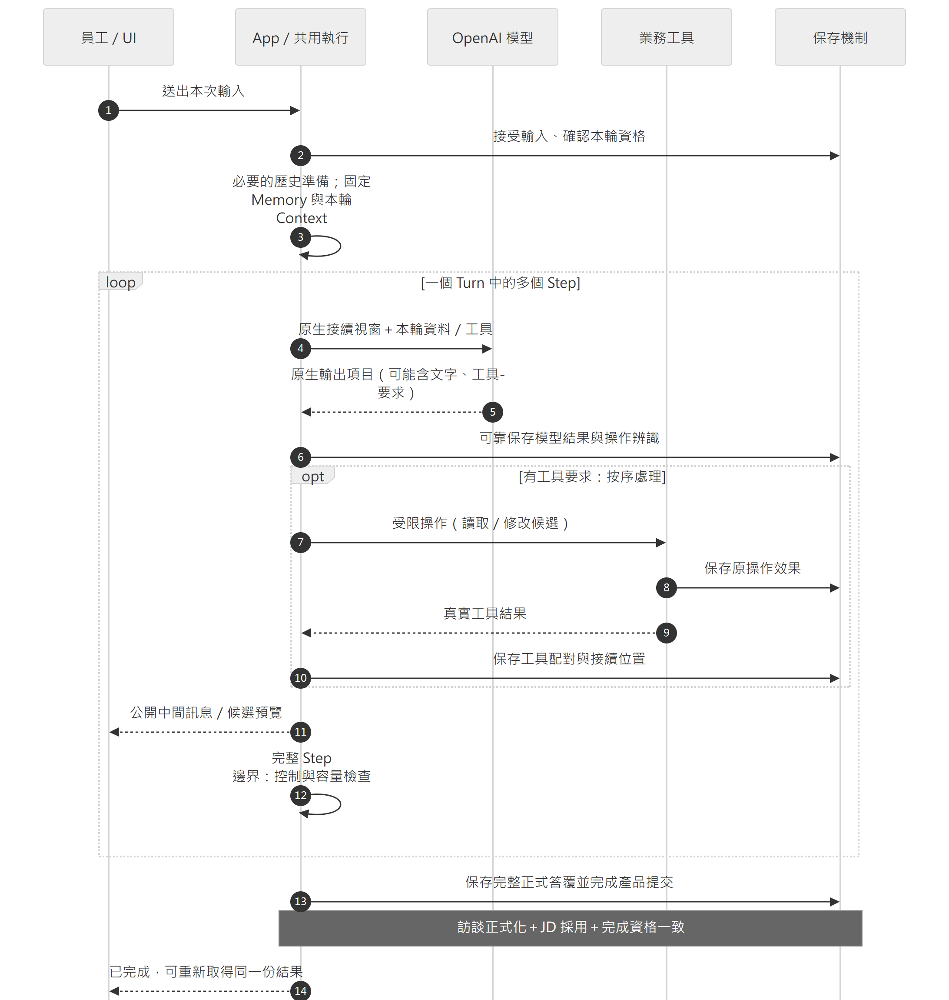

# 四、一次訪談如何執行

[報告目錄](README.md) · 上一章：[程式分工](03-components.md) · 下一章：[工作記憶](05-work-memory.md)

## Turn、Step 與訪談訊息

**Turn 是顧問處理一次員工輸入的完整回合；Step 包含一次模型回應，以及該次要求的工具處理。** 一個 Turn 可以有多個 Step，模型與工具往返完成後，App 才處理整輪正式提交。

因此，一次 API 請求成功不代表整輪已結束。LangGraph 的節點／super-step 屬於框架排程，訪談序號則表示正式訊息順序，三者各有用途。

訪談訊息則是一則完整發話，具有說話者、原文與身分。正式序號在同一職務檔案中表示前後順序；取消的輸入不占正式序號。已接受但尚未完成的本次輸入可以支持本輪候選編輯，只有完成後才成為正式可引用的訪談。

## 一輪執行的時間順序



圖四標示正常執行中需要保存結果的位置。工具可以讀取資料或修改本輪工作稿，各次保存分別處理，不將整輪工作包在一筆長時間資料庫交易內。模型與工具的往返採用 [OpenAI Function calling](https://developers.openai.com/api/docs/guides/function-calling)；工作稿何時正式採用、訪談何時取得正式資格，則由 Caliburn 定義。

開場引導會標示出處，並成為正式訪談的第一則訊息。之後每輪開始，App 先確認能否啟動這輪工作並準備接續歷史，再固定這輪可讀的已發布 Memory。即使背景整理在 Step 中途發布新版，A 仍沿用原版本；中斷後恢復同一輪時也一樣。

一次模型回應可以含文字與工具要求。App 保存完整可接續結果，按順序執行允許的工具，再把各工具結果與原 `call_id` 配對加入 Context。需要更多工作便繼續請求模型，不以「出現文字」當成最後答案。

明示啟用公版參考後，顧問透過同一條工具往返查找、閱讀與選用公版，並記下員工明確沒做的範圍。這些資料供查漏，不作員工事實或 JD 完成判定；B1／B2 只讀有效排除範圍。每輪已保存的工具清單、指引及結果仍按原格式恢復，後續設定與格式更新不改寫執行中的工作。詳細分工見[公版工具契約](../../specs/2026-10-04-public-reference-completion-design.md)與 [ADR0080](../../adr/0080-opt-in-public-reference-agent-tools.md)。

模型產生最終答覆後，App 還須可靠保存並提交，讓正式訪談、JD 工作稿的採用與本輪完成狀態一起成立。因此，Graph 到達 END、UI 顯示最後一個字，或收到 OpenAI 的 `response.completed`，都不能單獨作為這輪已完成的依據。

## App 實際提供什麼 Context

下列是結構示意，不是可以直接送出的 API payload，也不是承諾每次內容長度相同。

```text
固定角色指令與工具契約

接續視窗：先前原生歷史，或已採用的完整 compaction 視窗
user：App 參考資料
      工作情境導覽、工作理解導覽
      近期歷史訪談：序號、說話者、訪談原文
      必要的範圍／失敗提示
user：本次員工原始輸入

assistant 原生項目 → 工具結果 → assistant 原生項目 → …
```

App 參考資料以資料角色加入，不提高成系統指令；仍要配合工具授權與程式檢查，不能只靠訊息角色防止提示詞注入。**JD 導覽是按需工具讀取，不是每輪固定塞入整份 JD。**

近期歷史訪談的起點由本輪固定 Memory 的處理邊界決定，並保留必要前問；本次員工輸入另行提供。例如 Memory 已處理到序號 8，歷史資料通常從其後有效訊息組裝；模型需要更早原話時，以序號或範圍按需讀取，而不是讓模型猜資料庫版本。

預載資料超量時，程式會縮小預載範圍，保留所選近期訊息的完整原文與必要語境，並標明未預載範圍，讓模型按需回查。這項處理不截斷單則訊息，也不任意刪除原生推論歷史。資料可讀取仍不保證模型使用正確，第七章列有實測反例。

## 四種延續方式各有用途

| 機制 | 延續什麼 | 不取代什麼 |
| --- | --- | --- |
| 原生 reasoning 接續項目 | 供模型沿用先前推論的相容項目 | 可引用的訪談原文、業務結果 |
| 工具呼叫與結果 | 模型要求及實際觀察／修改結果 | 由模型自行想像的成功敘述 |
| Compaction | 壓縮後的模型接續視窗 | 正式訪談保存、Memory 來源鏈 |
| Checkpoint | 已保存的執行位置及所需 State | 外部業務交易的唯一成功判據 |

產品使用 `store=false`、不使用 `previous_response_id`，並設定 `reasoning.context="all_turns"`。App 保存接續所需的原生項目，包括適用的 `phase` 與加密 reasoning 資料，再轉成下次請求接受的 input 格式；只保存 `output_text` 並不足夠。

未傳入的歷史不會由供應商自動補回，接續推論也不保證模型記得所有細節。實際參數見 [OpenAI adapter](../../../apps/api/src/caliburn/adapters/openai_responses.py)。

## 壓縮是容量管理，不是刪掉產品事實

App 呼叫 standalone compaction，採用其完整返回視窗，而不是自行抽出一段摘要。供應商說明其返回可能包含保留項目及加密 compaction 項目；這部分不能當作普通文字任意拆寫。[OpenAI Compaction](https://developers.openai.com/api/docs/guides/compaction)

目前 A／B1／B2 在工作開始前檢查 128K 門檻；A 也能要求在下一輪開始前壓縮。完整 Step 後、下次模型請求前另有 160K 容量保險。這是產品設定，不是模型容量宣稱。不中斷尚未配對完成的工具往返，不開啟供應商自動壓縮兜底。既有長旅程已觀察 A 的自然輪前壓縮；B1／B2 另以調低門檻的兩組探針完成壓縮後發布及固定回讀，正式容量邊界仍另作評估，詳見[第七章](07-evaluation.md)。

工作前已採用的壓縮不包含本次輸入，因此取消這輪不必撤銷它；執行中壓縮若包含本輪內容，則不能隨取消把它帶到下一次新輸入。這個差別是安全恢復的關鍵。

## 使用者看到的是公開進度，不是內部推理

UI 可呈現 `commentary` 類的公開進度及可讀推理摘要，並在完成後供使用者展開回看。這些內容與原始內部推理不同，不取得正式訪談序號，也不能作為 Memory／JD 的員工事實來源。

正式答覆依前述流程完成保存；生成中的串流片段則與已保存內容分開呈現，不承諾永久逐 token 恢復。

### 延伸閱讀

- Context 與容量：[執行接線](../../implementation/agent-execution.md)、[context_binding.py](../../../apps/api/src/caliburn/agents/job_consultant/context_binding.py)、[request_capacity.py](../../../apps/api/src/caliburn/agent_execution/request_capacity.py)。
- 完成交易：[consultant_completion.py](../../../apps/api/src/caliburn/workflows/consultant_completion.py)。
- 實驗範圍與限制：[顧問 Context 測試](../../history.md#source-d76bfd79f21fb146c537)、[完整回合與公開進度測試](../../history.md#source-f5df4f496aad7b909036)、[長訪談容量實驗](../../history.md#source-6d2d7ab4abfedbf8416e)。
