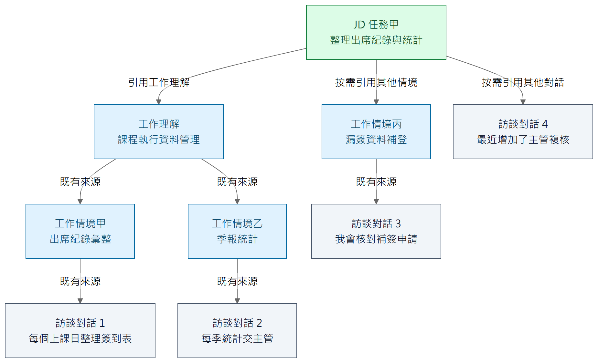
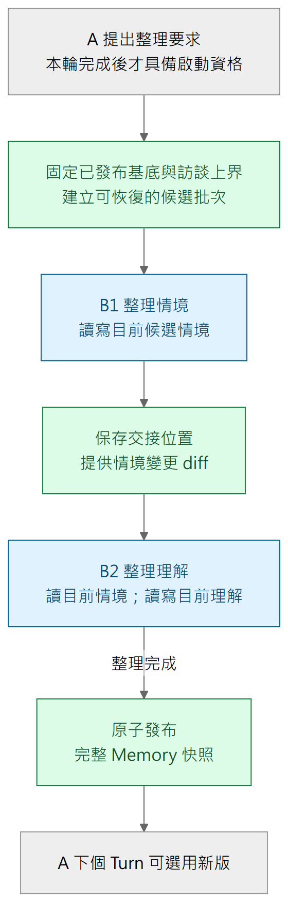
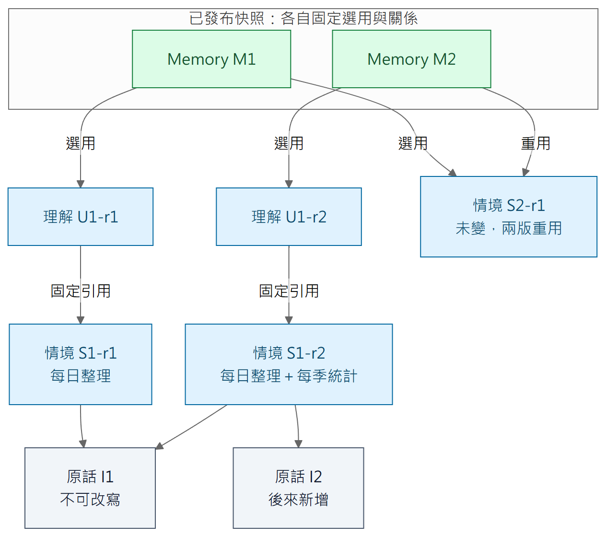

# 五、長訪談如何累積工作記憶

[報告目錄](README.md) · 上一章：[訪談執行](04-agent-execution.md) · 下一章：[JD 與恢復](06-jd-and-recovery.md)

## 三層不是三份同樣的摘要

「受訪者工作記憶」保留 AI 對員工工作的可回查理解，不綁死某一種 JD 格式。換一種 JD 欄位或寫法時，顧問仍能使用原有工作資訊重新表達。

圖五以**同一個 JD 任務甲**示範：可以引用工作理解，也可以按需直接引用其他工作情境或訪談對話，三種來源並非互斥。從任務甲出發的箭頭是 JD 的直接引用；其後標示「既有來源」的箭頭，是來源本身已保存的引用鏈。箭頭從產物指向依據，**不是模型執行順序**。理解可引用多個情境，情境可引用多則原話；同一來源也可支持多個下游。

**JD 通常以工作理解作為引用入口，後面的工作情境與原話已由引用鏈保留依據關係，不必再逐筆掛成 JD 的直接來源。**圖中任務甲引用「課程執行資料管理」，即可沿鏈回查情境甲、乙及對話 1、2；所以沒有再畫任務甲直接指向這些相同物件的箭頭。

任務甲另直接引用情境丙及對話 4，補充這條工作理解引用鏈未涵蓋的依據。情境丙不是理解已引用的情境甲或乙，其下對話 3 仍沿既有鏈回查。**額外直接引用的情境，通常不在已引用的工作理解鏈內；不是引用理解後就不能再引用情境或對話。**這是避免冗餘的通常做法，不是新增禁止重複引用的程式限制，也不要求每個任務都選滿三種來源。圖中對話編號僅供合成示例辨識，不要求每筆原話都已有情境，或每個情境都已有理解。

| 層次 | 合成案例 | 保留的意義 |
| --- | --- | --- |
| 原始訪談 | 「每個上課日整理簽到表」；後來補充「每季統計並交主管」 | 實際發話、角色與順序；更正另成新訊息，不改原話 |
| 工作情境 | 「出席紀錄彙整」的頻率、輸入、處理、成果、例外與未知 | 把分散敘述整理為可理解的具體工作脈絡 |
| 工作理解 | 「維護課程執行資料，支持主管追蹤出席狀況」 | 跨情境形成較穩定的責任、範圍與能力理解 |

工作理解不重抄所有情境細節；以關聯保留回查能力。未知或矛盾也可以被記錄，不為了讓格式完整而猜答案。這些資料支持顧問追問，不代表 B1／B2 取代 A 決定如何撰寫 JD。

## 為什麼導覽與正文分開

情境與理解物件具有 `title`、`description`、Markdown `body`，以及獨立於正文的引用關係。Map 是目前範圍的導覽，提供標題與範圍描述，讓模型先找值得讀的物件；正文再按需取得。這避免每個 Step 都重送所有長文。

模型以 App 提供的 `target_title` 等工具定位讀寫，App 在角色允許的範圍解析成實際身分；資料庫不以標題作主鍵。A 解析到本 Turn 固定快照；B1／B2 則讀目前候選。這兩個「目前」不能混用。

正文採受限 V4A diff 編輯，程式只允許修改指定物件正文。包含模糊匹配時，仍須有唯一合格位置；歧義或多區塊失敗時不部分採用。標題、描述與引用另由型別化欄位操作管理。這是以業務物件為邊界的編輯，不是給模型一個任意檔案系統 Patch 權限。

## 背景整理如何開始與交接

圖六是角色執行順序。A 可在工作中提出整理要求，但只有該 Turn 成功完成後，要求才具備啟動資格。App 固定本批原話上界為觸發輪的最後一則員工輸入，不讓稍後訪談或已取消輸入混入本批。

B1 在候選工作稿維護情境；完成後 App 留下交接位置與變更，B2 在同一批候選上接手理解。B2 工作時 B1 不再修改本批情境，因此 B2 有穩定上游可分析。**本批流程是單向的 B1 → B2 → 發布，B2 不回交 B1。**B2 專注維護理解，不修改情境，也不負責要求 B1 返工。

B2 必須知道新增、刪除與修改了哪些情境，包括尚無理解引用的新情境。差異用來找出需要重看之處；B2 仍可按需讀最新版全文及原話，不是只看幾行 diff 就自動完成理解。

B2 完成理解整理後，由 App 發布完整 Memory 快照。資訊不足或矛盾仍須如實保留，不能為了完成整理而猜測，也不因此啟動 B2 → B1 的回圈。使用者不能操作 Memory 的暫停、取消或重試，這些是系統管理的背景工作。

本節與圖六依 Owner 本次確認修正；報告程式基準仍有舊回交分支，不能將這張圖當作該分支已移除的驗收證據，差異見[附錄校核紀錄](references.md#本次文件校核範圍)。

## 可變工作稿與固定快照

圖七的線表示快照選用與固定引用，為了閱讀省略部分重複的選用線。**快照涵蓋原始訪談、情境、理解三層，不是只保存理解入口。**合成例子中 M1 選用情境 S1-r1、理解 U1-r1；後來情境修改為 S1-r2，M2 選用重新整理的 U1-r2。未改的情境 S2-r1 可被兩版重用。`r1`、`r2` 是說明用修訂名稱，不是工具要求模型填的參數。

**候選操作追蹤物件身分，發布快照固定物件修訂。**在候選中，理解綁定某情境，情境正文或標題更新後，綁定仍指向該物件目前狀態。刪除情境會解除候選中的相關綁定，不因此刪除理解，也不改壞已發布歷史。App 在操作時就維持結構合法，並在發布交易中固定整組結果；不是等最後讓模型人工修正資料庫格式。

發布後，同一版 Memory 對同一情境或理解身分只選一個修訂，無論從 Map 或任何引用路徑抵達，都得到相同正文與下層引用。不同物件不必有相同修訂號。正文沒改而下層引用修訂改變時，上層的固定修訂也要反映該變動。

**Memory 不要求 B2 逐條呼叫「確認刷新引用」。**B1／B2 完成語意整理，App 將當前候選與關係凍結共同發布。這和第六章 JD 的逐項核對不同。程式可以確保快照與引用結構一致，不能因此宣稱模型已完全理解員工工作。

所有已發布快照及其可達的物件、原話都要能回查；並非每個中途失敗候選都必須永久保存。這避免 JD 的歷史依據消失，又不把恢復紀錄誤當永久事件平台。

## 整理失敗，不等於訪談必須停止

尚未發布的候選不提供給 A。背景整理最終失敗時，A 繼續使用已發布 Memory、近期原話及訪談讀取工具；App 提供整理未完成與已知原因，不能宣稱 Memory 已更新。系統有界處理故障，不能無限重跑。

基準程式已接上「正式訪談進度增加後，再准入一次新批次」：正式序號比失敗時前進 6（一般為三輪完成的訪談）才解除阻塞，再失敗便重新阻塞；舊失敗紀錄若未存當時前緣，不會自動解除。**此政策仍待 Owner 核對，真長旅程尚未驗證，不應寫成已正式採納或完全未實作。**依據是 [T11 最新更新](../../plans/2026-09-29-target-rebuild/evidence/t11-memory-batch.md)及 [consolidation_requests.py](../../../apps/api/src/caliburn/features/work_memory/consolidation_requests.py)，而非較早交接中的「缺少呼叫者」描述。

### 追到實作與證據

[Memory 保存設計](../../implementation/memory-storage.md)、[工具設計](../../implementation/memory-tools.md)、[正文編輯](../../implementation/memory-body-editing.md)；代表程式為 [candidate_lifecycle.py](../../../apps/api/src/caliburn/features/work_memory/candidate_lifecycle.py)、[changes.py](../../../apps/api/src/caliburn/features/work_memory/changes.py)、[memory_batch.py](../../../apps/api/src/caliburn/workflows/memory_batch.py)。底層快照與真背景批次分別見 [T04](../../plans/2026-09-29-target-rebuild/evidence/t04-work-memory.md)及 [T11](../../plans/2026-09-29-target-rebuild/evidence/t11-memory-batch.md)。
