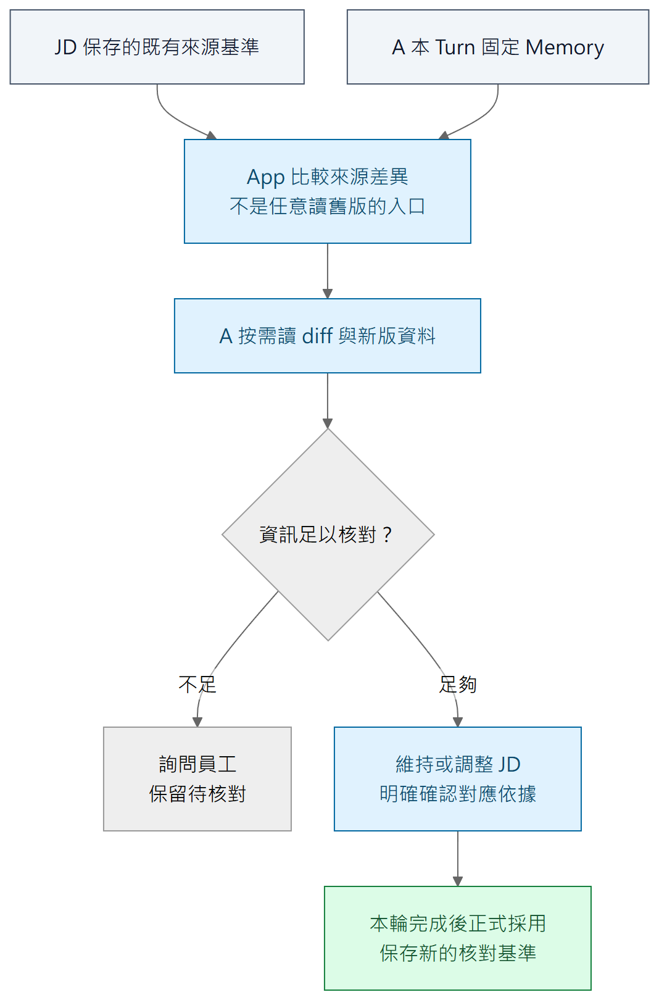

# 六、JD、來源與安全恢復

[報告目錄](README.md) · 上一章：[工作記憶](05-work-memory.md) · 下一章：[驗證與限制](07-evaluation.md)

## JD 是可管理的結構，不是一整份 Markdown

JD 將職務基本資料、職責範圍、任務、成果、要求、共用知識與技能、協作對象及共通條件分開管理。任務可歸屬某職責，也可暫時未歸屬；共用知識／技能可與任務建立關係，不在每個任務下重複維護全文。

A 先讀取精簡 JSON 導覽（Map），找到相關區域，再按需取得局部內容、關聯或全稿。導覽保留定位與短預覽；長文和差異則使用 Markdown，減少閱讀時不需要的格式。全稿呈現 JD 成品，不展開所有操作定位與歷史依據。

模型填寫工具參數時，只需指定內容、操作及 App 提供的定位；角色、職務檔案、候選資格與版本由程式管理。工具回傳則提供下一步所需的結果或錯誤，避免重複模型剛送出的全文。

## 來源有固定歷史，核對以本輪可見的新基準為準

JD 通常直接引用工作理解，並沿其既有引用鏈回查情境與原話；**鏈內已涵蓋的同一依據，通常不再重複列為 JD 的直接來源**。同一 JD 項目也可以按需直接引用其他工作情境或正式原話；例如已引用理解的鏈內有情境甲、乙，另直接引用的情境丙通常不在該鏈內。三種來源可以併用，不是互斥選項，也不要求每個項目都選滿三種。示例見[第五章圖五](05-work-memory.md#三層不是三份同樣的摘要)。

引用情境或理解時，App 使用 A 本 Turn 固定的已發布 Memory 快照。本次輸入雖尚未取得正式序號，仍可作為候選依據，完成後再連到正式訪談身分。App 保存來源身分與固定依據，不用標題重建歷史關係，也不替 JD 自動新增鏈上每一筆直接引用。

假設 JD 某任務依據 M1 裡的「出席紀錄彙整」，後來 M2 補入「每季統計交主管」。下一輪 A 固定 M2；App 能比較 JD 當時依據與這輪可見的新基準，顯示變動。A 不需要傳歷史版本參數，也不取得任意瀏覽完整舊 Memory 的工具入口：**需要新內容就讀本輪 Memory，需要知道改了什麼就讀 diff。**歷史保存仍在 App，並不因模型介面簡化而消失。

差異不能只看最外層文字；相關引用鏈的變化也需指出並可按需展開。正文改回相同文字，淨文字差異可能為零，但基準仍可能不同。這仍是同一套舊基準／新基準比較，不需要另造「改回」特殊流程。

## 「看過」和「已核對」是兩件事

圖八表示 JD 某部分的處理流程，不要求一輪把整份 JD 全部重新審核。A 在相關主題出現或準備編輯時閱讀差異、按需查新資料，判斷文字與依據是否仍成立；缺少事實就問員工，保留待核對。

只有明確的核對操作才更新依據基準；讀過資料、保留原文字，或在聊天中說「看過了」，都不會自動解除待核對。程式可記錄核對的對象與基準，至於分析是否正確，仍須由品質測試判斷。

使用者手動修改 JD 後，A 也會取得差異，判斷改稿的意義，而非直接將新文字當作已確認的工作事實。若該項目原本仍待核對，App 必須保留先前未處理的基準。來源變動與 JD 本文變動分別呈現，讓顧問辨認要處理的問題。

## 候選可以預覽，但完成前不是正式稿

顧問執行中，UI 可即時顯示 JD 候選修改。候選已保存不表示正式採用；A 完成正式答覆並完成產品提交後，才成為新的正式稿。A 活躍期間禁止人工修改 JD，減少並行編輯的歧義。

使用者取消時，App 放棄本輪候選、尚未生效的整理要求與接續內容。該輸入不成為正式訪談，後續分析也不得再使用。重試可以沿用原句、免去重新打字，但會從上一個完成狀態啟動新的 Turn，不接回已取消的模型歷史。

Turn「回滾」透過放棄候選來維持正式稿不變。執行中的候選以短交易逐步保存，不需要開著一筆交易等待模型數分鐘。其他已完成工作，以及本輪開始前已安全採用的 compaction，都不受取消影響。

## 中斷後恢復什麼

| 中斷或操作 | 程式應維持的效果 |
| --- | --- |
| 使用者暫停 | 等到完整 Step 的安全邊界、下一次模型發送前停妥；接續仍是同一 Turn |
| 模型回應已保存、工具尚未做完 | 承接原回應及未完成工具，不必重問模型剛才想做什麼 |
| 工具效果已保存、接續結果未記到 | 核對原操作結果再補回呼叫；程式可重入，但不能重複業務效果 |
| 完整答覆及正式提交已保存、UI 斷線 | 重新讀取同一份已保存結果，不重新生成另一份冒充 |
| 已無足夠資料安全接續 | 有界收尾為失敗，放棄本輪候選、解除執行占用，不永久卡住 |

Checkpoint 提供已保存的 Graph State；業務操作結果回答「資料究竟改成了什麼」。兩者合作而不互相取代。LangGraph 本身提供持久化機制；防止外部副作用重複，仍需業務層辨認原操作。[LangGraph persistence](https://docs.langchain.com/oss/python/langgraph/persistence)

候選寫入、正式採用及 Memory 發布都使用有邊界的資料庫交易。PostgreSQL 的原子交易可以讓一組修改一起成立或一起不成立；它不替 App 選擇哪些產品動作應放在同一組，也不保證交易外的網路結果已被 UI 收到。[PostgreSQL transactions](https://www.postgresql.org/docs/current/tutorial-transactions.html)

首版保留可接續的工作；無法安全接續時，則結束本輪並解除占用。不承諾找回未保存的模型 token，也不建立通用的自動補償平台。

## PDF 是正式稿的交付投影

匯出時，App 讀取固定的正式 JD 修訂，生成受控 HTML／CSS，再由 Chromium 產生 PDF。PDF 與編輯器使用同一正式來源，不包含候選預覽或模型內部訊息。原話、來源鏈與模型接續資料仍由原模組保存；PDF 是交付文件，不是另一份可獨立修改的資料來源。

### 追到實作與證據

[JD 儲存與來源](../../implementation/jd-storage.md)、[資料交易](../../architecture/persistence.md)、[介面與交付](../../implementation/interface-and-delivery.md)。相關驗證為 [T07 來源動作](../../plans/2026-09-29-target-rebuild/evidence/t07-jd-source-actions.md)、[T09 候選預覽](../../plans/2026-09-29-target-rebuild/evidence/t09-consultant-preview.md)、[T12 恢復](../../plans/2026-09-29-target-rebuild/evidence/t12-consultant-process-recovery.md)、[T13 PDF](../../plans/2026-09-29-target-rebuild/evidence/t13-pdf-export.md)。
