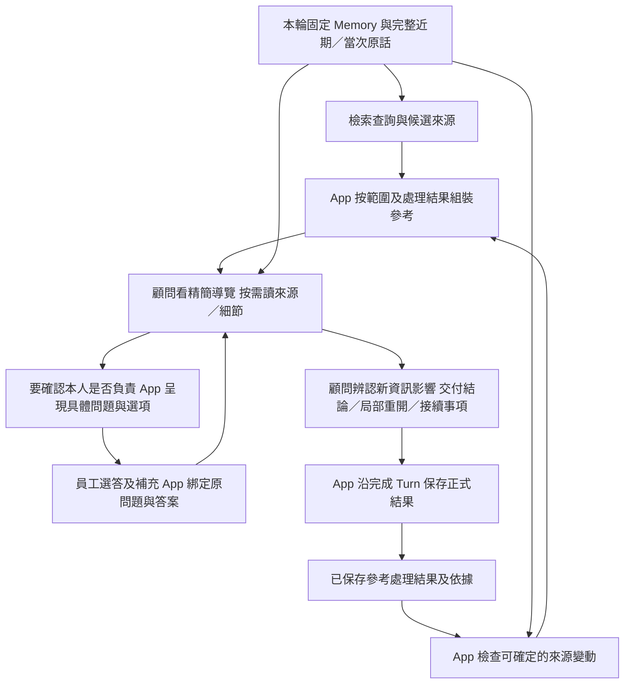

# 公版參考處理進度與模型資料提供研究

**2026-10-05 後續研究：** 使用者最新收斂為「顧問不確定能否收尾時按需搜尋、以自然追問確認」。下文選答與較廣觸發方案保留為歷史候選。進度是否過重、主流長任務做法與待辦清單消融數據，見[長任務 Agent 進度保存研究](2026-10-05-long-running-agent-progress.md)；最新建議先比較最小核對紀錄，不預先建立每公版任務狀態機。均未接 JD App。

日期：2026-10-04。狀態：**研究／候選，供討論；未核准正式 consumer 契約，未接 JD App**。本輪只有官方資料及現行文件／程式的唯讀研究、方案比較與文件整理，沒有新模型、檢索、資料庫或進度機制實驗。

建議：把顧問原本要問的「你是否做這項工作」改成員工直接選答，由 App 保存明確答案；顧問接續部分符合、不確定及內容細節。處理結果按「某個員工工作範圍、某種確認用途」保存，後續提供未處理、訪談中及需要重核的部分。職位目錄與任務細節共用公版來源，處理用途分開；Memory 換版不全清進度。選答方向已由使用者澄清，具體契約與效果仍是未驗證候選。

**最新範圍收斂（2026-10-04）：** 使用者決定先不補單項 JD 任務的完整度分析／收尾機制，以職位整體參考協助整份 JD 收尾。下文保留較早的兩用途比較；本輪只細化整體任務目錄的確認結果與更新承接，細節用途及其驗證暫緩。最新候選停止條件集中在[收尾設計](../../specs/2026-10-04-public-reference-completion-design.md)，不在本研究複製另一份規則。

## 1. 本輪問題與已有邊界

使用者要公版協助整份 JD 與單項任務收尾，公版只作參考，與實際 JD 任務可多對多、部分涵蓋。App 要保存已確認不負責、已辨認工作、正在訪談及細節已說清楚等結果，避免每輪重新投放全文、重新追問。Memory 會改寫、拆合、更新來源；既有結論需要延續，也可能因新回答而重開。

本輪問題是：**App 以什麼單位保存參考處理結果，並依什麼資料決定這輪要給顧問什麼？** 本輪不選資料表、ORM、索引參數、正式 schema、額外 Agent 或新框架，也不啟動完整訪談／PDF 品質測試。檢索與 consumer 仍是候選獨立研究；正式隔離沿 [ADR0079](../../adr/0079-target-rebuild-production-cutover.md)，入口見[目前決策](../../current-decisions.md)。

候選用途見[整體／任務收尾設計](../../specs/2026-10-04-public-reference-completion-design.md)，檢索單位與查詢比較見[檢索設計](../../specs/2026-10-04-public-reference-retrieval-design.md)。本文件保存研究與比較，不維護另一份現行規格。

## 2. 官方機制、現行能力與尚未驗證

以下官方頁面均於 2026-10-04 查閱；公開機制不等於廠商採用本案的業務粒度。

| 證據 | 官方直接說明／現行可讀到的事實 | 本案推論與限制 |
|---|---|---|
| [Anthropic context engineering](https://www.anthropic.com/engineering/effective-context-engineering-for-ai-agents) | 輕量定位、按需讀取及外部保存必要進度，可協助跨長上下文接續。 | 可用精簡導覽及處理結果減少新資料重送；不保證公版適用性、依據無損或收尾正確。 |
| [Anthropic tool design](https://www.anthropic.com/engineering/writing-tools-for-agents) | 建議提供有用內容、清楚的少量工具，按需求選精簡／詳細回傳，並用任務及工具指標驗證。 | 導覽／處理摘要與正文分開讀；不從其個案 token 節省直接推定本案省費。 |
| [OpenAI function calling](https://developers.openai.com/api/docs/guides/function-calling) | 程式已知的參數由程式處理；工具的意義與有效輸入需清楚。 | 檔案、內部身分、來源版本及保存結果由 App 綁定；模型選可讀定位、判讀範圍與結論。schema 合法不證明判讀正確。 |
| [LangGraph persistence](https://docs.langchain.com/oss/python/langgraph/persistence) | 區分 thread 的 checkpoint 與應用自行定義的持久資料。 | checkpoint 可承接執行，不能僅憑它宣告公版已處理；本案不因此指定新 Store 或第二份真相。 |
| [O*NET Job duties custom list](https://services.onetcenter.org/reference/online/advanced/job_duties) | 使用者選職業，再選該職業的一個或多個任務，系統顯示任務相似的相關職業。 | 任務選擇是公開現成互動例；本案先從員工實際工作檢索、再確認範圍，不採其先定職業流程，也不據此宣稱 JD 收尾有效。 |

現行責任與程式的核對：

- [顧問上下文 §3／§9](../../specs/2026-09-26-consultant-context-and-state-design.md)及 [context_binding.py](../../../apps/api/src/caliburn/agents/job_consultant/context_binding.py)：同 Turn／恢復固定 Memory 及訪談邊界；新 Turn 換用最新發布版，當次原話另行提供。
- [revisions.py](../../../apps/api/src/caliburn/features/work_memory/revisions.py)及[保存責任](../../implementation/memory-storage.md)：Memory 具有穩定物件身分、固定修訂及來源關係；標題不是固定歷史身分。
- [jd_source_queries.py](../../../apps/api/src/caliburn/workflows/jd_source_queries.py)按固定引用查前後修訂及情境來源，[source_changes.py](../../../apps/api/src/caliburn/features/job_description/source_changes.py)承接明確的來源對齊操作。這些已提供重用依據，不需要先新增通用 diff／validator。
- [context_history.py](../../../apps/api/src/caliburn/workflows/context_history.py)及顧問 §9：採用的原生接續歷史沿既有壓縮／恢復政策保留，新資料另行追加。**不重送新的公版全文，不等於原工具結果立刻從模型歷史消失**；不擅自清理歷史，也不承諾已處理內容完全零 token。
- 現有 JD 引用對齊處理的是 JD 已有來源；「確認不負責，因此不建 JD」及「還在探索、尚未建立任務」沒有 JD 引用可承接。App 若要依這些結論控制公版投影，需要可保存、可查回的參考處理結果。這是具體缺口，不代表要加一套員工事實記憶層。

現行機制存在不代表新 RAG consumer 已驗證；前輪 [805 來源／22 情境結構核對](../../experiments/2026-10-04-retrieval-reference-views/README.md)沒有運行顧問，也沒有測本文的抑制、重核或模型成本。

## 3. 三個候選方案

| 方案 | 如何延續 | 優點 | 主要反例與代價 |
|---|---|---|---|
| A：只靠原生對話／壓縮記住 | 每次提供候選，讓顧問自行辨認已處理內容 | 最少新業務資料，可沿現有接續 | App 沒有明確結果可作投影；長歷史、壓縮、Memory 改寫後是否重問仍不確定。不能把曾讀過當完成。 |
| B：每份公版／公版任務一個 done | 同一來源代碼被處理後不再提供 | 容易查詢與過濾 | 整體已辨認不代表細節完成；同一公版任務含多面向或支持數個 JD 任務，部分完成可能把其餘內容隱藏；新適用範圍也可能被舊拒絕擋住。 |
| C：按確認範圍與用途保存結果 | 保存具體已判讀的員工範圍、多個來源、用途、結論及依據 | 可處理部分／多對多，支援局部重核、接續及摘要投影 | 顧問要明確交付結果；範圍綁定、來源變動及重核效果須驗，不能期待 App 自動懂語意。 |

**推薦 C 作隔離驗證候選。** 使用 A 的原生接續延續分析，也沿 C 的明確結果控制新資料投影；不以 C 取代原生接續、Memory 或 JD。只記實際開始處理的公版確認事項，不要求每 Step 填全分析表，也不預先替全部公版子句建立長期疑點。誰確認工作適用性與保存粒度是不同取捨：員工直接選答也沿 C 保存。

### 3.1 使用者補充：原本要問的適用性問題改成選答

使用者澄清：「就是把原本要問的，你是不是有做這個任務，變成直接給員工選，減少判斷。」本案因此推薦把**既有訪談中要提出的確認問題**交給 App 呈現選項，不要求先把所有檢索候選任務攤成問卷。顧問仍選值得確認的工作線索；員工直接回答本人是否負責，App 不再請 LLM 把明確選項分類成有／沒有。這減少回答解讀，不表示省去檢索、線索挑選、任務涵蓋分析或 JD 寫作。

問題描述目前本人負責的實際工作，包含低頻或例外工作，不問「會不會做」或要求認同某個職稱。顯示原本要問的具體內容，必要時可展開公版正文。正文太抽象或含多個動作時，不能只顯示任務名稱便要求全有／全無；可拆開確認，或保留部分符合。

| 員工選答 | App 可直接記錄的意思 | 顧問後續 |
|---|---|---|
| 有做 | 本人確認有這個範圍的工作 | 若內容尚缺，接著問做法、產出及權責；不再問是否有做。 |
| 部分有做 | 有一部分適用，實際範圍尚待說清楚 | 請員工指出有做／沒做的部分，不把整段公版當本人責任。 |
| 沒做 | 本人確認不負責**這次顯示的範圍** | 結束該適用性問題；不封鎖其他工作範圍、來源或細節。 |
| 不確定／看不懂 | 尚未確認 | 改用例子或短問題釐清，不能算不適用或完成。 |

選項不預設勾選；沒回答、略過或拒答保持未知。允許補充、更正及「還有其他工作」自由輸入。比如「清點庫存、調整帳務與回報差異」選部分有做，員工補充「只清點及回報，沒有調帳權」；保存該實際範圍，不能將調帳責任寫入 JD。多對多或相似內容也不能因另一題選有做而自動結束。

App 綁定固定問題、顯示範圍、公版位置、回答與必要補充；不讓模型重述答案成相反結論。員工答案和顧問對細節是否充分的判讀分開保存，只有前者能直接確定本人選了什麼。既有明確確認仍可沿用，不因新版 Memory 又問一次；有相關更正時才接續核對。

**現行契約限制：** 現在沒有獨立「勾選即成正式工作事實」的來源類型。第一個實作候選把選答與補充組成可回查的員工本輪輸入，沿[核心生命週期](../../specs/2026-09-29-core-value-loop-lifecycle.md)完成 Turn 後取得正式訪談資格；模型承接明確答案及整理內容，無須再同意員工的選項。原輸入先可靠保存，取消／失敗不偷偷成為後續正式依據。若要讓勾選立即成立且不用啟動模型 Turn，必須另外討論人直接確認的保存／來源契約，不能在本研究暗中切換。

員工確認可以省掉這類有／沒有的回答分類，不能證明細節完整或 JD 已寫好。也未決定取消使用者先前要比較的檢索後決策模型：是否還需要線索去重、相關內容選擇及缺口分析，須與明確選答分開測。當前[平均 12.55 份來源](../../experiments/2026-10-04-retrieval-input-boundaries/README.md)是文件層結果，沒有證明其全部任務都適合給員工選；任務層相關性、抽象表述及確認負擔仍待驗。

## 4. 保存單位：一個參考確認事項

例如「員工是否負責美容店庫房的季度盤點」是一個確認範圍。它可由倉儲、公版門市管理等多個來源支持；也可最後拆成 JD 中的清點與差異回報。處理單位不等同 B2 物件、單一公版 T code 或單一 JD 任務。

同一實際範圍有兩種用途：

1. **辨認工作範圍**：是否由本人負責，以及目前訪談是否已辨認這項工作。用職位整體參考。
2. **釐清工作內容**：此範圍的內容、產出、條件與權責是否足以表達。用任務細節參考。

某用途完成只影響該用途及已明確處理的範圍，不封鎖其他用途或內容。只說「盤點」的名稱不能代表所有盤點責任；未開始判讀的來源內容也不能因沒有進度紀錄而被當已處理。

以下是必要業務資訊，**不是正式 API／生成 schema 或資料表決定**：

| 資訊 | 意義與產生責任 |
|---|---|
| 參考確認事項的穩定身分及短定位 | App 配發，限定職務檔案；不依 Memory 標題或 publication 換版重編。 |
| 確認範圍、用途 | 綁定顧問要問的可見內容及實際處理範圍；員工可直接選答，不把一個模糊名稱當全域工作身分。 |
| 公版來源集合與固定內容位置 | 可多筆、可只引用其中部分；真實來源版本及 hash 由 App 綁定。 |
| 進度、結論、尚待接續事項 | 員工明確選答與顧問細節判讀分開；保存短結果及必要理由，不保存私有推理或複製一份完整員工事實。 |
| 判讀依據 | 指向有效訪談、固定 Memory 修訂及必要 JD 定位；版本、權限及正式來源資格由原責任核對。 |
| 本輪候選／正式生效資格 | 沿既有完成 Turn；進度不能僅因模型讀過或 tool 成功就對後續輪次生效。 |

進度先用 **未處理、進行中、已處理** 三種概念即可。已處理再說明是「不負責」「已確認有這項工作」或「該範圍細節充分」；拒答／暫不談仍保留未知。這避免把所有處理結果拆成大量互斥狀態。重核提示依所選來源及當前輸入而來，保留原結論；不另維護一套 JD 引用對齊狀態。

## 5. App 提供資料與選答，顧問接續分析

圖為候選 consumer，沒有改寫 Memory 整版發布及來源上界。員工選答是下一 Turn 的輸入，沿既有正式資格承接，不是在同一已結束 Turn 中無限循環。初搜／rerank 仍先確保涵蓋；進度投影不是第二次相似度門檻，選答也不證明其他篩選分析可以全省。

| 參考目前情況 | 新投影預設提供 |
|---|---|
| 尚未判讀 | 確認範圍、短線索與可讀定位；正文按需取用。 |
| 正在訪談 | 已問問題、等待確認什麼及相關定位；接續既有問題。 |
| 已處理且沒有已知影響變動 | 不重送該範圍正文；必要已處理摘要與回查入口保留。 |
| 相關依據或工作範圍可能改變 | 原結論、必要變更提示及定位；由顧問保留或局部重開，需讀時才取正文。 |
| 新來源／新範圍，無法確定已有結果涵蓋 | 保留待確認，不因同名、同公版 code 或高相似度而自動隱藏。 |

順序是先核本輪範圍與已知依據變動，再決定能沿用哪些處理結果，最後作投影。完整已解析公版目錄仍可回查；待處理導覽是明示範圍的子集，不能冒稱全部公版內容。跨來源合併、部分涵蓋及等價表述由顧問確認，App 只核合法目標及保存結果。

讀取及保存是兩類業務能力：讀精簡參考／必要正文與查回結果；交付並修訂處理結果。先驗這兩類最少能力是否足夠，不為每個進度建立一個工具；名稱、建立／更新參數、批次範圍及 wire 在後續契約固定，不在本輪手寫正式生成檔。

## 6. Memory 更新如何延續

不能只監聽整版 publication 換號，也不能只看原引用 hash。有效原話本身不可改寫；員工後來說「其實我也負責盤點」是**新增更正訊息**，舊拒絕依據的 hash 可能完全沒變。顧問仍須收到完整的新資料，辨認是否影響已處理範圍；App 不把舊處理結果當成對新事實的否決。

| 變動 | 建議處理 |
|---|---|
| Memory 更新另一項無關工作，所選依據未變 | 沿用相關處理結果，無須重新讀公版。 |
| 相關修訂、固定來源關係或 JD 有變 | 提供可確定的變更提示，顧問按需核對；不是宣告舊結論必然錯。 |
| 改名、格式整理或重述 | 同一身分及範圍若可確定不受影響則沿用；有歧義才局部確認，不能由字串相似度宣告語意等價。 |
| Memory 拆分／合併、參考任務與 JD 拆合 | 原處理結果保留；有明確範圍／來源承接再沿用，無法確定的關係保留待確認。 |
| 新原話新增責任或更正舊說法，尚未發布 Memory | 顧問於本輪辨認影響並更新相關候選結果，不等背景發布才處理；取消時不正式生效。 |
| 公版內容換版或定位失效 | 不把舊處理結論改標成新版；保留原依據，另核新版受影響範圍。 |

第一版可重組完整查詢集合並使用一致身分的排名快取；**搜尋重用與處理進度沿用各有條件**。查詢文字一樣仍可能有新責任；排名可重用，適用性未必仍有效。沒有新增來源支持也不能自行刪掉已確認員工事實。

新增工作可能沒有任何舊依賴，因此只靠舊依據 diff 不足；目前新原話、新版完整 Memory 導覽及完整度方法仍要保留。App 不另加一個每次更新都掃全庫的語意 diff Agent。精確到什麼依賴粒度能兼顧成本與涵蓋，是有限實驗的題目，不能預先承諾所有更新零重核。

## 7. 正常與異常代表情境

1. **不負責 → Memory 新增其他工作**：員工確認不負責門市庫房盤點，後來 Memory 補入美容流程。盤點結論依據未變；不重新問盤點。
2. **不負責 → 員工更正責任**：員工新說「每季其實會幫忙盤點」。不因舊拒絕把盤點參考隱藏；顧問核新的頻率、內容與權責。
3. **已辨認 → 仍缺細節**：已知員工會盤點，整體目錄不再問有沒有；細節仍可問差額是否有權自行調整。
4. **部分／多對多**：兩份公版支持同一盤點範圍，已確認清點但差異回報仍未知；保留剩餘細節，不能因一個公版 done 隱藏另一面向。
5. **訪談中**：已問誰核准庫存調整，下一輪接到員工回答；提供短接續資訊，不重新從「你有沒有盤點」開始。
6. **依據相同正文、來源改變**：正文仍寫盤點，但引用從自主庫存調整改為僅清點回報；提示相關重核，不靠正文 hash 沿用舊權限結論。
7. **已問清楚、尚未寫入 JD**：可以結束該參考細節判讀，但整份 JD 仍須把實際內容表達完成；參考進度不代替 JD 內容核對。
8. **取消／失敗／重開**：本輪標不適用後被取消，不抑制下一輪；成功已保存但回應遺失則查回原結果，不重做已成立效果。沿既有執行／短交易能力。
9. **在途舊查詢／新發布**：舊結果只屬原固定基準，不改標新版本；下一輪綁定新資料與進度。已採用的本輪結果可供本輪接續，不中途刷新 Memory。

例子是設計反例，不是已執行測試結果。

## 8. 有界驗證與待討論

先沿既定順序完成 Memory 查詢、檢索單位／相關內容及參數；本研究沒有把 consumer 機制設計當新檢索品質結論。接續驗證分層：

1. **確定性機制**：固定上述輸入、結果與事件序列，核投影範圍、局部／多對多、無結果不冒充已處理、取消／生效、重開及固定來源。這一層只證明 App 不錯存／錯隱藏，不證明顧問判讀正確。
2. **顧問 A／B**：固定同一批檢索候選、員工事實及方法，比較只靠模型歷史與加入 App 處理進度。檢查重複讀取／追問、錯誤隱藏、更新後漏失、局部重核、實際 provider 輸入 token／時間及處理工具負擔。不讀私有推理來判定是否重新思考。
   另外固定同一批原本要問的適用性問題，比較自由文字回答／LLM 解讀與員工直接選答；記回答分類錯誤、部分責任誤寫、漏確認、重問、員工閱讀／操作時間、澄清輪數、實際模型 token／時間。不得用純合成選答證明真人操作更快；先驗保存／接續機制，再以真人使用測負擔。呈現多少題及如何分批是待測參數，不能因模型次數減少就宣稱總成本降低。
3. **完整用途**：按最新收斂優先驗職位整體參考及確認進度對整份 JD 收尾的效果，最後從空白訪談至 JD／PDF；真值依員工實際工作，不以待處理項目數為零作真值。單項任務完整度及細節參考比較保留後續，本輪不追加。

本輪可討論收斂的是 C 的確認範圍與最小保存資訊。正式工具、資料權責接線、使用者能否編輯進度及長期保留政策，待 consumer 契約及採納程序處理；不以本研究自動切換 production，也不先建立完整通用任務／事件平台。研究已足以提出可證偽候選，先停止廣搜，後續沿[計畫](../../plans/2026-10-04-public-reference-retrieval-design.md)逐元件驗證。
