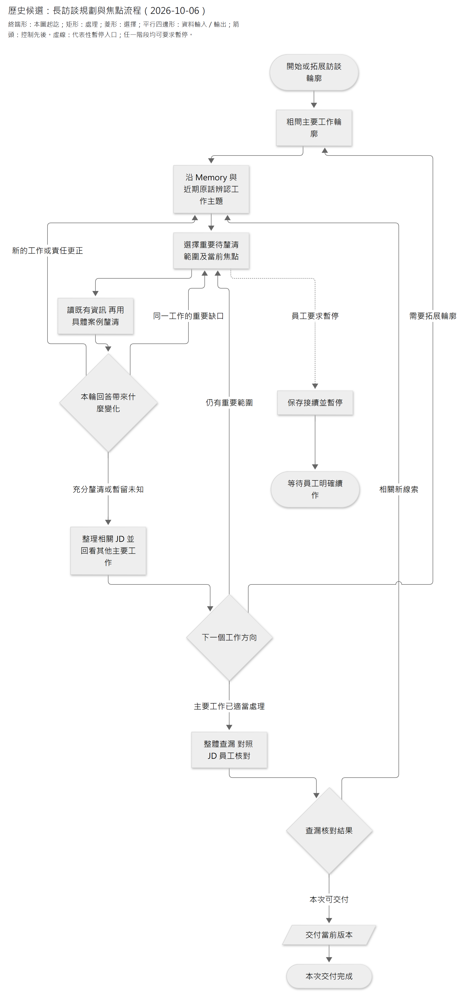

# 長訪談規劃與當前焦點研究

查閱日期：2026-10-06；最近補查：2026-10-07。狀態：**研究與候選設計**。使用者已確認長訪談需要規劃，方向是先問輪廓、拆出工作任務，再選焦點深入；Memory 可承接工作大綱。本文保留方案演進與證據，具體候選契約由唯一設計維護，尚未正式切換或實作；本研究不授權 production 變更。

**接續狀態（2026-10-07）：**上述及各歷史段落的「未實作」描述當時狀態。原筆記已依 ADR0081 實作並完成核心比較，穩定 JD 增益尚未證，見[實測](../../experiments/product-validation/interview-plan-comparison-2026-10-07/results.md)。使用者後續重開 Memory／Plan 分工，要求先看論文與大廠實際設計；本輪補查見 §20，新的範圍與名稱仍是[設計 §10](../../specs/2026-10-06-consultant-interview-planning-and-focus-design.md#10-jd-工作計畫內容與用法)候選，沒有切換 production。

建議優先比較**半結構訪談加上可修訂議程**：從已知工作輪廓選擇待深入方向，保持當前焦點，依新回答局部拆解或轉向，收束後回到整體查漏。Memory 承接工作事實與輪廓；議程補充接下來要做什麼、哪些線索暫留及如何返回。規劃的效果應以工作涵蓋、責任深度、重問、訪談負擔及 JD 正確性評估，不能以計畫條數或完成勾選判定。

公開證據支持規劃與適應性追問，但沒有證明某套策略是跨職務、跨窗長訪談的通用最佳。最貼近的 SparkMe 有真人比較；Anthropic Interviewer 有實際規模化使用；一般 Agent 規劃論文則主要驗證網頁與可判定成功的任務。以下將這些證據與 Caliburn 候選取捨分開。

實現細節另見[長訪談焦點與未釐清事項草案](../../specs/2026-10-06-consultant-interview-planning-and-focus-design.md)。使用者要求只記目前焦點／注意力、重要未釐清與線索；已完成理解及工作大綱沿 Memory／上下文，子任務就是未釐清範圍，已解移除。內容形式收斂見 §10，最新效果／公開機制及施工接縫見 §15–18；§1–9 保留先前方法比較，尤其 §9 的「已深入方向仍留在規劃」已被取代。工具及保存仍為候選、尚未實作。

## 1 本題目的與現行邊界

目的為讓顧問在長訪談中維持整體方向，深入重要工作又能回到其他範圍；員工補充或更正時可修訂相關安排，暫停、換輪或換窗後能接續未完工作。

- **已確認方向**：先了解輪廓，再辨認工作任務並深入；任務可新增、拆分、合併及修訂。工作大綱沿既有 Memory，不另建立第二份工作事實。
- **文件方法／未提交工作樹 Prompt**：[深度指南](../../guides/2026-09-09-customized-jd-depth-and-interview-calibration.md#訪談節奏與-jd-的形成)已有輪廓、分析焦點及查漏方向。[顧問指引](../../../apps/api/src/caliburn/agents/job_consultant/instructions.py)的工作樹版本也包含這些要求，但[狀態入口](../../current-decisions.md)記載運行 Docker 尚未更新、真模型仍需比較，不能當成已部署行為或品質。
- **仍需定義**：尚無正式、可讀回的訪談議程／焦點契約。[現行執行](../../implementation/agent-execution.md#2-state-的最小型別分組)保存原生歷史與恢復位置；這不等於已保證語意焦點跨窗保留。
- **資料權責**：原話、Memory、JD 沿原權責；公版只提供線索。[正式公版 state](../../specs/2026-10-04-public-reference-completion-design.md)仍是選用公版與 `excluded_work`，不重新加入一般回答紀錄或每項公版的必問進度。
- **本輪範圍**：比較規劃行為、必要接續資訊及驗證方法；不決定新角色、資料表、JSON schema、工作流程引擎或 production 切換。

## 2 訪談領域的直接證據

### 半結構訪談的成熟方法

[GOV.UK 的 in-depth interview 指引](https://www.gov.uk/service-manual/user-research/using-in-depth-interviews)要求先安排主題與合理順序，準備起始題及可能追問；訪談從一般背景進入真實案例，用開放、中立問題深入。訪談者可追有價值的新線索，偏離主題時在自然停頓帶回，並預留收尾釐清時間。這是現行實務指南，發布於 2017-02-21，沒有提供 LLM 效果比較。

[OPM 的工作分析步驟](https://www.opm.gov/policy-data-oversight/assessment-and-selection/job-analysis/job_analysis_checklist.pdf)先蒐集職務資料，再形成初步任務與能力列表並核對重要性。可借用的是以證據建立工作範圍；其中用於甄選的能力評分不直接成為本案訪談問卷或 JD 完整度門檻。

**Caliburn 映射**：先粗問以辨認工作範圍，再按實際工作形成可修訂主題。訪談指南提供觀察面向，不能由職稱或公版預寫員工一定負責的任務。

### Anthropic 的實際 AI 訪談工具

[Anthropic Interviewer](https://www.anthropic.com/research/anthropic-interviewer)於 2025-12-04 公開規劃、訪談、分析三個階段：研究目標先形成訪談問題與談話方向，由研究員修訂；模型依計畫進行適應性追問；最後按研究目標分析。首批訪談 1,250 位專業工作者，每次約 10–15 分鐘。[現行工具說明](https://www.anthropic.com/about-anthropic-interviewer)仍維持這個方法；[2026 年秋季研究](https://www.anthropic.com/research/your-thoughts-on-ai)於 9 月 29 日至 10 月 6 日進行，尚不能引用其未公布結果。

這支持「有整體方向又保留動態追問」的公開實務；文章沒有公開逐輪議程保存／失效演算法，也沒有用控制實驗證明某個規劃格式最優。其跨受訪者共用研究題綱，須與 Caliburn 依單一員工工作逐步形成的大綱區分。

### SparkMe 的真人比較

[SparkMe](https://arxiv.org/html/2602.21136v1)，Stanford，2026-02-24 預印本，§3、§4.2、§7，以可更新議程協調主題、回答筆記與優先方向。下一步可深化、追相關新題或轉題；另以模擬對話選探索方向。70 人／7 職業隨機分成兩組，每次最多 45 分鐘；受訪者自評涵蓋為 4.37 對 3.14、深度為 4.06 對 3.09，滿分 5 分。

它測的是 AI 對工作影響的訪談，並非 JD；真人比較的是整套系統，沒有單獨證明焦點保存的增益，也沒有專業人類訪談員對照或跨窗驗證。§A.1 的模擬消融未顯示延長預測視野有明顯收益。這支持將可修訂議程列為候選；多代理、數值覆蓋與模擬回答不直接成為本案必要機制，推測回答不能保存成員工事實。

### 新線索與提問時機

[Harnessing the Power of AI in Qualitative Research](https://arxiv.org/html/2509.12709v1)，2025-09-16 預印本，讓 17 名有經驗的訪談者在研究員扮演受訪者的情境中選用 AI 建議追問。質性回饋支持補缺口及深入，也指出相關問題可能時機不對、打斷既有方向；可將有價值的新題留到之後。這是有人類中介的探索研究，不能當成自主訪談完成率證據。

**Caliburn 映射**：新線索先辨認是否重要；除非會推翻當前分析或是必要先決問題，否則保留返回位置，在當前焦點收束後處理。這也沿用[分析指南](../../guides/2026-09-09-complete-work-analysis-guide.md#3-如何訪談不變成冗長表單)的訪談節奏。

## 3 規劃論文能支持哪些機制

| 第一手來源與版本 | 實際方法與證據範圍 | 可借用及限制 |
|---|---|---|
| [ADaPT](https://aclanthology.org/2024.findings-naacl.264.pdf)，NAACL Findings 2024，§3、§5、附錄 F | 執行遇到困難才遞迴分解，抽象步驟與局部執行交錯；測 ALFWorld、WebShop、TextCraft。 | 困難處按需再拆，避免一開始列死所有細節。模型自報成功仍可能誤判；它未測長訪談，也不能用其先執行策略否定先問輪廓的產品方向。 |
| [Plan-and-Act](https://arxiv.org/html/2503.09572v3)，ICML 2025，實讀 2025-04-22 v3，§3.3、§5、Limitations | 高階計畫與具體網頁動作分開；新觀察更新剩餘計畫。以合成資料訓練，在 WebArena-Lite 比較靜態及動態規劃。 | 新事實可改變剩餘路徑；不能照搬每個動作重跑 planner。作者明列效率問題，事件觸發重規劃是待驗方向，未證明本案最優。 |
| [Value of Information](https://aclanthology.org/2026.acl-long.1987.pdf)，ACL 2026，2026-07，§4–6、Limitations | 比較詢問後可改善的決策效用與提問成本；測猜謎、診斷、航班及購物等有限選擇情境。 | 用「答案會改變哪項重要判斷」挑問題，兼顧受訪負擔。封閉答案、有限行動與模擬回答不提供開放 JD 的可直接使用效用分數；文中有不如基線的條件。 |

共同可借用的是可修訂的高階方向、局部拆解，以及把提問收益和負擔一起考慮。**停止一個焦點與整份訪談完成不同**：已知工作、重要未知、重大矛盾與成品對照仍需整體核對，沿[收尾研究](2026-10-05-jd-long-task-convergence.md)，不靠待辦清空證明所有未知工作已發現。

## 4 大廠與框架的現行公開做法

| 官方來源與查閱狀態 | 公開做法 | 對本案的界線 |
|---|---|---|
| [OpenAI prompting 文件](https://developers.openai.com/api/docs/guides/prompt-engineering)，2026-10-06 查閱 | 長任務可分解子工作並用 TODO／rubric 追蹤進度。 | 是一般 Agent 指引，沒有 JD 訪談最優策略；不能把自主工具任務的「持續執行」用成逼員工繼續回答。 |
| [OpenAI session memory 範例](https://developers.openai.com/cookbook/examples/agents_sdk/session_memory)，2026-10-06 查閱 | 接續摘要保留最新目標、未完問題與下一步；比較裁切與摘要，提醒遺失及摘要漂移。 | 保存有用接續資訊與選擇下一步仍是不同責任。此範例不要求本案改用 Agents SDK。 |
| [Microsoft Magentic](https://learn.microsoft.com/en-us/agent-framework/workflows/orchestrations/magentic)，2026-09-21 更新 | 初始計畫後持續評估進度，停滯或人類修訂觸發重規劃；以 request／response、checkpoint 暫停及續接。 | 跨程序保存另依配置，範例含記憶體儲存；官方提醒原 Magentic-One 團隊以外的效果尚未驗證，其事實表不照搬為第二份 Memory。 |
| [Anthropic context engineering](https://www.anthropic.com/engineering/effective-context-engineering-for-ai-agents)，2025-09-29 | Context 外筆記保存進度與相依；壓縮、筆記、委派各有用途。 | 長歷史或大 context 不自然保證最新焦點可找回；需驗證被保留的內容。 |
| [Anthropic 長開發 harness](https://www.anthropic.com/engineering/harness-design-long-running-apps)，2026-03-24 | Planner 先定高階範圍，避免過早細定；後續模型實驗移除固定 sprint。 | 移除不必要拆解框架仍保留規劃。施工實驗不能直接證明人類訪談的最佳階段設計。 |
| [Deep Agents overview](https://docs.langchain.com/oss/python/deepagents/overview)，2026-10-06 查閱 | Planning 與 Memory 分開；v0.7 起 TODO middleware 為 opt-in，長複雜工作可選用。 | 規劃是可按需配置的能力；TODO 狀態不自動保障訪談涵蓋或相依失效，也不構成本案採用框架的理由。 |

這些是公開方法的交集與差異，沒有普及率資料可將某套實作稱為全業界標準。可支持的候選方向是**有規劃、保持適應性、保留必要接續資訊，並以本領域實測調整機制**。

## 5 Caliburn 的候選訪談流程

以下為能力與行為設計，不凍結實作元件或 schema。

[圖源](../../diagrams/research/work-analysis/2026-10-06-long-interview-planning-and-focus-research/candidate-interview-flow.mmd) · [SVG](../../diagrams/research/work-analysis/2026-10-06-long-interview-planning-and-focus-research/candidate-interview-flow.svg)

圖為候選，並非現行狀態機。**任何階段皆可依員工要求暫停**，圖中的虛線是代表性入口，不要求先完成查漏。進入查漏可以按需使用公版，並保留檢索與事實的界線。圖中的「暫留未知」只有在既有事實足夠時才整理 JD，不能把未知寫成否認或無據結論；暫停與內容充分分別判斷。

### 先問輪廓

先讓員工描述平常主要處理的事、服務對象與交付，再自然補問周期、專案、支援或特殊事件工作。足以辨認主要範圍時即可選主題，不必把所有未知輪廓問完才深入；深入發現新工作則回頭修訂。

### 拆工作與拆分析問題

**工作範圍**按目的、對象、責任與成果辨認，例如客戶退貨與月末盤點；**分析子目標**則是當前要釐清的具體問題，例如「退貨由本人核准或只依核准清單執行」。兩者粒度不同，訪談焦點不必一對一變成永久 JD 任務。

遠期保留方向，近期把會影響 JD 的缺口寫清楚。已知答案先讀取或沿用；沒有新證據又已明確答不出，就暫留未知並轉向。是否再問須有具體新線索或新的取證方式。

### 深入與返回整體

當前焦點優先釐清本人動作、必要判斷、交付及責任界線；抽象回答可換最近案例、實際輸入／產出或交接問法。答案足夠就整理或改稿，再回到整體選下一個焦點。新線索先看是否改變當前分析，避免每個新名詞都搶走主線。

### 何時修訂規劃

每次回答先作局部影響判讀。原焦點仍有效時接續下一個必要缺口；新增主要工作、責任更正、重大矛盾、先決問題改變、焦點收束、員工要求轉談或持續無進展時，才重排相關部分。這是需要驗證的本案取捨，並非論文已證實最佳觸發頻率。

## 6 規劃比單一焦點多保留什麼

只保存當前焦點，仍可能忘記其他已辨認但未深入的方向。候選議程因此包含以下語意，實際欄位及保存位置另定：

| 必要接續內容 | 例子 | 與既有資料的關係 |
|---|---|---|
| 當前焦點及其用途 | 釐清退貨核准權，以決定任務責任描述 | 引用已有工作定位，不複製完整事實 |
| 下一個動作及收束條件 | 先讀相關理解；仍缺時請員工說最近一案；責任已清且相關 JD 已處理便轉向 | 行動意圖與執行結果分開，模型不能自造保存成功 |
| 少量重要待深入方向 | 月末盤點尚需辨清本人範圍 | 保留工作線索與重要性，不生成完整固定問題樹 |
| 暫留線索及返回位置 | 員工提到緊急調貨，退貨焦點收束後接續 | 留導航，不把尚未確認線索寫成固定職責 |

Memory 表示已理解的工作，議程表示還準備怎樣取得證據與整理成果；焦點是議程的當前部分。規劃可以由同一顧問更新，不因這些概念而先增加 planner／agenda manager／evaluator 三個 Agent。

初期或背景整理尚未發布時，沿近期原話建立暫時方向，不等待 Memory 才規劃。相關新回答即使尚未進 Memory 也可修訂計畫；無關 Memory 改字不觸發全量重排。

### 接續與保存的必要條件

跨輪等待員工回答時，需可接續原問題與未完動作；焦點、議程與最近有效回答應一致。換窗保留公開、短而可核對的操作狀態，不聲稱保存模型私有推理。

具體保存先核現有角色歷史、Graph State 與既有候選／提交機制。若增添議程表示，須定義哪個操作更新、何時採用及取消後的資格，不讓取消輪的安排成為下一輪正式進度。同工作恢復沿原已保存 request；新資料只在合法新 request 邊界提供，不刷新舊快照。這些沿[共用執行契約](../../specs/2026-09-27-shared-agent-execution-and-state-design.md)與[Context 目標](../../specs/2026-10-04-context-summary-and-compaction-design.md)，仍需後續設計選定接線。

## 7 三種候選實現與推薦比較順序

| 方案 | 可達效果與代價 | 本輪判斷 |
|---|---|---|
| A 由現有顧問規劃 明確保存短議程 | 沿 Memory 取輪廓，同一顧問維持焦點與待深入方向；增加小型更新／讀回責任，需測保存與使用是否一致。 | **優先驗證**。直接補長訪談接續缺口，先核既有保存機制。 |
| B 明確階段流程搭配局部動態規劃 | 程式約束輪廓、深入與查漏切換，模型決定局部問題；流程較可觀察，但需新增足夠／轉段語意，容易過早鎖死。 | 若 A 仍反覆漏掉廣度或無法返回主線，才比較有界的流程約束。 |
| C 獨立規劃者或模擬多條訪談路徑 | 專門評估探索方向；可借 SparkMe，但增加模型耗用、延遲、預測偏誤及共享狀態協調。 | 若 A 仍有具體選題失敗，再以獨立變因驗；模擬回答永不進員工事實。 |

推薦 A 是基於本案資料權責與未完需求的候選取捨，並非已驗的最優方案。使用者要求的規劃是能力方向；是否需要明確工具、單獨物件或獨立 planner，不能由名稱或一篇成功案例直接裁決。

## 8 有限驗證與停止研究條件

外部研究已足以形成候選，不再以增加框架數量代替本案比較。接續先做配對，不直接切換運行服務或重寫歷史請求：

1. **P0 現有方法**：固定目前受測指引、模型、工具與材料，保留原樣作對照。
2. **P1 明確規劃行為**：補充粗規劃、選焦點、局部修訂與返回整體的指引，仍依現有歷史接續，辨認方法本身的效果。
3. **P2 可讀回的短議程**：沿 P1，再比較明確議程在換輪／換窗後的效果，單獨評估保存增益與新增耗用。

以上為比較構想，不是付費執行授權。固定場景先核下一問／改稿是否適當，再驗整段訪談；模擬受訪者只能提供可重播反例，真人負擔與最後 JD 品質要另驗。

| 代表性反例 | 可觀察判準 |
|---|---|
| 初期只說最近專案，另有月末／年度重要工作 | 形成合理輪廓，仍保留其他主要範圍的探索機會 |
| 一項工作案例很多，其他主題未深入 | 在足夠時返回整體，不無限細挖同一工作 |
| 員工順帶提到新工作或回答多個主題 | 更新相關安排，不重問已回答資訊；保留適當返回位置 |
| 已明確不負責、未知、拒答及新責任更正 | 分別處理，相關更正局部重開，不清除其他有效結論 |
| 重要事實已知，但 JD 尚有未完修改 | 接續改稿，不能因忘記動作而重新訪談 |
| 多輪或換窗後仍有未處理方向 | 恢復焦點與重要待深入方向；工作事實仍回原權威 |
| 取消輪、同輪恢復、背景 Memory 更新 | 沿合法有效分支接續，拒用取消狀態或後輪資料刷新舊 request |
| 員工要暫停，或已無重要未處理缺口 | 正確區分暫停、部分交付與當前版本充分，不用執行上限冒充品質 |

指標分開記錄：材料中已知主要工作涵蓋、重要權責釐清、重問及不必要追問、焦點漂移／返回、無據工作或能力、JD 遺漏與矛盾、接續成功，以及 token／時間。涵蓋的分母只用受控材料的已知範圍，不宣稱真員工所有未知工作可計數。焦點收束不要求唯一問句或唯一 JD 分組。

研究仍未回答：短議程的實際長度、更新頻率、模型能否正確讀回與修訂、保存契約及真人省時收益。這些可由有限設計與對照取得證據；先測 A 的行為與接續，再依具體反例決定 B／C。

## 9 前一步候選：全局工作深入情況、缺口與線索

本節保留當時比較；後續只記缺口與目前焦點的方向以 §10 為準，不再要求維持 completed／已深入摘要。

使用者先確認受訪者可看進度、第一版唯讀及透過對話調整；接著要求不用深入階段／狀態，依公開長任務做法、以 Agent 效果為核心。最新澄清「下一步應該沒問題」，主問題是大綱有哪些工作未深入、哪些已深入、重要缺口與線索；局部分析好仍可能整體漏項。此方向取代同日曾提出的 stage 多欄與一般 step/status 候選。

補查結果（2026-10-06，官方 rolling 頁及作者 main 原碼）：

| 第一手來源 | 實際內容 | 對本題的作用／限制 |
|---|---|---|
| [SparkMe agenda 原碼](https://raw.githubusercontent.com/SALT-NLP/SparkMe/main/src/content/session_agenda/session_agenda.py)，get_questions_and_notes_str | 依主題／子題投影已覆蓋摘要，或尚未覆蓋的筆記、新洞見與待探索缺口；問題 Answered 與子題 COVERED 分開。 | 支持區分局部問題處理與工作範圍深入；未證明此 main 與論文實驗版本相同。 |
| [SparkMe topic manager](https://raw.githubusercontent.com/SALT-NLP/SparkMe/main/src/content/session_agenda/interview_topic_manager.py)，revise_agenda_after_update | 可列未完成核心主題，active 選取仍按原順序取前三項。 | 有明確全局導覽，不是已驗全局最優策略；Caliburn 不直接照搬固定順序、主題數或自動收尾。 |
| [Anthropic context engineering](https://www.anthropic.com/engineering/effective-context-engineering-for-ai-agents) | 持久筆記保存進展及關鍵脈絡，例子含 TODO 與 NOTES.md，沒有唯一固定格式。 | 支持短大綱與缺口可讀回；語意是否充分另驗。 |
| [Codex plan tool](https://github.com/openai/codex/blob/main/codex-rs/core/src/tools/handlers/plan_spec.rs)、[LangChain todo 原碼](https://github.com/langchain-ai/langchain/blob/master/libs/langchain_v1/langchain/agents/middleware/todo.py) | 每項短文字＋三狀態、整份修訂。 | 形式小，但動作 completed 不等於整項工作充分理解；不能只換上此 schema 就宣稱解決全局問題。 |
| [DeepAgents v0.7](https://www.langchain.com/blog/deep-agents-v0-7)、[Claude Code task availability](https://code.claude.com/docs/en/tools#task-tool-availability) | 規劃工具依模型及用途 opt-in；前者沒有觀察預設 todos 顯著提升評測表現。 | 按需要保存有用資訊，不能把工具越多或越像某框架當效果。 |

**Caliburn 候選**：工作事實與輪廓沿 Memory／原話；顧問保留少量分析導覽，按重要工作短寫已深入範圍、仍會影響 JD 的缺口，未歸類線索另列。重要方向處理後仍留可掃讀的整體位置，避免從 todo 移除後失去全貌；沒有缺口不表示所有未知工作已發現。

一份可更新 Markdown 已可表達這些內容，不必先加粗細狀態枚舉；topic/progress/gaps 陣列可提高呈現一致性，但不是已驗效果更好。候選工具與接續契約由設計草案維護，不在本研究再定第二份 schema。

全局回看時機是新輪、工作收束／轉題、重大更正與收尾；先掃短大綱與 Memory 導覽，必要才讀相關正文，不每次展開全部工作。比較優先觀察尚未深入的重要工作是否漏掉、低頻責任是否返回、局部深入是否過度、更正是否保住其餘方向、缺口與線索能否跨窗延續。下一問品質是必要檢查，completed 比率不是分析品質。

本輪只有研究與候選文件，沒有真模型、真人或新的保存測試結果；明確記錄的效果仍待有限對照驗證。

## 10 最新確認：只記目前焦點與未釐清

使用者後續確認初期可按工作方向拆子任務，中間新方向可增加；隨後進一步縮小：「只需要寫缺口類的，哪裡有缺再寫」，已完成內容沿 Memory／上下文。目前規劃只需保存焦點／注意力和未釐清，子任務就是未釐清範圍。這取代 §9 保留所有工作的深入進度候選，沒有切換 production。

內容分工與行為：

- Memory／有效上下文承接工作大綱與已有理解；新回答尚未整理時沿近期原話。
- 筆記只留下目前關注範圍、其他重要未釐清及待追線索。子任務可是一項尚未了解的工作，也可是一個局部缺口；有缺才寫，不建立所有工作的永久任務清冊。
- 解掉便移出目前筆記；部分解掉只留剩餘未知。新更正可重新產生相關缺口，原話與已保存操作不因此刪除。
- 答不出或待資料仍重要時，留短再訪條件，不當解掉也不立即等義重問。明確不負責沿既有 excluded_work。
- 新線索判明後併入相關缺口、形成新子任務或移除，不能因列入筆記就成為工作事實。
- 全局回看仍結合 Memory／上下文輪廓與 JD；筆記清空不能自動證明所有未知工作已發現。

這是使用者選定的內容分工；既有官方筆記與可修訂計畫支持外化必要未完資訊，但沒有直接證明本格式最優。具體短正文、工具及 UI 沿設計草案，保存資格、原 request 相容與取消隔離沿既有契約。效果比較重點是已有理解能否正確取用、未釐清是否遺失、部分解答是否留下正確邊界、解掉後是否避免重問，以及整體 JD 有據完整性。

## 11 2026-10-07 補查：保存、全文與模型 context

使用者詢問筆記是否都放 context、別人如何設計，以及文字格式能否讓模型看全文。公開契約分開保存與載入：檔案或 state 存在不等於模型已讀；App 必須組成模型 input 或 tool result。

- [Claude Code memory](https://code.claude.com/docs/en/memory)將 MEMORY.md 的前 200 行或前 25KB 於啟動載入，詳細 topic files 按需讀；[context window](https://code.claude.com/docs/en/context-window#what-survives-compaction)明載 auto memory 壓後補回。這是短索引與細節分開，不是所有檔案全文永駐。
- [Anthropic memory tool](https://platform.claude.com/docs/en/agents-and-tools/tool-use/memory-tool)由 App 保存，view 的內容才經 tool_result 提供，支持範圍讀取。
- [DeepAgents memory](https://docs.langchain.com/oss/python/deepagents/memory)支持指定檔案預載與按需讀，保存策略與檢索策略分開。
- [OpenAI Cookbook session memory](https://developers.openai.com/cookbook/examples/agents_sdk/session_memory#context-summarization)示範舊歷史摘要加近期原文；摘要依用途保留未完問題。範例不是所有資料自動進 context 的契約。

**Caliburn 候選**：全文提供的是很短的焦點／未釐清筆記，非全部 Memory。新 Turn 固定合法正文，輪中更新沿原生 tool call 歷史；壓後明確補回已保存位置的全文，恢復不讀 latest 替換原 request。Markdown 是方便模型／受訪者掃讀的內容表示，JSON 可作外層，資料庫可保存正文；沒有「文字格式自動全文讀取」的魔法，也沒有已證格式最優。詳情沿設計 §6.1。

## 12 2026-10-07 補查：整份替換與局部 patch

使用者同意短筆記載入方向後，詢問如何編輯、是否用 patch。公開例子包含不同形式，不能把一種工具外形稱作共識：

- [LangChain todo 原碼](https://github.com/langchain-ai/langchain/blob/master/libs/langchain_v1/langchain/agents/middleware/todo.py)的寫工具用新 `todos` 整份替換，並限制同次模型回應多個寫呼叫以免完整版本覆蓋衝突。這證明完整修訂是公開可用機制，不直接證明對 Markdown 最好。
- [Anthropic memory tool](https://platform.claude.com/docs/en/agents-and-tools/tool-use/memory-tool#str_replace)以 `old_str`／`new_str` 局部替換，沒有或多次命中就不編輯並回錯誤；成功回實際片段。這是字串定位契約，不是 V4A patch。
- [OpenAI apply_patch](https://developers.openai.com/api/docs/guides/tools-apply-patch#apply-patch-operations)提供 create／update／delete 檔案操作，由 App 套用 V4A diff；不是 provider 保證 App 保存資格或內容語意正確。

**比較前案**：本稿先推薦短、單 writer、模型已有全文的筆記收完整下一版，建立／清空同一契約；主要風險是模型漏帶其他未完問題。使用者後續明確建議局部替換，前案已撤回為 active 方案，沿革仍保留。

**局部替換前案**：本稿另提 old_text/new_text 逐字替換；使用者接著提醒「我們有 patch 可以用，參考 Memory」。該前案已撤回，不新增第二套 literal 編輯能力。

**最新方向**：沿現行 [Memory 文字編輯](../../implementation/memory-body-editing.md)的 V4A parser、受控近似／唯一合格定位及全部成功後套用，工具對 App 已綁定的一份規劃正文收 diff；未指定原文保留，模型與 UI 仍讀同份完整 Markdown。結果沿 Memory 給實際前後變更觀察，不把模糊輸入原樣 echo 成效果，也不繼續承諾前案的 exact-only 比對。

核碼發現空來源／結果拒絕是 `apply_body_diff` 的兩處用途前後置條件，不是解析／定位限制；parser 已允許無舊 context 的 EOF 新增，空正文 EOF 位置唯一為 0，套用亦有全刪成空路徑。候選只分清用途空值政策：Memory 保持非空，規劃允許從空建立／清空，同一核心，不照搬物件 create／delete 或另造引擎。這是程式推導，尚未跑新用途驗證，現行函式仍不能原樣處理空值；施工須補有界反例。規劃保存及權限獨立，A 不取得 Memory 寫權，原 request、取消及合法採用不因編輯形式改變。格式與邊界沿設計 §5–5.1；語意刪除、定位拒絕及 token／延遲仍待驗，未改 production。

## 13 2026-10-07 G4：使用細節與文件責任

使用者要求繼續討論至可實作，先維護文檔架構，允許回到「怎麼用」展開。本題取得 `INTPLAN`；`INTPLAN-Q001` 問焦點是否可含 JD 整理，使用者確認可含訪談、分析及 JD 整理，未釐清清單仍只未知，不增加一般待辦或完成清冊。這是目標內容語意，尚未實作；沒有新事實不等於已整理完的既有 JD 責任保持。

核現行碼後可將推薦接線收斂：A 專用候選／不可變操作借既有公版 state 的原結果及跨輪資格模式，與 Memory 的固定基底同交易捕捉；checkpoint 保存原 request、位置及精確投影，不作另一份可修改正文權威。現行模型可給多個工具呼叫，App 逐筆 prepare→execute，合併 multi-hunk 是使用指引，不能宣稱整個 response 已有原子驗證；新輪 plan item 的位置亦須保住 recent_preload 的 app_data／raw 尾端順序。這是核碼支持的本案映射，不是框架或廠商保證，沒有新測試／模型結果。

本輪文件整理沿既有責任：目前決策只留狀態／路由，原 spec 是唯一詳細候選，研究保存外部證據及沿革；一般分析教材與現行工程文件不因候選升格。spec 已移除重複的官方比較表，補初期／部分解答／換題／更正／答不出及 JD 整理例、精確接續時序與 UI 優先規則。下一步沿設計 §0 收斂 wire、用途空值／容量及工程反例，完成 G4 審查後依決策流程正式化，不新增施工計畫或直接接 production。

本輪 closure：方向及文件分工為 WORKING／目標未實作；理由是保存必要未完資訊同時避免第二套 authority；來源為本次使用者回答、既有內容指南及核碼接縫；受影響文件為本研究、同一 spec、目前決策、索引及架構導覽；重開條件限新效果要求、具體反例或有效權責衝突；下一 gate 是 G4 契約／驗收收斂。詳細內容由 spec 維護，不在本研究重定工具 shape。

## 14 2026-10-07 G4：資料庫與原操作生命週期

使用者同意後要求繼續討論資料庫。本輪沿既有內容及唯讀 UI，不新增產品階段、一般任務表或 completed 清冊；只核本用途的保存責任與可恢復邊界。**工程推薦／未實作**為現有 PostgreSQL 的 per-Turn candidate 指標及不可變 operation 兩表，詳細欄位、交易及反例集中在[同一設計 §6.5–6.7](../../specs/2026-10-06-consultant-interview-planning-and-focus-design.md#65-資料庫表示完整正文候選指標與原結果)，不在研究另維護 schema。

證據與推論分開：

- **現行核碼**：[公版 persistence](../../../apps/api/src/caliburn/features/occupation_references/persistence.py)以 candidate 的 base／current 指向 operation 的完整 state；[service](../../../apps/api/src/caliburn/features/occupation_references/service.py)在同交易追加完整效果及前進指標，沒有 same-state 短路。規劃也保存完整短正文，包括 unchanged 的原成功結果；diff-only 會另需基底／重播鏈與 editor 相容性，現無收益反例支持增加該責任。
- **現行核碼**：[Memory 意圖摘要](../../../apps/api/src/caliburn/features/work_memory/candidate_operations.py)用 canonical JSON／UTF-8／SHA-256 比對原意圖，避免 DB 再抄完整工具參數。本用途借此模式，原 prepared command 仍保存 diff／下一正文／原回傳；摘要不能代替成功查詢或正文。Memory helper 型別專用，不宣稱它已支援規劃。
- **Caliburn 映射**：本題沒有 restore，省公版 generation／result_generation 及與 expected 重複的 parent；沿原 execution writer 與 expected position。start 固定本輪 base，初始重入必須讀 base，而不是照抄公版 start 已存在時回 current；工具／UI／compact 另讀 current。NULL 與刻意空正文的語意保持。
- **現行核碼**：[正式讀取](../../../apps/api/src/caliburn/workflows/occupation_reference_reads.py)按 completed、原正式員工輸入及 fixed F 判資格，不能用答覆序號、UUID 或 created_at。最小推薦查詢只讀勝出候選完整正文；較舊無 plan Turn 不 retrofit，新能力缺候選不能偽裝成舊能力略過。
- **現行核碼**：[completion](../../../apps/api/src/caliburn/workflows/consultant_completion.py)將正式訪談／JD／context 終局放同交易；[history](../../../apps/api/src/caliburn/features/executions/history.py)另有 completed replay，不能一律套 active-only writer 驗證。[writer](../../../apps/api/src/caliburn/features/executions/service.py)准許 pause intent 下已飛工作可靠保存，真正 paused／terminal 不准普通效果；被替換 writer 仍失效。規劃只加最終位置核對，不加正式正文、採用 flag 或另一套競爭裁決。
- **現行核碼**：[0025 整檔刪除](../../../apps/api/src/caliburn/migrations/versions/0025_job_file_deletion.py)只重建當時已有 FK／trigger，新表必須明寫 cascade 及 root 仍存在時才啟動的 immutable guard；不能直接複製 0024 的無條件刪除保護。清理沿既有 owner，沒有新自動 GC。
- **Official fact，查閱 2026-10-07**：[PostgreSQL 18 約束](https://www.postgresql.org/docs/18/ddl-constraints.html#DDL-CONSTRAINTS-FK)支持複合 FK、referenced key 的唯一性及 cascade；FK 不自動建 referencing index，CHECK 不保證查別表的持續一致性。[行鎖](https://www.postgresql.org/docs/18/explicit-locking.html#LOCKING-ROWS)保護同交易的衝突列直到交易結束；它不代替本案 scope／writer／原結果資格。現行 Compose 已鎖 PostgreSQL 18，本輪不換資料庫版本。

**尚未驗證**：現有 [初始 binding 測試](../../../apps/api/tests/integration/test_consultant_context_binding.py)的 saver 提交後失 ACK，不證明新增 plan DB 已提交但 binding 全未持久的交界已通過；plan start 也不能重建原 Memory／F／request。獨立靜態審查核其餘核心一致，指出此處須明確裁決，設計 §6.6 已明定完整保存便恢復、native unfinished 沿原 capture resume、查詢未知先核對、可靠確認原 capture 不可恢復則本輪安全失敗；不拿今天設定重建同 Turn。詳細反例與原操作確認遺失、unchanged 較後位置重播、清空後取消／完成、失效 writer、舊 request 及整檔刪除一起驗。核碼及 SQL 表示不等於真 DB／SDK 或模型結果，本輪沒有連 DB、付費模型或改 production。

本輪 closure：兩表及保存生命週期為 G4／WORKING 的工程推薦；理由是沿成熟原結果與資格機制，直接提供完整短正文而保住取消／恢復。來源為上述現碼、官方約束及本次使用者要求；受影響文件是同一 spec、本研究、目前決策與索引；重開限具體效果／成本／恢復反例或有效權責衝突。下一 gate 為完整 G4 契約審查；先核共用編輯用途空值、initial capture／completion／compaction 交界及 wire 一致性，再循 G6 與施工授權，不自行實作 migration。

## 15 2026-10-07 grilling：聚焦與 JD 最終目標

使用者啟用 grill-me／grilling，工程代理先唯讀核文件，將可查事實與產品選擇分開。既有指南已確認重要工作、必要深度、可改稿／可轉題／可收尾及未知／拒答邊界，沒有重新要求使用者決定固定題數或任務階段。

本輪已答：

- `INTPLAN-Q002`：持久筆記必須比單靠指引進一步減少重要漏項、未完問題遺失或換窗遺失；受訪者看目前安排只是附帶。使用者再次明定最終目標是完成高品質、完整 JD，動態子任務服務聚焦與進度接續，可隨訪談新增、縮小或刪除。不是以顯示進度、存對字串或筆記為空證明成功。
- `INTPLAN-Q003`：純公版／模型想到的候選方向，先中立詢問，取得相關線索後才記入規劃。尚無支持的工作不能先被當成該員工已有的未完子任務；沿既有公版查漏，不另建私有猜測筆記。

據此細化核心反例：同題深談局部後遺失另一部分、換題後忘記返回、長任務／換窗後遺失未完範圍。結果仍須落在可用工作理解及 JD 的有據涵蓋、責任深度與一致性；行為及詳細驗收由[同一 spec §1–4、§7](../../specs/2026-10-06-consultant-interview-planning-and-focus-design.md)維護。

**本地原件補查／非 P2 成效**：

- [完整訪談 turn-30](../../experiments/product-validation/data/full-interview-rag-2026-10-06/turn-30-result.json)已有退貨部分已解、入庫判斷仍未知及年度盤點分工未知的材料，可重用來核部分答案只縮小剩餘未知，不能當筆記增益。
- [早期找回 c06](../../experiments/product-validation/data/early-interview-recall-2026-10-05/live-01/exchange-memory-c06.json)、[c07](../../experiments/product-validation/data/early-interview-recall-2026-10-05/live-01/exchange-memory-c07.json)由員工要求跳題、再主動要求回較早退貨；[原結果](../../experiments/product-validation/data/early-interview-recall-2026-10-05/results.md)亦標示部分答案仍在近期資料、沒有 native compact。它能提供材料，不能證明顧問會自行返回未完題。
- [隱藏工作協議](../../experiments/product-validation/data/full-interview-rag-2026-10-06/hidden-work-protocol.md)及[完整旅程結果](../../experiments/product-validation/data/jd-analysis-full-journey-2026-10-06/results.md)可作年度盤點或重要條件漏談反例；不同適應式旅程不是公平 P2／P1 因果比較，也沒有本題筆記或 native compact 的通過結果。

候選測法把相近訪談預算的品質、自然收尾的品質／負擔分開回報；補回重要漏問所增加的有效追問不能自動當同等效率提升。這是工程比較方法，不新增固定回合上限，也不替使用者填費用／時間容忍數字；先以實際對照帶回證據，不因此重開已定產品目的。

本輪 closure：以上答案為 `INTPLAN`／G4／WORKING 的已確認目標，仍未實作；理由是讓規劃直接服務高品質完整 JD，避免把 UI 或工具正確性冒充 agent 有效。來源為本輪使用者回答、既有指南及本地原件；受影響文件為同一 spec、研究、目前決策及索引。重開限產品目的改變、有效權責衝突或效果反例；下一 gate 沿原完整契約審查與有界驗證，沒有模型／真人新結果或施工／付費授權。

## 16 2026-10-07 公開實現機制補查

查閱日：2026-10-07。本節補查 Anthropic 已公開的提示、筆記讀寫與換窗機制，並整合本輪 OpenAI 原頁及規劃／context 論文蒐證；沿 §3–12 的來源與界線收斂具體接縫，不重做完整框架比較。下列「Caliburn 候選」是由本輪已確認目標推導的可驗證用法，未施工、未跑模型，也不替代[本題唯一候選設計](../../specs/2026-10-06-consultant-interview-planning-and-focus-design.md)。

### 16.1 公開機制與證據資格

| 第一手來源／日期 | 公開機制 | 對本題的支持與限制 |
| --- | --- | --- |
| [Effective context engineering for AI agents](https://www.anthropic.com/engineering/effective-context-engineering-for-ai-agents)，2025-09-29 工程文章 | 提示應給具體但有彈性的行為原則；structured note-taking 是定期把筆記存到 context 外，稍後再拉回；JIT 取用與精簡高訊號 context 可併用。 | 支持短筆記、重要變化時更新、需要全局注意時讀回；文章沒有規定每 Step 全文重貼、固定訪談階段或自動讀取時點，也沒有證明 JD 訪談效果。 |
| [Effective harnesses for long-running agents](https://www.anthropic.com/engineering/effective-harnesses-for-long-running-agents)，2025-11-26 工程案例 | 首次建立工作範圍與接續材料；後續先讀材料、增量前進、留下可靠接續。曾觀察模型把局部完成當全案完成，且未充分驗證就宣告通過。 | 支持接續時有可讀的未完範圍、完成要看成品證據；其 JSON feature list、完成欄位、初始化／coding agent 是 Web 開發案例，不能照搬成員工完成清冊或強制多 agent。 |
| [Harness design for long-running application development](https://www.anthropic.com/engineering/harness-design-long-running-apps)，2026-03-24 工程案例 | Planner 保持產品與高層設計，避免過早細節錯誤向下游擴散；換到 Opus 4.6 後移除 sprint，保留仍有增益的 planner／evaluator，逐項移除元件檢視效果。 | 支持先輪廓、按需細分，及以反例決定輔助機制；不支持預設固定 phase、每輪 planner、獨立評估 agent 或「更複雜一定更好」。這是特定模型／編碼任務的觀察。 |
| [Memory tool](https://platform.claude.com/docs/en/agents-and-tools/tool-use/memory-tool)，動態官方文件，查閱 2026-10-07 | Client-side tool，由 App 執行保存及 `view`；加入工具時 API 自動加讀取既有進展與途中保存的提示，並允許提示限定筆記主題及整理過時內容。 | 保存與進 context 是不同動作；自動加提示不等於所有檔案注入，也不保證模型遵守每次讀寫。這個工具不替 Caliburn 定義資料權威、正式資格或公開筆記語意。 |
| [Compaction at a token threshold](https://platform.claude.com/docs/en/build-with-claude/compaction-threshold)，動態官方 beta 文件，查閱 2026-10-07 | `compact_20260112` 的 `instructions` 完整替換摘要提示；`pause_after_compaction: true` 產生摘要後以 `stop_reason: compaction` 暫停，App 可補指定 blocks 再續接。 | 官方接縫支持摘要後補必要正文；不保證摘要無遺漏或自動重讀自訂筆記，不會替 App 補業務保存及原 request 恢復。不得由此宣稱現行 Caliburn 已啟用此 API。 |

今日官方入口另區分 [on-demand compaction](https://platform.claude.com/docs/en/build-with-claude/compaction-on-demand)：`compact-2026-09-04`／`compaction: {type: summarize}` 是獨立摘要 request，回傳含 signature 的 block，後續需原樣回送並移除其已摘要訊息；自訂 `instructions` 也是替換預設提示。這與 threshold 的參數、block 位置及續接方式不同。這裡只核公開能力；本題沿現有 wrapper／native compact 的保存接縫，不因有新 API 就更換 provider 或重建原 request。來源未標文件發布日；beta 標籤日期不冒充整頁發布日。[官方 on-demand 契約](https://platform.claude.com/docs/en/build-with-claude/compaction-on-demand)、[官方 threshold 契約](https://platform.claude.com/docs/en/build-with-claude/compaction-threshold)。

### 16.2 最小顧問提示候選

以下是 Caliburn 的候選提示意圖，並非 Anthropic 原文或已驗最佳提示。它把目的、內容准入、更新及回看交給同一顧問，避免將長訪談改成固定問卷：

> 目標是完成高品質、完整且有依據的 JD。依 Memory、原話、有效上下文與目前 JD 掌握輪廓，再按重要未知深入。短筆記只幫你聚焦和返回未完分析：保留目前焦點、重要未釐清子任務、必要線索；可新增、拆小、合併、縮小、移除。已解移除，部分解只留剩餘；答不出保留合理再訪條件，沒有條件就註明目前不追問。外部想到的方向先中立問，有相關線索才記。當重新定焦、重大更正、換題返回或收尾需要確認全局未完範圍，而目前 context 不足以可靠掌握時，讀回筆記全文；同時核對工作輪廓與 JD。筆記空了不等於 JD 完整；沒有實質變化不呼叫編輯工具。

此候選採用工程文章的「清楚原則＋少量典型反例＋按需取用」方向；具體訪談語意、同份公開內容及 JD 完成責任來自本輪已確認需求，效果仍須 §15／設計 §7 的 P1、P2 比較。[Anthropic 提示與 context 原則](https://www.anthropic.com/engineering/effective-context-engineering-for-ai-agents)、[本題候選設計 §1–4、§7](../../specs/2026-10-06-consultant-interview-planning-and-focus-design.md)。

### 16.3 更新與讀回時機候選

| 觸發 | 同一顧問的候選行為 | 反例界線 |
| --- | --- | --- |
| 回答或工具證據實質改變重要未知 | 合併本次影響後作一次必要 patch；只移除已解部分，保留其他未知；新工作線索可新增或併入。 | 問過一題、寫過一段 JD 或成功保存，都不能當整項分析充分。 |
| 答不出、拒答或更正責任 | 留仍重要的剩餘未知與適用再訪條件；更正只重開受影響範圍，明確不負責沿既有排除資料。 | 不為了清空筆記重問；新線索未出現，不從再訪條件捏造員工承諾。 |
| 重新定焦、重大更正、換題／返回、準備收尾 | 若全局未完範圍已不易從當前 context 可靠掌握，呼叫候選 `read_interview_plan` 讀全文；結合 Memory 輪廓、有效證據與目前 JD 選擇下一工作。 | 長 Step 未 compact 也可能失焦；僅新 Turn 與 compact 注入不能證明輪中全局注意充分。工具是讀回接縫，不保證模型會正確使用。 |
| 無實質內容變化，或既有全文仍清楚可用 | 直接繼續訪談、分析或 JD 整理，不重寫筆記、不每 Step 重貼全文。 | 不加自動 planner hook、固定讀寫循環或工具成功率作成效目標。 |

這些時機是 Caliburn 候選約定；公開來源只支持筆記需保存後讀回，以及 minimal／JIT context 的作用分工，沒有給訪談時點算法。不得把候選表說成 Anthropic 官方每輪流程。[Structured note-taking／JIT 原則](https://www.anthropic.com/engineering/effective-context-engineering-for-ai-agents)、[Memory tool 提示與讀取契約](https://platform.claude.com/docs/en/agents-and-tools/tool-use/memory-tool)。

### 16.4 Context、保存與同份公開內容的邊界

Caliburn 的推薦分工仍是：新 Turn 輸入當輪已捕捉基底的筆記全文；輪中沿 native 實際工具結果保留變更，需要時另讀當輪 current 全文；compact 後補原保存位置的確定全文 projection。按需 read 不替換原 initial binding，續接也不拿今日模板或 latest 重建已保存 request。這是本題候選 App 契約，公開工具／compaction 只是能力參考；不新增全局 planner、第二份 authority 或獨立保存引擎。[本題候選設計 §5–6](../../specs/2026-10-06-consultant-interview-planning-and-focus-design.md)。

Memory／原話／有效上下文繼續承接工作大綱與已理解內容；筆記承接注意力及重要剩餘未知，JD 是必須核對的成品。規劃刪掉某缺口，不會刪掉工作事實或免除 JD 編修；保存歷史也不全部變成模型 context。官方 note-taking 是外部保存及後續取用模式，未規定 Domain 權威、正文／操作歷史 schema，或員工可見格式。[Anthropic note-taking 定義](https://www.anthropic.com/engineering/effective-context-engineering-for-ai-agents)、[Memory client-side 契約](https://platform.claude.com/docs/en/agents-and-tools/tool-use/memory-tool)、[本題候選設計 §1–2、§6](../../specs/2026-10-06-consultant-interview-planning-and-focus-design.md)。

同份 Markdown 只寫受訪者能理解的焦點、未知與必要線索，清楚區分尚未釐清、待核線索、答不出／拒答與已否認；不把工具錯誤、操作歷史、模型私有推理或純外部猜測混入正文。公開 memory 範例容許記錄進展與 thoughts，不構成公開所有內部內容的要求；「先問、有線索才記」是本輪產品取捨。讀回筆記讓 AI 記起要核對什麼，筆記本身不授予 JD 事實資格。[官方 Memory 提示](https://platform.claude.com/docs/en/agents-and-tools/tool-use/memory-tool)、[本題已確認 Q002／Q003](../../specs/2026-10-06-consultant-interview-planning-and-focus-design.md)。

### 16.5 OpenAI 公開工具與接續範例

本小節沿團隊本輪蒐證，另於 2026-10-07 實際開啟下列 OpenAI Docs／Cookbook 原頁核對。動態頁未標發布日時只記查閱日；保留「官方 API 契約」「教學／提示案例」與「本題候選」的資格差異。

| 第一手來源 | 可核的具體做法 | 對本題的支持與限制 |
| --- | --- | --- |
| [Codex Prompting Guide：Plan tool／Update Plan](https://developers.openai.com/cookbook/examples/gpt-5/codex_prompting_guide#plan-tool) | Cookbook 的可自訂 function `update_plan` 接受 `plan` 完整陣列，每項為 `step`、`status`，另有可選 `explanation`；提示要求完成已列子任務後更新。`pending`／`in_progress`／`completed` 及最多一個進行中是該 TODO 範例語意。 | 支持外部可更新短計畫與實質進展後更新；不是 Responses API 內建資料保存、DB schema 或頻率保證。INTPLAN 的未知刪除／縮小及焦點語意不同，不套三態、completed 或完整替換工具。 |
| [Building Reliable Agents with Memory and Compaction：Step 2](https://developers.openai.com/cookbook/examples/agents_sdk/building_reliable_agents_memory_compaction#step-2-add-compaction) | 合成證據審閱教學示範壓縮後保留當前 batch、cited facts、open questions、artifact paths、未解疑慮；在有意義邊界 compact，不每 turn compact；有據結論留在可審閱 artifact。 | 可參考剩餘未知與定位線索的接續提示。此例 `Memory()` 刻意存跨案例方法，不等於 Caliburn B1／B2；`RUN_AGENT=False` 預設只顯示例子形狀，不是本題真人訪談或 JD 增益的實測。 |
| [Compaction：Standalone compact endpoint](https://developers.openai.com/api/docs/guides/compaction#standalone-compact-endpoint) | `/responses/compact` 返回的整份 output 是下次輸入的 canonical window，可能同時含 opaque compaction item 與保留 items；必須保留完整 output，不只取 opaque item 或自行 prune。 | 沿現有 full C 的前提；自訂筆記逐字、業務正式資格、取消與原 request 精確恢復仍是 App 責任，不能從 provider 摘要功能推定已提供。 |

由此收斂的 Caliburn 候選仍是既有 **full C＋原保存位置的確定 plan item**：不篩掉 provider 返回 items，另外把需要逐字延續的短筆記作受控 projection。全文讀取／patch 時機沿 §16.3；不引入教學的 phase boundary、TODO 狀態機或跨案例 memory 系統。此接線尚待實作及故障驗證，原工具、原 saved item、原 request 的恢復沿本題 §6，不能讓研究成第二份規格。[OpenAI 完整 compact output 契約](https://developers.openai.com/api/docs/guides/compaction#standalone-compact-endpoint)、[本題候選設計 §6](../../specs/2026-10-06-consultant-interview-planning-and-focus-design.md)。

### 16.6 論文機制補查：保住剩餘範圍，不擴成重規劃引擎

下列沿本輪團隊於 2026-10-07 實讀的第一手論文補充機制與限制；§3 已介紹的 ADaPT、Plan-and-Act 不重寫背景。研究任務、環境、訓練與成本不同，不能將論文的整套方法增益歸因成本題單一 read／patch 接縫。

| 來源／版本 | 與本題有關的實際機制 | 限制與方案取捨 |
| --- | --- | --- |
| [ReCAP v1](https://arxiv.org/html/2510.23822v1)，§2、§4.4–4.5 | 每層保留剩餘順序列表；子任務返回時重新帶入 parent 最新脈絡與剩餘列表，並依觀察修訂。§4.4 的單一任務比較中，保留原任務內容優於只留名稱。 | 支持返回時要能掌握剩餘範圍；消融沒有獨立去除 reinjection，不能宣稱已證明本題 read hook 或每 Step 重貼。ALFWorld 成本約為 ReAct 三倍，不是免費增益，也不是訪談實測。 |
| [ACM v1](https://arxiv.org/html/2607.23809v1)，2026-07-26 | 短摘要配外存原訊息，可依摘要 ID 查原文；評估長搜尋與程式任務，工具版及訓練版的改善伴隨更多工具操作。 | 「lossless」指原文可保留，不保證摘要完整或檢索一定正確；過度整理與提早猜答仍可失敗。支持短導覽＋必要時取原文，不能要求訪談每輪整理全部資料或照搬訓練收益。 |
| [ADaPT 正式論文](https://aclanthology.org/2024.findings-naacl.264.pdf)，NAACL Findings 2024，Appendix F | WebShop 的模型自評成功明顯高於環境結果，說明任務分解後的自報完成仍會誤判。 | 本題未釐清清單空了，不能當 JD 完整／充分的證據；仍要核工作輪廓、本人範圍、已有依據及成品。 |
| [Plan-and-Act v3](https://arxiv.org/html/2503.09572v3)，2025-04-22，§3.3、§5、Limitations | 動態計畫隨動作及觀察更新，成效涉及其規劃／執行訓練。 | 作者指出效率限制；不能只搬每動作重規劃，就推定每個受訪者回答另跑 planner 有收益。沿 §3 保留事件觸發作待驗方向。 |

Caliburn 因而選擇可審查的小候選：**轉焦／重大更正／收尾時回看目前完整短筆記；無法準確掌握時才 read**，結合輪廓與 JD 決定下一個重要未知。這不新增子 agent、固定順序／完成狀態、每 Step 自動附回或每答 planner。輪中回看與換窗確定 projection 分別驗證；效果仍須 P2／P1 比較，不能拿上列完整系統的結果替本題背書。[本題候選使用與驗收](../../specs/2026-10-06-consultant-interview-planning-and-focus-design.md)。

### 16.7 待驗與本輪停止界線

公開資料仍不能回答：這份短筆記是否比相同指引更能保住同題未深挖、轉題返回與換窗接續；語意上會不會誤刪仍重要的未知；按需全文讀取是否帶來值得的品質／負擔改善；最後 JD 是否更完整有據。沿 §15 的 P0／P1／P2 與設計 §7 的材料驗證，不先推定持久筆記有效，也不以更多工具或更漂亮 UI 代替 agent 增益。工程案例採用逐元件比較，不能替本題給通過結論。[Anthropic harness 逐元件檢視](https://www.anthropic.com/engineering/harness-design-long-running-apps)、[本題驗收](../../specs/2026-10-06-consultant-interview-planning-and-focus-design.md)。

本輪公開機制補查已足以落到提示、必要 patch、按需 read 及既有 compact 投影四個有限接縫。剩餘主要是本題行為與保存反例，無需再以大廠未公開內部設計補空白。

## 17 2026-10-07 grilling：長任務產出與有效追問

本輪為使用者確認，不是新文獻或實測。Q4 已同意可接受為重要理解增加必要有效追問，具體依分析指南、JD 指南及顧問指南；Q5 指定以長任務為核心，以受訪者能產出高品質完整 JD 為準。記錄為 `INTPLAN-Q004`／`Q005`。

本案採用仍須分離 P1 指引與 P2 持久筆記的作用，觀察同題深入、轉題、多 Turn 及實際換窗到最終 JD 的完整旅程；一般短訪談不另要求每案收益。多出必要追問可帶回重要理解，仍須呈現負擔，不能當成同等負擔效率提升。具體內容判準只由[唯一設計 §7](../../specs/2026-10-06-consultant-interview-planning-and-focus-design.md#7-效果比較與驗收)路由既有三份指南，不在研究另定深度、完成分數或問數。現行顧問提示亦明列同三份為內容權威。

Q004／Q005 未授權 production 或付費模型執行；未執行筆記對照，不宣稱已產出更高品質 JD。此輪產品決策前沿已答，剩餘沿設計核工程契約與有限效果反例。

## 18 2026-10-07 施工契約核查

本輪使用者要求繼續 grilling 到可實作。Q001–005 的產品方向保持；剩餘工程事實由代理讀現行責任、鎖定原碼與既有實驗接縫查核，不把工程選型轉交受訪者。以下是靜態核碼與官方契約，未執行新 DB、provider／模型或瀏覽器試驗；唯一候選裁決在設計 §5.1、§6.4／§6.6／§6.9、§7.1／§8，不在研究另建 schema 或保存權威。

| 查核接縫／證據資格 | 已核事實及對設計的影響 |
|---|---|
| 共用 editor／現行原碼 | [apply_body_diff](../../../apps/api/src/caliburn/features/work_memory/body_edits.py)只需 App 用途政策控制兩個 nonblank 檢查，parser／唯一定位可重用；`None` 的無文字變更須保留原 nullable 值。[實際 diff](../../../apps/api/src/caliburn/features/work_memory/edit_preparation.py)有 body headers、數字 hunk 與無尾換行標記；模型觀察須與 helper 一致。純核心下移沿[依賴規範](../../implementation/code-organization.md)，不搬 Memory 業務 preparation。 |
| 合格採用／現行 owner 責任 | [公版 workflow](../../../apps/api/src/caliburn/workflows/occupation_reference_reads.py)提供 completed＋正式 exchange 的語意先例，但沒有本題需要的 batch 接口。跨 feature ORM JOIN 違反依賴規範；改窄 metadata queries，由 workflow 交集並將 typed 值集合交 plan 查自表，不增資格表。 |
| 換窗與完成／現行原碼 | [tool_steps](../../../apps/api/src/caliburn/agent_execution/tool_steps.py)在 inactive 仍需委派 callback 核帳；[context_compaction](../../../apps/api/src/caliburn/agent_execution/context_compaction.py)的 inner request ID 與 parent 不同，保存 binding 才能固定原 C。[runner](../../../apps/api/src/caliburn/agents/job_consultant/runner.py)沿完整 final 後的原位置完成；[原完成交易](../../../apps/api/src/caliburn/workflows/consultant_completion.py)已有原子採用，因此 completed 重入可回原結果，不必增 manifest 或 adopted JD reader。新入口仍待實作。 |
| 終局 GET／鎖定框架原碼及官方契約 | 鎖定 TanStack Query 5.104.0：invalidate 預設不拋 refetch 錯誤，Promise 完成不證明新 GET；已有在途 query 可重用 Promise。官方支持取消 query 與明確 fetch；候選採同 key await cancel（預設 revert、不 silent）→invalidate:none→fetchQuery(staleTime:0)，只有實際成功且身分相符才確認刷新，當次 render 停用終局候選。[QueryClient](https://tanstack.com/query/latest/docs/framework/react/reference/classes/QueryClient)、[Query cancellation](https://tanstack.com/query/latest/docs/framework/react/guides/query-cancellation)。 |

驗證接縫亦須區分：[既有員工模擬](../../../apps/api/scripts/simulate_interview.py)必定建員工 SDK，且按輪次插入更正，不能原樣保證不同問法的公平披露。人工條件回答可用已有 [HTTP-only journey](../../experiments/product-validation/data/full-interview-rag-2026-10-06/journey.py)。隔離 baseline／Memory fixture 不匯入原 execution／opaque checkpoint，不等於 native compact；[現有 BatchGuard](../../experiments/product-validation/data/full-interview-rag-2026-10-06/batch_guard.py)也不允許 compact 端點。新對照要凍結起點、用條件披露、單獨列該次 compact 護欄與成本，核後續 A request 實際採用 full C／projection，再看最終正式 JD；不以停止標記、keyword 或工具成功判完整。具體協議只由[設計 §7.1](../../specs/2026-10-06-consultant-interview-planning-and-focus-design.md#71-可施工的對照協議與測試責任)維護。

本輪無新增待答產品問題。工程候選已有 scope／owner／wire／原操作／終局與接續反例，可進 G4 收斂及原 G6 正式化；這不聲稱已證明持久筆記優於指引。本文保留上述核查結果與來源，後續依唯一設計施工／有限對照，不繼續用廣搜代替本案效果。

## 19 接續文件

- [動態任務與重問研究](../agent-systems/2026-10-05-adaptive-jd-task-state-and-repeated-questions.md)：保留先前「排除 state 主動提供優先、接續點消融」的研究順序；本輪新需求是規劃整段訪談，不能以舊最小焦點候選限縮新題。
- [長任務收尾研究](2026-10-05-jd-long-task-convergence.md)：當前版本收束與局部重開。
- [分析指南](../../guides/2026-09-09-complete-work-analysis-guide.md)、[深度指南](../../guides/2026-09-09-customized-jd-depth-and-interview-calibration.md)：內容方法的責任文件。若採納具體規劃方法，回到這些文件及對應 context／state 契約定義，不讓研究另成第二份正式規格。
- [目前決策](../../current-decisions.md)與[決策流程](../../decision-process.md)：維護狀態，後續區分候選比較、採納、施工及產品驗收。

## 20 2026-10-07 Memory 與 Plan：實際公開設計比較

使用者要求先研究論文及大廠如何保存與使用計畫，再定義 Caliburn 的 Memory／Note 分工；希望 Agent 自主規劃超長訪談直到完成高品質 JD，名稱可改。以下回核原文，並非將先前「只記未知」方案套回來源。查閱日為 2026-10-07；論文固定在列出的版本，官方教學是公開範例，不聲稱廠商所有產品皆採同一實作。

### 20.1 實際保存什麼、如何推進

| 來源與定位 | 計畫、記憶或成果實際保存內容 | 推進、更新及完成方式 |
|---|---|---|
| [OpenAI Codex Prompting Guide：Plan tool／Update Plan](https://developers.openai.com/cookbook/examples/gpt-5/codex_prompting_guide) | 工具範例保存 `step` 與 `status` 的陣列，可加簡短說明；狀態列有 pending／in_progress／completed。不是只保存未知問題。 | 完成子任務後更新計畫；計畫指導實作，工作成果才是交付。這份工具 schema 本身沒有定義 Memory 資料庫或品質驗證機制。 |
| [OpenAI：Using PLANS.md for multi-hour problem solving](https://developers.openai.com/cookbook/articles/codex_exec_plans) | 較完整的可持續修訂文件，含目的、脈絡、工作安排、進度、發現、決策及驗收。此範例刻意自足，部分接續知識與計畫放在同份文件。 | 隨進展與新發現修訂；里程碑寫出可觀察結果與驗證方式。它保留已完成進度，不支持「廠商一定刪除完成項」；其完整工程模板也不是訪談必備格式。 |
| [Anthropic：Effective harnesses for long-running agents](https://www.anthropic.com/engineering/effective-harnesses-for-long-running-agents)，2025-11-26，Feature list／Testing／Getting up to speed | `feature_list.json` 留功能要求、驗證步驟及 `passes`；`claude-progress.txt` 留已做工作；Git 與工作樹留實際成果及歷史。 | 新窗讀進度／歷史，再選優先未完功能；實測後才標通過。功能清單包含完成項且限制改動，以免抹掉未滿足要求。這是軟體開發實驗，非一般訪談契約。 |
| [Anthropic：Harness design for long-running application development](https://www.anthropic.com/engineering/harness-design-long-running-apps)，2026-03-24，The architecture／Removing the sprint construct | 高層產品規格定交付內容；早期 generator／evaluator 透過檔案約定每段結果與驗證，產物另存。 | 初版按 sprint 評估；換模型後移除固定 sprint，仍保留 planner 與在整段建置後運作的 evaluator。這說明規劃與驗證用途可以保持，而固定階段及角色調度需按效果調整；不是永遠多 agent 較好。 |
| [ReCAP v1](https://arxiv.org/html/2510.23822v1)，§2、A.3、D.1 | 各層節點保存規劃內容與有序子任務，共用滑動 context；不是另設長期工作事實庫。每層先形成清單，只推進第一項，需要時向下拆。 | 子任務結束／失敗後帶回父目標及剩餘清單，依新觀察修訂。提示明定沒有剩餘項仍要核目標，未達成就補必要工作；環境終止也可結束。不能由清單耗盡推論外部品質一定通過。 |
| [Plan-and-Act v3](https://arxiv.org/html/2503.09572v3)，§3.1–3.3、A.2、A.4、A.10 | Planner 用目標、頁面、先前動作與計畫產生高層後續工作；Executor 轉為環境動作。計畫也攜帶跨頁取得的必要資訊；§3.3 明說沒有獨立 memory module。 | 動態版本每個動作後改剩餘計畫，沿觀察增刪或修正。範例由 exit 結束，benchmark 核實際任務成功。研究涉及訓練且每步重規劃有延遲，不能把其方法整套搬成每答一次另跑 planner。 |

[Anthropic context engineering 的 Structured note-taking](https://www.anthropic.com/engineering/effective-context-engineering-for-ai-agents)直接將外存筆記描述為 agentic memory，可含目標、進度、依賴及策略。因此在外部文獻裡，Memory／Note／Plan 可能部分重疊；名稱不能決定 Caliburn 的資料權責。上述三種實現——帶狀態清單、自足計畫文件、持續修訂剩餘子任務——都有實際用途，沒有唯一公開標準。

### 20.2 對本題能支持與不能支持的結論

可支持的功能原則是：保住總目標與預期結果、把長工作分成能推進的部分、依結果修改剩餘安排、接續時讓整體方向可取用、以成果證據核對是否完成。這些 Plan 可以包含已知如何做但尚未執行的工作，不限求未知答案，也不等於只記下一問。

外部設計沒有證明「已知全放 Memory，未知全放 Plan」或「已完成一定從 Plan 刪除」是共識。Caliburn 的 Memory 是特定的情境／工作理解責任，包含有來源且有適用範圍的不確定性；不能為了分欄而刪掉未知。是否記錄簡短完成資訊取決於接續效果；成品事實與完成證據仍可留在各自正式產物，不必重抄完整內容。

ReCAP 與 Plan-and-Act 主要評估模擬操作、網頁等任務，工程 harness 核軟體成果；沒有直接給出員工訪談「滿分 JD」的停止判定器。Caliburn 的品質內容仍由三份指南及實際來源／成品核對決定，不能用編碼測試數、模型自評或待辦數取代。

### 20.3 Caliburn 取捨推薦，尚未採納

分兩個決策比較，避免把保留完成狀態誤當成搬移所有事實。第一個是內容責任：只存未知最精簡，但不直接承接已知尚未成稿的工作；把所有事實與進度移到單份自足計畫利於獨立交接，但會與現有 Memory／JD 重複；保留 Memory 的工作理解，另以短 Plan 承接交付工作，較符合本案已有資料能力與長任務目標。因此推薦第三種內容分工，仍須實測。

第二個是短 Plan 如何表達進度：可以只維持剩餘工作，也可以保留精簡狀態或近期完成結果，讓換題／換窗後看得出接續位置。後者接近 Codex 的工具範例，但不需要複製 Memory 全文或維護永久完成日誌；前者接近剩餘計畫的思路。使用者先前偏好完成即移除，本輪又要求依公開做法研究，因此兩種策略均保留比較，不將「完成即移除」冒充廠商共識或本輪新核准結果。

具體定義、例子與局部／整體結束條件只由[設計 §10](../../specs/2026-10-06-consultant-interview-planning-and-focus-design.md#10-jd-工作計畫內容與用法)維護：Memory 說明目前理解，Plan 安排取得／分析／整理／核對的剩餘工作，JD 承接成品，指南供應品質準則。Plan 可帶足以接續的短脈絡，不因此成為工作事實來源。名稱建議「JD 工作計畫」；純文字與局部 patch 可維持，正文分工與完成項保留策略尚未核准或驗證。本輪只有研究與候選文件，不執行模型測試或變更正式程式。

### 20.4 接續 grilling：保存與重新使用分開核實

使用者看過上述比較後回覆「暫時同意」，要求繼續討論及研究。分工作為後續討論基礎；正式效力與唯一待答題由[設計 §10.5](../../specs/2026-10-06-consultant-interview-planning-and-focus-design.md#105-歷史討論暫時同意後的決策樹與前沿)記錄，本文補機制證據。

接續 Q006 回覆為「大概是」；短大綱方向的具體案例及工程接縫核查由[設計 §10.6](../../specs/2026-10-06-consultant-interview-planning-and-focus-design.md#106-具體內容更新案例與接線)維護，尚未正式採用。下列公開原理不因暫定選擇改寫；沒有新證據支持重新廣搜，也未執行新模型比較。

回核 [ReCAP v1 §2、§5、附錄 D](https://arxiv.org/html/2510.23822v1)：返回時，執行流程重新提供上層目標、剩餘計畫與結果，再做 refinement；不是僅將一份筆記永久放入 context。清單耗盡仍須判斷目標是否達成，但論文也指出分解、執行及回溯由 LLM 決定，沒有外部驗證或 grounding 保證。因此「有返回流程」與「完成判斷正確」是不同驗證題。

[Anthropic 2025](https://www.anthropic.com/engineering/effective-harnesses-for-long-running-agents)保留功能要求、測試步驟與通過狀態，用以防止要求被省略及過早宣告完成；這些是成果要求，不是每次操作的永久清冊。Caliburn 的職務內容隨訪談發現，不能套用不可修改初始功能清單的政策。[2026 harness 實驗](https://www.anthropic.com/engineering/harness-design-long-running-apps)則移除固定 sprint，仍保留整體成品的檢查與修正；固定階段、多角色並非上述原理的必要條件。

本案現行 [focus 指引](../../../apps/api/src/caliburn/agents/job_consultant/planning_instructions.py)已要求在收束、轉題、更正及收尾時回看，也已區分無線索探索與已問答不出。既有測試有保住未知但未返回、以及首次理解即記偏的反例，不能把問題一概歸為缺回看文字。下一步須分開比較兩個變因：Plan 內容如何表達整體進度，以及顧問是否在適當時機實際使用它。若未來增加執行支援，須先指出它相對現有指引提供的具體差異與成本，不能把相同提醒重新命名為 ReCAP。

短大綱與剩餘清單的比較先維持相同品質指引和使用方式；是否返回以「存在重要、可推進且適合當下處理的工作」判斷，不因未知暫存就要求再次追問。特別核已知但未入稿、完成方向遇新更正、換窗及過早收尾；同時看重問、過時完成提示與維護負擔。上述是候選驗證邊界，尚未執行新比較。

### 20.5 使用時機與觸發責任的精準比較

2026-10-07 使用者暫時同意更新案例，但指出使用時機尚未討論。本輪回核既有來源，區分「資料已在 context」「提示要求對照」「流程強制安排規劃呼叫」，不再將三者混稱使用 Plan。

後續狀態：使用者已同意[設計 §10.7](../../specs/2026-10-06-consultant-interview-planning-and-focus-design.md#107-使用時機定位局部更新返回整體與交付核對)的使用時機，接著詢問格式及其他未決；[§10.8](../../specs/2026-10-06-consultant-interview-planning-and-focus-design.md#108-格式既有工具與驗證狀態)維護正文範本與剩餘核查。本節保留公開來源的事實與限制，不以方法同意當成實測成效。

| 公開來源 | 明確時機及執行責任 |
|---|---|
| [Codex Prompting Guide：Plan tool](https://developers.openai.com/cookbook/examples/gpt-5/codex_prompting_guide) | 提示範例要求已執行子任務後更新，結束前核對曾承諾的工作；工具 schema 本身不排程。這裡的交付結束不能直接換算成每個訪談問答 Turn，都要求清空剩餘工作。 |
| [OpenAI ExecPlan](https://developers.openai.com/cookbook/articles/codex_exec_plans) | 隨進展／發現更新，每個工作停點寫清已做與剩餘，部分完成可拆開。屬自足工程計畫的指引，不是每次工具返回都固定呼叫規劃器。 |
| [ReCAP v1 §2、附錄 D](https://arxiv.org/html/2510.23822v1) | 進入目標建立計畫；葉子執行／子任務返回後，由流程提供上層計畫並安排 refinement。模型判斷拆解及完成，清單耗盡仍回核目標。 |
| [Plan-and-Act v3 §3.3、§6](https://arxiv.org/html/2503.09572v3) | 動態版本在每次 Executor action 後固定呼叫 Planner。讓 Executor 自行判斷是否重規劃是文中未來方向，不能描述成其已驗證主方法。 |
| [Anthropic 2025](https://www.anthropic.com/engineering/effective-harnesses-for-long-running-agents)及[2026](https://www.anthropic.com/engineering/harness-design-long-running-apps) | 前者初始化要求、後續 session 先接續，功能驗證後更新、離開前寫進度；讀寫主要由提示要求，公開文章不足以證明每項皆程式強制。後者由流程安排規劃、建置及成果評估；較新版本撤除固定 sprint，保留整體建置後檢查及修正。 |

Caliburn 的事件映射是產品取捨：初步輪廓形成時建粗計畫，新輪定位，新資訊有實質影響才局部更新，離開焦點時回看整體，交付前核成品。單次回答與一般讀取結果不是工作方向完成事件；瀏覽器重開、同輪恢復、新 Turn 也不是同一種接續。完整候選與現行實作差異由[設計 §10.7](../../specs/2026-10-06-consultant-interview-planning-and-focus-design.md#107-使用時機定位局部更新返回整體與交付核對)維護。

這是借用接續、回饋與成果核對原理的單顧問候選，不是 ReCAP 的遞迴控制器，也未複製 Plan-and-Act 的每動作重規劃。是否需要強制額外模型檢查，應以具體漏用反例及成本比較；現有有關回看的提示已存在，不能用重寫同義指令聲稱機制升級。本文未新增付費執行或成效主張。
