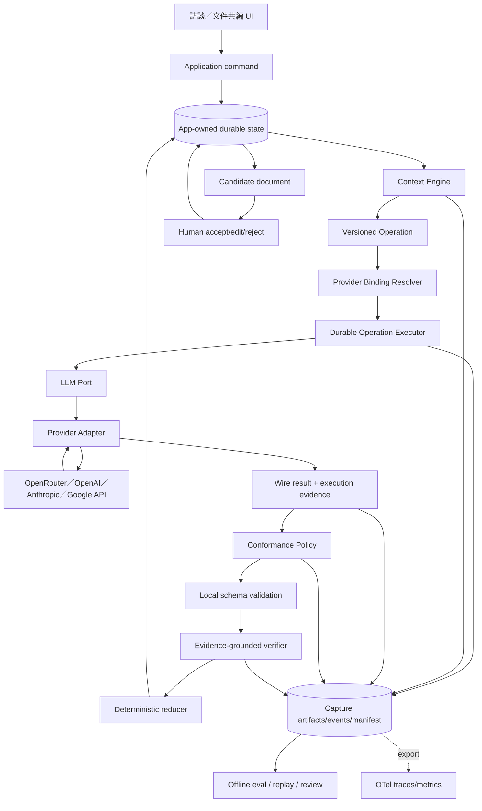

# Interview AI vNext——2026 LLM Runtime、Provider 與評測架構審查

- 狀態：**研究完成；建議架構待 owner 核准，未授權 production 實作**
- 日期：2026-07-18
- 適用範圍：`apps/api/app/interview_vnext/`、`apps/api/evals/interview_vnext/`、後續顧問式訪談與文件共編
- 上游目標架構：[`2026-07-16-interview-ai-vnext-greenfield-architecture.md`](2026-07-16-interview-ai-vnext-greenfield-architecture.md)
- Provider 決策：[`../adr/0035-interview-vnext-openrouter-first-provider-boundary.md`](../adr/0035-interview-vnext-openrouter-first-provider-boundary.md)
- 本次 live 診斷：[`../plans/2026-07-18-interview-vnext-v3-5-turn-eval-harness-plan.md`](../plans/2026-07-18-interview-vnext-v3-5-turn-eval-harness-plan.md)

---

## 1. 結論先行

現有 vNext 的大方向是對的，不需要改成「一個全能 prompt」、全自主 agent、multi-agent 群組或把整段聊天紀錄一直塞回模型。2025–2026 原廠資料的共同方向是：

1. **固定專業流程由 deterministic workflow 掌控**；只把需要語意判讀的節點交給模型。
2. **業務狀態由 application 持有**；provider conversation、cache、compaction 只可當傳輸最佳化，不能成為事實來源。
3. **Context Engine 選最小但足夠的高訊號 context**；大 context window 不等於應該送完整逐字稿。
4. **輸入、輸出、狀態與工具都要 typed**；Structured Outputs 只保證 shape，不保證內容有證據或語意正確。
5. **有自己的 LLM abstraction，再做多個 provider adapter**是主流；但 common layer 不可假裝所有 provider 能力相同。
6. **完整 Capture、trace 與 task-specific eval 是產品的一部分**，不是上線後才補的 logging。
7. **人類保留文件與高風險結論的最終控制權**；AI 提案，deterministic verifier 把關，人類接受、編輯或拒絕。

真正要重構的不是「把某個 regex 放寬」或「讓某次測試過」，而是以下四個契約邊界：

- 模型只輸出語意，不輸出 application identity；
- operation 與 provider runtime binding 分離；
- provider wire 成功與 route/conformance eligibility 分離；
- schema、語意、路由與 domain commit 是四個不同 gate。

建議目標仍是：

> **Evidence-first、stateful、deterministic workflow + typed model operations + application-owned Context Engine + provider adapters + eval-driven promotion。**

這是 hybrid architecture，不是傳統「一條 prompt 打到底」，也不是為了追流行而使用 general agent framework。

---

## 2. 這次研究回答什麼、不回答什麼

### 2.1 要回答

- 專業顧問式訪談的 LLM 層應如何切責任？
- 是否應該有自己的抽象層與多個 provider？
- Context Engine、狀態、長對話、structured output、retry、gateway routing 如何設計？
- 怎樣從員工敘述抓出 action、output、tool、標準、頻率、ownership、time scope、否定與 correction？
- OpenRouter 中介時，如何知道實際模型、endpoint、fallback、guardrail、cache 與 pipeline？
- 如何避免「架構看起來很好，做完效果卻很差」再次發生？

### 2.2 不在本次直接定案

- 不宣稱某一個模型已通過完整 JD 或顧問品質驗收。
- 不直接 promotion `evals/` adapter 到 production。
- 不開始 V3-6 `episode_code`。
- 不導入 LangGraph、OpenAI Agents SDK、Microsoft Agent Framework 或 multi-agent runtime。
- 不以一輪不完整 live batch 決定 Claude、GPT、Gemini 的模型排名。
- 不把框架文件等同於大廠內部未公開的實際 production implementation。

本文件研究的是原廠公開、可驗證的現行做法，以及它們對 Caliburn 的直接架構含義。

---

## 3. 2026 官方共識與本專案採用方式

### 3.1 工作流優先，不預設 agent 或 multi-agent

Anthropic 把 workflow 定義為由程式預先決定路徑，把 agent 定義為由模型動態決定流程與工具；對可明確拆解的工作，workflow 的可預測性、成本與除錯性更好。其建議從最簡單可行方案開始，以 prompt chaining、routing、parallelization、evaluator-optimizer 等可組合模式解決明確問題，而不是先套大型框架。[Anthropic — Building effective agents](https://www.anthropic.com/engineering/building-effective-agents)

Microsoft 2026 的 Agent Framework 指南也把多數真實系統放在中間地帶：workflow 控制流程、gate 與責任，模型只處理需要推理的節點；model-directed agent 在有流程規則時可能成為責任與穩定性風險。[Microsoft — From agents to workflows](https://learn.microsoft.com/en-us/agent-framework/journey/workflows)、[Microsoft — Workflows](https://learn.microsoft.com/en-us/agent-framework/workflows/workflows)

OpenAI 現行 building agents 指南將 models、tools、state、orchestration 視為可組合 primitive，並明確要求以 eval 判斷是否需要 multi-agent；多 agent 只適合可分離且單一 agent 已因工具或指令過載而失效的工作。[OpenAI — Building agents](https://developers.openai.com/tracks/building-agents)

**Caliburn 決策：**訪談是有明確業務規則、證據權限與人工覆核的流程，因此採 deterministic workflow；conversation owner 可以自適應選下一題，但不能自行改寫 domain state、跳過 verifier 或直接接受文件。

### 3.2 Context 是有限注意力，不是免費硬碟

Anthropic 將 context engineering 定義為：在每一步選出最小、最高訊號的 token 集合；即使 context window 變大，context rot 仍存在。官方建議明確且最小充分的 prompt、少量 canonical examples、精確工具定義、必要時使用 just-in-time retrieval、compaction 或外部結構化 notes。[Anthropic — Effective context engineering for AI agents](https://www.anthropic.com/engineering/effective-context-engineering-for-ai-agents)、[Anthropic — Context windows](https://platform.claude.com/docs/en/build-with-claude/context-windows)

OpenAI 與 Anthropic 都提供 provider-side conversation/state 或 compaction，但兩者用途是傳送與長任務延續；OpenAI compaction item 可以是不透明資料，Anthropic Messages API 本身仍是 stateless。這些資料不能取代 application 可驗證的業務狀態。[OpenAI — Conversation state](https://developers.openai.com/api/docs/guides/conversation-state)、[OpenAI — Compaction](https://developers.openai.com/api/docs/guides/compaction)、[Anthropic — Claude API primer](https://platform.claude.com/docs/en/claude_api_primer)、[Anthropic — API and data retention](https://platform.claude.com/docs/en/manage-claude/api-and-data-retention)

**Caliburn 決策：**保留現行純函式 `ContextBuilder`／selection manifest。每次 operation 從 application state 重建 context；不把完整聊天、provider conversation ID 或 provider summary 當真相。

### 3.3 Structured Outputs 是 syntax boundary，不是 truth boundary

OpenAI 明確警告：若使用者輸入與 schema 不相容，模型仍可能為了符合 schema 而填入虛構值；schema 必須有明確的 empty／incompatible 路徑，且應用仍要驗證內容。[OpenAI — Structured Outputs](https://developers.openai.com/api/docs/guides/structured-outputs)

Anthropic 現行 structured outputs 使用 constrained decoding，但只支援 JSON Schema 子集；`pattern` 等限制不受支援，SDK 可能移除限制並把說明移到 description。拒答或 max tokens 等情況仍可能沒有符合 schema 的輸出。[Anthropic — Structured outputs](https://platform.claude.com/docs/en/build-with-claude/structured-outputs)

Google 同樣說明 structured output 只保證可解析與 shape，應用仍須做 value 與 semantic validation。[Google Gemini API — Structured outputs](https://ai.google.dev/gemini-api/docs/structured-output)

**Caliburn 決策：**四道 gate 不得合併：

```text
provider protocol / JSON parse
  -> local schema validation
  -> evidence-grounded semantic verification
  -> domain reducer / commit authority
```

任何「HTTP 200」「JSON 可 parse」「Pydantic 通過」「schema constrained」都不能直接等於 Evidence 可提交。

### 3.4 Provider abstraction 是主流，但能力差異不能被抹平

OpenAI Agents SDK 同時提供 `Model` 與 `ModelProvider` 抽象，允許每個 run 或 agent 選不同 provider；官方也警告不同 provider 對 Responses、structured output、tools 的支援不同，第三方 compatibility layer 可能靜默忽略欄位，因此應 fail fast 驗證能力。[OpenAI Agents SDK — Models](https://openai.github.io/openai-agents-python/models/)

Microsoft Agent Framework 以 provider abstraction 和 capability matrix 接 OpenAI、Anthropic、Gemini 或任何 `IChatClient`；文件同樣不假設所有 provider feature 相同。[Microsoft — AI providers](https://learn.microsoft.com/en-us/agent-framework/agents/providers/)

Google ADK 的 `BaseLlm` 亦是模型共用介面，再由 Gemini、Claude 等實作提供差異能力。[Google ADK — BaseLlm](https://google.github.io/adk-docs/api-reference/java/com/google/adk/models/BaseLlm.html)

**Caliburn 決策：**保留自己的 `LlmPort`，每個官方 API／gateway 有獨立 adapter。共用層描述 Caliburn 的業務需求與 normalized result；provider-specific request、reasoning、routing metadata、usage、cache、guardrail 與錯誤仍留在 adapter/binding。

### 3.5 Eval 與 trace 是架構，不是最後 QA

Anthropic 2026 將 task、trial、transcript/trajectory、outcome、grader、harness 分開，要求同一 task 多次 trial，並指出評測實際上同時測 model 與 harness；應優先檢查環境結果，而不是相信模型自己的成功宣告。[Anthropic — Demystifying evals for AI agents](https://www.anthropic.com/engineering/demystifying-evals-for-ai-agents)

OpenAI 建議 eval-driven development、task-specific cases、production distribution、持續加入實際 failure、人工校準 automated grader；workflow 中的非 deterministic step 應各自評測。[OpenAI — Evaluation best practices](https://developers.openai.com/api/docs/guides/evaluation-best-practices)、[OpenAI — Agent evals](https://developers.openai.com/api/docs/guides/agent-evals)

Google Vertex AI 也把 final outcome 與 trajectory 分開，提供 custom evaluator 與 trace-based evaluation。[Google Cloud — Agent evaluation](https://cloud.google.com/blog/products/ai-machine-learning/introducing-agent-evaluation-in-vertex-ai-gen-ai-evaluation-service)、[Google Cloud — Evaluate an agent](https://docs.cloud.google.com/vertex-ai/generative-ai/docs/agent-engine/evaluate)

**Caliburn 決策：**保留 repo-owned Capture/eval；provider dashboard 只可輔助，不可成為 promotion 唯一證據。每次 contract、prompt、context policy、binding 或 verifier 變更都必須產生新 identity，跑 capability 與 regression suites。

### 3.6 人類控制與文件共編

Anthropic 對 trustworthy agents 的公開研究強調 human control、重要 checkpoint、對不確定性澄清或暫停，以及在每一層做 prompt-injection 防禦與最小權限。[Anthropic — Building and evaluating alignment auditing agents](https://www.anthropic.com/research/trustworthy-agents)

**Caliburn 決策：**AI 可以提出 Evidence、Inference、Candidate 與文件 patch；不能直接覆寫已接受文件。使用者必須能逐項接受、編輯、拒絕，所有決策保留 lineage。

---

## 4. 本次 live 診斷：為什麼現在不能只修一個欄位

### 4.1 Clean canary 證明 wire 可行，但也證明 schema 不等於真實

2026-07-18 的 clean OpenRouter canary：

- run：`58843af0-6237-4f11-8576-dd2c7d60834c`
- requested model：`anthropic/claude-sonnet-5`
- permanent canonical model：`anthropic/claude-sonnet-5-20260630`
- selected provider／endpoint：`Anthropic`／`anthropic`
- routing：direct、attempt 1、pipeline empty、無 cache
- Capture manifest／hash chain：通過
- observed cost：`US$0.034884`

但輸入沒有足夠證據時，模型仍填出 `ownership=owner`、`time_scope=current`、`typicality=typical`、`polarity=affirmed`。輸出完全符合 schema，卻把 unknown 說成已知。

這不是 parser bug，而是 contract 缺少強制的 epistemic rule：

> 未被 quote 明確支持的 qualifier 必須輸出 `unknown`／`uncertain`／`not_stated`，不得以一般常識補值。

### 4.2 正式 batch 暴露三種不同問題

batch `5bad4e3f-5a5f-453e-8923-12a00a05cece` 最終為 `harness_invalid`，不是 model quality pass/fail：

- 已建立 18 trials，發生 27 次 inference call；
- observed cost：`US$0.464998`；
- 9 trials committed；
- 8 trials 因 output schema/local contract invalid；
- 1 trial 因 route contaminated 停線；
- batch 尚未覆蓋完整 12×3，所以不得計算正式品質 verdict。

三種問題必須分開處理：

1. **Contract identity 問題**：模型反覆輸出 underscore key，例如 `action_aggregate_shortage_details`，但 application 要求 kebab-case `proposal_key`。portable provider schema 已移除不支援的 `pattern`，prompt 又沒有完整表達格式；repair 仍會重犯。
2. **Gateway conformance 問題**：其中一次 routing metadata 顯示 exact Anthropic、direct、attempt 1，但 pipeline 有 OpenAI moderation guardrail。這不代表輸出必然錯，卻已不是「純 Anthropic 單一路徑」的 benchmark。
3. **Harness determinism 問題**：online grade 與 offline regrade 建立 `GradingContext` 時使用不同 `failure_reason_code`，導致同一 immutable trial 被判定為 grader drift。這是 harness defect，不能歸因模型。

### 4.3 本次診斷允許與不允許的結論

允許：

- OpenRouter + exact Anthropic endpoint 的 direct route 可成功執行。
- provider metadata 可能揭露 gateway pipeline；strict benchmark 必須逐 attempt 檢查。
- current `proposal_key` 是把 application identity 責任錯交給模型。
- current schema-valid output 仍會產生 unsupported qualifier。
- current harness 尚不能穩定做 offline regrade。

不允許：

- 不得說 Claude Sonnet 5 品質通過或失敗。
- 不得說 OpenRouter 不可用。
- 不得為了讓 batch 繼續而忽略 moderation stage。
- 不得只把 regex 改成接受 underscore 後重跑。
- 不得在修好 harness 前拿 aggregate metrics 作 promotion。

本次已花 `US$0.499882`，未再發生額外付費呼叫；後續 live 應在 contract 與 harness 修正後才恢復。

---

## 5. 現行架構審查：保留、重構、延後

| 現行部分 | 裁決 | 原因與動作 |
|---|---|---|
| application-owned transcript/Evidence/Episode/Gap/Inference/Candidate | **保留** | 這是可稽核的業務真相；不得搬到 provider memory |
| immutable reducer、typed command、human authority | **保留** | 模型只提案，domain 決定可否 mutation |
| `ContextBuilder` + selection manifest + budget | **保留並擴充** | 符合 context engineering；增加 feature-level evidence coverage 與 policy identities |
| `OperationDefinition` 的 prompt/schema/context hash | **保留** | 是可重現與 eval comparison 的基礎 |
| 自有 `LlmPort` | **保留但升級** | 增加 runtime binding 與 normalized execution evidence，不改成 vendor SDK 型別外洩 |
| OpenRouter／OpenAI 各自 adapter | **保留** | gateway 不應假裝只是 OpenAI base URL；未來 Anthropic/Google 也各自一個 adapter |
| `TurnInterpretProviderProfile(provider, requested_model)` | **取代** | 太薄，沒有 adapter version、exact upstream、capability、route、privacy、retry、schema projection identity |
| adapter 直接把 route contamination 壓成 generic model failure | **重構** | wire outcome、execution evidence 與 conformance verdict 分開保存；commit 仍 fail closed |
| 模型輸出 `proposal_key` | **移除** | identity 應由 application 依 canonical output order／operation ID 派生 |
| `turn.interpret/1.0.0` 單次同時抽取 facts、qualifiers、signals、insufficiency | **保留為 baseline，不直接 promotion** | 先做 ID-less v2，再以 ablation 決定一-call 或二-stage，不能憑感覺拆 |
| portable schema strip unsupported constraints | **保留機制、強化揭露** | 每次 projection 必須有 loss report；不可讓 prompt 不知道被移除的限制 |
| durable Capture + hash chain | **保留** | 是可重現 truth；未來可 export OTel，但 OTel 不取代 Capture |
| repo-owned multi-trial eval | **保留並修正** | 修 grader context drift、分 capability/regression、加入 qualifier evidence gate |
| provider-side conversation／compaction | **延後** | 每 turn context 可由 app 重建；現階段沒有必要引入不透明 state |
| multi-agent | **延後** | 尚無工具過載或可分離任務的 eval 證據；會增加 handoff 與 nondeterminism |
| LLM-as-judge promotion gate | **延後** | 先建立人工校準集；現階段 deterministic + human review 較可靠 |

---

## 6. 目標架構總圖



### 6.1 三條權威線

整個系統不能只有一條「AI 回傳線」，必須同時保留：

1. **Business authority**：app state、reducer、human decision。
2. **Execution authority**：operation、binding、adapter、provider execution evidence。
3. **Evidence authority**：quote、span、source turn、lineage、Capture。

任何結果若缺其中一條，只能診斷，不能 promotion 或 commit。

---

## 7. 分層與依賴方向

### 7.1 Domain

負責：Evidence、Episode、Gap、Inference、Candidate、ReviewDecision、狀態轉移與不變量。

不得知道：OpenRouter、OpenAI、Anthropic、HTTP、SDK、model slug、token、prompt template。

### 7.2 Application

負責：workflow、Context Engine、operation executor、binding selection policy、conformance、verifier、reducer orchestration、retry/deadline、UoW。

只依賴 ports 與 domain，不 import eval adapter 或 vendor SDK。

### 7.3 LLM contract

負責：Caliburn 所需的 provider-neutral structured generation request/result、operation identities、execution evidence normalization。

不能成為「所有 provider 全功能聯集」；只定義 Caliburn workflow 真正需要的交集和明確 capability requirement。

### 7.4 Provider adapter

負責：

- exact request projection；
- auth、HTTP/SDK deadline 與單次 wire call；
- provider-specific structured output、finish reason、refusal、usage、cost、routing metadata normalization；
- raw/visible/error/routing artifacts；
- secret 與 hidden reasoning redaction。

不得負責：

- 選下一個 provider；
- application retry；
- Evidence semantic verification；
- domain mutation；
- 隱藏 fallback、JSON 修復或自動換模型。

### 7.5 Composition root

唯一可以把 operation、quality profile、provider binding、adapter instance、secret handle 與 runtime config 接起來的地方。

production 與 eval 都使用同一份 adapter implementation；eval 只能增加 harness wiring，不能複製「簡化版 production adapter」。

---

## 8. Operation、ProviderBinding、Adapter 必須是三個物件

### 8.1 `OperationSpec`

描述「業務要模型完成什麼」：

- operation name/version/hash；
- input/output contract；
- prompt template；
- context policy；
- quality profile；
- deadline/output budget/attempt policy；
- allowed tools；
- safety policy flags。

不得放 provider/model/endpoint。現行方向正確。

### 8.2 `ProviderBinding`

描述「這個環境如何執行某個 operation/quality profile」。建議新增 immutable、hash-addressed contract：

```text
ProviderBinding.v1
  binding_id
  binding_hash
  operation_name
  quality_profile
  adapter_id
  adapter_version
  gateway                 # openrouter | direct_openai | direct_anthropic | direct_google
  requested_model
  upstream_provider
  upstream_endpoint
  required_capabilities[]
  schema_projection_policy_id/hash
  conformance_policy_id/hash
  retry_owner             # executor only
  provider_internal_retries_allowed
  storage_policy
  cache_policy
  reasoning_policy
  data_collection_policy
  request_defaults_hash
```

不保存 API key；只保存 secret 的 logical handle 或由 deployment 注入。任何會改變實際 wire 行為的欄位都必須進 `binding_hash`。

### 8.3 `ProviderAdapter`

介面不以 provider 名稱分支：

```text
execute(request, binding_snapshot) -> ModelCallEnvelope
```

但每個實作只服務一種真實 protocol：

- `OpenRouterChatCompletionsAdapter`
- `OpenAIResponsesAdapter`
- `AnthropicMessagesAdapter`（需要 direct vendor comparison 時才建）
- `GoogleGenerateContentAdapter`（需要 direct vendor comparison 時才建）

不要建立一個塞滿 `if provider == ...` 的 mega adapter，也不要把 OpenRouter 當成 OpenAI-compatible base URL 直接共用 OpenAI adapter。

### 8.4 `ProviderBindingResolver`

輸入：

```text
operation definition hash + quality profile + deployment environment
```

輸出：唯一、immutable `ProviderBinding` snapshot。找不到、找到多個、capability 不符都 fail fast；不得在 adapter 內臨時猜 model。

第一階段 production registry 只需一個已通過 gate 的 OpenRouter binding。抽象層支援多 provider，不等於第一天同時維護四個 production provider。

### 8.5 Resolved call contract

`ModelCallRequest.v2` 不再讓任意 caller 自由填 `provider/requested_model`。resolver 先產生並持久化 binding artifact，executor 再建立：

```text
ResolvedModelCall.v1
  request
    operation_id/attempt_id/attempt
    operation_definition_hash
    prompt/schema/context/selection artifact refs + hashes
    deadline/max_output_tokens
    binding_id/binding_hash
    requested_model              # 從binding複製，供audit assertion
  binding_snapshot_artifact
  schema_projection_artifact
```

建議 port 為：

```text
LlmPort.generate_structured(call: ResolvedModelCall) -> ModelCallEnvelope
```

adapter 必須驗證 request 的 `binding_id/hash/requested_model` 與 snapshot 相符後才能發 HTTP。fresh-process recovery 從 immutable artifacts 重建整個 resolved call，不重新跑 resolver；否則部署設定在 crash 前後改變時，會讓同一 durable operation 偷換模型或路由。

### 8.6 OpenRouter 與官方 direct 的選擇

| 路徑 | 優點 | 代價／風險 | 本專案用途 |
|---|---|---|---|
| OpenRouter | 一把 key、統一帳務、快速比較 Claude/GPT/Gemini、單一 gateway adapter | 多一層 routing/plugin/guardrail/cache 語意；原生新功能可能有時間差；模型歸因需metadata | **第一個 adapter、模型初選、可能的 production primary** |
| Anthropic direct | Claude 原生 Messages/structured output/cache/stop reason；路徑較短、歸因清楚 | 只服務 Claude；另建adapter、帳務與維運 | Claude 成為 finalist 後的成對比較／可能 primary |
| OpenAI direct | GPT 原生 Responses/state/structured output/usage；路徑較短、歸因清楚 | 只服務 OpenAI；另建adapter、帳務與維運 | GPT 成為 finalist 後的成對比較／可能 primary |
| Google direct | Gemini 原生 GenerateContent/structured output；路徑較短 | 只服務 Gemini；另建adapter、帳務與維運 | Gemini 成為 finalist 後才考慮 |

不在架構文件中預判哪家模型品質最高。正確順序是：以 OpenRouter 完成同一 contract 下的初選；對唯一或少數 finalist 建官方 direct adapter，固定 prompt/schema/context/model 做 paired trials。若 direct 在 reliability、route可歸因性、原生能力或 latency 顯著勝出，direct 作 primary、OpenRouter 作實驗／備援；若品質無實質差異且 gateway 的維運效率更高，可保留 OpenRouter primary。

---

## 9. Provider capability 與 schema projection

### 9.1 Capability 不可用布林 `supports_json` 草率表示

最低需要：

```text
structured_output.mode              # native_schema | tool_schema | json_only | unsupported
structured_output.schema_subset
structured_output.strictness
structured_output.refusal_shape
structured_output.incomplete_shape
tools
streaming
provider_state
prompt_cache
reasoning_controls
usage_fields
routing_attestation
data_retention_controls
```

binding 的 `required_capabilities` 必須由 preflight 驗證。能力缺失不能靜默移除 request field 後繼續。

### 9.2 Schema projection 必須產生 loss report

portable business schema 投影成 provider schema 時，除了 projected schema 與 hash，還要有：

```text
SchemaProjectionReport.v1
  source_schema_id/hash
  target_provider/profile
  projected_schema_hash
  removed_constraints[]
  rewritten_constraints[]
  unsupported_constraints[]
  prompt_obligations[]
```

例如 `proposal_key.pattern` 被移除時，這不能只是 helper 的內部行為；它必須成為可測、可 Capture 的 loss。若 constraint 對 correctness 很重要，預設方案不是「靠 prompt 再說一次」，而是移出 model responsibility 或加入 deterministic local gate。

### 9.3 Canonical schema 原則

- provider-facing schema 保持淺、明確、強型別；
- 所有 object `additionalProperties=false`；
- enum description 說明 evidence rule，不只說欄位名稱；
- 有 `unknown`／`uncertain`／`not_stated` path；
- 不強迫模型在無證據時填肯定值；
- provider response 成功後仍以完整 local Pydantic/domain contract 驗證。

---

## 10. Model result、execution evidence 與 conformance

### 10.1 不再把所有問題壓成同一個 `failed`

建議 envelope 分三塊：

```text
ModelCallEnvelope.v2
  wire_result
  execution_evidence
  supporting_artifacts[]
```

`wire_result` 回答：provider 呼叫是否完成、拒答、不完整、transport/error、是否有可解析 payload。

`execution_evidence` 回答：實際經過哪個 gateway/upstream/model/endpoint、幾次 upstream attempt、哪些 pipeline、是否 cache、usage/cost 與 limitations。

`ConformanceReport` 由 application 的 deterministic policy 產生，回答這份結果是否可用於當前用途。adapter 只 normalize facts，不決定 benchmark policy。

最低 contract：

```text
ConformanceReport.v1
  policy_id/policy_hash
  binding_id/binding_hash
  execution_evidence_hash
  eligible
  reason_codes[]             # unique + lexicographically sorted
  transformation_status
  checked_at                 # audit；不進deterministic semantic hash時需明示
```

report、normalized evidence 與 raw routing artifact 都要保存。`eligible=false` 時，wire payload仍可供診斷與離線ablation，但executor不得進 local semantic commit path。

### 10.2 `ProviderExecutionEvidence.v1` 最低欄位

```text
binding_id/hash
adapter_id/version
gateway
requested_model
gateway_resolved_model
upstream_provider
upstream_model
upstream_endpoint
route_strategy
upstream_attempt_count
transformation_status       # clean | inspected | mutated | unknown
pipeline_stages[]
cache_status                # miss | hit | absent | unknown
provider_request_id
generation_id
usage
cost_decimal
limitations[]
raw_routing_artifact_ref
```

`cost_decimal` 以 decimal 字串保存，不用 float 重算。provider 未回報的 usage 欄位是 null + limitation，不能偽造 0。

### 10.3 Conformance profiles

#### `attribution_strict.v1`

用於模型 bake-off、聲稱「Claude/GPT/Gemini 本身表現」：

- exact requested/resolved/upstream model；
- exact provider/endpoint；
- route direct；
- upstream attempt 1；
- pipeline empty；
- cache absent/miss；
- 無 fallback、compression、healing、tool、moderation、redaction；
- metadata 不完整或 unknown stage 一律 ineligible。

#### `production_safe.v1`

用於實際產品，可允許經 owner 核准且有 Capture 的 safety inspection，但必須：

- stage 名稱、版本、provider、設定 hash 在 allowlist；
- 明確證明只 inspection，未 redact/rewrite/block；
- effective system identity 標示為「OpenRouter + Anthropic + moderation」，不得宣稱純 Claude；
- 任何 mutating/unknown stage 仍 fail closed。

第一版 production 建議仍以 strict profile 起步；不要在沒有 ablation 證據前放寬。

### 10.4 OpenRouter 的直接架構含義

OpenRouter router metadata 明確可揭露 provider selection、compression、guardrail、tool、retry 等 pipeline stage；plugin 和 guardrail 也可能受 account、member、key 或 Prevent Overrides 設定影響。[OpenRouter — Router metadata](https://openrouter.ai/docs/guides/features/router-metadata)、[OpenRouter — Plugins](https://openrouter.ai/docs/guides/features/plugins/overview)、[OpenRouter — Guardrails](https://openrouter.ai/docs/guides/features/guardrails/overview)

因此 request 中的 `allow_fallbacks=false`、`require_parameters=true` 與 exact endpoint 仍不夠；每一個 response 都要驗 routing metadata。`top_provider.is_moderated=true` 也應在 model catalog preflight 與 Capture 中揭露。[OpenRouter — Provider routing](https://openrouter.ai/docs/guides/routing/provider-selection)、[OpenRouter — Models](https://openrouter.ai/docs/guides/overview/models)

---

## 11. Turn Interpreter v2：模型輸出語意，application 產生 identity

### 11.1 移除 `proposal_key`

不得採用「同時接受 underscore 與 kebab-case」作正式修復。這只會讓模型繼續負責它不應負責的 protocol identity。

新契約：

- 模型只輸出有順序的 `observations[]`；
- local parse 後，application 依 canonical array ordinal 建立 `proposal_ref=p0001,p0002,...`；
- ordinal 使用原始parsed array的**一基序號**，在semantic filtering、sorting、deduplication前指派；
- Evidence ID 使用 `UUIDv5(operation_id, "observation/{ordinal:04d}")`，第一筆固定為`observation/0001`；
- 同一 immutable provider artifact replay 會得到相同 ID；
- 不承諾不同 operation/run 之間使用相同 Evidence ID；跨 turn lineage 由 evidence/correction target 維護。

完整local schema validation失敗時不建立任何proposal ref；schema通過後，即使某筆被semantic verifier drop，其ref仍保留在verification report，後續accepted Evidence不得因drop而重新編號。

若模型需指向既有 correction target，可以從 Context Engine 提供的 opaque `evidence_id` 中選擇，因為這是語意引用既有事實；模型不得創造新 domain ID。

### 11.2 移除 model-generated observation cross-reference

現行 `InsufficiencyProposal.observation_proposal_keys` 會逼模型維護另一套 relational protocol。建議：

- observation-specific insufficiency 直接放在該 observation 的 `insufficiency_codes[]`；
- turn-level insufficiency 放在 `turn_insufficiency_codes[]`；
- 不再由模型輸出 observation key list。

### 11.3 建議 output shape

```json
{
  "observations": [
    {
      "subject": "employee",
      "kind": "action",
      "claim": "每週彙整各門市缺貨明細",
      "quote": "我每週會把各門市的缺貨明細彙整起來",
      "quote_occurrence": 1,
      "qualifiers": {
        "time_scope": "current",
        "typicality": "unknown",
        "polarity": "affirmed",
        "frequency": {
          "value": "1",
          "unit": "per_week",
          "verbatim": "每週"
        },
        "importance": "not_stated",
        "ownership": "unknown"
      },
      "correction": {
        "target_evidence_ids": [],
        "target_unknown": false
      },
      "insufficiency_codes": ["ambiguous_ownership"]
    }
  ],
  "user_signal": "answer",
  "episode_signal": "continue",
  "emergent_topics": [],
  "turn_insufficiency_codes": []
}
```

### 11.4 Qualifier evidence rules

| Qualifier | 可輸出確定值的最低證據 | 無最低證據時 |
|---|---|---|
| `time_scope` | 明確現在／過去／未來／假設語句或由 preceding question 限定且無衝突 | `unknown` |
| `typicality` | 明確「通常／偶爾／例外」語句 | `unknown` |
| `polarity` | 明確肯定、否定或不確定 | `uncertain` |
| `frequency` | exact quote 有數量＋週期，或明確 irregular | value null + `unknown` |
| `importance` | 明確核心／支援性陳述 | `not_stated` |
| `ownership` | 明確主責、共同、協助、接收或不負責 | `unknown` |

preceding question 可以幫助消歧，但不能覆蓋員工回答；Context Engine 若用問題補足某 qualifier，verifier 必須把依據記為 question-context evidence，而不是假裝出現在 employee quote。

### 11.5 Quote 與 atomicity hard gates

- quote 必須在 current employee turn exact match；normalized match 只能依版本化 normalization policy。
- quote occurrence 必須唯一定位。
- claim 不得比 quote 增加數字、ownership、時態、對象、工具或成果。
- action/output/tool/standard/frequency 等保持 atomic；一句包含多個獨立工作產出時拆成多個 observation。
- injection 指令若出現在 employee text，只可當 data，不得改變 operation instructions。
- correction 只有在明確修正既有說法時成立；target 不明時標 `target_unknown=true`，不能猜 ID。

---

## 12. `turn.interpret` 要不要拆：先做 ablation，不靠直覺

現行一次要模型同時完成 quote extraction、claim normalization、taxonomy、六組 qualifiers、correction、user signal、episode signal、emergent topics、insufficiency。這可能造成 instruction competition，但不能因一次 batch 失敗就直接拆成很多 agent。

必須比較三個候選：

### C0——現行 monolith v1

只作 baseline；保留 `proposal_key` 與既有 output。不得修 regex 後當新架構。

### C1——ID-less one-call v2（第一個建議實作）

維持單一 provider call，但：

- 移除 model-generated identity/cross-reference；
- 強化 unknown/unsupported qualifier；
- prompt 和 schema 明示 evidence rules；
- local verifier 驗 qualifier support；
- schema projection loss 可見。

這是最小但架構正確的 candidate。

### C2——staged extraction v2

```text
T1: quote-grounded atomic facts + correction semantics
  -> deterministic quote/atomicity gate
T2: 對已接受 facts 做 qualifier + turn/episode signal classification
  -> semantic verifier
```

T2 只收到 accepted T1 facts 與必要 context，不看 gold。若 T1 無 fact，T2 可跳過。兩個 operation 各有自己的 prompt/schema/context/binding/Capture identity。

### 12.1 promotion 判準

在相同 frozen dev/challenge cases、相同 exact binding、每 case 至少三次 trial 比較：

- raw/committed precision、recall；
- qualifier support precision；
- false specificity rate；
- correction accuracy；
- zero-evidence hallucination；
- injection resistance；
- pass^3；
- p50/p95 latency；
- cost per committed supported edge；
- schema/local validation failure；
- human adjudication burden。

C2 只有在 reliability 有實質改善且額外成本/延遲可接受時才能勝出。若 C1 已達 gate，單呼叫方案對一人團隊更適合。

---

## 13. Context Engine 詳細契約

### 13.1 Canonical input source

只從 application state 取：

- preceding consultant question；
- current employee turn；
- active episode target/status；
- unresolved contradiction/gaps；
- correction candidates；
- recent active Evidence；
- operation-specific reference snapshot。

不直接取 provider chat history、provider summary、UI 當前 HTML 或任意長期記憶。

### 13.2 每個 context item 都要有 selection reason

`SelectionManifest` 最低保存：

```text
context_policy_id/hash
input_state_hash
included_items[{id, type, reason_code, priority, token_estimate}]
excluded_items[{id, type, reason_code}]
budget_by_category
total_budget
truncation_occurred
coverage_flags
```

reason code 使用封閉 enum，例如：`current_turn_required`、`preceding_question_scope`、`active_episode`、`open_contradiction`、`correction_candidate`、`recent_active_evidence`、`excluded_superseded`、`excluded_budget`。

### 13.3 Budget 優先順序

不能被截掉：current turn、preceding question、active injection boundary、直接 correction candidate。

依序降權：

1. current-turn 必要資料；
2. unresolved contradiction/correction；
3. active episode；
4. recent active Evidence；
5. older context/reference examples。

超出 budget 時寧可明示 insufficiency，不可讓 Context Engine 靜默把缺失資料摘要成肯定事實。

### 13.4 長對話策略

- transcript 永久存在 app DB/Capture；
- operation context 不等於 transcript 全量；
- episode note 必須是有來源的結構化 artifact，可追到 Evidence；
- provider compaction 只可用於未來長時間 tool loop，不用於目前 per-turn interview truth；
-若未來使用 compaction，compaction artifact 要標示 `transport_only`，不得被 projector 引用。

---

## 14. 一個 turn 的精確 runtime

```text
1. append employee turn（durable）
2. reducer 更新 session/turn state
3. 建立 operation_id 與 immutable ContextPacket/SelectionManifest
4. resolve 唯一 ProviderBinding snapshot
5. preflight capability/schema projection/conformance requirements
6. durable claim attempt；不持有 DB transaction 跨 provider I/O
7. adapter 執行恰好一次 wire call
8. 保存 raw/visible/routing/usage artifacts 與 execution evidence
9. conformance policy 判定 eligibility
10. local output contract validation
11. evidence-grounded semantic verifier
12. application 依 ordinal 派生 proposal_ref/Evidence IDs
13. reducer partial commit accepted Evidence；dropped proposals 留 report
14. Agenda/Sufficiency policy 決定追問、切 episode 或進下一步
15. response composer 產生顧問回應
16. 同 transaction finalize durable state/Capture pointers/outbox
17. eval exporter可離線重驗全部 identity/hash，不重新呼叫模型
```

### 14.1 順序不可調換

- binding 必須在 call 前 snapshot，不能結果回來後才補 resolved config。
- conformance 在 semantic commit 前；route 不合格的輸出可保存診斷，但不可進 Evidence。
- local schema 在 semantic verifier 前；verifier 不負責修 JSON。
- response composer 在 reducer 結果後，不能讓自然語言回覆反過來當 state truth。

---

## 15. Retry、deadline、idempotency 與 crash recovery

### 15.1 Retry ownership

- SDK/HTTP adapter：`max_retries=0`，不做 hidden retry。
- gateway：strict binding 要求 upstream attempt 1；若 gateway 自行 retry，execution evidence 必須揭露並判 ineligible。
- application executor：唯一 retry owner，依 typed failure、deadline、attempt policy 決定。

### 15.2 Retry 類型

| 類型 | 預設 | 說明 |
|---|---|---|
| timeout／429／暫時 5xx | 可 retry | 新 attempt ID；同 operation ID；遵守 deadline/retry-after |
| auth／permission／invalid request | 不 retry | config/harness failure |
| refusal／safety block | 不自動改 prompt retry | 交 workflow 決定安全回覆或人工處理 |
| output parse/schema invalid | 最多一次 schema repair candidate | 必須是新 operation attempt、完整 Capture；先由 ablation 證明有價值 |
| semantic unsupported qualifier | 不做模型自我修復為預設 | verifier drop/unknown，下一題澄清；避免 confirmation bias |
| route/conformance ineligible | 同 batch 停線 | 不能換 endpoint 後假裝同一實驗 |

### 15.3 Exactly-once 誠實性

`idempotency_key` 只保證 Caliburn workflow 去重，不宣稱 provider exactly-once。worker crash 在「provider 已處理、result 尚未 durable」的窗口可能留下不確定呼叫；checkpoint 必須標 `outcome_unknown` 或等待人工/timeout policy，不能盲目重送 stateful request。

---

## 16. Capture、logging 與 OpenTelemetry

### 16.1 Capture 是執行證據，不只是 log

Capture 必須能回答：

- 哪個 state/context/prompt/schema/binding 觸發呼叫？
- gateway 和 upstream 實際走哪裡？
- 模型輸出什麼可見內容？
- 哪些 proposal 被 verifier 接受/拒絕，原因為何？
- reducer 寫入什麼，state hash 如何改變？
- run 是否完整、manifest/hash chain 是否有效？

一般 application log 不保證 immutable、完整 artifact、hash identity 或 replay，所以不能取代 Capture。

### 16.2 OTel 是 export，不是 source of truth

OpenTelemetry 已將 GenAI semantic conventions 移到專門 repository，涵蓋 model spans、metrics、events、MCP 與 provider-specific conventions；規格仍持續演進。[OpenTelemetry GenAI semantic conventions](https://github.com/open-telemetry/semantic-conventions-genai)、[OpenTelemetry semantic conventions](https://opentelemetry.io/docs/specs/semconv/)

建議未來增加 `Capture -> OTelExporter`：

- traces 用於 latency、error、provider/model、token、cost 與 workflow topology；
- 不 export raw transcript、secret、hidden reasoning；
- Capture ID/hash 放 trace attribute 供反查；
- durable schema 仍由 Caliburn 版本化，不綁死未穩定的 GenAI semconv。

---

## 17. Eval 架構與 promotion gate

### 17.1 先修 harness，再談模型

V3-5 下一輪 paid eval 前必須：

1. online grade 與 offline regrade 使用同一個 immutable `GradingContext` builder；
2. `failure_reason_code`、terminal disposition、parsed output、verification report 全由 trial artifact 重建；
3. 同一 bundle 重跑兩次，grader result canonical hash 完全相同；
4. schema projection loss 進 bundle；
5. route evidence 與 conformance report 分開；
6. C0/C1/C2 有不同 suite/operation identity，不可覆寫舊結果。

### 17.2 Suite 分層

| Suite | 用途 | 可否頻繁修改 |
|---|---|---|
| development | prompt/contract 開發與失敗分析 | 可以，需新 suite hash |
| challenge | known-correction、unknown-correction、zero-evidence、injection 等難例 | 嚴格版本化 |
| regression | production/live 發現的真 failure | append-only 為主 |
| capability | 新模型/provider/binding 能否達最低能力 | 與模型選型綁定 |
| end-to-end pilot | 完整訪談、episode、JD projection、human review | turn gate 後才建立 |

### 17.3 Grader 分工

- deterministic：schema、quote match、span、ID、hash、route、state transition、exact enum、numeric support；
- calibrated semantic：claim equivalence、atomicity、漏抓、過度推論；第一版由 blind human review；
- LLM judge：只有建立人類裁決集並量測一致性後，才能作輔助，不單獨決定 promotion。

### 17.4 可靠性指標

使用者每次只得到一次訪談結果，因此主要指標是所有重複 trial 都通過的 `pass^k`／case reliability，而不是挑最好一次的 pass@k。必須同時報平均、最差 case、false specificity、critical failure 與成本；不能只報一個總分。

### 17.5 Promotion 順序

```text
adapter conformance
  -> contract/harness determinism
  -> turn capability gate
  -> episode coding gate
  -> agenda/conversation gate
  -> JD projection gate
  -> human co-edit gate
  -> limited pilot
  -> production shadow/canary
```

任何前一層未通過，不得因後一層 demo 看起來漂亮而跳級。

---

## 18. AI 顧問與文件共編

### 18.1 同一顆業務腦，不讓文件編輯另養一套聊天記憶

訪談與文件共編都讀相同 app-owned Evidence/Inference/Candidate graph。文件 AI 不從已渲染的 JD 文字反向猜事實；它只能引用已存在且可追溯的 evidence closure。

### 18.2 Patch-based co-edit

AI 輸出：

```text
DocumentPatchProposal
  candidate_revision_id
  target_section/field
  operation             # add | replace | remove | reorder
  proposed_value
  rationale
  supporting_evidence_ids[]
  inference_ids[]
  confidence/limitations
```

使用者執行：accept、edit、reject。只有 human decision 可以產生 accepted document revision。AI 後續可根據 reject/edit feedback 產生新 proposal，但不能修改既有 decision history。

### 18.3 顧問感來自 workflow，不是人格 prompt

專業顧問效果由以下共同產生：

- Evidence-first extraction；
- insufficiency/contradiction 偵測；
- agenda coverage 與資訊價值選題；
- 有上下文但不重複的追問；
- 對 unknown 誠實；
- 對文件內容提供可追溯建議；
- 人類可控制與修正。

單純加入「你是一位資深顧問」不會補足這些能力。

---

## 19. 一人團隊的技術選擇

### 19.1 現在應做

- 保持 Python/Pydantic/SQLAlchemy 現有 stack；
- own small abstractions：Operation、Context、Binding、Adapter、Conformance、Capture；
- direct SDK 或 `httpx` 實作 adapter；
- OpenRouter 作第一個 production candidate；
- direct Anthropic/OpenAI 只在模型入選、需要 attribution/備援對照時建；
- repo-owned eval 與 deterministic workflow。

### 19.2 現在不應做

- 為了「看起來主流」搬到大型 agent framework；
- 同時維護所有 provider 的完整 feature set；
- 建 visual workflow builder、general tool marketplace、vector memory 平台；
- 把每個步驟都拆成一個 agent；
- 先做自動 fallback router 再補 Capture；
- 先微調模型，卻沒有穩定 eval 與可歸因 baseline。

框架可作參考或未來 composition helper，但 domain/runtime contracts 必須由 Caliburn 擁有，避免供應商或框架生命週期決定產品核心。

---

## 20. 實作切片與 hard gate

本文件核准後，另寫 executable plan；不要直接依本節一次做完。

### 20.1 一人團隊 timebox

這不是同時重寫所有 provider。依現有 code/harness 基礎，合理的規劃量級是：

| 工作 | 估計專注開發日 | 備註 |
|---|---:|---|
| A1 harness deterministic regrade | 0.5–1 | 不改 prompt/model contract |
| A2 binding/execution evidence/conformance | 1–2 | 只接既有 OpenRouter adapter |
| A3 C1 ID-less contract/verifier/fixtures | 1.5–3 | 風險最大，需完整 regression |
| A4 canary + 12×3 + review | 0.5–1 | 不含等待外部 rate limit；先設付費 cap |
| finalist 官方 direct adapter | 1–3 | 後續選配，只做 Anthropic 或 OpenAI 其中一家 |

第一個決策點約為 **4–7 個專注開發日**。不得先做所有 direct adapters；若 C1 未達 gate，才 timebox C2 ablation。這些是規劃量級，不是交付承諾；實作者應在每個 hard gate 後重新估算。

### A0——凍結診斷證據與狀態

- 回寫 V3-5 batch 為 attempted/inconclusive；
- 記錄 canary、batch、cost、route contamination、grader drift；
- V3-6 保持 blocked。

### A1——Harness determinism repair

- 單一 `build_grading_context(trial_artifacts)`；
- 修正現行`batch_orchestrator.grade_execution()`未提供`failure_reason_code`、offline `_score_trial()`卻使用`trial.terminal_reason_code`的分歧；
- online/offline/hash equality tests；
- 不改 model contract。

Hard gate：同 bundle 任意次 regrade byte-equivalent。

### A2——ProviderBinding + execution evidence + conformance

- contracts/schema/tests 先行；
- binding resolver 與 registry；
- OpenRouter adapter 回傳 normalized execution evidence；
- strict/production-safe policy；
- 保持 production app 不 import eval。

Hard gate：clean、inspected、mutated、unknown、cache、retry/fallback fixtures 全部有 deterministic verdict。

### A3——Turn Interpreter C1 contract

- `turn_interpret_output.v2`；
- 移除 proposal key/cross refs；
- qualifier evidence policy；
- schema projection report；
- ordinal identity；
- v1/v2 fixture isolation。

Hard gate：reference cases、zero-evidence、injection、correction、unsupported qualifier 全綠。

### A4——C1 live capability batch

- exact clean binding；
- 先跑少量 canary，確認 route/conformance/schema；
- 再跑完整 frozen 12×3；
- blind review、offline regrade、cost report。

Hard gate：只有完整 batch 才能裁決 C1。

### A5——C2 ablation（僅 C1 未達可靠度或分析顯示 instruction competition）

- 實作 T1/T2 分段；
- 同 cases/model/binding/trials 比較；
- 依 §12.1 決定，不預設 C2 一定較強。

### A6——Production adapter promotion

- 把同一 OpenRouter adapter implementation 移到 production infrastructure boundary；
- composition root 注入 binding/secret；
- shadow/canary，不接所有使用者；
- rollback 只切 binding，不改 domain state。

### A7——恢復 V3-6

只有 turn gate 通過才做 episode coding；不能同時改 turn contract 與 episode contract，否則失去歸因。

---

## 21. Definition of Done

### Architecture/contracts

- [ ] operation、binding、adapter、conformance 四個責任沒有混在同一物件？
- [ ] model 不產生新 application/domain identity？
- [ ] schema projection 的 constraint loss 可見且 hash-addressed？
- [ ] provider state/cache/compaction 沒有成為 business truth？
- [ ] strict route 與 production-safe route 使用不同 policy identity？

### Runtime

- [ ] 每 durable attempt 只有一次 adapter wire call？
- [ ] requested/gateway/upstream model、provider、endpoint、attempt、pipeline、cache 都可重建？
- [ ] conformance 不合格結果無法進 reducer？
- [ ] schema valid 但 unsupported qualifier 會被 deterministic verifier drop 或降為 unknown？
- [ ] crash/retry 不會重複 domain mutation？

### Eval

- [ ] 同 bundle online/offline regrade hash 相同？
- [ ] dev/challenge/regression/capability identity 分開？
- [ ] 至少三 trial，報 pass^k、false specificity、critical failures、cost/latency？
- [ ] blind human review 看不到 provider/model identity？
- [ ] incomplete/harness-invalid batch 不會產生 model promotion verdict？

### Human control

- [ ] AI 文件變更都是 proposal/patch？
- [ ] accepted/edit/rejected decision 有 lineage 且不可被模型覆蓋？
- [ ] 每個 JD 內容可回溯 Evidence/Inference 或 human authority？

---

## 22. 明確禁止的捷徑

實作者不得自行採用以下做法：

- 放寬 `proposal_key` regex 當完整修復；
- 用 prompt 要模型「一定要說實話」取代 verifier；
- schema 通過就直接 commit；
- OpenRouter 回 `model=Claude` 就忽略 routing metadata；
- 遇到 route contamination 自動換 provider 繼續同一 batch；
- adapter/SDK/gateway/application 多層同時 retry；
- 將完整 transcript 永遠塞進 context；
- 使用 provider conversation/compaction 取代 app state；
- production import `evals.*`；
- 建一個 universal lowest-common-denominator client 並靜默丟棄 unsupported features；
- 因為框架支援 multi-agent 就拆成多 agent；
- 修 eval harness 時順便改模型 prompt/schema，造成無法歸因；
- 只報最好一次 trial、平均分或漂亮範例；
- 未經人類接受直接改正式 JD。

---

## 23. 待 owner 核准的架構決策

| ID | 建議決策 | 預設 |
|---|---|---|
| D1 | deterministic workflow + typed model nodes，不採 general autonomous/multi-agent core | 核准 |
| D2 | 保留 own `LlmPort`，新增 `ProviderBinding`／resolver／capability／conformance | 核准 |
| D3 | OpenRouter 作第一個 production candidate，各 direct vendor 保持獨立 adapter | 核准 |
| D4 | 移除 model-generated `proposal_key`，application 依 ordinal 派生 identity | 核准 |
| D5 | 先做 C1 ID-less one-call v2，再由 eval 決定是否做 C2 staged | 核准 |
| D6 | strict attribution 與 production-safe routing 分成不同 profile | 核准 |
| D7 | 修 harness determinism 是下一個 coding slice，V3-6 先停 | 核准 |
| D8 | Capture 為 durable truth，OTel 僅作 export | 核准 |

「預設核准」表示本研究的推薦，不代表已授權實作。owner 明確核准後，應建立 ADR 0036 與逐檔 executable plan，再交給實作者。

---

## 24. 官方來源索引

### Anthropic

- [Building effective agents](https://www.anthropic.com/engineering/building-effective-agents)
- [Effective context engineering for AI agents](https://www.anthropic.com/engineering/effective-context-engineering-for-ai-agents)
- [Demystifying evals for AI agents](https://www.anthropic.com/engineering/demystifying-evals-for-ai-agents)
- [Structured outputs](https://platform.claude.com/docs/en/build-with-claude/structured-outputs)
- [Claude API primer](https://platform.claude.com/docs/en/claude_api_primer)
- [Context windows](https://platform.claude.com/docs/en/build-with-claude/context-windows)
- [API and data retention](https://platform.claude.com/docs/en/manage-claude/api-and-data-retention)
- [Trustworthy agents research](https://www.anthropic.com/research/trustworthy-agents)

### OpenAI

- [Building agents](https://developers.openai.com/tracks/building-agents)
- [Structured Outputs](https://developers.openai.com/api/docs/guides/structured-outputs)
- [Conversation state](https://developers.openai.com/api/docs/guides/conversation-state)
- [Compaction](https://developers.openai.com/api/docs/guides/compaction)
- [Evaluation best practices](https://developers.openai.com/api/docs/guides/evaluation-best-practices)
- [Agent evals](https://developers.openai.com/api/docs/guides/agent-evals)
- [OpenAI Agents SDK models/providers](https://openai.github.io/openai-agents-python/models/)

### Google

- [ADK BaseLlm](https://google.github.io/adk-docs/api-reference/java/com/google/adk/models/BaseLlm.html)
- [Choose agentic AI architecture components](https://docs.cloud.google.com/architecture/choose-agentic-ai-architecture-components)
- [Vertex AI Agent Engine overview](https://cloud.google.com/vertex-ai/generative-ai/docs/reasoning-engine/overview)
- [Gemini structured output](https://ai.google.dev/gemini-api/docs/structured-output)
- [Vertex AI agent evaluation](https://cloud.google.com/blog/products/ai-machine-learning/introducing-agent-evaluation-in-vertex-ai-gen-ai-evaluation-service)

### Microsoft

- [From agents to workflows](https://learn.microsoft.com/en-us/agent-framework/journey/workflows)
- [Agent Framework workflows](https://learn.microsoft.com/en-us/agent-framework/workflows/workflows)
- [Agent Framework providers](https://learn.microsoft.com/en-us/agent-framework/agents/providers/)
- [Agent Framework overview](https://learn.microsoft.com/en-us/agent-framework/overview/)
- [Workflow state](https://learn.microsoft.com/en-us/agent-framework/workflows/state)

### OpenRouter、OpenTelemetry 與職務分析

- [OpenRouter router metadata](https://openrouter.ai/docs/guides/features/router-metadata)
- [OpenRouter plugins](https://openrouter.ai/docs/guides/features/plugins/overview)
- [OpenRouter guardrails](https://openrouter.ai/docs/guides/features/guardrails/overview)
- [OpenRouter provider routing](https://openrouter.ai/docs/guides/routing/provider-selection)
- [OpenRouter models](https://openrouter.ai/docs/guides/overview/models)
- [OpenTelemetry GenAI semantic conventions](https://github.com/open-telemetry/semantic-conventions-genai)
- [OpenTelemetry semantic conventions](https://opentelemetry.io/docs/specs/semconv/)
- [O*NET Content Model](https://www.onetcenter.org/content.html)

O*NET 的工作任務、工作活動、skills、abilities、knowledge 分層仍應作為職務分析 ontology 參考；模型 extraction 產生 Evidence，不應直接把一句員工敘述同時宣告成 task、skill 與 ability。分類、episode aggregation、inference 與 JD projection 必須是後續獨立 operation/gate。
