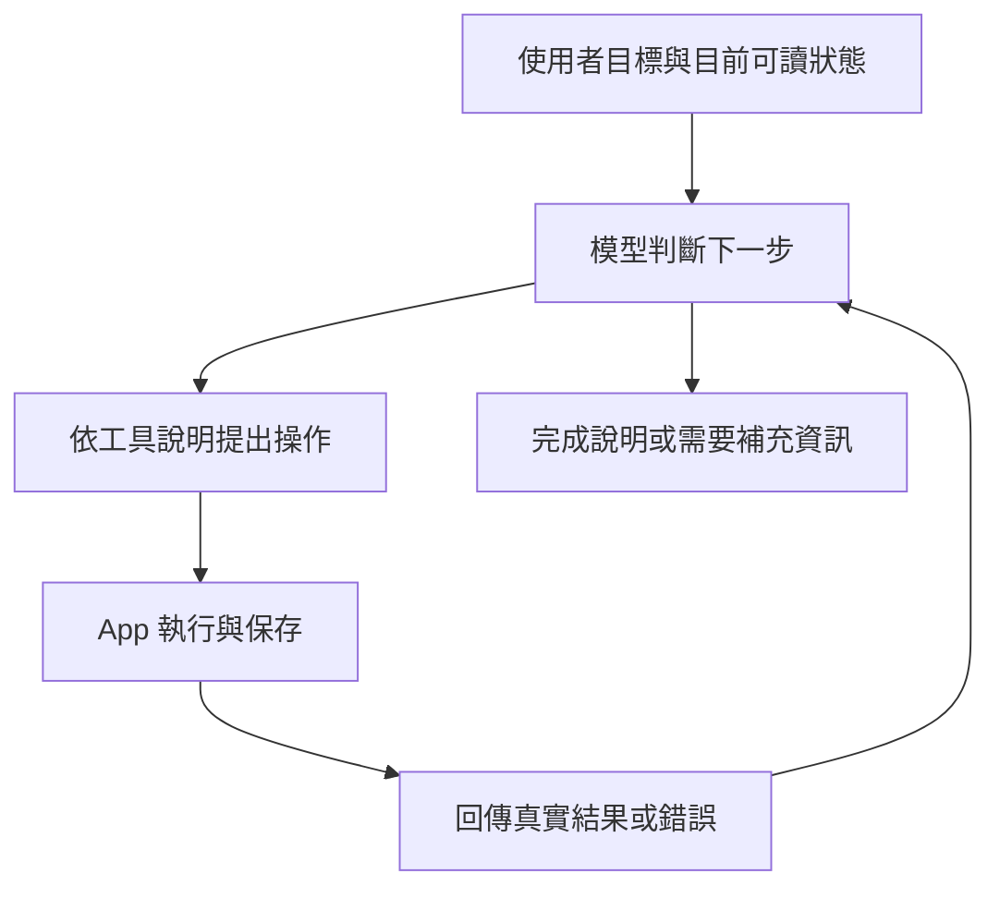

# LLM 使用 App 與編輯文件：大廠共同做法與差異

**2026-09-09 後續路由：**本稿共同基礎仍 G3／WORKING；Owner 已限定免費開源、要求執行研究計畫，並開放重議人改待審的政策。最新下一題依[免費開源能力與缺口研究](2026-09-09-jd-oss-editor-capabilities-and-gaps.md)，取代下方形成於此前的 Tiptap 候選裁決。共同原則不等於各家使用同一編輯／核准政策。

JD-R002/C03；查閱日 **2026-09-09**；**共同基礎已獲 Owner 同意，G3／WORKING，可修訂**。本稿先回答通用能力，再銜接編輯器選型；不是框架採用或施工授權。

## 0. 本輪定位

- **Topic ID：**JD-R002/C03，沿同題補正研究交付，不另開 Memory 議題。
- **Current stage：**共同基礎 G3／WORKING；既有選型與有限驗證方案待裁決，套件尚未選定。
- **Binding decisions：**本稿共同基礎、C01 內容關係、C02 最小完整審核範圍為可修訂 WORKING；新設計不受舊產品／舊架構限制。未來改 production 仍另經正式化流程。
- **本輪研究問題（已交付）：**跨廠官方資料對「LLM 使用 App 與編輯工具」共同支持什麼，哪些仍是各家介面或 Caliburn 的選擇？
- **This turn's only blocking question（目前待審）：**是否以 Tiptap 組合作第一驗證候選，先做既有方案 §7 收斂的無 LLM 文件編輯／審核驗證？共同基礎已同意，不重問；本輪只完成進度核對及推薦具體化。
- **Already reviewed evidence：**原 E16–E20、R01–R10、F01–F05；本輪補直接跨廠對照、工具設計、能力評估與使用 App 的不同介面。
- **Out of scope：**套件採用、prompt／模型／Memory 改動、安裝、付費模型測試及 production 施工。

「共同做法」指公開文件可交叉核對的工程原則；不是幾家公司共同簽署的標準，也不是對 ChatGPT Canvas、Claude 文件功能或 Gemini in Docs 未公開內部實作的猜測。各來源可支持的範圍分成 **Official fact、跨來源 Inference、Caliburn mapping、Unknown**。

## 1. 上次有研究，但交付缺了哪一層

已有 [E16–E20](2026-09-09-jd-document-model-official-evidence.md#6-c03-整體-ai-編輯應用接法) 及 [R01–R10](2026-09-09-jd-ai-app-runtime-official-evidence.md) 覆蓋模型／工具往返、patch／精確替換、錯誤與恢復。問題是內容散在證據表，入口很快轉向 Tiptap 與待審分組，沒有獨立呈現「模型具備哪些能力、App 必須供給什麼、怎樣判斷操作完成」的共同基礎。

本輪保留原研究，補上這份先讀稿；[整體接法](2026-09-09-ai-document-app-composition-research.md)與[可執行候選](2026-09-09-jd-ai-editing-executable-proposal.md)接在後面。不是把 editor 原生功能或我們的產品需求冒稱大廠共識。

## 2. 先分清三種能力

| 層次 | 實際負責 | 不能據此推定 |
|---|---|---|
| **模型能力** | 理解意圖、判斷是否要用工具、選工具及填參數、生成新內容、根據結果繼續或修正 | 每次都選對、內容真實、目標一定正確 |
| **App／執行環境能力** | 提供可用工具與目前狀態，執行操作，檢查格式／目標／範圍，保存並回報實際結果 | 只接模型 API 就已有完整文件編輯與保存 |
| **產品政策** | 什麼算核准、誰可接受、哪些修改一起審、匯出何種版本 | 任一 tool-use SDK 已替所有文件產品決定 |

前兩層分工是 [OpenAI function calling](https://developers.openai.com/api/docs/guides/function-calling)、[Anthropic tool-use contract](https://platform.claude.com/docs/en/agents-and-tools/tool-use/how-tool-use-works) 的直接共同模式；第三層是對本案的責任映射。這裡說的是自訂／client tools；供應商託管工具可由供應商執行，不能一概說所有 tool 都必須在我們的 server 跑。

本輪另核對 [Google Gemini：How function calling works](https://ai.google.dev/gemini-api/docs/function-calling#how-function-calling-works) 與 [Microsoft：AI tool calling](https://learn.microsoft.com/en-us/dotnet/ai/conceptual/calling-tools)：兩者同樣明列模型提供函式名稱／參數、應用執行、結果回到後續對話。Microsoft 文件是在說明 .NET 整合模式，不代表另一個獨立模型的能力實測。

模型使用自訂 App，一般從工具描述及當下 context 得知介面；官方整合路徑不要求先為每個 App 訓練一個模型。特定內建工具可另有訓練過的 schema；是否需要 fine-tuning 是效果問題，不是接工具的通用前置條件。[OpenAI 定義工具](https://developers.openai.com/api/docs/guides/function-calling#defining-functions)、[Anthropic text editor](https://platform.claude.com/docs/en/agents-and-tools/tool-use/text-editor-tool)

## 3. 可以支持的共同基礎

以下每列是跨官方資料整理的 **Inference**；原始契約仍各自有效，不表示 wire format 或 SDK 預設一致。

| 共同原則 | 理由與實際效果 | 直接依據 |
|---|---|---|
| 給清楚的工具說明 | 說明何時使用、輸入／輸出與限制，讓模型能選對並填對；只給函式名不充分 | [OpenAI：Best practices](https://developers.openai.com/api/docs/guides/function-calling#best-practices-for-defining-functions)、[Anthropic：Tool descriptions](https://www.anthropic.com/engineering/writing-tools-for-agents) |
| 提供能支持操作的目前狀態 | 內容、選取範圍或畫面需來自可用 context／read；狀態未知或已變時再觀察。不是規定每個 edit 前必須多一次 read | [OpenAI：Apply patch／file context](https://developers.openai.com/api/docs/guides/tools-apply-patch)、[Anthropic：view](https://platform.claude.com/docs/en/agents-and-tools/tool-use/text-editor-tool) |
| 模型提操作，執行方改真實狀態 | tool call 與操作結果是兩件事；模型說完成不能代替 App 執行成功 | [OpenAI：Tool calling flow](https://developers.openai.com/api/docs/guides/function-calling)、[Anthropic：Tool-use contract](https://platform.claude.com/docs/en/agents-and-tools/tool-use/how-tool-use-works) |
| 執行結果回到後續推理 | 正確配對 call/result，成功後可續做；失敗需回可行動資訊，讓模型修參數或重讀 | [OpenAI：Patch errors](https://developers.openai.com/api/docs/guides/tools-apply-patch#handling-common-errors)、[Anthropic：Handle tool calls](https://platform.claude.com/docs/en/agents-and-tools/tool-use/handle-tool-calls) |
| 工具介面配合任務，減少無關負擔 | 不把所有低階 API 原樣暴露；程式已知參數由程式處理，結果保留有用資訊；工具多不保證更好 | [OpenAI：Best practices](https://developers.openai.com/api/docs/guides/function-calling#best-practices-for-defining-functions)、[Anthropic：Choosing tools／meaningful context](https://www.anthropic.com/engineering/writing-tools-for-agents) |
| 輸入格式與實際正確性分開驗證 | schema 可約束資料形狀；是否改對工作意思、保留必要事實，仍是另一層驗收 | [OpenAI：Strict mode](https://developers.openai.com/api/docs/guides/function-calling#strict-mode)、[OpenAI：Tool selection／data precision](https://developers.openai.com/api/docs/guides/evaluation-best-practices#example-2)、[Anthropic：Outcome evaluation](https://www.anthropic.com/engineering/writing-tools-for-agents) |
| 用任務結果及操作紀錄評估 | 同時看工具選擇、參數、最終成果與耗用；不把唯一工具順序寫死，也不只檢查最後一句話 | [OpenAI：Evaluation best practices](https://developers.openai.com/api/docs/guides/evaluation-best-practices#example-2)、[Anthropic：Running an evaluation](https://www.anthropic.com/engineering/writing-tools-for-agents) |

**兩個細節不能過度簡化：**

- 程式已知的文件範圍／操作者可以注入；但模型需要從多個目標中選擇時，讀取結果中的定位值仍可能是它要填的參數。「少讓模型填已知資訊」不等於禁止所有 ID 或數字。
- 可組合不等於全部平行。[Google 區分 parallel 與 compositional function calling](https://ai.google.dev/gemini-api/docs/function-calling)：獨立操作可並行，需要前次結果時串接。位置與有效版本的精確生命週期仍由所選 App 契約決定；並非任何多個寫入都能安全同時送出。

## 4. LLM 使用 App 的整體循環

這是概念循環，不是六個 Agent。對自訂工具，底層 API 可以由應用接 loop，也可交 SDK 管理。對話接續與 App 實際狀態分開：繼續模型回應不會自行恢復一個已關閉的編輯器或瀏覽器。[OpenAI computer use：Preserve state and return observations](https://developers.openai.com/api/docs/guides/tools-computer-use)

App 有幾種可供模型操作的介面：

- **函式／文件命令：**模型呼叫受限操作，由 App 或編輯器執行。
- **MCP：**讓工具可被列出、呼叫與回傳的整合方式；不是另一種文件編輯演算法，也不自動建立內容核准規則。[OpenAI MCP：How it works](https://developers.openai.com/api/docs/guides/tools-connectors-mcp)
- **GUI／computer use：**根據截圖等觀察操作滑鼠鍵盤，或透過程式控制既有 UI；依然要執行、再觀察。這與直接操作富文字結構不同。[OpenAI computer use](https://developers.openai.com/api/docs/guides/tools-computer-use)、[Anthropic computer use](https://platform.claude.com/docs/en/agents-and-tools/tool-use/computer-use-tool)

對我們自己控制的本機 App，優先提供合適文件工具是 **Caliburn mapping**；不宣稱大廠共同禁止 GUI，也不因要讓 LLM 使用 App 就引入全機控制。

## 5. 文件編輯有共同循環，沒有唯一格式

| 路線 | 模型／框架怎麼分工 | 適用性及限制 |
|---|---|---|
| **局部文字 patch** | 模型產生差異，執行方套用並回報 | OpenAI 的檔案編輯路徑；可做局部修訂，但不自帶富文字節點與審核語意。[官方 Apply patch](https://developers.openai.com/api/docs/guides/tools-apply-patch) |
| **精確文字替換／插入** | 模型提供已知原文及新文，執行方檢查唯一匹配；插入也可用行位置 | Anthropic 支援 `view`、`str_replace`、`insert`；含空白須匹配，重複或找不到回 error。不是淘汰中的非主流方法。[官方 Text editor](https://platform.claude.com/docs/en/agents-and-tools/tool-use/text-editor-tool) |
| **文件結構／範圍操作** | 以 App 的節點、選取、range 或原生命令修改，由 editor 維持結構 | Google Docs API 有插字、刪範圍、改樣式等操作；Tiptap 有 read／edit／readSelection。這些是文件介面先例，不是 Google LLM 內部必定採用的證據。[Google Requests](https://developers.google.com/workspace/docs/api/reference/rest/v1/documents/request)、[Tiptap 工具](https://tiptap.dev/docs/ai/ai-toolkit/client/agents/tools) |
| **生成修改後內容，再由框架算差異** | 模型交回新內容，框架比較快照並轉成修改或建議 | CKEditor DocumentCompare 有此公開路徑，patch 由框架產生；不代表可以任意丟失 metadata 或跨重開套用。這是編輯器供應商方案，不是模型大廠一致選擇。[官方 API](https://ckeditor.com/docs/ckeditor5/latest/api/module_ai_aisdk_documentcompare-DocumentCompare.html) |

**本輪推論：**初稿生成、局部精修、全文重整可以需要不同操作；不應先要求所有修改都是 patch，也不應每次都強迫重寫全文。應比較目標定位、未改內容保留、格式往返、錯誤恢復與模型成本。文件 JSON、HTML、文字 diff 都只是介面選項，schema 合法不等於資訊完整。

官方 Apply patch 明列原子性由執行方決定；不能把多項 tool calls、一次 batch、undo 或員工的一組審核視為同一概念。原有 F 表已保存[部分成功與審核差距](2026-09-09-jd-editor-framework-comparison.md)，本稿不把它們當已解決。

**Google 的具體差異（Official fact）：**[Docs batchUpdate／WriteControl](https://developers.google.com/workspace/docs/api/reference/rest/v1/documents/batchUpdate) 明列 request 驗證失敗則整批不套用，以及 requiredRevisionId／targetRevisionId 的不同基準版本語意。[Requests](https://developers.google.com/workspace/docs/api/reference/rest/v1/documents/request) 另定 UTF-16 index／range、插入位置限制與樣式操作。這證明結構與版本可由文件 App 提供；不表示所有 editor 都有相同原子性，或模型應自行估算富文字位置。

## 6. 對 Caliburn 的含意與驗證方式

以下是 **Mapping／研究建議**，不增加已核准的產品需求：

1. 主顧問沿既有 context 與 Memory，按需要取得目前 JD；Memory 提供工作依據，最新文件仍從文件本身取得。
2. 編輯工具先承接「讀／定位、修改、讀回實際結果」責任。這是能力分類，不是要求新增三個固定名稱的 API，亦不限定每輪三次呼叫。
3. App 承接格式、實際套用與保存；AI 修改是否待審、如何接受／拒絕，按 C01／C02 的產品選擇設計，不能從模型 API 的 approval 按鈕推得。
4. JD 專業方法用適當指引／Skill 供模型使用；不能指望換成 patch 就會自動理解職務內容，也不能因文件編輯失敗就重造 Memory。

例如員工說「定期維護只有合約包含時才做，其他內容保留」：模型應能取得相關段落、定位目標並修改；App 回報實際套用／保存結果。若出現兩段相似文字，要取得足夠資訊辨別；若格式或位置不合法，讓錯誤回到同一循環。待審與接受仍按既有產品政策處理。這是待驗情境，不是本輪已測過的效果。

| 驗證層 | 要確認什麼 | 失敗先查哪裡 |
|---|---|---|
| 工具／編輯器離線 | 固定操作能否定位、保留內容、保存、回載及恢復錯誤 | executor／editor 契約與接線 |
| 模型操作能力 | 能否理解意圖、選工具、填對目標、利用錯誤修正 | tool description、可讀 context、模型與工具配合 |
| 文件產品效果 | 人改後續編、接受／拒絕、跨位置調整是否符合需求 | review／document 接法與產品取捨 |

持續量測任務完成、誤改／漏改、未變內容保留、工具錯誤與修復、時間及耗用；這不代表固定新增審核 Agent 或每次編輯多跑一個模型。現有 I0–I4 次序仍是候選，閱讀本稿不等於核准執行。

## 7. 資料取得及停止邊界

OpenAI 來源以官方文件工具搜尋並讀取正文／段落；Anthropic、Google、Microsoft 由獨立子代理查閱，主線另核對直接官方來源。Tiptap 工具頁已直接開啟；CKEditor DocumentCompare 直接開頁仍失敗，本輪只核對官方搜尋回傳的 `makeSnapshot／diffSnapshot／applyPatch` 方法正文，詳細限制沿原 F04，不聲稱全文重讀或已執行測試。

已足以確認「工具說明＋可讀狀態＋呼叫／執行／結果循環＋成果評估」共同基礎，以及文字／結構／快照路線並存。未能證明的，是特定模型在本案的成功率、哪種編輯格式最省、或任一套件全覆蓋 C02；這些需具體驗證，不能靠更多相似文章補成保證。

## 8. Closure

- **Finding：**上次已有通用工具研究，但缺獨立跨廠基礎整理；本稿補正先讀順序並區分共同原則、特有契約及產品映射。
- **Status：**JD-R002/C03 共同基礎 G3／WORKING。Owner 本輪回覆「同意」，並要求串讀近期研究、繼續不受舊產品／舊架構限制的新設計；C01／C02 不改判。
- **Why／Sources：**直接官方契約及逐項連結如上，原 E／R／F 表保留作細部證據。
- **Affected artifacts：**本稿、C03 短入口、總索引及 current decision register。
- **Reopen trigger：**Owner 改研究／產品範圍、新官方契約推翻依據，或實際任務顯示工具／編輯方式不適用。
- **Next gate：**沿[方案 §0.1 的進度核對](2026-09-09-jd-ai-editing-executable-proposal.md#01-近期研究串讀後的真實進度)，裁決 §7 的第一候選及有限無 LLM 驗證；本輪不跨到施工。

**交付檢查沿革：**原交付的獨立 reviewer 全文檢查並抽查官方來源；JD-C03-01 曾指出兩個 current gate，當時統一為共同基礎審閱。Owner 本輪同意後，該 gate 已完成，入口與 register 改指向有限驗證候選裁決。原審查只確認研究與狀態，不是模型／編輯器產品驗收。

本輪僅研究與文檔整理，沒有程式／prompt／模型／Memory／DB／UI 變更，沒有安裝或付費模型請求。
