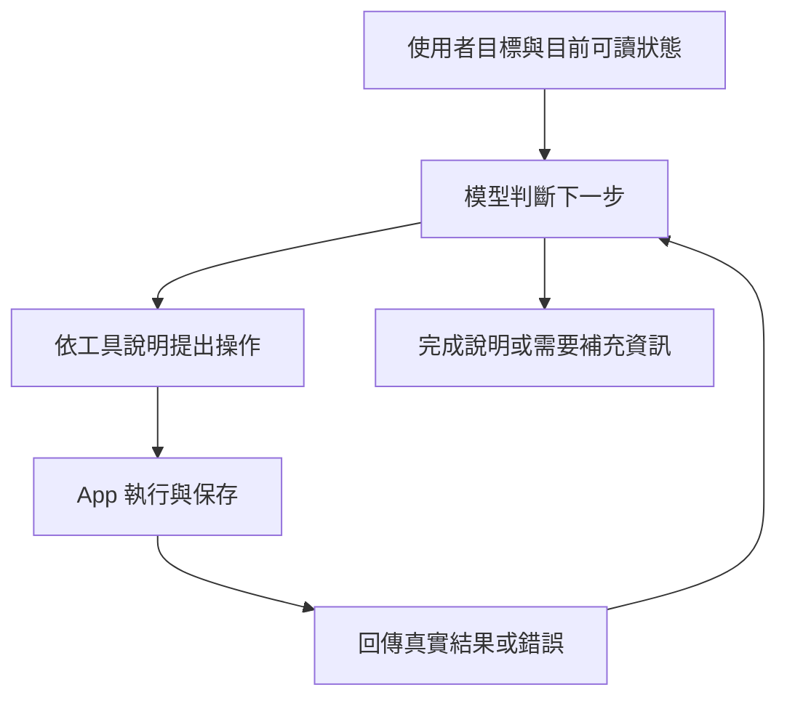

# LLM 使用 App 與編輯文件：大廠共同做法與差異

**2026-09-27 最新共同契約議題：**Owner 要求先確認跨 Agent 的工具設計方式，再收斂個別工具。見[共同工具契約研究與規範候選](2026-09-27-agent-tool-contract-design-research.md)：命名、拆分、模型／App 參數、成功／錯誤、權限及分層驗收。它是 G2 候選，不代表全部規範已採納；本稿保留編輯格式與實驗的專屬責任，不再擴寫第二份共同規範。

**2026-09-27 新目標研究入口：**patch 定位研究與離線證據見 [§10](#10-patch-格式與定位執行器分開判斷2026-09-27-續議)。Owner 已選 Memory 專用工具＋V4A diff 編輯 Markdown body，App 以 title 選物件；唯一目標及最新同版不重名要求見[009](../product-concept.md#工作情境與工作理解的三個內容欄位目標未實作)。安全執行器尚未完成；[§10.7](#107-標題唯一性與建立基本資料更新刪除的候選契約2026-09-27)接續討論建立、基本資料更新及刪除。§9 的「精確替換首選」與 §10 較早「格式未定」保留為沿革，不再作當前選型結論。§0–8 保留 09-09 的研究與當時 gate，不把舊 Tiptap／待審政策當成本輪下一步。本輪不授權 production 施工。

**2026-09-09 後續路由：**本稿共同基礎仍 G3／WORKING；Owner 已限定免費開源、要求執行研究計畫，並開放重議人改待審的政策。最新下一題依[免費開源能力與缺口研究](2026-09-09-jd-oss-editor-capabilities-and-gaps.md)，取代下方形成於此前的 Tiptap 候選裁決。共同原則不等於各家使用同一編輯／核准政策。

JD-R002/C03；查閱日 **2026-09-09**；**共同基礎已獲 Owner 同意，G3／WORKING，可修訂**。本稿先回答通用能力，再銜接編輯器選型；不是框架採用或施工授權。

## 0. 本輪定位

- **Topic ID：**JD-R002/C03，沿同題補正研究交付，不另開 Memory 議題。
- **Current stage：**共同基礎 G3／WORKING；既有選型與有限驗證方案待裁決，套件尚未選定。
- **Binding decisions：**本稿共同基礎、C01 內容關係、C02 最小完整審核範圍為可修訂 WORKING；新設計不受舊產品／舊架構限制。未來改 production 仍另經正式化流程。
- **本輪研究問題（已交付）：**跨廠官方資料對「LLM 使用 App 與編輯工具」共同支持什麼，哪些仍是各家介面或 Caliburn 的選擇？
- **This turn's only blocking question（目前待審）：**是否以 Tiptap 組合作第一驗證候選，先做既有方案 §7 收斂的無 LLM 文件編輯／審核驗證？共同基礎已同意，不重問；本輪只完成進度核對及推薦具體化。
- **Already reviewed evidence：**原 E16–E20、R01–R10、F01–F05；本輪補直接跨廠對照、工具設計、能力評估與使用 App 的不同介面。
- **Out of scope：**套件採用、prompt／模型／Memory 改動、安裝、付費模型測試及 production 施工。

「共同做法」指公開文件可交叉核對的工程原則；不是幾家公司共同簽署的標準，也不是對 ChatGPT Canvas、Claude 文件功能或 Gemini in Docs 未公開內部實作的猜測。各來源可支持的範圍分成 **Official fact、跨來源 Inference、Caliburn mapping、Unknown**。

## 1. 上次有研究，但交付缺了哪一層

已有 [E16–E20](2026-09-09-jd-document-model-official-evidence.md#6-c03-整體-ai-編輯應用接法) 及 [R01–R10](2026-09-09-jd-ai-app-runtime-official-evidence.md) 覆蓋模型／工具往返、patch／精確替換、錯誤與恢復。問題是內容散在證據表，入口很快轉向 Tiptap 與待審分組，沒有獨立呈現「模型具備哪些能力、App 必須供給什麼、怎樣判斷操作完成」的共同基礎。

本輪保留原研究，補上這份先讀稿；[整體接法](2026-09-09-ai-document-app-composition-research.md)與[可執行候選](2026-09-09-jd-ai-editing-executable-proposal.md)接在後面。不是把 editor 原生功能或我們的產品需求冒稱大廠共識。

## 2. 先分清三種能力

| 層次 | 實際負責 | 不能據此推定 |
|---|---|---|
| **模型能力** | 理解意圖、判斷是否要用工具、選工具及填參數、生成新內容、根據結果繼續或修正 | 每次都選對、內容真實、目標一定正確 |
| **App／執行環境能力** | 提供可用工具與目前狀態，執行操作，檢查格式／目標／範圍，保存並回報實際結果 | 只接模型 API 就已有完整文件編輯與保存 |
| **產品政策** | 什麼算核准、誰可接受、哪些修改一起審、匯出何種版本 | 任一 tool-use SDK 已替所有文件產品決定 |

前兩層分工是 [OpenAI function calling](https://developers.openai.com/api/docs/guides/function-calling)、[Anthropic tool-use contract](https://platform.claude.com/docs/en/agents-and-tools/tool-use/how-tool-use-works) 的直接共同模式；第三層是對本案的責任映射。這裡說的是自訂／client tools；供應商託管工具可由供應商執行，不能一概說所有 tool 都必須在我們的 server 跑。

本輪另核對 [Google Gemini：How function calling works](https://ai.google.dev/gemini-api/docs/function-calling#how-function-calling-works) 與 [Microsoft：AI tool calling](https://learn.microsoft.com/en-us/dotnet/ai/conceptual/calling-tools)：兩者同樣明列模型提供函式名稱／參數、應用執行、結果回到後續對話。Microsoft 文件是在說明 .NET 整合模式，不代表另一個獨立模型的能力實測。

模型使用自訂 App，一般從工具描述及當下 context 得知介面；官方整合路徑不要求先為每個 App 訓練一個模型。特定內建工具可另有訓練過的 schema；是否需要 fine-tuning 是效果問題，不是接工具的通用前置條件。[OpenAI 定義工具](https://developers.openai.com/api/docs/guides/function-calling#defining-functions)、[Anthropic text editor](https://platform.claude.com/docs/en/agents-and-tools/tool-use/text-editor-tool)

## 3. 可以支持的共同基礎

以下每列是跨官方資料整理的 **Inference**；原始契約仍各自有效，不表示 wire format 或 SDK 預設一致。

| 共同原則 | 理由與實際效果 | 直接依據 |
|---|---|---|
| 給清楚的工具說明 | 說明何時使用、輸入／輸出與限制，讓模型能選對並填對；只給函式名不充分 | [OpenAI：Best practices](https://developers.openai.com/api/docs/guides/function-calling#best-practices-for-defining-functions)、[Anthropic：Tool descriptions](https://www.anthropic.com/engineering/writing-tools-for-agents) |
| 提供能支持操作的目前狀態 | 內容、選取範圍或畫面需來自可用 context／read；狀態未知或已變時再觀察。不是規定每個 edit 前必須多一次 read | [OpenAI：Apply patch／file context](https://developers.openai.com/api/docs/guides/tools-apply-patch)、[Anthropic：view](https://platform.claude.com/docs/en/agents-and-tools/tool-use/text-editor-tool) |
| 模型提操作，執行方改真實狀態 | tool call 與操作結果是兩件事；模型說完成不能代替 App 執行成功 | [OpenAI：Tool calling flow](https://developers.openai.com/api/docs/guides/function-calling)、[Anthropic：Tool-use contract](https://platform.claude.com/docs/en/agents-and-tools/tool-use/how-tool-use-works) |
| 執行結果回到後續推理 | 正確配對 call/result，成功後可續做；失敗需回可行動資訊，讓模型修參數或重讀 | [OpenAI：Patch errors](https://developers.openai.com/api/docs/guides/tools-apply-patch#handling-common-errors)、[Anthropic：Handle tool calls](https://platform.claude.com/docs/en/agents-and-tools/tool-use/handle-tool-calls) |
| 工具介面配合任務，減少無關負擔 | 不把所有低階 API 原樣暴露；程式已知參數由程式處理，結果保留有用資訊；工具多不保證更好 | [OpenAI：Best practices](https://developers.openai.com/api/docs/guides/function-calling#best-practices-for-defining-functions)、[Anthropic：Choosing tools／meaningful context](https://www.anthropic.com/engineering/writing-tools-for-agents) |
| 輸入格式與實際正確性分開驗證 | schema 可約束資料形狀；是否改對工作意思、保留必要事實，仍是另一層驗收 | [OpenAI：Strict mode](https://developers.openai.com/api/docs/guides/function-calling#strict-mode)、[OpenAI：Tool selection／data precision](https://developers.openai.com/api/docs/guides/evaluation-best-practices#example-2)、[Anthropic：Outcome evaluation](https://www.anthropic.com/engineering/writing-tools-for-agents) |
| 用任務結果及操作紀錄評估 | 同時看工具選擇、參數、最終成果與耗用；不把唯一工具順序寫死，也不只檢查最後一句話 | [OpenAI：Evaluation best practices](https://developers.openai.com/api/docs/guides/evaluation-best-practices#example-2)、[Anthropic：Running an evaluation](https://www.anthropic.com/engineering/writing-tools-for-agents) |

**兩個細節不能過度簡化：**

- 程式已知的文件範圍／操作者可以注入；但模型需要從多個目標中選擇時，讀取結果中的定位值仍可能是它要填的參數。「少讓模型填已知資訊」不等於禁止所有 ID 或數字。
- 可組合不等於全部平行。[Google 區分 parallel 與 compositional function calling](https://ai.google.dev/gemini-api/docs/function-calling)：獨立操作可並行，需要前次結果時串接。位置與有效版本的精確生命週期仍由所選 App 契約決定；並非任何多個寫入都能安全同時送出。

## 4. LLM 使用 App 的整體循環


```mermaid
flowchart TD
    A[使用者目標與目前可讀狀態] --> B[模型判斷下一步]
    B --> C[依工具說明提出操作]
    C --> D[App 執行與保存]
    D --> E[回傳真實結果或錯誤]
    E --> B
    B --> F[完成說明或需要補充資訊]
```

這是概念循環，不是六個 Agent。對自訂工具，底層 API 可以由應用接 loop，也可交 SDK 管理。對話接續與 App 實際狀態分開：繼續模型回應不會自行恢復一個已關閉的編輯器或瀏覽器。[OpenAI computer use：Preserve state and return observations](https://developers.openai.com/api/docs/guides/tools-computer-use)

App 有幾種可供模型操作的介面：

- **函式／文件命令：**模型呼叫受限操作，由 App 或編輯器執行。
- **MCP：**讓工具可被列出、呼叫與回傳的整合方式；不是另一種文件編輯演算法，也不自動建立內容核准規則。[OpenAI MCP：How it works](https://developers.openai.com/api/docs/guides/tools-connectors-mcp)
- **GUI／computer use：**根據截圖等觀察操作滑鼠鍵盤，或透過程式控制既有 UI；依然要執行、再觀察。這與直接操作富文字結構不同。[OpenAI computer use](https://developers.openai.com/api/docs/guides/tools-computer-use)、[Anthropic computer use](https://platform.claude.com/docs/en/agents-and-tools/tool-use/computer-use-tool)

對我們自己控制的本機 App，優先提供合適文件工具是 **Caliburn mapping**；不宣稱大廠共同禁止 GUI，也不因要讓 LLM 使用 App 就引入全機控制。

## 5. 文件編輯有共同循環，沒有唯一格式

| 路線 | 模型／框架怎麼分工 | 適用性及限制 |
|---|---|---|
| **局部文字 patch** | 模型產生差異，執行方套用並回報 | OpenAI 的檔案編輯路徑；可做局部修訂，但不自帶富文字節點與審核語意。[官方 Apply patch](https://developers.openai.com/api/docs/guides/tools-apply-patch) |
| **精確文字替換／插入** | 模型提供已知原文及新文，執行方檢查唯一匹配；插入也可用行位置 | Anthropic 支援 `view`、`str_replace`、`insert`；含空白須匹配，重複或找不到回 error。不是淘汰中的非主流方法。[官方 Text editor](https://platform.claude.com/docs/en/agents-and-tools/tool-use/text-editor-tool) |
| **文件結構／範圍操作** | 以 App 的節點、選取、range 或原生命令修改，由 editor 維持結構 | Google Docs API 有插字、刪範圍、改樣式等操作；Tiptap 有 read／edit／readSelection。這些是文件介面先例，不是 Google LLM 內部必定採用的證據。[Google Requests](https://developers.google.com/workspace/docs/api/reference/rest/v1/documents/request)、[Tiptap 工具](https://tiptap.dev/docs/ai/ai-toolkit/client/agents/tools) |
| **生成修改後內容，再由框架算差異** | 模型交回新內容，框架比較快照並轉成修改或建議 | CKEditor DocumentCompare 有此公開路徑，patch 由框架產生；不代表可以任意丟失 metadata 或跨重開套用。這是編輯器供應商方案，不是模型大廠一致選擇。[官方 API](https://ckeditor.com/docs/ckeditor5/latest/api/module_ai_aisdk_documentcompare-DocumentCompare.html) |

**本輪推論：**初稿生成、局部精修、全文重整可以需要不同操作；不應先要求所有修改都是 patch，也不應每次都強迫重寫全文。應比較目標定位、未改內容保留、格式往返、錯誤恢復與模型成本。文件 JSON、HTML、文字 diff 都只是介面選項，schema 合法不等於資訊完整。

官方 Apply patch 明列原子性由執行方決定；不能把多項 tool calls、一次 batch、undo 或員工的一組審核視為同一概念。原有 F 表已保存[部分成功與審核差距](2026-09-09-jd-editor-framework-comparison.md)，本稿不把它們當已解決。

**Google 的具體差異（Official fact）：**[Docs batchUpdate／WriteControl](https://developers.google.com/workspace/docs/api/reference/rest/v1/documents/batchUpdate) 明列 request 驗證失敗則整批不套用，以及 requiredRevisionId／targetRevisionId 的不同基準版本語意。[Requests](https://developers.google.com/workspace/docs/api/reference/rest/v1/documents/request) 另定 UTF-16 index／range、插入位置限制與樣式操作。這證明結構與版本可由文件 App 提供；不表示所有 editor 都有相同原子性，或模型應自行估算富文字位置。

## 6. 對 Caliburn 的含意與驗證方式

以下是 **Mapping／研究建議**，不增加已核准的產品需求：

1. 主顧問沿既有 context 與 Memory，按需要取得目前 JD；Memory 提供工作依據，最新文件仍從文件本身取得。
2. 編輯工具先承接「讀／定位、修改、讀回實際結果」責任。這是能力分類，不是要求新增三個固定名稱的 API，亦不限定每輪三次呼叫。
3. App 承接格式、實際套用與保存；AI 修改是否待審、如何接受／拒絕，按 C01／C02 的產品選擇設計，不能從模型 API 的 approval 按鈕推得。
4. JD 專業方法用適當指引／Skill 供模型使用；不能指望換成 patch 就會自動理解職務內容，也不能因文件編輯失敗就重造 Memory。

例如員工說「定期維護只有合約包含時才做，其他內容保留」：模型應能取得相關段落、定位目標並修改；App 回報實際套用／保存結果。若出現兩段相似文字，要取得足夠資訊辨別；若格式或位置不合法，讓錯誤回到同一循環。待審與接受仍按既有產品政策處理。這是待驗情境，不是本輪已測過的效果。

| 驗證層 | 要確認什麼 | 失敗先查哪裡 |
|---|---|---|
| 工具／編輯器離線 | 固定操作能否定位、保留內容、保存、回載及恢復錯誤 | executor／editor 契約與接線 |
| 模型操作能力 | 能否理解意圖、選工具、填對目標、利用錯誤修正 | tool description、可讀 context、模型與工具配合 |
| 文件產品效果 | 人改後續編、接受／拒絕、跨位置調整是否符合需求 | review／document 接法與產品取捨 |

持續量測任務完成、誤改／漏改、未變內容保留、工具錯誤與修復、時間及耗用；這不代表固定新增審核 Agent 或每次編輯多跑一個模型。現有 I0–I4 次序仍是候選，閱讀本稿不等於核准執行。

## 7. 資料取得及停止邊界

OpenAI 來源以官方文件工具搜尋並讀取正文／段落；Anthropic、Google、Microsoft 由獨立子代理查閱，主線另核對直接官方來源。Tiptap 工具頁已直接開啟；CKEditor DocumentCompare 直接開頁仍失敗，本輪只核對官方搜尋回傳的 `makeSnapshot／diffSnapshot／applyPatch` 方法正文，詳細限制沿原 F04，不聲稱全文重讀或已執行測試。

已足以確認「工具說明＋可讀狀態＋呼叫／執行／結果循環＋成果評估」共同基礎，以及文字／結構／快照路線並存。未能證明的，是特定模型在本案的成功率、哪種編輯格式最省、或任一套件全覆蓋 C02；這些需具體驗證，不能靠更多相似文章補成保證。

## 8. Closure

- **Finding：**上次已有通用工具研究，但缺獨立跨廠基礎整理；本稿補正先讀順序並區分共同原則、特有契約及產品映射。
- **Status：**JD-R002/C03 共同基礎 G3／WORKING。Owner 本輪回覆「同意」，並要求串讀近期研究、繼續不受舊產品／舊架構限制的新設計；C01／C02 不改判。
- **Why／Sources：**直接官方契約及逐項連結如上，原 E／R／F 表保留作細部證據。
- **Affected artifacts：**本稿、C03 短入口、總索引及 current decision register。
- **Reopen trigger：**Owner 改研究／產品範圍、新官方契約推翻依據，或實際任務顯示工具／編輯方式不適用。
- **Next gate：**沿[方案 §0.1 的進度核對](2026-09-09-jd-ai-editing-executable-proposal.md#01-近期研究串讀後的真實進度)，裁決 §7 的第一候選及有限無 LLM 驗證；本輪不跨到施工。

**交付檢查沿革：**原交付的獨立 reviewer 全文檢查並抽查官方來源；JD-C03-01 曾指出兩個 current gate，當時統一為共同基礎審閱。Owner 本輪同意後，該 gate 已完成，入口與 register 改指向有限驗證候選裁決。原審查只確認研究與狀態，不是模型／編輯器產品驗收。

本輪僅研究與文檔整理，沒有程式／prompt／模型／Memory／DB／UI 變更，沒有安裝或付費模型請求。

## 9. Memory 與 JD 分別選擇編輯工具（2026-09-27）

**狀態：較早研究建議，未實作；首選及定位問題已由 §10 續議補正，其中「不開模糊替換」已由 §10.5 的最新需求取代。**本節回應 Owner 的工具選型問題及附件比較；不把附件中的範例 schema、短代碼、論文排名當成已採用規格。沿用本稿的工具研究責任，不另建通用 patch 架構文件。下文「本輪未測」是當時紀錄，後續有限實測見 §10，不以測試通過冒充新需求通過。

### 9.1 已確認需求與本輪範圍

- 工作情境／工作理解有 `title`、`description`、Markdown `body`；確切編輯載體尚未定，見 [008／009](../product-concept.md#工作情境與工作理解的三個內容欄位目標未實作)。另設結構化來源欄位仍是候選，不因本研究採納。模型不能自行改正式版本身分或歷史引用鏈。
- JD 是關聯式成果，不是整份 Markdown；任務成果／要求為 owned 明細，知識／技能為共用定義與任務關聯，見 [031](../product-concept.md#jd-的關聯式結構與逐項編輯已確認目標)。
- 最新目標是 A 修改本 Turn 候選、B1／B2 修改本批候選；正式生效交界分別依 [完成安全點](../product-concept.md#完成安全點與候選提交目標未實作)及共同 Memory 發布，不沿用現碼「每次工具成功即正式提交」作為目標。
- 本輪選擇**操作方式的首選**，不是定下最終工具名稱、數量、JSON Schema、保存位置或施工計畫。讀取定位與正文編輯不同；正文 patch 與 DB 版本儲存方式也不同，不因用 patch 編輯就採 Git 式差異儲存。

### 9.2 官方契約支持哪些選擇

| 方式 | 官方能力／界線 | 本案判斷（不是廠商背書） |
|---|---|---|
| 業務／資源 function tools | OpenAI 建議描述清楚、降低誤用、不要讓模型填程式已知參數；strict 約束形狀，不判定業務正確性。[Function calling](https://developers.openai.com/api/docs/guides/function-calling) | JD 優先維持任務、欄位與關係操作；Memory 也限定物件與可寫 layer，不開 SQL。 |
| 精確原文／新文替換 | Anthropic `str_replace` 要求原文含空白精確匹配，沒有或多處命中回錯誤；App 執行。[Text editor](https://platform.claude.com/docs/en/agents-and-tools/tool-use/text-editor-tool) | Memory 局部正文的首選候選。單一物件內唯一匹配，不能默默選第一處；不代表 GPT 對自訂同類工具已實測優於其他格式。 |
| 上下文文字 patch | OpenAI `apply_patch` 使用 V4A，App 套用；可用 in-memory workspace，不強制實體檔案；原子性仍由執行方決定。[Apply patch](https://developers.openai.com/api/docs/guides/tools-apply-patch) | 合理替代，尤其多處局部修訂；現有純文字 helper 可作比較，不因其存在就採整個 Agents Runner／DeepAgents。此頁不足以確認目標 Luna 的原生工具支援，不能冒稱已驗證。 |
| JSON Patch | RFC 6902 對 JSON Pointer 位置的值做 add／remove／replace 等；不是字串內的文字 diff。[RFC 6902](https://www.rfc-editor.org/rfc/rfc6902) | 對 `/body` 做 replace 仍要交完整正文，不解決長文局部修改；可作淺層結構更新，但沒有理由直接暴露整份 JD 的任意路徑。 |
| Field mask | Google AIP-134 用 `update_mask` 表達資源哪些欄位更新，可配合 etag；不是 LLM 特定推薦。[AIP-134](https://google.aip.dev/134) | 成熟替代，但仍須處理欄位值與 mask 配對；不為改名或追新替換已合用的型別化操作。 |
| 全文提供 | 文字編輯工具有 create；新建與局部修訂不是同一操作。 | 新建物件交完整內容合理；只有確實重整整篇時才選明確全文替換，不以它作每次小修的唯一入口。 |

**共同原則是受限操作、可定位的已讀內容、真實執行結果與效果驗證，不是大家都用同一種 patch。**`changes[]` 是可行的業務操作集合表示，不是業界唯一標準，也不會自動提供字串編輯能力。資料庫是 PostgreSQL 不代表模型應直接寫 SQL。

### 9.3 首選建議：Memory 正文局部編輯，JD 型別化業務操作

**Memory：以單一情境／理解物件為修改範圍。**

1. 從導覽選對物件，按需讀取正文；讀取結果由 App 綁定合法候選及基準。新建時提交必要內容，不要求先造空白檔再逐段填寫。
2. `title`、`description` 直接更新指定欄位；未要求更新的欄位保留。若之後採獨立來源欄位，來源也用結構化操作，由 App 解出固定依據，不靠解析 Markdown 連結成為引用 authority。
3. 長篇 `body` 的小修首選精確片段替換：例如以完整一句「本人每月彙整訂單異常，後端修正交工程同事。」替換成經核對的新句，不只用「每月」作全域替換。原文未命中或命中多處時不修改，回傳可行動的錯誤；模型重讀／補足辨識上下文。
4. 增補／刪除段落可用已讀的唯一原文片段替換表示；全文重整另有明確全量操作語意，不把空原文偷當任意插入。工具數量與是否同一工具的 action variants 留到契約設計，不逐欄拆工具。
5. 一次請求若必須同改正文、描述與來源，應成為同一個有效候選修改；檢查失敗不留下該請求的一半更新。若需要批次多個文字替換，必須明定套用順序、重疊處理及整批拒絕，不讓模型猜；首版不預設通用批次引擎。

選精確替換的理由是：符合長文局部修訂、歧義可以明確拒絕、無須為三個內容欄位額外建立虛擬目錄／Markdown metadata parser。**代價是模型仍須準確複製原文，多處大改可能比 V4A 冗長；這是可驗證的取捨，不是已證效能冠軍。**不開模糊替換／任意 regex 作失敗兜底。若有限測試顯示修復回合或成本不合適，再與 V4A 作同條件比較，不先同時給模型兩套等價正文編輯入口。

**JD：依既有資源及關係操作，不改成整份文字 patch。**

- 更新某個欄位、新增完整任務及已知成果／要求、移動任務、連結／解除共用知識技能，分別有明確的業務語意。
- 短欄位可直接提交該欄位新值；一次邏輯修訂需要數個關係一起成立時，用有限、型別化的操作集合，不要求模型逐張資料表維護。
- [既有工具契約](2026-09-12-jd-relational-agent-tool-contract.md)已有 `jd_set_text`、`jd_create_task`、`jd_move_item`、`jd_set_task_capability`、`jd_revise_work` 等能力；[現行註冊](../../experiments/jd-relational-app/src/jd_relational/consultant_tools.py)可供後續接線核對。這支持沿用業務能力，不代表保留舊來源契約、LangChain wrapper 或即時正式提交時點。
- 不因附件推薦 `changes[]` 就重造 JD 工具；不新增 generic CRUD、任意 JSON path、SQL tool 或 CodeAct 寫入環境。若之後有具體不足，先補對應業務命令。

### 9.4 共用保證，不共用一套萬用編輯格式

- App 管職務檔案 scope、Agent 權限、候選基準及操作身分；模型負責選擇合法目標、內容與依據。目標參數要有，但名稱／短代碼／讀取 handle **仍待引用工具設計**，不讓模型自行產生內部 UUID 或版本。
- B1 只讀寫情境；B2 讀情境、讀寫理解；A 引用的 Memory 只取已發布版本。若共用執行程式，仍不能給不同 Agent 相同的全部工具權限。
- 工具回傳區分「候選已更新」與「正式完成／發布」；查回原操作、Step 恢復、取消及最終提交沿[共用生命週期](2026-09-27-shared-agent-execution-and-state-design.md)，不另建第二套 receipt 或回滾機制。
- 正文修改成功不代表語意與來源已核對。引用有效性／版本／範圍由既有業務責任檢查；是否忠於訪談與情境仍是 Agent 的分析責任。

### 9.5 現況反例與有限下一 gate

靜態檢查 [Memory patch helper](../../packages/consultant-memory/src/caliburn_memory/patch.py)及[測試](../../packages/consultant-memory/tests/test_patch.py)發現：現行重用 OpenAI SDK `apply_diff`，已有重複文字命中第一處、僅 `@@` 標籤不能保證定位的明列測試；加真實周邊上下文可辨別段落。這是**已記錄的 matcher 限制**，不是本輪重現的 production 誤改事件，也不能推論所有 V4A patch 都不安全。本輪未執行這些測試。

採納方向後，下一 gate 只需要有限契約／效果驗證，不先重構：

1. 離線：長文一處修訂、同句多處、無匹配、舊候選基準、正文與來源一起拒絕、B1／B2 權限，驗證未指定內容逐字保留；JD 檢查移動／連結不變成刪除重建。完整替換／刪除等權限不能靠 Prompt 限制。
2. Provider wire：核對真正輸出的 strict schema，沒有新增保存欄位或把 `null` 偷當 unchanged；確定使用的是自訂 function 還是模型確實支援的原生工具。不能把 Agents SDK 的純文字 helper 和 Responses 原生工具混為一談。
3. 真模型：若需要裁決正文格式，再以同一模型、相同長文與修改意圖、有界請求及費用，量測最終正確內容、誤改、來源一致性、修復次數及耗用。V4A 只作一個對照，不擴大到所有格式；本輪不執行。
4. 發現必須改來源身分、發布／取消語意、增加新 authority 才能成立時停止討論，不以格式選型直接授權跨層施工。

**本次交付限制：**讀附件、官方文件、現行工具與相關測試內容並形成候選；沒有證據宣稱某格式已在目標模型／新架構效果最佳。未修改 production、未新增依賴或資料表、未執行模型／產品測試、未 commit／push。下一題確認上述分工與 Memory 正文首選，之後才定具體工具契約；來源欄位與引用輸入方式不順帶定案。

## 10. Patch 格式與定位執行器分開判斷（2026-09-27 續議）

**狀態：Owner 已確認研究方向與定位要求；套件／接線 OPEN，未實作、未做新架構或真模型驗收。**本節取代 §9 將精確原文／新文替換列為 Memory 正文首選的建議；不影響關聯式 JD 使用業務操作的研究分工。

### 10.1 本次修正與既定責任

- **不是 patch 不能編輯長文。**局部修改、增刪段落與多處修訂都可由 patch 表達；先前用這些例子支持改選 `old_text/new_text`，不足以成立。
- **研究題是定位行為。**Owner 已進一步明確要求「只有一處匹配才修改，多處匹配必須拒絕並回報」，屬必要條件而非可選優化，唯一要求見 [009 補充](../product-concept.md#工作情境與工作理解的三個內容欄位目標未實作)。保留 OpenAI V4A patch 方向，先核對成熟執行器是否能符合，不自行發明解析器，也不把精確替換當成已採用替代。
- **title 選 Memory 物件，正文上下文定位段落。**title 的模型輸入決策見 [009 補充](../product-concept.md#工作情境與工作理解的三個內容欄位目標未實作)；物件標題明確，不代表其正文內不能有重複文字。不能把物件辨識與段落定位混成同一問題。
- Runtime／業務層仍負責合法候選、scope、版本、權限及保存。這些不是改用 patch 後才新增的責任，也不要求模型重填內部 UUID 或版本；本題不重開候選／共同發布架構。

### 10.2 執行器核對結果

| 執行器／來源 | 實際定位方式 | 能否直接滿足本題 |
|---|---|---|
| OpenAI Agents SDK `apply_diff` | 公開 helper 從游標向後尋找，遇到第一個符合的上下文即返回；仍有空白寬鬆匹配。公開呼叫參數沒有「多處命中就拒絕」開關。 | **已確認本機 0.22.0 不符合必要要求，不是尚未測試。**反例返回修改後文字，沒有歧義錯誤或候選清單；增加真實上下文能改善定位，不等於執行器已強制唯一。 |
| jsdiff `applyPatch` | 先試 hunk 行位置，失配後向前／後搜尋；`fuzzFactor=0` 約束文字誤差，不禁止偏移搜尋，也不保證全範圍唯一。 | **不能靠設 0 就宣稱符合。**它處理 unified diff，不是 OpenAI V4A 的直接替代；本輪只核對官方文件，未安裝／執行。 |
| libgit2 `apply` | 所查 `main` 原碼按 hunk 指定位置做 exact comparison，失配返回錯誤，該匹配函式不另搜其他位置。 | 是**明確位置＋原文核對**的另一種契約，不是重複上下文檢測。公開 `git_apply_to_tree` 要 repo／tree／diff，不是現有字串 helper 的即插即用替代；未鎖定版本或執行，不因此引入 Git 儲存。 |
| patchloom 的 Codex Begin Patch 支援 | 該專案文件聲稱 update hunks 要求 unique exact match。 | **僅研究線索，未採用。**本輪未驗證其原碼、完整 V4A 相容性、成熟度或整合成本；檢索頁版本不一致，不能因文件有所需字眼就稱為主流成熟方案。 |

直接來源：[OpenAI apply patch 契約](https://developers.openai.com/api/docs/guides/tools-apply-patch)、[OpenAI Python helper 原碼](https://github.com/openai/openai-agents-python/blob/main/src/agents/apply_diff.py)、[jsdiff applyPatch 文件](https://github.com/kpdecker/jsdiff#readme)、[libgit2 apply 原碼](https://github.com/libgit2/libgit2/blob/main/src/libgit2/apply.c)、[libgit2 公開 API](https://libgit2.org/docs/reference/main/apply/git_apply_to_tree.html)、[patchloom 專案文件](https://docs.rs/crate/patchloom/latest/source/PATCHLOOM.md)。查閱日 2026-09-27；moving branch／latest 不是 production 版本鎖定。

**判讀限制：**不能將「文字完全吻合」「指定位置吻合」「整個合法範圍只有一個匹配」混為一談。即使匹配唯一，也不能由程式證明模型選的業務段落就是正確段落。公開實作有不同取捨，沒有證據可稱「所有主流 patch 都拒絕重複文字」。本輪也不宣稱不存在其他合適套件。

### 10.3 已執行的有限離線核對

在既有 Memory Python 環境直接呼叫已安裝的 `openai-agents==0.22.0` 純文字 helper；沒有模型、DB、檔案寫入或產品資料。該 `agents/apply_diff.py` SHA-256 為 `D09B0C15365B389B58A3D71C4CADFB6719C76EE1F9D3FE253A6E51A743E31E1D`。

**同日再次核對：**Owner 詢問是否實測後，再直接執行重複原文與真實章節上下文兩個 probe，回傳與下表一致；本機原碼 `_find_context_core` 第 349–351 行遇到首個 exact match 立即 `return`，未繼續計算多處匹配。官方 [Apply patch operations](https://developers.openai.com/api/docs/guides/tools-apply-patch#apply-patch-operations) 將解析與套用責任交給 App harness、連到 SDK 參考實作，沒有承諾唯一匹配或候選清單。因此否定原版符合要求的依據是**版本限定的實測＋原碼**，不是僅從文件未提及推論，也不外推所有未測版本及執行器。

測試正文：`# A\nmonthly\n# B\nmonthly`（與前次中文「每月回報」反例等價）。三項實際回傳均以 assertion 核對：

| diff | 實際結果 |
|---|---|
| `@@\n-monthly\n+weekly` | A 變 `weekly`，B 不變；沒有多處命中錯誤。 |
| `@@\n # B\n-monthly\n+weekly` | 只有 B 變 `weekly`；真實章節上下文可定位。 |
| `@@ missing\n-monthly\n+weekly` | 不存在的單一 anchor 沒有阻止套用；仍改 A。 |

另以正式 App 既有測試環境執行：

```powershell
& 'experiments/jd-relational-app/.venv/Scripts/python.exe' -m pytest packages/consultant-memory/tests/test_patch.py -q -p no:cacheprovider
```

**結果：22 passed。**其中 [first-match 測試](../../packages/consultant-memory/tests/test_patch.py)是刻意確認現行限制，不是證明新定位要求已滿足；另外覆蓋真實上下文、無匹配、後續 hunk 失敗不寫入前段及候選更新等既有行為。最初嘗試的 Memory 環境沒有 pytest，故改用已具備相同套件與測試工具的 App 環境；未安裝依賴。未執行全產品、provider 或長文模型效果驗收。

### 10.4 收斂與下一 gate

**目前結論：保留 patch 方向；已測 OpenAI SDK 0.22.0 helper 原樣使用，確定不符合「只有一處匹配才修改，多處拒絕回報」的必要要求。**它不是符合要求的可直接採用方案，不再用「不能假設」掩蓋已取得的否定證據。現有證據不支持直接改成精確替換，也不支持直接選定另一套尚未驗證的 patch 引擎。

下一 gate 只比較能達到此定位要求的具體接法：既有執行器是否有公開嚴格匹配擴充點，或經查證的相容實作能否直接承接。OpenAI 目前公開 helper 未提供該開關；若需修改其內部 matcher，必須如實列為需維護的 fork／客製行為，不能包裝成零維護的薄轉接器。嚴格行位置方案則是另一種模型契約，未獲本輪採用。

候選需以同一組有限反例核對：長文局部／多 hunk 修訂、重複上下文拒絕、補足真實上下文後成功、插入／刪除邊界、無匹配、後續 hunk 失敗時整次不保存，以及未改內容保留。這些是**下一 gate**，不是本輪三項探針已證明的能力。若沒有合適成熟實作，先回報「小範圍 matcher 維護」與「改變模型編輯契約」的真實成本，不能自行造通用 patch engine 或放寬定位要求。

本輪只維護既有研究、產品決策與導覽；沒有修改 production、安裝套件、呼叫付費模型、commit 或 push。

### 10.5 模糊匹配與唯一定位並存（2026-09-27 最新續議）

**需求已確認，執行器尚未選定。**Owner 明確要長文局部編輯、模糊匹配及唯一定位；見 [009 最新補充](../product-concept.md#工作情境與工作理解的三個內容欄位目標未實作)。不再以精確匹配作唯一選項，也不將 grep 式「找出匹配位置」誤解為必須新增獨立工具或 shell 程序。

**已核對的業界實作：**Google Gemini CLI 公開 `main` 的 [`edit.ts`](https://github.com/google-gemini/gemini-cli/blob/main/packages/core/src/tools/edit.ts) 依序嘗試 exact、flexible、regex、fuzzy。模糊路徑用字元編輯距離並降低空白差異權重，收集門檻內的滑動視窗；回傳匹配數，`allow_multiple=false` 時由錯誤檢查拒絕非單一結果，寫入前檢查錯誤。這證明「模糊匹配＋命中數量檢查」已有大廠公開實作，不是只能精確匹配或盲選第一處。

**不能直接宣告符合全部要求：**該模糊路徑會按分數排除重疊視窗，且有短字串及計算量限制；因此回傳一個選中位置，不等於已證明所有相近、重疊段落都無歧義。這是查閱日的 moving branch 原碼核對，未鎖定 release、未安裝或執行。官方 [`edit.test.ts`](https://github.com/google-gemini/gemini-cli/blob/main/packages/core/src/tools/edit.test.ts) 有漏標點的近似替換、低相似拒絕、多處近似命中及大輸入保護案例；閱讀測試不是本專案驗收。

**下一步建議，非新增架構：**優先借鑑既有「先精確、再受控模糊、歧義拒絕」定位方式；容許差異及門檻須以中文長 Markdown 的少量反例確認，不直接照抄程式碼編輯器的數值。重點比較：唯一近似段落、兩處不同文字但都達門檻、重疊近似段落、低可信度、換行／縮排差異、長文局部修改及未改內容保持原樣。多個合格位置不得只取最高分；不能將匹配容錯變成未指定內容的意外覆寫。套件、格式及具體工具參數繼續 OPEN，不新增通用編輯引擎或第二套候選／保存責任。

本次僅更新需求與研究；沒有新執行器測試、production 修改、依賴安裝或付費模型請求。

### 10.6 帶上下文 hunk 的有限離線驗證（2026-09-27）

**狀態：研究方向獲准；合成探針 PASS BUT LIMITED，production 未修改、未驗收。**Owner 同意「成熟比對套件＋小型專用編輯邏輯」的有限離線驗證，並提醒正常 patch 帶有前後文，不應只用裸 `-old/+new` 片段作代表。必要效果仍以 [009](../product-concept.md#工作情境與工作理解的三個內容欄位目標未實作) 為準；沒有因此採用 `old_text/new_text` 或自製通用解析器。

本輪在隔離快取安裝 RapidFuzz 3.14.6，使用其 Levenshtein 相似度，測試程式自負候選枚舉、唯一性與限定範圍套用。**RapidFuzz 不是 patch engine；這個探針也不是正式 parser。**工具 schema、格式、門檻及正式套件仍未定，不把實驗邏輯包裝成框架原生保證。

**主要證據：7 項帶上下文 hunk 檢查通過。**包含重複修改行由函式前後文定位、前方新增內容後仍定位、模糊 context 保持來源原樣、完整重複／近似區塊拒絕、錯誤上下文拒絕及 117,145 字元中文長文只改指定行。這支持 Owner 的補正：**定位時納入上下文，執行時只套用 `-`／`+`，不拿近似 context 改寫正文。**完整測試、環境、重現命令與原始結果見[離線證據](evidence/2026-09-27-memory-fuzzy-edit/README.md)。

較早的裸區塊探針分別得到 14 項防護檢查、2 項能力限制、1 項語意反例、1 項精確優先政策觀察，不能合稱 18 項功能通過，也不能據此否定 contextual patch。特別是「唯一相似片段替換仍可能改變未指定事實」，不等於保留實際 context 的 hunk 套用有相同行為。

**下一 gate 的實際缺口：**成熟 parser 接法、多 hunk 全有或全無、不同換行情況、候選與模糊政策、錯誤回傳及 title／候選版本接線。探針只吃已解析 fixture，不驗數字 hunk header、V4A 格式、模型生成品質或保存交易；不可直接升格 production。不因單次合成耗時或 7 項通過宣稱最佳效果。先收斂有限編輯契約，再驗所選 parser 的具體接法；不擴大架構、不重開 Memory 共同發布或關聯式 JD。

本輪只新增研究證據並維護文件；正式依賴與鎖定檔不變，無 DB、付費模型、commit 或 push。

### 10.7 標題唯一性與建立／基本資料更新／刪除的候選契約（2026-09-27）

**續議路由：**下列 metadata／body 分開是較早候選，不是已採用的工具拆分。Owner 質疑後，改提出同一更新工具以 `changes[]` 結合短欄位新值與 V4A body；外層 `target_title` 命名已獲暫時同意，唯一目標記錄見[009](../product-concept.md#工作情境與工作理解的三個內容欄位目標未實作)。合併更新仍待[共同契約研究](2026-09-27-agent-tool-contract-design-research.md#9-套用到-memory-更新的下一份契約)後收斂，不直接施工。下文舊示例保留演進，不以其中外層 `title` 覆蓋新暫名。

**最新範圍補正：**Owner 後續已將 title 唯一範圍改為同一職務檔案、同版 Memory 的工作情境與工作理解合併檢查；不同版本不互相比重名。下文「跨層可以同名」及其 gate 僅保留為歷史，不再有效。唯一目標以[009](../product-concept.md#工作情境與工作理解的三個內容欄位目標未實作)為準，當前 gate 見[更新契約 §8](2026-09-27-memory-object-update-tool-contract.md#8-驗收-gate均尚未執行)；未實作、未驗收。

**當時狀態（歷史）：body 方向與同版同層 title 不重名已確認，情境與理解可以同名；本節其他操作形狀為候選／未採納、未實作、未驗收。**決策者為 Owner；目標唯一責任見[009](../product-concept.md#工作情境與工作理解的三個內容欄位目標未實作)。本輪只回答已選長文編輯之外的基本操作，不重開 V4A、不指定資料表或擴建通用 patch engine。

**官方核對／本案取捨分開：**2026-09-27 查閱 OpenAI [function 設計建議](https://developers.openai.com/api/docs/guides/function-calling#best-practices-for-defining-functions)，支持用途明確、enum／結構限制非法輸入及程式處理已知參數；[strict mode](https://developers.openai.com/api/docs/guides/function-calling#strict-mode)要求 declared properties 全為 required、object 禁止額外欄位。官方沒有要求本案必須使用 `changes[]`。以下建議用短欄位的新值與既有 Domain 驗證，不讓模型提交 UUID／scope／版本，不把 null 當「沒要改」，也不另造第二套 validator。

| 操作 | 建議模型輸入（概念，未定正式名稱／schema） | 候選效果與失敗界線 |
|---|---|---|
| 建立 | 新 title、description、完整初始 Markdown body；來源仍依後續引用契約 | 三項內容一次建立，不先造空物件再逐欄補。不以重名自動覆寫舊物件；檢查失敗不留下半筆。 |
| 更新基本資料 | 目前 title＋非空 changes；field 只允許 title／description，每筆給完整新字串 | 同一工具可只改標題、只改描述或同改兩者；沒出現的欄位保留。未知／重複 field、空白必填值或重名整次拒絕，body 不被重傳或改寫。 |
| 修改正文 | 既定 title＋V4A diff | 沿 009；本節不新增另一種正文編輯入口。 |
| 刪除 | 目前 title | 只處理本批候選的移除意圖，不抹除歷史發布與固定來源鏈。跨層依賴由責任 Agent 處理，未解決的無效引用阻止整版發布；具體拒絕／交接時點尚待設計。 |

基本資料更新的候選示例：

```json
{
  "title": "網站維護",
  "changes": [
    {"field": "title", "value": "電商網站前端例行維護"},
    {"field": "description", "value": "維護前端頁面與操作流程；後端故障交由工程同事處理。"}
  ]
}
```

外層 title 只定位修改前的物件；成功後回傳實際的新 title／description，後續同批操作使用新名稱。這不是刪除再建立：物件身分延續，舊發布與引用仍指向當時固定版本，正式新物件版本依共同發布契約產生。未改欄位保持原樣，不提供可清空必備 title／description 的 clear。這只是一個固定兩欄位的局部更新，不提供任意 JSON path、任意資料表寫入或 generic mutation engine。

建立示例只說明三個內容欄位，不代表完整物件只有三欄或可省略來源；來源輸入、建立時的必備引用與驗證仍由引用題接續，不能藉本節暗中裁決。

**當時資料約束與候選未決（歷史）：**同版同層不重名必須由資料 owner 維護，不能只靠模型命名或先查一次再無條件保存。候選編輯及共同發布須在相應保存邊界核對；具體採何種 PostgreSQL 約束／候選保存接線尚未定。跨層允許同名已確認，不再列為未決；標題比對正規化、刪除後名稱重用及過時 title 的處理仍 OPEN，尤其不能讓名稱重用把舊讀取綁定靜默改指另一個物件。B1／B2 仍只修改自己負責層，工具與 App 的 scope 不交由模型猜測。

**當時提出的有限 gate（歷史，重名範圍已取代）：**操作語意確認後，驗 strict serialized schema、只改一欄保留另一欄與 body、同批兩欄一起拒絕、建立同層重名不覆寫／跨層同名允許、改名不改身分／歷史引用、候選刪除不破壞歷史查回及發布依賴檢查。這些是當時待執行驗收，不是測試成果。本輪無 production 變更、套件安裝、模型請求或提交。
