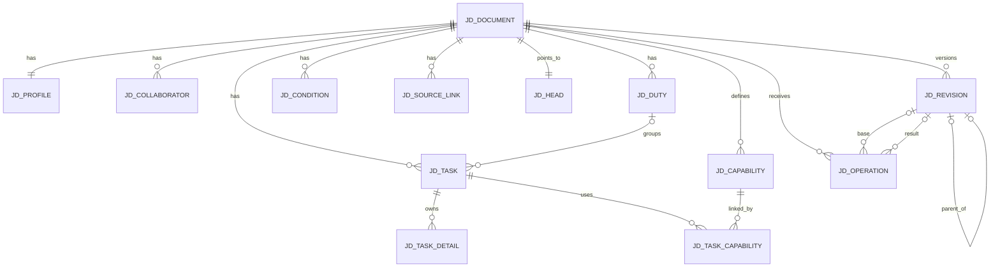

# JD 關聯式資料庫與保存契約

- 日期：2026-09-12
- Topic：JD-R002/C03
- 階段：G4 DRAFT；待 review，未產生 migration
- 上層設計：[JD 關聯式管理編輯器](2026-09-12-jd-relational-editor-design.md)
- 證據：[官方與本地現況](evidence/2026-09-12-jd-relational-editor-evidence.md)

## 1. 先回答「有幾張表、各保存什麼」

設計完成態共有 **13 張 JD scope 表**：1 張共享文件 catalog，加上 12 張正文、關係、版本與操作表。Memory、原始問答、LangGraph Store／Saver 仍在各自既有表，不計入這 13 張，也不複製到 JD 表。

| # | 表 | 保存責任 |
|---:|---|---|
| 1 | `jd_document` | 多份文件的共同身分、顯示名稱、封存與 metadata version；不是 JD 正文 |
| 2 | `jd_profile` | 一份 JD 的基本資料與職務目的 |
| 3 | `jd_collaborator` | 多筆主要協作對象 |
| 4 | `jd_duty` | 多筆主要職責 |
| 5 | `jd_task` | 多筆工作任務及其可空的 duty relation |
| 6 | `jd_task_detail` | 任務下多筆 outcome／requirement，以 kind 區分 |
| 7 | `jd_capability` | 同份 JD 共用的 knowledge／skill 定義，以 kind 區分 |
| 8 | `jd_task_capability` | 任務與 knowledge／skill 的 N:N relation |
| 9 | `jd_condition` | 工作條件與責任邊界的多筆項目 |
| 10 | `jd_source_link` | 正文項目到既有原始來源 reference 的關係 |
| 11 | `jd_head` | 每份 JD 目前 revision 與文件級寫入序號 |
| 12 | `jd_revision` | 每次成功保存的 immutable canonical snapshot |
| 13 | `jd_operation` | 每次人工／AI 寫入的 idempotency、終局結果與 receipt |

`jd_document` 是正式目標名稱；同一列同時提供 conversation、Memory 與 JD 使用的 document identity，不建立第二張文件主表。隔離候選目前叫 `q019_document`，只屬研究命名。由於正式採 fresh data，G6 adoption 應讓所有新 runtime 元件一次改用 `jd_document`；不建立 q019→jd 的搬移、mirror 或雙寫期。

目前隔離版已有 `jd_head`／`jd_revision`／`jd_operation`，但其 revision value 是整份可寫 JSONB。新 schema 是 successor：表名是否保留由 migration 決定，資料語意以本文為準；fresh data、不搬舊格式。

## 2. 關係圖

`jd_source_link` 對實際 target 使用下述 typed nullable FK；圖中只畫 document scope，避免把七條目標線擠在一起。

## 3. Current relational tables

共同規則：

- `document_id` 型別與 `jd_document.id` 相同；所有業務主鍵都是 `(document_id, *_id)`，讓 FK 能在 DB 保證同文件。
- item ID 使用 App 配發 UUID；LLM 與 Web 只看 opaque refs，不生成或解析 DB ID。
- `position` 是呈現順序，`CHECK position >= 0`；讀取固定 `ORDER BY position, *_id`。position 不作身分，也不要求模型填。App 在同交易正規化受影響群組；DB 不用跨列 CHECK 假裝保證連號。
- 可選文字在 mapper 將全空白正規化為 SQL NULL；員工正在輸入的全空白新 item 留在 client dirty buffer，不保存沒有意義的空列。
- 所有文字寫入先統一 CRLF／CR→LF，再驗值及計算 digest；不 trim 非全空白文字、不作 NFC 或自行替換字元。選區依原生 UTF-16 單位與此 LF 欄位版本驗證，見[業務設計 §4](2026-09-12-jd-business-operations-and-scope-design.md#4-r04整欄與選區的唯一語意)。
- 正文文字先用 PostgreSQL `text`；本版不保存 HTML、Markdown 或完整 Plate tree。未來若確有 marks／nested list 需求，另升欄位格式，不能把 renderer 內部資料偷塞進 text。
- current rows 不帶 AI／manual `pending` 狀態；唯一工作稿保存成功便是 current。origin 留在 revision／operation。

### 3.1 `jd_document`

| 欄位 | 型別／可空 | 約束與語意 |
|---|---|---|
| `id` | varchar，非空 | PK；文件 scope identity |
| `title` | text，非空 | App 列表顯示名稱，不等於正文 job title |
| `archived` | boolean，非空 | default false；封存只禁止新寫入，不刪資料 |
| `metadata_version` | bigint，非空 | rename／archive 的 conditional update token |
| `create_request_key` | varchar，非空 | UNIQUE；建立回覆遺失時查回同文件 |
| `create_payload_digest` | char(64)，非空 | 同 key 不同 title 拒絕 |
| `created_at`／`updated_at` | timestamptz，非空 | catalog 時間，不推算 JD revision |

### 3.2 `jd_profile`

| 欄位 | 型別／可空 | 約束與語意 |
|---|---|---|
| `document_id` | varchar，非空 | PK／FK → catalog；每份 active JD 一列 |
| `job_title` | text，可空 | 實際職務名稱；未知可空 |
| `organization_unit` | text，可空 | 單位／職位範圍 |
| `employee_name` | text，可空 | 可選文件歸屬資訊 |
| `reports_to` | text，可空 | 已知時的直屬主管／匯報角色 |
| `purpose` | text，可空 | 職務目的完整敘述 |

App 顯示名稱 `jd_document.title` 與正文 `job_title` 是兩個不同概念；更名文件不偷偷改職務事實。

### 3.3 `jd_collaborator`

| 欄位 | 型別／可空 | 約束與語意 |
|---|---|---|
| `document_id`／`collaborator_id` | varchar／uuid，非空 | 複合 PK；FK document |
| `name` | text，可空 | 協作角色或對象 |
| `scope_text` | text，可空 | 必要合作範圍 |
| `position` | integer，非空 | 顯示順序 |

`CHECK name IS NOT NULL OR scope_text IS NOT NULL`。

### 3.4 `jd_duty`

| 欄位 | 型別／可空 | 約束與語意 |
|---|---|---|
| `document_id`／`duty_id` | varchar／uuid，非空 | 複合 PK；FK document |
| `name` | text，可空 | 職責名稱 |
| `scope_text` | text，可空 | 職責群組的範圍概括；不可作任務特有必要限制的唯一存放處，亦不產生自動繼承 |
| `position` | integer，非空 | 職責順序 |

`CHECK name IS NOT NULL OR scope_text IS NOT NULL`。`jd_task(document_id,duty_id)` 使用 `ON DELETE RESTRICT`；D01 已採保留任務，由 App 在同交易明確解除分組再刪 duty（§6.3），不直接 cascade。

### 3.5 `jd_task`

| 欄位 | 型別／可空 | 約束與語意 |
|---|---|---|
| `document_id`／`task_id` | varchar／uuid，非空 | 複合 PK；FK document |
| `duty_id` | uuid，可空 | `(document_id,duty_id)` FK → duty；NULL 是合法未分組任務 |
| `name` | text，可空 | 可讀短名稱，不取代完整敘述 |
| `description` | text，可空 | 本人做什麼、對什麼、範圍與必要結果 |
| `position` | integer，非空 | 在同 duty／未分組群組中的順序 |

`CHECK name IS NOT NULL OR description IS NOT NULL`。單純移動更新 `duty_id` 與受影響群組 positions；`task_id` 不變。若有仍有效範圍／交付物／要求要保留，可依[完整業務操作](2026-09-12-jd-business-operations-and-scope-design.md#3-r05-裁決必要範圍隨任務職責摘要不產生繼承)在同次候選修正相關欄位或新增成果／要求；不是先移動再以另一筆保存補內容。

### 3.6 `jd_task_detail`

| 欄位 | 型別／可空 | 約束與語意 |
|---|---|---|
| `document_id`／`detail_id` | varchar／uuid，非空 | 複合 PK |
| `task_id` | uuid，非空 | 同文件 FK → task；`ON DELETE CASCADE` |
| `kind` | text，非空 | CHECK `outcome` 或 `requirement` |
| `text` | text，非空 | 非全空白的成果或要求內容 |
| `position` | integer，非空 | 各 task＋kind 內順序 |

outcome 與 requirement 使用同一表是因欄位、ownership、排序與刪除生命週期相同；`kind` 保證兩組分開，沒有 outcome↔requirement pairing 欄位。「工作執行要求」只是 `requirement` 的 UI label。

### 3.7 `jd_capability`

| 欄位 | 型別／可空 | 約束與語意 |
|---|---|---|
| `document_id`／`capability_id` | varchar／uuid，非空 | 複合 PK |
| `kind` | text，非空 | CHECK `knowledge` 或 `skill` |
| `name` | text，可空 | 可讀名稱 |
| `description` | text，可空 | 完整內涵、用途及範圍 |
| `position` | integer，非空 | 各 kind 總覽順序 |

`CHECK name IS NOT NULL OR description IS NOT NULL`。名稱不作 UNIQUE；兩個同名但範圍不同的 K/S 可以共存，由穩定 ID 區分。

### 3.8 `jd_task_capability`

| 欄位 | 型別／可空 | 約束與語意 |
|---|---|---|
| `document_id`／`task_id`／`capability_id` | varchar／uuid／uuid，非空 | 複合 PK；各自同文件 FK |
| `position` | integer，非空 | 該 task 內引用順序 |

task FK 採 `ON DELETE CASCADE`，因 link 是 task 的從屬關係；capability FK 採 `ON DELETE RESTRICT`，避免刪共享 K/S 時靜默解除所有任務。反向「此知識／技能用於哪些任務」由此表 JOIN 推導，不另存第二份 incoming list。

### 3.9 `jd_condition`

| 欄位 | 型別／可空 | 約束與語意 |
|---|---|---|
| `document_id`／`condition_id` | varchar／uuid，非空 | 複合 PK |
| `kind` | text，非空 | `work_environment`、`schedule_travel`、`shared_authority`、`shared_collaboration`、`qualification` |
| `text` | text，非空 | 非全空白條件或邊界 |
| `position` | integer，非空 | 各 kind 內順序 |

只有適用整份職位的內容放這裡；任務特有條件留在 task description／requirement，不因 kind 自動繼承到所有任務。

### 3.10 `jd_source_link`

| 欄位 | 型別／可空 | 約束與語意 |
|---|---|---|
| `document_id`／`source_link_id` | varchar／uuid，非空 | 複合 PK；FK document |
| `source_ref` | text，非空 | 既有來源 port 實際發配、可回讀確切原始問答的 opaque ref；不存原文，不接受裸 Memory 路徑 |
| `basis_digest` | char(64)，非空 | 建立連結時 target canonical content 的 SHA-256 |
| `position` | integer，非空 | 同 target 的來源順序 |
| `profile_field` | text，可空 | `job_title`／`organization_unit`／`employee_name`／`reports_to`／`purpose` 之一 |
| `collaborator_id` | uuid，可空 | 同文件 FK → collaborator |
| `duty_id` | uuid，可空 | 同文件 FK → duty |
| `task_id` | uuid，可空 | 同文件 FK → task |
| `detail_id` | uuid，可空 | 同文件 FK → task_detail |
| `capability_id` | uuid，可空 | 同文件 FK → capability |
| `condition_id` | uuid，可空 | 同文件 FK → condition |
| `linked_task_id`／`linked_capability_id` | uuid／uuid，可空 | 兩欄同時有值時，複合 FK → task_capability relation |

兩個 relation target 欄位必須同為 NULL 或同為非 NULL；再把這一對視為一個邏輯 target，與其餘七種 target 合計恰為一。各 ID 使用 typed composite FK 且 `ON DELETE CASCADE`，因 source link 是內容 target 的附件。`source_ref` 指向另一 owner，無跨 store FK；App 對新增／重新連結來源必須在寫入前以既有 source port 驗 scope、可讀性與種類。§6.4 的整份歷史還原只允許恢復 server 內部已保存的原 links／basis，不假稱重新核定；不可讀原話另顯示，不任意新增來源或略過同文件完整性。

`basis_digest` 不宣稱來源自動證明整筆文字，只表示這條 link 是對哪個 target value 建立。current value digest 改變後，link 在 UI／模型 read 中標成 `needs_recheck`；歷史 snapshot 保留當時的匹配狀態。

Memory／詳記協助查找原始材料，並非此欄另一種任意可變來源。沿[既有來源契約](2026-09-10-jd-context-change-and-source-research.md#4-jd-是否要引用-memory)，本輪沒有建立永久 Memory-version locator；較新更正與舊引用是否仍支持目前內容由顧問核對，target digest 不會自動判斷這項語意。

## 4. Revision 與 operation tables

### 4.1 `jd_head`

| 欄位 | 型別／可空 | 約束與語意 |
|---|---|---|
| `document_id` | varchar，非空 | PK／FK document |
| `current_revision_id` | uuid，非空 | 複合 FK → 同 document revision |
| `revision_number` | bigint，非空 | CHECK ≥ 1；目前文件級 optimistic token |
| `updated_at` | timestamptz，非空 | 最後 current commit 時間 |

此列與同文件 `jd_document` row 是短交易的固定鎖定範圍；所有 JD write 及 archive 依 `jd_document`→`jd_head` 的相同順序取得，避免 archive／write race。不同 document 不共用 Python mutex 或 table lock。

### 4.2 `jd_revision`

| 欄位 | 型別／可空 | 約束與語意 |
|---|---|---|
| `document_id`／`revision_id` | varchar／uuid，非空 | 複合 PK |
| `revision_number` | bigint，非空 | UNIQUE(document_id, revision_number) |
| `parent_revision_id` | uuid，可空 | 同文件 self FK；initial 才可 NULL |
| `origin` | text，非空 | `initial`／`manual`／`ai` |
| `format_version` | integer，非空 | 新 relational snapshot 固定 3 |
| `engine_profile` | text，非空 | 固定 `jd-relational-v1` |
| `snapshot` | jsonb，非空 | server 從 current rows 產生的完整唯讀歷史投影 |
| `content_digest` | char(64)，非空 | canonical snapshot SHA-256 |
| `created_at` | timestamptz，非空 | revision commit 時間 |

固定約束：initial iff parent NULL；每 document 至多一 initial；本版線性 current history，同文件每個非 NULL `parent_revision_id` 至多出現一次，包含指向 initial 的情況。以 `UNIQUE(document_id, parent_revision_id)` 保證同一修訂至多一個 successor；initial 本身另以原有唯一規則限制，不能依 nullable UNIQUE 單獨保證。revision rows 不提供 UPDATE／DELETE port。非 initial 的 producer 由唯一 committed `jd_operation.result_revision_id` 反查，避免雙向 FK。

2026-09-13 [欄位／關係審核](2026-09-13-jd-field-sufficiency-audit.md)修正 ERD 多分支與上述線性語意的文件不一致；依 [PostgreSQL 16 UNIQUE 與 NULL 規則](https://www.postgresql.org/docs/16/ddl-constraints.html#DDL-CONSTRAINTS-UNIQUE-CONSTRAINTS)。須以同初版 r1 不能同時成為 r2、r3 的 parent 作真 DB 反例驗證；本次未建表或宣稱已阻止 runtime 分叉。

Canonical snapshot 包含 profile、collaborators、duties、tasks、task_details、capabilities、task_capabilities、conditions、source_links；每組按 `position,id` 排序，明確保存 IDs 與 relations。這份 JSON 是 history／diff／export 的 immutable material，不接受為 Web／模型的 current write payload。§6.4 的具名還原由 server 讀自有 immutable snapshot、驗證後形成 relational 候選，沒有開放任意 JSON 覆蓋。

### 4.3 `jd_operation`

| 欄位 | 型別／可空 | 約束與語意 |
|---|---|---|
| `document_id`／`operation_id` | varchar／uuid，非空 | 複合 PK；App 配發 |
| `request_digest` | char(64)，非空 | server 對 document、origin、可信 ai_run_id（manual 為 null）、base revision、完整 canonical commands 計算；同 key 改 base／run 亦屬不同意圖 |
| `origin` | text，非空 | `manual`／`ai` |
| `ai_run_id` | varchar，可空 | App 從既有持久回合與可信 binding 注入；CHECK：origin='ai' 當且僅當本欄非 NULL，manual 必為 NULL；不是模型參數 |
| `base_revision_id` | uuid，可空 | 已核實時的同文件 FK |
| `result_revision_id` | uuid，可空 | 成功／no_change 的同文件 FK |
| `status` | text，非空 | §6 終局狀態 |
| `receipt` | jsonb，非空 | SSOT write result；actual changes、error、next action；還原結果另記操作種類及已核同文件的歷史來源 revision，供預覽後結果、歷史及模型通知辨識 |
| `created_at` | timestamptz，非空 | 終局 receipt 保存時間 |

同 `(document_id,operation_id)` 同 digest 重送只回原 receipt；不同 digest 回 `operation_conflict`，不能 UPSERT 覆寫。對 `status='committed'` 建部分唯一索引 `(document_id,result_revision_id)`；no_change 可由多個 operation 指同一 revision。

AI 操作的 run 歸屬連同成功／no_change／已確認失敗回執原子保存；必須經既有 run owner 核對同文件，不從 timestamp、actor 或暫態 jd_bindings 猜測。回合 authority 仍是既有 runtime；不在 JD 新建另一套 run 表或跨 owner cascade。尚未形成可信 binding 的請求拒絕不偽造 AI operation。此欄只識別操作歸屬；完整範圍及閉合判斷依[整輪撤回 §4](2026-09-12-jd-ai-turn-undo-design.md#4-何時可撤回)。

## 5. 必要 indexes

除 PK／UNIQUE 自帶 indexes 外，建立以下讀取索引：

- `jd_duty(document_id, position, duty_id)`
- `jd_task(document_id, duty_id, position, task_id)`，另有未分組 partial index `WHERE duty_id IS NULL`
- `jd_task_detail(document_id, task_id, kind, position, detail_id)`
- `jd_capability(document_id, kind, position, capability_id)`
- `jd_task_capability(document_id, capability_id, task_id)` 供反向用途；PK 支持 task→capability
- `jd_condition(document_id, kind, position, condition_id)`
- `jd_revision(document_id, revision_number DESC)`
- `jd_operation(document_id, created_at DESC)`
- `jd_operation(document_id, ai_run_id)`，partial `WHERE ai_run_id IS NOT NULL`；查整輪全部結果，順序依所連 revision number／parent，不依保存時間猜序
- `jd_source_link` 各 target 的 partial index，僅索引該 target column 非 NULL rows

第一版不加全文搜尋、vector、RAG、跨文件 K/S 去重或統計 materialized view。

## 6. 寫入交易

### 6.1 新文件

同一 transaction：

1. 以 create request key 新增或查回 `jd_document`。
2. 新增空 `jd_profile`；current collections 為零列。
3. 從此 relational current 產生 initial snapshot，新增 `jd_revision(origin='initial')`。
4. 新增 `jd_head` 指 initial revision。
5. commit 確認後才回建立成功。

相同 key／相同 digest 回同一 document；相同 key／不同 digest 拒絕。建立不呼叫模型。

### 6.2 人工或 AI 保存

一般文字自動保存或完成明示結構操作，都是觸發同一 command service；觸發與交接見[保存設計](2026-09-12-jd-autosave-and-handoff-design.md)。解析／模型呼叫／外部來源讀取在 SQL transaction 外。admission 沿既有 per-document writer gate：在綁定前拒絕無效 scope、格式、busy 或 archived 時，沒有 operation terminal，也不得回 confirmed；一旦綁定，保留原 operation identity／digest 與可恢復 descriptor，直到實際終局。

正常寫入使用短 **READ COMMITTED** transaction，SQL 同步逐句執行，不使用 pipeline：

1. 查同 operation；存在時依 digest 回原 receipt 或 conflict，不重新驗候選或覆寫原結果。
2. 依固定順序鎖同文件 `jd_document`、`jd_head FOR UPDATE`；取得鎖後以後續 statement 再查 operation。所有會改該 JD 的 current／head／receipt 操作（含 §6.4）與 catalog archive／unarchive 均遵守此順序；鎖必須在 savepoint **之前**，所有 mutation 必須在取得 head 鎖之後。
3. 核 base revision、refs、同文件關係及 command 前置條件。既有 admission 必須讓 catalog archive／unarchive 與 writer binding 互斥；鎖後再驗 archived／writer ownership，若違反已取得的資格，走原 operation 的 `save_failed` 閉合，不套用候選、不回無 binding 的 busy／archived。已確認的 `stale_view`／`target_missing` 等語意拒絕，可直接新增 failure receipt、提交外層交易，正文不變；base FK 只記已驗證的同文件 revision。
4. 建立候選 savepoint；先按同一 base 解譯所有 refs，拒絕重複／互斥／anchor 被刪等輸入，組出完整最終候選並驗 domain invariant，再以同列最終值修改 current rows，避免逐欄中間狀態誤觸約束。ID、position、relation cleanup 由 App 處理；從同交易 rows 產 canonical snapshot 再核最終一致性。完整新增、內容修訂及結構附帶調整沿[工具契約 §3–4](2026-09-12-jd-relational-agent-tool-contract.md)，不形成第二套 validator。
5. 候選中的預期語意錯誤，或已知可映射的 constraint 錯誤：`ROLLBACK TO SAVEPOINT` 成功後，保存對應 failure receipt，再提交外層交易。不得保留先前已移動的 task。未知 SQL 錯誤、連線失敗或 rollback 失敗不能一律假裝成輸入錯誤，改走下方整筆失敗分支。
6. candidate digest 與已核 base 相同：rollback 到 savepoint，保存 `no_change` receipt，result 指 base；不新增 revision、不更新 head。
7. 有變更：新增 revision(parent=base) → 新增 committed receipt(result=new) → 更新 head。current、snapshot、head 與成功 receipt 同交易提交。
8. 只有外層 COMMIT 確認成功，才回 `receipt_durability=confirmed`。無論成功或失敗 receipt，其 INSERT 成功或 savepoint rollback 成功都不能單獨證明持久化。

**整筆 SQL 失敗與回覆遺失：**已證正文 rollback 時 `effect=unchanged`；COMMIT 可能成功但未取得確認時 `effect=unknown`。兩者若無已確認 terminal，均保留原 binding、`receipt_durability=unconfirmed`、`next_action=reconcile_operation`；即使已知正文不變，也不能先解綁再另發新意圖。

恢复沿[既有 lifecycle §6.5](2026-09-10-jd-native-process-lifecycle-design.md#65-python-已停止後的-pg-對帳與-known-none)及[手改恢復契約](2026-09-10-jd-manual-recovery-transport-design.md)：先取得原 writer 已停止／不再可送 mutation 的可信證明，再用新的 **READ COMMITTED** transaction 依 document→head 取得相同鎖；取得後在**下一 statement**查原 operation／digest。真 terminal 優先。只有跨過原 DB 邊界且確認 known-none，才用原 identity／digest 走既有 failure-only port 保存 `save_failed`；該回執仍需 COMMIT 確認。不能重播 commands、重跑模型或新造 operation。writer 尚可能執行、缺 head、鎖逾時、DB 不可用或 failure receipt 本身保存失敗時，保持未閉合狀態。

這個對帳交易不能改用 §9 的 REPEATABLE READ：等待鎖後查回結果須取得新的 statement snapshot，否則可能查不到剛提交的原回執。新 schema 的 mutation 順序若改為 pipeline 或繞過相同鎖，既有停止／DB 邊界證明即不適用，須先重審；不能只以 Python 程序死亡或單次查無 row 認定未寫入。

§6.1 建立文件尚無 head，不套用上述已存在文件 barrier；沿 catalog 的原 create key／digest 唯一約束及既有建立對帳流程，查回同一結果，不能自動換 key 重建。不同文件不共用 service-global mutex。官方機制與採用限制見[保存設計 §1](2026-09-12-jd-autosave-and-handoff-design.md#1-補充官方證據)。

### 6.3 刪除

- outcome／requirement 與 task-capability relations 是 task component，可隨**明示 task delete command**清除；shared capability 仍存在。
- capability 仍被引用時由 FK `RESTRICT` 阻止；App 先顯示引用者，明示 unlink 後在同 transaction 刪除。
- D01 已採刪 duty 保留 tasks。App 在同一完整業務命令／交易內，將該 duty 的 tasks.duty_id 設 NULL，按共同順序規則納入同文件未分組清單，再刪 duty；任務 ID、正文、details、task-capability relations 與各自來源保留。底層 FK 維持 `RESTRICT`，防止直接刪除繞過步驟，不阻止合法解除分組後刪除。
- 被刪 duty 的 current source links 隨目標移除，歷史 snapshot 保存當時原文及來源；不得懸空或自動轉掛。依[業務設計 §3](2026-09-12-jd-business-operations-and-scope-design.md#3-r05-裁決必要範圍隨任務職責摘要不產生繼承)，完整預覽受影響資料，必要時同次修正存活任務欄位或新增成果／要求再解除分組／刪 duty；新增 basis 逐目標查核。原子性由 App／DB 驗，含義保留由顧問／員工判斷，不能以歷史可查冒稱目前稿保真。
- v1 無 permanent document delete；catalog archive 不觸發任何 cascade。

PostgreSQL 官方指出 `CASCADE`、`RESTRICT`、`SET NULL` 要依物件是否能獨立存在選擇；以上是本案 ownership mapping，不稱通用規則。[PostgreSQL 16 Constraints](https://www.postgresql.org/docs/16/ddl-constraints.html)

### 6.4 明示整份 JD 歷史還原

Owner 已選定[需求 HR-01](2026-09-12-jd-relational-editing-requirements.md#11-本輪裁決草稿歷史與還原2026-09-12)。`restore_revision` 是人工端具名 application command；輸入限目前 H、選定歷史 S 的 issued refs 及 App 注入的 operation／scope，不接受 snapshot／任意 SQL 或 LLM 生成的資料庫身分。

- 同文件 writer admission、document→head 鎖、base=H、archived、原 key 與 digest 規則全部沿 §6.2。server 核 S 屬同文件且 format／profile／digest 正確，使用既有 domain model 驗完整候選；預覽不持有交易。目標 S 納入 canonical request digest，改選版本或 base 是新意圖。
- 這是已確認的整份替換效果，依[完整影響預覽](2026-09-12-jd-history-and-recovery-design.md#4-整份還原的使用流程)處理較新任務移除；不逐項套 D01 刪職責保留任務來改寫使用者選定的完整舊稿。
- 有界實作方向是在同一 savepoint 內，僅對該 document 的九組正文／關係表，依 FK 子項先移除、父項先重建的順序，重建已驗的 S 候選並保留其歷史 IDs；catalog、head、revision、operation 不被清除。重建期間對外不可見，最终 rows→snapshot 必須與 S canonical 內容相符，否則全部 rollback。這是固定 domain 的整份還原，不生成通用逆命令或繞過驗證的表格 API。
- 來源沿[歷史來源政策](2026-09-12-jd-history-and-recovery-design.md#5-身分來源與-ai-續談)：恢復原 source refs／basis，沒有新查核聲明。receipt 記已核的 S，歷史／通知顯示沿用舊版依據；新來源仍走 §3.10。
- 有變更時新增 R，parent=H、origin=manual、revision number 前進；H、S 與中間 revisions／receipts 保留。相同 canonical 內容回 no_change，不新建 initial 或移 head 回 S。SQL 失敗、failure receipt／COMMIT 未確認與停止恢復都沿 §6.2–7，不能因 restore 另開 replay 邏輯。
- 只更動 canonical JD；列表命名／封存、原始問答、Memory、聊天及模型已讀基準不變。catalog 解除封存稱 unarchive，與本命令分開。此款為設計，FK 順序、來源及故障尚須專用 DB 驗證。

### 6.5 撤回整輪 AI 的 JD 修改

人工端 `undo_ai_turn` 共用 §6.4 的候選還原／來源／交易，只改 JD。依[HR-02](2026-09-12-jd-ai-turn-undo-design.md)，App 提供可信目標 T／預期 E 與新 operation，server 查 T 全部 committed operations、核完整連續 parent 鏈及 current head=E，推導首 base S。run 閉合及 admission 仍由既有 owner 負責。

先查原 receipt 再驗新資格，避免撤回成功後同 key 重試被新 head 誤拒。`undo_ai_turn`、T／E 納入固定意圖，結果記 S／E／新 R；R 的 parent=E、origin=manual、ai_run_id=NULL。原 T 的 operations 仍保留原成功結果；Memory／案例／訪談與 model-view baseline 不回退。無實際差異回 no_change，沒有任意舊回合的逆操作或第二份稿。

## 7. 終局 status 與重試

| status | current effect | result revision | next action |
|---|---|---|---|
| `committed` | relational rows、revision、head、receipt 已同交易提交 | 新 revision | continue |
| `no_change` | current 不變，只保存確定回執 | base revision | continue |
| `invalid_input` | 不變 | NULL | correct_arguments 或 stop |
| `target_missing` | 不變 | NULL | reread_current 或 stop |
| `stale_view` | 不變 | NULL | reread_current 或 stop |
| `relationship_conflict` | 不變 | NULL | correct_arguments 或 stop |
| `dependent_items` | 不變 | NULL | 顯示仍被引用的 K/S 等已定相依項目，依明示解除／改接流程處理或 stop；不能僅因 duty 有 tasks 就阻擋 D01 |
| `save_failed` | 已證 rollback，不變 | NULL | stop |

本表 next action 適用於已確認 terminal。**已 binding 而 receipt unconfirmed 時，一律先 `reconcile_operation`，優先於 correct／reread／stop；不把已知 unchanged 假稱 effect unknown。**binding 前拒絕沒有 operation ref、沒有 terminal，durability 為 unconfirmed；綁定後 archived／ownership 再驗失敗依 §6.2 閉合，不能漏回執。`outcome_unknown` 不是終局 receipt：依 §6.2 查回原結果，單次查不到不代表可以新 key 重做。

App 不自動重跑 mutation transaction；serialization／deadlock 必須先閉合原 operation，之後若使用者／模型依最新內容提出明確新意圖，才核准新 attempt。不能只重跑最後 SQL，不能用同 key 偷換 base，也不能以 SDK 的 retry 預設取代本案原請求對帳。錯誤重讀／修正次數仍沿工具及 run budget。

## 8. DB、App 與模型各自驗什麼

| 層 | 強制內容 |
|---|---|
| DB | PK/FK、同 document relation、junction uniqueness、kind/status 白名單、target exactly-one、delete restriction、transaction atomicity |
| App mapper／service | refs 解碼、來源 scope、command schema、position 正規化、至少一個有意義文字、relation kind、snapshot canonicalization、receipt refs |
| AI 顧問 | 內容是否忠實、哪項工作已有足夠資訊、如何寫得專業、哪個來源支持哪項敘述 |
| Web | dirty buffer、可讀欄位與影響預覽、current token、actual result；不承擔 domain authority |

DB `CHECK` 不跨列查另一張表；跨列規則用 FK／UNIQUE／transaction service。PostgreSQL 明示 CHECK 不適合引用其他列，不能把 application invariants 塞進不可靠 SQL expression。[PostgreSQL 16 Constraints](https://www.postgresql.org/docs/16/ddl-constraints.html)

## 9. 歷史、diff 與 export read

### 9.1 同一版的目前內容

current UI、AI read、來源目標核對、目前版 Excel export 共用一個讀取 service。每次讀取在第一個 query **之前**開啟短 `READ ONLY REPEATABLE READ` transaction；一次讀完同文件 document／head／revision metadata，以及所需全部 current tables／relations／source_links，再結束交易。從這份已 materialize 的資料產生 projection、canonical target digest、`revision_ref` 與所有 typed refs；不得在產 ref 時另查最新 head，也不按各表獨立連線拼湊。此唯讀交易不使用 FOR UPDATE，不跨 UI 互動、HTTP 請求、LLM 或外部來源呼叫持有。[PostgreSQL 16 isolation](https://www.postgresql.org/docs/16/transaction-iso.html)、[SET TRANSACTION](https://www.postgresql.org/docs/16/sql-set-transaction.html)

第一版 service 每次讀完整單份 JD 投影，再選擇要交付的 item／section；模型輸出可有界分頁，但 cursor 綁定此次 revision。下一頁重新開短讀取交易，核 head 與 cursor revision 相同才回同版資料；不同則回過時並要求重新讀取，不續接混版頁面。指定 history 的 cursor 則固定不可變 revision。不得持有跨請求 DB snapshot，也不能靜默把 history 當 latest current。

人工變更 notice 的上界 H 與 `(last_model_view,H]` 事件亦由同一次 JD 讀取材料取得；no_change 不產 revision，另查操作結果時不得混入 H 之後的事件。送模型前的 writer gate 與版本交接另依[保存設計 §4](2026-09-12-jd-autosave-and-handoff-design.md#4-與-ai匯出及離開操作交接)，不是靠唯讀交易鎖住全程。

反例驗收：reader 已讀 r5 的職責後，writer 新增 C、移 T 至 C、提交 r6；本次 reader 的任務、來源目標與 refs 仍全部是 r5。下次 read 才能全部為 r6；不能回沒有職責 C 卻有 T→C 的投影。**此為待執行驗收，不是已測結果。**

### 9.2 來源、歷史與輸出

- source `needs_recheck` 只以同份 JD 讀取材料的 target digest 對當時 `basis_digest` 計算，不另存可手改狀態。
- 外部來源的原文、scope／種類及可讀性，關閉 JD read transaction 後經既有 source port 取得；是另一時間點的來源觀察，須分開標示不可用／已查結果。不可用不刪 source link、不改 history、不冒稱所有來源與 JD 在同一全域交易內。來源可讀與文字是否仍受支持也是不同事實。
- history UI 讀指定 immutable snapshot；原 source refs／當時目標內容保留，現今回查原文的失敗另顯示，不重寫歷史。比較／確認後的還原沿 §6.4 形成新寫入，不能在讀歷史時更新 head。
- change read 由已確認 operation 的 base/result snapshots 按 stable IDs 比較，產出 create/update/delete/move/reorder/link/unlink 及欄位 before/after；失敗或 no_change 不偽造內容差異。
- current export 使用 §9.1 的版本固定 projection；指定歷史 export 讀該 revision snapshot。兩者使用同一 canonical domain model，標明所輸出版次；Excel renderer 不再查散表或呼叫 LLM。

## 10. Migration 與驗證前提

本設計採 fresh data，沒有舊 JSONB revision 搬移或雙寫期。正式施工前必須：

1. Proposed ADR 通過 G6；
2. D01 與 JR-R01–05 已文件閉合；本輪歷史還原及恢復前置須完成設計審查與真實寫入反例，不能僅通過 FK 或文件就施工；
3. contract schema 由單一來源生成 API／Web／model DTO；
4. migration 在專用新 DB 執行，初始化與日常啟動分開；
5. 真 PostgreSQL 測試覆蓋 FK、transaction injection、同 operation replay、同 base 競爭、不同文件不互相阻塞；
6. current projection→snapshot→projection round-trip 與完整樣稿逐欄無損；
7. schema／snapshot／receipt 版本不合時停止，不自動清空資料。

本文沒有建立上述任何表，也沒有宣稱 current preview 已改成 relational。
