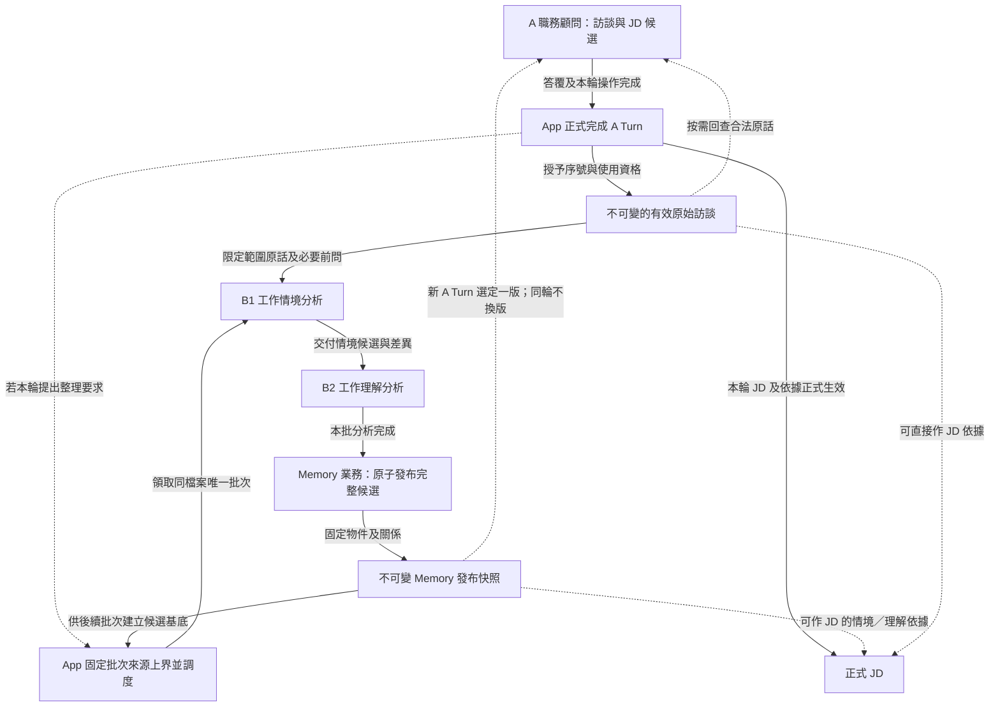
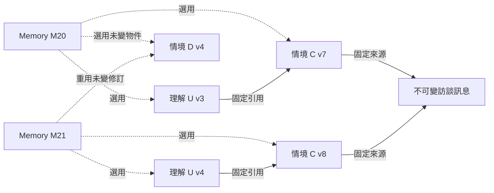

# 受訪者工作記憶：分層、候選與發布快照

受訪者工作記憶（Memory）把原始訪談整理為工作情境與工作理解，讓顧問延續分析、按需回查依據，再編修職務說明書（JD）。每份職務檔案的資料彼此隔離；Memory 保存工作資訊，JD 則是使用這些資訊形成的文件成果。

## 一眼看懂

下圖呈現資料與分析角色的關係。實線表示資料或結果的流向，虛線表示可選控制或按需讀取；箭頭不代表模型可直接操作資料庫。

A 依訪談內容提出背景整理要求，只有該輪成功完成後才生效。未完成或已取消的輸入不供背景使用，A 也不必等待背景發布才編寫 JD。App 提供的正式開場依來源規則成立一次，不經一般 A Turn 完成流程。

## 三層各自保留什麼

| 資料層 | 回答的問題 | 保留的內容 |
|---|---|---|
| 原始訪談 | 員工與顧問實際說過什麼？ | 完整發話、說話者、正式順序與來源身分。補充、更正另成新訊息，不改寫原話。 |
| 工作情境 | 這件工作實際怎麼做？ | 本人行動、判斷、條件、過程、差異、例外、未知及原話依據。 |
| 工作理解 | 這些情境支持什麼工作認識？ | 跨情境的責任、範圍、共同模式與適用條件，並保留情境引用。 |

工作理解透過引用回查具體情境，不重抄每件工作的過程，也不將單一情境概括為無條件通則。B1／B2 不預先填寫 JD 的職責、任務或 O／P／K／S 欄位；A 依工作分析與寫作方法決定成品的分組及措辭。改變 JD 版型不會使原有工作依據失效，缺少的事實仍須回查或詢問。

背景整理採單向 **B1 → B2 → 發布** 。B1 只讀寫情境，不讀理解；交接後不再修改本批情境。B2 使用這份情境分析工作理解，不修改情境，也不回交 B1。完成後由 App 發布整版。需要員工確認的疑點則保留依據與未知，交由 A 在後續訪談追問；員工仍不知道時，缺口繼續保留。

Memory 可以帶有明示的未知與矛盾。正式發布表示本批分析已完成、資料與關係已固定，不表示員工工作已全部問清。引用數量不是建立或發布物件的格式門檻；內容是否有根據、未知是否如實表達，仍由分析角色判斷。

分析方法見[產品概念](../product-concept.md#分層工作記憶)及[完整工作分析指南 §9](../guides/2026-09-09-complete-work-analysis-guide.md#9-工作理解正文要寫到多清楚2026-09-25-研究補核對)。

## 導覽、正文與按需分析

情境與理解物件使用三個內容欄位：`title`、`description`、Markdown `body`；來源關係與正文分開。Markdown 是內容格式，不要求另存為實體 `.md` 檔案。

導覽以 `target_title` 與 `description` 提供可讀目標；物件讀取再提供 `title`、正文與獨立來源資料。模型選擇 App 提供的標題，App 在角色可見範圍內解析為內部物件身分。標題不是資料庫主鍵；同一版各層內標題唯一，情境與理解可以同名。

建立物件可同時提供來源；更新以同一目標的 `changes[]` 表達短欄位新值、正文 V4A diff 與引用增刪，整次成功或拒絕。刪除情境會同時解除候選理解中的相關綁定，但不改寫已發布歷史。Memory 候選不需要逐條確認引用換版。

分層與按需閱讀讓後續分析沿用既有成果，而非每批重讀全部歷史：

- B1 處理本批新增原話，按需回查早期脈絡及目前情境。
- B2 掌握 B1 的情境變更，包括尚未被任何理解引用的新情境，再按需讀新版正文、原話與詳細差異。
- diff 協助定位變化，不代替完整分析。本批受影響範圍整理完成後才發布。
- A 採用相同的導覽、差異與正文閱讀方式，但 JD 可逐項、跨輪重評，不必隨一次 Memory 批次全部完成。

工具格式見[共同工具設計](2026-09-27-agent-tool-contract-design-research.md)、[讀取與來源](2026-09-27-memory-read-and-source-navigation-contract.md)、[物件更新](2026-09-27-memory-object-update-tool-contract.md)及[操作範例](2026-09-28-memory-tools-crud-examples.md)。

## 來源與版本

一版 Memory 是共享物件的固定關係網，不是一條單線。工作理解可以引用多個情境，情境可以引用多則原話；同一情境或原話也可支持多個下游物件。原話可尚未整理成情境，情境也可尚未被理解引用。

發布快照對每個來源與物件身分只選一份固定內容。對同一情境或理解身分，只選一個修訂；無論從導覽或哪條引用路徑抵達，都得到相同正文與下層引用。理解所指的情境修訂與本版選用的一致，情境的原話引用則指向不可改寫的來源。不同物件不必共用相同版號。

候選與歷史的引用方式不同：

| 範圍 | 引用指向什麼 | 修改後的行為 |
|---|---|---|
| 本批候選工作稿 | 穩定物件身分 | 沿同一綁定讀目前內容；改名不換物件。刪除情境會解除相關候選綁定，理解仍保留。 |
| 已發布 Memory | 本版選定的固定修訂 | 新版不覆蓋舊版。正文或下層固定引用改變時，形成新修訂。 |
| JD 的 Memory 依據 | 採用當時的固定修訂 | 不隨背景發布自動更新；A 讀差異、核對後才明確對齊。 |

不要求每個情境都帶原話引用，也不要求每個理解都帶情境引用。已有的關係必須真實且一致，沒有關係時不捏造；未知可以如實保留。來源資格與語意支持不是靠引用數量判斷。

A 可直接引用合格原話，或已發布的工作情境、工作理解。引用理解便可沿固定鏈回查情境與原話，不必將鏈上每項再列為 JD 的直接來源。背景候選不能作正式 JD 來源。

### 版本、候選與 PostgreSQL 保存邊界

下圖區分快照選用與固定引用。虛線表示快照選用，實線表示來源引用；同一方框是可重用的同一修訂，不是兩份內容相同的副本。

例中 U 正文即使沒變，只要引用由 C v7 改為 C v8，也形成 U v4。M20 的 U v3／C v7 保持不變，M21 的所有路徑則讀到 U v4／C v8。D 未改，可以跨快照重用；沒有被理解引用的情境也可存在。訪談層同樣屬於快照，圖只畫本例用到的來源。

三種版本用途如下：

| 概念 | 用途 |
|---|---|
| Memory 發布版 | 固定當時有效的訪談、情境、理解與完整關係，供 A 讀取與 JD 回查。 |
| 物件修訂 | 辨認某情境或理解的固定內容與下層引用；改回舊文字仍是後來的新修訂。 |
| 候選狀態／交接快照 | 支援本批修改、差異比較及中斷恢復；尚未發布，不供 A／JD 引用。 |

B1／B2 的 map 與 read 讀取同一候選的目前狀態。B1 交接時保存的情境狀態是差異與恢復基準，不是另一份可寫工作稿；B2 分析期間情境不變，是因 B1 已停止修改。B2 的完成結果對應這份情境狀態，包括判定不需修改理解的情況。

發布使用短交易，讓當前成員、內容、固定關係、正式版本、訪談處理上界與發布結果一起成立。候選操作已維持結構合法，發布時核對完成資格及正式基準，不再要求模型修格式或逐條換版。若基準已失效，不能替舊候選換版號強行發布；若提交結果不明，先查原結果，不重複發布。

所有已發布快照及沿引用可達的內容保留，可完整回查。未變修訂跨快照重用，修改過的物件保存新修訂；不以文字恰好相同抹除不同歷史。候選中間狀態的保留依恢復與差異比較需要決定，不要求永久保存每次未發布改動。

例如 M22 把 C 正文改回 v7 時的文字，仍會形成後來的 C v9；受影響理解需依新基準重評，而完全未變的 D 仍可重用。這沿用一般的新舊基準比較，不另設「改回」流程。保存與交易見[資料章節](../architecture/persistence.md)，方案比較見[設計取捨](../architecture/design-decisions.md)。

## 員工更正與背景涵蓋範圍

員工補充或更正先保存為新的原始訪談。B1／B2 在包含該訊息的後續批次中重新分析、發布，不在每次更正後立即修補 Memory。C 即時修補與 `repair_memory` 不在現行流程。

若背景批次只涵蓋第 16 輪，就不能當成已處理第 17 輪的更正。A 仍能使用近期原話與按需讀取工具，不以較舊 Memory 覆蓋新的明確資訊。相關 Context 組裝見[顧問 Context](2026-09-26-consultant-context-and-state-design.md)。

## 相關設計

- [背景整理生命週期](2026-09-25-b1-b2-information-gap-lifecycle.md)：單向流程、固定訪談上界、三個安全點與恢復。
- [資料保存與交易](../architecture/persistence.md)：候選、不可變修訂、發布及保留。
- [共用執行](2026-09-27-shared-agent-execution-and-state-design.md)：原生模型接續、工具結果與壓縮。
- [JD 來源與差異](2026-09-29-jd-model-tool-contract-review.md)：固定依據回查與逐項核對。
- [驗證與限制](../architecture/verification.md)：物件修改、刪除、B2 無修改、競爭發布及中斷情境的測試範圍。
- [公開方法研究](../research/agent-systems/2026-09-25-agent-capabilities-and-lifecycle-patterns-research.md)與[正文編輯研究](../research/agent-systems/2026-09-09-llm-app-tool-use-and-document-editing-common-practices.md#10-patch-格式與定位執行器分開判斷2026-09-27-續議)：方案及方法來源。
