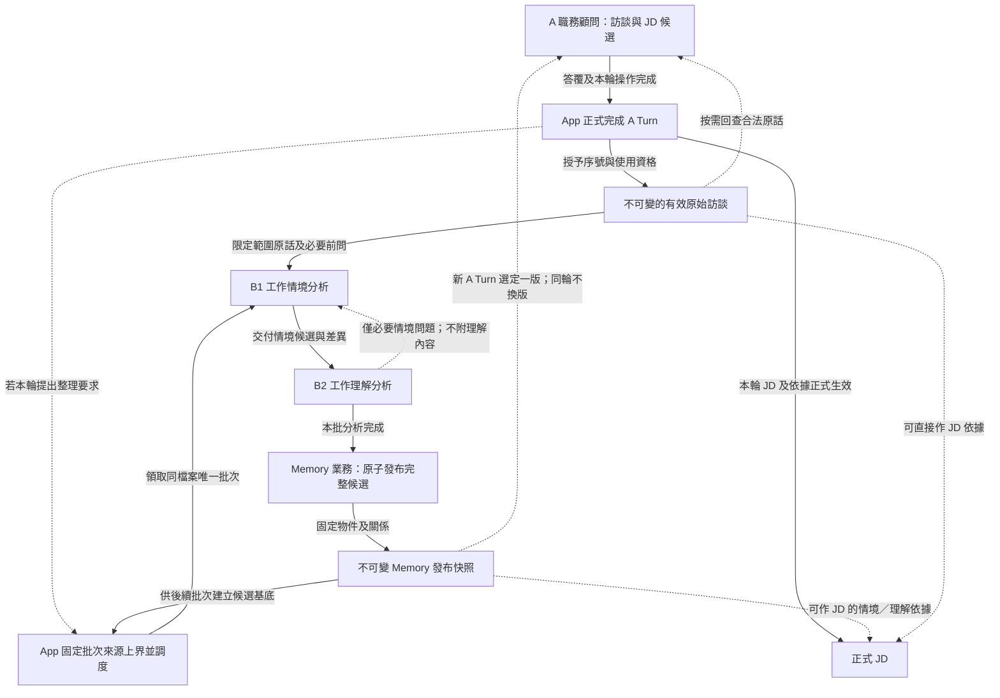
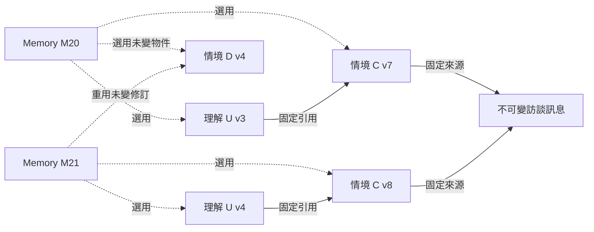

# 受訪者工作記憶：分層、候選與發布快照

- 日期：2026-09-24；最近核對：2026-09-29（補齊來源准入、候選發布與不可變修訂圖）。
- 狀態：Owner 已確認的**目標方向／WORKING**；不是現行程式已完成的宣告，也不是版本、儲存與遷移的詳細施工契約。
- 範圍：新 JD App 的 Memory 子系統及與訪談／JD 的交界；不是全產品部署圖。全產品從[目標導覽](../target-architecture-map.md)深入。每份職務檔案資料隔離；現行正式程式入口見 [ADR0077](../adr/0077-relational-jd-app-production-authority-and-pnpm-entrypoint.md)。
- 名稱：職務檔案是整個員工工作範圍，JD 專指其中的職務說明書。其他概念與執行責任的名稱以[產品概念的用語表](../product-concept.md#已對齊的產品單位與用語)為準；現行程式不因此自動改名。

## 一眼看懂

圖為**目標邏輯資料流／未實作**。實線為資料或結果交付，虛線為可選控制／按需讀取；箭頭不代表直接 DB 權限。B1／B2 都透過 Memory 業務操作同一候選，以下省略工具適配層。

這是**職責與資料關係圖**，不是每輪必跑的流水線。A 依內容提出整理意圖，成功完成後才生效；未完成／取消輸入不供背景使用。A 不等待背景發布。B1 可保存有依據的已知與未知，B2 不把片段過早概括成固定職責；兩方不自行發布半層。App 的正式開場另依來源契約成立一次，不經一般 A 完成流程。最新目標詳見[B1／B2 生命週期](2026-09-25-b1-b2-information-gap-lifecycle.md)；較早的[分層 Memory 設計](2026-09-16-layered-case-and-work-understanding-memory-alignment.md)與[背景流程](2026-09-17-layered-memory-background-workflow-design.md)僅供現況／歷史參考。

**記憶不是隱藏版 JD。**「受訪者工作記憶」包含原始訪談層、工作情境層與工作理解層；B2 的理解可支持 JD 職責、任務及 O／P／K／S 的分析，但不按這些成品欄位預寫內容。JD 的分組與措辭由 A 職務顧問依已核對資訊及當時的分析／寫作方法判斷；版型或方法變更不應使原有工作依據失效，缺少的新事實仍要回查或詢問。工作情境的單位與切分方向見[產品概念](../product-concept.md#工作情境的單位與切分名稱已確認細判準待實例核對)，目標用語不表示現行 `case_*` 程式契約已改名。

三層各自**負責什麼、不能代做什麼**，由[產品概念的資訊邊界表](../product-concept.md#三層各自負責與不可代做目標資訊邊界)維護；[完整工作分析指南 §9](../guides/2026-09-09-complete-work-analysis-guide.md#9-工作理解正文要寫到多清楚2026-09-25-研究補核對)說明理解正文的分析依據與資訊粒度。本導覽只標出主要流向與負責者，不另存一份細部規則。

工作情境層回答「這件工作實際怎麼做」，工作理解層回答「這些情境支持對本人工作的什麼認識，以及何時適用」；理解沿引用回查細節，不重抄每件情境，也不抹平條件與差異。A／B 網站的具體對照及待核對邊界由[產品概念第二層](../product-concept.md#第二層概念與資訊關係已確認的部分其餘待討論)維護，本導覽不另定正文格式。

**員工釐清由 A 承接。**B1／B2 發現需員工確認的疑點時，保留已知、未知及原話或案例依據，讓 A 在後續訪談中適時追問；背景整理不直接向員工提問，也不自行補出答案。員工追問後仍不知道時，缺口繼續保留，可先訪談其他工作；未核實部分不得作為 JD 的確定事實。這只固定角色與資訊交接效果，不預定新工具、佇列或傳遞格式。

**正常分工先於例外交流。**B1 根據有效訪談維護情境及來源涵蓋，不讀理解層；B2 依情境分析、維護工作理解，不主動審核 B1。B2 自身分析遇到具體情境問題時，只交接「哪項情境、缺什麼／需核對什麼」給 B1，不附理解正文或要求 B1 審 B2。各改各的；B1 更新後由 B2 重評既有依賴及新的語意關係，兩層一致後共同發布。未知可如實保留，須員工回答的問題由 A 訪談承接。讀寫權限、交流及恢復的唯一詳細責任見[目標生命週期](2026-09-25-b1-b2-information-gap-lifecycle.md)，不把現行 `case_rework_required` 或較早雙向 challenge 候選當成新契約。

**帶未知也可發布，但不可假裝已問清。**B1 已核對並處理相關原話，情境如實承接已知、缺口與未釐清衝突；B2 對工作理解只保留有依據的結論與屬於理解層的不確定性。即使員工尚未回答全部問題，兩方完成分析後仍可共同發布，讓長期 Memory 幫助 A 找到後續該問什麼。沒有引用不等於內容正確，也不應單靠引用數量擋住一份如實標明未知的物件；「正式發布」不等於「員工工作已完整理解」。Memory 保留持久的工作知識與缺口，Working State 可承接當前訪談的連續分析，兩者不互相冒充。發布與恢復界線見[背景生命週期](2026-09-25-b1-b2-information-gap-lifecycle.md#候選操作快照與三個安全點目標已確認未實作)。

**分層按需分析，不是只分析 diff。**大量訪談先整理成情境，再形成理解，讓後續批次從已有成果接續；B1 必須處理本批新原話，B2 必須掌握固定最終情境候選相對其既有理解所依基準的變更，包括尚無引用的新情境。兩者可按需深入新版正文、相關原話及詳細差異，不必重讀全部歷史或重寫全部物件；但發布的兩層仍須整體一致。JD 採相同的新版加按需回查思路，卻由 A 逐項、可跨輪重評，不隨本次 Memory 一起完成或發布。唯一產品原則見[分層按需分析](../product-concept.md#分層按需分析與下游重評目標已確認未實作)，B2 交接的完成核對與差異責任見[背景生命週期](2026-09-25-b1-b2-information-gap-lifecycle.md#b1-變更資料與-b2-按需回讀目標未實作)；本圖不另定工具或進度資料。

**內容編輯形式已確認（目標／未實作）：**三個邏輯內容欄位採 `title`／`description`／`body`；Markdown 正文不要求 `.md` 或實體檔案，見[PROD-G2-008](../product-concept.md#工作情境與工作理解的-markdown-編輯形式目標未實作)。`body` 已選 Memory 專用工具＋V4A diff，App 以 title 定位物件後才修改正文；唯一契約及未決邊界見[PROD-G2-009](../product-concept.md#工作情境與工作理解的三個內容欄位目標未實作)。不由本圖另定儲存、完整工具參數或引用表示。

**模型工具如何接入本層（目標／未實作）：**B1 可在本批候選中讀寫工作情境、按正式訪談序號讀原話；B2 可讀情境及其變更、讀寫工作理解，必要時同樣回查原話，但不能改情境。A 只按本 Turn 固定的已發布 Memory 讀情境／理解與原話，不透過這些入口寫 Memory。兩層模型可見導覽用 `target_title`／`description` 標示可按需讀取的目標，也可按需重讀；物件 read 才提供 `title`、Markdown 正文及獨立來源資料。建立可同時給合法來源，但來源數量不是物件能否建立或發布的格式門檻；更新以同一目標的 `changes[]` 表達短欄位新值、正文 V4A diff 與明確引用增刪，整次成功或拒絕；不設候選引用逐條換版確認。刪除情境時同步解除當前候選中的理解綁定，歷史已發布引用不變。模型選標題／已提供來源，App 映射內部身分、工作範圍與權限；標題不是 DB 尋址鍵。**同版各層內標題唯一，跨層可同名**依[產品概念](../product-concept.md#工作情境與工作理解的三個內容欄位目標未實作)。具體模型輸入、輸出與仍待驗的 strict wire 只在[共同工具規範](2026-09-27-agent-tool-contract-design-research.md)、[讀取契約](2026-09-27-memory-read-and-source-navigation-contract.md)、[更新契約](2026-09-27-memory-object-update-tool-contract.md)及[CRUD 範例](2026-09-28-memory-tools-crud-examples.md)維護；本段不是新增八個已實作工具的宣告。

## 來源與版本

**一版正式 Memory 的一致性定義（目標／未實作）：**以原始訪談 A、工作情境 B、工作理解 C 表示資訊層次，C 可引用多個 B，B 可引用多則 A；同一 B 也可被多個 C 引用，同一則 A 可支持多個 B。發布版不是一條單線，而是一組共享物件的固定關係網。在這一版內，每個被選用的 A 來源身分、B 物件身分、C 物件身分都必須唯一；對同一 B 或 C 身分只選一個確切修訂，所有通向它的引用都解析成相同內容及相同下層關係。已發布的 C→B 若存在，必須指向本版選用的 B 修訂；B→A 若存在，必須指向固定原話來源。**不要求每個 B 必有 A 引用、每個 C 必有 B 引用，也不要求每個 B 被某個 C 引用**；有據或如實標明未知的內容是否成立，仍由責任 Agent 分析，而非以引用數量作格式檢查。這裡的「唯一」是身分與選用內容一致，不是要求所有物件使用 Memory 的版號、禁止不同物件文字相似，或把每份原話／正文複製進發布資料。A 的訪談原話不可改寫；後續補充或更正是新的原話，不是原地產生可覆蓋舊內容的 A 修訂。

- **原始訪談**是不可修改的事實來源。工作情境可引用相關有效訪談訊息，按原始對話順序回查；工作理解可引用情境並沿鏈回查原話。未建立某條來源關係時，不可捏造該關係，也不因沒有引用而自動判候選格式不合法。
- **一次 Memory publication** 選定每個現行情境／理解身分各一個版本，整組原子發布；同一 publication 不會同時選出同一情境的兩個版本。查歷史 publication 時，其物件與引用鏈固定不變。
- **候選關係跟隨身分，歷史關係固定修訂。**本批候選中的 C→B 綁定指向 B 的穩定物件身分；B 更新後，當前候選 read 沿同一綁定看到新版 B，不需模型逐條換版。B 刪除則當前候選中相關 C→B 關係同步解除，C 本身不被連帶刪除。B2 仍分析改動對理解內容的影響。發布 M 時把當前關係解析、固定到本版選用的修訂；若關係所指下層改變，即使上層正文不變，也不得讓同一個**已發布**上層修訂暗中改指。歷史 M 與其鏈不改寫，回改成昔日文字亦不能冒充先前的歷史修訂。
- **背景 B1→B2 接力**固定 B1 完成時的情境狀態作差異／恢復基準，但 B1／B2 的 map／read 都查本批同一份候選的當前狀態，不固定在舊 map。B2 工作時 B1 不並行修改情境；如需例外回交，沿同批候選接續並重新形成交接基準。完整流程見[B1／B2 生命週期](2026-09-25-b1-b2-information-gap-lifecycle.md#候選操作快照與三個安全點目標已確認未實作)。
- **JD 可直接引用**已核對的原始訪談，或**已正式發布**的工作情境／工作理解；引用某一理解即可沿其固定版本鏈追到情境與原話。背景候選不得冒充正式 JD 來源。背景尚未發布時，A 可先依已核對原話寫 JD，不必等待 Memory。
- JD 的直接 Memory 引用保留當時依據；App 以 A 本 Turn 固定的已發布 publication 所選的**同身分版本**核對。每條 JD 引用可有自己的舊修訂及該 publication 中對應的新修訂；若不同，呈現「待核對」，A 明確確認對齊後 App 才更新該引用，不自行換版或重寫 JD；原話本身不可變。這不是讓 JD 跟著每次背景發布自動改稿。

### 版本、候選與 PostgreSQL 保存邊界（目標契約；實體設計未定）

以下是**目標資料關係例圖／未實作**，不是資料表或完整成員清單。虛線為快照選用，實線為固定來源引用；同一方框表示可重用的同一修訂，不是兩份恰好同文的副本。M21 不會沿任何路徑讀到 C v7。

例中 U 正文即使沒變，引用改成 C v8 也形成 U v4；M20 的 U v3／C v7 保持不變。D 沒被理解引用仍可存在。訪談層也屬快照；圖只畫出本例用到的共同來源，未畫出的成員不代表遭刪除。

這裡的「版本」有三種不同用途，不可互相替代：**Memory 發布版**固定本檔案當時有效的整組訪談、情境、理解與關係；**物件修訂**辨認已發布情境或理解的固定內容與來源關係；**本批候選狀態／交接快照**供 B1／B2 持續修改、比較及中斷恢復，尚未發布就不是 A／JD 可引用的正式版本。候選讀取總是取目前可見狀態，交接快照不把後續 read 鎖住。這不預定候選版號、資料表或物理複製方式。

| 邏輯資料與真相 | 對外讀取與不變量 |
|---|---|
| 有效原始訪談 | 原始來源 owner 保留固定身分、正式順序、角色與原文；Memory 的引用指向實際來源身分，不能用可取消輸入、模型摘要或 title 冒充。 |
| 情境／理解的穩定物件身分與不可變的已發布修訂 | 改名不換身分；內容、結構化來源關係或被引用下層版本改變，形成可辨認的新修訂。改回舊正文仍是後來的新版本；舊修訂及其引用鏈不原地改寫。 |
| Memory 發布版的成員選擇與正式 head | 同一版對每個物件身分最多選一個修訂，理解引用的情境修訂須與本版所選的同一情境修訂一致；相同情境可支撐多項理解而不分裂成兩份版本。未變的物件可沿用既有修訂；發布新版不要求重存全部 Markdown。Agent 按自身可見基準讀目前內容；App／人查固定歷史依據時由指定發布版選版，不替 Agent 新增舊版正文 read。 |
| 本批未發布候選與 B2 完成階段 | B1／B2 在同一候選上按權限讀寫；B2 的完成結果須對應 B1 已完成、其實際分析過的情境狀態，包括判定無需改理解的情況。執行恢復點不另成第二份可寫 Memory；具體保存機制待選。 |
| 發布操作結果及已處理訪談邊界 | 與同一整版正式結果一致成立；提交回覆遺失時查原結果，不能只因 Graph 未記到成功就重複發布，或把未發布來源算作已處理。 |

**儲存效果，不是資料表定案：**已發布的每版須可完整回查；未變內容可重用，不能因省空間而改寫舊修訂或固定鏈。正文偶然相同但發生於不同已發布歷史時，不能以文字相同抹除不同修訂身分。候選每次編輯不要求永久複製整份 Memory；工程映射見[資料與交易](../architecture/persistence.md)，比較理由見[設計取捨](../architecture/design-decisions.md)。不預設 Git 式差異鏈、整版全文副本或新版本服務。

例如 M20 選情境 C v7、理解 U v3（固定引用 C v7）；M21 中 C 改成 v8、U 正文未改但重評後引用 C v8，故選 U v4；M22 把 C 正文改回 v7 當時的文字，仍選新修訂 C v9，受影響的 U 再重評並形成引用 C v9 的新修訂。另一項完全未變的情境 D 可在 M20～M22 都沿用同一修訂。這只示範**選版與引用**，不是要求使用這組編號或照表複製正文。

**正式發布須原子固定當前候選並承接結果：**各次操作已保證所作用範圍與關係合法，B1／B2 完成後不再跑一輪由 Agent 修補格式或逐條換版。提交只須確定本批已完成、正式基準仍可採用，並將本批當前成員／內容／關係、正式 head、已處理訪談邊界及可查回結果一致生效；若結果不明，先查原結果。候選未提交前不可從正式讀取路徑外露；正式 head 已改變不能把舊候選換版號硬發布。這是對外效果，不指定表／索引／PK／FK、交易隔離級別、候選及修訂的保存形狀，也不要求跨模型等待持有長交易。PostgreSQL 交易與並行機制可用於實作，但不替 B2 判斷工作語意，也不會自動與 Graph checkpoint 構成單一交易。

**刪除與歷史回查分開：**從候選移除情境時，當前候選中所有指向它的理解綁定即解除；理解物件本身不被連帶刪除，B2 按差異分析後可維持、修訂、重綁或刪除。移除理解只移除該理解及其候選對外綁定，不刪情境或原話。已發布舊版及 JD 的當時依據仍可按固定歷史回查；不把候選刪除當成物理清除所有歷史。實體保留期限待後續設計。

**仍待實現設計／驗收：**同一候選的可靠保存與逐 Step 恢復、已發布歷史的實體表示、title 操作歧義處理、B2 無內容修改時的完成表示、正式 head 衝突及結果不明的承接方式、歷史保留策略。具體欄位與資料表由後續實作選型；不得反向增加逐條引用確認、來源數量門檻、第二套格式驗證器或另一份可寫候選。現行 publication 測試不證明上述新目標；新／改／改回／改名／拆合／刪除、零來源、B2 無修改、競爭發布、提交回覆遺失及重啟查回都仍須分層驗收。

## 更正與 C 的新界線

> **2026-09-27 概念更新：**C 退役與不得用舊 Memory 蓋過新更正的目標保留；下方較早以 Working State／提醒描述的承接方式是待複核的實現候選，不代表已決定 State 欄位或持久提醒機制。029 已將 A 的完整近期訪談改為新 Turn 起始 App user 資料的一部分，沿用既定範圍；最新範圍、延續概念與發布交接統一見[產品概念](../product-concept.md#顧問上下文的延續能力概念已確認實現待討論)，本圖不另訂 context 契約。

**目標架構退役 C 即時 Memory 修補流程（含 `repair_memory`）。**員工更正先保存在原始訪談；B1／B2 在後續適當的背景整理中，依包含該原話的來源範圍重新分析與發布。這不等於每次更正立刻通知背景。舊背景工作若只涵蓋第 16 輪，就**不能宣稱已處理第 17 輪的更正**；A 不以舊 Memory 覆蓋較新的明確原話。訪談如何取得及模型如何接續，依上位最新政策與[顧問 context 設計稿](2026-09-26-consultant-context-and-state-design.md)，不在記憶子圖另定一份規則。

**較早承接方案／待複核，不是最新強制機制：**原討論以 Working State 持久保留更正焦點與來源，並在確認 Memory 承接前不清除提醒。後續已把 State 類別、欄位及額外筆記保留方式留待研究，不能把這項舊方案當作已確定須另存一份提醒。既有 C 的設計、程式與測試保留為歷史現況；退役前須另經正式設計／施工／驗收，不在本文件直接刪除。

## 詳細責任文件

- [Memory 導覽、正文讀取與來源回查](2026-09-27-memory-read-and-source-navigation-contract.md)：已確認按目前合法範圍解析標題、正式訪談序號及按訊息／範圍回讀；模型不選歷史版本。剩餘是 strict wire 與機制驗證，不恢復舊觀察證明或按 Turn 引用方案。
- [Memory 單物件更新與建立／候選刪除](2026-09-27-memory-object-update-tool-contract.md)及 [CRUD 模型可見範例](2026-09-28-memory-tools-crud-examples.md)：共用工具風格與 B1／B2 分權的詳細入口；範例不等於正式 schema、保存或模型驗收。
- [Memory／JD 編輯工具研究 §10](2026-09-09-llm-app-tool-use-and-document-editing-common-practices.md#10-patch-格式與定位執行器分開判斷2026-09-27-續議)：保存格式比較及實際 first-match 反例；較早格式未定的狀態已由[009 最新選型](../product-concept.md#工作情境與工作理解的三個內容欄位目標未實作)承接。**Memory 專用工具＋V4A 方向已定，安全執行器／完整工具接線仍 OPEN**；不由本導覽裁決 DB 身分、來源欄位或發布規則。
- [Agent 能力與生命週期的跨廠研究／首輪現況對照](../research/agent-systems/2026-09-25-agent-capabilities-and-lifecycle-patterns-research.md)用「能力要解決的問題」對照各家名詞與現碼。**PROD-G1-019 已選 LangGraph＋OpenAI direct Responses SDK**；[007 背景生命週期](2026-09-25-b1-b2-information-gap-lifecycle.md)已定 B1／B2 新批次開始前依門檻壓縮、同批接續與系統管理，不照搬 A 的觸發或使用者控制。State／接續映射見[共用執行](2026-09-27-shared-agent-execution-and-state-design.md)，候選與發布保存見[資料與交易](../architecture/persistence.md)，工具契約沿下方入口；[共通信任邊界](2026-09-26-consultant-context-and-state-design.md#31-app-資料訊息與原生項目的權限邊界目標已確認)不改原生接續型別。其餘責任、資料真相與正常／異常時序仍依[架構討論規範](../architecture-discussion-standard.md)逐層審核，不因框架選定而宣稱已施工。
- [Working State 的生命週期與 context](2026-09-16-consultant-interview-working-state-design.md)；[證據鍵、引用與 Runtime／模型權責](2026-09-20-cross-agent-evidence-and-jd-context-contract.md)。兩份文件中的 C 相關段落屬舊方向，以本次 Owner 裁決為準。
- [JD 模型工具與來源／差異](2026-09-29-jd-model-tool-contract-review.md)；[工作分析](../guides/2026-09-09-complete-work-analysis-guide.md)；[JD 寫作](../guides/2026-09-09-jd-field-and-writing-guide.md)。
- [目前狀態與後續決策入口](../current-decisions.md)。跨權責的正式切換仍須依[決策流程](../decision-process.md)完成；本圖不取代 Accepted ADR 或既有測試證據。
