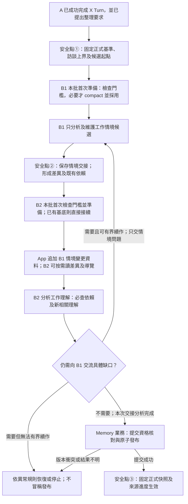

# B1／B2 資訊缺口交流與共同發布生命週期

- 狀態：Owner 已確認**目標效果與同工作接續**；設計稿／WORKING，非現行實作或施工授權。
- 決策者／最後核對：Product Owner／2026-09-29（在途批次依序發布、後續要求合併上界；同一候選、動態 read、三個安全點及候選關係規則不變）。
- 範圍：背景整理的分責與可見性、新批次 context／壓縮邊界、同批交流、系統恢復、候選保留與共同發布。本稿較早的「案例」指目標用語「工作情境」，不表示現行 `case_*` 程式已改名。
- 上游：[產品概念](../product-concept.md)、[架構導覽](2026-09-24-caliburn-layered-architecture-map.md)、[有效決策](../current-decisions.md) `PROD-G2-002／004／005／006／007`。007 是本輪 successor；錯誤分類策略及具體框架接線仍為候選。
- 詳細研究與現況反例：[Agent 能力／生命週期研究](../research/agent-systems/2026-09-25-agent-capabilities-and-lifecycle-patterns-research.md#b2-資訊缺口交流同一背景工作的接續比較2026-09-25目標語意已確認)。逐物件版本與引用鏈以[分層架構導覽的來源與版本](2026-09-24-caliburn-layered-architecture-map.md#來源與版本)為準，不在此重寫。

## 必須達成的效果

正常路徑是 B1 維護具體工作案例，B2 依案例分析工作理解，兩層一致後一次正式發布。B2 不是 B1 的審核員；資訊缺口交流只是分析工作理解時遇到需要補齊的案例資訊，不能變成每次發布前固定的「B2 驗收案例」關卡。B1 可在資料不足時如實寫已知與未知，不能為使 B2 通過而猜答；此種有效候選仍可發布，須員工釐清的問題交 A 後續訪談。

**007 已收斂：**名稱採「工作情境分析 Agent（B1）」及「工作理解分析 Agent（B2）」；分析包含持續修訂，並非另新增兩名 Agent。B1 不讀工作理解層，B2 不主動審核 B1；只有 B2 在自己的分析中確實遇到情境問題時才回交，B1 繼續處理情境，B2 繼續處理理解。使用者不能操作 Memory 的暫停、取消、重試或直接編修；中斷後恢復由系統承接，具體有界策略見後節候選。

同一次背景工作的**未發布候選集合**和本批來源涵蓋必須維持連續。若 B2 指出案例 A 少了某條件，處理 A 不得讓本批案例 B 靜默消失；B1 可依原話對 B 保留、修改、拆分、合併或有據不採用，但必須能說明其去向。這是業務連續性，不要求同一 graph checkpoint、原封不動複製草稿，或固定每項候選的臨時 ID。

## 候選操作、快照與三個安全點（目標已確認／未實作）

**操作頁只是理解模型，不要求做出供 Agent 點選的 UI。**同一職務檔案內，一批背景整理只有**一份邏輯上可修改的候選工作資料**。其訪談、工作情境、工作理解各有自己的物件與導覽；B1、B2 用各自被授權的工具讀寫這份候選，不匯出 B1 正文再為 B2 建另一份可寫副本。候選與已發布 Memory 分離；A／JD 只讀正式已發布版本。物理存放、快照重用、資料表、checkpoint 如何接線仍是後續實作選型，不由此要求全量複製或雙寫。

**設計授權界線：**本文定義產品須呈現的內容、模型可見的工具與結果、正常及異常生命週期；不指定資料表、欄位、交易／checkpoint 切法或實作元件。後續實作 Agent 先研究並驗證適合的做法，可自行決定效果等價的內部細節，不把資料表選型再變成 Owner 逐項裁決。只有證據顯示會改變已確認產品效果、資料權責、外送或重大成本時才先提出討論。這不是宣稱目前已實作或已通過驗收。

| 邊界 | 已成立的內容 | 對外效果及恢復 |
|---|---|---|
| **① B1 開始前** | 固定正式 Memory 基準、已完成且有效的本批訪談範圍及候選起點；B1／B2 各自已安全採用的起始 compaction 若存在，保留其結果。 | 本批尚未改正式 Memory；無法繼續整批時，放棄本批候選，回此業務基底，來源「已整理」進度不前進。已採用起始 compaction 不因此撤銷；①之後的輪中壓縮不得帶回①，也不因同批重試重做起始壓縮。 |
| **② B1 完成、B2 開始前** | B1 的候選情境狀態固定為可恢復的交接快照，App 由確切前後狀態形成情境變更資料；候選仍是同一份。 | 一般中斷可由此進入 B2，不重跑已完成 B1。② 不是已發布 Memory；B2 讀當前候選，不被鎖在②當時的靜態 map。 |
| **③ B2 完成後提交** | B2 對②交付的情境及變更完成理解分析，含判定無須修改的情況；目前候選的三層成員、內容及關係一起形成正式新快照。 | 原子發布後才對 A／JD 可見，正式來源進度及原結果一同成立；提交結果不明先查原結果，不重新發布。 |

**Step 級恢復與整批放棄分開。**B1、B2 都像 A 的 Step 一樣，可靠保存的原生模型回應、待執行工具、已成立工具結果與候選操作可在同批恢復；不能因節點重入重複一次業務效果。一般程序中斷從最近可靠位置接續，未有較細位置時可回①或②。若確認整批已無法恢復，則放棄本批尚未發布的候選與接續，回①的業務狀態；不是將整個資料庫、其他工作或已發布快照倒回去。②能節省一般 B2 中斷後重跑 B1 的成本，**不**把失敗的半批升格為正式 Memory。使用者沒有 Memory 的暫停、取消、重試或直接編修控制；有界系統恢復與最終失敗呈現另按錯誤策略設計。

**候選的操作頁語意：**

1. B1 可建立、改名、改描述／Markdown 正文、增刪原話關係及移除工作情境；B2 可讀情境及其來源，並同樣建立／修改／移除工作理解及其對情境的關係。兩者都可按權限回查有效訪談；B1 不能讀理解，B2 不能寫情境。沒有新資料時，B2 不必為了形成工具呼叫而假改正文。
2. 候選中的關係連到**同一物件身分**，不是模型每次手動綁定的新修訂號。B1 改情境的 title、正文或訪談來源時，既有理解→情境候選綁定仍指向該情境；B2 此刻的 read 沿同一關係看到當前情境。B2 明確 `add`／`remove` 才改自己的關係集合；不提供逐條 `confirm_reference_alignment`／`refresh` 換版動作。
3. B1 移除情境時，App 在**同一次候選操作**解除所有指向該身分的理解→情境關係；理解物件本身及其他關係保留。B1 不因此看見理解標題、正文或依賴清單，也不替 B2 決定理解是否仍成立；App 把情境移除與受影響範圍納入交給 B2 的變更資料。B2 可維持、修訂、重綁或移除理解。B2 移除理解不連帶移除情境或原話。已發布歷史與 JD 當時依據不被候選刪除改寫。
4. 候選允許尚無來源關係的情境或理解；不以「每個情境至少引用一則原話」「每個理解至少引用一個情境」作格式門檻。Agent 仍須如實寫已知、未知及可用依據，不得把無依據推測寫成確定事實。合法來源一旦被選取，App 仍核對身分、檔案、有效資格與本批上界；沒有來源與**假來源**是不同問題。
5. 每次授權操作由同一候選 owner 原子採用或拒絕；標題只作模型可見選擇值，App 解析物件身分，不用標題作 DB 主鍵。map 與 read **每次取當前候選**：B1 改名後情境 map 隨之變，B2 改理解後理解 map 隨之變。② 的快照服務恢復／差異比較，不是永久固定的 read 結果。B2 分析期間情境不變，是因 B1 不同時編輯情境，而非 read 工具只能回舊快照。

**B2 的工作不是逐條修引用格式。**App 交付 B1 的新增、移除、改名、正文及來源變更，連同既有依賴線索；B2 對目前候選的新版情境作語意分析，也留意沒有既有引用的新情境，必要時按需讀完整正文、來源與原話。B2 的「完成」表示它已依這份情境候選完成自己的理解工作，可有內容／關係改動，也可判定不用改；單純呼叫過 read、看到 diff 或沒有 update tool call 都不等於完成。正常路徑不需 B2 再交接一次即可進③；若分析確有情境問題，沿既定 B2→B1 例外交流，不把固定互審設為常態。若 B1 在例外交流後再次修改情境，B2 先前對舊交接狀態的完成結果不能冒充對新狀態完成，但 B2 已成立的候選編輯不因此全部丟失。

**發布快照與操作中綁定不同。**③ 將當前候選裡每個成員的內容與存在的關係固定為一版 Memory；同一物件身分在該版只有一份確定內容，沿任一路徑看到同一情境。若理解正文沒改但被引用情境的正式修訂變了，新的發布版不能重用一個會指向不同下層的舊理解修訂；如何有效保存新修訂由後續選型決定。B1／B2 正常操作已保持候選結構可用，完成後不增加另一輪模型「格式修補」或第二套發布前 validator；正式提交只確認完成、基準仍有效並原子固定結果。若候選操作或提交本身未成立，不宣稱③已發布。

**最小反例：**M7 中理解「庫存處理」綁定情境「例行盤點」。B1 在本批把該情境改名「月末盤點」，並修正頻率；候選理解的綁定仍是同一情境物件，B2 的 map／read 顯示新名及新內容，② 的差異指出改名與頻率變化。B2 判斷理解需否修改，完成後 M8 固定目前內容與關係；M7 仍回查舊名及原鏈。若 B1 改為**移除**此情境，候選理解的這條綁定立即解除，B2 看變更後決定理解的去留；不阻擋刪除、不連帶刪理解，也不讓 M7 的引用消失。全程不要求 B2 對保留綁定提交同名 `remove`／`add` 或逐條確認換版。

## 影響範圍與檢查責任（PROD-G2-006，目標已確認）

**既有依賴是必查集合，不是全部語意影響範圍。**B1 修改工作情境後，程式沿既有引用找出必須重新核對的工作理解；B2 還須分析新增、修改、拆分、合併或解除引用的意義，按需查相關情境／理解，判斷是否新增理解、修訂既有理解或調整支撐關係。沒有現成引用不等於沒有分析義務；也不代表每次重讀全部正文。若情境 C 不再支持理解 X，不能只解除引用便讓 C 靜默消失，仍須由 B2 判斷其應如何承接。

**判斷後仍可沒有上層引用：**若 B2 已分析某項有原話支持的情境，判定目前不足以支持既有理解、也不宜形成新理解，它可以作為正式 Memory 中未被任何理解引用的情境保留，供後續按情境導覽與來源回查。這與「完全沒分析就漏掉新情境」不同；發布驗證須確保現有引用都正確並且單版一致，但不得把「每個情境至少有一項理解引用」當成必要條件。

**分責與候選綁定（由上節最新決定補正）：**B1 可連續整理／修改情境，再交 B2 分析；B1 維護情境自身的原話依據，不讀寫理解。候選中 B1 修改情境不切斷理解對該物件的綁定；移除情境的確定性解除關係由 App 操作承接，不等於讓 B1 做理解語意判斷。B2 只對交接後的變更分析自己的理解，不因 B1 每一次中間修改反覆執行逐條版本核對；歷史已發布引用永不改寫。

**固定處理範圍不等於限制只能引用本批。**本批新增訪談是這次必須處理的範圍；B1／B2 可在各自職責內按需查同一職務檔案、不超過本批固定訪談序號上界的有效歷史訪談，以及下表允許的正式／候選層。2026-09-28 Owner 明確工具限制以訪談序號而非 Turn 編號，Runtime 自動注入，不要求模型看見或填寫控制上界；唯一契約見[固定序號上界](2026-09-27-memory-read-and-source-navigation-contract.md#memory-本批的固定訪談序號上界目標未實作)。B1 不因共用 Memory 基準而取得理解層；較晚的新輸入不在同一工作中途偷偷納入，延後啟動／回交／恢復也不重新取最新序號。已有引用不是尋找歷史原話的唯一入口，完整訪談定位能力仍依[產品概念](../product-concept.md#顧問看得到哪些訪談原話目標產品決策尚未宣稱已實作)。

**023／030 來源資格與觸發：**必處理範圍及歷史回讀遵循[輸入使用資格](../product-concept.md#輸入保存與-agent-使用資格目標未實作)，不得讀未完成／已取消輸入。依[030 及 2026-09-28 補正](../product-concept.md#訪談輪次與背景整理觸發目標未實作)，A 在 X Turn 依內容提出要求，X 成功完成後要求才成立，不等下一次員工輸入；資料上界固定在 X Turn 最後一則使用者輸入的正式訪談序號，不包含該輸入之後的顧問回覆。沒有其他在途工作時，從最新已發布進度之後至此上界啟動新批；已有在途工作時依[下述順序承接](#在途批次與新要求的交錯2026-09-29-目標已確認未實作)，不把已讀未發布當完成。App 固定處理範圍，模型不依輪數猜是否值得整理；歷史訪談依[共用讀取契約](2026-09-27-memory-read-and-source-navigation-contract.md#訪談訊息固定序號與回讀語境目標未實作)按訊息序號或範圍回查，不再限按輪向前讀，仍不引入搜尋。

**候選與發布安全點：**背景只取得已完成顧問 Turn 的有效訪談。兩層在同一工作內可讀寫的候選，不等於 A 可用的正式 Memory；「暫存／預覽」不表示 UI 已可預覽。①、②及逐 Step 可靠位置可供背景接續；只有③整版發布是對外完成點。無法恢復而放棄本批時，不留下半套正式版本或推進正式涵蓋範圍；已採用的起始 compaction 不重做。三個安全點的唯一詳細定義見上節，不要求永久保留每步完整快照。

| 責任 | 負責什麼 | 不負責什麼 |
|---|---|---|
| B1／B2 的分析 | 各自判斷是否忠於原話、條件是否不足、資訊有無衝突、支撐是否合理；必要時交流具體缺口，由各層 owner 修訂。 | 固定雙向審批、跨層直接代寫，或為結束交流猜出員工未提供的答案。 |
| Memory 操作／保存責任 | 每次操作核對權限、來源資格、目標身分及寫入效果，維持候選的綁定與刪除語意；由真實候選形成差異與固定交接，完成後原子發布快照。 | 替 B2 分析理解、第二套發布前格式修補、逐條引用換版工具或另存第二份可寫候選。 |
| Parent Graph | 承接工作及交接結果，依結果編排 B1、B2、發布或有界恢復。 | 第二套業務 validator、第二份正式 Memory，或自己猜測缺口已解決。 |
| PostgreSQL 保存邊界 | 承接交易、約束及條件提交，讓對外正式發布完整生效或不生效。 | 分析工作情境、決定理解結論，或以 graph checkpoint 代替資料庫提交。 |

上表是責任劃分，不要求新增部署服務或一層一個類別。B1 更新後，B2 不能沿用針對舊情境候選的完成結果；語意正確由各層 Agent 的分析負責，不是程式能保證全知的旗標。候選操作當下已維持結構，發布時不再引入第二套格式驗證；正式基準是否仍可提交，仍須在真正提交時成立。

固定雙向互審目前**不採為必經流程**。如未來代表性 eval 顯示額外 reviewer 能改善具體品質問題，再比較收益與成本；不是因框架能畫出回圈就加入。外部參考中的 gap JSON、節點名稱及「1～2 次」均非已核准契約。

## 讀寫權限與交接資料（007，目標已確認）

| 資料／操作 | B1 工作情境分析 | B2 工作理解分析 |
|---|---|---|
| 本檔案、本批界線內的有效訪談 | 讀；本批指定新訪談是必處理資料 | 使用共用訪談歷史工具按需回查，支持自己的理解分析；可讀已引用及未引用的有效訊息 |
| 工作情境 map／正文／引用 | 讀本批目前可見的最新情境工作稿；只修改候選情境 | 讀 B1 本次交付的最新情境工作稿；不能修改情境 |
| 工作理解 map／正文／引用 | **不能讀，也不能寫** | 讀本批目前可見的最新理解工作稿；只修改候選理解 |
| 完整 Memory 發布 | 不自行發布其中一層 | 不自行發布其中一層；由 Memory 業務邊界驗證後共同發布 |

候選讀取必須反映本工作已成立的修改，不能剛修改又只讀到舊正式版本。程式推得的既有理解依賴交 B2 處理，不把整份理解清單順便交 B1。工具只註冊各 Agent 被允許的能力，後端亦核對職務檔案、工作綁定及讀寫範圍；不能只靠 Prompt 說「不要用」。本表不預定工具名稱、參數 schema 或新增權限元件。

**模型讀取、候選綁定、發布修訂是三件事：**B1／B2 的 map 與物件 read 都給目前候選，不提供歷史物件正文的模型 read。理解候選對情境的關係跟隨物件身分；App 從開始基底或前次交接的確切狀態與 B1 完成狀態形成 diff，B2 依目前情境及必要原話判斷理解是否要修改、關係是否要增刪。保留關係不逐條核對版本；只有發布時才把本版選用的物件修訂與關係固定。B2 若例外交回 B1，仍從自己已成立的最新理解候選接續；B1 新改動會形成新的語意分析輸入，不要求 B2 讀舊正文或重做整層。歷史模型觀察不改寫，也不能冒充目前 read 結果。

**2026-09-28 B2 訪談回查確認：**Owner 確認 B2 沿用 A／B1 的共用訪談 read 能力，不另設專用工具；讀取原文以支持工作理解，不新增情境修改權、固定全文重讀或 B1 審核職責。按需時機、可讀範圍及待驗要求集中於[訪談讀取契約](2026-09-27-memory-read-and-source-navigation-contract.md#訪談訊息固定序號與回讀語境目標未實作)。

**B2 → B1 只傳可處理的情境問題。**例如「情境 C17 未區分協助盤點或負責盤點，請核對相關訪談；原話未說就保留未知」。不附理解正文、理解候選或 B2 的完整 reasoning，亦不要求 B1 評價某項理解。較早「影響哪項理解」的交接描述由本條取代；B2 自己保有該影響關係。B1 回交情境處理結果，B2 依 006 重評既有依賴與新語意關係。

權限適用於導覽、正文工具、交接內容、checkpoint 恢復及壓縮歷史，不只新訊息。舊 B1 視窗若曾包含理解層，不能 compact 一次就宣稱權限已隔離；正式切換前須確認可採用的歷史基底，不能改寫 opaque items 製造合規。本輪不遷移或刪除舊歷史。這是對 App 提供的理解層存取設限，**不是刪改員工原話中提到的理解或更正**。

## B1 變更資料與 B2 按需回讀（目標／未實作）

**2026-09-28 Owner 已確認的效果：**B2 的模型參考資料要能呈現 B1 改了什麼，並提供工具按需讀取相應差異；各層導覽也須能重讀，依[共用工具規範 §6.1](2026-09-27-agent-tool-contract-design-research.md#61-起始參考資料亦可按需重讀目標已確認未實作)。這補足「Runtime 知道目前候選」與「B2 看得到變化、能重新分析」之間的交接，不增加固定互審或 B1 對理解層的權限。

**資料內容的建議表示：**App 從真實的比較前後候選形成情境變更概覽，放入交給 B2 的 App 資料訊息；按需工具可讀完整的受影響欄位差異及必要前後文。概覽要可辨認哪些情境新增、刪除或修改，修改涉及 `title`、`description`、Markdown `body` 或結構化來源的哪些部分。改名顯示前後標題，App 按物件身分對照，不把改名猜成刪除加新增；正文未變但來源／引用版本變了，不能漏報。

例如情境「例行盤點」的 `body` 從「每月盤點」改成「每季盤點」，且新增一則更正訪談依據：B2 應可查到這兩種變更及原來／目前內容，而不是只收到「B1 已完成」或自行比較兩份完整 Memory。**供模型深入閱讀的差異內容採易讀 Markdown**，保留比較對象、改動位置及必要定位，不以冗長 JSON 重貼兩份全文；此例不定工具名稱、輸入參數或 Markdown 的精確段落格式。**讀取差異不是提交 V4A 編輯指令**，不要求兩者使用相同表示。

**2026-09-28 Owner 最新補正：上游差異必須看；深入閱讀仍按需。**B2 要知道既有理解原先依據哪個固定情境修訂／上次完成重評的候選階段，並在對 B1 固定的最終情境階段宣告完成前，**看到兩個基準間實際變更的差異**，不只是「B1 已完成」或改動數量；交接概覽須辨認改了哪些物件與哪些內容／關係，詳細長文差異可按需展開。這包括原本無引用的新情境，不能只列既有理解的依賴。B2 以新版情境為分析基準，按需深入當前情境／理解正文及歷史原話；概覽不足以判斷時不能省略必要的完整差異與正文。若所需差異已在接續 context 中可見，不要求為形式再呼叫一次 diff 工具；同批回交亦不要求逐次操作都重讀已掌握的差異。B1 可查自己情境層修改，B2 可查自己理解層修改；兩者仍依自己的 context 與真實工具回傳接續。不新增模型已讀／已理解進度，**也不能把工具被呼叫或 diff 淨文字為零當成語意完成證明**。本段取代較早「已有足夠資訊即可不看上游差異」的寬泛解讀。

**歷史候選已撤回：**前版建議首次以「已發布基準 → B1 候選」、回交後改以「上次交接 → 本次交接」比較。Owner 指出可由 Agent 按需查看，因此不採這套隨交接切換的特殊政策；也不把它保留為必須另行裁決的工作。diff 工具仍須明確說明查詢涵蓋的變更範圍與比較對象，但具體讀取語意留工具細設，不在此另定新的切換機制。

這是**兩個明確狀態之間的差異**，不是逐工具呼叫的操作流水帳；若需要「改過又改回」的完整過程，屬另一個尚未提出的稽核需求。這不改變既定物件版本身分或引用版本規則；差異不取代目前候選正文、固定來源鏈或程式提供的必查依賴，也不能只憑文字差異保證語意正確；B2 仍依 006 分析既有及新增關係。

**補正：淨差異不是完成重評的證明。**前句不要求保留逐次操作流水帳；但若 B1 在 B2 上次分析後把情境改了又改回，情境仍有新的修訂身分，B2 先前基於中間候選完成的理解不能直接沿用。交接須讓 B2 知道自其上次分析所針對的候選階段後，哪些情境身分曾變動；可比較物件修訂身分與候選階段，而不能只比較正文。按需 diff 可呈現指定兩個狀態的正文差異，即使淨差異為零，也不能據此回報「沒有待重評影響」。這是執行／候選 owner 的階段新鮮度與既有依賴責任，**不是模型的 diff 已讀游標、永久操作日誌或額外的模型工具必讀步驟**；階段保存與原交接恢復依[共用執行](2026-09-27-shared-agent-execution-and-state-design.md#4-共用機制a-與-memory-的工作政策分開)。

**接續與責任界線：**App 綁定本批、允許範圍及工具契約所需的比較依據，不要求 LLM 填內部版本、猜改動或另維護 diff。讀取本身不推進「已看過」游標，也不使已查看的變更消失；新的修改可以讓目前候選及其差異改變，但不能覆寫 context 中過去已取得的觀察。恢復沿用原工作與已保存位置，不把新狀態冒充舊結果。無法取得比較依據時，明示不能提供該差異，不回空差異冒充無變更。比較依據保留依[資料與交易](../architecture/persistence.md#6-保留失效與清理)；不另建 diff 資料庫、永久操作日誌或第二份可寫候選。

**正常流程：**B1 處理固定本批新訪談，按需修訂情境並回查相關原話 → App 固定最終情境候選，交接變更概覽、既有依賴與導覽 → B2 掌握上游差異，依新版情境按需讀詳細 diff／正文／來源並重評既有及新相關理解 → 程式核對兩層候選與引用鏈後整版原子發布。未變物件沿用原修訂，不要求重讀全部舊訪談或重寫全部物件；但「按需」不能讓本批新來源、未引用的新情境或尚未重評的依賴靜默遺漏。若需 B1 再處理，沿同批接續重新交接，不重做輪前 compact；160K 保險另依共用執行。既有歷史觀察不被新版覆寫；B1 私人 reasoning 不作 diff，也不交給 B2。這是[全產品分層按需分析原則](../product-concept.md#分層按需分析與下游重評目標已確認未實作)在 Memory 批次的完成邊界，不把 JD 的逐項核對時序套入本發布 gate。

**驗收要求（未執行）：**新增、刪除、改名、正文修改、僅來源變更均可辨識；同名歷史不混成同一修訂；B1 回交後 B2 可讀新差異；相同比較重讀與恢復不變成空集合；概覽省略的細節可按需讀回；未發布候選的 diff 不外露給 A、不讓 B1 取得理解；B2 仍分析無既有依賴的新情境。若比較基準或回傳量選擇會改變這些效果，先提出取捨，不默默截斷或切換到全域最新。

### 差異讀取的最小工程契約（2026-09-29 推薦／待實作驗證）

為避免細設時再猜比較端點，推薦使用**本批共同起點快照 → 目前可見候選**作固定語意。讀取不消耗差異、不維護已讀游標；不採上方已撤回的「首次一種基準、每次回交又切換基準」政策。B2 的理解候選可在同批持續保留，來源差異不因它改過理解就消失；它依原生接續與實際工具結果知道已做過什麼，不需要再確認每條候選綁定。

| 建議工具 | 模型輸入 | 結果／可使用者 |
|---|---|---|
| `read_work_situation_changes` | 無目標時 `{}` 讀概覽；指定 `target_title` 時讀相關完整差異 | 概覽為精簡 JSON；詳細為 Markdown。B1 可讀自身情境變動，B2 可讀上游變動；只有 B2 的投影附受影響理解線索，不洩露給 B1 |
| `read_work_understanding_changes` | 同樣 `{}` 或 `target_title` | 只供 B2 讀自己理解層的變動，不提供給 B1／A |

兩工具共用底層快照比較，並非新 diff 儲存、操作日誌或第二套框架。`target_title` 只篩選此比較中修改前／後的標題，不解析為歷史物件讀取授權。刪除以原標題可找到差異；改名含前後名稱。若標題在本批重用而匹配多筆變更，**唯讀差異全部分項返回**，明確區分刪除／新增，不能合併成同一物件或默默選第一筆；後續寫入仍依當前 map／read 的作用域。模型不填版本、batch、快照或 cursor。strict wire 的可選欄位表示依共同工具規範驗證，不把省略改成全量正文必讀。

供模型閱讀的詳細結果示例：

```markdown
## 工作情境變更：例行盤點 → 月末盤點
比較：本批開始前 → 目前工作稿；此為資料差異，不是編輯指令。

### 標題
- 原：例行盤點
- 現在：月末盤點

### 正文／執行頻率
- 原：每週進行一次。
- 現在：每月進行一次。
保留脈絡：異常交由主管確認，本人不決定庫存調整。

### 訪談引用
- 新增：訪談序號 28
- 保留：訪談序號 8

### 受影響理解（僅 B2 可見；不是全部語意影響範圍）
- target_title：庫存核對與異常回報
需要完整內容時，讀目前情境「月末盤點」及相關理解。
```

新增情境回「本批開始前不存在 → 目前已存在」，詳細讀可呈完整新增正文及來源；刪除回移除的內容／綁定效果。純正文節錄必須含可辨識段落與必要上下文，不省略該項其他已變欄位；過大時明示不能完整交付，不悄悄截斷或宣稱已分析完。

**固定淨比較與交接新鮮度是不同用途。**例如 B2 曾看過「每週」，B1 後來改回本批起點的「每月」，淨正文差異可能為零。Parent／業務交接已有的固定候選位置須指出哪些情境修訂相對前次交接曾改變，以及相關理解需要重新分析；概覽明示「修訂有變化，與本批起點淨文字相同」。這不改詳細 diff 的共同起點，不新增模型已讀／已理解台帳，也不拿零差異當完成證明。需要細節時 B2 讀目前情境；已保存的先前觀察仍在原生歷史，不能改寫。

同工作恢復已完成的 diff call 時承接當時結果，不重查最新後冒充舊觀察；**新呼叫**才以當時可見候選重新投影。比較端點不存在或被不當清理就回無法比較，不回空差異。具體快照保留與接續參照見[資料與交易](../architecture/persistence.md)和[共用執行](2026-09-27-shared-agent-execution-and-state-design.md)。

<a id="b2-重評完成後的候選引用綁定目標已確認未實作"></a>

### B2 完成與候選關係（目標已確認／未實作）

候選的理解→情境關係跟隨情境物件身分；B1 改其 title、正文或來源後，關係在目前候選中仍成立，B2 read 得到新版內容。**`confirm_reference_alignment` 逐條換版已撤回，不是待補的工具欄位。**B2 只在要增刪關係時使用 `add`／`remove`，不以重加同名來表示看過新版。App 固定交接狀態並提供 B1 差異與受影響線索；B2 分析情境變化對理解的意義，含尚無引用的新情境。若判定正文／關係不須改，仍可完成；「完成」指已完成自己的分析，不是逐條引用格式檢查。

若 B1 後續因例外交流再改情境，B2 先前針對舊情境狀態的完成結果不適用於新狀態；已成立的理解候選編輯可保留，B2 依新的變更資料接續分析。情境移除時 App 同次解除候選關係，不阻止 B1 操作，也不自動刪除理解；B2 決定受影響理解的去留與內容。例：情境由「每月」改「每週」再改回「每月」，不能只見淨文字相同就省略 B2 對實際交接狀態的分析；但也不因此建立永久逐操作日誌或要求模型讀舊版全文。

發布後關係才固定至所選修訂，歷史已發布快照不改寫。若理解正文不變、下層所選修訂已改，新的正式快照仍須能與先前的理解修訂及來源鏈區分；這由發布表示承接，不由 B2 手動填版本或確認每條邊。完成表示、保存、資料表及嚴格工具 schema 仍待後續實作設計；本節確認的是功能語意和反例，尚未驗收。

## 新批次與 Compaction 邊界（目標已確認）

「新批次」是一次新的背景整理工作，不是一次 model request、進入某個 node、重啟程序或 B2 向 B1 回交問題。每批固定 Published Memory base 及本批必處理的有效訪談範圍；未發布候選只在本工作內接續，完整版本才對外可讀。

**2026-09-27 Owner 同日補正：開始前必做的是門檻檢查，不是每批必定 compact。**取代本稿上一版的無條件壓縮；未達門檻便完整沿用既有有效視窗，達門檻才壓縮。可評估較低門檻，但數值、計量範圍及 B1／B2 是否採相同設定仍待討論，不把「通常 context 很大」當成已達門檻。

**2026-09-29 引入、2026-10-01 門檻校準：B1／B2 常規壓縮在各自 Turn 開始前，另各有 160K 中途保險。**這裡 Turn 是該 Agent 在本批的整段分析工作；B1 → B2 → B1 → B2 仍是同批接續，不因回交重做輪前準備。輪前檢查各一次、0 或 1 次採用的規則保留，但不再限制整批只能壓縮一次；完整 Step 後達 160K，才可在下次模型請求前主動壓縮。不得在模型／工具執行半途插入。唯一共同規則見[共用執行 §6.3](2026-09-27-shared-agent-execution-and-state-design.md#63-輪前主動壓縮與中途保險)，不啟用 server-side 自動路徑。

| 時點 | B1／B2 的壓縮政策 |
|---|---|
| Agent 第一次執行，沒有任何歷史視窗 | 不呼叫 compact，不製造空摘要；Owner 已確認此例外。 |
| 新批次，該 Agent 已有歷史視窗 | 首次分析前檢查門檻；未達則完整沿用歷史，達門檻才壓縮自己的完整有效歷史，安全採用全部返回 items。兩條路徑都在此之後追加本批工作資料。 |
| B1 完成、B2 本批首次開始 | B2 若尚未準備本批基底，此時檢查自己的門檻，必要時完成壓縮；不能壓縮或繼承 B1 的私人 trace。 |
| B2 回交 B1、B1 再交回 B2 | 仍是同批接續，不重做輪前 compact；保留各自歷史、候選及固定來源。達 160K 的中途保險依完整 Step 邊界處理，不把回交當新 Turn。 |
| 程序中斷後恢復同一工作 | 查回已採用的壓縮基底與後續進度，不因重新進入而再次付費壓縮；採用不明則先核對，結果未保存不保證找得回。 |
| 同批內 Step／工具往返 | 完整 Step 後、下次模型請求前檢查 160K 保險；工具未配對或效果不明時不壓縮。不啟用 server-side 自動兜底。 |

**工程排程選擇（2026-09-29，未實作）：**到各方本批首次進場前才檢查門檻及按需壓縮，不在 B1 尚未完成時先付 B2 壓縮費。一方本批已確定的接續基底重用，B2 回交不是新起點；未壓縮也不重新執行輪前準備；中途達 160K 的例外另依共用執行。這是在已確認時點內選擇較少無效工作，不新增產品行為。

**輪前壓縮的前後界線：**達門檻時，送入 compact 的是該 Agent 先前的完整有效接續視窗；本批新 map、指定訪談及新工作資料在壓縮完成後追加，不先把這批尚未分析的原話壓掉。採用完整 `compacted.output`，不僅取其中一個摘要／opaque item，也不重複附回舊視窗。未達門檻則在完整舊視窗後追加相同的新資料，不另刪減歷史。歷史中的 map 與候選觀察只是當時內容，本批正式基準／候選須由新資料及受控工具辨認；不改寫歷史冒充最新。 **輪中例外不能重套本段起始組裝：**只承接當前完整有效視窗的全部壓縮返回，不重塞初始 map／指定訪談、不刷新來源範圍；候選 read／map 仍依原契約讀當前工作稿。

## 各 Agent 的 context 與工作輸入

| 順序 | B1 | B2 |
|---|---|---|
| 1. 接續基底 | 未達門檻沿用完整有效歷史；達門檻採用完整 compaction 返回視窗；首次無歷史則無此前綴 | 未達門檻沿用完整有效歷史；達門檻採用完整 compaction 返回視窗；首次無歷史則無此前綴 |
| 2. App 工作資料訊息（`user`） | 工作情境 map＋限定範圍的完整有效訪談及必要工作說明 | 工作情境 map＋工作理解 map＋B1 情境變更資料及必要工作說明；差異詳情與兩層正文按需讀取 |
| 3. 後續同批接續 | 原生模型輸出、工具請求／結果、必要的情境問題交接 | 原生模型輸出、工具請求／結果、B1 回交後的新變更資料與重新分析 |

背景的 `user` role **不等於必須有一則新員工輸入**。建議由 App 提供批次工作資料，B1／B2 不直接訪談員工、不偽造一則人類指令或寫入聊天原話；真正訪談來源保留原角色、正式訪談序號及訪談原文等可核對脈絡。此建議不新增長期工作筆記欄位或第二份來源 authority。

**2026-09-28 Owner 補充：B1 也提供與 A 相同的訪談 read tool。**本批必處理資料由 App 固定並提供，不要求模型自行填寫或變更工作範圍；但 B1 按需回讀時，同樣可選訪談序號、指定多則訊息或範圍。共用契約與回傳內容由[來源回查文件](2026-09-27-memory-read-and-source-navigation-contract.md#訪談訊息固定序號與回讀語境目標未實作)維護，不另寫 B1 專用格式。App 注入檔案與本批可讀上界，模型的查詢選擇不是更改整理範圍；可查更早有效歷史，不可納入截止之後或未完成／取消輸入。較早的無參數固定範圍 Read 說明不代表 B1 只能讀整批，也不作新增專用工具的依據；固定範圍重讀沿同一 read_interview 分支，不新增專用工具；App 保留範圍供模型定位。已在 context 的內容不要求每 Step 重讀，不新增來源儲存。

**片段前置語境：**較早「前一有效輪的顧問正式回覆」比較保留於[歷史候選](2026-09-26-consultant-context-and-state-design.md#按輪回讀與前置語境候選待確認)，不作目前工具粒度。有效方向沿來源回查契約：按訪談訊息定位，保留序號、說話者與訪談原文；B1 起始資料的前問及 K／F 精確起訖依[來源契約](2026-09-27-memory-read-and-source-navigation-contract.md#起始訪談範圍與前置語境工程設計未實作驗證)，不以模型 Turn 作來源單位。附加語境不改本批必處理範圍與發布進度，不擴大 B1 的理解層權限，也不保證一則回覆能解決所有跨訊息指涉。

App 加入的 map、訪談及交接資料使用 `user`，共通信任邊界見[context 設計 §3.1](2026-09-26-consultant-context-and-state-design.md#31-app-資料訊息與原生項目的權限邊界目標已確認)。工具實際回傳仍為原生 `function_call_output`；reasoning、compaction 及 assistant items 不改成 `user` 文字。模型須知道來源內容是分析材料，不因文字中出現命令便取得額外權限。

## 時序與權責（目標，不表示現碼已通過）

| 時點 | 負責者與可見資料 | 成立條件 |
|---|---|---|
| 前置：A 提出整理意圖，尚未交給背景 | A 依訪談內容決定值得整理；App 依 A 的完成生命週期承接要求。 | 未完成或被替換輸入的排除由 App 准入負責；不把棄用嘗試算成有效訪談輪次，也不交給 Memory 處理取消。 |
| 1. X Turn 成功完成後承接要求 | App 固定該要求至 X Turn 最後一則使用者輸入的正式序號；若同檔案無在途 Memory 批次，依最新已發布基準啟動；若有，依下節保留待處理上界。 | 不含該輸入之後的顧問回覆；不等下一次員工輸入、不等背景完成才結束 A，也不因延遲啟動擴大**已在途批次**上界。完成交易保存待處理上界，重開重新掃描；接線依[資料與交易 §5](../architecture/persistence.md#5-背景要求不能只留在記憶體)。 |
| 2. B1 整理 | 依本稿開始前壓縮政策準備 B1 私有基底，追加情境 map 與本批有效原話；建立或修訂情境候選、來源涵蓋及必要未知。 | 不讀理解層；候選尚不對 A／JD 開放。來源已被實際閱讀、妥善承接，不能只靠 cursor 宣稱事實已釐清。 |
| 3. B2 分析 | 準備 B2 私有基底，追加情境及理解 map 與 B1 情境變更資料；按需讀差異、候選、程式找出的必查依賴及原話，分析既有與新語意關係。 | B2 不直接改寫情境，也不主動做 B1 的涵蓋審核；查不到既有依賴不能跳過新情境。 |
| 4. 僅在需要時交流 | B2 只告知可定位的情境問題／所需條件；B1 不看理解內容，只核對原話與自己的候選，有據則補，無據則在情境記未知。 | 同批回交不重做輪前 compact；160K 保險另依共用執行、不重新初始化本批；其他候選保留或有明確處置。交流與恢復有界，不無限來回。 |
| 5. B2 重評與共同發布 | B2 依 B1 最後交付的情境完成既有依賴與新相關理解分析；Parent 將本批及該交接完成結果交給 Memory 業務。業務核對當前完成資格與正式基準，在短交易中固定候選並發布。 | 每次 CRUD 已保護範圍、結構與綁定，發布不是再叫 Agent 修格式的第二套 validator。未完成或已失效的交接不能冒充完成；如實記錄未知不阻止發布。 |

下圖只畫**同檔案無在途批次時，已成功完成且帶有整理要求的 X Turn**；有在途批次的承接另見下節。Turn 只決定要求資格，取材上界是該 Turn 最後使用者輸入的正式訪談序號，完整規則由 [030](../product-concept.md#訪談輪次與背景整理觸發目標未實作)維護。此圖表示已確認的目標責任流程，不是 LangGraph node／tool 的實作清單；背景整理本身的失敗細節由下一節承接。



圖例：實線表示控制／結果交接，①②③是業務安全點，不是每個 Graph node。每次 CRUD 仍在操作時保護權限、引用身分及原子性；圖中發布不新增語意 reviewer 或格式修補回圈。所有 Step 的中斷核對沿共用執行；完整安全點不代表只有這三處才能恢復。

圖中的 gap 是 Agent 分析的交接結果，不是由程式一致性檢查猜出的語意問題；有未知不必走回圈。B2 交接所需的是具體缺口與可核對依據，不是完整隱藏推理。來源不足而如實保留未知，與真的整理中斷或候選無效，依下節分開處理。

準備方框表示一次性的本批基底準備，不要求新增 node；圖示採「到各方首次進場前檢查門檻」候選排程。B1 回交後再經 B2 準備方框，只核對已有基底，不重新觸發壓縮。中斷後系統依已保存位置續作，不一律重走 START。

## 異常與交錯情境

### 在途批次與新要求的交錯（2026-09-29 目標已確認／未實作）

**同一職務檔案的 Memory 批次依序發布，批次來源上界一經固定就不再擴張。**在途 B1／B2 不因 A 後續要求被取消或重跑；新要求須等其 A Turn 成功完成才成立，App 承接其序號上界。後續多個已成立要求可合併為最大待處理上界，而非每個要求各跑一批。前批成功發布後，若正式涵蓋已達該上界，無須再啟動；否則下一批由**新已發布 Memory**與剩餘有效來源開始。若前批最終失敗，不推進正式涵蓋，待處理要求不能越過該未發布區間；阻塞解除後由最新已發布基準承接整段。A 訪談不等待 Memory 發布，其他職務檔案不因本檔案在途批次而被禁止工作。

例：M5 已涵蓋至訊息 20，J1 固定 21–40；執行期間 A 又成功完成要求至 46。J1 仍只處理原範圍；若它發布至 40，下一批處理 41–46。若 J1 失敗，正式進度仍是 20，後續不能只處理 41–46。這裡固定的是**範圍與生效語意**，不是 queue、資料表、每次通知的獨立工作身分或工具回傳格式；重啟、去重、提交不明及解除阻塞的具體接線留實作設計。

[Microsoft 的背景工作指引](https://learn.microsoft.com/en-us/azure/architecture/best-practices/background-jobs)提醒重疊執行、重複觸發及冪等性風險；**依序處理與合併上界是 Caliburn 為固定來源及整版發布所作的產品取捨**，不是該指引指定的唯一排程，也不因此預選訊息佇列。

- **原話仍不足：**B1 在案例保留已知、未知與依據；B2 不將未知提升成穩定理解。若整版其餘條件有效，可以發布；A 在後續訪談處理需員工回答的問題，背景工作不懸停等員工。
- **過程中斷或交流耗盡：**從已保存的工作進度恢復或進入可診斷的最終失敗；未發布候選仍非正式 Memory，來源進度不得推進。已自動恢復的暫時故障不用逐次通知 A；最終未恢復且來源仍未涵蓋時，A 需看見安全的原因及下一步。
- **最終失敗不直接阻斷 A（2026-09-29 目標補充）：**A 仍可使用最新已發布 Memory 和未整理的有效訪談；近期原話預載超量時依[產品概念的超量例外](../product-concept.md#顧問看得到哪些訪談原話目標產品決策尚未宣稱已實作)按需回讀。App 不把舊版冒充新版；使用者收到不含技術細節的未完成狀態。是否與何時恢復背景工作仍循本節有界系統策略，不交使用者控制。
- **發布結果不明：**先查原發布結果；完整新版本已成立，就承接該安全點，不能因 Graph 未記到成功而撤銷或再發布。未成立且決定放棄，才捨棄本工作候選；不能回退其他已完成工作。這沿用 022 的原結果核對保證，並非新增第二套收據。
- **正式 head 在處理期間意外改變：**正常同檔案批次已依序發布，但提交邊界仍須核對基準；舊基準上的整版候選不得只替換版本號就發布。依新正式基準重新核對並有界續作；哪些候選可作重新分析的輸入，須在後續實作設計與測試中確認，不能把它們當已發布事實。
- **新更正晚於本次固定範圍：**本次即使成功，也只能宣稱涵蓋原先固定的訪談範圍；後來的更正留在原始訪談和 A 的延續狀態，待後續相應整理，不因舊工作的成功而清掉。

## 待施工前設計與驗收

### 系統恢復與不可解決問題（策略候選，待討論）

**2026-09-29 工程 successor：**標題保留供舊連結定位；下表的故障分類已由[共用執行 §6–7](2026-09-27-shared-agent-execution-and-state-design.md#6-錯誤處理共用分類策略有界)承接為工程設計，不再等待 Owner 決定同一套錯誤語意。系統負責、不開放使用者管理 Memory，不等於無限重試承諾；次數、延遲、費用初值屬實作計畫的有界配置。「受阻」不要求新增佇列或通用熔斷器。

| 情境 | 建議的系統處理 | 不允許混淆的事 |
|---|---|---|
| 短暫網路中斷、部分 5xx、速率限制 | 先核對可取得的原結果，再由單一恢復政策控制有界退避／重試；已有模型輸出或工具結果優先重用 | 不讓 SDK、Graph、外層排程各自無上限疊加；重試次數也計入費用 |
| API 額度／支出上限、無效金鑰或權限 | 保留可恢復位置與舊正式 Memory，停止無效模型請求；呈現安全原因與需修復的外部條件，條件恢復後由系統接續 | 不把相同 429 都當限流；加值／修設定不是使用者直接操作 Memory 的重試按鈕 |
| 開始前已無法容納歷史 compact 或本批新資料 | 先檢查實際模型容量、工具定義及輸出預留；無法滿足就不冒稱開始成功 | compact 的輸入也有 context 上限；不能默默刪原話、改本批 frontier 或改模型 |
| 同批 context 增長或超限 | 完整 Step 後先依 160K 保險主動 compact；若 compact 本身／結果仍不能容納，保留候選與恢復進度，停止重送相同超量請求，指出具體容量缺口 | 不在半個 Step 強壓、不偷偷稱回交為新批次、不無限重壓；拆批、重建工作或換模型須另定政策 |
| 結構／引用錯誤、程式錯誤或交流無法收斂 | 依既有責任作有界修正；耗盡或不能修時保留原因，不發布、不推進涵蓋範圍 | 原話未提供答案與技術錯誤不同；如實記未知可以是有效成果，不反覆要求 B1 猜答 |
| 正式發布已提交但回應遺失 | 查原操作結果，讓 Graph 承接同一正式發布 | 不因 checkpoint 未前進而多發布一次、回滾正式版本或新增另一套回執 |

暫時故障已自動修好不逐次打擾 A；仍影響來源涵蓋的最終未恢復問題，沿既定規則讓 A 知道安全原因及下一步。舊正式 Memory 仍可讀，候選不可冒充新版；長時間受阻導致新訪談累積的容量風險須如實顯示，不能宣稱 A 可永遠無限續談。條件改變或受控健康檢查才重評，避免反覆付費探測；新訪談不重置失敗預算，策略以共用執行為唯一詳細 owner。

**共用機制，不共用工作狀態。**建議 A／B1／B2 共用 OpenAI 原生輸出接續、工具配對、原結果核對及 compact 安全採用的程式機制；各自保持 context、工具權限、候選及完成條件。Memory 不照搬 A 的使用者暫停／取消介面。框架提供的 State／Checkpoint／subgraph 是優先候選，不因共用機制新增通用 Agent 引擎或第二套 persistence。

### 官方依據、產品取捨與驗證限制（2026-09-27）

- [LangGraph subgraphs](https://docs.langchain.com/oss/python/langgraph/use-subgraphs)提供獨立 state schema、明確 I/O 轉換，以及 per-invocation／per-thread 等持久化模式。它們可承接 B1／B2 私有歷史，**不是資料權限保證**。若每次 B2 回交都啟動空白子圖，仍可能違反本案同批接續；具體 namespace／checkpointer 模式要用鎖定版本驗證，不把跨次呼叫持久化直接等同跨批無條件混用歷史。
- [OpenAI standalone compaction](https://developers.openai.com/api/docs/guides/compaction)要求承接完整返回視窗，且 compact 輸入本身必須能放入模型窗口。**新批次開始前依門檻判斷是本產品政策，具體門檻不是官方已替本案選好的值**；之後須量測歷史、本批新資料、工具及輸出／推理預留，連同成本與延續品質比較，不直接指定較低數值。
- [OpenAI API errors](https://developers.openai.com/api/docs/guides/error-codes#api-errors)區分速率與額度／支出限制，後者靠重送不會恢復；[Azure Retry pattern](https://learn.microsoft.com/en-us/azure/architecture/patterns/retry)建議依暫時／永久錯誤與冪等性決定有界重試，避免層層重試放大。本表借用這些錯誤處理原則，不引入 Azure 服務或宣稱已選精確重試常數。

本輪只研究及維護目標文件，沒有 provider、checkpoint 或 PostgreSQL 故障注入證據；不是 production 已滿足新權限或恢復政策。

**已完成架構映射、待驗證接線：**候選 owner 與保留依[資料與交易](../architecture/persistence.md)，程序重開、原結果補接、交接資格與工作限額依[共用執行](2026-09-27-shared-agent-execution-and-state-design.md)。舊交接失效後 B2 沿目前候選重新分析，不清掉其先前合法修改。現行 `case_rework_required` 另起 B1 attempt 可能漏掉其他未發布案例，是已證明的現況反例；不能照搬，也不能把本文映射當已驗收。

### 下一層：State、工具與保存邊界（候選，不是欄位／資料表契約）

本輪先沿已選的 LangGraph＋OpenAI direct Responses SDK 提出責任映射。共通接續與框架接線的後續候選由[A／B1／B2 共用執行設計](2026-09-27-shared-agent-execution-and-state-design.md)維護，包含 per-thread 子圖、逐模型／工具恢復的比較及首版取捨；較早的[顧問 State 設計 §7](2026-09-26-consultant-context-and-state-design.md#7-state-責任與生命週期候選先找使用方再決定表示)保留責任與恢復保證。不另建一套 Agent Runtime，也不採 LangChain 應用封裝；007 已確認政策不因候選映射改變。

| 需要交接或恢復的資訊 | 建議承接位置／使用方 | 必須守住的界線 |
|---|---|---|
| 本工作身分、職務檔案、固定基準及必處理來源範圍 | App 建立執行綁定；Parent State 承接下游所需參照。 | 程式提供，不交模型編號或改範圍；可推得的值不另存可獨立修改的副本。 |
| B1／B2 各自的模型接續歷史 | 各 Agent 的私有執行狀態，以框架 checkpoint 承接恢復。 | 不把兩者歷史合成一份；私有不等於不能保存。輪前準備依 007，中途 160K 保險及保存／恢復交界依共用執行 §2／§6.3，實作後驗證。 |
| 工作情境／工作理解候選 | 由 Memory 業務持有共用候選，各層 Agent 經受控工具修訂；State 留可查回的精確位置。 | 只有一個候選權威，依資料與交易的比較結果，不同時造兩份可寫草稿。 |
| 資訊缺口與處理結果 | 供 B1 定向核對、B2 接續分析及 Parent routing 使用，限本工作必要交接。 | 最少包含情境定位、具體問題及所需釐清內容；App 綁定本批／交接，B1 修改後舊完成資格失效。結論不是完整 reasoning，不知道仍可記入候選，不新增永久待辦系統。 |
| 已發布版本與發布結果 | Memory 業務／保存邊界為真相；Graph 只承接查回結果或參照。 | checkpoint 顯示完成不等於 DB 已提交；DB 已提交但 checkpoint 未保存時，先查原發布結果，不盲目重做。 |

**實作次序建議：**先定 B1、B2、Memory 業務邊界各自收到與交付什麼，再決定哪些節點需可恢復、哪些資料需進 State，最後定 tool schema 與 DB 形狀。採 parent 明確交接、子圖保留私有歷史作候選；不採所有歷史／候選／正式結果皆可在一個大 State 自由改寫的做法。這是本案映射，並非 LangGraph 強制使用某種 schema。

**下一個機制 gate：**依共用執行 E10／E12 驗證「B2 回報情境 A 缺條件，B1 補 A，其他候選 B 保留；其後中斷再恢復」及「Memory 已提交、Graph 尚未保存結果即中斷」。交接值與 owner 已由本稿及系統介面契約定義，後續實作設計映射成 State／node／tool／DB 並證明效果；不是再請 Owner 猜保存位置。本輪不執行上述測試，不宣稱現行已符合。

**驗收情境：**同一固定來源產生案例 A、B；B2 形成某項理解時只缺 A 的條件。B1 可依原話補 A 或記未知，B 保留或有據處置；B2 重評自己的理解；發布前 A／JD 看不到候選，發布後版本與引用鏈一致。再分別覆蓋中斷後恢復、交流耗盡、正式 head 變動與較晚更正，核對是否只推進真正涵蓋的來源。離線控制流、真 PostgreSQL 重開與模型語意要分層驗收；不能以其中一層通過冒稱整體完成。

**2026-09-29 在途要求驗收情境（未執行）：**J1 固定 21–40 時，成功完成的 A Turn 要求至 44、後一完成 Turn 要求至 46：J1 的取材上界仍是 40，發布後只需以新 Memory 基準承接剩餘 41–46；不為兩次通知各跑一批。若新要求上界不超過 40，J1 成功後沒有多餘批次；若提出要求的 A Turn 被取消，該要求不成立。J1 最終失敗或發布結果暫不明時，不得把 21–40 當已發布而只整理 41–46，須先核對原發布結果及正式涵蓋進度。

**006 補充反例：**新增情境尚無任何 understanding relation，仍須由 B2 分析其用途；既有情境解除某理解引用後不可靜默遺失；情境拆分／合併後，既有依賴與新的語意關係均須妥善處理；本批 21–27 輪可引用第 14 輪，但不得納入第 28 輪；B1 最後修訂後不能發布仍依舊候選版本完成的 B2 結果。這些是待驗的目標條件，不是已發現的新增 production bug。

**007 新增驗收要求（未執行）：**B1 的導覽、工具、交接及恢復視窗均拿不到理解層；B2 情境寫入被拒而理解候選可讀寫。首次空歷史零 compact；未達門檻零 compact 且完整保留歷史；達門檻才在首次分析前壓縮並採用完整返回視窗。同批 B2 → B1 → B2 及重啟不重做已採用壓縮，只有完整 Step 交界達 160K 才走中途保險，不能重加起始資料。本批必處理資料保持固定；B1 具備共用按序號／範圍訪談 Read，較早有效訊息可回查，截止之後及未完成／取消來源不可讀，不因選取查詢而變更本批範圍。額度不足不重送到耗盡上限，限流則走有界恢復；中途保險原生接續可恢復、回退不承接被放棄的輪中 C；真正超限不丟原話；任何未發布失敗不推進來源涵蓋。App 資料訊息是 `user`，原生 output／function 配對未改型；工具內容中的指令不能獲取被禁止的層。輪前門檻／重試常數由後續實作計畫列明測試初值及範圍，不冒充已確認數值；安全效果不能待量測時再猜。

本設計的框架依據限於機制：[LangGraph 的分步與 State 原則](https://docs.langchain.com/oss/python/langgraph/thinking-in-langgraph)及[Subgraph 狀態交接](https://docs.langchain.com/oss/python/langgraph/use-subgraphs)支持跨步驟明確傳遞必要資料；它們不替本產品決定案例去向、理解結論或發布語意。[Anthropic 的 agent 工作流比較](https://www.anthropic.com/engineering/building-effective-agents)亦未要求把 B2 設成案例評分者。公開頁面查閱於 2026-09-25；進入具體接線前仍須核對本案鎖定版本與實際行為。

**2026-09-26 補核：**[LangGraph State 指引](https://docs.langchain.com/oss/python/langgraph/thinking-in-langgraph#step-3-design-your-state)建議依跨步驟使用需要保存資料，可推得的內容按需計算；[checkpointer](https://docs.langchain.com/oss/python/langgraph/checkpointers)提供 super-step 狀態保存與恢復，不替本產品選擇候選 authority。[PostgreSQL 交易](https://www.postgresql.org/docs/current/tutorial-transactions.html)提供提交的原子性與可見性；它不保證模型理解正確，也不自動把 framework checkpoint 和業務提交變成同一交易。本輪核對的是官方公開機制，沒有選定套件版本、證明跨儲存一致性或執行 provider／資料庫測試。

**決策接續：**006 補精確 002／004／005，不重開三層責任、有效未知可發布或同工作候選不遺失。下一步只細化上述資料交接與恢復反例；如要增加固定 reviewer、改變資料可見範圍或改變發布／恢復承諾，須有新證據與 Owner 裁決，不能由候選 State 圖暗中決定。
