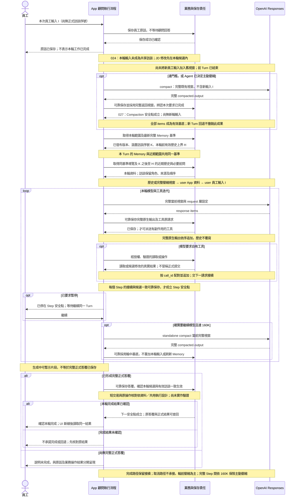
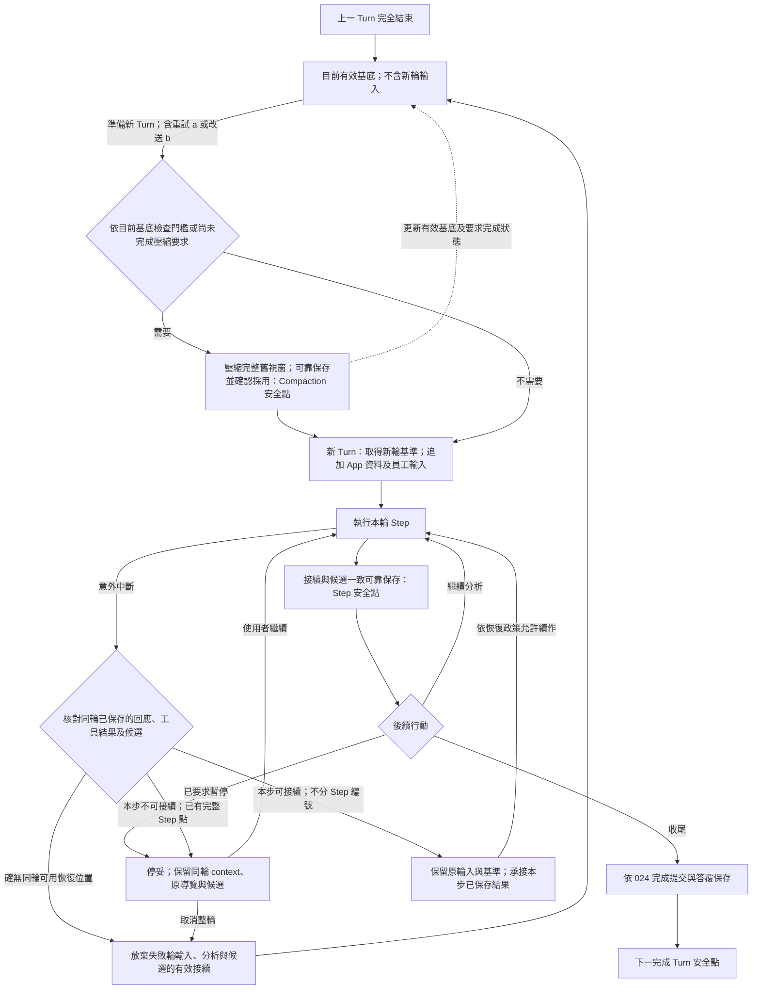

# 職務顧問的上下文與分析延續（目標架構討論稿）

- 日期：2026-09-27；最近核對：2026-09-29（JD 導覽改為按需取得，補明定位投影；未改 Memory 與訪談起始範圍）。
- 狀態：**目標／WORKING；概念對齊與責任設計，非施工契約。**已確認的產品政策由上位文件維護；PROD-G1-022 已採納 §7.2 的三項目標恢復保證，未實作、未驗收，其餘責任整理、流程推演與實現候選仍供後續核對，不因寫入文件而自動定案。
- 維護責任：Agent 架構討論；涉及產品效果的取捨由 Product Owner 確認，工程協作者負責研究、反例與文件維護。
- 範圍：A 職務顧問的模型／工具往返、跨回合接續，以及與受訪者工作記憶、JD、保存責任的交界；另記共通的壓縮能力、訊息信任邊界及框架選擇。**不是整個產品架構已討論完畢**；B1／B2 的工作交界由其生命週期文件維護，不在此重設背景流程、JD Domain、資料庫或審核 Agent。
- 閱讀路徑：[全產品目標導覽](../target-architecture-map.md) → 本稿 → [原生接續與 State 邊界研究](../research/agent-systems/2026-09-26-reasoning-tool-results-and-state-boundary-research.md)。討論方法依[架構討論規範](../architecture-discussion-standard.md)，正式採納與施工另依[決策流程](../decision-process.md)。
- 現況界線：本稿沒有驗證 production 已符合新目標；現行程式／正式權責仍從 [ADR0077](../adr/0077-relational-jd-app-production-authority-and-pnpm-entrypoint.md)與[目前決策](../current-decisions.md)查找。

## 1. 要達成的效果與已有決策

顧問透過持續訪談理解員工的完整工作，在足夠且經核對的資訊支持下逐步寫好 JD；跨多個模型步驟、訪談回合與上下文壓縮仍能接續分析，必要時找回細節。不是每輪必須改稿，也不是維護分析表本身就算完成目標。訪談及寫作方法沿用[工作分析指南](../guides/2026-09-09-complete-work-analysis-guide.md)、[JD 寫作指南](../guides/2026-09-09-jd-field-and-writing-guide.md)，本稿不改其分析方法或 Prompt。

下表只提供**決策路由與設計約束**，完整政策不在本稿另存一份：

| 已有上位決策 | 對本稿的約束／唯一政策入口 |
|---|---|
| 三層受訪者工作記憶；A 不直接維護正式 Memory，目標退役 C | [資訊責任](../product-concept.md#三層各自負責與不可代做目標資訊邊界)、[記憶子圖](2026-09-24-caliburn-layered-architecture-map.md)。B1 維護工作情境，B2 維護工作理解；不是 B2 審批 B1。 |
| Memory 跨 Step 固定、跨 Turn 換用最新正式版 | [PROD-G1-013 讀取基準](../product-concept.md#memory-與近期訪談的-turn-讀取基準目標未實作)。這是本產品的一致性選擇，不是 OpenAI 的強制規則。 |
| 新 Turn 的 App user 資料直接附完整近期訪談，本輪原話另行提供 | [PROD-G1-029 訪談可見範圍](../product-concept.md#顧問看得到哪些訪談原話目標產品決策尚未宣稱已實作)。按正式訪談序號 K 之後至 H 及必要前問組裝，不改成固定最近幾輪；精確定義見 §4，同 Turn 不在每 Step 重複追加起始資料。 |
| OpenAI 直連、`all_turns` 與原生 Compaction | [PROD-G1-018／019](../product-concept.md#reasoning-與-compaction-的接續政策目標未實作)。Reasoning 跨 Step 及 Turn 接續；A 依門檻或 Agent 決定在 Turn 交界壓縮，B1／B2 依 [007](2026-09-25-b1-b2-information-gap-lifecycle.md#新批次與-compaction-邊界目標已確認)在新批次首次分析前檢查門檻，達門檻才壓縮已有歷史。另依 2026-09-29 successor 在完整 Step 交界採 160K 中途保險，不啟用 server-side 自動兜底；完整視窗承接不變。 |
| App 自主管理 context，不使用 `previous_response_id`，設定 `store=false` | [PROD-G1-016／017](../product-concept.md#reasoning-與-compaction-的接續政策目標未實作)。App 提供每次請求的輸入視窗與原生接續 items，並由自己的資料庫管理必要持久資料；保存／恢復細節仍待議。 |
| LangGraph＋OpenAI direct Responses SDK；不採 LangChain 應用封裝 | [PROD-G1-019／020](../product-concept.md#reasoning-與-compaction-的接續政策目標未實作)。可採最新穩定版並核對相容性，不受現行舊 lockfile 限制；不代表 graph schema、reducer、checkpoint 或工具派送接線已定，更不代表 production 已遷移。 |
| State 要支持延續，但不先定欄位或元件 | [延續能力](../product-concept.md#顧問上下文的延續能力概念已確認實現待討論)。不恢復「每 Step 必填分析表／永久追蹤所有疑點」的要求，也不因此刪除現行 Working State。 |
| 原話與完整正式答覆可靠保存；串流片段不要求永久恢復 | [PROD-G1-021 保存承諾](../product-concept.md#訪談原話與正式答覆的保存承諾目標未實作)。本稿承接完成邊界與異常情境，不因承諾已定就選定保存位置、雙寫或恢復實作。 |
| 三項模型接續恢復保證已採納；未實作、未驗收 | PROD-G1-022；唯一詳細保證見 [§7.2](#72-保存與恢復怎麼承接目標保證實現未定)。僅確認目標，不決定儲存分配、接線或重試政策，也不授權施工。 |
| 未完成輸入不供背景取材；取消輸入不供任何 Agent 後續使用 | [PROD-G1-023 使用資格](../product-concept.md#輸入保存與-agent-使用資格目標未實作)。保存與可用來源分開；候選提交與 A Step 恢復效果依 024／025，UI 及實現接線仍未定。 |
| 完成 Turn 為安全點，本輪 JD 先候選、成功才生效 | [PROD-G1-024 候選提交](../product-concept.md#完成安全點與候選提交目標未實作)。取消並回完成安全點後重新提交為新 Turn；共享訪談只含完成輪，Memory 候選不因此開放 UI。具體提交／取消及 Step 恢復接線未定。 |
| A 每個 Step 可恢復；暫停到下一 Step 安全點，中斷先核對原結果 | [PROD-G1-025／026 Step 恢復](../product-concept.md#a-的-step-安全點與暫停恢復目標未實作)。可核對的已保存模型／工具結果及完整 Step 都可同 Turn 接續，不排除 Step 1；只有確無同輪恢復位置或整輪取消才回上一完成 Turn 的有效基底，再提交是新 Turn。具體框架／候選保存映射未定。 |
| 新輸入前的 Compaction 成果不隨新 Turn 回退 | [PROD-G1-027 壓縮安全點](../product-concept.md#turn-前的-compaction-安全點目標未實作)。完整返回視窗可靠保存、採用後成為有效基底；回退不再執行同一已完成壓縮要求。這不代表尚未保存的遠端結果可恢復。 |
| A 執行及暫停期間禁止同一份 JD 人工改稿 | [PROD-G1-028 編輯限制](../product-concept.md#顧問-turn-期間的人工-jd-編輯目標未實作)。不設正常的人工中途並行改稿／合併流程；准入、取消完成及重啟接線仍待驗。 |
| A 判斷整理，本輪成功後啟動，範圍固定；原話以訊息定位，可指定訊息／範圍查詢，不搜尋 | [PROD-G1-030](../product-concept.md#訪談輪次與背景整理觸發目標未實作)保留觸發／來源資格；不以執行 Turn 或員工＋隨後顧問回覆切閱讀單位。正式序號、K／H／F 與查詢分支依[讀取契約](2026-09-27-memory-read-and-source-navigation-contract.md#起始訪談範圍與前置語境工程設計未實作驗證)，接線未驗。 |

## 2. 名詞：先分清範圍，不把概念當成新元件

| 名稱 | 本稿所指 | 不等於 |
|---|---|---|
| Caliburn App／App 後端 | App 是完整產品；後端包括業務操作、資料保存、顧問與背景工作的執行責任。 | Agent 在 App 之外另有一套後端；或所有後端都叫 Runtime。 |
| 職務顧問 Agent | 訪談、分析與 JD 編撰的角色，透過工具使用被授權的能力。 | 一個模型 API 呼叫；也不獨占 JD 的業務規則。 |
| Agent Runtime／顧問執行流程 | 承接模型與工具迭代、上下文、執行限制及恢復的執行能力；可由框架與 App 接線共同提供。 | 一次 Turn 本身、全部 App 後端，或必須自製的通用執行引擎。 |
| Agent Turn／執行回合 | 處理一則員工輸入的一段顧問工作，可包含多次模型／工具迭代。 | 一次 HTTP 請求、訪談問答或引用／閱讀單位；中途遇到問題不能任意改名為新 Turn。 |
| 訪談訊息／來源 ID／訪談序號 | 依[來源回查契約](2026-09-27-memory-read-and-source-navigation-contract.md#訪談訊息固定序號與回讀語境目標未實作)，分清單則發話、穩定來源身分與職務檔案內固定先後；A Turn 成功完成後才分配正式序號，取消不佔號。 | Agent Turn 或工具結果內重新編的流水號；編號不取代 App 的來源准入檢查。 |
| 歷史訪談資料／近期歷史訪談資料 | 依[來源回查契約](2026-09-27-memory-read-and-source-navigation-contract.md#訪談訊息固定序號與回讀語境目標未實作)，包含回答、主動補充、新主題與更正；逐則保留固定發話順序的訪談序號、說話者與訪談原文。近期資料由本輪固定 Memory 邊界及必要前問組裝。 | 當次員工輸入、固定最近幾輪、固定問答配對，或宣稱資料已足夠理解的保證。 |
| Step／模型工具迭代 | 本稿討論模型提出下一步、App 取得工具觀察、再交模型接續的粒度。具體 LangGraph 映射後續定義。 | LangGraph node／super-step；它們不必一對一，也不預定每 Step 只有一個工具。 |
| 模型請求／回應 | 一次 provider 推論的輸入與輸出；回應可有多種 items，包括 reasoning、文字及工具請求。 | 整輪工作完成；有文字不一定就是可保存的最終顧問回答。 |
| 原始訪談 | 實際的員工與顧問交流、角色及先後關係，包含員工主動提供資訊，不限問答；供工作資訊回查。 | 所有 provider items、工具紀錄、reasoning 或 App 錯誤提示。顧問問句中的假設不是員工已確認事實。 |
| 執行軌跡／Active Turn trace | 模型輸出、工具請求、工具結果等本輪接續所需紀錄；活躍視圖與保存範圍另依用途決定。 | 第二份原始訪談，或每次都須載入的全歷史日誌。 |
| Context／模型輸入視圖 | 這次模型實際可取得的指示、內容及原生接續 items；App 傳送內容與 provider 可取得的歷史須一起核對。 | 資料庫內所有資料；「保存了」不等於「這次模型看到了」。 |
| 完整現有視窗／full context | 正在接續的完整歷史視窗；包括先前合法壓縮結果及其後追加的 items。壓縮前不任選部分歷史，跨輪也不自行重寫舊觀察。 | 資料庫全歷史／完整 Memory／完整 JD；不是要求重新展開曾被壓縮的所有原文。 |
| Reasoning 接續 | provider 利用可取得且相容的先前推理資料，幫助跨 Step **及跨 Turn** 分析。 | 僅同一輪內接續；App 可任意檢查／修改的工作進度欄位，或已提交業務操作的證據。 |
| Compaction | 壓縮模型接續視窗的能力；本目標選原生機制，其結果不必是可讀文字摘要。 | B1／B2 的長期工作資訊整理、原話刪除、正式 Memory 發布。 |
| State／Working State | 要跨步驟或回合延續的狀態能力；可能由軌跡、正式資料參照、執行資訊及必要的顯式成果共同承擔。 | 必須由模型填的一張固定表。額外工作筆記只是候選，不與 State 畫等號。 |

**SDK 與框架分開看：**本目標已選 LangGraph 承接流程與 State 機制，透過 OpenAI 官方 Python SDK（`openai`）直接呼叫 Responses API。依 020，**不使用 LangChain `ChatOpenAI`／`create_agent` 或 LangChain Message 接續層**，也不採 OpenAI Agents SDK；不再把這些封裝保留為目標候選。LangGraph 自身仍可能帶入 `langchain-core` 等必要依賴，這不等於 Caliburn 使用 LangChain 的 Agent／模型架構。自有 JD／Memory 工具仍由 App 的 graph／工具接線派送，經業務 owner 執行；Responses 不替 App 提交業務資料。具體節點、狀態表示與持久化接線仍需研究，新版相容性核對後才進入施工。

## 3. 資料真相、模型可見性與生命週期

**以下是資訊分類，不是新增資料表或各自獨立服務。**正式資料可以由執行狀態保存參照或讀取結果，但不因此有第二個可獨立修改的 authority。引用、版本、權限、操作身分及保存結果由 App 相應責任管理，不要求模型猜值。

| 資訊 | 真相／責任來源 | 模型何時取得 | 生命週期與限制 |
|---|---|---|---|
| 訪談與 JD 分析規則、工具契約 | 產品方法與受控工具定義 | 依後續 context／Skills 設計提供 | 不因壓縮而讓模型猜規則；具體排列、按需展開與 cache 尚待設計。 |
| 原始訪談 | App 保存的實際訪談交流與來源關係 | 本輪員工輸入；起始 App user 資料中的完整近期訪談；完整歷史定位與回查 | 原話不可由摘要取代。顧問問題保留上下文，但不自動提升為員工事實；不把工具及 fallback 寫成原話。 |
| 已發布受訪者工作記憶 | B1／B2 分責整理、共同發布的正式版本 | 本 Turn 基準下的導覽、正文與引用鏈按需讀取 | 候選不外露；固定版本不等於預載全文或整輪持有 DB 交易。歷史版本鏈由 Memory 自己的設計負責。 |
| JD、來源與正式操作結果 | 共用 JD 業務及保存責任 | JD 導覽／正文與正常工具結果；確切效果由正式資料查回 | 模型文字、分析筆記或壓縮摘要不能宣告提交成功。要不要新增「本輪 diff」工具仍待 JD 分題，不在此默認新增。 |
| 原生 reasoning、工具 calls／outputs、模型文字 | provider 原始輸出與 App 實際執行觀察 | 正常迭代依 API 契約接續；跨輪可由合法壓縮視窗承接 | 觀察是當時的讀取／執行結果，不等於永遠最新。保存範圍依恢復需求決定，不要求永久保存所有中間資料。 |
| Compaction 輸出視窗 | provider 原生壓縮結果，作模型接續用途 | 後續請求依所選 API 契約使用 | 可持久保存供恢復，但不是員工事實或 DB 快照；未承諾每個細節無損。完整原話仍從原責任回查。 |
| 執行綁定與進度 | App／Runtime：職務檔案、本 Turn、Memory 基準、待配對工具等 | 由程式執行契約；僅把模型需知的部分交給模型 | 要恢復同一 Turn 才須保留相應基準與進度；由已有資料可推得的值不另建可寫副本。 |
| 額外顯式分析成果／工作筆記（候選） | Agent 提出的分析，經其用途及有效性界線管理 | 只有後續模型、其他角色或 App 確實需要時 | 不是正式員工事實、操作收據或 Memory 替身；欄位、保存與失效尚未定，不要求揭露完整內部推理。 |

**JD 來源變更的分析邊界（目標／未實作）：**A 在 Turn 內以固定的**已發布 Memory**、目前 JD 與有效訪談作分析基準；各 JD 直接引用綁定的當時修訂是其舊基準，這版 Memory 所選的對應同身分修訂是該引用可見的新基準。不同 JD 引用的舊修訂／對應新修訂可不同，但同一 Turn 只能從同一固定 Memory publication 取新基準，不偷偷追隨之後的發布。App 指出兩者差異；A 在相關主題再出現、編輯相關 JD 項目或全稿審核時，按需看此差異、目前 Memory 正文及必要原話；**A 不取得完整舊版 Memory 物件鏈的讀取入口**，也不把 diff 當唯一分析輸入。某項 JD 未引用過的新增情境／理解，無法靠該項舊來源 diff 找出，仍需從新版導覽、新訪談與全稿完整性檢查發現可能缺漏。A 重評後若保留原引用且確認它仍支持 JD，明確 `confirm_reference_alignment`，App 才對齊固定新基準；不能因讀過 diff 或換了 Memory 就自動刷新。資訊不足則保留待核對、向員工追問；可跨 Turn 逐項處理，與 B2 在同批發布前必須完成整體一致性不同。唯一跨層產品原則見[分層按需分析](../product-concept.md#分層按需分析與下游重評目標已確認未實作)；差異如何取得、JD 來源確認的具體工具 wire 仍待細設，不因本段新增「本輪 JD diff」工具或第二套進度狀態。

**2026-09-29 補記 A 要看的差異（目標／未實作）：**上段是「JD 既存來源修訂 → 本 Turn 可見的新 Memory 修訂」，例如 JD 某任務依舊情境寫「每月盤點」，新版情境依更正改為「每季盤點」；App 應讓 A 看見頻率及相關引用變化，A 再按需讀新版完整情境／原話，判斷改稿、追問或確認仍適用。另一類是「A 先前可見的 JD → 員工已保存的人工修改後 JD」，例如員工把任務改成「每日盤點」；App 須讓 A 在下一輪辨認受影響項目，確切前後內容按需讀取，並標明這是人工改稿而非新訪談或已核對事實。兩類差異不要求每輪貼出全部全文，也不能只因模型看過或工具讀過就宣稱來源已核對。僅 JD 保留既存來源且重評後確認沿用新版時，須明確確認對齊；人工文字是否可信依訪談與其他依據核實，不設「看過人工 diff 即確認事實」的操作。**供模型閱讀的詳細差異回傳使用 Markdown**，而非冗長的逐欄 JSON 包裝；仍需保留比較對象、改動位置與必要的 App 定位。App 如何提示、工具名稱／輸入參數、Markdown 內的精確排版／容量及 UI 呈現仍待設計，不預設新工具或重複保存。

資料來自資料庫也不代表其中的員工／模型自由文字是高權限指令。Context 接線須保留來源角色與可信邊界；不能把來源內容包成系統命令。

### 3.1 App 資料訊息與原生項目的權限邊界（目標已確認）

**2026-09-28 名稱已確認（目標／未實作）：**「模型參考資料」是由 App 組裝、提供模型執行本輪工作所需的參考資料；承載這些內容的訊息稱「App 資料訊息」。前者指內容，後者指傳遞方式，不新增元件或保存副本。模型參考資料**不等於完整 context**，不包含另行提供的當次員工輸入，也不統稱 reasoning、Compaction 或後續工具結果。訪談部分採[來源回查契約](2026-09-27-memory-read-and-source-navigation-contract.md#訪談訊息固定序號與回讀語境目標未實作)的「歷史訪談資料」「近期歷史訪談資料」「訪談原文」，不再用籠統的「資料包」作正式名稱；具體封裝格式仍待定。

Owner 已確認：**App 組裝給 A、B1、B2 及後續 Agent 的動態資料，例如各層 map、訪談原話及交接材料，以 `role: "user"` 加入，而非 system／developer。**A 依 [029 與 2026-09-29 局部補正](../product-concept.md#顧問看得到哪些訪談原話目標產品決策尚未宣稱已實作)，在每個新 Turn 合成一則 App 資料訊息，其模型參考資料包含工作情境導覽、工作理解導覽及完整近期歷史訪談資料；**JD 導覽按需讀取，不預載**。當輪員工原話另作 user 訊息。B1／B2 的本批資料組成仍由背景設計維護，不照搬 A 的內容或權限。原始資料內保留角色、來源及順序等脈絡，不能因外層是 user 就把顧問原話或 App 資料冒稱為員工的新發言。

這個決策**不把所有原生 context items 改成 user**：`compacted.output` 全部 items 原樣承接；reasoning、assistant message、function call 及配對的 `function_call_output` 保留原生型別與必要 metadata。工具讀回的訪談／Memory 仍是工具結果，不能為統一角色而破壞 `call_id` 配對。固定 Agent 職責、安全規則與受控工具契約也不是自由文字資料投影，不從本政策推導要降成員工原話。

背景 Agent 沒有新的員工發言也能工作；App 可在 user-role 資料訊息提供這批工作的資料與目的，不能因此偽造聊天訊息。具體封裝格式／欄位留待 tool 與 SDK 接線，不新增專用訊息元件。

**2026-09-28 導覽重讀補充（JD 起始取得方式由 2026-09-29 取代；目標／未實作）：**起始提供的情境、理解導覽須能按需重讀；JD 導覽不再起始提供，但須能按需讀取。共通範圍、歷史保留及單一資料責任由[工具契約 §6.1](2026-09-27-agent-tool-contract-design-research.md#61-起始參考資料亦可按需重讀目標已確認未實作)維護。A 重讀 Memory 仍遵守本 Turn 固定基準；JD 讀取依本輪正式／候選契約，不將所有資料一律 pin 成永不反映自身修改。這不要求每 Step 重讀、不把舊觀察換新，也不順帶決定 JD 本輪 diff 工具。

**安全效果與限制：**[OpenAI 的提示注入防護指引](https://developers.openai.com/api/docs/guides/agent-builder-safety#dont-use-untrusted-variables-in-developer-messages)建議不可信變數放在 user 而非 developer；此處引用信任分級原則，不採用 Agent Builder 或其部署產品。[Function calling 契約](https://developers.openai.com/api/docs/guides/function-calling#handling-function-calls)要求原生輸出及工具配對。user 角色降低資料取得指令權限的風險，**不保證杜絕注入**；受控工具、runtime 範圍／權限核對與資料來源標示仍須成立。B1／B2 分層權限由其[生命週期文件](2026-09-25-b1-b2-information-gap-lifecycle.md#讀寫權限與交接資料007目標已確認)維護，不在此另定一套權限。2026-09-27 核對；未做模型安全驗收。

### 3.2 JD 導覽的按需定位（目標已確認／未實作）

**用途與邊界（2026-09-29）：**A 準備閱讀或修改 JD 時，可從**同一個 JD 讀取入口**按需取得導覽、完整 JD，或指定區域／項目的完整內容；不在每輪 App 資料訊息預載 JD 導覽。下節已收斂模型可見的目標讀取方式；最終 provider schema 與 production 接線仍未實作、未驗收。導覽是目前可見 JD 的唯讀定位投影，不另設 JD map 儲存或由模型維護第二份摘要；本 Turn 已成立的候選編輯須反映在後續讀取中，外界正式讀取仍以各自合法基準為準。[JD 關聯式欄位與關係](../product-concept.md#jd-的關聯式結構與逐項編輯已確認目標)、[欄位與寫作指南](../guides/2026-09-09-jd-field-and-writing-guide.md)仍是內容意義的依據，本節不重定 JD schema。

**回傳表示已確認（目標／未實作）：**JD 導覽採精簡 JSON，保留區域／項目的層級、必要線索及後續按需讀取定位；不為排版重複正文或添加無助定位的描述。這只確定導覽的模型可見表示，不定案其他 `read_jd` view 的格式，也不代表已通過模型或 wire 驗收。

| 導覽區域 | 模型看見的定位線索 | 不在導覽中展開的內容 |
|---|---|---|
| `profile` | `job_title`、從現有目的文字取得的 `job_purpose_preview`、`organization_unit`、`reports_to` | 職務檔案顯示名稱及員工姓名不放入此 JD 導覽；完整職務目的按需讀。 |
| `responsibility_areas` | 每項 `read_ref`、`title`；已有職責範圍文字時可有 `scope_preview`；其內 `work_tasks` 各含 `read_ref`、`title`、`outcome_count`、`requirement_count`，已有任務敘述時可有 `work_preview` | 職責完整範圍、任務完整敘述、成果／要求正文與關係按需讀。沒有範圍或任務敘述，不為填預覽創造文字。 |
| `unassigned_work_tasks` | 已在 JD、尚未歸入職責的任務；每筆與 `work_tasks` 使用同樣線索。沒有此類任務時回 `[]` | **不是**未經確認的訪談工作線索；不能從空陣列推論「沒有待訪談工作」。 |
| `required_knowledge`、`required_skills`、`main_collaborators` | 每筆只提供 `read_ref`、`name` | 不預載 `description_preview`；名稱不足以判斷時按需讀完整內容與關係。 |
| `job_wide_conditions` | 每筆提供 `read_ref`、`description_preview` | 目前未另定名稱／標題欄；需要細節時按需讀完整條件。 |

`read_ref` 是 **App 提供給模型的唯讀定位線索**，供後續讀取同一可見 JD 中的項目；例子中的值不預定 DB ID、寫入參數或新 registry。導覽與深入讀取須依同一份 JD／候選及權限形成，不得出現「map 指向 A、正文讀到 B」；修改及引用時如何核對模型選的對象，留待 JD 工具契約審查，不能從這個唯讀參照推導模型負責版本或身分。`scope_preview`、`work_preview`、`job_purpose_preview`、`description_preview` 只取目前 JD 已有的相應文字；短文本可完整顯示，長文本可截斷並標明未完。沒有相應文字就不虛構預覽，未知欄位亦不推測填值。**預覽不是 AI 另寫的摘要，也不是可靠的編輯依據**；深入讀取效果見 §3.3，確切預覽長度與正式輸出 wire 仍未決定。

以下只示意定位形狀，文字與參照均為虛構，不代表現行產品輸出：

```json
{
  "profile": {"job_title": "前端工程師", "job_purpose_preview": "交付約定範圍內的網站前端…", "organization_unit": "產品團隊", "reports_to": "產品主管"},
  "responsibility_areas": [
    {"read_ref": "area_example", "title": "網站前端交付", "scope_preview": "負責已確認需求的前端實作…", "work_tasks": [
      {"read_ref": "task_example_1", "title": "實作網站頁面", "work_preview": "依設計稿實作頁面及互動…", "outcome_count": 1, "requirement_count": 1}
    ]}
  ],
  "unassigned_work_tasks": [
    {"read_ref": "task_example_2", "title": "整理網站操作說明", "work_preview": "彙整操作步驟…", "outcome_count": 1, "requirement_count": 0}
  ],
  "required_knowledge": [{"read_ref": "knowledge_example", "name": "資料介面"}],
  "required_skills": [{"read_ref": "skill_example", "name": "介面實作"}],
  "main_collaborators": [{"read_ref": "collaborator_example", "name": "產品設計師"}],
  "job_wide_conditions": [{"read_ref": "condition_example", "description_preview": "跨團隊確認需求變更…"}]
}
```

### 3.3 JD 導覽後的按需深入讀取（Owner 已確認目標／未實作）

**目的：**A 從導覽找相關位置，再以足夠完整的局部讀取判斷是否要編輯；需要比較全稿時也能直接讀成品文字。這是 JD 的模型可見讀取投影，不改關聯式 JD 保存或已定的來源／版本 authority。[現行 `jd_read`](2026-09-24-jd-context-navigation-design.md#3-實際接點與三個選項)已有局部、區域、全稿讀取及分頁，但讀單一職責會自動展開任務，且全稿帶大量結構紀錄與 refs；不能把現行行為冒充本目標已完成。[2026-09-23 的離線診斷](../experiments/legacy-evidence/2026-09-23-gpt6-cw-natural-trial.md#jd-撰寫回合的-context-膨脹與反覆摘要分項唯讀診斷)在一頁約 31.3K 字元回覆中量到五種 signed refs 約 26.9K 字元；這支持審查表示成本，但不等於新版投影已通過模型品質或容量驗收。

模型可見目標名稱為 `read_jd`，沿用一個**唯讀**入口；模型選 `view`，只有需要定位時才把 map 所發的 `read_ref` 原樣帶回。App 綁定職務檔案、A 此 Turn 可見的 JD／候選、版本及讀取權限；模型不填這些值。下表規定效果與參數意義，不宣稱已完成 OpenAI strict schema 或要求改寫現行 `jd_read`：

| `view` | `read_ref` | 模型收到什麼 |
|---|---|---|
| `map` | `null` | §3.2 的目前 JD 導覽；其 `read_ref` 只供後續唯讀定位。 |
| `full` | `null` | **只有易讀的完整 JD 成品文字**，不逐項附 JSON、`read_ref`、來源定位或內部版本；需定位時回 map。 |
| `item` | map 中某項的 `read_ref` | 指定項目的完整自身內容；任務還包含完整成果與執行要求。跨項目關聯先給名稱與可深入讀取的 `read_ref`，不遞迴貼上對方正文。 |
| `profile` | `null` | JD 基本資料及完整職務目的；職務檔案顯示名稱不是 JD 正文。 |
| `responsibility_areas` | `null` | 全部職責的完整自身內容，**不展開任務**。 |
| `work_tasks` | 某職責的 `read_ref` | 該職責下全部任務的完整自身內容、成果及要求；不展開共用知識／技能正文。 |
| `unassigned_work_tasks` | `null` | JD 中尚未歸入職責的全部完整任務；空清單不代表沒有待訪談工作。 |
| `required_knowledge`、`required_skills`、`main_collaborators`、`job_wide_conditions` | `null` | 指定區域內全部項目的完整自身內容。 |

**輸入與回傳的共同界線（目標／未實作）：**模型只在按需呼叫時填本次要選的 `view` 與必要的 `read_ref`；職務檔案、可見候選、版本及權限由 App 綁定。`map` 回精簡 JSON；其他 view 依後續用途呈現：須選擇定位或關係以繼續操作時，保留清楚的結構與必要參照；以閱讀長文為主、不需逐項操作時，可用易讀 Markdown。不能把「可用 Markdown」理解成所有局部讀取都必須是 Markdown，也不新增讓模型選輸出格式的參數。具體 view 的 wire 表示仍待契約與驗收。

**完整的邊界：**讀 `item=area` 與 `responsibility_areas` 都只展開職責自身；要看其任務再用 `work_tasks` 或任務 `item`。讀任務時，任務敘述、自己的成果與要求不省略；與它關聯的知識／技能先給名稱及讀取定位，A 可再用相同 `item` 入口取得各自的完整正文與已附依據。這是按需深入，不是把共用定義重複複製到每個任務。JD 直接依據同理先提供精確定位，不自動把 Memory 引用鏈或訪談原話全文遞迴展開；A 另用既有責任的 Memory／訪談讀取能力按需深入。`read_ref` 不是可寫目標或 DB 主鍵。

模型輸入示意（代號只代表 App 從同一份可見 JD 發出的讀取定位）：

```json
{"view":"item","read_ref":"task_example_1"}
```

單一任務的模型可見回傳示意；文字和代號均為虛構，輸出格式尚待契約與實測驗證：

```json
{
  "kind": "work_task",
  "title": "實作網站頁面",
  "description": "依已確認的設計稿實作頁面與互動，核對顯示及資料介面行為。",
  "outcomes": [{"text": "交付符合已確認設計與互動需求的頁面", "supporting_sources": [{"citation_ref": "citation_2", "kind": "work_situation", "title": "網站頁面交付"}]}],
  "requirements": [{"text": "依已確認的需求與介面契約檢查頁面行為"}],
  "required_knowledge": [{"read_ref": "knowledge_example", "name": "資料介面"}],
  "required_skills": [{"read_ref": "skill_example", "name": "介面實作"}],
  "supporting_sources": [{"citation_ref": "citation_1", "kind": "work_understanding", "title": "網站前端交付", "needs_recheck": true}]
}
```

接著 A 可用 `{"view":"item","read_ref":"knowledge_example"}` 或 `skill_example` 分別讀取完整定義；該定義的來源屬自己的 JD 項目，不以任務的引用代替。來源依據附在它實際支持的 JD 內容／關係上，不全部攤平成一份任務總清單；來源可為已核對的原話、已發布工作情境或工作理解，本次尚無正式訪談序號的有效輸入可按[本輪候選規則](../product-concept.md#a-以本次輸入編輯-jd目標未實作)先綁候選。App 保存引用當時的精確來源身分與修訂，不能因目前標題相同就換到另一物件；模型若要選某筆既存引用核對，須使用 App 發出的精確定位。示例 `citation_ref` 是**尚待命名核對的模型可見定位欄位**，不是模型造的正式來源 ID，也不是任意讀舊 Memory 的入口。

**來源狀態：**只在有待核對依據時顯示 `needs_recheck: true`；一般來源不加「目前相符」或「已證正確」標記。App 可因引用來源已發新版、JD 內容後來改動等已知原因標待核對；待核對不等於 JD 已錯，無標記也不能代替 A 的語意核實。來源換版不自動改寫 JD 或改綁歷史引用；A 需要時看舊依據→此 Turn 可見新版的差異與新版正文，可能修稿、確認仍適用或追問員工。[跨層核對規則](../product-concept.md#分層按需分析與下游重評目標已確認未實作)仍是唯一來源語意，本節只定讀取呈現。

**不預設分頁：**此目標輸入沒有 `cursor`；不能因現行全稿回覆較長，就默默截斷新結果或把半份稱為「完整」。若真實 JD 的某次讀取超出可交付容量，工具應明示此次未完整讀取，不假裝成功；依反例再討論縮小範圍或其他承接方式，不預先新增游標、第二套 JD map 或讓模型負責容量管理。正式 strict wire、精確預覽長度、來源定位正式名稱／核對工具、異常回傳，以及大稿的模型成本與品質均仍待設計／驗收；本節不授權 production 施工。

## 4. 資料流與正常生命週期

本節描述正常完成與尚未放棄的同 Turn 接續；不將「Turn 結束」一概解讀成所有歷史都可供下一輪使用。已取消輸入及其衍生軌跡依 [023](../product-concept.md#輸入保存與-agent-使用資格目標未實作)退出有效路徑；起始近期資料、原話按正式訪談序號回讀與背景取材也須遵守。保存／資格接線依[資料與交易](../architecture/persistence.md)，本頁不另設 owner。

下圖是**目標責任互動**，不是部署圖、固定 middleware 排序或新服務清單。業務責任與執行責任可以在同一 App 後端實現。



### 完成安全點與恢復範圍（目標／未實作）

產品規則以 [024](../product-concept.md#完成安全點與候選提交目標未實作)為唯一來源。**完成安全點是產品完成／恢復邊界，不是指定一種 checkpoint、SQL savepoint 或資料表。**它須能辨認已完成的訪談、正式答覆、應生效 JD 變更及後續接續位置；不要求複製整份 App／Memory 快照。首次 A Turn 以尚無已完成顧問 Turn、但保有 App 正式開場訪談序號 1 的初始狀態為起點；該 Turn 取消不抹除開場。

| 情境 | 必須維持的效果 | 尚未決定的實現 |
|---|---|---|
| A 本輪反覆讀寫 JD | 寫入在本輪候選中；後續 Step 可以看到自己的候選修改，避免重複編輯或把舊正式稿當作本輪最新工作稿。工具結果須區分候選變更與正式提交。 | 候選表示、保存、tool 回傳及 UI 預覽契約。 |
| 本輪成功收尾 | 完整正式答覆可靠保存，本輪 JD 及有效訪談一致生效後才確認下一安全點。不能以 LLM 輸出 final 單獨判定完成。 | 保存／提交及模型接續位置的協調方式；不預選跨庫交易或新收據。 |
| 未完成且取消／放棄 | 停止原執行及其遲到結果，捨棄本輪候選與有效接續，保有上一完成點及依 021 留存的輸入紀錄。 | 取消與提交競爭的判定／隔離、候選清理及 UI；不是刪掉資料庫所有本輪期間的變動。 |
| 取消並回完成安全點後重送 a 或新輸入 b | 均為新 Turn；從有效歷史開始，重新綁定最新已發布 Memory。舊輸入與其衍生 reasoning／觀察不混入，網路重送原未確認請求不冒充使用者的新輸入。 | 執行／輸入身分及去重接線。 |
| 斷線且完成結果不明 | 先查原完成結果；已成立則取得原結果，未成立才依恢復／放棄政策處理，不能直接重送或反向撤銷已完成成果。 | 查回入口、有界核對及回饋；不承諾任何斷線都自動取消。 |

**回退範圍不是全系統時間倒流。**只處理本輪擁有的候選、未生效意圖與接續狀態；Turn 開始前的人工已提交 JD 及另一個背景工作已發布 Memory 不因 A 取消一併還原。依 [027](../product-concept.md#turn-前的-compaction-安全點目標未實作)，新輸入前已採用的壓縮基底也不回退。依 028，同輪執行／暫停期間不准人工改稿，故不再設計「人工插入新稿後 A 自動重評」作正常路徑；仍須核對准入與完成／取消終局，不能因鎖住 UI 就省掉後端保護。模型費用與已送出的請求也不因候選放棄而撤回。

**中途恢復不等於完成。**025 已要求 A 每個 Step 可恢復，可靠保存候選及接續進度而不向共享讀者正式發布；不再把是否支援列為候選，具體接線仍待設計。只需查看訪談的其他 Agent／工具走統一的完成訪談讀取邊界，不各自判斷暫停、取消或重試；本輪顧問直接處理輸入則屬其執行範圍。這不要求新的通用服務、validator 或資料庫。

**背景工作的邊界獨立。**A 可提出整理要求，但要求涉及本輪輸入時，不得在該輪完成前讓 B1／B2 取材；先受理意圖還是完成後再受理的接線仍待設計。處理先前已完成訪談的背景工作不被 A 的新輪綁住；A 正常收尾不等待 Memory 新版發布。B1／B2 的安全點是其完整版本發布，詳見[背景生命週期](2026-09-25-b1-b2-information-gap-lifecycle.md)。

[PostgreSQL 交易](https://www.postgresql.org/docs/current/tutorial-transactions.html)支持提交／可見性的原子性，[LangGraph persistence](https://docs.langchain.com/oss/python/langgraph/persistence)提供執行狀態保存（2026-09-27 核對）。本節是本案完成安全點的產品映射，不能從這兩項能力推導整輪自動原子化，也不把 LLM 網路等待包在長時間 DB 交易內；具體機制依共同保存審查方法選定。

### Step 安全點、暫停與意外中斷（目標／未實作）

唯一產品政策見 [025／026](../product-concept.md#a-的-step-安全點與暫停恢復目標未實作)及 [027](../product-concept.md#turn-前的-compaction-安全點目標未實作)。本節展開生命週期，不把「支援每 Step 恢復」降回待選；只保留 Step 對應哪些 node／task、如何保存與還原候選等實現待定。**完成 Turn 點確認正式成果；Compaction 點保存新輸入前的接續基底；Step 點保存本輪工作進度。**三者是不同的安全邊界，不要求三套保存元件。



圖中的實線是執行／恢復路徑，虛線只表示更新基底；不授權重開後自動執行模型。取消依 024 核對提交競爭與阻止遲到結果；已完成 Turn 就承接原結果。026 同日補正後，Step 1 與後續 Step 都先承接可核對的內部恢復紀錄；尚無完整 Step 不等於無法接續。只有確無可用的同輪恢復位置，或整輪已放棄，才回上一完成 Turn 的有效基底：保留已採用 C，不含失敗輪輸入。這時重試原文字或提交 b 才建立新 Turn、新基準；同輪恢復仍保留原輸入與綁定。原保存紀錄與去重／對帳證據不因退出有效接續就刪除，也不能成為其他 Agent 的有效來源。

**壓縮安全點的採用與重用：**上圖 C 只有完整返回視窗可靠保存、採用已確認才成立；失敗或確認遺失依 §7.2 核對，不先追加新輪內容／推論。回退後 K 讀的是已採用基底及尚未完成的要求，不拿舊容量或歷史中已承接的 Agent 要求重新觸發；不用改寫歷史輸出。這是防止取消造成重複壓縮的產品接線要求，不是新增 registry／receipt，也不把壓縮視為免費。若結果確實未保存而遺失，不能承諾免重算；若採用後仍容量不足，也不能從圖推導無界反覆壓縮，處置仍依容量設計。

**每個安全點要能一起還原的效果：**截至該點已採用的原生模型／工具 items、必要 State 與操作進度、JD 候選狀態及下一個可執行位置彼此一致。可以保存內容或固定參照，不預定各自一份副本。保存未確認前不把該 Step 宣告為安全點，也不以進入下一 Step 來掩蓋尚未保存的進度；未完成半步的候選變更不得留在恢復後的已完成視圖。已保存的原請求／結果仍依 022 核對與去重，不因回退而刪掉用來辨認原操作的證據，也不把重新執行當成原模型回應。

**兩條路由不可合併成「重新組裝 context」：**整輪回退後，App 走一般新輸入流程，採用 C 並重新取得新輪導覽；同輪恢復則還原內部恢復紀錄或完整 Step 點對應的原 context、導覽及候選（包括 Step 1），保留原綁定，不呼叫新 Turn 準備路徑來刷新 map。兩者共用已採用的 C，不表示 Step 續跑可只剩 C。壓縮安全點完成時，C 可回讀、恢復路徑選用 C 及原要求已完成須一致成立；不藉此指定 checkpoint 表示或改寫舊 checkpoint。 輪中 160K 保險沿同輪路徑更新有效視窗，不走新 Turn 組裝，也不能以其較晚的 opaque 結果取代整輪回退基底。

**暫停是到界線停住，不是立即切斷半個 Step。**到下一完整安全點便停止，不再開始下一 Step；當前 Step 失敗則核對內部恢復紀錄，保留已確認結果，不假造完整點。任一 Step 的同輪恢復仍用原 Memory／近期範圍及有效接續，不重讀 latest 取代歷史、不重新追加原輸入、不因暫停而壓縮；確認無可用的同輪恢復位置才回完成 Turn。兩者都不影響別的工作已正式提交的資料。保存失敗、暫停與完成競爭及多工具中斷，依共用執行與資料交易的既定交界接線並驗證，不在 A 另造恢復機制。

**官方機制與本案承諾分開（2026-09-27 核對）：**[LangGraph checkpointers](https://docs.langchain.com/oss/python/langgraph/checkpointers)在 super-step 邊界保存快照；`sync` 在下一 graph step 前完成保存，`async` 存在程序崩潰時的窗口，`exit` 不承諾執行中崩潰恢復。[Interrupts](https://docs.langchain.com/oss/python/langgraph/interrupts)支援暫停／接續，但恢復會重新進入所在 node，之前的程式可能再次執行。這些可承接執行機制，**不會自動回退外部候選 JD 或保證業務效果只發生一次**；產品 Step 不預設等於 graph super-step。2026-09-29 的工程接線已由[共用執行 §2](2026-09-27-shared-agent-execution-and-state-design.md#2-共用生命週期候選)承接，不再另比一套 A 專用 Saver 或業務收據；實際同步保存與中斷效果仍須驗證。

### 開始一輪

**2026-09-28 最新補正：**以下 K／N 計數只說明未整理資料與固定基準，不是閱讀單位。A 起始的模型參考資料依已發布 Memory 處理邊界取得完整近期歷史訪談資料及必要前問，例如歷史序號 7…19；當次員工輸入以 `role: user` 原文另加，不加訪談序號或任何來源標籤／文字前綴；A Turn 成功完成後才分配正式序號。既有正式序號在職務檔案內固定，context 起始資料及工具結果均明示為歷史訪談資料，逐則保留代表發話先後的訪談序號、說話者及訪談原文；取消不佔號。按需工具另可查指定訊息或範圍，不強制相鄰或問答配對，亦不減少 A 起始完整近期歷史訪談資料。詳見[來源回查契約](2026-09-27-memory-read-and-source-navigation-contract.md#訪談訊息固定序號與回讀語境目標未實作)，不在本頁另定 schema。

**2026-09-29 超量 successor：**上述完整起始資料是正常路徑；若超出容量，A 可經既有訪談讀取工具按需取回未預載的有效近期歷史。唯一產品邊界見[產品概念](../product-concept.md#顧問看得到哪些訪談原話目標產品決策尚未宣稱已實作)，下方正常流程示例不再排除這個超量例外。

**超量組裝的工程契約（2026-09-30 首請求縮減已實作，接線見[執行文件 §5.9](../implementation/agent-execution.md#59-首請求超量的近期訪談縮減t082026-09-30)；A 實際回讀未預載範圍的行為尚待真模型驗證）：**依[共用執行 §6.3](2026-09-27-shared-agent-execution-and-state-design.md#63-輪前主動壓縮與中途保險)計量完整請求及輸出預留；只有完整近期資料會使請求無法容納時才用例外，不把 128K 壓縮觸發值當成近期原話硬上限。起始資料明示固定可讀範圍、實際預載與未預載範圍，以及可用的訪談 read 入口；不能把未預載稱為已整理／已讀。預載以完整訊息為單位保留能容納的最近後綴及必要前問，不截斷一句原文；本輪原文與既有有效歷史不因這個例外被裁切。若連最小合法組裝也不能容納，保留原恢復位置並回報容量受阻，不靜默丟資料、改 Memory 邊界或換模型。實作須用未預載但會影響本輪判斷的反例驗證，不宣稱一定不會漏看。

先承接上一完成 Turn 的目前有效基底（可能已是 027 採用的壓縮結果），不承接已放棄路徑；如果已達門檻或仍有 Agent 決定而尚未完成的壓縮要求，按 §5 處理完整視窗，**新一輪 App 資料訊息及員工輸入不送入這次 compact**。完整返回視窗可靠保存、採用已確認才成立壓縮安全點；未壓縮則保留既有基底不變。接著取得新輪基準，追加含兩份 Memory 導覽及完整近期訪談的 App user 訊息，最後才將新員工輸入另作 user 訊息加進模型視窗；JD 導覽由後續按需讀取。員工輸入的保存責任不因尚未加入模型視窗而消失，已保存也不表示可以對外共享。

App 綁定職務檔案與本次執行，一致取得最新完整 Memory publication、涵蓋序號 K 及有效歷史上界 H。精確起訖、首次開場與前問補充只依[來源契約](2026-09-27-memory-read-and-source-navigation-contract.md#起始訪談範圍與前置語境工程設計未實作驗證)；不得各自讀 latest 而混用不同 publication 的 map 與 K。這些是 App 綁定，不交模型猜測或選版本。本次員工原話另作當前輸入，不改寫原生歷史；原 K+1…N−1 訪談輪數範例不再作範圍計算公式。

工作情境導覽與工作理解導覽從上述同一基準取得；App 將兩份導覽與完整近期訪談合成一則 user 資料訊息，追加於接續前綴之後，再另加本輪員工 user 輸入。JD 導覽仍可由其業務 owner 按需讀取。**取得新版不等於改寫歷史：**上一輪的 v7 工具觀察仍是當時的 v7，本輪新讀 v8 另作新內容；不能把舊工具結果原地換成 v8。歷史中已有的原話或前輪資料投影也不因此刪除。同輪後續 Step 沿完整歷史接續，不反覆追加起始資料；同輪恢復使用原已保存資料，不重新取 latest。具體 metadata／封裝仍待接線，不偽造工具呼叫或結果。

這次調整的是近期原話的**提供方式與閱讀粒度**，不是把所有 Memory／JD 正文預載：正文仍按需讀取。編輯前須核對事實，但不要求為已完整提供的近期資料再呼叫一次工具；有缺口則查更早訪談、Memory 正文或向員工釐清。資料已在 context 不代表模型已充分理解，也不代表足夠寫稿。原話查詢現可指定訊息或範圍，不限向前補讀；保留不建語意／關鍵字搜尋的取捨；具體介面及接線待工具設計，不新增另一套來源 authority。

原 26／17／18–25 的計數示例只用來核對「完整未整理資料不能被摘要取代、背景中途發布不切換本 Turn、下一 Turn 才 refresh」；不再據此省略前問或按執行分組讀取。實際範圍只含 023 允許的有效來源，不帶回取消路徑；當次輸入仍以 user 原文單獨提供，A Turn 成功完成才取得正式序號及共享資格，不提前供背景取材。

### 按輪回讀與前置語境（候選／待確認）

**歷史候選／已由 2026-09-28 訊息定位與指定訊息／範圍查詢方向取代：**保留本節比較及既有連結供追溯，不作目前工具粒度或回傳契約。有效方向見[來源回查契約](2026-09-27-memory-read-and-source-navigation-contract.md#訪談訊息固定序號與回讀語境目標未實作)；不把下方「整輪＋前問」當作已採用方案。不建搜尋的取捨仍保留，但工具不再限於向前補讀，具體查詢契約續議。

| 回傳做法 | 比較 |
|---|---|
| 只給所取的完整輪次 | 最少資料，但片段第一個員工回答可能只有「每個月」，缺少前一輪顧問提問。 |
| **額外附前一有效輪的完整正式顧問回覆** | **建議候選。**依既有順序讀取即可，不需模型摘要或新檢索元件；可補常見問答斷點。不能保證前一句本身沒有更早指涉。 |
| 每次固定多給大量歷史，或先讓另一個模型找主語 | 尚無收益證據，不採作本題方案；增加輸入或額外分析，且仍不能保證理解。 |

例：要求讀第 18–20 輪，回傳「前置語境：第 17 輪顧問完整正式回覆」＋「18–20 各輪員工輸入及顧問完整正式回覆」。17 的回覆保留原來源身分、角色、輪次；不複製成新訪談，不把整理進度倒退至 17。前置語境仍可沿原來源核對，不因它在範圍外就失去證據身分；顧問假設本身仍不是員工事實。

**同一規則的適用候選：**按輪工具結果、A 起始近期訪談、B1 本批固定訪談，都存在同樣的片段開頭問題，建議共用來源讀取的前置語境表示，不做三套特殊邏輯。A 近期區間為空、但本輪輸入回應上一完成輪的問題時，亦須核對是否提供該回覆，不能因沒有近期整輪就假定不需要語境；首輪無前文則不捏造。這不改 029 的完整近期範圍、030 的本批必處理範圍或固定 Memory 基準，B2 按需讀原話也遵守同一資料契約。

**工具說明須表達的限制：**用來補已定位片段的問答指涉，不代替 Memory 導覽找工作；「每個月」先核對前問，「另一個也一樣」可能仍需向前擴讀。已足夠就不重讀，仍不清楚則保留不確定性，由 A 釐清，不猜。向前讀取須有可重現的錨點，不能每次都以變動的 latest 計算；模型選深度，App 核對範圍／權限，不讓模型填已知的檔案與版本。錨點及參數形狀、上限與超量回應尚未定，不先造 cursor registry 或無限掃描流程。

**安全與驗收（未執行）：**前置回覆必須來自同職務檔案的有效完成歷史，不帶回取消分支；資料投影保留來源角色，不冒充現在的 assistant 回覆。A／B1 起始投影依既定 user 資料封裝，工具結果仍是原生 `function_call_output`。後續須驗「每個月」可連回頻率問句、「不是每月，是每季」不把問句假設當事實、前置回覆也缺指涉時可再往前讀、首輪無前文、取消紀錄不回流，以及補語境不改處理進度。

**研究界線（2026-09-27）：**[Microsoft 的內容重疊指引](https://learn.microsoft.com/en-us/azure/search/vector-search-how-to-chunk-documents#content-overlap-considerations)說明切片保留少量重疊可維持語境，且用量依資料型態決定。它談 RAG 文件切片，不規定訪談必須補一則 AI 回覆；本案只借鑑邊界語境原則，不引入 Azure、embedding、搜尋或照搬其 token 比例。分析限制沿[工作分析指南](../guides/2026-09-09-complete-work-analysis-guide.md)，具體回傳選擇仍待 Owner 確認。

### 同一輪的多個 Step

模型根據目前輸入提出工具操作或回答；App／graph 判讀真實回應 items，執行被授權的自有工具，將真實結果按 `call_id` 接回，再向模型請求下一步。正常路徑追加完整可重播的原生輸出，保留 reasoning、工具配對與文字 metadata；若回應含 `phase` 等接續欄位，依官方契約保留，不能只拼接可見文字或為省 token 改寫歷史。

讀 Memory 與其引用維持本輪版本；自己完成的工具結果可作下一步的新觀察，State 也可反映本輪變化。**Memory 固定不等於 A 自己的 JD 候選凍結。**人工改稿依 028 排除於同輪執行／暫停期間；新 Turn 可取得此前已成立的人工稿，不能原地重寫上一 Turn 的歷史觀察。

工具成功結果支持模型知道「剛才發生了什麼」，但已提交 JD 的真相在業務保存層。沒有理由為了讓模型永遠記得一句「寫入成功」而再設第二套持久收據。

024 下的本輪 JD 工具成功，通常是候選修改成立，不是正式 JD 已提交；本輪讀取須能承接自己先前的候選修改。正式生效在上述完成安全點確認，不能沿用現行立即寫入的回傳用語冒稱已發布。

### 收尾與下一輪

**背景要求依 030 與 2026-09-28 補正生效：**A 分析中可提出整理要求；App 在本輪成功完成後承接，無須等員工再說話，也不讓 A 等整理完成。本批訪談讀取截止於提出要求之 Turn 的最後一則使用者輸入，不包含其後的顧問回覆；Runtime 綁定該輸入的正式訪談序號，上界不隨延遲派送擴大。暫停／取消及完成結果不明的效果依[唯一產品政策](../product-concept.md#訪談輪次與背景整理觸發目標未實作)，背景時序見[B1／B2 生命週期](2026-09-25-b1-b2-information-gap-lifecycle.md#時序與權責目標不表示現碼已通過)。不因工具已回傳就讓背景讀取尚未取得共享資格的輸入。

不能因回應出現文字就停止：需辨別中間文字、待執行工具與最終回覆，以及失敗／未完成狀態。實際模型 final 與本輪已保存的原話、JD 效果分開處理；缺 final 不偽造 assistant 原話、不自動重跑成功修改。目標仍是可靠產生使用者可見的正常回答，安全失敗行為不是忽略 final 品質的理由。

**保存承諾依 [PROD-G1-021](../product-concept.md#訪談原話與正式答覆的保存承諾目標未實作)，不再屬於候選。**上圖的完成確認必須在完整正式答覆可靠保存之後；它不要求永久保存逐個串流片段。原始訪談也不必等一問一答湊齊才保存。模型接續 items 不能單獨判定業務工作已完成，仍須結合執行進度及原業務結果；相應保存位置與中斷核對方式尚待設計，不藉本圖要求第二份正文或收據。

成功完成的 Turn 不清空有效歷史，下一輪按上述順序延續；取消／放棄路徑依 023／024 退出有效接續。交界處因門檻或 Agent 決定而主動壓縮；不是每個交界都呼叫，也不在提出意圖的 Step 立即壓縮。下一輪重新取得最新完整 Memory，近期範圍一起刷新，新 App 資料一次追加。歷史工具結果依原生視窗承接，但只是舊觀察，不能冒稱本輪的新版讀取；壓縮後不宣稱每項細節仍完整可見。

**B1／B2 共用機制但採不同觸發政策：**[007](2026-09-25-b1-b2-information-gap-lifecycle.md#新批次與-compaction-邊界目標已確認)已明定各自新批次首次分析前檢查門檻，達門檻才壓縮，未達則沿用完整歷史、無歷史不呼叫、同批回交及恢復不重做輪前準備；2026-09-29 引入完整 Step 交界保險，2026-10-01 校準為 160K，依共用執行 §6.3。這取代「背景工作交界全未定」及概括套用 A 兩種觸發的舊說法；本節時序圖仍只描述 A。兩方的私有 context、固定資料範圍及系統管理恢復另由背景文件維護；精確 State／Checkpoint 接線未定，不代表已足以施工。

## 5. 原生接續：官方能力與本產品政策的接合

### Reasoning 與會話接續不是同一個開關

`reasoning.context="all_turns"` 用於跨 Step **及跨 Turn** 利用**已可取得且相容**的 reasoning；不只延續同一輪，也不是儲存開關，不能找回未提供、未保存或已不相容的 items。官方提供伺服端會話／response chaining，以及 App 自行傳回完整必要 items 的路徑；`store` 控制相應 response 保存，不等於 Caliburn 原始訪談或業務資料的保存。

**Owner 已以 PROD-G1-016 決定不使用 `previous_response_id`，由 App 自主管理 context。**每次請求自行提供完整當前視窗及原生接續 items；這不要求重送資料庫全部原始訪談，也不取消原生 reasoning／Compaction。正常工具往返保留完整原生輸出與呼叫／結果配對；壓縮後依其官方回傳契約承接，不任意改寫 opaque payload。實現需驗證請求未帶入 `previous_response_id`，且接續資料確實存在，不能只驗證參數消失。

**Owner 已另以 PROD-G1-017 決定 `store=false`，資料庫由 App 自己管理。**Responses 模型請求明確帶此設定；需要跨請求或中斷後接續的原生資料，與產品正式資料一樣由 App 承接保存責任，但不能混為同一種業務事實。依[官方 stateless reasoning 契約](https://developers.openai.com/api/docs/guides/reasoning#preserve-reasoning-without-stored-responses)，回傳的 reasoning items 可攜帶 `encrypted_content` 供後續請求重播；必須保留原生內容及工具配對，不能只存文字或 response ID。App 不自行解密、編造或改寫其中的推理。

未壓縮的活躍歷史必須完整承接；這與所有中間資料永久留存是兩件事，不因此新增資料表或第二套保存系統。框架已由 019 選定，保存時點、保留期限及恢復方式仍 OPEN。`store=false` **不等於 Zero Data Retention**，濫用監測、快取等政策須另依[官方資料控制](https://developers.openai.com/api/docs/guides/your-data)核對。既定 `all_turns` 與原生壓縮政策不變，也不從「發生更正」自行推出切換成 `current_turn`；新觀察應修正分析，不回頭篡改舊 reasoning 或工具觀察。

### 輪前主動壓縮與完整 Step 交界保險

**2026-10-01 門檻校準（Owner 已確認）：**A／B1／B2 輪前檢查 128K，另以 160K 作中途保險，取代舊的 Turn 內／同批完全禁止壓縮。具體時點、完整視窗接續及回退規則統一見[共用執行 §6.3](2026-09-27-shared-agent-execution-and-state-design.md#63-輪前主動壓縮與中途保險)。本節輪前追加資料的步驟不得套在輪中壓縮之後。

| 官方路徑 | 已核對的契約 | 本產品狀態 |
|---|---|---|
| 獨立 `/responses/compact` | App 明確提交完整現有視窗，取得用於後續請求的完整新視窗；保留返回 items，不套 inline 的前綴裁切法。輸入仍須在允許容量內。 | 對應 019 的輪前觸發及 160K 完整 Step 交界保險；A 的視窗組裝順序已定，SDK 參數映射與保存／恢復未施工。 |
| `/responses` 原生 server-side compaction | 透過 `context_management`／`compact_threshold` 觸發，可在推論中產生原生 compaction item 並接續。 | PROD-G1-018 已取消採用，不能再作極端兜底。此列只說明官方能力與未採方案的差別。 |

以上是官方 API 分類，產品政策以 PROD-G1-018／019 為準；**先前 015 的三層策略已被取代**。Agent 可自行決定壓縮，不必等到門檻才提出；該意圖仍在下一輪前處理；新增的 160K 中途保險則由 App 在完整 Step 交界處理。交界門檻須考慮接下來單輪的成長空間，但不可能據此保證任意長的 Turn 都不超限。過大輸入或單輪工具結果超量仍屬待設計的異常情境，不能以 server-side 自動壓縮暗中補救，也不能為求成功靜默刪除當前原話或重做已提交工具。

**返回接續不另做第二次摘要／裁切。**輪前壓縮時，A 將整個 `compacted.output` 依順序作新 input 前綴，後面追加含本輪兩份 Memory 導覽及完整近期訪談的 App user 訊息，再另加員工 user 輸入；JD 導覽按需讀取。回傳可能不只一個 compaction item；不可丟掉其餘 items，也不把整包 HTTP response（如 usage、外層 id）塞入 input，不再重複附上已被替代的完整舊視窗。[官方 standalone 契約](https://developers.openai.com/api/docs/guides/compaction#standalone-compact-endpoint)支持此使用方式；具體 SDK 序列化仍須離線驗證。 **輪中保險承接同一契約，但不重做上述輪前追加**：完整返回視窗後直接延續本輪，不重加員工輸入、起始導覽／近期原話，不把 A 固定 Memory 換成當下最新版；需補讀細節時沿既有工具追加真實觀察。

**full context 與 request envelope 不混淆。**已在歷史視窗內的導覽、讀回正文、原生模型輸出與工具互動都送入，不先按類型排除。API 的 `instructions`／`tools` 等頂層設定不等同 input items；各欄位如何提供給 compact 及後續 create、如何維持有效規則，須查 SDK／API 契約後寫入接線設計，不能自行轉成假 tool output、整包塞入 input，或宣稱 opaque 結果已代替所有後續請求設定。

官方所稱下一個「canonical context window」是模型接續視窗，**不是本產品 canonical 原始訪談**。壓縮後的 opaque 狀態不能用作精確來源引用；需要證據時仍由工具取回原話／固定版本內容。具體交界門檻、安全餘量及失敗路徑須整體設計，不能只填一個 token 數便稱完成。

## 6. 異常生命週期：已有邊界與尚缺契約

此處列出後續設計／驗收必須回答的情境，**不是已執行測試或已證實的 production 缺陷**。

| 情境 | 要守住的責任／既有界線 | 尚待細化的部分 |
|---|---|---|
| 員工原話已保存，但顧問失敗、取消或尚未回答 | 021 保證原話保留；是否可供 Agent 使用另依 023，不能將取消紀錄當有效訪談，背景也不能提前讀取未完成輸入。 | 輸入身分、保存確認與重送辨識；聊天 UI 隱藏／標示及具體儲存尚未定。 |
| 顧問完整答覆已保存，但 UI 斷線未收到 | 回讀同一份正文，不重新生成另一份冒充原結果；不以送達為保存條件。 | 查回入口及 UI 重連，不因此要求已讀追蹤。 |
| 完整正式答覆已生成，保存結果尚未確認 | 不宣稱已保存或完成，也不把未確認當成保存失敗；已提交業務效果仍獨立成立。 | 核對原保存結果、可能的後續恢復及完成確認時序。 |
| 串流到一半中斷 | 不要求永久恢復每個片段；若已保存片段，明示未完成，不升格為完整回答或員工事實。 | 是否保留片段及其呈現；不預設新增逐片段保存。 |
| 工具結果無法送回模型，或 provider 回應中斷 | 不把「沒讀到結果」當成「工具未執行」；查原操作結果，不盲目再寫。 | 哪些錯誤可重試、查回及恢復入口；沿既有 operation／receipt owner，不另造一份。 |
| 顧問 final 未完成，或完成提交後 UI 未收到 | 024 下未完成時 JD 應仍為候選，可接續或放棄；正式安全點已成立則查回原結果，不重做或直接回退。既有立即提交產品的 failed-final 情境仍保留歷史，不冒充新目標正常流程。 | 完成邊界、候選處置及 UI；若未完成卻已外露正式效果，須列為一致性缺口，不用「已有收據」帶過。 |
| 使用者要求暫停 | 025：到下一可靠 Step 安全點停住，保留同輪候選與輸入；等待繼續，不當成取消。 | 暫停要求如何到達執行邊界、保存確認及與完成競爭；不承諾立即停在任意 token。 |
| 程序中斷後續作，或回完成點後重新輸入 | 025／026／027：任一 Step 有可核對的內部恢復紀錄或完整 Step 點且未取消，便保留原輸入／基準接續同輪；確無可用位置或整輪取消才回完成 Turn 的有效基底，再提交是新輸入。已採用 C 不回退。 | 恢復已定且不排除 Step 1；候選／接續一致、取消／提交競爭及 UI 未定。框架持久化不等於外部效果 exactly-once。 |
| 背景發布新版 | A 本輪仍讀已綁定版本；下一輪才連同近期範圍換用。 | 不為此新增 steering 或 Memory refresh 事件。 |
| 背景有界恢復後仍最終失敗 | 不外露半套 Memory；A 應得知仍影響工作的失敗及可採取的下一步，不通報每次已修復暫時錯誤。 | 通知載體、何時可見及去重由背景工作契約細化；不是偽造模型未發出的 tool response。 |
| A 執行／暫停期間有人嘗試人工改 JD | 028：後端拒絕同一份 JD 的人工寫入，不在背景偷偷接受後再讓 A 合併。 | 准入須覆蓋所有人工寫入入口及程序重啟；不預選長交易或新增鎖服務。 |
| 取消／完成尚未確認，或舊執行有遲到結果 | 不能只因 UI 斷線或收到取消要求便重新開放人工寫入；重新開放後舊執行不得再採用結果。 | 同一終局及寫入資格的核對；異常版本衝突仍停止核對，不增加自動重評流程。 |
| 壓縮失敗，或起始完整近期資料／工具結果／單輪內容過大 | 不把摘要冒稱完整原話、不切掉必要工具配對、不強行重新命名 Turn，也不恢復已取消的自動壓縮。僅近期歷史預載超量時，依上方 successor 改由既有訪談工具按需回讀，A 不必因背景 Memory 失敗一律停止。 | 容量門檻、提示與實際回讀驗收仍 OPEN；壓縮失敗、單一工具結果或單輪內容本身超量的處置也未由近期訪談例外解決。 |

## 7. State 責任與生命週期候選：先找使用方，再決定表示

**019 已選 LangGraph＋OpenAI direct Responses SDK，State 尚未定型。**已核對框架的 State、更新合併、checkpoint／恢復及本機鎖定版本原碼，提出以下實現候選；§7.2 的恢復保證則已由 022 採納為目標，兩者狀態分開，尚未做保存往返或模型驗收。不因範例使用 `MessagesState` 就直接照搬，也不因選直連而重造 graph 引擎。官方能力、版本及比較見[研究 §10](../research/agent-systems/2026-09-26-reasoning-tool-results-and-state-boundary-research.md#10-langgraph-state-保存與恢復的研究結果2026-09-26)。

先用三類**責任問題**檢查，不把它們定成三個元件：

1. **正式業務資料：**原話、Memory、JD、引用及提交結果已有相應 owner。Graph State 可以持有參照／觀察，不能另寫一份相互矛盾的真相。
2. **執行接續所需狀態：**本輪身分與基準、回應 items、待配對工具、已完成效果等，依執行與恢復需求承接。這不是每個欄位都要暴露給模型，也不是每個可推導值都須存一份。
3. **額外顯式分析成果：**若 App、其他 Agent 或下一段獨立工作必須直接使用某個分析成果，這就是用途證據，**不必先等失敗才准設計**；若僅為模型延續，則比較原生接續能否達到品質及效率，避免重複填寫。

討論資料保存時，沿[共同審查順序](../architecture-discussion-standard.md#資料保存與使用的共同審查順序)：先確認用途、生命週期與保存／恢復保證，再核對內容與變更責任、使用介面及既有機制；只有具體缺口才增加表示。這是審查方法，不使下表的候選位置自動定案；不因外部要用就雙寫，也不因能從 checkpoint 查看就認定永遠足夠。額外分析成果同樣須交代使用方與價值；不得要求模型輸出完整隱藏推理，需要交付的是適當的分析結論及依據，不是內部思考逐字稿。

本輪不新增 Goal／Review 子系統、永久待辦、每 Step 強制 State 更新、通用 patch engine、第二套 validator、queue 或 registry。全稿審核能力保留，但 Agent／service／工具的形態及誰觸發仍留在後段討論。

### 7.1 建議的責任映射（候選，不是欄位表）

| 要承接的資訊 | 建議如何使用框架／正式責任 | 不應誤解為 |
|---|---|---|
| 模型的完整活躍接續視窗 | State 承接可序列化的 Responses 原生 items；一般往返依序追加，合法輪前／160K 保險 compact 安全採用後，才以完整返回視窗取代。保存應能還原內容、順序、呼叫配對及 metadata。 | 只存 assistant 文字；自行改寫 encrypted reasoning；每個 Step 重新用最新版資料拼造過去觀察。 |
| 執行綁定及下一步所需進度 | 程式管理本輪範圍、固定基準及必要進度；已有正式來源者保存參照或由它推得。模型只接收需要知道的部分。 | 所有 State 都送進 Prompt；模型生成 ID／版本／正式結果；把相同基準拆成可獨立更新的多份真相。 |
| 執行依賴 | SDK client、DB 連線等透過執行環境／LangGraph runtime context 提供，恢復時重新取得。需要重現的設定另保留必要參照。 | runtime context 就是 LLM context；把連線物件或金鑰放進 checkpoint／模型輸入。 |
| 正式原話、Memory、JD 與操作結果 | 沿其業務 owner 保存；State 中的內容是參照或當時觀察，不取得修改正式資料的第二份權威。 | 使用框架 Store 就完成三層 Memory；回放 checkpoint 就能撤回或重做 JD。 |
| 可直接交付的分析成果 | 先確認接收方與用途，才決定是否另放入 State；保留結論、必要依據與交接資訊，不要求完整內部推理。 | State 必須等於一張模型每 Step 填的工作表；或 reasoning 存在就保證永遠不需明確交付成果。 |

**候選接法：**原生 items 使用 LangGraph 一般 list 累加更新，合法壓縮用框架 `Overwrite` 明確替換整個活躍視窗；這是框架既有更新能力，不是自製 patch／歷史引擎。同一視窗的更新由執行流程保持確定順序，壓縮替換和普通追加不在同一 super-step 競爭。這不決定工具一定串行，也不決定跨職務檔案並行政策。

`MessagesState` 預設承接 LangChain Message，且同 ID 可替換舊訊息；不是說它不能另經 adapter 相容 Responses，但 **020 已排除 LangChain Message 接續層，因此本目標不採此路徑**。原生 items 如何映射 State 仍須設計；精確 DTO、reducer、checkpoint channel 與 DB 形狀未定。

### 7.2 保存與恢復怎麼承接（目標保證／實現未定）

**PROD-G1-022（2026-09-27，Owner 已確認）：第 2 類「模型接續資料」的三項恢復保證已採納為目標／WORKING，未實作、未驗收，尚不授權實作。**Owner 原句：「採納這三項目標保證，僅更新文件狀態，尚不授權實作。」本次只將已收斂候選升為目標保證，不擴張內容；採納需求、選定實現及通過驗收分開。[021](../product-concept.md#訪談原話與正式答覆的保存承諾目標未實作) 的原話、完整正式答覆及正式結果保存承諾不變。執行身分／進度與業務結果只提供核對所需保證，不提前決定保存位置。

本題要回答：**中斷後怎樣辨認可以承接的位置，既不冒充遺失的原結果，也不重複已成立的業務效果？**模型接續資料保留繼續推論所需內容；App 結合已保存的執行進度與原業務結果判定恢復位置。未保存的推論可能需要重算，不承諾從任意程式行或串流 token 原地續接。

#### 原模型回應尚未確認保存

已確認的先後保證是：已保存視窗 W → 模型完整回應 R → 原生接續 items 與待執行請求可靠可取回 → 才執行可能產生業務效果的自有工具。這些是先後保證，不是 node／task 或資料表切分。

| 恢復時可確認的事實 | 目標處理要求 |
|---|---|
| App 仍持有完整 R，保存未完成 | 優先保存同一份原回應，不因保存失敗便再次請求模型。 |
| 原保存結果不明 | 先核對既有保存是否已留下 R；未收到成功確認不等於未保存。 |
| 確認沒有留下且無法取回完整 R | 如實標明該次結果不可恢復，回到最後可靠保存的位置；是否重新推論依另定政策，不以殘缺文字或 App 自寫摘要冒充原回應。 |

「先找原結果」限於 **App 仍持有的完整回應與既有保存結果**；`store=false` 下不能把 response ID 當作 provider 遠端備份的恢復保證，也不為此新增遠端備份或無限等待。[OpenAI conversation state](https://developers.openai.com/api/docs/guides/conversation-state)說明 stored Response 行為；[stateless reasoning](https://developers.openai.com/api/docs/guides/reasoning#preserve-reasoning-without-stored-responses)要求 `all_turns` 接續保留完整 output items，包含 encrypted reasoning、順序及適用 metadata，而非只保留最後文字。

**可能改動 JD／Memory 的自有工具，其完整原請求及辨識原操作所需資訊，必須先具備中斷後可恢復性。**不得只靠記憶體內的片段開始業務寫入。若 R 包含完整正式答覆，仍遵守 021；「結果不可恢復」只能如實描述未確認保存的遺失，不能撤銷對已確認保存內容的承諾。

#### 業務已提交，但工具結果尚未接回

恢復時須遵守的順序：已保存的原工具請求 → 核對原業務操作 → 取得原正式結果 → 依工具契約形成真實回傳 → 配對並可靠保存 → 模型接續。**禁止的是重複已提交操作的業務效果，不是禁止再次進入工具程式。**LangGraph 官方指出，已開始但尚未完成記錄的 task 可能在恢復時再執行；需以冪等性或既有結果核對防止重複效果。[官方 idempotency 說明](https://docs.langchain.com/oss/python/langgraph/functional-api#idempotency)

| 辨識用途 | 必須能回答 | 不自動代表 |
|---|---|---|
| 模型工具配對 `call_id` | 結果要接回哪一次 function call？ | 業務已提交、操作天然冪等。 |
| 原業務操作辨識 | 哪一次 JD／Memory 操作、是否已有正式結果？ | 必須新增另一套 ID 或對照表。 |

App 須能在兩種用途之間可靠對應；模型不能生成業務保存結果。[OpenAI function calling](https://developers.openai.com/api/docs/guides/function-calling)的 `call_id` 契約只承接工具配對，不代替原業務 owner 的提交判定。

- **原結果不是目前最新資料：**若操作 P 將 JD v42 改為 v43，恢復時已是 v44，P 的結果仍是 v43；v44 只能作為新的讀取觀察，不能改寫 P 的歷史結果。
- **查不到不等於未執行：**可能是查詢失敗、仍在處理或提交結果未知。是否可依同一操作再提交，由原業務契約決定，不能因接續視窗缺 success 就執行另一筆修改。
- **不增第二套收據：**依既有正式結果形成缺失的工具回傳；已保存的原回傳直接承接。若正式結果不足以提供契約要求的內容，先指出具體缺口，不猜結果、不用最新版資料頂替，也不默認另建保存系統。

#### Compaction 已返回，但切換尚未確認

前 Turn 結束後，以完整舊視窗 W 取得 `/responses/compact` 返回視窗 C。依[官方 standalone 契約](https://developers.openai.com/api/docs/guides/compaction#standalone-compact-endpoint)，C 指完整 `compacted.output`，不是挑出單一 compaction item。

| 中斷位置 | 目標恢復要求 |
|---|---|
| C 已返回但尚未可靠保存 | W 仍可取回；不能只因 API 返回就失去原恢復基底。 |
| C 已可靠保存，但是否採用不明 | 核對 C 對應的 W 及實際採用位置；符合條件便承接原 C，不直接重送壓縮。 |
| C 已採用，之後已有保存的導覽、員工輸入或模型／工具內容 | 恢復 C 加上已保存的後續內容，不退回裸 C、不重複追加同一份輸入。 |

新視窗尚未可靠保存，或採用結果尚未確認時，不開始依賴它的下一次推論。保存與採用可以由同一個既有機制完成，不要求兩筆獨立寫入；安全切換後舊視窗的保留／清理另議，**不要求永久雙份保存**，也不因此清除原始訪談、正式 Memory 或 JD。

W 可恢復不表示可以跳過原本必要的壓縮。若 W 已不適合下一次請求，仍須處理容量限制；不得靜默刪歷史、在非完整 Step 交界插入壓縮或改用 server-side 自動壓縮，或把重新呼叫 compact 當作免費且自動獲授權。

#### 共同界線與仍待選擇的機制

- **同 Turn 恢復不是新 Turn：**承接原員工輸入、Memory 基準、近期訪談範圍與原操作身分；不重新取 latest。新 Turn 才依 §4 綁定及追加，輸入只加入一次。graph `thread_id` 是保存範圍，不是 OS thread，也不天然等於產品 Turn。
- **可恢復性不等於自動續跑：**哪些錯誤可自動恢復、次數、時間及費用上限仍待決定；使用者取消不授權自動重啟。接續資料保留所需項目，不等於永久保存每次完整 request 或所有中間歷史。
- **先評估既有機制，不另造權威：**§7.1 的 State／Checkpoint 接法仍是候選；正式業務效果由其 owner 判定。PostgreSQL Saver 與 `durability="sync"` 可作後續比較／驗證基準，尚未採用。[官方保存強度](https://docs.langchain.com/oss/python/langgraph/checkpointers#durability-modes)支持下一個 graph step 前完成 checkpoint，不保證單一 node 內或外部提交不存在中斷空隙，也不保證外部效果 exactly-once。

**採納範圍與停止線：**三項保證已確認，後續方案必須逐項說明如何滿足；不再重問是否採納，也無須為此重開 Memory、JD 或新增接續引擎。儲存分配、node／task、序列化及保存／切換接線、保留期限、自動重試與費用上限仍未定；B1／B2 的工作開始／壓縮政策已依 007 收斂，具體接線另議。不以本節授權施工。下一個 gate 依下節及 §9，不把目標已確認或官方文件核對當作 Caliburn 恢復已通過；若新證據證明目標不可達或與有效決策衝突，依決策流程提出取捨，不能由實現自行削弱保證。

### 7.3 先不增加的機制與下一題

**024／025／026 已收斂的前置分歧：**023 的取消來源排除保留；A 的 JD 已選本輪候選、成功才提交，不再比較「每 Step 立即正式寫入再全面補償」作本次正常路徑。A 每 Step 可恢復與暫停到安全點已定；026 同日補正為所有 Step 優先承接已保存、可核對的原結果，不排除 Step 1；只有確無同輪恢復位置或整輪放棄才回完成 Turn，重新提交是新輸入。聊天呈現、Memory UI 預覽及 B1／B2 中途恢復粒度仍未定。§7.2 保留原恢復保證，正式提交時點與來源使用依 024；較早「P 已正式修改 JD、模型尚待結果」的反例不得用來倒推每 Step 都必須正式提交。後續須依選定的候選與完成接線映射反例，不刪除其不重複正式效果的保證，也不新增通用回滾引擎。

**027 補明有效基底：**上述回退不撤銷新輸入前已保存採用的 Compaction。§7.2「C 加上後續追加內容」適用於保留原執行的接續；026 核對後確無同輪恢復位置的回退或整輪取消，則捨棄該失敗輪追加內容、保留 C，兩者不可混同。不要求永久保留舊 W，也不改寫原八個情境為已測結果。

目前沒有證據需要第二個接續資料庫、自製 checkpointer、通用事件回放引擎或新的受訪者 Memory。評估以框架保存原生接續資料，不代表已選定儲存位置，也不強迫正式業務資料改用框架 State／Store；詳細配置、容量與歷史保留另在保存範圍討論。

框架已有增量 checkpoint 選項，但鎖定版本中的 `DeltaChannel` 仍標示 Beta；先保留比較，不因「最新」直接採用，也不自行重做同目的引擎。模型 context 壓縮與 checkpoint 儲存量須分開量測，見研究 §10。

**A 的下一個討論單位：**先核下節的內部恢復與產品 Step 邊界，再核 Turn 完成提交／取消競爭及背景通知交界。028 已收斂人工改稿分歧，只須驗准入／解除限制，不研究正常並行合併。§9 的既有八個情境與新增安全點反例均未執行，不提前分配儲存位置或授權施工。B1／B2 依 007 在自己的責任文件續議系統恢復與容量阻塞；額外分析成果分題細化，不先列固定 State 欄位。

### 7.4 Step 內部恢復與暫停接法（候選／未採納）

**共用接線的後續入口：**[A／B1／B2 共用執行生命週期與 State](2026-09-27-shared-agent-execution-and-state-design.md)把下列交界延伸成共同框架候選、State 責任、完成／取消與首版取捨。本節保留 A 的恢復與暫停推演；共用實現比較不在三個 Agent 各寫一套。兩稿仍為候選，§7.2 的已確認目標保證不受影響。

**2026-09-27 G2／G4 實現候選。**Owner 已補正 026：所有 Step（含 Step 1）已保存的模型回應與工具結果都可在一致核對後接續同輪，不以已有完整 Step 為先決條件；025 暫停、027 壓縮基底及 028 人工編輯限制保留。下列 node／task、保存及暫停控制接法仍是候選，不因恢復目標確認而整包採納。附件只作外部參考；來源與現況證據見[研究 §11](../research/agent-systems/2026-09-26-reasoning-tool-results-and-state-boundary-research.md#11-step-內部恢復與暫停的補核對2026-09-27)。

**三個名詞分開：**內部「恢復紀錄」表示已保存的原回應／工具工作結果；「Step 安全點」表示一次模型／工具迭代已整組一致保存；「Turn 完成點」才表示正式答覆、JD 及訪談資格一致生效。不能僅因存在較新的內部 checkpoint 就宣稱 Step 或 Turn 已完成，也不要求每個內部保存位置都新增 UI 暫停功能。

候選 Step 定義：一次完整模型回應，連同它要求的零至多個工具之**確定結果**，共同形成一次迭代。已知拒絕也可以是完整工具結果；結果仍未知時不能假稱無效果後建立安全點。不預選每 Step 一個工具；修改同一候選的工具首選有序執行，平行唯讀非第一版必要工作。

```text
上一完整 Step：context／進度／候選固定一致
  → 取得完整模型回應 R
  → R 與原操作辨識可靠保存〔內部恢復紀錄〕
  → 處理工具；每筆結果與候選變更可核對〔內部恢復紀錄〕
  → 一致採用 context／進度／精確候選〔下一 Step 安全點〕
  → 檢查暫停／取消／收尾，再決定下一次模型請求
```

此流程可由 Graph API 節點、必要時的 task 與持久 checkpointer 承接；以 `durability="sync"` 作優先驗證基準，但它只約束框架保存時序。**R 保存與工具執行須有真正持久邊界**，不能只在同一 node 內先呼叫模型、再寫 JD、最後才 return。保存方式未定，不要求自製 Saver。

| 中斷時能證明的事實 | 候選恢復方式與限制 |
|---|---|
| 請求已準備，完整模型 R 尚不可取得 | 區分尚未派送與派送結果未知；後者不能憑 timeout 判定 provider 未執行。先查本機原結果，確認遺失才依重試政策重新推論，不承諾原 token／推理可恢復。 |
| 完整 R 已保存，工具尚未完成 | 在允許同輪接續時承接原 R，不再請模型決定相同工作。工具只處理原請求與相容候選基準。 |
| 工具候選變更已保存，Graph 缺結果 | 向該候選操作的責任者查原結果，再接回原 call；不能拿 latest draft 或再編輯一次代替。 |
| 工具是否完成仍未知 | 保持未知；依原操作辨識查回／安全再進入。查不到不是未執行證據，仍須處理舊執行與取消資格。 |
| Step 整組保存成功但確認遺失 | 查回採用結果，不錯退前一步。候選須可精確對應該點，不拼接「舊 context＋較新候選」。 |

**工具恢復的取捨：**不新增「已發送／已接收／正在編輯」的通用傳輸追蹤系統。對本機 JD 寫入，重點是原操作、可查的候選效果及結果不明時的處理，不是每個封包到了哪裡。若候選只在 State 內變換，優先與 State 一致保存，沒有必要再包一個遠端工具服務／第二套 receipt；若候選獨立持久化，其變更與原操作結果須在同一責任內一致成立。兩種是候選，不能同時預設雙寫。固定候選內容或修訂參照均可研究；不能把 SQL savepoint 當成程序崩潰後仍存在的應用安全點。

**接續與回放不可混用：**完整 Step 視圖與內部恢復紀錄分開；任何 Step 都優先核對並重用本步已保存的 R／工具結果，完成同一步後才採用完整 Step，不把半步冒充完成。LangGraph 正常 failure resume 可重用已保存 task 結果；指定舊 `checkpoint_id` 做 time-travel replay 會重跑之後節點，不能當成免費接續。不能先強制倒退框架再期待撿回後面的結果。**026 已由 Owner 同日補正：Step 1 與其他 Step 相同，R1 已可靠保存且同輪基準／工具狀態可核對，就承接原 R1，不重新請模型生成。**本步不可接續才回上一完整 Step；確無同輪恢復位置或取消整輪才回完成 Turn。結果未知先核對，不把查詢失敗當作沒有紀錄；可恢復也不等於自動續跑。

**暫停候選：在下一次模型請求送出前停，不為了暫停再送一次。**已有完整 Step 點且要求已生效，就停住；目前模型／工具已在執行，則待本 Step 可一致保存再停。工具卡住時不能無限等，須按後續選定的逾時／恢復政策處理，未停妥不能顯示已暫停。即使本 Step 已形成 final，若暫停先在控制邊界被接受，也先停在待提交位置；若 Turn 已正式提交則承接完成結果。控制檢查不混入新的副作用；`interrupt()` 恢復會重入 node，不能靠它保存任意程式行。若要模型 R 保存後、工具前就可暫停，屬更細使用者邊界，本輪不預設採用。

**重試、恢復、取消分開：**恢復優先承接已保存工作，不代表一律自動再送模型；SDK HTTP retry、Graph retry 與 UI 重試不可各自疊加而未計費。取消整輪則使本輪內部紀錄退出可採用路徑，不能以去重／恢復為由帶入新輸入；C 壓縮基底仍保留。完成／取消需由同一終局條件裁決，舊執行遲到不能復活。這些保護不因禁止人工寫入而消失。

**範圍與下一 gate：**建議首版納入 R 的持久邊界、原工具結果核對／重用及完整 Step 暫停；不新增每 token 保存、每工具 UI 暫停、網路階段引擎、自製 checkpointer 或全域回滾系統。現行已有正式操作查回與編輯准入，但「Turn 私有候選＋完整 Step 一致採用」仍未實作，不能承諾零額外工時。採納後先做零模型費故障注入：R 已存／工具一完成工具二失敗、候選已存但 Step 未採用、Step 確認遺失、暫停先於下一請求、Step 1 與後續 Step 的相同中斷矩陣（有 R／工具結果便承接，缺失才回退），以及取消後遲到結果與人工寫入交錯。分別計數模型 HTTP 請求、工具進入次數及實際候選效果；再用真 PostgreSQL／程序重啟證明耐久性。本輪未測、未授權施工。

### A 工具契約審核（2026-09-28；目標與現行分列）

**沿革範圍：**下表保留 2026-09-28 的現況盤點及當時缺口，不是新的施工待決清單。2026-09-29 已由 [Memory／訪談 read](2026-09-27-memory-read-and-source-navigation-contract.md)、[JD 工具契約](2026-09-29-jd-model-tool-contract-review.md)、[共用執行](2026-09-27-shared-agent-execution-and-state-design.md)與[資料保存](../architecture/persistence.md)收斂入口、來源、最小 State 及恢復責任；依這四份有效契約實作驗證，不將下方「未定」倒用為重新設計產品的要求。

**本節是唯讀審核，不是新工具清單或施工授權。**現行正式 App 在 [`build_consultant_tools`](../../experiments/jd-relational-app/src/jd_relational/memory_context.py) 註冊 20 個模型可見工具；[組裝測試](../../experiments/jd-relational-app/tests/test_consultant_app.py)核對名稱，[strict schema 測試](../../experiments/jd-relational-app/tests/test_consultant_runtime.py)只證明目前 LangChain→OpenAI-compatible 序列化的離線子集，不證明目標 OpenAI direct Responses 已接線、真模型選用正確或完成 Turn 候選語意。現行詳細工具名、參數及回傳以程式為準，不能把它們複製成目標規範。

現行 20 個按用途分為：JD 讀取 2、JD 寫入 8、Memory／檔案與證據讀取 6、Working State 讀寫 2、`repair_memory` 1、`request_memory_consolidation` 1。這是[現行組裝測試](../../experiments/jd-relational-app/tests/test_consultant_app.py)的盤點，不是「新目標也要維持 20 個」或「工具數量本身是 bug」的結論。

| A 的任務 | 已確認的目標工具效果／限制 | 現行對照與待核事項 |
|---|---|---|
| 找相關工作資訊 | 起始有工作情境與工作理解導覽，兩者可按需重讀；JD 導覽從[同一 JD 讀取入口](#32-jd-導覽的按需定位目標已確認未實作)按需取得。Memory map 的模型可見項目用 `target_title`／`description` 標出可深入的目標，A 將所選 `target_title` 交給 read 工具；讀到的物件內容仍用 `title`。A 只讀本 Turn 固定的已發布 Memory，按需深入正文／來源；JD 讀取須看見本 Turn 自己已成立的候選修改。JD 導覽的模型欄位不由 Memory 的 `target_title` 自動決定。 | 現行 `read_case`／`read_work_understanding` 使用導覽 ID；`ls`／`grep`／`read_file` 是舊 Memory／Skills 檔案讀取，不等於新 map／title 契約。[現行 Memory 讀取](../../experiments/jd-relational-app/src/jd_relational/memory_context.py)、[目標 read](2026-09-27-memory-read-and-source-navigation-contract.md)分開。`read_file` 可能仍供按需 Skills，不能因 Memory 改形就一概刪除。 |
| 查原始訪談 | 使用與 B1／B2 共用的正式訪談序號讀取能力：單則、多則不相鄰或有界範圍；回傳序號、說話者、完整原文，App 核對來源資格。當次員工輸入另外原樣提供，尚無正式序號也可作本輪 JD 候選依據。 | 現行 `read_evidence` 使用短 key，舊 `read_file` 可讀詳記；均不等於目標按正式序號／範圍的讀取。完整歷史不從 JD 或 Memory 引用鏈反推有無；見[來源契約](2026-09-27-memory-read-and-source-navigation-contract.md)。具體參數、分頁及本輪來源綁定未定。 |
| 讀寫 JD | `jd_read` 類能力取回關聯式 JD，模型選有意義的修訂，App 綁定 target、版本、來源及操作；A 本輪修改先為私有候選，整輪成功才正式生效。需要精確知道變更時可查本輪／原操作差異，**是否沿用現行 `jd_change_read` 及其讀取基準仍待對照**；不可由「有此工具」推定目標已滿足。 | 現行八個 JD 寫入入口及 `jd_read`／`jd_change_read` 已註冊，[現行 `execute`](../../experiments/jd-relational-app/src/jd_relational/consultant_tools.py)呼叫正式 `execute_foreground` 並等待已確認業務觀察；這是已提交路徑，與目標 Turn 候選／取消回退不同。現行 JD 關聯式操作及證據鍵有可沿用的設計，不能因新 Memory Markdown 工具而改成全文 patch；見[JD 契約](2026-09-12-jd-relational-agent-tool-contract.md)。 |
| 維持分析延續 | 跨 Step／Turn 必須能接續，但 State 具體欄位、寫入時機與工具數仍待研究；不得把「發現的問題永久列清單」或現行 Working State schema 當已採納新目標。 | 現行 `read_interview_working_item`／`update_interview_working_state` 已存在；只作現況參考。沿[State 責任 §7](#7-state-責任與生命週期候選先找使用方再決定表示)比較原生接續是否足夠，再決定是否保留同型工具。 |
| 通知 Memory 整理 | A 可提出整理要求；工具只確認**意圖已被接收**，不謊稱 Memory 已發布，也不等待 B1／B2。只有 A Turn 成功完成後才啟動、固定本批來源上界；失敗且有界恢復後仍影響工作時才提供必要狀態。 | 現行 `request_memory_consolidation` 已是零參數通知且不等待背景，這個語意可借鑑；但其派送／保存須核對新 Turn 完成資格，不能因通知 tool 回 success 就讓未完成輸入供背景讀取。[現行實作](../../packages/consultant-memory/src/caliburn_memory/requests.py)。 |
| 即時改 Memory／例外修補 | A 不直接維護 Memory；更正由有效訪談與後續 B1／B2 整理承接。 | 現行 `repair_memory` 屬 C 即時修補接線；[目標已退役 C](2026-09-24-caliburn-layered-architecture-map.md#更正與-c-的新界線)。目標 A 不應沿用此工具作寫入入口；正式移除屬後續施工與遷移，不在此節操作。 |

**共用契約審核結論：**業務能力命名清楚，模型只填選擇與內容，App 填職務檔案、權限、固定 Memory／JD 基準、ID、原操作及正式結果；模型輸入須符合所選 provider 的實際 strict 子集，但格式正確不能代替 Domain 驗證。成功回傳要區分「讀到資料」「候選修改成立」「通知已收」「正式完成」，失敗要提供可行動資訊；結果不明不能說成未修改。按需重讀不能改寫先前原生工具觀察，也不必為縮短每次結果建立第二套收據。這些是[共同工具規範](2026-09-27-agent-tool-contract-design-research.md)在 A 的適用邊界；不是要求全部工具共用同一個 JSON envelope。

**審核判定：**JD 的具名關聯式操作、App-issued refs／證據鍵、原結果查回與背景整理「只通知」語意有可借鑑的已實作基礎；目標與現況最明顯的契約落差是 JD 的 Turn 候選／完成邊界、按正式序號讀歷史訪談，以及退役 C 後 `repair_memory` 的去向。這些尚不能靠改 description 直接宣稱已解。`read_file` 同時承載按需 Skills，若未核對實際使用就整組刪掉，反而會失去既有分析方法入口。其餘例如導覽工具的正式名稱、State 工具是否保留、讀回 diff 的精確範圍，是待具體契約及驗收的設計題，不在本次審核中補決。

**阻塞正式 A 工具清單的最小問題：**(1) 新候選 JD 的 read、當輪 change read、來源綁定及完成後提交如何對應原業務 owner；(2) 已確認的訪談序號／範圍 read 如何與本次未編號輸入、既有來源鍵協作；(3) State 的實際需求與工具表示；(4) target direct Responses SDK 最終工具 schema／原生 call-result 保存驗證。先在各自責任文件給出可失敗的契約反例，再決定名稱／數量；不為「20 個」直接導入 tool search、全域 registry、另一套 JD validator 或重寫 Prompt。OpenAI [函式設計建議](https://developers.openai.com/api/docs/guides/function-calling#best-practices-for-defining-functions)支持清楚描述與不讓模型填程式已知值，[工具回傳](https://developers.openai.com/api/docs/guides/function-calling#formatting-results)允許依任務選擇簡短或結構化結果；具體分組與效果仍是 Caliburn 的設計，未經新架構模型驗收。

## 8. 未決事項、收斂順序與停止線

**2026-09-29 收斂：**本表改追蹤已選方向的實作與驗證，不再將前段研究沿革中的替代方案視為同時有效。

| 順序 | 工程驗證範圍 | 已有設計與剩餘工作 |
|---|---|---|
| 1 | Step／Turn 安全點、候選提交與恢復 | [共用執行](2026-09-27-shared-agent-execution-and-state-design.md)及[交易](../architecture/persistence.md)已定責任。驗證 R／工具原結果重用、完整 Step 暫停、取消資格與一致完成；`sync` 不等於外部效果 exactly-once。 |
| 2 | LangGraph State 與原生接續 | 共用執行 §5–6 已選最小 State、原生 items 與業務候選參照；驗實際 checkpoint／SDK 接縫，不強加分析筆記或沿用舊 `MessagesState`。 |
| 3 | Context 組裝與讀取時效 | 本頁 §3–4 及來源讀取契約已定角色、K／H／F、前問、單則／範圍及超量例外；JD 契約已定人工變更提示與按需差異。驗實際請求、來源資格、固定基準及歷史不被改寫。 |
| 4 | 壓縮計量與安全採用 | A 輪前 128K、完整 Step 間 160K 及兩種回退資格已定；驗實際 token、輸出預留、C 採用／保留與壓後超量。每輪檢查不等於每輪壓縮，不啟用 server-side 自動壓縮。 |
| 5 | B1／B2 共用能力 | [背景生命週期](2026-09-25-b1-b2-information-gap-lifecycle.md)已定三個安全點、分責交接及系統恢復；驗同批回交、在途要求與失敗處置，不照搬 A 的使用者控制。 |
| 6 | Wire、保存與實際成效 | 工程鎖定版本並生成型別／schema，依[驗收矩陣](../architecture/verification.md)跑對應反例；門檻以外的費用與重試配置先有界測試再定，不假稱產品已驗收。 |

工程協作者可自行核官方文件、提出候選與可證偽反例、維護狀態及連結；**改變可見資訊、讀取時效、保留／恢復承諾、明顯成本或跨層權責時，先呈現取捨再請 Owner 裁決**。發現前面的責任切分不符合成熟方案時可回頭調整，不把既有分類當不可改的架構。

目前只做文檔概念對齊；不得由本稿直接施工、刪 State、退役現行 C、遷移 provider 或新增付費測試。

## 9. 後續驗收應分層取證（本輪未執行）

- **人工編輯排除（028；未驗）：**A 執行／暫停期間，其他頁面或直接 API 嘗試人工改同一 JD 均被拒絕；重啟不因記憶體鎖消失便開放。取消已成立且舊結果失去採用資格後才能重新開放，不設正常並行改稿後自動合併；既存人工稿及獨立 Memory 發布不被 A 回退。
- **Compaction 安全點（027；未驗）：**輪前完整 C 保存採用後，任一 Step 中斷且有可用恢復紀錄時，接續 C 與原輪已保存內容，不換 map、不因恢復重做已採用壓縮。取消整輪或確認無同輪恢復位置而回完成 Turn 時，C 仍保留；重試 a／新輸入 b 才追加新輪導覽及輸入。須驗保存／採用確認遺失先查回、未保存 C 時仍有 W，以及回退不復活已完成壓縮要求。不能僅用 API 200 宣稱安全點成立；真正遺失 C 的重算與費用另依政策。
- **A Step 安全點（025／026；未驗）：**Step 1 與後續 Step 使用相同中斷矩陣：完整 R 已保存、工具未做 → 重用 R 不再送模型；工具一完成、工具二中斷 → 承接工具一原結果且不重複效果；Step 保存確認遺失 → 核對原結果不錯退。皆保留原輸入、Memory／近期範圍、map、context 及相容候選；不提前公開未完成訪談。本步確不可接續才回上一完整 Step；只有確無可用同輪恢復位置，才回完成 Turn 有效基底，重試是新輸入。Step 中要求暫停，完整保存後不開始下一 Step；已暫停重開不自動跑。取消後即使 R／工具紀錄仍在，也不得恢復已放棄執行。須用真持久保存／程序中斷證據驗證，不以記憶體 mock 宣稱通過。
- **完成安全點（024；未驗）：**同輪連續修改 JD 可讀回自己的候選，但正式讀者仍見上次正式稿；取消且回退完成後，改送 b 不繼承 a 的輸入／分析／候選，其他 Agent 及共享來源工具也讀不到 a。取消與完成提交競爭、提交成功但 UI 斷線都須核對原結果；不可同時聲稱已取消又發布該輪 JD／訪談。Turn 開始前的人工改稿或獨立背景 Memory 已發布不得被回退抹去；Memory 候選不因「預覽」一詞自動開放 UI。完成邊界與框架 checkpoint 需分層驗證。
- **契約／離線：**同輪 Memory 及近期範圍不錯位；call／output 正確配對；原生 items、順序及 metadata 不被 adapter 丟失。跨 Turn 無壓縮時保留全部活躍歷史，新 App 資料只追加；門檻與 Agent 決定均能在交界觸發，達 160K 只在完整 Step 交界主動壓縮，請求未啟用 server-side 自動路徑。輪前 compact 收到完整舊視窗但沒有新輪 App 資料／員工輸入，全部回傳 items 依序成為新前綴，不重複整份舊視窗；再接一則含兩份 Memory 導覽與 K+1 至 N−1 完整近期訪談的 user 資料，最後另接當輪員工 user 輸入；JD 導覽只在需要時讀取，並與同基準的目標／全文讀取一致。測試無 Memory、空範圍、取消訪談排除、背景途中發布、同輪恢復不刷新／不重複追加，以及超量不靜默截斷。這不能證明模型品質或外部服務支援。 另驗輪中 compact 包含有效當輪 trace、返回 items 完整承接且不重複追加起始資料／員工輸入；不刷新 A 固定基準，取消時不保留含該輪輸入的壓縮分支。
- **保存／恢復：**跨 Step 更新與同 Turn 恢復保持正確基準；已提交效果可查回；provider 接續與 App 正式資料各有清楚責任，不靠 replay 保證不重複操作。
- **正式答覆保存（021；未驗）：**保存員工輸入後中斷，仍可回讀且無須等待顧問答覆；完整正式答覆保存後即使 UI 未收到，仍可取得同一正文；保存結果未知不得宣稱完成。串流中斷不冒充完整回答，也不要求逐片段恢復；已提交 JD／Memory 結果不隨回答失敗消失。
- **有界真模型：**驗證多 Step／跨 Turn 分析、更正及交界壓縮接續；模型能使用起始提供的完整近期訪談、編輯 JD 前核對事實，資訊仍不足時回查或釐清而不硬寫；不以重複呼叫近期工具作通過條件。看模型行為、無效重查、費用與效果，不試圖解讀 opaque reasoning 證明思考過程，也不再驗收已取消的自動兜底。
- **產品旅程／JD 品質：**長訪談仍找回早期細節、正確理解員工、逐步寫出有據的專業 JD；正常回答與部分失敗能區分，改動／來源／撤回／重開結果一致。不能把 schema 或工具 PASS 當成此層通過。

### 第 2 類恢復保證的可證偽情境（未執行）

此表把 022 已採納的 §7.2 目標保證轉成後續驗收要求，八個情境均未執行，不表示已批准實作或測試。先以離線／契約驗證配對及路由，再以所選保存機制的中斷測試證明耐久性；不需為核對路由而先送付費模型。

| 情境 | 目標要求的結果 | 所需證據層級 |
|---|---|---|
| R 完整可取得但保存失敗，或保存成功卻遺失確認 | 承接同一 R；先查原保存，不新增模型請求或重複接續項目。 | 離線路由＋保存整合 |
| 確認完整 R 未保存且無法取回 | 如實標示不可恢復；不靠 response ID 假裝可找回，不用片段／摘要代替原 items；重新推論遵循另定政策。 | 契約／故障注入 |
| 工具請求／原操作辨識尚不可恢復 | 不進入可能產生業務效果的自有工具。 | 執行與業務邊界整合 |
| P 提交 JD v43，接續結果未保存，現已 v44 | 可再次進入核對程式，但同一 P 無第二次業務效果；結果仍配原 call 並反映 v43。 | 業務與保存中斷整合 |
| P 的結果查詢失敗或仍未知 | 不判成未執行、不盲目新建操作，也不讓模型猜成功。 | 業務契約／故障注入 |
| C 已返回但未保存，或已保存而採用確認遺失 | 前者 W 可取回；後者核對後承接原 C，不無條件重送 compact。 | 視窗保存／切換整合 |
| C 已採用且已有後續追加項目 | 完整返回 items、順序與後續已保存內容均可還原；不回到裸 C、不重複本輪輸入。 | 序列化往返＋保存整合 |
| 同 Turn 中斷時背景已發布新 Memory，或使用者已取消 | 恢復原 Turn 不換基準；取消不自動續跑。原話與正式結果仍遵循 021。 | 跨層恢復／取消契約 |

## 10. 依據與維護方式

- **2026-09-27 第 2 類審核與採納狀態：**先前已核對本節官方來源與 §7.2 的逐項連結。官方明文支持 stateless 原生 items、工具配對、完整 compact 視窗及框架重入／保存強度；先保存請求再執行副作用、原操作結果核對與新窗安全採用，現由 022 確認為本案目標保證，不冒稱供應商已替 App 保證。本次僅依 Owner 裁決更新文件狀態，未核新的套件版本、選定實現或執行產品驗收。
- 官方契約：[OpenAI reasoning](https://developers.openai.com/api/docs/guides/reasoning#preserve-reasoning-across-calls)、[conversation state](https://developers.openai.com/api/docs/guides/conversation-state)、[function calling](https://developers.openai.com/api/docs/guides/function-calling)、[compaction](https://developers.openai.com/api/docs/guides/compaction)。這些支持能力與限制，不規定 Caliburn 的 Memory Turn 快照或 State schema。
- 框架契約：[LangGraph 的 State 設計](https://docs.langchain.com/oss/python/langgraph/thinking-in-langgraph#step-3-design-your-state)、[Graph API](https://docs.langchain.com/oss/python/langgraph/graph-api)、[Persistence](https://docs.langchain.com/oss/python/langgraph/persistence)。採用方向由 Owner 的 019 確認；文件支持能力與限制，不替 Caliburn 決定 State schema。
- 跨廠比較、通知／版本反例與外部參考稿審核統一放在[研究文件](../research/agent-systems/2026-09-26-reasoning-tool-results-and-state-boundary-research.md)，本稿不另維護第二套研究結論。
- 改變本題概念／責任時更新本稿與受影響的圖；改變產品政策先更新相應唯一責任文件與決策路由，圖以連結承接。B1／B2、JD 或保存底層的詳細設計放各自責任文件，只在此更新交界，不把全專案塞進本稿。
