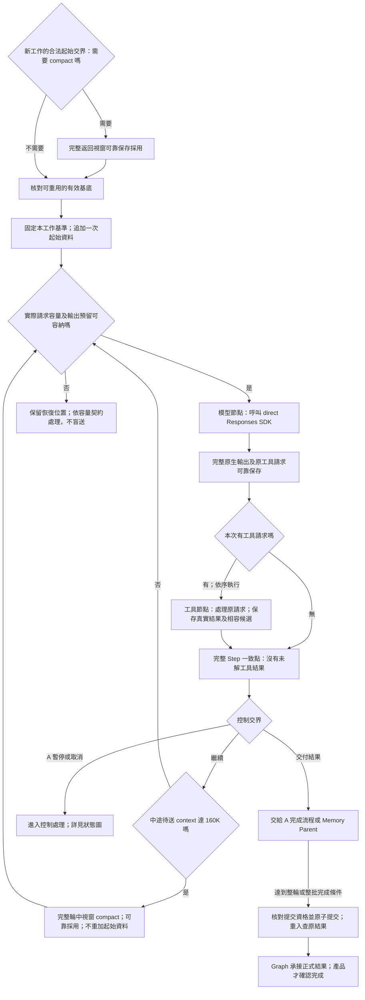
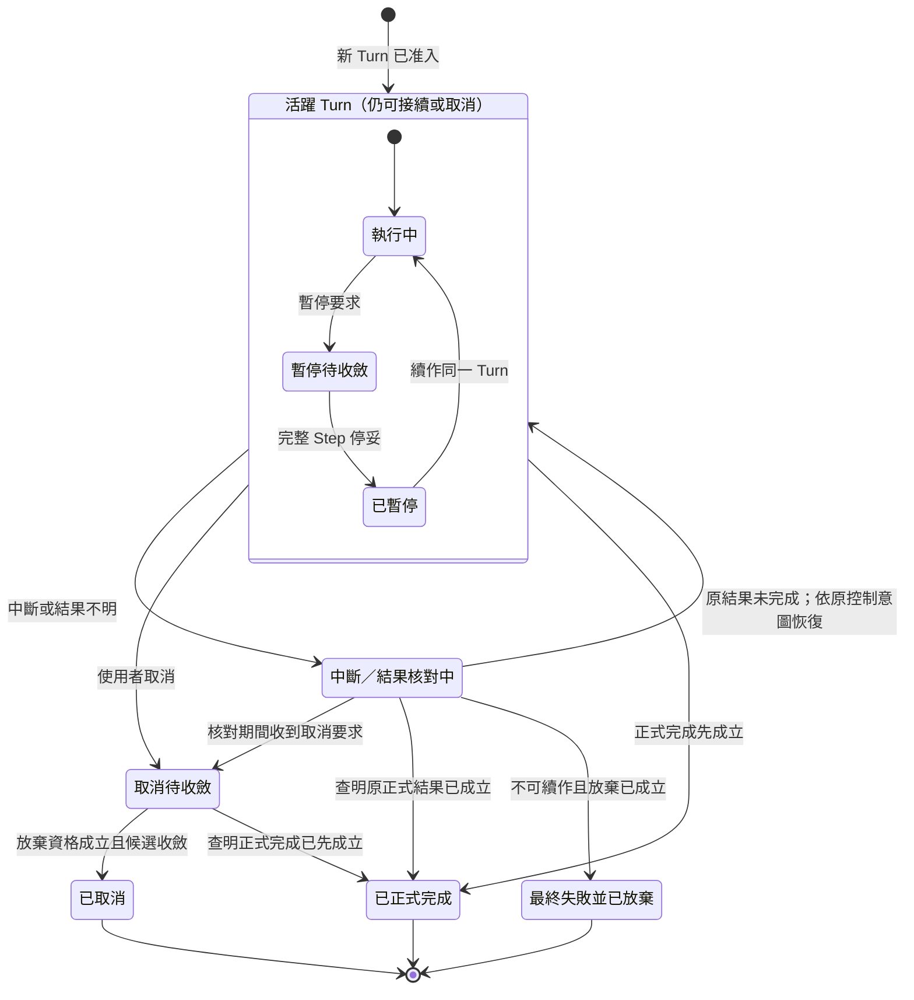

# A／B1／B2 共用執行生命週期與 State 責任

> **有效狀態（2026-09-29）：**本稿把已確認產品安全點映射到框架機制，具體接線是研究後工程建議、待驗證。B1／B2 的同一可變候選、三個業務安全點、同批 Step 恢復與 compaction 保留以[背景生命週期](2026-09-25-b1-b2-information-gap-lifecycle.md#候選操作快照與三個安全點目標已確認未實作)為準；儲存所有權見[資料與交易](../architecture/persistence.md)。下方摺疊的歷史比較不作待選流程。

- 日期：2026-09-27；最近核對：2026-09-29（官方原生契約、恢復／短交易與主線保存推薦）。
- 狀態：**目標執行設計＋工程推薦／未實作、未驗收。**已確認產品規則不再待裁決；工程映射須通過所列機制 gate，不代表已授權施工或正式切換。
- 責任：本稿只維護共用執行機制、State 判準及框架映射；不重訂各 Agent 的工作分析方法、可見資料或產品控制權。
- 路徑：[全產品目標 map](../target-architecture-map.md) → 本稿 → [A 的 context／恢復契約](2026-09-26-consultant-context-and-state-design.md)、[B1／B2 生命週期](2026-09-25-b1-b2-information-gap-lifecycle.md)。產品目標由[產品概念](../product-concept.md)維護；方法依[架構討論規範](../architecture-discussion-standard.md)。
- 不做：production、依賴、資料庫、Prompt／Skills 修改，付費模型、恢復實測、commit／push。現行程式僅作可重用能力的證據，不強迫目標沿用其結構。

**2026-09-29 審核補充：**下列具體接線是**工程推薦／待機制驗證，未實作、未驗收**。依本輪與主線的協調，首選單一 PostgreSQL 內由業務責任管理候選、不可變修訂／快照及原操作結果；checkpoint 保存原生接續與候選固定位置／結果定位，不雙寫完整候選。保存所有權、修訂／快照、交易及保留責任以已落盤的[穩定保存設計](../architecture/persistence.md)為唯一詳細入口；本稿只維護 Agent 的接縫、異常及驗收映射，不另定表名或第二套持久化規格。兩稿已交叉核對；產品政策仍依上游最新 successor，本次推薦不覆蓋已確認效果，也不構成施工授權。

## 1. 本輪結論與取捨

**首選：LangGraph 管執行接續，業務責任管候選與正式生效，OpenAI SDK 管原生 API 往返。**共用程式機制，不共用 A／B1／B2 的可見資料、私有歷史或修改權限；不另造通用 Agent 引擎。LangGraph＋direct Responses 是已確認的目標選型；本稿待驗的是如何接線，不重選 LangChain Agent／Message 層或 OpenAI Agents SDK。

此方向來自官方可組合機制，不是宣稱三家供應商共同規定同一張 Graph：LangGraph 支持分步持久執行；OpenAI 規定原生接續與工具配對；PostgreSQL／業務操作承接提交。**checkpoint 成功、完整 Step 成功、產品正式完成是三件事。**

本輪的正常例是「R1 已存 → 工具一候選生效 → 工具二完成 → Step 停妥 → A 正式完成」；反例是在每個箭頭間 crash 或遺失確認。共同安全要求是：重用原 R／原結果、精確找回候選、不重複正式效果，且取消後內容不能進入下一輪。這些是本案映射；官方框架提供恢復原語，沒有替 Caliburn 承諾跨資料責任的 exactly-once。

| 已有能力／候選 | 比較結果 |
|---|---|
| 原生 Graph API＋持久 checkpointer | 首選。模型、工具及控制交界可分開保存；`sync` 作第一個驗證基準，不宣稱已接線。 |
| 整個模型／工具 loop 放一個 node，末尾才保存 | 不符合已保存模型輸出可重用、工具前可恢復的目標；不作首版方案。 |
| Functional API 的 task | 原生可用的替代機制。必要時局部使用，不另維護一套同功能 Graph／task 引擎。 |
| 手寫事件回放、通用回滾／重試服務 | 沒有已證明的必要缺口，不採為本次候選。 |

依據：[Graph checkpoint](https://docs.langchain.com/oss/python/langgraph/checkpointers)、[Functional API 的重入與冪等](https://docs.langchain.com/oss/python/langgraph/functional-api#idempotency)。框架 super-step 不是 Caliburn 的完整模型／工具 Step；已開始而結果未存好的工作仍可能再次執行。

## 2. 共用生命週期候選

下圖是**責任及持久交界**，不是已定 Python class／資料表；一個框可由既有 node、業務呼叫或框架能力承接。新工作的定義分別是 A 新 Turn、B1／B2 所屬的新 Memory 批次，不能把同批回交重新命名為新工作。

- 無需 compact 時沿用有效歷史，不呼叫 API。B1／B2 各自輪前準備只做一次，回交／恢復不重做；2026-09-29 新增的 160K 中途保險依 §6.3，不能再把「輪前 0 或 1 次」解讀成整批禁止中途 compact。僅輪前基底不隨取消回退，輪中結果屬當前可放棄工作。
- 候選 Step：一次完整模型回應與其零至多個工具的確定結果。無工具時直接進控制交界；已知拒絕可形成工具結果，未知提交不能偽裝成失敗／無效果。工具並非固定一個，修改同一候選首選有序執行。
- 模型節點返回並可靠保存 R，工具節點才開始。不能在同一未保存 node 內先拿 R 再執行修改；如此 `sync` 才有可驗證的作用交界。
- 多工具時每筆已完成工作都須可查回。首選逐筆 Graph 保存或原生 task 結果；不為每一筆加一套業務回執。重新進入工具程式可以，重複業務效果不可以。
- 圖只畫正常迭代；中斷從 §2.1／§2.2 的原位置承接，控制與終態見 §5，不從圖首重跑。實際應交給框架接續已保存進度，**不是一律跳回模型節點，更不是指定舊 checkpoint 做 time-travel replay**。原結果不可取得才依另定政策重新推論；`store=false` 不提供遺失回應的遠端備份保證。Memory Parent 收到 B1 結果仍須交給 B2；收到 B2 情境問題可回交 B1，不能從子圖完成直接跳到整包發布。

[OpenAI function calling](https://developers.openai.com/api/docs/guides/function-calling#handling-function-calls)規定處理完整輸出及各工具配對；[stateless reasoning](https://developers.openai.com/api/docs/guides/reasoning#preserve-reasoning-without-stored-responses)要求 `all_turns` 接續完整 output items。本稿不自行重建 encrypted reasoning、不把工具回傳改成員工原話，也不以出現文字宣稱整輪結束。

### 2.1 原生 Graph 的最小接線推薦（未實作）

以一般 StateGraph、官方 PostgreSQL checkpointer、`durability="sync"` 作首個驗證基準；一次原生模型回應與逐筆工具各有可持久的 node 邊界。若選 Functional task，只用原生已保存結果重用能力，不再平行建第二套 loop。`sync` 約束下一個 graph step 前的保存；**node 已返回不等於磁碟保存已確認**，保存失敗時不得先派送工具。

| 執行位置 | 承接資料與 owner | 下一步准入與恢復 |
|---|---|---|
| 新 Turn／新批準備 | App 固定輸入、版本、執行資格及起始候選位置；Graph 承接原生歷史 | 保存本次準備結果後才進模型；同工作恢復跳過準備，不再追加輸入或刷新導覽。 |
| 一次模型呼叫 | direct SDK 取得完整 R；Graph 保存全部原生輸出、原工具參數及 App 綁定的原操作辨識 | 先持久保存，再派送自有工具。**Step 1 的 R1 已存也直接進工具**；不能要求先有一個完整 Step 才使用 R1。 |
| 一筆工具／候選修改 | 原業務 owner 原子保存候選修訂及該操作原結果；Graph 接回原 `call_id` 的觀察與固定位置 | 按 R 的順序逐筆處理。同一 Step 有兩筆工具時，第一筆已成立、第二筆失敗，只核對／接續第二筆；不因整個 Step 尚未完成便重做第一筆。 |
| 完整 Step 邊界 | Graph 中所有 call 均有確定結果，原生視窗、候選固定位置與下一步一致 | 未知效果阻止此安全點成立。此點服務恢復／暫停，不正式發布 JD 或 Memory。 |
| 控制節點 | App 的持久控制資格＋原生 `interrupt()` | 純路由／控制，不放 LLM 或候選修改；暫停接續用同一 thread 的 `Command(resume=...)`，先核仍有資格。 |
| 完成／發布節點 | App 協調，各業務 owner 判定；短交易保存正式結果 | Graph 可重入查回同一完成操作；不得再呼叫模型生成新答覆或重複發布。 |

已保存的唯讀工具觀察也直接重用，不能重新讀最新候選後冒充原觀察。未完成的唯讀查詢可在同一合法基準重讀；已開始但結果未保存的模型呼叫則先進 §6 的未知結果核對，不讓通用 node retry 自行重送。

**框架恢復入口分三種：**新工作傳新 input；一般故障以同一 thread／namespace 的最新可靠執行狀態接續（通常以 `None` input 恢復）；已持久 interrupt 才用 `Command(resume=...)`。讀取歷史 checkpoint 可用於核對，但指定舊 `checkpoint_id` 執行是 time-travel replay，會重跑其後節點，不是正常 crash recovery。`get_state().next` 空白只說明 graph 無後續節點，不能證明業務完成。依據：[checkpoint／pending writes／replay](https://docs.langchain.com/oss/python/langgraph/checkpointers)、[interrupt 重入](https://docs.langchain.com/oss/python/langgraph/interrupts#resuming-interrupts)、[task 冪等限制](https://docs.langchain.com/oss/python/langgraph/functional-api#idempotency)。

### 2.2 各安全點須恢復什麼（目標效果 → 工程映射）

| 安全點／內部位置 | 必須一起辨認的內容 | 不表示什麼 |
|---|---|---|
| 已採用 compact | 完整返回 C、它取代的有效 W、採用位置及所屬工作／邊界 | API 返回本身不是安全點；輪前 C 可跨取消重用，輪中 C 不得越過其工作回退邊界。 |
| R／部分工具內部位置 | 同工作原輸入／基準、R、各原操作結果、對應候選修訂與未完成 call | 可恢復不等於 Step 完整，不額外提供每工具 UI 暫停。 |
| 完整 Step | 該點原生視窗、全數確定工具結果、精確候選位置及後續路由 | 不賦予未完成訪談正式序號或共享資格。 |
| A 完成 Turn | 原完整答覆、正式 JD／來源、有效訪談及原完成結果一致成立；接續位置可找回 | UI 送達、模型 final、Graph END 不能取代此結果。 |
| Memory ①／②／③ | ①固定批次起點；②B1 交接快照／差異；③兩層候選與來源進度正式發布 | ①②及同批 Step 均非對外發布；③不倒退。 |

上述是關係一致性，**不是要求全部位置由一個交易同時寫入**。業務先提交、checkpoint 尚未承接的接縫由原操作核對補齊（§3、§5），不拼接舊視窗與任意最新候選。

## 3. State 先分責任，不先造欄位表

**2026-09-29 補完界線：**本節列出實作者必須能辨認的資訊與生命週期，不要求 LLM 維護同名欄位。§2.1 的保存交界、§5 的提交資格及下表共同構成架構契約；TypedDict、reducer、node／task 名稱及序列化由實作設計映射，不再把這些產品效果留成待決。

以下是審查分類，**不是七個元件、七份表、七份可寫副本或必須全送給 LLM 的資料**。先用[共同保存審查順序](../architecture-discussion-standard.md#資料保存與使用的共同審查順序)證明需要什麼，再決定表示。

| 必要資訊 | 誰決定／修改 | 生命週期與使用方式 |
|---|---|---|
| 工作綁定：職務檔案、原執行、固定 Memory／來源範圍、權限 | App／業務責任；不是模型 | 同工作恢復不變，新工作重新准入。Graph 只承接必要參照；不重存可推導的獨立 authority。 |
| 原生接續視窗：已採用基底、追加資料、模型 items、工具觀察 | Provider 產生輸出，App 依契約保存／組裝 | 各 Agent 私有；歷史不可重寫，只有合法 compact／取消後的活躍分支選擇可改變後續輸入。 |
| 待執行工具與已完成結果 | 模型提出意圖；Runtime 配對，工具 owner 判定結果 | 保留至本步／本工作不再需要恢復；框架已能表示的進度不另造第二份游標或事件日誌。 |
| 本工作候選：JD、情境、理解 | 授權 Agent 經原 Domain 修訂 | 首選由業務在 PostgreSQL 保存；State 僅保存固定修訂／快照與原結果定位。JD 可依產品政策預覽，正式讀取／PDF 仍用正式稿；Memory 候選不對 A 或使用者開放。 |
| A 暫停／取消意圖、有效執行資格、背景恢復所需原因 | App 控制責任；不是模型 | 意圖能跨中斷辨認；完成／取消權限不能僅由某份舊 checkpoint 裁定。UI 可讀投影，不預設再建進度表。 |
| B2 給 B1 的情境問題與交接結果 | B2 提問題，B1 處理自己的層，Parent 路由 | 限同批必要溝通及有效候選修訂；不傳理解正文或 B2 私有 reasoning，不建立永久問題台帳。 |
| 已正式完成／發布的結果參照 | 業務提交責任 | Graph 承接原結果，不用 `END`、assistant 文字或 checkpoint 自稱已提交。 |

**先不要求額外的模型分析筆記 schema。**State 是必要執行資料，不等於每 Step 叫模型填寫焦點／計畫／疑點表。原生 reasoning、工具觀察已承接分析歷史；若之後證明仍缺某種明確可見的分析成果，再按使用方及生命週期設計，不能以本次分類刪除現行 Working State。

SDK client、資料庫連線、金鑰等執行依賴由 Runtime 注入，不序列化成模型視窗。App 動態資料維持已確認的 user-role 投影；原生 items 不改型。**LangGraph runtime context、Graph State、LLM input 是三種不同範圍。**依據：[State 設計指引](https://docs.langchain.com/oss/python/langgraph/thinking-in-langgraph#step-3-design-your-state)、[Graph API](https://docs.langchain.com/oss/python/langgraph/graph-api)。原則上的「保存原始資料、按需格式化」不能拿來重算並覆寫模型以前實際看過的歷史。

### 候選保存推薦與替代方案（2026-09-29 successor）

**工程推薦：單一 PostgreSQL，業務候選＋不可變修訂／快照，checkpoint 留精確參照。**這取代本稿先前「優先評估候選全文放 checkpoint」的排序，不改產品安全點；[保存責任 §1–2](../architecture/persistence.md#1-先分真相與保證再選保存位置)承接所有權及修訂方式，具體 schema 仍待實作設計。本題已有下列用途證據，不是僅因外部會讀取就推導另存：

- Memory 刪除情境與解除所有候選理解綁定須在**同一候選操作**原子成立，且不讓 B1 讀理解；由 Memory Domain 與既有保存責任完成。
- 多工具 Step 可能部分生效；候選修訂與原結果在同一短交易成立後，即使 Graph 尚未收到，也能核對是哪一次修改、產生哪個固定位置。
- JD 即時預覽、來源綁定、取消後排除與成功才發布須依同一候選判斷；正式 PDF 另讀已完成稿，不能以兩份可寫全文維持同步。
- B1／B2 依序操作同一 workspace；②與後续交接保留不可變快照供恢復／diff，而 map／read 仍顯示授權範圍的目前候選。不可變修訂不等於每次複製整份內容，也不要求同工作重播所有修改事件。

| 接法 | 適用性與取捨 |
|---|---|
| **業務持有候選；checkpoint 留位置（首選）** | 符合上述 CRUD、操作查回、預覽／來源與共同快照需求。代價是必須處理業務與 checkpoint 間的確認空隙，不能聲稱同庫便天然原子。 |
| Checkpoint-backed 候選（保留比較） | 候選小、只由單一圖內純轉換修改，且無跨候選原子關係或獨立修訂需求時，狀態與候選一次保存較簡單。它不是框架做不到；但尚無證據顯示能以更少接線滿足本案全部用途。若要改選，須逐項展示同等恢復、預覽、來源及 workspace／diff 的反例與驗證。 |
| 業務與 checkpoint 各保存可寫候選全文 | 不採。兩份 current authority 會使取消、恢復與預覽須額外對帳；目前沒有需要此雙寫的反例。 |

**恢復對照例：**checkpoint 記候選 D0 與原工具 P1，業務已原子保存 `P1 → D1＋原結果`，但 Graph 的結果保存失敗。恢復先查 P1，接回原 `call_id` 並移到 D1，再處理 P2；即使業務目前還存在 D2，也不能拿 D2 冒充 P1 的結果。唯讀觀察保持原文，固定位置不以 latest 代替。若需回上一完整 Step，先辨認之後是否已有可承接的原結果；確須放棄未完成分支時由候選 owner 令該分支失去採用資格，再以該 Step 的固定位置繼續，不能重用舊操作身分去套另一組修改。這不是刪原結果或執行 graph time travel。

恢復位置所引用的修訂、結果及原生視窗須在可恢復期間仍可取回；不能只存一個會被清理的 ID。保留／清理順序與停止使用舊執行由保存文件細設。**不新增通用 OperationStore、receipt、validator、LangGraph Store 或事件日誌**；業務原操作結果承接冪等，框架 pending writes 承接自身進度。兩種可行接法均不以 SQL 長交易／savepoint 跨越 LLM 等待。

## 4. 共用機制，A 與 Memory 的工作政策分開

| 面向 | A 職務顧問 | B1／B2 背景 Memory |
|---|---|---|
| 工作完成 | 正式答覆、JD 候選採用與訪談資格一致成立 | B1／B2 最終一致候選由 Memory 業務驗證並共同發布 |
| 使用者控制 | 可暫停、接續、取消；重新提交是新 Turn | 不提供暫停／取消／重試／編修；系統負責恢復 |
| 壓縮交界 | 新 Turn 前檢查 128K／既有 Agent 要求；完整 Step 交界另檢查 160K | 新批各自首次分析前檢查門檻；回交不重做輪前準備；完整 Step 交界另檢查 160K |
| 初始資料 | 兩份 Memory map＋完整近期訪談；本輪原話另則 user；JD 導覽按需讀取 | B1：情境 map＋本批完整訪談；B2：情境 map＋理解 map＋B1 變更資料 |
| 同工作再次進入 | 原輸入、map、Memory 基準及候選固定接續 | 私有歷史繼續，僅追加新的合法交接；不得把 B2 理解內容帶給 B1 |
| 已確認中途恢復目標 | 依 025／026：內部已保存結果與完整 Step 均可恢復，含 Step 1 | 同批原模型／工具結果及 Step 可恢復；①／②為業務起點／交接位置，並非唯一可恢復粒度 |

**B1／B2 框架映射首選候選：**Memory Parent 負責固定工作與路由；兩個明確命名、各自私有 State 的持久子圖負責分析。優先驗證 per-thread 模式，因為本案要求跨呼叫延續歷史；不是每次 B2 回交都使用 fresh invocation。Parent 只交接所需輸入／輸出，不偷讀另一方全部 checkpoint。相同子圖／同一保存範圍不並行進入；不同職務檔案仍須隔離。

[LangGraph subgraph 官方文件](https://docs.langchain.com/oss/python/langgraph/use-subgraphs#subgraph-persistence)區分 per-invocation／per-thread；對獨立一次性任務通常推薦前者，本案的私有歷史延續是選後者的理由。該頁也指出同一 per-thread 子圖並行寫入會衝突，以及依呼叫順序產生 namespace 的風險。優先使用明確命名節點及原生 namespace，不以 LangChain middleware 補救。**這不是資料權限保證**，B1 的 context、工具與交接仍須各自限制。

新批次只替換本批執行綁定／候選起點，不能把上一批未發布候選冒充正式 Memory；舊私有歷史按已定原生規則承接。具體 thread／namespace 命名、輸入重設與 schema 仍待小型離線試例，不在此選字串格式。

**共用 workspace 與私有歷史分開接線：**Parent 只持有本批固定範圍、workspace／交接快照定位及路由；B1／B2 各自保留自己的原生接續，工具直接經 Memory owner 讀寫同一候選。Parent 依序讓 B1 → B2，必要時 B2 → B1 → B2；不平行進入同一候選的兩個分析階段。B1 移除情境所伴隨的理解關係解除是 Domain 的原子效果，不是授予 B1 理解層工具或內容。

② 與回交快照用於比較與恢復，不是給 B2 另一份可寫候選或永久靜態 read。B1 回修 A 時候選 B 及 B2 先前合法修改保留；B2 對舊交接狀態的完成判定失效，需針對新交接繼續分析。同批重新進場不重做輪前 compact，亦不重放起始工作資料；完整 Step 後的 160K 保險另依 §6.3。Parent 在子圖返回後、交接確認前 crash，先核原交接與子圖可靠進度，不把整個已完成子圖當新分析再跑；per-thread 只保證有歷史，不自動保證交接一次生效。這個接縫須以 §7 的 E10 驗證。

上述順序限制不鎖住另一個職務檔案，也不讓 A 等 B。A 的近期訪談正常完整預載；超量例外依 2026-09-29 產品 successor 走既有原話讀取能力，不能從容量限制推導 A 必須因背景整理失敗一律停止。

## 5. 完成、取消與外部效果：框架不能代做的接縫

### 控制與故障的狀態視圖

以下是 **A 的目標控制狀態圖／未實作**（2026-09-29）。方框是可觀察工作狀態，不預定 DB enum；箭頭必須滿足標示條件。「核對中」不准偷偷當作取消或失敗完成。Memory 沿同一原結果核對機制，但沒有使用者暫停／取消入口，其階段圖見背景生命週期。

已取消／最終失敗是舊工作終態，重送原文也要新准入；已暫停不是終態。恢復至 Active 表示依原控制意圖回執行／暫停待收斂／已暫停的原位置，不重新執行其圖中初始箭頭；已暫停不自行提交或發送模型。取消可在工具或模型在途時提出，不能把圖解成「先等下一個模型呼叫才接受取消」。App 先撤銷採用資格、核對並隔離遲到結果，才釋放同檔案寫入資格。成功／取消只允許一個正式結果；原結果尚未查清時，UI 顯示核對／處理中，不提前解鎖。

### A 暫停及取消

首選 **App 接受控制要求 → 完整 Step 後的純控制節點處理 → 原生 interrupt 暫停**。暫停期間不發下一個模型請求；`interrupt` 恢復會從所在 node 開頭再執行，所以該節點不放模型／JD 操作。[官方 interrupt 規則](https://docs.langchain.com/oss/python/langgraph/interrupts#rules-of-interrupts)

暫停請求不等於已暫停；卡住的模型／未知工具結果不能被虛報為完整 Step。使用者要求必須由活躍執行能讀到的控制介面承接，`interrupt()` 本身不是跨程序的停止按鈕。已暫停重開不自動跑；Memory 則不暴露這個使用者介面。

**暫停與 final 的先後：**在完整 Step 的控制交界先核已受理的暫停；即使已有完整 final，只要正式完成尚未成立且暫停已生效，就停在待提交位置，不額外送模型，也不越過暫停提交。若完成已先成立，回原完成結果。控制節點重入只重核資格；UI 以持久 interrupt／停妥結果顯示已暫停，不能僅依「已點按暫停」。

取消是撤銷該輪候選及結果的**採用資格**，不是刪整份 thread，也不是倒轉已發布資料。首選在正式完成 owner 處以同一執行資格檢查協調取消／提交，讓兩者只有一個最終結果；舊執行晚到不得把已取消內容復活。只有確認取消成立且舊寫入不再能正式生效，才解除人工 JD 編輯限制。中止 HTTP 並不能保證 provider 停止計算或退款。

**取消不必等模型形成完整 Step 才受理。**App 可在任一在途位置記錄要求；取消與完成共用同一業務終局／准入條件，在短交易內裁定。取消勝出就撤銷本輪後續候選採用／正式提交資格，晚到 R 或工具結果只能供核對，不能重新開啟執行。完成勝出則原完成結果保留，不能回報已取消。這和「暫停等到完整 Step」不同；圖中的控制節點不是取消唯一受理入口。

取消後以**上一完成 Turn 的有效接續基底（含本輪輸入加入前已採用的 C，不含本輪中的 C）**開始下一次新提交；排除本輪輸入、衍生 reasoning／工具觀察、JD 候選與未生效背景要求。保留此前人工正式 JD、App 開場序號 1、其他已完成輪次及獨立 Memory 發布；不刪核對所需原紀錄。最終失敗也必須先確認未正式完成且放棄成立，才能作同一有效資料回退；其 UI 原文、原因及下一步依產品政策呈現，不套用主動取消的簡短提示。

**執行隔離仍是缺口之一：**checkpoint 不是 writer lock。取消／重啟後，業務效果須由上述資格條件阻擋；原生接續還須避免舊 runner 遲到的 checkpoint 被當成新 Turn 的最新歷史。首版保持同一 namespace 單一 writer，未確認舊寫入停止前不得讓新 runner 共寫該分支；若以原生獨立執行分支隔離，App 只能選取仍有效工作的保存位置。具體 namespace／啟停接法待 E08／E09 證明，不以記憶體鎖、查不到操作或 HTTP abort 代替隔離證據。

### 正式完成提交

首選「候選準備好 → 短業務交易檢查有效執行及基準 → 正式採用與原結果一起成立 → Graph 承接結果」。若完整答覆已存於另一個可靠位置，交易可保存固定參照與資格，不預設再複製全文；但不能提交指向尚不可恢復內容的完成結果。

PostgreSQL 的交易／條件更新可承接原子性與競爭控制，**不是要求跨 checkpointer 與全部業務保存做分散式交易**。DB 已完成、Graph 未存到結果時，依原操作查回，不再完成第二次。具體 owner／交易欄位留給正式資料設計；其測試必須證明單一終局，不能只靠記憶體鎖。[PostgreSQL 交易](https://www.postgresql.org/docs/current/tutorial-transactions.html)、[並行更新行為](https://www.postgresql.org/docs/current/transaction-iso.html#XACT-READ-COMMITTED)、[AWS 冪等操作](https://aws.amazon.com/builders-library/making-retries-safe-with-idempotent-APIs/)

#### 短交易與原操作核對（工程推薦／未實作）

| 責任 | 本次短交易要一起成立的內容 | 交易外工作 |
|---|---|---|
| JD／Memory 候選操作 | 同一原操作辨識／參數、有效執行及候選基準核對；授權 CRUD 的修訂與關係；原操作結果／固定位置 | 模型推論、工具結果送回及下一個 checkpoint。 |
| A 完成 | 同輪有效資格與完整答覆；JD 候選及來源的正式採用；有效訪談／正式序號；原完成結果；本輪成立的 Memory 待處理上界 | UI 通知、B 實際領取執行、Graph 承接原結果。無 JD 修改仍可完成。 |
| A 取消／最終放棄 | 確認未完成，撤銷原執行採用資格與候選／來源有效路徑；保存可查的終局 | 有界停止 runner、UI 呈現與後續清理；不得讓舊 writer 越過終局。 |
| Memory ③發布 | 有效批次、目前候選與 B2 完成對應的交接狀態；兩層不可變快照及引用鏈；來源涵蓋進度與原發布結果 | 後續批次領取、下一個 A Turn 選用、Graph 確認。B1 或 B2 單方完成均不可自行發布。 |

業務各自定義合法狀態、來源與版本，App 協調完成內容，PostgreSQL 交易／約束實現其原子保存；這不是資料庫自行判定「顧問完成」，也不是新增統一 validator。可在交易外準備昂貴的純計算，但提交時必須再次核對所依基準；交易內不等 LLM、瀏覽器或下一個 Agent。完整答覆若引用既有保存位置，該內容須已可靠存在且保存期限受完成結果保護，不能在提交後才補上。

原操作核對的最小協定如下；沿 JD／Memory 原業務責任實現，不獨立命名 OperationStore：

1. Runtime 在工具派送前固定原操作身分、職務檔案／工作、原 call 與確切參數；恢復時沿用。`call_id` 只管 provider 配對，不天然是跨工作冪等鍵；模型不填操作 ID 或提交結果。
2. 先按原操作查結果。有結果且原請求相同就回原結果；同一身分但參數／範圍不同是衝突，不當成成功。**先查原結果，再判新操作的基準**，避免 P 已成功、head 已前進卻把 P 錯報 stale。
3. 無可見結果時，仍須取得該 owner 的短交易競爭屏障，重查原結果並核對有效執行與預期修訂，才可執行原操作；普通 `lookup=None` 不是舊 writer 死亡或原提交未發生的證明。唯一約束、鎖定或條件更新承接競爭，不靠先查後寫的時間空隙。
4. 候選／正式效果及原結果在同交易提交；`COMMIT` 的回應遺失，仍標結果不明，先讀回原操作。只有可證明未提交、原資格仍有效且原操作可冪等進入時，才依有界策略重進；不能新建 operation 來繞過未知結果。
5. Graph 把原結果形成符合工具契約的 observation，配回原 call，保存固定候選位置；若 Graph 寫入又失敗，重進此核對流程，不再修改業務。業務已完成而 Graph 落後時，UI／重開也應能提供原正式結果。

**同一 PostgreSQL 不等於同一交易。**官方 Saver 可共用同一資料庫，但不據此假設與任意 Domain 呼叫共用 connection／transaction。推薦接受明確的「業務短交易 → Graph 保存」交界，以原結果重入解決空隙；不修改 Saver 來強綁整輪，不做兩階段提交。既有 [JdStorage.lookup／交易](../../experiments/jd-relational-app/src/jd_relational/storage/service.py)已提供先查原結果、鎖後重查及未知效果分類的取證入口；**其現行正式 JD 操作不等於目標候選／A 完成／Memory 發布已接好**。

#### JD 預覽與正式可見性

候選 CRUD 成立後可由同一業務候選投影到 JD 預覽；這可以早於完整 Step，也不承諾其中每個修改最後都會採用。暫停仍顯示可辨認的本輪候選，人工寫入依 028 禁止；取消／最終放棄後預覽回正式稿。PDF、正式引用與其他正式讀者始終用最後已完成結果。本輪公開中間文字可依產品政策保留／展開，但不取得正式訪談序號；Graph 保存其 item 不把它升為員工事實。Memory 候選沒有對應使用者編修或控制入口。

### 背景通知的生效交界（030，目標已確認）

**本題已由 Owner 裁決，不再保留兩種啟動方式待選。**唯一產品政策見[030 及後續在途批次補正](../product-concept.md#訪談輪次與背景整理觸發目標未實作)：A 判斷值得整理並提出要求；X Turn 成功完成後要求才成立，無在途批次時啟動，有在途批次則依序承接，不等下次員工輸入。該要求的資料上界只到 X Turn 最後一則使用者輸入，不包含其後的顧問回覆。Runtime 以該輸入的正式訪談序號固定限制，不由模型填寫。工具受理不冒稱已開始；取消本輪不採用要求。這只採納產品交界，不代表本稿 Graph／保存接線已獲採用或通過驗收。

未決限於具體回傳／保存／派送接線、在途要求的去重與恢復機制，以及[按訊息／範圍回讀與前問的精確契約](2026-09-27-memory-read-and-source-navigation-contract.md#訪談訊息固定序號與回讀語境目標未實作)；較早「按輪＋前問」已是歷史候選。**依序發布、合併後續上界及不跳過失敗範圍的產品效果已定**。語意觸發不是固定輪數；原話補語境不做搜尋。背景時序由[B1／B2 文件](2026-09-25-b1-b2-information-gap-lifecycle.md#在途批次與新要求的交錯2026-09-29-目標已確認未實作)維護，不在此另設一套。

**派送工程推薦：**A 完成短交易以本輪正式使用者輸入序號承接待處理上界；同檔案的新要求與原待處理上界原子合併為最大值。不得包含其後顧問答覆，也不能因派送較晚取當時 latest。系統啟動／工作收尾時依此持久事實與已發布進度做有界掃描及領取，記憶體喚醒僅是加速；不另設 broker、通用 queue 或 outbox／receipt 副本。這是對[核心閉環交易接縫](2026-09-29-core-value-loop-lifecycle.md#完成與背景啟動之間的交易接縫既定效果的驗證反例接線未定)的具體推薦，未實作。

領取本批時以短交易固定已發布基準、來源上界及唯一在途資格後就釋放交易；LLM 在交易外跑。領取確認遺失先查同批，不再建立另一批。A 可同時完成新 Turn 並提高後續待處理上界，在途批次不擴張；B 發布與新要求並行時不得清掉更大的上界。前批失敗不推進已發布進度或跳過來源，解除阻塞後由系統承接。PostgreSQL 條件更新／行鎖足以作首版候選；只有多 worker 領取反例需要時才用 `SKIP LOCKED`，且只跳過暫被領取的工作，不跳過同檔案未發布來源。[官方鎖定語意](https://www.postgresql.org/docs/current/sql-select.html#SQL-FOR-UPDATE-SHARE)不提供工作永遠完成的保證，掃描、公平性、舊 worker 資格與有界恢復仍由 App 負責。

歷史比較：本日先前的啟動候選與訪談定義讨论（啟動選項已由 030 取代）

以下保留當時討論順序，不作新的待裁決清單或現行施工指令；其中「員工輸入＋該輪顧問正式回覆」是當時的完成分組，不是目前的取材單位。最新規則依上節：Turn 完成後啟動，訪談截止於該 Turn 最後使用者輸入的正式序號。

完成前不可把本輪輸入交給 Memory，與「工具回傳正在整理」須一起看，不能默默改工具語意：

- **候選一：本輪要求可包含本輪，但實際工作在 Turn 完成後才啟動。**工具先如實回傳已記錄本輪要求，不能冒稱包含本輪的整理已開始；取消則丟棄這個未生效意圖。已記錄要求須能從完成結果查回，避免提交後、派送前中斷而遺漏；不預設新增 queue／outbox 表。
- **另一選項：工具當下只整理先前已完成訪談。**可以如實回傳正在處理那個固定範圍，但本輪必須留待後續觸發；不能宣稱這次通知涵蓋本輪。

兩者都不讓 A 等待 B1／B2 完成。這是**待討論的產品／工具交界，不是本稿已改好的流程**；先決定預期效果，再定意圖保存與啟動接線。它不影響本輪共用框架研究，也不重新開放未完成訪談。

**同日續議：不單憑 Step 長短選啟動點（仍為候選）。**Owner 提出長 Step 時希望 Memory 不必空等，短時可等本輪收尾，以便判斷這批訪談是否適合整理。本輪區分「誰判斷值得整理」「資料何時取得共享資格」「背景何時真正啟動」：A 可在分析中提出意圖；是否要用本輪資料，才決定最早可啟動點。沒有實測延遲資料，不先訂秒數、長短預測器或自動逾時切換。

| 情境 | 候選取捨 |
|---|---|
| 前面已完成的有效訪談本身已有值得整理的一批 | 可考慮提早開始，不必等 A；固定範圍不含本輪，也不附帶本輪原話或衍生分析。A 取消不得倒轉這個只用先前合法資料的獨立工作。 |
| 這批資料要連同本輪補充／更正才值得一起整理 | 等本輪成功完成再啟動；避免先整理缺少關鍵補充的舊範圍，隨即再花成本修訂。本輪取消則不把它納入。 |
| 沒有新的有效已完成訪談，或同一範圍已在處理 | 長 Step 本身不產生新的可整理資料；不為提早開跑而重複啟動。若已有工作，只如實回報固定範圍及狀態；本輪完成後也不自動另開一批。 |

以最新 Memory 涵蓋 12、已完成訪談到 17、A 正在第 18 輪為例：立即開始的新增必處理範圍只能是 13–17（仍可按規則回查更早有效來源）；等 18 成功後才可能是 13–18。已開始的 13–17 工作不能中途偷納 18。**A 同 Turn 仍固定原 Memory，故提早發布主要改善下一 Turn 的可用資訊與積壓，不代表本 Step 會換用新 Memory。**取消、固定版本及來源資格規則均不因此放寬。

「Turn 完成」提供的是可共享使用資格，**不是情境已完整或答案皆已核對的證明**；是否值得成批整理仍依已知內容與分析需要判斷，B1／B2 仍可如實整理未知，不以 Step 耗時替代語意判斷。背景啟動不等於 A 等待發布；單次模型請求尚未返回工具呼叫時，App 也不能憑空執行模型尚未提出的通知。

#### 訪談內容、語意觸發與輪次範圍（續議，非新增已確認政策）

Owner 進一步明確：由 A 判斷主題資訊、情境細節是否已值得整理；不是每輪結束自動整理。依[工作分析指南 §3–4](2026-09-09-complete-work-analysis-guide.md)區分：

- **何時值得整理：**A 依訪談內容判斷，例如某段工作已問到能可靠整理已知資訊，或取得有意義的補充／更正。不用固定輪數、Step 耗時或「已有 final」代替內容判斷；可忠實記錄未知，不要求情境完美才整理，也不等於已足夠寫成 JD。
- **哪些是訪談資料：**保留員工的敘述、回答、補充、更正，以及顧問公開的提問、核對與說明，並保留角色、順序及指涉脈絡。顧問的假設或尚未獲確認的歸納不是員工已確認事實；reasoning、工具結果及 App 執行狀態不自動成為原始訪談。供背景使用仍須遵守 023／024 的完成資格。
- **Turn 不是問答組，也不是主題：**常見順序是「第 17 輪顧問問頻率 → 第 18 輪員工答每月 → 第 18 輪顧問問例外 → 第 19 輪員工補充」。18 成功完成，不代表其末尾的新問題已得到回答；同一主題可跨多輪，一則員工輸入也可能涵蓋多個主題。不新增一問一答必須成對的保存規則。
- **批次輪次只是處理邊界：**固定本批必須消化哪些有效新訪談，不是用來判斷資料夠不夠。若新範圍從 18 開始，解讀其回答可能仍需第 17 輪的提問或更早脈絡；應能回查合法歷史，不假定最接近的一個問題永遠足夠。也不能因觸發理由是某主題，就漏掉本批其他有意義內容。是否起始附帶前置語境或按需讀取，留待來源工具契約；不因此重設已發布的處理邊界。

**候選流程例：**A 讀完第 18 輪回答後判斷值得整理，在該輪提出要求，正式答覆仍可引導下一個問題。若這次整理要使用 18，則於 18 成功完成後啟動，**不用等第 19 輪回答下一個問題，更不用等整場訪談結束**；18 取消則要求不能攜帶其內容生效。這是「語意判斷先發生、來源取得資格後執行」，不是把 Turn 結束當觸發器；是否另保留立即整理舊範圍仍未裁決。

[Anthropic Interviewer](https://www.anthropic.com/research/anthropic-interviewer)公開方法以研究目標、可調整訪談提綱及即時適應問答組織訪談，分析訪談逐字稿；支持借鑑目標導向與語境保留，不支持推導 Caliburn 的固定輪數、取消政策或背景啟動點。上述批次映射是本產品候選，不稱為供應商強制規範。

研究依據：[LangGraph Memory overview](https://docs.langchain.com/oss/python/concepts/memory#in-the-background)將背景整理的觸發／頻率列為應用取捨，沒有規定長 Step 一定立即整理；[Azure 非同步請求模式](https://learn.microsoft.com/en-us/azure/architecture/patterns/asynchronous-request-reply)區分受理、執行中與完成。本案借用其分責原則，不導入 LangMem、Agent Server、Azure 服務或額外 queue。**本輪不選定雙模式工具、狀態 schema、觸發門檻或首版排程；下一步先確認立即啟動只處理先前完成訪談的效果，再比較是否值得保留這條路徑。**

## 6. 錯誤處理：共用分類，策略有界

具體錯誤例子由[B1／B2 策略候選](2026-09-25-b1-b2-information-gap-lifecycle.md#系統恢復與不可解決問題策略候選待討論)維護，本稿只提出共用接線：

- 原結果可取回先取回。短暫網路／服務故障才作有限重試；模型修參數是新的模型步驟，不能與 SDK 重送同一次請求混計。
- 同一外部呼叫選一處主要重試責任；SDK、Graph、背景重啟共同受工作預算約束，不能各自重試後相乘。次數、時間、費用及退避常數下一層才定。
- 金鑰、付費額度、確定超量、程式錯誤不反覆碰撞；保留恢復位置，指出需改變的條件。Memory 系統接續不等於無限重跑，也不給使用者操控其工作稿。
- 同工作增長先依 §6.3 的 160K 完整 Step 交界保險處理；單次巨大資料、compact 仍超限或壓縮失敗須保留原恢復位置，不靜默刪資料／換模型／擴費。系統無法恢復且仍影響 Memory 時才通知 A 必要原因，已自行修好的故障不逐筆打擾。

依據：[Azure Retry pattern](https://learn.microsoft.com/en-us/azure/architecture/patterns/retry)。實際 OpenAI 錯誤及 SDK 預設重試須在接線時按選定版本核對；此處沒有選定新的 fallback 模型、全域 middleware 或外部排程平台。

### 6.1 失敗先分類，重試只有一個責任者

**首版推薦：direct Responses create／compact 設 `max_retries=0`，模型 node 不掛不分原因的 Graph retry。**由既有執行流程核對後統一作有界重試，不新增 retry engine；此設定只是防止 SDK 與 Graph 在 App 看不到的地方疊乘，不代表所有故障都不能重試。本機 `openai==3.13.0` 原碼預設重試 2 次、timeout 600 秒（連線 5 秒），對連線／timeout 及部分 408／409／429／5xx 作重送，另受 response header 條件影響；這些預設不是本產品的費用、Step 或暫停承諾。版本證據見 §8.2。

| 可核對的情況 | 推薦處置／責任 | 不可宣稱 |
|---|---|---|
| 完整 R 或 C 還在本機記憶體，保存失敗 | 保留原物件，修復／重試相應保存；確認先前保存是否其實已成功 | 保存失敗就需要重新生成。 |
| 原 R／C 已可靠保存，但確認遺失 | 讀取框架原保存／採用位置，承接原結果 | 沒收到確認就是沒有結果。 |
| 模型請求已送，逾時／連線中斷，完整結果不可得 | 先排除本機已有原結果及仍在途的本地執行；保留「原遠端結果未知／本機不可恢復」區別。只有符合已授權恢復與費用界線才重新推論，明確計作新 attempt | `store=false` 下可憑 response ID 找回原推理；重新推論等於原推理、免費或只算一次。 |
| 明確可重試的服務拒絕／短暫故障 | 依原因、Retry-After、剩餘次數／時間／費用退避；不超出整個工作的共同預算 | 每層各自兩次便仍是總共兩次。 |
| 業務 COMMIT／候選效果不明 | §5 原操作核對；同一 owner、同一身分，先結果後基準。只有原效果可安全判定才進下一步 | lookup 失敗／無可見列就代表沒有生效。 |
| 已確定 Domain 拒絕／工具參數不合法 | 回實際拒絕結果；模型若修正是新 Step／新操作，受同工作預算約束 | 把語意修正當作原操作 transport retry。 |
| 權限、金鑰、額度、程式錯誤、確定容量超限 | 停止相同請求的自動碰撞，保留恢復位置與需改變的條件；Memory 由系統承接阻塞解除 | 無限重試、靜默換模型、擴費或在不安全位置強行 compact。 |

重啟不能把次數／耗時／費用上限歸零；必要的既有執行紀錄須足以辨認已用額度，結果未知的外送亦不能當作零成本。數值與自動續跑資格仍待依既有產品政策及費用授權細定。**可恢復、允許自動續跑、有權發出另一個付費請求是三件事**；本輪沒有發出模型請求。

### 6.2 Compact 的本機安全採用

推薦把「原有效 W → 完整 C＋採用位置＋該次要求已完成」作一次可核對的框架狀態轉換；若保存接線拆成多次寫入，也必須先有 C、再原子選用與消耗要求。**可靠保存採用前 W 仍可取回，採用不明先核對；未確認不得追加新工作內容或開始依賴 C 的模型呼叫。**保存成功的 C 不再壓縮第二次；已追加內容的同工作恢復使用 C＋原已保存後綴。取消／回退只保留回退目標之前的有效基底；027 的輪前 C 可保留，輪中 C 的區分依 §6.3。

B1／B2 各自的「本批已準備」亦須能辨認本次輪前未達門檻、未壓縮，避免回交／恢復重做輪前準備。中途 160K 檢查是另一個合法時點，不初始化新 Turn 或新批次。已採用輪前 C 不隨該批放棄撤銷，輪中 C 隨其工作進度恢復或放棄。尚未保存且確實遺失的 C 沒有免重算保證；是否再發 compact 依 §6.1，不以「只採用一次」推導遠端請求可無限重試。

容量方面，compact 輸入本身及其後完整 create 都須符合模型限制；160K 是主動處理門檻，不保證每次壓完必低於門檻，也不保證任意長工作完成。不得對沒有新增內容的同一窗口無限重壓；若大額單筆資料／壓縮後窗口仍無法容納，保留可恢復位置並記錄具體缺口，不自行刪歷史、改批次或換模型。近期原話預載超量仍沿既有按需回讀例外。

### 6.3 輪前主動壓縮與中途保險

**2026-10-01 Owner successor：**輪前 A／B1／B2 統一為 **128,000 tokens**，中途保險調整為 **160,000 input tokens（K＝1,000）**；取代 2026-09-29 中途 272K 及 B 輪前 512K 測試初值。保留原時點與接續契約：以 Turn 開始前準備為主，中途只在完整 Step 交界、下一次模型請求前由 App 顯式呼叫 standalone compact，不啟用 `context_management` 自動壓縮。不改變角色、來源範圍、工具配對或原生歷史接續。實際驗證與限制見 [T16 §10](../plans/2026-09-29-target-rebuild/evidence/t16-compaction-continuity.md#10-owner-確認門檻校準2026-10-01)。

- **輪前準備：**只處理既有有效歷史，完整返回視窗可靠採用後，才按各 Agent 原定順序加入本輪 App 資料；A 另加員工原文。B1／B2 的 Turn 指本批該 Agent 的分析工作，回交／重啟不重做這份起始準備。首次無歷史不 compact。
- **A 的輪前門檻（Owner 已確認）：**每個新 Turn 開始前檢查 **128,000 tokens（128K）**，達門檻才由容量條件觸發 compact；未達且沒有既有待處理的 Agent 主動壓縮要求，就完整沿用有效歷史，不呼叫 compact。這是每輪檢查，不是每輪必壓縮。原有 Agent 意圖觸發保留；不得因恢復同輪或重新進入準備流程而重做已採用的壓縮。此輪前壓縮仍不包含新輪 App 資料及員工輸入。
- **中途檢查：**本輪已完成至少一個 Step，且下一步確實要呼叫模型時才進保險判斷；未達門檻原樣接續，達門檻才 compact。暫停／取消／完成先依原控制契約處理，不為不會發送的下一步增加付費壓縮。模型還在生成、工具效果不明或 call 尚未配對時，不插入 compact。
- **計量：**每次 create 前檢查實際待送完整請求，涵蓋指令、工具定義、原生接續 items、App 資料與新增工具結果；另核模型 input／context 限制及輸出／推理預留，不把字元數或上一請求 usage 當作本次精確長度。具體計數／保守估算須在 SDK 接線驗證。160K 是中途觸發值，不是保證首個請求或壓縮後請求一定低於 160K。
- **中途壓縮範圍：**該 Agent 當前完整有效視窗，包含本輪已進入的資料、輸入、原生輸出與配對工具觀察。不得只挑文字、丟舊工具結果、剔除 reasoning、重寫歷史或另製摘要。完整 `compacted.output` 依原型別、順序承接，不能只留 compaction item 或把回應外殼當 input。
- **中途接續不是輪前重來：**不再追加整份起始 App 資料／員工輸入，不刷新 A 的固定 Memory／近期範圍，不重置 B 的來源上界／候選。必要新觀察按既定 read／map／diff 工具取得並追加；原生返回視窗中的保留項目不自行刪除。request 層的指令與工具仍按官方欄位提供，不能假設已由 opaque 壓縮取代。
- **可靠採用與回退：**沿 §6.2 保存完整結果並確認切換。同 Turn／同批恢復承接已採用輪中結果及後綴，不因重開再壓同一份。整輪取消／放棄，或回到較早安全點時，不能承接該回退點之後的輪中壓縮，因其中已含被放棄的輸入／分析；027 的輪前基底仍保留。Memory 回①／②同理，只恢復與該安全點一致的原生視窗及候選，不把較晚分析帶回。具體保存用既有 checkpoint／恢復機制，不新增第二套歷史引擎。
- **不無限重壓：**採用後重新核完整待送請求；若仍過門檻或超容量，不反覆壓同一未增長視窗、不靜默截斷／換模型。記錄容量缺口、保留恢復位置，再依容量處置政策處理。已採用且其後真正增長的視窗可再次符合中途門檻；這不是重做同一次輪前準備。

**數值狀態與限制：**A／B1／B2 輪前 128K、三者中途 160K 已由 Owner 確認；模型步數 128／256 及重試 5 次不因此定案。輪前只數既有歷史，中途數完整待送請求，兩者不是同一窗口或模型容量上限。單筆工具回傳仍可能直接越過門檻；這不是全程低於 160K、消除所有 429 或改善引用品質的保證。

**官方契約／本案取捨：**[OpenAI standalone compaction](https://developers.openai.com/api/docs/guides/compaction#standalone-compact-endpoint)於 2026-09-29 複核：完整窗口進、完整返回窗口續接，opaque 內容不可解讀、輸入仍受容量限制；沒有規定 Caliburn 的 Step 時點、取消或 160K。這些是本產品政策。壓縮不保證細節無損；須以跨 Step／跨 Turn 行為及回查能力驗證延續，不讀取隱藏推理來宣稱通過。

**驗收反例：**輪前 127,999／128,000 邊界（前者無 Agent 要求時零 compact，後者觸發）、未達門檻但已有待處理 Agent 要求、三者中途 159,999／160,000 邊界、單 Step 多工具完整配對後才 compact、輪中 C 採用確認遺失先查回、壓後不重加本輪資料、A 背景換版仍讀原 Memory、B 回交不重新初始化、取消 a 後的新 b 不含 a 的輪中 C，以及壓後仍超量不循環重壓。這是驗收要求，不代表全部通過；已成立證據及未驗範圍沿 T06／T16 記錄。

2026-10-01 複核 [OpenAI rate limits](https://developers.openai.com/api/docs/guides/rate-limits#how-do-these-rate-limits-work)：帳戶／專案／模型的 TPM、RPM 等各有界線，不能把曾觀察的 200K 配額當成 context window 上限；同時的 A／B 工作及單次工具大結果仍可能限流。降低門檻不授權刪歷史、無限重送或擴大帳戶費用。

### 6.4 首版恢復範圍：能續作，不能續作則安全退出

**2026-09-30 Owner successor（已確認）：**恢復只保留核心保障，不為少見中斷建立完整原件追蹤、跨程序來源證明或任意位置續作系統。本節收斂 §6.1 及後續反例的交付範圍；先前「未存原件遺失後仍須接回同工作」的工程延伸不再是首版必做。

- **保留核心：**已可靠保存的 Step／模型結果、工具原操作結果及合法 context 能沿既有機制接續；已提交正式結果不重做、不撤銷。取消與最終失敗仍由原 owner 放棄本次候選，保留已採用輪前 compaction、原正式 JD／Memory／訪談。
- **有限恢復後退出：**既有有界恢復已用盡，或無法安全取得原結果時，允許結束本次工作，不要求自動重算同一模型請求。先由原業務交易核對完成是否已成立；未完成才收尾為失敗。顧問可接受新輸入或使用者明確重試；它是新 Turn，不承接被放棄的輸入／候選。不可留下沒有 runner 卻永久顯示 active 的正常狀態。
- **Memory 不拖住訪談：**本批無法繼續即放棄未發布候選、保留原正式快照並記錄失敗；不因輪詢／新通知無限重跑。A 可使用原已發布 Memory 與原話工具繼續；阻塞解除依既有系統入口，不新增使用者 Memory 控制。
- **不偷換成功：**App 關閉的 task cancellation 不等於使用者取消；仍保留已保存進度供重開。若資料庫本身不可用、原 writer 失效或收尾交易不能確認，不能假稱已回滾／已解除鎖；停止准入並依既有運作方式恢復服務。遠端未知費用也不因本機結束而變成零。

借鑑 [LangGraph fault tolerance](https://docs.langchain.com/oss/python/langgraph/fault-tolerance) 將有限重試與耗盡後處置分開，以及 [Python cancellation](https://docs.python.org/3/library/asyncio-task.html#task-cancellation) 的傳遞語意。這是 Caliburn 的首版取捨，不宣稱任意錯誤都能自癒、零故障或完全原地恢復。正式接線與實測另見[執行文件 §6.2](../implementation/agent-execution.md#62-最外層失敗收尾2026-09-30)。

### 6.5 容量與費用分開：產品不設金額攔截

**2026-09-30 Owner 已確認：**產品 A／B1／B2 不因 App 預估金額達上限而停止；保留 token 容量、既定壓縮門檻、模型／工具呼叫與重試次數、工作期限及取消資格。這取代本稿先前把金額預算列為所有產品工作的必要准入條件，不改 provider 本身的帳戶額度限制。

- **容量：**按完整請求的 token count 判斷是否容納及是否需要壓縮。金額不是容量單位；不得以估算便宜推導可送超量 context，亦不因移除金額攔截而改寫歷史、跳過計數或改變壓縮時點。
- **產品：**正常入口不配置每輪美元上限；有用量即可沿既有紀錄做成本診斷，欠缺計費明細則保持未知，不因無法估價阻止有效的模型結果／compaction 接續。未知不冒充零費，亦不把估算當帳單。不得以極大金額、捕捉額度例外後強送或重設已用次數來實現「無金額攔截」。
- **付費驗證：**工程測試仍按已授權 manifest 明定費用、請求／重試／時間與資料範圍；測試組裝可明確啟用金額上限，重用既有執行 owner，不新增帳務平台。取消產品攔截不代表工程代理獲得無限付費授權。
- **既有工作：**已固定的執行限制與記帳歷史不原地改寫；新的正常產品工作採無金額攔截。既有有界測試續作仍守原授權，不能藉升級清除其限制。

機制依據：[OpenAI token counting](https://developers.openai.com/api/docs/guides/token-counting)提供完整請求計數，可用於容量或成本估算；兩者是否作產品 gate 是本案取捨，並非官方強制要求。具體接線與驗證見[執行文件 §5.8](../implementation/agent-execution.md#58-產品與付費驗證的金額界線2026-09-30)。

## 7. 首版做減法與下一個 gate

> 2026-09-30 successor：產品的金額攔截已移除，依 §6.5 的政策；本節原有「費用預算」只適用明確配置的付費驗證，不再是產品啟動前置條件。

### 運作配置不是新的產品分支

**工程設計補完（2026-09-29；未實作）：**門檻、模型最大輸入／輸出預留、單工作模型呼叫上限、工具修正上限、傳輸重試上限、工作時間與費用預算，由 App 的一份有效執行配置承接，啟動工作時固定。配置不是模型工具參數，也不新增使用者可操控 Memory 的功能。既定 A 輪前 128K、三者中途 160K 不被配置默默覆蓋；B 輪前亦已於 2026-10-01 確認 128K；其餘候選數值須在實作計畫中明列測試初值、依據及調整範圍，不假稱 Owner 已核准模型步數或重試次數。

不再把「有界」留給各套件自行解讀：每次可能外送前先確認剩餘資格；模型新步驟、同次請求重新外送、工具參數修正分開計數，但都計入同工作總限額。取消或費用／時間已耗盡則不得繼續外送。未配置必要上限、模型容量未知或計量失敗時拒絕啟動／暫停新的外送，保留已保存資料，不能退化成無限值。具體初值是可測的運作參數，不是尚缺一套生命週期；任何付費驗證仍需當次額度與資料授權。

Memory 的持續阻塞不建立緊密重試迴圈：短暫故障在原工作預算內退避；額度／金鑰／容量等持續原因標成受阻，系統在偵測相應條件改變或後續受控健康檢查時重新評估。相同條件未變不反覆跑模型；新訪談只推進待處理上界，不重置失敗批次預算。A 依最新正式 Memory 與原話繼續，通知內容沿既定失敗契約。重試借鑑 [Azure Retry pattern](https://learn.microsoft.com/en-us/azure/architecture/patterns/retry)的故障分類、有界退避與避免多層疊乘；不是採用獨立重試平台。

| 首版必須承接 | 本次不擴張／可延後 |
|---|---|
| 原生 items 正確保存、工具配對、A 與 B1／B2 已確認的 Step 恢復目標 | 逐 token／逐封包恢復、重建遺失的 provider reasoning |
| 本工作精確候選及取消排除、正式完成單一結果 | 通用補償／事件溯源引擎；人工與 A 同時改稿後自動合併 |
| 合法輪前／160K 中途壓縮安全採用、同工作不重加起始資料 | server-side 自動兜底、新 provider 抽象、手寫摘要／歷史裁切 |
| B1／B2 私有歷史、明確交接、候選共同發布 | 固定交叉 reviewer；B1 讀理解；每 Step 必填工作筆記 |
| 有界故障分類、未恢復問題可診斷 | 為本機首版另建 queue、熔斷平台、進度 DB、第二套 validator／receipt |

**架構映射已與保存責任對齊；下一步才規劃有界機制驗證，不直接施工。**§5 的通知交界及在途順序不重開，前置語境依[來源契約](2026-09-27-memory-read-and-source-navigation-contract.md#起始訪談範圍與前置語境工程設計未實作驗證)；原結果／恢復效果依本稿與資料交易，不另留一套候選。表／節點／serializer、strict wire 與數值初值在實作計畫映射，須證明下列反例，尚未授權執行：

1. 原生 items 序列化＋Graph 分步：R 已保存後故障，恢復零額外模型呼叫；工具一已完成、工具二失敗，工具一效果不重複。用假 provider 即可。
2. B2 回交情境 A，B1 修改 A，候選 B 保留；B2 歷史延續且不重做輪前 compact；只有 §6.3 允許的 160K 保險可在完整 Step 交界壓縮；B1 從任何投影都看不到理解。先離線路由，再持久保存測試。
3. A 同輪恢復不換 map，取消改送 b 不含 a；已採用輪前 compact 仍在，含 a 的輪中 compact 不帶入 b。暫停控制節點重入不呼叫模型／工具。
4. 真 PostgreSQL 程序中斷及競爭：候選、context、安全點一致；取消／完成不能雙贏；發布已成功而 Graph 確認遺失時查回原結果。不能以 memory saver 冒充耐久證據。
5. 以上機制及語意 gate 成立後，才規劃有界真模型與產品旅程。文件檢查、框架能力、模型品質分別記錄，不互相冒充 PASS。

### 7.1 職責／異常／測試映射（全部待執行）

各列為可觀察 pass／fail，無須為測試新增產品元件。共同比對模型 HTTP 次數、工具程式進入次數、實際候選效果、正式版本數與 context，不能只看 graph 最後回傳 success。

| 編號／切斷或競爭位置 | 真正 owner | 必須觀察到的結果 | 證據層級 |
|---|---|---|---|
| E01 原生 R／C 序列化及下一 request | SDK 接線＋Graph serializer | 項目、順序、opaque payload、phase、call 配對完整；create 明確 `store=false`／`all_turns`，不帶 response chaining 或自動 compact。輪前 compact 不混入新工作資料；輪中 compact 包含有效當輪 trace、不重加輸入。兩者全部 output 均承接。 | 原生 SDK mock transport＋實際 Saver 往返；provider 接受性另驗。 |
| E02 Step 1 與後續 Step：R 已存、工具未做時 crash | Graph／執行流程 | 恢復增加 **0 次相同模型呼叫**；直接使用原 R，原輸入／Memory／map 不變、不重複追加。 | 故障注入＋真 PG／新程序。 |
| E03 R 還在但保存失敗；或確認遺失 | Graph 保存／接線 | 保存／找回同一 R，工具尚未提前執行；原結果確失才進有界重新推論政策。 | 保存故障注入。 |
| E04 P1 候選提交後、Graph 結果前 crash，P2 尚未完成 | JD／Memory 候選 owner | P1 進入次數可大於 1、效果只能 1 次；讀回 P1 原修訂／結果並配原 call，P2 不重做 P1。 | 真 PG＋程序中斷。 |
| E05 原操作查不到／查詢失敗，舊 writer 尚活；同 ID 不同參數 | 業務准入及提交 | 不把未知當未執行；鎖／條件競爭後仍只有一次效果；不同參數明確衝突，舊 writer 失去資格後不能寫。 | 雙連線交錯＋真 PG。 |
| E06 Step 已存但確認遺失；存在更晚候選 | Graph＋候選 owner | 查回原 Step／後續原結果，視窗與固定候選位置匹配；不能直接把 latest 候選接在舊視窗。 | Saver／業務整合。 |
| E07 暫停到達工具執行中、Step 控制點或 final 待提交 | App 控制＋interrupt | Step 停妥才顯示暫停；無額外模型請求；暫停先成立不越過提交；重開仍等待續作。 | 路由故障注入＋持久重開。 |
| E08 取消與正式完成同時發生；舊 R／工具／checkpoint 遲到 | App 終局＋候選 owner＋Graph 准入 | 只有完成或取消一種終局；取消後新 Turn 不讀 a 的分析／候選，舊 checkpoint 不成有效最新狀態；已完成則回原結果。 | 真 PG 競爭＋兩 runner／程序中斷。 |
| E09 取消／最終失敗後改送 b，期間背景發布 | App／context 組裝 | 保留已採用輪前 C、此前人工 JD、開場 1；新輪重新選最新已發布 Memory。含 a 的輪中 C 不帶入，舊 a 不進有效來源，不自動重送已放棄輸入。 | 跨層整合＋瀏覽器。 |
| E10 B1 完成／②已存，Parent 未確認；B2 回交後再 crash | Memory Parent＋私有子圖＋候選 owner | 不重跑已完成 B1；同批同 workspace 依序接續；候選 B 與 B2 合法修改保留；B1 看不到理解；不重做輪前 compact；中途保險依 §6.3。 | 路由＋真 PG／子圖 namespace。 |
| E11 C 返回未存／已存未明採用／已採用又取消 | Graph 準備／採用 | 未存時 W 可取回，採用不明先核對；輪前 C 跨取消保留，含取消輸入的輪中 C 不帶入新 Turn；同工作恢復保留 C 後綴。回交不重做輪前準備。 | 假 compact＋Saver 持久故障注入。 |
| E12 A 完成或 Memory ③已 COMMIT，Graph／UI 確認遺失 | 正式業務 owner | 原答覆／版本／涵蓋與原結果一致查回；正式提交次數 1；不回退、不另生成答覆；無引用內容被提早清理。 | 真 PG＋程序中斷／保留規則。 |
| E13 A 完成後 B 未領取；B 領取確認遺失；新上界與發布並行 | A 完成協調＋Memory 調度 | 重開自動找回待處理上界，同檔案唯一在途；舊批上界固定、新上界不丟；前批失敗不跳過未發布區間，其他檔案可前進。 | 真 PG 雙連線＋調度重啟；無 broker。 |
| E14 A 候選已修改但未完成，使用者預覽／匯出／嘗試改稿 | JD 讀寫 owner＋UI | 預覽候選、PDF 正式稿；人工寫入被後端拒絕；取消回正式稿；Memory 不暴露使用者控制。 | 業務契約＋瀏覽器旅程。 |
| E15 SDK／Graph／重啟重試、容量超限及 DB 等待 | 執行／費用責任＋交易接線 | 同一次外送不暗中多層重送、重啟不重置預算；未知不算零費；LLM 等待時沒有包住工作的 DB 交易／行鎖；160K 保險只在完整 Step 交界主動 compact，真正超限不盲目重送。 | mock transport 計數＋PG 交易觀察；實際費用另驗。 |

離線與 PG 測試完成後才做有界真模型：確認所選模型實際有效 `reasoning.context`、完整原生重播／compact 可接受、多 Step／跨 Turn 更正仍能延續，以及 JD／訪談品質。不能讀取 opaque reasoning 來驗證模型「想了什麼」；以行為、工具選擇與可追溯結果驗收。上述均未在本輪執行。

**停止線：**若必須新增第二套候選權威、改變已定資料可見性、放寬取消／完成承諾，或無法在框架與業務原 owner 間接住反例，先列證據及取捨，不先施工。框架名稱與 checkpoint 存在都不構成通過證據。

## 8. 研究與現況證據範圍

初版查閱於 2026-09-27；本輪於 **2026-09-29** 重新取得下列官方頁面及本機套件原碼。它們支持機制，本文的 Step、取消、Memory 工作政策與保存推薦則是 Caliburn 映射。不是單一大廠背書整套架構，也不推測未公開實作。

現行[checkpoint 接線](../../experiments/jd-relational-app/src/jd_relational/runtime_checkpoints.py)仍有 `MessagesState` 與既有 A／C 接法，不是此目標已施工。現行[業務原結果查詢](../../experiments/jd-relational-app/src/jd_relational/storage/service.py)與[相關測試](../../experiments/jd-relational-app/tests/test_operation_lookup.py)已表達 lookup 不等於舊 writer 停止、原結果與 latest 分離的責任，可作後續取證入口；本輪只讀，未重跑測試，也不把目前正式 JD 收據直接當成目標候選保存已完成。

既有[研究 §10／§11](../research/agent-systems/2026-09-26-reasoning-tool-results-and-state-boundary-research.md#10-langgraph-state-保存與恢復的研究結果2026-09-26)保留較早版本與試例脈絡。本稿不鎖新 SDK 版本；正式試例前核對要採用的穩定版、native items 序列化及 Saver 相容性。

### 8.1 當前官方原生契約：已證實與不能推導

以下「已證實」指官方頁面／原碼可查，**不是 Caliburn 實測成功**。查閱的是當日公開文件，不能以文件更新日期推論本機已安裝最新版，或所有帳戶／模型皆支持相同參數。

| 主題／來源 | 本輪可證實 | 不可推導／Caliburn 接法 |
|---|---|---|
| [`reasoning.context`](https://developers.openai.com/api/docs/guides/reasoning#preserve-reasoning-across-calls) | `auto`、`current_turn`、`all_turns` 是原生契約；response 的 `reasoning.context` 表示實際有效模式。`all_turns` 只使用已可取得、相容的歷史 reasoning；跨不相容模型家族不保證沿用。 | 不會保存／找回漏傳的 items，不保證分析正確或無限 context。一般 reasoning 頁明示 GPT-5.6；[部署指引](https://developers.openai.com/api/docs/guides/deployment-checklist#use-reasoningencrypted_content)亦明示支持的 GPT-6。不能據此假定每個模型的預設；本案明確設定 `all_turns`，驗回應有效值，不因更正自行改成 `current_turn`。 |
| [Stateless reasoning](https://developers.openai.com/api/docs/guides/reasoning#preserve-reasoning-without-stored-responses)／[手動接續](https://developers.openai.com/api/docs/guides/conversation-state#manually-manage-conversation-state) | 當前文件明示 `store=false`／ZDR 的 reasoning output 預設含 `encrypted_content`；舊 `include=["reasoning.encrypted_content"]` 仍接受，但已非必要。須保留全部 output items，含 assistant phase 與工具資料。 | 不能沿用舊說法稱 encrypted reasoning 必須額外 include 才有；也不能只存文字／response ID。這是無 provider 儲存依賴的接續，不是 provider crash backup 或產品正式資料。 |
| [Function calling](https://developers.openai.com/api/docs/guides/function-calling#handling-function-calls) | 一次 R 可含零、一或多個 call；`function_call_output` 以原 `call_id` 配對。 | SDK 不執行／提交 Caliburn 業務，`call_id` 不保證冪等。串流中的不完整 arguments 不准觸發修改；本案先保存完整 R，再有序派送。 |
| [Standalone compact](https://developers.openai.com/api/docs/guides/compaction#standalone-compact-endpoint) | `client.responses.compact`／`POST /responses/compact` 取得新的完整接續窗口；輸入仍須容於模型窗口；返回的 `output` 可能包含保留項目，須整個沿用。 | 不挑單一 compaction item、不套 server-side 前綴裁切、不把外層 response／usage 塞入 input。官方沒有保證逐字無損、原話引用有效性、結果未保存可找回、採用原子性或免重算費用。 |
| [Python compact 參數](https://developers.openai.com/api/reference/python/resources/responses/methods/compact) | 原生參數有 `model`、`input`、`instructions`、`previous_response_id` 及列出的 cache／service-tier 選項；本機 3.13.0 亦有 typed compact 方法。 | 此次查得簽名沒有 create 的 `tools`、`reasoning`、`store` 或 `context_management`。不把 create kwargs 整包傳入、不靠 `extra_body` 猜私有支援。歷史 tool items 留在 input；本案不傳 `previous_response_id`。compact 可帶其支持的 instructions；下一 create 仍明確提供當次受控 instructions／tools／reasoning／store，不能認定 C 自帶全部 request 設定。 |
| [Server-side compaction](https://developers.openai.com/api/docs/guides/compaction#server-side-compaction) | create 可用 `context_management`／`compact_threshold` 在推論中壓縮；其 stateless 輸出裁切規則不同。 | 官方有能力不等於本案採用；本產品已排除，請求不得暗中啟用兜底。 |
| [Cancel response](https://developers.openai.com/api/reference/python/resources/responses/methods/cancel) | 原生 cancel endpoint 只支持以 `background=true` 建立的 response。 | 不能把它當本案任意 foreground／stateless Turn 的取消按鈕。App 取消以業務採用資格處理；中止連線不保證 provider 停算或退款，不為取消而改採 background 模式。 |

**保存原件與下一次輸入投影不可混淆。**官方 reasoning 頁的 Python 範例用 `item.model_dump()`，部署指引範例則排除 `status`；這支持完整 items 接續，卻不足以證明「任何 SDK response 物件任意 dump 都能直接作下一 input」。推薦 checkpoint 保存可往返的原生 dict／list、全部內容與 metadata；出站只依選定版本的 input item 契約做必要的薄投影，保留 `phase`、`encrypted_content`、items 順序及 call 配對，不修改原件、不轉成 LangChain Message、不自製通用 validator。各 item 類型的精確往返及 API 接受性留 E01／真模型 gate，不能只因型別檔存在便稱驗收通過。

上述範例差異是**出站序列化驗收缺口**，不是 `all_turns` 不存在的證據。相反地，compact 參考未列的頂層參數缺乏支持證據，不能先寫進接線；若施工需要那些欄位，須先取得官方契約或有界驗證。原件可保存、API 型別存在與指定模型實際接受仍分別取證，不猜未知部分。

### 8.2 版本與現況取證界線

本機唯讀核對到 `experiments/jd-relational-app` 的套件宣告／lock 及 `.venv/Lib/site-packages`：OpenAI Python **3.13.0**、LangGraph **1.2.11**、langgraph-checkpoint **4.2.0**、langgraph-checkpoint-postgres **3.1.2**。`openai/types/shared_params/reasoning.py` 原生列出 `all_turns`；`types/responses/response_compact_params.py` 與 `resources/responses/responses.py` 承接 compact；`_constants.py`／`_base_client.py` 可核對 §6 的 retry 預設。這是**本機版本證據**，不是「已驗為全網最新穩定版」；本輪未核套件發行序列、未升級、未跑新 SDK wire 或 Saver 恢復試例。

LangGraph 的 [checkpointer 文件](https://docs.langchain.com/oss/python/langgraph/checkpointers#durability-modes)是 rolling 文件：`sync`／`async`／`exit`、pending writes 及原生 serializer 皆可用作設計依據；`DeltaChannel` 仍標 beta，不因儲存量考量直接列為首版必要依賴。官方 [subgraph persistence](https://docs.langchain.com/oss/python/langgraph/use-subgraphs#subgraph-persistence)明示 per-thread 接續與同 namespace 競爭限制；它不提供產品資料隔離或外部交易保證。需在實際選定版本驗 parent／child 恢復、serializer 與保存失敗路徑，不能把遠端文件或本機 import 可用冒稱已通過。

現行正式權責仍依 [ADR0077](../adr/0077-relational-jd-app-production-authority-and-pnpm-entrypoint.md)。本輪讀到的 `MessagesState`、JD 立即正式修改、原操作查詢與原測試只說明可借鑑的能力；「Turn 候選＋direct Responses＋本稿完整控制／發布接縫」仍是目標。未改程式、未啟停服務、未存取業務資料或送付費 API。

## 9. 審核結論、剩餘缺口與真正產品衝突

**本輪未發現迫使修改已確認產品政策的衝突。**依主線推薦將業務候選放在單一 PostgreSQL、Graph 保留原生接續及固定位置，可以承接已定效果；尚須驗證的重點是跨兩次保存的恢復與資格，不能把它們包裝成 Owner 還沒決定要不要每 Step 恢復。

| 類別 | 本輪結論／下一個具體 gate |
|---|---|
| 已修正文稿過時內容 | A 起始兩份 Memory 導覽、JD 按需；B1／B2 Step 恢復已定；同一動態 workspace 與②不可變快照用途分開；按輪前置語境退為歷史。均沿最新 successor，不是新產品裁決。 |
| 保存接線待驗證 | 候選／原結果定位、公開回看與回退基底保留、取消資格及條件提交已在[資料與交易](../architecture/persistence.md)定義。後續映射到表／索引／原操作並以 E04–E06／E12 證明，不新增第二套收據。 |
| 框架工程缺口 | 原生 items 往返、R 保存失敗的核對、parent／child 回交重入、取消後舊 checkpoint 隔離、C 採用與要求完成的一致性。以 E01–E03／E08／E10／E11 有界驗證。 |
| 調度與提交缺口 | A 完成同交易承接待處理上界；PG 領取、發布並行新要求、前批失敗與重新啟動。E13 驗證，不要求 queue／broker。 |
| 待量測的運作參數 | 計量安全餘量、重試／時間／費用上限；A／B1／B2 輪前 128K、三者中途 160K 已確認。超限保留位置、不盲送與資格核對依 §6–7；數值初值與費用授權在實作計畫中明列，不能以未配置代表無上限。 |
| 真正會觸及產品取捨的反例 | 160K 保險不保證任意長工作完成；單筆結果使 compact 本身超限、壓縮後仍無法續作等需以容量證據回報，不偷偷裁切、換模型或重新分批。 |
| 驗證邊界 | 本輪只完成文件／官方契約／本機原碼核對。E01–E15、真 provider 與完整產品旅程均未執行；沒有把推薦稱作已實作。 |

**本輪已與[穩定保存文件](../architecture/persistence.md)對齊，下一步是機制驗證，不再廣搜同義方案。**優先驗 R1→工具、P1 已提交→Graph 遺失、取消→遲到 checkpoint、A 完成→待處理上界四個反例。若框架原生能力足夠就沿用；若不夠，先指出哪個已定效果無法滿足，再比較最小接線，不預設新元件。
