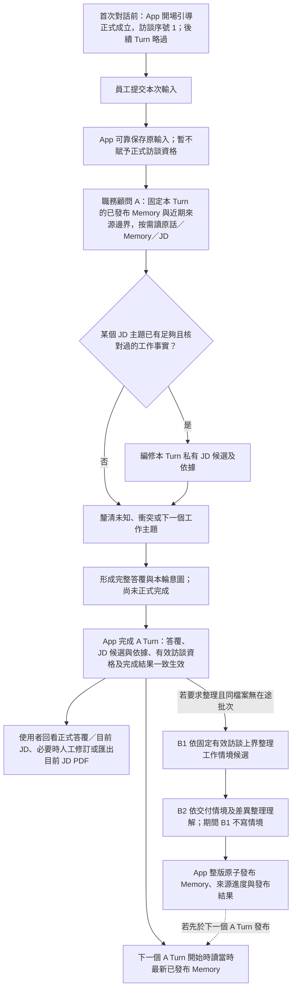
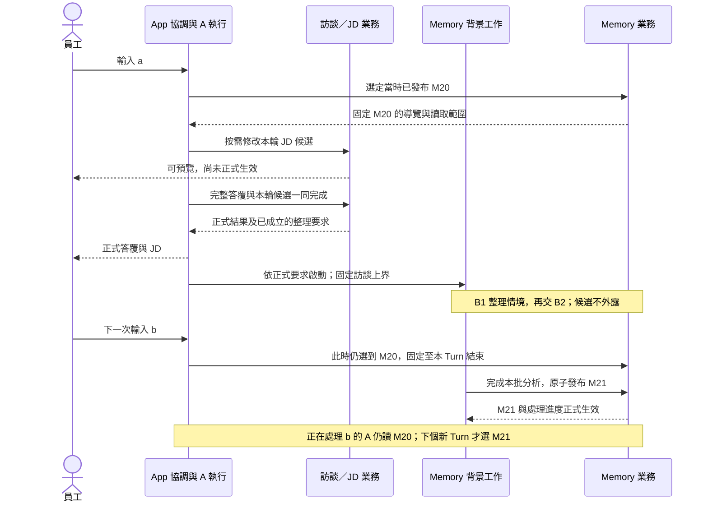

# Caliburn 核心價值閉環與跨層生命週期

員工說明實際工作後，顧問逐步釐清、按需取得證據並編修 JD。App 讓已成立的結果可回看，使尚未完成的候選與正式資料分開；背景 Memory 則整理長期工作依據，供後續訪談使用。

本文串起顧問、Memory、JD 與 App 的跨層時序。產品邊界見[產品概念](../product-concept.md)及[目前決策](../current-decisions.md)，正式產品切換見 [ADR0079](../adr/0079-target-rebuild-production-cutover.md)。下列規範與反例說明預期行為，實際驗證範圍另依各層證據。

## 正常閉環：一則輸入如何變成可交付 JD 的一部分

此圖的 O 只在**首次** 對話前成立一次；App 開場是真實、可回查的訪談第 1 則，不是模型 Turn 或員工工作事實。首輪輸入若取消，O 保留，該輸入不佔後續序號。其餘路徑表示**可選且可並行的業務工作** ，不是每輪都必須改 JD、要求背景整理或匯出；下一個 A Turn **不等待** 背景發布，開始時讀當時最新已發布 Memory，開始後不因背景發布而中途換版。同檔案若已有在途 Memory 批次，新要求在本輪成功後保留其截止點，待前批發布再處理，不混入圖中的在途 B1／B2。A 可直接依本輪已核對輸入形成 JD 候選，無須等 B1／B2 發布；正式引用於本輪完成時綁定有效訪談來源。A 的工具／模型 Step 可保存並恢復，但工具成功、串流片段、候選預覽均不等於整輪完成。完整答覆可靠保存後才可宣告完成；同一份 JD 在 A 執行或暫停期間不開放人工改稿。**圖中匯出位於完成後，只畫一般旅程；處理中仍可匯出，但只取最後已正式完成的 JD，不取畫面上的本輪候選預覽。** 候選成功完成後才改變後續 PDF；取消／失敗則不改變 PDF 的正式內容來源。這項產品邊界見[完成安全點與候選提交](../product-concept.md#保存正式資格與使用者控制)；其餘細節分屬[顧問生命週期](2026-09-26-consultant-context-and-state-design.md)、[Memory 生命週期](2026-09-25-b1-b2-information-gap-lifecycle.md)及[JD 模型工具契約](2026-09-29-jd-model-tool-contract-review.md)。

| 資料／結果 | 正式真相與生效界線 | 下游能否使用 |
|---|---|---|
| App 開場引導與具體問題 | 新職務檔案首次對話前正式成立，訪談序號固定為 1；來源標示 App，原文不可事後改寫 | 可供首輪與日後按序號回讀作前問脈絡；不能冒充員工已確認的工作事實或模型正式答覆 |
| 本輪員工原輸入 | App 可先可靠保存；A Turn **完成** 後才成有效訪談訊息並取得正式序號 | 完成前僅供本次 A 執行，不供後續 A、B1／B2 或 JD 正式引用；取消後仍可供 UI 還原文字，不因此成為訪談來源 |
| 顧問完整答覆與 JD 改動 | A Turn 完成結果與答覆、JD 候選／來源、有效訪談資格一致成立；JD 不變也可完成 | 完成後可回看、編輯目前 JD；中間訊息與串流預覽不是正式答覆 |
| B1／B2 工作稿 | 背景批次內的候選與可恢復進度；B1→B2 交界可恢復，但仍非正式 Memory | 僅在各自授權範圍內交接；A 不讀半成品 |
| 已發布 Memory | 兩層候選、固定引用鏈、來源處理進度與發布結果一致生效 | 下一個 A Turn 讀最新版；執行中的 A Turn 保持原固定版，JD 舊依據仍指向當時來源 |

### 完成與背景啟動之間的交易接縫

一次 A Turn 可要求背景整理，但「模型提出要求」「A 正式完成」「B 批次已啟動」是三個不同事實。既定效果是：取消或未完成時要求不成立；A 成功完成後即使尚未啟動 B，該要求也不能因程序重開消失。若同檔案已有在途 B，只保留後續待處理的有效訪談上界，不將新來源混入在途批次。下表說明中斷後如何核對派送結果。

| 切斷位置 | 必須可核對的結果 |
|---|---|
| A 的正式完成尚未成立 | JD 候選、訪談資格及本輪整理要求均不作正式生效；已確認保存的員工原輸入仍按原保存規則處理。 |
| A 已正式完成，B 尚未開始時程序中斷 | 重開後由已成立的完成結果或同一可靠來源找回整理要求及其固定上界，系統可繼續派送；不要求員工再輸入一次，也不能把「工具已回傳」當作 B 已啟動。 |
| B 已被啟動，但啟動確認或 Graph 進度遺失 | 先核對原批次、固定上界與已發布涵蓋；可重入派送／恢復程式，但不能重複正式發布、漏掉未涵蓋範圍或把後續要求混入原批。 |

保存方式見[資料與交易 §5](../architecture/persistence.md#5-背景整理的持久排程)：整理意圖先保存，A 完成後才取得來源資格；調度從意圖、完成 Turn 與正式訪談推導待處理上界，重掃及承接，不另存 frontier 或外部 queue。**不可** 只在完成提交後以記憶體旗標啟動 B，因為崩潰會留下「A 已完成、整理要求遺失」的空隙。此處不要求跨整段 LLM 工作開啟資料庫交易，也不將 LangGraph checkpoint 視為業務完成或派送真相。業界的[PostgreSQL 原子交易](https://www.postgresql.org/docs/current/tutorial-transactions.html)可處理同一短提交中的一致生效；[AWS 的 transactional outbox 指引](https://docs.aws.amazon.com/prescriptive-guidance/latest/cloud-design-patterns/transactional-outbox.html)說明提交後另行通知的遺失與重複風險，但不表示本機 App 必須照搬 outbox 表。實際接線與證據見[執行設計 §7](../implementation/agent-execution.md#7-memory-背景工作)，本表不代替故障實測。

產品品質的真正終點不是「有一份 JD」或「Memory 已發布」：員工的主要工作與重要差異被問清，JD 以最小高訊號文字涵蓋大部分實際工作，依據可追溯，資訊不足不硬寫。品質判準見[工作分析指南](../guides/2026-09-09-complete-work-analysis-guide.md)；**全稿審核 Agent 目前暫緩** ，不能把目前稿稱為已通過全稿審核。

## 四個會打斷閉環的情境

### 背景發布與下一輪訪談並行的代表時序

**代表時序。** 此例刻意讓下一個 A Turn 先於背景發布開始，用來驗證不等待與同輪固定基準；實線為呼叫／提交，虛線為回傳。參與者是責任，不是獨立服務。

若 M21 先於 b 的新 Turn 綁定完成，b 就選 M21；兩者都合法。不得組出 M20 導覽配 M21 的訪談邊界。恢復 b 也不是新 Turn，仍使用原已綁定版本。Memory 的正式發布不會自動更新 JD 的歷史依據。

| 情境與正式界線 | App／Agent 應承接的真相 | 使用者所見與停止線 |
|---|---|---|
| **使用者取消正在執行的 A Turn。** 先核對完成結果；若已正式完成，不能冒充取消。若未完成，回上一個已完成 Turn 的業務基底。 | 放棄本輪 JD 候選、來源意圖與未生效訪談資格；本輪輸入不進後續 Agent context、B1／B2 來源或正式引用，也不取得正式訪談序號。新提交原文字仍是**新 Turn** 。Turn 前已採用的 Compaction 基底不倒退。 | 顯示簡短取消結果；原文字可還原到輸入框。不能讓被取消的輸入在歷史訪談或 JD 裡悄悄重現。正式 JD、其他已完成 Turn 與已發布 Memory 不倒退。 輪中保險的 C 已含本輪內容，不能作為取消後新輸入的基底。 |
| **背景 Memory 經有界恢復後最終失敗。** 沒有整版發布。 | 保留最新已發布 Memory 與原來源進度，不能把 B1／B2 半套候選當成新版。A 下一次正常工作收到安全的失敗原因與可行下一步，仍可依有效但未整理原話訪談、按需回讀並有據改 JD；超量時走既有訪談讀取能力。解除阻塞後由系統處理，不無限重送或交由使用者手動管理。 | 僅說明「整理尚未完成，訪談可繼續」等非技術狀態；不把舊 Memory 說成已涵蓋新原話，也不因背景失敗一律禁止 A。 |
| **新版 Memory 發布後，某筆 JD 的歷史來源換版；其間人也可能改寫該項。** JD 不參與整版 Memory 發布。 | JD 保留原採用的固定來源；App 分開提供原引用來源→本 Turn 固定新版的差異，以及 A 上次可見正式 JD→目前正式 JD 的人工差異，不合成一條。A 以**新版** 來源與目前 JD 判斷，按需讀相關正文及原話；不能因人工改寫就自動換引用或解除待核對。可改稿、明確核對後保留，或追問；僅看過 diff 不算已核對，不要求一輪解決全部。 | 使用者仍看到目前 JD 及待核對狀態；「待核對」不等於內容已錯。舊版對人的歷史回查承諾不等於給 A 任意讀舊 Memory 全鏈的工具。 |
| **App 中斷或重開。** 先區分原操作是否已完成，不能以畫面沒收到結果推定未提交。 | 未完成 A Turn 先從已可靠保存的模型／工具結果或 Step 位置在**同一 Turn** 接續，保留原輸入與固定 Memory 基準；已提交的 JD 效果及工具結果核對原操作，不重複生效。若確認無法接續並放棄本輪，回上一個完成 Turn；若答覆其實已正式保存，重新提供同一份。B1／B2 從可靠批次位置接續，或放棄未發布候選回背景起點；已發布結果不倒退。 | 不把重算冒充舊推論，不讓不可恢復的未完成輸入變成有效訪談。取消與最終失敗雖可回到同一業務基底，畫面、原文取回與後續重試權限不同；不自動替使用者重送已放棄輸入。 |

這四種情境的保存與恢復保證見[產品概念 021–027](../product-concept.md)及[顧問恢復需求](2026-09-26-consultant-context-and-state-design.md)。各層完成度與已知限制見[架構導覽](../target-architecture-map.md)及相應實測，不由此圖推定。

## 相關設計與證據邊界

- Memory 依序發布、後續待處理上界與可重掃派送由[資料與交易](../architecture/persistence.md)承接；不可把已讀但未發布當已處理，也不可擴張在途來源。
- Step／批次 checkpoint、候選參照、控制競爭、原操作結果及有界恢復由[共用執行](2026-09-27-shared-agent-execution-and-state-design.md)承接；表、節點與持久執行的效果仍需實測證據。
- JD 兩類差異的模型分支、比較基底與 Markdown 效果由[JD 工具契約 §4.3](2026-09-29-jd-model-tool-contract-review.md#43-兩類差異的按需入口)承接；wire、容量與實際可讀性是不同的證據層級，契約完整不代表品質通過。
- 背景阻塞解除與共同預算沿共用執行，使用者呈現沿[互動運作](../architecture/delivery-and-operations.md)；近期歷史超量例外沿[A context](2026-09-26-consultant-context-and-state-design.md)。已實作不等於已驗收；現行 Memory 另三個完成 Turn 後解除阻塞的數值仍待產品確認，量化配置不得冒稱已定規則。

## 代表旅程與驗證層級

同一份職務檔案的 **正常完成、取消／重試、B 最終失敗、Memory 發布後 JD 待核對、程序中斷／重開** 五條旅程，呈現不同的正式來源資格、可見結果、原操作效果與版本邊界。領域與真 PostgreSQL 測試只能證明資料及交易；原生模型接續、實際訪談品質和瀏覽器 UI 仍各需自身證據。規範與反例不能代替實測結果。
