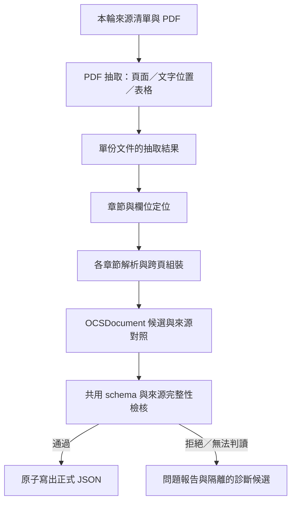

# 公版 OCS PDF → JSON：資料保真、解析責任與驗收設計

- 日期：2026-10-03；最後核對：2026-10-04。
- 狀態：使用者已授權轉換／補齊；核心修正已實作，本輪批次與驗證見[補齊紀錄](../experiments/2026-10-04-ocs-json-repair/README.md)。未支援版型及官方最新狀態仍有界限。
- 決策者：產品負責人；維護者：本元件的實作者。
- 範圍：獨立 RAG 的第一個元件 `apps/pdf-to-json`，以及必要的 `packages/ocs-contract` 修正與消費相容驗證。
- 有效邊界：[ADR0079](../adr/0079-target-rebuild-production-cutover.md)、[RAG 隔離設計](2026-08-11-rag-bounded-context-retention-design.md)。現行 CLI 與欄位語意仍見 [App README](../../apps/pdf-to-json/README.md)。
- 本輪同意的使用者效果：先逐元件完成；公版 PDF 的格式不一致時仍須忠實轉出內容，或明確指出無法處理的位置；歷史版本降低優先度。

## 1. 元件目的與完成條件

把納入範圍的 OCS／iCAP 公版 PDF 轉成可供後續檢索使用的結構化資料。文字、原始代碼、級別及任務與指標／產出／知識／技能的關係，均須可回查到原 PDF。來源不存在的資料保持缺省；來源存在但解析遺失的資料，必須觸發診斷。

本元件完成須同時具備：

1. 已列明來源清單及支援版型，現行／歷史／是否已核對最新狀態可分辨。
2. 代表樣本有經原文核對的正確預期值；直接缺漏與錯置反例可被測試抓到。
3. 抽取結果由解析層共用，章節解讀不重新開啟 PDF；不同欄位排列與跨頁接續有明確依據。
4. 輸出檢核能拒絕已知缺漏、未歸屬的內容及抽取／解析例外；問題文件可定位到來源。
5. 本輪清單中的文件均有通過、需修正或排除結果；正式輸出只包含通過文件。

整批自動檢核通過不等於每份文件已逐頁人工核對。驗收紀錄須分別列出自動檢核範圍與人工核對樣本。

## 2. 修正前已查證的現況與反例

現行程式已有五個 section extractor，保留這些責任縫。2026-06-28 的[搬移式拆解研究](../research/retrieval/2026-06-28-pdf-to-json-transformer-decomposition-research.md)以行為不變為目標；本次針對資料正確性修正，不能把原快照視為正確答案。

| 證據 | 查證結果 | 影響 |
|---|---|---|
| 現有 App 測試 | 在 App 目錄以 `.venv/Scripts/python.exe -m pytest -q --no-cov` 執行，23 passed；真 PDF 快照只有三份 | 既有測試不能證明資料保真 |
| `3D列印設備配修人員-職能基準.pdf` 第 5 頁 | 原文「3D列印技術」輸出成「D列印技術」 | `notes_extractor` 的項目符號正則把起始數字當作符號刪除 |
| `3D珠寶設計人員-職能基準.pdf` 第 4 頁 | 註 2 的末行「流程。」成為另一個 supplements 元素；註 4 也被斷開 | 一個 PDF 換行被誤當成一個條目 |
| `機械設計工程師-職能基準.pdf` 第 4 頁，T3.2 | 原文級別 6，輸出為 3 | `extract_task_level` 只接受 1–5，其他值改為 3；共用 schema 也限制最大 5 |
| 同一份機械設計 PDF 的態度區塊 | 原文是一段沒有 A-code 的文字，輸出 attitudes 為空 | 全文逐行只收 A-code 的策略會漏掉合法文字區塊 |
| 同一份機械設計 PDF 的說明區塊 | DFX 補充文字進入 prerequisites | 沒有子標題時，現行程式預設把內容當任職條件 |
| 空內容模型 | `OCSDocument(ocs_profile={"ocs_code": "TEST1234"})` 通過 `OCSSchemaValidator.validate` | 只迭代既有項目，不能抓出整區遺失 |
| 現行資料流 | CLI 先呼叫 parser；transformer 只用 `file_path` 重新開檔，忽略已抽取的 pages | 抽取與解讀的介面名義上存在，實際仍耦合 PDF I/O |
| section 的例外處理 | 多處 `except Exception` 轉 warning 並返回空值／部分值 | 無法可靠區分來源缺省與程式失敗 |

已核對 PDF 的 SHA-256：

| 文件 | SHA-256 |
|---|---|
| 3D列印設備配修人員-職能基準.pdf | `1adc394e15dd7d6d1402ed216e9e9e78b0af0428c3d3bcff3fa92a7370c86639` |
| 3D珠寶設計人員-職能基準.pdf | `61756c11f6b25410f1d031bd349485482275b732881f4fcc7bbacb6300f5b883` |
| 機械設計工程師-職能基準.pdf | `b2cac61809cadce6cacba698a00821409c1cdbd160622448068acef09d0d21a6` |

這三份原件皆位於 `apps/pdf-to-json/data/pdfs/`。已視檢配修人員第 5 頁、機械設計第 4 頁及珠寶設計第 4 頁；原件圖、SHA-256、檢查點與抽取輸出保留於[工具比較實驗](../experiments/2026-10-03-ocs-pdf-parser-comparison/README.md)。這些片段可建立正式預期值，但不把片段核對宣稱為整份文件已驗收。

本機盤點有 908 份 PDF：40 份檔名標有「歷史資料」，另外 868 份沒有。這只證明檔名分布，不能宣稱 868 份全部仍為官方最新版。既有 908 份 JSON 的粗查另有 129 份 versions 為空、3 份 attitudes 為空；這些是待判讀現象，不直接算作解析失敗率。

## 3. 來源範圍與版本身分

來源選擇與 PDF 解析分工：來源清單裁決本輪要處理哪個檔案，解析器只解讀指定檔案，不能憑檔名或最高版本字串判定官方現行狀態。

清單每列至少包含相對路徑、SHA-256、已知文件代碼／版本、納入與否及理由、官方現行狀態的核對依據。沒有來源網址、下載日期或官方狀態時保留未知，不補造資料。外部核對依據記查證日期；查證結果綁定檔案雜湊，避免換檔後沿用舊判定。

- 首版主驗收清單優先納入已確認有效的公版與其實際版型。
- 檔名標示歷史的文件先列為排除；必要時可明示納入作回歸反例，不要求全面相容歷史格式。
- 尚未確認現行狀態的文件可用於解析診斷，但不能僅因成功轉換就宣稱是現行參考資料。
- 同一職能名稱不等於同一文件身分；按文件代碼及版本判斷，不把不同級別文件互相去重。

清單是本輪批次的輸入與證據，不另建資料庫或自動同步服務。官方目錄更新與定期抓取屬後續來源維護工作；本元件須能消費核對後的清單。

## 4. 目標資料流與責任

以下核心資料流已實作；方框表示本機函式與模組責任，不表示新增服務。來源清單目前固定檔名與雜湊；官方版本身分核對尚未實作。

### 4.1 PDF 抽取

`parsers` 是唯一 pdfplumber I/O 邊界。一次開啟單份 PDF，抽取並保存每頁文字、文字位置、表格矩陣、表格／儲存格位置、頁面尺寸及頁碼。章節或欄位復原實際需要的 words 資訊也在此取得。抽取完成後關閉 PDF；批次逐文件處理，不把整批內容常駐記憶體。

內部使用小型、具名的 typed 結構，例如文件、頁面、表格、文字位置。這些是解析工作資料，不是新公開 OCS 契約，不模擬 pdfplumber Page 的方法，也不引入泛用文件引擎。

保留原抽取文字；表頭比對用的正規化與輸出正文分開。可以依原位置移除頁眉、頁腳與版面換行；數字、標點及英文詞間的有效空格不得一律刪除。PDF 沒有可用文字層或表格抽取失敗時，回報頁碼及原因。

### 4.2 章節與版型

既有 version／profile／content／attitude／notes 模組繼續各自擁有欄位解讀。可共同使用已定位的區段、表頭／列資料與文字拼接機制，但不把所有章節的解析規則搬進 orchestrator。

content 定位使用來源頁碼、表格及儲存格座標；態度與說明目前使用有界的文字章節。每個 content 表格依自己的表頭建立欄位 mapping；跨頁重複表頭重新核對 mapping，再把語意欄位送入組裝。無表頭的續表使用前表欄位位置且須能唯一歸屬；未知儲存格拒絕。

不同版型使用可命名、可測的判定條件。先使用表頭別名、分裂表頭合併及儲存格位置；只有代表反例證明規則有實質差異，才增加具體分支。未符合條件的區段回報 unsupported，而不是反覆切換參數直到有輸出。

### 4.3 各章節的資料保真

- **版本與 profile：**來源未提供版本表，versions 可以是空陣列；已辨識到版本表卻未解析出資料則拒絕。profile 級別不存在時為 `null`，不預設 3。不把職類、職業或行業欄位互相借值補齊。
- **任務與 competency blocks：**依既有 [README §6.3](../../apps/pdf-to-json/README.md#63-ocs_content) 的分界語意處理，同格多 T-code、不同 O／level 與 K／S 的關係有原文預期值。跨頁的空 task cell 只能延續已建立且可對應的前一任務；無可對應前項時拒絕該區段。
- **級別：**原文 1–6 原樣保存；明確空白／來源沒有級別為 `null`。延續列的空白級別不代表級別改變，已有 block 繼續保留其來源值。明確值超出 1–6 或無法辨識時報錯，不改成另一個級別。
- **態度：**只讀態度區段，保留 A-code 與完整名稱／說明、跨行及跨頁延續。沒有代碼但有正文時，以既有 `CodeName` 的 `code=null` 保留原段落，不生成 A-code；驗證要求正文非空，而非要求每筆均有代碼。
- **補充說明：**依子標題區分 prerequisites 與 supplements；子標題未出現時，說明區正文歸 supplements。項目符號／明確編號只在有標記依據時移除，「3D」等正文數字保留。換行不自動產生新條目；續行接回同一條，跨頁重複標題與頁腳不進正文。
- **其他補充欄位：**「相關所屬類別」屬說明內容，須按標題與可辨識欄位保留，不能當成任職條件。source 中尚有無法歸屬的文字時列入問題報告，不默默丟棄。

### 4.4 編排與來源對照

`OCSTransformer` 只接收已抽取資料，依序呼叫各章節並組成 OCS 候選；內部 callers、CLI、fixture scripts 與測試一併調整，去掉以 `file_path` 重新開檔的接線。

檢核使用「來源頁／表格／列 → 任務與 block 欄位」的內部對照，不寫入 OCS 額外 authority 欄位。態度及說明核對章節正文；尚未持久化每個字元的座標對照。重複表頭、頁腳與真正重複資料按已測規則處理；去重不得消除不同任務對同一 K／S 的關係。

## 5. 契約與檢核

### 5.1 唯一格式來源

`packages/ocs-contract/schema/ocs-document.schema.json` 繼續是 OCS 結構的唯一來源。把 `OcsProfile.ocs_level` 與 `CompetencyBlock.competency_level` 的最大值改為 6，再生成 Python 與 TypeScript；不手改生成檔。欄位名稱與五大區塊結構沿用既有契約。

無代碼態度已能由 nullable `CodeName.code` 表示，不新增另一份態度 schema。若下游另有較嚴假設，先以消費相容測試找出並調整該假設，不以生成虛構代碼規避它。

### 5.2 檢核責任

沿用現有 validator 的責任位置，讓三類結果可區分：

| 檢核 | 負責規則 | 直接反例 |
|---|---|---|
| 格式 | 共用 schema／生成模型驗型別與合法值；避免手寫第二套同等 schema | 原文 6 必須合法；7 不得轉成 3 |
| OCS 關係 | 任務條目、block、指標與來源已確認的分界／歸屬一致 | P／K／S 掛到錯的 task；空 block；無可對應的延續列 |
| 來源涵蓋 | 已辨識區段及項目有輸出對照，或有合法排除依據 | 全區空白；已知 task／指標漏掉；補充續行未被使用 |

來源涵蓋按章節與來源位置核對，不能掃整份 PDF 的字串集合就宣稱完整。代碼可能重複、出現在說明或由多個任務共用；除代碼之外，需用對應的文字、位置與任務關係驗證。自動對照仍不能獨立保證 PDF 抽取未漏字，真 PDF 人工核對樣本是必要驗收。

來源本來沒有的 optional 區段可保持空值，並記錄未出現。已有區段標題／內容訊號卻無輸出、遇到不支援表頭、有未歸屬正文，或抽取與 section 發生例外，均為阻擋正式輸出的問題。

`--no-validate` 保留為舊 CLI 相容參數，生成模型、必要內容及來源檢核始終執行；不允許缺漏或 unsupported 區段變成成功。獨立 `validate` 命令只能檢查 JSON 結構與其中的關係；沒有 PDF 的命令不得宣稱已驗來源完整性。

## 6. 正常與失敗生命週期

### 6.1 單檔

1. 讀指定 PDF，固定其雜湊；不能在抽取途中換檔而沿用舊來源判定。
2. 抽取頁面資料與定位，解析各章節，建立候選及來源對照。
3. 完成必要檢核。
4. 成功時在目標目錄寫暫存檔，再原子替換正式 JSON；成功以實際完成寫入為準。
5. 失敗時 exit 1，記錄問題報告；有可檢視候選時放在與正式輸出分開的 rejected 目錄。沒有候選也照樣保留報告，不補造空 OCS 文件。

失敗不可覆寫既有正式 JSON。報告須明示此次來源雜湊、目標檔案與失敗狀態，避免操作者把原本舊結果當成此次成功輸出。中途寫檔失敗／程序中斷時，正式檔案要麼保持舊值，要麼是完整新值，不得留下截斷 JSON。

### 6.2 批次

按固定的本輪清單逐檔執行；單檔失敗不阻止其他檔案完成，但整批結果有失敗時 exit 1。每份來源恰有一個結果：converted、rejected 或 excluded，數量可與清單對帳；有檢核失敗的文件不能同時計入成功數。

整批重建寫到新的輸出目錄，只有本輪通過結果放在正式 JSON 子目錄。報告／rejected 候選放到相鄰診斷子目錄，避免下游掃描 JSON 資料目錄時誤讀。首版不自動覆寫現有 `apps/ocs-indexer/data/jd-json`，原 corpus 保留為前後比較依據。

重跑以明示輸入清單與輸出位置執行。正式 JSON 的內容須穩定；查證時間、執行耗時及診斷順序等執行資訊放報告，不滲入資料正文。

### 6.3 診斷與錯誤

目前報告包含來源檔案／雜湊、階段及例外型別／原因；content 檢核與 mapping 錯誤包含頁碼、表格、列或 cell 位置，section 問題標明章節。更細的固定原因代碼及所有例外的位置仍待補充；不用 confidence score 取代結果。

低層例外可附原因鏈；不能 `except Exception` 後返回空清單冒充來源缺省。批次最外層可攔截不可預期例外並記單檔失敗，保留後續工作。歷史 PDF parser 的有界回退只有已納入測試且判定條件明確時啟用。

## 7. 技術取捨與官方依據

| 方案 | 能達成的效果與代價 | 本輪判定 |
|---|---|---|
| 既有 pdfplumber＋明確章節／表頭解讀＋來源檢核 | 十份／55 頁比較中，20 個任務關係、8 個正文片段與3 個續文 cell 全通過；3.36 秒／RSS 69.9 MiB。部分表格有空白子欄，仍須按表頭與幾何核對 mapping | 本輪保留。先修正文／關係保真，並整理單次抽取資料流；不宣稱全部 corpus 已驗收 |
| Camelot 2.0.0 lattice | 同批任務關係 20/20、續文 cell 3/3；9.82 秒／257.0 MiB。只做表格抽取，補充換行有項目符號插入；auto 會把任務拆成逐行資料 | 候選診斷工具。有具體表格反例時再考慮採用，不先增加每份都跑雙工具的流程 |
| Docling 2.133.0 standard／accurate／CPU／OCR off | 同批任務關係 18/20，正文 8/8、續文 cell 3/3；142.38 秒／1777.4 MiB。部分七欄表頭與 span 較乾淨，但有任務列拆散、K17 跨任務錯置 | 本輪不替換。GPU／OCR／其他參數未測，這不是通用工具品質排名 |
| 由 LLM／視覺模型直接產 OCS JSON | 可作未支援版型的研究方向；本案的保真、錯誤偵測、成本與外送尚未驗證 | 首版不採用；不以未測假設取代已能有限修正的原因 |

官方事實與本案取捨分開：

- **官方事實：**[iCAP 職能介紹](https://icap.wda.gov.tw/ap/knowledge_introduction.php)說明職能級別共六級，並區分職能基準級別與工作任務／行為指標的能力級別。這直接支持本案修正 1–5 的限制，不必猜測原文 6 是輸入錯誤。
- **官方事實：**[pdfplumber 官方文件](https://github.com/jsvine/pdfplumber)提供 `find_tables` 的 table／cell／bbox、文字及 words 位置、table settings 與視覺除錯能力；文件也說明較適合有文字層的 PDF。官方沒有保證所有 PDF 格式均能完整還原。
- **實測證據：**2026-10-03 至 10-04 的[解析工具比較](../experiments/2026-10-03-ocs-pdf-parser-comparison/report.md)固定十份原件及 SHA-256，視檢十三頁，保存四個 arm 的抽取與逐文件結果。耗時只測一輪、含 Docling 第一次 model load，不含套件／模型下載；Camelot 只測 auto／lattice。
- **Caliburn 取捨：**利用上述既有能力保存來源位置與區段，在 OCS 解析與檢核層處理本案關係。基準 pdfplumber 0.11.9 已保留核對片段；替換工具未減少本案已知 section／契約／輸出檢核責任。
- **尚未驗證：**整份 corpus 的官方最新狀態、逐頁逐字完整性、單次抽取重構後的效能基準、掃描／無框線文件、所有英文斷行、GPU／OCR／VLM／LLM 與各工具最佳調參品質。英文詞間空格已有有限反例測試。

## 8. 驗收與切片順序

此處保留驗收安排與依賴，不是另一次施工授權。使用者已在本輪明示開始轉換或補齊；實際命令、反例、批次清單及剩餘問題記於[補齊紀錄](../experiments/2026-10-04-ocs-json-repair/README.md)，不倒填施工前計畫。

| 順序 | 元件內的效果 | 必驗反例／證據 |
|---|---|---|
| 1 | 補充說明保真及空內容拒絕，建立原文預期值 | 3D 數字、單條補充換行、整區空內容、來源真的沒有 optional 版本表 |
| 2 | 共用級別契約及態度忠實表示 | 1／6／null／7；空白延續不改級別；無 A-code 的態度不丟失；下游能載入 |
| 3 | 一次抽取與 typed 輸入，移除重開檔接線 | 解析結果可在 PDF 關閉後使用；每份只開一次；頁碼／表格位置可回查；既有與新真 PDF 預期值不變 |
| 4 | content 每表 mapping、跨頁和來源涵蓋 | 欄序變動、分裂／重複表頭、合併儲存格、無法對應的續列、錯掛 P／K／S、新 O／level block 分界 |
| 5 | 成功／失敗輸出與批次對帳 | 混合成功／失敗清單；失敗不計成功；原正式檔保持；寫入中斷不截斷；診斷不混入正式 JSON |
| 6 | 本輪清單完整跑完並保留差異與品質結果 | 每檔有結果；新舊變動按原文查證；人工核對代表樣本與保留樣本；排除／未支援文件有明確原因 |

每個行為先寫失敗測試並確認 Red，再修正、回歸與必要重構。測試分為純章節／表格行為、真 PDF 端到端、CLI 輸出生命週期及契約消費相容；名稱與斷言針對使用者效果，不只測實作呼叫次數。

正式預期值與純 characterization 快照用途分開；修改 golden 必須對照原 PDF 解釋原因，不能一鍵重生後當作驗收。被用來調整規則的樣本與保留樣本分列，整批品質驗證另記涵蓋與未驗範圍。

## 9. 影響範圍、文件接續與限制

- 內部接線：`apps/pdf-to-json` 的 parser／transformer／section／validator／writer、CLI、fixture generator 與對應測試。
- 共用格式：OCS schema 與生成物的級別上限；`apps/ocs-indexer` 的載入相容測試只驗證可接收新輸出，不啟動 embedding 或重建向量庫。
- 操作契約：CLI 正式／診斷輸出分配、批次結果及 `--no-validate` 範圍已同步 App README。
- 文件權責：本文件維護目標；現況仍以程式與 App README 為準。源資料欄位語意只在 [App README §6](../../apps/pdf-to-json/README.md#6-field-contract) 維護，結構只在共用 schema 維護；施工後本文件保留取捨與驗收連結。
- 生成檢查：共用契約 README 已指出現行 `check-codegen` 可能覆寫 dirty 生成檔。施工用正式 codegen 再審 diff，驗證需暫存生成後比較，不能用回退 tracked 檔案的腳本抹去本輪修改。
- 相鄰範圍：來源定期更新、向量索引／embedding 選型、JD App 的外部參考接線與歷史資料全面相容，分別在後續元件討論，不由本設計批准。

本輪修改 PDF → JSON 元件、級別契約及無代碼態度的消費相容行為；原有 908 份 JSON 保留，新結果另存。所有來源均記錄本輪結果；未支援文件不進新輸出。沒有付費模型呼叫、向量庫重建或 JD App 接線；全批與測試通過均不能冒充所有版型或逐字內容已人工驗收。
